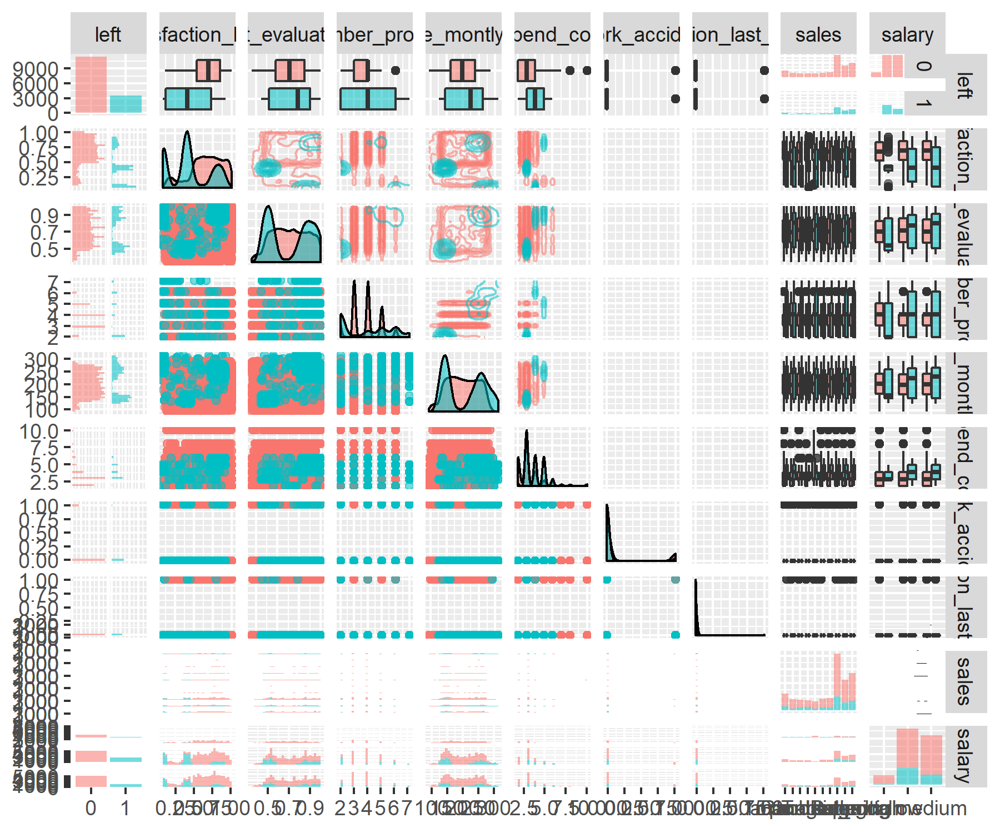
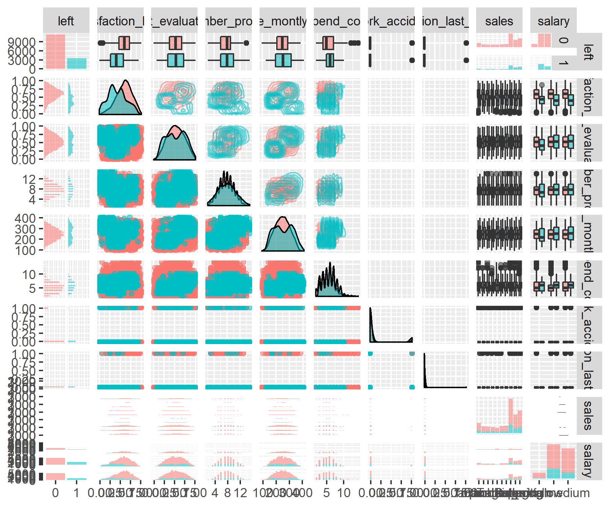

```{r setup, include=FALSE}
knitr::opts_knit$set(progress = TRUE, 
                     verbose  = TRUE, 
                     root.dir = ".")

knitr::opts_chunk$set(collapse = FALSE, 
                      comment = "", 
                      message = TRUE, 
                      warning = FALSE, 
                      include = TRUE,
                      echo    = TRUE)

set.seed(1)
```

```{r install.requirements, eval = FALSE}
install.packages("tidyverse",   dependencies = TRUE)
install.packages("table1",      dependencies = TRUE)
install.packages("GGally",      dependencies = TRUE)

```

```{r require.packages, message=FALSE}
require(tidyverse)
require(magrittr)
require(data.table)
require(table1)
require(MASS)
require(GGally)

```

# Purpose

Make dataset noisy according to: https://medium.com/applied-data-science/new-r-package-the-xgboost-explainer-51dd7d1aa211

## Description

according to `help(breakDown::HR_data)`, 

A dataset from Kaggle competition Human Resources Analytics: Why are our best and most experienced employees leaving prematurely?

* `satisfaction_level` Level of satisfaction (0-1)
* `last_evaluation` Time since last performance evaluation (in Years)
* `number_project` Number of projects completed while at work
* `average_montly_hours` Average monthly hours at workplace
* `time_spend_company` Number of years spent in the company
* `Work_accident` Whether the employee had a workplace accident
* `left` Whether the employee left the workplace or not (1 or 0) Factor
* `promotion_last_5years` Whether the employee was promoted in the last five years
* `sales` Department in which they work for
* `salary` Relative level of salary (high)

## Source

Original dataset HR-analytics is from https://www.kaggle.com

Source data in this sample is from : https://github.com/ryankarlos/Human-Resource-Analytics-Kaggle-Dataset/tree/master/Original_Kaggle_Dataset

```{r}
full = fread('./input/HR_comma_sep.csv', stringsAsFactors = T)
full <- full %>%
  mutate(left = factor(left)) %>% 
  dplyr::select(left, everything()) %>% 
  as.data.table()
full %>% str
```

```{r, eval=FALSE}
ggpair.before <- GGally::ggpairs(full, 
                                 aes(color = left, point_alpha = 0.3, alpha = 0.5),
                                 upper = list(continuous = "density"),
                                 progress = FALSE)

ggsave(ggpair.before, filename = "./output/image.files/000_ggpair_before.png", width = 6, height = 5)
```



```{r}
table1(~ left +
         satisfaction_level + last_evaluation + number_project + 
         average_montly_hours + time_spend_company + 
         Work_accident + promotion_last_5years 
       | left, data = full)

```

```{r}
table1(~ factor(sales) + factor(salary)
       | left, data = full)

```


 # add Random Noise (to continuous feature)
 
```{r}

tmp_std = sd(full[,satisfaction_level])
full[,satisfaction_level:=satisfaction_level + runif(.N,-tmp_std,tmp_std)]
full[,satisfaction_level:=satisfaction_level - min(satisfaction_level)]
full[,satisfaction_level:=satisfaction_level / max(satisfaction_level)]
full[,satisfaction_level:=round(satisfaction_level, digits = 4)]

tmp_std = sd(full[,last_evaluation])
full[,last_evaluation:=last_evaluation + runif(.N,-tmp_std,tmp_std) ]
full[,last_evaluation:=last_evaluation - min(last_evaluation)]
full[,last_evaluation:=last_evaluation / max(last_evaluation)]
full[,last_evaluation:=round(last_evaluation, digits = 4)]

tmp_min = min(full[,number_project])
tmp_std = sd(full[,number_project])
full[,number_project:=number_project + sample(-ceiling(tmp_std):ceiling(tmp_std),.N, replace=T)]
full[,number_project:=number_project - min(number_project) + tmp_min]

tmp_min = min(full[,average_montly_hours])
tmp_std = sd(full[,average_montly_hours])
full[,average_montly_hours:=average_montly_hours + sample(-ceiling(tmp_std):ceiling(tmp_std),.N, replace=T)]
full[,average_montly_hours:=average_montly_hours - min(average_montly_hours) + tmp_min]

tmp_min = min(full[,time_spend_company])
tmp_std = sd(full[,time_spend_company])
full[,time_spend_company:=time_spend_company + sample(-ceiling(tmp_std):ceiling(tmp_std),.N, replace=T)]
full[,time_spend_company:=time_spend_company - min(time_spend_company) + tmp_min]

tmp_min = min(full[,number_project])
tmp_std = sd(full[,number_project])
full[,number_project:=number_project + sample(-ceiling(tmp_std):ceiling(tmp_std),.N, replace=T)]
full[,number_project:=number_project - min(number_project) + tmp_min]

```

```{r}
table1(~ left +
         satisfaction_level + last_evaluation + number_project + 
         average_montly_hours + time_spend_company + 
         Work_accident + promotion_last_5years 
       | left, data = full)
```


```{r, eval=FALSE}
ggpair.after <- GGally::ggpairs(full, aes(color = left, point_alpha = 0.3, alpha = 0.5),
                                 upper = list(continuous = "density"),
                                 progress = FALSE)

ggsave(ggpair.after, filename = "./output/image.files/000_ggpair_after.png", width = 6, height = 5)
```



# Shuffle rows

```{r}
full = full[sample(.N)]
full
```


# Save data and model

```{r save.object}
write.csv(full, "./input/HR_shuffle_and_noise.csv", row.names = FALSE)

```


