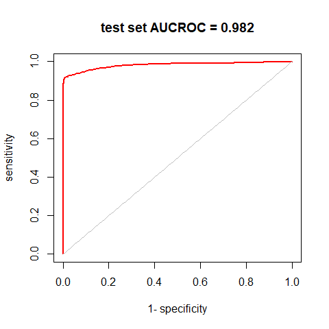
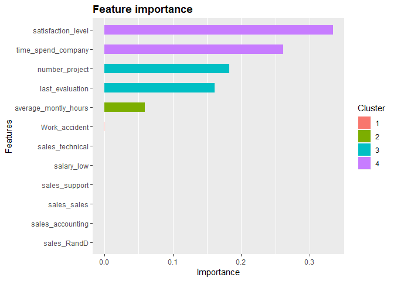
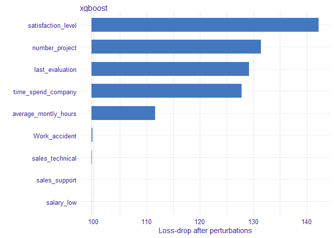

```r
install.packages("DALEX",   dependencies = TRUE)
install.packages("Ckmeans.1d.dp", dependencies = TRUE)
```


```r
require(tidyverse)
require(xgboost)
require(AUC)
require(caret)
require(DALEX)
```

# Preparation (continued)


```r
loaded.obs  <- readRDS("./middle/data_and_model.Rds")

model.xgb   <- loaded.obs$model$xgb 

train.label <- loaded.obs$data$train$label
train.matrix <- loaded.obs$data$train$matrix
train.xgb.DMatrix <- xgb.DMatrix("./middle/train.xgbDMatrix")
```

```
[23:36:01] 4999x18 matrix with 89982 entries loaded from ./middle/train.xgbDMatrix
```

```r
test.label  <- loaded.obs$data$test$label
test.matrix <- loaded.obs$data$test$matrix
test.xgb.DMatrix  <- xgb.DMatrix("./middle/test.xgbDMatrix")
```

```
[23:36:01] 10000x18 matrix with 180000 entries loaded from ./middle/test.xgbDMatrix
```

# Predictive performances with test set.


```r
test.pred <- predict(model.xgb, test.xgb.DMatrix)
table(prediction = ifelse(test.pred > 0.5, 1, 0), 
      truth      = test.label) %>% 
  caret::confusionMatrix()
```

```
Confusion Matrix and Statistics

          truth
prediction    0    1
         0 7551  197
         1   76 2176
                                          
               Accuracy : 0.9727          
                 95% CI : (0.9693, 0.9758)
    No Information Rate : 0.7627          
    P-Value [Acc > NIR] : < 2.2e-16       
                                          
                  Kappa : 0.9232          
                                          
 Mcnemar's Test P-Value : 3.794e-13       
                                          
            Sensitivity : 0.9900          
            Specificity : 0.9170          
         Pos Pred Value : 0.9746          
         Neg Pred Value : 0.9663          
             Prevalence : 0.7627          
         Detection Rate : 0.7551          
   Detection Prevalence : 0.7748          
      Balanced Accuracy : 0.9535          
                                          
       'Positive' Class : 0               
                                          
```

```r
test.roc  <- roc(predictions = test.pred, 
                 labels      = as.factor(test.label))
plot(test.roc, col = "red", lwd = 2,
     main = sprintf("test set AUCROC = %.03f", auc(test.roc)))
```

<!-- -->

# feature importance

## based on xgboost structure

The ggplot-backend method also performs 1-D custering of the importance values, with bar colors coresponding to different clusters that have somewhat similar importance values.


```r
var.imp <- xgb.importance(model = model.xgb,
                          feature_names = dimnames(train.xgb.DMatrix)[[2]])

var.imp %>% mutate_if(is.numeric, round, digits = 4)
```

```
                Feature   Gain  Cover Frequency
1    satisfaction_level 0.3343 0.2370    0.1600
2    time_spend_company 0.2611 0.2832    0.2629
3        number_project 0.1826 0.2016    0.1086
4       last_evaluation 0.1610 0.1222    0.1943
5  average_montly_hours 0.0593 0.1297    0.1771
6         Work_accident 0.0008 0.0069    0.0171
7       sales_technical 0.0003 0.0092    0.0286
8            salary_low 0.0002 0.0030    0.0171
9         sales_support 0.0002 0.0021    0.0114
10          sales_sales 0.0001 0.0006    0.0114
11     sales_accounting 0.0001 0.0022    0.0057
12          sales_RandD 0.0000 0.0024    0.0057
```

```r
xgb.ggplot.importance(var.imp)
```

<!-- -->

## based on permutation 


```r
explainer.xgb <- DALEX::explain(model.xgb, 
                                data  = test.matrix, 
                                y     = test.label, 
                                label = "xgboost")

vd.xgb <- variable_importance(explainer.xgb, type = "raw")
plot(vd.xgb)
```

<!-- -->


