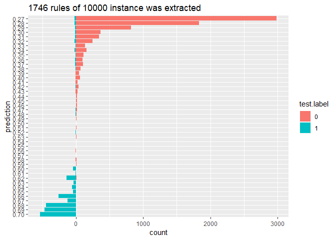
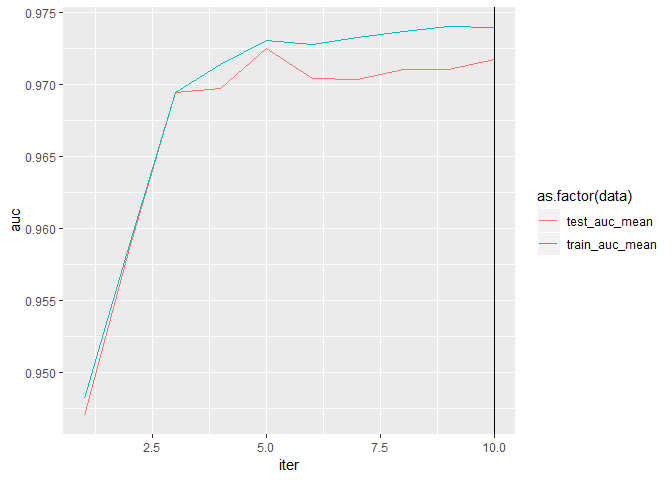
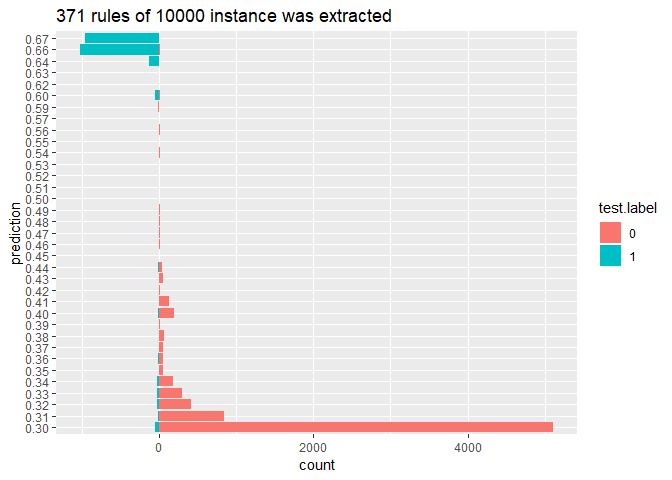

```r
install.packages("devtools", dependencies = TRUE)
devtools::install_github("AppliedDataSciencePartners/xgboostExplainer")

install.packages("ggridges", dependencies = TRUE)
```


```r
require(tidyverse)
require(magrittr)
require(data.table)
require(xgboost)
require(xgboostExplainer)
require(ggridges)
```

# Preparation 


```r
loaded.obs  <- readRDS("./middle/data_and_model.Rds")

model.xgb   <- loaded.obs$model$xgb 

train.label <- loaded.obs$data$train$label
train.matrix <- loaded.obs$data$train$matrix
train.xgb.DMatrix <- xgb.DMatrix("./middle/train.xgbDMatrix")
```

```
[19:08:14] 4999x18 matrix with 89982 entries loaded from ./middle/train.xgbDMatrix
```

```r
test.label  <- loaded.obs$data$test$label
test.matrix <- loaded.obs$data$test$matrix
test.xgb.DMatrix  <- xgb.DMatrix("./middle/test.xgbDMatrix")
```

```
[19:08:14] 10000x18 matrix with 180000 entries loaded from ./middle/test.xgbDMatrix
```

# Preditive result of All

In this case, eval_metrics were high enough, therefore, we use test data for following evaluation


```r
test.pred <- predict(model.xgb, test.xgb.DMatrix)

prediction.counts <- table(test.pred, test.label) %>% 
  data.frame %>%
  mutate(
    predict = substr(test.pred, start = 1, stop = 4),
    count   = ifelse(test.label == "0", Freq, -Freq)) 

prediction.counts %>% 
  ggplot(aes(x =  reorder(predict, -as.numeric(predict)),
             y = count, 
             fill = test.label)) +
  geom_bar(stat="identity") +
  coord_flip() +
  labs(x = "prediction") +
  ggtitle(sprintf("%i rules of %i instance was extracted", 
                  NROW(prediction.counts), NROW(test.pred)))
```

<!-- -->

# Feature pruning

Target features are filterd using `xgb.importance()`


```r
var.imp <- xgb.importance(model = model.xgb,
                          feature_names = dimnames(train.xgb.DMatrix)[[2]])

var.imp %>% mutate_if(is.numeric, round, digits = 4)
```

```
                Feature   Gain  Cover Frequency
1    satisfaction_level 0.3343 0.2370    0.1600
2    time_spend_company 0.2611 0.2832    0.2629
3        number_project 0.1826 0.2016    0.1086
4       last_evaluation 0.1610 0.1222    0.1943
5  average_montly_hours 0.0593 0.1297    0.1771
6         Work_accident 0.0008 0.0069    0.0171
7       sales_technical 0.0003 0.0092    0.0286
8            salary_low 0.0002 0.0030    0.0171
9         sales_support 0.0002 0.0021    0.0114
10          sales_sales 0.0001 0.0006    0.0114
11     sales_accounting 0.0001 0.0022    0.0057
12          sales_RandD 0.0000 0.0024    0.0057
```

```r
target.feature <- var.imp$Feature %>% head(5)
target.feature
```

```
[1] "satisfaction_level"   "time_spend_company"   "number_project"      
[4] "last_evaluation"      "average_montly_hours"
```

```r
train.selected <- loaded.obs$data$train$dummy.data.frame %>% 
  select(target.feature)
  
train.selected.xgb.DMatrix <- xgb.DMatrix(data  = as.matrix(train.selected),
                                          label = train.label)

test.selected <- loaded.obs$data$test$dummy.data.frame %>% 
  select(target.feature) 
test.selected.xgb.DMatrix <- xgb.DMatrix(data  = as.matrix(test.selected),
                                         label = test.label)
```

## rebuild XGB model


```r
param.set <- loaded.obs$model$param.set
param.set$alpha <- 0.8
param.set$max_depth <- 3
set.seed(1)
cv <- xgb.cv(params  = param.set, 
             verbose = 1,
             data    = train.selected.xgb.DMatrix,
             nrounds = 200,
             nfold   = 5,
             early_stopping_rounds = 5)
```

```
[1]	train-auc:0.948161+0.011999	test-auc:0.947024+0.016700 
Multiple eval metrics are present. Will use test_auc for early stopping.
Will train until test_auc hasn't improved in 5 rounds.

[2]	train-auc:0.958894+0.011243	test-auc:0.958580+0.010657 
[3]	train-auc:0.969449+0.003624	test-auc:0.969442+0.005509 
[4]	train-auc:0.971447+0.004682	test-auc:0.969765+0.007106 
[5]	train-auc:0.973088+0.004100	test-auc:0.972505+0.005531 
[6]	train-auc:0.972775+0.003478	test-auc:0.970448+0.007553 
[7]	train-auc:0.973273+0.001929	test-auc:0.970368+0.008433 
[8]	train-auc:0.973691+0.001820	test-auc:0.971038+0.007630 
[9]	train-auc:0.974042+0.001692	test-auc:0.971075+0.007773 
[10]	train-auc:0.973966+0.001724	test-auc:0.971736+0.007495 
Stopping. Best iteration:
[5]	train-auc:0.973088+0.004100	test-auc:0.972505+0.005531
```

```r
cv$evaluation_log %>% 
  select(-ends_with("_std")) %>% 
  tidyr::gather(key = data, value = auc, train_auc_mean, test_auc_mean) %>%
  ggplot(aes(x = iter, y = auc, color = as.factor(data))) +
  geom_line() +
  geom_vline(xintercept = cv$niter)
```

<!-- -->


```r
model.selected.xgb <- xgb.train(params  = loaded.obs$model$param.set, 
                       verbose = 1,
                       data    = train.selected.xgb.DMatrix,
                       nrounds = cv$niter)

model.selected.xgb
```

```
##### xgb.Booster
raw: 11.9 Kb 
call:
  xgb.train(params = loaded.obs$model$param.set, data = train.selected.xgb.DMatrix, 
    nrounds = cv$niter, verbose = 1)
params (as set within xgb.train):
  booster = "gbtree", objective = "binary:logistic", eval_metric = "auc", max_depth = "5", colsample_bytree = "0.8", subsample = "0.8", min_child_weight = "3", eta = "0.05", alpha = "0.25", gamma = "0", silent = "1"
xgb.attributes:
  niter
callbacks:
  cb.print.evaluation(period = print_every_n)
# of features: 5 
niter: 10
nfeatures : 5 
```

## predictive performance for test set


```r
test.selected.pred <- predict(model.selected.xgb, test.selected.xgb.DMatrix)
table(pred = ifelse(test.selected.pred > 0.5, 1, 0), test.label) %>% 
  caret::confusionMatrix()
```

```
Confusion Matrix and Statistics

    test.label
pred    0    1
   0 7555  196
   1   72 2177
                                          
               Accuracy : 0.9732          
                 95% CI : (0.9698, 0.9763)
    No Information Rate : 0.7627          
    P-Value [Acc > NIR] : < 2.2e-16       
                                          
                  Kappa : 0.9246          
                                          
 Mcnemar's Test P-Value : 5.76e-14        
                                          
            Sensitivity : 0.9906          
            Specificity : 0.9174          
         Pos Pred Value : 0.9747          
         Neg Pred Value : 0.9680          
             Prevalence : 0.7627          
         Detection Rate : 0.7555          
   Detection Prevalence : 0.7751          
      Balanced Accuracy : 0.9540          
                                          
       'Positive' Class : 0               
                                          
```

```r
# length(pred)
prediction.counts <- table(pred = test.selected.pred, test.label) %>% 
  data.frame %>% 
  mutate(
    predict   = substr(pred, start = 1, stop = 4),
    count.log = ifelse(test.label == "0", (Freq), -(Freq))) %>% 
  filter(Freq >0 )

prediction.counts %>% 
  ggplot(aes(x = reorder(predict, as.numeric(predict)),
             y = count.log, 
             fill = test.label)) +
  geom_bar(stat="identity") +
  coord_flip() +
  labs(x = "prediction", y = "count") +
  ggtitle(sprintf("%i rules of %i instance was extracted", 
                  NROW(prediction.counts), NROW(test.pred)))
```

<!-- -->

# view rules

## Using xgboostExplainer

see https://medium.com/applied-data-science/new-r-package-the-xgboost-explainer-51dd7d1aa211


```r
explainer.xgb <-  buildExplainer(xgb.model    = model.selected.xgb, 
                                 trainingData = test.selected.xgb.DMatrix, 
                                 type         = "binary",
                                 base_score   = 0.5,
                                 trees_idx    = NULL)
```

## explain test set


```r
xgb.breakdown <- explainPredictions(xgb.model = model.selected.xgb,
                                    explainer = explainer.xgb,
                                    data      = test.selected.xgb.DMatrix)
unique.explanation <- xgb.breakdown %>% 
  rownames_to_column("id") %>%
  mutate(id = as.integer(id)) %>% 
  distinct(satisfaction_level, time_spend_company, number_project,
           last_evaluation, average_montly_hours, .keep_all = TRUE)
 
unique.explanation %>% str
```


## explain single observation


```r
sw <- showWaterfall(
  idx = 1,
  xgb.model   = model.selected.xgb, 
  explainer   = explainer.xgb, 
  DMatrix     = test.selected.xgb.DMatrix, 
  data.matrix = as.matrix(test.selected))

ggsave(sw, filename = "output/image.files/040_explain_single_obs.png")
```

## view all rules


```r
weight <- rowSums(unique.explanation[, -1])
prediction <- 1/(1 + exp(-weight))

unique.explanation %>%
  mutate(pred = prediction) %>% 
  select(pred, satisfaction_level:average_montly_hours) %>% 
  set_colnames(c("pred", "s.lev", "time.c", "n.pj", "l.eval", "monthly")) %>% 
  arrange(pred, s.lev, time.c) %>% 
  round(digits = 4)
```

```
      pred   s.lev  time.c    n.pj  l.eval monthly
1   0.3056 -0.1684 -0.1725 -0.0448  0.0000 -0.0023
2   0.3091 -0.1684 -0.1869 -0.0137  0.0000 -0.0023
3   0.3098 -0.1684  0.0163 -0.0448 -0.2665  0.0952
4   0.3099 -0.1684  0.0163 -0.0448 -0.0032 -0.1676
5   0.3103 -0.1684  0.0163 -0.4125  0.0850  0.1138
6   0.3105 -0.1684 -0.0986  0.2250  0.0872 -0.4101
7   0.3115 -0.1411 -0.1725 -0.0442  0.0000 -0.0023
8   0.3116 -0.1684 -0.1139  0.2250 -0.2984 -0.0042
9   0.3127 -0.1684 -0.0986  0.2250  0.0872 -0.3999
10  0.3137 -0.1679 -0.1218 -0.0442  0.2606 -0.2765
11  0.3158 -0.1411  0.0163 -0.0442 -0.2665  0.0952
12  0.3159 -0.1411  0.0163 -0.0442 -0.0032 -0.1676
13  0.3165 -0.1411 -0.0986  0.2256  0.0872 -0.4101
14  0.3167 -0.1679 -0.2460 -0.4119  0.3488  0.1408
15  0.3176 -0.1411 -0.1139  0.2256 -0.2984 -0.0042
16  0.3178 -0.1679  0.4708 -0.0442 -0.6773  0.0876
17  0.3179 -0.1679  0.4708 -0.0442 -0.4141 -0.1752
18  0.3180  0.1944 -0.1879 -0.1526 -0.2665  0.0826
19  0.3181  0.1944 -0.1879 -0.1526 -0.0032 -0.1802
20  0.3183 -0.1679  0.4708 -0.4119 -0.3258  0.1063
21  0.3185 -0.1679  0.3559  0.2256 -0.3237 -0.4176
22  0.3185  0.1944 -0.1879 -0.5203  0.0850  0.1012
23  0.3187 -0.1411 -0.0986  0.2256  0.0872 -0.3999
24  0.3189 -0.1684 -0.1139  0.2250 -0.2644 -0.0042
25  0.3196 -0.1684  0.0163 -0.0448 -0.0017 -0.1240
26  0.3200 -0.1684 -0.0751  0.2250 -0.2984 -0.0042
27  0.3207 -0.1679  0.3559  0.2256 -0.3237 -0.4074
28  0.3211 -0.1684  0.0377 -0.0137 -0.2665  0.0952
29  0.3211 -0.1679  0.3476  0.2256 -0.7092 -0.0117
30  0.3212 -0.1684  0.0377 -0.0137 -0.0032 -0.1676
31  0.3223  0.2348 -0.3702 -0.1526 -0.0108 -0.0113
32  0.3228 -0.1684 -0.1139  0.2250 -0.2505  0.0000
33  0.3233 -0.1760  0.5521 -0.0442 -0.4141 -0.2236
34  0.3233 -0.1684 -0.1139  0.2250 -0.2857  0.0373
35  0.3236 -0.1679 -0.1218 -0.0442  0.2621 -0.2328
36  0.3241 -0.1684  0.0163 -0.0448 -0.2665  0.1612
37  0.3244 -0.1679 -0.2449  0.2256 -0.0006 -0.1130
38  0.3248  0.1944 -0.1879 -0.1526 -0.0032 -0.1497
39  0.3250 -0.1411 -0.1139  0.2256 -0.2644 -0.0042
40  0.3259 -0.1679 -0.0056 -0.0442  0.2003 -0.2765
41  0.3260 -0.1411 -0.0751  0.2256 -0.2984 -0.0042
42  0.3261 -0.1760  0.4372  0.2256 -0.3237 -0.4559
43  0.3263 -0.1760  0.6106 -0.0442 -0.7700  0.0876
44  0.3264 -0.1760  0.6106 -0.0442 -0.5068 -0.1752
45  0.3265 -0.1760  0.4290  0.2256 -0.7092 -0.0602
46  0.3268 -0.1684  0.0163 -0.0448  0.0749 -0.1676
47  0.3270 -0.1760  0.4958  0.2256 -0.4164 -0.4176
48  0.3273  0.4042 -0.3693  0.3645 -0.6739 -0.0132
49  0.3274 -0.1684 -0.0751  0.2250 -0.2644 -0.0042
50  0.3275 -0.1679  0.4708 -0.4119 -0.3258  0.1485
51  0.3278 -0.1679  0.4708 -0.0442 -0.4125 -0.1315
52  0.3280  0.1944 -0.1879 -0.1526 -0.0017 -0.1366
53  0.3286 -0.1679  0.3476  0.2256 -0.6752 -0.0117
54  0.3286  0.2634 -0.3702 -0.1526 -0.0108 -0.0113
55  0.3293 -0.1760  0.4958  0.2256 -0.4164 -0.4074
56  0.3302 -0.1411  0.0163 -0.0442 -0.2665  0.1612
57  0.3305  0.2348 -0.3702 -0.1526 -0.0108  0.0259
58  0.3308 -0.1679 -0.1218 -0.0442  0.3387 -0.2765
59  0.3312 -0.1684  0.0377 -0.0137 -0.0017 -0.1240
60  0.3314 -0.1684 -0.0751  0.2250 -0.2505  0.0000
61  0.3316 -0.1380  0.5521 -0.0442 -0.4141 -0.2236
62  0.3318 -0.1684 -0.0751  0.2250 -0.2857  0.0373
63  0.3323  0.2348 -0.3702 -0.1526  0.0345 -0.0113
64  0.3325  0.1944 -0.1879 -0.1526 -0.2665  0.1486
65  0.3330 -0.1411  0.0163 -0.0442  0.0749 -0.1676
66  0.3330 -0.1679  0.3476  0.2256 -0.6966  0.0298
67  0.3332 -0.1684  0.0163 -0.0448 -0.2665  0.2026
68  0.3345 -0.1380  0.4372  0.2256 -0.3237 -0.4559
69  0.3347 -0.1380  0.6106 -0.0442 -0.7700  0.0876
70  0.3348 -0.1380  0.6106 -0.0442 -0.5068 -0.1752
71  0.3350  0.1944 -0.1879 -0.1526 -0.0032 -0.1033
72  0.3353  0.1944 -0.1879 -0.1526  0.0749 -0.1802
73  0.3355 -0.1380  0.4958  0.2256 -0.4164 -0.4176
74  0.3355  0.4042 -0.3693  0.3645 -0.6739  0.0240
75  0.3357 -0.1684  0.0377 -0.0137 -0.2665  0.1612
76  0.3364 -0.1760  0.6106 -0.0442 -0.5052 -0.1315
77  0.3369  0.2634 -0.3702 -0.1526 -0.0108  0.0259
78  0.3382  0.0105  0.0269 -0.1526 -0.1208 -0.0023
79  0.3385  0.3076 -0.3702 -0.1526 -0.0108 -0.0113
80  0.3387  0.0027 -0.3028  0.3645  0.1220 -0.4226
81  0.3387  0.2634 -0.3702 -0.1526  0.0345 -0.0113
82  0.3394 -0.1760  0.5521 -0.0442 -0.6773  0.1124
83  0.3395 -0.1760  0.5521 -0.0442 -0.4141 -0.1504
84  0.3401 -0.1760  0.4372  0.2256 -0.3237 -0.3928
85  0.3403 -0.1679  0.4708 -0.4119 -0.3258  0.2059
86  0.3406  0.2348 -0.3702 -0.1526  0.0345  0.0259
87  0.3410 -0.1760  0.6106 -0.0442 -0.7700  0.1536
88  0.3417 -0.1679  0.4708 -0.0442 -0.6773  0.1958
89  0.3418  0.1944 -0.1879 -0.1526 -0.2665  0.1900
90  0.3427  0.0105  0.2158 -0.1526 -0.3873  0.0952
91  0.3428  0.0105  0.2158 -0.1526 -0.1241 -0.1676
92  0.3432  0.0105  0.2158 -0.5203 -0.0358  0.1138
93  0.3433  0.1799  0.0279  0.3645 -0.7839 -0.0042
94  0.3434 -0.2755  0.5725 -0.0442 -0.2476 -0.2206
95  0.3435  0.4770 -0.3693  0.3645 -0.6739 -0.0132
96  0.3446 -0.1760  0.5542  0.2256 -0.8019 -0.0117
97  0.3449  0.4042 -0.3693  0.3645 -0.5946 -0.0132
98  0.3468  0.0105  0.0269 -0.1526 -0.0828 -0.0023
99  0.3468  0.3076 -0.3702 -0.1526 -0.0108  0.0259
100 0.3471  0.2634 -0.3702 -0.1526  0.0345  0.0259
101 0.3476  0.2416 -0.2575  0.3645 -0.5286 -0.0168
102 0.3480 -0.1380  0.5521 -0.0442 -0.6773  0.1124
103 0.3481 -0.1380  0.5521 -0.0442 -0.4141 -0.1504
104 0.3484 -0.1684 -0.1725 -0.0448  0.0000  0.1924
105 0.3487 -0.1380  0.4372  0.2256 -0.3237 -0.3928
106 0.3492  0.1944 -0.1879 -0.1526 -0.0032 -0.0402
107 0.3497 -0.1760  0.5521 -0.0442 -0.4125 -0.1068
108 0.3506 -0.1760  0.4290  0.2256 -0.6752  0.0131
109 0.3510  0.1799  0.0279  0.3645 -0.7499 -0.0042
110 0.3513  0.0105  0.2158 -0.1526 -0.3493  0.0952
111 0.3514  0.0105  0.2158 -0.1526 -0.0861 -0.1676
112 0.3514  0.4327 -0.3693  0.3645 -0.5946 -0.0132
113 0.3517 -0.2755  0.6310 -0.0442 -0.2269 -0.2631
114 0.3517  0.3638 -0.2270  0.3645 -0.6631 -0.0168
115 0.3520 -0.1684 -0.0986  0.2250  0.0872 -0.2224
116 0.3522 -0.1684 -0.1869 -0.0137  0.0000  0.1924
117 0.3523 -0.1760  0.5542  0.2256 -0.7680 -0.0117
118 0.3530  0.0105  0.2158 -0.1526 -0.1225 -0.1240
119 0.3532 -0.1380  0.5542  0.2256 -0.8019 -0.0117
120 0.3541  0.0717 -0.2963  0.3645  0.1112 -0.4190
121 0.3547 -0.1411 -0.1725 -0.0442  0.0000  0.1924
122 0.3547 -0.1679  0.4708 -0.0442 -0.6773  0.2532
123 0.3551  0.1799  0.0279  0.3645 -0.7361  0.0000
124 0.3551 -0.1760  0.4290  0.2256 -0.6966  0.0545
125 0.3556  0.1799  0.0279  0.3645 -0.7713  0.0373
126 0.3557 -0.1760  0.4958  0.2256 -0.4164 -0.2901
127 0.3577  0.0105  0.2158 -0.1526 -0.3873  0.1612
128 0.3584  0.0027 -0.3028  0.3645  0.1220 -0.3355
129 0.3592 -0.1380  0.6106 -0.0442 -0.7700  0.1958
130 0.3595  0.3638 -0.2270  0.3645 -0.6291 -0.0168
131 0.3599  0.4327 -0.3693  0.3645 -0.5946  0.0240
132 0.3606  0.0105  0.2158 -0.1526 -0.0460 -0.1676
133 0.3618  0.0105  0.2158 -0.1526 -0.0845 -0.1240
134 0.3628  0.2416 -0.1909  0.3645 -0.5286 -0.0168
135 0.3631 -0.1380  0.5521 -0.0442 -0.6773  0.1784
136 0.3637 -0.1760  0.6106 -0.0442 -0.7700  0.2532
137 0.3637  0.4091 -0.3492  0.3645 -0.5375 -0.0132
138 0.3641 -0.1760  0.5521 -0.0442 -0.6773  0.2206
139 0.3641  0.3638 -0.2270  0.3645 -0.6504  0.0247
140 0.3643  0.1159 -0.2963  0.3645  0.1112 -0.4190
141 0.3651 -0.1684 -0.1725 -0.0448  0.0000  0.2654
142 0.3667  0.1159 -0.2963  0.3645  0.1112 -0.4089
143 0.3671  0.3638 -0.1603  0.3645 -0.6631 -0.0168
144 0.3673  0.0105  0.2158 -0.1526 -0.3873  0.2026
145 0.3673 -0.3741  0.6311 -0.1257  0.2606 -0.5027
146 0.3675  0.0105  0.0269 -0.1526  0.0075 -0.0023
147 0.3690 -0.1684 -0.1869 -0.0137  0.0000  0.2654
148 0.3696 -0.1760  0.4958  0.2256 -0.4164 -0.2299
149 0.3716 -0.1411 -0.1725 -0.0442  0.0000  0.2654
150 0.3722  0.0105  0.2158 -0.1526  0.0042 -0.1676
151 0.3729 -0.1812  0.1009  0.3645  0.0392 -0.4101
152 0.3734 -0.1760  0.6106 -0.0442 -0.7700  0.2947
153 0.3750  0.3638 -0.1603  0.3645 -0.6291 -0.0168
154 0.3771  0.0105  0.0269 -0.1526  0.0483 -0.0023
155 0.3773  0.3686 -0.2575  0.3645 -0.5267 -0.0168
156 0.3775 -0.1760  0.5521 -0.0442 -0.6773  0.2780
157 0.3777 -0.1632  0.6310 -0.0442 -0.2269 -0.2631
158 0.3792  0.3638 -0.1603  0.3645 -0.6152 -0.0126
159 0.3797  0.3638 -0.1603  0.3645 -0.6504  0.0247
160 0.3803  0.0577  0.0480  0.3645 -0.5211 -0.0042
161 0.3807  0.0577  0.1779  0.3645 -0.6494 -0.0042
162 0.3808 -0.1684 -0.0986  0.2250 -0.0661  0.0547
163 0.3817  0.0105  0.2158 -0.1526 -0.2182  0.0952
164 0.3818  0.0105  0.2158 -0.1526  0.0451 -0.1676
165 0.3822  0.3638 -0.1603  0.3645 -0.6291  0.0137
166 0.3831  0.0105  0.0269 -0.1526 -0.1208  0.1924
167 0.3838 -0.1679  0.3559  0.2256 -0.3237 -0.1303
168 0.3850  0.1799  0.2085  0.3645 -0.7839 -0.0042
169 0.3864 -0.1380  0.5521 -0.0442 -0.6773  0.2780
170 0.3872 -0.1760  0.5521 -0.0442 -0.6773  0.3195
171 0.3873 -0.1411 -0.0986  0.2256 -0.0661  0.0547
172 0.3877  0.0105  0.2158 -0.1526 -0.2590  0.1612
173 0.3880 -0.3741  0.6311 -0.0377  0.2606 -0.5027
174 0.3907 -0.3741  0.6108 -0.0377  0.2003 -0.4109
175 0.3931  0.1799  0.2085  0.3645 -0.7499 -0.0042
176 0.3955 -0.1760  0.4372  0.2256 -0.4770 -0.0012
177 0.3963 -0.1380  0.5521 -0.0442 -0.6773  0.3195
178 0.3974  0.0105  0.2158 -0.1526 -0.2182  0.1612
179 0.3974  0.1799  0.2085  0.3645 -0.7361  0.0000
180 0.3989 -0.1760  0.4958  0.2256 -0.5697  0.0472
181 0.4005  0.0105  0.0269 -0.1526 -0.1208  0.2654
182 0.4009 -0.1632  0.6310 -0.0442 -0.2269 -0.1656
183 0.4015 -0.1684  0.0163 -0.0130  0.0850  0.1138
184 0.4016  0.2830  0.0269 -0.1526 -0.1208 -0.0023
185 0.4030  0.2348 -0.3702 -0.1526  0.0345  0.2936
186 0.4041 -0.1812  0.1009  0.3645  0.1703 -0.4101
187 0.4055 -0.3741  0.6311 -0.0377  0.2606 -0.4295
188 0.4057  0.4169 -0.2963  0.3645 -0.0147 -0.4190
189 0.4064  0.2830  0.2158 -0.1526 -0.3873  0.0952
190 0.4065  0.2830  0.2158 -0.1526 -0.1241 -0.1676
191 0.4065 -0.1812  0.1009  0.3645  0.1703 -0.3999
192 0.4070  0.4523  0.0279  0.3645 -0.7839 -0.0042
193 0.4071  0.0717 -0.2963  0.3645  0.1112 -0.1942
194 0.4074  0.0105  0.2158 -0.1526 -0.2182  0.2026
195 0.4083  0.3638 -0.1603  0.3645 -0.6291  0.1232
196 0.4086 -0.1679 -0.2460 -0.0124  0.3488  0.1408
197 0.4096  0.0105  0.0269 -0.1526 -0.0828  0.2654
198 0.4097  0.3076 -0.3702 -0.1526 -0.0108  0.2936
199 0.4105 -0.1679  0.4708 -0.0124 -0.3258  0.1063
200 0.4107  0.1944 -0.1879 -0.1208  0.0850  0.1012
201 0.4108  0.2830  0.0269 -0.1526 -0.0828 -0.0023
202 0.4114  0.0577  0.1779  0.3645 -0.5211 -0.0042
203 0.4126 -0.3741  0.7555 -0.0377  0.2813 -0.5452
204 0.4142 -0.1684  0.0377  0.0181  0.0850  0.1138
205 0.4147  0.4169 -0.2963  0.3645 -0.0147 -0.3818
206 0.4152  0.4523  0.0279  0.3645 -0.7499 -0.0042
207 0.4156  0.2830  0.2158 -0.1526 -0.3493  0.0952
208 0.4157  0.2830  0.2158 -0.1526 -0.0861 -0.1676
209 0.4165 -0.1380  0.4372  0.2256 -0.3237 -0.1055
210 0.4178 -0.1812  0.1009  0.3645  0.0392 -0.2224
211 0.4194 -0.1684 -0.0986  0.2250  0.0950  0.0547
212 0.4199 -0.1760  0.6106 -0.0124 -0.4186  0.1063
213 0.4207  0.3076 -0.3702 -0.1526  0.0345  0.2936
214 0.4218 -0.1456  0.6311 -0.1257  0.2606 -0.5027
215 0.4222 -0.1679 -0.1299 -0.0124  0.2885  0.1408
216 0.4224  0.2830  0.2158 -0.1526 -0.3873  0.1612
217 0.4224 -0.1679  0.3505 -0.0124 -0.1594  0.1093
218 0.4237 -0.3741  0.6990  0.1441  0.0340 -0.3776
219 0.4238  0.0105  0.0269 -0.1526  0.0483  0.1924
220 0.4255  0.2830  0.2158 -0.1526 -0.0460 -0.1676
221 0.4262 -0.1411 -0.0986  0.2256  0.0950  0.0547
222 0.4316  0.0105  0.0269 -0.1526  0.0075  0.2654
223 0.4328  0.2830  0.0269 -0.1526  0.0075 -0.0023
224 0.4338 -0.1456  0.5080  0.1441 -0.0006 -0.3393
225 0.4340 -0.3741  0.7555 -0.1257  0.3594 -0.4477
226 0.4344 -0.1760  0.5521 -0.0124 -0.3258  0.1310
227 0.4364 -0.3741  0.7555 -0.0377  0.2813 -0.4477
228 0.4378  0.2830  0.2158 -0.1526  0.0042 -0.1676
229 0.4379  0.0105  0.2158 -0.1208 -0.0358  0.1138
230 0.4380  0.4169 -0.2963  0.3645  0.1175 -0.4190
231 0.4381 -0.1760  0.4958  0.2256 -0.4086  0.0472
232 0.4382  0.3764 -0.3028  0.3645  0.1283 -0.3820
233 0.4405  0.4169 -0.2963  0.3645  0.1175 -0.4089
234 0.4417  0.0105  0.0269 -0.1526  0.0483  0.2654
235 0.4428  0.2830  0.0269 -0.1526  0.0483 -0.0023
236 0.4432 -0.3741  0.6990  0.1441  0.0202 -0.2843
237 0.4434 -0.2579  0.7555 -0.1257  0.2813 -0.4477
238 0.4434 -0.1456  0.6311 -0.0377  0.2606 -0.5027
239 0.4462 -0.1456  0.6108 -0.0377  0.2003 -0.4109
240 0.4464  0.4572  0.0480  0.3645 -0.6476 -0.0042
241 0.4470 -0.1456  0.7555 -0.1257  0.2813 -0.5452
242 0.4477  0.2830  0.2158 -0.1526 -0.2182  0.0952
243 0.4478  0.2830  0.2158 -0.1526  0.0451 -0.1676
244 0.4481 -0.1812  0.1009  0.3645 -0.1141  0.0547
245 0.4492  0.2830  0.0269 -0.1526 -0.1208  0.1924
246 0.4510  0.0027 -0.3028  0.3645  0.1298  0.0422
247 0.4512  0.4523  0.2085  0.3645 -0.7839 -0.0042
248 0.4557 -0.3741  0.7555 -0.0377  0.3594 -0.4477
249 0.4591 -0.1456  0.6311 -0.1257  0.3387 -0.4295
250 0.4596  0.4523  0.2085  0.3645 -0.7499 -0.0042
251 0.4616 -0.1456  0.6311 -0.0377  0.2606 -0.4295
252 0.4626  0.7455 -0.3702 -0.1526  0.0345  0.0259
253 0.4646  0.4523  0.2085  0.3645 -0.7713  0.0373
254 0.4661 -0.2375  0.5725 -0.0124 -0.1594  0.1341
255 0.4674 -0.3741  0.5124  0.1441 -0.0822  0.1021
256 0.4684 -0.1380  0.5521 -0.0124 -0.3258  0.2307
257 0.4689 -0.1456  0.7555 -0.0377  0.2813 -0.5452
258 0.4717 -0.1456  0.7352 -0.0377  0.2210 -0.4534
259 0.4726  0.3764 -0.3028  0.3645 -0.1572  0.0422
260 0.4735 -0.3741  0.6559 -0.4934  0.3488  0.1896
261 0.4757 -0.1456  0.6990  0.1441  0.0202 -0.3818
262 0.4783  0.4572  0.0480  0.3645 -0.5192 -0.0042
263 0.4790  0.1159 -0.2963  0.3645  0.1191  0.0458
264 0.4803 -0.1456  0.6990  0.1441  0.0340 -0.3776
265 0.4808 -0.1812  0.1009  0.3645  0.0170  0.0547
266 0.4810 -0.1456  0.6311 -0.0377  0.3387 -0.4295
267 0.4825  0.4169 -0.2963  0.3645 -0.1680  0.0458
268 0.4847 -0.1632  0.5725 -0.0124 -0.1594  0.1341
269 0.4859  0.0027 -0.3028  0.3645  0.1298  0.1822
270 0.4884 -0.1456  0.7555 -0.0377  0.3594 -0.5452
271 0.4887 -0.3741  0.7145 -0.4934  0.3695  0.1713
272 0.4907 -0.1456  0.7555 -0.1257  0.3594 -0.4477
273 0.4932 -0.1456  0.7555 -0.0377  0.2813 -0.4477
274 0.4999 -0.1632  0.6310 -0.0124 -0.1386  0.1158
275 0.5002  0.4650  0.1009  0.3645 -0.0867 -0.4101
276 0.5027  0.4650  0.1009  0.3645 -0.0867 -0.3999
277 0.5046 -0.1456  0.6990  0.1441  0.0340 -0.2801
278 0.5057  0.2830  0.2158 -0.1208 -0.0358  0.1138
279 0.5077 -0.1456  0.6356 -0.4934  0.2885  0.1786
280 0.5127 -0.1456  0.7555 -0.0377  0.3594 -0.4477
281 0.5143 -0.1632  0.6310 -0.0124 -0.1386  0.1732
282 0.5171 -0.3741  0.6580  0.1441  0.0202  0.0533
283 0.5177 -0.2579  0.7145 -0.4934  0.3695  0.1713
284 0.5210 -0.1812  0.1009  0.3645  0.1782  0.0547
285 0.5305 -0.1456  0.6559 -0.4934  0.3488  0.1896
286 0.5330 -0.1456  0.6311 -0.0377  0.3012 -0.1841
287 0.5337  0.1824  0.1009  0.3645  0.1428 -0.2224
288 0.5354  0.4650  0.1009  0.3645  0.0444 -0.3999
289 0.5422 -0.1456  0.5328  0.1441 -0.0006  0.0716
290 0.5457 -0.1456  0.7145 -0.4934  0.3695  0.1713
291 0.5467 -0.1456  0.5328  0.1441  0.0133  0.0758
292 0.5469  0.4650  0.1009  0.3645 -0.0867 -0.2224
293 0.5472 -0.1456  0.5328  0.1441 -0.0219  0.1130
294 0.5504 -0.1456  0.6990  0.1441  0.0202 -0.0825
295 0.5656  0.4650  0.1009  0.3645  0.1766 -0.4101
296 0.5681  0.4650  0.1009  0.3645  0.1766 -0.3999
297 0.5684  0.8563  0.0269 -0.1526 -0.0201 -0.0023
298 0.5744  1.2441 -0.1879 -0.1526 -0.0032 -0.1676
299 0.5774  0.4650  0.1009  0.3645 -0.2400  0.0547
300 0.5781 -0.1456  0.6580  0.1441  0.0340  0.0575
301 0.5942 -0.3741  0.6559 -0.0059  0.3488  0.1896
302 0.5993  0.8563  0.2158 -0.1526 -0.2865  0.2026
303 0.6035  0.1824  0.1009  0.3645  0.1506  0.0547
304 0.6088 -0.3741  0.7145 -0.0059  0.3695  0.1713
305 0.6090  0.4650  0.1009  0.3645 -0.1089  0.0547
306 0.6219 -0.2579  0.6559 -0.0059  0.3488  0.1896
307 0.6267 -0.1456  0.6356 -0.0059  0.2885  0.1786
308 0.6361 -0.2579  0.7145 -0.0059  0.3695  0.1713
309 0.6409 -0.1456  0.6941 -0.0059  0.3093  0.1604
310 0.6479 -0.1456  0.6559 -0.0059  0.3488  0.1896
311 0.6617 -0.1456  0.7145 -0.0059  0.3695  0.1713
312 0.6675  0.8563  0.2158 -0.1208  0.0649  0.1138
313 0.6685  1.2441 -0.1879 -0.1208  0.0850  0.1138
314 0.6762  0.4650  0.1009  0.3645  0.1844  0.0547
```


```r
if(!dir.exists("./output/040_plot_all_rules/")){
  dir.create("./output/040_plot_all_rules/")
}
rules <- unique.explanation$id

for(i in 1:length(rules)){
  
  ggp.sw <- showWaterfall(
    idx = rules[i],
    xgb.model   = model.selected.xgb, 
    explainer   = explainer.xgb, 
    DMatrix     = test.selected.xgb.DMatrix, 
    data.matrix = as.matrix(test.selected)) +
    ggtitle(sprintf("prediction = %.04f (weight = %.04f)",
                    prediction[i], weight[i]))
  
  ggsave(ggp.sw, height = 4, width = 4,
         filename = sprintf("./output/040_plot_all_rules/%f.png", 
                                    prediction[i]))
}
```

## clustering of extracted rules


```r
rules.hc <- unique.explanation %>% 
  select(-id, intercept) %>% 
  mutate(pred = prediction) %>% 
  dist %>%
  hclust(method = "ward.D2") 

cut.off = 0.7
png(filename = "./output/image.files/040_rules_hclust.png",
    width = 800, height = 2400)

rules.hc %>%
  as.dendrogram() %>% 
plot(type = "triangle", xlab = "Height", horiz = TRUE, lwd = 2)

abline(v = cut.off, col = "red", lty = 3, lwd = 3)

dev.off()
```

```
png 
  2 
```


## clustering by cutree


```r
member.id <- data.frame(
  id      = unique.explanation$id,
  weight  = weight,
  predict = prediction,
  member  = cutree(rules.hc, h = cut.off)) %>% 
  arrange(member)

member.id %>% 
  group_by(member) %>%
  summarise(n = n(), mean = mean(predict), sd = sd(predict)) %>% 
  arrange(mean)
```

```
# A tibble: 38 x 4
   member     n  mean      sd
    <int> <int> <dbl>   <dbl>
 1     15     4 0.322 0.0145 
 2      4    11 0.323 0.00757
 3      5    11 0.323 0.00606
 4     19     7 0.324 0.00947
 5     38     3 0.329 0.0110 
 6      8     3 0.331 0.0120 
 7     13     6 0.332 0.0107 
 8     32    11 0.337 0.0157 
 9     28     9 0.341 0.0132 
10     24    14 0.344 0.0223 
# ... with 28 more rows
```


```r
target <- member.id %>% filter(member == 2) 
sw <- list(NULL)

i=1
for(i in 1:NROW(target)){
  
  sw[[i]] <- showWaterfall(
    idx = target$id[i],
    xgb.model   = model.selected.xgb, 
    explainer   = explainer.xgb, 
    DMatrix     = test.selected.xgb.DMatrix, 
    data.matrix = as.matrix(test.selected)) +
    ggtitle(sprintf("predict = %.04f\nweight = %.04f",
                    target$predict[i], target$weight[i]))
}

ggp.sw <- gridExtra::grid.arrange(grobs = sw, ncol = 3)
ggsave(ggp.sw, filename = "./output/image.files/040_rules_cl2.png",
       height = 9)
```


```r
target <- member.id %>% filter(member == 4) 
sw <- list(NULL)

i=1
for(i in 1:NROW(target)){
  
  sw[[i]] <- showWaterfall(
    idx = target$id[i],
    xgb.model   = model.selected.xgb, 
    explainer   = explainer.xgb, 
    DMatrix     = test.selected.xgb.DMatrix, 
    data.matrix = as.matrix(test.selected)) +
    ggtitle(sprintf("predict = %.04f\nweight = %.04f",
                    target$predict[i], target$weight[i]))
}

ggp.sw <- gridExtra::grid.arrange(grobs = sw, ncol = 4)
ggsave(ggp.sw, filename = "./output/image.files/040_rules_cl4.png", 
       height = 9, width = 7)
```


