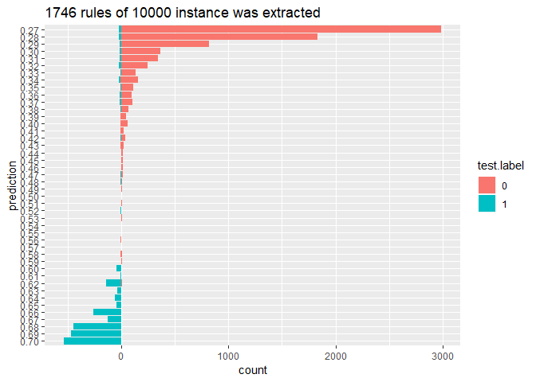
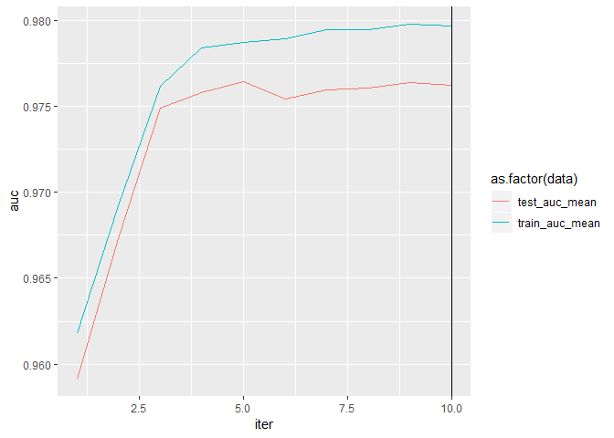
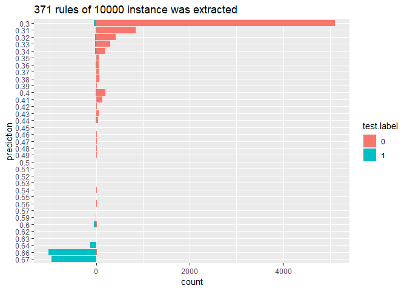
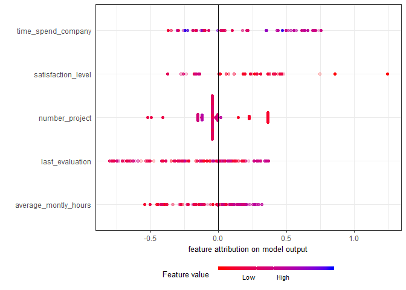
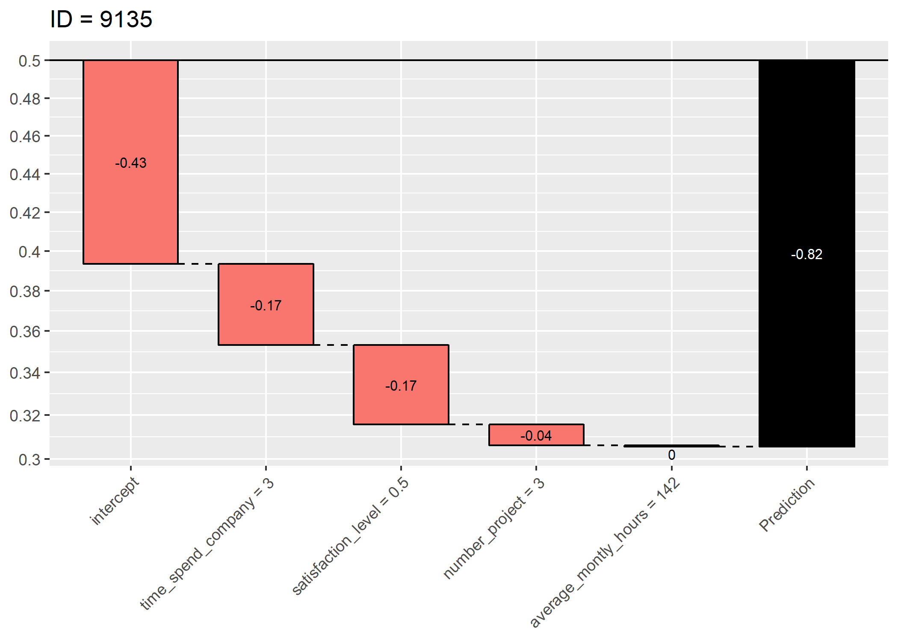
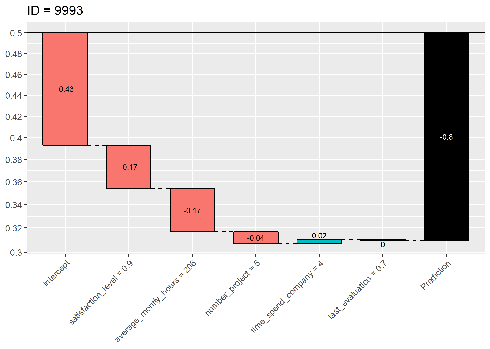
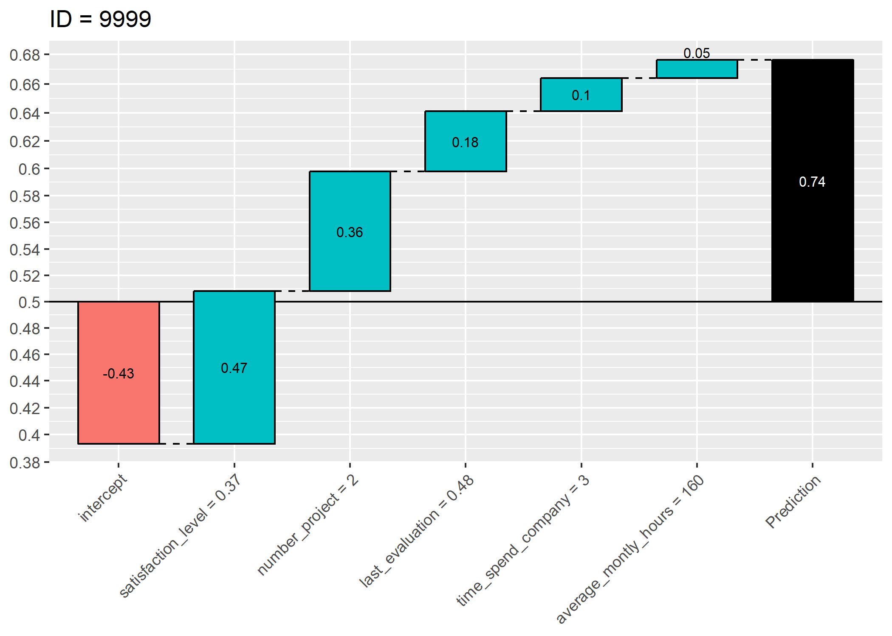
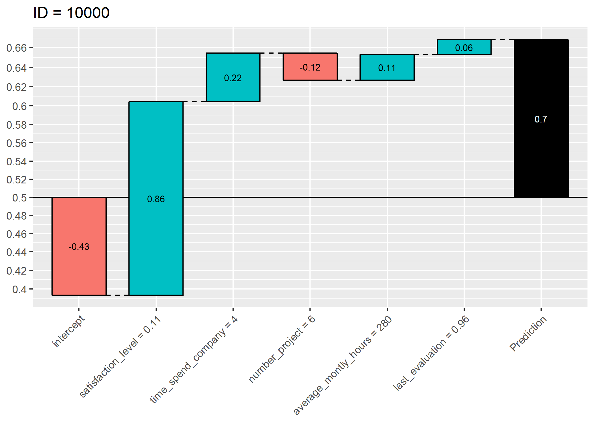

```r
install.packages("devtools", dependencies = TRUE)
devtools::install_github("AppliedDataSciencePartners/xgboostExplainer")
```


```r
require(tidyverse)
require(magrittr)
require(data.table)
require(xgboost)
library(xgboostExplainer)
```

# Preparation (continued)


```r
kable_left <- function(df) {
  kable.df <- df %>% 
    knitr::kable(align=rep('l', 5)) %>%
    kableExtra::kable_styling(
      bootstrap_options = "striped",
      full_width = FALSE, 
      position   = "left")
  
  return(kable.df)
}
```


```r
loaded.obs  <- readRDS("./middle/data_and_model.Rds")

model.xgb   <- loaded.obs$model$xgb 

train.label <- loaded.obs$data$train$label
train.matrix <- loaded.obs$data$train$matrix
train.xgb.DMatrix <- xgb.DMatrix("./middle/train.xgbDMatrix")
```

```
[14:34:52] 4999x18 matrix with 89982 entries loaded from ./middle/train.xgbDMatrix
```

```r
test.label  <- loaded.obs$data$test$label
test.matrix <- loaded.obs$data$test$matrix
test.xgb.DMatrix  <- xgb.DMatrix("./middle/test.xgbDMatrix")
```

```
[14:34:52] 10000x18 matrix with 180000 entries loaded from ./middle/test.xgbDMatrix
```

# Preditive result of All

In this case, eval_metrics were high enough, therefore, we use test data for following evaluation


```r
test.pred <- predict(model.xgb, test.xgb.DMatrix)

prediction.counts <- table(test.pred, test.label) %>% 
  data.frame %>%
  mutate(
    predict = substr(test.pred, start = 1, stop = 4),
    count   = ifelse(test.label == "0", Freq, -Freq)) 

prediction.counts %>% 
  ggplot(aes(x =  reorder(predict, -as.numeric(predict)),
             y = count, 
             fill = test.label)) +
  geom_bar(stat="identity") +
  coord_flip() +
  labs(x = "prediction") +
  ggtitle(sprintf("%i rules of %i instance was extracted", 
                  NROW(prediction.counts), NROW(test.pred)))
```

<!-- -->

# Feature pruning

Target features are filterd using `xgb.importance()`


```r
var.imp <- xgb.importance(model = model.xgb,
                          feature_names = dimnames(train.xgb.DMatrix)[[2]])

var.imp %>% mutate_if(is.numeric, round, digits = 4)
```

```
                Feature   Gain  Cover Frequency
1    satisfaction_level 0.3343 0.2370    0.1600
2    time_spend_company 0.2611 0.2832    0.2629
3        number_project 0.1826 0.2016    0.1086
4       last_evaluation 0.1610 0.1222    0.1943
5  average_montly_hours 0.0593 0.1297    0.1771
6         Work_accident 0.0008 0.0069    0.0171
7       sales_technical 0.0003 0.0092    0.0286
8            salary_low 0.0002 0.0030    0.0171
9         sales_support 0.0002 0.0021    0.0114
10          sales_sales 0.0001 0.0006    0.0114
11     sales_accounting 0.0001 0.0022    0.0057
12          sales_RandD 0.0000 0.0024    0.0057
```

```r
target.feature <- var.imp$Feature %>% head(5)
target.feature
```

```
[1] "satisfaction_level"   "time_spend_company"   "number_project"      
[4] "last_evaluation"      "average_montly_hours"
```

```r
train.selected <- loaded.obs$data$train$dummy.data.frame %>% 
  select(target.feature)
  
train.selected.xgb.DMatrix <- xgb.DMatrix(data  = as.matrix(train.selected),
                                          label = train.label)

test.selected <- loaded.obs$data$test$dummy.data.frame %>% 
  select(target.feature) 
test.selected.xgb.DMatrix <- xgb.DMatrix(data  = as.matrix(test.selected),
                                         label = test.label)
param.set <- loaded.obs$model$param.set
param.set$alpha <- 0.8
set.seed(1)
cv <- xgb.cv(params  = param.set, 
             verbose = 1,
             data    = train.selected.xgb.DMatrix,
             nrounds = 200,
             nfold   = 5,
             early_stopping_rounds = 5)
```

```
[1]	train-auc:0.961775+0.008300	test-auc:0.959162+0.015649 
Multiple eval metrics are present. Will use test_auc for early stopping.
Will train until test_auc hasn't improved in 5 rounds.

[2]	train-auc:0.969237+0.005805	test-auc:0.967283+0.006990 
[3]	train-auc:0.976160+0.003362	test-auc:0.974887+0.003799 
[4]	train-auc:0.978366+0.003044	test-auc:0.975788+0.004162 
[5]	train-auc:0.978704+0.002931	test-auc:0.976428+0.003907 
[6]	train-auc:0.978900+0.002539	test-auc:0.975411+0.005021 
[7]	train-auc:0.979460+0.001522	test-auc:0.975930+0.005280 
[8]	train-auc:0.979425+0.001384	test-auc:0.976035+0.005180 
[9]	train-auc:0.979754+0.001136	test-auc:0.976348+0.004745 
[10]	train-auc:0.979680+0.001055	test-auc:0.976217+0.004932 
Stopping. Best iteration:
[5]	train-auc:0.978704+0.002931	test-auc:0.976428+0.003907
```

```r
cv$evaluation_log %>% 
  select(-ends_with("_std")) %>% 
  tidyr::gather(key = data, value = auc, train_auc_mean, test_auc_mean) %>%
  ggplot(aes(x = iter, y = auc, color = as.factor(data))) +
  geom_line() +
  geom_vline(xintercept = cv$niter)
```

<!-- -->


```r
model.selected.xgb <- xgb.train(params  = loaded.obs$model$param.set, 
                       verbose = 1,
                       data    = train.selected.xgb.DMatrix,
                       nrounds = cv$niter)

model.selected.xgb
```

```
##### xgb.Booster
raw: 11.9 Kb 
call:
  xgb.train(params = loaded.obs$model$param.set, data = train.selected.xgb.DMatrix, 
    nrounds = cv$niter, verbose = 1)
params (as set within xgb.train):
  booster = "gbtree", objective = "binary:logistic", eval_metric = "auc", max_depth = "5", colsample_bytree = "0.8", subsample = "0.8", min_child_weight = "3", eta = "0.05", alpha = "0.25", gamma = "0", silent = "1"
xgb.attributes:
  niter
callbacks:
  cb.print.evaluation(period = print_every_n)
# of features: 5 
niter: 10
nfeatures : 5 
```


```r
pred <- predict(model.selected.xgb, test.selected.xgb.DMatrix)
# length(pred)
prediction.counts <- table(pred, test.label) %>% 
  data.frame %>% 
  mutate(
      predict = substr(pred, start = 1, stop = 4) %>% as.numeric(),
    count   = ifelse(test.label == "0", Freq, -Freq)) %>% 
  filter(Freq >0 )

prediction.counts %>% 
  ggplot(aes(x = reorder(predict, -as.numeric(predict)),
             y = count, 
             fill = test.label)) +
  geom_bar(stat="identity") +
  coord_flip() +
  labs(x = "prediction") +
  ggtitle(sprintf("%i rules of %i instance was extracted", 
                  NROW(prediction.counts), NROW(test.pred)))
```

<!-- -->


```r
explainer.xgb <-  buildExplainer(xgb.model    = model.selected.xgb, 
                                 trainingData = test.selected.xgb.DMatrix, 
                                 type         = "binary",
                                 base_score   = 0.5,
                                 trees_idx    = NULL)
```


```r
# install.packages("ggforce", dependencies = TRUE)
require(ggforce) # for `geom_sina`

xgb.breakdown <- explainPredictions(xgb.model = model.selected.xgb,
                                    explainer = explainer.xgb,
                                    data      = test.selected.xgb.DMatrix)
xgb.breakdown.loger <- xgb.breakdown %>%
  select(-intercept) %>% 
  mutate(id = 1:n()) %>% 
  gather(key = feature, value = impact, -id) %>% 
  arrange(id)

scaled.value.loger <- test.selected %>%
  scale() %>% 
  data.frame() %>% 
  mutate(id = 1:n()) %>% 
  gather(key = feature, value = value, -id) %>% 
  arrange(id)

feature.impact <- left_join(xgb.breakdown.loger,
                            scaled.value.loger,
                            by = c("id", "feature"))

ggplot(data = feature.impact) +
    coord_flip() + 
    # sina plot: 
    geom_sina(aes(x = feature, y = impact, color = value),
              method = "density", maxwidth = 1, alpha = 0.2) +
   scale_color_gradient(low="#FF0000", high="#0000FF", 
                        breaks=c(0,1), labels=c("Low        ","           High"),
                        guide = guide_colorbar(barwidth = 10, barheight = 0.3)) +
    theme_bw() + 
    theme(axis.line.y = element_blank(), 
          axis.ticks.y = element_blank(), # remove axis line
          legend.position="bottom",
          legend.title=element_text(size=10), 
          legend.text=element_text(size=8),
          axis.title.x= element_text(size = 10)) + 
    geom_hline(yintercept = 0) + # the vertical line
      labs(y = "feature attribution on model output", x = "", color = "Feature value  ") 
```

<!-- -->

# clustering for extracted rules


```r
# install.packages("Rtsne", dependencies = TRUE)
require(Rtsne)
```

```
Loading required package: Rtsne
```

```r
# install.packages("plotly", dependencies = TRUE)
require(plotly)
```

```
Loading required package: plotly
```

```

Attaching package: 'plotly'
```

```
The following object is masked from 'package:xgboost':

    slice
```

```
The following object is masked from 'package:ggplot2':

    last_plot
```

```
The following object is masked from 'package:stats':

    filter
```

```
The following object is masked from 'package:graphics':

    layout
```

```r
set.seed(1)

feature.breakdown <- cbind(predict = test.pred, 
                           true    = test.label,
                           xgb.breakdown) %>%
  select(-intercept) %>% 
  # sample_n(1000) %>% 
  as.matrix()

rules.tsne <- Rtsne(feature.breakdown[, -(1:2)], perplexity = 100, check_duplicates = FALSE)
rules.tsne %>% str
```

```
List of 14
 $ N                  : int 10000
 $ Y                  : num [1:10000, 1:2] 1.827 -16.863 -10.424 0.785 0.785 ...
 $ costs              : num [1:10000] 5.35e-05 1.07e-04 8.32e-06 8.03e-05 8.02e-05 ...
 $ itercosts          : num [1:20] 70.9 58.6 56.6 56.1 55.8 ...
 $ origD              : int 5
 $ perplexity         : num 100
 $ theta              : num 0.5
 $ max_iter           : num 1000
 $ stop_lying_iter    : int 250
 $ mom_switch_iter    : int 250
 $ momentum           : num 0.5
 $ final_momentum     : num 0.8
 $ eta                : num 200
 $ exaggeration_factor: num 12
```

```r
mapping.tsne <-  data.frame(id      = 1:length(feature.breakdown[, 1]),
                            tsne1   = rules.tsne$Y[, 1],
                            tsne2   = rules.tsne$Y[, 2], 
                            predict = feature.breakdown[, 1],
                            true    = feature.breakdown[, 2])

ggp.map.tsne <- mapping.tsne %>% 
  ggplot(aes(x = tsne1, y = tsne2, color = predict, text = paste(id,true,sep=":"))) +
  geom_point(alpha = 0.5) + 
  scale_color_gradient(high="#FF0000", low="#0000FF") +  theme_bw()

plotly::ggplotly(ggp.map.tsne)
```

<!--html_preserve--><div id="htmlwidget-ae203b738564e034912b" style="width:576px;height:576px;" class="plotly html-widget"></div>
<script type="application/json" data-for="htmlwidget-ae203b738564e034912b">{"x":{"data":[{"x":[1.82718993696948,-16.8628218125408,-10.4243790498346,0.784585017463205,0.78476168763324,0.785291808218562,0.774442471809998,19.7991751266953,0.774442471810162,0.774442570372996,-9.4020111735652,19.7991643727827,0.785200491849394,0.782718758729534,-9.38727474841232,0.785201621483319,0.785201621243766,18.8020677074278,0.784250316504874,0.78444572950839,19.7999928301137,-0.487201261083261,19.7999657971527,1.90701053487684,-0.487201261083261,19.7999772367825,-19.6900859804721,-0.173779802840887,2.55885893437395,1.90701053470121,-0.0217321016759525,0.763265063244789,0.830288432283574,19.7999785590298,2.65005410880067,19.79998042023,-0.0122428121536527,-9.40186067219586,-9.38531949810553,19.7999772360887,19.7991962415252,-19.8229427697869,-0.479182578541805,-0.242766142163728,19.6874278560659,19.7991567406989,1.90701053467586,19.7991883016683,19.7991689515179,19.799156733597,-0.479182578541796,1.90701053467566,1.49787292738443,-4.31682894334933,19.7991618573474,6.22719324283849,0.763265063244789,19.7999646152213,-9.38531821608676,-0.0824672876342425,19.7999646150158,1.49787292738443,19.800005222878,19.7991680832999,19.7999339957513,-0.0122428121536527,1.19936033831659,19.8000027898859,1.76774402955423,15.7295907604454,-9.38532017114495,-20.1530888324175,-0.790544712399065,0.58823482395808,19.7999302795335,0.312181194593124,-9.38533765007014,-9.37753123949758,-0.929279993522572,-1.40009600267061,-0.790546683011523,3.30739844086431,-3.89083073361572,25.1888768462697,1.83875901399386,19.7991542129388,-0.320971856750589,-3.69964242261023,19.7999646150158,6.22719324680183,0.240684653730795,-9.4000839987792,-9.40026923479697,19.7991696603925,19.7991751536045,-0.136469139960238,-9.40014892046441,1.79714097003104,-9.38729482295529,19.7991643727973,19.800005222878,1.85863974518866,0.959922229893116,1.10767467056423,19.800005222878,-9.38702063739373,-16.862831108951,-9.4001473429079,19.7999301469379,1.58008210279075,-0.320971392399689,-9.38589765020413,1.3031927696638,19.799156733597,19.7991697528552,-1.23817902637967,-0.836564505277346,1.82718993696948,1.81288228947812,25.1888674279529,-1.41409041990134,19.7991962415252,-9.38576151850746,19.7999646152213,1.10047277165192,25.1888756746421,-16.8628247992942,19.799156733597,19.7991697528552,19.7999928301137,0.241694445280704,19.7999785590298,-16.8628200504691,-0.320971392399689,-9.401622288942,-0.320971856750589,-0.320971392399689,-9.38702043438846,1.76774402955423,-0.836564505277346,0.795406911412877,0.987362367328314,-9.38703287348537,-0.272534318562298,-9.38703223417874,20.9210437120852,-0.272534318562298,-9.38706290909656,-1.0823526875943,-16.8628505822844,-1.1315940653435,19.0005275054852,0.476311166152895,-9.38703017309911,6.22719324383966,19.8000007234513,-1.40009600267061,-1.41406002451789,-9.38716859247452,0.0689331562851324,0.588234823958081,-9.3872828602546,19.7991751308522,-9.38720001493503,-9.40294145896068,-20.3395628232356,19.7991819775709,-9.38018679438952,-9.40021479649458,1.90701053467276,-9.40014350315657,1.32964727727102,-3.71150382655496,-0.46430639806034,19.7999866969559,-9.40021506713442,19.7848310246432,19.7991643727973,-16.8628414816843,-16.8628418227718,13.3329975311204,19.7847990443179,10.8812213276145,19.7999302788959,1.072164002458,0.763265063244789,19.799190263074,-9.37900667916639,2.55885893437395,-9.40348244165395,19.7991542043508,19.800005222878,-1.27877881900031,-9.40383116009947,10.0793961699238,25.1888881012626,0.476311166152895,-9.39370577712563,1.81819056810585,1.6183060127295,19.7999286504026,19.7991635290127,19.7991942947069,19.7229905787062,0.232030622385899,20.9255871812082,0.588234823958081,-0.320971856750589,19.7999298284217,-0.819522696778742,-0.974921575340422,-9.39698367112943,-18.7205585025829,20.7638745158558,6.227193246496,-16.8628502332144,20.9255871812082,-0.320971392399689,0.241694445280704,-0.81070451677807,-9.40376069900945,-0.692029527324822,19.8000027770374,-9.39643923761619,1.58008210279075,-12.9991868041145,-16.8628342770949,-0.272534318562298,0.937049253212797,-0.811099437391378,-1.31955851548655,19.7999339957513,19.7991567406989,-9.41093394697972,-9.4034385512281,0.987362367328314,-9.39649931879132,19.7991816872529,1.10661765051908,-9.40070401911597,19.8000027826406,6.22719325189428,-0.0630992903596389,-9.39371055296257,10.2517292308018,-0.819522696778742,4.23633355010524,-9.39421709231769,6.22719324382833,0.774442482399526,0.771842242115398,0.784759096933816,0.787623296069352,0.786159315573894,0.785076628630384,19.7991733876773,0.784759096933818,0.785200491849318,0.785201619201486,25.1888771153307,19.800005222878,-16.8628196353319,-9.39354464412745,-9.39370910297509,17.3546159046245,-9.39370910297509,-9.37900410289236,12.1398710603573,-16.8628103699082,0.788068254905037,-9.39370794815557,0.785032501903365,-16.8628301396531,5.38049165289534,-9.40285179938857,19.7991733876773,-9.40388287105106,0.774442482453329,2.43898374634022,-9.37917975742252,-19.3307413358631,1.60042336460518,-0.692029527324822,-16.862820522346,19.7999646098639,1.61814041953943,-9.40376213999745,-0.692029527324822,-9.40402670068302,-9.41124865631979,0.966722239066451,19.7999339957513,-9.41135177062345,-9.40179265220247,-9.41124251061258,2.55885893437395,-20.1908945690384,-9.41135724258834,-9.41139729293444,2.67974432743003,19.7999481040929,-9.40285133446142,19.7999339957513,-9.40310864558258,1.90701053464799,-9.40310386245496,1.49463315696748,19.7991542129388,19.799156733597,-9.39637569208697,1.73461322832272,19.799169733584,-16.8628096213091,-0.0217321016759526,-0.487201261083262,3.30214241223893,-19.6962922269824,-9.40381630891243,19.7999298491769,17.9051598178385,2.43832904681263,-3.68595871353178,-9.40015029920848,-27.6699368882678,1.90701053467227,-16.8628568347599,25.1888881052812,-9.40015155042887,0.532372458578001,0.54826231430288,19.7999646152213,19.7991733876773,-9.38733667220228,-16.8628315758385,19.79916975429,0.763265063244789,-1.28366511894973,-9.39649957565813,-9.40015248196643,-16.5154655420556,-9.40381879750464,0.788068255787927,19.7991635290127,0.788062757570874,0.784652968991337,0.788068254904448,19.7999819613282,0.784585017745775,-16.8628605837015,19.7991816872529,6.22719324678889,-9.40014914955753,19.7991697425944,0.788062288068515,-9.40014899274317,-9.40015033036943,0.788068254905037,-9.40353660160017,0.786159313472728,0.78465295891891,19.7999646150305,-9.40015636482535,-16.8628301396531,1.83232243548005,-0.305097769737896,1.90701053467445,19.7991697528552,19.7991500679762,2.6500541088006,2.27865515684788,-0.093541330227091,19.7999646185046,-0.0129342739983988,1.38602779425523,-16.8628200504691,-0.0703773804936796,-0.173963576959643,19.6867840945668,-20.0028223237628,-9.41118766376513,-9.40382305998047,0.548262314302881,0.762620696699438,0.763513160639299,0.762620696368423,22.4887864165888,0.770038284910223,19.7999297870991,19.800005222878,-10.3240339468456,0.76262069636868,19.7991962415252,-16.8628248037764,-16.8628121211632,19.79916975429,0.76262069636868,19.7991697233688,19.7991500679762,0.762620074562037,0.771773241252524,-9.79352962330407,-10.3883755274334,0.76262069646396,1.62043797090049,0.771774273194165,0.762620696699438,0.763513174274825,19.7991962415252,25.1888663351423,0.763513171977658,0.763513173867242,-9.84743108271549,-9.84743108271549,-0.0276802057149787,13.3330059164839,0.770039946248981,1.27009771276532,6.22719324680183,19.7991542043508,19.7999302857654,0.762620696368455,19.7999286534645,-10.1922032789874,0.762620695392854,-16.8628154774139,0.762620696461595,0.763513173867242,25.1888716703652,19.7991697528552,-10.2314849584054,6.71311112482703,-27.6696882665205,19.799156733597,19.7999302852428,0.771774273194165,0.829786101396672,0.830320534035522,19.7999771978003,-16.8628283082702,0.762620696461595,20.3385582988346,0.76262070732257,20.7431100834238,6.71311162988424,-9.37177547956909,19.8261437486549,20.3141361864425,-9.33567217607531,12.2661003534136,-9.37988750490164,19.2380421116782,-20.1908613002334,10.079396072836,19.2460241211672,0.763265063244789,6.22719324951481,0.76262069636868,-15.2164656100618,-1.20917294390864,-9.37952120995042,-9.39201131423671,20.2795382227316,2.60181032567809,13.3240407358033,0.391104713781769,-9.37988353592377,9.41427587858834,1.45211031360574,-0.022827334155391,2.32904595354981,1.56141450869552,18.7830442029898,0.788068254904942,-9.40376306246945,1.67002960900862,6.22719324945998,19.7991896961717,-9.41135650769306,0.788062289619058,0.787623293565466,0.78247800984361,-16.8628354288012,0.788062280051378,6.2271932527782,-12.342206259315,0.78806275766215,-9.39210939294507,0.788062280050453,19.7991819775977,0.788062757570982,0.787623296069353,-9.38993181228444,4.43508193520032,-20.4833195939421,0.784211796274148,25.1888674190416,19.7999666443485,19.7999804378158,9.41191306956879,0.788062281286496,0.784211782315589,0.786159317313184,25.1888716515079,19.7991942923496,19.7999829314834,12.2776785347093,-9.38993285398151,-9.38873559450937,0.78806228005171,0.788062288068515,-9.37951762107812,-10.4605473551746,0.788062757662269,19.7991733876619,19.7991643727973,-9.40376691115622,-9.40375626925236,0.782031044967904,-0.472371005330348,19.7991554190145,-16.8628200504691,-16.5154915600632,19.7999866969559,3.82962642978685,-9.40035090477996,-12.3238936845081,19.7991697397113,-9.38921660641105,19.7991697528552,-0.305097769737896,19.7999785590298,-9.38945978908309,-9.39459087172626,19.7999301469331,-5.68777339857217,2.05325730822669,19.7999827267814,2.34320196435189,1.07216400245806,13.3238184477302,-9.41135650906018,-0.476132837539919,-16.5154534929797,-9.41133065746975,19.7991816872529,19.7991643781332,-16.8628406596617,-0.305095449021495,19.7991751288374,19.799968114084,13.3238211181174,-0.487201261083262,19.7991751288374,19.7991542129388,-0.0685231367055213,1.90701053467331,-9.41117573888305,0.788068256102099,19.7999857487209,19.7991542129388,-9.41135487726492,-0.0122428121536527,-0.0122428121536527,-1.33473601980294,19.7991883318286,-16.8628191159512,-0.0685231367055213,-9.41135406752419,15.7303587388055,25.1888713436154,13.3238232329614,-9.3860846959072,5.38967623772418,20.9442106103965,0.585985409017071,-0.527996636227072,-9.41134936466043,1.49790163320627,19.7991696307342,19.7991819775977,-0.170893256254242,-9.41117953189252,-9.4113335450542,-9.41117933517641,18.8027543267585,1.90701053467294,12.1543360681289,-1.33473601980294,1.90701053467331,1.49849857381327,0.532372458578,-9.41117828695002,20.9255871414179,-9.41124729805453,-9.38657070794732,-9.40382297178926,0.787623293533471,18.6012729680592,-9.40376707216519,6.22719325223071,0.78806228005171,0.787623293533557,0.787623293533557,0.788068256101507,15.7302262490913,-20.4014927370419,19.8137623195149,20.7179055308917,19.7999785590298,0.788062279172149,19.7991675120429,-9.40015204654708,-9.40015333907037,0.788068254905037,-20.4053082161288,25.1888674359015,0.788062757405607,15.7303419379663,0.788068254904448,25.1888772236569,0.788062280051378,0.786159313472728,0.784652969903369,20.5009705040754,0.788068254904448,-9.40021923478698,6.22719321367521,0.788062288067589,-27.6698646227394,19.7991697528552,-9.38031077530043,1.90701053467595,-0.479182578541795,19.8000027868733,1.90701053467566,-9.40014892420698,19.7999302788959,19.7999781015206,0.788068254919837,-16.8628221849484,-9.41124917508232,3.07578115287779,-9.3918020185002,0.784585017173326,-9.40294956806869,6.22719324283849,0.788062281286347,0.788062757570874,0.784652955214777,0.784652969903369,-9.39179644015137,19.7999928352175,0.788062288067589,0.784211796877164,19.7999481040929,0.788062280051859,0.782478014228174,-9.4037598756189,0.786159314777215,19.7999451454084,19.7999785590298,0.788062288067589,0.763265063244789,-9.40201212911413,-3.69619729690679,0.788062280050933,0.788062280050452,0.788068254904942,19.7991567335877,0.788062757570244,-16.8628574512452,-16.8628566613699,-16.8628510830002,0.788068254904448,-16.8628309923991,19.7999680772362,0.788062757603179,0.788062281286347,21.7106024762496,0.788062757662269,-3.71124377694377,-9.38658024748573,19.7991962415252,-10.987598967712,0.785032500592064,-9.39617685055745,-9.3864020756591,0.681885236654161,3.05619584823228,-9.39439437239043,-9.38944878504345,19.7991542129388,-9.38632903369862,0.788068254904448,-16.8628301396531,-9.38653117761567,-9.41114944689964,-9.38488940908329,-9.38655204072464,-9.38514392402606,1.38613055334507,-0.459260193884094,0.763265063244789,-9.4112421587004,-9.41057603359877,19.79916975429,19.7991942923645,-0.084535008811852,-0.487201261083262,-0.173963576959641,19.7999297875703,-0.479182578541796,0.763265063244789,0.788062280050453,-0.305097769737896,-15.2164600184235,-9.38813092970945,19.7991697447208,0.763265063244789,19.8000027898859,19.799168951523,-0.305097769737896,-9.40698116075142,-0.487201261083262,1.73979546473051,18.7593795610332,0.788062280051378,-16.8628616954772,19.2460241211671,20.290475377928,20.7381128414596,-19.6955890247454,-16.8628409998076,-16.8628313321902,25.1888716514644,0.788068256101507,-9.40909853702046,0.788068255239352,-16.8628081908572,19.8261437486549,-9.38205085816537,-9.40683576614469,0.788062757570982,-9.41067246044421,0.788062280051229,0.788068254904447,18.7593795610332,0.788068254904448,19.8261464845071,0.788062287234383,0.843538703865473,25.1888674279529,3.82962642975987,20.6776268567499,2.78668506104777,20.1302642426413,19.0005275054852,0.786806734676817,-9.40964956263215,6.2271932520632,18.7815184768915,0.784211795553752,20.925587125448,19.2460241211672,0.788068254904447,-15.2164614777055,-9.38120853605359,-0.688701195504007,-9.40876721514322,18.7612825837788,6.2271932545511,19.8212130175921,19.1658327859238,0.784652958916954,-16.8628602181575,-9.37988387576335,-9.38001013132139,18.7578492463187,13.3238184477302,-9.37998344061289,18.6575014817738,6.77400770812247,20.1528234092844,0.7785313271277,-9.38007701064842,20.7367210370756,20.5013827907736,0.788062288077243,19.197733814923,0.784761687213764,-9.37994877827641,0.784761687638861,-9.38605818305424,0.784445731089468,20.9253781952478,0.784445731089211,0.78425031652694,0.782031048584382,19.2460241211671,0.785201619201217,0.784447209915375,-9.38001299104107,-12.3422078052031,0.784250316527711,25.1888881052515,20.2448858797368,19.2460241211671,0.785201619201217,20.8028309817246,0.784250316527327,19.2460241211671,0.763513171977658,0.784005929680402,1.42989890062528,0.532372458578,-0.0552852206874826,-9.38210949778751,-0.476132837539919,20.2711523817376,0.539550061799571,20.7431100834238,1.56406696900547,-9.38182687296017,20.496054064819,1.90701053467287,2.65005410880057,-0.688701195504007,-0.596263295282783,20.4896601843347,-0.487201261083262,-9.41148552686531,2.52209471085914,25.1888881052812,-0.825707932992195,-9.40678146028332,1.76584814609795,-16.8628362399945,-9.40678708711716,1.77845444705918,1.90701053467357,19.2410929679407,-20.4669599226212,5.38050036238888,-0.0703773804936895,25.1888768569622,1.90701053467365,0.829954102005861,2.32904522539319,6.22719324993598,-9.40697795532333,20.7922060340196,2.55885893437395,20.9253781952478,-16.8628279717775,20.925587125448,0.532372458578,-0.538024094110101,-9.4068414363044,1.90701053467363,-9.40913045246526,-9.40732606380729,19.7229905787642,19.1640040694714,-20.4038265923649,-0.479182578541796,-15.2164645101298,0.246333793928539,20.9255871414179,19.8207839314667,0.959922229893116,20.7431100834238,19.2393585812506,0.248807875878585,-12.9146803322966,2.67974432743003,-1.47898847775145,-9.40848613173402,0.259383817128959,0.241694445280705,5.38802959123821,-16.8628362645644,-16.8628249283251,-9.40671606771161,18.6012729680592,-9.40707764992858,-9.38001014619943,19.8261437486549,2.62190101130006,19.0005275054852,1.49787292738443,6.22719325260306,20.9210437120852,-9.41131246802691,0.246372179349945,1.59699080342199,-20.4832821251285,0.278296670088725,-16.8628368989642,20.6781108557371,-16.8628478944013,-16.8628236583577,-9.40671476684419,18.7613100292234,-0.459260193884094,18.7520669441409,1.85645705732934,19.8261437486549,0.763265063244789,9.41402864764158,-0.596263295282783,18.6012729680592,3.58740740177834,-0.487201261083262,-9.38673360971474,-1.27877881576453,15.7303778648301,1.1116228137343,1.11003990964539,18.5967361698071,-0.070377380493689,19.8261437486549,-9.41154589428713,-16.8628443976512,-0.0630992903562849,-0.0630992903596437,-9.41152231257641,-9.41147767973352,-1.41409041990134,9.41427769200951,20.7431100834238,25.1888674279529,18.7515075709318,-9.41022497956846,-0.272534318562298,-9.41081526876129,19.2460241211671,0.259453613429956,19.0005275054852,-1.1315940653435,0.987362367328314,0.812447967446803,-9.38004449149915,1.84304757984666,6.22719325130072,0.0781949395034631,20.9255871414179,25.1888713440145,-0.692029527324822,18.8027543267585,0.240684653730795,-9.40445240528373,-0.320971392399689,1.82718993696948,0.787931688971617,-20.5809774965686,-16.8626446272021,-9.37555993978762,13.3240423946344,0.241694445280705,0.312181194593124,20.7431100834238,-1.41409531679833,3.24914794961605,-0.170893256254242,-1.06097248707812,1.48676292268554,18.6688865305416,20.5013827907736,26.4788497049309,-0.692029527324822,-1.27877988912008,19.8027714671857,-9.38584079911694,1.47114824361711,-9.37557161198826,1.47114824361711,15.7302856245176,20.0536925427596,0.58823482395808,20.9255871812082,-0.0630992903596437,0.804863617483766,-0.692029527324822,1.81714565663402,3.30822167429474,-9.3755044540749,18.6012729680592,0.58823482395808,0.58823482395808,19.2460241211671,1.10047277165191,25.1888881055643,-0.320971392399689,2.2995803561708,-9.37562672403583,-0.267761647205439,-9.40028125083092,-0.0630992903596437,2.43784200328704,-9.38582207415372,21.0185829861536,-9.37579076435945,1.85864427345733,-9.37567142561839,-0.692029527324822,18.6012729680592,-9.37586468962418,-9.40027420550362,1.85865444371248,-0.0630992903596437,1.84399074358465,0.327949505874132,-9.38584431370183,20.7431100834238,-0.272534318562298,-0.0630992903596437,-9.37643216000071,1.85645705732934,0.246447459302294,-9.3764119455943,19.8207839314667,18.7830442029898,15.7295917144012,-16.5155270859328,-9.37640765094778,-3.98655206902392,15.730388332449,20.8028309817246,20.6653893662038,1.61814041953943,3.83318444935824,25.1888881052812,-0.836717564043092,1.10006338051398,0.656094957586894,1.48676292268554,-1.1315940653435,20.2448858797368,0.405631690657237,-9.37641233946116,1.93020327437761,-0.320971392399689,25.1888674256982,19.7251746620077,-2.59513652237315,25.1888674279529,-9.37631027089925,-16.8628326758824,-20.4833145301835,2.55885893437395,-0.487201261083262,18.7517352844947,-0.487201261083262,-0.240076036549297,-9.37664321934623,1.36866029317655,19.2410929679407,-27.6699777274423,2.55885893437395,1.49790163320626,-9.37562499151739,25.1888881012996,13.323821227054,-9.4002146160791,6.68702734506304,1.49787292738443,-0.527996636227071,-9.40027500363631,-0.825707932992195,-0.472371005330348,-9.40005021462484,20.7431100834238,25.1888674256982,1.90701053467357,18.7516696869565,18.5967361698071,0.532372458578,0.763265063244789,18.6628301760181,-0.689210021438788,2.32904522539319,25.1888663290405,-9.39331165914257,20.9210437120852,2.65005410880055,-16.8628707070229,19.2460241211671,-16.862830718693,18.6012729680592,20.6385902946964,20.8028309817246,18.7938880463981,-9.40004676150063,2.65005410880061,0.830288432283574,-16.8628347466356,1.49850248127497,20.9210437120852,-3.7115169581254,-9.40040213172266,-27.6702842261546,1.90701053467356,-1.20963494327559,-9.40026868429797,4.16145034290915,20.2448858797368,20.4778696664612,-0.459260193884094,-0.0214607154811727,25.1888756584769,-9.40021570974164,-0.527996636227071,1.90701053467356,-9.39339611853869,1.32964727727102,-0.472371005330348,-0.459260193884094,-0.487201261083262,19.8261437486549,2.63643393510339,18.6625103498825,19.1977211637612,6.22719325198116,-0.0214607154811727,19.2274728031225,-9.39322446913995,18.7581807871473,0.763265063244789,1.90701053467353,0.45322118041069,2.6500541088006,-0.487201261083262,25.188888101765,-16.8628533257261,-16.8628297375002,-18.7627485518458,-16.8628409999589,20.5014681741855,-9.3932318232682,20.1416741031015,1.06891305441083,3.30785985168774,-9.39337625676318,1.83232243548005,-9.39340513817758,19.7229905787629,-0.487201261083262,18.6575014817738,-9.39329844318872,-9.39330333069855,-0.825707932992195,25.1888663290405,0.476311166152855,2.27851125125574,19.8212130175921,20.3385582988346,18.7817745438668,-16.8628605386757,-0.527996636227071,20.4945970082372,0.580839764645617,0.532372458578,-0.305097769737896,19.7848093205154,-9.39341171894064,2.44004458750452,2.55885893437395,19.783430928076,-9.39340249612737,-0.240076036549297,1.90701053467352,19.7250553170052,1.90701053467353,-9.3933997769475,-0.0839441453101894,19.7847999172185,-0.320971392399689,-0.0823586863959897,2.27851125125574,19.7847990701387,2.32904522539319,1.62810799069095,-9.37572176421327,1.38622532525691,19.7848093271437,-1.33473601980294,19.7834250363613,19.7847977721778,1.22737594278079,1.38602779425523,25.1888704459977,2.05325734344695,25.188876752504,-1.20963456169674,-9.37555233951389,1.90701053467352,2.65005410880061,19.7848250267241,19.7884858730495,2.65005410880061,-1.28614304796136,-9.37738648205943,19.7834486175723,1.49790163320626,1.49790163320626,-16.862830718693,19.7848058402526,19.7834748684199,0.937049422106439,-0.476132837539919,-9.37981604865169,19.7848263273395,19.7837254955065,20.9251817607112,1.90701053467352,19.7885173918719,-9.38081047307291,-0.0823586863959897,-0.527996636227071,19.7834605822265,-9.37833520264782,1.07216400245806,1.56329538429785,1.90701053467352,1.90701053467352,2.27851125125574,-16.8628072463394,19.7834253485095,25.1884154726713,0.799341798646398,19.7847977718712,-9.37765450916887,-9.37715401036737,25.1888880329682,-19.8229512607267,-9.37731200685295,19.1658327859238,2.04864618438652,1.90701053467352,19.784809782968,-9.37550741412202,19.7834286174562,19.7848067227169,-0.242766142163728,-0.0128526278035187,25.1888719621492,-9.37735808355174,1.90701053467352,19.7834751907581,2.65005410880061,1.90701053467352,-16.8628293067248,-0.819522696778742,-9.37549547824656,1.61814041953943,-1.31955841675641,-9.37581205017296,-9.37569599898247,15.7302392013337,-16.8628510830002,1.58008210279075,-0.811099437391377,-9.37735965677419,0.959922229893116,-9.3755046757005,-0.692029527324822,-9.37740980909107,13.3238250914879,19.7834286144021,19.7991962415252,1.68100991240309,-0.272534318562298,0.783249998202196,-9.37736683267194,19.7834483460021,1.59870686474064,-0.0201953953122944,19.7834286191642,-0.0630992903596437,0.476311166152855,19.7847977438831,1.85645705732934,-9.37550342167934,0.327949505874132,-16.8628437123114,-20.4010007717266,-1.2787787450955,19.7848275872867,1.10047277165191,1.76774402955423,0.312145903187188,19.7848053382371,19.7834546341642,-9.4017402221697,-9.40027544890079,19.7834486175723,-16.8628670703161,1.81732068585157,0.797504893795408,1.85645705732934,-0.0630992903596437,1.69255017573479,0.966722239066451,1.11003990964539,0.243819433064705,1.58008210279075,25.1888881065475,19.7834780380014,1.10277802794142,19.7848046768556,-15.2166330721058,-20.1916965381309,0.58823482395808,9.41420919382626,1.69646832371854,1.62001082433983,19.7848046745082,-1.41409041990134,-9.37716393378168,0.259510516446491,1.4989930720646,22.4891009204681,6.71310987982319,-0.542500355309904,5.38969767497514,-18.7522699193983,-19.3093972761551,13.3238155937286,1.10663906943922,-12.4422969151319,-2.40367400147339,-4.34344235141815,-3.71125187584941,-3.7018309896598,-6.02941389056492,-19.6838086441692,0.40945809271265,17.9051581040492,0.282212563670715,-2.08662076453165,0.768804344448403,13.331407286497,1.15009974700978,-2.37972697133416,-6.27723033500331,-4.25547033064253,-1.95169367578338,1.08197645029073,-20.4042078768889,-3.32013277948039,-4.87980916010551,2.1100438011098,6.71311115755369,-4.49605851561382,-20.1917303040922,1.9302032743776,0.758220124718481,-1.11438589528017,1.67496475557596,-2.0874438102392,13.3314177587898,7.49034813632078,3.56787930733928,-19.8879337456297,0.768804344448392,3.27131774646787,3.19484461655216,5.3896781588185,1.50914749376731,17.7620312630391,17.7621154335638,-1.1101671695748,9.41198421093964,-0.328906961714817,-2.81447032713343,16.1922787749932,-3.94200210783074,-3.71151371783821,16.1918922114416,19.7248192472377,1.97197916163007,4.99669395551805,9.52782005063929,3.92888038524687,-2.81403919253511,-1.93528993098556,1.60358659485926,-2.80746036901996,-1.20917294063765,1.20957062910278,3.88284160662653,3.82962643186377,2.16833263862509,-2.4586389143646,-4.28834618189192,0.785063848014437,-3.95556891643663,3.79826994214169,-0.0507930310370272,-20.1492596791679,1.53269104713182,-1.95169367578225,0.278383746498609,4.63147935387169,-3.74482653275543,-10.9875993297315,-1.60918420342335,-18.7522699173483,-4.12549759711685,5.2951668319239,-2.09269507586814,-19.656565978534,5.0863204798501,15.7296144340434,17.7617096819891,1.02784684952231,3.95169100240835,-2.45865269231544,-21.7461862115394,-3.70227855209394,0.937049253260699,9.41434693314474,-4.41399936952841,16.1922787749932,1.97197916163007,-2.45865269231544,0.986565146120239,-0.539952940152827,0.53808814141603,4.37244419575141,-0.36660693390995,-2.77157743684801,-22.3923248824028,-3.71150382773143,3.83318469813103,-3.71150384667429,-6.40496956804942,12.429281545881,3.30835569401478,3.9316726593654,-5.01806592283163,-2.77606699605882,-2.68990316336085,5.38072250078561,2.37903885887765,0.245421974417869,-27.6702964616705,-2.81403919253509,-1.11438084561295,6.01695957592831,-0.426124641018068,4.99088254125458,-21.2995006819472,-21.2978036564394,-20.3636822331944,-2.77124413528512,16.1922656853629,2.37903885878242,-20.379891280608,-1.89179053450286,3.30835511313085,-20.3982053271869,5.21227681466805,-18.7522708320002,-21.1602763693124,-0.539952940151328,-2.8706454337693,-19.3576174113352,3.9288804056876,6.70624316092443,3.92771533121708,-20.379917736291,0.825613986217816,1.56787876089765,-22.6645760820952,-21.1643197974533,1.42512092939027,-5.02707260439849,9.4119273993777,3.5544425959827,-4.72039520590911,-3.85290781709157,1.34060561210995,-3.00663182795726,-10.9876076537512,0.783680883735327,-1.109441609467,2.0862850997621,5.08632047978564,2.27543806276712,13.3240429840812,-27.6701926548208,-3.71150383770951,2.69566664187093,-4.25547033064318,16.1922665439195,15.7296049577092,-10.9876111418551,-1.0985568999561,0.232450790117934,2.00024316374504,6.70624307199733,-27.6723497565902,-3.73828543131085,17.7616979041843,-2.34198044378589,-19.8229358493464,-20.3618756141872,0.451294987579991,0.330550809406729,2.36896607633708,-0.30868652428144,-5.38372186180786,-1.81553338974854,-3.71146784383083,-20.408520195912,-3.994939686678,2.95263298904147,1.02784684952231,2.69566664187093,19.7250632933251,3.36699931228501,6.71311185638063,-1.0959327066471,4.24427535170173,-2.37291974674284,-0.349342072694154,-0.26472269854232,2.0915952892977,3.28806793714842,-10.9875997861189,-5.02359697536496,-27.6698542704508,7.00100727966062,-20.4051682042161,2.33265295135338,-3.32013277948039,0.454602253315598,-20.4051849037104,22.4891193624247,1.98048100532418,1.7447885546814,1.02784684952231,22.5457657542516,-3.11461935028349,5.08632047978564,5.04556723021995,6.71310964657837,-3.7115137139609,-5.15951148450092,12.1394960248656,6.71311155584424,-2.45865269231544,-0.417208295084733,-18.7522674971977,2.37532282241335,-5.26343544099076,-1.32670881238003,-3.71150711000224,13.3240429844988,-5.02707260439848,-5.02368448726943,-20.4056977685243,-20.3798001550571,2.44777863919325,11.2566572010577,4.24416610398444,2.11004380110593,2.0862850997621,-0.308686526253728,-1.11019506963393,-2.90687715365604,9.41152633556011,-5.3463298877365,6.48549323593388,9.41152926534165,3.13683249243191,16.1922834277137,-1.20917294200306,2.91379850127822,2.55556016775456,3.25272649987352,-9.37982045622491,-2.92498403763671,-10.9875907911302,1.10779536439542,-27.6698054872848,15.7295954299045,-20.1492398279054,17.7616979041843,1.94503362951999,3.76507316997327,16.6248157692103,-2.93225872264578,3.36319752652089,-3.6931905265361,-4.17264749425482,13.3238246756215,22.4883402755357,-1.31955863628295,4.65179904824347,7.00100727966062,0.758220124718481,3.14149515740223,1.87235784648819,-2.96626392822604,-22.5615208999267,-19.7002436202047,-1.9516936757826,5.33788774900337,1.09761577771651,-10.9875997824364,1.35338196809305,-2.11574959227575,3.47203822135732,-0.0507930310370272,-0.577552479179929,-0.308686526320944,4.29749429667812,3.65736047807404,-2.89837697610542,-3.94200210768692,-1.09653100729732,-10.9876011878322,-4.25547033064318,-0.796169968183165,-5.3463298877118,15.7296013369474,-7.31238032596162,-5.15820550622571,-27.6730897896231,21.7107483799955,-4.33488489887852,5.72499768724236,0.768721881697814,-19.3576174113352,13.3238250752357,5.66535669787424,19.6873838997036,-2.45865293341628,-3.71151698527328,-2.45865251986865,3.25272649987352,-2.16763214740806,-2.85338439173565,-1.79224056016651,2.67021253248968,1.0258598220247,-0.796169968183165,1.57054766703356,2.37532282288154,17.7621216183563,5.14693214587778,-3.71125132522704,-1.09551168041393,21.7107465409527,3.84460218419143,-4.8520545281149,0.986565146120217,4.97645395023646,-0.308686526109317,7.44286151647976,-20.0604514687423,3.5625404647435,-5.03971339390855,9.41426695578249,13.3240489563479,15.7304019727531,-4.12549759711658,26.4765212419971,0.768718605126557,-6.12863256210139,3.84460204843628,0.10739380741862,2.95263298904147,2.10803781964116,5.84709702449597,2.37903885878948,1.57326210598303,-10.987598967712,1.09761577771651,-27.6700125799815,0.420113020680636,-12.9146849277813,3.25327829732705,2.25200595186831,26.4809133437938,13.3314252546689,3.81163196952962,-21.1643197974533,-4.09535089597792,10.2517154641707,-5.89018981319097,-2.74684480842896,2.37903885886189,1.24220040386356,22.488785119266,19.7249005613118,2.95263298904147,0.216359221328024,10.0328265040004,-0.415587056821164,1.49605618713694,-1.09551168041393,1.49605618713694,-2.55934879724908,3.25352288719638,-3.98655206908726,-1.19945645224891,-2.78119069296739,-6.96590581994804,-5.58070678544565,-0.791218600897036,1.28653269015064,-4.22458312544316,-4.81818839680737,17.5851466727647,17.7621912308711,-2.53955135373502,1.2343407015889,1.90974740343276,-18.7516493649108,-4.42585879684608,-0.517076429458238,-2.53091021525104,13.3314181564666,-1.48457350961076,-1.72268551087993,9.52772036946543,5.39001321486309,-22.6543395173856,0.768718605126557,-5.02707260439848,1.88481100251538,-0.535072865184014,-2.14812233343044,13.3315475741567,2.09121360315955,2.37903885887986,1.94503362951999,-0.465331458700838,-2.16207213927831,17.7620067589161,3.56787930735013,-21.191703539077,3.93169785061673,-20.5610974332327,-5.01810325030636,2.67021253248968,3.57414545069284,4.99787125245653,-2.37262214553878,-2.36312763738915,0.937049435873422,-2.46360402012297,-2.16626414399738,-6.51357245962321,-2.11219294024741,22.488960707398,-20.1908722891876,22.4886672567575,-3.68080890798872,1.58217973751603,2.76400155225299,2.47750223136476,-3.32031875306257,5.04556723021995,3.57699918582681,4.24433976320557,2.16833349894878,-12.9146835262061,1.11039620885665,-2.14878917548557,-2.11463950456829,-21.9934363950281,-2.08169836682688,3.61456540000211,-5.3463298877996,-20.4084866686608,3.30835421384656,12.1398703383271,26.4765453941383,17.7621223022793,-20.4067910318945,15.7295893426551,-3.71121587734447,-20.4028239098469,2.41366418274916,-4.6471211486041,0.34006622381868,-22.6543882192268,-0.497148749599683,13.3240403730835,-3.71147782419372,-0.0507930310370272,-2.08116760645195,19.7251777458459,-2.08446551802306,3.3075404476202,-4.28834617729685,17.7613182707071,6.31451121739667,-27.6723445327414,-0.501016087421685,-0.461336948447643,-0.940876378388158,0.45322118041069,2.11004380110957,19.6876211125703,1.97197916163007,2.36896607633714,-21.9973751605753,-6.13844589902298,-0.588343007274052,2.11004380110957,9.5277155534107,-2.07813658355391,-0.454274828657006,19.7250506029115,10.0794032149604,-0.68383920882684,-10.9875936295666,9.41421897346301,0.409458092712651,3.30835569567911,1.05659422656759,-19.8229443202311,0.937049430821995,0.42011302068065,3.76507317444409,2.75018101272525,6.314511217395,-2.08169460362123,21.4161564619978,1.38101664032904,4.09813720889515,1.15035912887453,-20.4038012522603,-0.54071565926913,-21.7461443531872,1.28653269015064,6.19745560755944,-2.55067896714969,1.04579267300887,-21.1262017750898,-3.71148100582852,1.10510280179941,9.41432390884433,-20.4038509221478,1.10320507407959,-1.32670881238781,1.5308307987539,-21.9776854169057,-6.10331405240433,5.83218521301819,-3.70183098973228,-1.03191659712591,3.44797598244401,1.34591181539407,-3.11461935028349,-20.4014950270402,-5.3463298877996,-3.77296517350199,-6.09885873692208,-20.4038508221986,0.545344479305227,-2.09723862676744,-4.8520545281149,9.41427895531774,-1.32670881238781,-1.93788363825918,-1.04742154756677,-21.7461241187872,6.71310920702627,22.4892487179072,-2.53611706408402,-3.32013277948039,0.245421974418133,-20.3272651793779,2.7338338000973,3.21470964565586,3.32700724863208,1.66596211882773,2.47376344849772,3.30754044768889,-3.10402523042379,-3.12206164869515,-20.4004160068191,5.83218521301818,-1.05090654412886,0.785063847165163,4.23633343679206,-3.26465684252392,-10.9876044056531,-3.27179898417656,3.27018366515361,17.7616980244297,-3.26919657210518,2.47750223136476,12.4305656593457,19.7251327950735,9.41170596901536,17.7612810852103,1.57262950560477,-22.4774728127554,9.52781880554295,-3.27613025001394,-3.26391042651206,6.1935764626032,-22.4933433263169,3.9036855286366,-2.37698922120951,-27.6680646839512,5.95971341006153,-0.482367144568868,-2.81403919253508,-5.17598594228356,26.4443003973077,-3.94200210784207,-3.71151694286789,4.54524921374541,-18.6782794298216,0.768804344448392,-5.3463298877428,-2.07947755534866,22.4887291409686,2.55556016775456,-20.4056952646843,1.9647987261392,-21.7461332601344,3.30725659573022,0.42547510672349,-7.07293528884886,-3.05345383944592,-3.32031875305488,26.4769187716375,-0.713021633496883,10.2184295963338,0.768718680681527,-0.331861904747882,-3.71151699754668,-3.71150385215404,-3.71150385215404,-5.03374002822191,-2.61587080821776,11.256256539066,6.46208336590315,3.93171084549888,-3.71150383192765,-1.17723250598598,5.76502295256686,-4.93639895890299,0.768804344448392,-2.83710496483924,-4.41399936952841,3.5678793073535,17.7612918803944,2.39472379646876,5.96081762676313,6.71311185638063,-0.713677483358831,-20.4042156424939,17.5851419378982,-22.654159038196,-6.0294138905649,-2.53481568357931,15.7295677650264,0.467599181043218,6.71311186004615,0.245421974417984,-20.4052959623232,-0.776963921030856,-4.87980916010551,-3.26338966156574,-2.68990316334558,-3.40113310168518,-0.0507930310370272,-27.6702164522591,-0.456650073119882,1.02585982202472,1.97827334914036,-4.28834617765659,-0.539952940151369,-21.7461626647737,-0.538024094110101,9.4119242914162,-0.531119198897769,0.421739962812936,-4.28834618125193,4.34417867061664,2.95263298904147,-3.71150384265526,-5.24653193363589,0.937049548761901,-2.06993510409161,-19.3115211928885,-22.6543794053319,-0.0507930310370272,-20.0954797323511,-10.9876017219201,10.2517303778679,-3.44912736423272,-3.69954424603941,-20.0956754751362,2.12542343230833,-0.713722980252031,-20.0302176750668,2.11004380110978,16.1918918120235,4.44488041461523,12.4292831565716,-10.9875989703794,-4.61486128747194,0.768718531654215,-21.3184446441244,-1.10156007845413,-20.4013301562441,-6.04859150658202,0.768718541396008,-3.89898979964631,21.4161307887927,3.30754023814769,2.37532282280065,-1.20917294140209,-12.9146773443589,0.768718363933307,6.71311186004615,6.68702851469711,9.52771467991418,-6.10776079498273,4.44488041452245,5.12170322570298,2.37903885879283,-20.0954797323511,-2.6020303979692,-4.24288506238616,1.62505370053697,10.0328257578839,3.21470964565576,-1.31955851671644,-18.75227415781,-1.24875465096835,-4.33488489887615,2.11425832028672,0.986565146120237,-3.71082812373061,5.19432732529971,-20.9668248390155,-3.98655206912518,1.94503362951999,2.16833366494118,10.0328352966797,26.4473016679229,3.92888043221816,6.82805352965564,0.420113020680651,-3.69721409000021,0.413034083289312,4.99088254125458,-10.9876007015284,6.94355874784791,4.36064382437926,0.937049312394894,3.84460206762848,3.19744003504518,0.487687576048841,1.11039620885665,1.42512092939033,1.49605618713694,0.986565146120239,-3.04712407839469,-0.540362373081732,-3.11461935028349,-0.71487350372367,1.85817767753014,-3.71150382417354,0.338346956501444,0.107393807418642,-2.61075702041493,-2.63411609340883,0.420113020680653,1.21220554407282,-3.71082813880131,5.42298565585133,-20.7929202766368,2.4752790438548,10.2517303068822,2.11004380110965,5.38968011009454,-2.62706950427184,-27.6700193885402,-5.02354696742282,-20.408422014962,-20.4026537652179,-20.1492617565208,-2.68459552251478,4.97645395023646,0.433372943807741,-4.42336540038105,-1.08315742341581,-1.48457636731321,0.57722370908692,-2.73291029725443,2.47320951396191,-3.71147783308418,1.28471885587586,12.1393551481681,-3.83174081194023,-1.27800754201089,17.7613176225644,-3.69964242870767,-1.32670881238711,0.570789353101748,-1.28346111715367,-2.92763790845824,-1.24875465096835,-20.4074390203276,-4.34344235141815,-2.67097201272836,-3.11461935028349,-3.9865520691368,3.56787930735614,-0.564301535650465,-3.7115043360955,-20.4082305182103,4.97645395023646,10.0328319185781,13.3238227099853,-3.71124362861387,-5.73760406734521,20.5071948820706,-3.69357854014067,3.82962642975987,26.492202345461,-2.27899914641064,-3.71150432922897,22.4889873955679,4.26314689032335,-2.68990316334498,3.21470964565577,1.10795421723618,-2.45865279322689,-1.69821123252117,-2.49230020507521,-3.6971402588493,-0.713700106890498,-2.13706397031906,1.34256307406704,1.33054382844596,-2.91545282560244,-18.7205580503614,1.90974740343276,-20.4012832837485,-20.4084315680511,17.7621996425698,3.21470964565577,-5.9313824792925,-0.308686526136988,-2.13119563755908,3.76507317378545,-10.98760128447,0.864026258450882,0.338346956501444,-2.64347209942107,1.28471885587586,1.42512092939033,-2.16954741612929,-2.50005463624643,9.52781606223105,3.13775683677725,7.01450822465559,0.768718367315396,-20.4067871458026,-5.26343544099076,-18.7522674972047,-2.59796448751408,19.725129641768,5.38967630837458,-20.4084802029023,15.729588224446,0.937049568087586,13.3238156822034,17.762176449725,-2.97791055244372,-5.42859987734052,-2.68990316334514,3.27131774646787,-4.25547033064273,-4.28834618115671,-10.9875924737256,2.661846089761,-20.4021097182992,4.08216743666458,20.5071926357786,-3.70183099648494,-1.11447078942991,3.12646333105784,1.28471885587586,1.96479872613926,-0.83631531648483,-1.3477295930088,1.05659422656759,-19.8229543128943,-1.48501186096928,-0.713722980252031,4.34154445377774,-3.23045987266503,0.420113020680653,-0.30868652598986,3.13775683677724,0.494501262101815,0.466005086549742,6.70624789543071,1.34256307406704,17.7621912308711,1.02585982202471,17.7621861935417,1.90974740343276,-4.11289870420388,1.32615524353095,3.81163196952965,4.0821674366646,-2.25519262124096,0.937049313311956,1.97197916163004,6.82805352965868,-2.45865268934127,-2.93821947144238,1.89141018873657,1.7275604809823,-20.4074821384599,-5.0181080494045,13.3314180120339,-0.538024094110101,3.76507317397495,-6.96053632195303,-2.70834193129426,17.7617020593798,12.2660982903155,-0.712904272168473,-3.98655206913705,2.37903885879394,4.24445981563948,-1.11704866379555,17.7620312630391,-4.2245099444106,-2.08241574266328,21.7105494894248,-0.538024094110101,1.1395408397429,-4.28834618115967,-0.712898872995342,3.76507317396496,-3.7115137139609,-1.20917294233229,-3.94200210794861,20.5071929475827,15.7300858782952,-19.8229337726616,-27.6699127280746,17.7619406050238,-1.23754964042148,3.7650731739775,0.785063846576305,17.7621831579754,0.338346956501444,22.4887738811795,-1.31955865401722,1.74836660049939,1.98048100532418,-4.27995697105277,1.02585982202471,-2.06982586287394,-20.403448944721,-20.4033312491941,2.64915701574513,-2.06944829065805,0.80229292148066,-2.45865279322689,-20.396247002756,-2.8231626471637,0.937049406568108,13.3238214825541,4.86241466368907,-22.0566659292821,-2.07087151508966,-4.28834618117222,-0.843895387134853,0.986565146120239,1.48281016809535,13.3329940418989,0.421130315126841,-0.712760594749265,9.41153034012857,-3.71148100054944,17.5851674152562,-0.93243106847852,3.13775683677725,2.95508675987492,-20.4010340473341,1.33054434376081,13.3329897761492,19.7251328076524,-4.11289870420388,1.08197645029073,17.7620532645828,2.3790388587954,3.19744003504518,-1.88603185453706,20.3933533554581,-20.4013540250596,-18.7205587010553,-2.32039655350365,-3.11461935028349,12.396061876863,-0.956183895602772,-5.12274547566728,-3.98655206913705,-4.34344235141858,0.498400824794003,-3.32487919047169,19.687624305178,-0.999129657871551,-3.95768754150929,2.47480001439687,1.60474457900876,22.5457632212505,13.4122438043899,-20.4034336825618,17.7622020799801,5.96081762676313,26.4782398123641,-2.12289768295471,-20.4034785243604,-0.317048241428071,0.405348148193778,-5.02707260439848,17.7621759951282,-0.83631531648483,9.45878477629927,17.9051581364773,-3.71151694286789,3.76819481889099,1.19739357960211,-3.04712407839469,2.47405007834759,-20.4032525901375,-0.71284616967482,15.7295960166305,-5.66170912056595,2.47672572096545,10.0328336161614,1.02585982202471,0.300091075757546,0.567012777404355,19.7251307961537,-1.02942013488782,-5.34632988779721,-0.0900034220292601,3.80934912082189,-2.11967536865336,-5.34632988779707,20.507194368428,17.5851457370834,17.762197751672,4.16787723167386,-21.4745712390404,21.4272930884506,3.7650731739775,2.4765440279796,-3.06268592088862,-0.0507930310370272,-7.31238032596009,0.937049469300984,-10.9876006032239,13.3330039742246,20.5071943875026,-22.6541444772038,-20.403400325699,-0.0707648470295474,16.1922665439195,3.13775683677725,-3.06047109189963,-20.4034146922224,2.47470596614104,1.5381114876295,-1.24676438251084,-0.580648952816297,-0.712758081531556,-3.71151694759946,-1.81070675257276,3.86063390378419,-1.48472410661065,-2.5515672470659,3.16714152979167,1.49605618713694,-0.585280007162121,3.30785986060255,11.2566033019958,-3.71125188101773,-20.4030225964713,3.84460180369429,-20.4011517429496,-1.41927575109025,-27.6733352648012,19.7248020553507,5.83218521301819,3.31168292289352,17.7621228324277,19.6874308694095,-1.38237701872213,13.3314068422718,-1.11447078942991,-5.34632988779764,-20.4009799175765,3.30740101932124,17.5845486115993,1.64386750752248,-3.11461935028349,9.41455877435888,-1.07324030961202,3.30739841268278,-1.32670881238796,0.622087739962342,-2.39747691639709,-21.7461628833898,0.68188523665395,2.08949617560024,4.24434012560607,-3.98655206913705,-3.74482653276095,2.35433519764833,-20.3946356877794,9.4142723522712,0.768718367460552,2.47555961682445,19.6876232766575,22.4890255529402,-20.402726737164,-20.1492602731519,-6.20030578862026,2.79848381347773,4.36064382437925,26.4791212394467,-1.34829519849008,-27.6698674881733,-2.2618817271524,-2.4330358864331,22.5457474245605,17.7621993702262,-0.308686526109317,-18.6503581766603,-4.1254975971166,-1.09495364195547,1.14103679816238,-20.4028455818422,-1.95735126587036,-5.53481713074996,-0.965476239494759,-0.198786177306052,-22.663999326136,-12.4423268002838,0.420113020680653,10.0328265038135,3.30598171836627,2.58843923529363,-0.938423418026718,-7.31238032595986,3.30598099180321,3.56787930735759,15.7302598989464,0.768718367572475,3.93169785061689,-20.4034325881005,-2.45865279322689,1.02784684952231,-0.538024094110101,0.447796452935638,-2.45865269239573,2.37532282279003,1.09848246286216,3.83318497171427,-0.769884708760892,2.37903885879521,-0.74772014367219,6.01695957592833,-3.71148099115325,0.374598180457576,-0.308686526110192,-3.9420021079523,3.82962653884145,-4.6780224359617,1.34591181539407,-0.48670778041774,2.14613549016618,19.7248129807987,-0.712742263558699,1.35839809056422,-3.04712407839469,-9.37571915041425,10.0328265038135,1.9302032743776,0.33013516986352,-1.57081662140622,3.81163196952965,3.46068597978387,-1.79224056017345,0.768718367750367,-20.4033383220139,9.41477377355109,-10.9876008205481,3.22586216701286,2.37903885879523,-0.485945038111021,22.4891402467927,3.40216084731127,-2.25508001605058,-1.74268129764077,-0.712819859469037,-0.308686526110193,2.11004380110979,1.34256307406704,0.419412331893299,0.420113020680653,3.3059433637985,-20.3963380975417,3.30824190194129,-1.7635041166447,5.08632047978809,2.25925432832179,2.53852510725936,-2.10023971384701,7.45984796879259,-1.74033407571482,0.76871836768627,-3.71125132522704,-3.32013277948039,1.35839809056422,1.42512092939033,3.73685741559273,26.477778423133,-3.063399036697,-0.712804386193753,0.937049406574917,-27.6705168648791,-1.75969284416203,-20.4027913441525,-3.0069233650551,-20.1487238812349,0.433373009689613,4.65179904824349,-0.712799939676886,-1.93733743485676,0.107393807418599,-2.17337964109655,17.762113409301,3.9288804047523,-18.7522738004769,3.25353358335204,-0.40413177699719,-20.4085660146876,-4.28834618117739,3.25353953311554,3.19733959474168,-2.45865269231544,-22.6543898133384,-20.4013288712729,2.37532282278264,5.07011970162817,17.7612903973947,-27.6699975291535,7.00100727966062,-0.470966919432854,-3.98655206913727,1.70105414783647,-3.71151694286789,-4.34344235142069,-0.701496947369936,-18.7522735182623,0.420113020680653,1.5312866331256,2.47546621554193,3.8446027201275,3.30835571146619,4.63147935387163,-20.4022847445085,9.412535614253,-3.02059552736478,5.25414229880318,4.54521077357406,16.6148173261557,-0.475531320721512,1.73912239895292,2.37532282279003,-6.50613010732195,-20.4011724907299,15.7300978143834,-1.90488699073139,-0.4802560526737,3.92888047876882,-0.483320738276082,-1.32280486615885,0.768718367634884,3.01166392534884,-1.77175830086434,4.36884829542105,-18.7522674940811,-20.4027434497573,-0.308686526110203,-20.4027512504778,-1.20917294223845,-6.9605363219544,-20.4034212323481,22.48888717161,6.68758139702304,0.419432282197187,0.440944190217196,3.93169785061692,-20.4079806492398,-1.59883776227274,-3.09133804879752,11.2566376505094,-20.4033755532829,-3.18647676213606,4.36064382437925,0.937049411823794,-20.3983671670084,1.32663847529402,12.1398671173585,-0.48235072486087,2.47558312237395,13.3315506690552,4.54521077357406,-1.20917294221403,3.84460204847877,2.47549429856846,-3.74482653276094,-7.31238032595987,-20.4012143242538,0.785063846575887,13.3238171579109,0.107393807418641,-27.6701352875219,13.3314141962476,-5.01812464132439,3.30785986060255,-1.26280757451453,-27.6724440760696,-1.83949538396022,-2.864914545933,-0.803773248713259,-3.71150383602899,1.32894309821808,1.02585982202471,0.0172228259292509,15.7295907604454,-0.930434338256872,-1.60918420342335,17.7612888289729,-4.91901395854859,-20.396333629848,-20.4033383416226,3.83318590880792,3.84460182181269,3.93167265000598,1.66596211882773,10.0328338615053,5.76502295256724,-20.4028180503405,-0.539952940151364,-0.897309889702242,3.3070619143108,5.96081762676313,0.358921984404304,-1.4847259404853,-20.4011286997864,9.41178244736317,-3.71082812848754,1.37195928260028,-20.4082212328686,10.0328344264895,-2.25023026069752,-20.4085164868556,-20.4082284130384,-20.0604102371817,-0.308686526110203,-0.483381657489321,-20.1908657139731,-4.25547033064272,0.346708705733914,-18.7522729653258,-0.48346202091406,1.08197645029073,-1.31955864056599,-18.7522687550423,4.0265865635294,3.22695291266689,-1.83949538396022,-0.483350148041387,-0.580648952816297,-20.5432301184304,-4.75978847851402,2.47555297848286,2.47553318550769,17.761684681835,2.16831476420122,-0.483359750663996,1.86920279661605,3.81637520922361,0.378423744044834,9.41153182369033,-0.483411657257643,-4.28834618117739,0.364926731398248,-1.48472610249611,4.08216743666461,-3.71150384510944,15.7296179597941,-20.4028692521674,4.36064382437927,1.08197645029073,3.19733959474168,-0.483405757088621,3.93169785061694,-2.04068849124539,9.41426343468798,-1.78499347315376,9.45881408073014,15.7295613385822,0.107393807418627,-2.04533722059069,-1.74003600652089,9.52781940974188,3.95395596995564,15.7296093640434,-21.7461435340182,17.7620528218345,21.4161586713987,19.7251179339864,4.54521300460975,3.30835682273967,0.950170272246062,13.3238079026689,3.27018366515361,-20.4082021431199,-21.746167609953,3.28480602407639,3.30739841902418,6.82805352965467,-5.61046552317919,15.7295972399389,-20.4075512395445,-0.483411389087446,-21.8473134745083,17.7616916988349,-3.05526117649936,19.7250541387233,13.331425416303,-0.48341148803845,0.937049390741781,6.71311155584424,0.937049549512087,-27.669915333114,22.5457571643071,-1.48472640551618,3.21470964565577,6.71311136318131,3.31290511045023,3.30727165211436,-0.483411160478995,3.65736047807404,-27.6702252974978,-2.45865268934127,-4.18762711226291,3.71570090823811,13.3238186212521,21.7106628502287,0.768718367626728,6.24699928982495,3.30740102877672,-22.6636105984902,-0.483411343399193,5.46996977739286,-0.712794040647112,3.56787930735866,0.78506384657591,3.30835568902056,-3.71125132164019,15.7302562060406,1.44850287364919,-5.36481874558872,-0.317048241428071,-1.53536265013044,2.91379850127822,15.729596007345,-0.483411293692887,-0.30868652611021,2.08949617560041,-20.4034815681823,-5.38024903946179,-0.0507930310370272,-20.4034514498422,-3.98655206913717,1.05659422656759,16.6248143494957,0.440944190217196,-0.483411305992841,-27.6696896271367,3.18274788388691,-2.45865268684028,-3.71151700589019,1.21306832539662,-6.10304640641549,-1.53856495145437,-4.28834618117739,-7.31238032595995,13.3240464594501,-0.483411311109719,-0.683839208828293,-20.4012277689515,-2.97791055244372,-20.4832264052006,13.3315460832946,-2.03736116044735,4.0821674366646,3.16805559930352,-0.483411304614068,3.7650731739775,-20.4018366409505,3.84460218420617,0.785063846576075,-2.97791055244372,7.34985124668291,-20.4027558016565,1.32835561622562,1.96479872613926,-3.71125133202594,10.0328257578839,-3.23045987266503,22.4886647318146,0.768718367622242,-20.4027267326236,1.32705586729502,-2.27477248720741,17.7616979041843,-0.712793063947567,3.93169785061694,17.7621945878112,17.7621989289756,-1.83413069021396,-2.05582229483155,3.79826994214169,-20.4009510363144,-1.83158554687483,5.83218521301819,-21.4745733499762,-20.4013540287875,-0.483411306042825,3.06633723561492,-5.23734834688261,3.4839756786586,13.3314261898265,15.7301326983039,-10.9876416663739,4.63147935387172,17.7621904978024,3.81163196952965,21.416147840822,15.7296027392321,13.3315509918745,0.768718367616294,-4.50753661073328,-20.4033383228471,-3.41545687746424,1.08197645029073,2.25200595186831,3.5678793073587,-20.4033781536429,3.81163196952965,0.768804344448392,-0.846427930785346,5.76502295256728,-6.40759729734136,3.84460205943674,-20.4027960298983,0.681885236653969,3.57414545069229,3.3510948776464,0.937049390888122,22.488680074727,3.76507317396877,-0.483411306999122,-10.9876043885612,-21.9776860047432,6.70624473604374,3.25353675493207,-6.10791842504903,9.41153108608444,-10.9875973653607,-5.01812539685189,-4.10977940105711,-22.6543898133384,1.94503362951999,-20.4034321363457,5.08632047990001,3.84460221010999,-20.408421954392,1.32664390591256,17.7617009688201,3.76507317397011,1.3270498076141,-0.483411307192834,3.84460288954512,3.76507317396905,-0.308686526110204,-3.71150871129418,13.3314179656126,0.768804344448392,4.37244419575141,-0.712793343186591,22.4890824422704,-0.483411307253457,-0.317048241428071,-2.38557450048731,-0.483411307235777,2.16833375610885,3.16452014986543,16.1923397072117,-20.4011536014686,6.31451121739498,3.28806697079182,1.32704792899704,3.44797598244401,-3.77100181047052,-5.26343544099076,3.18912007126787,3.84460183543905,-0.539952940151369,7.00100727966062,6.50325056751085,-27.6699345045283,-19.8229561828124,-21.7461435340182,1.4989930720646,-6.96053632195792,-2.12474164243328,-20.4029630834207,-12.3422072520122,19.7247362044136,-3.98655206913726,12.395908827738,-1.36773925836544,-1.59883776227274,13.3238217616003,-1.36929117756922,-1.79215870755366,-0.483411307271012,-20.4082469353391,3.80525772959118,-5.34632988779715,11.2566186178623,1.42512092939033,-2.45865268357464,-3.69721408376001,2.11004380110975,-0.712793083963083,-1.32670881238785,10.7851644630733,4.56838062299286,9.41251369197384,1.89339359803327,19.7250518745787,9.41252124644792,-2.25131867533399,-0.766559115724823,6.706243786377,-22.6539315376063,-20.4026562016841,5.83218521301819,4.44488041452245,9.41435130699951,-0.483411307304588,1.10891525625671,-0.483411307317068,-3.98655206913718,-0.538024094110101,-5.32275605533998,-3.71151699103357,4.14164893259072,-22.6541658094222,9.52661171823233,1.56724649296609,5.1139153898814,16.6248149889303,-20.4028128767449,1.32704792673403,6.1728042215598,-20.0550960364638,22.4885252814012,4.27476880248413,-2.25966539609495,2.13429666678322,2.3753228228057,3.81163196952965,-2.70779244032374,17.7620451805166,-4.41399936952841,-12.9870354870365,0.758220124718481,-1.66497105602748,-2.0557509122365,0.785063846576094,-3.47647916518197,13.323821227054,0.495978209705074,-0.483411307317068,4.36064382437928,1.5312866331256,0.768718367616319,-18.752274013272,-1.9516936757826,-27.6724232656122,-5.91747677857995,3.30753783687549,-0.48341130731628,10.0328352966797,2.45809512495559,2.11004380110962,-0.483411307321969,2.17267192596931,9.4142643592663,1.4989930720646,-0.48341130731567,22.4891264247789,6.29715590336519,0.440944190217196,-0.483411307315596,2.37532282279975,11.256653557479,0.31024856580308,-20.1487102434569,-7.07293528884886,26.4430056492167,-20.1908723237448,19.7250073319244,-3.23045987266503,3.16714152979167,-0.683839208833586,2.69566664187093,-1.83945685540367,1.32704753168659,-20.3982135916311,3.80525772959119,0.864026258450882,2.11004380110962,-0.483411307315729,21.4161518054628,-4.32848633038485,-1.11447078942991,-0.15562797201342,0.937049335353081,2.64915701574513,0.758220124718481,-3.71150384685073,-0.483411307315711,-3.68163554863888,11.2566413353054,-0.483411307315721,26.4443184317713,17.7616952934732,-4.72039520590911,-4.33488489887615,-0.308686526110204,2.78383950814058,3.32731462531118,4.57421569425492,1.02585982202471,19.7247701303147,0.768718367616352,-1.32670881238781,17.5852058043399,-0.48341130731572,2.11004380110972,15.7296407519106,0.41946959105468,1.11039620885665,0.768718367616346,-27.6700515273599,-1.53856495145437,-4.41466661279689,1.30302477703924,-0.712793083963083,-3.74482653276125,-3.9420021079523,-20.4028033354373,17.584550639704,0.681885236653949,-3.75147284594075,13.3238192609371,0.120686554899618,-0.483411307315721,-3.70182848881806,21.7106078261152,19.7249487258797,-6.02941389056492,-3.11461935028349,12.4305683805752,1.3270477463161,0.440944190217196,-22.654365141733,-2.45865268251385,-20.1908735717901,6.71311156165462,0.107393807418627,3.21470964565577,-2.46692383464292,3.92888050350015,3.22742934760534,-0.483411307315721,1.21306832539662,2.25200595186831,13.3314143362218,17.7621913049986,1.02585982202471,-20.40831469298,22.4892486745605,1.45874358044377,-0.48341130731572,3.84460274170728,-5.12274547566728,-20.4086385826481,-6.04859150658202,-3.98655206913718,3.28806702881438,2.95263298904147,2.47552991368826,1.32704754940222,-6.02941389056491,-1.69227984436435,-22.5615265381626,-4.25547033064272,-0.308686526110204,-10.9875936295666,-1.32670881238796,13.3330064101803,9.45878643086047,2.1731344790482,3.25353947712928,3.32353951778659,-1.20917294221995,-1.83253309934723,1.37195928260028,15.730118376138,2.11004380110972,10.0328349480191,3.83318360510608,-19.8229358493464,-0.483411307315721,0.338346956501444,26.4825593410436,3.02275334610056,-4.42585879684608,-2.68990316334514,-20.4083206215182,-20.408262787374,-0.683839208833595,-5.61454325747257,5.07203991404239,15.7296090804854,4.96420455785001,4.3391907407204,2.64777474569652,21.4161511728172,-4.16130374738648,-20.4011536014686,-0.539952940151369,1.3652680890153,-5.03971339390855,-2.07161744443604,-3.03658875847091,0.0816170072168253,4.08697892275026,0.937049435873422,26.4777741805552,-6.52338186079743,-3.98655206913718,-3.62922038336542,4.96420455785001,1.66596211882773,-1.81553338974854,6.71310997211945,-2.46441543516283,-1.44457076332891,-3.9420021079547,-3.98655206913718,0.937049548761901,-2.07161744443604,-2.54105112538223,-3.7115169824653,3.76507317396906,-20.4026242849716,11.2566413353054,-5.91747677857995,-3.75609308355367,4.78843015603978,12.4292803628913,1.96479872613926,0.986565146120238,-1.84378074844736,-3.71151373919778,0.419482032071774,2.47552960205783,9.52660781840896,10.0328265038135,13.4126202911931,-10.9876070322386,-12.4422881660641,-5.01812539685189,4.86241466368907,5.39550850991152,4.26022073739768,1.3270475453047,-2.07113361641125,-3.69714025688692,0.409458092712651,-1.83626328801108,13.3329898190802,0.768718367616345,26.4765390889937,-1.79224056017538,-2.92310473691413,10.0328343263112,4.63147935387171,13.3330078497759,-20.4084987471751,1.32704754051539,12.248884431126,5.07012035227019,-20.4011313600974,-20.1908997076314,13.3240455343155,-20.4009800117733,-2.07071877116431,-6.9605363219559,0.986565146120238,1.96479872613926,0.768718367616345,2.69566664187093,-0.48341130731572,0.758220124718481,3.76507317396947,0.150425433526219,-20.1908768440416,1.42512092939033,2.66476338405217,-20.5809890337395,2.47552971253816,3.56787930735868,-1.59883776227288,3.65154237253516,-0.763857940506708,0.785063846576092,2.47552960376004,19.7251756707224,0.107393807418627,0.477635067823691,2.47552960251677,-1.84378074844736,-3.69446326873427,6.68702761960521,-0.483411307315721,5.19675367783619,-2.45865267984994,-2.93225872264578,-27.6701793472003,-0.483411307315721,5.68844964685273,3.84460270649544,9.52781022764968,-0.194426834352901,-20.0041368543635,2.46703429730901,-0.483411307315721,0.768718367616345,5.41726489375144,1.02585982202471,1.42512092939033,-3.40727755374642,-0.712793044810723,1.4989930720646,5.08632047978606,0.950170272246062,-4.72940932415988,0.768804344448392,-20.3169769544034,-1.20917294221305,-20.4010473929886,-20.4034480598303,21.4161501245973,-5.34632988779715,20.5075282814782,9.41192722439242,4.65179904824349,-20.4032884101218,-18.7627495979219,15.7295969905413,-3.94200210795167,-0.483411307315721,17.7621761183012,-5.25943332901908,-0.483411307315721,-1.83345289299545,-20.4034512854635,1.91495699636536,2.46083653555941,1.96479872613926,-27.6698643243284,0.758220124718481,-2.07071877116431,3.76819461509265,-1.84378872895529,-3.94200210795478,2.61777843546231,1.34256307406704,26.3664004131192,4.83158140352678,2.49635144411082,-2.45865267899656,5.76502295256728,-3.76765300307666,-22.6543739665037,21.4161499964352,-6.19179391647354,-20.4013353816334,-21.7461333119125,2.11004380110973,-4.22449762818216,26.49110023989,-27.6720957808371,-20.4010200723488,-0.547176869686638,-0.483411307315721,3.71867912841306,13.3238155937286,-3.32031875305139,-1.20917294221485,3.93169785061694,6.50818348737317,-3.59525577416739,-0.483411307315721,-3.94200210795534,-1.84378605130696,-0.483411307315721,-21.8473815139351,6.71311115755369,3.3122344199571,-20.4086004976118,1.35839809056422,0.936926708941978,-20.4012467164188,2.84358905855416,-0.547355697791256,0.768718367616345,-2.15556349523034,0.68188523665395,-0.483411307315721,-3.71151699754668,-0.71279303112298,-0.308686526110204,22.4891580271862,-20.408422014962,-20.4012098410127,2.50115649530898,-20.4027434497573,-3.66930521817275,-3.40870231566691,17.7621977619917,-2.689903163345,-3.11461935028349,-3.71146797371441,-20.408202462615,-0.929338558996361,-2.55067896714969,5.07203856736707,1.3270475400483,2.11004380110971,1.97197916163004,-1.32670881238796,-0.584899483306831,2.37532282279003,-1.48472641302023,-1.84378872546458,-1.84378935511898,1.02585982202471,-2.07051745490308,-0.483411307315721,-0.671899239524162,-2.98750552300334,15.7301356022483,10.0328343838858,-20.4026634927175,-20.4028655779371,13.3330063829512,-3.98655206913718,10.0328330410405,12.4292831421197,19.6874392809528,3.76819479181698,-0.927924160480051,3.76819410174718,19.7249160067685,-3.31764520720564,5.41726489375135,16.1922809117035,2.27543806276712,3.12646333105784,-20.4085544685207,-27.6701956284336,-3.71150384242685,0.864026258450882,-1.79224056017538,-4.58688400689709,-20.4028172291831,-0.483411307315721,0.107393807418627,-0.631875462256314,2.65574460269187,-1.80492895995364,3.92888036111601,2.50651872138599,17.7622012349618,0.950170272246062,-2.07054398633346,4.99637865480039,26.4472887355425,26.4447717112222,-0.580648952816297,-0.483411307315721,-0.53239320756957,1.3270475389562,4.39085153108425,-4.28834618117751,0.825613986217812,5.76502295256728,-20.4067932019437,-3.41868219259236,2.84341373106234,-2.39925944013287,0.986565146120238,-1.11423436385607,1.18843421018536,-1.11845980491904,-3.32031875305153,2.0862850997621,-2.39925944013287,2.37532282279902,-1.84379106178697,5.38969522609156,6.48549323593388,17.762198956946,-0.483411307315721,-0.712792834099427,-0.558907897384918,12.1398689070922,0.107393807418627,2.37532282279908,-1.93788363825918,-3.71150384685074,-10.9875974343949,1.02784684952231,3.30824073909657,-20.4025932720682,13.3315382676896,3.28783875796273,-3.94200210795534,-0.483411307315721,-0.712792985479269,5.08632047978598,-3.68042591350608,13.3314069187537,-20.4009510363144,-5.24602488986191,-1.19910655155672,19.7251839095157,22.4885367111657,-1.9516936757826,13.333003895594,-0.483411307315721,-20.4027770836322,-20.1492406525487,3.56787930735868,3.76507317396952,-0.483411307315721,-3.75132200426459,-5.01812539685189,-0.928116028181171,-1.71566224908334,4.36064382437928,-0.712792952502629,-2.07052105143724,-0.712792985681785,-20.4083624244688,5.83218521301819,13.3238190137211,-22.0002408284331,-20.408277893869,9.52659601976255,1.02585982202471,2.75018101272525,9.41456602886259,9.41420450440491,-0.483411307315721,22.4890930869777,-0.712792963539994,2.60251992099058,3.19672220794322,0.162157009719956,-18.5811165021679,5.33788786801797,13.3314115587926,-4.8520545281149,-20.4014956155891,1.49605618713694,-0.712792962693541,0.419480282117807,-0.609050050696295,-27.6699918383616,1.89235727174704,6.71310940937084,2.95263298904147,-1.11447078942991,2.27543806276712,-0.483411307315721,22.4890930527249,-0.308686526110204,9.41456769604155,-1.48929063192078,-0.483411307315721,-0.712792955398132,9.52660749581539,-0.0507930310370272,0.93704941216817,0.24542197441805,0.768718367616345,-5.02707260439848,6.71310866983442,-1.20917294221411,4.75161978399317,-0.621470637448675,2.91379850127822,-0.539952940151369,-18.7205581974414,6.68702768111088,-2.17337968933882,-0.483411307315721,13.333006895074,2.47552960338456,0.420113020680653,2.69566664187093,-21.9257852584242,-20.4027674533899,-3.04712407839469,0.409458092712651,-5.34632988779715,4.96420455785001,5.67275405962246,-1.84379098503629,2.47552960338481,15.7300973702396,26.4840029417902,0.864026258450882,0.768718367616345,2.47552960338465,-20.4085016378078,-0.520346818914741,1.90974740343276,1.02784684952231,0.768718367616345,-3.32031875305139,26.4791092332081,-22.6543672657804,-18.7433955289457,-20.4031404314708,-20.402978644148,2.11004380110972,-5.26343544099076,0.409458092712651,-18.6710672844999,-27.6698059575433,-20.4082211394094,10.0794068861824,-3.69714025884114,10.2517303265757,-20.4084802285683,3.57414545069224,1.32704753859364,-0.538024094110101,-1.9516936757826,-0.712792952269915,-20.4029921354674,-20.4027980728505,-12.9991933847808,-12.5782170022723,-1.11447078942991,-0.483411307315721,5.17072453613012,19.7251736720051,2.36896607633713,2.91379850127822,12.4294214922544,1.3270475389144,1.02585982202471,-0.483411307315721,10.2517285311247,-21.7461286781022,1.96479872613926,-20.4033299425808,3.84460218268268,22.48925340049,4.44488041452172,-1.84379046369288,21.7107618239341,-2.07051216760672,-1.8437904449821,-0.712792952269915,-0.528899213783839,-0.483411307315721,10.0328331966257,-3.41344289909257,1.3270475352323,1.32704753457307,-5.29097847935823,-20.4011726827955,-0.929315118066645,-1.48831638610665,-3.94200210795534,6.68702799800883,3.82962598029854,-1.81553338974854,2.11004380110973,21.7106077823875,-0.427010478167379,-20.4010824419309,13.3238302289852,-3.94200210795534,0.420113020680653,5.08632047978598,2.37903885879522,-2.07051002034989,-10.9875995301022,-20.4015029226938,1.84367859745911,-2.45865267945417,-3.26392923852242,-0.308686526110204,-0.624078062384742,-1.4879770504672,-3.39987245989608,-20.4037500391939,-2.45865268027322,0.419481094117494,-3.25878902575865,4.54521300042757,-18.7516459342125,9.52781125418701,-20.4084802971967,-20.3963024653628,9.45879722489908,-1.3672583396149,-2.0705079768585,-1.31955835352883,0.409458092712651,-0.456223240769263,5.66535669787424,26.4921851214737,-10.987602650174,9.41177548612474,-3.71146797543408,3.3122344199571,-21.9776851411038,0.986565146120238,-20.8544690005111,-1.93528993098552,6.98330530150604,-0.483411307315721,9.4118534686973,-0.378412779538609,0.864026258450882,13.3314145418167,2.64054124323767,26.4812387583185,6.50325056751085,1.5308307987539,26.4821322254428,3.30795327375226,4.08216743666461,-2.12025204765889,-0.712792953109169,4.44488041452087,-1.56855686489155,20.5071980856536,15.7295721908473,-27.6680891452093,4.5452129882793,-0.322626254592072,3.13775683677725,-2.17337977121281,-0.483411307315721,0.338346956501444,17.5851658502057,-6.13639322667026,9.45877342350543,26.4651471027231,-0.763857940506708,-18.7555487158249,3.84460271273551,3.76507317396952,-20.4082304220836,19.7250533262861,3.27131774646787,-3.69816838115787,2.46317937019723,-27.6702703960372,0.41948110980385,-0.763857940506708,0.864026258450882,-0.483411307315721,-2.12474718415465,26.4782534517386,-0.625894771981787,-18.7522696518678,3.28784196548858,-2.30882539296093,3.2942798936335,-2.07050785095704,1.19838886568521,-3.71124864133236,0.758220124718481,-27.6701127080867,4.78843015603979,-19.8229570593748,15.729628590163,2.16833463352486,-5.02707260439848,4.19550916700314,-2.81403919253508,5.76502295256729,6.68702683540801,-6.11795635844156,-3.26025223460688,-1.29051969503046,1.42512092939033,17.761684681835,-0.626251334878664,-22.6541658094222,-5.91747677857995,-2.52408569071431,-22.6641230816353,15.730085017264,-5.01812540847214,-4.8520545281149,10.0328327642942,-20.402571378487,15.7303856842649,2.37903885879522,-1.57880543817335,3.25353984227693,-27.6718987934128,-0.324693651092699,-20.4035479885916,13.3240407692664,10.0328331918906,-20.402721691615,22.4887403372758,-0.483411307315721,2.47552960338467,17.761709778926,-20.4032166007754,3.76507317396952,1.02585982202471,5.83218521301819,-19.8229356249975,-0.483411307315721,-21.4745910758015,2.1740782736001,2.69566664187093,-4.317690372925,-0.318083840942614,-20.1908723999604,2.47552960338466,19.7248997155032,1.1004115697017,2.11004380110973,-3.88425234777517,-4.20220680023336,-22.0002317099733,-0.483411307315721,4.4404976644666,-5.01812540591989,3.84460206754965,3.16688698216603,-3.32013277948039,-3.71150385391785,-18.7205581455456,-0.712792952269915,5.38072110386653,-7.00748609333653,-1.79224056017538,2.14903853167265,4.24416556316046,-1.48797891776325,-3.61771122486591,-12.3422038873294,1.1004115697017,-5.16974836749211,13.323821227054,-1.31955863915092,4.78843015603981,-20.4010075844587,17.7621731452327,-1.23101497742058,-0.540714316649639,-1.484726768386,2.37532282280047,5.04556723021995,-18.7205652868713,0.937049421909844,2.37903885879522,-3.71151694286789,13.331416729889,2.0915952892977,-3.7115169529768,-7.31238032595997,-0.712792951483106,-0.483411307315721,3.30214241223789,-3.95768754150929,-1.84379044860632,1.96479872613926,3.76507317396954,10.2533114704031,-1.79224056017538,-2.07050741816968,10.0328344239469,17.7620528218345,3.76819410174718,-1.48783824229112,2.37532282280026,-20.190973267336,-4.33598928448591,-2.07050737439052,1.37853784856579,-0.483411307315721,13.3238156716439,-1.20917294221409,-1.32670881238796,20.5071948521389,11.2566370793905,6.71310860672063,2.16833250124287,13.3238255634037,22.4891286353588,17.7621912338962,0.768718367616345,-27.6698054791769,5.39016619716078,11.256652118188,-0.626655992551547,1.09761577771651,-4.28834618117702,3.22775918476417,-18.7522682595083,-4.34344235142057,2.36896607633713,5.76502295256729,-20.4013700229293,13.4126133683088,9.41413267100713,2.0915952892977,1.08197645029073,0.937049253212797,11.2566529156326,2.0862850997621,0.937049379883997,-6.50613010734778,9.41403411404609,19.725185536488,0.937049390888122,-3.70376948245586,0.41948142878837,-20.4034746248097,22.4889634060918,-0.483411307315721,-3.94200210795534,0.41948142878837,5.94515324112344,1.09848246286216,-3.74482653276125,2.17407515146868,21.427272530021,9.41427936789518,-0.483411307315721,2.55556016775456,-20.403430143886,-12.9991936400657,3.65154237253516,15.7296065866124,-2.45865267985633,3.27131774646787,4.09996292400864,-3.69357853957949,2.36896607633713,0.419481469218448,-1.32670881238796,9.5278114669223,-3.71151696613617,6.70623347670926,-3.32031875305154,4.24427362122239,4.78843015603979,2.64915701574513,-10.9876006321658,-0.483411307315721,9.41426183531935,-4.30592859329146,1.11039620885665,0.937049435873422,10.2517291764188,-0.244055675864243,3.30867821212651,-27.6702347135752,22.4891420026948,2.37532282280031,-4.28834618117702,-4.14044579537428,0.825613986217821,1.21278913900291,17.762100046372,4.77267253567922,0.785063846576092,3.22782232803024,-0.483411307315721,0.107393807418627,26.4780455165567,6.71310818409024,4.99824193429842,-3.8787684103312,-18.7512837171751,-0.236371204336931,5.41726489375136,-3.44912736423272,0.107393807418627,-21.474561717734,22.4891646544612,2.37903885879522,1.08197645029073,3.92888049773689,-20.4084880776806,-18.6937664673068,2.69566664187093,3.83318493250828,1.09179659700069,-3.44912736423272,-20.4086379991444,-2.14262798463214,0.986565146120238,2.47552960338467,-0.712792950898407,-0.483411307315721,-10.9875913499264,-5.02707260439848,-0.483411307315721,-7.00748609333653,-2.08189606974812,0.419481472572858,-1.66127589960783,-3.71151755445805,-20.408536119989,0.420113020680653,5.39311565974974,-9.37794581779785,-3.77166554700906,-3.85907291075441,-0.712792950815317,-22.6543673255132,-5.25349454344517,1.32704753430702,6.03741710096453,0.864026258450882,-4.25547033064272,-2.07050719027389,-0.712792950822396,-3.42396353332058,-20.4083146931047,-22.0566873544502,-0.308686526110204,6.71311155584424,-0.538024094110101,1.32704753400115,-19.8229514457218,3.84460204841809,-3.31764520720564,6.94355874784791,12.1398685233255,2.16833349894873,-2.97791055244372,21.710751451384,3.30795327375226,-0.483411307315721,9.41403835953707,-2.45865267999522,-20.4027556485681,-21.7461853427744,26.447284245694,-4.04968980210537,-4.08652775059602,-2.45865268000336,15.7302409978483,1.02585982202471,-2.93225872264578,-18.7522695053782,-3.72653727987105,17.7612917102105,26.4472885696007,-18.7522674971375,5.08632047978611,-3.82571758705554,-20.4029799413916,-22.5615141557144,-3.89776012733971,3.2535395515533,-20.4082211394094,-27.6680775457365,19.6876068907413,-20.4085143598217,-0.483411307315721,17.9051526822927,-1.84379046334193,2.55556016775456,4.24416609384532,-20.4035010276966,-2.17337890774635,9.41172131303682,11.2566413353054,-0.712792950863502,-0.712792950848909,-3.85904279002854,-2.45865268002652,-1.84379046328565,-20.4030225971693,-27.6698561988716,-0.483411307315721,-2.81403919253508,-20.4025906765257,1.89339359803327,1.02585982202471,5.08632047978617,17.7616986288584,-0.0507930310370272,13.3313296235068,2.55556016775456,2.47552960338467,-0.483411307315721,-0.483411307315721,-2.68990316334501,4.78843015603979,3.57414545069224,3.30835569313152,-0.483411307315721,3.9288804056876,-20.403613896135,-3.98655206913718,-0.305254185700572,3.21470964565577,-20.4083614502195,4.4404976644666,-0.322690331359875,-20.4084802028885,0.861826955916111,21.4161288792063,-0.626755848131217,-3.74482653276125,19.6876065035592,-2.88132378145953,3.15052433855616,2.37532282280048,-4.34344235142056,-2.07050708636474,-21.474559114953,-0.483411307315721,-1.83626328801108,15.7302253335235,3.22789172214388,-2.1695474161293,0.864026258450882,4.32955238592135,-0.712792950838176,3.30598098594507,22.4891866630838,-20.4028163450444,-20.1908653721388,-3.23045987266503,1.05659422656759,1.90568056989641,-0.483411307315721,-3.69319049022461,3.76507317396954,-20.4029791551113,3.14149515740223,1.37195928260028,2.45741263103029,10.7874836457404,15.7296121355835,-2.9238109390234,-0.712792950835185,0.94991813898576,-0.626941065754716,2.17411281227215,-3.8430141644558,-20.4083078745943,-1.36269124369806,3.93169785061694,1.42512092939033,2.69523185739639,-3.44469469813921,-0.712792950834332,3.81163196952965,19.687624305178,-3.85409005411428,3.81163196952965,1.32704753410162,17.7616981306266,2.17411220232594,-6.11998675081665,-4.58688400689709,-20.5809750450512,3.93689639408003,-20.3963809716063,-1.84379046174511,13.3314249478916,2.47552960338467,-0.483411307315721,-5.34632988779715,10.0328343838858,-21.7461313500245,1.4996855122976,-0.308686526110204,17.7617303185406,3.30826864918571,0.768804344448392,-20.4083285094215,-1.8437904623736,-19.8230435993062,1.96479872613926,-3.98655206913718,-27.6730950757839,1.98048100532418,-3.71124701514501,-3.71151372144953,-2.96565153938491,-9.37747765778466,19.6874409983808,-1.83626328801108,-22.0566726103706,-1.48786934574685,1.02784684952231,-6.52338186079743,-21.7485725593979,-2.45865268001745,-3.53300031448708,17.7617049358965,-0.626953505026677,17.7616922491771,-5.26970158120974,0.768718367616345,0.107393807418627,6.71310869354573,0.758220124718481,4.63147935387171,16.1430139947309,22.4890768100823,15.7295991965148,-18.7522677204265,1.18843421018536,1.08197645029073,3.76507317396954,-1.84379046218571,-22.6543907701485,-20.4009510363144,4.32955238592135,-0.483411307315721,-20.4009769284038,-6.5061301073307,-20.3963010748749,-0.483411307315721,-3.724388829607,0.440944190217196,-20.4013627483025,3.76819341573575,-0.483411307315721,19.725120187754,-0.483411307315721,3.30595071124082,2.47552960338467,-10.9875978837679,-20.4032378831676,-0.712792950833771,-20.190849295145,17.9051569628109,3.76507317396954,-3.74482653276125,3.46068597978387,-20.408486774607,-3.51324785012686,-5.01812540218129,-18.7522687501933,-0.483411307315721,-0.483411307315721,9.41427468761319,-4.33488489887615,-6.96053632195481,3.76507317396954,5.3896804353353,3.83318403849202,4.63147935387171,4.5742156942549,-2.07050704405603,-19.9910902185903,-20.3983334932387,-20.4037500399824,-3.69357853532617,-0.483411307315721,6.69307971190281,9.52782002460466,13.3315480358185,-18.7522712624286,3.3122344199571,6.24774319001954,-0.483411307315721,19.6874306741466,-3.71151695536489,-0.626954084490447,22.4882869675485,2.17411834904426,7.16919145339332,-6.02941389056492,-3.98655206913718,1.32704753409001,-0.483411307315721,0.986565146120238,5.47791583474882,2.08949617560028,3.22789172214388,-1.84379046231834,-0.483411307315721,2.36896607633713,-3.72456777751363,22.4892337486159,-2.07050701920579,-20.1917496563249,-3.71151698565004,10.2517296877104,6.70624472824709,-2.0705070097606,17.5851463204124,-3.71151696654921,6.71311202951543,-20.4011836236579,3.30200347209371,-0.483411307315721,-21.746144353357,-1.3195588046119,2.55556016775456,10.0328331918906,0.960419742355225,0.440944190217196,-0.71279295083387,11.2566185964087,-7.00748609333653,-3.71151696701745,4.2443388662015,-1.48472684099996,-1.84379046235214,16.1964907506133,-3.70391989271712,-1.20917294221411,-3.44805791306953,-0.483411307315721,-0.538024094110101,5.38967983688587,-3.72442708327118,-0.626956500336387,-5.0181254022197,-1.84379046234449,-6.02941389056492,17.7617068047173,2.39472379646876,-2.07050701019778,-6.02941389056492,-5.01812540219477,-3.32031875305154,-6.04859150658202,0.758220124718481,-19.9910856724446,0.768718367616345,-2.8231626471637,13.3314249478916,-27.6730967120926,-0.712792950833654,-0.483411307315721,6.94355874784791,-1.11447078942991,-6.02941389056492,-2.0705070098278,-20.4026741725984,16.192264781667,-0.929315004898897,17.7621989570131,6.71311185638063,-27.6702406742232,-0.712792950833669,-1.79224056017538,-1.48786902657323,-1.2091729422141,-3.41543915573897,1.02585982202471,12.4292818509312,-21.7461583589496,-5.15991700993823,9.45877074195026,17.5851459282963,-0.483411307315721,-20.1492517200152,-1.20917294221411,15.7295998939634,1.49605618713694,-3.02059552736462,5.41726489375134,0.825613986217822,-2.07050700846118,1.88254622288744,-3.01756360079006,-20.402765795815,-3.44444561395469,-6.50613010733073,17.7621976831427,-27.6700783084628,-4.41399936952841,22.4892220155732,-1.48472684743389,0.963348104406872,-0.483411307315721,1.11039620885665,9.41253397682951,-4.1254975971166,4.54521300035645,-27.6699067957825,-0.712792950833701,-3.71125190249876,-3.43544547864338,-3.71121588826875,-0.483411307315721,5.04556723021995,19.7250095143888,-10.9875985845474,-0.483411307315721,-3.72435072349049,16.6248144759402,1.09761577771651,-20.4082836569451,6.78101047640364,-0.483411307315721,12.1393518091372,-6.52338186079743,2.69566664187093,17.7621929501651,3.93167254867471,10.0794060801183,-1.84379046234022,9.41420828056583,21.4829000332353,1.21278913900291,-3.31764520720564,-3.72655525699088,-3.38135148678517,-3.42436551013667,-1.84379046234003,-0.483411307315721,0.107393807418627,6.70624567640028,-22.6541744753335,2.27543806276712,4.66113471812139,0.963942688775332,5.16224366831397,-1.84379046233962,4.86241466368907,19.7250186861974,-20.408650508776,-0.483411307315721,-2.68990316334501,-3.7398992847341,4.0265865635294,2.17411835117079,-3.72534093238635,0.964139595992942,6.70624354391042,-0.483411307315721,-3.69721408965094,12.1543503511146,-22.6541766174035,-4.28834618117702,0.68188523665395,-2.12474195209604,0.768718367616345,-3.29959932525315,12.4292813515061,-0.626956543108053,2.95508675987492,1.09848246286216,10.2517294083402,-3.71151699923661,-3.29928058178423,-3.71151694125741,-6.40759729734136,-5.17598594228356,-4.28834618117702,-0.712792950833696,5.76502295256729,-20.1908738401234,-20.4029888039527,-0.483411307315721,-0.626957222041049,-1.84379046233994,0.68188523665395,-1.31955850657065,-0.483411307315721,-20.1908768437705,3.27131774646787,10.2202727150069,0.768804344448392,-0.626957252924378,26.4788536388406,1.10799724986564,1.98231244605835,-0.712792950833694,-4.28834618117702,3.12646333105784,-3.69751411559104,-3.29807885046109,2.36896607633713,-20.4085008709283,2.75018101272525,-5.24602488986191,12.4292927882071,-21.8473514483169,-21.4745724145324,-21.1759455799485,1.02585982202471,26.476915828314,-1.92746053901195,3.84460206764533,17.762176449725,-0.483411307315721,3.27018366515361,10.0328331918906,-20.4001428077988,-4.93501480959016,13.3238192609371,-1.48472685233674,1.11039620885665,1.37195928260028,-20.4013584333058,6.19745560955107,-0.483411307315721,-0.483411307315721,26.4443039748525,10.2308824152864,-12.9148497158219,-18.75226773057,-6.96053632195481,15.7303860945226,-20.1917034822501,-0.483411307315721,-0.483411307315721,-3.30091949699072,-3.34793088036283,-0.626957311152175,9.41403976131993,3.84460222534013,-10.9875936295666,0.768718367616345,10.0328325215826,-3.69714025518531,1.42512092939033,2.95263298904147,6.16534191759584,1.32704753405158,-20.4027512504778,0.986565146120238,1.32704753403511,-2.45865268001824,-1.20917294221411,-20.1492636479492,-3.71125132745677,10.2184287694921,-1.54553531110954,-1.48472685219716,3.81163196952965,-0.538024094110101,3.56819466203064,1.1004115697017,-1.32670881238796,4.24427356332798,-3.71125189934325,-1.20917294221411,1.35338196809305,-20.4082021431199,1.32704753403993,2.37903885879522,1.97197916163004,-0.483411307315721,-4.95326528979096,-0.483411307315721,1.87057605341703,12.1398680033636,-4.22458454310994,-0.483411307315721,2.47552960338467,-1.53241527962926,-2.45865268002007,-1.69821123252114,1.96479872613926,-0.483411307315721,-0.483411307315721,-3.34833651044624,-18.7627495982092,-0.483411307315721,-0.712792950833695,3.92888048595281,1.11039620885665,3.28783876056395,-3.23045987266503,-0.712792950833695,2.37903885879522,2.47552960338467,5.19675427466766,1.02585982202471,13.33153567831,-1.5323878502839,1.32704753403847,0.45322118041069,-22.4280046700613,-2.66600378776258,2.25345202312299,0.440944190217196,0.825613986217823,-2.93225872264578,2.11004380110973,-1.85008130454001,-1.20917294221411,-3.74482653276125,-10.9875993297315,21.7107551274982,5.58706553335815,1.02585982202471,-2.66714393159721,0.938507049506303,-2.53449735098497,1.32704753403861,0.937049537228403,-3.11461935028349,1.34256307406704,3.27131774646787,5.13577121951459,-3.69319049363488,-2.70273445312802,-1.84379046234001,5.08632047978615,13.333124614461,-1.84379046234001,3.7681941502989,26.4472912024253,10.032833133028,-18.7516506857925,-20.4033387043786,0.96415911226526,-3.71151699754668,-20.4035686386701,-12.9227061145005,19.7250077551436,-3.35030988149406,-0.483411307315721,-0.483411307315721,-0.483411307315721,-12.9869551525492,3.22789661349195,0.419481477342795,0.107393807418627,-20.4031197678026,10.0328306667794,1.37195928260028,-1.9516936757826,7.34985124668291,-0.483411307315721,-0.683839208833595,-5.03971339390855,9.52781582717434,2.37903885879522,-0.483411307315721,0.964163954671062,3.81163196952965,10.2533115219011,-1.48786904807095,-0.308686526110204,-3.70277910535471,-3.33420116725706,-0.483411307315721,-27.6701806821259,0.964165055912482,-0.483411307315721,-18.7522677262684,-3.33526029116398,-0.483411307315721,1.32704753403872,4.32955238592135,3.27131774646787,-2.69137035546563,-20.3963206530647,-5.3549046151761,-0.712792950833695,1.34591181539407,0.964165142532004,-20.3962965262943,-0.626957318461221,2.25556852532354,0.950170272246062,2.25200595186831,-2.07050700823019,-20.4034804807269,2.53852510725936,13.3238128428939,0.964165185183027,4.54521299954765,0.41948147736539,3.22789729617342,-0.712792950833695,-27.6699747460686,2.53852510725936,-20.4084880776798,0.785063846576092,4.48586557144321,2.37532282280031,0.964165295417165,2.95263298904147,3.40216084731127,-4.8520545281149,-3.35035941205819,3.305980979673,-5.16993946809833,13.3314178639451,0.45322118041069,0.964165293095163,2.37532282280029,-0.712792950833695,-20.4035053275057,1.09761577771651,-0.483411307315721,3.21470964565577,17.7617107950548,-0.626957316522869,2.53852510725936,1.75713853787835,5.19432721498145,-1.20917294221411,-1.84379046234001,-0.483411307315721,-3.33525953415356,-20.4028132777872,-0.626957315213877,9.41426971508564,-18.7522677633982,0.964165295317964,-27.6699634506586,-2.7579249733582,2.39472379646876,-0.483411307315721,-2.68990316334501,-3.69584579018159,3.31639308137232,15.7301277692642,15.7296090804854,5.38969668641419,-3.33525954106978,-20.40815006702,16.6249764035519,-6.02941389056492,-0.308686526110204,-21.9778062969137,13.3238306725981,-20.4075640191457,-20.402803227253,-1.72268551087993,1.89339359803327,-3.33525885407201,9.41138523740348,-3.98655206913718,-2.66729900289228,-0.763857940506708,-20.4014830240061,12.4292803130934,13.3238301800337,9.41152363514796,-20.4018772553678,-27.670180476641,0.45322118041069,10.0328387072758,4.24416514169518,-1.8087527736089,1.34256307406704,-20.4021842848095,10.0328344239469,-6.02941389056492,4.24433997160621,0.864026258450882,-0.626957323362183,-0.483411307315721,-3.71151428461072,-0.483411307315721,22.4887810071379,13.3314163959101,-20.3963337501935,-0.626957323175878,15.7303629557921,3.30835682273967,-2.65855898939521,4.97645395023646,15.7296314849758,-0.763857940506708,-20.408450125564,-3.71125187971727,-2.58561167438525,4.5742156942549,-3.02059552736463,-27.6700165305157,-4.28834618117702,-0.712792950833695,13.3238190137211,0.964165295952897,-5.34392442495898,-20.4035989126429,0.419481477365956,3.40216084731127,26.4769355129139,4.54521299959588,17.762151048162,19.7251765090728,3.28784196548858,2.47552960338467,1.09761577771651,-20.1492579800295,9.41207830497216,-3.33525886410157,1.32704753403864,0.107393807418627,-2.07050700818059,0.864026258450882,0.986565146120238,-20.1270310295235,-3.71150384089896,2.11004380110973,4.24433667146197,13.3238230343087,0.986565146120238,4.56838062299286,1.32704753403867,3.84460205927181,-0.683839208833595,0.986565146120238,-6.12786460587689,3.28806627571116,-0.712792950833695,-0.483411307315721,0.419481477365956,5.66807003338685,-20.4027557363031,-0.712792950833695,-0.483411307315721,1.97197916163004,-2.1695474161293,-6.12398818932556,-27.6680805964082,3.06908902150941,6.71310849763474,-5.42475008565998,-3.71150384123202,-20.4012213646438,9.41458861586339,-0.308686526110204,10.0794080493462,1.32704753403867,-0.483411307315721,4.78843015603979,1.10510280179941,2.36896607633713,3.76507317396954,-5.03971339390855,-1.3477295930088,-1.59883776227274,4.9963786548004,5.65099841325978,-0.483411307315721,2.88211706861072,3.12646333105784,0.768804344448392,-1.84379046234001,3.22789819093028,-2.52408569071431,0.758220124718481,6.82805352966371,-12.9869552768654,-0.483411307315721,-3.69129318347736,0.68188523665395,-20.4034809482737,2.53852510725936,3.25353951670608,-0.712792950833695,-3.74482653276125,-0.483411307315721,22.4892225659448,-3.02059552736463,12.1398708720543,0.96416529665509,-1.20917294221411,11.2566538439372,3.27131774646787,0.420113020680653,15.7295918202191,1.5312866331256,-0.483411307315721,0.440944190217196,-27.6724405323748,13.3314313476177,-1.84379046234001,4.9963786548004,1.08197645029073,20.5071901745443,3.12351984606313,19.7250094721783,5.66807003338685,-3.53692737591216,1.32704753403868,-1.9516936757826,2.95263298904147,-0.626957324043601,10.0328331716831,-6.1280384347536,-2.65759988112014,0.419481477365956,17.7620548068553,0.107393807418627,-0.712792950833695,-2.07050700817213,1.42512092939033,7.18473182383766,-0.626957324288036,-2.45865268001917,1.42512092939033,3.84460205942687,-1.84379046234001,-27.6718864033393,0.964165296970377,-20.4030437188663,-2.45865268001922,-0.712792950833695,-18.6937743540295,0.964165297038316,1.32704753403868,3.308355700316,-0.712792950833695,-18.7522712565244,-5.01812540219213,19.6876325968248,1.35338196809305,-0.483411307315721,5.19675425330538,-5.32232015765507,-20.4082836569451,-3.40619306707659,15.7296046219106,-4.33488489887615,0.964165297037571,10.0328337194026,19.6874777275924,-0.540714316649639,1.91495699636536,-6.02941389056492,-1.11447078942991,1.04852550962948,-5.91747677857995,-20.1908738404133,-20.4033328173537,2.55556016775456,12.4303157009851,-21.7461528347797,-5.30677218392306,-0.483411307315721,-12.9869485119989,1.09761577771651,-3.3352588701916,1.42512092939033,1.32704753403867,-3.71150382417352,-0.626957324290072,-27.6702316986007,19.7247710934163,3.67321495506291,4.97645395023646,0.937049568732904,26.489896513834,-4.07284815420433,-0.483411307315721,3.92888049773723,-2.93225872264578,-20.4013679951704,-1.84379046234001,-2.65759733263194,-20.4011427056589,15.729596007345,-1.48472685220292,2.95263298904147,-3.85409005411428,13.3331264126594,-1.84379046234001,-0.626957324289221,-0.308686526110204,-4.28834618117702,-3.98655206913718,2.17411835438628,3.8446013612614,-1.48786904805694,-6.50613010733073,17.7616886622449,0.937049345159757,1.96479872613926,17.76169908556,-2.07050700817851,16.1922651022245,-1.11447078942991,-3.71151370939127,4.32955238592135,-4.28834618117702,0.68188523665395,4.86241466368907,0.964165297049971,-0.483411307315721,-5.01812540219245,6.82805352966238,9.5277032903095,-0.483411307315721,0.937049421909844,-0.483411307315721,15.7302573801958,1.10510280179941,1.53083079875391,-2.07050700817277,-22.6541444772038,-3.94200210795534,-27.6698622281974,-6.13101223311855,-20.402701281891,-4.28834618117702,1.08197645029073,-20.4032139720618,0.964165297067963,-1.81431088294862,-22.6541657549302,3.21470964565577,0.338346956501444,-1.84379046234001,12.4292803130934,4.4404976644666,0.964165297069198,19.6874428915033,10.2517296876642,-3.98655206913718,6.71310841542692,13.3330064098528,-3.69129319775642,-0.712792950833695,5.98475357900952,2.69566664187093,17.7621901356991,26.4911074653262,-5.25851434601486,2.08949617560028,-3.94200210795534,-20.4028180282185,0.768718367616345,-20.4011817024682,16.6248123824427,-1.48786904805817,-0.483411307315721,-2.45865268001922,13.3329953516836,9.45879722489908,-2.17337897702993,-0.540714316649639,6.69308278764609,-0.483411307315721,1.90974740343276,17.7617025228118,13.3314319415962,9.4119257390889,13.324040903045,-2.07050700817428,2.47552960338467,-10.9876034233369,4.65179904824349,-20.4027781390413,-0.483411307315721,-2.45865268001919,12.4292795110469,-5.01812540219246,0.864026258450882,0.864026258450882,17.7621731452327,-5.26605190308275,-21.4294151911069,3.84460224253638,-21.2911549089103,10.2517313224703,-21.7461435212488,15.7302407094222,-0.712792950833695,-20.4126232071135,2.47552960338467,1.42512092939033,-2.65759725605162,9.41192582539425,26.4743681748492,0.986565146120238,1.94503362951999,2.37532282280036,0.964165297069046,26.447288612306,-1.84379046234001,-1.84379046234001,13.33300519907,-3.68080888755458,-19.4523997695015,-0.483411307315721,-4.28834618117702,1.89141018873657,-0.0507930310370272,-20.1908607976586,9.52781674772743,12.4292832115439,22.4887166893287,6.71311246175815,0.419481477365955,-19.4355717118751,-0.483411307315721,-21.2893745049455,22.4892278423306,-0.483411307315721,2.37903885879522,2.25345202312299,-20.3636330470253,3.93867224344335,-21.7461457955733,-20.3635390950845,-0.483411307315721,-3.94200210795534,-3.69892085612848,6.48549323593388,26.4443023789771,-20.1492683925301,-21.7461622068352,1.10663906943922,13.3314155341555,-21.3784940676361,-5.34632988779715,-2.08189606974812,2.17411835510865,1.32704753403867,-0.483411307315721,-5.16993946809833,-18.7522674971977,0.964165297069151,1.32704753403867,17.5852072942078,-1.84379046234001,-0.483411307315721,-0.483411307315721,-20.1492447128626,-12.9255236668056,-2.93225872264578,-5.18209152949495,-6.131051898726,-1.48472685220588,1.42512092939033,-19.361388823136,3.29399601649983,-1.69821123252114,-0.712792950833695,-3.33525886993521,3.28806704143692,-4.28834618117702,17.7616972664942,-0.483411307315721,-20.5810429668773,-2.1733792027907,1.96479872613926,17.7616994961631,17.5851468732911,1.73912239895292,1.1004115697017,3.84460206754965,1.34256307406704,-2.65759725325135,13.3329961671623,-5.03971339390855,-3.33525886992765,-0.322683761248388,1.46799357205789,0.964165297069184,-3.71150381639707,3.22789896707007,4.36064382437928,-21.0633471052665,-3.71150383708118,-0.483411307315721,-21.1341096546273,3.73685767595276,17.7621210788679,1.32704753403867,-3.33525886992858,-18.75227415781,10.0328328092657,2.11004380110973,-0.483411307315721,-1.20917294221411,0.937049422116515,5.38968084592265,21.7107040664691,1.32704753403867,-4.00674646890008,3.56787930735868,13.4126146528999,-20.4053082161288,3.40216084731127,-3.71124374824339,-2.07050700817444,-0.483411307315721,0.937049246278175,-3.71124863097632,17.7620311943596,16.1922708771613,-2.45865268001918,-3.35035941205819,2.95263298904147,-20.5610974332318,3.30835681864148,2.39472379646876,0.785063846576092,9.41171129337931,2.95263298904147,-4.25547033064272,-0.626957324289376,-0.483411307315721,2.37532282280036,2.17411835499428,-22.0007657732262,0.419481477365955,3.30835511313085,-19.4523997695015,-0.483411307315721,15.7303518420678,1.4989930720646,-1.32670881238796,-16.8628406890194,4.77267253567923,5.38967523398383,0.420113020680653,-0.712792950833695,7.01450822465559,-1.84379046234001,-2.17337897702928,-20.1908764548673,1.35839809056422,5.07012008194189,-5.25492054550204,1.05659422656759,-4.28834618117702,-4.8520545281149,7.34985124668291,17.7621977619917,3.9288803757519,-2.12474752513648,-0.712792950833695,-4.28834618117702,10.2184288559793,0.68188523665395,-2.6575972432045,21.4272859228142,-20.3667098449469,15.7302583353109,0.419481477365955,9.4587803925079,26.4765411008692,-18.7621410674708,3.30826755891189,1.32704753403867,-4.6777223759966,6.70624414705646,-3.83174081194023,2.14903853167265,-0.483411307315721,2.47552960338467,-4.22458855826218,2.0915952892977,11.2566514698646,-12.9870350012501,4.36064382437928,2.25200595186831,-0.483411307315721,22.4882862053041,-3.33525886992807,-0.483411307315721,1.04852550962948,21.710766038055,-3.33525886992807,-0.483411307315721,3.12351984606314,-20.4038201065023,-0.626957324289351,-1.84379046234001,-0.712792950833695,-0.626957324289353,9.41458809585178,-0.483411307315721,2.69115871574286,-3.71150383525206,11.2566188763959,2.0862850997621,1.91495699636536,-22.6543797343622,9.45880438314466,26.4744074823985,-0.483411307315721,17.7612911063503,-21.4745628844757,-2.07050700817443,-3.02059552736463,26.4932673468597,9.52782005063929,0.986565146120238,10.0328257578839,9.52781872102431,-0.712792950833695,-0.712792950833695,15.730090659966,5.0720383392391,-4.1254975971166,-1.48786904805817,-3.94200210795534,-1.48472685220588,-1.11447078942991,-20.4037990384493,1.1004115697017,-20.404260070971,-2.17337890774609,2.37532282280038,17.7616879309252,3.84460183609575,20.5071840347837,-4.33488489887615,-18.7522741389996,3.32731462531118,-5.2686620486889,-2.65759724334993,-2.07050700817443,-0.483411307315721,19.7251734052368,19.7250577993918,22.4891498826425,1.32704753403867,-1.20917294221411,-3.69858471239154,10.0328257578839,-0.626957324289352,-1.84379046234001,-5.34632988779715,-20.4669602578092,-0.483411307315721,-19.9903511008323,-10.987598967712,-3.69129320314622,-20.4037908779632,-20.4042156496549,1.94847133374716,-0.532395272783875,9.45885295738176,-1.20917294221411,-3.71151370872968,9.41185116255335,2.87544960823359,10.0328330798703,4.14164893259072,3.25353951670909,-4.9350148095901,0.986565146120238,4.32955238592135,-20.1492408996743,-18.7205581290102,17.7621731452327,17.7621145584308,-22.0566771450966,-0.626957324289352,3.83318459909383,6.82805352966277,5.25304137276803,-0.626957324289352,1.49605618713694,-4.8520545281149,20.5071930152769,2.17411835499349,9.41170807222752,1.50292675383897,1.40857006890901,-5.26451845303778,3.11897106144115,1.42512092939033,-0.483411307315721,-3.71150382417354,-27.6699410037149,4.32955238592135,-0.483411307315721,1.89235727174702,17.7617281563825,5.76502295256729,-27.6719015707071,-0.483411307315721,-2.45865268001918,-22.6543401849778,1.37853784856579,15.729585051277,10.0328337194026,6.22719325160461,3.2880704168998,-3.02146517744856,0.768718367616345,1.98048100532418,-2.45865268001918,-3.69584579287569,17.7617068047173,16.1922745797807,17.7612911760488,1.32704753403867,-19.8229344766491,-0.483411307315721,-0.712792950833695,-19.3115211928885,-10.9876070889664,26.4472879071524,-1.84379046234001,-3.75812625133757,-0.322689139172563,2.36896607633713,-5.42859987734052,-0.626957324289352,-0.483411307315721,-5.02707260439848,-3.70668351611075,19.7251741802727,-1.84379046234001,0.864026258450882,-22.6543669286333,1.35839809056422,3.8446020195788,-1.11447078942991,1.90568056989641,4.9963786548004,13.3314182723131,12.1503548004039,-20.0956754751362,-0.483411307315721,5.38968253308072,-0.483411307315721,-18.7205624720821,1.09761577771651,3.32731462531118,-0.483411307315721,-27.6698976649943,0.409458092712651,0.420113020680653,-2.07050700817443,2.95263298904147,-0.483411307315721,0.964165297069186,6.82805352966282,17.7621912308711,-27.6701307813883,0.937049390888122,5.68844964685273,-20.1492526625372,-20.4034072124698,2.36896607633713,0.964165297069189,-5.34632988779715,19.6874377625036,-1.59883776227274,-4.22449859870309,-1.20917294221411,-0.712792950833695,-2.07050700817443,0.768804344448392,3.22789856693288,-0.483411307315721,-21.9776845210375,9.45878212816704,-27.6696956414251,4.34825762701042,-20.3798457502146,-20.4053158843435,-20.4056879867603,-0.712792950833695,20.507197993342,-21.7461439207235,-3.74482653276125,21.4161564374492,1.02585982202471,-4.58688400689709,19.7251330564936,-0.626957324289352,-7.31238032595997,-0.483411307315721,-0.308686526110204,2.25958493029544,0.964165297069189,-5.26372255184822,15.7295729086738,13.331413228384,2.47552960338467,4.2363344767808,26.4898960643663,3.30740102179019,2.17411835499217,1.02784684952231,-1.20917294221411,-2.65759724341659,1.98048100532418,-12.9146813728081,-1.3477295930088,-4.22458454310353,-0.626957324289352,-4.6777223759966,-1.9516936757826,-1.84379046234001,-1.84379046234001,1.90974740343276,-3.33525886992805,-20.4038493099728,0.964165297069189,-5.42859987734052,0.768718367616345,-0.483411307315721,-0.483411307315721,-20.4038459338868,-21.7461644566406,0.937049568732904,-1.66127589960783,6.68701293123934,1.50292675383897,3.25353951670967,26.4901300361582,26.4780455417171,-0.712792950833695,-6.13125935996284,2.36896607633713,6.24774319001954,-0.626957324289352,-0.32556111242711,-3.33525886992805,-1.23817902637967,-0.483411307315721,-0.32269031943403,0.768804344448392,-0.483411307315721,3.84460206608795,5.08632047978618,13.3331260588215,-0.483411307315721,-0.308686526110204,-5.34632988779715,-2.65759724340566,1.32704753403867,-1.84379046234001,-3.32031875305154,0.937049421909844,1.89235727174702,0.768718367616345,-3.32031875305154,17.7622169551353,1.04852550962948,-0.539952940151369,-2.07050700817443,1.32704753403867,-1.20917294221411,-1.20917294221411,-7.32578531302716,-2.65759724340138,-6.13127010828698,13.3329988051654,-3.33525886992805,-3.67922357752598,-0.483411307315721,10.0328344239469,6.70624508779115,-20.4013301562441,2.36896607633713,1.98048100532418,-2.65759724340062,1.08197645029073,-3.7112486366754,-1.93528993098552,15.7296005056675,-6.50613010733073,-20.4028172289893,-3.11461935028349,-20.03031936067,1.32704753403867,-20.4011312745341,3.30795327375226,-20.1908652409436,-1.84379046234001,-3.53692737591216,0.964165297069189,-27.6698641055014,-0.626957324289352,7.28148064738638,-0.483411307315721,-18.7522674954294,-6.13127010825725,-2.65759724340062,0.937049253511295,-0.712792950833695,-2.65759724340062,-20.403750038221,3.27131774646787,17.5851422405453,6.23469559024171,-3.70183133334298,3.25353951671084,2.37532282280038,-6.52338186079743,2.11004380110973,0.433372943807741,3.92888041112259,1.17288256956276,0.93704931056498,-21.0890688501061,-27.6698696700329,-2.07050700817443,1.90974740343276,-3.99576234366009,3.56787930735868,9.52781945691976,-2.07050700817443,-0.322689446199363,-1.84379046234001,22.4887673499224,6.23469562969629,9.45878536591558,1.96479872613926,-5.26343544099076,-2.17337977244136,13.3238246759585,1.02585982202471,-5.2838651145482,3.28806697079182,3.13775683677725,-3.71125187449049,9.41460204661788,3.79826994214169,17.7620544621028,0.964165297069189,0.785063846576092,3.73685533849822,-2.59250887509227,-20.1909206718947,-10.987598967712,-1.48786904805817,2.08949617560028,-19.6838086441692,2.11004380110973,19.6874465772753,-0.712792950833695,3.56787930735868,-3.33525886992805,-0.483411307315721,-0.322689449490686,9.41392802029813,-27.6699387785508,4.09996292400864,-1.20917294221411,0.964165297069189,-3.11461935028349,4.5742156942549,10.2605512395065,2.36896607633713,10.0328337194026,-19.690425350386,-0.483411307315721,-0.483411307315721,-3.69129320863152,-2.68990316334501,2.35784018057773,4.26314689032335,3.19484461655216,0.964165297069189,9.41391748095631,-3.26392923852242,-19.68380696785,0.864026258450882,0.420113020680653,17.9053435751179,-0.712792950833695,0.864026258450882,9.52781581394552,10.0328328145282,-3.69721409151143,-0.712792950833695,13.3314136971008,-2.45865268001918,17.7621990487335,-12.3422084483974,-0.712792950833695,5.08632047978618,-2.70779244032372,-19.6962922269824,1.42512092939033,-21.2973445496995,-1.84379046234001,-3.33525886992805,-0.483411307315721,-21.0124183668696,6.19041975659181,1.32704753403867,13.3240429844883,-3.44912736423272,13.3313329959278,4.0821674366646,-1.84379046234001,10.2517292780308,-0.483411307315721,-0.483411307315721,1.02585982202471,-1.32670881238796,17.7621989289756,0.338346956501444,1.73912239895292,-21.1602763693124,0.864026258450882,-21.3784940676361,-0.483411307315721,1.11039620885665,2.37532282280039,10.0328265038135,2.1741183549922,13.33142945235,-2.07050700817443,-1.93788363825918,2.37532282280039,0.937049310695621,-2.65759724340062,3.30835569567911,-20.3635923445619,-1.32670881238796,-3.69584578421272,-2.97791055244372,-19.6689420635969,-6.52338186079743,3.93169785061694,0.964165297069189,-6.13127010825821,1.32704753403867,1.1004115697017,-2.45865268001918,15.7302250746791,22.4887239368173,-0.712792950833695,2.37532282280039,3.13775683677725,-2.07050700817443,2.37532282280039,0.107393807418627,-0.483411307315721,1.10954226882118,4.54521299977698,0.938506930419563,-20.3785941761236,3.30785985165467,3.83318469967681,-20.0488931826678,0.419481477365955,3.93169785061694,-3.33525886992805,3.84460287146123,0.768718367616345,2.25200595186831,10.2202727167202,-5.26372255180467,17.7621904978024,0.938507036166295,2.27543806276712,0.440944190217196,-1.48786904805817,-2.65759724340062,2.52934755333652,26.4370383265785,17.7621989289756,3.22789863390081,-19.4355320769683,15.7296112610268,-1.11447078942991,9.41426971508564,-0.322689449305126,-19.8229485821677,-1.32670881238796,-5.26372255180044,2.35484202499826,3.22789868992247,-0.308686526110204,-0.580648952816297,-19.6900883175028,3.76507317396954,-5.01812540219246,1.02585982202471,0.964165297069189,2.17411835499222,-5.2637225517999,19.725173108009,-3.71151700356242,0.964165297069189,3.25353951671101,-0.626957324289352,4.44488041451966,9.52771421514898,16.6248143249867,-0.712792950833695,1.02784684952231,-1.84379046234001,-19.3724909430539,-1.11423436385607,-2.65759724340062,21.7106066983479,0.68188523665395,1.18843421018536,2.25200595186831,1.11039757140109,-20.3636702558662,-1.9516936757826,-0.483411307315721,-0.712792950833695,-2.07050700817443,-3.33525886992805,1.97197916163004,-3.7018284899155,-1.84379046234001,-0.483411307315721,-0.712792950833695,-22.5614958695739,2.39472379646876,6.70624375041155,-0.483411307315721,0.964165297069189,-1.32670881238796,-2.97791055244372,-2.12474233442433,-3.74482653276125,1.5312866331256,17.5852045451962,1.32704753403867,3.22789870423046,0.440944190217196,-20.0029192185397,1.96479872613926,12.429282405705,4.96420455785001,4.23633439879917,-1.53536265013044,1.97197916163004,-0.483411307315721,26.480915351839,-21.4293353171463,-2.07050700817443,3.56787930735868,17.7616779243335,3.83318582102762,-1.84379046234001,-0.322689449008281,-1.48472685220588,21.4162026006361,1.11039620885665,-1.84379046234001,-3.33525886992805,-0.483411307315721,-1.31955907117707,-19.68380696785,-0.483411307315721,-0.483411307315721,2.11004380110973,-0.483411307315721,-21.1176074340839,-0.308686526110204,-3.71147783331195,-0.483411307315721,6.68759731772455,3.92888043438667,5.66807003338685,3.30835568282728,-21.7461629124957,0.24542197441805,-5.26372255180023,-0.712792950833695,1.98048100532418,6.69307885403524,-0.483411307315721,-2.65759724340062,2.91379850127822,-2.70779244032372,3.84460221010999,-2.07050700817443,-1.84379046234001,26.439353355882,-3.74482653276125,3.30218142452851,-3.71151694312926,0.419481477365955,-3.71146784273181,9.41427696631172,-18.7627528336763,1.11039620885665,1.42512092939033,5.08632047978618,4.54521299986788,2.66476338405217,-0.929314954922254,0.964165297069189,17.9051582667468,-20.1908613223684,2.25345202312299,-0.483411307315721,3.22789871766185,13.4124498451669,26.4812481119841,-0.483411307315721,4.78843015603979,15.7295994432193,4.37244419575141,20.5071962338511,-3.33525886992805,-3.71150709666777,0.785063846576092,3.84460269104773,3.54511895908561,-27.6703584472812,0.937049310705723,5.41726489375135,0.768718367616345,-3.95768754150929,-1.48786904805817,2.25556852532405,19.7247073143634,5.46644030830679,-2.45865268001918,19.6874474973846,22.4887798156706,-22.6543918018962,12.1543427409571,-5.03971339390855,-0.539952940151369,-21.7461582073925,3.30740103005505,-3.71151694286789,-0.322689448987579,-3.71151372073524,0.768718367616345,-1.84379046234001,13.3329977784162,2.17411835499225,5.04556723021995,-0.483411307315721,-2.07050700817443,3.83318505394709,0.419481477365955,4.36064382437928,2.47552960338467,5.2951668319239,21.7106078293014,-2.5127780264981,17.7617014209048,2.64054124323767,-1.32670881238796,-18.7522727391922,1.32704753403867,22.4885759409879,-20.4038509624037,-0.712792950833695,-5.03971339390855,-2.07050700817443,0.45322118041069,-2.07050700817443,-0.540714316649639,-10.9875998134643,-0.712792950833695,-1.84379046234001,-0.483411307315721,3.56787930735868,-4.2246982914406,0.68188523665395,-2.45865268001918,2.37532282280039,-2.45865268001918,-12.4422957554171,17.3548016449733,3.29427351793412,2.17411835499224,2.37903885879522,-19.3153344691075,-3.71150432922897,4.16607589131034,0.964165297069189,-0.483411307315721,-3.32013277948039,0.68188523665395,1.96479872613926,-1.32670881238796,3.30739841702217,6.70624496034548,-5.24602488986191,13.3314146458934,5.96081762676313,-0.483411307315721,17.7617017762815,0.107393807418627,-27.6723525645601,4.54521299987471,-0.483411307315721,-3.33525886992805,-10.9876030307816,-0.626957324289352,6.03741710096453,0.986565146120238,-0.483411307315721,17.7616946840128,26.4393748628192,-2.07050700817443,-3.40619306707659,3.56787930735868,2.37532282280039,-3.7115038300071,-18.7555637706932,1.37195928260028,-0.626957324289352,3.16688698216603,-22.654365134388,22.4890866654773,-2.08189606974812,-0.483411307315721,-0.483411307315721,3.79826994214169,-1.69821123252114,15.7301157365852,0.420113020680653,-2.07050700817443,-20.4041968253869,-0.683839208833595,4.86241466368907,-3.70182848944481,1.32704753403867,1.87057605341703,-4.07284815420433,-1.20917294221411,-3.70535437859602,-22.5615250336857,-3.31764520720564,-21.8334626186758,-0.626957324289352,-3.71082811481669,6.71311092979007,-0.712792950833695,-10.9875985775919,15.7303449517098,19.7250916048234,0.107393807418627,-0.483411307315721,22.4891220266687,-22.6543739652931,-0.712792950833695,-0.308686526110204,3.93169785061694,3.76507317396954,-2.08189606974812,2.0862850997621,2.47552960338467,-0.483411307315721,22.4891266477974,-2.45865268001918,0.68188523665395,2.25345202312299,-0.483411307315721,3.84460221010999,4.44488041451766,-20.1908502664763,-19.3334294099728,2.64054124323767,-2.65759724340062,-4.8520545281149,4.54521299987528,2.37903885879522,26.4782226578458,-0.483411307315721,12.4292806263622,-0.712792950833695,1.42512092939033,-0.483411307315721,-3.69319046757386,0.768718367616345,-21.4745591149548,13.3314210717303,-19.6628878750582,-19.3614024563601,-0.483411307315721,-0.626957324289352,-3.74482653276125,4.78843015603979,-20.1917288936706,17.7616972664942,-2.65759724340062,3.19733959474168,22.4890348639691,1.97197916163004,26.474375481789,0.419481477365955,-3.32031875305154,-0.712792950833695,-3.33525886992805,0.785063846576092,2.36896607633713,0.68188523665395,0.937049253511295,5.08632047978618,7.34985124668291,-18.7522695053782,-27.6730934938813,-4.6780224359617,20.507194836469,2.37903885879522,13.3331176815931,10.0328328580761,-4.25547033064272,-21.284164438077,0.964165297069189,-20.1492517402268,-5.01812540219246,-1.32670881238796,-1.79224056017538,1.90974740343276,-20.5610974332332,1.96479872613926,15.7295587205138,-0.712792950833695,-20.1908658201954,-0.712792950833695,-0.712792950833695,-0.540714316649639,-3.74482653276125,-10.9875983168539,3.22789871984171,-1.59883776227274,3.57414545069225,-2.07050700817443,1.42512092939033,19.7246937026229,1.02585982202471,9.41191990425179,-4.25547033064272,2.37532282280039,-21.8332963069733,-0.540714316649639,-2.65759724340062,17.7617053056121,6.24699928982495,-1.9516936757826,1.32704753403867,-0.712792950833695,-18.752270842544,0.768718367616345,-3.53692737591216,-27.6697309878729,17.7617062878352,22.4887777277565,0.983361473007712,-0.712792950833695,5.76502295256729,-20.0488931826678,-3.44912736423272,-19.3114925133029,0.950170272246062,12.4305682215806,-3.71150383899552,13.3314143647356,3.21470964565577,-4.34344235142057,1.42512092939033,1.02585982202471,0.986565146120238,6.8280535296629,0.758220124718481,3.32731462531118,-6.52338186079743,-2.65759724340062,6.50818348737316,-0.483411307315721,-1.84379046234001,13.331413914532,16.1922657168125,3.16714152979167,-2.45865268001918,-0.712792950833695,13.3243054418008,3.30835683194193,-4.42585879684608,0.440944190217196,1.10799724986564,4.36064382437928,2.95263298904147,3.92888050350015,22.4883634601951,-0.712792950833695,22.4887883750828,-27.670493960784,1.02784684952231,-0.483411307315721,-0.483411307315721,13.3240445159876,-0.712792950833695,-20.4051703674024,0.338346956501444,4.36064382437928,-18.6490140603896,6.71311123457873,4.0821674366646,4.24433976320557,3.65736047807404,-0.683839208833595,13.3238127024424,12.1393569460763,26.2757809498695,9.45879375587009,-19.3060706041127,-12.3422076453577,1.02784684952231,1.32704753403867,2.0862850997621,-10.9876028040727,4.54521299987555,1.10510280179941,-1.48786904805817,-2.81073760382092,-1.84379046234001,4.86241466368907,0.419481477365955,-3.35035941205819,26.4792131325564,16.1922818214806,3.56787930735868,19.7251767474828,9.41253396636606,-2.65759724340062,-0.712792950833695,3.8159245024627,-2.17337976960617,1.02585982202471,1.32704753403867,-1.48472685220588,-3.98655206913718,3.29399677319869,-0.483411307315721,2.47552960338467,5.08632047978618,-2.07050700817443,26.4674357385518,0.58823482395808,-20.4038692075176,4.97645395023646,-2.65759724340062,-0.483411307315721,4.24416518829737,11.2566414946618,0.825613986217821,0.409458092712651,-3.98655206913718,3.06908902150941,-3.35035941205819,22.4890943330307,-22.6543401849778,-6.52338186079742,-3.7115169529768,1.35338196809305,-2.1247419660686,-20.363682086595,9.52781416521786,1.02585982202471,21.7107509641863,0.0816170072168253,0.964165297069189,9.41403261246071,4.97645395023646,4.97645395023646,-0.712792950833695,19.7249238155023,21.4273375858482,0.24542197441805,-18.7522674972047,-22.6541604094308,4.77267253567923,-19.7146674236929,5.672619126482,3.21470964565577,1.89235727174702,17.7621977619917,4.54521299987563,0.0163379196526284,-0.712792950833695,9.41403058356416,9.41460118086514,9.41459968565882,1.10663906943922,-3.71125189934326,5.84072840202457,-0.626957324289352,-27.6700034929384,-3.7112480648325,-1.9516936757826,-3.71151694286788,0.964165297069189,5.96081762676313,0.768718367616345,-4.28834618117702,2.24339356705273,-2.45865268001918,4.0265865635294,-2.45865268001918,-21.4293353171463,-20.9483090734559,1.32704753403867,-1.20917294221411,-0.483411307315721,-5.42859987734052,-0.483411307315721,-10.9876080463627,-6.13127010825825,4.63147935387171,-0.308686526110204,0.409458092712651,5.97363158631417,2.24339356705273,1.32704753403867,-0.483411307315721,-6.52338186079742,4.54521299987556,3.13775683677725,-1.84379046234001,4.74475245162022,-3.33525886992805,0.409458092712651,3.844601833415,9.41427122803667,9.41392181817164,3.25353951671128,5.82384260465408,-1.9516936757826,-0.483411307315721,1.98048100532418,-2.07050700817443,19.6877118298149,-0.483411307315721,9.41392510482379,-4.33488489887615,-21.0632788627397,-3.71125132164019,3.30835569133785,10.0328338279833,4.26022073739768,9.4139278719089,4.37244419575141,5.52568730366514,6.71310974658811,-3.71121590010165,-18.7522687501933,-5.12274547566728,20.3933719533818,-2.07050700817443,-2.39925944013287,17.5860954579505,-3.35035941205819,-0.483411307315721,3.92888041803104,-20.0956754751362,-0.483411307315721,2.47552960338467,-1.59883776227274,-19.4355717118751,-1.20917294221411,-0.712792950833695,2.81049330130153,17.5845681258357,-3.74482653276125,5.12170322570298,-20.1647823349164,9.41427452347487,15.7295976440558,-6.13127010825825,-4.25547033064272,17.7616978226591,0.864026258450882,1.89235727174702,-1.84379046234001,-21.7461558586334,22.4887873315158,4.77267253567923,-0.308686526110204,-7.30801303918709,-0.712792950833695,-21.4222165294674,0.964165297069189,17.7621883897127,-1.93528993098552,22.4890741800024,-18.7522735031502,-0.539952940151369,1.02585982202471,9.52660772145036,-0.483411307315721,-0.626957324289352,-3.68080891104832,5.3851154392335,-22.6543924201684,-0.322689448987579,20.3933541591294,20.5071943875026,2.69566664187093,0.986565146120238,-20.403820356725,10.0328327990608,-3.94200210795534,10.0328352614061,0.0163183869002293,3.82962645126902,-1.84379046234001,21.4161483943192,-0.483411307315721,1.37853784856579,9.41420743937625,-4.28834618117702,6.31451121739498,-1.84379046234001,0.24542197441805,-6.50613010733073,-0.483411307315721,3.28806880494955,10.0328257676001,1.32552374668965,26.4472853458791,6.71309232842383,-2.81403919253508,5.38968080191877,5.08632047978618,-20.5432489900307,19.6874846108314,-4.28834618117702,3.84460218419143,6.68702556820838,0.440944190217196,-21.8332951565416,-21.7461241187872,3.30826754013717,-2.17337900318699,13.3315509902772,-1.20917294221411,19.7248363997861,3.13775683677725,-0.712792950833695,10.0794032191989,-0.483411307315721,19.7248763311332,-0.483411307315721,-19.3115211928885,-22.5615265402992,17.7621989289756,-18.7516487487734,1.05659422656759,0.768718367616345,-5.02707260439848,2.11004380110973,7.00100727966062,-0.483411307315721,-1.48472685220588,-1.84379046234001,-1.32670881238796,-0.626957324289352,-1.84379046234001,1.89339359803327,2.95263298904147,9.41455335552802,-6.96053632195481,-27.6730024474214,-5.26372255180018,-0.483411307315721,-20.3637334541333,-4.28834618117702,6.19745566475592,1.32704753403867,-4.87980916010551,1.05659422656759,13.3314321594629,-19.6904996793868,-3.7115038605128,0.758220124718481,-4.28834618117702,9.41477665127482,2.95263298904147,-1.84379046234001,15.7302500297177,-21.2966347440602,-6.13127010825825,19.725183583288,-19.4523997695015,3.81163196952965,-3.71151700194071,-1.84379046234001,13.3330065686302,-5.34632988779715,-21.1338695586035,5.3805069542736,0.964165297069189,3.30753763502563,-27.6723649492563,1.32704753403867,1.32704753403867,15.7296125454358,-0.483411307315721,0.964165297069189,0.68188523665395,-3.69619729496895,-0.929314954832457,10.0328327681565,1.89235727174702,-2.65759724340062,-6.02941389056492,4.99088254125458,-2.45865268001918,17.7621759951282,-0.483411307315721,1.32704753403867,3.22789871983518,4.59063995909682,3.2878387684965,2.64915701574513,-1.31955835352883,-21.4293353171463,0.768804344448392,-27.6702981519487,-12.3422128261403,-4.34344235142057,-2.45865268001918,-21.4745488762013,4.59063995909682,-1.9516936757826,-3.7115038256751,22.4887202244005,-3.7287484622706,0.162157009719956,-27.6696896114327,-0.712792950833695,-0.483411307315721,13.324040073171,0.758220124718481,1.42512092939033,4.54521299987556,0.964165297069189,3.30727164165785,10.2517301278917,-21.3001484267026,-6.50613010733073,2.17411835499224,-2.65759724340062,9.4119144034519,9.4117111726766,2.37903885879522,-0.712792950833695,-3.33525886992805,-19.3114925133029,15.7300990804907,15.7306604533244,-2.65759724340062,-0.483411307315721,17.7613176234333,4.34154445377774,-10.9875984313029,0.785063846576092,0.825613986217821,-0.322689448987579,-10.9876016199073,0.768718367616345,-20.1492601135606,-3.98655206913718,-1.48786904805817,-1.84379046234001,22.4887695068193,-3.77296517350199,-4.93946684287872,6.01695957592832,-0.626957324289352,-21.2915735302453,-1.84379046234001,5.04556723021995,1.97197916163004,-3.71082812873142,-3.71150384667428,16.6232137178652,3.12646333105784,-20.4016263123339,1.09848246286216,13.3314289694623,-3.71150382096092,-18.7522733180165,-20.892974775036,-5.01812540219246,3.28748546105743,-4.1254975971166,-18.7516489286761,4.9963786548004,0.937049314415213,-27.6700948306729,-0.483411307315721,-20.7929202766368,-2.68990316334501,-20.1492548244608,-1.48786904805817,-6.13127010825825,0.24542197441805,10.21842871014,2.81049330130153,-2.65759724340062,-22.0008131213683,26.4911019271723,-2.65759724340062,-27.669792061401,0.45322118041069,22.4886368879222,17.7620729131459,19.7251439421781,-2.8231626471637,2.37532282280039,-18.751648097462,3.2535395167113,9.52771871525917,3.27018366515361,-0.483411307315721,3.10826530478154,-2.07050700817443,2.25200595186831,4.78843015603979,-2.07050700817443,-0.539952940151369,9.45879390795886,3.46068597978387,17.7620442678709,-20.3636829382914,19.687443307556,-2.70779244032372,-2.45865268001918,-0.483411307315721,-1.84379046234001,-2.93225872264578,-27.672365509908,-20.3635492182382,0.409458092712651,17.7612866224405,4.23632642833794,-1.84379046234001,-4.34344235142057,0.964165297069189,-20.36368145201,-0.483411307315721,2.0862850997621,5.96081762676313,-18.750677012111,0.964165297069189,-7.08784829993881,0.937049255061874,1.02784684952231,3.29427352561068,15.7303863347004,20.5071904461991,2.25345202312299,2.25958493029544,6.70626178647103,12.2661016982255,-0.712792950833695,26.4743544567967,19.7250533262861,0.825613986217821,1.32704753403867,-19.68380696785,0.964165297069189,2.11004380110973,0.419481477365955,22.4888465559574,-5.01812540219246,-2.45865268001918,-0.712792950833695,-0.712792950833695,0.45322118041069,0.937049430815431,0.409458092712651,-0.626957324289352,-27.6702954228661,-2.17337886192975,-3.23045987266503,16.1495158511414,-20.3636967119686,-1.11447078942991,26.447288569526,3.18243481356824,17.7616946840128,1.89235727174702,-21.4071619580728,-0.538024094110101,-0.322689448987579,-0.483411307315721,-0.483411307315721,-0.712792950833695,-6.13127010825825,-3.32031875305154,2.37903885879522,-0.712792950833695,-3.04712407839469,-0.308686526110204,-10.9875985897263,-19.8229427697869,19.7250897974784,-21.4293353171463,26.4825602135042,17.7617128175813,0.419481477365955,3.14149515740223,3.44797598244401,-6.50613010733073,3.30740104422152,17.5851433812411,-3.94200210795534,-0.483411307315721,-1.48786904805817,1.32704753403867,-2.65759724340062,3.30821696199825,2.37903885879522,0.93704941216817,3.30754098118331,-20.5610974332332,-6.97006227945603,21.7106916658091,-2.07050700817443,-21.2914692816084,-0.712792950833695,2.37532282280039,6.70624384366762,-2.65759724340062,-1.11447078942991,-20.3317357018929,-3.42436551013667,0.0163183869002293,0.0143880746482913,0.0141080541393253,0.0166405192653986,0.0164263435264846,0.0160781314044521,0.0164263435264853,0.0160124420110308,0.0160807948058491,-20.4016153317446,0.0162316049086816,0.0163354581499428,0.0166405192654209,0.0164263435264854,0.0163354581479249,0.0163354581479248,0.0164263435264854,-20.5610974332332,15.7301370776471,-19.3614024563601,-21.3784940676361,0.0163354581479249,0.0163354581479249,-22.0002406816884,0.0163354581479249,0.0164263435264854,13.3314200059539,0.0165032389114769,0.0160342446357914,0.0160781314044521,-3.71125133206971,-3.71146797257669,22.4885237673916,0.0159899494552071,0.0155318098042265,0.0161389585445841,0.0154659093841153,0.0161602706390072,0.0155758154444733,0.0161389585445841,-19.8229573925991,0.0161389585445841,0.0159222490162586,-21.746159285166,0.0159312913025514,0.0162049765611161,-20.4016292857376,6.71311104699034,0.0163638203058826,0.0159312913025515,0.016204976561116,0.0164263435264854,0.0163638203058826,0.0159222490162596,0.0159222490162596,-27.670292149725,0.0162978830597871,0.0163638203058826,0.0163638203078999,0.0163638203058826,0.0155099514503487,0.0163638203058826,17.7621860172641,0.0151468614182481,0.0163638203058826,0.0162049765611161,0.0151029253310069,-27.6699379998624,22.489077656141,-21.1759415429309,0.0163638203058826,0.0149793214147402,0.0151029253310069,-20.4359655892438,0.0151029253310069,-10.987598720088,0.0149793214147397,11.2566202828281,-27.6700506374617,19.7248549673304,0.013893575366637,0.01497932141474,-20.5610974332332,-20.0488931826678,-27.6699725389316,-1.31955867725768,0.0149793214147399,3.84460221010999,0.0149793214147398,0.0149793214147398,-21.7461414484002,0.0148304978904697,0.0141080541393252,0.0140423035103536,3.30598099573415,-10.0762510466346,22.4882898696503,0.013439415308746,0.0134394153086749,-19.8229396163091,-20.4028252457336,-20.3963672824602,0.0134394153087461,0.0134394153086749,17.5852056933104,0.0134394153086749,-3.71151694286789,0.0134394153086749,-20.4013435846062,0.0134394153086749,0.0134394153087461,6.06454850577469,5.38973296272042,15.7295975854384,3.28784126924419,0.0134394153087461,-3.69714025561327,4.91632968277332,6.57408830934586,0.0134394153086749,6.74273040293175,4.51073964577965,5.84920968128778,9.52781989617251,0.0134394153086749,0.0155099514508559,0.0162049765611161,0.0150235542684404,0.0160781314044521,0.015089315374726,-3.71125131639853,-12.4422968870245,0.0148304978904698,0.0149793214147397,19.725172682699,0.0140423035103538,-2.12474119907508,0.0149793214147402,-20.1120843123624,17.5845693800468,6.16599352404352,3.30824190185086,0.013439415308746,5.40374354266463,13.3240395852311,-20.4014783169073,-3.71121587091652,-20.4083616467522,-20.9796780822405,6.60892870592347,3.90735620728211,5.34012024502545,4.21522572834495,0.0134394153086749,5.37186881565561,-18.7516492248245,16.1922819871887,5.71614336927947,-1.31955881447672,0.0149793214147398,0.0166362483748148,-3.69584565710551,17.7621959814672,3.30835569195105,0.0155044013348055,0.0166792618670697,0.0166993562485329,-3.71125189298056,0.0145658228778559,0.0147942344780491,0.0155044013348055,0.0148382066578798,0.0163364825006812,17.7621862776589,-16.8628592744919,0.0159403943429349,0.0165935108837247,13.3240491510293,0.0165278356645496,0.0169416484931311,3.30835570399139,-18.7205578822838,-20.4852134693307,0.0165698949431372,-20.4016153317442,0.0162049765611161,0.016204976561116,-18.7205577723044,0.0148382066578799,0.016527835664551,-20.6313028241376,0.0165698949431351,0.0145678514964307,3.30824190203172,0.0161389585445841,0.0161389585445841,0.0160950974740571,-1.31955862513519,0.016204976561116,0.016160270639007,0.016160270639007,0.016160270639007,7.0614197389546,-20.3963024659566,0.016160270639007,0.0166993562485275,0.01559100970601,0.0164478605843196,0.0163662416351559,0.0164242160107257,0.0164242160107256,0.0155093141287499,0.0165698949431351,-20.3962483088723,0.0159899494562768,13.3331179368685,0.768804344448392,-0.712792950833695,-19.3662451568572,5.25414345170974,5.08632047978618,-1.84379046234001,5.21227681466805,-0.683839208833595,-19.8229573927202,0.68188523665395,13.3331182035318,9.52781124121745,0.68188523665395,-3.77296517350199,17.7621861935417,10.0794060801183,3.56787930735868,1.60098287338529,9.52788331015634,-7.31508855344225,-2.98750552300334,6.31451121739498,13.3330043772766,1.35338196809305,3.22789871984054,17.7621989289756,0.785063846576092,-27.6721173813938,19.7249098389017,1.09761577771651,-18.7555474500478,-0.712792950833695,3.31168273674743,6.94355874784791,-2.54105112538223,10.2308824643187,-6.02941389056492,19.725184876619,12.2329498835626,-0.929314954832484,-20.4038082899526,9.41403381244086,10.6320136504318,-3.69721409003902,3.25353951671132,15.7295990978557,10.0328325100114,3.76507317396954,-1.20917294221411,2.37532282280039,-20.149255169431,-5.12274547566728,3.92888039779499,-10.9875995884449,17.7620463425098,3.22789871984065,1.73912239895292,2.11004380110973,-2.65759724340062,1.42512092939033,0.768804344448392,3.56787930735868,3.93867224344335,7.24874583874699,1.98048100532418,3.18243481356824,0.420113020680653,-3.71151700917336,-1.84379046234001,-20.405697323296,2.91379850127822,-20.4037876085996,-6.02941389056492,-1.36080540117481,0.937049339548149,-3.33525886992805,5.38050166606129,-6.13127010825825,-0.626957324289352,-4.9350148095901,3.76507317396954,13.3330032900514,-0.483411307315721,-20.4038265925,-20.4056952646843,6.01695957592832,-1.32670881238796,17.7620532956323,-20.4159051079489,2.69566664187093,-1.11447078942991,-0.483411307315721,21.4161072747717,-0.712792950833695,-4.1254975971166,17.7620352081606,16.1922807563209,12.4292811592947,-20.4053168040516,-20.405316876575,17.7641352391003,0.45322118041069,-3.74482653276125,26.4782258648929,1.91495699636536,0.768718367616345,13.3314128378277,2.47552960338467,6.82805352966281,1.53083079875391,0.01497932141474,4.27476880248413,-1.84379046234001,-2.07050700817443,3.56787930735868,2.36896607633713,26.4472885090034,2.47552960338467,-2.45865268001918,-20.4038397992221,-20.3798773823886,0.864026258450882,-1.84379046234001,10.2184288448312,-12.9921897991708,0.24542197441805,-0.626957324289352,-0.483411307315721,4.83158140352678,-4.95326528979096,5.38969565872447,13.3314068417082,17.7617020593798,9.413926126317,10.0328266155538,13.4126764292882,0.768718367616345,-3.7112419967317,17.0814133592851,-0.483411307315721,1.02585982202471,2.47552960338467,-1.84379046234001,20.5072047349621,-2.45865268001918,-18.7516498139711,3.84460268258988,3.32731462531118,3.28784123749646,0.986565146120238,-0.626957324289352,0.964165297069189,3.30740104783288,-0.538024094110101,6.82805352966281,5.83218521301819,-2.45865268001918,-20.4038691133144,13.3329968687319,2.37532282280039,2.47552960338467,-3.30484813033757,2.69566664187093,-2.07050700817443,-1.84379046234001,-20.3798911243261,-22.6541613380144,1.32704753403867,12.4292829720116,9.41392802029813,2.52934755333652,15.7303863406458,12.1398674284698,-3.71151695839065,17.7621984066398,-20.4038203660029,-2.07050700817443,-1.93528993098552,2.69566664187093,17.7621996425698,1.32704753403867,-18.7522681521251,3.844601836039,-20.3797625380929,2.47552960338467,-20.379854635713,-2.17337890774609,12.4292820995755,-2.46692383464292,-0.483411307315721,4.36064382437928,17.5851901485223,0.768718367616345,20.3933541803005,-22.0566760232514,-0.308686526110204,0.964165297069189,0.986565146120238,0.964165297069189,13.3330036577547,-20.4038074854584,-0.483411307315721,-0.712792950833695,-18.7522733497577,-1.48472685220588,-0.483411307315721,1.02784684952231,-0.626957324289352,-3.11461935028349,2.37532282280039,-3.33525886992805,-1.84379046234001,-3.33525886992805,-3.71125133734373,-0.483411307315721,-0.580648952816297,1.02585982202471,2.6213437558222,-4.9350148095901,5.39001297661244,5.38967313206495,1.42512092939033,22.4884250649886,-3.71148100533503,-0.538024094110101,-0.483411307315721,15.7301126372669,-5.01812540219246,3.93170163053608,-1.57880543817335,-20.4056978225692,-1.84379046234001,3.28806921939796,-1.60918420342335,1.4989930720646,1.42512092939033,-0.483411307315721,12.4292821206728,15.730235444059,20.3933599867348,-3.33525886992805,2.0915952892977,4.44488041451667,-0.929314954832484,0.409458092712651,-0.626957324289352,-3.33525886992805,3.56787930735868,-0.483411307315721,1.74836660049939,1.32704753403867,-19.8229427697869,-0.626957324289352,6.68696832684434,3.30835570034038,-0.712792950833695,-0.483411307315721,15.7301266638448,17.7621764096583,1.02585982202471,-1.84379046234001,-0.181498360660256,5.66535669787424,-1.48472685220588,-5.03971339390855,-5.02707260439848,-0.626957324289352,-0.483411307315721,-1.84379046234001,0.68188523665395,-3.71121590703133,22.4891677350337,-5.26372255180013,13.3314163313262,-0.483411307315721,-2.45865268001918,-3.35035941205819,-1.11447078942991,2.64054124323767,0.338346956501444,12.4351178356017,-0.0507930310370272,0.785063846576092,-3.33525886992805,4.78843015603979,-4.25547033064272,-0.483411307315721,-1.84379046234001,-22.6543544341144,-0.483411307315721,-3.71150384941545,0.964165297069189,-2.07050700817443,9.41151499466083,3.32731462531118,0.964165297069189,-2.65759724340062,1.84367859745911,6.82805352966281,-3.33525886992805,-1.84379046234001,-1.10156007845413,-3.71150383076454,-1.84379046234001,15.7295914723679,26.4898978119824,-3.69714026489478,-12.4422984706766,3.30835570077083,-4.9350148095901,-0.292106363138263,-20.1492457132732,-20.7929202766368,4.19550916700316,9.41153006648542,5.76502295256729,-1.84379046234001,-0.483411307315721,5.08632047978618,3.3075383604638,-7.08784829993881,-2.98750552300334,-19.68380696785,9.41191434682875,0.768718367616345,-6.13127010825825,5.07203851688894,-0.308686526110204,-2.07050700817443,-2.81403919253508,0.0155099514508558,-19.4523997695015,-21.4293353171463,5.84709702449597,-5.01812540219246,12.4292803628913,-2.45865268001918,5.34566921378606,3.13775683677725,6.1339138653255,3.9288804056876,13.323819798227,-2.07050700817443,13.3314136615499,-21.0124183668696,2.18915219814768,-18.7516449762451,0.0166181152527945,0.0163354581479248,-10.9876118897096,0.0159899494552071,0.0159899494552071,0.0165612706432082,0.0159899494552071,22.4891650109769,0.0159899494552071,-20.4761012926292,22.4887741445139,0.0170768667129959,0.440944190217196,-0.483411307315721,-5.03971339390855,3.22789871984074,-5.35944376019617,0.964165297069189,19.7250516550095,-20.5072365906366,-19.3576174113352,-2.98750552300334,-1.59883776227274,-6.08100315036534,-27.6699411516852,4.54521299987556,-0.483411307315721,-27.6700229088295,-4.1254975971166,1.32704753403867,-0.308686526110204,-0.483411307315721,1.89235727174702,3.92888039776212,-0.308686526110204,3.84460275775044,4.63147935387171,-20.1530888324174,0.0160342446357915,0.0156335440535882,0.01497932141474,-21.3615195858362,0.0156335440535882,0.0155758154444733,0.0140865564947346,0.015102925331007,0.0150893153747257,0.0151029253310069,-3.71124861763368,0.0158492439456867,0.0155099514508557,0.0150448728238625,-3.69319045243912,0.0141523067078336,0.0151468614182483,0.0140865564947346,-27.6700513301943,0.0150235542684403,-20.4010164718634,0.0163638203058826,0.0155093141287498,11.2566378215332,16.1918918286263,17.7617015603923,0.0162971418841024,-20.379710720475,0.014880283099931,0.0155949439862343,0.0145678514964308,0.0145681755562591,0.0164242160107257,4.44488041451668,3.30835570443909,-0.561392159921604,22.4890495631567,1.96479872613926,0.964165297069189,-2.45865268001918,13.3314159602466,3.44797598244401,10.0328339513006,-2.65759724340062,-3.94200210795534,4.78843015603979,-2.07050700817443,-3.95768754150929,-3.71151698765001,-0.483411307315721,13.3329956699371,-2.65759724340062,-2.65759724340062,-6.50613010733073,3.30598101379075,2.47552960338467,-1.84379046234001,6.82805352966281,1.73912239895292,1.35839809056422,9.41427508496348,-0.712792950833695,-2.95190281472857,-20.1492538212239,4.16787723167386,-0.712792950833695,-0.483411307315721,19.7250260901109,-3.33525886992805,5.3807216099453,-3.32031875305154,-0.626957324289352,0.950170272246062,11.2566555712609,-20.4053082161288,-1.32670881238796,0.964165297069189,-0.483411307315721,0.964165297069189,-3.71150385501028,0.420113020680653,4.9963786548004,-20.3969122442844,-20.1497936396437,10.0416089707848,15.7296281939734,-20.1492609898654,-22.0475369020919,-20.1492460761873,13.3330003402586,-2.12474195180411,-2.07050700817443,-4.41399936952841,-20.3797078222882,-1.32670881238796,1.02585982202471,-0.483411307315721,3.27131774646787,4.5742156942549,1.32704753403867,-2.07050700817443,16.1922808994779,-10.9875980513354,26.2713943689882,13.3314132611367,9.41192725759109,-3.98655206913718,-1.48472685220588,1.32704753403867,-0.538024094110101,2.11004380110973,6.70624547924947,-2.17337976960547,-0.626957324289352,2.25556852532405,-2.08189606974812,-3.98655206913718,3.57414545069225,-0.626957324289352,3.84460270646353,2.37532282280039,-0.483411307315721,-3.33525886992805,21.4161492850579,0.964165297069189,1.35338196809305,2.36896607633713,12.1398667934641,-0.483411307315721,21.7106086758464,-0.322689448987579,2.49115621525441,-3.33525886992805,-1.84379046234001,-20.5085482877822,-20.5085932305279,-20.5085943154969,-16.8628520244324,-22.6640353163981,-3.69319049009579,-6.52338186079742,2.64915701574513,-2.17337952881547,-5.26372255180013,-3.33525886992805,-3.71151369620712,19.7247959367135,3.93167264920711,5.48659964950288,-9.65336630215408,6.68702985428823,-6.96053632195481,1.35839809056422,-1.11447078942991,3.80525772959119,13.3330043958359,-18.7522677262684,0.964165297069189,6.50818348737316,3.84460206762848,-12.3422054908526,0.964165297069189,1.09761577771651,4.37244419575141,15.7302500297177,-22.5758448228739,-22.5757843198197,-22.575781821726,-3.69129321013358,0.937049243328246,-12.9991858821862,-12.9869553819617,-2.45865268001918,13.3350280199724,-2.65759724340062,1.50292675383897,0.937049253511295,26.4463038780933,0.768718367616345,0.420113020680653,3.92888038035407,-27.6720901744647,-2.65759724340062,-2.08189606974812,26.4765265852912,10.0328264053052,2.47552960338467,2.39421426326294,-2.45865268001918,-5.01812540219246,0.758220124718481,0.409458092712651,-0.626957324289352,-3.33525886992805,-20.4053173269007,-20.1917395179924,-20.5189052842267,0.409458092712651,-21.4745699020706,1.56724649296609,-12.3422079060214,1.42512092939033,13.412394272364,-0.0507930310370272,13.3314275465626,1.35338196809305,-2.68990316334501,13.4126135446695,5.19675379560876,-2.68990316334501,-21.9937706479528,4.5742156942549,-2.65759724340062,-10.9875981916328,17.7621888269309,-20.508623875481,10.041606557837,13.1328191343648,26.4819744312054,-20.5085961702387,-22.5758463581025,-22.5758463226803,-4.28834618117702,4.27476880248413,9.52781084214676,22.5457503855567,-20.5085614096137,-20.149867541149,-22.6541608079963,-20.4014563459735,-22.0566696869227,-3.69129318579215,12.2155957782612,10.041610533377,-20.5086127342783,-21.4154872511307,-22.6645397678273,-3.69129318430511,-20.149262892711,-22.0566750396582,12.2156150196514,-2.93225872264578,-20.4056952647146,-1.20917294221411,1.32704753403867,2.17411835499224,1.37195928260028,0.338346956501444,1.02784684952231,-10.9876075106459,-0.626957324289352,0.419481477365955,-0.626957324289352,0.964165297069189,-2.45865268001918,-0.626957324289352,17.7621882382795,-20.5086103495622,-20.5086063490677,-20.0103387042957,-22.5757925356303,-20.5086209257227,-22.5825194217363,-22.5758380426446,0.986565146120238,-3.71146784407899,-20.5085811995799,-21.9712805454245,-22.57583765775,-20.1492567651969,-22.6541636704455,-21.9712637364762,-22.5757904022182,-22.6541504563084,-22.6543690685722,-22.6543727041569,-22.6541444772038,-3.71146783259864,-2.65759724340062,-20.1498856773954,13.1623413805748,-20.149879528984,15.7302485647879,3.56787930735868,-20.1492549758507,-21.7461621934812,-2.45865268001918,13.323821227054,-4.22458402101082,1.32704753403867,-0.483411307315721,1.9302032743776,6.24667572192529,0.440944190217196,-20.4038497301665,-20.4056906216167,3.15052433855616,22.4890987936459,3.93169785061694,11.2566399301281,-1.53536265013044,2.0915952892977,-18.752266919903,-5.01812540219246,1.42512092939033,-1.20917294221411,13.3238272085983,-4.28834618117702,-22.6543690162423,-2.65759724340062,-1.20917294221411,-2.68990316334501,-20.4038509068767,-3.33525886992805,-20.5085843385678,-3.71150385357712,-20.5086134750506,-20.1497895931083,26.4898908400806,19.6876143667685,2.39744441977777,-0.483411307315721,1.32704753403867,-20.4038497335152,0.419481477365955,22.4891525050757,-20.4037876085996,-0.198523347345279,-0.712792950833695,2.69566664187093,0.420113020680653,2.55556016775456,1.1395408397429,0.758220124718481,-20.4038493099728,15.7301341285044,0.964165297069189,-20.4051811520056,-0.483411307315721,5.25414304725306,9.45881120750852,0.014861707558897,6.71311118181034,0.0143880746482912,11.2566373314132,0.0143880746482206,-20.4056879872346,1.353000303198,3.30754098117616,0.0161505088862021,-0.683839208833595,-10.9875936295666,17.7621965441358,-20.3983625935104,0.0143880746482912,0.0163183869002294,2.16833464444562,-20.1908653436085,0.016150508887273,19.6876285891825,0.0151686153468005,3.93167281987751,-20.3433753351992,0.0146723175109494,22.4887695068191,0.015717765220098,-2.07050700817443,-0.483411307315721,-0.483411307315721,13.3240506386693,-20.792920276637,4.54521299987556,-0.712792950833695,-1.48472685220588,1.02784684952231,-1.84379046234001,-4.25547033064272,1.11039620885665,2.37532282280039,2.47552960338467,-18.720557846213,9.52661833537712,-22.0003397813765,-20.3983641099245,1.11039685551575,0.409458092712651,1.32704753403867,-27.670304005609,-5.34632988779715,-4.28834618117702,-10.9875981097761,10.8529432105606,-20.3962973480043,3.28783875740934,0.864026258450882,-0.483411307315721,-0.483411307315721,-1.84379046234001,-1.84379046234001,-22.5758374534752,-21.444515643836,-0.626957324289352,-20.5085963350283,-20.5085703166668,-18.7522740249472,-0.626957324289352,-22.6543763366905,1.48281016809535,-22.5758463556311,-20.5085752690927,-20.5085977282198,-10.9875980513354,-22.5774696475357,-22.5758461847513,-20.5085948639889,5.27057461312218,-22.575846370483,-22.575837619456,-5.25602197461286,-20.1497898933086,12.2156151687855,-3.71151745479882,-20.5086169489704,-5.26372255180013,-20.5085534032204,-3.71150384686741,-20.1498158921384,-20.5085902290437,-20.3968980261972,-20.3969208839491,-0.483411307315721,-0.483411307315721,4.78843015603979,-1.72268551087993,2.39472379646876,9.41427571449827,-0.308686526110204,-1.31955903949008,12.2156035197226,-20.5086077216162,0.937049563653697,-22.5758374367667,13.3240400762939,-1.48786904805817,3.56787930735868,10.0416064346875,-20.5085927482887,15.7300878169605,-20.1498456559451,-20.5086081040368,-20.5085997716706,-20.5086329279086,-20.5086276732488,-21.1572337560764,5.41726489375135,0.937049390888122,-20.1498191744502,-18.3655964385493,-22.5758374367667,-22.5824971163896,22.4888862080336,-22.575837435581,-20.5085748181795,-20.5085919407909,10.0416067772526,-4.28834618117702,-3.71125131862816,-20.5085930131443,-1.83626328801108,22.4886822522423,-1.84379046234001,0.420113020680653,-3.69751409459636,-3.44912736423272,-20.508621039591,0.964165297069189,-21.971263738923,-22.5825192779653,15.7302608389016,12.2156160121848,-20.5086255499539,-20.1498759011367,-20.1498674193743,-22.5757807445433,-20.1498738391372,-3.71125189934326,-20.1498758336218,-20.508613755777,1.42512092939033,12.2156162882369,-20.5086156708313,-20.1498771089725,15.7295933207302,-20.1498282023057,10.0328257676001,4.21709559363664,-3.71125132889277,-22.5758355808655,-2.17337990606059,9.41460304398764,-20.5085786719005,-20.5412639647899,3.12351984606314,4.14631488035944,-0.483411307315721,-0.483411307315721,-22.6543905027458,10.6321978251573,-20.5086015931379,-20.5086329327128,5.66535669787424,-22.5544412877918,-20.5085930727859,-20.508606458492,-22.5758335150539,17.762176449725,6.31451121739498,-20.5086059190133,-3.7115169799048,10.0416061425796,-0.483411307315721,-22.5825168242377,-20.5086058417321,-20.508605275301,-22.5758355780707,-21.2666759980922,2.67021253248968,-2.93225872264578,9.4139278719089,-3.71125188336802,-3.71150384089896,0.964165297069189,-0.483411307315721,3.22789871984073,3.39659188019491,1.42512092939033,-0.194426834352901,0.825613986217821,3.84460206752576,3.84460274952776,-21.4745733499731,-1.84379046234001,-1.48472685220588,-5.01812540219246,-1.9516936757826,-2.45865268001918,9.41679208945633,2.17411835499224,-20.508576761146,12.2609541470637,-3.11461935028349,-20.1497955918506,-0.483411307315721,-1.48472685220588,0.107393807418627,3.80935233951081,-21.847377570707,3.25353951671132,-20.1498198112346,-20.1498436108534,-20.5090489679545,12.2156076421757,-10.9875973656152,-2.17338201639437,-20.14984449005,-20.5086166193752,12.2156138034994,-2.1733793153082,13.3314223905149,-4.25547033064272,-20.5412386627547,-20.5086017980844,6.19357646105535,13.1623509909065,-22.575845433773,-1.80875908851007,12.2156162764556,12.2156039805252,-20.1498793806864,-20.508592475663,-2.07050700817443,1.02784684952231,-20.4028424355004,-2.65759724340062,17.7617051437416,-3.94200210795534,4.74475245162022,-27.6731138184452,-1.32670881238796,0.0159899494552071,22.4887703478616,0.0158662324585552,-20.4033033066014,0.0160342446357914,0.0160342446357916,-22.0002411317647,-20.4086006173672,-20.4015425955438,0.0160781314044522,0.013439415308746,2.26343692435907,0.0165698949431352,-5.26372255180013,-1.29051969503046,-0.626957324289352,-5.26372255180013,3.84460272016578,-1.84379046234001,19.6874485745721,-3.69584571378526,1.02585982202471,-6.13127010825825,-3.33525886992805,-3.26392923852242,-22.663999326136,2.11004380110973,-6.13127010825825,1.49605618713694,2.37532282280039,1.38127734975574,-0.483411307315721,3.32731462531118,-20.4003616668311,-1.11447078942991,4.24433976320557,13.3329958072202,1.42512092939033,-18.7522699173483,-1.48472685220588,0.964165297069189,-21.7461527604566,9.52781674772743,6.03741710096453,-3.94200210795534,-1.53856495145437,0.013439415308746,-0.929314954832484,15.72956932325,9.41193816808862,9.41392318491456,-0.712792950833695,-3.32031875305154,2.76400155225299,19.725008537638,-0.626957324289352,-1.84379046234001,13.3330043650951,-6.13127010825825,-1.20917294221411,-3.33525886992805,19.7249789113519,1.32704753403867,-1.48472685220588,3.22789871984073,0.0140423035103536,0.0150169941372168,-3.71150384451697,0.0147725011800212,0.015875633055555,-20.9540587990838,0.0157971685892941,0.0143880746482912,6.68702433046587,6.71311249625236,16.6248098320542,0.0157971685883057,-27.670065663776,0.0157971685892942,-21.9934354644127,0.0163354581479248,0.0150448728238626,-3.71150384941545,-3.71150382108343,-21.9740385993502,-20.5085965399209,22.4883489400592,19.7248249970799,0.0141080541393255,0.0145893525973565,19.6876036550302,3.84460270646353,-1.31955835352883,-20.5085980741473,-20.1498040725976,0.0161505088862021,3.84460286320423,13.323830192928,-27.6701925555413,-20.1497823725082,-22.575792189937,10.0328319270535,0.0150448728238625,13.3329954667994,-20.1530888324175,-20.3988415256846,-20.1498533867368,-3.71151694011349,-20.1497861795551,0.0157971685892942,0.0157971685892941,17.7621672436177,0.0157971685892941,0.0157971685892941,-22.5758374367667,-20.1498534907284,15.7295876887182,0.0159011152776509,-20.5086045784501,0.0164263435285032,0.015901115277651,0.0157971685892942,0.0150448728238626,0.0153248013119123,0.0166405192654208,-2.17337935258006,-22.5544321252764,-10.1665307647682,-22.5758448228739,-20.3968688546186,-20.1498713099299,-20.5610974332332,0.0164263435264854,-22.5615137014741,11.256651577886,-20.5086328838601,-20.1497895931083,-20.5086259880204,-21.9740384753061,0.013439415308746,-20.1498811666902,-20.1498852285063,-20.5085832324426,-3.71150433609549,0.013439415308746,0.774442569104571,19.7834603447109,0.763265063244789,2.65005410880061,-8.28173964533,1.05208028270519,0.763265063244789,19.7847990702757,-10.4243790498395,-1.2787787450955,-0.070377380493689,2.32904647177788,-16.8628121211632,1.90701053467352,-8.27497907909925,19.7847981113201,-1.33473601980294,19.784809782968,2.01062579154118,-9.40628362878365,-10.1824514152516,0.784447209915631,18.8020570599883,-16.8628135478459,19.7848033763816,2.63646097128365,-9.05620204811232,-0.070377380493689,2.65005410880061,19.7834533655493,-20.3798694073358,1.49767821902943,0.539550061799571,-0.173963576959641,3.83318395937076,-0.070377380493689,-0.294565678185516,2.60181032567809,19.7999688554437,-1.33473601980294,19.7834545438704,-9.70807039600464,25.1888767523227,0.580839764645617,19.78481713028,-19.8229427697869,2.0486461758624,-16.8628095937537,-8.30357500495,0.781102341343683,19.687433065221,1.09756284920679,19.7834286144021,19.7999805078711,2.6968497907896,1.90701053467352,2.35651588806337,-0.487201261083262,2.340161527775,-16.8628707070229,19.7848288701276,19.7848204390727,6.22719325223161,19.800005222878,0.548262314302881,2.34320196435189,19.7991643804768,19.7999772306253,19.7999785590298,-16.8628610043915,1.56141450869552,0.80486361748326,1.28745881508886,0.375271676241034,-20.3798913905556,1.28052013192853,-0.0217321016759526,19.7991675123131,-0.487201261083262,-8.87450601255618,0.0134394153086747,19.799168951523,1.49790163320626,2.5565360245488,-3.89083072041602,25.1888663239089,19.7999688554477,0.763265063244789,-3.69964243200563,19.7999785590298,6.22719325210547,19.7834286144021,1.21100210042416,-8.36084408281743,2.35651588806337,1.90701053467352,-1.3195586356783,-8.28173945334762,19.7834546291603,1.05208028270519,19.7847974897805,1.90701053467352,-8.36387641971684,19.7848093314276,-0.0630992903596437,0.0612844623865949,-0.0630992903596437,-1.41409531679833,19.7834605897766,-8.3134135688391,1.11147706631703,6.22719325086122,19.7848304416005,-16.8628088556262,1.61814041953943,-8.36386280231757,-10.3709503147023,19.7834546553712,16.1413455865693,-9.37186294769982,0.0781949395034631,19.7848058402526,19.7848167889747,-18.7205576625741,-0.320971392399689,0.58823482395808,19.7991819667613,-10.2499862694436,19.7847990701414,-0.320971856750589,-1.0823526875943,19.7848113648697,-0.0201953953122944,-16.8628297151898,19.7834780338702,19.799966119338,-15.216472011259,-0.0630992903596437,-10.2314849584053,19.7834707402503,-16.8628301396531,-9.37185689793316,-8.85681183386934,0.80486361748326,1.10767467056423,-1.41409531679833,-9.3692603435046,1.10767467056423,-9.67338219340196,1.81814692876833,19.7834253465959,1.10107542567385,1.85864442698043,-9.37177620968524,-9.37185888333347,0.476311166152855,0.240107579584257,-9.37185620109553,0.319046425922076,-16.8628414816843,19.7847968228048,-0.527996636227071,1.42989890062528,19.7834546341642,19.7834223949296,1.49790163320626,2.340161527775,-0.163457988795848,20.4896601843347,-16.8628530201483,-9.37186562151495,18.6012729680592,1.90701053467352,-9.37185152508604,2.27851125125574,-0.527996636227071,-3.7115038387513,0.770038303391777,-9.37185827411771,19.0005275054852,19.8261437486549,-16.8628334510902,18.7593795610332,-16.8628391903812,19.8982540402752,13.3314147964369,10.8812209504825,-16.862819215901,20.2117167790094,0.788068253735764,-9.37185689785029,0.78806825492043,0.788062757662269,0.788068254904447,20.2773966480131,18.7568558568708,0.784211795373866,0.785026238492497,0.788062757603298,-9.37185840700074,10.0794038516986,25.1889641907251,-8.67564136228557,0.788062280050453,0.788062281286347,19.8261437486549,0.784652964496172,0.78247801267243,19.8261410342062,-16.862835150708,0.788068254919837,0.784652969903625,19.8261437486555,0.784585016260758,0.78806275766215,0.788068254904942,19.7708235491152,0.784652970536092,0.78806275766215,0.784652968880244,0.788062281286496,0.784652964496172,0.779557514861078,19.7999302788959,19.0005275054852,0.784128932282272,-16.862837838788,0.786159315573894,0.937049568732904,0.786159316524721,0.788062288344484,-1.31955865339676,20.9210437120852,-10.1824514152516,0.7846529699037,-8.73405423496407,20.7431100834238,0.78806275766215,-8.67564136228557,19.2460241211671,6.2271932426686,0.788068254904448,-10.174729633824,-10.1379110811989,10.2517289804452,-10.4121535292726,0.782478021205425,-10.4243790498347,20.7431100834238,18.7830442029898,0.788062280050933,0.788062757570874,0.788062280051728,-9.91799088910166,19.2009740215094,0.788062757570874,0.780291123233654,25.188876846254,-16.8628708759226,20.7922172414305,-10.4243790498347,-10.1766646887554,-9.29979997942294,17.3547203573019,19.7991940908773,-9.6533663021541,0.788068254904447,-9.36924470967981,-16.8628530201483,18.7830442029898,5.38035520952845,18.7517536591526,0.788068254904447,0.788062281286347,-20.0956754751362,6.22719322841195,-22.0566745892585,0.788068254904447,0.788062757570982,-16.8628432877059,20.2653928864748,0.78806228128557,-8.81091414971905,0.788062288067589,-9.67338219340196,-8.31385975548644,0.788062280051728,19.8212130175921,0.788062280051859,-10.0190291382316,-9.77049452290117,-9.47436839566057,20.9255871812082,0.779020650367136,18.7815483322318,0.788062757603179,0.788062757570874,0.788062757570874,0.788062757662269,-20.1908768624633,0.784005927949889,20.9169986458803,-9.6199174258125,0.78615931731319,20.6653893662038,0.785201619201472,-8.36387335116837,0.784550876376842,-8.79789317034887,0.788068254904448,19.2460241211671,19.2393585812506,-8.32020180340578,0.786159313472684,19.7229905787628,-16.8628720519557,0.784759092109541,0.785201623765138,0.785201623765138,3.30200347399781,19.1977211637612,-19.330767649541,-19.9901880023735,0.784550877283381,19.2460241211671,-8.76471142892389,19.1994995797853,17.9051577532593,0.784760232020562,-3.68595871231798,-10.4021352374451,25.1888663181944,0.784759096936769,-16.8628652698747,25.1888880365724,-9.37185855227266,0.785201619201486,0.786159313472728,0.788068254904447,-3.68001270696609,18.7829834197359,20.0536872114126,-8.85681183386934,-16.8628278710136,0.787623293565552,0.786159318617737,-10.182566458497,-8.79792998073976,0.784652970536091,6.22719329303924,25.1888881048782,0.783068698463526,0.784760234080206,-16.8628380036631,6.22719325261844,-10.4243790498347,0.782204514405736,-8.31231061626347,0.786577170094194,0.785200491849318,0.785201621243766,20.7087040888021,-10.2794166709209,-16.8628079868245,0.782204515558662,18.6012729680592,0.784447205467117,0.774442569104571,18.7830442029898,20.7197119864241,19.7229905787628,17.5845505465922,19.2410928379861,18.6012729680592,0.774442482453493,-16.8628361417645,0.774442482399626,0.774442482453493,2.65005410880061,-9.67320095436189,0.476311166152855,-9.40521523509258,1.3031927696638,1.20947166451579,19.7251298292302,-0.692029527324822,22.4887424478703,0.799341798646398,20.7637445753426,19.9874913961663,-10.2507419342057,19.7229905787628,1.81288228947812,18.7593795610332,-16.8628114269391,-16.8628520776376,20.7367210370756,-9.05962959832011,18.7593795610332,-9.47199980157045,-1.06097248707812,1.5675667822265,19.7847977438831,0.799341798646398,1.1116228137343,20.5013827907736,18.6575014817738,0.58823482395808,-8.77019318967946,1.10852381969235,20.1477897966409,3.19792362605214,-0.272534318562222,0.797504893795408,-16.8628314412799,-0.692029527324822,-16.8628391903812,1.858650595297,20.3141361864425,4.2443368942205,0.240107579584257,-9.68151108942443,1.47114824361711,0.792960711099234,-9.08073360422989,-0.0630992903562943,13.3329899466764,0.698162206972831,-1.09011186320235,20.1180348269485,19.7708235491152,-8.54574234376074,-9.6533663021541,0.240107579584257,-16.8628152697543,1.69255017573479,-0.0630992903565062,-16.8628242245182,25.1888767524548,19.2410932778864,6.71311155584424,-16.8628511386023,19.7846079903803,18.7517327770288,18.7515950320289,-1.1315940653435,0.959922229893115,2.29413367301145,-1.27877988912008,-16.8628391903812,1.3031927696638,20.7922060340196,-0.0630992903565062,19.1994995797853,6.71310969571769,-8.83797613395275,18.8926460696141,19.5009795653096,-8.69519490165553,12.2660812710618,10.0794060447125,20.7431100834238,0.799341798646398,-0.692029527324822,0.783249998202196,1.81732068585157,-9.38569441917741,0.799341798646398,13.3238211495329,1.57224540720876,-9.54353321043557,-8.8990360106424,0.262441141563222,6.22719325308754,0.239818078773492,20.7431100834238,-10.1393423666485,-0.692029527324822,9.41420355969976,-1.41409041990134,1.61814041953943,-1.41409041990134,-0.97746302339454,20.5013827907736,1.10006338051398,-10.3319771267015,0.01536147199329,-8.69519490165553,-8.30357460290382,18.6012729680592,20.6988420456779,1.82718993696948,20.9210437120852,-0.0630992903565062,18.6011557231676,0.232095028511045,0.0359696412893303,-16.8628523786827,1.10767467056423,6.22719324883169,1.81732068585157,-12.3422042934262,-1.27877881576453,-8.9744699477899,0.232095028511045,-0.0201953953122938,0.0612844623865976,18.7593828558069,20.2478992899986,-0.320971392399689,2.46514674205184,-20.4832933843963,1.76774402955423,25.1888881012996,-0.81952022078498,19.0005275054852,9.41403807618877,-0.692029527324822,-0.0630992903565062,-0.271257170333464,25.188867427207,19.8261437486549,19.7991542129388,12.2776545118617,-9.37121099845731,-8.44169268921908,12.4292827097376,3.4881089929772,3.92888041692234,17.5851652668637,4.47233050274457,6.16599352404223,-2.07050700817443,20.393350237209,-22.0566703891816,3.53631915424782,4.33166230624914,5.25800794155996,7.06803913048226,13.3331260332181,-19.3307413358631,4.90038326254634,5.371868815662,-18.7522696353368,4.61906971142467,3.97721995837399,5.38973296262548,5.36799784400335,4.05245536062127,5.97469308842123,3.9318028169182,-3.71151755222066,5.10542012000351,-0.626957324289352,4.25222114379152,3.6498161048524,0.0134394153086751,-2.45865268001918,4.05245536062127,3.61824702572966,9.41427955571297,5.39018501543856,4.96903373748407,17.7616972664942,20.5071948460441,-3.71148100325516,3.54114995437923,4.84630965751101,-4.1254975971166,15.7295761265613,5.2602864238918,3.93167263144548,4.84630965751101,4.1072258040421,0.01536147199329,0.0153614719924975,0.01536147199329,0.01536147199329,0.0147452784229353,12.4292831380003,0.01536147199329,0.0147452784229353,0.0152249557837931,0.01536147199329,-20.7929202766368,0.01536147199329,0.01536147199329,0.01536147199329,3.84460207977138,0.0152249557845834,0.01536147199329,1.49787292738443,-19.8229384993567,6.68702716668858,4.07438761608212,3.30835570077083,5.18593476432996,4.838746706286,5.95042802331118,5.71055641115137,4.96110539569117,4.24701467972447,3.94299979001793,6.59272876768567,5.8331646335054,6.58707773452423,0.01536147199329,-3.7114678438417,6.57408831085951,22.4891217623697,6.8941185660419,13.3329972776483,3.594457048129,17.7616982586805,4.74598100842409,0.0134394153086751,2.47552960338467,-0.483411307315721,12.4351177682088,5.41726489375135,-0.483411307315721,5.41726489375135,-5.16974836749211,3.22789871984073,-22.6541636704455,-3.71151370872968,-5.34632988779715,0.964165297069189,-0.483411307315721,-3.33525886992805,-0.712792950833695,3.22789871984073,-1.32670881238796,-3.02059552736463,2.00658559395509,-1.48786904805817,0.419481477365955,-19.4469116701082,15.7295907974594,-3.69714026958245,0.964165297069189,-12.4422964577757,-1.11423436385607,3.30785985167334,1.32704753403867,2.37532282280039,2.37532282280039,-1.11447078942991,-4.33488489887615,3.30598100297279,-20.1492469532752,-19.361388823136,-3.32013277948039,5.12170322570298,-1.32670881238796,-0.483411307315721,3.25353951671132,3.30835569565957,2.11004380110973,1.3652680890153,1.17248709978151,4.32955238592135,-3.94200210795534,9.41193041654981,3.81163196952965,-20.1492384414285,13.3330040790619,5.07203854610921,-0.712792950833695,1.10952754195503,-19.361388823136,-20.0956792590581,-22.561496668348,12.4292807812796,-3.99576234366009,4.0821674366646,5.34566924030721,1.02585982202471,-6.13127010825825,17.7616994961631,13.3314112149997,-5.34632988779715,0.964165297069189,4.19550916700316,-10.9875984026668,-1.48786904805817,-2.65759724340062,3.3122344199571,3.16805559930352,1.90974740343276,6.31451121739498,-2.65759724340062,22.4890203601434,-22.561518177442,1.49963577760813,-3.94200210795534,-3.33525886992805,0.864026258450882,-2.65759724340062,2.47552960338467,-1.20917294221411,-10.9876083258437,19.7246862779099,-21.2666759980922,-20.4038060786349,-0.483411307315721,-27.6698583447045,3.25353951671132,-1.84379046234001,-0.712792950833695,0.964165297069189,9.41459063758993,0.950170272246062,-1.9516936757826,-4.28834618117702,3.92888073815627,0.107393807418627,3.84460268258988,-3.33525886992805,-21.4293353171463,-2.45865268001918,3.76507317396954,-1.48786904805817,-0.483411307315721,-22.5618550339936,0.440944190217196,-3.71151745479882,0.986565146120238,2.0862850997621,2.95263298904147,2.55556016775456,3.25353951671132,-4.33488489887615,-3.94200210795534,0.986565146120238,-19.3114925133029,3.21470964565577,11.2566385232694,0.964165297069189,-0.483411307315721,-1.84379046234001,-22.0566592228328,-5.34632988779715,17.7621879603448,3.25353951671132,1.89330885974581,4.54521299987556,3.30739087530499,22.4888136234117,-2.07050700817443,5.41726489375135,-1.48472685220588,-3.71124864133234,-0.540714316649639,-3.71125188101771,10.0328344239469,-0.483411307315721,-4.28834618117702,-3.73068585198494,-1.48786904805817,0.420113020680653,3.30835570077083,-3.71151370697804,0.68188523665395,-21.0307123269451,13.333006364595,2.37532282280039,-3.71151694286789,3.16922212474107,0.937049243328347,-2.07050700817443,-3.33525886992805,-0.712792950833695,3.30598097791794,2.37532282280039,4.37244419575141,-0.712792950833695,1.32552374668965,5.41726489375135,9.41232308762386,1.02585982202471,-0.483411307315721,-10.9875975190162,13.33299868333,-20.1492565168207,5.21227681466805,-2.68990316334501,-0.580648952816297,1.49605618713694,19.725054191612,3.44840092463962,-0.483411307315721,-0.712792950833695,11.2566537194108,15.7300904798392,-0.483411307315721,-27.6696869940652,-20.4000923167787,-20.1270852958583,4.4404976644666,4.0821674366646,-1.69821123252114,1.98048100532418,-0.712792950833695,1.40857006890901,-20.3982257604854,4.44488041451668,2.84358905855416,4.44488041451668,-20.1497864285118,15.7300917274176,-20.1492420809227,-3.69357854343384,-20.1492529294426,-20.5432306645704,-0.626957324289352,-0.483411307315721,-20.0956754751362,6.82805352966281,2.11004380110973,0.768718367616345,0.964165297069189,-4.95326528979096,1.32704753403867,-0.712792950833695,-0.712792950833695,16.1922666043086,-10.9875907911302,26.2713081891042,13.3314176637452,-0.483411307315721,9.41427726601404,-0.626957324289352,-10.9875996622677,0.964165297069189,1.02585982202471,6.70624297636772,-2.17337991825794,-0.626957324289352,-7.31238032595997,0.950170272246062,9.41326854067758,0.01536147199329,0.0153614719932901,6.56337965198709,0.0144252136794497,0.0165154750270608,0.01536147199329,0.01536147199329,-3.71151695386167,12.139366327001,0.01536147199329,0.0148804273499739,0.0153614719924975,0.01536147199329,0.01536147199329,0.0165154750249099,-22.5758374471239,-20.3933976178545,-20.5085751079363,-20.5085979925646,-16.8628530201483,-22.6645796702513,-3.69319049022461,0.0165154750270608,0.0153614719932902,0.0144252136793786,0.0153614719924975,-3.71125132710807,0.01651547502491,0.0155566864965316,19.7249395665756,0.0145351316059751,0.0155948872968365,6.68702399476825,0.0155566864957411,0.0145351316059751,5.07203847924115,0.0155948872968366,3.84460183442181,-3.7112518993431,0.0160328970134396,0.0155948872968365,15.7302493189881,-22.5758450020916,0.937049253511295,-22.5758374356143,-22.575846358107,-3.69129320915061,0.937049435873422,-12.9991867901878,0.0155566864965316,0.0155566864965316,-21.7461332601334,0.01536147199329,0.937049435873422,26.4463037863621,0.01651547502491,0.0153614719932902,0.01651547502491,1.98048100532418,4.06081538631311,26.4765297280132,10.0328265040004,3.67388970349807,3.68110769373025,1.32704753403867,1.42512092939033,-0.181498360660256,-20.1917175149127,-20.5191910759416,0.419481477365955,3.92888043439234,-21.4745478890442,4.94289572960794,-12.3422079989947,13.4126203974121,13.3314148297511,5.84855971451507,13.4125964617108,5.83183354980233,-10.987607711246,4.93586307291958,4.25593918624054,-21.9937710189016,5.84920968129549,-21.0141815197424,-10.987605637747,-2.17337886192947,17.7613179531277,10.0416067758477,13.1328208902955,26.4819987089048,-20.5085753943862,-22.575845433773,3.97721995837399,4.96110539569117,9.52781608819407,22.5457534409068,0.0155787530522035,-20.1497882593165,-3.71151695871659,-20.4015404098497,-22.0566736699659,12.2156183022756,10.0416181467005,-20.5086077021428,-20.5086168343967,10.0416106727745,-21.4154666236046,-22.6641220926336,-22.0566599482197,-3.69129320304002,-22.6543672657804,-22.0566555214159,-22.5758335203145,7.29302900492304,-22.5758451594988,-22.5758448131991,-20.4719242662807,5.88734306107814,12.1543274276958,4.93586307291958,4.11257705019298,26.4769117932115,4.31021115870924,3.53875472837882,6.60892870628155,17.7620391268835,4.84630965751101,6.60892870628155,17.7612829468227,-20.508627494259,-20.0103772231264,-20.5086276228648,-22.5758355780707,3.92888048513111,4.21522572834484,5.81423148517014,3.67038261296391,-1.79224056017538,-20.5085816737999,-22.5758335150539,-22.0475426018778,-20.1492558175315,-22.6543898133384,0.937049563838245,-22.5758463226724,-21.9709670592949,-22.5758463519236,-22.6543680921098,-22.6543875502919,-3.69667855426151,-22.6543905769618,-22.6543794053319,10.0416064387345,0.0134394153086751,13.1623246108864,-20.1498199670917,15.7302576491577,0.013439415308746,-20.1492721565603,-21.7461600868946,0.0134394153086751,-4.22458402102481,0.013439415308746,0.013439415308746,6.97012528432701,0.013439415308746,-20.4016455094429,-20.4016153317442,0.013439415308746,22.4884938264102,0.0134394153086751,0.013439415308746,-18.7522731422889,22.4892169004155,0.0134394153086751,22.4891299038114,0.0134394153086751,0.0134394153086751,0.0134394153086751,0.0134394153086751,0.0134394153086751,-20.4053173481536,0.0134394153086749,0.0134394153086751,-20.5086130129019,-20.5085928542482,-3.71151694286788,12.2156014435884,-20.5086223161085,0.0134394153086751,26.4898846593473,19.6874300073987,0.013439415308746,0.0134394153086751,0.0134394153086751,0.0160328970134395,-20.3797876519951,0.0134394153086749,0.013439415308746,-20.40155726479,0.013439415308746,3.92888039890933,0.013439415308746,6.68759429414829,0.0134394153086751,0.013439415308746,0.0134394153086751,0.013439415308746,15.7295955761439,3.84460274583518,0.0134394153086751,5.25414317715233,9.45881172553821,0.0134394153086751,6.71311002225203,11.2566458259895,0.0134394153086751,0.0134394153086751,-19.3576174113352,4.84630965751101,3.30835682080767,0.0134394153087461,-10.9876027640261,0.0134394153087461,-20.3983223434336,6.56276021821878,2.16833278030372,-20.1909197381112,0.0134394153087461,0.0134394153086751,4.01371813701193,3.93169974670862,-20.3433926303453,-6.04859150658202,0.0157971685892942,0.0146723175109494,-1.84379046234001,-0.712792950833695,-1.32670881238796,1.96479872613926,1.93895223912,13.3238284059203,-0.540714316649639,-2.07050700817443,1.32704753403867,2.26734873177412,2.37532282280039,0.768718367616345,5.14693214587778,9.41170887565017,-0.308686526110204,1.10811031865083,1.18843421018536,9.52660650090688,-3.71124366660303,-22.0003397820551,-2.65759724340062,13.3330003440793,2.47552960338467,-0.483411307315721,-5.26372255180013,0.0164242160107256,-27.6702399363688,6.3767949071853,0.013439415308675,-6.13127010825825,2.0862850997621,10.8529431814578,2.69566664187093,3.2878412683907,2.55556016775456,-2.07050700817443,-2.07050700817443,1.32704753403867,-0.712792950833695,-20.4732385184285,-22.5758335203145,-21.4445263687175,1.32704753403867,-20.5085931210834,2.16833286190763,-0.483411307315721,-6.20030578862026,-3.33525886992805,-0.712792950833695,-3.74482653276125,-22.6543681228917,-22.5758454021674,-20.5085811749587,-22.5759194369864,-10.9875993270441,-22.5774663459348,-22.5758454339985,-20.5085987351792,-21.4745726032671,-3.71148099697156,-20.5085539075482,-20.149867541149,12.2156037974051,-3.71150384941545,-20.5085815717887,-20.5085888541216,-20.5086212381734,-20.3969043625475,6.48549323593388,-0.712792950833695,-0.483411307315721,-2.07050700817443,6.96678923273438,-1.31955844380409,12.2156044393028,-20.5086166193752,-20.508628497937,15.7303911878584,1.05659422656759,0.107393807418627,-22.6543906760537,1.08197645029073,-20.5085593311381,10.04160640551,-20.5086194866519,-22.575837435581,-22.5544343126335,-20.5086088439311,-20.4027781390413,0.937049548761901,-20.4732298382171,-5.03971339390855,-20.1498038432731,10.0416112458013,-22.575845433773,-22.575846358107,-27.6698628912878,3.93167262069554,-22.5758374356143,-20.5085931815503,-20.5085923991579,2.37532282280039,1.30302477703924,22.488277270159,-1.11447078942991,2.36896607633713,-18.7522732936642,1.37853784856579,-22.5758454340487,15.7296000917656,2.17411835499224,-22.5825084868791,15.7302346410316,12.2156107253334,-1.84379046234001,12.2156157329496,-20.5086171606304,-20.149812341487,-20.1498462864615,-22.575846358107,-20.1498377887893,0.986565146120238,-3.71151754813073,-20.1498857123187,-20.1498341813401,-20.0899022177508,-20.5412477187215,-1.9516936757826,12.215605250927,-20.5086320462758,-20.1498041216829,15.7295968518386,-20.1498443416377,-20.5086228297134,-3.71148100582852,-22.5758374280661,-22.5758355808655,-2.17337931834348,9.41191471038495,-2.07050700817443,1.60098287338529,-0.483411307315721,-1.72268551087993,-22.6541613380144,10.6320193774932,-20.5085697440227,-1.319558354207,-20.5085956026589,-20.5086189124928,12.2156135471355,-20.5085722537897,-22.5758454340487,-22.5758366077652,17.7621989289756,-20.5086068211685,-20.5087711971689,-1.84379046234001,-22.5825188430768,-20.5085870629497,-20.5086310950439,-22.5758459438848,2.17411835499224,0.964165297069189,9.41461261720951,-20.4085064406629,-3.71150385321236,3.39659188019491,-5.01812540219246,17.762198956946,0.420113020680653,2.17411835499224,-1.84379046234001,-1.20917294221411,15.7302578520908,3.84460266876042,3.84460183442181,-0.483411307315721,-21.4745478626312,2.36896607633713,-0.483411307315721,4.63147935387171,5.04556723021995,-0.538024094110101,-1.80875885713543,-20.5085839986383,-20.5086177750282,15.7303778648301,12.2609565078241,2.16806138309903,-20.4385028629178,-20.1498709668403,-20.1498842696423,3.81163196952965,9.4142755447278,-7.31238032595997,-0.712792950833695,-5.93052908198128,3.8093497442708,1.32704753403867,-20.1498441024923,-20.1498064139097,-20.5086077216162,-20.5086084638552,12.2156080047955,-10.9876011111335,-20.5085912132818,-20.5085735113551,13.3315491884109,-20.508598037532,-20.5412405766801,-20.5085850869874,6.19357647394461,13.1623563674247,-3.33525886992805,12.215672176168,-20.1498532931674,-20.5086038493382,-2.68990316334501,1.02784684952231,17.7616800195939,-19.3576174113352,-1.84379046234001,-4.28834618117702,-2.45865268001918,-27.6730934658525,5.75156213273692,0.107393807418627,-2.65759724340062,0.68188523665395,-21.0890688501058,-20.1360005056765,1.02784684952231,-1.56855686489155,5.98298676859529,-3.94200210795534,3.22789871984073,19.7250739114275,-0.626957324289352,6.32668599744441,1.42512092939033,1.73912239895292,19.6874316218764,3.95169100240835,4.0821674366646,26.4905891327,-22.664024964447,1.02784684952231,3.13775683677725,2.69566664187093,-6.40759729734136,-19.361388823136,4.24427356305717,13.331546689258,3.81163196952965,0.768718367616345,-18.7522700156073,-0.483411307315721,-0.483411307315721,-21.7461405008243,0.937049435873422,5.83218521301819,26.4738244506135,2.47552960338467,-0.483411307315721,-0.483411307315721,3.21470964565577,0.964165297069189,-0.322689448987579,4.04058517549461,9.41191583680202,9.41152752196241,-2.07050700817443,-3.74482653276125,-5.26372255180013,19.7249098104058,1.48281016809535,-0.322689448987579,-0.308686526110204,1.67557286604317,1.02585982202471,-0.483411307315721,-2.45865268001918,-1.83626328801108,19.724911411762,2.0915952892977,-0.322689448987579,-1.20917294221411,2.17411835499224,-3.71146796810342,-3.71150382417354,-18.7555477003234,-5.26372255180013,-4.36857059467421,-20.0347855211107,2.53852510725936,-3.35035941205819,1.37195928260028,6.71311155584424,16.6248148292505,-6.13127010825825,-27.6698527664584,4.78843015603979,-21.7461644309266,-6.52338186079742,-3.7115169514626,-3.71151699754668,0.937049310692084,-20.5086009889475,22.4888669688963,-0.483411307315721,5.83218521301819,19.6875506505687,3.84460204843628,-3.69067550921403,2.69566664187093,-1.31955907303077,-20.5085965399209,13.1623182758616,1.83235955950478,13.3240423946344,-27.6701944782484,-20.3968974611461,-20.1498193698634,-22.5758448133466,10.0328342406766,13.3314143362218,-21.3773385050239,-20.3988415538394,-20.1498158921384,-3.71125189679884,12.2156085233315,-20.1500007504366,-20.1498863322002,-20.1497910163698,1.32704753403867,2.76400155225299,0.419481477365955,17.7621761183012,2.11004380110973,-22.5758371194234,-20.1498528551113,15.7295660736861,-1.48786904805817,12.215610994164,0.964165297069189,-1.20917294221411,1.02585982202471,-2.97791055244372,-2.17337991825797,-2.65759724340062,-20.5085751079363,-20.1498246815215,13.1528200630791,3.8159245024627,-8.36083689301575,-22.5758378359637,-20.3969410505054,-20.1498273296822,-20.401544964339,-7.13684460855479,-22.5615137047929,-20.5085904038235,-20.1498372943406,-20.5085684761412,-21.9740387034283,-1.11423436385607,-20.1497937181503,-20.1498732832627,12.2156039118955,-20.5086208800419,-3.71125133734373,1.90701053467352,19.7708235491152,-10.4258254580013,1.64094368657983,20.2795382227316,-9.39330791600933,1.90701053467352,-9.08316164502136,-0.089791458318722,-0.604357003985396,1.08906677281854,2.35651588806337,-8.3618986929237,18.7593726535641,18.7568558568708,0.548262314302881,-8.79384992667367,-10.4151802852857,1.90701053467352,18.8020676972505,0.784652964496172,0.784901626833287,0.785201621244023,-16.8628515033265,18.5967361698071,0.78425031652694,20.5013827907736,0.784445729508134,-8.28747201682217,0.785201621243766,18.647140303728,20.925587125448,-20.4038201205417,0.784550877731677,-20.0028410573646,0.785201621483319,0.785200491849318,3.83318458635115,0.788068254904448,0.788068254904447,19.1658327859238,0.788062280051229,-9.39405154981835,-8.28445381710031,18.6575014817738,25.1888881052812,-16.8628282492027,-8.75364012191459,0.788068254904448,19.6876615052799,0.78465297053609,18.7845081177735,20.7478796517398,19.7708235491152,20.8028309817246,0.788062288343708,1.73979546473051,1.90701053467352,-3.33525886992805,19.7229905787628,19.5009795653096,9.41427696631172,19.2246719562253,0.788062757570982,0.782478020920943,0.786159317313734,19.2460241211671,0.784211782315795,20.7431100834238,20.6493315980512,18.647140303728,-16.862830718693,0.788062280051229,0.788062280051728,20.496054064819,0.78806228723516,15.7295713740531,-9.39619153922059,-19.3576174113352,0.788068253736356,0.78203104816656,19.2460241211671,0.788062280051859,-10.2065963886696,0.788062280051859,-2.45865268001918,20.4896601843347,3.30738853301785,-3.89083073318503,0.532372458578,19.7991883319949,6.22719324302651,19.799156733597,-8.30357500495001,-1.31956285917978,19.7991680832999,0.610689974617893,-9.37186289500627,-10.1379110811989,19.799168951523,1.98541610456957,-9.41142314825665,-9.37739487642163,-9.37726659380606,1.21895455353759,2.67974432743003,0.786159313472728,0.788062288067589,19.7991680832997,19.7999301537963,6.22719325220285,19.79998042023,0.787623293565477,-9.3771939074122,19.7999302852434,0.788068254904448,-1.31955863915092,16.1413728529805,0.788062757662269,19.7991962415252,4.44488041451668,0.788068253735764,0.786159313472728,2.65005410880061,25.188871978823,0.788062280051378,-8.28101960947991,0.788062281286496,19.7991542129388,0.788062757662269,25.1888716507445,-9.38532087086416,19.7999805660015,-9.39254068673196,19.7999804378158,10.7827295521142,19.7999302852428,19.7991697528552,-15.2164610478376,-9.40022124395521,19.799944845064,0.78421179687742,-9.38941412169051,-9.3778271094464,0.788068255788424,2.65005410880061,1.40980075038696,-9.37877480946787,0.781657085436211,0.788068257249743,0.788068253736356,-9.37634016628075,-9.37716340937825,19.7991896961717,0.788062288077391,-9.37994546399754,-9.37573179103996,0.788068254904448,0.7850325009397,-9.37613872746153,-16.8628530201483,1.90701053467352,-16.8628193104387,1.49790163320626,17.5803587658828,-9.40027378973152,0.763265063244789,6.22719325237358,-0.487201261083262,19.800005222878,-0.0214607154811727,-0.47236992549363,-9.08218112698228,2.55885893437395,-9.56320108499049,19.799156734827,-16.8628327816171,-20.3395540528051,6.22719324383966,19.7991643790138,19.7991500679762,-0.0128526278035187,-9.09771754634463,-0.998019536204811,-10.416889565221,19.7991567406989,-0.0217321016759526,1.90701053467352,-3.7112419967317,2.34320196435189,19.800005222878,19.7991567348333,19.7999771928167,19.7991723999985,-16.8628290571006,19.7999799827984,10.8812261057317,-16.8628602181664,2.27851125125574,-0.305097769737896,19.799975496975,-9.78958701574624,-9.61991742581258,-0.998019536204811,1.7876291158918,0.829702156368366,1.90701053467352,0.856897275925001,10.0794056322985,25.1888880365724,1.07216400245806,-8.3955525195614,2.340161527775,0.788062757570982,19.800005222878,19.7991635290127,0.788068254904448,0.78806275766215,-16.8628610043915,0.788062757662269,19.7991733876619,0.788062757662269,6.22719324930758,-16.8628380391536,19.7999805693117,0.788062280050451,19.7991751535989,19.7999646150197,0.788062279171373,0.786159314777215,0.786159324947287,0.784211796877164,19.7999301469379,25.1888768557219,0.786159326254341,0.786159313472728,19.7991542129388,-8.61940660523375,25.1888881048765,-12.999188198253,0.937049253511295,0.788068257250096,0.788068254904448,0.784211796893161,-1.319558354207,20.4778696664612,20.9253564928168,-9.49821077126772,2.340161527775,-10.0409553920215,1.32807071445521,20.7087040888021,-0.470297571038262,-9.39330260953184,19.7708235491152,6.22719325316943,-0.0614315128518994,1.50762779987498,0.763513173867242,-9.39330399818657,10.2517298774118,-9.39507958194431,6.22719324680183,0.762620088726458,-9.35434294228359,19.7999848486566,0.76262069646185,-9.67341873635461,19.7999771955578,0.762620707322601,0.763513174237689,25.1888768166706,-16.8628347466356,19.799975496975,-16.862830844665,-9.37165875918864,-9.39348077081993,-9.39404745168552,17.3547460331437,-9.39239796851737,-8.83797613395275,12.1398674846945,-16.8628521136466,0.771774267386588,-8.41319054499791,0.763513173867242,-16.862813358276,19.7999772029193,5.38071655098323,-9.38820109790221,19.7991751535966,19.799156733587,-9.37185816980145,0.762620696699664,1.90701053467352,-8.67534202181253,2.02745253432969,2.01062579154118,0.848494311234784,-16.8628178690283,19.7991689515179,0.856897275925001,0.788062280051378,26.4738211879452,-10.4243790498346,0.784211782315589,25.1888881012626,0.788068255223175,19.7999848938093,0.788068253735764,-9.37165736587715,-9.37186552970733,-9.39330464472775,0.784585017787584,0.788062288077243,-8.71633572355069,-8.53414317457686,0.532372458578,2.65005410880061,1.90701053467352,-9.6199174258125,1.49871136529359,19.800005222878,-8.59172792660061,-9.08218112698228,2.67974432743003,19.7991542056343,19.7991902734028,-9.70807039600464,25.1888716599744,-0.242766142163728,19.7991698210619,-16.8628103699082,1.25848350988783,-0.479182578541796,2.67974432743003,3.30214241145762,19.7991697528527,-19.9903276034487,-1.12720828831889,19.7991733876859,19.7999339957513,-9.29979997942294,-16.8628157813803,19.800005222878,2.55885893437395,-9.6199174258125,-27.6699150137922,25.1888768557219,-0.34970104162201,-9.37185826846044,0.763265063244789,-0.267761647205439,19.7991542129388,0.476311166152857,-9.3249860329528,19.799937016226,-16.5154778028995,-10.4243790498346,6.22719325216311,25.188875656007,0.763265063244789,-16.8628311995969,0.357209775770812,6.22719325155108,-9.38702161837522,19.7991697528552,-9.38702136491135,-9.37729877683109,0.788062288067589,-15.2164692761143,19.8212130175921,-9.375891888926,-16.8628505822844,19.7991689515179,0.785291806166999,19.7991962415252,19.800005222878,0.588234823958134,-0.692029527324822,17.5845492315441,19.7991902734129,19.7991962415252,0.588234823958134,-0.0630992903565062,-10.1821981107365,0.656094957585081,-0.692029527324822,-9.39350053473775,-0.320971392399689,-10.2642376432071,-8.73405423496407,-0.0630992903565062,-0.692029527324822,-9.38430373620662,-0.320971392399689,0.476311166152857,18.6012729680592,19.5009795653096,-9.39254936600895,1.57224540720876,19.799168951523,-16.8628530201483,-16.862830718693,19.7991647966455,-9.38509956167153,19.7991643727973,1.69646832371854,19.7991697528243,1.83173887062522,19.7991697355949,19.799980443813,1.5704493370022,1.56737470274038,19.7999928352175,0.235078224620272,-9.38597456011012,1.42512092939033,19.7991724011978,3.1979237788119,-0.0122428121536527,2.04864625740119,-0.00292530343544966,4.24428107558333,2.35651588806337,-9.37716145932761,1.49787292738443,1.27009771276532,-9.37711439714957,2.6968497907896,1.38602779425523,-8.44169268921907,-10.0762510466346,1.49790163320626,-0.483411307315721,6.22719325223071,20.1294973906363,1.59872468933133,-10.1911807981226,-8.76471142892388,1.82718993696948,-0.0630992903562895,-16.8628247122189,18.8828922801884,-0.692029527324822,19.8261437486547,-0.320971392399689,-0.0630992903562895,1.59699080342199,-0.320971856750589,19.7991819666528,1.85645487050934,0.240684653730792,-0.268282026057151,1.87315291545268,-8.697138912497,19.7991697397113,0.436065644215234,25.1888768557912,1.55720183903057,25.1884410950661,1.85859664393203,1.85865444371248,-9.3933028928535,-8.36084408281743,25.1888768462697,19.7991883016681,-9.89195613814907,-0.810704516778072,-8.69643282058684,1.61814041953943,19.7991896979949,0.698149727915182,-10.2718064820788,19.7991819697,19.7991542517428,-0.487201261083262,19.7999805660634,19.7991567406989,-9.39331257598068,1.49790163320626,25.1888716511778,-8.65995290025893,19.7991567406989,1.3031927696638,-0.692029527324822,-9.39413663879614,-8.28846930701581,19.7999302788959,-9.39330842108288,-9.39619153922059,15.7302500297177,25.1888663289284,-16.8628076967861,-0.272534318562298,2.32903703682388,2.6968497907896,6.22719324119373,-0.0669118908801092,-8.36374197088527,2.55803156424285,-8.73406707199437,-3.68042593039302,-10.0762510466346,13.3240429840812,19.799937016226,19.7991902726469,2.55618990531241,-20.4833612990192,1.73979546473051,0.763265063244789,6.22719324283849,2.32903703682388,0.763265063244789,19.799168951523,-16.8628313321902,19.800005222878,-20.9668110595432,0.763265063244789,-19.6628878750582,0.785201619420234,0.784250317956398,-8.27684775787215,19.799168951523,0.785201621244023,0.77444247680436,19.7999928223695],"y":[-18.7394827125987,15.159854307752,14.4093163089284,-20.5244553590384,-20.5227687957457,-20.5236062766789,-20.5206003541134,-6.86214159784941,-20.5206003541134,-20.5215421627852,14.5552978715208,-6.86214159663473,-20.5237146551033,-20.5241230106908,14.5503866344082,-20.5231275174205,-20.5231276073086,-8.65801966391619,-20.5227161579511,-20.5230552486801,-6.86214077277117,-20.7591266363557,-6.8621419776479,-20.7250726386353,-20.7591266363557,-6.86214045985251,5.52547919469908,-21.0247872853915,-19.832636293589,-20.7250726409027,-21.2418064999487,-21.6043076993082,-22.6183966614567,-6.86235929914842,-21.2447268033923,-6.86214076014944,-21.2721569991226,14.5552886293407,14.5541910758411,-6.86214055497232,-6.86214062497093,7.21198447984491,-20.2610351134365,-20.9467152938971,6.95944458207377,-6.86214110869058,-20.72507264123,-6.86214188741654,-6.86214228707342,-6.86214208697859,-20.2610351134364,-20.7250726412325,-21.3770011454057,-8.72904906903847,-6.86214063927486,-21.6084483416694,-21.6043076993082,-6.86214115028271,14.5541913788474,-19.7360404475684,-6.86214117859079,-21.3770011454057,-6.8623591335648,-6.86236142630331,-6.8621400203038,-21.2721569991226,-21.9228207420887,-6.86214054102421,-19.9508933989258,27.3972364184642,14.5541969164875,5.76351094874102,-19.1633764558451,-18.4453369218406,-6.86214101255589,-19.4817213432175,14.5540788485802,14.5517960052592,3.70390404539822,-20.3306753399429,-19.1633782037814,19.5811791863042,16.3559742094924,-8.29961616900972,-20.0156213741443,-6.86213992726148,-18.7411340586417,16.4171339195325,-6.86214117859079,-21.6084489953866,-19.4453600469802,14.555883417024,14.5557178775976,-6.86214155371927,-6.86213950605293,-19.8643390451189,14.555752065376,-18.6959586885011,14.5502359877281,-6.86214159458421,-6.8623591335648,-20.0647513194223,-19.1459651109174,-19.4306215252492,-6.8623591335648,14.550236183042,15.1597932532066,14.5557479745699,-6.86214201539127,-19.6025715291565,-18.741133942259,14.5506650646933,-18.4635650654188,-6.86214208697859,-6.86214049609994,1.24368672474911,-19.6155652622236,-18.7394827125987,-18.8179804166632,-8.29961202924874,-20.0844204454785,-6.86214062497093,14.5506708105158,-6.86214115028271,-19.430773507892,-8.29960013704099,15.1597738351044,-6.86214208697859,-6.86214049609994,-6.86214077277117,-19.4371824046714,-6.86235929914842,15.1598768660636,-18.741133942259,14.5553190633956,-18.7411340586417,-18.741133942259,14.5502341416676,-19.9508933989258,-19.6155652622236,-19.2422529995877,-19.2932497482511,14.5502474037671,-20.1276671917443,14.5502489092555,-6.9316070116017,-20.1276671917443,14.550233541654,-20.9792307675514,15.1597914255548,-19.5763133771785,-6.00215483172318,-19.1869250589281,14.5502482766371,-21.6084477752226,-6.8621414348814,-20.3306753399429,-20.0840858902958,14.550203383413,-18.5109571844404,-18.4453369218406,14.5502221079243,-6.86214102294865,14.5501824331869,14.5549637879365,-6.28709009573209,-6.86214059938469,14.5508385915982,14.5556388275618,-20.7250726412704,14.5557563229366,-22.2438897236676,27.2936455270868,-20.2087697052412,-6.86214021428932,14.5556316627371,-6.85812069561827,-6.86214159458421,15.1597933356399,15.1597933183468,8.16163800068518,-6.85811998069329,15.2253655087162,-6.86214060792628,-21.9595791481608,-21.6043076993082,-6.86214286846563,14.551518856263,-19.832636293589,14.5547254354329,-6.8621410843753,-6.8623591335648,-21.2939557420741,14.5542794674437,12.8677730816295,-8.29961282717368,-19.1869250589281,14.5557614823815,-20.0331646262514,-19.603490219573,-6.86214179219427,-6.8621431343549,-6.86214116402314,-8.01541180609069,-19.4674012568142,-6.8163739332473,-18.4453369218406,-18.7411340586417,-6.86214180280694,-19.5715135948942,-21.6183667221509,14.5556592736725,-1.38570505297542,-6.24567422232011,-21.6084491154942,15.1597926666861,-6.8163739332473,-18.741133942259,-19.4371824046714,-19.5290265978437,14.5543907795588,-21.765358175095,-6.86214231536723,14.5547421262644,-19.6025715291565,15.7676671101042,15.1598125753243,-20.1276671917443,28.825856925405,-19.5292930531233,27.9422584944255,-6.8621400203038,-6.86214110869058,14.5540295288202,14.5546017289754,-19.2932497482511,14.5547429991672,-6.86213930996469,-19.4210856878482,14.5542874022986,-6.8621415398989,-21.6084435599976,-21.8567350732315,14.5557581097768,6.47570516622244,-19.5715135948942,31.1407319841981,14.5555892565961,-21.6084477752226,-20.5205990459995,-20.5209644075822,-20.5237907493995,-20.5230447590234,-20.5234915538189,-20.5243143168785,-6.86236136824526,-20.5237907493995,-20.5237146551033,-20.5231283539816,-8.29961019243764,-6.8623591335648,15.1599145428067,14.5558157435372,14.5557588132783,17.8455895826849,14.5557588132783,14.5515181296005,17.3229769380416,15.1599361897537,-20.5234057975515,14.5557611006992,-20.5243789548623,15.1598162609336,20.7334786150857,14.5546725998514,-6.86236136824526,14.5539393245092,-20.5205990393647,-20.155299224694,14.551189596536,4.49211621658678,-19.6049203066304,-21.765358175095,15.1597980245625,-6.86214188694296,-19.603429194082,14.5543971619012,-21.765358175095,14.5542125240638,14.5540919522273,-19.2804220742938,-6.8621400203038,14.5538894797362,14.5554184007056,14.5540927419573,-19.832636293589,-16.3159941887804,14.5538901843108,14.5540898125791,-20.6221254503195,-6.86214014226783,14.5546686072416,-6.8621400203038,14.5546665958872,-20.72507264159,14.5544320791953,-21.3767801506001,-6.86213992726148,-6.86214208697859,14.5548809496838,-21.9959641616609,-6.86214313686734,15.1599361850432,-21.2418064999487,-20.7591266363557,19.5780800055004,5.53253571931917,14.5540591020088,-6.86214030675379,17.3454821355111,-20.155240024952,16.3998253096362,14.5557612989041,-9.82621098791563,-20.7250726412766,15.159853175057,-8.29961024512674,14.555753672333,-21.5569650732347,-22.3249170742356,-6.86214115028271,-6.86236136824526,14.5503805027731,15.1598581022434,-6.86214029784366,-21.6043076993082,-20.8547117913602,14.5547389917496,14.5557641464665,15.1000947032815,14.5540595404805,-20.5234054971465,-6.8621431343549,-20.522968396621,-20.5243457984264,-20.5234057975515,-6.86214025658918,-20.5244551347892,15.1598527875855,-6.86213930996469,-21.6084489953866,14.5557498802914,-6.86214189467273,-20.5233988459683,14.5557494185823,14.5557511670139,-20.5234057975515,14.5546730992645,-20.5234924312909,-20.5243537030934,-6.86214117656093,14.5557541369283,15.1598162609336,-21.8810245222292,-20.9088940914109,-20.7250726412484,-6.86214049609994,-6.86214200044543,-21.2447268033926,-19.1532707135653,-19.7488783422206,-6.862140698433,-21.2717141495552,-22.0912663055914,15.1598768660636,-19.6877975558167,-21.0232868184171,6.98420422480549,-16.5035351053259,14.5538549427015,14.5542814803746,-22.3249170742356,-20.5223758734167,-20.5225417820608,-20.5223759501347,5.96371677649017,-20.5214413320312,-6.86214200638884,-6.8623591335648,15.009123610566,-20.5223759501347,-6.86214062497093,15.1598529759405,15.1599174221269,-6.86214029784366,-20.5223759501347,-6.86214035353178,-6.86214200044543,-20.5225432877094,-20.5212350720293,13.5148143081152,14.2018604383971,-20.5223759273297,-1.12883452792137,-20.5210740559321,-20.5223758734167,-20.5225386165955,-6.86214062497093,-8.29961251638824,-20.5225391481238,-20.5225387107254,13.5419505002795,13.5419505002795,-10.1424352700382,8.16179151079047,-20.5215743515856,-21.8155228423233,-21.6084489953866,-6.8621410843753,-6.86214054119005,-20.5223759501347,-6.86214135386663,13.8461655508113,-20.5223761697581,15.159913524901,-20.5223759278705,-20.5225387107254,-8.29961017370788,-6.86214049609994,15.165995254769,21.3564046419304,-9.82633954650201,-6.86214208697859,-6.86214059742549,-20.5210740559321,-22.6183866956128,-22.6183913941606,-6.86214113181103,15.1598524616022,-20.5223759278705,-7.8587015292681,-20.522373454635,-6.21061429609334,21.3564033122317,14.548257525934,-5.69295424049616,-7.87374675085258,15.6133882520727,17.9108163821751,14.5509510021744,-7.87150347399631,-16.3160603459392,12.8677928502397,-5.81582984925031,-21.6043076993082,-21.6084448777759,-20.5223759501347,14.9983797835605,-5.73105173044313,14.5510785027888,14.5488025597698,-5.79336943393296,-19.8445968591203,3.24585989560101,-22.1310179011724,14.5512174938102,16.0541762997854,-22.1776234081642,-21.2199392092092,-21.6291680137626,-21.3748920237855,-6.27763588515942,-20.5234057975515,14.5543975401742,-6.26626810962899,-21.6084448777761,-6.86214089180587,14.5538897513002,-20.5233983091924,-20.5230447590354,-20.5247368171376,15.1597739416209,-20.5234015474852,-21.608443187753,14.1312409114051,-20.5229683817386,14.5486238088113,-20.5234015474852,-6.86214059572321,-20.522968396621,-20.5230447590234,14.549260635153,31.2160880283133,-6.63717632256938,-20.5244211178554,-8.29962093581784,-6.86214171458945,-6.86214161884049,16.053148242615,-20.5234011625604,-20.5244316152237,-20.5234908507026,-8.29961175155571,-6.86214148461597,-6.86214046722138,17.8933017891977,14.5492578277856,14.5496359531177,-20.5234015473235,-20.5233988459683,14.5510786683936,14.5254625954209,-20.5229683817386,-6.86236137023751,-6.86214159458421,14.5543963132544,14.5544007794316,-20.5248061897967,-20.3204195644374,-6.86214208740226,15.1598768660636,15.1000867363679,-6.86214021428932,30.9795949844066,14.5556851589996,14.2015802857043,-6.86214229104611,14.5480172606228,-6.86214049609994,-20.9088940914109,-6.86235929914842,14.5475659505138,14.5511650424613,-6.86214201607786,1.66238139834724,-22.0471020522288,-6.86213913922895,-20.3405597589623,-21.9595791481611,3.24562344955318,14.5538901433224,-20.3911446267728,15.1001236836004,14.5542160656814,-6.86213930996469,-6.86214084445875,15.1598700353554,-20.908898006076,-6.86214130160677,-6.86214024298491,3.24562347362147,-20.7591266363557,-6.86214130160677,-6.86213992726148,-19.683835692507,-20.7250726412631,14.5542187211015,-20.5234053905531,-6.8621403270097,-6.86213992726148,14.5538893290631,-21.2721569991226,-21.2721569991226,-20.7399751917993,-6.86236129266712,15.1597927531754,-19.683835692507,14.5538900212259,27.3987472052324,-8.29961173351397,3.24562278278668,14.5487938361001,20.7337261052151,-6.98353844700533,-21.5792705942061,-20.1189116458971,14.5538896014756,-21.3769960371928,-6.86215245948977,-6.86214059572321,-21.0233291393474,14.5542179693566,14.5542161916633,14.5542178830884,-6.24568135866475,-20.7250726412681,17.3187935528275,-20.7399751917993,-20.7250726412631,-21.3864060957626,-21.5569650732347,14.5542181520419,-6.81635521708483,14.5540923555182,14.5485125567952,14.5542797539041,-20.5230447643013,-6.77470387445685,14.5543991503422,-21.6084433731916,-20.5234015473235,-20.5230447643013,-20.5230447643013,-20.5234053905531,27.3982336932326,4.74722197638086,-8.01159872749117,-7.5231112581445,-6.86235929914842,-20.5234018443615,-6.8621408322324,14.5557604157359,14.5557564835058,-20.5234057975515,4.74991795459144,-8.29961285532941,-20.5229684235836,27.39877108134,-20.5234057975515,-8.29960530644872,-20.5234015474852,-20.5234924312909,-20.5243450793905,-5.92791312016575,-20.5234057975515,14.5556373568353,-21.6084655915594,-20.5233988459683,-9.82620122899252,-6.86214049609994,14.5508386900891,-20.7250726412289,-20.2610351134364,-6.86214095530685,-20.7250726412325,14.5557520630447,-6.86214060792628,-6.86235938107673,-20.5234057923175,15.1599135667269,14.5540919174508,-18.2764524207689,14.55611082366,-20.5244555891337,14.5549655323717,-21.6084483416694,-20.5234011625604,-20.522968396621,-20.5243566072984,-20.5243450793905,14.5561066553116,-6.86214006130425,-20.5233988459683,-20.5244206371675,-6.86214014226783,-20.5234015473235,-20.5247308987573,14.5541695578444,-20.5234924312849,-6.86214034695045,-6.86235929914842,-20.5233988459683,-21.6043076993082,14.5552881647557,16.4184477284654,-20.5234015473235,-20.5234015474852,-20.5234057975515,-6.86214208826538,-20.522968396621,15.1598726954206,15.1598539177662,15.1599129142313,-20.5234057975515,15.1599122918882,-6.86214272464416,-20.5229683913525,-20.5234011625604,6.86888906607388,-20.5229683817386,27.2934388911549,14.5485080139319,-6.86214062497093,-15.4512018610604,-20.524379968978,14.5476257196182,14.5488434496702,-6.0654335984737,-20.5883005732268,14.55122866767,14.5475635625442,-6.86213992726148,14.5489735601987,-20.5234057975515,15.1598162609336,14.5489095982056,14.5539064854531,14.5489558317662,14.5488429046172,14.5486253771684,-21.4766892751781,-20.2662821230577,-21.6043076993082,14.5540924185751,14.5538524038717,-6.86214029784366,-6.86214148258757,-19.7362260797531,-20.7591266363557,-21.0232868184171,-6.86214193888953,-20.2610351134364,-21.6043076993082,-20.5234015474852,-20.9088940914109,14.9983633275677,14.5476811088064,-6.86214155025242,-21.6043076993082,-6.86214054102421,-6.8621422863799,-20.9088940914109,14.5532511123753,-20.7591266363557,-22.3748973646133,-7.38130716382941,-20.5234015474852,15.1598347838729,-5.81582984925034,-7.88066598184807,-7.4944300927015,3.89165041872554,15.1598530074716,15.1598545042857,-8.29961179764831,-20.5234053905531,14.5545355200877,-20.5234056836601,15.1599361673081,-5.69295424049616,14.5501189049117,14.5531986749604,-20.522968396621,14.5539592006393,-20.5234015474852,-20.5234057975515,-7.38130716382941,-20.5234057975515,-5.69295435428076,-20.5233991383425,-6.0680612901089,-8.29961202924874,30.9795947551806,-7.57943725653788,30.2676379781545,-5.74740287142755,-6.00215483172319,-20.5240751632425,14.5544029369923,-21.6084435405637,-7.47273599974015,-20.5244216925919,-6.81635062264391,-5.81582984925034,-20.5234057975515,14.9983634193579,14.5505394553599,-21.8153864757965,14.5547941397245,-6.27994469050887,-21.6084448777513,-8.01115745283062,-7.81757861855965,-20.5243537048379,15.1597931320087,14.5512145934324,14.5512100924916,-7.38191199891834,3.24562344955318,14.5512815321,-7.18236985304073,21.3178590182103,-5.75060297766457,-20.5245202250935,14.5510840262804,-7.49657561521926,-5.92823267834494,-20.5233988428544,-7.84249805362802,-20.522768867866,14.5510892276959,-20.5227687947798,14.5485884893846,-20.5230546692118,-6.84673923039282,-20.5230546692118,-20.52271615389,-20.5248010623871,-5.81582984925034,-20.5231283539816,-20.522619407379,14.5512046139609,14.1312582700703,-20.5227161537481,-8.29961026821409,-7.90473862903353,-5.81582984925034,-20.5231283539816,-7.39467279366744,-20.5227161537481,-5.81582984925034,-20.5225391481238,-20.5226959482189,-22.1893246818005,-21.5569650732347,-19.6690304889256,14.5502427031409,-20.3911446267728,-7.88943361392413,-21.561734195705,-6.21061429609333,-19.7040181280871,14.550456190685,-7.76564170506869,-20.725072641269,-21.2447268033927,-21.8153864757965,-19.8776141100254,-7.78067798023056,-20.7591266363557,14.5536440717981,-21.9426619558886,-8.29961024512673,-19.1516126838021,14.5532936128066,-22.3163741398345,15.1598125971781,14.5532945750941,-22.0649404035746,-20.7250726412598,-7.87294655509668,-6.62746189943601,20.733445454203,-19.6877975558167,-8.29960983904084,-20.7250726412588,-22.6183900776378,-21.6291690527832,-21.608444561588,14.5532237896436,-6.29710036532097,-19.832636293589,-6.84673923039282,15.1598549709278,-6.81635062264391,-21.5569650732347,-0.833565348322658,14.5531961696018,-20.7250726412591,14.5543799086088,14.5531120556048,-8.01541180609152,-7.81522383579314,4.749411022087,-20.2610351134364,14.9983626752311,-22.1514450332044,-6.81635521708483,-8.01117475523557,-19.1459651109174,-6.21061429609334,-7.87205361408053,-22.1341560456068,15.7815123108253,-20.6221254503195,1.20180767509123,14.5550521379698,-22.3006498524933,-19.4371824046714,20.7355962315339,15.1598534530607,15.1597739794062,14.5534186067223,-6.77470387445684,14.5530380567077,14.5512128474406,-5.69295424049616,-19.8071904702359,-6.0021548317232,-21.3770011454057,-21.6084435352669,-6.9316070116017,14.5539718632368,-22.1519147666355,-19.6049578189871,-6.63717604834727,-21.6646871759111,15.1597931539175,-7.57880528999947,15.1597974784077,15.15979233298,14.5534236851343,-6.27988829877841,-20.2662821230577,-7.43762390638255,-20.0589206400446,-5.69295424049616,-21.6043076993082,16.0545257628109,-19.8776141100254,-6.77470387445684,3.58177618492259,-20.7591266363557,14.548474707416,-21.2939557542964,27.3987461784491,-19.4388534611826,-19.4238500762441,-6.78742619486242,-19.6877975558167,-5.69295424049616,14.5535333907271,15.1597944792305,-21.8567350732178,-21.8567350732316,14.5538606027602,14.5536603123156,-20.0844204454785,16.0541273448506,-6.21061429609334,-8.29961202924874,-6.28125255189954,14.5540179353895,-20.1276671917443,14.5539223517992,-5.81582984925034,-22.3004554391021,-6.00215483172319,-19.5763133771785,-19.2932497482511,-19.2516817179335,14.5511599964734,-18.8643736892615,-21.6084434649165,-19.5184971669275,-6.81635521708483,-8.29961131431399,-21.765358175095,-6.24568135866475,-19.4453600469801,14.550633974185,-18.741133942259,-18.7394827125987,-19.2475705070282,-6.8582713054864,15.1597295801485,14.5522930752239,3.2458590252614,-19.4371824046714,-19.4817213432175,-6.21061429609334,-20.0844739551132,-8.76685168002492,-21.0233291393474,-21.3640315797031,-18.8435311460246,-7.2227841332036,-5.92823267834494,4.93183026337096,-21.765358175095,-21.2939516999967,-8.01588957702517,14.5507226544378,-18.717126216943,14.552275861943,-18.717126216943,27.3982897670184,-5.7078601354768,-18.4453369218406,-6.8163739332473,-21.8567350732316,-18.4406395715806,-21.765358175095,-20.0322709858999,19.5813294193982,14.5523974411239,-6.77470387445684,-18.4453369218406,-18.4453369218406,-5.81582984925034,-19.430773507892,-8.29961001413384,-18.741133942259,-19.1710240438824,14.5521677505924,-20.1119912050543,14.5555245852682,-21.8567350732316,-20.1570222965499,14.5502601004373,-7.0614187508857,14.5521587750644,-20.0647522214542,14.5521636082557,-21.765358175095,-6.77470387445684,14.5521588169615,14.5555207057154,-20.0647545357593,-21.8567350732316,-18.8649689083681,-19.4412638040634,14.5506113297992,-6.21061429609334,-20.1276671917443,-21.8567350732316,14.5520691839739,-20.0589206400446,-22.1518404533931,14.5520642295064,-8.01117475523557,-6.27763588515942,27.397264196568,15.100161594541,14.5520689186653,-4.94117662412888,27.3987072681113,-7.39467279366751,-6.09833027535905,-19.603429194082,30.977557085751,-8.29961024512674,-19.6152974360511,-19.4305644780701,-18.4519370145554,-18.8435311460246,-19.5763133771785,-7.90473862903353,-19.4333063838406,14.5520640596773,-8.60805135925546,-18.741133942259,-8.29961423772424,6.95012460176302,1.86183632980619,-8.29961202924874,14.5520698360283,15.1597933388234,-6.63717628497093,-19.832636293589,-20.7591266363557,-6.28351433821972,-20.7591266363557,-20.9519940431362,14.552056188027,-22.3099417412214,-7.87294655509668,-9.82620414984511,-19.832636293589,-21.3769960371928,14.5522732552894,-8.29961279994446,3.24562351380662,14.5556373010884,21.3958316898129,-21.3770011454057,-20.1189116458971,14.5555296478318,-19.1516126838021,-20.3204195644374,14.5559478542304,-6.21061429609334,-8.29961423772424,-20.7250726412598,-6.28444716123807,-6.78742619486242,-21.5569650732347,-21.6043076993082,-7.21481985687588,-21.8229310430249,-21.6291690527832,-8.29961325982802,14.5531297801266,-6.9316070116017,-21.2447268033928,15.1598106427949,-5.81582984925034,15.1599122790086,-6.77470387445684,-7.64040560299787,-7.39467279366752,-7.4892311937269,14.5559532104378,-21.2447268033926,-22.6183966614567,15.1597740319175,-21.3864053994826,-6.9316070116017,27.2936279419892,14.5554813707739,-9.82632301352029,-20.7250726412599,-20.926662160302,14.5555272302701,-0.414040699739482,-7.90473862903353,-5.93536286031957,-20.2662821230577,-21.2700504081927,-8.29961305901478,14.5556307223439,-20.1189116458971,-20.7250726412599,14.5526787963896,-22.2438897236676,-20.3204195644374,-20.2662821230577,-20.7591266363557,-5.69295424049616,-19.9316834969251,-7.20053977510554,-7.84249036087898,-21.60844353527,-21.2700504081927,-7.86648297764269,14.5532843932169,-6.28399721470375,-21.6043076993082,-20.7250726412602,-5.35724700238454,-21.2447268033926,-20.7591266363557,-8.29961309284291,15.1597921815142,15.1598534952709,-1.39766491328071,15.159852962629,-5.92713794548165,14.5532800501232,-5.74599210208617,-21.96683209399,19.5810197628107,14.5530046828467,-21.8810245222292,14.5529545967049,-8.0154118060915,-20.7591266363557,-7.18236985304073,14.5528726069268,14.5528684799391,-19.1516126838021,-8.29961325982802,-19.186925058928,-19.161048804444,-8.01115745283062,-7.8587015292681,-7.47311528139856,15.1598712592455,-20.1189116458971,-5.92516246915593,-22.4692795091808,-21.5569650732347,-20.9088940914109,-6.85812129532828,14.5530030936287,-21.9933986729573,-19.832636293589,-6.85810831366927,14.5529554718494,-20.9519940431362,-20.7250726412604,6.95016476147688,-20.7250726412603,14.5529548880952,-19.6128277292047,-6.8581199889477,-18.741133942259,-19.6816770859797,-19.161048804444,-6.85812023489397,-21.6291690527832,-21.3598048953767,14.5526991598963,-21.4766618927554,-6.85812059392778,-20.7399751917993,-6.85810857020203,-6.85825258583076,-21.955397591378,-22.0912663055914,-8.29960999095305,-22.047101746709,-8.29961146507103,-20.9266623699326,14.5524054530102,-20.7250726412604,-21.2447268033926,-6.85825266017559,-6.85121951058785,-21.2447268033926,-20.8326698886591,14.5518639661989,-6.85824478390302,-21.3769960371928,-21.3769960371928,15.1599122790086,-6.85812074311398,-6.85810802103242,28.825827363352,-20.3911446267728,14.5509796303819,-6.85812034671697,-6.85040999205437,-6.85300993541802,-20.7250726412604,-6.85121890071515,14.5505733970311,-19.6816770859797,-20.1189116458971,-6.85810857744349,14.5516036771054,-21.9595791481611,-21.3746143379043,-20.7250726412604,-20.7250726412604,-19.161048804444,15.159913998925,-6.85810852307927,-8.29949818336238,-19.2457250417995,-6.85825287467284,14.5515720393138,14.5518718924609,-8.29961236353961,7.21198442702051,14.5518252563356,-7.81757861855965,-22.0353489040282,-20.7250726412604,-6.85812073414326,14.552399166106,-6.85810850574756,-6.85812075597573,-20.9467152938971,-21.2713714020129,-8.299612221117,14.5516992416467,-20.7250726412604,-6.85810764160874,-21.2447268033926,-20.7250726412604,15.1598555959748,-19.5715135948942,14.5524118719139,-19.603429194082,27.9422447669974,14.5522089290576,14.5523495047247,27.3982403450758,15.1599129142313,-19.6025715291565,-19.5292930531233,14.5516911990424,-19.1459651109174,14.5523961094548,-21.765358175095,14.5518412961331,3.24562260049971,-6.85810888244393,-6.86214062497093,-18.6012510023059,-20.1276671917443,-19.2484713354514,14.5516871719019,-6.85810833154332,-19.6048803253536,-22.5526908658854,-6.8581082950471,-21.8567350732316,-19.186925058928,-6.85825285188973,-20.0589206400446,14.5524007666283,-19.4412638040634,15.1597962577133,3.6757176019469,-21.2939560212292,-6.85825292137201,-19.430773507892,-19.9508933989258,-19.4817201440555,-6.85812061010397,-6.85810809808929,14.5548701720845,14.5555236967283,-6.85824478390302,15.1597931373732,-20.0323826253075,-19.2435249100637,-20.0589206400446,-21.8567350732316,-18.7904383161601,-19.2804220742938,-19.4238500762441,-22.2716129087122,-19.6025715291565,-8.2996091982017,-6.85810743981981,-19.4270796871338,-6.85812011303306,14.9984170158532,-16.3208237515833,-18.4453369218406,16.0543325869432,-19.5656807039596,-19.603977101011,-6.85812006990031,-20.0844204454785,14.5518444998215,-22.300299975403,-2.09220614065845,5.96362930888855,21.3563738992133,-0.827679039479444,20.733740580061,-1.40582345151179,4.96169001401627,3.24562265591898,-3.08892955525222,14.133386997765,1.62909353646801,-7.93363011664783,27.2934539265691,16.4157948275933,-3.61684814432966,3.90099427076141,-1.48016356481575,17.3454983311827,-6.10774040753931,-3.96690192534329,-0.23242228015398,8.16412145320226,-0.790034532223293,-5.04330372124807,-0.957221732711176,-6.34621285510252,0.117438531663124,-1.62069998634307,4.74656036327748,-3.50526513451426,-3.98019267793514,0.15298998593497,21.3563925854106,-0.48174852347142,-16.3208376504219,-8.60805135925547,-0.899615659912443,-2.59384352846849,-1.21182204838732,-3.96786659371147,8.16408378935669,-3.95437254697964,-1.84961796514232,5.65465061880513,-0.232422280153976,0.338286182041088,-3.15966994701263,20.7336910628057,-6.15687203019771,17.8813226157121,17.8813234392448,-2.59350394149598,16.0531017659139,-8.22670037326937,-2.15310983002558,6.71974570099767,-4.02157177190817,27.2936096264258,6.71872811317435,6.95021643985656,-4.0994208156405,-2.22059152038182,14.8255224995663,31.0250363555927,3.12125358748513,3.54349220459246,-3.3274613123305,-2.1568988702707,-5.7310517225005,-0.424977737083787,-2.70509645717244,30.9795950789866,29.2277508008417,-4.94683785387781,-2.40255261930395,-9.23170902988416,-9.13559597594255,-2.84734067746582,-5.42057890427563,-16.126382649769,-1.01758276324441,0.117438531662763,-6.10074698249514,-3.90816337216051,-3.01821380815117,-15.4512014846125,1.16852039488279,-1.4058234606623,2.86936050785464,-5.46777917863183,1.12355315431891,3.92784384378268,-6.58229530961975,27.3972805062981,17.8812754654784,-3.77849939573562,-1.53702506972728,-4.94682774943951,1.63763072639806,-9.27812250152061,28.8258569254051,16.0544313868193,-0.477017987683308,6.71974570099767,-4.0994208156405,-4.94682774943951,-2.16643977048452,2.63853870435491,-6.11673378915012,-1.03043296916919,1.42133363782907,-2.03604374388157,-8.03133500059137,27.2936015753153,30.9775739264784,27.2936460747696,-3.22273998484703,17.5316742274115,19.5813359447169,31.020311632902,0.522528783906999,-2.02631605541056,-8.49972482924036,20.7334074734084,-3.07817633853197,4.0529647907459,-9.8263130764419,3.12125358748511,-2.59386334839334,-4.72270140710207,1.47578384039078,-2.52736248886453,5.29128735322335,5.29331498482995,4.7611157346132,-2.04838650129737,6.7197354938153,-3.07817633847079,4.80265269094104,4.19384481938429,19.5813227458858,-14.9488163506766,-5.56203315742803,-1.4058236849345,5.46625027753197,2.63853870436503,-2.09506461531714,4.38729667946763,31.0250475425999,21.3609439841058,-5.69291999421641,4.8026542927591,3.40231013432348,-6.18447591607266,-8.19988691030581,5.46054040766577,-2.69467071934304,-5.43498315813904,16.0530970755147,-5.49614966910102,-4.19310984605563,-9.25235909798932,-0.328891310335356,-1.98951892072412,-15.4512029552261,-5.93651253724391,-2.59334909477944,-9.63347676256499,-6.58229530961329,-1.9855184023566,3.24585903036076,-9.82631879462605,27.2936455270899,-4.65032034848953,-6.34621285503891,6.71973629250098,27.3972623594517,-15.4511927741005,-2.58941027669855,-6.18822428282727,2.24761238253953,21.3609356978706,-9.82655265608488,-9.27420942190311,17.8812664088207,0.176217164532657,7.21198438062999,-6.33728269501327,-1.61776311320338,-6.12610961600296,1.05151017369634,-6.11192903094064,-8.11216573880914,-7.50739317125931,27.2936081619057,4.72812626378787,-1.44716274631361,-0.383019476888761,-3.77849939573562,-4.65032034848953,6.9501466752187,3.3674104720203,21.3564022676723,-2.62866786734271,31.149884471382,0.154476261597304,-8.01769746990509,3.30749335464209,-1.74534816658918,19.5650542640317,-15.4512010581607,1.21990767716609,-9.82619605556454,-3.42401650347581,4.74907769835155,-6.85245687445105,-3.50526513451426,-5.3739717276947,4.74992003283563,5.96362391026299,-4.08628584506233,-3.15383339039325,-3.77849939573562,5.93911402515316,-0.617467857899645,-6.58229530961329,-4.27740121269441,21.3563989078568,27.2936318596929,1.91460209017273,17.3229907315111,21.3563941335547,-4.94682774943951,1.45763285438714,-1.4058236364603,-2.41807848063167,-3.1031878937601,-0.525779893628816,27.2936034747701,3.24585994611342,-5.43498315813905,1.22190550367799,4.74906710408365,4.80264715218498,-6.86724452340676,16.6139953329843,31.1499071903849,0.152989985933088,-9.63347676256499,-6.111929038038,-2.59290458792935,-3.94658172889337,16.0534057400354,-4.55568256210022,-3.97946433815177,16.0534612333298,2.94823865849493,6.71973957381632,-5.73105172582642,-4.22178743708593,-1.20246698496139,-8.77547176999323,14.55087103604,-3.97630218835465,-15.4512003110893,-3.1037069881627,-9.8263236123984,27.3972588425917,-16.1264147409588,17.8812664088207,1.51085686777048,-5.02495445493621,6.71389512547347,-2.02663316320673,-6.54318584390178,16.4187928677429,-5.66653575101222,3.24562330009833,5.96386288168364,27.9422756720091,-3.7782457293099,-3.4240165034758,-0.899615659912444,-3.15266597107816,2.92868155907489,-4.01010826287578,4.66524318799843,5.5343959275929,0.117438531662876,-19.8532271258531,-3.03944267236444,-15.4512010581605,-6.06952959580971,1.17387556641267,-5.43580460802658,-5.42057890427563,3.74021157710925,-6.11192903827744,-0.716497329226669,-1.11926873793929,-3.95801949265555,-4.02157177191182,-2.61587425781156,-15.451199343667,-6.34621285503891,-1.66640383680028,-4.55568256214453,27.3973156468156,-3.01400240079213,-8.39076979518678,-9.82656091569569,6.86882695550993,1.59717758862659,-4.12568227495472,0.899202396426494,4.38729667946763,3.24562260049573,-2.07731075563893,6.95936788069941,-4.9468275727075,27.2935797292366,-4.94682787591905,-8.77547176999323,1.27613800829305,-3.43457399225418,-5.35444521586243,-6.85418754129928,-3.78663652462403,-1.66640383680028,-3.35017749847001,-2.41807848037882,17.8813255447268,-1.43676203910979,27.2934416943224,-0.703258486663223,6.86882690784344,30.9913856150853,-1.13389571329214,-2.1664397704844,-0.403712934762222,-6.11192903751554,-4.18465317292794,-16.5313697394986,-5.61575220809451,-1.68867037183082,16.0541165683937,3.24586032032195,27.3987387519248,2.86936050785702,4.93208004772453,0.899200888364533,1.30745426780283,30.9913935494007,-0.827767390988394,-0.383019476888761,3.13990815921068,-1.91434998599405,-3.07817633847549,-3.34801698103753,-15.4512018610604,-3.03944267236444,-9.82618207585518,-1.52520932372369,15.7815168222942,-8.77098573264491,-3.64498782362544,4.93161374010681,8.16391955308252,-4.0301846416429,5.46054040766577,-5.64791380607407,6.47568075713298,-5.43080584056062,-3.83407204160233,-3.0781763385214,-5.88765285068413,5.96369196723744,6.95019923426817,-0.383019476888761,-9.41235129359735,12.473145085066,1.45519782858477,-0.0728044256822259,-0.703258486663223,-0.0728044256822259,-3.644902277553,-8.77097429967715,-4.94117662413065,-0.985141974432511,-2.02663325459338,-1.08501438579258,1.7061218383321,3.8690942828293,-4.99344577189036,28.1931478489774,-1.02333467143394,18.8898432735349,17.8813473731035,-3.69000120236976,-5.00958101672395,2.09283112037439,-1.40554575345695,-1.35780099869838,1.48309166012331,-3.70036027309546,8.16395901399165,-8.463917221199,0.445394736694712,14.8257299598492,20.7354272013452,-8.19672761280668,0.899200888364533,-5.43498315813905,-3.83959050069776,-0.821666898933142,1.08549569567578,8.16387196229828,2.95671885444824,-3.0781763385335,1.51085686777048,-8.19842932289679,-3.94446155447249,17.8813212923907,-1.84961796514364,4.05926894961434,-6.00863866169048,5.77225315262961,0.525002574744538,-6.85418754129928,-6.44455500339133,-0.365940797966164,0.140023121439296,0.164871393257303,28.8258249543765,-0.0170265937394099,1.35698242351976,-3.18727258678093,-3.95293900609892,5.96366518368552,-16.3159941024622,5.96374214278305,16.4068169905474,-3.35842024818347,-0.585902630531426,-5.68246008072926,-7.99387386239493,-4.27740121269441,-7.0701702716586,31.1498994805357,29.2277218088476,15.7815322102181,-3.10485739309448,1.0864044838036,-3.94919541543252,-9.83488681901092,-3.97580031167417,-1.10896721837923,-4.55568256198664,4.72799179691925,19.5813269833124,17.3230034020666,4.93207996988205,17.8813267938182,-14.8681461451468,27.3972791790509,27.2934423386517,4.72204033931898,-6.86296077824658,-0.349411932860992,-10.0981516341799,-8.1967286595146,1.46141195778361,3.24585989581665,27.2936130985505,-5.42057890427563,-3.97780875376054,6.95011536910925,-3.97679019171288,19.5814941533366,-2.40255261353836,17.8812240562578,-1.96126007219515,-9.82655408806242,1.47302794525013,-8.19193269433151,3.83383095270762,-5.35724700238454,0.152989985943514,6.95930136894695,-4.09942081564049,1.05151017369635,-9.83693766350708,-0.758614868183758,1.88886806441585,0.152989985943514,14.8257227368328,-3.98808828885132,-8.19063432531259,6.95015985004585,12.8677945776211,-7.44166636487329,-15.4512032562183,16.0543071238286,-1.48016356481576,19.5813252618268,-1.54788189145895,7.21198431908918,28.8258258503205,-1.52520932372371,-5.02495445879095,-1.91142083699614,-1.96126007219273,-3.97587369472648,5.90827078132118,2.57954294990135,-1.51395848488164,-3.81868266156444,4.74941206360297,-0.81763098225163,1.63763048875136,-4.99344577189036,-21.2690984090285,-0.0771190905288883,-3.88819153671498,-10.0835177313276,27.2935804561041,-3.10429880718937,16.0540769393928,4.74941083228395,-3.1052200798392,-0.525779893621131,-9.66674421965052,-9.83245877896778,-0.56161303601698,-1.19254170044463,16.4157991005634,-1.01377454624719,-3.69805660220053,-2.30316420071354,-0.61746785789964,4.74721162875347,-4.55568256198664,-1.52199745071342,-0.614372117594672,4.7494108342607,-5.22063713429425,-3.95974709968815,-1.13389571329214,16.0541252904792,-0.525779893621131,4.20801442832588,-1.04367124090684,1.6376303888155,21.3563918979116,5.9635762872348,-3.69726665319111,-3.50526513451426,4.05296479074511,3.66737910455084,-7.88127800232319,-1.08121142252055,-1.11800063612495,-1.1966924689185,-5.68297599699685,19.5814941533365,-3.84286066493183,-3.8532017538451,-14.8848746133858,-1.19254170044458,-1.06183260575371,-9.23170902761624,31.1407368253858,-4.36545855908006,-15.4512021303504,-4.36543581949577,-3.92732757939158,17.8812627141558,-4.36520192775925,-5.68246008072926,17.5298599002329,6.9501356483187,16.0530970533333,17.8812207257646,-3.34910952744194,-8.0709886691459,14.8255233181596,-4.37563326659393,-4.3569672638773,-21.2586232489483,-8.0736474724297,-0.127589953814155,0.143151173912251,-9.82522128776013,-5.3532310681849,1.4909528382443,3.1212535874851,-1.74752241327938,4.94097204294448,-4.02157177190725,27.2936038535252,-8.1920615907539,-1.47557266964597,-0.232422280153976,-4.55568256206626,-3.98195951242614,5.96372971003122,-1.20246698496139,4.74906721808261,-0.729517296556465,1.63763043979238,19.5808279240328,-5.37445545694275,-5.03121386909205,-1.90558708271752,-7.99387386238056,4.93184259673655,-6.9024641653352,6.44891919830987,0.899200917272169,-7.97884129106025,27.2935987397777,27.2936516932845,27.2936516932845,-0.603330296979622,-3.51975749272262,16.6136251585598,-3.97959866119692,31.0202757169586,27.2936460266182,1.27008316859361,-3.62638772593686,-0.490684269742667,-0.232422280153976,-1.95010107597756,-0.477017987683309,-1.84961796514404,17.8812221033867,-1.41933162811139,-2.7328940722355,21.3564022676723,-1.79807764146719,4.7465601899931,18.8898430864307,-8.19672815521984,-3.61684814432965,-3.69685186999095,27.3973427606462,-5.33350515263467,21.3563894724678,4.05296479074573,4.74991824006671,3.8698443164283,-3.98019267793514,-4.35115681476566,-8.49972482919716,-1.31389476025032,-5.42057890427563,-9.82632146996695,-8.1750238080891,-3.78663652462402,-4.09036849394615,-2.40255261398887,2.63853870436475,1.63763058052421,-0.833565348322658,16.0530928779076,-0.827207302453664,-5.34692008615617,-2.40255261849709,-4.46915792249534,-0.383019476888761,27.2936187921062,-8.33427207834852,28.8258052387113,-3.9729924597207,4.95237555396399,-8.19672800000544,-5.42057890427563,3.71540939915296,-15.4511945436415,6.47570073888777,-1.34783652438728,16.415752137541,3.71535254644766,3.1577832752316,-1.79824634538612,-16.5611988706005,0.152989985943019,6.71873566021915,2.65311290835823,17.5320854126153,-15.4512000081537,-0.814249665147904,0.899200771036149,4.25094087032872,-5.27867918938732,4.71492222460711,-5.40829579001101,0.899200817078092,-8.72345187169751,5.90827176771244,19.5814942757317,-2.41807848042256,-5.73105172438215,15.7815165416742,0.899200625450848,21.3563894724678,21.3958284638789,14.8257298925715,-0.853890604756076,2.65311290857323,-1.69924152075634,-3.07817633847786,3.71540939915296,-3.54070079834859,-0.217108240549609,-1.10990785874728,12.4731344226397,-1.08121142252087,27.9422586660311,-1.40582347193898,-6.81561305859981,1.59717758862981,-1.78948667599266,-2.1664397704845,27.2938813094402,-19.9974335241666,3.87457863737535,-4.94117662413177,1.51085686777048,29.2277161897007,12.4731345635269,4.94017317656864,31.0250341309858,-4.98595812203087,-1.52520932372371,16.4175835216847,-5.35220048320093,-2.52736248886453,-15.4511943720557,-1.34492020683797,-2.03114773657685,28.8258466199687,30.9913935489798,1.98071779316913,3.09405761045161,-3.10485739309448,-2.69467071934301,-0.0728044256822259,-2.16643977048451,-2.46658465518194,-0.807221947678207,-0.617467857899641,-1.80620188090341,-3.78445312714528,27.2936295289312,-0.306650107254238,-0.827767390988373,-3.5156187597793,-3.4824185876498,-1.52520932372372,-4.93156083318642,27.2938854165492,-2.93205540561422,5.70760416108395,-5.68262849167711,6.47566963079496,0.15298998594105,20.7336965212643,-3.47695979109065,-9.8261670845113,1.21875955874783,4.72799661580523,4.72204485927991,-16.1263779606641,-3.90656091840833,-0.403712934762222,-5.33245012758414,-0.864100133852217,-5.28479279885277,-8.46392035217257,-5.08125000870554,-3.94677487623443,-5.68260181154257,27.293605984734,-4.99419860443034,17.3229559236004,-7.51132471466335,-6.68707587409347,17.8812303743429,16.4171331007972,-0.525779893621825,-4.91162178286359,-7.51365442734513,-1.99327683737768,-6.81561305859981,4.72472005087773,-7.93363011664783,-0.186686307540974,-0.617467857899643,-4.94117662413207,-1.84961796514439,2.22204655996013,27.2936516078792,4.72818249610985,-0.403712934762222,12.4731376811671,3.24562277179777,27.2934784173447,-5.67868619830327,6.14783135413742,16.4193013305789,30.9795947551806,4.92914503825203,0.207316998647362,27.2936112719561,5.96365512334508,-5.56709312832023,-8.49972482919551,-1.08121142252087,-3.09448193864696,-4.94682767531926,-7.03794892272536,-0.0213847370648714,16.4175728652032,-1.79816139320418,-3.94415675017928,4.22901423061111,-4.69520060079706,-1.94038407819358,-1.38570506806481,2.09283112037439,4.71472114140961,4.72799326676802,17.8813476052603,-1.08121142252087,-0.654743458275384,-6.11192903761787,-3.94435179316911,-5.02495445822261,-15.451196939679,-1.97345434668474,-0.306650107254238,-3.49603765973748,-4.99419860443034,-2.694670719343,1.30828575613727,-7.83253359751851,14.8255006810435,0.844356626425849,-2.06350081314216,0.899200623601858,-14.8681429548303,-3.1031878937601,-1.40582364143982,-3.54016864617975,6.95014202081742,20.7336985896111,4.72799507871838,27.3972721722941,28.8258018213718,3.24562269719647,17.8813485042949,-2.67527338880177,-0.891204802363158,-8.49972482919591,0.338286182041088,-6.34621285508216,-2.40255261837767,-15.4512001466135,-4.64874574816268,4.71975140998036,-3.06811845134195,6.14783103375663,16.4158007755944,-2.59331678731602,-3.15787249476146,-4.99419860443034,-0.729517296556493,1.4785606502974,-5.1923864396281,-1.54788189145895,7.21181685246992,-8.46440029437588,-1.79824634538612,-7.16165606567841,2.27922718232249,-1.52520932372372,-6.11192903708248,0.844356626425678,-5.44671555927259,-5.45432975846241,21.3609267014632,4.22901423061111,17.8813473731035,-3.78663652462402,17.8813431049159,2.09283112037439,-5.6435393288712,-4.79287157532504,-4.03018464164286,-3.06811845134195,3.02255039663188,28.8258463929582,-4.09942081564048,-4.98595812426933,-4.94682775161256,-1.93257278039169,-1.51208602504845,-1.2762210692376,4.72471900310952,0.52532141306821,8.16396039231008,-0.833565348322658,-5.02495445838629,-4.18590186265135,-3.50041496149832,17.8812715048453,17.9108119073711,-1.79790367741947,-4.94117662413208,-3.0781763384786,31.1488887006362,-2.603887786955,17.8813226157121,28.1932195588919,-3.9634683479305,6.8689212548367,-0.833565348322658,-2.56680565399724,-2.40255261838127,-1.79788440074832,-5.02495445837761,27.2936318596929,-5.73105172665073,-4.0215717719041,6.14783045651449,27.3976635188339,7.21181656130303,-9.82619596785437,17.8812941350924,-6.75891661790682,-5.0249544583884,-9.23170902606491,17.881356102443,-0.306650107254238,5.96369344057337,27.9422781505449,-6.35897450320245,-4.08628584506233,-0.239453062575544,-3.78663652462402,-3.98258154593547,4.71541142924354,4.71541387622622,-6.85868593202736,-3.97328649193404,-5.94048081257058,-4.94682767531926,4.72442872958513,2.35469729545059,28.8258300842089,3.24562174526783,-1.22935878461476,-8.07110794106711,-3.97822771518038,-2.40255261839687,-2.43817693996485,-2.16643977048451,-0.0203002111680946,8.16161315061912,2.30208975809852,-1.79738265346798,16.0534019323152,27.2935981507595,18.8898439013541,3.86109828484402,0.844356626425797,-0.748531887016311,4.71473907632156,-4.69519195114306,8.16161389346415,6.95013350451709,-5.6435393288712,-1.62069998634308,17.8813223817932,-3.07817633847934,1.98071779316913,-1.97498344703388,6.19781124924146,4.71492093596896,-1.38570586886185,3.06614345900417,-0.617467857899643,17.507226980875,-2.50259320850739,-3.16809079054387,-4.94117662413208,-7.9336301166479,-5.55377840709683,-1.27343865336168,6.95930197945446,1.31267033438207,-7.38353983799572,-5.68251989301934,-1.0894907818562,5.93911389655641,8.19853498465349,4.71541170371204,17.8813442752879,-2.7328940722355,4.93166597130033,0.781979875972059,4.71591883592607,-8.01860973028617,-1.89912882846255,-5.43498315813904,17.8813545153102,1.4785606502974,15.6190816684728,17.3454993628673,27.2936038535252,30.951776914164,-8.85819454600586,-2.46658465518194,-5.68264559955356,4.71629846521015,-1.797693083372,27.3972857251353,-5.71287591754844,-5.68248562835376,12.4731347927637,-3.78663652462402,-1.90630128389276,-4.82087013545408,6.95013286499972,-2.56738735441378,-4.55568256199111,-0.829064324805783,30.9595580146731,-3.94760134203143,-4.55568256199117,6.14783061780497,18.8898431784207,17.8813507954682,-7.29093381303116,6.87362105292502,6.58501299708261,-5.0249544583884,-5.68244166204514,-2.97382630338714,-5.42057890427563,-3.01400240081434,28.8258190751389,-15.4511943383654,8.16179278737249,6.14783117182708,-8.19672979079884,4.71541241468505,-0.70868197793812,6.71973629250098,0.844356626425805,-2.99380090427591,4.71541217296094,-5.68245460385072,-3.3052190899876,-6.77290216404596,1.49284596991266,-1.7973732097249,27.2936190123037,2.27993428874729,-3.31172656236311,-8.46408317900322,-0.0858291937224847,-2.26944048825737,-0.0728044256822259,-8.49446923542924,19.5810206099475,16.613796777195,27.2934322299523,4.71542073630474,30.9914044364397,4.7149263120395,-1.49999097961367,-9.82657223709814,6.95022403436621,-1.19254170044464,19.579994342378,17.8813291764421,6.95943107767851,-2.23581215938225,8.16398383746848,-2.59331678731602,-4.55568256198891,4.71493067911165,19.5812002756155,18.8977839691279,-1.16206314763511,-0.617467857899643,16.0542729463122,-2.57080514784123,19.5811973681591,-0.525779893620982,-0.363197612397633,2.76295092647087,1.63763047949739,-6.06543359847357,-8.49921986798759,31.1498994108523,-4.94117662413208,-3.01821380815352,-1.96472174503907,-14.9096985170386,16.0541748363067,0.899200621701268,-5.68246764864447,6.95938153853541,5.96364812408971,4.72204277898282,-16.126388787928,-0.898415968653107,-7.82788920784,-2.03114773657685,4.93160831490072,-2.18835616839976,-9.82620574906534,2.35067719657203,-3.83455215666999,5.93911304795859,17.8813600112697,-6.11192903751554,-1.50699778926639,2.8693605078569,-2.28224779799571,-4.22100122843186,4.72224694323084,2.27202204915208,-5.82437958923541,-2.29622160419334,1.39974074447183,-8.19953993856532,14.1333983164283,-1.52520932372372,12.4731376658549,19.5803719911012,-3.81932770792039,3.86100209959057,-3.01400240081776,19.5803808769297,-1.84961796514457,27.3982403990774,0.899200623261769,-6.00863866167378,4.71541178164416,-4.94682767531926,-3.77849939573562,-0.833565348322658,-0.247637864297918,-4.94682774938289,-2.41807848042849,1.66616392004858,30.9775507580069,-2.27765840052626,-3.07817633847923,-2.27128141471701,-4.72270140710158,27.2935537578687,0.200790695753463,-6.11192903751857,-4.02157177190397,30.9795943957261,2.33140698423086,-2.30316420071354,-3.71751829506496,3.2353179878195,6.95015863608728,-1.79731612413478,1.75788660053862,-2.46658465518194,14.5526945243553,12.4731376658549,-8.60805135925547,0.165551522297495,-1.98802520080201,-4.03018464164286,-3.69291889224554,-5.35444521588666,0.899200623340974,4.71541381291546,16.0540305599122,-15.4512007754382,2.00750607152037,-3.07817633847923,-3.74105682517559,5.96360080859653,-2.72280107473033,-3.86298691749221,0.365572103720296,-1.79759750693362,-6.11192903751857,0.152989985941487,4.22901423061111,2.30116891767077,-1.52520932372372,19.5803726527443,4.72442549675578,19.5813168615865,-3.21767498109756,-6.5822953096131,-8.22406668474429,-3.72276122763699,-3.953547313067,-4.15212102937966,0.361904243403,0.89920062347616,27.2934416943224,-3.50526513451426,1.75788660053862,-2.694670719343,30.929327617644,4.93200664875076,-2.97407227844172,-1.79754139723084,28.8258300842089,-9.82632840586779,0.278700701958661,4.72204119941236,-0.507200341584003,-16.1268703375178,-5.33245011946,-3.77824572930991,-1.79752524014265,-1.97966220865003,-0.827767390988415,27.7048585923346,17.8813224390873,31.0250476472485,-1.4058235440125,-8.77102459320014,-4.76504112812336,4.72693854558097,-2.40255261840346,-8.77105256997184,-2.30243274239252,-4.94682774943951,-8.19672876675963,4.71504805972121,-2.41807848043241,-19.8996722728676,17.8812291506172,-9.82616668526268,-3.4240165034758,-4.31392233293338,-4.94117662413209,-6.30423964202179,27.2936038535252,-7.93363011664833,-2.58550994768646,-1.40582366665369,-1.52520932372372,-1.00537500741121,-5.68246621677747,30.9913856035325,19.5813252618115,-3.90816337216048,4.72038301829622,16.0533489973501,3.78626105765597,-19.8343091623167,-8.19202383122933,6.74065081021182,-4.14075702247008,-1.25710456735387,-2.41807848042849,0.4130244647324,4.71492650999856,27.3976686572393,-1.9363826822175,-4.03969726586616,31.0250329942201,-3.87973823780839,-7.47219063207134,0.899200623477805,-4.45316839741244,0.293697672445084,-0.888443160483662,-1.40582364315004,4.72204245808818,-6.11192903751865,4.72311261294178,-5.73105172641634,-4.18590186265028,4.71541193650995,5.96371197172791,21.3949154391646,2.3013012733967,-1.62444162512411,-6.00863866167107,4.73160792694436,-9.87836121764077,-1.91876086894683,16.6139764673316,4.71541300838154,-3.37580031299462,-2.03114773657685,28.8258292072568,-14.9483135699968,-4.78995155559764,17.3229708631589,-3.91745814957399,-5.68246800946063,8.16401086081021,-8.19202383122933,-5.73105172635449,30.9913935493998,-5.68246664728959,-3.01821380815351,-3.01400240081765,4.71456207760561,-9.23170902606484,3.24562195463643,-0.827767390988373,-9.82619798491577,8.16396046904462,0.526416673780141,19.5810206099475,-7.26284782187509,-9.82655724798459,-3.0179179854409,-0.315593750346391,-6.87680218421353,27.2936460747666,-4.7728386208108,-3.78663652462402,-2.77976171400388,27.3972364184642,3.8349838810292,1.16852039488279,17.8812327752062,2.21783632317327,4.7244257451091,4.71541381969084,30.9775353256814,30.9914044360362,31.0203007553074,-1.1966924689185,12.4731380144616,-3.62638772593645,4.72204036868917,2.63853870436479,-6.80662869379254,19.5820508083267,-2.7328940722355,0.146259143329311,-8.46408519926825,4.71473672698597,16.0530627853646,27.293874307171,-1.91135462413107,4.72818273926968,12.4731422559263,-1.17633430226644,4.72799104211553,4.72818253371464,-16.5313629397157,-6.11192903751865,-3.8771694928885,-16.316058101351,-6.34621285508266,0.247742086304113,-1.40582349947556,-3.87371303829653,-1.62069998634308,27.9422762709089,-1.40582359334979,0.501208936818233,2.03002932193407,-3.0179179854409,-3.87857662533049,1.49284596991266,-6.83578369820447,-3.99434041680938,-5.68246754714126,-5.68246724357749,17.8812713597572,29.228072000158,-3.87816274125413,-6.46385086523344,-0.242450706533162,-5.35301171633751,16.0534062550004,-3.875904595255,-2.40255261840346,0.270113328231083,-8.46408537720362,-3.06811845134195,27.2936543665044,27.3972937069349,4.71649060329696,-2.03114773657685,-1.62069998634308,-2.30243274239252,-3.87615851777545,-6.00863866166896,-3.88333396799257,16.0541303977389,-1.93140640563466,15.6191078428356,27.3973234821019,-0.827767390988387,-3.88429240346706,0.293418274394963,14.8255213913002,-0.269247393182387,27.3972521753461,1.63763049930006,17.8813114993196,5.90827102272596,6.95014350002048,-8.19202604960176,19.5813264746639,-0.214327818561591,3.24562236281031,-3.92732757939158,4.72818018470811,1.63763060523788,2.00714428822972,19.5811973487913,-4.98595812473676,-5.68006749644971,27.3972368441688,4.72939844369899,-3.87591239155192,-8.02897663678831,17.8812626609426,-2.87917725143672,6.9501541791979,8.16392012873695,-3.87590787042679,28.8258328568628,21.3563941335547,28.8258047593521,-9.82620941794172,5.93911361048561,-8.46408571213289,-1.08121142252087,21.3563735657969,-2.93945323745524,19.5812154025171,-3.87592205707886,-1.11926873793929,-9.82632350797171,-4.94682775161256,-7.23509824461107,-3.45390703447085,3.24562266772088,6.86886576419974,0.899200623440951,-6.0433201531484,19.5811885260239,-8.19951067137369,-3.87591418655174,-2.56573103977711,-1.79750374336233,-1.8496179651447,-9.23170902606484,19.5813252618332,27.2934352874165,27.3982406087262,0.0127701740394501,-5.87963690160399,-8.01860973028617,-6.47480696483342,-4.22178743708593,27.3972881180873,-3.87591626002789,-6.11192903751868,-8.49921986798749,4.71541073902156,-5.87973124805043,-5.42057890427563,4.715411308397,-4.94117662413208,-1.54788189145895,6.71394103235276,-1.62444162512411,-3.87591577198571,-9.82633092252357,-7.48694126663401,-4.94682775343833,27.2936004503866,-8.85731001517052,-0.752429758609937,1.17211353538695,-2.40255261840346,-3.01400240081662,3.24585959802972,-3.87591550147362,-7.44166636487315,4.7150855529306,-2.67527338880177,-6.66079998377731,8.16401210714624,-3.88258472040052,-3.06811845134195,-2.22685560935262,-3.87591579741294,-5.0249544583884,4.71812114921718,30.991385615085,-9.23170902606487,-2.67527338880177,-2.93710328022075,4.72204213627733,-4.78034881574932,-0.729517296556495,27.2934623904195,12.4731344226397,2.27922718232249,5.96374517527198,0.89920062346577,4.72204279279002,-4.78783360684912,-1.15973808590818,17.8812664088207,-1.79750021958582,-6.00863866166896,17.8813527203013,17.8813525087185,-3.13240099969188,-1.17987586750489,-2.84734067746582,4.7149314869098,-1.90278397852521,-1.19254170044464,6.87362099666484,4.71492162078165,-3.8759157348446,-7.60619489860072,-8.16918257934748,-3.67584138626011,8.16391798683705,27.3975998488596,-15.4512046035388,-3.90816337216052,17.8813526964098,-4.03018464164286,5.9082707764681,27.3972608778453,8.1640131990432,0.899200623479064,-0.255906959021643,4.71541375965704,2.30982269931563,-1.62069998634308,-3.64498782362544,-1.84961796514471,4.71541286413017,-4.03018464164286,-0.232422280153976,-6.87339603786678,-3.62638772593642,-4.71702558615513,30.9913926374698,4.72224825895714,-6.06543359847358,-6.44455500339019,-7.39492624477503,28.8258328330313,5.96374223204527,-5.02495445838083,-3.87591569143511,-15.4512025531213,-9.8325470408916,21.3609464621571,-8.77103950416583,-0.905120568216654,16.0534112411636,-15.4512021792298,0.526463087842556,-7.27519260344319,-8.19672876675963,1.51085686777048,4.71541173047135,-6.58229530962349,30.9913856145228,4.72799661740132,-4.78988055175224,17.881275416116,-5.02495445838184,-4.78791237967496,-3.8759156835179,30.9913907371293,-5.02495445838104,-6.11192903751866,27.2936216729996,8.16398321205986,-0.232422280153976,-1.03043296916919,-1.79750129172882,5.96363518944504,-3.87591568052359,-8.01860973028617,1.62336102655805,-3.87591568065626,29.2277131003499,-7.52153597378654,6.7197613517597,4.71492696143403,-1.9612600721927,19.5650660624276,-4.7879366889441,-3.69805660220053,-0.8736867354911,-3.1031878937601,-7.47956262965297,30.9914043786715,2.63853870436475,-3.4240165034758,-6.3375425088241,-9.82619951418622,7.2119851224489,1.63763049930006,-2.09220614065844,-4.18590186264727,27.7172673633402,4.71648865109485,14.1312503276109,6.95025093456287,-4.94117662413208,17.5072232720619,-5.17532158206071,-9.87836121764077,3.24562337370426,-5.1755903188164,-4.49679563664386,-3.87591567938729,4.72673780647,-2.75253648498522,-4.55568256199051,16.6137851839328,-2.694670719343,-4.94682775582121,16.4175839388981,0.152989985941504,-1.79750033810047,-0.525779893621088,15.472522953468,-6.03434616679314,16.0533016734679,-1.50714745454985,6.95015184698153,16.0532979970013,-1.20400302278988,-6.883441427012,21.3609405586963,-8.19671312877368,4.72204477089978,-1.19254170044464,2.65311290857323,16.0544305356729,-3.87591567796649,-3.10383592408018,-3.87591567716004,-4.94117662413208,-0.833565348322658,-5.8910742555256,27.2935992989046,-0.246128352355761,-8.19672893719327,14.856063574596,-3.33323031326459,-19.9288681660019,6.71393899495378,4.72204053462616,-4.78793670059848,-5.93491155652449,-16.3680348037134,5.96377840688103,-1.26328480005283,2.34860722104459,-6.81435917589467,-2.41807848041936,-4.03018464164286,-9.45290952668224,17.8813166032032,-0.477017987683309,15.7866549031482,-0.899615659912444,-7.49907456956312,-1.17989962946949,-9.23170902606486,-2.00496099481948,3.24562351380662,-5.38000465444814,-3.87591567716004,-2.03114773657685,-1.00537500741121,0.899200623479088,-1.40582346113955,0.117438531662875,-9.82655321030168,-0.141496774370368,19.5814912117529,-3.87591567714825,12.4731345635269,-7.70509483228823,0.152989985941581,-3.8759156768505,3.3374773349398,16.0541762127183,-2.09220614065844,-3.87591567716042,5.9636200837584,-6.50204199167595,-1.62444162512411,-3.87591567716721,-2.41807848042303,16.6139798147316,0.477792885341803,-16.1268783112444,-5.03121386909205,4.94130018317697,-16.3159946853206,6.95016973368553,2.27922718232249,-2.26944048825737,-7.44166636487261,-4.65032034848953,-3.01849709705867,-4.78794181439172,-14.948809812885,-2.75253648498521,-1.97345434668474,0.152989985941581,-3.87591567716007,5.90827170595449,-0.286710592522828,-2.59331678731602,3.36074153143692,28.8258425602964,-6.85868593202736,-0.899615659912444,27.2936516932831,-3.87591567716063,16.4075808386663,16.613981811915,-3.87591567716011,4.94097205138436,17.881262182541,-4.19310984605563,1.59717758862981,-6.11192903751866,-1.0355118392488,-6.6633080883501,-6.03790454940609,-3.78663652462402,6.95023061119256,0.899200623478983,-0.525779893621131,18.8898474279455,-3.87591567716011,0.152989985941501,27.3972812479435,2.30154880671374,-3.10485739309448,0.899200623478972,-9.82619714075449,1.17211353538695,-0.702884330885118,-0.38825165762552,-1.79750033810047,-3.01821380815365,-4.02157177190397,4.72224817226004,18.8978047609075,-6.06543359847358,-0.910479438034917,3.24562342424044,-5.421407095899,-3.87591567716011,16.4157985901385,6.86888899501312,6.95018923399656,-3.61684814432966,-0.617467857899643,17.5291841501856,-4.78793904858529,-1.62444162512411,-8.19672934036025,-4.94682775658974,-16.3159855399471,21.3564833024161,-0.827767390988388,-1.08121142252087,1.74611740819369,31.0250213311889,2.03078933848741,-3.8759156771601,-8.85731001517052,-3.64498782362544,8.16396084911085,17.8813425532385,-3.78663652462402,4.72817715636212,5.9635762949596,2.36155037458307,-3.87591567716012,30.9913908090217,-3.16809079054388,4.72705631450446,-5.40829579001101,-4.94117662413208,19.5650540827551,-0.383019476888761,-5.68246719337504,-4.78794167682406,-3.61684814432966,-4.82158666256029,4.66524248338073,-6.34621285508266,-6.11192903751866,-15.4512032562183,-0.525779893620987,8.16176729718631,15.6191008766155,3.3391909020672,-8.7710523028044,-7.42128987934277,-5.73105172636906,-2.87835850802913,-1.91135462413107,27.397585314842,0.152989985941501,12.4731420633646,30.9775906137136,7.21198438062999,-3.87591567716009,-0.306650107254238,4.92558327388609,-4.4054302392476,-1.35780099869838,-8.49972482919591,4.72818008639113,4.72831025205676,-7.44166636487261,1.69657912801095,-19.899907052847,27.3972664758443,-4.99331478175841,-4.46143830028534,-0.963501523968534,5.9082717623099,-5.67199959768517,4.71492696143403,2.63853870436476,-6.05912625865907,-1.68867037183082,-1.18618945720555,2.35753541714735,-5.40281397027028,-0.279460711918486,28.8258249543765,4.93200809979754,-5.76161116643803,-4.94117662413208,-0.613077209849581,-4.99331478175841,-1.1966924689185,-7.50739317125931,21.356395524121,2.71526154119767,-6.53640895217486,-4.02157177190387,-4.94117662413208,28.8258052387113,-1.18618945720555,-3.68795169701266,27.2935958412078,-5.02495445838104,4.72204548769331,16.613981811915,-0.141496774370368,-0.769483033337532,-2.99223699377715,17.5316939012376,-0.729517296556494,-2.16643977048451,-2.75119105559064,27.2935991285199,2.30163125563866,-5.6824671886269,14.8560547314964,12.4731376658549,8.19868429291823,-15.4512009109082,14.1334028758997,0.526463087842556,-1.22935878461476,-2.96528819754927,-0.537039811105143,-4.78794168856952,-1.18633098584398,16.4175711330683,-1.48016356481576,-7.49318133408866,8.16163805709513,0.899200623478972,4.93208056833878,-5.35444521589344,-2.89940486911883,12.4731378049775,-3.90816337216052,8.16176655615401,4.72799151496645,-4.78794174977743,17.3948503319083,-19.899671728081,4.7150882976191,-16.3160568058083,3.24585930641596,4.71493062787477,-1.18645360807063,-4.18590186264896,-2.16643977048451,-0.729517296556495,0.899200623478972,-4.65032034848953,-3.87591567716009,-0.899615659912444,-5.02495445838134,0.434049682088014,-16.3159956433018,-2.69467071934301,-4.58804419926778,-6.85827086343687,-5.68246719031155,-1.84961796514471,-9.87836121764077,-7.38471814468169,-6.85648512186753,-9.23170902606487,-5.68246718864953,6.95012415978878,-0.827767390988388,-5.37600108068491,-5.6824671886297,-2.75119105559064,16.4174061930959,21.395820292814,-3.87591567716009,-20.0015577891632,-4.94682775855001,-2.02663316320673,-9.82631008249015,-3.87591567716009,-5.45634854279075,30.9913856038292,14.8255223689206,-0.723858056346962,-16.5006827950632,-7.69596300519626,-3.87591567716009,0.899200623478972,-4.69382797794225,-3.78663652462402,-2.69467071934302,-5.43181441948376,-1.79750021513853,-2.09220614065844,-6.5822953096133,-0.214327818561591,-3.53020948880593,-0.232422280153976,-6.22485476643495,-5.73105172635214,4.71522581646691,4.715411457004,5.90827169866922,-4.55568256199053,6.14881108664437,16.0530928907626,-3.77824572930991,4.71541490406591,-1.39766477726294,27.3973055709865,-4.021571771904,-3.87591567716009,17.8813572727016,-8.15113047227888,-3.87591567716009,-2.83038175876594,4.71541136237503,1.38652603849203,-7.68720418857363,-0.729517296556493,-9.82620849389507,-0.899615659912444,-1.18645360807063,30.951779790622,-2.75096280301778,-4.02157177190387,-0.834397775781555,4.22901423061111,4.95849456174826,-1.09088996349058,-7.5966054820889,-4.94682775917615,-3.62638772593642,-0.810748829064039,-8.19672782660568,5.90827169620753,-2.57282674240207,4.71492154296048,1.63763043338051,0.152989985941498,28.1932400035995,4.9281732396528,-9.82655837001747,4.71473952605453,0.339260915171749,-3.87591567716009,-7.38066705274493,3.24562265591898,-7.99387386237401,-5.7310517263566,-6.00863866166896,-3.19940676504524,-0.811452276757696,-3.87591567716009,-4.02157177190386,-2.75103456850396,-3.87591567716009,-8.029020643661,21.3563925854106,-2.98709049267254,4.72798873053546,1.75788660053862,28.8261502484942,4.71568233349882,-4.10203932335008,0.339256435361578,0.899200623478972,1.27504911246985,-6.06543359847358,-3.87591567716009,27.2935987397777,-1.79750013323338,-6.11192903751866,5.96361635619625,4.72799661580523,4.71492456907961,-7.60687660672592,4.72204245808818,16.3947791782548,-5.43449515999843,17.8813584996716,-8.49972482919557,-0.617467857899643,27.2936330195874,4.72818005924121,3.86082622250323,-0.0771190905288883,-19.8999071679264,-4.78794175217315,0.152989985941491,-4.09942081564048,-0.525779893620982,-6.88646955044309,-2.41807848042849,-8.46408571829468,-2.75096221931376,-2.75094493438625,-3.78663652462402,-1.18651331941971,-3.87591567716009,0.315150948027363,-2.3650197713644,27.3976125955198,12.4731360191283,4.72204458320733,4.7222465317981,8.16179151637508,-4.94117662413208,12.4731376756543,17.5316888154494,6.95935200335951,30.9517781462771,3.86105915901219,30.9517860907442,6.95020576203191,-1.6217466398936,-4.69382797794232,6.71974051422928,-1.9855184023566,-3.15787249476146,4.72799311546013,-9.82631498180538,27.2936548023923,-1.97345434668474,-5.35444521589344,-3.5476771892986,4.7220405187945,-3.87591567716009,-0.827767390988388,-8.51187993227519,-7.42575774750208,2.30193835132518,31.0250572511534,-7.47103652257045,17.881353907536,-0.214327818561591,-1.18650545062115,-2.29387922241728,4.94017050630691,4.93894652828604,1.49284596991266,-3.87591567716009,-7.00186296764263,-4.78794176778983,-2.19726200153019,-2.40255261840361,3.40231013432347,-3.62638772593642,-14.8681468735,-5.42863117703034,30.3068279018154,1.67319454616263,-2.16643977048451,-5.27384240774189,-0.797516311992257,2.30464911646906,-7.99387386237434,-9.63347676256499,1.67319454616263,-2.41807848042359,-2.7508984323675,20.7337267913632,-3.97946433815177,17.8813475829126,-3.87591567716009,-1.79749948172378,0.324500047768698,17.3230026157262,-0.827767390988388,-2.41807848042356,4.20801442832588,27.293651693283,-15.4512004182632,-3.77849939573562,19.5813223732985,4.72225363112091,8.1637731025204,19.5654197248113,-4.02157177190386,-3.87591567716009,-1.79749999859569,-6.58229530961327,16.4110491102959,8.16426044035615,4.7149314869098,-0.562600163835876,1.2665109251524,6.95013806416428,5.96378024611185,0.117438531662876,8.16180309633796,-3.87591567716009,4.72204145097708,-16.1263827848655,-1.84961796514471,-5.02495445838139,-3.87591567716009,-0.772073086712843,0.526463087842556,3.86102870431982,2.31214301433614,-2.03114773657685,-1.79749989809629,-1.18651225358116,-1.79750000534369,4.7279950559259,-1.19254170044464,3.24562266046826,-9.8375288330807,4.72817821198041,14.8560549195495,-3.78663652462402,-1.91142083699614,16.0542708929121,16.0543289796925,-3.87591567716009,5.96363248483805,-1.79749994474721,-7.36235335462594,-1.08339103160133,-5.39166033708022,-1.5234277225447,-19.8532222562781,8.16396048066724,-1.13389571329214,4.71580576621103,-0.0728044256822259,-1.79749994258078,2.30161977414489,0.316170147515367,-9.82621720256511,-3.07968829070096,21.3563739883593,-0.383019476888761,-2.59331678731602,-1.9855184023566,-3.87591567716009,5.96363312749783,-6.11192903751866,16.0542514040051,2.30133386752216,-3.87591567716009,-1.7974999211579,14.8560645880239,-5.42057890427563,28.825829102413,4.05296479074543,0.899200623478972,-5.43498315813905,21.3564019964078,-5.73105172635472,-2.71130991749639,0.307896594192435,-4.22178743708593,2.63853870436476,-1.38570508835837,21.3958917955732,27.7048607186623,-3.87591567716009,8.16176651505396,-5.68246718864409,-1.52520932372372,-4.65032034848953,-9.82165695206058,4.72224900228616,-2.46658465518194,-1.48016356481576,-4.55568256199056,-4.99331478175841,-7.48047877626636,-2.75090067599771,-5.68246718864412,27.397698086425,4.92918126352037,-1.97345434668474,0.899200623478972,-5.6824671886441,4.72799452042547,-7.05261799497289,2.09283112037439,-3.77849939573562,0.899200623478972,-7.99387386237409,4.93160429444301,-8.19672052865604,-1.3834252620425,4.71630094005491,4.71648837264541,0.152989985941494,-3.1031878937601,-1.48016356481576,-1.48902818279016,-9.82629273121961,4.7281795726141,12.8677615508478,16.4175690259328,6.47568337297626,4.72799195606879,-6.4445550033901,-4.78794176982596,-0.833565348322658,0.117438531662876,-1.79749991290424,4.72279493431208,4.72224826853123,15.7677480282458,14.208069222294,-2.59331678731602,-3.87591567716009,-1.66211472356811,6.95012411438271,1.05151017369635,-4.22178743708593,17.5319882882215,-4.78794176820722,-3.78663652462402,-3.87591567716009,6.47565958446983,1.63763041748825,-0.729517296556493,4.71541399645424,30.9913872343466,5.96357636685497,2.65311290857497,-2.75091505917878,6.86882695146108,-1.18651488838061,-2.7509155026339,-1.79749991290424,-7.07313567262038,-3.87591567716009,12.4731425519949,-5.43885791134247,-4.78794181444983,-4.78794182416512,-6.00697329225326,4.71492596787104,3.86083010160022,2.30129315552773,-4.02157177190386,21.3958857611977,30.9796170741619,-7.50739317125931,0.152989985941498,6.86888898220607,-7.0967825863835,4.71492861999248,3.24562477528201,-4.02157177190386,-1.52520932372372,-6.58229530961327,-3.07817633847923,-1.18651552577937,-15.4512000792318,4.71555362066186,1.2053010282511,-4.94682775884596,-1.71831540338916,-6.11192903751866,0.30790051444219,2.30127894226919,-5.4354819818991,4.71540497036023,-4.94682775824678,2.30162521571231,-3.54426363313169,-8.19202604544692,-1.40554671802989,14.8255216823599,4.72799195330257,4.72442676051774,15.6191321222123,-5.17863523532965,-1.18651613192347,27.942235809705,-1.48016356481576,-8.31767752492197,-2.07731075563893,4.92908895121472,-15.4511984903469,16.0529890465669,27.2936330195879,-2.98709049267254,-9.83245876249661,-2.16643977048451,3.73518723074816,3.54349220459248,-1.62541016929818,-3.87591567716009,16.0531721733486,-7.40173472561309,-1.97345434668474,8.16398297841408,-6.85688627255551,4.93129219353018,-6.3375425088241,-9.6667442196505,4.93117044130396,19.5809980057115,-3.06811845134195,-7.64500551871627,-1.79749991645601,2.65311290857679,1.1663905632009,6.14783140224495,27.3973155062093,-9.82521580799121,-8.19202603338628,-0.854574007066112,0.844356626425801,27.7048643144047,-3.87591567716009,-0.306650107254238,18.8898502321433,-2.26297026203723,15.6191247057936,4.93525180349252,-6.85648512186753,-1.39568641329509,30.9913856036934,-5.02495445838139,4.72817944217241,6.95015372648218,0.338286182041086,16.4179177139816,-7.33481983392622,-9.82632221664627,2.30162531563541,-6.85648512186753,-1.97345434668474,-3.87591567716009,27.7172983088831,4.93166595852204,0.307903182162324,-1.40582324420087,19.565402742964,-7.67852145736066,19.5711933443114,-1.18651616924604,-8.85848496003628,27.2934519599102,-0.899615659912444,-9.82632708806167,-2.99223699377715,7.21198455161772,27.3972778652107,29.2276832494229,-5.43498315813905,-0.540435659268819,3.1212535874851,-3.62638772593642,21.3959035844903,-1.07535975665457,2.27010329338129,-5.21752835973836,-2.69467071934301,17.8812713597572,0.307903724076517,-8.19672893719327,-0.141496774370368,-3.72215302889159,-8.19989051691087,27.3976683106332,0.526463787010915,-1.13389571329214,12.4731342277779,4.72225423228785,27.3987703649104,-3.07817633847923,-6.50202497814469,-8.77105402211395,-9.82654936935936,-10.1455475102872,4.71447580085919,3.24585998182281,12.4731343516993,4.72225032534129,5.96372649232403,-3.87591567716009,-5.68246718864406,17.8812692964989,4.71541636934785,-5.02495445838139,-3.78663652462402,-1.19254170044464,7.21181659414426,-3.87591567716009,6.87362143106182,3.34305408262275,-4.65032034848953,-8.74436978534218,-7.50481492593195,-16.315994508049,-5.68246718864409,6.95019418709327,-2.96735680487374,0.152989985941498,-0.593546461160709,-0.503986965546156,-9.83752893661084,-3.87591567716009,-5.37790625931701,0.526463635039843,30.9913935489815,-1.44911359063518,-3.50526513451426,27.2936542964306,-1.38570506515162,-1.79749991290424,20.7334268356577,-0.64038136517274,-5.35444521589344,-1.85380486129385,31.1499035174818,2.30127902299897,-5.4962298507746,14.1312391119317,-2.96735680487374,-2.61894173824175,3.24562351380662,27.9422760730603,-2.99223699377716,4.71473983409709,17.8813423880295,1.24722551348158,-0.83315013762469,-8.46408610939746,-2.41807848042269,-4.27740121269441,-1.38570511152203,28.8258273714813,-3.07817633847923,27.2936038535252,8.16426227377907,-1.74534816658918,27.2936194894397,-3.01400240081618,-1.79749991085978,-3.87591567716009,19.5780800111748,-7.38353983799572,-2.75091539769381,-0.729517296556493,-5.02495445838139,6.4775506421552,-5.35444521589344,-1.18651629761912,12.4731380195735,17.8813114993196,30.9517860907442,2.3012731449756,-2.41807848042278,-16.3159897396255,-0.415704640305874,-1.18651631059719,-1.90946083990952,-3.87591567716009,3.24562269719389,-5.73105172635469,-0.525779893620983,6.14781754693266,16.6139865325837,21.3564131275626,29.2277554110825,3.24562345645484,5.96362403646501,17.8813478001988,0.899200623478972,-9.8263287829858,20.7354049675677,16.6139720380779,0.307904314241124,-3.03944267236444,-2.40255261840302,2.03131754884427,-1.40582221149763,-7.93363011664831,1.05151017369635,-3.62638772593642,4.7149210994753,8.19891877384597,16.054286028737,-1.74534816658918,-1.62069998634308,28.825856925405,16.6139694406308,-9.63347676256499,28.8258347366299,0.413024463489647,16.0545202285297,6.95012064839238,28.8258328330313,16.4159397863959,2.30162735095321,4.71541083043202,5.96366224552196,-3.87591567716009,-4.02157177190386,2.30162735095321,-2.95955141099268,1.66616392004858,-3.01821380815364,3.34301253403612,6.58501663909768,16.0541166617859,-3.87591567716009,-1.20246698496139,4.71541175200049,15.767700674336,-7.38471814468169,27.3973175798313,-4.94682775855132,0.338286182041086,-7.31910936074379,16.4193013328433,1.05151017369635,2.3016276055527,-0.525779893620982,14.8255211086884,27.2936252903629,21.3609379849748,-7.99387386237433,31.1499066185806,-2.99223699377715,-6.85868593202736,-15.4512031732927,-3.87591567716009,16.0541239301114,-0.439561177070633,-3.10485739309448,28.8258249543765,6.47568653250813,-7.4891464546467,19.5788115229659,-9.82632904711089,5.96361572317096,-2.41807848042278,-2.40255261840302,-0.410873576534591,3.40231013432349,-2.65713184000676,17.8813262838742,-3.55771304129786,-9.23170902606487,2.03141794552333,-3.87591567716009,-0.827767390988388,4.93065806648721,21.3564026288815,-2.22677163570374,-0.431566811973956,-1.40695070779195,-9.08243234597035,-4.69382797794235,-1.34783652438728,-0.827767390988388,6.87362142479806,5.96361489191622,-3.07817633847923,-1.62069998634308,31.0250213312141,4.72799179163417,-1.46903709661721,-4.65032034848953,30.977550334338,-2.99532906001054,-1.34783652438728,4.72705632934277,-7.64193723316436,-2.16643977048451,-5.6824671886441,-1.79749990951849,-3.87591567716009,-15.4512020294372,-5.43498315813905,-3.87591567716009,-0.64038136517274,1.01023442347918,2.30162762667661,1.16679992388245,27.2935959470638,4.72799050193566,-1.52520932372372,-20.2797180401562,14.5516046121477,-0.460415858645802,-0.458180029933833,-1.79749990933246,-8.19672851896099,-3.14698012402747,-4.78794182726316,-0.323683292639326,-1.97345434668474,-6.34621285508266,-1.18651636520787,-1.79749990942298,-5.35829731938154,4.72817729726041,-8.07111146223963,-6.11192903751866,21.3563941335547,-0.833565348322658,-4.78794183118667,7.21198495899433,30.9913935494011,-1.6217466398936,-1.34492020683797,17.3229769244572,29.2277218088476,-2.67527338880177,6.86882697928582,19.5809980057115,-3.87591567716009,16.0545353593324,-4.94682775845168,4.722042131997,1.63763131371996,4.94016725903439,-5.77800689049179,-5.70454230357439,-4.9468277584468,27.3982515382864,-3.78663652462402,-2.02663316320673,-1.40582319789082,-5.72620887224876,17.8812317111372,4.94016445968381,-1.40582359339906,-6.58229530961326,-5.73283103135385,4.71648831690521,4.66524295220853,-5.97105478060115,-8.77105265413416,4.7281795726141,-9.82522241116824,6.95938281521755,4.72799417421372,-3.87591567716009,17.345488906135,-2.75091500439844,-1.20246698496139,31.1499071911837,4.71541025943613,27.7048257443103,16.0531255863271,16.613981811915,-1.79749990943969,-1.79749990943388,-6.52581373780923,-4.94682775842927,-2.75091500542776,4.7154206745923,-9.8262021989646,-3.87591567716009,3.1212535874851,4.72332362865074,-1.50714745454985,-3.78663652462402,-6.58229530961326,17.8812710270493,-5.42057890427563,8.16395658867186,-1.20246698496139,-5.6824671886441,-3.87591567716009,-3.87591567716009,-8.49972482919559,-2.99223699377715,-6.4445550033901,19.5813299551282,-3.87591567716009,31.0250475425999,4.71447440357305,-4.94117662413208,-9.10232320526128,-1.08121142252087,4.72799821701742,-5.37790625931701,-9.13407565589718,4.72799507189631,-7.45454931137298,5.9082708063118,0.307904460743645,-3.01821380815364,6.95930117196246,-3.93223439308118,-2.23366485275933,-2.4180784804227,-7.93363011664831,-1.18651639603257,6.87362185189945,-3.87591567716009,-7.49318133408866,27.3982616362875,2.03153166731542,1.30828575613728,-1.97345434668474,-4.47507443258358,-1.79749990939674,19.5803787769844,5.96358968912618,4.72224770115606,-16.3159928061012,2.27922718232249,-1.54788189145895,-6.49548059027538,-3.87591567716009,16.4187769224273,-5.02495445838139,4.71648834139345,-3.15266597107816,-1.91135462413107,-7.43473290843892,15.5378371044007,27.3972657983506,-2.88513219233147,-1.79749990938342,-7.45295985281706,0.307904735349696,3.34313753410846,-6.50922569360475,4.7281774454699,-6.55569005401366,-6.00863866166896,-2.69467071934301,-4.64170132220234,-0.57950252040301,-1.79749990937468,-4.03018464164286,6.95930197945446,2.18671067374582,-4.03018464164286,-4.78794183032062,17.8812776654805,3.34313112995729,-1.10399960848575,-3.5476771892986,-6.85827123871306,-0.2912652319037,4.72442405318716,-2.75091504738987,8.16408393833535,-5.6824671886441,-3.87591567716009,-4.5556825619905,12.4731360191283,1.63763042347551,-0.101134326479296,-6.11192903751866,17.8812667916422,19.5810217630849,-0.232422280153976,4.72838067664929,-2.75091502978418,7.21199720906663,-0.729517296556493,-4.94117662413208,-9.82655393388551,-4.08628584506233,27.293471625356,27.2935891610024,-2.96261453273081,14.5519234050186,6.95944512934355,-7.49318133408866,-8.0711055598005,2.30127443932901,-3.77849939573562,-5.76161116643803,1.63939771153209,-4.94682775843656,-0.534490053842111,17.8812714804929,0.307904753582558,17.8812713844686,-7.30457302622421,0.899200623478972,-0.827767390988388,21.3563945022536,-0.899615659912444,-3.90816337216052,6.5842335258766,5.96363510759777,27.3972806020951,-1.40582362970867,-0.797516311992257,-1.62069998634308,-5.02495445838139,-2.75091503492204,-8.19672792786565,4.7149314869098,-4.47507443258358,-3.87591567716009,4.71506772695183,0.413024464322069,4.72442682667045,-3.87591567716009,-6.49482706309804,-1.62444162512411,4.7157181714183,30.9518001357015,-3.87591567716009,6.95012914814848,-3.87591567716009,19.5803590030139,-5.6824671886441,-15.4512010935127,4.71629682741556,-1.79749990937416,-16.3159922932128,17.3455055451732,-5.02495445838139,-3.01821380815364,-3.69291889224554,4.72799488840545,-0.519731924411063,0.52646340545012,-1.40582347424186,-3.87591567716009,-3.87591567716009,16.0541208322043,1.59717758862981,-4.18590186264991,-5.02495445838139,20.7336866077564,30.9775577317457,-3.90816337216052,-6.0379045494061,-1.18651640856829,-16.5355784887601,-14.9483116845512,4.71540493500463,16.419300191634,-3.87591567716009,21.3824072901178,14.825519540946,8.16387466137518,-1.40582345861556,-2.98709049267254,-6.92253888072695,-3.87591567716009,6.95935224102947,27.2936204221602,0.307904754429119,5.96384243321267,3.34315467741439,-2.37856073131382,-3.61684814432966,-4.94117662413208,-4.78794183045242,-3.87591567716009,-2.16643977048451,-2.81960602948845,-8.49921986798757,2.03153166731542,-2.75091503129554,-3.87591567716009,1.05151017369635,-6.49490584692898,5.96357997615084,-1.1865164159393,-16.320823544335,27.2935804770624,6.47570020620371,21.3609464622062,-1.18651641873794,18.8898446749397,27.2936278656877,21.3564019121923,4.71492621591268,19.5777598470187,-3.87591567716009,1.63763050343805,27.9422990518281,-1.20246698496139,12.4731343516993,-7.44872636872916,-1.62444162512411,-1.79749990937462,16.61378905904,-0.64038136517274,27.2936279419917,31.149890542939,-8.46408618906556,-2.75091503038351,6.77658102221992,16.4162536885074,-5.73105172635473,-0.484794591993138,-3.87591567716009,-0.833565348322658,20.7337271142291,-6.49487561204833,0.307904757962005,0.526463407737109,-2.75091503058972,-3.61684814432966,17.8812692633944,-1.41933162811139,-1.18651641860914,-3.61684814432966,0.526463406252853,-7.99387386237433,-5.40829579001101,-0.899615659912444,-16.5355746661375,0.899200623478972,2.35469729545059,8.16408393833535,-9.82656467423934,-1.79749990937362,-3.87591567716009,-1.34492020683797,-2.59331678731602,-3.61684814432966,-1.18651641871803,4.72204429975004,6.7197349204502,3.86083012032856,17.8813475971081,21.3564022676723,-9.82631764709008,-1.79749990937382,-5.35444521589344,2.30127442613807,-5.73105172635472,-0.160269301508469,-3.78663652462402,17.531672175602,1.63763056518729,1.91161274103852,15.6191293207756,18.8898477480142,-3.87591567716009,-16.1264281526259,-5.73105172635474,27.3972865917996,-0.0728044256822259,3.78626105765608,-4.69382797794233,3.40231013432349,-1.18651641912191,-1.49959062178245,-2.43884787551127,4.72204186539458,-0.535075409686093,0.413024464321081,17.8813475830632,-9.82620163922947,-0.477017987683309,5.9635848646563,-8.46408619612643,-7.44871596271604,-3.87591567716009,-3.10485739309448,16.0533014298261,2.86936050785693,-8.19202604537554,-9.82616282659097,-1.79749990937392,27.2934624359827,-0.280829984935304,27.2934182023212,-3.87591567716009,-4.27740121269441,6.95017305975547,-15.4512017667916,-3.87591567716009,-6.49524305639212,6.71394127699708,-3.03944267236444,4.72817806308421,21.3818618821201,-3.87591567716009,17.322955662878,-5.76161116643897,-4.65032034848953,17.8813586405553,31.0203254624072,12.8677903054516,-2.75091503070657,16.0543301700473,5.87358005137182,-2.65713184000676,-1.6217466398936,-6.51001434948322,-0.115782012237655,-5.39504398355006,-2.7509150307123,-3.87591567716009,-0.827767390988388,21.3609268126593,-8.19673014413553,-1.9855184023566,-0.883562384809488,-7.44871414967643,-1.63611454357172,-2.75091503071483,-1.22935878461476,6.95016403354194,4.7275332351961,-3.87591567716009,-8.49972482919559,-6.5028854031434,0.501208936818242,3.34315468198076,-6.47900002813847,-7.44871347323153,21.3609295007394,-3.87591567716009,16.4175843454724,17.3188022722598,-8.19672783003799,-2.40255261840302,-6.06543359847358,27.7172856949188,0.899200623478972,0.756413868373896,17.5320822209522,0.307904758025578,-0.748531887016311,1.66616392004858,6.47571335345526,27.2935924602858,0.753420874044935,27.2936030689342,-4.71702558615513,-1.74752241327938,-2.40255261840302,-1.79749990937389,-3.62638772593642,-16.3159944351348,4.72300192439256,-3.87591567716009,0.307904759022127,-2.75091503071521,-6.06543359847358,27.9422572500474,-3.87591567716009,-16.3159964720709,0.338286182041086,6.45112398550968,-0.232422280153976,0.307904759066156,4.93182789245964,-3.08570950287285,-4.08498099636909,-1.79749990937386,-2.40255261840302,-3.15787249476146,16.4171996197195,0.696235397777572,1.05151017369635,4.72799453056357,-1.91142083699614,-0.562600163835876,17.5320879668837,-8.0290205651446,6.87362102143198,7.02335747530066,-3.78663652462402,4.93184380492596,0.13593525507378,30.9913935489794,17.8813485042949,-3.87591567716009,-3.92732757939158,12.4731343516993,-14.9357869175058,-3.44230251448003,3.24562342424044,-8.46408620158012,-3.10485739309448,-1.91135462413107,4.71583026973408,-21.2690976381285,-3.87591567716009,-3.87591567716009,4.9409697790787,6.44047382739049,15.7815085656274,-1.40582354436752,-4.18590186264991,27.3987028512478,-16.3208415126457,-3.87591567716009,-3.87591567716009,0.764550106906687,0.382330372351567,0.307904759153418,16.0545315111108,30.9913856141876,-15.4512032562183,0.899200623478972,12.4731419446918,16.4175695083342,-2.69467071934301,-0.383019476888761,-5.70742314168002,-4.78794183078784,4.72311261294178,-2.16643977048451,-4.78794183100232,-4.94682775843609,-5.73105172635473,-16.1264274746963,27.2934529091855,6.44899695435639,-6.51916910435031,-8.46408620142459,-4.03018464164286,-0.833565348322658,0.170080274555497,-2.96735680487374,-0.525779893620983,31.1499053795476,27.2934560843537,-5.73105172635474,-6.06952959580971,4.72818018470811,-4.78794183096095,-3.07817633847923,-4.09942081564048,-3.87591567716009,2.09809813730052,-3.87591567716009,2.17793126856365,17.322972922405,28.1931461614638,-3.87591567716009,-5.6824671886441,-6.5206713069064,-4.94682775843453,-7.03794892272528,-0.729517296556493,-3.87591567716009,-3.87591567716009,0.422851509800719,-1.39766490686914,-3.87591567716009,-1.79749990937388,31.0250226534556,-3.10485739309448,19.5654118753222,2.27922718232249,-1.79749990937388,-3.07817633847923,-5.6824671886441,-20.001557465907,-3.78663652462402,8.16371089718955,-6.52068313890906,-4.78794183099064,-5.35724700238454,-8.07689457638697,-6.53969825216096,-3.64152171961475,-1.62444162512411,3.40231013432349,-2.02663316320673,0.152989985941498,-7.4439418225517,-5.73105172635474,-3.01821380815364,-15.4512014846125,6.86882685394317,0.0713513606898568,-3.78663652462402,-6.5395372871733,28.8264016571433,-3.70742150571192,-4.78794183099051,28.8258072186087,-0.617467857899643,4.22901423061111,0.338286182041086,1.46631609738084,16.418779347558,-6.51324393185516,-2.75091503071476,-6.58229530961326,8.16157833437552,-2.75091503071468,30.9517860887298,4.94016695437109,12.4731397965612,-1.40554641906586,4.71541371663242,-7.44871340616238,27.2935987397777,4.7162917715503,15.7787919017245,6.95017095865433,0.479314061342287,-3.87591567716009,-3.87591567716009,-3.87591567716009,15.7866571174426,2.03153968674464,2.3016276567023,-0.827767390988388,4.7163013313052,12.4731542782389,-1.91135462413107,0.117438531662876,-2.93710328022075,-3.87591567716009,-7.44166636487261,-1.68867037183082,14.8255210442674,-3.07817633847923,-3.87591567716009,-7.4487133895136,-4.03018464164286,6.47756471067735,2.30127442701969,-6.11192903751866,16.4152599157689,0.669032339760823,-3.87591567716009,-9.8262102819485,-7.4487133857452,-3.87591567716009,-1.40582364239462,0.666842883068986,-3.87591567716009,-4.78794183098874,-4.47507443258358,0.338286182041086,-6.5349426485335,4.72442611987368,-8.06292372215215,-1.79749990937388,-2.30316420071354,-7.44871338545032,4.72442706635181,0.307904759161923,-3.63729888942222,-0.214327818561591,-3.64498782362544,-1.18651641919121,4.71541074066478,-3.72276122763699,3.24562260684229,-7.44871338529976,-8.1920260445607,2.30162765684235,2.03154087679253,-1.79749990937388,-9.82619609485108,-3.72276122763699,4.72799179618504,-9.23170902606487,-2.64862197284283,-2.41807848042276,-7.44871338491179,-0.383019476888761,-2.72280107473033,-1.13389571329214,-3.51838403529159,19.5803868272421,-1.77017044308372,8.16396021671464,-5.35724700238454,-7.44871338493382,-2.41807848042278,-1.79749990937388,4.71541013916624,-3.03944267236444,-3.87591567716009,-1.08121142252087,17.8812715746541,0.30790475916046,-3.72276122763699,-1.37978439663567,-19.9974335007545,-5.73105172635474,-2.75091503071468,-3.87591567716009,0.666781793561751,4.72204049350091,0.307904759159537,16.054117187556,-1.40582329118975,-7.44871338492698,-9.82620849953918,-0.328687198644365,-1.41933162811139,-3.87591567716009,-8.49972482919559,16.418232983404,-2.79752132510764,27.3976401071412,27.3972664758443,20.7337434868477,0.666782350975079,4.7281814332146,6.71396358860831,-3.61684814432966,-6.11192903751866,-9.83265878496666,3.24562328415461,4.72598085115778,4.72204078288473,0.445394736694712,-1.50714745454985,0.666726913447684,16.0533301930659,-4.94117662413208,-6.54019659512728,-6.85648512186753,4.71571507038362,17.5316833632788,3.24562411600842,16.0534661680723,4.71975755473711,-9.8263188233222,-5.35724700238454,12.4731665261663,31.1499072661955,27.8011918069049,4.22901423061111,4.72002212229894,12.4731380195735,-3.61684814432966,31.1498993718681,-1.97345434668474,0.307904759172089,-3.87591567716009,27.2935823974162,-3.87591567716009,5.96371816353623,8.16396032495939,4.72442574086872,0.307904759171258,27.3987034079988,19.5813264746639,-6.5343392920898,-0.403712934762222,27.3972636030599,-6.85648512186753,4.72799588153604,27.2934416155657,-9.58267002825539,-6.0379045494061,3.78626105765608,-9.8262166188423,-2.40255261840302,-1.79749990937388,3.24562266046826,-7.44871338491665,-7.97287704321815,4.71447472223427,2.30162765684665,-2.72280107473033,4.93184442012042,-8.19202604460899,17.8813340991627,6.95012719570007,19.565402742964,-5.6824671886441,-3.03944267236444,-16.1264268368184,16.0532286132248,0.666727722773998,-4.78794183099058,-0.827767390988388,-1.18651641920525,-1.97345434668474,-2.16643977048451,-16.4458703440903,27.2936528346374,0.152989985941498,31.1499016215322,3.24562329757152,-2.16643977048451,-6.03434616679314,-4.78794183099057,30.991392535455,-7.44166636487261,-2.16643977048451,-1.8910276336273,19.5650404093061,-1.79749990937388,-3.87591567716009,2.30162765684665,-7.50642605122574,4.72204216757521,-1.79749990937388,-3.87591567716009,-4.09942081564048,1.30828575613728,-1.25282441698207,-9.82520072857233,-3.89676343845949,21.3564115479299,-6.18167136177464,27.2936222913369,4.71519738072371,16.0542659027824,-6.11192903751866,12.8677927618911,-4.78794183099055,-3.87591567716009,-2.99223699377715,-3.10429880718937,1.05151017369635,-5.02495445838139,-1.68867037183082,-5.1923864396281,-9.87836121764077,-2.29387922241728,-7.39391451537558,-3.87591567716009,-4.18604144754666,-3.15787249476146,-0.232422280153976,-2.75091503071468,2.03154234452406,-3.72215302889159,-0.899615659912444,-4.98595812451605,15.7866832910327,-3.87591567716009,16.4194062767317,-6.06543359847358,4.71541072247266,-3.72276122763699,-8.77105248957433,-1.79749990937388,-3.01821380815364,-3.87591567716009,5.96360015796435,3.78626105765608,17.3229802766776,-7.4487133849223,-5.73105172635474,16.6139693788286,0.338286182041086,-1.52520932372372,27.3972936980154,-1.00537500741121,-3.87591567716009,-1.62444162512411,-9.82657323187118,8.1640837420921,-2.75091503071468,-2.29387922241728,-1.62069998634308,6.14781726786125,-4.53301698351809,6.95016516318022,-7.50642605122574,-2.00981124405541,-4.78794183099004,0.117438531662876,-0.383019476888761,0.307904759172454,12.4731342350348,-1.89749798132381,-6.53456777145095,2.30162765684665,17.8813273954249,-0.827767390988388,-1.79749990937388,-1.18651641920743,-2.69467071934301,-2.53974292407821,0.307904759172803,-4.94682775843513,-2.69467071934301,30.9913925354516,-2.75091503071468,-9.82655854231607,-7.44871338491969,4.71466815834418,-4.94682775843495,-1.79749990937388,-1.46903603318551,-7.4487133849195,-4.7879418309901,19.581326482569,-1.79749990937388,-1.40582360126939,0.526463406096825,6.95937814610551,-6.06952959580971,-3.87591567716009,-20.0015573868765,-6.35575225216364,4.72817806308421,-1.32496451217084,27.3972299543693,1.59717758862981,-7.44871338491973,12.4731380122664,6.95941795548156,-0.83315013762469,1.38652603849203,-3.61684814432966,-2.59331678731602,-1.56289464223018,-0.141496774370368,-16.3159935429664,4.71541387867506,-1.20246698496139,17.5291988209937,1.63763055713618,-6.73202432611311,-3.87591567716009,15.786641444879,-3.03944267236444,0.666728214204116,-2.69467071934301,-4.7879418309901,27.2936295289312,0.307904759172815,-9.82631484761023,6.9502417727733,-7.38335619410731,-0.403712934762222,28.825801702229,4.93052479650687,-1.27596818364616,-3.87591567716009,31.0250213312141,-2.02663316320673,4.71492093804418,-2.75091503071468,-6.5345683784262,4.71492678730068,27.3972881180873,-8.46408620142532,-0.383019476888761,2.18671067374582,8.1615782412016,-2.75091503071468,0.307904759172837,-6.11192903751866,-2.40255261840302,-4.94117662413208,3.34315468976376,30.9914149013851,2.30127442701891,0.413024464321283,17.8812714473433,28.825840839752,-0.729517296556493,17.8812717619341,-1.18651641920581,6.71973490962952,-2.59331678731602,27.293626056986,-4.47507443258358,-2.40255261840302,-6.06543359847358,-1.22935878461476,-7.44871338492064,-3.87591567716009,0.526463406115251,-4.98595812441504,14.8257257158112,-3.87591567716009,28.8258273714813,-3.87591567716009,27.3982428652654,-3.10429880718937,-9.6667442196505,-1.18651641920729,-8.19672979079884,-4.02157177190386,-9.82619601885628,-2.21743129003588,4.72225087123902,-2.40255261840302,-1.62069998634308,4.71541649280791,-7.44871338492059,-7.50976805315093,-8.1967279731499,-1.08121142252087,-0.306650107254238,-2.75091503071468,17.5316833632788,-5.37790625931701,-7.44871338492055,6.95944545707361,6.47570020620357,-4.94117662413208,21.3564045516395,8.16176655549251,16.4194219435324,-1.79749990937388,-2.73623821914178,-4.65032034848953,17.8813561494426,4.92817308738059,-6.89790012745167,-8.49921986798757,-4.02157177190386,4.72204051883498,0.899200623478972,4.71492560249782,6.71393452958621,2.30127442701901,-3.87591567716009,-4.94682775843496,8.16161314662845,15.6191321222123,27.7048288946695,-0.83315013762469,21.3824199490132,-3.87591567716009,2.09283112037439,17.8812754434142,8.16391924161739,16.0530895456945,3.24585916338447,-1.18651641920701,-5.6824671886441,-15.4512009695127,-3.77824572930991,4.72224870816317,-3.87591567716009,-4.94682775843507,17.5317174318233,0.526463406116016,-1.97345434668474,-1.97345434668474,17.8813423880295,-6.97694998624649,4.75306266175405,30.9913856138175,5.30208512660488,6.47570206861137,1.63763049083298,27.3982455620726,-1.79749990937388,5.78634941160939,-5.6824671886441,-2.69467071934301,-6.5345683966641,16.0530961038529,4.93153993723783,-2.16643977048451,1.51085686777048,-2.41807848042275,-7.44871338492059,4.94016711954212,-2.75091503071468,-2.75091503071468,8.16176739034993,16.4068066558953,5.29517016375932,-3.87591567716009,-2.40255261840302,-1.51208602504845,-5.42057890427563,-16.3159940648775,14.8255184419642,17.5320764999543,5.96373395339795,21.3563969553639,2.30162765684663,5.28398008026905,-3.87591567716009,5.30682902575254,5.96359938400665,-3.87591567716009,-3.07817633847923,-3.64152171961475,4.76111323477425,-1.49974294177115,1.63763050287472,4.76110954971611,-3.87591567716009,-4.02157177190386,16.4180000801652,-3.97946433815177,4.94097088695838,-16.1263748157603,1.63763059347788,-3.08892955525222,8.16396088320447,4.39649002628222,-4.55568256199051,1.01023442347918,3.34315468977331,-4.7879418309901,-3.87591567716009,-1.77017044308372,-1.40582363640494,-7.44871338492057,-4.7879418309901,18.8898514535427,-2.75091503071468,-3.87591567716009,-3.87591567716009,-16.1264255310866,15.7619574173191,-2.02663316320673,-2.61020069404276,-2.21825833306095,-8.46408620143239,-2.69467071934301,4.40352601702567,19.5711672370849,-7.03794892272529,-1.79749990937388,0.66672819351574,19.5650543071019,-2.40255261840302,17.8812731170114,-3.87591567716009,-6.85827029791818,27.7048390896524,-0.729517296556493,17.8812711449197,18.8898491497196,-1.25710456735387,-2.96735680487374,30.9913935489815,4.22901423061111,-6.53456839733301,8.1616130891264,-1.68867037183082,0.666728192904491,-9.13407318641175,2.41012061851596,-7.44871338492059,27.2936294232216,2.0315436295663,-2.03114773657685,3.94293446615206,27.2936362759466,-3.87591567716009,-9.8996191686704,30.9293298223966,17.8813181101207,-4.7879418309901,0.666728192979956,-1.40582347193898,12.4731380281763,0.152989985941498,-3.87591567716009,-5.73105172635474,28.825827363352,20.7336984922096,6.86885048694457,-4.7879418309901,-1.44349414361981,-1.84961796514471,8.19891648608362,4.74991795459144,-2.72280107473033,27.293472687796,-1.18651641920699,-3.87591567716009,28.8258582143034,27.2934223200264,17.8813219560005,6.71974646426805,-4.94682775843511,-3.51838403529159,-0.383019476888761,5.77225315262973,19.5813341669383,-1.41933162811139,-9.23170902606487,16.0530975924012,-0.383019476888761,-6.34621285508266,0.307904759172837,-3.87591567716009,-2.41807848042275,3.34315468953965,-9.83776216493053,2.30162765684663,19.5813227458858,5.29517016375932,-3.87591567716009,27.398707931717,-2.09220614065844,-0.525779893620983,15.1598577677523,-3.55771304129786,20.7336986126601,-1.52520932372372,-1.79749990937388,-2.06350081314216,-2.75091503071468,27.7048288946695,-16.3160593589963,1.75788660053862,-19.8996715012164,-2.57559753894143,-1.54788189145895,-2.40255261840302,-1.13389571329214,-2.93710328022075,17.8813584996716,31.0250366975767,27.7173195812399,-1.79749990937388,-2.40255261840302,6.44890853907784,-6.06543359847358,-6.53456839972538,6.58501257539547,-6.35095786057237,27.3982400769984,2.30162765684663,15.6191054920352,4.93207978764849,-1.39721943935611,19.5810264622884,-4.7879418309901,-3.5305890851812,21.360910711482,-7.51132471466335,-1.85380486129385,-3.87591567716009,-5.6824671886441,28.1931411659482,-1.74534816658918,16.6139731631903,15.7866384906077,-2.03114773657685,-3.64498782362544,-3.87591567716009,5.96384242797044,0.66672819293872,-3.87591567716009,-1.56289464223018,6.86882719808039,0.666728192938478,-3.87591567716009,-4.53301698351809,4.74941163676658,0.307904759172837,-2.75091503071468,-1.79749990937388,0.307904759172837,16.0542080590115,-3.87591567716009,0.0191779774173622,27.2936460266192,16.6137888416337,-9.633476762565,1.38652603849203,-8.19672779193913,15.6190959006763,4.93144171134439,-3.87591567716009,17.8812290181524,6.87362130961242,-1.18651641920699,3.78626105765608,4.9294655581977,14.8255224995663,-2.16643977048451,12.4731344226397,14.825527255929,-1.79749990937388,-1.79749990937388,27.3976848970777,-19.8999071973098,2.86936050785693,2.30127442701901,-4.02157177190386,-8.46408620143239,-2.59331678731602,4.74941166948331,-2.96735680487374,4.74655889855353,27.7048257443103,-2.41807848042274,17.8812776781212,30.9914034884357,6.14782973846512,1.59717758862981,-1.40582329693001,-6.66330808835009,-7.02966672663962,-6.53456839969077,-1.18651641920699,-3.87591567716009,6.95011947959813,6.95015080400593,5.96361681360744,-4.7879418309901,-5.73105172635474,16.4176805703125,12.4731344226397,0.307904759172837,-2.75091503071468,-4.55568256199051,-6.62746189988638,-3.87591567716009,-16.5370001397226,-15.4512018610604,16.4194207822669,4.74941220939423,4.74655998510593,1.48336586739226,-0.833206098162952,15.6199109304705,-5.73105172635474,27.2936276144029,16.0531763389292,30.3277086133239,12.4731398085946,-0.246128352355761,-8.77105248958596,-3.44230251448005,-2.16643977048451,-4.47507443258358,-16.1264256603655,-1.38570509603712,17.8813423880295,17.8813265605106,-8.0711112502522,0.307904759172837,30.9775764567196,-4.98595812443024,-19.8361193156265,0.307904759172837,-0.0728044256822259,-1.13389571329214,6.14783112890931,3.34315468953818,16.0530913745689,-6.13345126372943,-6.05869239831859,-6.95753922608047,-3.16133173354497,-2.69467071934301,-3.87591567716009,27.2936295289312,-9.82620536721176,-4.47507443258358,-3.87591567716009,-3.07968829070093,17.8812790164187,-3.62638772593642,-9.8265612382308,-3.87591567716009,-4.94682775843513,-8.19672949684314,-1.90946083990952,27.3973122717774,12.4731380122664,-21.6084435499497,19.5650546275749,-3.55170885715975,0.899200623478972,-4.08628584506233,-4.94682775843513,16.4182295865119,17.8812692633944,6.71973656784597,17.8812336073526,-4.7879418309901,7.21198435082396,-3.87591567716009,-1.79749990937388,4.95237555396399,-15.4512013912001,4.94016755056308,-2.75091503071468,-1.55659422198489,-9.1340752079395,1.05151017369635,-0.891204802363158,0.307904759172837,-3.87591567716009,-5.43498315813905,16.414829399807,6.95012382318584,-2.75091503071468,-1.97345434668474,-8.19672782890507,1.75788660053862,30.9913935500337,-2.59331678731602,-6.49548059027538,-2.29387922241728,8.16395995064048,17.3212120519491,3.71535254644766,-3.87591567716009,20.733699041993,-3.87591567716009,-1.38570496133623,-3.03944267236444,-6.66330808835009,-3.87591567716009,-9.82621591191458,-1.48016356481576,-1.52520932372372,-1.18651641920699,-0.383019476888761,-3.87591567716009,-7.44871338492059,-4.98595812442742,17.8813473731035,-9.82644063305624,28.8258328330313,-5.45634854279075,-16.1264333970368,4.71541231016924,1.05151017369635,-7.44871338492059,-4.55568256199051,6.95942965270898,-9.87836121764077,28.1932381567034,-5.73105172635474,-1.79749990937388,-1.18651641920699,-0.232422280153976,2.03154296922593,-3.87591567716009,-9.83247261995949,15.6191281478272,-9.82632196564463,-4.46575265767004,4.80264993476755,4.74991786689966,4.74906735180258,-1.79749990937388,6.1478267735038,1.63763048642843,-3.01821380815364,5.90827166235789,-3.78663652462402,-3.5476771892986,6.9501402872884,0.307904759172837,-3.01400240081616,-3.87591567716009,-6.11192903751866,-3.63254233151552,-7.44871338492059,-6.94837751085714,27.3973322608254,8.16426117353033,-5.6824671886441,31.1407297075984,4.93052783331319,19.5812020778038,3.34315468953741,-3.77849939573562,-5.73105172635474,-6.53456839967492,-4.08628584506233,15.7815222804647,-5.1923864396281,28.1931461614647,0.307904759172837,-3.5305890851812,0.117438531662876,-2.75091503071468,-2.75091503071468,2.09283112037439,0.666728192937185,4.74941092343235,-7.44871338492059,-0.891204802363158,0.899200623478972,-3.87591567716009,-3.87591567716009,4.74941112208206,1.63763061624925,28.825801702229,1.16679992388245,21.3958737643274,-6.13345126372943,-8.77105248958614,4.93050497025659,4.93065835391536,-1.79749990937388,-2.22954925858525,1.05151017369635,-6.92253888072695,0.307904759172837,-8.20269579641567,0.66672819293734,1.24368672474911,-3.87591567716009,-9.13407565158435,-0.232422280153976,-3.87591567716009,30.9913926373241,-6.58229530961325,8.16157792056663,-3.87591567716009,-6.11192903751866,-4.55568256199051,-6.53456839967747,-4.7879418309901,-2.75091503071468,-7.99387386237433,28.8258273714813,-3.07968829070093,0.899200623478972,-7.99387386237433,17.8813533115498,-1.56289464223018,2.63853870436476,-1.18651641920699,-4.7879418309901,-5.73105172635474,-5.73105172635474,-4.67240380013508,-6.53456839967849,-2.22975864607667,8.16163816976279,0.666728192937343,27.4608403939747,-3.87591567716009,12.4731380195735,21.360956425311,4.71492222460711,1.05151017369635,-4.08628584506233,-6.53456839967865,-1.62069998634308,27.2934688944396,3.54349220459248,27.3972539740514,0.413024464321287,4.722040520329,-0.617467857899643,-16.5612047888031,-4.7879418309901,4.71473655263248,19.5809980057115,-16.316059864187,-2.75091503071468,-2.00981124405541,-7.44871338492059,-9.82621509506195,0.307904759172837,-2.38949566910643,-3.87591567716009,-1.40582364324285,-2.22975864549898,-6.53456839967865,28.8258568979211,-1.79749990937388,-6.53456839967865,4.71540501396942,0.338286182041086,18.8898447288388,-21.6098557344924,16.415799710326,-8.77105248958665,-2.41807848042274,-5.76161116643897,0.152989985941498,-5.33245012758414,31.0250453770925,-2.45532053410233,28.8258468759998,5.5298816042398,-9.82620056771388,-1.18651641920699,2.09283112037439,-7.3627229835653,-1.84961796514471,14.8255234982685,-1.18651641920699,-9.13407532333864,-2.75091503071468,5.96369172698474,-21.609844349793,15.6191039040552,-0.729517296556493,-3.1031878937601,27.704864368265,3.24562331742242,-3.78663652462402,-2.76565482306765,19.5650660624276,0.844356626425798,27.2934396607123,16.0542266102278,-2.84734067746582,17.8813210490046,-7.44871338492059,-9.23170902606487,30.9293758602154,-9.57536353512589,-16.3160587973013,-15.4512018610604,2.30127442701901,-8.49921986798757,3.90099427076141,0.152989985941498,6.9594312750067,-1.79749990937388,-1.84961796514471,0.666728192937343,-3.87591567716009,-9.13407532458484,16.0541850974086,-9.82643919689358,-7.31910936074379,-5.73105172635474,-7.44871338492059,-0.617467857899643,-6.0379045494061,6.46640776603509,1.05151017369635,12.4731380122664,5.52577481103358,-3.87591567716009,-3.87591567716009,16.4194069561376,-8.49972482919559,-3.69208391476864,-5.56709312832023,-3.15966994701263,-7.44871338492059,16.0542429643308,-1.71831540338916,3.90099558541446,-1.97345434668474,-1.52520932372372,17.3455554273893,-1.79749990937388,-1.97345434668474,14.8255223750547,12.4731380296031,16.4175854389617,-1.79749990937388,8.16396090004184,-4.94682775843513,17.8813528618999,14.1312390218372,-1.79749990937388,-6.58229530961325,-9.45290952668223,5.53253571931916,-2.69467071934301,5.29787702262299,-2.75091503071468,0.666728192937343,-3.87591567716009,3.90606688103178,-6.58965888924107,-4.7879418309901,3.24585992313285,-1.34783652438728,8.16395258254776,-3.06811845134195,-2.75091503071468,6.47571993970103,-3.87591567716009,-3.87591567716009,-3.78663652462402,-0.525779893620983,17.8813525087185,-0.306650107254238,-1.25710456735387,5.46625027753197,-1.97345434668474,4.39649002628221,-3.87591567716009,-3.10485739309448,-2.41807848042274,12.4731376658549,3.34315468953755,8.16408359231836,-1.18651641920699,4.20801442832588,-2.41807848042274,28.8258468759998,-6.53456839967865,19.5813252618268,4.7611122769677,-0.525779893620983,16.418232096773,-2.67527338880177,5.50816656123328,-5.76161116643931,-6.00863866166896,-7.44871338492059,-2.22975864551753,-4.7879418309901,-2.96735680487374,-4.94682775843512,27.3982255902137,5.9637327207389,-1.79749990937388,-2.41807848042274,0.844356626425798,-1.18651641920699,-2.41807848042274,-0.827767390988388,-3.87591567716009,-2.54408351510523,-8.19202604478736,28.8264211938752,-6.38298509241431,19.5810197628108,30.9775457928283,5.72487030793443,2.30162765684663,-6.00863866166896,0.666728192937343,30.9913923475632,0.899200623478972,-3.64498782362544,6.45112337630551,-6.94837751318716,17.8813526964098,28.8264038474063,-1.9855184023566,-1.62444162512411,2.30127442701901,-6.53456839967865,-3.72063739435328,4.94109355333146,17.8813525087185,2.03154306989146,5.28391257705048,27.3972824745101,-2.59331678731602,16.054117187556,-9.13407532451544,7.21198440758943,-0.525779893620983,-6.94837751340939,-1.95297603596527,2.03154316258641,-6.11192903751866,1.49284596991266,3.90028600732951,-5.02495445838139,0.526463406116353,-3.78663652462402,-7.44871338492059,3.34315468953763,-6.9483775134363,6.95011480004497,27.2935987975938,-7.44871338492059,-8.77105248958686,0.307904759172837,2.65311290857962,14.8257248568859,6.71394216491681,-1.79749990937388,-3.77849939573562,-2.75091503071468,5.16361264839058,-5.27384240774189,-6.53456839967865,6.86888912761998,-6.06543359847358,-0.797516311992257,-3.64498782362544,-3.10485812579445,4.76111624658866,0.117438531662876,-3.87591567716009,-1.79749990937388,-1.18651641920699,0.666728192937343,-4.09942081564048,16.4157998978804,-2.75091503071468,-3.87591567716009,-1.79749990937388,4.66525334235972,-1.41933162811139,21.3609325199054,-3.87591567716009,-7.44871338492059,-0.525779893620983,-2.67527338880177,27.7173144648665,-3.01821380815364,-1.00537500741121,18.8898384827627,-4.7879418309901,2.03154318948153,-1.62444162512411,-16.5043730217414,-0.729517296556493,17.5316889172459,-4.99331478175841,31.1407320750908,-6.47480696483342,-4.09942081564048,-3.87591567716009,4.9316137451287,4.79452200920381,-1.18651641920699,-1.84961796514471,17.8812713022989,30.9775384391174,-2.75091503071468,-9.1340753244029,-8.46408620143239,5.90786905948063,-3.10485739309448,-2.75091503071468,0.666728192937343,-3.87591567716009,27.9423351168221,3.90099558541446,-3.87591567716009,-3.87591567716009,0.152989985941498,-3.87591567716009,3.98516244946611,-6.11192903751866,27.2936046658005,-3.87591567716009,21.394891471163,31.0250366973245,-7.50642605122574,19.581338232086,1.63763058136448,4.05296479074543,-6.94837751343598,-1.79749990937388,-4.08628584506233,21.3824211001708,-3.87591567716009,-6.53456839967865,-4.22178743708593,-9.45290952668224,30.9913856145228,-1.18651641920699,-2.75091503071468,4.94046232224391,-3.01821380815364,19.577765482528,27.2936030689347,2.30162765684663,27.2935855622005,16.0541166384808,-1.39766495898402,-3.10485739309448,-2.69467071934301,-6.58229530961325,-8.19202604487799,-4.58804419926778,3.86083012859958,-7.44871338492059,17.3455013907748,-16.3159928209843,-3.64152171961475,-3.87591567716009,2.03154320518037,8.19854838619101,4.93129569598726,-3.87591567716009,-2.99223699377715,27.3972847080381,-1.03043296916919,6.14783720516147,0.666728192937343,27.2936249445674,-9.23170902606487,30.991386795234,-0.631014466711341,-9.82631765556292,28.8258468759998,-4.69382797794232,0.899200623478972,-7.38353983799572,2.30127442701901,-3.63729888942221,6.9501892391835,1.30425923059738,-4.94682775843513,6.95935209622777,5.96369335838588,-8.19672774300371,17.3188252041469,-1.68867037183082,2.63853870436476,1.63763055735816,19.581201358716,27.2936038535252,-9.1340753243952,27.2935804775013,0.899200623478972,-2.75091503071468,8.16180366801838,3.34315468953765,-4.27740121269441,-3.87591567716009,-1.18651641920699,30.9775500377348,2.30162765684663,-2.03114773657685,-5.6824671886441,-5.46777917863183,6.86888914692119,1.79407185731538,17.881277708748,-6.85688627255551,-0.525779893620983,-1.40582346601177,-4.7879418309901,5.96376976584605,4.74941089075199,-1.79749990937388,-1.68867037183082,-1.18651641920699,-5.35724700238454,-1.18651641920699,-0.83315013762469,-15.4512026949735,-1.79749990937388,-2.75091503071468,-3.87591567716009,-1.84961796514471,28.1926264834093,-6.06543359847358,-4.94682775843513,-2.41807848042274,-4.94682775843513,14.1333786082142,17.8454433320968,19.5712080923038,3.34315468953764,-3.07817633847923,4.90603284922664,27.2936112719561,-0.460396549677233,-7.44871338492059,-3.87591567716009,-3.50526513451426,-6.06543359847358,-0.729517296556493,-0.525779893620983,19.5811794234943,21.360949586618,-0.562600163835876,8.16398298082679,-2.7328940722355,-3.87591567716009,17.8812731471739,-0.827767390988388,-9.82655451565319,-8.19202604488581,-3.87591567716009,0.666728192937343,-15.4512038240536,0.307904759172837,-0.323683292639326,-2.16643977048451,-3.87591567716009,17.8812710566726,4.94045954418136,-1.18651641920699,-1.32496451217084,-1.84961796514471,-2.41807848042274,27.2936461977676,-1.39568637914679,-1.91135462413107,0.307904759172837,-1.44911359063518,-8.19672761322503,5.96363304150029,1.01023442347918,-3.87591567716009,-3.87591567716009,-2.84734067746582,-7.03794892272529,27.3976046933476,-1.52520932372372,-1.18651641920699,4.74656076364444,-7.44166636487261,-1.22935878461476,16.4157989448728,-4.7879418309901,2.17793126856365,-1.27596818364616,-5.73105172635474,16.4157882400133,4.6652429815871,-1.6217466398936,-9.79671866026779,0.307904759172837,27.2938936841979,21.356393381223,-1.79749990937388,-15.4512002691806,27.3987463873113,6.95014497264632,-0.827767390988388,-3.87591567716009,5.96362395380667,-8.19672865728656,-1.79749990937388,-6.11192903751866,-6.00863866166896,-5.02495445838139,1.01023442347918,-9.63347676256499,-5.6824671886441,-3.87591567716009,5.96362308529512,-4.94682775843513,-6.06543359847358,-3.64152171961475,-3.87591567716009,30.9913856145228,2.65311290858423,-16.3159921803342,4.48124742065502,-6.85688627255551,-6.53456839967865,-1.13389571329214,-8.19202604488598,-3.07817633847923,4.93166719345524,-3.87591567716009,17.5320799905965,-1.79749990937388,-2.69467071934301,-3.87591567716009,16.4187873340284,0.899200623478972,6.87362185183499,8.16408142404259,3.9274774124559,4.40347740186055,-3.87591567716009,0.307904759172837,-3.01821380815364,-2.99223699377715,-16.3208460341475,17.8812731170114,-6.53456839967865,-2.30243274239252,5.96364792737258,-4.09942081564048,4.93153992373027,2.30162765684663,-7.99387386237433,-1.79749990937388,0.666728192937343,-9.23170902606487,1.05151017369635,-6.06543359847358,28.8258568979211,-6.58229530961325,-2.93710328022075,-1.40582319789082,-9.82654851678689,2.33140698423086,6.14781754669897,-3.07817633847923,8.16157987257425,12.4731358056491,-6.34621285508266,5.31508755074678,-7.44871338492059,-16.126391763147,0.526463406116348,-0.525779893620983,-5.35444521589344,2.09283112037439,5.77225315262952,-0.729517296556493,27.3973111014197,-1.79749990937388,-16.3160580519039,-1.79749990937388,-1.79749990937388,-0.83315013762469,-3.01821380815364,-15.4512009756476,2.03154321286923,-9.87836121764077,-6.4445550033901,-1.18651641920699,-2.69467071934301,6.95026302109236,-3.78663652462402,16.0530928691964,-6.34621285508266,-2.41807848042274,-9.79671376951708,-0.83315013762469,-6.53456839967865,17.8812763924665,-6.0433201531484,0.117438531662876,-4.7879418309901,-1.79749990937388,-1.40582396713573,0.899200623478972,-2.00981124405541,-9.82633541888324,17.881270032419,5.9636918850274,-0.312721566541793,-1.79749990937388,-3.62638772593642,5.72487030793443,-1.34783652438728,4.95224852555098,-0.214327818561591,17.5291875365337,27.2936280579314,8.16396093590033,-1.08121142252087,-7.93363011664831,-2.69467071934301,-3.78663652462402,-2.16643977048451,-4.9859581244299,-0.899615659912444,-6.66330808835009,-5.76161116643897,-6.53456839967865,-3.19940676504523,-3.87591567716009,-2.75091503071468,8.16412122245945,6.71973549466235,-2.26944048825737,-4.94682775843513,-1.79749990937388,3.2461176820888,19.5813297951205,-1.35780099869838,-1.62444162512411,-3.08570950287285,-2.03114773657685,-0.383019476888761,31.0250213311889,5.96382362921214,-1.79749990937388,5.96369202383219,-9.82644824881366,-3.77849939573562,-3.87591567716009,-3.87591567716009,3.24585894950004,-1.79749990937388,4.74992030616308,-0.306650107254238,-2.03114773657685,-1.50745175604593,21.3564365823799,-3.06811845134195,31.1498994805357,-1.11926873793929,-7.44166636487261,3.24562263377238,17.3229504401333,4.9840633503745,15.6190932890247,4.94933238606443,14.1312469406253,-3.77849939573562,-4.7879418309901,-9.63347676256499,-15.4511997251707,-8.1920260448858,-3.10429880718937,2.30127442701901,2.13035895628676,-2.75091503071468,-1.22935878461476,2.30162765684663,-3.51838403529159,4.93147044327109,6.71973857903393,-1.84961796514471,6.95012738623849,16.0532983010759,-6.53456839967865,-1.79749990937388,-0.126810250382442,27.7048642438943,-3.78663652462402,-4.7879418309901,-8.46408620143239,-4.94117662413208,19.5711806143957,-3.87591567716009,-5.6824671886441,-6.58229530961325,-1.18651641920699,4.93473549470595,-18.4453369218406,4.74941067727584,-0.403712934762222,-6.53456839967865,-3.87591567716009,31.1499043181499,16.6139804079707,3.40231013432349,-1.48016356481576,-4.94117662413208,-3.89676343845949,-3.51838403529159,5.96363277627233,-8.19672949684314,-5.76161116643967,27.2936194894397,-6.06952959580971,27.7172865190732,4.76111684788136,14.8255221362126,-3.78663652462402,6.86882698913445,-5.40281397027028,-7.44871338492059,16.0545338430315,-0.403712934762222,-0.403712934762222,-1.79749990937388,6.95013562443899,6.58502554106148,4.05296479074543,-1.40582364143982,-8.19673017587226,-3.55771304129786,3.88261670161383,-7.52695785769878,-1.08121142252087,-3.07968829070093,17.8813584996716,-8.19202604488588,-2.78020866197329,-1.79749990937388,16.054511358576,16.0542676968188,16.0542216835202,-3.08892955525222,27.2934560843537,-5.54587336785562,0.307904759172837,-9.82617572145172,27.2934773982786,0.117438531662876,27.2936038535252,-7.44871338492059,-2.7328940722355,0.899200623478972,-2.40255261840302,-8.2960505599125,-4.94682775843513,0.501208936818242,-4.94682775843513,4.79452200920381,3.86236806192817,-4.7879418309901,-5.73105172635474,-3.87591567716009,-0.891204802363158,-3.87591567716009,-15.4511971950175,-2.22975864551832,-3.90816337216052,-6.11192903751866,-1.48016356481576,-2.90377115142301,-8.2960505599125,-4.7879418309901,-3.87591567716009,-5.76161116643967,-8.19202604488583,0.844356626425798,-2.75091503071468,-3.53843122414014,0.666728192937343,-1.48016356481576,30.9914044357778,16.0541835622899,16.0541993360093,-8.77105248958804,-7.95764326022948,0.117438531662876,-3.87591567716009,-4.08628584506233,-1.18651641920699,6.95934182784488,-3.87591567716009,16.0542033273557,1.59717758862981,3.94288032594019,27.2934352874165,19.5813299131613,12.4731381091224,-0.537039811105143,16.0541893109805,-1.03043296916919,-5.39866617398113,21.3563960047036,27.2934313884327,-1.40582347424186,-3.16809079054388,6.19781412764916,-1.18651641920699,1.67319454616263,18.89021479274,-3.51838403529159,-3.87591567716009,31.025033381389,3.71535254644766,-3.87591567716009,-5.6824671886441,-9.87836121764077,5.28398008026905,-5.73105172635474,-1.79749990937388,-4.02404255884504,18.8977769216292,-3.01821380815364,-1.69924152075634,-16.3703154494317,16.0541286991407,27.3973092964492,-2.22975864551832,-6.34621285508266,17.8812620154619,-1.97345434668474,-3.07968829070093,-2.75091503071468,1.63763056104957,5.9637166748,-3.55771304129786,-6.11192903751866,-1.61315377368645,-1.79749990937388,4.61004003491515,-7.44871338492059,17.8813456326587,3.54349220459248,5.96363643463163,-1.4058232889966,2.63853870436476,-3.78663652462402,14.8560663809386,-3.87591567716009,0.307904759172837,16.4068175877121,20.7353751087712,-8.19672787539956,-9.1340753243952,6.19781128494259,6.14783117182708,-4.65032034848953,-2.16643977048451,4.74941145552397,12.4731343477523,-4.02157177190386,12.4731397923263,-2.78037145812528,30.9795950785765,-2.75091503071468,5.90827097277541,-3.87591567716009,-1.90946083990952,16.0543410542696,-2.40255261840302,-1.96126007219271,-2.75091503071468,4.05296479074543,0.413024464321287,-3.87591567716009,19.5650528603501,12.4731342053793,-2.43836219579098,4.94016759319306,21.3563949833719,3.1212535874851,20.7336866100888,-6.58229530961325,-6.83578352319542,6.95933881073225,-2.40255261840302,30.9913856150853,21.3958426224436,-1.62444162512411,-9.79664282591945,1.6376303888155,19.5810217641639,27.7048300813663,8.16401319904663,-5.73105172635474,6.95015742289619,0.844356626425798,-1.79749990937388,12.8677927858287,-3.87591567716009,6.95020373212542,-3.87591567716009,4.95237555396399,4.66524287090868,17.8813525087185,-1.40554594589333,-1.54788189145895,0.899200623478972,-5.43498315813905,0.152989985941498,-3.4240165034758,-3.87591567716009,-8.46408620143239,-2.75091503071468,-0.525779893620983,0.307904759172837,-2.75091503071468,-1.50714745454985,-0.383019476888761,16.05425952914,-4.18590186264991,-9.82655456591303,-6.94837751343952,-3.87591567716009,4.76111945405351,-2.40255261840302,-21.2690918699367,-4.7879418309901,-3.98019267793514,-1.54788189145895,8.16391949348987,5.52583716344366,27.2936267604928,-0.899615659912444,-2.40255261840302,16.0540134362413,-0.383019476888761,-2.75091503071468,27.39824941036,5.30087837147269,-2.22975864551832,6.95012267046744,5.29517016375932,-4.03018464164286,27.2935958412132,-2.75091503071468,8.16176796751263,-4.55568256199051,-9.89963828134883,20.7334492789016,-7.44871338492059,19.5814912119485,-9.82655954995418,-4.7879418309901,-4.7879418309901,27.3972567745907,-3.87591567716009,-7.44871338492059,-6.06543359847358,16.4184475368586,3.86083012861439,12.4731344231221,-3.07968829070093,-6.53456839967865,-3.61684814432966,-2.52736248886453,-4.94682775843513,17.8813545153102,-3.87591567716009,-4.7879418309901,2.03154321286681,-0.883379149297288,19.5654028154117,-6.85868593202736,27.942235809705,4.79452200920381,-0.232422280153976,-9.82632384570704,14.1312560234888,-7.93363011664831,-4.94682775843513,6.87362227438637,-0.883379149297288,0.117438531662876,27.2936221855683,5.96373154986076,-1.54233935890379,-5.39166033708022,-9.82633484667361,-1.79749990937388,-3.87591567716009,3.24585992083648,-0.899615659912444,-2.69467071934301,-8.19202604488583,-7.44871338492059,19.5812147912747,6.47570750283084,5.294670392557,0.413024464321287,3.34315468953764,-6.53456839967865,16.0531455784779,16.0531007764222,-3.07817633847923,-1.79749990937388,0.666728192937343,4.95224852555097,27.3976973391819,27.3982158008754,-6.53456839967865,-3.87591567716009,17.8812356374398,-7.16165606567841,-15.4512028664242,-9.23170902606487,3.40231013432349,-9.13407532439521,-15.4512019012732,0.899200623478972,-16.126394612249,-4.94117662413208,2.30127442701901,-2.75091503071468,5.96369174747217,-1.52199745071342,-3.49555067031575,-4.72270140710161,0.307904759172837,5.30344526094379,-2.75091503071468,-4.27740121269441,-4.09942081564048,27.2938937282637,27.2936460747696,6.71336583833353,-3.15787249476146,4.74655575056041,1.66616392004858,8.16408315466703,27.2936295289303,-1.40582327425293,5.66114623242776,0.526463406116348,19.565795627651,2.86936050785693,-1.40554671528742,-2.29387922241728,28.8258462247147,-9.82618534449565,-3.87591567716009,5.70760416108396,-8.49972482919559,-16.1264295963182,2.30127442701901,-2.22975864551832,4.05296479074543,6.44899839646253,-4.02404255884504,-6.53456839967865,-9.83776053760538,4.92817302814399,-6.53456839967865,-9.82633627448143,-5.35724700238454,5.96375246528098,17.8813276711341,6.95013308051322,2.35469729545059,-2.41807848042274,-1.40554538154409,-8.77105248958835,14.8257308144326,-3.92732757939158,-3.87591567716009,-2.20833825512661,-1.18651641920699,-3.64498782362544,-2.99223699377715,-1.18651641920699,2.63853870436476,15.6190913215776,-3.69291889224554,17.8813256881321,4.76111688473166,6.95943351533742,-9.45290952668224,-4.94682775843513,-3.87591567716009,-2.75091503071468,-2.02663316320673,-9.82655066429341,4.76110896393836,-1.48016356481576,17.8812260984836,31.1407316238639,-2.75091503071468,-7.93363011664831,-7.44871338492059,4.76111569524665,-3.87591567716009,-9.63347676256499,-2.7328940722355,-1.40666965893318,-7.44871338492059,-1.31923309451669,28.8258566101479,-3.77849939573562,19.5712085430903,27.398744615614,6.14783106717761,-3.64152171961475,-3.63254233151552,21.3609500197959,17.9108156094003,-1.79749990937388,4.93154038798889,6.95015372648218,3.40231013432349,-4.7879418309901,3.90099558541446,-7.44871338492059,0.152989985941498,2.30162765684663,5.96372257899632,0.526463406116348,-4.94682775843513,-1.79749990937388,-1.79749990937388,-5.35724700238454,28.8258258372,-1.48016356481576,0.307904759172837,-9.82632587140465,27.7048236552958,2.27922718232249,6.60133922696312,4.76111757491281,-2.59331678731602,4.94016711994281,-2.2865671340463,17.8812710566726,-3.07968829070093,4.55915042907675,-0.833565348322658,-9.13407532439521,-3.87591567716009,-3.87591567716009,-1.79749990937388,-2.22975864551832,-7.99387386237433,-3.07817633847923,-1.79749990937388,-2.46658465518194,-6.11192903751866,-15.4512007792879,7.21198447984491,6.95013942252179,4.79452200920381,4.92558327274417,17.8812755288972,2.30162765684663,-3.15266597107816,-3.69805660220053,0.413024464321287,19.5811883261052,18.8898431419631,-4.02157177190386,-3.87591567716009,2.30127442701901,-4.7879418309901,-6.53456839967865,19.5813378044597,-3.07817633847923,28.825829102413,19.5814941528194,5.77225315262952,-1.07958507338501,6.8688502903672,-1.18651641920699,5.30388105642117,-1.79749990937388,-2.41807848042274,21.360937339417,-6.53456839967865,-2.59331678731602,3.6687844531046,-5.39504398355006,-2.78037145812528,-2.78225692996565,-2.78247319286302,-2.78013336349146,-2.78094773292803,-2.78038506248294,-2.78094773292808,-2.78043574140497,-2.78121458102844,4.74655568930253,-2.78104040613744,-2.78099047555694,-2.78013336349146,-2.78094773292808,-2.78099047556159,-2.78099047556159,-2.78094773292808,5.77225315262952,27.3976426822741,4.40347740186055,4.39649002628221,-2.78099047556159,-2.78099047556159,-9.83752882401058,-2.78099047556159,-2.78094773292807,8.16408350166746,-2.78022579361777,-2.78040583756458,-2.78038506248294,27.2934623904195,27.2936247211476,5.96378372909772,-2.7804339694532,-2.78156993428038,-2.78129569346739,-2.78162076586118,-2.78127342408394,-2.78154200329258,-2.78129569346739,7.21198455263135,-2.78129569346739,-2.7808213862838,1.63763046145065,-2.78159516284748,-2.78124510954386,4.74655576547668,21.3563708258005,-2.78108154106974,-2.78159516284748,-2.78124510954386,-2.78094773292808,-2.78108154106974,-2.78082138628385,-2.78082138628385,-9.8262198783776,-2.78113253730926,-2.78108154106974,-2.78108154106509,-2.78108154106974,-2.78159278637787,-2.78108154106974,17.8813522915901,-2.78167569384931,-2.78108154106974,-2.78124510954386,-2.78170371635565,-9.82620327685264,5.96363649982114,7.02335787814817,-2.78108154106974,-2.78179851493759,-2.78170371635565,5.7845368923398,-2.78170371635565,-15.4512000060619,-2.78179851493759,16.6137863377016,-9.82619754138824,6.95021706723585,-2.78278372107221,-2.78179851493759,5.77225315262952,5.72487030793443,-9.82620663704116,27.9422813934542,-2.78179851493759,30.9913856145228,-2.78179851493759,-2.78179851493759,1.63763048847438,-2.78205713500567,-2.78247319286302,-2.78252373169367,19.5803808205756,15.3320637046289,5.96384246858898,-2.78199933417019,-2.78199933417019,7.21198478605776,4.71649167268948,4.72442447531107,-2.78199933417019,-2.78199933417019,18.8898389340383,-2.78199933417019,27.2936038535252,-2.78199933417019,4.71583034667049,-2.78199933417019,-2.78199933417019,-0.474015319964413,0.438564378215451,27.3972600685472,19.5654021620201,-2.78199933417019,16.4175700513227,1.69354744976038,-0.0237100420576496,-2.78199933417019,-0.617988114177222,0.563374959140113,1.5630086111573,14.8255269929438,-2.78199933417019,-2.78159278637793,-2.78124510954386,-2.78177045481431,-2.78038506248294,-2.78172028143191,27.2934157670688,14.1334106161781,-2.78205713500567,-2.78179851493759,6.95011491624859,-2.78252373169367,27.7172409780365,-2.78179851493759,-16.2231341859777,18.8978910352953,0.871134693321948,19.5813168615866,-2.78199933417019,0.103823686148859,3.24585987723078,4.71569110652446,27.2934172896113,4.72799819420774,3.87638613076771,-0.497934988377941,0.248237869618518,0.880420480925192,1.21520237498376,-2.78199933417019,1.85608109171259,-1.4055462976277,6.71973873885851,0.110695660384706,27.9423004081747,-2.78179851493759,-2.7807276267131,16.4182295482336,17.881356327292,19.5813359447189,-2.78140731674668,-2.78094395785794,-2.78010902010263,27.2934230951059,-2.78231005385035,-2.78197463078925,-2.78140731674668,-2.78195416184575,-2.78098471189728,17.8813506846099,15.1597917614677,-2.78112022003217,-2.78078806649756,3.24586058685683,-2.7808386715722,-2.77993630292735,19.5813252618188,-1.38570506972694,-6.66639861896186,-2.78081881760021,4.7465556893134,-2.78124510954386,-2.78124510954386,-1.38570588811837,-2.78195416184575,-2.78083867157224,3.72554120994533,-2.78081881760017,-2.78213156331689,19.5813168615864,-2.78129569346739,-2.78129569346739,-2.78132354845742,27.9422741123232,-2.78124510954386,-2.78127342408394,-2.78127342408394,-2.78127342408394,21.0823026830047,4.72442675400055,-2.78127342408394,-2.78010902010262,-2.78155746198918,-2.78013110603782,-2.7802068342685,-2.78016061609441,-2.78016061609441,-2.78163317714212,-2.78081881760017,4.72442870735436,-2.78043396945327,8.16157909490411,-0.232422280153976,-1.79749990937388,5.09968705719415,-19.834323483373,-6.58229530961325,-2.75091503071468,-5.56203315742803,-7.44166636487261,7.21198455982988,-6.06543359847358,8.16157953939327,14.825527128508,-6.06543359847358,-1.52199745071342,17.8813431049159,12.8677903054516,-1.84961796514471,-1.08518761445986,14.8255067624384,-1.58849770917784,-2.3650197713644,-1.96126007219271,8.16180361430856,-6.06952959580971,2.03154321286818,17.8813525087185,-9.23170902606487,-9.82657256284583,6.95020436422949,-3.03944267236444,-1.39568629748357,-1.79749990937388,19.5800036880006,-1.34492020683797,-3.68795169701266,6.44045796936332,-3.61684814432966,6.95011602485416,17.9321416291982,3.86083012861439,4.74941144002243,16.0545762746254,15.6053989492157,16.4175839913469,-8.77105248958838,27.39728743336,12.4731376425628,-5.02495445838139,-5.73105172635474,-2.41807848042274,-16.1264265001786,-3.16809079054388,31.0250465848343,-15.4512028189339,17.8813151397387,2.03154321286897,-1.25710456735387,0.152989985941498,-6.53456839967865,-2.69467071934301,-0.232422280153976,-1.84961796514471,-1.49974294177115,-4.00334518748506,-4.08628584506233,-2.2865671340463,-1.52520932372372,27.2935958118628,-2.75091503071468,4.74906721708524,-4.22178743708593,4.74941228201446,-3.61684814432966,-5.18231917717042,28.8258418629806,0.666728192937343,20.7334439256944,-2.22975864551832,0.307904759172837,-3.44230251448005,-5.02495445838139,8.16176689610221,-3.87591567716009,4.74941101783975,4.74906721808261,-4.72270140710161,-0.525779893620983,17.8813192386585,-14.7949436390065,-4.65032034848953,-2.59331678731602,-3.87591567716009,5.90828145226733,-1.79749990937388,2.86936050785693,17.8813208420637,6.7197465852677,17.5320712116521,4.74991786543764,4.74991787756755,17.882037494642,-5.35724700238454,-3.01821380815364,4.93166446696573,1.38652603849203,0.899200623478972,8.1642612070716,-5.6824671886441,-4.98595812442741,-9.6667442196505,-2.78179851493759,-1.26328480005283,-2.75091503071468,-1.18651641920699,-1.84961796514471,1.05151017369635,4.9401707395606,-5.6824671886441,-4.94682775843513,4.74941075503227,4.80265186249882,-1.97345434668474,-2.75091503071468,6.44892094955439,15.7870780564771,4.05296479074543,0.307904759172837,-3.87591567716009,-1.09088996349058,2.09809813730053,20.7337117289792,8.16412152301012,17.8812715048453,16.0541858804728,12.4731397888403,8.19854191605233,0.899200623478972,27.2934864857531,6.72487009589009,-3.87591567716009,-3.78663652462402,-5.6824671886441,-2.75091503071468,6.14783744417264,-4.94682775843513,-1.40554614635289,30.9913872584115,-6.66330808835009,19.5654165816637,-2.16643977048451,0.307904759172837,-7.44871338492059,19.5811821121621,-0.833565348322658,-4.98595812442741,-1.19254170044464,-4.94682775843513,4.74941050431057,8.16163811426394,-2.41807848042274,-5.6824671886441,-3.51905680196767,-4.65032034848953,-1.18651641920699,-2.75091503071468,4.80265269331721,-8.19672807533882,-4.7879418309901,17.5320650228817,16.0541850974086,-3.72063739435328,27.3987530657457,17.3229689567868,27.2936196916123,17.8813452047936,4.74941116381268,-1.18651641920699,3.54349220459248,-4.65032034848953,17.8813476052603,-4.7879418309901,-1.40582359305414,30.9914044357194,4.80264484724052,-5.6824671886441,4.80265047956254,27.7048257443103,17.5317119338805,1.74611740819369,-3.87591567716009,-2.03114773657685,18.8899462777285,0.899200623478972,6.19781529114448,-8.07110903555622,-6.11192903751866,-7.44871338492059,-2.16643977048451,-7.44871338492059,8.16176769346561,4.74941184288372,-3.87591567716009,-1.79749990937388,-1.40582360423232,-8.46408620143239,-3.87591567716009,-3.77849939573562,0.307904759172837,-0.617467857899643,-2.41807848042274,0.666728192937343,-2.75091503071468,0.666728192937343,27.293468077611,-3.87591567716009,1.49284596991266,-3.78663652462402,-0.162391460149649,-3.44230251448005,20.7354379484415,20.733691171344,-2.69467071934301,5.96380465642105,27.2935981549958,-0.833565348322658,-3.87591567716009,27.3977019148725,0.526463406116348,31.0203251080925,-6.50202497814469,4.74906712696104,-2.75091503071468,19.5650542615981,1.16852039488279,-2.09220614065844,-2.69467071934301,-3.87591567716009,17.5317164415271,27.3982548610512,6.19781526380444,0.666728192937343,-1.74534816658918,2.65311290858649,3.86083012861439,-1.48016356481576,0.307904759172837,0.666728192937343,-1.84961796514471,-3.87591567716009,-6.35897450320245,-4.7879418309901,7.21198447984491,0.307904759172837,21.3961028212447,19.581326482569,-1.79749990937388,-3.87591567716009,27.3976319344664,17.8813582922437,-3.78663652462402,-2.75091503071468,1.37623354221709,-2.07731075563893,-8.46408620143239,-1.68867037183082,-5.43498315813905,0.307904759172837,-3.87591567716009,-2.75091503071468,-6.06543359847358,27.2934419664478,5.96361492827928,-6.94837751344108,8.16412070599994,-3.87591567716009,-4.94682775843513,-3.51838403529159,-2.59331678731602,-6.85688627255551,-0.306650107254238,17.5306259944383,-5.42057890427563,-9.23170902606487,0.666728192937343,-2.99223699377715,-6.34621285508266,-3.87591567716009,-2.75091503071468,-8.19672774222269,-3.87591567716009,27.2936516932838,-7.44871338492059,-1.18651641920699,16.053391873449,-6.66330808835009,-7.44871338492059,-6.53456839967865,1.2053010282511,-4.98595812442741,0.666728192937343,-2.75091503071468,-5.27867918938732,27.2936362759449,-2.75091503071468,27.3972709104115,4.93052499114203,16.4175715360469,14.1333850087249,19.581326475746,-3.44230251448005,1.36061798332019,-16.1264225835217,5.70760416108396,-0.540435659268801,16.053423836405,-3.62638772593642,-2.75091503071468,-3.87591567716009,-6.58229530961325,19.5814912112455,-1.31923309451669,-2.3650197713644,3.90099558541446,16.0531455783181,0.899200623478972,-2.22975864551832,-19.8999070107684,-6.11192903751866,-1.18651641920699,3.1212535874851,-2.78159278637793,5.29517016375932,4.79452200920381,-1.91434998599405,0.526463406116348,17.5316939012376,-4.94682775843513,-19.8620754344385,0.844356626425798,-5.61723356788729,31.0250475425999,3.2456235133589,-1.18651641920699,8.16396054250796,3.90606688103176,-1.90564666498129,-1.40554582067842,-2.78013162573464,-2.78099047556159,-15.4511977596505,-2.7804339694532,-2.7804339694532,-2.78018200159997,-2.7804339694532,5.96361489875095,-2.7804339694532,3.68680551721559,5.96369213717295,-2.77983194170221,-1.62444162512411,-3.87591567716009,-1.68867037183082,2.03154321286898,1.85277390560162,-7.44871338492059,6.95015511619055,3.6915672014318,4.38729667946763,-2.3650197713644,-9.87836121764077,1.3519128040503,-9.82634104803012,-8.19202604488583,-3.87591567716009,-9.82620797872714,2.86936050785693,-4.7879418309901,-6.11192903751866,-3.87591567716009,-3.07968829070093,31.0250464854402,-6.11192903751866,30.9913907505694,-3.90816337216052,5.76351094874101,-2.78040583756458,-2.78149742412973,-2.78179851493759,4.35005303307013,-2.78149742412973,-2.78154200329258,-2.78249565184654,-2.78170371635565,-2.78172028143191,-2.78170371635565,27.2934698726804,-2.78058320491614,-2.78159278637793,-2.78174817107005,16.4187768580513,-2.78244511099416,-2.78167569384931,-2.78249565184654,-9.82620238528892,-2.78177045481431,4.71509117416286,-2.78108154106974,-2.78163317714212,16.613979744117,6.71873078790133,17.8812731999413,-2.78117293455781,4.80264168084708,-2.78193434242126,-2.78136770739876,-2.78213156331689,-2.78212419632616,-2.78016061609441,2.65311290858648,19.5813297962124,-10.143292927996,5.96364418718429,-0.729517296556493,-7.44871338492059,-4.94682775843513,8.16398297669904,-3.69805660220053,12.4731419042643,-6.53456839967865,-4.02157177190386,-2.99223699377715,-1.18651641920699,-7.38353983799572,27.2935804743852,-3.87591567716009,8.16163841941446,-6.53456839967865,-6.53456839967865,0.413024464321287,19.5803563603921,-5.6824671886441,-2.75091503071468,-4.98595812442741,-1.25710456735387,1.75788660053862,16.054117974767,-1.79749990937388,-2.90453092843951,-16.1263820675662,-7.29093381303116,-1.79749990937388,-3.87591567716009,6.95015757552446,0.666728192937343,20.7334357112708,-7.99387386237433,0.307904759172837,-0.214327818561591,16.6139689979926,4.74991795459144,-0.525779893620983,-7.44871338492059,-3.87591567716009,-7.44871338492059,27.2936620836719,-1.52520932372372,-2.29387922241728,-14.8799110849875,-16.0078475890617,11.7584128431517,27.3972737318432,-16.1264351459654,-8.07093835192213,-16.126371221592,8.1618081982226,27.7172856777745,-1.18651641920699,-0.477017987683309,4.80264149146839,-0.525779893620983,-3.78663652462402,-3.87591567716009,0.338286182041086,-6.0379045494061,-4.7879418309901,-1.18651641920699,6.7197469365066,-15.4512030333817,4.98291115109501,8.16426045636688,16.0531044224168,-4.94117662413208,-8.46408620143239,-4.7879418309901,-0.833565348322658,0.152989985941498,21.3609325090986,27.7048642438942,0.307904759172837,-3.63729888942221,1.01023442347918,-4.94117662413208,-6.4445550033901,0.307904759172837,30.9913856038299,-2.41807848042274,-3.87591567716009,0.666728192937343,5.90827175961905,-7.44871338492059,-6.06952959580971,1.05151017369635,17.3229728900369,-3.87591567716009,6.86888915536724,-9.13407532439521,-4.60719880916847,0.666728192937343,-2.75091503071468,-8.7808928567515,-8.78077992795548,-8.77992653103303,15.1599122756902,-8.19953766418902,16.4187768709327,-5.76161116643967,-6.85868593202736,27.7048536307648,-6.94837751344108,0.666728192937343,27.2936260565343,6.95022223227424,31.0203019879457,-2.80116370502713,15.5783776812131,21.3958977015829,-4.18590186264991,1.75788660053862,-2.59331678731602,-2.75253648498521,8.16179204846879,-1.40582364239462,-7.44871338492059,-3.19940676504523,30.9913935489798,14.1312463552167,-7.44871338492059,-3.03944267236444,-1.03043296916919,27.39824941036,-0.482722039731376,-0.482735866834927,-0.482735962778235,16.4194077540871,28.8258586857516,15.7677049707224,15.7866832898403,-4.94682775843513,8.15840922266701,-6.53456839967865,-6.13345126372943,28.8258568979211,4.94046356594219,0.899200623478972,-1.52520932372372,31.0250366975569,-9.82655842319936,-6.53456839967865,1.01023442347918,4.93207965966256,12.4731344231855,-5.6824671886441,-3.23322792823031,-4.94682775843513,0.526463406116348,-0.899615659912444,-1.48016356481576,0.307904759172837,0.666728192937343,4.74991780360394,-16.3208461218753,-6.79619948707042,-1.48016356481576,6.8736210898447,-3.33323031326459,14.131247190028,-2.69467071934301,8.19869074175985,-5.42057890427563,8.16422099103282,-6.06952959580971,-8.49972482919559,8.19893062712307,-20.0015575129029,-8.49972482919559,-9.83565229592064,-6.0379045494061,-6.53456839967865,-15.4512034405198,17.8813511157706,-8.7798376369555,11.7583547377024,17.0072176854432,4.93139508800399,-8.77979562336575,-0.482722036993202,-0.482722047715712,-2.40255261840302,-1.26328480005283,14.8255232350049,5.93911326568685,-8.78075564545854,-16.0077049739006,-8.1967280969863,-6.47722690759196,-8.07111126110206,16.4194069450479,6.44284106149925,11.7583546531267,-8.77981365935125,-9.71745992000648,-8.19988895262329,16.4194069488498,-16.126435347195,-8.07110822470506,6.4428420542224,-2.02663316320673,4.74906721623521,-5.73105172635474,-4.7879418309901,3.34315468953764,-1.91135462413107,-0.306650107254238,-3.77849939573562,-15.4511968719909,0.307904759172837,2.30162765684663,0.307904759172837,-7.44871338492059,-4.94682775843513,0.307904759172837,17.8813575651078,-8.78078613927736,-8.77982222116709,-16.3798234294845,-0.482735788925502,-8.77982217909091,-0.4832809200542,-0.482722052987245,-2.16643977048451,27.2935855782855,-8.77995154954568,-9.83284406613907,-0.482722065954719,-16.1263835279436,-8.1967286583197,-9.83271795640409,-0.482735858378938,-8.19672998460404,-8.19672869859144,-8.19672865867594,-8.19672979079884,27.2936083040276,-6.53456839967865,-16.0076902631685,16.9996081681935,-16.007522446787,27.3982494782503,-1.84961796514471,-16.1263836086869,1.63763060483998,-4.94682775843513,3.24562351380662,28.1931467874234,-4.7879418309901,-3.87591567716009,-8.60805135925547,-6.59231598282715,-1.62444162512411,4.74941066979021,4.74906733154931,-2.23366485275933,5.96363149238122,-6.00863866166896,16.6139776695773,-6.47480696483342,-1.74534816658918,-1.40582324281698,0.526463406116348,-2.69467071934301,-5.73105172635474,3.24562255776705,-2.40255261840302,-8.19672869865963,-6.53456839967865,-5.73105172635474,-8.49972482919559,4.74941089185015,0.666728192937343,-8.78076550743496,27.2936525194648,-8.77980565819596,-16.0078668230354,4.93052595150543,6.9593856644233,-6.86255275383037,-3.87591567716009,-4.7879418309901,4.74941056462908,2.30162765684663,5.963615195737,4.74941228201446,1.3719732723201,-1.79749990937388,-4.65032034848953,-1.52520932372372,-1.20246698496139,-2.56680565399724,-0.899615659912444,4.74941092343235,27.3976443896718,-7.44871338492059,4.74907745796282,-3.87591567716009,-19.8343135284282,15.619106099191,-2.78207705514586,21.356397543489,-2.78225692996565,16.6139795899267,-2.78225692996565,4.74906732785962,-1.48422415399134,19.5814941528194,-2.78049525087308,-7.44166636487261,-15.4512032562183,17.881358538116,-14.9483125409497,-2.78225692996565,-2.78037145812528,29.2276828809184,-16.3159930850886,-2.78049525087315,6.95938182338121,-2.78165310262385,31.0203267228353,-6.28851470346647,-2.78222284956246,5.96369174745894,-2.781422999506,-1.18651641920699,-3.87591567716009,-3.87591567716009,3.24586058674663,5.70760416108387,-8.19202604488583,-1.79749990937388,-8.46408620143239,-3.77849939573562,-2.75091503071468,-6.34621285508266,-3.10485739309448,-2.41807848042274,-5.6824671886441,-1.38570506911402,14.8560612580303,-9.83752636769795,-14.9483193787187,-3.10485773640892,-1.48016356481576,-4.7879418309901,-9.82632824598974,-4.55568256199051,-2.40255261840302,-15.451200031681,15.2951042890355,4.72442695726732,19.5654103887906,-1.97345434668474,-3.87591567716009,-3.87591567716009,-2.75091503071468,-2.75091503071468,-0.482722063311896,-9.71819079393207,0.307904759172837,-8.78077992334372,-8.78074773641919,-1.40582316149231,0.307904759172837,-8.19672756568754,-0.0203002111680946,-0.482722036596782,-8.78077448319653,-8.77981656157019,-15.4512030333817,-0.481661843396933,-0.482722044048091,-8.77995152948534,-19.82869006116,-0.482722043113444,-0.48272206308186,-2.77734002555666,-16.0078517421731,6.44284243073234,27.2936251989678,-8.77994484380859,-6.94837751344108,-8.78080472733283,27.293618808818,-16.0076484555905,-8.78077993239194,-14.879907858055,-14.8799079458781,-3.87591567716009,-3.87591567716009,-2.99223699377715,0.445394736694712,-1.41933162811139,16.0541754360365,-6.11192903751866,27.9423308980576,6.44284104589572,-8.77993505988788,28.8258025613846,-0.482722055912568,3.24585993768798,2.30127442701901,-1.84961796514471,11.758355829976,-8.78079838550032,27.3976809003208,-16.0078788046871,-8.77997785353104,-8.78091406553074,-8.77981362962041,-8.7798221897511,4.02453920985084,-4.69382797794232,28.8258328330313,-16.0076515373222,-1.38773315654735,-0.482722055912568,-0.483281011422779,5.9637103036585,-0.482722067607949,-8.78089252201179,-8.78039888353592,11.7583763325288,-2.40255261840302,27.293423094928,-8.78077992827345,-7.49318133408866,5.9637439512975,-2.75091503071468,-1.52520932372372,16.4171782492124,-1.34783652438728,-8.77982217892415,-7.44871338492059,-9.83271777887631,-0.483280934524416,27.3982532240648,6.44284222014052,-8.77984420842699,-16.0076984154298,-16.0076963041568,-0.482735874569286,-16.0075319281142,27.2934560843537,-16.0075319456356,-8.77979586224287,-2.69467071934301,6.44280291590849,-8.77994429540586,-16.0076934876386,27.3972819843665,-16.0076468576541,12.4731342053793,-2.69197477833509,27.2934637116954,-0.482722054216499,27.7048702148643,16.05422577479,-8.78074772396027,-6.88236040158048,-4.53301698351809,-0.424088048032116,-3.87591567716009,-3.87591567716009,-8.19672930977191,15.6054001147823,-8.78076548187965,-8.77981362961913,-2.07731075563893,-0.44479589239213,-8.77995153214669,-8.77982222100869,-0.482722152450136,17.8813485042949,-1.96126007219271,-8.77995124786581,27.2936279419953,11.758201462634,-3.87591567716009,-0.483274037362592,-8.77992651380028,-8.77994520930967,-0.482722053809979,5.34433478397867,-6.85418754129928,-2.02663316320673,16.0541893109805,27.2934689876783,27.2936528346374,-7.44871338492059,-3.87591567716009,2.03154321286898,-2.89688295982024,-2.69467071934301,-0.723858056346962,3.40231013432349,30.991393548982,30.9913907507493,6.87362099677413,-2.75091503071468,-8.46408620143239,0.526463406116348,0.117438531662876,-4.94682775843513,16.0530669721831,3.34315468953764,-8.78076839716021,6.51901544196313,-0.617467857899643,-16.0078682454076,-3.87591567716009,-8.46408620143239,-0.827767390988388,30.9595090825437,-8.02902059124033,-8.77105248958838,-16.0076467738202,-16.0078926460048,-8.77981289180301,6.44280662555818,-15.4512031293738,27.7049192280535,-16.0078823273549,-8.77981338872368,6.44284180360766,27.7048441314414,8.16422082465372,-6.34621285508266,-6.88236072717919,-8.77993801091366,-21.2586244759383,16.9996083937623,-0.482722125674639,27.8012280249879,6.44280438675496,6.44280602794766,-16.0075199628043,-8.7799262686378,-1.18651641920699,-3.77849939573562,4.72331743908852,-6.53456839967865,17.8812762488069,-4.02157177190386,-3.53843122414014,-9.82654930723587,-0.525779893620983,-2.7804339694532,5.96369176758467,-2.78052954663464,4.71629738827775,-2.78040583756458,-2.78040583756458,-9.83752817995139,4.72798872725882,4.71580457585593,-2.78038506248294,-2.78199933417019,-3.62271644433402,-2.78081881760016,-6.94837751344108,-5.21752835973836,0.307904759172837,-6.94837751344108,30.9913856035317,-2.75091503071468,6.95935291473312,16.4182332491428,-3.78663652462402,-2.22975864551832,0.666728192937343,-1.71831540338916,-8.19953993856532,0.152989985941498,-2.22975864551832,-0.0728044256822259,-2.41807848042274,-1.9102824194119,-3.87591567716009,-6.66330808835009,3.67567776392904,-2.59331678731602,31.1498994805357,8.16161404250896,-2.69467071934301,-1.4058234606623,-8.46408620143239,-7.44871338492059,1.63763053028112,14.8255184419642,-0.323683292639326,-4.02157177190386,1.17211353538695,-2.78199933417019,3.86083012861439,27.3973339224727,16.0530962514963,16.0541983441165,-1.79749990937388,-7.99387386237433,-0.585902630531426,6.95016563099516,0.307904759172837,-2.75091503071468,8.16179202859501,-2.22975864551832,-5.73105172635474,0.666728192937343,6.95011937192358,-4.7879418309901,-8.46408620143239,2.03154321286898,-2.78252373169367,-2.78195367893154,27.2936267984109,-2.78210193720373,-2.78130836487446,3.8658399197114,-2.78135607372329,-2.78225692996565,21.3959110672113,21.356396653721,6.71394174309799,-2.78135607372324,-9.82619641606856,-2.78135607372329,-9.83492523051592,-2.78099047556159,-2.78174817107005,27.2936516932838,27.2936362759421,-9.83330261679228,-8.77979588805366,5.9638266061075,6.95023195034259,-2.78247319286302,-2.78243045756947,6.95938638794147,30.9913856038299,27.942235809705,-8.77979588578925,-16.0078295198641,-2.78049525087308,30.9913805610551,3.24562255410298,-9.8263291017053,-16.0078354835551,-0.482735855762182,12.4731380756771,-2.78174817107005,8.16163626147907,5.76351094874103,-14.8635092153796,-16.0078779783252,27.2936379342052,-16.007849236892,-2.78135607372329,-2.78135607372329,17.881356075698,-2.78135607372329,-2.78135607372329,-0.482722055912568,-16.0078872997932,27.3972370998495,-2.78130673575328,-8.77980444822848,-2.78094773292342,-2.78130673575328,-2.78135607372329,-2.78174817107005,-2.7815324646157,-2.78013336349146,27.7048457974984,-0.444795892178146,13.811404993477,-0.482722039731376,-14.8799042969126,-16.0076856075063,5.77225315262952,-2.78094773292808,4.66524218444294,16.6139726269205,-8.77982218193833,-16.0078668230354,-8.77982839606243,-9.83326270182104,-2.78199933417019,-16.0077050390187,-16.007550273424,-8.78077994265409,27.2936516078792,-2.78199933417019,-20.5215428507654,-6.85812216167866,-21.6043076993082,-21.2447268033926,14.3719017484185,-21.9361393450569,-21.6043076993082,-6.8581202203878,14.4093163089908,-21.2939560212292,-19.6877975558167,-21.6291672743123,15.1599174221269,-20.7250726412604,14.6300720163835,-6.85812107175784,-20.7399751917993,-6.85812073414326,-22.051397135007,13.4296307982332,13.839423824681,-20.522619407379,-8.65796129842795,15.159860942228,-6.85825302025016,-20.1263486654679,13.4557735299587,-19.6877975558167,-21.2447268033926,-6.85824392499601,4.80265136103573,-21.3786958961087,-21.561734195705,-21.0232868184171,30.977563714396,-19.6877975558167,-20.9034349530435,-19.8445968591203,-6.86214033709492,-20.7399751917993,-6.85810834743926,13.4856295352727,-8.29961011847821,-22.4692795091808,-6.85825255722573,7.21198447984491,-22.0353493901943,15.1599140893108,14.8439911033158,-20.5230822029676,6.95945248927925,-22.6959357667813,-6.85810888244393,-6.86214102584411,-20.6858547106775,-20.7250726412604,-21.6110228754495,-20.7591266363557,-19.2093637490314,15.1598106427949,-6.85812055717545,-6.85812015990478,-21.6084433731916,-6.8623591335648,-22.3249170742356,-20.3405597589623,-6.8621405156899,-6.86214155033338,-6.86235929914842,15.1598523398626,-21.3748920237855,-18.4406395715806,-21.8100373651508,-22.1814221700419,4.80265269789854,-21.8590400835671,-21.2418064999487,-6.86214079513037,-20.7591266363557,15.5070327148885,-2.78199933417019,-6.8621422863799,-21.3769960371928,-19.8331333574961,16.3559849152815,-8.29960967231771,-6.86214033654033,-21.6043076993082,16.4171333091787,-6.86235929914842,-21.6084434687622,-6.85810888244393,-21.9655280761503,14.084015720274,-21.6110228754495,-20.7250726412604,27.9422755874455,14.3719040479437,-6.85810813739063,-21.9361393450569,-6.85812057231284,-20.7250726412604,14.06838225857,-6.85812014046134,-21.8567350732316,-19.4998061536077,-21.8567350732316,-20.0844739551132,-6.85810764572484,14.8635657575182,-19.4387916830118,-21.6084440539295,-6.85812054620099,15.1598591694645,-19.603429194082,14.0684142868597,14.8988780477428,-6.85810759975175,6.60341381787681,14.5479790729053,-19.5184971669275,-6.85812074311398,-6.85825351547108,-1.38570586949242,-18.741133942259,-18.4453369218406,-6.86214292437792,15.1365493649688,-6.85812023460304,-18.7411340586417,-20.9792307675514,-6.8582537406691,-22.5526908658854,15.1597740235261,-6.85810794816157,-6.86235929544816,14.998350595656,-21.8567350732316,15.1659952547691,-6.8581082037684,15.1598162609336,14.5482533919373,15.4983862396309,-18.4406395715806,-19.4306215252492,-20.0844739551132,14.5483491937183,-19.4306215252492,15.5709841356976,-20.0331428079654,-6.85810875924385,-19.4309568434711,-20.0647524855424,14.5482581703393,14.548248621623,-19.186925058928,-19.4483185326643,14.5482509411779,-22.639957264969,15.1597933356399,-6.85825269980636,-20.1189116458971,-22.1893246818005,-6.85810809808929,-6.85810905759171,-21.3769960371928,-19.2093637490314,-21.0353006908255,-7.78067798023056,15.1597924382396,14.5479785453218,-6.77470387445684,-20.7250726412604,14.5484199882496,-19.161048804444,-20.1189116458971,27.2936188124952,-20.5214389785657,14.5482518391246,-6.00215483172319,-5.69295424049616,15.1597921749173,-7.38130716382941,15.1597929088093,-8.0067900384043,8.16412283934135,15.2253596273084,15.1599120839777,-7.92501820883806,-20.5234061951364,14.5482533919396,-20.5234057923175,-20.5229683817386,-20.5234057975515,-7.89839789965779,-7.3797057251866,-20.5244218361,-20.524388870673,-20.5229683913525,14.5482487909571,12.8677901747314,-8.29972783031255,13.6531482946629,-20.5234015474852,-20.5234011625604,-5.69295424049616,-20.5243493314026,-20.524734284007,-5.69295412817474,15.1597943300061,-20.5234057923175,-20.5243450793905,-5.69295424049622,-20.5244563136194,-20.5229683817386,-20.5234057975515,-5.67666647968007,-20.5243445833568,-20.5229683817386,-20.5243458880486,-20.5234011625604,-20.5243493314026,-20.5250923131479,-6.86214060792628,-6.00215483172319,-20.5244359873373,15.1598137814588,-20.5234915538189,28.825801702229,-20.5234917020878,-20.5233987491044,27.9422780638859,-6.9316070116017,13.839423824681,-20.5243450793905,15.4290576689822,-6.21061429609334,-20.5229683817386,13.6531482946629,-5.81582984925034,-21.6084483416702,-20.5234057975515,13.8234332956458,15.2719335252652,6.4757067235658,14.3152584739074,-20.5247246980019,14.4093163089297,-6.21061429609334,-6.27763588515942,-20.5234015473235,-20.522968396621,-20.5234015473235,13.580766706391,-7.84448607460824,-20.522968396621,-20.5250906396345,-8.29961618111833,15.1597738318489,-6.2971200397358,14.4093163089297,13.8406949286533,15.6138823808052,17.8453868138899,-6.86214056348387,15.5783776812131,-20.5234057975515,14.5487902530836,15.1597924382396,-6.27763588515942,20.7334352792041,-7.43734931364228,-20.5234057975515,-20.5234011625604,3.71535254644766,-21.6084560881222,-8.07110821180375,-20.5234057975515,-20.522968396621,15.1597960740294,-7.89286771910251,-20.5234011625604,15.4758782561802,-20.5233988459683,15.5709841356976,14.8652756789264,-20.5234015473235,-8.01115745283062,-20.5234015473235,15.3801764134961,13.5060688970863,13.4340609386431,-6.8163739332473,-20.5244169260078,-7.47278021024866,-20.5229683913525,-20.522968396621,-20.522968396621,-20.5229683817386,-16.3159926127516,-20.522696245247,-6.96939232360991,15.5829594387128,-20.5234908507026,-6.09833027535905,-20.5231283539816,14.068389670689,-20.5226967469728,13.5685067229396,-20.5234057975515,-5.81582984925034,-7.87205361408053,14.1647501033123,-20.5234924312909,-8.0154118060915,15.1597931914295,-20.5237941711462,-20.52312668837,-20.52312668837,19.5777526326284,-7.84249036087898,4.49200954008646,-16.5368619722823,-20.5226965809869,-5.81582984925034,13.5891933969178,-7.84359516156153,17.3454945827156,-20.5232044610285,16.3998252325054,14.2583549965746,-8.29960465624841,-20.5237907473083,15.1597919683181,-8.29961007317385,14.5482483145269,-20.5231283539816,-20.5234924312909,-20.5234057975515,16.4041955577455,-6.2777423447676,-5.70785939015199,15.4983862396309,15.1598531803462,-20.5230447590354,-20.5234908506968,13.8395732283,13.568484759929,-20.5243445833568,-21.6084426119818,-8.2996105685491,-20.5240208531533,-20.5232036954252,15.1597929104226,-21.6084435352668,14.4093163089297,-20.5241463932971,14.8629756323052,-20.5233351703877,-20.5237146551033,-20.5231276073086,-7.53746797290463,15.0969123006205,15.1599197234986,-20.5241454672648,-6.77470387445684,-20.5226201620534,-20.5215428507654,-6.27763588515942,-7.52043067030432,-8.0154118060915,18.8977772210289,-7.87294648134193,-6.77470387445684,-20.5205990393647,15.159917108004,-20.5205990459995,-20.5205990393647,-21.2447268033926,15.5710444817401,-19.186925058928,14.5463845160901,-18.4635650654188,-18.4316139998428,6.95013133389672,-21.765358175095,5.96372804828992,-19.2457250417995,-6.2431259292158,-7.99997227332588,15.1354128501687,-8.0154118060915,-18.8179804166632,-7.38130716382941,15.1599180846261,15.1599117265414,-7.49657561521926,13.4586339026326,-7.38130716382941,13.433802325701,-21.3640315797031,-19.5991721186476,-6.85825285188973,-19.2457250417995,-19.4388534611826,-5.92823267834495,-7.18236985304073,-18.4453369218406,15.4518148110978,-19.423234147857,-5.75619240643528,-18.3501645666523,-20.1276671917441,-19.2435249100637,15.1597921574932,-21.765358175095,15.1597929088093,-20.0647536622648,-7.87374675085258,31.1499001430368,-19.4483185326643,13.4820819969079,-18.717126216943,-19.245839097897,13.4519041052851,-21.8567350732178,8.16161399006643,-19.4038536888171,-21.0011518634576,-5.73827165023981,-5.67666647968007,13.7788097441714,15.5783776812131,-19.4483185326643,15.159912151749,-18.7904383161601,-21.8567350732187,15.1599138116585,-8.29961147519241,-7.87294673100347,21.3563941335547,15.1599122929374,-8.01318773615557,-6.28351977448817,-6.28314640620723,-19.5763133771785,-19.1459651109175,-19.166066919596,-21.2939516999967,15.1597929088093,-18.4635650654188,-6.29710036532097,-21.8567350732187,-7.84359516156153,21.3564013762577,15.4892189960446,-7.5837813771081,-5.70364020512679,13.6408085060812,17.9108347748739,12.8678011181256,-6.21061429609334,-19.2457250417995,-21.765358175095,-19.2484713354514,-20.0323826253075,14.5523114745209,-19.2457250417995,3.24562277442668,-19.6111670515007,13.4445324062409,15.5198535909031,-22.2929996990108,-21.60844328447,-19.4449497634773,-6.21061429609334,13.7799230908907,-21.765358175095,16.0543407420839,-20.0844204454785,-19.603429194082,-20.0844204454785,-19.6984122236038,-5.92823267834495,-19.4305644780701,14.992491010206,-2.78168158507505,13.6408085060812,14.8439892924932,-6.77470387445684,-7.55150805355778,-18.7394827125987,-6.9316070116017,-21.8567350732187,-6.77946629118447,-19.4673794804153,-18.5269060961713,15.1597921960677,-19.4306215252492,-21.6084478563522,-20.0323826253075,14.1312289517186,-21.2939557542964,13.4811120476647,-19.4673794804153,-22.5526908658854,-19.4998061536077,-7.38131410517602,-7.90175251188731,-18.741133942259,-20.1473131456119,-6.637176129069,-19.9508933989258,-8.29961279994446,-19.5715122482974,-6.00215483172319,16.0545255264877,-21.765358175095,-21.8567350732187,-20.1175459429982,-8.29961601238491,-5.69295424049616,-6.86213992726148,17.8932869115799,15.6139432981163,15.1340881780445,17.5317138604488,0.803393824577014,31.0250374923502,18.8898440406097,0.534315406207434,0.871134693323762,-1.18651641920699,6.19781701706956,-8.07108461389337,0.767701694334377,0.832950886660914,0.247085394868121,-1.05439486944553,8.16157878778365,4.49211621658678,1.78831301908982,1.85608109174065,-1.40582319537289,1.18365845532534,-0.12377455631754,0.438564378195238,1.60368252601187,1.30851481708257,0.729724216975482,1.18136640608102,27.2936017869256,1.97663738439559,0.307904759172837,0.17495629158174,0.672258863880118,-2.78199933417019,-4.94682775843513,1.30851481708257,3.52991162330064,16.0541163973033,20.7354009179619,-0.38224829123442,17.8812731170114,6.14782189423227,27.2935780993608,0.760490475635958,0.756139249523659,2.86936050785693,27.397314686683,-0.761201911149686,31.0203104749527,0.756139249523662,1.37589683989131,-2.78168158507505,-2.78168158507501,-2.78168158507505,-2.78168158507505,-2.78215943606832,17.5317177619159,-2.78168158507505,-2.78215943606832,-2.78178641152079,-2.78168158507505,5.70760416108395,-2.78168158507505,-2.78168158507505,-2.78168158507505,30.9913926370242,-2.78178641152083,-2.78168158507505,-21.3770011454057,7.21198477494528,21.3958941460411,1.33515854622326,19.581326475746,2.23870463944002,1.78113557117693,-0.342150173596661,1.11958218863673,0.77344361193609,1.21863680733522,-0.178898459809126,0.428016916140818,1.69868116336241,-0.909751429619339,-2.78168158507505,27.2936045230892,-0.0237100414517226,5.96362396537358,-1.18030213607529,8.16164804631807,0.703220573145809,17.8812715038252,1.23922099532672,-2.78199933417019,-5.6824671886441,-3.87591567716009,17.53061701048,-4.69382797794232,-3.87591567716009,-4.69382797794232,-2.61894173824175,2.03154321286898,-8.1967286583197,27.2936276144029,-4.55568256199051,-7.44871338492059,-3.87591567716009,0.666728192937343,-1.79749990937388,2.03154321286898,-0.525779893620983,3.78626105765608,-4.05880426756265,2.30127442701901,2.30162765684663,5.29133579477137,27.3973023059713,16.4175726509702,-7.44871338492059,14.1334018994099,-5.27384240774189,19.5810197628107,-4.7879418309901,-2.41807848042274,-2.41807848042274,-2.59331678731602,1.59717758862981,19.5803542446754,-16.1263836971488,4.40352601702569,-3.50526513451426,-1.69924152075634,-0.525779893620983,-3.87591567716009,-8.77105248958838,19.5813252618268,0.152989985941498,-6.05912625865907,-0.780621399048957,-4.47507443258358,-4.02157177190386,16.0530951094159,-4.03018464164286,-16.1263763026774,8.1617921423093,-19.8999070119292,-1.79749990937388,-2.55362818623292,4.40352601702569,3.7153514204246,4.66525339195187,17.5316817562681,-7.3627229835653,-3.06811845134195,-19.8620753543674,-3.78663652462402,-2.22975864551832,17.8812711449197,8.16426010522009,-4.55568256199051,-7.44871338492059,-0.540435659268801,-15.4512014434075,2.30127442701901,-6.53456839967865,-2.98709049267254,-2.22685560935262,2.09283112037439,-1.96126007219271,-6.53456839967865,5.96364709845815,4.66524299945495,-0.10109684014682,-4.02157177190386,0.666728192937343,-1.97345434668474,-6.53456839967865,-5.6824671886441,-5.73105172635474,-15.4512009853432,6.95026644091855,5.34433478397867,4.74941190839149,-3.87591567716009,-9.82630366084823,-8.77105248958838,-2.75091503071468,-1.79749990937388,-7.44871338492059,16.0542278891284,-0.214327818561591,0.117438531662876,-2.40255261840302,31.0250475879536,-0.827767390988388,30.9913872584115,0.666728192937343,4.79452200920381,-4.94682775843513,-5.02495445838139,2.30127442701901,-3.87591567716009,4.66521777843895,-1.62444162512411,27.2936251989678,-2.16643977048451,-9.63347676256499,-0.383019476888761,-1.20246698496139,-8.77105248958838,1.59717758862981,-4.02157177190386,-2.16643977048451,4.95224852555098,-1.08121142252087,16.6139746610691,-7.44871338492059,-3.87591567716009,-2.75091503071468,-8.07110820762376,-4.55568256199051,17.8813559598091,-8.77105248958838,-1.51936980826565,-8.19202604488583,19.5815256077775,5.96368569632802,-1.18651641920699,-4.69382797794232,-8.46408620143239,27.2934519599102,-0.83315013762469,27.2934322299523,12.4731380195735,-3.87591567716009,-2.40255261840302,-1.48143791185921,2.30127442701901,-1.52520932372372,19.581326475746,27.2936255699372,-6.06543359847358,3.91019940347555,8.16179151828319,-2.41807848042274,27.2936038535252,-2.25124404540615,28.8258586857516,-1.18651641920699,0.666728192937343,-1.79749990937388,19.5803808205854,-2.41807848042274,-1.03043296916919,-1.79749990937388,-2.43836219579098,-4.69382797794232,16.0532592029732,-3.78663652462402,-3.87591567716009,-15.4512009309635,8.1616136423809,-16.1263733071285,-5.56203315742803,-8.49972482919559,1.49284596991266,-0.0728044256822259,6.95016184225907,-3.36543255483394,-3.87591567716009,-1.79749990937388,16.6139728033943,27.3976823365668,-3.87591567716009,-9.82632759561944,-14.9358247333851,5.74725683057695,-5.37790625931701,-3.06811845134195,-7.03794892272529,-4.08628584506233,-1.79749990937388,-6.05869239831859,-14.9488133247196,2.65311290858648,-4.10203932335008,2.65311290858648,-16.0078487921416,27.397682336474,-16.1263833355862,16.4193009327958,-16.1264298333057,-6.83578368428343,0.307904759172837,-3.87591567716009,3.71535254644766,-4.98595812442741,0.152989985941498,0.899200623478972,-7.44871338492059,2.09809813730053,-4.7879418309901,-1.79749990937388,-1.79749990937388,6.71973606496444,-15.4512003110893,4.9829131626855,8.16395987485283,-3.87591567716009,16.0541320159302,0.307904759172837,-15.4512012362682,-7.44871338492059,-3.78663652462402,21.3609115203388,27.7048707471539,0.307904759172837,-3.01400240081616,-0.214327818561591,16.0544413052887,-2.78168158507505,-2.78168158507505,1.07432831719145,-2.78240596882765,-2.78052116602804,-2.78168158507505,-2.78168158507505,27.2936097202095,17.3229545064755,-2.78168158507505,-2.78205275599302,-2.78168158507501,-2.78168158507505,-2.78168158507505,-2.78052116602793,-0.482722050845902,-14.8932574875437,-8.78078257107658,-8.77980443868793,15.1597924382396,-8.19988893670667,16.4187769224273,-2.78052116602804,-2.78168158507505,-2.78240596882765,-2.78168158507501,27.29345258711,-2.78052116602793,-2.78150309564822,6.95013654358256,-2.78232742063103,-2.78150735323169,21.3958997829512,-2.78150309564818,-2.78232742063103,-19.8999071682612,-2.78150735323169,30.9914043786941,27.2934395481904,-2.78055095675434,-2.78150735323169,27.3982283573028,-0.482722051356299,28.8258568979211,-0.482722056969713,-0.482722035579408,16.4194080691051,28.8258249543765,15.7677322180914,-2.78150309564822,-2.78150309564822,1.63763043969929,-2.78168158507505,28.8258249543765,4.94046430718397,-2.78052116602793,-2.78168158507505,-2.78052116602793,-4.08628584506233,1.31875207920451,4.93208006956866,12.473145085066,0.567805551066656,0.499078577042817,-4.7879418309901,-2.69467071934301,1.37623354221709,-16.3208400432183,-6.79619407769111,2.30162765684663,31.0250366973245,6.87362139228786,-0.441537826694181,14.1312494184605,8.19868512794671,8.16396079597234,0.942980688976266,8.19891885715884,0.0745352614288597,-15.4512033832847,0.254009460317054,0.166865280316318,-9.83565181611584,1.56300861113537,3.90490740074496,-15.4511960025221,27.7048236552957,17.8812240385228,11.7583607638826,17.0072175411639,4.93139512701561,-8.78076839915985,-0.482722125674639,-0.12377455631754,0.77344361193609,14.8254996809711,5.93911341658372,-2.78124544217561,-16.0078436201427,27.2936103654979,-6.47702654061386,-8.07111150775002,6.44284230470783,11.7583660253848,-8.78077470825891,-8.78080552943454,11.7583550234025,-9.71742963220912,-8.19954501640564,-8.07110525083879,16.4194207563233,-8.19672052865604,-8.0711086681085,-0.482722054211868,-2.39169996309175,-0.482722044023659,-0.482722044581162,3.68643128715243,-0.08290666124438,17.3187806176515,0.254009460317054,1.38377472428144,4.93184346785547,0.842757105616098,0.765517712027312,-0.497934990826123,17.8813286431501,0.756139249523662,-0.497934990826123,17.881234915921,-8.77995282621048,-16.3798241145538,-8.7798133309863,-0.482722053809979,31.0250212156338,1.21520237498404,-0.132335939452847,0.66134595721114,-5.35444521589344,-8.77992654956317,-0.482722152450136,-8.07093877332462,-16.1263784295591,-8.19672876675963,28.825802556426,-0.48272205021993,-9.83283670981096,-0.482722053238393,-8.19672869986412,-8.19672946996133,16.4164234372314,-8.19672930945187,-8.19672800000544,11.7583557337962,-2.78199933417019,16.999606765154,-16.0076808513112,27.3982479241448,-2.78199933417019,-16.1263768479819,1.63763056764108,-2.78199933417019,28.1931467874215,-2.78199933417019,-2.78199933417019,-0.418298981581853,-2.78199933417019,4.74655585271364,4.7465556893134,-2.78199933417019,5.96378709253179,-2.78199933417019,-2.78199933417019,-1.4058234614652,5.96358395298508,-2.78199933417019,5.9636231373275,-2.78199933417019,-2.78199933417019,-2.78199933417019,-2.78199933417019,-2.78199933417019,4.74991780801677,-2.78199933417019,-2.78199933417019,-8.77994232557445,-8.77992653319249,27.2936038535252,6.44284109128908,-8.77984619074585,-2.78199933417019,4.93052815324817,6.95943181752517,-2.78199933417019,-2.78199933417019,-2.78199933417019,-2.78055095675433,4.80264638911875,-2.78199933417019,-2.78199933417019,4.74655535935219,-2.78199933417019,31.0250465202982,-2.78199933417019,21.3948455853181,-2.78199933417019,-2.78199933417019,-2.78199933417019,-2.78199933417019,27.3972861216802,30.9913907402744,-2.78199933417019,-19.8343145889033,15.6191104175521,-2.78199933417019,21.356417257426,16.6139663712468,-2.78199933417019,-2.78199933417019,4.38729667946763,0.756139249523662,19.5813299540362,-2.78199933417019,-15.4511948999068,-2.78199933417019,-14.9483189285689,0.497089899692071,29.2277460413666,-16.3159935145873,-2.78199933417019,-2.78199933417019,1.26470066218069,31.0202938602957,-6.28851432111945,-5.40829579001101,-2.78135607372329,-2.78222284956246,-2.75091503071468,-1.79749990937388,-0.525779893620983,-0.729517296556493,1.4240530974002,3.24562261643177,-0.83315013762469,-1.18651641920699,-4.7879418309901,-9.82546394631161,-2.41807848042274,0.899200623478972,-1.43676203910979,16.0531388132762,-6.11192903751866,-3.10325480851886,-0.797516311992257,14.8560564465761,27.2934397514216,-9.83752634936881,-6.53456839967865,8.16180444275185,-5.6824671886441,-3.87591567716009,-6.94837751344108,-2.78016061609441,-9.82632283603098,0.512378485478247,-2.78199933417019,-2.22975864551832,-9.63347676256499,15.2951040903354,-4.65032034848953,19.5654027442463,-1.20246698496139,-1.18651641920699,-1.18651641920699,-4.7879418309901,-1.79749990937388,-8.72986122721004,-0.482722054211868,-9.71819009658316,-4.7879418309901,-8.78079204129916,29.2277432975596,-3.87591567716009,-0.898415968653107,0.666728192937343,-1.79749990937388,-3.01821380815364,-8.19672869982399,-0.482722050372347,-8.78079179702725,-0.482719877481299,-15.4512006621311,-0.481661920446198,-0.482722054176369,-8.77978936406404,6.8736210154284,27.2935590865775,-8.78091526628119,-16.0077049739006,6.44280582177076,27.2936516932838,-8.78122081647691,-8.78077158475158,-8.77982217862366,-14.8799074393123,-3.97946433815177,-1.79749990937388,-3.87591567716009,-1.18651641920699,-1.66594438569928,27.9422484606855,6.44280468939188,-8.77981338872368,-8.77983763009795,27.3987078807202,-1.54788189145895,-0.827767390988388,-8.19672833786721,-1.62069998634308,-8.78077883202438,11.7583633803126,-8.77981338450893,-0.482722067607949,-0.444796131625484,-8.78081070160214,4.72224870816317,28.8258052387113,-8.72986086882188,-1.68867037183082,-16.0078822246916,11.7583663372677,-0.482722125674639,-0.482722035579408,-9.82620668655473,31.0203174440003,-0.482722056969713,-8.78090224565005,-8.77994522852702,-2.41807848042274,-0.38825165762552,5.96384228401528,-2.59331678731602,1.05151017369635,-1.40582315330678,-1.90946083990952,-0.482722038373415,27.3972397866676,3.34315468953764,-0.48328100534992,27.3982283925588,6.44284173929222,-2.75091503071468,6.44280576326905,-8.78080415184335,-16.0076671449039,-16.00789400756,-0.482722035579408,-16.0076594819692,-2.16643977048451,27.2935781218335,-16.0077050874196,-16.0078792047317,-16.146627786407,-6.88236379929565,0.117438531662876,6.44280591179326,-8.77981922853469,-16.0078475668591,27.3972818627718,-16.0078788348519,-8.78081156737427,27.2935804561041,-0.482722053454728,-0.482722054216499,27.7048442671089,16.0530928539581,-1.18651641920699,-1.08518761445986,-3.87591567716009,0.445394736694712,-8.19672807533882,15.6053971160872,-8.7807984189884,27.9422359056463,-8.78079048653962,-8.77993627699377,6.44283988004545,-8.78090195743088,-0.482722038373415,-0.482722047014612,17.8813525087185,-8.77980737469262,-8.77916095474623,-2.75091503071468,-0.483280947108027,-8.78123067372221,-8.77996890780953,-0.482722037253616,3.34315468953764,-7.44871338492059,16.0544495538701,4.72799131397734,27.2936529415083,-2.89688295982024,0.526463406116348,17.8813475829126,-1.52520932372372,3.34315468953764,-2.75091503071468,-5.73105172635474,27.3982613616146,30.9913879521309,30.9914043786942,-3.87591567716009,6.87362232005907,1.05151017369635,-3.87591567716009,-3.90816337216052,-4.27740121269441,-0.833565348322658,27.8012523870817,-8.77983437038369,-8.77993627871846,27.3987461784491,6.51903280117425,-1.88696163514225,-6.62127547391681,-16.0076978616754,-16.0075267467756,-4.03018464164286,16.0541178379164,-3.01400240081616,-1.79749990937388,1.43237409838165,30.9595339494226,-4.7879418309901,-16.0078820129468,-16.0078380249995,-8.77993505988781,-8.78081971145024,6.44280516630683,-15.4511947108321,-8.78079204413243,-8.7807825734077,8.16387409293062,-8.77979588584351,-6.88236070829584,-8.78092112976897,-21.2586198125034,16.9996247178155,0.666728192937343,6.44278680784276,-16.0078961910343,-8.77995151607384,-8.49972482919559,-3.77849939573562,17.881277735092,4.38729667946763,-2.75091503071468,-2.40255261840302,-4.94682775843513,-9.82654851680815,-7.8928375004415,-0.827767390988388,-6.53456839967865,-6.06543359847358,5.52988160424004,5.7615462899771,-3.77849939573562,1.1663905632009,-5.37227309121962,-4.02157177190386,2.03154321286898,6.95015224746046,0.307904759172837,-6.30214399933107,-2.69467071934301,-1.25710456735387,6.95943888375087,-1.53702506972728,-3.06811845134195,4.92962354167102,-8.19953838200438,-3.77849939573562,0.844356626425798,-4.65032034848953,-4.71702558615513,4.40352601702569,31.1499053795691,8.16387182601269,-4.03018464164286,0.899200623478972,-1.40582361407126,-3.87591567716009,-3.87591567716009,1.63763047544536,28.8258249543765,-1.19254170044464,4.93147670055759,-5.6824671886441,-3.87591567716009,-3.87591567716009,-1.08121142252087,-7.44871338492059,-9.13407532439521,-0.239905106831485,16.053096115904,16.0534127115308,-1.18651641920699,-3.01821380815364,-6.94837751344108,6.9501954104228,-0.0203002111680946,-9.13407532439521,-6.11192903751866,-1.22640440322687,-3.78663652462402,-3.87591567716009,-4.94682775843513,-7.49318133408866,6.9502072468475,-1.74534816658918,-9.13407532439521,-5.73105172635474,3.34315468953764,27.2936255302079,27.2936295289312,-1.39568629753095,-6.94837751344108,-0.311052515133326,5.72247458175817,-3.72276122763699,-3.51838403529159,-1.91135462413107,21.3563941335547,6.71389382237392,-2.22975864551832,-9.82620575722355,-2.99223699377715,1.63763046823868,-5.76161116643967,27.2936194452089,27.2935987397777,28.8258468759998,-8.78078946993828,5.96371216119778,-3.87591567716009,-1.19254170044464,6.95939701176468,30.9913935494007,16.4204406761841,-4.65032034848953,27.9423353630122,-8.77979588805366,16.9995274967912,-1.45598990153236,3.2458590252614,-9.82631952607443,-14.8799012981869,-16.00763961525,-0.482722043019113,12.4731376913358,8.16396084911085,4.39321561091225,-14.8635091004229,-16.0076484555905,27.2934458982807,6.44284081692848,-16.0076716464661,-16.0077238008727,-16.0078677352941,-4.7879418309901,-0.585902630531426,2.30162765684663,17.8813572727016,0.152989985941498,-0.482722057417632,-16.0078864712121,27.3973485117996,2.30127442701901,6.44284136383785,-7.44871338492059,-5.73105172635474,-3.78663652462402,-2.67527338880177,27.7048707471539,-6.53456839967865,-8.78078257107678,-16.0076794415531,17.0044977137852,-0.126810250382442,14.0840339780938,-0.482722047838255,-14.8799059042643,-16.0076483297061,4.74722174085569,-1.41658623272189,4.66524278614506,-8.77994235888329,-16.0076396683829,-8.77979566339746,-9.83326436635376,-5.27384240774189,-16.0078337024955,-16.0075198297701,6.4428393054018,-8.77982217917324,27.293468077611,-20.7250726412604,-5.67666647968007,14.4589839354465,-21.3665534079099,-5.79336943393296,14.5493446223148,-20.7250726412604,13.451249601224,-19.7368635147624,-22.4714989312646,-18.8355991831357,-21.6110228754495,14.957484925724,-7.38129253274941,-7.3797057251866,-22.3249170742356,15.4656302175948,14.3347046610949,-20.7250726412604,-8.65801965680212,-20.5243493314026,-20.5231468042027,-20.5231276073086,15.1597966869467,-6.78742619486242,-20.52271615389,-5.92823267834495,-20.5230552486801,14.3242168950996,-20.5231276073086,-7.16045948229295,-6.81635062264391,4.74941163095875,-20.5226964989184,-16.504368772915,-20.5231275174205,-20.5237146551033,30.9775755291138,-20.5234057975515,-20.5234057975515,-7.81757861855965,-20.5234015474852,14.54924319007,14.7386024265312,-7.18236985304073,-8.29961024512674,15.1598528900881,13.5983114313203,-20.5234057975515,6.95936786681889,-20.5243445833568,-6.28016080323882,-7.48497820841905,-5.67666647968007,-7.39467279366752,-20.5233987491044,-22.3748973646133,-20.7250726412604,0.666728192937343,-8.0154118060915,-5.70364020512679,16.0541166384808,-7.86516588235138,-20.522968396621,-20.5247249502212,-20.5234908504976,-5.81582984925034,-20.5244316152237,-6.21061429609334,-7.62922499487455,-7.16045948229295,15.1599122790086,-20.5234015474852,-20.5234015473235,-7.76564170506869,-20.5233991383425,27.3973084897042,14.5483799124616,4.38729667946763,-20.5234061951364,-20.5248014444257,-5.81582984925034,-20.5234015473235,15.1944324316002,-20.5234015473235,-4.94682775843513,-7.78067798023056,19.5812174817778,16.3559743296883,-21.5569650732347,-6.86236127075857,-21.6084483416684,-6.86214208697859,14.8439911033159,27.9425006602779,-6.86236142630331,-21.5414486247038,14.5479786319895,15.2719335252652,-6.8621422863799,-22.0986771808493,14.5537636606024,14.5518451669178,14.5519311501327,-21.9596358821286,-20.6221254503195,-20.5234924312909,-20.5233988459683,-6.86236142633172,-6.86214103074647,-21.6084431618578,-6.86214076014944,-20.5230447590354,14.5518596534544,-6.86214059734232,-20.5234057975515,27.9422760730603,6.60342083063535,-20.5229683817386,-6.86214062497093,2.65311290858648,-20.5234061951364,-20.5234924312909,-21.2447268033926,-8.299609509663,-20.5234015474852,14.3746532308199,-20.5234011625604,-6.86213992726148,-20.5229683817386,-8.29961247743769,14.5541910246863,-6.86214108992134,14.5560093228149,-6.86214161884049,15.2072495110452,-6.86214059742549,-6.86214049609994,14.9983497900974,14.5556331688941,-6.86214043596489,-20.5244206371675,14.5479573660795,14.5516471199397,-20.5234054971465,-21.2447268033926,-21.4696216003931,14.551588318244,-20.5249393659386,-20.5234050005838,-20.5234061951364,14.5521907995598,14.5518507669167,-6.86214089180587,-20.5233988428544,14.5513314450969,14.5522710992025,-20.5234057975515,-20.5243796999822,14.5522326830902,15.1597924382396,-20.7250726412604,15.1598595313322,-21.3769960371928,18.8889030999625,14.5555288912021,-21.6043076993082,-21.608443187755,-20.7591266363557,-6.8623591335648,-21.2700504081927,-20.3204189357274,13.4515590997719,-19.832636293589,13.4485550652957,-6.86214191787067,15.159800907428,-6.28709025898218,-21.6084477752226,-6.86214072086318,-6.86214200044543,-21.2713714020129,13.4469023161478,-19.6742517280138,14.3476069453509,-6.86214110869058,-21.2418064999487,-20.7250726412604,27.2934864857531,-20.3405597589623,-6.8623591335648,-6.8621419170035,-6.86214181414952,-6.8621407565008,15.1598135944937,-6.86214030076687,15.2253639071026,15.1597931250634,-19.161048804444,-20.9088940914109,-6.86235925795104,13.5143312516538,15.5829594387128,-19.6742517280138,-21.8222620155935,-22.6183850238518,-20.7250726412604,-22.2322215826571,12.8677989403162,-8.29961007317385,-21.9595791481611,14.0063614067278,-19.2093637490314,-20.522968396621,-6.8623591335648,-6.8621431343549,-20.5234057975515,-20.5229683817386,15.1598523398626,-20.5229683817386,-6.86236137023751,-20.5229683817386,-21.6084448777769,15.159792244137,-6.8621404264365,-20.5234015474852,-6.86213950682665,-6.86214117805472,-20.5234018443615,-20.5234924312849,-20.5234877244708,-20.5244206371675,-6.86214201539127,-8.29961154515887,-20.5234877242872,-20.5234924312909,-6.86213992726148,13.7019445268642,-8.29961056992028,15.7676633551529,28.8258568979211,-20.5234050002629,-20.5234057975515,-20.5244206244179,27.9422359056463,-5.93536286031957,-6.84595300593102,13.4371151939607,-19.2093637490314,13.6699988312324,-22.2366826176539,-7.53746797290463,-20.3484636185754,14.5493443980157,-5.67666647968007,-21.6084432144056,-19.681193372748,-21.3676257067333,-20.5225387107254,14.5493437407799,6.47571576428528,14.5480250151132,-21.6084489953866,-20.522545714549,13.4278623144489,-6.86214150831584,-20.5223759278705,15.570971977603,-6.86214143886949,-20.522373454635,-20.5225386251502,-8.29960995942362,15.1597740319175,-6.86235925795104,15.1599122698943,14.5483129195307,14.5490172222022,14.5492448106264,17.8455763656663,14.5489197832484,15.4892189960446,17.3229744923148,15.1598938283601,-20.5210748016894,15.0916211474216,-20.5225387107254,15.1598539693022,-6.86214018276672,20.7334277555574,14.5457574889517,-6.86213950714649,-6.86214208835525,14.5482555594804,-20.5223758734167,-20.7250726412604,15.3899151123429,-21.9831689622851,-22.051397135007,-22.6184538560747,15.1598768436168,-6.86214228707342,-22.2322215826571,-20.5234015474852,4.93147340047699,14.4093163089284,-20.5244316152237,-8.29961282717368,-20.5234056891606,-6.86214110360194,-20.5234061951364,14.5483221793613,14.5479829948234,14.5493415662867,-20.52445510161,-20.5233988428544,15.4202829017638,15.24835869188,-21.5569650732347,-21.2447268033926,-20.7250726412604,15.5829594387128,-21.3859492500184,-6.8623591335648,13.7293083823288,13.4515590997719,-20.6221254503195,-6.86214090560044,-6.86214115239816,13.4856295352727,-8.29960162263539,-20.9467152938971,-6.8621395585963,15.1599361897537,-22.186379775239,-20.2610351134364,-20.6221254503195,19.5780819075787,-6.86214049644812,-16.5368725316871,-20.940729333834,-6.86236136711836,-6.8621400203038,15.6138823808052,15.1599125105884,-6.8623591335648,-19.832636293589,15.5829594387128,-9.82621154439292,-8.29961154515887,-19.9838828335529,14.5482533433141,-21.6043076993082,-20.1119912050543,-6.86213992726148,-19.186925058928,15.6128078984742,-6.86214019947259,15.1001185865025,14.4093163089284,-21.6084437682593,-8.29961481911607,-21.6043076993082,15.1597987383165,-22.2489829431062,-21.6084434659362,14.5502362349119,-6.86214049609994,14.5502345068056,14.5518110934601,-20.5233988459683,14.9983397213167,-8.01115745283062,14.5522621101262,15.1597914255548,-6.86214228707342,-20.5236071423074,-6.86214062497093,-6.8623591335648,-18.4453369218406,-21.765358175095,18.8977876875286,-6.86214115104709,-6.86214062497093,-18.4453369218406,-21.8567350732187,13.832897659591,-18.4519370145554,-21.765358175095,14.549275384245,-18.741133942259,15.1124953037899,15.4290576689822,-21.8567350732187,-21.765358175095,14.5497558595456,-18.741133942259,-19.186925058928,-6.77470387445684,-5.70364020512679,14.5560076903591,-19.6111670515007,-6.8621422863799,15.1597924382396,15.1599122790086,-6.86214080326639,14.5541884175392,-6.86214159458421,-19.5656807039596,-6.86214050044004,-20.0442352446555,-6.86214116268386,-6.86214054679471,-19.6068799087383,-19.6001386470274,-6.86214006130425,-19.4625519000562,14.5493568264114,-2.69467071934301,-6.86214059283587,-18.3501656588276,-21.2721569991226,-22.0353573677168,-18.5582831142813,31.1498627899919,-21.6110228754495,14.5518512205859,-21.3770011454057,-21.8155228423233,14.5521504999735,-20.6858547106775,-22.0912663055914,15.1340881780445,15.3320637046289,-21.3769960371928,-3.87591567716009,-21.6084433731916,-5.74700052248105,-19.6048799643576,13.8454665195196,13.5891933969178,-18.7394827125987,-21.8567350732178,15.1597968985245,-7.56944016359997,-21.765358175095,-5.69295424049614,-18.741133942259,-21.8567350732178,-19.6049578189871,-18.7411340586417,-6.86213944729532,-20.0589201882664,-19.4453600469802,-20.1149331068852,-18.8345094260404,15.4088122088905,-6.86214229104611,-19.428548810846,-8.29961149636041,-19.6001693821954,-8.29949755119334,-20.0647425830393,-20.0647545357593,14.5493429385202,14.084015720274,-8.29961616900972,-6.8621418874479,13.5663258624212,-19.5290265978437,13.6398815541528,-19.603429194082,-6.86214064464798,-19.4038535015237,15.1070471076539,-6.86214214324052,-6.86214082130614,-20.7591266363557,-6.86214108126559,-6.86214110869058,14.5493413992687,-21.3769960371928,-8.29961085486036,13.6693525818011,-6.86214110869058,-18.4635650654188,-21.765358175095,14.5490926902984,14.7636206212156,-6.86214060792628,14.5493418708711,14.5483799124616,27.39824941036,-8.29961335797471,15.159911647615,-20.1276671917443,-21.6291807393851,-20.6858547106775,-21.6084491314873,-19.5976315173361,14.9620370157548,-19.8142752040722,15.4290663605345,16.4110559415432,15.3320637046289,3.24585903036076,-6.86214019947259,-6.86214126087841,-19.8341542767788,-6.63717666484565,-22.3748973646133,-21.6043076993082,-21.6084483416694,-21.6291807393851,-21.6043076993082,-6.8621422863799,15.1598545042857,-6.8623591335648,3.87457008652448,-21.6043076993082,3.9274774124559,-20.5231282727963,-20.5227158908793,14.7194468636763,-6.8621422863799,-20.5231276073086,-20.5205997366201,-6.86214185213938],"text":["tsne1:   1.827189937<br />tsne2: -18.73948271<br />predict: 0.7015054<br />1:1","tsne1: -16.862821813<br />tsne2:  15.15985431<br />predict: 0.6418919<br />2:1","tsne1: -10.424379050<br />tsne2:  14.40931631<br />predict: 0.6655688<br />3:1","tsne1:   0.784585017<br />tsne2: -20.52445536<br />predict: 0.7015054<br />4:1","tsne1:   0.784761688<br />tsne2: -20.52276880<br />predict: 0.7015054<br />5:1","tsne1:   0.785291808<br />tsne2: -20.52360628<br />predict: 0.7015054<br />6:1","tsne1:   0.774442472<br />tsne2: -20.52060035<br />predict: 0.7015054<br />7:1","tsne1:  19.799175127<br />tsne2:  -6.86214160<br />predict: 0.6801842<br />8:1","tsne1:   0.774442472<br />tsne2: -20.52060035<br />predict: 0.7015054<br />9:1","tsne1:   0.774442570<br />tsne2: -20.52154216<br />predict: 0.6630200<br />10:1","tsne1:  -9.402011174<br />tsne2:  14.55529787<br />predict: 0.6655688<br />11:1","tsne1:  19.799164373<br />tsne2:  -6.86214160<br />predict: 0.6801842<br />12:1","tsne1:   0.785200492<br />tsne2: -20.52371466<br />predict: 0.7015054<br />13:1","tsne1:   0.782718759<br />tsne2: -20.52412301<br />predict: 0.7015054<br />14:1","tsne1:  -9.387274748<br />tsne2:  14.55038663<br />predict: 0.6655688<br />15:1","tsne1:   0.785201621<br />tsne2: -20.52312752<br />predict: 0.7015054<br />16:1","tsne1:   0.785201621<br />tsne2: -20.52312761<br />predict: 0.7015054<br />17:1","tsne1:  18.802067707<br />tsne2:  -8.65801966<br />predict: 0.5678264<br />18:1","tsne1:   0.784250317<br />tsne2: -20.52271616<br />predict: 0.7015054<br />19:1","tsne1:   0.784445730<br />tsne2: -20.52305525<br />predict: 0.7015054<br />20:1","tsne1:  19.799992830<br />tsne2:  -6.86214077<br />predict: 0.6801842<br />21:1","tsne1:  -0.487201261<br />tsne2: -20.75912664<br />predict: 0.7015054<br />22:1","tsne1:  19.799965797<br />tsne2:  -6.86214198<br />predict: 0.6801842<br />23:1","tsne1:   1.907010535<br />tsne2: -20.72507264<br />predict: 0.7015054<br />24:1","tsne1:  -0.487201261<br />tsne2: -20.75912664<br />predict: 0.6915464<br />25:1","tsne1:  19.799977237<br />tsne2:  -6.86214046<br />predict: 0.6989459<br />26:1","tsne1: -19.690085980<br />tsne2:   5.52547919<br />predict: 0.2898683<br />27:1","tsne1:  -0.173779803<br />tsne2: -21.02478729<br />predict: 0.7015054<br />28:1","tsne1:   2.558858934<br />tsne2: -19.83263629<br />predict: 0.7015054<br />29:1","tsne1:   1.907010535<br />tsne2: -20.72507264<br />predict: 0.7015054<br />30:1","tsne1:  -0.021732102<br />tsne2: -21.24180650<br />predict: 0.7015054<br />31:1","tsne1:   0.763265063<br />tsne2: -21.60430770<br />predict: 0.7015054<br />32:1","tsne1:   0.830288432<br />tsne2: -22.61839666<br />predict: 0.7015054<br />33:1","tsne1:  19.799978559<br />tsne2:  -6.86235930<br />predict: 0.6989459<br />34:1","tsne1:   2.650054109<br />tsne2: -21.24472680<br />predict: 0.7015054<br />35:1","tsne1:  19.799980420<br />tsne2:  -6.86214076<br />predict: 0.6989459<br />36:1","tsne1:  -0.012242812<br />tsne2: -21.27215700<br />predict: 0.7015054<br />37:1","tsne1:  -9.401860672<br />tsne2:  14.55528863<br />predict: 0.6367685<br />38:1","tsne1:  -9.385319498<br />tsne2:  14.55419108<br />predict: 0.6655688<br />39:1","tsne1:  19.799977236<br />tsne2:  -6.86214055<br />predict: 0.6989459<br />40:1","tsne1:  19.799196242<br />tsne2:  -6.86214062<br />predict: 0.6801842<br />41:1","tsne1: -19.822942770<br />tsne2:   7.21198448<br />predict: 0.3014349<br />42:1","tsne1:  -0.479182579<br />tsne2: -20.26103511<br />predict: 0.6975504<br />43:1","tsne1:  -0.242766142<br />tsne2: -20.94671529<br />predict: 0.6975504<br />44:1","tsne1:  19.687427856<br />tsne2:   6.95944458<br />predict: 0.3434791<br />45:1","tsne1:  19.799156741<br />tsne2:  -6.86214111<br />predict: 0.6558872<br />46:1","tsne1:   1.907010535<br />tsne2: -20.72507264<br />predict: 0.6975504<br />47:1","tsne1:  19.799188302<br />tsne2:  -6.86214189<br />predict: 0.6989459<br />48:1","tsne1:  19.799168952<br />tsne2:  -6.86214229<br />predict: 0.6989459<br />49:1","tsne1:  19.799156734<br />tsne2:  -6.86214209<br />predict: 0.6801842<br />50:1","tsne1:  -0.479182579<br />tsne2: -20.26103511<br />predict: 0.7015054<br />51:1","tsne1:   1.907010535<br />tsne2: -20.72507264<br />predict: 0.7015054<br />52:1","tsne1:   1.497872927<br />tsne2: -21.37700115<br />predict: 0.7015054<br />53:1","tsne1:  -4.316828943<br />tsne2:  -8.72904907<br />predict: 0.2775219<br />54:1","tsne1:  19.799161857<br />tsne2:  -6.86214064<br />predict: 0.6801842<br />55:1","tsne1:   6.227193243<br />tsne2: -21.60844834<br />predict: 0.6779439<br />56:1","tsne1:   0.763265063<br />tsne2: -21.60430770<br />predict: 0.7015054<br />57:1","tsne1:  19.799964615<br />tsne2:  -6.86214115<br />predict: 0.6801842<br />58:1","tsne1:  -9.385318216<br />tsne2:  14.55419138<br />predict: 0.6744384<br />59:1","tsne1:  -0.082467288<br />tsne2: -19.73604045<br />predict: 0.7015054<br />60:1","tsne1:  19.799964615<br />tsne2:  -6.86214118<br />predict: 0.6801842<br />61:1","tsne1:   1.497872927<br />tsne2: -21.37700115<br />predict: 0.7015054<br />62:1","tsne1:  19.800005223<br />tsne2:  -6.86235913<br />predict: 0.6801842<br />63:1","tsne1:  19.799168083<br />tsne2:  -6.86236143<br />predict: 0.6801842<br />64:1","tsne1:  19.799933996<br />tsne2:  -6.86214002<br />predict: 0.6801842<br />65:1","tsne1:  -0.012242812<br />tsne2: -21.27215700<br />predict: 0.6975504<br />66:1","tsne1:   1.199360338<br />tsne2: -21.92282074<br />predict: 0.6975504<br />67:1","tsne1:  19.800002790<br />tsne2:  -6.86214054<br />predict: 0.6989459<br />68:1","tsne1:   1.767744030<br />tsne2: -19.95089340<br />predict: 0.6975504<br />69:1","tsne1:  15.729590760<br />tsne2:  27.39723642<br />predict: 0.3299218<br />70:1","tsne1:  -9.385320171<br />tsne2:  14.55419692<br />predict: 0.6367685<br />71:1","tsne1: -20.153088832<br />tsne2:   5.76351095<br />predict: 0.2847132<br />72:1","tsne1:  -0.790544712<br />tsne2: -19.16337646<br />predict: 0.6975504<br />73:1","tsne1:   0.588234824<br />tsne2: -18.44533692<br />predict: 0.6975504<br />74:1","tsne1:  19.799930280<br />tsne2:  -6.86214101<br />predict: 0.6801842<br />75:1","tsne1:   0.312181195<br />tsne2: -19.48172134<br />predict: 0.6630200<br />76:1","tsne1:  -9.385337650<br />tsne2:  14.55407885<br />predict: 0.6215804<br />77:1","tsne1:  -9.377531239<br />tsne2:  14.55179601<br />predict: 0.6744384<br />78:1","tsne1:  -0.929279994<br />tsne2:   3.70390405<br />predict: 0.2775219<br />79:1","tsne1:  -1.400096003<br />tsne2: -20.33067534<br />predict: 0.7015054<br />80:1","tsne1:  -0.790546683<br />tsne2: -19.16337820<br />predict: 0.7015054<br />81:1","tsne1:   3.307398441<br />tsne2:  19.58117919<br />predict: 0.3231401<br />82:1","tsne1:  -3.890830734<br />tsne2:  16.35597421<br />predict: 0.4706892<br />83:1","tsne1:  25.188876846<br />tsne2:  -8.29961617<br />predict: 0.6720530<br />84:1","tsne1:   1.838759014<br />tsne2: -20.01562137<br />predict: 0.7015054<br />85:1","tsne1:  19.799154213<br />tsne2:  -6.86213993<br />predict: 0.6801842<br />86:1","tsne1:  -0.320971857<br />tsne2: -18.74113406<br />predict: 0.7015054<br />87:1","tsne1:  -3.699642423<br />tsne2:  16.41713392<br />predict: 0.4230564<br />88:1","tsne1:  19.799964615<br />tsne2:  -6.86214118<br />predict: 0.6801842<br />89:1","tsne1:   6.227193247<br />tsne2: -21.60844900<br />predict: 0.6779439<br />90:1","tsne1:   0.240684654<br />tsne2: -19.44536005<br />predict: 0.7015054<br />91:1","tsne1:  -9.400083999<br />tsne2:  14.55588342<br />predict: 0.6367685<br />92:1","tsne1:  -9.400269235<br />tsne2:  14.55571788<br />predict: 0.6655688<br />93:1","tsne1:  19.799169660<br />tsne2:  -6.86214155<br />predict: 0.6801842<br />94:1","tsne1:  19.799175154<br />tsne2:  -6.86213951<br />predict: 0.6801842<br />95:1","tsne1:  -0.136469140<br />tsne2: -19.86433905<br />predict: 0.7015054<br />96:1","tsne1:  -9.400148920<br />tsne2:  14.55575207<br />predict: 0.6215804<br />97:1","tsne1:   1.797140970<br />tsne2: -18.69595869<br />predict: 0.7015054<br />98:1","tsne1:  -9.387294823<br />tsne2:  14.55023599<br />predict: 0.6215804<br />99:1","tsne1:  19.799164373<br />tsne2:  -6.86214159<br />predict: 0.6801842<br />100:1","tsne1:  19.800005223<br />tsne2:  -6.86235913<br />predict: 0.6801842<br />101:1","tsne1:   1.858639745<br />tsne2: -20.06475132<br />predict: 0.7015054<br />102:1","tsne1:   0.959922230<br />tsne2: -19.14596511<br />predict: 0.7015054<br />103:1","tsne1:   1.107674671<br />tsne2: -19.43062153<br />predict: 0.6630200<br />104:1","tsne1:  19.800005223<br />tsne2:  -6.86235913<br />predict: 0.6801842<br />105:1","tsne1:  -9.387020637<br />tsne2:  14.55023618<br />predict: 0.6744384<br />106:1","tsne1: -16.862831109<br />tsne2:  15.15979325<br />predict: 0.6418919<br />107:1","tsne1:  -9.400147343<br />tsne2:  14.55574797<br />predict: 0.6655688<br />108:1","tsne1:  19.799930147<br />tsne2:  -6.86214202<br />predict: 0.6989459<br />109:1","tsne1:   1.580082103<br />tsne2: -19.60257153<br />predict: 0.7015054<br />110:1","tsne1:  -0.320971392<br />tsne2: -18.74113394<br />predict: 0.7015054<br />111:1","tsne1:  -9.385897650<br />tsne2:  14.55066506<br />predict: 0.6215804<br />112:1","tsne1:   1.303192770<br />tsne2: -18.46356507<br />predict: 0.6630200<br />113:1","tsne1:  19.799156734<br />tsne2:  -6.86214209<br />predict: 0.6989459<br />114:1","tsne1:  19.799169753<br />tsne2:  -6.86214050<br />predict: 0.6801842<br />115:1","tsne1:  -1.238179026<br />tsne2:   1.24368672<br />predict: 0.2775219<br />116:1","tsne1:  -0.836564505<br />tsne2: -19.61556526<br />predict: 0.7015054<br />117:1","tsne1:   1.827189937<br />tsne2: -18.73948271<br />predict: 0.6975504<br />118:1","tsne1:   1.812882289<br />tsne2: -18.81798042<br />predict: 0.6875184<br />119:1","tsne1:  25.188867428<br />tsne2:  -8.29961203<br />predict: 0.6829886<br />120:1","tsne1:  -1.414090420<br />tsne2: -20.08442045<br />predict: 0.6975504<br />121:1","tsne1:  19.799196242<br />tsne2:  -6.86214062<br />predict: 0.6801842<br />122:1","tsne1:  -9.385761519<br />tsne2:  14.55067081<br />predict: 0.6744384<br />123:1","tsne1:  19.799964615<br />tsne2:  -6.86214115<br />predict: 0.6801842<br />124:1","tsne1:   1.100472772<br />tsne2: -19.43077351<br />predict: 0.6975504<br />125:1","tsne1:  25.188875675<br />tsne2:  -8.29960014<br />predict: 0.7016580<br />126:1","tsne1: -16.862824799<br />tsne2:  15.15977384<br />predict: 0.6067787<br />127:1","tsne1:  19.799156734<br />tsne2:  -6.86214209<br />predict: 0.6801842<br />128:1","tsne1:  19.799169753<br />tsne2:  -6.86214050<br />predict: 0.6801842<br />129:1","tsne1:  19.799992830<br />tsne2:  -6.86214077<br />predict: 0.6989459<br />130:1","tsne1:   0.241694445<br />tsne2: -19.43718240<br />predict: 0.7015054<br />131:1","tsne1:  19.799978559<br />tsne2:  -6.86235930<br />predict: 0.6801842<br />132:1","tsne1: -16.862820050<br />tsne2:  15.15987687<br />predict: 0.6418919<br />133:1","tsne1:  -0.320971392<br />tsne2: -18.74113394<br />predict: 0.7015054<br />134:1","tsne1:  -9.401622289<br />tsne2:  14.55531906<br />predict: 0.6215804<br />135:1","tsne1:  -0.320971857<br />tsne2: -18.74113406<br />predict: 0.7015054<br />136:1","tsne1:  -0.320971392<br />tsne2: -18.74113394<br />predict: 0.7015054<br />137:1","tsne1:  -9.387020434<br />tsne2:  14.55023414<br />predict: 0.6744384<br />138:1","tsne1:   1.767744030<br />tsne2: -19.95089340<br />predict: 0.7015054<br />139:1","tsne1:  -0.836564505<br />tsne2: -19.61556526<br />predict: 0.7015054<br />140:1","tsne1:   0.795406911<br />tsne2: -19.24225300<br />predict: 0.7015054<br />141:1","tsne1:   0.987362367<br />tsne2: -19.29324975<br />predict: 0.7015054<br />142:1","tsne1:  -9.387032873<br />tsne2:  14.55024740<br />predict: 0.6655688<br />143:1","tsne1:  -0.272534319<br />tsne2: -20.12766719<br />predict: 0.7015054<br />144:1","tsne1:  -9.387032234<br />tsne2:  14.55024891<br />predict: 0.6655688<br />145:1","tsne1:  20.921043712<br />tsne2:  -6.93160701<br />predict: 0.6801842<br />146:1","tsne1:  -0.272534319<br />tsne2: -20.12766719<br />predict: 0.7015054<br />147:1","tsne1:  -9.387062909<br />tsne2:  14.55023354<br />predict: 0.6215804<br />148:1","tsne1:  -1.082352688<br />tsne2: -20.97923077<br />predict: 0.7015054<br />149:1","tsne1: -16.862850582<br />tsne2:  15.15979143<br />predict: 0.6418919<br />150:1","tsne1:  -1.131594065<br />tsne2: -19.57631338<br />predict: 0.7015054<br />151:1","tsne1:  19.000527505<br />tsne2:  -6.00215483<br />predict: 0.6801842<br />152:1","tsne1:   0.476311166<br />tsne2: -19.18692506<br />predict: 0.7015054<br />153:1","tsne1:  -9.387030173<br />tsne2:  14.55024828<br />predict: 0.6215804<br />154:1","tsne1:   6.227193244<br />tsne2: -21.60844778<br />predict: 0.6779439<br />155:1","tsne1:  19.800000723<br />tsne2:  -6.86214143<br />predict: 0.6989459<br />156:1","tsne1:  -1.400096003<br />tsne2: -20.33067534<br />predict: 0.7015054<br />157:1","tsne1:  -1.414060025<br />tsne2: -20.08408589<br />predict: 0.7015054<br />158:1","tsne1:  -9.387168592<br />tsne2:  14.55020338<br />predict: 0.6655688<br />159:1","tsne1:   0.068933156<br />tsne2: -18.51095718<br />predict: 0.7015054<br />160:1","tsne1:   0.588234824<br />tsne2: -18.44533692<br />predict: 0.7015054<br />161:1","tsne1:  -9.387282860<br />tsne2:  14.55022211<br />predict: 0.6215804<br />162:1","tsne1:  19.799175131<br />tsne2:  -6.86214102<br />predict: 0.6801842<br />163:1","tsne1:  -9.387200015<br />tsne2:  14.55018243<br />predict: 0.6655688<br />164:1","tsne1:  -9.402941459<br />tsne2:  14.55496379<br />predict: 0.6215804<br />165:1","tsne1: -20.339562823<br />tsne2:  -6.28709010<br />predict: 0.5362148<br />166:1","tsne1:  19.799181978<br />tsne2:  -6.86214060<br />predict: 0.6691988<br />167:1","tsne1:  -9.380186794<br />tsne2:  14.55083859<br />predict: 0.6655688<br />168:1","tsne1:  -9.400214796<br />tsne2:  14.55563883<br />predict: 0.6655688<br />169:1","tsne1:   1.907010535<br />tsne2: -20.72507264<br />predict: 0.6975504<br />170:1","tsne1:  -9.400143503<br />tsne2:  14.55575632<br />predict: 0.6215804<br />171:1","tsne1:   1.329647277<br />tsne2: -22.24388972<br />predict: 0.7015054<br />172:1","tsne1:  -3.711503827<br />tsne2:  27.29364553<br />predict: 0.3678135<br />173:1","tsne1:  -0.464306398<br />tsne2: -20.20876971<br />predict: 0.6875184<br />174:1","tsne1:  19.799986697<br />tsne2:  -6.86214021<br />predict: 0.6801842<br />175:1","tsne1:  -9.400215067<br />tsne2:  14.55563166<br />predict: 0.6655688<br />176:1","tsne1:  19.784831025<br />tsne2:  -6.85812070<br />predict: 0.6801842<br />177:1","tsne1:  19.799164373<br />tsne2:  -6.86214159<br />predict: 0.6801842<br />178:1","tsne1: -16.862841482<br />tsne2:  15.15979334<br />predict: 0.6418919<br />179:1","tsne1: -16.862841823<br />tsne2:  15.15979332<br />predict: 0.6418919<br />180:1","tsne1:  13.332997531<br />tsne2:   8.16163800<br />predict: 0.3203135<br />181:1","tsne1:  19.784799044<br />tsne2:  -6.85811998<br />predict: 0.6801842<br />182:1","tsne1:  10.881221328<br />tsne2:  15.22536551<br />predict: 0.3774241<br />183:1","tsne1:  19.799930279<br />tsne2:  -6.86214061<br />predict: 0.6691988<br />184:1","tsne1:   1.072164002<br />tsne2: -21.95957915<br />predict: 0.7015054<br />185:1","tsne1:   0.763265063<br />tsne2: -21.60430770<br />predict: 0.7015054<br />186:1","tsne1:  19.799190263<br />tsne2:  -6.86214287<br />predict: 0.6801842<br />187:1","tsne1:  -9.379006679<br />tsne2:  14.55151886<br />predict: 0.6655688<br />188:1","tsne1:   2.558858934<br />tsne2: -19.83263629<br />predict: 0.7015054<br />189:1","tsne1:  -9.403482442<br />tsne2:  14.55472544<br />predict: 0.6655688<br />190:1","tsne1:  19.799154204<br />tsne2:  -6.86214108<br />predict: 0.6691988<br />191:1","tsne1:  19.800005223<br />tsne2:  -6.86235913<br />predict: 0.6801842<br />192:1","tsne1:  -1.278778819<br />tsne2: -21.29395574<br />predict: 0.6975504<br />193:1","tsne1:  -9.403831160<br />tsne2:  14.55427947<br />predict: 0.6655688<br />194:1","tsne1:  10.079396170<br />tsne2:  12.86777308<br />predict: 0.3633788<br />195:1","tsne1:  25.188888101<br />tsne2:  -8.29961283<br />predict: 0.7016580<br />196:1","tsne1:   0.476311166<br />tsne2: -19.18692506<br />predict: 0.6786069<br />197:1","tsne1:  -9.393705777<br />tsne2:  14.55576148<br />predict: 0.6655688<br />198:1","tsne1:   1.818190568<br />tsne2: -20.03316463<br />predict: 0.6887954<br />199:1","tsne1:   1.618306013<br />tsne2: -19.60349022<br />predict: 0.6975504<br />200:1","tsne1:  19.799928650<br />tsne2:  -6.86214179<br />predict: 0.6617987<br />201:1","tsne1:  19.799163529<br />tsne2:  -6.86214313<br />predict: 0.6801842<br />202:1","tsne1:  19.799194295<br />tsne2:  -6.86214116<br />predict: 0.6989459<br />203:1","tsne1:  19.722990579<br />tsne2:  -8.01541181<br />predict: 0.6989459<br />204:1","tsne1:   0.232030622<br />tsne2: -19.46740126<br />predict: 0.7015054<br />205:1","tsne1:  20.925587181<br />tsne2:  -6.81637393<br />predict: 0.6801842<br />206:1","tsne1:   0.588234824<br />tsne2: -18.44533692<br />predict: 0.7015054<br />207:1","tsne1:  -0.320971857<br />tsne2: -18.74113406<br />predict: 0.7015054<br />208:1","tsne1:  19.799929828<br />tsne2:  -6.86214180<br />predict: 0.6801842<br />209:1","tsne1:  -0.819522697<br />tsne2: -19.57151359<br />predict: 0.7015054<br />210:1","tsne1:  -0.974921575<br />tsne2: -21.61836672<br />predict: 0.6831514<br />211:1","tsne1:  -9.396983671<br />tsne2:  14.55565927<br />predict: 0.6655688<br />212:1","tsne1: -18.720558503<br />tsne2:  -1.38570505<br />predict: 0.4228574<br />213:1","tsne1:  20.763874516<br />tsne2:  -6.24567422<br />predict: 0.6989459<br />214:1","tsne1:   6.227193246<br />tsne2: -21.60844912<br />predict: 0.6779439<br />215:1","tsne1: -16.862850233<br />tsne2:  15.15979267<br />predict: 0.6510603<br />216:1","tsne1:  20.925587181<br />tsne2:  -6.81637393<br />predict: 0.6801842<br />217:1","tsne1:  -0.320971392<br />tsne2: -18.74113394<br />predict: 0.7015054<br />218:1","tsne1:   0.241694445<br />tsne2: -19.43718240<br />predict: 0.6975504<br />219:1","tsne1:  -0.810704517<br />tsne2: -19.52902660<br />predict: 0.6975504<br />220:1","tsne1:  -9.403760699<br />tsne2:  14.55439078<br />predict: 0.6744384<br />221:1","tsne1:  -0.692029527<br />tsne2: -21.76535818<br />predict: 0.6975504<br />222:1","tsne1:  19.800002777<br />tsne2:  -6.86214232<br />predict: 0.6801842<br />223:1","tsne1:  -9.396439238<br />tsne2:  14.55474213<br />predict: 0.6367685<br />224:1","tsne1:   1.580082103<br />tsne2: -19.60257153<br />predict: 0.6975504<br />225:1","tsne1: -12.999186804<br />tsne2:  15.76766711<br />predict: 0.5195977<br />226:1","tsne1: -16.862834277<br />tsne2:  15.15981258<br />predict: 0.6067787<br />227:1","tsne1:  -0.272534319<br />tsne2: -20.12766719<br />predict: 0.7015054<br />228:1","tsne1:   0.937049253<br />tsne2:  28.82585693<br />predict: 0.4301649<br />229:1","tsne1:  -0.811099437<br />tsne2: -19.52929305<br />predict: 0.7015054<br />230:1","tsne1:  -1.319558515<br />tsne2:  27.94225849<br />predict: 0.3249634<br />231:1","tsne1:  19.799933996<br />tsne2:  -6.86214002<br />predict: 0.6801842<br />232:1","tsne1:  19.799156741<br />tsne2:  -6.86214111<br />predict: 0.6801842<br />233:1","tsne1:  -9.410933947<br />tsne2:  14.55402953<br />predict: 0.6215804<br />234:1","tsne1:  -9.403438551<br />tsne2:  14.55460173<br />predict: 0.6655688<br />235:1","tsne1:   0.987362367<br />tsne2: -19.29324975<br />predict: 0.6831514<br />236:1","tsne1:  -9.396499319<br />tsne2:  14.55474300<br />predict: 0.6215804<br />237:1","tsne1:  19.799181687<br />tsne2:  -6.86213931<br />predict: 0.6801842<br />238:1","tsne1:   1.106617651<br />tsne2: -19.42108569<br />predict: 0.7015054<br />239:1","tsne1:  -9.400704019<br />tsne2:  14.55428740<br />predict: 0.6655688<br />240:1","tsne1:  19.800002783<br />tsne2:  -6.86214154<br />predict: 0.6801842<br />241:1","tsne1:   6.227193252<br />tsne2: -21.60844356<br />predict: 0.6779439<br />242:1","tsne1:  -0.063099290<br />tsne2: -21.85673507<br />predict: 0.7015054<br />243:1","tsne1:  -9.393710553<br />tsne2:  14.55575811<br />predict: 0.6744384<br />244:1","tsne1:  10.251729231<br />tsne2:   6.47570517<br />predict: 0.3545093<br />245:1","tsne1:  -0.819522697<br />tsne2: -19.57151359<br />predict: 0.6975504<br />246:1","tsne1:   4.236333550<br />tsne2:  31.14073198<br />predict: 0.3124504<br />247:1","tsne1:  -9.394217092<br />tsne2:  14.55558926<br />predict: 0.6215804<br />248:1","tsne1:   6.227193244<br />tsne2: -21.60844778<br />predict: 0.6738220<br />249:1","tsne1:   0.774442482<br />tsne2: -20.52059905<br />predict: 0.6975504<br />250:1","tsne1:   0.771842242<br />tsne2: -20.52096441<br />predict: 0.6975504<br />251:1","tsne1:   0.784759097<br />tsne2: -20.52379075<br />predict: 0.6975504<br />252:1","tsne1:   0.787623296<br />tsne2: -20.52304476<br />predict: 0.6975504<br />253:1","tsne1:   0.786159316<br />tsne2: -20.52349155<br />predict: 0.6831514<br />254:1","tsne1:   0.785076629<br />tsne2: -20.52431432<br />predict: 0.7015054<br />255:1","tsne1:  19.799173388<br />tsne2:  -6.86236137<br />predict: 0.6801842<br />256:1","tsne1:   0.784759097<br />tsne2: -20.52379075<br />predict: 0.7015054<br />257:1","tsne1:   0.785200492<br />tsne2: -20.52371466<br />predict: 0.7015054<br />258:1","tsne1:   0.785201619<br />tsne2: -20.52312835<br />predict: 0.7015054<br />259:1","tsne1:  25.188877115<br />tsne2:  -8.29961019<br />predict: 0.6829886<br />260:1","tsne1:  19.800005223<br />tsne2:  -6.86235913<br />predict: 0.6801842<br />261:1","tsne1: -16.862819635<br />tsne2:  15.15991454<br />predict: 0.6510603<br />262:1","tsne1:  -9.393544644<br />tsne2:  14.55581574<br />predict: 0.6744384<br />263:1","tsne1:  -9.393709103<br />tsne2:  14.55575881<br />predict: 0.6655688<br />264:1","tsne1:  17.354615905<br />tsne2:  17.84558958<br />predict: 0.2949304<br />265:1","tsne1:  -9.393709103<br />tsne2:  14.55575881<br />predict: 0.6744384<br />266:1","tsne1:  -9.379004103<br />tsne2:  14.55151813<br />predict: 0.6215804<br />267:1","tsne1:  12.139871060<br />tsne2:  17.32297694<br />predict: 0.3522876<br />268:1","tsne1: -16.862810370<br />tsne2:  15.15993619<br />predict: 0.6067787<br />269:1","tsne1:   0.788068255<br />tsne2: -20.52340580<br />predict: 0.6975504<br />270:1","tsne1:  -9.393707948<br />tsne2:  14.55576110<br />predict: 0.6655688<br />271:1","tsne1:   0.785032502<br />tsne2: -20.52437895<br />predict: 0.6975504<br />272:1","tsne1: -16.862830140<br />tsne2:  15.15981626<br />predict: 0.6221998<br />273:1","tsne1:   5.380491653<br />tsne2:  20.73347862<br />predict: 0.3989896<br />274:1","tsne1:  -9.402851799<br />tsne2:  14.55467260<br />predict: 0.6215804<br />275:1","tsne1:  19.799173388<br />tsne2:  -6.86236137<br />predict: 0.6801842<br />276:1","tsne1:  -9.403882871<br />tsne2:  14.55393932<br />predict: 0.6744384<br />277:1","tsne1:   0.774442482<br />tsne2: -20.52059904<br />predict: 0.6975504<br />278:1","tsne1:   2.438983746<br />tsne2: -20.15529922<br />predict: 0.7015054<br />279:1","tsne1:  -9.379179757<br />tsne2:  14.55118960<br />predict: 0.6215804<br />280:1","tsne1: -19.330741336<br />tsne2:   4.49211622<br />predict: 0.2960755<br />281:1","tsne1:   1.600423365<br />tsne2: -19.60492031<br />predict: 0.6630200<br />282:1","tsne1:  -0.692029527<br />tsne2: -21.76535818<br />predict: 0.7015054<br />283:1","tsne1: -16.862820522<br />tsne2:  15.15979802<br />predict: 0.6067787<br />284:1","tsne1:  19.799964610<br />tsne2:  -6.86214189<br />predict: 0.6801842<br />285:1","tsne1:   1.618140420<br />tsne2: -19.60342919<br />predict: 0.7015054<br />286:1","tsne1:  -9.403762140<br />tsne2:  14.55439716<br />predict: 0.6215804<br />287:1","tsne1:  -0.692029527<br />tsne2: -21.76535818<br />predict: 0.7015054<br />288:1","tsne1:  -9.404026701<br />tsne2:  14.55421252<br />predict: 0.6744384<br />289:1","tsne1:  -9.411248656<br />tsne2:  14.55409195<br />predict: 0.6655688<br />290:1","tsne1:   0.966722239<br />tsne2: -19.28042207<br />predict: 0.6915464<br />291:1","tsne1:  19.799933996<br />tsne2:  -6.86214002<br />predict: 0.6703435<br />292:1","tsne1:  -9.411351771<br />tsne2:  14.55388948<br />predict: 0.6655688<br />293:1","tsne1:  -9.401792652<br />tsne2:  14.55541840<br />predict: 0.6655688<br />294:1","tsne1:  -9.411242511<br />tsne2:  14.55409274<br />predict: 0.6367685<br />295:1","tsne1:   2.558858934<br />tsne2: -19.83263629<br />predict: 0.6975504<br />296:1","tsne1: -20.190894569<br />tsne2: -16.31599419<br />predict: 0.3639264<br />297:1","tsne1:  -9.411357243<br />tsne2:  14.55389018<br />predict: 0.6215804<br />298:1","tsne1:  -9.411397293<br />tsne2:  14.55408981<br />predict: 0.6655688<br />299:1","tsne1:   2.679744327<br />tsne2: -20.62212545<br />predict: 0.6975504<br />300:1","tsne1:  19.799948104<br />tsne2:  -6.86214014<br />predict: 0.6801842<br />301:1","tsne1:  -9.402851334<br />tsne2:  14.55466861<br />predict: 0.6655688<br />302:1","tsne1:  19.799933996<br />tsne2:  -6.86214002<br />predict: 0.6801842<br />303:1","tsne1:  -9.403108646<br />tsne2:  14.55466660<br />predict: 0.6655688<br />304:1","tsne1:   1.907010535<br />tsne2: -20.72507264<br />predict: 0.7015054<br />305:1","tsne1:  -9.403103862<br />tsne2:  14.55443208<br />predict: 0.6744384<br />306:1","tsne1:   1.494633157<br />tsne2: -21.37678015<br />predict: 0.7015054<br />307:1","tsne1:  19.799154213<br />tsne2:  -6.86213993<br />predict: 0.6703435<br />308:1","tsne1:  19.799156734<br />tsne2:  -6.86214209<br />predict: 0.6801842<br />309:1","tsne1:  -9.396375692<br />tsne2:  14.55488095<br />predict: 0.6569637<br />310:1","tsne1:   1.734613228<br />tsne2: -21.99596416<br />predict: 0.7015054<br />311:1","tsne1:  19.799169734<br />tsne2:  -6.86214314<br />predict: 0.6801842<br />312:1","tsne1: -16.862809621<br />tsne2:  15.15993619<br />predict: 0.6067787<br />313:1","tsne1:  -0.021732102<br />tsne2: -21.24180650<br />predict: 0.6831514<br />314:1","tsne1:  -0.487201261<br />tsne2: -20.75912664<br />predict: 0.7015054<br />315:1","tsne1:   3.302142412<br />tsne2:  19.57808001<br />predict: 0.3400823<br />316:1","tsne1: -19.696292227<br />tsne2:   5.53253572<br />predict: 0.2847132<br />317:1","tsne1:  -9.403816309<br />tsne2:  14.55405910<br />predict: 0.6744384<br />318:1","tsne1:  19.799929849<br />tsne2:  -6.86214031<br />predict: 0.6801842<br />319:1","tsne1:  17.905159818<br />tsne2:  17.34548214<br />predict: 0.3271982<br />320:1","tsne1:   2.438329047<br />tsne2: -20.15524002<br />predict: 0.6975504<br />321:1","tsne1:  -3.685958714<br />tsne2:  16.39982531<br />predict: 0.4362647<br />322:1","tsne1:  -9.400150299<br />tsne2:  14.55576130<br />predict: 0.6655688<br />323:1","tsne1: -27.669936888<br />tsne2:  -9.82621099<br />predict: 0.3491453<br />324:1","tsne1:   1.907010535<br />tsne2: -20.72507264<br />predict: 0.6975504<br />325:1","tsne1: -16.862856835<br />tsne2:  15.15985318<br />predict: 0.6098918<br />326:1","tsne1:  25.188888105<br />tsne2:  -8.29961025<br />predict: 0.6829886<br />327:1","tsne1:  -9.400151550<br />tsne2:  14.55575367<br />predict: 0.6215804<br />328:1","tsne1:   0.532372459<br />tsne2: -21.55696507<br />predict: 0.7015054<br />329:1","tsne1:   0.548262314<br />tsne2: -22.32491707<br />predict: 0.7015054<br />330:1","tsne1:  19.799964615<br />tsne2:  -6.86214115<br />predict: 0.6801842<br />331:1","tsne1:  19.799173388<br />tsne2:  -6.86236137<br />predict: 0.6801842<br />332:1","tsne1:  -9.387336672<br />tsne2:  14.55038050<br />predict: 0.6655688<br />333:1","tsne1: -16.862831576<br />tsne2:  15.15985810<br />predict: 0.6510603<br />334:1","tsne1:  19.799169754<br />tsne2:  -6.86214030<br />predict: 0.6801842<br />335:1","tsne1:   0.763265063<br />tsne2: -21.60430770<br />predict: 0.7015054<br />336:1","tsne1:  -1.283665119<br />tsne2: -20.85471179<br />predict: 0.7015054<br />337:1","tsne1:  -9.396499576<br />tsne2:  14.55473899<br />predict: 0.6215804<br />338:1","tsne1:  -9.400152482<br />tsne2:  14.55576415<br />predict: 0.6215804<br />339:1","tsne1: -16.515465542<br />tsne2:  15.10009470<br />predict: 0.5659730<br />340:1","tsne1:  -9.403818798<br />tsne2:  14.55405954<br />predict: 0.6744384<br />341:1","tsne1:   0.788068256<br />tsne2: -20.52340550<br />predict: 0.7015054<br />342:1","tsne1:  19.799163529<br />tsne2:  -6.86214313<br />predict: 0.6989459<br />343:1","tsne1:   0.788062758<br />tsne2: -20.52296840<br />predict: 0.6975504<br />344:1","tsne1:   0.784652969<br />tsne2: -20.52434580<br />predict: 0.6975504<br />345:1","tsne1:   0.788068255<br />tsne2: -20.52340580<br />predict: 0.6831514<br />346:1","tsne1:  19.799981961<br />tsne2:  -6.86214026<br />predict: 0.6801842<br />347:1","tsne1:   0.784585018<br />tsne2: -20.52445513<br />predict: 0.6975504<br />348:1","tsne1: -16.862860584<br />tsne2:  15.15985279<br />predict: 0.6418919<br />349:1","tsne1:  19.799181687<br />tsne2:  -6.86213931<br />predict: 0.6801842<br />350:1","tsne1:   6.227193247<br />tsne2: -21.60844900<br />predict: 0.6588457<br />351:1","tsne1:  -9.400149150<br />tsne2:  14.55574988<br />predict: 0.6744384<br />352:1","tsne1:  19.799169743<br />tsne2:  -6.86214189<br />predict: 0.6989459<br />353:1","tsne1:   0.788062288<br />tsne2: -20.52339885<br />predict: 0.6975504<br />354:1","tsne1:  -9.400148993<br />tsne2:  14.55574942<br />predict: 0.6215804<br />355:1","tsne1:  -9.400150330<br />tsne2:  14.55575117<br />predict: 0.6655688<br />356:1","tsne1:   0.788068255<br />tsne2: -20.52340580<br />predict: 0.6975504<br />357:1","tsne1:  -9.403536602<br />tsne2:  14.55467310<br />predict: 0.6744384<br />358:1","tsne1:   0.786159313<br />tsne2: -20.52349243<br />predict: 0.7015054<br />359:1","tsne1:   0.784652959<br />tsne2: -20.52435370<br />predict: 0.7015054<br />360:1","tsne1:  19.799964615<br />tsne2:  -6.86214118<br />predict: 0.6801842<br />361:1","tsne1:  -9.400156365<br />tsne2:  14.55575414<br />predict: 0.6655688<br />362:1","tsne1: -16.862830140<br />tsne2:  15.15981626<br />predict: 0.6510603<br />363:1","tsne1:   1.832322435<br />tsne2: -21.88102452<br />predict: 0.7015054<br />364:1","tsne1:  -0.305097770<br />tsne2: -20.90889409<br />predict: 0.7015054<br />365:1","tsne1:   1.907010535<br />tsne2: -20.72507264<br />predict: 0.7015054<br />366:1","tsne1:  19.799169753<br />tsne2:  -6.86214050<br />predict: 0.6989459<br />367:1","tsne1:  19.799150068<br />tsne2:  -6.86214200<br />predict: 0.6801842<br />368:1","tsne1:   2.650054109<br />tsne2: -21.24472680<br />predict: 0.7015054<br />369:1","tsne1:   2.278655157<br />tsne2: -19.15327071<br />predict: 0.6630200<br />370:1","tsne1:  -0.093541330<br />tsne2: -19.74887834<br />predict: 0.7015054<br />371:1","tsne1:  19.799964619<br />tsne2:  -6.86214070<br />predict: 0.6989459<br />372:1","tsne1:  -0.012934274<br />tsne2: -21.27171415<br />predict: 0.6975504<br />373:1","tsne1:   1.386027794<br />tsne2: -22.09126631<br />predict: 0.6975504<br />374:1","tsne1: -16.862820050<br />tsne2:  15.15987687<br />predict: 0.6418919<br />375:1","tsne1:  -0.070377380<br />tsne2: -19.68779756<br />predict: 0.6975504<br />376:1","tsne1:  -0.173963577<br />tsne2: -21.02328682<br />predict: 0.6975504<br />377:1","tsne1:  19.686784095<br />tsne2:   6.98420422<br />predict: 0.3327903<br />378:1","tsne1: -20.002822324<br />tsne2: -16.50353511<br />predict: 0.3626560<br />379:1","tsne1:  -9.411187664<br />tsne2:  14.55385494<br />predict: 0.6655688<br />380:1","tsne1:  -9.403823060<br />tsne2:  14.55428148<br />predict: 0.6655688<br />381:1","tsne1:   0.548262314<br />tsne2: -22.32491707<br />predict: 0.6975504<br />382:1","tsne1:   0.762620697<br />tsne2: -20.52237587<br />predict: 0.7015054<br />383:1","tsne1:   0.763513161<br />tsne2: -20.52254178<br />predict: 0.7015054<br />384:1","tsne1:   0.762620696<br />tsne2: -20.52237595<br />predict: 0.7015054<br />385:1","tsne1:  22.488786417<br />tsne2:   5.96371678<br />predict: 0.3352780<br />386:1","tsne1:   0.770038285<br />tsne2: -20.52144133<br />predict: 0.7015054<br />387:1","tsne1:  19.799929787<br />tsne2:  -6.86214201<br />predict: 0.6801842<br />388:1","tsne1:  19.800005223<br />tsne2:  -6.86235913<br />predict: 0.6703435<br />389:1","tsne1: -10.324033947<br />tsne2:  15.00912361<br />predict: 0.6655688<br />390:1","tsne1:   0.762620696<br />tsne2: -20.52237595<br />predict: 0.7015054<br />391:1","tsne1:  19.799196242<br />tsne2:  -6.86214062<br />predict: 0.6989459<br />392:1","tsne1: -16.862824804<br />tsne2:  15.15985298<br />predict: 0.6418919<br />393:1","tsne1: -16.862812121<br />tsne2:  15.15991742<br />predict: 0.6418919<br />394:1","tsne1:  19.799169754<br />tsne2:  -6.86214030<br />predict: 0.6989459<br />395:1","tsne1:   0.762620696<br />tsne2: -20.52237595<br />predict: 0.6494902<br />396:1","tsne1:  19.799169723<br />tsne2:  -6.86214035<br />predict: 0.6703435<br />397:1","tsne1:  19.799150068<br />tsne2:  -6.86214200<br />predict: 0.6989459<br />398:1","tsne1:   0.762620075<br />tsne2: -20.52254329<br />predict: 0.6875184<br />399:1","tsne1:   0.771773241<br />tsne2: -20.52123507<br />predict: 0.6831514<br />400:1","tsne1:  -9.793529623<br />tsne2:  13.51481431<br />predict: 0.6655688<br />401:1","tsne1: -10.388375527<br />tsne2:  14.20186044<br />predict: 0.6215804<br />402:1","tsne1:   0.762620696<br />tsne2: -20.52237593<br />predict: 0.6975504<br />403:1","tsne1:   1.620437971<br />tsne2:  -1.12883453<br />predict: 0.2775219<br />404:1","tsne1:   0.771774273<br />tsne2: -20.52107406<br />predict: 0.6975504<br />405:1","tsne1:   0.762620697<br />tsne2: -20.52237587<br />predict: 0.6831514<br />406:1","tsne1:   0.763513174<br />tsne2: -20.52253862<br />predict: 0.7015054<br />407:1","tsne1:  19.799196242<br />tsne2:  -6.86214062<br />predict: 0.6989459<br />408:1","tsne1:  25.188866335<br />tsne2:  -8.29961252<br />predict: 0.6829886<br />409:1","tsne1:   0.763513172<br />tsne2: -20.52253915<br />predict: 0.6915464<br />410:1","tsne1:   0.763513174<br />tsne2: -20.52253871<br />predict: 0.7015054<br />411:1","tsne1:  -9.847431083<br />tsne2:  13.54195050<br />predict: 0.6246487<br />412:1","tsne1:  -9.847431083<br />tsne2:  13.54195050<br />predict: 0.6215804<br />413:1","tsne1:  -0.027680206<br />tsne2: -10.14243527<br />predict: 0.2775219<br />414:1","tsne1:  13.333005916<br />tsne2:   8.16179151<br />predict: 0.4006665<br />415:1","tsne1:   0.770039946<br />tsne2: -20.52157435<br />predict: 0.6975504<br />416:1","tsne1:   1.270097713<br />tsne2: -21.81552284<br />predict: 0.6975504<br />417:1","tsne1:   6.227193247<br />tsne2: -21.60844900<br />predict: 0.6738220<br />418:1","tsne1:  19.799154204<br />tsne2:  -6.86214108<br />predict: 0.6801842<br />419:1","tsne1:  19.799930286<br />tsne2:  -6.86214054<br />predict: 0.6801842<br />420:1","tsne1:   0.762620696<br />tsne2: -20.52237595<br />predict: 0.6975504<br />421:1","tsne1:  19.799928653<br />tsne2:  -6.86214135<br />predict: 0.6989459<br />422:1","tsne1: -10.192203279<br />tsne2:  13.84616555<br />predict: 0.6367685<br />423:1","tsne1:   0.762620695<br />tsne2: -20.52237617<br />predict: 0.7015054<br />424:1","tsne1: -16.862815477<br />tsne2:  15.15991352<br />predict: 0.6418919<br />425:1","tsne1:   0.762620696<br />tsne2: -20.52237593<br />predict: 0.6975504<br />426:1","tsne1:   0.763513174<br />tsne2: -20.52253871<br />predict: 0.6975504<br />427:1","tsne1:  25.188871670<br />tsne2:  -8.29961017<br />predict: 0.6829886<br />428:1","tsne1:  19.799169753<br />tsne2:  -6.86214050<br />predict: 0.6558872<br />429:1","tsne1: -10.231484958<br />tsne2:  15.16599525<br />predict: 0.6655688<br />430:1","tsne1:   6.713111125<br />tsne2:  21.35640464<br />predict: 0.3737514<br />431:1","tsne1: -27.669688267<br />tsne2:  -9.82633955<br />predict: 0.3327189<br />432:1","tsne1:  19.799156734<br />tsne2:  -6.86214209<br />predict: 0.6801842<br />433:1","tsne1:  19.799930285<br />tsne2:  -6.86214060<br />predict: 0.6801842<br />434:1","tsne1:   0.771774273<br />tsne2: -20.52107406<br />predict: 0.7015054<br />435:1","tsne1:   0.829786101<br />tsne2: -22.61838670<br />predict: 0.7015054<br />436:1","tsne1:   0.830320534<br />tsne2: -22.61839139<br />predict: 0.7015054<br />437:1","tsne1:  19.799977198<br />tsne2:  -6.86214113<br />predict: 0.6801842<br />438:1","tsne1: -16.862828308<br />tsne2:  15.15985246<br />predict: 0.6418919<br />439:1","tsne1:   0.762620696<br />tsne2: -20.52237593<br />predict: 0.7015054<br />440:1","tsne1:  20.338558299<br />tsne2:  -7.85870153<br />predict: 0.6801842<br />441:1","tsne1:   0.762620707<br />tsne2: -20.52237345<br />predict: 0.7015054<br />442:1","tsne1:  20.743110083<br />tsne2:  -6.21061430<br />predict: 0.6989459<br />443:1","tsne1:   6.713111630<br />tsne2:  21.35640331<br />predict: 0.3867010<br />444:1","tsne1:  -9.371775480<br />tsne2:  14.54825753<br />predict: 0.6215804<br />445:1","tsne1:  19.826143749<br />tsne2:  -5.69295424<br />predict: 0.6989459<br />446:1","tsne1:  20.314136186<br />tsne2:  -7.87374675<br />predict: 0.6801842<br />447:1","tsne1:  -9.335672176<br />tsne2:  15.61338825<br />predict: 0.6367685<br />448:1","tsne1:  12.266100353<br />tsne2:  17.91081638<br />predict: 0.3747185<br />449:1","tsne1:  -9.379887505<br />tsne2:  14.55095100<br />predict: 0.6655688<br />450:1","tsne1:  19.238042112<br />tsne2:  -7.87150347<br />predict: 0.6801842<br />451:1","tsne1: -20.190861300<br />tsne2: -16.31606035<br />predict: 0.3422214<br />452:1","tsne1:  10.079396073<br />tsne2:  12.86779285<br />predict: 0.3171581<br />453:1","tsne1:  19.246024121<br />tsne2:  -5.81582985<br />predict: 0.6989459<br />454:1","tsne1:   0.763265063<br />tsne2: -21.60430770<br />predict: 0.6975504<br />455:1","tsne1:   6.227193250<br />tsne2: -21.60844488<br />predict: 0.6738220<br />456:1","tsne1:   0.762620696<br />tsne2: -20.52237595<br />predict: 0.6975504<br />457:1","tsne1: -15.216465610<br />tsne2:  14.99837978<br />predict: 0.5812507<br />458:1","tsne1:  -1.209172944<br />tsne2:  -5.73105173<br />predict: 0.2775219<br />459:1","tsne1:  -9.379521210<br />tsne2:  14.55107850<br />predict: 0.6215804<br />460:1","tsne1:  -9.392011314<br />tsne2:  14.54880256<br />predict: 0.6655688<br />461:1","tsne1:  20.279538223<br />tsne2:  -5.79336943<br />predict: 0.6801842<br />462:1","tsne1:   2.601810326<br />tsne2: -19.84459686<br />predict: 0.7015054<br />463:1","tsne1:  13.324040736<br />tsne2:   3.24585990<br />predict: 0.3111813<br />464:1","tsne1:   0.391104714<br />tsne2: -22.13101790<br />predict: 0.7015054<br />465:1","tsne1:  -9.379883536<br />tsne2:  14.55121749<br />predict: 0.6744384<br />466:1","tsne1:   9.414275879<br />tsne2:  16.05417630<br />predict: 0.3128332<br />467:1","tsne1:   1.452110314<br />tsne2: -22.17762341<br />predict: 0.7015054<br />468:1","tsne1:  -0.022827334<br />tsne2: -21.21993921<br />predict: 0.6831514<br />469:1","tsne1:   2.329045954<br />tsne2: -21.62916801<br />predict: 0.6588032<br />470:1","tsne1:   1.561414509<br />tsne2: -21.37489202<br />predict: 0.6588032<br />471:1","tsne1:  18.783044203<br />tsne2:  -6.27763589<br />predict: 0.6801842<br />472:1","tsne1:   0.788068255<br />tsne2: -20.52340580<br />predict: 0.6975504<br />473:1","tsne1:  -9.403763062<br />tsne2:  14.55439754<br />predict: 0.6215804<br />474:1","tsne1:   1.670029609<br />tsne2:  -6.26626811<br />predict: 0.2775219<br />475:1","tsne1:   6.227193249<br />tsne2: -21.60844488<br />predict: 0.6738220<br />476:1","tsne1:  19.799189696<br />tsne2:  -6.86214089<br />predict: 0.6989459<br />477:1","tsne1:  -9.411356508<br />tsne2:  14.55388975<br />predict: 0.6744384<br />478:1","tsne1:   0.788062290<br />tsne2: -20.52339831<br />predict: 0.6975504<br />479:1","tsne1:   0.787623294<br />tsne2: -20.52304476<br />predict: 0.7015054<br />480:1","tsne1:   0.782478010<br />tsne2: -20.52473682<br />predict: 0.7015054<br />481:1","tsne1: -16.862835429<br />tsne2:  15.15977394<br />predict: 0.6067787<br />482:1","tsne1:   0.788062280<br />tsne2: -20.52340155<br />predict: 0.7015054<br />483:1","tsne1:   6.227193253<br />tsne2: -21.60844319<br />predict: 0.6779439<br />484:1","tsne1: -12.342206259<br />tsne2:  14.13124091<br />predict: 0.6203330<br />485:1","tsne1:   0.788062758<br />tsne2: -20.52296838<br />predict: 0.6630200<br />486:1","tsne1:  -9.392109393<br />tsne2:  14.54862381<br />predict: 0.6655688<br />487:1","tsne1:   0.788062280<br />tsne2: -20.52340155<br />predict: 0.6915464<br />488:1","tsne1:  19.799181978<br />tsne2:  -6.86214060<br />predict: 0.6989459<br />489:1","tsne1:   0.788062758<br />tsne2: -20.52296840<br />predict: 0.6975504<br />490:1","tsne1:   0.787623296<br />tsne2: -20.52304476<br />predict: 0.6975504<br />491:1","tsne1:  -9.389931812<br />tsne2:  14.54926064<br />predict: 0.6215804<br />492:1","tsne1:   4.435081935<br />tsne2:  31.21608803<br />predict: 0.4505690<br />493:1","tsne1: -20.483319594<br />tsne2:  -6.63717632<br />predict: 0.5200478<br />494:1","tsne1:   0.784211796<br />tsne2: -20.52442112<br />predict: 0.6875184<br />495:1","tsne1:  25.188867419<br />tsne2:  -8.29962094<br />predict: 0.6829886<br />496:1","tsne1:  19.799966644<br />tsne2:  -6.86214171<br />predict: 0.6801842<br />497:1","tsne1:  19.799980438<br />tsne2:  -6.86214162<br />predict: 0.6801842<br />498:1","tsne1:   9.411913070<br />tsne2:  16.05314824<br />predict: 0.3099952<br />499:1","tsne1:   0.788062281<br />tsne2: -20.52340116<br />predict: 0.6975504<br />500:1","tsne1:   0.784211782<br />tsne2: -20.52443162<br />predict: 0.6975504<br />501:1","tsne1:   0.786159317<br />tsne2: -20.52349085<br />predict: 0.7015054<br />502:1","tsne1:  25.188871652<br />tsne2:  -8.29961175<br />predict: 0.6829886<br />503:1","tsne1:  19.799194292<br />tsne2:  -6.86214148<br />predict: 0.6989459<br />504:1","tsne1:  19.799982931<br />tsne2:  -6.86214047<br />predict: 0.6989459<br />505:1","tsne1:  12.277678535<br />tsne2:  17.89330179<br />predict: 0.3842032<br />506:1","tsne1:  -9.389932854<br />tsne2:  14.54925783<br />predict: 0.6215804<br />507:1","tsne1:  -9.388735595<br />tsne2:  14.54963595<br />predict: 0.6367685<br />508:1","tsne1:   0.788062280<br />tsne2: -20.52340155<br />predict: 0.7015054<br />509:1","tsne1:   0.788062288<br />tsne2: -20.52339885<br />predict: 0.7015054<br />510:1","tsne1:  -9.379517621<br />tsne2:  14.55107867<br />predict: 0.6744384<br />511:1","tsne1: -10.460547355<br />tsne2:  14.52546260<br />predict: 0.6655688<br />512:1","tsne1:   0.788062758<br />tsne2: -20.52296838<br />predict: 0.7015054<br />513:1","tsne1:  19.799173388<br />tsne2:  -6.86236137<br />predict: 0.6691988<br />514:1","tsne1:  19.799164373<br />tsne2:  -6.86214159<br />predict: 0.6801842<br />515:1","tsne1:  -9.403766911<br />tsne2:  14.55439631<br />predict: 0.6569637<br />516:1","tsne1:  -9.403756269<br />tsne2:  14.55440078<br />predict: 0.6215804<br />517:1","tsne1:   0.782031045<br />tsne2: -20.52480619<br />predict: 0.7015054<br />518:1","tsne1:  -0.472371005<br />tsne2: -20.32041956<br />predict: 0.7015054<br />519:1","tsne1:  19.799155419<br />tsne2:  -6.86214209<br />predict: 0.6703435<br />520:1","tsne1: -16.862820050<br />tsne2:  15.15987687<br />predict: 0.6067787<br />521:1","tsne1: -16.515491560<br />tsne2:  15.10008674<br />predict: 0.5899476<br />522:1","tsne1:  19.799986697<br />tsne2:  -6.86214021<br />predict: 0.6801842<br />523:1","tsne1:   3.829626430<br />tsne2:  30.97959498<br />predict: 0.2913922<br />524:1","tsne1:  -9.400350905<br />tsne2:  14.55568516<br />predict: 0.6744384<br />525:1","tsne1: -12.323893685<br />tsne2:  14.20158029<br />predict: 0.5900366<br />526:1","tsne1:  19.799169740<br />tsne2:  -6.86214229<br />predict: 0.6989459<br />527:1","tsne1:  -9.389216606<br />tsne2:  14.54801726<br />predict: 0.6655688<br />528:1","tsne1:  19.799169753<br />tsne2:  -6.86214050<br />predict: 0.6989459<br />529:1","tsne1:  -0.305097770<br />tsne2: -20.90889409<br />predict: 0.6875184<br />530:1","tsne1:  19.799978559<br />tsne2:  -6.86235930<br />predict: 0.6819157<br />531:1","tsne1:  -9.389459789<br />tsne2:  14.54756595<br />predict: 0.6215804<br />532:1","tsne1:  -9.394590872<br />tsne2:  14.55116504<br />predict: 0.6655688<br />533:1","tsne1:  19.799930147<br />tsne2:  -6.86214202<br />predict: 0.6801842<br />534:1","tsne1:  -5.687773399<br />tsne2:   1.66238140<br />predict: 0.2775219<br />535:1","tsne1:   2.053257308<br />tsne2: -22.04710205<br />predict: 0.7015054<br />536:1","tsne1:  19.799982727<br />tsne2:  -6.86213914<br />predict: 0.6989459<br />537:1","tsne1:   2.343201964<br />tsne2: -20.34055976<br />predict: 0.7015054<br />538:1","tsne1:   1.072164002<br />tsne2: -21.95957915<br />predict: 0.7015054<br />539:1","tsne1:  13.323818448<br />tsne2:   3.24562345<br />predict: 0.2822347<br />540:1","tsne1:  -9.411356509<br />tsne2:  14.55389014<br />predict: 0.6744384<br />541:1","tsne1:  -0.476132838<br />tsne2: -20.39114463<br />predict: 0.6630200<br />542:1","tsne1: -16.515453493<br />tsne2:  15.10012368<br />predict: 0.5899476<br />543:1","tsne1:  -9.411330657<br />tsne2:  14.55421607<br />predict: 0.6367685<br />544:1","tsne1:  19.799181687<br />tsne2:  -6.86213931<br />predict: 0.6691988<br />545:1","tsne1:  19.799164378<br />tsne2:  -6.86214084<br />predict: 0.6801842<br />546:1","tsne1: -16.862840660<br />tsne2:  15.15987004<br />predict: 0.6418919<br />547:1","tsne1:  -0.305095449<br />tsne2: -20.90889801<br />predict: 0.6975504<br />548:1","tsne1:  19.799175129<br />tsne2:  -6.86214130<br />predict: 0.6801842<br />549:1","tsne1:  19.799968114<br />tsne2:  -6.86214024<br />predict: 0.6801842<br />550:1","tsne1:  13.323821118<br />tsne2:   3.24562347<br />predict: 0.2822347<br />551:1","tsne1:  -0.487201261<br />tsne2: -20.75912664<br />predict: 0.6975504<br />552:1","tsne1:  19.799175129<br />tsne2:  -6.86214130<br />predict: 0.6801842<br />553:1","tsne1:  19.799154213<br />tsne2:  -6.86213993<br />predict: 0.6691988<br />554:1","tsne1:  -0.068523137<br />tsne2: -19.68383569<br />predict: 0.6975504<br />555:1","tsne1:   1.907010535<br />tsne2: -20.72507264<br />predict: 0.6630200<br />556:1","tsne1:  -9.411175739<br />tsne2:  14.55421872<br />predict: 0.6655688<br />557:1","tsne1:   0.788068256<br />tsne2: -20.52340539<br />predict: 0.6975504<br />558:1","tsne1:  19.799985749<br />tsne2:  -6.86214033<br />predict: 0.6801842<br />559:1","tsne1:  19.799154213<br />tsne2:  -6.86213993<br />predict: 0.6801842<br />560:1","tsne1:  -9.411354877<br />tsne2:  14.55388933<br />predict: 0.6367685<br />561:1","tsne1:  -0.012242812<br />tsne2: -21.27215700<br />predict: 0.7015054<br />562:1","tsne1:  -0.012242812<br />tsne2: -21.27215700<br />predict: 0.7015054<br />563:1","tsne1:  -1.334736020<br />tsne2: -20.73997519<br />predict: 0.7015054<br />564:1","tsne1:  19.799188332<br />tsne2:  -6.86236129<br />predict: 0.6801842<br />565:1","tsne1: -16.862819116<br />tsne2:  15.15979275<br />predict: 0.6067787<br />566:1","tsne1:  -0.068523137<br />tsne2: -19.68383569<br />predict: 0.6915464<br />567:1","tsne1:  -9.411354068<br />tsne2:  14.55389002<br />predict: 0.6215804<br />568:1","tsne1:  15.730358739<br />tsne2:  27.39874721<br />predict: 0.3702070<br />569:1","tsne1:  25.188871344<br />tsne2:  -8.29961173<br />predict: 0.6829886<br />570:1","tsne1:  13.323823233<br />tsne2:   3.24562278<br />predict: 0.2822347<br />571:1","tsne1:  -9.386084696<br />tsne2:  14.54879384<br />predict: 0.6655688<br />572:1","tsne1:   5.389676238<br />tsne2:  20.73372611<br />predict: 0.3766119<br />573:1","tsne1:  20.944210610<br />tsne2:  -6.98353845<br />predict: 0.6801842<br />574:1","tsne1:   0.585985409<br />tsne2: -21.57927059<br />predict: 0.6975504<br />575:1","tsne1:  -0.527996636<br />tsne2: -20.11891165<br />predict: 0.6975504<br />576:1","tsne1:  -9.411349365<br />tsne2:  14.55388960<br />predict: 0.6655688<br />577:1","tsne1:   1.497901633<br />tsne2: -21.37699604<br />predict: 0.6875184<br />578:1","tsne1:  19.799169631<br />tsne2:  -6.86215246<br />predict: 0.6801842<br />579:1","tsne1:  19.799181978<br />tsne2:  -6.86214060<br />predict: 0.6801842<br />580:1","tsne1:  -0.170893256<br />tsne2: -21.02332914<br />predict: 0.6831514<br />581:1","tsne1:  -9.411179532<br />tsne2:  14.55421797<br />predict: 0.6655688<br />582:1","tsne1:  -9.411333545<br />tsne2:  14.55421619<br />predict: 0.6655688<br />583:1","tsne1:  -9.411179335<br />tsne2:  14.55421788<br />predict: 0.6655688<br />584:1","tsne1:  18.802754327<br />tsne2:  -6.24568136<br />predict: 0.6801842<br />585:1","tsne1:   1.907010535<br />tsne2: -20.72507264<br />predict: 0.6975504<br />586:1","tsne1:  12.154336068<br />tsne2:  17.31879355<br />predict: 0.3799419<br />587:1","tsne1:  -1.334736020<br />tsne2: -20.73997519<br />predict: 0.7015054<br />588:1","tsne1:   1.907010535<br />tsne2: -20.72507264<br />predict: 0.7015054<br />589:1","tsne1:   1.498498574<br />tsne2: -21.38640610<br />predict: 0.7015054<br />590:1","tsne1:   0.532372459<br />tsne2: -21.55696507<br />predict: 0.7015054<br />591:1","tsne1:  -9.411178287<br />tsne2:  14.55421815<br />predict: 0.6655688<br />592:1","tsne1:  20.925587141<br />tsne2:  -6.81635522<br />predict: 0.6989459<br />593:1","tsne1:  -9.411247298<br />tsne2:  14.55409236<br />predict: 0.6744384<br />594:1","tsne1:  -9.386570708<br />tsne2:  14.54851256<br />predict: 0.6655688<br />595:1","tsne1:  -9.403822972<br />tsne2:  14.55427975<br />predict: 0.6215804<br />596:1","tsne1:   0.787623294<br />tsne2: -20.52304476<br />predict: 0.7015054<br />597:1","tsne1:  18.601272968<br />tsne2:  -6.77470387<br />predict: 0.6801842<br />598:1","tsne1:  -9.403767072<br />tsne2:  14.55439915<br />predict: 0.6215804<br />599:1","tsne1:   6.227193252<br />tsne2: -21.60844337<br />predict: 0.6336315<br />600:1","tsne1:   0.788062280<br />tsne2: -20.52340155<br />predict: 0.6975504<br />601:1","tsne1:   0.787623294<br />tsne2: -20.52304476<br />predict: 0.6975504<br />602:1","tsne1:   0.787623294<br />tsne2: -20.52304476<br />predict: 0.6975504<br />603:1","tsne1:   0.788068256<br />tsne2: -20.52340539<br />predict: 0.6975504<br />604:1","tsne1:  15.730226249<br />tsne2:  27.39823369<br />predict: 0.3160160<br />605:1","tsne1: -20.401492737<br />tsne2:   4.74722198<br />predict: 0.3728349<br />606:1","tsne1:  19.813762320<br />tsne2:  -8.01159873<br />predict: 0.6691988<br />607:1","tsne1:  20.717905531<br />tsne2:  -7.52311126<br />predict: 0.6989459<br />608:1","tsne1:  19.799978559<br />tsne2:  -6.86235930<br />predict: 0.6801842<br />609:1","tsne1:   0.788062279<br />tsne2: -20.52340184<br />predict: 0.7015054<br />610:1","tsne1:  19.799167512<br />tsne2:  -6.86214083<br />predict: 0.6801842<br />611:1","tsne1:  -9.400152047<br />tsne2:  14.55576042<br />predict: 0.6744384<br />612:1","tsne1:  -9.400153339<br />tsne2:  14.55575648<br />predict: 0.6744384<br />613:1","tsne1:   0.788068255<br />tsne2: -20.52340580<br />predict: 0.7015054<br />614:1","tsne1: -20.405308216<br />tsne2:   4.74991795<br />predict: 0.2847132<br />615:1","tsne1:  25.188867436<br />tsne2:  -8.29961286<br />predict: 0.7016580<br />616:1","tsne1:   0.788062757<br />tsne2: -20.52296842<br />predict: 0.7015054<br />617:1","tsne1:  15.730341938<br />tsne2:  27.39877108<br />predict: 0.3524988<br />618:1","tsne1:   0.788068255<br />tsne2: -20.52340580<br />predict: 0.7015054<br />619:1","tsne1:  25.188877224<br />tsne2:  -8.29960531<br />predict: 0.6720530<br />620:1","tsne1:   0.788062280<br />tsne2: -20.52340155<br />predict: 0.6831514<br />621:1","tsne1:   0.786159313<br />tsne2: -20.52349243<br />predict: 0.6975504<br />622:1","tsne1:   0.784652970<br />tsne2: -20.52434508<br />predict: 0.6975504<br />623:1","tsne1:  20.500970504<br />tsne2:  -5.92791312<br />predict: 0.6989459<br />624:1","tsne1:   0.788068255<br />tsne2: -20.52340580<br />predict: 0.6975504<br />625:1","tsne1:  -9.400219235<br />tsne2:  14.55563736<br />predict: 0.6569637<br />626:1","tsne1:   6.227193214<br />tsne2: -21.60846559<br />predict: 0.6738220<br />627:1","tsne1:   0.788062288<br />tsne2: -20.52339885<br />predict: 0.6831514<br />628:1","tsne1: -27.669864623<br />tsne2:  -9.82620123<br />predict: 0.3484060<br />629:1","tsne1:  19.799169753<br />tsne2:  -6.86214050<br />predict: 0.6703435<br />630:1","tsne1:  -9.380310775<br />tsne2:  14.55083869<br />predict: 0.6215804<br />631:1","tsne1:   1.907010535<br />tsne2: -20.72507264<br />predict: 0.6975504<br />632:1","tsne1:  -0.479182579<br />tsne2: -20.26103511<br />predict: 0.7015054<br />633:1","tsne1:  19.800002787<br />tsne2:  -6.86214096<br />predict: 0.6801842<br />634:1","tsne1:   1.907010535<br />tsne2: -20.72507264<br />predict: 0.7015054<br />635:1","tsne1:  -9.400148924<br />tsne2:  14.55575206<br />predict: 0.6655688<br />636:1","tsne1:  19.799930279<br />tsne2:  -6.86214061<br />predict: 0.6703435<br />637:1","tsne1:  19.799978102<br />tsne2:  -6.86235938<br />predict: 0.6801842<br />638:1","tsne1:   0.788068255<br />tsne2: -20.52340579<br />predict: 0.6831514<br />639:1","tsne1: -16.862822185<br />tsne2:  15.15991357<br />predict: 0.6067787<br />640:1","tsne1:  -9.411249175<br />tsne2:  14.55409192<br />predict: 0.6655688<br />641:1","tsne1:   3.075781153<br />tsne2: -18.27645242<br />predict: 0.5761942<br />642:1","tsne1:  -9.391802019<br />tsne2:  14.55611082<br />predict: 0.6655688<br />643:1","tsne1:   0.784585017<br />tsne2: -20.52445559<br />predict: 0.7015054<br />644:1","tsne1:  -9.402949568<br />tsne2:  14.55496553<br />predict: 0.6215804<br />645:1","tsne1:   6.227193243<br />tsne2: -21.60844834<br />predict: 0.6675715<br />646:1","tsne1:   0.788062281<br />tsne2: -20.52340116<br />predict: 0.7015054<br />647:1","tsne1:   0.788062758<br />tsne2: -20.52296840<br />predict: 0.6975504<br />648:1","tsne1:   0.784652955<br />tsne2: -20.52435661<br />predict: 0.6975504<br />649:1","tsne1:   0.784652970<br />tsne2: -20.52434508<br />predict: 0.6975504<br />650:1","tsne1:  -9.391796440<br />tsne2:  14.55610666<br />predict: 0.6367685<br />651:1","tsne1:  19.799992835<br />tsne2:  -6.86214006<br />predict: 0.6801842<br />652:1","tsne1:   0.788062288<br />tsne2: -20.52339885<br />predict: 0.6975504<br />653:1","tsne1:   0.784211797<br />tsne2: -20.52442064<br />predict: 0.6588032<br />654:1","tsne1:  19.799948104<br />tsne2:  -6.86214014<br />predict: 0.6801842<br />655:1","tsne1:   0.788062280<br />tsne2: -20.52340155<br />predict: 0.6975504<br />656:1","tsne1:   0.782478014<br />tsne2: -20.52473090<br />predict: 0.6831514<br />657:1","tsne1:  -9.403759876<br />tsne2:  14.55416956<br />predict: 0.6215804<br />658:1","tsne1:   0.786159315<br />tsne2: -20.52349243<br />predict: 0.6975504<br />659:1","tsne1:  19.799945145<br />tsne2:  -6.86214035<br />predict: 0.6801842<br />660:1","tsne1:  19.799978559<br />tsne2:  -6.86235930<br />predict: 0.6989459<br />661:1","tsne1:   0.788062288<br />tsne2: -20.52339885<br />predict: 0.7015054<br />662:1","tsne1:   0.763265063<br />tsne2: -21.60430770<br />predict: 0.7015054<br />663:1","tsne1:  -9.402012129<br />tsne2:  14.55528816<br />predict: 0.6655688<br />664:1","tsne1:  -3.696197297<br />tsne2:  16.41844773<br />predict: 0.4308478<br />665:1","tsne1:   0.788062280<br />tsne2: -20.52340155<br />predict: 0.7015054<br />666:1","tsne1:   0.788062280<br />tsne2: -20.52340155<br />predict: 0.7015054<br />667:1","tsne1:   0.788068255<br />tsne2: -20.52340580<br />predict: 0.7015054<br />668:1","tsne1:  19.799156734<br />tsne2:  -6.86214209<br />predict: 0.6801842<br />669:1","tsne1:   0.788062758<br />tsne2: -20.52296840<br />predict: 0.7015054<br />670:1","tsne1: -16.862857451<br />tsne2:  15.15987270<br />predict: 0.6221998<br />671:1","tsne1: -16.862856661<br />tsne2:  15.15985392<br />predict: 0.6418919<br />672:1","tsne1: -16.862851083<br />tsne2:  15.15991291<br />predict: 0.6221998<br />673:1","tsne1:   0.788068255<br />tsne2: -20.52340580<br />predict: 0.7015054<br />674:1","tsne1: -16.862830992<br />tsne2:  15.15991229<br />predict: 0.6418919<br />675:1","tsne1:  19.799968077<br />tsne2:  -6.86214272<br />predict: 0.6801842<br />676:1","tsne1:   0.788062758<br />tsne2: -20.52296839<br />predict: 0.6975504<br />677:1","tsne1:   0.788062281<br />tsne2: -20.52340116<br />predict: 0.7015054<br />678:1","tsne1:  21.710602476<br />tsne2:   6.86888907<br />predict: 0.3803636<br />679:1","tsne1:   0.788062758<br />tsne2: -20.52296838<br />predict: 0.7015054<br />680:1","tsne1:  -3.711243777<br />tsne2:  27.29343889<br />predict: 0.3805916<br />681:1","tsne1:  -9.386580247<br />tsne2:  14.54850801<br />predict: 0.6569637<br />682:1","tsne1:  19.799196242<br />tsne2:  -6.86214062<br />predict: 0.6801842<br />683:1","tsne1: -10.987598968<br />tsne2: -15.45120186<br />predict: 0.2946783<br />684:1","tsne1:   0.785032501<br />tsne2: -20.52437997<br />predict: 0.6928145<br />685:1","tsne1:  -9.396176851<br />tsne2:  14.54762572<br />predict: 0.6744384<br />686:1","tsne1:  -9.386402076<br />tsne2:  14.54884345<br />predict: 0.6655688<br />687:1","tsne1:   0.681885237<br />tsne2:  -6.06543360<br />predict: 0.2972903<br />688:1","tsne1:   3.056195848<br />tsne2: -20.58830057<br />predict: 0.7015054<br />689:1","tsne1:  -9.394394372<br />tsne2:  14.55122867<br />predict: 0.6246487<br />690:1","tsne1:  -9.389448785<br />tsne2:  14.54756356<br />predict: 0.6215804<br />691:1","tsne1:  19.799154213<br />tsne2:  -6.86213993<br />predict: 0.6801842<br />692:1","tsne1:  -9.386329034<br />tsne2:  14.54897356<br />predict: 0.6655688<br />693:1","tsne1:   0.788068255<br />tsne2: -20.52340580<br />predict: 0.6975504<br />694:1","tsne1: -16.862830140<br />tsne2:  15.15981626<br />predict: 0.6418919<br />695:1","tsne1:  -9.386531178<br />tsne2:  14.54890960<br />predict: 0.6215804<br />696:1","tsne1:  -9.411149447<br />tsne2:  14.55390649<br />predict: 0.6215804<br />697:1","tsne1:  -9.384889409<br />tsne2:  14.54895583<br />predict: 0.6655688<br />698:1","tsne1:  -9.386552041<br />tsne2:  14.54884290<br />predict: 0.6215804<br />699:1","tsne1:  -9.385143924<br />tsne2:  14.54862538<br />predict: 0.6215804<br />700:1","tsne1:   1.386130553<br />tsne2: -21.47668928<br />predict: 0.6975504<br />701:1","tsne1:  -0.459260194<br />tsne2: -20.26628212<br />predict: 0.6975504<br />702:1","tsne1:   0.763265063<br />tsne2: -21.60430770<br />predict: 0.6975504<br />703:1","tsne1:  -9.411242159<br />tsne2:  14.55409242<br />predict: 0.6744384<br />704:1","tsne1:  -9.410576034<br />tsne2:  14.55385240<br />predict: 0.6655688<br />705:1","tsne1:  19.799169754<br />tsne2:  -6.86214030<br />predict: 0.6801842<br />706:1","tsne1:  19.799194292<br />tsne2:  -6.86214148<br />predict: 0.6989459<br />707:1","tsne1:  -0.084535009<br />tsne2: -19.73622608<br />predict: 0.7015054<br />708:1","tsne1:  -0.487201261<br />tsne2: -20.75912664<br />predict: 0.7015054<br />709:1","tsne1:  -0.173963577<br />tsne2: -21.02328682<br />predict: 0.7015054<br />710:1","tsne1:  19.799929788<br />tsne2:  -6.86214194<br />predict: 0.6801842<br />711:1","tsne1:  -0.479182579<br />tsne2: -20.26103511<br />predict: 0.7015054<br />712:1","tsne1:   0.763265063<br />tsne2: -21.60430770<br />predict: 0.7015054<br />713:1","tsne1:   0.788062280<br />tsne2: -20.52340155<br />predict: 0.7015054<br />714:1","tsne1:  -0.305097770<br />tsne2: -20.90889409<br />predict: 0.7015054<br />715:1","tsne1: -15.216460018<br />tsne2:  14.99836333<br />predict: 0.6149991<br />716:1","tsne1:  -9.388130930<br />tsne2:  14.54768111<br />predict: 0.6655688<br />717:1","tsne1:  19.799169745<br />tsne2:  -6.86214155<br />predict: 0.6989459<br />718:1","tsne1:   0.763265063<br />tsne2: -21.60430770<br />predict: 0.7015054<br />719:1","tsne1:  19.800002790<br />tsne2:  -6.86214054<br />predict: 0.6801842<br />720:1","tsne1:  19.799168952<br />tsne2:  -6.86214229<br />predict: 0.6801842<br />721:1","tsne1:  -0.305097770<br />tsne2: -20.90889409<br />predict: 0.6975504<br />722:1","tsne1:  -9.406981161<br />tsne2:  14.55325111<br />predict: 0.6215804<br />723:1","tsne1:  -0.487201261<br />tsne2: -20.75912664<br />predict: 0.6975504<br />724:1","tsne1:   1.739795465<br />tsne2: -22.37489736<br />predict: 0.6975504<br />725:1","tsne1:  18.759379561<br />tsne2:  -7.38130716<br />predict: 0.6989459<br />726:1","tsne1:   0.788062280<br />tsne2: -20.52340155<br />predict: 0.6975504<br />727:1","tsne1: -16.862861695<br />tsne2:  15.15983478<br />predict: 0.6067787<br />728:1","tsne1:  19.246024121<br />tsne2:  -5.81582985<br />predict: 0.6989459<br />729:1","tsne1:  20.290475378<br />tsne2:  -7.88066598<br />predict: 0.6703435<br />730:1","tsne1:  20.738112841<br />tsne2:  -7.49443009<br />predict: 0.6801842<br />731:1","tsne1: -19.695589025<br />tsne2:   3.89165042<br />predict: 0.2847132<br />732:1","tsne1: -16.862841000<br />tsne2:  15.15985301<br />predict: 0.6418919<br />733:1","tsne1: -16.862831332<br />tsne2:  15.15985450<br />predict: 0.6418919<br />734:1","tsne1:  25.188871651<br />tsne2:  -8.29961180<br />predict: 0.6829886<br />735:1","tsne1:   0.788068256<br />tsne2: -20.52340539<br />predict: 0.7015054<br />736:1","tsne1:  -9.409098537<br />tsne2:  14.55453552<br />predict: 0.6246487<br />737:1","tsne1:   0.788068255<br />tsne2: -20.52340568<br />predict: 0.7015054<br />738:1","tsne1: -16.862808191<br />tsne2:  15.15993617<br />predict: 0.6510603<br />739:1","tsne1:  19.826143749<br />tsne2:  -5.69295424<br />predict: 0.6801842<br />740:1","tsne1:  -9.382050858<br />tsne2:  14.55011890<br />predict: 0.6655688<br />741:1","tsne1:  -9.406835766<br />tsne2:  14.55319867<br />predict: 0.6655688<br />742:1","tsne1:   0.788062758<br />tsne2: -20.52296840<br />predict: 0.7015054<br />743:1","tsne1:  -9.410672460<br />tsne2:  14.55395920<br />predict: 0.6655688<br />744:1","tsne1:   0.788062280<br />tsne2: -20.52340155<br />predict: 0.7015054<br />745:1","tsne1:   0.788068255<br />tsne2: -20.52340580<br />predict: 0.6831514<br />746:1","tsne1:  18.759379561<br />tsne2:  -7.38130716<br />predict: 0.6989459<br />747:1","tsne1:   0.788068255<br />tsne2: -20.52340580<br />predict: 0.6975504<br />748:1","tsne1:  19.826146485<br />tsne2:  -5.69295435<br />predict: 0.6801842<br />749:1","tsne1:   0.788062287<br />tsne2: -20.52339914<br />predict: 0.6975504<br />750:1","tsne1:   0.843538704<br />tsne2:  -6.06806129<br />predict: 0.2801834<br />751:1","tsne1:  25.188867428<br />tsne2:  -8.29961203<br />predict: 0.7016580<br />752:1","tsne1:   3.829626430<br />tsne2:  30.97959476<br />predict: 0.2913922<br />753:1","tsne1:  20.677626857<br />tsne2:  -7.57943726<br />predict: 0.6989459<br />754:1","tsne1:   2.786685061<br />tsne2:  30.26763798<br />predict: 0.3671313<br />755:1","tsne1:  20.130264243<br />tsne2:  -5.74740287<br />predict: 0.6989459<br />756:1","tsne1:  19.000527505<br />tsne2:  -6.00215483<br />predict: 0.6801842<br />757:1","tsne1:   0.786806735<br />tsne2: -20.52407516<br />predict: 0.6975504<br />758:1","tsne1:  -9.409649563<br />tsne2:  14.55440294<br />predict: 0.6655688<br />759:1","tsne1:   6.227193252<br />tsne2: -21.60844354<br />predict: 0.6738220<br />760:1","tsne1:  18.781518477<br />tsne2:  -7.47273600<br />predict: 0.6801842<br />761:1","tsne1:   0.784211796<br />tsne2: -20.52442169<br />predict: 0.7015054<br />762:1","tsne1:  20.925587125<br />tsne2:  -6.81635062<br />predict: 0.6801842<br />763:1","tsne1:  19.246024121<br />tsne2:  -5.81582985<br />predict: 0.6801842<br />764:1","tsne1:   0.788068255<br />tsne2: -20.52340580<br />predict: 0.6831514<br />765:1","tsne1: -15.216461478<br />tsne2:  14.99836342<br />predict: 0.5812507<br />766:1","tsne1:  -9.381208536<br />tsne2:  14.55053946<br />predict: 0.6215804<br />767:1","tsne1:  -0.688701196<br />tsne2: -21.81538648<br />predict: 0.7015054<br />768:1","tsne1:  -9.408767215<br />tsne2:  14.55479414<br />predict: 0.6655688<br />769:1","tsne1:  18.761282584<br />tsne2:  -6.27994469<br />predict: 0.6801842<br />770:1","tsne1:   6.227193255<br />tsne2: -21.60844488<br />predict: 0.6779439<br />771:1","tsne1:  19.821213018<br />tsne2:  -8.01115745<br />predict: 0.6691988<br />772:1","tsne1:  19.165832786<br />tsne2:  -7.81757862<br />predict: 0.6558872<br />773:1","tsne1:   0.784652959<br />tsne2: -20.52435370<br />predict: 0.7015054<br />774:1","tsne1: -16.862860218<br />tsne2:  15.15979313<br />predict: 0.6418919<br />775:1","tsne1:  -9.379883876<br />tsne2:  14.55121459<br />predict: 0.6215804<br />776:1","tsne1:  -9.380010131<br />tsne2:  14.55121009<br />predict: 0.6655688<br />777:1","tsne1:  18.757849246<br />tsne2:  -7.38191200<br />predict: 0.6801842<br />778:1","tsne1:  13.323818448<br />tsne2:   3.24562345<br />predict: 0.2822347<br />779:1","tsne1:  -9.379983441<br />tsne2:  14.55128153<br />predict: 0.6744384<br />780:1","tsne1:  18.657501482<br />tsne2:  -7.18236985<br />predict: 0.6558872<br />781:1","tsne1:   6.774007708<br />tsne2:  21.31785902<br />predict: 0.5244448<br />782:1","tsne1:  20.152823409<br />tsne2:  -5.75060298<br />predict: 0.6989459<br />783:1","tsne1:   0.778531327<br />tsne2: -20.52452023<br />predict: 0.6975504<br />784:1","tsne1:  -9.380077011<br />tsne2:  14.55108403<br />predict: 0.6655688<br />785:1","tsne1:  20.736721037<br />tsne2:  -7.49657562<br />predict: 0.6801842<br />786:1","tsne1:  20.501382791<br />tsne2:  -5.92823268<br />predict: 0.6801842<br />787:1","tsne1:   0.788062288<br />tsne2: -20.52339884<br />predict: 0.7015054<br />788:1","tsne1:  19.197733815<br />tsne2:  -7.84249805<br />predict: 0.6989459<br />789:1","tsne1:   0.784761687<br />tsne2: -20.52276887<br />predict: 0.6915464<br />790:1","tsne1:  -9.379948778<br />tsne2:  14.55108923<br />predict: 0.6215804<br />791:1","tsne1:   0.784761688<br />tsne2: -20.52276879<br />predict: 0.6928145<br />792:1","tsne1:  -9.386058183<br />tsne2:  14.54858849<br />predict: 0.6655688<br />793:1","tsne1:   0.784445731<br />tsne2: -20.52305467<br />predict: 0.7015054<br />794:1","tsne1:  20.925378195<br />tsne2:  -6.84673923<br />predict: 0.6801842<br />795:1","tsne1:   0.784445731<br />tsne2: -20.52305467<br />predict: 0.6915464<br />796:1","tsne1:   0.784250317<br />tsne2: -20.52271615<br />predict: 0.7015054<br />797:1","tsne1:   0.782031049<br />tsne2: -20.52480106<br />predict: 0.7015054<br />798:1","tsne1:  19.246024121<br />tsne2:  -5.81582985<br />predict: 0.6801842<br />799:1","tsne1:   0.785201619<br />tsne2: -20.52312835<br />predict: 0.6975504<br />800:1","tsne1:   0.784447210<br />tsne2: -20.52261941<br />predict: 0.6975504<br />801:1","tsne1:  -9.380012991<br />tsne2:  14.55120461<br />predict: 0.6215804<br />802:1","tsne1: -12.342207805<br />tsne2:  14.13125827<br />predict: 0.6297349<br />803:1","tsne1:   0.784250317<br />tsne2: -20.52271615<br />predict: 0.6975504<br />804:1","tsne1:  25.188888105<br />tsne2:  -8.29961027<br />predict: 0.6829886<br />805:1","tsne1:  20.244885880<br />tsne2:  -7.90473863<br />predict: 0.6801842<br />806:1","tsne1:  19.246024121<br />tsne2:  -5.81582985<br />predict: 0.6801842<br />807:1","tsne1:   0.785201619<br />tsne2: -20.52312835<br />predict: 0.6975504<br />808:1","tsne1:  20.802830982<br />tsne2:  -7.39467279<br />predict: 0.6989459<br />809:1","tsne1:   0.784250317<br />tsne2: -20.52271615<br />predict: 0.7015054<br />810:1","tsne1:  19.246024121<br />tsne2:  -5.81582985<br />predict: 0.6989459<br />811:1","tsne1:   0.763513172<br />tsne2: -20.52253915<br />predict: 0.6831514<br />812:1","tsne1:   0.784005930<br />tsne2: -20.52269595<br />predict: 0.7015054<br />813:1","tsne1:   1.429898901<br />tsne2: -22.18932468<br />predict: 0.7015054<br />814:1","tsne1:   0.532372459<br />tsne2: -21.55696507<br />predict: 0.7015054<br />815:1","tsne1:  -0.055285221<br />tsne2: -19.66903049<br />predict: 0.6915464<br />816:1","tsne1:  -9.382109498<br />tsne2:  14.55024270<br />predict: 0.6215804<br />817:1","tsne1:  -0.476132838<br />tsne2: -20.39114463<br />predict: 0.7015054<br />818:1","tsne1:  20.271152382<br />tsne2:  -7.88943361<br />predict: 0.6691988<br />819:1","tsne1:   0.539550062<br />tsne2: -21.56173420<br />predict: 0.7015054<br />820:1","tsne1:  20.743110083<br />tsne2:  -6.21061430<br />predict: 0.6801842<br />821:1","tsne1:   1.564066969<br />tsne2: -19.70401813<br />predict: 0.7015054<br />822:1","tsne1:  -9.381826873<br />tsne2:  14.55045619<br />predict: 0.6215804<br />823:1","tsne1:  20.496054065<br />tsne2:  -7.76564171<br />predict: 0.6801842<br />824:1","tsne1:   1.907010535<br />tsne2: -20.72507264<br />predict: 0.7015054<br />825:1","tsne1:   2.650054109<br />tsne2: -21.24472680<br />predict: 0.7015054<br />826:1","tsne1:  -0.688701196<br />tsne2: -21.81538648<br />predict: 0.7015054<br />827:1","tsne1:  -0.596263295<br />tsne2: -19.87761411<br />predict: 0.6975504<br />828:1","tsne1:  20.489660184<br />tsne2:  -7.78067798<br />predict: 0.6801842<br />829:1","tsne1:  -0.487201261<br />tsne2: -20.75912664<br />predict: 0.6975504<br />830:1","tsne1:  -9.411485527<br />tsne2:  14.55364407<br />predict: 0.6655688<br />831:1","tsne1:   2.522094711<br />tsne2: -21.94266196<br />predict: 0.6975504<br />832:1","tsne1:  25.188888105<br />tsne2:  -8.29961025<br />predict: 0.6829886<br />833:1","tsne1:  -0.825707933<br />tsne2: -19.15161268<br />predict: 0.6975504<br />834:1","tsne1:  -9.406781460<br />tsne2:  14.55329361<br />predict: 0.6367685<br />835:1","tsne1:   1.765848146<br />tsne2: -22.31637414<br />predict: 0.6975504<br />836:1","tsne1: -16.862836240<br />tsne2:  15.15981260<br />predict: 0.6418919<br />837:1","tsne1:  -9.406787087<br />tsne2:  14.55329458<br />predict: 0.6569637<br />838:1","tsne1:   1.778454447<br />tsne2: -22.06494040<br />predict: 0.6875184<br />839:1","tsne1:   1.907010535<br />tsne2: -20.72507264<br />predict: 0.6975504<br />840:1","tsne1:  19.241092968<br />tsne2:  -7.87294656<br />predict: 0.6989459<br />841:1","tsne1: -20.466959923<br />tsne2:  -6.62746190<br />predict: 0.5568952<br />842:1","tsne1:   5.380500362<br />tsne2:  20.73344545<br />predict: 0.4051397<br />843:1","tsne1:  -0.070377380<br />tsne2: -19.68779756<br />predict: 0.7015054<br />844:1","tsne1:  25.188876857<br />tsne2:  -8.29960984<br />predict: 0.6829886<br />845:1","tsne1:   1.907010535<br />tsne2: -20.72507264<br />predict: 0.6928145<br />846:1","tsne1:   0.829954102<br />tsne2: -22.61839008<br />predict: 0.6928145<br />847:1","tsne1:   2.329045225<br />tsne2: -21.62916905<br />predict: 0.7015054<br />848:1","tsne1:   6.227193250<br />tsne2: -21.60844456<br />predict: 0.6779439<br />849:1","tsne1:  -9.406977955<br />tsne2:  14.55322379<br />predict: 0.6655688<br />850:1","tsne1:  20.792206034<br />tsne2:  -6.29710037<br />predict: 0.6989459<br />851:1","tsne1:   2.558858934<br />tsne2: -19.83263629<br />predict: 0.6630200<br />852:1","tsne1:  20.925378195<br />tsne2:  -6.84673923<br />predict: 0.6989459<br />853:1","tsne1: -16.862827972<br />tsne2:  15.15985497<br />predict: 0.6067787<br />854:1","tsne1:  20.925587125<br />tsne2:  -6.81635062<br />predict: 0.6801842<br />855:1","tsne1:   0.532372459<br />tsne2: -21.55696507<br />predict: 0.7015054<br />856:1","tsne1:  -0.538024094<br />tsne2:  -0.83356535<br />predict: 0.2775219<br />857:1","tsne1:  -9.406841436<br />tsne2:  14.55319617<br />predict: 0.6215804<br />858:1","tsne1:   1.907010535<br />tsne2: -20.72507264<br />predict: 0.6975504<br />859:1","tsne1:  -9.409130452<br />tsne2:  14.55437991<br />predict: 0.6655688<br />860:1","tsne1:  -9.407326064<br />tsne2:  14.55311206<br />predict: 0.6744384<br />861:1","tsne1:  19.722990579<br />tsne2:  -8.01541181<br />predict: 0.6801842<br />862:1","tsne1:  19.164004069<br />tsne2:  -7.81522384<br />predict: 0.6801842<br />863:1","tsne1: -20.403826592<br />tsne2:   4.74941102<br />predict: 0.2847132<br />864:1","tsne1:  -0.479182579<br />tsne2: -20.26103511<br />predict: 0.6975504<br />865:1","tsne1: -15.216464510<br />tsne2:  14.99836268<br />predict: 0.5812507<br />866:1","tsne1:   0.246333794<br />tsne2: -22.15144503<br />predict: 0.6975504<br />867:1","tsne1:  20.925587141<br />tsne2:  -6.81635522<br />predict: 0.6989459<br />868:1","tsne1:  19.820783931<br />tsne2:  -8.01117476<br />predict: 0.6801842<br />869:1","tsne1:   0.959922230<br />tsne2: -19.14596511<br />predict: 0.7015054<br />870:1","tsne1:  20.743110083<br />tsne2:  -6.21061430<br />predict: 0.6801842<br />871:1","tsne1:  19.239358581<br />tsne2:  -7.87205361<br />predict: 0.6989459<br />872:1","tsne1:   0.248807876<br />tsne2: -22.13415605<br />predict: 0.7015054<br />873:1","tsne1: -12.914680332<br />tsne2:  15.78151231<br />predict: 0.5837411<br />874:1","tsne1:   2.679744327<br />tsne2: -20.62212545<br />predict: 0.7015054<br />875:1","tsne1:  -1.478988478<br />tsne2:   1.20180768<br />predict: 0.2775219<br />876:1","tsne1:  -9.408486132<br />tsne2:  14.55505214<br />predict: 0.6655688<br />877:1","tsne1:   0.259383817<br />tsne2: -22.30064985<br />predict: 0.7015054<br />878:1","tsne1:   0.241694445<br />tsne2: -19.43718240<br />predict: 0.7015054<br />879:1","tsne1:   5.388029591<br />tsne2:  20.73559623<br />predict: 0.4843279<br />880:1","tsne1: -16.862836265<br />tsne2:  15.15985345<br />predict: 0.6067787<br />881:1","tsne1: -16.862824928<br />tsne2:  15.15977398<br />predict: 0.6418919<br />882:1","tsne1:  -9.406716068<br />tsne2:  14.55341861<br />predict: 0.6215804<br />883:1","tsne1:  18.601272968<br />tsne2:  -6.77470387<br />predict: 0.6801842<br />884:1","tsne1:  -9.407077650<br />tsne2:  14.55303806<br />predict: 0.6744384<br />885:1","tsne1:  -9.380010146<br />tsne2:  14.55121285<br />predict: 0.6655688<br />886:1","tsne1:  19.826143749<br />tsne2:  -5.69295424<br />predict: 0.6801842<br />887:1","tsne1:   2.621901011<br />tsne2: -19.80719047<br />predict: 0.6975504<br />888:1","tsne1:  19.000527505<br />tsne2:  -6.00215483<br />predict: 0.6801842<br />889:1","tsne1:   1.497872927<br />tsne2: -21.37700115<br />predict: 0.7015054<br />890:1","tsne1:   6.227193253<br />tsne2: -21.60844354<br />predict: 0.6779439<br />891:1","tsne1:  20.921043712<br />tsne2:  -6.93160701<br />predict: 0.6801842<br />892:1","tsne1:  -9.411312468<br />tsne2:  14.55397186<br />predict: 0.6744384<br />893:1","tsne1:   0.246372179<br />tsne2: -22.15191477<br />predict: 0.6928145<br />894:1","tsne1:   1.596990803<br />tsne2: -19.60495782<br />predict: 0.6928145<br />895:1","tsne1: -20.483282125<br />tsne2:  -6.63717605<br />predict: 0.4849468<br />896:1","tsne1:   0.278296670<br />tsne2: -21.66468718<br />predict: 0.7015054<br />897:1","tsne1: -16.862836899<br />tsne2:  15.15979315<br />predict: 0.6510603<br />898:1","tsne1:  20.678110856<br />tsne2:  -7.57880529<br />predict: 0.6691988<br />899:1","tsne1: -16.862847894<br />tsne2:  15.15979748<br />predict: 0.6418919<br />900:1","tsne1: -16.862823658<br />tsne2:  15.15979233<br />predict: 0.6067787<br />901:1","tsne1:  -9.406714767<br />tsne2:  14.55342369<br />predict: 0.6655688<br />902:1","tsne1:  18.761310029<br />tsne2:  -6.27988830<br />predict: 0.6801842<br />903:1","tsne1:  -0.459260194<br />tsne2: -20.26628212<br />predict: 0.7015054<br />904:1","tsne1:  18.752066944<br />tsne2:  -7.43762391<br />predict: 0.6801842<br />905:1","tsne1:   1.856457057<br />tsne2: -20.05892064<br />predict: 0.7015054<br />906:1","tsne1:  19.826143749<br />tsne2:  -5.69295424<br />predict: 0.6989459<br />907:1","tsne1:   0.763265063<br />tsne2: -21.60430770<br />predict: 0.6975504<br />908:1","tsne1:   9.414028648<br />tsne2:  16.05452576<br />predict: 0.3099952<br />909:1","tsne1:  -0.596263295<br />tsne2: -19.87761411<br />predict: 0.6975504<br />910:1","tsne1:  18.601272968<br />tsne2:  -6.77470387<br />predict: 0.6691988<br />911:1","tsne1:   3.587407402<br />tsne2:   3.58177618<br />predict: 0.2934996<br />912:1","tsne1:  -0.487201261<br />tsne2: -20.75912664<br />predict: 0.6975504<br />913:1","tsne1:  -9.386733610<br />tsne2:  14.54847471<br />predict: 0.6215804<br />914:1","tsne1:  -1.278778816<br />tsne2: -21.29395575<br />predict: 0.6975504<br />915:1","tsne1:  15.730377865<br />tsne2:  27.39874618<br />predict: 0.3493770<br />916:1","tsne1:   1.111622814<br />tsne2: -19.43885346<br />predict: 0.6975504<br />917:1","tsne1:   1.110039910<br />tsne2: -19.42385008<br />predict: 0.6975504<br />918:1","tsne1:  18.596736170<br />tsne2:  -6.78742619<br />predict: 0.6691988<br />919:1","tsne1:  -0.070377380<br />tsne2: -19.68779756<br />predict: 0.6975504<br />920:1","tsne1:  19.826143749<br />tsne2:  -5.69295424<br />predict: 0.6801842<br />921:1","tsne1:  -9.411545894<br />tsne2:  14.55353339<br />predict: 0.6655688<br />922:1","tsne1: -16.862844398<br />tsne2:  15.15979448<br />predict: 0.6418919<br />923:1","tsne1:  -0.063099290<br />tsne2: -21.85673507<br />predict: 0.7015054<br />924:1","tsne1:  -0.063099290<br />tsne2: -21.85673507<br />predict: 0.7015054<br />925:1","tsne1:  -9.411522313<br />tsne2:  14.55386060<br />predict: 0.6215804<br />926:1","tsne1:  -9.411477680<br />tsne2:  14.55366031<br />predict: 0.6655688<br />927:1","tsne1:  -1.414090420<br />tsne2: -20.08442045<br />predict: 0.7015054<br />928:1","tsne1:   9.414277692<br />tsne2:  16.05412734<br />predict: 0.3370446<br />929:1","tsne1:  20.743110083<br />tsne2:  -6.21061430<br />predict: 0.6801842<br />930:1","tsne1:  25.188867428<br />tsne2:  -8.29961203<br />predict: 0.6829886<br />931:1","tsne1:  18.751507571<br />tsne2:  -6.28125255<br />predict: 0.6989459<br />932:1","tsne1:  -9.410224980<br />tsne2:  14.55401794<br />predict: 0.6655688<br />933:1","tsne1:  -0.272534319<br />tsne2: -20.12766719<br />predict: 0.7015054<br />934:1","tsne1:  -9.410815269<br />tsne2:  14.55392235<br />predict: 0.6655688<br />935:1","tsne1:  19.246024121<br />tsne2:  -5.81582985<br />predict: 0.6801842<br />936:1","tsne1:   0.259453613<br />tsne2: -22.30045544<br />predict: 0.7015054<br />937:1","tsne1:  19.000527505<br />tsne2:  -6.00215483<br />predict: 0.6989459<br />938:1","tsne1:  -1.131594065<br />tsne2: -19.57631338<br />predict: 0.6975504<br />939:1","tsne1:   0.987362367<br />tsne2: -19.29324975<br />predict: 0.6975504<br />940:1","tsne1:   0.812447967<br />tsne2: -19.25168172<br />predict: 0.6975504<br />941:1","tsne1:  -9.380044491<br />tsne2:  14.55116000<br />predict: 0.6744384<br />942:1","tsne1:   1.843047580<br />tsne2: -18.86437369<br />predict: 0.6975504<br />943:1","tsne1:   6.227193251<br />tsne2: -21.60844346<br />predict: 0.6738220<br />944:1","tsne1:   0.078194940<br />tsne2: -19.51849717<br />predict: 0.6975504<br />945:1","tsne1:  20.925587141<br />tsne2:  -6.81635522<br />predict: 0.6989459<br />946:1","tsne1:  25.188871344<br />tsne2:  -8.29961131<br />predict: 0.7016580<br />947:1","tsne1:  -0.692029527<br />tsne2: -21.76535818<br />predict: 0.6831514<br />948:1","tsne1:  18.802754327<br />tsne2:  -6.24568136<br />predict: 0.6989459<br />949:1","tsne1:   0.240684654<br />tsne2: -19.44536005<br />predict: 0.7015054<br />950:1","tsne1:  -9.404452405<br />tsne2:  14.55063397<br />predict: 0.6655688<br />951:1","tsne1:  -0.320971392<br />tsne2: -18.74113394<br />predict: 0.6928145<br />952:1","tsne1:   1.827189937<br />tsne2: -18.73948271<br />predict: 0.6928145<br />953:1","tsne1:   0.787931689<br />tsne2: -19.24757051<br />predict: 0.6928145<br />954:1","tsne1: -20.580977497<br />tsne2:  -6.85827131<br />predict: 0.4102709<br />955:1","tsne1: -16.862644627<br />tsne2:  15.15972958<br />predict: 0.6418919<br />956:1","tsne1:  -9.375559940<br />tsne2:  14.55229308<br />predict: 0.6655688<br />957:1","tsne1:  13.324042395<br />tsne2:   3.24585903<br />predict: 0.3029820<br />958:1","tsne1:   0.241694445<br />tsne2: -19.43718240<br />predict: 0.7015054<br />959:1","tsne1:   0.312181195<br />tsne2: -19.48172134<br />predict: 0.7015054<br />960:1","tsne1:  20.743110083<br />tsne2:  -6.21061430<br />predict: 0.6801842<br />961:1","tsne1:  -1.414095317<br />tsne2: -20.08447396<br />predict: 0.7015054<br />962:1","tsne1:   3.249147950<br />tsne2:  -8.76685168<br />predict: 0.2775219<br />963:1","tsne1:  -0.170893256<br />tsne2: -21.02332914<br />predict: 0.7015054<br />964:1","tsne1:  -1.060972487<br />tsne2: -21.36403158<br />predict: 0.7015054<br />965:1","tsne1:   1.486762923<br />tsne2: -18.84353115<br />predict: 0.7015054<br />966:1","tsne1:  18.668886531<br />tsne2:  -7.22278413<br />predict: 0.6801842<br />967:1","tsne1:  20.501382791<br />tsne2:  -5.92823268<br />predict: 0.6691988<br />968:1","tsne1:  26.478849705<br />tsne2:   4.93183026<br />predict: 0.3432661<br />969:1","tsne1:  -0.692029527<br />tsne2: -21.76535818<br />predict: 0.6831514<br />970:1","tsne1:  -1.278779889<br />tsne2: -21.29395170<br />predict: 0.6975504<br />971:1","tsne1:  19.802771467<br />tsne2:  -8.01588958<br />predict: 0.6801842<br />972:1","tsne1:  -9.385840799<br />tsne2:  14.55072265<br />predict: 0.6655688<br />973:1","tsne1:   1.471148244<br />tsne2: -18.71712622<br />predict: 0.6831514<br />974:1","tsne1:  -9.375571612<br />tsne2:  14.55227586<br />predict: 0.6655688<br />975:1","tsne1:   1.471148244<br />tsne2: -18.71712622<br />predict: 0.7015054<br />976:1","tsne1:  15.730285625<br />tsne2:  27.39828977<br />predict: 0.3219113<br />977:1","tsne1:  20.053692543<br />tsne2:  -5.70786014<br />predict: 0.6801842<br />978:1","tsne1:   0.588234824<br />tsne2: -18.44533692<br />predict: 0.7015054<br />979:1","tsne1:  20.925587181<br />tsne2:  -6.81637393<br />predict: 0.6989459<br />980:1","tsne1:  -0.063099290<br />tsne2: -21.85673507<br />predict: 0.6630200<br />981:1","tsne1:   0.804863617<br />tsne2: -18.44063957<br />predict: 0.7015054<br />982:1","tsne1:  -0.692029527<br />tsne2: -21.76535818<br />predict: 0.7015054<br />983:1","tsne1:   1.817145657<br />tsne2: -20.03227099<br />predict: 0.6630200<br />984:1","tsne1:   3.308221674<br />tsne2:  19.58132942<br />predict: 0.3231401<br />985:1","tsne1:  -9.375504454<br />tsne2:  14.55239744<br />predict: 0.6655688<br />986:1","tsne1:  18.601272968<br />tsne2:  -6.77470387<br />predict: 0.6989459<br />987:1","tsne1:   0.588234824<br />tsne2: -18.44533692<br />predict: 0.7015054<br />988:1","tsne1:   0.588234824<br />tsne2: -18.44533692<br />predict: 0.7015054<br />989:1","tsne1:  19.246024121<br />tsne2:  -5.81582985<br />predict: 0.6801842<br />990:1","tsne1:   1.100472772<br />tsne2: -19.43077351<br />predict: 0.7015054<br />991:1","tsne1:  25.188888106<br />tsne2:  -8.29961001<br />predict: 0.6646849<br />992:1","tsne1:  -0.320971392<br />tsne2: -18.74113394<br />predict: 0.6975504<br />993:1","tsne1:   2.299580356<br />tsne2: -19.17102404<br />predict: 0.6588032<br />994:1","tsne1:  -9.375626724<br />tsne2:  14.55216775<br />predict: 0.6655688<br />995:1","tsne1:  -0.267761647<br />tsne2: -20.11199121<br />predict: 0.6975504<br />996:1","tsne1:  -9.400281251<br />tsne2:  14.55552459<br />predict: 0.6367685<br />997:1","tsne1:  -0.063099290<br />tsne2: -21.85673507<br />predict: 0.6975504<br />998:1","tsne1:   2.437842003<br />tsne2: -20.15702230<br />predict: 0.6975504<br />999:1","tsne1:  -9.385822074<br />tsne2:  14.55026010<br />predict: 0.6215804<br />1000:1","tsne1:  21.018582986<br />tsne2:  -7.06141875<br />predict: 0.5292719<br />1001:1","tsne1:  -9.375790764<br />tsne2:  14.55215878<br />predict: 0.6744384<br />1002:1","tsne1:   1.858644273<br />tsne2: -20.06475222<br />predict: 0.6975504<br />1003:1","tsne1:  -9.375671426<br />tsne2:  14.55216361<br />predict: 0.6655688<br />1004:1","tsne1:  -0.692029527<br />tsne2: -21.76535818<br />predict: 0.6975504<br />1005:1","tsne1:  18.601272968<br />tsne2:  -6.77470387<br />predict: 0.6989459<br />1006:1","tsne1:  -9.375864690<br />tsne2:  14.55215882<br />predict: 0.6655688<br />1007:1","tsne1:  -9.400274206<br />tsne2:  14.55552071<br />predict: 0.6655688<br />1008:1","tsne1:   1.858654444<br />tsne2: -20.06475454<br />predict: 0.7015054<br />1009:1","tsne1:  -0.063099290<br />tsne2: -21.85673507<br />predict: 0.6630200<br />1010:1","tsne1:   1.843990744<br />tsne2: -18.86496891<br />predict: 0.7015054<br />1011:1","tsne1:   0.327949506<br />tsne2: -19.44126380<br />predict: 0.7015054<br />1012:1","tsne1:  -9.385844314<br />tsne2:  14.55061133<br />predict: 0.6215804<br />1013:1","tsne1:  20.743110083<br />tsne2:  -6.21061430<br />predict: 0.6989459<br />1014:1","tsne1:  -0.272534319<br />tsne2: -20.12766719<br />predict: 0.7015054<br />1015:1","tsne1:  -0.063099290<br />tsne2: -21.85673507<br />predict: 0.7015054<br />1016:1","tsne1:  -9.376432160<br />tsne2:  14.55206918<br />predict: 0.6215804<br />1017:1","tsne1:   1.856457057<br />tsne2: -20.05892064<br />predict: 0.7015054<br />1018:1","tsne1:   0.246447459<br />tsne2: -22.15184045<br />predict: 0.6975504<br />1019:1","tsne1:  -9.376411946<br />tsne2:  14.55206423<br />predict: 0.6215804<br />1020:1","tsne1:  19.820783931<br />tsne2:  -8.01117476<br />predict: 0.6801842<br />1021:1","tsne1:  18.783044203<br />tsne2:  -6.27763589<br />predict: 0.6989459<br />1022:1","tsne1:  15.729591714<br />tsne2:  27.39726420<br />predict: 0.3093650<br />1023:1","tsne1: -16.515527086<br />tsne2:  15.10016159<br />predict: 0.5899476<br />1024:1","tsne1:  -9.376407651<br />tsne2:  14.55206892<br />predict: 0.6215804<br />1025:1","tsne1:  -3.986552069<br />tsne2:  -4.94117662<br />predict: 0.2801834<br />1026:1","tsne1:  15.730388332<br />tsne2:  27.39870727<br />predict: 0.3493770<br />1027:1","tsne1:  20.802830982<br />tsne2:  -7.39467279<br />predict: 0.6801842<br />1028:1","tsne1:  20.665389366<br />tsne2:  -6.09833028<br />predict: 0.6801842<br />1029:1","tsne1:   1.618140420<br />tsne2: -19.60342919<br />predict: 0.7015054<br />1030:1","tsne1:   3.833184449<br />tsne2:  30.97755709<br />predict: 0.3047518<br />1031:1","tsne1:  25.188888105<br />tsne2:  -8.29961025<br />predict: 0.7016580<br />1032:1","tsne1:  -0.836717564<br />tsne2: -19.61529744<br />predict: 0.7015054<br />1033:1","tsne1:   1.100063381<br />tsne2: -19.43056448<br />predict: 0.7015054<br />1034:1","tsne1:   0.656094958<br />tsne2: -18.45193701<br />predict: 0.7015054<br />1035:1","tsne1:   1.486762923<br />tsne2: -18.84353115<br />predict: 0.7015054<br />1036:1","tsne1:  -1.131594065<br />tsne2: -19.57631338<br />predict: 0.7015054<br />1037:1","tsne1:  20.244885880<br />tsne2:  -7.90473863<br />predict: 0.6703435<br />1038:1","tsne1:   0.405631691<br />tsne2: -19.43330638<br />predict: 0.7015054<br />1039:1","tsne1:  -9.376412339<br />tsne2:  14.55206406<br />predict: 0.6569637<br />1040:1","tsne1:   1.930203274<br />tsne2:  -8.60805136<br />predict: 0.2801834<br />1041:1","tsne1:  -0.320971392<br />tsne2: -18.74113394<br />predict: 0.7015054<br />1042:1","tsne1:  25.188867426<br />tsne2:  -8.29961424<br />predict: 0.6829886<br />1043:1","tsne1:  19.725174662<br />tsne2:   6.95012460<br />predict: 0.3122092<br />1044:1","tsne1:  -2.595136522<br />tsne2:   1.86183633<br />predict: 0.2775219<br />1045:1","tsne1:  25.188867428<br />tsne2:  -8.29961203<br />predict: 0.6829886<br />1046:1","tsne1:  -9.376310271<br />tsne2:  14.55206984<br />predict: 0.6655688<br />1047:1","tsne1: -16.862832676<br />tsne2:  15.15979334<br />predict: 0.6418919<br />1048:1","tsne1: -20.483314530<br />tsne2:  -6.63717628<br />predict: 0.5200478<br />1049:1","tsne1:   2.558858934<br />tsne2: -19.83263629<br />predict: 0.6975504<br />1050:1","tsne1:  -0.487201261<br />tsne2: -20.75912664<br />predict: 0.6975504<br />1051:1","tsne1:  18.751735284<br />tsne2:  -6.28351434<br />predict: 0.6801842<br />1052:1","tsne1:  -0.487201261<br />tsne2: -20.75912664<br />predict: 0.7015054<br />1053:1","tsne1:  -0.240076037<br />tsne2: -20.95199404<br />predict: 0.6975504<br />1054:1","tsne1:  -9.376643219<br />tsne2:  14.55205619<br />predict: 0.6655688<br />1055:1","tsne1:   1.368660293<br />tsne2: -22.30994174<br />predict: 0.6928145<br />1056:1","tsne1:  19.241092968<br />tsne2:  -7.87294656<br />predict: 0.6989459<br />1057:1","tsne1: -27.669977727<br />tsne2:  -9.82620415<br />predict: 0.3278674<br />1058:1","tsne1:   2.558858934<br />tsne2: -19.83263629<br />predict: 0.6928145<br />1059:1","tsne1:   1.497901633<br />tsne2: -21.37699604<br />predict: 0.7015054<br />1060:1","tsne1:  -9.375624992<br />tsne2:  14.55227326<br />predict: 0.6655688<br />1061:1","tsne1:  25.188888101<br />tsne2:  -8.29961280<br />predict: 0.6829886<br />1062:1","tsne1:  13.323821227<br />tsne2:   3.24562351<br />predict: 0.2925166<br />1063:1","tsne1:  -9.400214616<br />tsne2:  14.55563730<br />predict: 0.6215804<br />1064:1","tsne1:   6.687027345<br />tsne2:  21.39583169<br />predict: 0.3774449<br />1065:1","tsne1:   1.497872927<br />tsne2: -21.37700115<br />predict: 0.7015054<br />1066:1","tsne1:  -0.527996636<br />tsne2: -20.11891165<br />predict: 0.7015054<br />1067:1","tsne1:  -9.400275004<br />tsne2:  14.55552965<br />predict: 0.6215804<br />1068:1","tsne1:  -0.825707933<br />tsne2: -19.15161268<br />predict: 0.7015054<br />1069:1","tsne1:  -0.472371005<br />tsne2: -20.32041956<br />predict: 0.6975504<br />1070:1","tsne1:  -9.400050215<br />tsne2:  14.55594785<br />predict: 0.6655688<br />1071:1","tsne1:  20.743110083<br />tsne2:  -6.21061430<br />predict: 0.6801842<br />1072:1","tsne1:  25.188867426<br />tsne2:  -8.29961424<br />predict: 0.6829886<br />1073:1","tsne1:   1.907010535<br />tsne2: -20.72507264<br />predict: 0.6975504<br />1074:1","tsne1:  18.751669687<br />tsne2:  -6.28444716<br />predict: 0.6801842<br />1075:1","tsne1:  18.596736170<br />tsne2:  -6.78742619<br />predict: 0.6801842<br />1076:1","tsne1:   0.532372459<br />tsne2: -21.55696507<br />predict: 0.6975504<br />1077:1","tsne1:   0.763265063<br />tsne2: -21.60430770<br />predict: 0.6975504<br />1078:1","tsne1:  18.662830176<br />tsne2:  -7.21481986<br />predict: 0.6801842<br />1079:1","tsne1:  -0.689210021<br />tsne2: -21.82293104<br />predict: 0.7015054<br />1080:1","tsne1:   2.329045225<br />tsne2: -21.62916905<br />predict: 0.7015054<br />1081:1","tsne1:  25.188866329<br />tsne2:  -8.29961326<br />predict: 0.6829886<br />1082:1","tsne1:  -9.393311659<br />tsne2:  14.55312978<br />predict: 0.6744384<br />1083:1","tsne1:  20.921043712<br />tsne2:  -6.93160701<br />predict: 0.6801842<br />1084:1","tsne1:   2.650054109<br />tsne2: -21.24472680<br />predict: 0.7015054<br />1085:1","tsne1: -16.862870707<br />tsne2:  15.15981064<br />predict: 0.6067787<br />1086:1","tsne1:  19.246024121<br />tsne2:  -5.81582985<br />predict: 0.6989459<br />1087:1","tsne1: -16.862830719<br />tsne2:  15.15991228<br />predict: 0.6418919<br />1088:1","tsne1:  18.601272968<br />tsne2:  -6.77470387<br />predict: 0.6989459<br />1089:1","tsne1:  20.638590295<br />tsne2:  -7.64040560<br />predict: 0.6989459<br />1090:1","tsne1:  20.802830982<br />tsne2:  -7.39467279<br />predict: 0.6801842<br />1091:1","tsne1:  18.793888046<br />tsne2:  -7.48923119<br />predict: 0.6801842<br />1092:1","tsne1:  -9.400046762<br />tsne2:  14.55595321<br />predict: 0.6655688<br />1093:1","tsne1:   2.650054109<br />tsne2: -21.24472680<br />predict: 0.6975504<br />1094:1","tsne1:   0.830288432<br />tsne2: -22.61839666<br />predict: 0.6975504<br />1095:1","tsne1: -16.862834747<br />tsne2:  15.15977403<br />predict: 0.6330134<br />1096:1","tsne1:   1.498502481<br />tsne2: -21.38640540<br />predict: 0.6831514<br />1097:1","tsne1:  20.921043712<br />tsne2:  -6.93160701<br />predict: 0.6801842<br />1098:1","tsne1:  -3.711516958<br />tsne2:  27.29362794<br />predict: 0.3095417<br />1099:1","tsne1:  -9.400402132<br />tsne2:  14.55548137<br />predict: 0.6655688<br />1100:1","tsne1: -27.670284226<br />tsne2:  -9.82632301<br />predict: 0.3258027<br />1101:1","tsne1:   1.907010535<br />tsne2: -20.72507264<br />predict: 0.6975504<br />1102:1","tsne1:  -1.209634943<br />tsne2: -20.92666216<br />predict: 0.6975504<br />1103:1","tsne1:  -9.400268684<br />tsne2:  14.55552723<br />predict: 0.6246487<br />1104:1","tsne1:   4.161450343<br />tsne2:  -0.41404070<br />predict: 0.2906833<br />1105:1","tsne1:  20.244885880<br />tsne2:  -7.90473863<br />predict: 0.6801842<br />1106:1","tsne1:  20.477869666<br />tsne2:  -5.93536286<br />predict: 0.6989459<br />1107:1","tsne1:  -0.459260194<br />tsne2: -20.26628212<br />predict: 0.6928145<br />1108:1","tsne1:  -0.021460715<br />tsne2: -21.27005041<br />predict: 0.6928145<br />1109:1","tsne1:  25.188875658<br />tsne2:  -8.29961306<br />predict: 0.7016580<br />1110:1","tsne1:  -9.400215710<br />tsne2:  14.55563072<br />predict: 0.6215804<br />1111:1","tsne1:  -0.527996636<br />tsne2: -20.11891165<br />predict: 0.7015054<br />1112:1","tsne1:   1.907010535<br />tsne2: -20.72507264<br />predict: 0.7015054<br />1113:1","tsne1:  -9.393396119<br />tsne2:  14.55267880<br />predict: 0.6655688<br />1114:1","tsne1:   1.329647277<br />tsne2: -22.24388972<br />predict: 0.7015054<br />1115:1","tsne1:  -0.472371005<br />tsne2: -20.32041956<br />predict: 0.6630200<br />1116:1","tsne1:  -0.459260194<br />tsne2: -20.26628212<br />predict: 0.7015054<br />1117:1","tsne1:  -0.487201261<br />tsne2: -20.75912664<br />predict: 0.6831514<br />1118:1","tsne1:  19.826143749<br />tsne2:  -5.69295424<br />predict: 0.6801842<br />1119:1","tsne1:   2.636433935<br />tsne2: -19.93168350<br />predict: 0.6630200<br />1120:1","tsne1:  18.662510350<br />tsne2:  -7.20053978<br />predict: 0.6989459<br />1121:1","tsne1:  19.197721164<br />tsne2:  -7.84249036<br />predict: 0.6801842<br />1122:1","tsne1:   6.227193252<br />tsne2: -21.60844354<br />predict: 0.6738220<br />1123:1","tsne1:  -0.021460715<br />tsne2: -21.27005041<br />predict: 0.6975504<br />1124:1","tsne1:  19.227472803<br />tsne2:  -7.86648298<br />predict: 0.6801842<br />1125:1","tsne1:  -9.393224469<br />tsne2:  14.55328439<br />predict: 0.6215804<br />1126:1","tsne1:  18.758180787<br />tsne2:  -6.28399721<br />predict: 0.6801842<br />1127:1","tsne1:   0.763265063<br />tsne2: -21.60430770<br />predict: 0.7015054<br />1128:1","tsne1:   1.907010535<br />tsne2: -20.72507264<br />predict: 0.6975504<br />1129:1","tsne1:   0.453221180<br />tsne2:  -5.35724700<br />predict: 0.2906833<br />1130:1","tsne1:   2.650054109<br />tsne2: -21.24472680<br />predict: 0.6975504<br />1131:1","tsne1:  -0.487201261<br />tsne2: -20.75912664<br />predict: 0.6975504<br />1132:1","tsne1:  25.188888102<br />tsne2:  -8.29961309<br />predict: 0.6829886<br />1133:1","tsne1: -16.862853326<br />tsne2:  15.15979218<br />predict: 0.6418919<br />1134:1","tsne1: -16.862829738<br />tsne2:  15.15985350<br />predict: 0.6221998<br />1135:1","tsne1: -18.762748552<br />tsne2:  -1.39766491<br />predict: 0.4790459<br />1136:1","tsne1: -16.862841000<br />tsne2:  15.15985296<br />predict: 0.6418919<br />1137:1","tsne1:  20.501468174<br />tsne2:  -5.92713795<br />predict: 0.6801842<br />1138:1","tsne1:  -9.393231823<br />tsne2:  14.55328005<br />predict: 0.6215804<br />1139:1","tsne1:  20.141674103<br />tsne2:  -5.74599210<br />predict: 0.6703435<br />1140:1","tsne1:   1.068913054<br />tsne2: -21.96683209<br />predict: 0.7015054<br />1141:1","tsne1:   3.307859852<br />tsne2:  19.58101976<br />predict: 0.3333300<br />1142:1","tsne1:  -9.393376257<br />tsne2:  14.55300468<br />predict: 0.6215804<br />1143:1","tsne1:   1.832322435<br />tsne2: -21.88102452<br />predict: 0.7015054<br />1144:1","tsne1:  -9.393405138<br />tsne2:  14.55295460<br />predict: 0.6655688<br />1145:1","tsne1:  19.722990579<br />tsne2:  -8.01541181<br />predict: 0.6989459<br />1146:1","tsne1:  -0.487201261<br />tsne2: -20.75912664<br />predict: 0.6630200<br />1147:1","tsne1:  18.657501482<br />tsne2:  -7.18236985<br />predict: 0.6801842<br />1148:1","tsne1:  -9.393298443<br />tsne2:  14.55287261<br />predict: 0.6655688<br />1149:1","tsne1:  -9.393303331<br />tsne2:  14.55286848<br />predict: 0.6367685<br />1150:1","tsne1:  -0.825707933<br />tsne2: -19.15161268<br />predict: 0.6975504<br />1151:1","tsne1:  25.188866329<br />tsne2:  -8.29961326<br />predict: 0.6829886<br />1152:1","tsne1:   0.476311166<br />tsne2: -19.18692506<br />predict: 0.6875184<br />1153:1","tsne1:   2.278511251<br />tsne2: -19.16104880<br />predict: 0.6588032<br />1154:1","tsne1:  19.821213018<br />tsne2:  -8.01115745<br />predict: 0.6801842<br />1155:1","tsne1:  20.338558299<br />tsne2:  -7.85870153<br />predict: 0.6801842<br />1156:1","tsne1:  18.781774544<br />tsne2:  -7.47311528<br />predict: 0.6989459<br />1157:1","tsne1: -16.862860539<br />tsne2:  15.15987126<br />predict: 0.6221998<br />1158:1","tsne1:  -0.527996636<br />tsne2: -20.11891165<br />predict: 0.6887954<br />1159:1","tsne1:  20.494597008<br />tsne2:  -5.92516247<br />predict: 0.6989459<br />1160:1","tsne1:   0.580839765<br />tsne2: -22.46927951<br />predict: 0.7015054<br />1161:1","tsne1:   0.532372459<br />tsne2: -21.55696507<br />predict: 0.7015054<br />1162:1","tsne1:  -0.305097770<br />tsne2: -20.90889409<br />predict: 0.7015054<br />1163:1","tsne1:  19.784809321<br />tsne2:  -6.85812130<br />predict: 0.6989459<br />1164:1","tsne1:  -9.393411719<br />tsne2:  14.55300309<br />predict: 0.6744384<br />1165:1","tsne1:   2.440044588<br />tsne2: -21.99339867<br />predict: 0.7015054<br />1166:1","tsne1:   2.558858934<br />tsne2: -19.83263629<br />predict: 0.6831514<br />1167:1","tsne1:  19.783430928<br />tsne2:  -6.85810831<br />predict: 0.6801842<br />1168:1","tsne1:  -9.393402496<br />tsne2:  14.55295547<br />predict: 0.6215804<br />1169:1","tsne1:  -0.240076037<br />tsne2: -20.95199404<br />predict: 0.7015054<br />1170:1","tsne1:   1.907010535<br />tsne2: -20.72507264<br />predict: 0.6975504<br />1171:1","tsne1:  19.725055317<br />tsne2:   6.95016476<br />predict: 0.2926395<br />1172:1","tsne1:   1.907010535<br />tsne2: -20.72507264<br />predict: 0.6975504<br />1173:1","tsne1:  -9.393399777<br />tsne2:  14.55295489<br />predict: 0.6367685<br />1174:1","tsne1:  -0.083944145<br />tsne2: -19.61282773<br />predict: 0.6975504<br />1175:1","tsne1:  19.784799917<br />tsne2:  -6.85811999<br />predict: 0.6989459<br />1176:1","tsne1:  -0.320971392<br />tsne2: -18.74113394<br />predict: 0.6975504<br />1177:1","tsne1:  -0.082358686<br />tsne2: -19.68167709<br />predict: 0.6975504<br />1178:1","tsne1:   2.278511251<br />tsne2: -19.16104880<br />predict: 0.6975504<br />1179:1","tsne1:  19.784799070<br />tsne2:  -6.85812023<br />predict: 0.6989459<br />1180:1","tsne1:   2.329045225<br />tsne2: -21.62916905<br />predict: 0.6975504<br />1181:1","tsne1:   1.628107991<br />tsne2: -21.35980490<br />predict: 0.7015054<br />1182:1","tsne1:  -9.375721764<br />tsne2:  14.55269916<br />predict: 0.6215804<br />1183:1","tsne1:   1.386225325<br />tsne2: -21.47666189<br />predict: 0.7015054<br />1184:1","tsne1:  19.784809327<br />tsne2:  -6.85812059<br />predict: 0.6989459<br />1185:1","tsne1:  -1.334736020<br />tsne2: -20.73997519<br />predict: 0.7015054<br />1186:1","tsne1:  19.783425036<br />tsne2:  -6.85810857<br />predict: 0.6801842<br />1187:1","tsne1:  19.784797772<br />tsne2:  -6.85825259<br />predict: 0.6801842<br />1188:1","tsne1:   1.227375943<br />tsne2: -21.95539759<br />predict: 0.7015054<br />1189:1","tsne1:   1.386027794<br />tsne2: -22.09126631<br />predict: 0.7015054<br />1190:1","tsne1:  25.188870446<br />tsne2:  -8.29960999<br />predict: 0.6829886<br />1191:1","tsne1:   2.053257343<br />tsne2: -22.04710175<br />predict: 0.7015054<br />1192:1","tsne1:  25.188876753<br />tsne2:  -8.29961147<br />predict: 0.7016580<br />1193:1","tsne1:  -1.209634562<br />tsne2: -20.92666237<br />predict: 0.7015054<br />1194:1","tsne1:  -9.375552340<br />tsne2:  14.55240545<br />predict: 0.6655688<br />1195:1","tsne1:   1.907010535<br />tsne2: -20.72507264<br />predict: 0.7015054<br />1196:1","tsne1:   2.650054109<br />tsne2: -21.24472680<br />predict: 0.6915464<br />1197:1","tsne1:  19.784825027<br />tsne2:  -6.85825266<br />predict: 0.6801842<br />1198:1","tsne1:  19.788485873<br />tsne2:  -6.85121951<br />predict: 0.6989459<br />1199:1","tsne1:   2.650054109<br />tsne2: -21.24472680<br />predict: 0.6975504<br />1200:1","tsne1:  -1.286143048<br />tsne2: -20.83266989<br />predict: 0.6975504<br />1201:1","tsne1:  -9.377386482<br />tsne2:  14.55186397<br />predict: 0.6744384<br />1202:1","tsne1:  19.783448618<br />tsne2:  -6.85824478<br />predict: 0.6989459<br />1203:1","tsne1:   1.497901633<br />tsne2: -21.37699604<br />predict: 0.6975504<br />1204:1","tsne1:   1.497901633<br />tsne2: -21.37699604<br />predict: 0.6975504<br />1205:1","tsne1: -16.862830719<br />tsne2:  15.15991228<br />predict: 0.6418919<br />1206:1","tsne1:  19.784805840<br />tsne2:  -6.85812074<br />predict: 0.6801842<br />1207:1","tsne1:  19.783474868<br />tsne2:  -6.85810802<br />predict: 0.6703435<br />1208:1","tsne1:   0.937049422<br />tsne2:  28.82582736<br />predict: 0.4192000<br />1209:1","tsne1:  -0.476132838<br />tsne2: -20.39114463<br />predict: 0.6887954<br />1210:1","tsne1:  -9.379816049<br />tsne2:  14.55097963<br />predict: 0.6215804<br />1211:1","tsne1:  19.784826327<br />tsne2:  -6.85812035<br />predict: 0.6801842<br />1212:1","tsne1:  19.783725496<br />tsne2:  -6.85040999<br />predict: 0.6801842<br />1213:1","tsne1:  20.925181761<br />tsne2:  -6.85300994<br />predict: 0.6801842<br />1214:1","tsne1:   1.907010535<br />tsne2: -20.72507264<br />predict: 0.7015054<br />1215:1","tsne1:  19.788517392<br />tsne2:  -6.85121890<br />predict: 0.6989459<br />1216:1","tsne1:  -9.380810473<br />tsne2:  14.55057340<br />predict: 0.6744384<br />1217:1","tsne1:  -0.082358686<br />tsne2: -19.68167709<br />predict: 0.7015054<br />1218:1","tsne1:  -0.527996636<br />tsne2: -20.11891165<br />predict: 0.6630200<br />1219:1","tsne1:  19.783460582<br />tsne2:  -6.85810858<br />predict: 0.6801842<br />1220:1","tsne1:  -9.378335203<br />tsne2:  14.55160368<br />predict: 0.6655688<br />1221:1","tsne1:   1.072164002<br />tsne2: -21.95957915<br />predict: 0.7015054<br />1222:1","tsne1:   1.563295384<br />tsne2: -21.37461434<br />predict: 0.7015054<br />1223:1","tsne1:   1.907010535<br />tsne2: -20.72507264<br />predict: 0.7015054<br />1224:1","tsne1:   1.907010535<br />tsne2: -20.72507264<br />predict: 0.6975504<br />1225:1","tsne1:   2.278511251<br />tsne2: -19.16104880<br />predict: 0.6975504<br />1226:1","tsne1: -16.862807246<br />tsne2:  15.15991400<br />predict: 0.6510603<br />1227:1","tsne1:  19.783425349<br />tsne2:  -6.85810852<br />predict: 0.6989459<br />1228:1","tsne1:  25.188415473<br />tsne2:  -8.29949818<br />predict: 0.6380376<br />1229:1","tsne1:   0.799341799<br />tsne2: -19.24572504<br />predict: 0.6975504<br />1230:1","tsne1:  19.784797772<br />tsne2:  -6.85825287<br />predict: 0.6801842<br />1231:1","tsne1:  -9.377654509<br />tsne2:  14.55157204<br />predict: 0.6655688<br />1232:1","tsne1:  -9.377154010<br />tsne2:  14.55187189<br />predict: 0.6655688<br />1233:1","tsne1:  25.188888033<br />tsne2:  -8.29961236<br />predict: 0.7016580<br />1234:1","tsne1: -19.822951261<br />tsne2:   7.21198443<br />predict: 0.3833876<br />1235:1","tsne1:  -9.377312007<br />tsne2:  14.55182526<br />predict: 0.6215804<br />1236:1","tsne1:  19.165832786<br />tsne2:  -7.81757862<br />predict: 0.6801842<br />1237:1","tsne1:   2.048646184<br />tsne2: -22.03534890<br />predict: 0.7015054<br />1238:1","tsne1:   1.907010535<br />tsne2: -20.72507264<br />predict: 0.7015054<br />1239:1","tsne1:  19.784809783<br />tsne2:  -6.85812073<br />predict: 0.6801842<br />1240:1","tsne1:  -9.375507414<br />tsne2:  14.55239917<br />predict: 0.6655688<br />1241:1","tsne1:  19.783428617<br />tsne2:  -6.85810851<br />predict: 0.6801842<br />1242:1","tsne1:  19.784806723<br />tsne2:  -6.85812076<br />predict: 0.6801842<br />1243:1","tsne1:  -0.242766142<br />tsne2: -20.94671529<br />predict: 0.7015054<br />1244:1","tsne1:  -0.012852628<br />tsne2: -21.27137140<br />predict: 0.7015054<br />1245:1","tsne1:  25.188871962<br />tsne2:  -8.29961222<br />predict: 0.7016580<br />1246:1","tsne1:  -9.377358084<br />tsne2:  14.55169924<br />predict: 0.6655688<br />1247:1","tsne1:   1.907010535<br />tsne2: -20.72507264<br />predict: 0.6875184<br />1248:1","tsne1:  19.783475191<br />tsne2:  -6.85810764<br />predict: 0.6989459<br />1249:1","tsne1:   2.650054109<br />tsne2: -21.24472680<br />predict: 0.6975504<br />1250:1","tsne1:   1.907010535<br />tsne2: -20.72507264<br />predict: 0.6975504<br />1251:1","tsne1: -16.862829307<br />tsne2:  15.15985560<br />predict: 0.6418919<br />1252:1","tsne1:  -0.819522697<br />tsne2: -19.57151359<br />predict: 0.6975504<br />1253:1","tsne1:  -9.375495478<br />tsne2:  14.55241187<br />predict: 0.6215804<br />1254:1","tsne1:   1.618140420<br />tsne2: -19.60342919<br />predict: 0.6887954<br />1255:1","tsne1:  -1.319558417<br />tsne2:  27.94224477<br />predict: 0.3229194<br />1256:1","tsne1:  -9.375812050<br />tsne2:  14.55220893<br />predict: 0.6655688<br />1257:1","tsne1:  -9.375695999<br />tsne2:  14.55234950<br />predict: 0.6655688<br />1258:1","tsne1:  15.730239201<br />tsne2:  27.39824035<br />predict: 0.3139910<br />1259:1","tsne1: -16.862851083<br />tsne2:  15.15991291<br />predict: 0.6067787<br />1260:1","tsne1:   1.580082103<br />tsne2: -19.60257153<br />predict: 0.7015054<br />1261:1","tsne1:  -0.811099437<br />tsne2: -19.52929305<br />predict: 0.7015054<br />1262:1","tsne1:  -9.377359657<br />tsne2:  14.55169120<br />predict: 0.6215804<br />1263:1","tsne1:   0.959922230<br />tsne2: -19.14596511<br />predict: 0.7015054<br />1264:1","tsne1:  -9.375504676<br />tsne2:  14.55239611<br />predict: 0.6655688<br />1265:1","tsne1:  -0.692029527<br />tsne2: -21.76535818<br />predict: 0.7015054<br />1266:1","tsne1:  -9.377409809<br />tsne2:  14.55184130<br />predict: 0.6655688<br />1267:1","tsne1:  13.323825091<br />tsne2:   3.24562260<br />predict: 0.3111813<br />1268:1","tsne1:  19.783428614<br />tsne2:  -6.85810888<br />predict: 0.6801842<br />1269:1","tsne1:  19.799196242<br />tsne2:  -6.86214062<br />predict: 0.6801842<br />1270:1","tsne1:   1.681009912<br />tsne2: -18.60125100<br />predict: 0.7015054<br />1271:1","tsne1:  -0.272534319<br />tsne2: -20.12766719<br />predict: 0.7015054<br />1272:1","tsne1:   0.783249998<br />tsne2: -19.24847134<br />predict: 0.6975504<br />1273:1","tsne1:  -9.377366833<br />tsne2:  14.55168717<br />predict: 0.6215804<br />1274:1","tsne1:  19.783448346<br />tsne2:  -6.85810833<br />predict: 0.6801842<br />1275:1","tsne1:   1.598706865<br />tsne2: -19.60488033<br />predict: 0.6975504<br />1276:1","tsne1:  -0.020195395<br />tsne2: -22.55269087<br />predict: 0.6975504<br />1277:1","tsne1:  19.783428619<br />tsne2:  -6.85810830<br />predict: 0.6989459<br />1278:1","tsne1:  -0.063099290<br />tsne2: -21.85673507<br />predict: 0.6975504<br />1279:1","tsne1:   0.476311166<br />tsne2: -19.18692506<br />predict: 0.6975504<br />1280:1","tsne1:  19.784797744<br />tsne2:  -6.85825285<br />predict: 0.6801842<br />1281:1","tsne1:   1.856457057<br />tsne2: -20.05892064<br />predict: 0.6975504<br />1282:1","tsne1:  -9.375503422<br />tsne2:  14.55240077<br />predict: 0.6655688<br />1283:1","tsne1:   0.327949506<br />tsne2: -19.44126380<br />predict: 0.6975504<br />1284:1","tsne1: -16.862843712<br />tsne2:  15.15979626<br />predict: 0.6067787<br />1285:1","tsne1: -20.401000772<br />tsne2:   3.67571760<br />predict: 0.3063191<br />1286:1","tsne1:  -1.278778745<br />tsne2: -21.29395602<br />predict: 0.6831514<br />1287:1","tsne1:  19.784827587<br />tsne2:  -6.85825292<br />predict: 0.6801842<br />1288:1","tsne1:   1.100472772<br />tsne2: -19.43077351<br />predict: 0.7015054<br />1289:1","tsne1:   1.767744030<br />tsne2: -19.95089340<br />predict: 0.6630200<br />1290:1","tsne1:   0.312145903<br />tsne2: -19.48172014<br />predict: 0.7015054<br />1291:1","tsne1:  19.784805338<br />tsne2:  -6.85812061<br />predict: 0.6801842<br />1292:1","tsne1:  19.783454634<br />tsne2:  -6.85810810<br />predict: 0.6989459<br />1293:1","tsne1:  -9.401740222<br />tsne2:  14.55487017<br />predict: 0.6655688<br />1294:1","tsne1:  -9.400275449<br />tsne2:  14.55552370<br />predict: 0.6655688<br />1295:1","tsne1:  19.783448618<br />tsne2:  -6.85824478<br />predict: 0.6801842<br />1296:1","tsne1: -16.862867070<br />tsne2:  15.15979314<br />predict: 0.6418919<br />1297:1","tsne1:   1.817320686<br />tsne2: -20.03238263<br />predict: 0.6630200<br />1298:1","tsne1:   0.797504894<br />tsne2: -19.24352491<br />predict: 0.6831514<br />1299:1","tsne1:   1.856457057<br />tsne2: -20.05892064<br />predict: 0.6975504<br />1300:1","tsne1:  -0.063099290<br />tsne2: -21.85673507<br />predict: 0.6588032<br />1301:1","tsne1:   1.692550176<br />tsne2: -18.79043832<br />predict: 0.6975504<br />1302:1","tsne1:   0.966722239<br />tsne2: -19.28042207<br />predict: 0.6975504<br />1303:1","tsne1:   1.110039910<br />tsne2: -19.42385008<br />predict: 0.6831514<br />1304:1","tsne1:   0.243819433<br />tsne2: -22.27161291<br />predict: 0.6975504<br />1305:1","tsne1:   1.580082103<br />tsne2: -19.60257153<br />predict: 0.6975504<br />1306:1","tsne1:  25.188888107<br />tsne2:  -8.29960920<br />predict: 0.6829886<br />1307:1","tsne1:  19.783478038<br />tsne2:  -6.85810744<br />predict: 0.6801842<br />1308:1","tsne1:   1.102778028<br />tsne2: -19.42707969<br />predict: 0.6887954<br />1309:1","tsne1:  19.784804677<br />tsne2:  -6.85812011<br />predict: 0.6989459<br />1310:1","tsne1: -15.216633072<br />tsne2:  14.99841702<br />predict: 0.6149991<br />1311:1","tsne1: -20.191696538<br />tsne2: -16.32082375<br />predict: 0.3581756<br />1312:1","tsne1:   0.588234824<br />tsne2: -18.44533692<br />predict: 0.7015054<br />1313:1","tsne1:   9.414209194<br />tsne2:  16.05433259<br />predict: 0.3150190<br />1314:1","tsne1:   1.696468324<br />tsne2: -19.56568070<br />predict: 0.7015054<br />1315:1","tsne1:   1.620010824<br />tsne2: -19.60397710<br />predict: 0.7015054<br />1316:1","tsne1:  19.784804675<br />tsne2:  -6.85812007<br />predict: 0.6989459<br />1317:1","tsne1:  -1.414090420<br />tsne2: -20.08442045<br />predict: 0.7015054<br />1318:1","tsne1:  -9.377163934<br />tsne2:  14.55184450<br />predict: 0.6215804<br />1319:1","tsne1:   0.259510516<br />tsne2: -22.30029998<br />predict: 0.7015054<br />1320:1","tsne1:   1.498993072<br />tsne2:  -2.09220614<br />predict: 0.2775219<br />1321:0","tsne1:  22.489100920<br />tsne2:   5.96362931<br />predict: 0.3088690<br />1322:0","tsne1:   6.713109880<br />tsne2:  21.35637390<br />predict: 0.3682946<br />1323:0","tsne1:  -0.542500355<br />tsne2:  -0.82767904<br />predict: 0.2775219<br />1324:0","tsne1:   5.389697675<br />tsne2:  20.73374058<br />predict: 0.3766119<br />1325:0","tsne1: -18.752269919<br />tsne2:  -1.40582345<br />predict: 0.2988305<br />1326:0","tsne1: -19.309397276<br />tsne2:   4.96169001<br />predict: 0.3728349<br />1327:0","tsne1:  13.323815594<br />tsne2:   3.24562266<br />predict: 0.2901062<br />1328:0","tsne1:   1.106639069<br />tsne2:  -3.08892956<br />predict: 0.2775219<br />1329:0","tsne1: -12.442296915<br />tsne2:  14.13338700<br />predict: 0.5954003<br />1330:0","tsne1:  -2.403674001<br />tsne2:   1.62909354<br />predict: 0.2775219<br />1331:0","tsne1:  -4.343442351<br />tsne2:  -7.93363012<br />predict: 0.2775219<br />1332:0","tsne1:  -3.711251876<br />tsne2:  27.29345393<br />predict: 0.3678135<br />1333:0","tsne1:  -3.701830990<br />tsne2:  16.41579483<br />predict: 0.4465395<br />1334:0","tsne1:  -6.029413891<br />tsne2:  -3.61684814<br />predict: 0.2775219<br />1335:0","tsne1: -19.683808644<br />tsne2:   3.90099427<br />predict: 0.2898683<br />1336:0","tsne1:   0.409458093<br />tsne2:  -1.48016356<br />predict: 0.2775219<br />1337:0","tsne1:  17.905158104<br />tsne2:  17.34549833<br />predict: 0.3145546<br />1338:0","tsne1:   0.282212564<br />tsne2:  -6.10774041<br />predict: 0.2801834<br />1339:0","tsne1:  -2.086620765<br />tsne2:  -3.96690193<br />predict: 0.2801834<br />1340:0","tsne1:   0.768804344<br />tsne2:  -0.23242228<br />predict: 0.2775219<br />1341:0","tsne1:  13.331407286<br />tsne2:   8.16412145<br />predict: 0.3174757<br />1342:0","tsne1:   1.150099747<br />tsne2:  -0.79003453<br />predict: 0.2775219<br />1343:0","tsne1:  -2.379726971<br />tsne2:  -5.04330372<br />predict: 0.2775219<br />1344:0","tsne1:  -6.277230335<br />tsne2:  -0.95722173<br />predict: 0.2775219<br />1345:0","tsne1:  -4.255470331<br />tsne2:  -6.34621286<br />predict: 0.2775219<br />1346:0","tsne1:  -1.951693676<br />tsne2:   0.11743853<br />predict: 0.2775219<br />1347:0","tsne1:   1.081976450<br />tsne2:  -1.62069999<br />predict: 0.2801834<br />1348:0","tsne1: -20.404207877<br />tsne2:   4.74656036<br />predict: 0.2847132<br />1349:0","tsne1:  -3.320132779<br />tsne2:  -3.50526513<br />predict: 0.2801834<br />1350:0","tsne1:  -4.879809160<br />tsne2:  -3.98019268<br />predict: 0.2775219<br />1351:0","tsne1:   2.110043801<br />tsne2:   0.15298999<br />predict: 0.2775219<br />1352:0","tsne1:   6.713111158<br />tsne2:  21.35639259<br />predict: 0.3682946<br />1353:0","tsne1:  -4.496058516<br />tsne2:  -0.48174852<br />predict: 0.2775219<br />1354:0","tsne1: -20.191730304<br />tsne2: -16.32083765<br />predict: 0.3217593<br />1355:0","tsne1:   1.930203274<br />tsne2:  -8.60805136<br />predict: 0.2775219<br />1356:0","tsne1:   0.758220125<br />tsne2:  -0.89961566<br />predict: 0.2775219<br />1357:0","tsne1:  -1.114385895<br />tsne2:  -2.59384353<br />predict: 0.2775219<br />1358:0","tsne1:   1.674964756<br />tsne2:  -1.21182205<br />predict: 0.2775219<br />1359:0","tsne1:  -2.087443810<br />tsne2:  -3.96786659<br />predict: 0.2775219<br />1360:0","tsne1:  13.331417759<br />tsne2:   8.16408379<br />predict: 0.3174757<br />1361:0","tsne1:   7.490348136<br />tsne2:  -3.95437255<br />predict: 0.2990240<br />1362:0","tsne1:   3.567879307<br />tsne2:  -1.84961797<br />predict: 0.2801834<br />1363:0","tsne1: -19.887933746<br />tsne2:   5.65465062<br />predict: 0.2832399<br />1364:0","tsne1:   0.768804344<br />tsne2:  -0.23242228<br />predict: 0.2782290<br />1365:0","tsne1:   3.271317746<br />tsne2:   0.33828618<br />predict: 0.2775219<br />1366:0","tsne1:   3.194844617<br />tsne2:  -3.15966995<br />predict: 0.2828260<br />1367:0","tsne1:   5.389678159<br />tsne2:  20.73369106<br />predict: 0.3749123<br />1368:0","tsne1:   1.509147494<br />tsne2:  -6.15687203<br />predict: 0.2775219<br />1369:0","tsne1:  17.762031263<br />tsne2:  17.88132262<br />predict: 0.2830721<br />1370:0","tsne1:  17.762115434<br />tsne2:  17.88132344<br />predict: 0.2830721<br />1371:0","tsne1:  -1.110167170<br />tsne2:  -2.59350394<br />predict: 0.2775219<br />1372:0","tsne1:   9.411984211<br />tsne2:  16.05310177<br />predict: 0.3099952<br />1373:0","tsne1:  -0.328906962<br />tsne2:  -8.22670037<br />predict: 0.2775219<br />1374:0","tsne1:  -2.814470327<br />tsne2:  -2.15310983<br />predict: 0.2775219<br />1375:0","tsne1:  16.192278775<br />tsne2:   6.71974570<br />predict: 0.3543529<br />1376:0","tsne1:  -3.942002108<br />tsne2:  -4.02157177<br />predict: 0.2906833<br />1377:0","tsne1:  -3.711513718<br />tsne2:  27.29360963<br />predict: 0.3055556<br />1378:0","tsne1:  16.191892211<br />tsne2:   6.71872811<br />predict: 0.4602831<br />1379:0","tsne1:  19.724819247<br />tsne2:   6.95021644<br />predict: 0.3280853<br />1380:0","tsne1:   1.971979162<br />tsne2:  -4.09942082<br />predict: 0.2906833<br />1381:0","tsne1:   4.996693956<br />tsne2:  -2.22059152<br />predict: 0.2801834<br />1382:0","tsne1:   9.527820051<br />tsne2:  14.82552250<br />predict: 0.3235235<br />1383:0","tsne1:   3.928880385<br />tsne2:  31.02503636<br />predict: 0.2961613<br />1384:0","tsne1:  -2.814039193<br />tsne2:   3.12125359<br />predict: 0.2775219<br />1385:0","tsne1:  -1.935289931<br />tsne2:   3.54349220<br />predict: 0.2801834<br />1386:0","tsne1:   1.603586595<br />tsne2:  -3.32746131<br />predict: 0.2801834<br />1387:0","tsne1:  -2.807460369<br />tsne2:  -2.15689887<br />predict: 0.2775219<br />1388:0","tsne1:  -1.209172941<br />tsne2:  -5.73105172<br />predict: 0.2906833<br />1389:0","tsne1:   1.209570629<br />tsne2:  -0.42497774<br />predict: 0.2828260<br />1390:0","tsne1:   3.882841607<br />tsne2:  -2.70509646<br />predict: 0.2775219<br />1391:0","tsne1:   3.829626432<br />tsne2:  30.97959508<br />predict: 0.2913922<br />1392:0","tsne1:   2.168332639<br />tsne2:  29.22775080<br />predict: 0.3233128<br />1393:0","tsne1:  -2.458638914<br />tsne2:  -4.94683785<br />predict: 0.2906833<br />1394:0","tsne1:  -4.288346182<br />tsne2:  -2.40255262<br />predict: 0.2775219<br />1395:0","tsne1:   0.785063848<br />tsne2:  -9.23170903<br />predict: 0.2906833<br />1396:0","tsne1:  -3.955568916<br />tsne2:  -9.13559598<br />predict: 0.2775219<br />1397:0","tsne1:   3.798269942<br />tsne2:  -2.84734068<br />predict: 0.2801834<br />1398:0","tsne1:  -0.050793031<br />tsne2:  -5.42057890<br />predict: 0.2775219<br />1399:0","tsne1: -20.149259679<br />tsne2: -16.12638265<br />predict: 0.3221263<br />1400:0","tsne1:   1.532691047<br />tsne2:  -1.01758276<br />predict: 0.2775219<br />1401:0","tsne1:  -1.951693676<br />tsne2:   0.11743853<br />predict: 0.2775219<br />1402:0","tsne1:   0.278383746<br />tsne2:  -6.10074698<br />predict: 0.2775219<br />1403:0","tsne1:   4.631479354<br />tsne2:  -3.90816337<br />predict: 0.2782290<br />1404:0","tsne1:  -3.744826533<br />tsne2:  -3.01821381<br />predict: 0.2775219<br />1405:0","tsne1: -10.987599330<br />tsne2: -15.45120148<br />predict: 0.2892416<br />1406:0","tsne1:  -1.609184203<br />tsne2:   1.16852039<br />predict: 0.2775219<br />1407:0","tsne1: -18.752269917<br />tsne2:  -1.40582346<br />predict: 0.2988305<br />1408:0","tsne1:  -4.125497597<br />tsne2:   2.86936051<br />predict: 0.2775219<br />1409:0","tsne1:   5.295166832<br />tsne2:  -5.46777918<br />predict: 0.2775219<br />1410:0","tsne1:  -2.092695076<br />tsne2:   1.12355315<br />predict: 0.2775219<br />1411:0","tsne1: -19.656565979<br />tsne2:   3.92784384<br />predict: 0.2994732<br />1412:0","tsne1:   5.086320480<br />tsne2:  -6.58229531<br />predict: 0.2775219<br />1413:0","tsne1:  15.729614434<br />tsne2:  27.39728051<br />predict: 0.3073744<br />1414:0","tsne1:  17.761709682<br />tsne2:  17.88127547<br />predict: 0.2830721<br />1415:0","tsne1:   1.027846850<br />tsne2:  -3.77849940<br />predict: 0.2775219<br />1416:0","tsne1:   3.951691002<br />tsne2:  -1.53702507<br />predict: 0.2775219<br />1417:0","tsne1:  -2.458652692<br />tsne2:  -4.94682775<br />predict: 0.2775219<br />1418:0","tsne1: -21.746186212<br />tsne2:   1.63763073<br />predict: 0.2847132<br />1419:0","tsne1:  -3.702278552<br />tsne2:  -9.27812250<br />predict: 0.2782290<br />1420:0","tsne1:   0.937049253<br />tsne2:  28.82585693<br />predict: 0.4192000<br />1421:0","tsne1:   9.414346933<br />tsne2:  16.05443139<br />predict: 0.3107493<br />1422:0","tsne1:  -4.413999370<br />tsne2:  -0.47701799<br />predict: 0.2801834<br />1423:0","tsne1:  16.192278775<br />tsne2:   6.71974570<br />predict: 0.3543529<br />1424:0","tsne1:   1.971979162<br />tsne2:  -4.09942082<br />predict: 0.2775219<br />1425:0","tsne1:  -2.458652692<br />tsne2:  -4.94682775<br />predict: 0.2801834<br />1426:0","tsne1:   0.986565146<br />tsne2:  -2.16643977<br />predict: 0.2775219<br />1427:0","tsne1:  -0.539952940<br />tsne2:   2.63853870<br />predict: 0.2775219<br />1428:0","tsne1:   0.538088141<br />tsne2:  -6.11673379<br />predict: 0.2801834<br />1429:0","tsne1:   4.372444196<br />tsne2:  -1.03043297<br />predict: 0.2801834<br />1430:0","tsne1:  -0.366606934<br />tsne2:   1.42133364<br />predict: 0.2782290<br />1431:0","tsne1:  -2.771577437<br />tsne2:  -2.03604374<br />predict: 0.2775219<br />1432:0","tsne1: -22.392324882<br />tsne2:  -8.03133500<br />predict: 0.4375517<br />1433:0","tsne1:  -3.711503828<br />tsne2:  27.29360158<br />predict: 0.3209944<br />1434:0","tsne1:   3.833184698<br />tsne2:  30.97757393<br />predict: 0.3075632<br />1435:0","tsne1:  -3.711503847<br />tsne2:  27.29364607<br />predict: 0.3405720<br />1436:0","tsne1:  -6.404969568<br />tsne2:  -3.22273998<br />predict: 0.2775219<br />1437:0","tsne1:  12.429281546<br />tsne2:  17.53167423<br />predict: 0.3424866<br />1438:0","tsne1:   3.308355694<br />tsne2:  19.58133594<br />predict: 0.4210294<br />1439:0","tsne1:   3.931672659<br />tsne2:  31.02031163<br />predict: 0.2961613<br />1440:0","tsne1:  -5.018065923<br />tsne2:   0.52252878<br />predict: 0.2801834<br />1441:0","tsne1:  -2.776066996<br />tsne2:  -2.02631606<br />predict: 0.2775219<br />1442:0","tsne1:  -2.689903163<br />tsne2:  -8.49972483<br />predict: 0.2775219<br />1443:0","tsne1:   5.380722501<br />tsne2:  20.73340747<br />predict: 0.3841271<br />1444:0","tsne1:   2.379038859<br />tsne2:  -3.07817634<br />predict: 0.2801834<br />1445:0","tsne1:   0.245421974<br />tsne2:   4.05296479<br />predict: 0.2775219<br />1446:0","tsne1: -27.670296462<br />tsne2:  -9.82631308<br />predict: 0.3340813<br />1447:0","tsne1:  -2.814039193<br />tsne2:   3.12125359<br />predict: 0.2775219<br />1448:0","tsne1:  -1.114380846<br />tsne2:  -2.59386335<br />predict: 0.2801834<br />1449:0","tsne1:   6.016959576<br />tsne2:  -4.72270141<br />predict: 0.2801834<br />1450:0","tsne1:  -0.426124641<br />tsne2:   1.47578384<br />predict: 0.2775219<br />1451:0","tsne1:   4.990882541<br />tsne2:  -2.52736249<br />predict: 0.2775219<br />1452:0","tsne1: -21.299500682<br />tsne2:   5.29128735<br />predict: 0.2847132<br />1453:0","tsne1: -21.297803656<br />tsne2:   5.29331498<br />predict: 0.2832399<br />1454:0","tsne1: -20.363682233<br />tsne2:   4.76111573<br />predict: 0.2847132<br />1455:0","tsne1:  -2.771244135<br />tsne2:  -2.04838650<br />predict: 0.2801834<br />1456:0","tsne1:  16.192265685<br />tsne2:   6.71973549<br />predict: 0.4459817<br />1457:0","tsne1:   2.379038859<br />tsne2:  -3.07817634<br />predict: 0.2906833<br />1458:0","tsne1: -20.379891281<br />tsne2:   4.80265269<br />predict: 0.2832399<br />1459:0","tsne1:  -1.891790535<br />tsne2:   4.19384482<br />predict: 0.2828260<br />1460:0","tsne1:   3.308355113<br />tsne2:  19.58132275<br />predict: 0.3354072<br />1461:0","tsne1: -20.398205327<br />tsne2: -14.94881635<br />predict: 0.3412932<br />1462:0","tsne1:   5.212276815<br />tsne2:  -5.56203316<br />predict: 0.2775219<br />1463:0","tsne1: -18.752270832<br />tsne2:  -1.40582368<br />predict: 0.3413925<br />1464:0","tsne1: -21.160276369<br />tsne2:   5.46625028<br />predict: 0.2847132<br />1465:0","tsne1:  -0.539952940<br />tsne2:   2.63853870<br />predict: 0.2775219<br />1466:0","tsne1:  -2.870645434<br />tsne2:  -2.09506462<br />predict: 0.2775219<br />1467:0","tsne1: -19.357617411<br />tsne2:   4.38729668<br />predict: 0.2832399<br />1468:0","tsne1:   3.928880406<br />tsne2:  31.02504754<br />predict: 0.3092290<br />1469:0","tsne1:   6.706243161<br />tsne2:  21.36094398<br />predict: 0.3477618<br />1470:0","tsne1:   3.927715331<br />tsne2:  -5.69291999<br />predict: 0.2775219<br />1471:0","tsne1: -20.379917736<br />tsne2:   4.80265429<br />predict: 0.2832399<br />1472:0","tsne1:   0.825613986<br />tsne2:   3.40231013<br />predict: 0.2775219<br />1473:0","tsne1:   1.567878761<br />tsne2:  -6.18447592<br />predict: 0.2775219<br />1474:0","tsne1: -22.664576082<br />tsne2:  -8.19988691<br />predict: 0.3087393<br />1475:0","tsne1: -21.164319797<br />tsne2:   5.46054041<br />predict: 0.2847132<br />1476:0","tsne1:   1.425120929<br />tsne2:  -2.69467072<br />predict: 0.2775219<br />1477:0","tsne1:  -5.027072604<br />tsne2:  -5.43498316<br />predict: 0.2775219<br />1478:0","tsne1:   9.411927399<br />tsne2:  16.05309708<br />predict: 0.3240059<br />1479:0","tsne1:   3.554442596<br />tsne2:  -5.49614967<br />predict: 0.2775219<br />1480:0","tsne1:  -4.720395206<br />tsne2:  -4.19310985<br />predict: 0.2782290<br />1481:0","tsne1:  -3.852907817<br />tsne2:  -9.25235910<br />predict: 0.2775219<br />1482:0","tsne1:   1.340605612<br />tsne2:  -0.32889131<br />predict: 0.2775219<br />1483:0","tsne1:  -3.006631828<br />tsne2:  -1.98951892<br />predict: 0.2775219<br />1484:0","tsne1: -10.987607654<br />tsne2: -15.45120296<br />predict: 0.2892416<br />1485:0","tsne1:   0.783680884<br />tsne2:  -5.93651254<br />predict: 0.2775219<br />1486:0","tsne1:  -1.109441609<br />tsne2:  -2.59334909<br />predict: 0.2775219<br />1487:0","tsne1:   2.086285100<br />tsne2:  -9.63347676<br />predict: 0.2775219<br />1488:0","tsne1:   5.086320480<br />tsne2:  -6.58229531<br />predict: 0.2801834<br />1489:0","tsne1:   2.275438063<br />tsne2:  -1.98551840<br />predict: 0.2801834<br />1490:0","tsne1:  13.324042984<br />tsne2:   3.24585903<br />predict: 0.2822347<br />1491:0","tsne1: -27.670192655<br />tsne2:  -9.82631879<br />predict: 0.3119623<br />1492:0","tsne1:  -3.711503838<br />tsne2:  27.29364553<br />predict: 0.3238178<br />1493:0","tsne1:   2.695666642<br />tsne2:  -4.65032035<br />predict: 0.2775219<br />1494:0","tsne1:  -4.255470331<br />tsne2:  -6.34621286<br />predict: 0.2775219<br />1495:0","tsne1:  16.192266544<br />tsne2:   6.71973629<br />predict: 0.3449920<br />1496:0","tsne1:  15.729604958<br />tsne2:  27.39726236<br />predict: 0.3073744<br />1497:0","tsne1: -10.987611142<br />tsne2: -15.45119277<br />predict: 0.2919700<br />1498:0","tsne1:  -1.098556900<br />tsne2:  -2.58941028<br />predict: 0.2828260<br />1499:0","tsne1:   0.232450790<br />tsne2:  -6.18822428<br />predict: 0.2775219<br />1500:0","tsne1:   2.000243164<br />tsne2:   2.24761238<br />predict: 0.2801834<br />1501:0","tsne1:   6.706243072<br />tsne2:  21.36093570<br />predict: 0.3477618<br />1502:0","tsne1: -27.672349757<br />tsne2:  -9.82655266<br />predict: 0.3159941<br />1503:0","tsne1:  -3.738285431<br />tsne2:  -9.27420942<br />predict: 0.2775219<br />1504:0","tsne1:  17.761697904<br />tsne2:  17.88126641<br />predict: 0.2830721<br />1505:0","tsne1:  -2.341980444<br />tsne2:   0.17621716<br />predict: 0.2775219<br />1506:0","tsne1: -19.822935849<br />tsne2:   7.21198438<br />predict: 0.3014349<br />1507:0","tsne1: -20.361875614<br />tsne2:  -6.33728270<br />predict: 0.5533181<br />1508:0","tsne1:   0.451294988<br />tsne2:  -1.61776311<br />predict: 0.2828260<br />1509:0","tsne1:   0.330550809<br />tsne2:  -6.12610962<br />predict: 0.2775219<br />1510:0","tsne1:   2.368966076<br />tsne2:   1.05151017<br />predict: 0.2775219<br />1511:0","tsne1:  -0.308686524<br />tsne2:  -6.11192903<br />predict: 0.2775219<br />1512:0","tsne1:  -5.383721862<br />tsne2:  -8.11216574<br />predict: 0.2775219<br />1513:0","tsne1:  -1.815533390<br />tsne2:  -7.50739317<br />predict: 0.2775219<br />1514:0","tsne1:  -3.711467844<br />tsne2:  27.29360816<br />predict: 0.3055556<br />1515:0","tsne1: -20.408520196<br />tsne2:   4.72812626<br />predict: 0.2994732<br />1516:0","tsne1:  -3.994939687<br />tsne2:  -1.44716275<br />predict: 0.2775219<br />1517:0","tsne1:   2.952632989<br />tsne2:  -0.38301948<br />predict: 0.2801834<br />1518:0","tsne1:   1.027846850<br />tsne2:  -3.77849940<br />predict: 0.2775219<br />1519:0","tsne1:   2.695666642<br />tsne2:  -4.65032035<br />predict: 0.2775219<br />1520:0","tsne1:  19.725063293<br />tsne2:   6.95014668<br />predict: 0.3409886<br />1521:0","tsne1:   3.366999312<br />tsne2:   3.36741047<br />predict: 0.2775219<br />1522:0","tsne1:   6.713111856<br />tsne2:  21.35640227<br />predict: 0.3682946<br />1523:0","tsne1:  -1.095932707<br />tsne2:  -2.62866787<br />predict: 0.2775219<br />1524:0","tsne1:   4.244275352<br />tsne2:  31.14988447<br />predict: 0.3046583<br />1525:0","tsne1:  -2.372919747<br />tsne2:   0.15447626<br />predict: 0.2782290<br />1526:0","tsne1:  -0.349342073<br />tsne2:  -8.01769747<br />predict: 0.2775219<br />1527:0","tsne1:  -0.264722699<br />tsne2:   3.30749335<br />predict: 0.2801834<br />1528:0","tsne1:   2.091595289<br />tsne2:  -1.74534817<br />predict: 0.2775219<br />1529:0","tsne1:   3.288067937<br />tsne2:  19.56505426<br />predict: 0.3420820<br />1530:0","tsne1: -10.987599786<br />tsne2: -15.45120106<br />predict: 0.2892416<br />1531:0","tsne1:  -5.023596975<br />tsne2:   1.21990768<br />predict: 0.2934996<br />1532:0","tsne1: -27.669854270<br />tsne2:  -9.82619606<br />predict: 0.3340813<br />1533:0","tsne1:   7.001007280<br />tsne2:  -3.42401650<br />predict: 0.2801834<br />1534:0","tsne1: -20.405168204<br />tsne2:   4.74907770<br />predict: 0.3728349<br />1535:0","tsne1:   2.332652951<br />tsne2:  -6.85245687<br />predict: 0.2775219<br />1536:0","tsne1:  -3.320132779<br />tsne2:  -3.50526513<br />predict: 0.2775219<br />1537:0","tsne1:   0.454602253<br />tsne2:  -5.37397173<br />predict: 0.2775219<br />1538:0","tsne1: -20.405184904<br />tsne2:   4.74992003<br />predict: 0.2832399<br />1539:0","tsne1:  22.489119362<br />tsne2:   5.96362391<br />predict: 0.3088690<br />1540:0","tsne1:   1.980481005<br />tsne2:  -4.08628585<br />predict: 0.2782290<br />1541:0","tsne1:   1.744788555<br />tsne2:  -3.15383339<br />predict: 0.2775219<br />1542:0","tsne1:   1.027846850<br />tsne2:  -3.77849940<br />predict: 0.2775219<br />1543:0","tsne1:  22.545765754<br />tsne2:   5.93911403<br />predict: 0.2971453<br />1544:0","tsne1:  -3.114619350<br />tsne2:  -0.61746786<br />predict: 0.2775219<br />1545:0","tsne1:   5.086320480<br />tsne2:  -6.58229531<br />predict: 0.2775219<br />1546:0","tsne1:   5.045567230<br />tsne2:  -4.27740121<br />predict: 0.2775219<br />1547:0","tsne1:   6.713109647<br />tsne2:  21.35639891<br />predict: 0.3682946<br />1548:0","tsne1:  -3.711513714<br />tsne2:  27.29363186<br />predict: 0.3000781<br />1549:0","tsne1:  -5.159511485<br />tsne2:   1.91460209<br />predict: 0.2775219<br />1550:0","tsne1:  12.139496025<br />tsne2:  17.32299073<br />predict: 0.3418959<br />1551:0","tsne1:   6.713111556<br />tsne2:  21.35639413<br />predict: 0.3682946<br />1552:0","tsne1:  -2.458652692<br />tsne2:  -4.94682775<br />predict: 0.2801834<br />1553:0","tsne1:  -0.417208295<br />tsne2:   1.45763285<br />predict: 0.2775219<br />1554:0","tsne1: -18.752267497<br />tsne2:  -1.40582364<br />predict: 0.4182721<br />1555:0","tsne1:   2.375322822<br />tsne2:  -2.41807848<br />predict: 0.2775219<br />1556:0","tsne1:  -5.263435441<br />tsne2:  -3.10318789<br />predict: 0.2775219<br />1557:0","tsne1:  -1.326708812<br />tsne2:  -0.52577989<br />predict: 0.2906833<br />1558:0","tsne1:  -3.711507110<br />tsne2:  27.29360347<br />predict: 0.2924633<br />1559:0","tsne1:  13.324042984<br />tsne2:   3.24585995<br />predict: 0.2901062<br />1560:0","tsne1:  -5.027072604<br />tsne2:  -5.43498316<br />predict: 0.2775219<br />1561:0","tsne1:  -5.023684487<br />tsne2:   1.22190550<br />predict: 0.2775219<br />1562:0","tsne1: -20.405697769<br />tsne2:   4.74906710<br />predict: 0.2832399<br />1563:0","tsne1: -20.379800155<br />tsne2:   4.80264715<br />predict: 0.2832399<br />1564:0","tsne1:   2.447778639<br />tsne2:  -6.86724452<br />predict: 0.2775219<br />1565:0","tsne1:  11.256657201<br />tsne2:  16.61399533<br />predict: 0.4573290<br />1566:0","tsne1:   4.244166104<br />tsne2:  31.14990719<br />predict: 0.3124504<br />1567:0","tsne1:   2.110043801<br />tsne2:   0.15298999<br />predict: 0.2801834<br />1568:0","tsne1:   2.086285100<br />tsne2:  -9.63347676<br />predict: 0.2775219<br />1569:0","tsne1:  -0.308686526<br />tsne2:  -6.11192904<br />predict: 0.2801834<br />1570:0","tsne1:  -1.110195070<br />tsne2:  -2.59290459<br />predict: 0.2801834<br />1571:0","tsne1:  -2.906877154<br />tsne2:  -3.94658173<br />predict: 0.2906833<br />1572:0","tsne1:   9.411526336<br />tsne2:  16.05340574<br />predict: 0.3099952<br />1573:0","tsne1:  -5.346329888<br />tsne2:  -4.55568256<br />predict: 0.2775219<br />1574:0","tsne1:   6.485493236<br />tsne2:  -3.97946434<br />predict: 0.2775219<br />1575:0","tsne1:   9.411529265<br />tsne2:  16.05346123<br />predict: 0.3128332<br />1576:0","tsne1:   3.136832492<br />tsne2:   2.94823866<br />predict: 0.2775219<br />1577:0","tsne1:  16.192283428<br />tsne2:   6.71973957<br />predict: 0.4459817<br />1578:0","tsne1:  -1.209172942<br />tsne2:  -5.73105173<br />predict: 0.2775219<br />1579:0","tsne1:   2.913798501<br />tsne2:  -4.22178744<br />predict: 0.2775219<br />1580:0","tsne1:   2.555560168<br />tsne2:  -1.20246698<br />predict: 0.2775219<br />1581:0","tsne1:   3.252726500<br />tsne2:  -8.77547177<br />predict: 0.2775219<br />1582:0","tsne1:  -9.379820456<br />tsne2:  14.55087104<br />predict: 0.6215804<br />1583:0","tsne1:  -2.924984038<br />tsne2:  -3.97630219<br />predict: 0.2775219<br />1584:0","tsne1: -10.987590791<br />tsne2: -15.45120031<br />predict: 0.2892416<br />1585:0","tsne1:   1.107795364<br />tsne2:  -3.10370699<br />predict: 0.2775219<br />1586:0","tsne1: -27.669805487<br />tsne2:  -9.82632361<br />predict: 0.3505279<br />1587:0","tsne1:  15.729595430<br />tsne2:  27.39725884<br />predict: 0.3093650<br />1588:0","tsne1: -20.149239828<br />tsne2: -16.12641474<br />predict: 0.3298739<br />1589:0","tsne1:  17.761697904<br />tsne2:  17.88126641<br />predict: 0.3061435<br />1590:0","tsne1:   1.945033630<br />tsne2:   1.51085687<br />predict: 0.2775219<br />1591:0","tsne1:   3.765073170<br />tsne2:  -5.02495445<br />predict: 0.2801834<br />1592:0","tsne1:  16.624815769<br />tsne2:   6.71389513<br />predict: 0.3118650<br />1593:0","tsne1:  -2.932258723<br />tsne2:  -2.02663316<br />predict: 0.2906833<br />1594:0","tsne1:   3.363197527<br />tsne2:  -6.54318584<br />predict: 0.2906833<br />1595:0","tsne1:  -3.693190527<br />tsne2:  16.41879287<br />predict: 0.3634303<br />1596:0","tsne1:  -4.172647494<br />tsne2:  -5.66653575<br />predict: 0.2775219<br />1597:0","tsne1:  13.323824676<br />tsne2:   3.24562330<br />predict: 0.3029820<br />1598:0","tsne1:  22.488340276<br />tsne2:   5.96386288<br />predict: 0.3088690<br />1599:0","tsne1:  -1.319558636<br />tsne2:  27.94227567<br />predict: 0.3249634<br />1600:0","tsne1:   4.651799048<br />tsne2:  -3.77824573<br />predict: 0.2775219<br />1601:0","tsne1:   7.001007280<br />tsne2:  -3.42401650<br />predict: 0.2801834<br />1602:0","tsne1:   0.758220125<br />tsne2:  -0.89961566<br />predict: 0.2775219<br />1603:0","tsne1:   3.141495157<br />tsne2:  -3.15266597<br />predict: 0.2775219<br />1604:0","tsne1:   1.872357846<br />tsne2:   2.92868156<br />predict: 0.2775219<br />1605:0","tsne1:  -2.966263928<br />tsne2:  -4.01010826<br />predict: 0.2775219<br />1606:0","tsne1: -22.561520900<br />tsne2:   4.66524319<br />predict: 0.2966119<br />1607:0","tsne1: -19.700243620<br />tsne2:   5.53439593<br />predict: 0.2832399<br />1608:0","tsne1:  -1.951693676<br />tsne2:   0.11743853<br />predict: 0.2775219<br />1609:0","tsne1:   5.337887749<br />tsne2: -19.85322713<br />predict: 0.3816770<br />1610:0","tsne1:   1.097615778<br />tsne2:  -3.03944267<br />predict: 0.2775219<br />1611:0","tsne1: -10.987599782<br />tsne2: -15.45120106<br />predict: 0.2892416<br />1612:0","tsne1:   1.353381968<br />tsne2:  -6.06952960<br />predict: 0.2775219<br />1613:0","tsne1:  -2.115749592<br />tsne2:   1.17387557<br />predict: 0.2775219<br />1614:0","tsne1:   3.472038221<br />tsne2:  -5.43580461<br />predict: 0.2775219<br />1615:0","tsne1:  -0.050793031<br />tsne2:  -5.42057890<br />predict: 0.2775219<br />1616:0","tsne1:  -0.577552479<br />tsne2:   3.74021158<br />predict: 0.2775219<br />1617:0","tsne1:  -0.308686526<br />tsne2:  -6.11192904<br />predict: 0.2775219<br />1618:0","tsne1:   4.297494297<br />tsne2:  -0.71649733<br />predict: 0.2775219<br />1619:0","tsne1:   3.657360478<br />tsne2:  -1.11926874<br />predict: 0.2775219<br />1620:0","tsne1:  -2.898376976<br />tsne2:  -3.95801949<br />predict: 0.2775219<br />1621:0","tsne1:  -3.942002108<br />tsne2:  -4.02157177<br />predict: 0.2775219<br />1622:0","tsne1:  -1.096531007<br />tsne2:  -2.61587426<br />predict: 0.2782290<br />1623:0","tsne1: -10.987601188<br />tsne2: -15.45119934<br />predict: 0.2919700<br />1624:0","tsne1:  -4.255470331<br />tsne2:  -6.34621286<br />predict: 0.2801834<br />1625:0","tsne1:  -0.796169968<br />tsne2:  -1.66640384<br />predict: 0.2801834<br />1626:0","tsne1:  -5.346329888<br />tsne2:  -4.55568256<br />predict: 0.2801834<br />1627:0","tsne1:  15.729601337<br />tsne2:  27.39731565<br />predict: 0.3208142<br />1628:0","tsne1:  -7.312380326<br />tsne2:  -3.01400240<br />predict: 0.2801834<br />1629:0","tsne1:  -5.158205506<br />tsne2:  -8.39076980<br />predict: 0.2775219<br />1630:0","tsne1: -27.673089790<br />tsne2:  -9.82656092<br />predict: 0.3462786<br />1631:0","tsne1:  21.710748380<br />tsne2:   6.86882696<br />predict: 0.3361233<br />1632:0","tsne1:  -4.334884899<br />tsne2:   1.59717759<br />predict: 0.2839496<br />1633:0","tsne1:   5.724997687<br />tsne2:  -4.12568227<br />predict: 0.2775219<br />1634:0","tsne1:   0.768721882<br />tsne2:   0.89920240<br />predict: 0.2775219<br />1635:0","tsne1: -19.357617411<br />tsne2:   4.38729668<br />predict: 0.2832399<br />1636:0","tsne1:  13.323825075<br />tsne2:   3.24562260<br />predict: 0.2822347<br />1637:0","tsne1:   5.665356698<br />tsne2:  -2.07731076<br />predict: 0.2801834<br />1638:0","tsne1:  19.687383900<br />tsne2:   6.95936788<br />predict: 0.3260660<br />1639:0","tsne1:  -2.458652933<br />tsne2:  -4.94682757<br />predict: 0.2906833<br />1640:0","tsne1:  -3.711516985<br />tsne2:  27.29357973<br />predict: 0.3055556<br />1641:0","tsne1:  -2.458652520<br />tsne2:  -4.94682788<br />predict: 0.2801834<br />1642:0","tsne1:   3.252726500<br />tsne2:  -8.77547177<br />predict: 0.2906833<br />1643:0","tsne1:  -2.167632147<br />tsne2:   1.27613801<br />predict: 0.2775219<br />1644:0","tsne1:  -2.853384392<br />tsne2:  -3.43457399<br />predict: 0.2801834<br />1645:0","tsne1:  -1.792240560<br />tsne2:  -5.35444522<br />predict: 0.2906833<br />1646:0","tsne1:   2.670212532<br />tsne2:  -6.85418754<br />predict: 0.2801834<br />1647:0","tsne1:   1.025859822<br />tsne2:  -3.78663652<br />predict: 0.2801834<br />1648:0","tsne1:  -0.796169968<br />tsne2:  -1.66640384<br />predict: 0.2801834<br />1649:0","tsne1:   1.570547667<br />tsne2:  -3.35017750<br />predict: 0.2775219<br />1650:0","tsne1:   2.375322823<br />tsne2:  -2.41807848<br />predict: 0.2801834<br />1651:0","tsne1:  17.762121618<br />tsne2:  17.88132554<br />predict: 0.2830721<br />1652:0","tsne1:   5.146932146<br />tsne2:  -1.43676204<br />predict: 0.2775219<br />1653:0","tsne1:  -3.711251325<br />tsne2:  27.29344169<br />predict: 0.3055556<br />1654:0","tsne1:  -1.095511680<br />tsne2:  -0.70325849<br />predict: 0.2775219<br />1655:0","tsne1:  21.710746541<br />tsne2:   6.86882691<br />predict: 0.3059402<br />1656:0","tsne1:   3.844602184<br />tsne2:  30.99138562<br />predict: 0.2913922<br />1657:0","tsne1:  -4.852054528<br />tsne2:  -1.13389571<br />predict: 0.2906833<br />1658:0","tsne1:   0.986565146<br />tsne2:  -2.16643977<br />predict: 0.2775219<br />1659:0","tsne1:   4.976453950<br />tsne2:  -0.40371293<br />predict: 0.2775219<br />1660:0","tsne1:  -0.308686526<br />tsne2:  -6.11192904<br />predict: 0.2775219<br />1661:0","tsne1:   7.442861516<br />tsne2:  -4.18465317<br />predict: 0.2775219<br />1662:0","tsne1: -20.060451469<br />tsne2: -16.53136974<br />predict: 0.3663871<br />1663:0","tsne1:   3.562540465<br />tsne2:  -5.61575221<br />predict: 0.2906833<br />1664:0","tsne1:  -5.039713394<br />tsne2:  -1.68867037<br />predict: 0.2782290<br />1665:0","tsne1:   9.414266956<br />tsne2:  16.05411657<br />predict: 0.3099952<br />1666:0","tsne1:  13.324048956<br />tsne2:   3.24586032<br />predict: 0.2822347<br />1667:0","tsne1:  15.730401973<br />tsne2:  27.39873875<br />predict: 0.3555830<br />1668:0","tsne1:  -4.125497597<br />tsne2:   2.86936051<br />predict: 0.2906833<br />1669:0","tsne1:  26.476521242<br />tsne2:   4.93208005<br />predict: 0.4387773<br />1670:0","tsne1:   0.768718605<br />tsne2:   0.89920089<br />predict: 0.2775219<br />1671:0","tsne1:  -6.128632562<br />tsne2:   1.30745427<br />predict: 0.2775219<br />1672:0","tsne1:   3.844602048<br />tsne2:  30.99139355<br />predict: 0.2913922<br />1673:0","tsne1:   0.107393807<br />tsne2:  -0.82776739<br />predict: 0.2801834<br />1674:0","tsne1:   2.952632989<br />tsne2:  -0.38301948<br />predict: 0.2775219<br />1675:0","tsne1:   2.108037820<br />tsne2:   3.13990816<br />predict: 0.2775219<br />1676:0","tsne1:   5.847097024<br />tsne2:  -1.91434999<br />predict: 0.2801834<br />1677:0","tsne1:   2.379038859<br />tsne2:  -3.07817634<br />predict: 0.2782290<br />1678:0","tsne1:   1.573262106<br />tsne2:  -3.34801698<br />predict: 0.2775219<br />1679:0","tsne1: -10.987598968<br />tsne2: -15.45120186<br />predict: 0.2892416<br />1680:0","tsne1:   1.097615778<br />tsne2:  -3.03944267<br />predict: 0.2801834<br />1681:0","tsne1: -27.670012580<br />tsne2:  -9.82618208<br />predict: 0.3462786<br />1682:0","tsne1:   0.420113021<br />tsne2:  -1.52520932<br />predict: 0.2775219<br />1683:0","tsne1: -12.914684928<br />tsne2:  15.78151682<br />predict: 0.5837411<br />1684:0","tsne1:   3.253278297<br />tsne2:  -8.77098573<br />predict: 0.2828260<br />1685:0","tsne1:   2.252005952<br />tsne2:  -3.64498782<br />predict: 0.2775219<br />1686:0","tsne1:  26.480913344<br />tsne2:   4.93161374<br />predict: 0.3361523<br />1687:0","tsne1:  13.331425255<br />tsne2:   8.16391955<br />predict: 0.4006665<br />1688:0","tsne1:   3.811631970<br />tsne2:  -4.03018464<br />predict: 0.2775219<br />1689:0","tsne1: -21.164319797<br />tsne2:   5.46054041<br />predict: 0.2994732<br />1690:0","tsne1:  -4.095350896<br />tsne2:  -5.64791381<br />predict: 0.2801834<br />1691:0","tsne1:  10.251715464<br />tsne2:   6.47568076<br />predict: 0.3276661<br />1692:0","tsne1:  -5.890189813<br />tsne2:  -5.43080584<br />predict: 0.2906833<br />1693:0","tsne1:  -2.746844808<br />tsne2:  -3.83407204<br />predict: 0.2828260<br />1694:0","tsne1:   2.379038859<br />tsne2:  -3.07817634<br />predict: 0.2828260<br />1695:0","tsne1:   1.242200404<br />tsne2:  -5.88765285<br />predict: 0.2775219<br />1696:0","tsne1:  22.488785119<br />tsne2:   5.96369197<br />predict: 0.2852340<br />1697:0","tsne1:  19.724900561<br />tsne2:   6.95019923<br />predict: 0.3370255<br />1698:0","tsne1:   2.952632989<br />tsne2:  -0.38301948<br />predict: 0.2775219<br />1699:0","tsne1:   0.216359221<br />tsne2:  -9.41235129<br />predict: 0.2775219<br />1700:0","tsne1:  10.032826504<br />tsne2:  12.47314509<br />predict: 0.2842436<br />1701:0","tsne1:  -0.415587057<br />tsne2:   1.45519783<br />predict: 0.2775219<br />1702:0","tsne1:   1.496056187<br />tsne2:  -0.07280443<br />predict: 0.2934996<br />1703:0","tsne1:  -1.095511680<br />tsne2:  -0.70325849<br />predict: 0.2775219<br />1704:0","tsne1:   1.496056187<br />tsne2:  -0.07280443<br />predict: 0.2801834<br />1705:0","tsne1:  -2.559348797<br />tsne2:  -3.64490228<br />predict: 0.2775219<br />1706:0","tsne1:   3.253522887<br />tsne2:  -8.77097430<br />predict: 0.2775219<br />1707:0","tsne1:  -3.986552069<br />tsne2:  -4.94117662<br />predict: 0.2801834<br />1708:0","tsne1:  -1.199456452<br />tsne2:  -0.98514197<br />predict: 0.2775219<br />1709:0","tsne1:  -2.781190693<br />tsne2:  -2.02663325<br />predict: 0.2775219<br />1710:0","tsne1:  -6.965905820<br />tsne2:  -1.08501439<br />predict: 0.2775219<br />1711:0","tsne1:  -5.580706785<br />tsne2:   1.70612184<br />predict: 0.2801834<br />1712:0","tsne1:  -0.791218601<br />tsne2:   3.86909428<br />predict: 0.2775219<br />1713:0","tsne1:   1.286532690<br />tsne2:  -4.99344577<br />predict: 0.2775219<br />1714:0","tsne1:  -4.224583125<br />tsne2:  28.19314785<br />predict: 0.3913253<br />1715:0","tsne1:  -4.818188397<br />tsne2:  -1.02333467<br />predict: 0.2775219<br />1716:0","tsne1:  17.585146673<br />tsne2:  18.88984327<br />predict: 0.2913177<br />1717:0","tsne1:  17.762191231<br />tsne2:  17.88134737<br />predict: 0.2830721<br />1718:0","tsne1:  -2.539551354<br />tsne2:  -3.69000120<br />predict: 0.2801834<br />1719:0","tsne1:   1.234340702<br />tsne2:  -5.00958102<br />predict: 0.2801834<br />1720:0","tsne1:   1.909747403<br />tsne2:   2.09283112<br />predict: 0.2775219<br />1721:0","tsne1: -18.751649365<br />tsne2:  -1.40554575<br />predict: 0.3283505<br />1722:0","tsne1:  -4.425858797<br />tsne2:  -1.35780100<br />predict: 0.2775219<br />1723:0","tsne1:  -0.517076429<br />tsne2:   1.48309166<br />predict: 0.2775219<br />1724:0","tsne1:  -2.530910215<br />tsne2:  -3.70036027<br />predict: 0.2775219<br />1725:0","tsne1:  13.331418156<br />tsne2:   8.16395901<br />predict: 0.3174757<br />1726:0","tsne1:  -1.484573510<br />tsne2:  -8.46391722<br />predict: 0.2775219<br />1727:0","tsne1:  -1.722685511<br />tsne2:   0.44539474<br />predict: 0.2801834<br />1728:0","tsne1:   9.527720369<br />tsne2:  14.82572996<br />predict: 0.3184272<br />1729:0","tsne1:   5.390013215<br />tsne2:  20.73542720<br />predict: 0.3686154<br />1730:0","tsne1: -22.654339517<br />tsne2:  -8.19672761<br />predict: 0.3053123<br />1731:0","tsne1:   0.768718605<br />tsne2:   0.89920089<br />predict: 0.2775219<br />1732:0","tsne1:  -5.027072604<br />tsne2:  -5.43498316<br />predict: 0.2775219<br />1733:0","tsne1:   1.884811003<br />tsne2:  -3.83959050<br />predict: 0.2775219<br />1734:0","tsne1:  -0.535072865<br />tsne2:  -0.82166690<br />predict: 0.2775219<br />1735:0","tsne1:  -2.148122333<br />tsne2:   1.08549570<br />predict: 0.2801834<br />1736:0","tsne1:  13.331547574<br />tsne2:   8.16387196<br />predict: 0.3203135<br />1737:0","tsne1:   2.091213603<br />tsne2:   2.95671885<br />predict: 0.2775219<br />1738:0","tsne1:   2.379038859<br />tsne2:  -3.07817634<br />predict: 0.2775219<br />1739:0","tsne1:   1.945033630<br />tsne2:   1.51085687<br />predict: 0.2775219<br />1740:0","tsne1:  -0.465331459<br />tsne2:  -8.19842932<br />predict: 0.2782290<br />1741:0","tsne1:  -2.162072139<br />tsne2:  -3.94446155<br />predict: 0.2775219<br />1742:0","tsne1:  17.762006759<br />tsne2:  17.88132129<br />predict: 0.2830721<br />1743:0","tsne1:   3.567879307<br />tsne2:  -1.84961797<br />predict: 0.2782290<br />1744:0","tsne1: -21.191703539<br />tsne2:   4.05926895<br />predict: 0.2832399<br />1745:0","tsne1:   3.931697851<br />tsne2:  -6.00863866<br />predict: 0.2775219<br />1746:0","tsne1: -20.561097433<br />tsne2:   5.77225315<br />predict: 0.2820255<br />1747:0","tsne1:  -5.018103250<br />tsne2:   0.52500257<br />predict: 0.2906833<br />1748:0","tsne1:   2.670212532<br />tsne2:  -6.85418754<br />predict: 0.2801834<br />1749:0","tsne1:   3.574145451<br />tsne2:  -6.44455500<br />predict: 0.2839496<br />1750:0","tsne1:   4.997871252<br />tsne2:  -0.36594080<br />predict: 0.2801834<br />1751:0","tsne1:  -2.372622146<br />tsne2:   0.14002312<br />predict: 0.2801834<br />1752:0","tsne1:  -2.363127637<br />tsne2:   0.16487139<br />predict: 0.2906833<br />1753:0","tsne1:   0.937049436<br />tsne2:  28.82582495<br />predict: 0.3927280<br />1754:0","tsne1:  -2.463604020<br />tsne2:  -0.01702659<br />predict: 0.2775219<br />1755:0","tsne1:  -2.166264144<br />tsne2:   1.35698242<br />predict: 0.2801834<br />1756:0","tsne1:  -6.513572460<br />tsne2:  -3.18727259<br />predict: 0.2775219<br />1757:0","tsne1:  -2.112192940<br />tsne2:  -3.95293901<br />predict: 0.2801834<br />1758:0","tsne1:  22.488960707<br />tsne2:   5.96366518<br />predict: 0.2995586<br />1759:0","tsne1: -20.190872289<br />tsne2: -16.31599410<br />predict: 0.3443371<br />1760:0","tsne1:  22.488667257<br />tsne2:   5.96374214<br />predict: 0.2852340<br />1761:0","tsne1:  -3.680808908<br />tsne2:  16.40681699<br />predict: 0.4207193<br />1762:0","tsne1:   1.582179738<br />tsne2:  -3.35842025<br />predict: 0.2775219<br />1763:0","tsne1:   2.764001552<br />tsne2:  -0.58590263<br />predict: 0.2775219<br />1764:0","tsne1:   2.477502231<br />tsne2:  -5.68246008<br />predict: 0.2775219<br />1765:0","tsne1:  -3.320318753<br />tsne2:  -7.99387386<br />predict: 0.2775219<br />1766:0","tsne1:   5.045567230<br />tsne2:  -4.27740121<br />predict: 0.2775219<br />1767:0","tsne1:   3.576999186<br />tsne2:  -7.07017027<br />predict: 0.2775219<br />1768:0","tsne1:   4.244339763<br />tsne2:  31.14989948<br />predict: 0.3046583<br />1769:0","tsne1:   2.168333499<br />tsne2:  29.22772181<br />predict: 0.3453382<br />1770:0","tsne1: -12.914683526<br />tsne2:  15.78153221<br />predict: 0.5837411<br />1771:0","tsne1:   1.110396209<br />tsne2:  -3.10485739<br />predict: 0.2775219<br />1772:0","tsne1:  -2.148789175<br />tsne2:   1.08640448<br />predict: 0.2801834<br />1773:0","tsne1:  -2.114639505<br />tsne2:  -3.94919542<br />predict: 0.2775219<br />1774:0","tsne1: -21.993436395<br />tsne2:  -9.83488682<br />predict: 0.3290984<br />1775:0","tsne1:  -2.081698367<br />tsne2:  -3.97580031<br />predict: 0.2801834<br />1776:0","tsne1:   3.614565400<br />tsne2:  -1.10896722<br />predict: 0.2775219<br />1777:0","tsne1:  -5.346329888<br />tsne2:  -4.55568256<br />predict: 0.2775219<br />1778:0","tsne1: -20.408486669<br />tsne2:   4.72799180<br />predict: 0.2832399<br />1779:0","tsne1:   3.308354214<br />tsne2:  19.58132698<br />predict: 0.3333300<br />1780:0","tsne1:  12.139870338<br />tsne2:  17.32300340<br />predict: 0.3418959<br />1781:0","tsne1:  26.476545394<br />tsne2:   4.93207997<br />predict: 0.4286799<br />1782:0","tsne1:  17.762122302<br />tsne2:  17.88132679<br />predict: 0.2830721<br />1783:0","tsne1: -20.406791032<br />tsne2: -14.86814615<br />predict: 0.3118409<br />1784:0","tsne1:  15.729589343<br />tsne2:  27.39727918<br />predict: 0.3093650<br />1785:0","tsne1:  -3.711215877<br />tsne2:  27.29344234<br />predict: 0.3095417<br />1786:0","tsne1: -20.402823910<br />tsne2:   4.72204034<br />predict: 0.2898683<br />1787:0","tsne1:   2.413664183<br />tsne2:  -6.86296078<br />predict: 0.2775219<br />1788:0","tsne1:  -4.647121149<br />tsne2:  -0.34941193<br />predict: 0.2801834<br />1789:0","tsne1:   0.340066224<br />tsne2: -10.09815163<br />predict: 0.2906833<br />1790:0","tsne1: -22.654388219<br />tsne2:  -8.19672866<br />predict: 0.2916864<br />1791:0","tsne1:  -0.497148750<br />tsne2:   1.46141196<br />predict: 0.2775219<br />1792:0","tsne1:  13.324040373<br />tsne2:   3.24585990<br />predict: 0.2822347<br />1793:0","tsne1:  -3.711477824<br />tsne2:  27.29361310<br />predict: 0.3095417<br />1794:0","tsne1:  -0.050793031<br />tsne2:  -5.42057890<br />predict: 0.2775219<br />1795:0","tsne1:  -2.081167606<br />tsne2:  -3.97780875<br />predict: 0.2801834<br />1796:0","tsne1:  19.725177746<br />tsne2:   6.95011537<br />predict: 0.3260660<br />1797:0","tsne1:  -2.084465518<br />tsne2:  -3.97679019<br />predict: 0.2801834<br />1798:0","tsne1:   3.307540448<br />tsne2:  19.58149415<br />predict: 0.3354072<br />1799:0","tsne1:  -4.288346177<br />tsne2:  -2.40255261<br />predict: 0.2775219<br />1800:0","tsne1:  17.761318271<br />tsne2:  17.88122406<br />predict: 0.2959032<br />1801:0","tsne1:   6.314511217<br />tsne2:  -1.96126007<br />predict: 0.2801834<br />1802:0","tsne1: -27.672344533<br />tsne2:  -9.82655409<br />predict: 0.3119623<br />1803:0","tsne1:  -0.501016087<br />tsne2:   1.47302795<br />predict: 0.2775219<br />1804:0","tsne1:  -0.461336948<br />tsne2:  -8.19193269<br />predict: 0.2775219<br />1805:0","tsne1:  -0.940876378<br />tsne2:   3.83383095<br />predict: 0.2782290<br />1806:0","tsne1:   0.453221180<br />tsne2:  -5.35724700<br />predict: 0.2775219<br />1807:0","tsne1:   2.110043801<br />tsne2:   0.15298999<br />predict: 0.2801834<br />1808:0","tsne1:  19.687621113<br />tsne2:   6.95930137<br />predict: 0.2926395<br />1809:0","tsne1:   1.971979162<br />tsne2:  -4.09942082<br />predict: 0.2775219<br />1810:0","tsne1:   2.368966076<br />tsne2:   1.05151017<br />predict: 0.2801834<br />1811:0","tsne1: -21.997375161<br />tsne2:  -9.83693766<br />predict: 0.3181137<br />1812:0","tsne1:  -6.138445899<br />tsne2:  -0.75861487<br />predict: 0.2775219<br />1813:0","tsne1:  -0.588343007<br />tsne2:   1.88886806<br />predict: 0.2775219<br />1814:0","tsne1:   2.110043801<br />tsne2:   0.15298999<br />predict: 0.2801834<br />1815:0","tsne1:   9.527715553<br />tsne2:  14.82572274<br />predict: 0.3184272<br />1816:0","tsne1:  -2.078136584<br />tsne2:  -3.98808829<br />predict: 0.2775219<br />1817:0","tsne1:  -0.454274829<br />tsne2:  -8.19063433<br />predict: 0.2801834<br />1818:0","tsne1:  19.725050603<br />tsne2:   6.95015985<br />predict: 0.3393439<br />1819:0","tsne1:  10.079403215<br />tsne2:  12.86779458<br />predict: 0.3171581<br />1820:0","tsne1:  -0.683839209<br />tsne2:  -7.44166636<br />predict: 0.2801834<br />1821:0","tsne1: -10.987593630<br />tsne2: -15.45120326<br />predict: 0.3056085<br />1822:0","tsne1:   9.414218973<br />tsne2:  16.05430712<br />predict: 0.3370446<br />1823:0","tsne1:   0.409458093<br />tsne2:  -1.48016356<br />predict: 0.2775219<br />1824:0","tsne1:   3.308355696<br />tsne2:  19.58132526<br />predict: 0.3176580<br />1825:0","tsne1:   1.056594227<br />tsne2:  -1.54788189<br />predict: 0.2801834<br />1826:0","tsne1: -19.822944320<br />tsne2:   7.21198432<br />predict: 0.3147330<br />1827:0","tsne1:   0.937049431<br />tsne2:  28.82582585<br />predict: 0.3588227<br />1828:0","tsne1:   0.420113021<br />tsne2:  -1.52520932<br />predict: 0.2775219<br />1829:0","tsne1:   3.765073174<br />tsne2:  -5.02495446<br />predict: 0.2775219<br />1830:0","tsne1:   2.750181013<br />tsne2:  -1.91142084<br />predict: 0.2775219<br />1831:0","tsne1:   6.314511217<br />tsne2:  -1.96126007<br />predict: 0.2934996<br />1832:0","tsne1:  -2.081694604<br />tsne2:  -3.97587369<br />predict: 0.2775219<br />1833:0","tsne1:  21.416156462<br />tsne2:   5.90827078<br />predict: 0.2885003<br />1834:0","tsne1:   1.381016640<br />tsne2:   2.57954295<br />predict: 0.2775219<br />1835:0","tsne1:   4.098137209<br />tsne2:  -1.51395848<br />predict: 0.2801834<br />1836:0","tsne1:   1.150359129<br />tsne2:  -3.81868266<br />predict: 0.2990240<br />1837:0","tsne1: -20.403801252<br />tsne2:   4.74941206<br />predict: 0.2898683<br />1838:0","tsne1:  -0.540715659<br />tsne2:  -0.81763098<br />predict: 0.2775219<br />1839:0","tsne1: -21.746144353<br />tsne2:   1.63763049<br />predict: 0.3728349<br />1840:0","tsne1:   1.286532690<br />tsne2:  -4.99344577<br />predict: 0.2906833<br />1841:0","tsne1:   6.197455608<br />tsne2: -21.26909841<br />predict: 0.4682779<br />1842:0","tsne1:  -2.550678967<br />tsne2:  -0.07711909<br />predict: 0.2801834<br />1843:0","tsne1:   1.045792673<br />tsne2:  -3.88819154<br />predict: 0.2775219<br />1844:0","tsne1: -21.126201775<br />tsne2: -10.08351773<br />predict: 0.3229336<br />1845:0","tsne1:  -3.711481006<br />tsne2:  27.29358046<br />predict: 0.3075505<br />1846:0","tsne1:   1.105102802<br />tsne2:  -3.10429881<br />predict: 0.2990240<br />1847:0","tsne1:   9.414323909<br />tsne2:  16.05407694<br />predict: 0.3370446<br />1848:0","tsne1: -20.403850922<br />tsne2:   4.74941083<br />predict: 0.2832399<br />1849:0","tsne1:   1.103205074<br />tsne2:  -3.10522008<br />predict: 0.2775219<br />1850:0","tsne1:  -1.326708812<br />tsne2:  -0.52577989<br />predict: 0.2801834<br />1851:0","tsne1:   1.530830799<br />tsne2:  -9.66674422<br />predict: 0.2775219<br />1852:0","tsne1: -21.977685417<br />tsne2:  -9.83245878<br />predict: 0.3412421<br />1853:0","tsne1:  -6.103314052<br />tsne2:  -0.56161304<br />predict: 0.2775219<br />1854:0","tsne1:   5.832185213<br />tsne2:  -1.19254170<br />predict: 0.2775219<br />1855:0","tsne1:  -3.701830990<br />tsne2:  16.41579910<br />predict: 0.4943219<br />1856:0","tsne1:  -1.031916597<br />tsne2:  -1.01377455<br />predict: 0.2906833<br />1857:0","tsne1:   3.447975982<br />tsne2:  -3.69805660<br />predict: 0.2775219<br />1858:0","tsne1:   1.345911815<br />tsne2:  -2.30316420<br />predict: 0.2775219<br />1859:0","tsne1:  -3.114619350<br />tsne2:  -0.61746786<br />predict: 0.2775219<br />1860:0","tsne1: -20.401495027<br />tsne2:   4.74721163<br />predict: 0.2847132<br />1861:0","tsne1:  -5.346329888<br />tsne2:  -4.55568256<br />predict: 0.2801834<br />1862:0","tsne1:  -3.772965174<br />tsne2:  -1.52199745<br />predict: 0.2775219<br />1863:0","tsne1:  -6.098858737<br />tsne2:  -0.61437212<br />predict: 0.2775219<br />1864:0","tsne1: -20.403850822<br />tsne2:   4.74941083<br />predict: 0.2847132<br />1865:0","tsne1:   0.545344479<br />tsne2:  -5.22063713<br />predict: 0.2775219<br />1866:0","tsne1:  -2.097238627<br />tsne2:  -3.95974710<br />predict: 0.2775219<br />1867:0","tsne1:  -4.852054528<br />tsne2:  -1.13389571<br />predict: 0.2801834<br />1868:0","tsne1:   9.414278955<br />tsne2:  16.05412529<br />predict: 0.3150190<br />1869:0","tsne1:  -1.326708812<br />tsne2:  -0.52577989<br />predict: 0.2775219<br />1870:0","tsne1:  -1.937883638<br />tsne2:   4.20801443<br />predict: 0.2775219<br />1871:0","tsne1:  -1.047421548<br />tsne2:  -1.04367124<br />predict: 0.2775219<br />1872:0","tsne1: -21.746124119<br />tsne2:   1.63763039<br />predict: 0.2847132<br />1873:0","tsne1:   6.713109207<br />tsne2:  21.35639190<br />predict: 0.3682946<br />1874:0","tsne1:  22.489248718<br />tsne2:   5.96357629<br />predict: 0.3238752<br />1875:0","tsne1:  -2.536117064<br />tsne2:  -3.69726665<br />predict: 0.2775219<br />1876:0","tsne1:  -3.320132779<br />tsne2:  -3.50526513<br />predict: 0.2775219<br />1877:0","tsne1:   0.245421974<br />tsne2:   4.05296479<br />predict: 0.2775219<br />1878:0","tsne1: -20.327265179<br />tsne2:   3.66737910<br />predict: 0.3728349<br />1879:0","tsne1:   2.733833800<br />tsne2:  -7.88127800<br />predict: 0.2801834<br />1880:0","tsne1:   3.214709646<br />tsne2:  -1.08121142<br />predict: 0.2828260<br />1881:0","tsne1:   3.327007249<br />tsne2:  -1.11800064<br />predict: 0.2775219<br />1882:0","tsne1:   1.665962119<br />tsne2:  -1.19669247<br />predict: 0.2775219<br />1883:0","tsne1:   2.473763448<br />tsne2:  -5.68297600<br />predict: 0.2775219<br />1884:0","tsne1:   3.307540448<br />tsne2:  19.58149415<br />predict: 0.4210294<br />1885:0","tsne1:  -3.104025230<br />tsne2:  -3.84286066<br />predict: 0.2906833<br />1886:0","tsne1:  -3.122061649<br />tsne2:  -3.85320175<br />predict: 0.2775219<br />1887:0","tsne1: -20.400416007<br />tsne2: -14.88487461<br />predict: 0.3663891<br />1888:0","tsne1:   5.832185213<br />tsne2:  -1.19254170<br />predict: 0.2801834<br />1889:0","tsne1:  -1.050906544<br />tsne2:  -1.06183261<br />predict: 0.2775219<br />1890:0","tsne1:   0.785063847<br />tsne2:  -9.23170903<br />predict: 0.2775219<br />1891:0","tsne1:   4.236333437<br />tsne2:  31.14073683<br />predict: 0.2961613<br />1892:0","tsne1:  -3.264656843<br />tsne2:  -4.36545856<br />predict: 0.2801834<br />1893:0","tsne1: -10.987604406<br />tsne2: -15.45120213<br />predict: 0.2892416<br />1894:0","tsne1:  -3.271798984<br />tsne2:  -4.36543582<br />predict: 0.2801834<br />1895:0","tsne1:   3.270183665<br />tsne2:  -3.92732758<br />predict: 0.2775219<br />1896:0","tsne1:  17.761698024<br />tsne2:  17.88126271<br />predict: 0.2830721<br />1897:0","tsne1:  -3.269196572<br />tsne2:  -4.36520193<br />predict: 0.2775219<br />1898:0","tsne1:   2.477502231<br />tsne2:  -5.68246008<br />predict: 0.2839496<br />1899:0","tsne1:  12.430565659<br />tsne2:  17.52985990<br />predict: 0.3831607<br />1900:0","tsne1:  19.725132795<br />tsne2:   6.95013565<br />predict: 0.3074119<br />1901:0","tsne1:   9.411705969<br />tsne2:  16.05309705<br />predict: 0.3099952<br />1902:0","tsne1:  17.761281085<br />tsne2:  17.88122073<br />predict: 0.2830721<br />1903:0","tsne1:   1.572629506<br />tsne2:  -3.34910953<br />predict: 0.2775219<br />1904:0","tsne1: -22.477472813<br />tsne2:  -8.07098867<br />predict: 0.4423732<br />1905:0","tsne1:   9.527818806<br />tsne2:  14.82552332<br />predict: 0.3184272<br />1906:0","tsne1:  -3.276130250<br />tsne2:  -4.37563327<br />predict: 0.2775219<br />1907:0","tsne1:  -3.263910427<br />tsne2:  -4.35696726<br />predict: 0.2775219<br />1908:0","tsne1:   6.193576463<br />tsne2: -21.25862325<br />predict: 0.4211486<br />1909:0","tsne1: -22.493343326<br />tsne2:  -8.07364747<br />predict: 0.4219351<br />1910:0","tsne1:   3.903685529<br />tsne2:  -0.12758995<br />predict: 0.2828260<br />1911:0","tsne1:  -2.376989221<br />tsne2:   0.14315117<br />predict: 0.2775219<br />1912:0","tsne1: -27.668064684<br />tsne2:  -9.82522129<br />predict: 0.3299275<br />1913:0","tsne1:   5.959713410<br />tsne2:  -5.35323107<br />predict: 0.2801834<br />1914:0","tsne1:  -0.482367145<br />tsne2:   1.49095284<br />predict: 0.2775219<br />1915:0","tsne1:  -2.814039193<br />tsne2:   3.12125359<br />predict: 0.2775219<br />1916:0","tsne1:  -5.175985942<br />tsne2:  -1.74752241<br />predict: 0.2775219<br />1917:0","tsne1:  26.444300397<br />tsne2:   4.94097204<br />predict: 0.3662126<br />1918:0","tsne1:  -3.942002108<br />tsne2:  -4.02157177<br />predict: 0.2801834<br />1919:0","tsne1:  -3.711516943<br />tsne2:  27.29360385<br />predict: 0.2924633<br />1920:0","tsne1:   4.545249214<br />tsne2:  -8.19206159<br />predict: 0.2801834<br />1921:0","tsne1: -18.678279430<br />tsne2:  -1.47557267<br />predict: 0.3457423<br />1922:0","tsne1:   0.768804344<br />tsne2:  -0.23242228<br />predict: 0.2775219<br />1923:0","tsne1:  -5.346329888<br />tsne2:  -4.55568256<br />predict: 0.2775219<br />1924:0","tsne1:  -2.079477555<br />tsne2:  -3.98195951<br />predict: 0.2775219<br />1925:0","tsne1:  22.488729141<br />tsne2:   5.96372971<br />predict: 0.3352780<br />1926:0","tsne1:   2.555560168<br />tsne2:  -1.20246698<br />predict: 0.2801834<br />1927:0","tsne1: -20.405695265<br />tsne2:   4.74906722<br />predict: 0.2847132<br />1928:0","tsne1:   1.964798726<br />tsne2:  -0.72951730<br />predict: 0.2775219<br />1929:0","tsne1: -21.746133260<br />tsne2:   1.63763044<br />predict: 0.3728349<br />1930:0","tsne1:   3.307256596<br />tsne2:  19.58082792<br />predict: 0.3176580<br />1931:0","tsne1:   0.425475107<br />tsne2:  -5.37445546<br />predict: 0.2775219<br />1932:0","tsne1:  -7.072935289<br />tsne2:  -5.03121387<br />predict: 0.2775219<br />1933:0","tsne1:  -3.053453839<br />tsne2:  -1.90558708<br />predict: 0.2775219<br />1934:0","tsne1:  -3.320318753<br />tsne2:  -7.99387386<br />predict: 0.2775219<br />1935:0","tsne1:  26.476918772<br />tsne2:   4.93184260<br />predict: 0.4442816<br />1936:0","tsne1:  -0.713021633<br />tsne2:  -6.90246417<br />predict: 0.2801834<br />1937:0","tsne1:  10.218429596<br />tsne2:   6.44891920<br />predict: 0.3065213<br />1938:0","tsne1:   0.768718681<br />tsne2:   0.89920092<br />predict: 0.2906833<br />1939:0","tsne1:  -0.331861905<br />tsne2:  -7.97884129<br />predict: 0.2801834<br />1940:0","tsne1:  -3.711516998<br />tsne2:  27.29359874<br />predict: 0.3486663<br />1941:0","tsne1:  -3.711503852<br />tsne2:  27.29365169<br />predict: 0.3376438<br />1942:0","tsne1:  -3.711503852<br />tsne2:  27.29365169<br />predict: 0.3376438<br />1943:0","tsne1:  -5.033740028<br />tsne2:  -0.60333030<br />predict: 0.2775219<br />1944:0","tsne1:  -2.615870808<br />tsne2:  -3.51975749<br />predict: 0.2775219<br />1945:0","tsne1:  11.256256539<br />tsne2:  16.61362516<br />predict: 0.3820261<br />1946:0","tsne1:   6.462083366<br />tsne2:  -3.97959866<br />predict: 0.2775219<br />1947:0","tsne1:   3.931710845<br />tsne2:  31.02027572<br />predict: 0.2961613<br />1948:0","tsne1:  -3.711503832<br />tsne2:  27.29364603<br />predict: 0.3075505<br />1949:0","tsne1:  -1.177232506<br />tsne2:   1.27008317<br />predict: 0.2801834<br />1950:0","tsne1:   5.765022953<br />tsne2:  -3.62638773<br />predict: 0.2801834<br />1951:0","tsne1:  -4.936398959<br />tsne2:  -0.49068427<br />predict: 0.2775219<br />1952:0","tsne1:   0.768804344<br />tsne2:  -0.23242228<br />predict: 0.2775219<br />1953:0","tsne1:  -2.837104965<br />tsne2:  -1.95010108<br />predict: 0.2775219<br />1954:0","tsne1:  -4.413999370<br />tsne2:  -0.47701799<br />predict: 0.2775219<br />1955:0","tsne1:   3.567879307<br />tsne2:  -1.84961797<br />predict: 0.2775219<br />1956:0","tsne1:  17.761291880<br />tsne2:  17.88122210<br />predict: 0.2830721<br />1957:0","tsne1:   2.394723796<br />tsne2:  -1.41933163<br />predict: 0.2775219<br />1958:0","tsne1:   5.960817627<br />tsne2:  -2.73289407<br />predict: 0.2775219<br />1959:0","tsne1:   6.713111856<br />tsne2:  21.35640227<br />predict: 0.3713791<br />1960:0","tsne1:  -0.713677483<br />tsne2:  -1.79807764<br />predict: 0.2775219<br />1961:0","tsne1: -20.404215642<br />tsne2:   4.74656019<br />predict: 0.2832399<br />1962:0","tsne1:  17.585141938<br />tsne2:  18.88984309<br />predict: 0.2979331<br />1963:0","tsne1: -22.654159038<br />tsne2:  -8.19672816<br />predict: 0.3067510<br />1964:0","tsne1:  -6.029413891<br />tsne2:  -3.61684814<br />predict: 0.2775219<br />1965:0","tsne1:  -2.534815684<br />tsne2:  -3.69685187<br />predict: 0.2775219<br />1966:0","tsne1:  15.729567765<br />tsne2:  27.39734276<br />predict: 0.3053801<br />1967:0","tsne1:   0.467599181<br />tsne2:  -5.33350515<br />predict: 0.2775219<br />1968:0","tsne1:   6.713111860<br />tsne2:  21.35638947<br />predict: 0.3682946<br />1969:0","tsne1:   0.245421974<br />tsne2:   4.05296479<br />predict: 0.2775219<br />1970:0","tsne1: -20.405295962<br />tsne2:   4.74991824<br />predict: 0.2847132<br />1971:0","tsne1:  -0.776963921<br />tsne2:   3.86984432<br />predict: 0.2775219<br />1972:0","tsne1:  -4.879809160<br />tsne2:  -3.98019268<br />predict: 0.2775219<br />1973:0","tsne1:  -3.263389662<br />tsne2:  -4.35115681<br />predict: 0.2775219<br />1974:0","tsne1:  -2.689903163<br />tsne2:  -8.49972483<br />predict: 0.2801834<br />1975:0","tsne1:  -3.401133102<br />tsne2:  -1.31389476<br />predict: 0.2775219<br />1976:0","tsne1:  -0.050793031<br />tsne2:  -5.42057890<br />predict: 0.2775219<br />1977:0","tsne1: -27.670216452<br />tsne2:  -9.82632147<br />predict: 0.3260994<br />1978:0","tsne1:  -0.456650073<br />tsne2:  -8.17502381<br />predict: 0.2828260<br />1979:0","tsne1:   1.025859822<br />tsne2:  -3.78663652<br />predict: 0.2775219<br />1980:0","tsne1:   1.978273349<br />tsne2:  -4.09036849<br />predict: 0.2801834<br />1981:0","tsne1:  -4.288346178<br />tsne2:  -2.40255261<br />predict: 0.2775219<br />1982:0","tsne1:  -0.539952940<br />tsne2:   2.63853870<br />predict: 0.2828260<br />1983:0","tsne1: -21.746162665<br />tsne2:   1.63763058<br />predict: 0.2981554<br />1984:0","tsne1:  -0.538024094<br />tsne2:  -0.83356535<br />predict: 0.2775219<br />1985:0","tsne1:   9.411924291<br />tsne2:  16.05309288<br />predict: 0.3240059<br />1986:0","tsne1:  -0.531119199<br />tsne2:  -0.82720730<br />predict: 0.2775219<br />1987:0","tsne1:   0.421739963<br />tsne2:  -5.34692009<br />predict: 0.2801834<br />1988:0","tsne1:  -4.288346181<br />tsne2:  -2.40255262<br />predict: 0.2775219<br />1989:0","tsne1:   4.344178671<br />tsne2:  -4.46915792<br />predict: 0.2801834<br />1990:0","tsne1:   2.952632989<br />tsne2:  -0.38301948<br />predict: 0.2801834<br />1991:0","tsne1:  -3.711503843<br />tsne2:  27.29361879<br />predict: 0.3805916<br />1992:0","tsne1:  -5.246531934<br />tsne2:  -8.33427208<br />predict: 0.2775219<br />1993:0","tsne1:   0.937049549<br />tsne2:  28.82580524<br />predict: 0.4301649<br />1994:0","tsne1:  -2.069935104<br />tsne2:  -3.97299246<br />predict: 0.2775219<br />1995:0","tsne1: -19.311521193<br />tsne2:   4.95237555<br />predict: 0.2832399<br />1996:0","tsne1: -22.654379405<br />tsne2:  -8.19672800<br />predict: 0.2916864<br />1997:0","tsne1:  -0.050793031<br />tsne2:  -5.42057890<br />predict: 0.2801834<br />1998:0","tsne1: -20.095479732<br />tsne2:   3.71540940<br />predict: 0.2873815<br />1999:0","tsne1: -10.987601722<br />tsne2: -15.45119454<br />predict: 0.2892416<br />2000:0","tsne1:  10.251730378<br />tsne2:   6.47570074<br />predict: 0.3605505<br />2001:0","tsne1:  -3.449127364<br />tsne2:  -1.34783652<br />predict: 0.2775219<br />2002:0","tsne1:  -3.699544246<br />tsne2:  16.41575214<br />predict: 0.4690741<br />2003:0","tsne1: -20.095675475<br />tsne2:   3.71535255<br />predict: 0.2832399<br />2004:0","tsne1:   2.125423432<br />tsne2:   3.15778328<br />predict: 0.2775219<br />2005:0","tsne1:  -0.713722980<br />tsne2:  -1.79824635<br />predict: 0.2775219<br />2006:0","tsne1: -20.030217675<br />tsne2: -16.56119887<br />predict: 0.3642231<br />2007:0","tsne1:   2.110043801<br />tsne2:   0.15298999<br />predict: 0.2775219<br />2008:0","tsne1:  16.191891812<br />tsne2:   6.71873566<br />predict: 0.4649608<br />2009:0","tsne1:   4.444880415<br />tsne2:   2.65311291<br />predict: 0.2775219<br />2010:0","tsne1:  12.429283157<br />tsne2:  17.53208541<br />predict: 0.3159108<br />2011:0","tsne1: -10.987598970<br />tsne2: -15.45120001<br />predict: 0.2892416<br />2012:0","tsne1:  -4.614861287<br />tsne2:  -0.81424967<br />predict: 0.2906833<br />2013:0","tsne1:   0.768718532<br />tsne2:   0.89920077<br />predict: 0.2775219<br />2014:0","tsne1: -21.318444644<br />tsne2:   4.25094087<br />predict: 0.2832399<br />2015:0","tsne1:  -1.101560078<br />tsne2:  -5.27867919<br />predict: 0.2775219<br />2016:0","tsne1: -20.401330156<br />tsne2:   4.71492222<br />predict: 0.2832399<br />2017:0","tsne1:  -6.048591507<br />tsne2:  -5.40829579<br />predict: 0.2801834<br />2018:0","tsne1:   0.768718541<br />tsne2:   0.89920082<br />predict: 0.2775219<br />2019:0","tsne1:  -3.898989800<br />tsne2:  -8.72345187<br />predict: 0.2775219<br />2020:0","tsne1:  21.416130789<br />tsne2:   5.90827177<br />predict: 0.2885003<br />2021:0","tsne1:   3.307540238<br />tsne2:  19.58149428<br />predict: 0.3204967<br />2022:0","tsne1:   2.375322823<br />tsne2:  -2.41807848<br />predict: 0.2775219<br />2023:0","tsne1:  -1.209172941<br />tsne2:  -5.73105172<br />predict: 0.2775219<br />2024:0","tsne1: -12.914677344<br />tsne2:  15.78151654<br />predict: 0.5837411<br />2025:0","tsne1:   0.768718364<br />tsne2:   0.89920063<br />predict: 0.2775219<br />2026:0","tsne1:   6.713111860<br />tsne2:  21.35638947<br />predict: 0.3830282<br />2027:0","tsne1:   6.687028515<br />tsne2:  21.39582846<br />predict: 0.3860650<br />2028:0","tsne1:   9.527714680<br />tsne2:  14.82572989<br />predict: 0.3264062<br />2029:0","tsne1:  -6.107760795<br />tsne2:  -0.85389060<br />predict: 0.2775219<br />2030:0","tsne1:   4.444880415<br />tsne2:   2.65311291<br />predict: 0.2775219<br />2031:0","tsne1:   5.121703226<br />tsne2:  -1.69924152<br />predict: 0.2775219<br />2032:0","tsne1:   2.379038859<br />tsne2:  -3.07817634<br />predict: 0.2775219<br />2033:0","tsne1: -20.095479732<br />tsne2:   3.71540940<br />predict: 0.2960755<br />2034:0","tsne1:  -2.602030398<br />tsne2:  -3.54070080<br />predict: 0.2775219<br />2035:0","tsne1:  -4.242885062<br />tsne2:  -0.21710824<br />predict: 0.2775219<br />2036:0","tsne1:   1.625053701<br />tsne2:  -1.10990786<br />predict: 0.2775219<br />2037:0","tsne1:  10.032825758<br />tsne2:  12.47313442<br />predict: 0.2842436<br />2038:0","tsne1:   3.214709646<br />tsne2:  -1.08121142<br />predict: 0.2775219<br />2039:0","tsne1:  -1.319558517<br />tsne2:  27.94225867<br />predict: 0.3080648<br />2040:0","tsne1: -18.752274158<br />tsne2:  -1.40582347<br />predict: 0.3280177<br />2041:0","tsne1:  -1.248754651<br />tsne2:  -6.81561306<br />predict: 0.2801834<br />2042:0","tsne1:  -4.334884899<br />tsne2:   1.59717759<br />predict: 0.2775219<br />2043:0","tsne1:   2.114258320<br />tsne2:  -1.78948668<br />predict: 0.2775219<br />2044:0","tsne1:   0.986565146<br />tsne2:  -2.16643977<br />predict: 0.2893273<br />2045:0","tsne1:  -3.710828124<br />tsne2:  27.29388131<br />predict: 0.3075505<br />2046:0","tsne1:   5.194327325<br />tsne2: -19.99743352<br />predict: 0.4761694<br />2047:0","tsne1: -20.966824839<br />tsne2:   3.87457864<br />predict: 0.2847132<br />2048:0","tsne1:  -3.986552069<br />tsne2:  -4.94117662<br />predict: 0.2801834<br />2049:0","tsne1:   1.945033630<br />tsne2:   1.51085687<br />predict: 0.2801834<br />2050:0","tsne1:   2.168333665<br />tsne2:  29.22771619<br />predict: 0.3349612<br />2051:0","tsne1:  10.032835297<br />tsne2:  12.47313456<br />predict: 0.3350391<br />2052:0","tsne1:  26.447301668<br />tsne2:   4.94017318<br />predict: 0.3463868<br />2053:0","tsne1:   3.928880432<br />tsne2:  31.02503413<br />predict: 0.2961613<br />2054:0","tsne1:   6.828053530<br />tsne2:  -4.98595812<br />predict: 0.2775219<br />2055:0","tsne1:   0.420113021<br />tsne2:  -1.52520932<br />predict: 0.2801834<br />2056:0","tsne1:  -3.697214090<br />tsne2:  16.41758352<br />predict: 0.4230564<br />2057:0","tsne1:   0.413034083<br />tsne2:  -5.35220048<br />predict: 0.2775219<br />2058:0","tsne1:   4.990882541<br />tsne2:  -2.52736249<br />predict: 0.2775219<br />2059:0","tsne1: -10.987600702<br />tsne2: -15.45119437<br />predict: 0.2892416<br />2060:0","tsne1:   6.943558748<br />tsne2:  -1.34492021<br />predict: 0.2775219<br />2061:0","tsne1:   4.360643824<br />tsne2:  -2.03114774<br />predict: 0.2801834<br />2062:0","tsne1:   0.937049312<br />tsne2:  28.82584662<br />predict: 0.3927280<br />2063:0","tsne1:   3.844602068<br />tsne2:  30.99139355<br />predict: 0.2913922<br />2064:0","tsne1:   3.197440035<br />tsne2:   1.98071779<br />predict: 0.2801834<br />2065:0","tsne1:   0.487687576<br />tsne2:   3.09405761<br />predict: 0.2775219<br />2066:0","tsne1:   1.110396209<br />tsne2:  -3.10485739<br />predict: 0.2775219<br />2067:0","tsne1:   1.425120929<br />tsne2:  -2.69467072<br />predict: 0.2775219<br />2068:0","tsne1:   1.496056187<br />tsne2:  -0.07280443<br />predict: 0.2775219<br />2069:0","tsne1:   0.986565146<br />tsne2:  -2.16643977<br />predict: 0.2775219<br />2070:0","tsne1:  -3.047124078<br />tsne2:  -2.46658466<br />predict: 0.2775219<br />2071:0","tsne1:  -0.540362373<br />tsne2:  -0.80722195<br />predict: 0.2775219<br />2072:0","tsne1:  -3.114619350<br />tsne2:  -0.61746786<br />predict: 0.2775219<br />2073:0","tsne1:  -0.714873504<br />tsne2:  -1.80620188<br />predict: 0.2801834<br />2074:0","tsne1:   1.858177678<br />tsne2:  -3.78445313<br />predict: 0.2801834<br />2075:0","tsne1:  -3.711503824<br />tsne2:  27.29362953<br />predict: 0.2924633<br />2076:0","tsne1:   0.338346957<br />tsne2:  -0.30665011<br />predict: 0.2775219<br />2077:0","tsne1:   0.107393807<br />tsne2:  -0.82776739<br />predict: 0.2801834<br />2078:0","tsne1:  -2.610757020<br />tsne2:  -3.51561876<br />predict: 0.2775219<br />2079:0","tsne1:  -2.634116093<br />tsne2:  -3.48241859<br />predict: 0.2775219<br />2080:0","tsne1:   0.420113021<br />tsne2:  -1.52520932<br />predict: 0.2775219<br />2081:0","tsne1:   1.212205544<br />tsne2:  -4.93156083<br />predict: 0.2906833<br />2082:0","tsne1:  -3.710828139<br />tsne2:  27.29388542<br />predict: 0.3376438<br />2083:0","tsne1:   5.422985656<br />tsne2:  -2.93205541<br />predict: 0.2828260<br />2084:0","tsne1: -20.792920277<br />tsne2:   5.70760416<br />predict: 0.2827395<br />2085:0","tsne1:   2.475279044<br />tsne2:  -5.68262849<br />predict: 0.2775219<br />2086:0","tsne1:  10.251730307<br />tsne2:   6.47566963<br />predict: 0.3605505<br />2087:0","tsne1:   2.110043801<br />tsne2:   0.15298999<br />predict: 0.2775219<br />2088:0","tsne1:   5.389680110<br />tsne2:  20.73369652<br />predict: 0.3825411<br />2089:0","tsne1:  -2.627069504<br />tsne2:  -3.47695979<br />predict: 0.2775219<br />2090:0","tsne1: -27.670019389<br />tsne2:  -9.82616708<br />predict: 0.3813305<br />2091:0","tsne1:  -5.023546967<br />tsne2:   1.21875956<br />predict: 0.2775219<br />2092:0","tsne1: -20.408422015<br />tsne2:   4.72799662<br />predict: 0.2873815<br />2093:0","tsne1: -20.402653765<br />tsne2:   4.72204486<br />predict: 0.2832399<br />2094:0","tsne1: -20.149261757<br />tsne2: -16.12637796<br />predict: 0.3424884<br />2095:0","tsne1:  -2.684595523<br />tsne2:  -3.90656092<br />predict: 0.2782290<br />2096:0","tsne1:   4.976453950<br />tsne2:  -0.40371293<br />predict: 0.2775219<br />2097:0","tsne1:   0.433372944<br />tsne2:  -5.33245013<br />predict: 0.2801834<br />2098:0","tsne1:  -4.423365400<br />tsne2:  -0.86410013<br />predict: 0.2775219<br />2099:0","tsne1:  -1.083157423<br />tsne2:  -5.28479280<br />predict: 0.2775219<br />2100:0","tsne1:  -1.484576367<br />tsne2:  -8.46392035<br />predict: 0.2775219<br />2101:0","tsne1:   0.577223709<br />tsne2:  -5.08125001<br />predict: 0.2775219<br />2102:0","tsne1:  -2.732910297<br />tsne2:  -3.94677488<br />predict: 0.2775219<br />2103:0","tsne1:   2.473209514<br />tsne2:  -5.68260181<br />predict: 0.2775219<br />2104:0","tsne1:  -3.711477833<br />tsne2:  27.29360598<br />predict: 0.3095417<br />2105:0","tsne1:   1.284718856<br />tsne2:  -4.99419860<br />predict: 0.2801834<br />2106:0","tsne1:  12.139355148<br />tsne2:  17.32295592<br />predict: 0.3418959<br />2107:0","tsne1:  -3.831740812<br />tsne2:  -7.51132471<br />predict: 0.2775219<br />2108:0","tsne1:  -1.278007542<br />tsne2:  -6.68707587<br />predict: 0.2906833<br />2109:0","tsne1:  17.761317623<br />tsne2:  17.88123037<br />predict: 0.2830721<br />2110:0","tsne1:  -3.699642429<br />tsne2:  16.41713310<br />predict: 0.4230564<br />2111:0","tsne1:  -1.326708812<br />tsne2:  -0.52577989<br />predict: 0.2801834<br />2112:0","tsne1:   0.570789353<br />tsne2:  -4.91162178<br />predict: 0.2906833<br />2113:0","tsne1:  -1.283461117<br />tsne2:  -7.51365443<br />predict: 0.2906833<br />2114:0","tsne1:  -2.927637908<br />tsne2:  -1.99327684<br />predict: 0.2801834<br />2115:0","tsne1:  -1.248754651<br />tsne2:  -6.81561306<br />predict: 0.2775219<br />2116:0","tsne1: -20.407439020<br />tsne2:   4.72472005<br />predict: 0.2847132<br />2117:0","tsne1:  -4.343442351<br />tsne2:  -7.93363012<br />predict: 0.2775219<br />2118:0","tsne1:  -2.670972013<br />tsne2:  -0.18668631<br />predict: 0.2839496<br />2119:0","tsne1:  -3.114619350<br />tsne2:  -0.61746786<br />predict: 0.2775219<br />2120:0","tsne1:  -3.986552069<br />tsne2:  -4.94117662<br />predict: 0.2775219<br />2121:0","tsne1:   3.567879307<br />tsne2:  -1.84961797<br />predict: 0.2934996<br />2122:0","tsne1:  -0.564301536<br />tsne2:   2.22204656<br />predict: 0.2775219<br />2123:0","tsne1:  -3.711504336<br />tsne2:  27.29365161<br />predict: 0.3666578<br />2124:0","tsne1: -20.408230518<br />tsne2:   4.72818250<br />predict: 0.2994732<br />2125:0","tsne1:   4.976453950<br />tsne2:  -0.40371293<br />predict: 0.2906833<br />2126:0","tsne1:  10.032831919<br />tsne2:  12.47313768<br />predict: 0.2842436<br />2127:0","tsne1:  13.323822710<br />tsne2:   3.24562277<br />predict: 0.3029820<br />2128:0","tsne1:  -3.711243629<br />tsne2:  27.29347842<br />predict: 0.3904698<br />2129:0","tsne1:  -5.737604067<br />tsne2:  -5.67868620<br />predict: 0.2775219<br />2130:0","tsne1:  20.507194882<br />tsne2:   6.14783135<br />predict: 0.3287086<br />2131:0","tsne1:  -3.693578540<br />tsne2:  16.41930133<br />predict: 0.3634303<br />2132:0","tsne1:   3.829626430<br />tsne2:  30.97959476<br />predict: 0.2962440<br />2133:0","tsne1:  26.492202345<br />tsne2:   4.92914504<br />predict: 0.3509620<br />2134:0","tsne1:  -2.278999146<br />tsne2:   0.20731700<br />predict: 0.2775219<br />2135:0","tsne1:  -3.711504329<br />tsne2:  27.29361127<br />predict: 0.3427174<br />2136:0","tsne1:  22.488987396<br />tsne2:   5.96365512<br />predict: 0.3310976<br />2137:0","tsne1:   4.263146890<br />tsne2:  -5.56709313<br />predict: 0.2775219<br />2138:0","tsne1:  -2.689903163<br />tsne2:  -8.49972483<br />predict: 0.2775219<br />2139:0","tsne1:   3.214709646<br />tsne2:  -1.08121142<br />predict: 0.2775219<br />2140:0","tsne1:   1.107954217<br />tsne2:  -3.09448194<br />predict: 0.2775219<br />2141:0","tsne1:  -2.458652793<br />tsne2:  -4.94682768<br />predict: 0.2775219<br />2142:0","tsne1:  -1.698211233<br />tsne2:  -7.03794892<br />predict: 0.2775219<br />2143:0","tsne1:  -2.492300205<br />tsne2:  -0.02138474<br />predict: 0.2775219<br />2144:0","tsne1:  -3.697140259<br />tsne2:  16.41757287<br />predict: 0.4308478<br />2145:0","tsne1:  -0.713700107<br />tsne2:  -1.79816139<br />predict: 0.2775219<br />2146:0","tsne1:  -2.137063970<br />tsne2:  -3.94415675<br />predict: 0.2775219<br />2147:0","tsne1:   1.342563074<br />tsne2:   4.22901423<br />predict: 0.2775219<br />2148:0","tsne1:   1.330543828<br />tsne2:  -4.69520060<br />predict: 0.2775219<br />2149:0","tsne1:  -2.915452826<br />tsne2:  -1.94038408<br />predict: 0.2775219<br />2150:0","tsne1: -18.720558050<br />tsne2:  -1.38570507<br />predict: 0.3158348<br />2151:0","tsne1:   1.909747403<br />tsne2:   2.09283112<br />predict: 0.2775219<br />2152:0","tsne1: -20.401283284<br />tsne2:   4.71472114<br />predict: 0.2832399<br />2153:0","tsne1: -20.408431568<br />tsne2:   4.72799327<br />predict: 0.2994732<br />2154:0","tsne1:  17.762199643<br />tsne2:  17.88134761<br />predict: 0.2992998<br />2155:0","tsne1:   3.214709646<br />tsne2:  -1.08121142<br />predict: 0.2775219<br />2156:0","tsne1:  -5.931382479<br />tsne2:  -0.65474346<br />predict: 0.2775219<br />2157:0","tsne1:  -0.308686526<br />tsne2:  -6.11192904<br />predict: 0.2801834<br />2158:0","tsne1:  -2.131195638<br />tsne2:  -3.94435179<br />predict: 0.2775219<br />2159:0","tsne1:   3.765073174<br />tsne2:  -5.02495446<br />predict: 0.2775219<br />2160:0","tsne1: -10.987601284<br />tsne2: -15.45119694<br />predict: 0.2892416<br />2161:0","tsne1:   0.864026258<br />tsne2:  -1.97345435<br />predict: 0.2801834<br />2162:0","tsne1:   0.338346957<br />tsne2:  -0.30665011<br />predict: 0.2775219<br />2163:0","tsne1:  -2.643472099<br />tsne2:  -3.49603766<br />predict: 0.2775219<br />2164:0","tsne1:   1.284718856<br />tsne2:  -4.99419860<br />predict: 0.2906833<br />2165:0","tsne1:   1.425120929<br />tsne2:  -2.69467072<br />predict: 0.2801834<br />2166:0","tsne1:  -2.169547416<br />tsne2:   1.30828576<br />predict: 0.2775219<br />2167:0","tsne1:  -2.500054636<br />tsne2:  -7.83253360<br />predict: 0.2775219<br />2168:0","tsne1:   9.527816062<br />tsne2:  14.82550068<br />predict: 0.3184272<br />2169:0","tsne1:   3.137756837<br />tsne2:   0.84435663<br />predict: 0.2775219<br />2170:0","tsne1:   7.014508225<br />tsne2:  -2.06350081<br />predict: 0.2775219<br />2171:0","tsne1:   0.768718367<br />tsne2:   0.89920062<br />predict: 0.2775219<br />2172:0","tsne1: -20.406787146<br />tsne2: -14.86814295<br />predict: 0.2924903<br />2173:0","tsne1:  -5.263435441<br />tsne2:  -3.10318789<br />predict: 0.2782290<br />2174:0","tsne1: -18.752267497<br />tsne2:  -1.40582364<br />predict: 0.3289560<br />2175:0","tsne1:  -2.597964488<br />tsne2:  -3.54016865<br />predict: 0.2775219<br />2176:0","tsne1:  19.725129642<br />tsne2:   6.95014202<br />predict: 0.3089426<br />2177:0","tsne1:   5.389676308<br />tsne2:  20.73369859<br />predict: 0.3957448<br />2178:0","tsne1: -20.408480203<br />tsne2:   4.72799508<br />predict: 0.2832399<br />2179:0","tsne1:  15.729588224<br />tsne2:  27.39727217<br />predict: 0.3093650<br />2180:0","tsne1:   0.937049568<br />tsne2:  28.82580182<br />predict: 0.4047277<br />2181:0","tsne1:  13.323815682<br />tsne2:   3.24562270<br />predict: 0.2822347<br />2182:0","tsne1:  17.762176450<br />tsne2:  17.88134850<br />predict: 0.2830721<br />2183:0","tsne1:  -2.977910552<br />tsne2:  -2.67527339<br />predict: 0.2775219<br />2184:0","tsne1:  -5.428599877<br />tsne2:  -0.89120480<br />predict: 0.2775219<br />2185:0","tsne1:  -2.689903163<br />tsne2:  -8.49972483<br />predict: 0.2775219<br />2186:0","tsne1:   3.271317746<br />tsne2:   0.33828618<br />predict: 0.2801834<br />2187:0","tsne1:  -4.255470331<br />tsne2:  -6.34621286<br />predict: 0.2801834<br />2188:0","tsne1:  -4.288346181<br />tsne2:  -2.40255262<br />predict: 0.2801834<br />2189:0","tsne1: -10.987592474<br />tsne2: -15.45120015<br />predict: 0.3027259<br />2190:0","tsne1:   2.661846090<br />tsne2:  -4.64874575<br />predict: 0.2775219<br />2191:0","tsne1: -20.402109718<br />tsne2:   4.71975141<br />predict: 0.2847132<br />2192:0","tsne1:   4.082167437<br />tsne2:  -3.06811845<br />predict: 0.2775219<br />2193:0","tsne1:  20.507192636<br />tsne2:   6.14783103<br />predict: 0.3287086<br />2194:0","tsne1:  -3.701830996<br />tsne2:  16.41580078<br />predict: 0.4943219<br />2195:0","tsne1:  -1.114470789<br />tsne2:  -2.59331679<br />predict: 0.2782290<br />2196:0","tsne1:   3.126463331<br />tsne2:  -3.15787249<br />predict: 0.2775219<br />2197:0","tsne1:   1.284718856<br />tsne2:  -4.99419860<br />predict: 0.2801834<br />2198:0","tsne1:   1.964798726<br />tsne2:  -0.72951730<br />predict: 0.2801834<br />2199:0","tsne1:  -0.836315316<br />tsne2:   1.47856065<br />predict: 0.2775219<br />2200:0","tsne1:  -1.347729593<br />tsne2:  -5.19238644<br />predict: 0.2801834<br />2201:0","tsne1:   1.056594227<br />tsne2:  -1.54788189<br />predict: 0.2906833<br />2202:0","tsne1: -19.822954313<br />tsne2:   7.21181685<br />predict: 0.3014349<br />2203:0","tsne1:  -1.485011861<br />tsne2:  -8.46440029<br />predict: 0.2775219<br />2204:0","tsne1:  -0.713722980<br />tsne2:  -1.79824635<br />predict: 0.2801834<br />2205:0","tsne1:   4.341544454<br />tsne2:  -7.16165607<br />predict: 0.2801834<br />2206:0","tsne1:  -3.230459873<br />tsne2:   2.27922718<br />predict: 0.2775219<br />2207:0","tsne1:   0.420113021<br />tsne2:  -1.52520932<br />predict: 0.2801834<br />2208:0","tsne1:  -0.308686526<br />tsne2:  -6.11192904<br />predict: 0.2775219<br />2209:0","tsne1:   3.137756837<br />tsne2:   0.84435663<br />predict: 0.2775219<br />2210:0","tsne1:   0.494501262<br />tsne2:  -5.44671556<br />predict: 0.2801834<br />2211:0","tsne1:   0.466005087<br />tsne2:  -5.45432976<br />predict: 0.2775219<br />2212:0","tsne1:   6.706247895<br />tsne2:  21.36092670<br />predict: 0.3477618<br />2213:0","tsne1:   1.342563074<br />tsne2:   4.22901423<br />predict: 0.2801834<br />2214:0","tsne1:  17.762191231<br />tsne2:  17.88134737<br />predict: 0.2992998<br />2215:0","tsne1:   1.025859822<br />tsne2:  -3.78663652<br />predict: 0.2775219<br />2216:0","tsne1:  17.762186194<br />tsne2:  17.88134310<br />predict: 0.2992998<br />2217:0","tsne1:   1.909747403<br />tsne2:   2.09283112<br />predict: 0.2801834<br />2218:0","tsne1:  -4.112898704<br />tsne2:  -5.64353933<br />predict: 0.2801834<br />2219:0","tsne1:   1.326155244<br />tsne2:  -4.79287158<br />predict: 0.2775219<br />2220:0","tsne1:   3.811631970<br />tsne2:  -4.03018464<br />predict: 0.2775219<br />2221:0","tsne1:   4.082167437<br />tsne2:  -3.06811845<br />predict: 0.2775219<br />2222:0","tsne1:  -2.255192621<br />tsne2:   3.02255040<br />predict: 0.2775219<br />2223:0","tsne1:   0.937049313<br />tsne2:  28.82584639<br />predict: 0.3733182<br />2224:0","tsne1:   1.971979162<br />tsne2:  -4.09942082<br />predict: 0.2775219<br />2225:0","tsne1:   6.828053530<br />tsne2:  -4.98595812<br />predict: 0.2775219<br />2226:0","tsne1:  -2.458652689<br />tsne2:  -4.94682775<br />predict: 0.2775219<br />2227:0","tsne1:  -2.938219471<br />tsne2:  -1.93257278<br />predict: 0.2801834<br />2228:0","tsne1:   1.891410189<br />tsne2:  -1.51208603<br />predict: 0.2775219<br />2229:0","tsne1:   1.727560481<br />tsne2:  -1.27622107<br />predict: 0.2801834<br />2230:0","tsne1: -20.407482138<br />tsne2:   4.72471900<br />predict: 0.2827395<br />2231:0","tsne1:  -5.018108049<br />tsne2:   0.52532141<br />predict: 0.2828260<br />2232:0","tsne1:  13.331418012<br />tsne2:   8.16396039<br />predict: 0.3174757<br />2233:0","tsne1:  -0.538024094<br />tsne2:  -0.83356535<br />predict: 0.2801834<br />2234:0","tsne1:   3.765073174<br />tsne2:  -5.02495446<br />predict: 0.2801834<br />2235:0","tsne1:  -6.960536322<br />tsne2:  -4.18590186<br />predict: 0.2775219<br />2236:0","tsne1:  -2.708341931<br />tsne2:  -3.50041496<br />predict: 0.2775219<br />2237:0","tsne1:  17.761702059<br />tsne2:  17.88127150<br />predict: 0.2830721<br />2238:0","tsne1:  12.266098290<br />tsne2:  17.91081191<br />predict: 0.3747185<br />2239:0","tsne1:  -0.712904272<br />tsne2:  -1.79790368<br />predict: 0.2775219<br />2240:0","tsne1:  -3.986552069<br />tsne2:  -4.94117662<br />predict: 0.2775219<br />2241:0","tsne1:   2.379038859<br />tsne2:  -3.07817634<br />predict: 0.2775219<br />2242:0","tsne1:   4.244459816<br />tsne2:  31.14888870<br />predict: 0.3046583<br />2243:0","tsne1:  -1.117048664<br />tsne2:  -2.60388779<br />predict: 0.2801834<br />2244:0","tsne1:  17.762031263<br />tsne2:  17.88132262<br />predict: 0.2959032<br />2245:0","tsne1:  -4.224509944<br />tsne2:  28.19321956<br />predict: 0.3523540<br />2246:0","tsne1:  -2.082415743<br />tsne2:  -3.96346835<br />predict: 0.2775219<br />2247:0","tsne1:  21.710549489<br />tsne2:   6.86892125<br />predict: 0.3260660<br />2248:0","tsne1:  -0.538024094<br />tsne2:  -0.83356535<br />predict: 0.2801834<br />2249:0","tsne1:   1.139540840<br />tsne2:  -2.56680565<br />predict: 0.2775219<br />2250:0","tsne1:  -4.288346181<br />tsne2:  -2.40255262<br />predict: 0.2775219<br />2251:0","tsne1:  -0.712898873<br />tsne2:  -1.79788440<br />predict: 0.2775219<br />2252:0","tsne1:   3.765073174<br />tsne2:  -5.02495446<br />predict: 0.2906833<br />2253:0","tsne1:  -3.711513714<br />tsne2:  27.29363186<br />predict: 0.3055556<br />2254:0","tsne1:  -1.209172942<br />tsne2:  -5.73105173<br />predict: 0.2775219<br />2255:0","tsne1:  -3.942002108<br />tsne2:  -4.02157177<br />predict: 0.2801834<br />2256:0","tsne1:  20.507192948<br />tsne2:   6.14783046<br />predict: 0.2959555<br />2257:0","tsne1:  15.730085878<br />tsne2:  27.39766352<br />predict: 0.3093650<br />2258:0","tsne1: -19.822933773<br />tsne2:   7.21181656<br />predict: 0.3014349<br />2259:0","tsne1: -27.669912728<br />tsne2:  -9.82619597<br />predict: 0.3159941<br />2260:0","tsne1:  17.761940605<br />tsne2:  17.88129414<br />predict: 0.2830721<br />2261:0","tsne1:  -1.237549640<br />tsne2:  -6.75891662<br />predict: 0.2775219<br />2262:0","tsne1:   3.765073174<br />tsne2:  -5.02495446<br />predict: 0.2775219<br />2263:0","tsne1:   0.785063847<br />tsne2:  -9.23170903<br />predict: 0.2775219<br />2264:0","tsne1:  17.762183158<br />tsne2:  17.88135610<br />predict: 0.2830721<br />2265:0","tsne1:   0.338346957<br />tsne2:  -0.30665011<br />predict: 0.2775219<br />2266:0","tsne1:  22.488773881<br />tsne2:   5.96369344<br />predict: 0.3088690<br />2267:0","tsne1:  -1.319558654<br />tsne2:  27.94227815<br />predict: 0.3100858<br />2268:0","tsne1:   1.748366600<br />tsne2:  -6.35897450<br />predict: 0.2782290<br />2269:0","tsne1:   1.980481005<br />tsne2:  -4.08628585<br />predict: 0.2775219<br />2270:0","tsne1:  -4.279956971<br />tsne2:  -0.23945306<br />predict: 0.2775219<br />2271:0","tsne1:   1.025859822<br />tsne2:  -3.78663652<br />predict: 0.2775219<br />2272:0","tsne1:  -2.069825863<br />tsne2:  -3.98258155<br />predict: 0.2775219<br />2273:0","tsne1: -20.403448945<br />tsne2:   4.71541143<br />predict: 0.2994732<br />2274:0","tsne1: -20.403331249<br />tsne2:   4.71541388<br />predict: 0.2994732<br />2275:0","tsne1:   2.649157016<br />tsne2:  -6.85868593<br />predict: 0.2775219<br />2276:0","tsne1:  -2.069448291<br />tsne2:  -3.97328649<br />predict: 0.2775219<br />2277:0","tsne1:   0.802292921<br />tsne2:  -5.94048081<br />predict: 0.2801834<br />2278:0","tsne1:  -2.458652793<br />tsne2:  -4.94682768<br />predict: 0.2775219<br />2279:0","tsne1: -20.396247003<br />tsne2:   4.72442873<br />predict: 0.2847132<br />2280:0","tsne1:  -2.823162647<br />tsne2:   2.35469730<br />predict: 0.2828260<br />2281:0","tsne1:   0.937049407<br />tsne2:  28.82583008<br />predict: 0.4192000<br />2282:0","tsne1:  13.323821483<br />tsne2:   3.24562175<br />predict: 0.2901062<br />2283:0","tsne1:   4.862414664<br />tsne2:  -1.22935878<br />predict: 0.2775219<br />2284:0","tsne1: -22.056665929<br />tsne2:  -8.07110794<br />predict: 0.3067510<br />2285:0","tsne1:  -2.070871515<br />tsne2:  -3.97822772<br />predict: 0.2775219<br />2286:0","tsne1:  -4.288346181<br />tsne2:  -2.40255262<br />predict: 0.2775219<br />2287:0","tsne1:  -0.843895387<br />tsne2:  -2.43817694<br />predict: 0.2775219<br />2288:0","tsne1:   0.986565146<br />tsne2:  -2.16643977<br />predict: 0.2775219<br />2289:0","tsne1:   1.482810168<br />tsne2:  -0.02030021<br />predict: 0.2801834<br />2290:0","tsne1:  13.332994042<br />tsne2:   8.16161315<br />predict: 0.3203135<br />2291:0","tsne1:   0.421130315<br />tsne2:   2.30208976<br />predict: 0.2775219<br />2292:0","tsne1:  -0.712760595<br />tsne2:  -1.79738265<br />predict: 0.2775219<br />2293:0","tsne1:   9.411530340<br />tsne2:  16.05340193<br />predict: 0.3099952<br />2294:0","tsne1:  -3.711481001<br />tsne2:  27.29359815<br />predict: 0.3376438<br />2295:0","tsne1:  17.585167415<br />tsne2:  18.88984390<br />predict: 0.2980565<br />2296:0","tsne1:  -0.932431068<br />tsne2:   3.86109828<br />predict: 0.2775219<br />2297:0","tsne1:   3.137756837<br />tsne2:   0.84435663<br />predict: 0.2775219<br />2298:0","tsne1:   2.955086760<br />tsne2:  -0.74853189<br />predict: 0.2775219<br />2299:0","tsne1: -20.401034047<br />tsne2:   4.71473908<br />predict: 0.2832399<br />2300:0","tsne1:   1.330544344<br />tsne2:  -4.69519195<br />predict: 0.2906833<br />2301:0","tsne1:  13.332989776<br />tsne2:   8.16161389<br />predict: 0.4099263<br />2302:0","tsne1:  19.725132808<br />tsne2:   6.95013350<br />predict: 0.3016895<br />2303:0","tsne1:  -4.112898704<br />tsne2:  -5.64353933<br />predict: 0.2801834<br />2304:0","tsne1:   1.081976450<br />tsne2:  -1.62069999<br />predict: 0.2801834<br />2305:0","tsne1:  17.762053265<br />tsne2:  17.88132238<br />predict: 0.2959032<br />2306:0","tsne1:   2.379038859<br />tsne2:  -3.07817634<br />predict: 0.2775219<br />2307:0","tsne1:   3.197440035<br />tsne2:   1.98071779<br />predict: 0.2801834<br />2308:0","tsne1:  -1.886031855<br />tsne2:  -1.97498345<br />predict: 0.2775219<br />2309:0","tsne1:  20.393353355<br />tsne2:   6.19781125<br />predict: 0.2959555<br />2310:0","tsne1: -20.401354025<br />tsne2:   4.71492094<br />predict: 0.2994732<br />2311:0","tsne1: -18.720558701<br />tsne2:  -1.38570587<br />predict: 0.3804723<br />2312:0","tsne1:  -2.320396554<br />tsne2:   3.06614346<br />predict: 0.2775219<br />2313:0","tsne1:  -3.114619350<br />tsne2:  -0.61746786<br />predict: 0.2775219<br />2314:0","tsne1:  12.396061877<br />tsne2:  17.50722698<br />predict: 0.2969257<br />2315:0","tsne1:  -0.956183896<br />tsne2:  -2.50259321<br />predict: 0.2775219<br />2316:0","tsne1:  -5.122745476<br />tsne2:  -3.16809079<br />predict: 0.2775219<br />2317:0","tsne1:  -3.986552069<br />tsne2:  -4.94117662<br />predict: 0.2801834<br />2318:0","tsne1:  -4.343442351<br />tsne2:  -7.93363012<br />predict: 0.2801834<br />2319:0","tsne1:   0.498400825<br />tsne2:  -5.55377841<br />predict: 0.2801834<br />2320:0","tsne1:  -3.324879190<br />tsne2:  -1.27343865<br />predict: 0.2801834<br />2321:0","tsne1:  19.687624305<br />tsne2:   6.95930198<br />predict: 0.3260660<br />2322:0","tsne1:  -0.999129658<br />tsne2:   1.31267033<br />predict: 0.2775219<br />2323:0","tsne1:  -3.957687542<br />tsne2:  -7.38353984<br />predict: 0.2775219<br />2324:0","tsne1:   2.474800014<br />tsne2:  -5.68251989<br />predict: 0.2801834<br />2325:0","tsne1:   1.604744579<br />tsne2:  -1.08949078<br />predict: 0.2801834<br />2326:0","tsne1:  22.545763221<br />tsne2:   5.93911390<br />predict: 0.2971453<br />2327:0","tsne1:  13.412243804<br />tsne2:   8.19853498<br />predict: 0.4208244<br />2328:0","tsne1: -20.403433683<br />tsne2:   4.71541170<br />predict: 0.2820255<br />2329:0","tsne1:  17.762202080<br />tsne2:  17.88134428<br />predict: 0.2830721<br />2330:0","tsne1:   5.960817627<br />tsne2:  -2.73289407<br />predict: 0.2775219<br />2331:0","tsne1:  26.478239812<br />tsne2:   4.93166597<br />predict: 0.3473431<br />2332:0","tsne1:  -2.122897683<br />tsne2:   0.78197988<br />predict: 0.2801834<br />2333:0","tsne1: -20.403478524<br />tsne2:   4.71591884<br />predict: 0.2832399<br />2334:0","tsne1:  -0.317048241<br />tsne2:  -8.01860973<br />predict: 0.2775219<br />2335:0","tsne1:   0.405348148<br />tsne2:  -1.89912883<br />predict: 0.2775219<br />2336:0","tsne1:  -5.027072604<br />tsne2:  -5.43498316<br />predict: 0.2801834<br />2337:0","tsne1:  17.762175995<br />tsne2:  17.88135452<br />predict: 0.2830721<br />2338:0","tsne1:  -0.836315316<br />tsne2:   1.47856065<br />predict: 0.2775219<br />2339:0","tsne1:   9.458784776<br />tsne2:  15.61908167<br />predict: 0.2960643<br />2340:0","tsne1:  17.905158136<br />tsne2:  17.34549936<br />predict: 0.3081296<br />2341:0","tsne1:  -3.711516943<br />tsne2:  27.29360385<br />predict: 0.3216949<br />2342:0","tsne1:   3.768194819<br />tsne2:  30.95177691<br />predict: 0.3264888<br />2343:0","tsne1:   1.197393580<br />tsne2:  -8.85819455<br />predict: 0.2801834<br />2344:0","tsne1:  -3.047124078<br />tsne2:  -2.46658466<br />predict: 0.2801834<br />2345:0","tsne1:   2.474050078<br />tsne2:  -5.68264560<br />predict: 0.2775219<br />2346:0","tsne1: -20.403252590<br />tsne2:   4.71629847<br />predict: 0.2832399<br />2347:0","tsne1:  -0.712846170<br />tsne2:  -1.79769308<br />predict: 0.2775219<br />2348:0","tsne1:  15.729596017<br />tsne2:  27.39728573<br />predict: 0.2922922<br />2349:0","tsne1:  -5.661709121<br />tsne2:  -5.71287592<br />predict: 0.2775219<br />2350:0","tsne1:   2.476725721<br />tsne2:  -5.68248563<br />predict: 0.2775219<br />2351:0","tsne1:  10.032833616<br />tsne2:  12.47313479<br />predict: 0.2842436<br />2352:0","tsne1:   1.025859822<br />tsne2:  -3.78663652<br />predict: 0.2775219<br />2353:0","tsne1:   0.300091076<br />tsne2:  -1.90630128<br />predict: 0.2906833<br />2354:0","tsne1:   0.567012777<br />tsne2:  -4.82087014<br />predict: 0.2775219<br />2355:0","tsne1:  19.725130796<br />tsne2:   6.95013286<br />predict: 0.3336581<br />2356:0","tsne1:  -1.029420135<br />tsne2:  -2.56738735<br />predict: 0.2775219<br />2357:0","tsne1:  -5.346329888<br />tsne2:  -4.55568256<br />predict: 0.2782290<br />2358:0","tsne1:  -0.090003422<br />tsne2:  -0.82906432<br />predict: 0.2775219<br />2359:0","tsne1:   3.809349121<br />tsne2:  30.95955801<br />predict: 0.3103527<br />2360:0","tsne1:  -2.119675369<br />tsne2:  -3.94760134<br />predict: 0.2801834<br />2361:0","tsne1:  -5.346329888<br />tsne2:  -4.55568256<br />predict: 0.2906833<br />2362:0","tsne1:  20.507194368<br />tsne2:   6.14783062<br />predict: 0.2959555<br />2363:0","tsne1:  17.585145737<br />tsne2:  18.88984318<br />predict: 0.3211179<br />2364:0","tsne1:  17.762197752<br />tsne2:  17.88135080<br />predict: 0.2830721<br />2365:0","tsne1:   4.167877232<br />tsne2:  -7.29093381<br />predict: 0.2801834<br />2366:0","tsne1: -21.474571239<br />tsne2:   6.87362105<br />predict: 0.2832399<br />2367:0","tsne1:  21.427293088<br />tsne2:   6.58501300<br />predict: 0.3396955<br />2368:0","tsne1:   3.765073174<br />tsne2:  -5.02495446<br />predict: 0.2775219<br />2369:0","tsne1:   2.476544028<br />tsne2:  -5.68244166<br />predict: 0.2775219<br />2370:0","tsne1:  -3.062685921<br />tsne2:  -2.97382630<br />predict: 0.2775219<br />2371:0","tsne1:  -0.050793031<br />tsne2:  -5.42057890<br />predict: 0.2775219<br />2372:0","tsne1:  -7.312380326<br />tsne2:  -3.01400240<br />predict: 0.2775219<br />2373:0","tsne1:   0.937049469<br />tsne2:  28.82581908<br />predict: 0.4192000<br />2374:0","tsne1: -10.987600603<br />tsne2: -15.45119434<br />predict: 0.2892416<br />2375:0","tsne1:  13.333003974<br />tsne2:   8.16179279<br />predict: 0.4684811<br />2376:0","tsne1:  20.507194388<br />tsne2:   6.14783117<br />predict: 0.3025815<br />2377:0","tsne1: -22.654144477<br />tsne2:  -8.19672979<br />predict: 0.2916864<br />2378:0","tsne1: -20.403400326<br />tsne2:   4.71541241<br />predict: 0.2820255<br />2379:0","tsne1:  -0.070764847<br />tsne2:  -0.70868198<br />predict: 0.2906833<br />2380:0","tsne1:  16.192266544<br />tsne2:   6.71973629<br />predict: 0.3543529<br />2381:0","tsne1:   3.137756837<br />tsne2:   0.84435663<br />predict: 0.2828260<br />2382:0","tsne1:  -3.060471092<br />tsne2:  -2.99380090<br />predict: 0.2775219<br />2383:0","tsne1: -20.403414692<br />tsne2:   4.71541217<br />predict: 0.2832399<br />2384:0","tsne1:   2.474705966<br />tsne2:  -5.68245460<br />predict: 0.2775219<br />2385:0","tsne1:   1.538111488<br />tsne2:  -3.30521909<br />predict: 0.2775219<br />2386:0","tsne1:  -1.246764383<br />tsne2:  -6.77290216<br />predict: 0.2801834<br />2387:0","tsne1:  -0.580648953<br />tsne2:   1.49284597<br />predict: 0.2801834<br />2388:0","tsne1:  -0.712758082<br />tsne2:  -1.79737321<br />predict: 0.2934996<br />2389:0","tsne1:  -3.711516948<br />tsne2:  27.29361901<br />predict: 0.3075505<br />2390:0","tsne1:  -1.810706753<br />tsne2:   2.27993429<br />predict: 0.2828260<br />2391:0","tsne1:   3.860633904<br />tsne2:  -3.31172656<br />predict: 0.2775219<br />2392:0","tsne1:  -1.484724107<br />tsne2:  -8.46408318<br />predict: 0.2775219<br />2393:0","tsne1:  -2.551567247<br />tsne2:  -0.08582919<br />predict: 0.2801834<br />2394:0","tsne1:   3.167141530<br />tsne2:  -2.26944049<br />predict: 0.2801834<br />2395:0","tsne1:   1.496056187<br />tsne2:  -0.07280443<br />predict: 0.2801834<br />2396:0","tsne1:  -0.585280007<br />tsne2:  -8.49446924<br />predict: 0.2775219<br />2397:0","tsne1:   3.307859861<br />tsne2:  19.58102061<br />predict: 0.3405736<br />2398:0","tsne1:  11.256603302<br />tsne2:  16.61379678<br />predict: 0.3523440<br />2399:0","tsne1:  -3.711251881<br />tsne2:  27.29343223<br />predict: 0.3165138<br />2400:0","tsne1: -20.403022596<br />tsne2:   4.71542074<br />predict: 0.2960755<br />2401:0","tsne1:   3.844601804<br />tsne2:  30.99140444<br />predict: 0.2913922<br />2402:0","tsne1: -20.401151743<br />tsne2:   4.71492631<br />predict: 0.2832399<br />2403:0","tsne1:  -1.419275751<br />tsne2:  -1.49999098<br />predict: 0.2801834<br />2404:0","tsne1: -27.673335265<br />tsne2:  -9.82657224<br />predict: 0.3319967<br />2405:0","tsne1:  19.724802055<br />tsne2:   6.95022403<br />predict: 0.3143424<br />2406:0","tsne1:   5.832185213<br />tsne2:  -1.19254170<br />predict: 0.2828260<br />2407:0","tsne1:   3.311682923<br />tsne2:  19.57999434<br />predict: 0.4101298<br />2408:0","tsne1:  17.762122832<br />tsne2:  17.88132918<br />predict: 0.2830721<br />2409:0","tsne1:  19.687430869<br />tsne2:   6.95943108<br />predict: 0.3278711<br />2410:0","tsne1:  -1.382377019<br />tsne2:  -2.23581216<br />predict: 0.2775219<br />2411:0","tsne1:  13.331406842<br />tsne2:   8.16398384<br />predict: 0.3146147<br />2412:0","tsne1:  -1.114470789<br />tsne2:  -2.59331679<br />predict: 0.2775219<br />2413:0","tsne1:  -5.346329888<br />tsne2:  -4.55568256<br />predict: 0.2934996<br />2414:0","tsne1: -20.400979918<br />tsne2:   4.71493068<br />predict: 0.2832399<br />2415:0","tsne1:   3.307401019<br />tsne2:  19.58120028<br />predict: 0.3176580<br />2416:0","tsne1:  17.584548612<br />tsne2:  18.89778397<br />predict: 0.3427720<br />2417:0","tsne1:   1.643867508<br />tsne2:  -1.16206315<br />predict: 0.2775219<br />2418:0","tsne1:  -3.114619350<br />tsne2:  -0.61746786<br />predict: 0.2801834<br />2419:0","tsne1:   9.414558774<br />tsne2:  16.05427295<br />predict: 0.3099952<br />2420:0","tsne1:  -1.073240310<br />tsne2:  -2.57080515<br />predict: 0.2775219<br />2421:0","tsne1:   3.307398413<br />tsne2:  19.58119737<br />predict: 0.3333300<br />2422:0","tsne1:  -1.326708812<br />tsne2:  -0.52577989<br />predict: 0.2782290<br />2423:0","tsne1:   0.622087740<br />tsne2:  -0.36319761<br />predict: 0.2775219<br />2424:0","tsne1:  -2.397476916<br />tsne2:   2.76295093<br />predict: 0.2775219<br />2425:0","tsne1: -21.746162883<br />tsne2:   1.63763048<br />predict: 0.2847132<br />2426:0","tsne1:   0.681885237<br />tsne2:  -6.06543360<br />predict: 0.2906833<br />2427:0","tsne1:   2.089496176<br />tsne2:  -8.49921987<br />predict: 0.2775219<br />2428:0","tsne1:   4.244340126<br />tsne2:  31.14989941<br />predict: 0.3046583<br />2429:0","tsne1:  -3.986552069<br />tsne2:  -4.94117662<br />predict: 0.2775219<br />2430:0","tsne1:  -3.744826533<br />tsne2:  -3.01821381<br />predict: 0.2775219<br />2431:0","tsne1:   2.354335198<br />tsne2:  -1.96472175<br />predict: 0.2801834<br />2432:0","tsne1: -20.394635688<br />tsne2: -14.90969852<br />predict: 0.3231567<br />2433:0","tsne1:   9.414272352<br />tsne2:  16.05417484<br />predict: 0.3457085<br />2434:0","tsne1:   0.768718367<br />tsne2:   0.89920062<br />predict: 0.2775219<br />2435:0","tsne1:   2.475559617<br />tsne2:  -5.68246765<br />predict: 0.2775219<br />2436:0","tsne1:  19.687623277<br />tsne2:   6.95938154<br />predict: 0.3139922<br />2437:0","tsne1:  22.489025553<br />tsne2:   5.96364812<br />predict: 0.2852340<br />2438:0","tsne1: -20.402726737<br />tsne2:   4.72204278<br />predict: 0.3728349<br />2439:0","tsne1: -20.149260273<br />tsne2: -16.12638879<br />predict: 0.3221263<br />2440:0","tsne1:  -6.200305789<br />tsne2:  -0.89841597<br />predict: 0.2775219<br />2441:0","tsne1:   2.798483813<br />tsne2:  -7.82788921<br />predict: 0.2775219<br />2442:0","tsne1:   4.360643824<br />tsne2:  -2.03114774<br />predict: 0.2801834<br />2443:0","tsne1:  26.479121239<br />tsne2:   4.93160831<br />predict: 0.3761686<br />2444:0","tsne1:  -1.348295198<br />tsne2:  -2.18835617<br />predict: 0.2775219<br />2445:0","tsne1: -27.669867488<br />tsne2:  -9.82620575<br />predict: 0.3402568<br />2446:0","tsne1:  -2.261881727<br />tsne2:   2.35067720<br />predict: 0.2801834<br />2447:0","tsne1:  -2.433035886<br />tsne2:  -3.83455216<br />predict: 0.2775219<br />2448:0","tsne1:  22.545747425<br />tsne2:   5.93911305<br />predict: 0.3158912<br />2449:0","tsne1:  17.762199370<br />tsne2:  17.88136001<br />predict: 0.2830721<br />2450:0","tsne1:  -0.308686526<br />tsne2:  -6.11192904<br />predict: 0.2775219<br />2451:0","tsne1: -18.650358177<br />tsne2:  -1.50699779<br />predict: 0.3561482<br />2452:0","tsne1:  -4.125497597<br />tsne2:   2.86936051<br />predict: 0.2775219<br />2453:0","tsne1:  -1.094953642<br />tsne2:  -2.28224780<br />predict: 0.2801834<br />2454:0","tsne1:   1.141036798<br />tsne2:  -4.22100123<br />predict: 0.2775219<br />2455:0","tsne1: -20.402845582<br />tsne2:   4.72224694<br />predict: 0.2832399<br />2456:0","tsne1:  -1.957351266<br />tsne2:   2.27202205<br />predict: 0.2775219<br />2457:0","tsne1:  -5.534817131<br />tsne2:  -5.82437959<br />predict: 0.2775219<br />2458:0","tsne1:  -0.965476239<br />tsne2:  -2.29622160<br />predict: 0.2906833<br />2459:0","tsne1:  -0.198786177<br />tsne2:   1.39974074<br />predict: 0.2775219<br />2460:0","tsne1: -22.663999326<br />tsne2:  -8.19953994<br />predict: 0.3067510<br />2461:0","tsne1: -12.442326800<br />tsne2:  14.13339832<br />predict: 0.5588614<br />2462:0","tsne1:   0.420113021<br />tsne2:  -1.52520932<br />predict: 0.2801834<br />2463:0","tsne1:  10.032826504<br />tsne2:  12.47313767<br />predict: 0.2842436<br />2464:0","tsne1:   3.305981718<br />tsne2:  19.58037199<br />predict: 0.2970984<br />2465:0","tsne1:   2.588439235<br />tsne2:  -3.81932771<br />predict: 0.2775219<br />2466:0","tsne1:  -0.938423418<br />tsne2:   3.86100210<br />predict: 0.2775219<br />2467:0","tsne1:  -7.312380326<br />tsne2:  -3.01400240<br />predict: 0.2775219<br />2468:0","tsne1:   3.305980992<br />tsne2:  19.58038088<br />predict: 0.2970984<br />2469:0","tsne1:   3.567879307<br />tsne2:  -1.84961797<br />predict: 0.2775219<br />2470:0","tsne1:  15.730259899<br />tsne2:  27.39824040<br />predict: 0.3180368<br />2471:0","tsne1:   0.768718368<br />tsne2:   0.89920062<br />predict: 0.2775219<br />2472:0","tsne1:   3.931697851<br />tsne2:  -6.00863866<br />predict: 0.2775219<br />2473:0","tsne1: -20.403432588<br />tsne2:   4.71541178<br />predict: 0.2832399<br />2474:0","tsne1:  -2.458652793<br />tsne2:  -4.94682768<br />predict: 0.2775219<br />2475:0","tsne1:   1.027846850<br />tsne2:  -3.77849940<br />predict: 0.2775219<br />2476:0","tsne1:  -0.538024094<br />tsne2:  -0.83356535<br />predict: 0.2775219<br />2477:0","tsne1:   0.447796453<br />tsne2:  -0.24763786<br />predict: 0.2801834<br />2478:0","tsne1:  -2.458652692<br />tsne2:  -4.94682775<br />predict: 0.2775219<br />2479:0","tsne1:   2.375322823<br />tsne2:  -2.41807848<br />predict: 0.2775219<br />2480:0","tsne1:   1.098482463<br />tsne2:   1.66616392<br />predict: 0.2775219<br />2481:0","tsne1:   3.833184972<br />tsne2:  30.97755076<br />predict: 0.3075632<br />2482:0","tsne1:  -0.769884709<br />tsne2:  -2.27765840<br />predict: 0.2828260<br />2483:0","tsne1:   2.379038859<br />tsne2:  -3.07817634<br />predict: 0.2775219<br />2484:0","tsne1:  -0.747720144<br />tsne2:  -2.27128141<br />predict: 0.2775219<br />2485:0","tsne1:   6.016959576<br />tsne2:  -4.72270141<br />predict: 0.2775219<br />2486:0","tsne1:  -3.711480991<br />tsne2:  27.29355376<br />predict: 0.3818125<br />2487:0","tsne1:   0.374598180<br />tsne2:   0.20079070<br />predict: 0.2801834<br />2488:0","tsne1:  -0.308686526<br />tsne2:  -6.11192904<br />predict: 0.2775219<br />2489:0","tsne1:  -3.942002108<br />tsne2:  -4.02157177<br />predict: 0.2775219<br />2490:0","tsne1:   3.829626539<br />tsne2:  30.97959440<br />predict: 0.2989909<br />2491:0","tsne1:  -4.678022436<br />tsne2:   2.33140698<br />predict: 0.2801834<br />2492:0","tsne1:   1.345911815<br />tsne2:  -2.30316420<br />predict: 0.2775219<br />2493:0","tsne1:  -0.486707780<br />tsne2:  -3.71751830<br />predict: 0.2775219<br />2494:0","tsne1:   2.146135490<br />tsne2:   3.23531799<br />predict: 0.2801834<br />2495:0","tsne1:  19.724812981<br />tsne2:   6.95015864<br />predict: 0.3143424<br />2496:0","tsne1:  -0.712742264<br />tsne2:  -1.79731612<br />predict: 0.2775219<br />2497:0","tsne1:   1.358398091<br />tsne2:   1.75788660<br />predict: 0.2775219<br />2498:0","tsne1:  -3.047124078<br />tsne2:  -2.46658466<br />predict: 0.2775219<br />2499:0","tsne1:  -9.375719150<br />tsne2:  14.55269452<br />predict: 0.6655688<br />2500:0","tsne1:  10.032826504<br />tsne2:  12.47313767<br />predict: 0.2842436<br />2501:0","tsne1:   1.930203274<br />tsne2:  -8.60805136<br />predict: 0.2775219<br />2502:0","tsne1:   0.330135170<br />tsne2:   0.16555152<br />predict: 0.2906833<br />2503:0","tsne1:  -1.570816621<br />tsne2:  -1.98802520<br />predict: 0.2801834<br />2504:0","tsne1:   3.811631970<br />tsne2:  -4.03018464<br />predict: 0.2775219<br />2505:0","tsne1:   3.460685980<br />tsne2:  -3.69291889<br />predict: 0.2775219<br />2506:0","tsne1:  -1.792240560<br />tsne2:  -5.35444522<br />predict: 0.2775219<br />2507:0","tsne1:   0.768718368<br />tsne2:   0.89920062<br />predict: 0.2906833<br />2508:0","tsne1: -20.403338322<br />tsne2:   4.71541381<br />predict: 0.2832399<br />2509:0","tsne1:   9.414773774<br />tsne2:  16.05403056<br />predict: 0.3259528<br />2510:0","tsne1: -10.987600821<br />tsne2: -15.45120078<br />predict: 0.2892416<br />2511:0","tsne1:   3.225862167<br />tsne2:   2.00750607<br />predict: 0.2775219<br />2512:0","tsne1:   2.379038859<br />tsne2:  -3.07817634<br />predict: 0.2775219<br />2513:0","tsne1:  -0.485945038<br />tsne2:  -3.74105683<br />predict: 0.2775219<br />2514:0","tsne1:  22.489140247<br />tsne2:   5.96360081<br />predict: 0.2995586<br />2515:0","tsne1:   3.402160847<br />tsne2:  -2.72280107<br />predict: 0.2801834<br />2516:0","tsne1:  -2.255080016<br />tsne2:  -3.86298692<br />predict: 0.2801834<br />2517:0","tsne1:  -1.742681298<br />tsne2:   0.36557210<br />predict: 0.2775219<br />2518:0","tsne1:  -0.712819859<br />tsne2:  -1.79759751<br />predict: 0.2775219<br />2519:0","tsne1:  -0.308686526<br />tsne2:  -6.11192904<br />predict: 0.2775219<br />2520:0","tsne1:   2.110043801<br />tsne2:   0.15298999<br />predict: 0.2801834<br />2521:0","tsne1:   1.342563074<br />tsne2:   4.22901423<br />predict: 0.2839496<br />2522:0","tsne1:   0.419412332<br />tsne2:   2.30116892<br />predict: 0.2906833<br />2523:0","tsne1:   0.420113021<br />tsne2:  -1.52520932<br />predict: 0.2906833<br />2524:0","tsne1:   3.305943364<br />tsne2:  19.58037265<br />predict: 0.3137783<br />2525:0","tsne1: -20.396338098<br />tsne2:   4.72442550<br />predict: 0.2994732<br />2526:0","tsne1:   3.308241902<br />tsne2:  19.58131686<br />predict: 0.3160895<br />2527:0","tsne1:  -1.763504117<br />tsne2:  -3.21767498<br />predict: 0.2775219<br />2528:0","tsne1:   5.086320480<br />tsne2:  -6.58229531<br />predict: 0.2775219<br />2529:0","tsne1:   2.259254328<br />tsne2:  -8.22406668<br />predict: 0.2775219<br />2530:0","tsne1:   2.538525107<br />tsne2:  -3.72276123<br />predict: 0.2775219<br />2531:0","tsne1:  -2.100239714<br />tsne2:  -3.95354731<br />predict: 0.2801834<br />2532:0","tsne1:   7.459847969<br />tsne2:  -4.15212103<br />predict: 0.2775219<br />2533:0","tsne1:  -1.740334076<br />tsne2:   0.36190424<br />predict: 0.2775219<br />2534:0","tsne1:   0.768718368<br />tsne2:   0.89920062<br />predict: 0.2828260<br />2535:0","tsne1:  -3.711251325<br />tsne2:  27.29344169<br />predict: 0.3095417<br />2536:0","tsne1:  -3.320132779<br />tsne2:  -3.50526513<br />predict: 0.2775219<br />2537:0","tsne1:   1.358398091<br />tsne2:   1.75788660<br />predict: 0.2775219<br />2538:0","tsne1:   1.425120929<br />tsne2:  -2.69467072<br />predict: 0.2775219<br />2539:0","tsne1:   3.736857416<br />tsne2:  30.92932762<br />predict: 0.3083786<br />2540:0","tsne1:  26.477778423<br />tsne2:   4.93200665<br />predict: 0.3392171<br />2541:0","tsne1:  -3.063399037<br />tsne2:  -2.97407228<br />predict: 0.2775219<br />2542:0","tsne1:  -0.712804386<br />tsne2:  -1.79754140<br />predict: 0.2990240<br />2543:0","tsne1:   0.937049407<br />tsne2:  28.82583008<br />predict: 0.3733182<br />2544:0","tsne1: -27.670516865<br />tsne2:  -9.82632841<br />predict: 0.3260994<br />2545:0","tsne1:  -1.759692844<br />tsne2:   0.27870070<br />predict: 0.2775219<br />2546:0","tsne1: -20.402791344<br />tsne2:   4.72204120<br />predict: 0.2898683<br />2547:0","tsne1:  -3.006923365<br />tsne2:  -0.50720034<br />predict: 0.2775219<br />2548:0","tsne1: -20.148723881<br />tsne2: -16.12687034<br />predict: 0.3386189<br />2549:0","tsne1:   0.433373010<br />tsne2:  -5.33245012<br />predict: 0.2801834<br />2550:0","tsne1:   4.651799048<br />tsne2:  -3.77824573<br />predict: 0.2775219<br />2551:0","tsne1:  -0.712799940<br />tsne2:  -1.79752524<br />predict: 0.2828260<br />2552:0","tsne1:  -1.937337435<br />tsne2:  -1.97966221<br />predict: 0.2775219<br />2553:0","tsne1:   0.107393807<br />tsne2:  -0.82776739<br />predict: 0.2775219<br />2554:0","tsne1:  -2.173379641<br />tsne2:  27.70485859<br />predict: 0.3403053<br />2555:0","tsne1:  17.762113409<br />tsne2:  17.88132244<br />predict: 0.2959032<br />2556:0","tsne1:   3.928880405<br />tsne2:  31.02504765<br />predict: 0.2961613<br />2557:0","tsne1: -18.752273800<br />tsne2:  -1.40582354<br />predict: 0.3280177<br />2558:0","tsne1:   3.253533583<br />tsne2:  -8.77102459<br />predict: 0.2801834<br />2559:0","tsne1:  -0.404131777<br />tsne2:  -4.76504113<br />predict: 0.2775219<br />2560:0","tsne1: -20.408566015<br />tsne2:   4.72693855<br />predict: 0.2832399<br />2561:0","tsne1:  -4.288346181<br />tsne2:  -2.40255262<br />predict: 0.2775219<br />2562:0","tsne1:   3.253539533<br />tsne2:  -8.77105257<br />predict: 0.2775219<br />2563:0","tsne1:   3.197339595<br />tsne2:  -2.30243274<br />predict: 0.2906833<br />2564:0","tsne1:  -2.458652692<br />tsne2:  -4.94682775<br />predict: 0.2775219<br />2565:0","tsne1: -22.654389813<br />tsne2:  -8.19672877<br />predict: 0.2916864<br />2566:0","tsne1: -20.401328871<br />tsne2:   4.71504806<br />predict: 0.2832399<br />2567:0","tsne1:   2.375322823<br />tsne2:  -2.41807848<br />predict: 0.2775219<br />2568:0","tsne1:   5.070119702<br />tsne2: -19.89967227<br />predict: 0.6340576<br />2569:0","tsne1:  17.761290397<br />tsne2:  17.88122915<br />predict: 0.2830721<br />2570:0","tsne1: -27.669997529<br />tsne2:  -9.82616669<br />predict: 0.3423666<br />2571:0","tsne1:   7.001007280<br />tsne2:  -3.42401650<br />predict: 0.2828260<br />2572:0","tsne1:  -0.470966919<br />tsne2:  -4.31392233<br />predict: 0.2828260<br />2573:0","tsne1:  -3.986552069<br />tsne2:  -4.94117662<br />predict: 0.2775219<br />2574:0","tsne1:   1.701054148<br />tsne2:  -6.30423964<br />predict: 0.2775219<br />2575:0","tsne1:  -3.711516943<br />tsne2:  27.29360385<br />predict: 0.3075505<br />2576:0","tsne1:  -4.343442351<br />tsne2:  -7.93363012<br />predict: 0.2775219<br />2577:0","tsne1:  -0.701496947<br />tsne2:  -2.58550995<br />predict: 0.2775219<br />2578:0","tsne1: -18.752273518<br />tsne2:  -1.40582367<br />predict: 0.4019760<br />2579:0","tsne1:   0.420113021<br />tsne2:  -1.52520932<br />predict: 0.2990240<br />2580:0","tsne1:   1.531286633<br />tsne2:  -1.00537501<br />predict: 0.2828260<br />2581:0","tsne1:   2.475466216<br />tsne2:  -5.68246622<br />predict: 0.2775219<br />2582:0","tsne1:   3.844602720<br />tsne2:  30.99138560<br />predict: 0.2913922<br />2583:0","tsne1:   3.308355711<br />tsne2:  19.58132526<br />predict: 0.3176580<br />2584:0","tsne1:   4.631479354<br />tsne2:  -3.90816337<br />predict: 0.2828260<br />2585:0","tsne1: -20.402284745<br />tsne2:   4.72038302<br />predict: 0.3728349<br />2586:0","tsne1:   9.412535614<br />tsne2:  16.05334900<br />predict: 0.3128332<br />2587:0","tsne1:  -3.020595527<br />tsne2:   3.78626106<br />predict: 0.2934996<br />2588:0","tsne1:   5.254142299<br />tsne2: -19.83430916<br />predict: 0.4050010<br />2589:0","tsne1:   4.545210774<br />tsne2:  -8.19202383<br />predict: 0.2775219<br />2590:0","tsne1:  16.614817326<br />tsne2:   6.74065081<br />predict: 0.4900515<br />2591:0","tsne1:  -0.475531321<br />tsne2:  -4.14075702<br />predict: 0.2775219<br />2592:0","tsne1:   1.739122399<br />tsne2:  -1.25710457<br />predict: 0.2775219<br />2593:0","tsne1:   2.375322823<br />tsne2:  -2.41807848<br />predict: 0.2775219<br />2594:0","tsne1:  -6.506130107<br />tsne2:   0.41302446<br />predict: 0.2906833<br />2595:0","tsne1: -20.401172491<br />tsne2:   4.71492651<br />predict: 0.2898683<br />2596:0","tsne1:  15.730097814<br />tsne2:  27.39766866<br />predict: 0.3123009<br />2597:0","tsne1:  -1.904886991<br />tsne2:  -1.93638268<br />predict: 0.2775219<br />2598:0","tsne1:  -0.480256053<br />tsne2:  -4.03969727<br />predict: 0.2775219<br />2599:0","tsne1:   3.928880479<br />tsne2:  31.02503299<br />predict: 0.2961613<br />2600:0","tsne1:  -0.483320738<br />tsne2:  -3.87973824<br />predict: 0.2775219<br />2601:0","tsne1:  -1.322804866<br />tsne2:  -7.47219063<br />predict: 0.2801834<br />2602:0","tsne1:   0.768718368<br />tsne2:   0.89920062<br />predict: 0.2775219<br />2603:0","tsne1:   3.011663925<br />tsne2:  -4.45316840<br />predict: 0.2775219<br />2604:0","tsne1:  -1.771758301<br />tsne2:   0.29369767<br />predict: 0.2775219<br />2605:0","tsne1:   4.368848295<br />tsne2:  -0.88844316<br />predict: 0.2801834<br />2606:0","tsne1: -18.752267494<br />tsne2:  -1.40582364<br />predict: 0.2942610<br />2607:0","tsne1: -20.402743450<br />tsne2:   4.72204246<br />predict: 0.3728349<br />2608:0","tsne1:  -0.308686526<br />tsne2:  -6.11192904<br />predict: 0.2775219<br />2609:0","tsne1: -20.402751250<br />tsne2:   4.72311261<br />predict: 0.2960755<br />2610:0","tsne1:  -1.209172942<br />tsne2:  -5.73105173<br />predict: 0.2906833<br />2611:0","tsne1:  -6.960536322<br />tsne2:  -4.18590186<br />predict: 0.2775219<br />2612:0","tsne1: -20.403421232<br />tsne2:   4.71541194<br />predict: 0.2832399<br />2613:0","tsne1:  22.488887172<br />tsne2:   5.96371197<br />predict: 0.2852340<br />2614:0","tsne1:   6.687581397<br />tsne2:  21.39491544<br />predict: 0.3774449<br />2615:0","tsne1:   0.419432282<br />tsne2:   2.30130127<br />predict: 0.2801834<br />2616:0","tsne1:   0.440944190<br />tsne2:  -1.62444163<br />predict: 0.2775219<br />2617:0","tsne1:   3.931697851<br />tsne2:  -6.00863866<br />predict: 0.2775219<br />2618:0","tsne1: -20.407980649<br />tsne2:   4.73160793<br />predict: 0.2820255<br />2619:0","tsne1:  -1.598837762<br />tsne2:  -9.87836122<br />predict: 0.2775219<br />2620:0","tsne1:  -3.091338049<br />tsne2:  -1.91876087<br />predict: 0.2775219<br />2621:0","tsne1:  11.256637651<br />tsne2:  16.61397647<br />predict: 0.3493297<br />2622:0","tsne1: -20.403375553<br />tsne2:   4.71541301<br />predict: 0.2994732<br />2623:0","tsne1:  -3.186476762<br />tsne2:  -3.37580031<br />predict: 0.2775219<br />2624:0","tsne1:   4.360643824<br />tsne2:  -2.03114774<br />predict: 0.2828260<br />2625:0","tsne1:   0.937049412<br />tsne2:  28.82582921<br />predict: 0.4179405<br />2626:0","tsne1: -20.398367167<br />tsne2: -14.94831357<br />predict: 0.3775817<br />2627:0","tsne1:   1.326638475<br />tsne2:  -4.78995156<br />predict: 0.2775219<br />2628:0","tsne1:  12.139867117<br />tsne2:  17.32297086<br />predict: 0.3244280<br />2629:0","tsne1:  -0.482350725<br />tsne2:  -3.91745815<br />predict: 0.2775219<br />2630:0","tsne1:   2.475583122<br />tsne2:  -5.68246801<br />predict: 0.2775219<br />2631:0","tsne1:  13.331550669<br />tsne2:   8.16401086<br />predict: 0.3146147<br />2632:0","tsne1:   4.545210774<br />tsne2:  -8.19202383<br />predict: 0.2801834<br />2633:0","tsne1:  -1.209172942<br />tsne2:  -5.73105173<br />predict: 0.2775219<br />2634:0","tsne1:   3.844602048<br />tsne2:  30.99139355<br />predict: 0.2913922<br />2635:0","tsne1:   2.475494299<br />tsne2:  -5.68246665<br />predict: 0.2782290<br />2636:0","tsne1:  -3.744826533<br />tsne2:  -3.01821381<br />predict: 0.2801834<br />2637:0","tsne1:  -7.312380326<br />tsne2:  -3.01400240<br />predict: 0.2775219<br />2638:0","tsne1: -20.401214324<br />tsne2:   4.71456208<br />predict: 0.2832399<br />2639:0","tsne1:   0.785063847<br />tsne2:  -9.23170903<br />predict: 0.2801834<br />2640:0","tsne1:  13.323817158<br />tsne2:   3.24562195<br />predict: 0.2901062<br />2641:0","tsne1:   0.107393807<br />tsne2:  -0.82776739<br />predict: 0.2801834<br />2642:0","tsne1: -27.670135288<br />tsne2:  -9.82619798<br />predict: 0.3558787<br />2643:0","tsne1:  13.331414196<br />tsne2:   8.16396047<br />predict: 0.3203135<br />2644:0","tsne1:  -5.018124641<br />tsne2:   0.52641667<br />predict: 0.2775219<br />2645:0","tsne1:   3.307859861<br />tsne2:  19.58102061<br />predict: 0.3176580<br />2646:0","tsne1:  -1.262807575<br />tsne2:  -7.26284782<br />predict: 0.2775219<br />2647:0","tsne1: -27.672444076<br />tsne2:  -9.82655725<br />predict: 0.3423666<br />2648:0","tsne1:  -1.839495384<br />tsne2:  -3.01791799<br />predict: 0.2775219<br />2649:0","tsne1:  -2.864914546<br />tsne2:  -0.31559375<br />predict: 0.2801834<br />2650:0","tsne1:  -0.803773249<br />tsne2:  -6.87680218<br />predict: 0.2775219<br />2651:0","tsne1:  -3.711503836<br />tsne2:  27.29364607<br />predict: 0.3405720<br />2652:0","tsne1:   1.328943098<br />tsne2:  -4.77283862<br />predict: 0.2775219<br />2653:0","tsne1:   1.025859822<br />tsne2:  -3.78663652<br />predict: 0.2775219<br />2654:0","tsne1:   0.017222826<br />tsne2:  -2.77976171<br />predict: 0.2775219<br />2655:0","tsne1:  15.729590760<br />tsne2:  27.39723642<br />predict: 0.3073744<br />2656:0","tsne1:  -0.930434338<br />tsne2:   3.83498388<br />predict: 0.2801834<br />2657:0","tsne1:  -1.609184203<br />tsne2:   1.16852039<br />predict: 0.2801834<br />2658:0","tsne1:  17.761288829<br />tsne2:  17.88123278<br />predict: 0.2830721<br />2659:0","tsne1:  -4.919013959<br />tsne2:   2.21783632<br />predict: 0.2775219<br />2660:0","tsne1: -20.396333630<br />tsne2:   4.72442575<br />predict: 0.2832399<br />2661:0","tsne1: -20.403338342<br />tsne2:   4.71541382<br />predict: 0.2832399<br />2662:0","tsne1:   3.833185909<br />tsne2:  30.97753533<br />predict: 0.3075632<br />2663:0","tsne1:   3.844601822<br />tsne2:  30.99140444<br />predict: 0.2913922<br />2664:0","tsne1:   3.931672650<br />tsne2:  31.02030076<br />predict: 0.2961613<br />2665:0","tsne1:   1.665962119<br />tsne2:  -1.19669247<br />predict: 0.2775219<br />2666:0","tsne1:  10.032833862<br />tsne2:  12.47313801<br />predict: 0.2822719<br />2667:0","tsne1:   5.765022953<br />tsne2:  -3.62638773<br />predict: 0.2775219<br />2668:0","tsne1: -20.402818050<br />tsne2:   4.72204037<br />predict: 0.2832399<br />2669:0","tsne1:  -0.539952940<br />tsne2:   2.63853870<br />predict: 0.2775219<br />2670:0","tsne1:  -0.897309890<br />tsne2:  -6.80662869<br />predict: 0.2775219<br />2671:0","tsne1:   3.307061914<br />tsne2:  19.58205081<br />predict: 0.4008686<br />2672:0","tsne1:   5.960817627<br />tsne2:  -2.73289407<br />predict: 0.2775219<br />2673:0","tsne1:   0.358921984<br />tsne2:   0.14625914<br />predict: 0.2775219<br />2674:0","tsne1:  -1.484725940<br />tsne2:  -8.46408520<br />predict: 0.2775219<br />2675:0","tsne1: -20.401128700<br />tsne2:   4.71473673<br />predict: 0.2832399<br />2676:0","tsne1:   9.411782447<br />tsne2:  16.05306279<br />predict: 0.3128332<br />2677:0","tsne1:  -3.710828128<br />tsne2:  27.29387431<br />predict: 0.3209266<br />2678:0","tsne1:   1.371959283<br />tsne2:  -1.91135462<br />predict: 0.2775219<br />2679:0","tsne1: -20.408221233<br />tsne2:   4.72818274<br />predict: 0.2847132<br />2680:0","tsne1:  10.032834426<br />tsne2:  12.47314226<br />predict: 0.2822719<br />2681:0","tsne1:  -2.250230261<br />tsne2:  -1.17633430<br />predict: 0.2775219<br />2682:0","tsne1: -20.408516487<br />tsne2:   4.72799104<br />predict: 0.2960755<br />2683:0","tsne1: -20.408228413<br />tsne2:   4.72818253<br />predict: 0.2832399<br />2684:0","tsne1: -20.060410237<br />tsne2: -16.53136294<br />predict: 0.3620528<br />2685:0","tsne1:  -0.308686526<br />tsne2:  -6.11192904<br />predict: 0.2775219<br />2686:0","tsne1:  -0.483381657<br />tsne2:  -3.87716949<br />predict: 0.2775219<br />2687:0","tsne1: -20.190865714<br />tsne2: -16.31605810<br />predict: 0.3464473<br />2688:0","tsne1:  -4.255470331<br />tsne2:  -6.34621286<br />predict: 0.2801834<br />2689:0","tsne1:   0.346708706<br />tsne2:   0.24774209<br />predict: 0.2775219<br />2690:0","tsne1: -18.752272965<br />tsne2:  -1.40582350<br />predict: 0.4228574<br />2691:0","tsne1:  -0.483462021<br />tsne2:  -3.87371304<br />predict: 0.2775219<br />2692:0","tsne1:   1.081976450<br />tsne2:  -1.62069999<br />predict: 0.2775219<br />2693:0","tsne1:  -1.319558641<br />tsne2:  27.94227627<br />predict: 0.3074129<br />2694:0","tsne1: -18.752268755<br />tsne2:  -1.40582359<br />predict: 0.3413925<br />2695:0","tsne1:   4.026586564<br />tsne2:   0.50120894<br />predict: 0.2775219<br />2696:0","tsne1:   3.226952913<br />tsne2:   2.03002932<br />predict: 0.2775219<br />2697:0","tsne1:  -1.839495384<br />tsne2:  -3.01791799<br />predict: 0.2801834<br />2698:0","tsne1:  -0.483350148<br />tsne2:  -3.87857663<br />predict: 0.2775219<br />2699:0","tsne1:  -0.580648953<br />tsne2:   1.49284597<br />predict: 0.2828260<br />2700:0","tsne1: -20.543230118<br />tsne2:  -6.83578370<br />predict: 0.3885401<br />2701:0","tsne1:  -4.759788479<br />tsne2:  -3.99434042<br />predict: 0.2801834<br />2702:0","tsne1:   2.475552978<br />tsne2:  -5.68246755<br />predict: 0.2775219<br />2703:0","tsne1:   2.475533186<br />tsne2:  -5.68246724<br />predict: 0.2775219<br />2704:0","tsne1:  17.761684682<br />tsne2:  17.88127136<br />predict: 0.2896981<br />2705:0","tsne1:   2.168314764<br />tsne2:  29.22807200<br />predict: 0.3233128<br />2706:0","tsne1:  -0.483359751<br />tsne2:  -3.87816274<br />predict: 0.2775219<br />2707:0","tsne1:   1.869202797<br />tsne2:  -6.46385087<br />predict: 0.2828260<br />2708:0","tsne1:   3.816375209<br />tsne2:  -0.24245071<br />predict: 0.2775219<br />2709:0","tsne1:   0.378423744<br />tsne2:  -5.35301172<br />predict: 0.2828260<br />2710:0","tsne1:   9.411531824<br />tsne2:  16.05340626<br />predict: 0.3370446<br />2711:0","tsne1:  -0.483411657<br />tsne2:  -3.87590460<br />predict: 0.2801834<br />2712:0","tsne1:  -4.288346181<br />tsne2:  -2.40255262<br />predict: 0.2801834<br />2713:0","tsne1:   0.364926731<br />tsne2:   0.27011333<br />predict: 0.2801834<br />2714:0","tsne1:  -1.484726102<br />tsne2:  -8.46408538<br />predict: 0.2775219<br />2715:0","tsne1:   4.082167437<br />tsne2:  -3.06811845<br />predict: 0.2906833<br />2716:0","tsne1:  -3.711503845<br />tsne2:  27.29365437<br />predict: 0.2992174<br />2717:0","tsne1:  15.729617960<br />tsne2:  27.39729371<br />predict: 0.3208142<br />2718:0","tsne1: -20.402869252<br />tsne2:   4.71649060<br />predict: 0.2960755<br />2719:0","tsne1:   4.360643824<br />tsne2:  -2.03114774<br />predict: 0.2775219<br />2720:0","tsne1:   1.081976450<br />tsne2:  -1.62069999<br />predict: 0.2801834<br />2721:0","tsne1:   3.197339595<br />tsne2:  -2.30243274<br />predict: 0.2775219<br />2722:0","tsne1:  -0.483405757<br />tsne2:  -3.87615852<br />predict: 0.2775219<br />2723:0","tsne1:   3.931697851<br />tsne2:  -6.00863866<br />predict: 0.2801834<br />2724:0","tsne1:  -2.040688491<br />tsne2:  -3.88333397<br />predict: 0.2775219<br />2725:0","tsne1:   9.414263435<br />tsne2:  16.05413040<br />predict: 0.3240059<br />2726:0","tsne1:  -1.784993473<br />tsne2:  -1.93140641<br />predict: 0.2906833<br />2727:0","tsne1:   9.458814081<br />tsne2:  15.61910784<br />predict: 0.2912143<br />2728:0","tsne1:  15.729561339<br />tsne2:  27.39732348<br />predict: 0.2922922<br />2729:0","tsne1:   0.107393807<br />tsne2:  -0.82776739<br />predict: 0.2775219<br />2730:0","tsne1:  -2.045337221<br />tsne2:  -3.88429240<br />predict: 0.2775219<br />2731:0","tsne1:  -1.740036007<br />tsne2:   0.29341827<br />predict: 0.2775219<br />2732:0","tsne1:   9.527819410<br />tsne2:  14.82552139<br />predict: 0.3184272<br />2733:0","tsne1:   3.953955970<br />tsne2:  -0.26924739<br />predict: 0.2801834<br />2734:0","tsne1:  15.729609364<br />tsne2:  27.39725218<br />predict: 0.3143199<br />2735:0","tsne1: -21.746143534<br />tsne2:   1.63763050<br />predict: 0.2981554<br />2736:0","tsne1:  17.762052822<br />tsne2:  17.88131150<br />predict: 0.2830721<br />2737:0","tsne1:  21.416158671<br />tsne2:   5.90827102<br />predict: 0.2885003<br />2738:0","tsne1:  19.725117934<br />tsne2:   6.95014350<br />predict: 0.2943578<br />2739:0","tsne1:   4.545213005<br />tsne2:  -8.19202605<br />predict: 0.2775219<br />2740:0","tsne1:   3.308356823<br />tsne2:  19.58132647<br />predict: 0.3333300<br />2741:0","tsne1:   0.950170272<br />tsne2:  -0.21432782<br />predict: 0.2801834<br />2742:0","tsne1:  13.323807903<br />tsne2:   3.24562236<br />predict: 0.2901062<br />2743:0","tsne1:   3.270183665<br />tsne2:  -3.92732758<br />predict: 0.2775219<br />2744:0","tsne1: -20.408202143<br />tsne2:   4.72818018<br />predict: 0.2820255<br />2745:0","tsne1: -21.746167610<br />tsne2:   1.63763061<br />predict: 0.3822624<br />2746:0","tsne1:   3.284806024<br />tsne2:   2.00714429<br />predict: 0.2801834<br />2747:0","tsne1:   3.307398419<br />tsne2:  19.58119735<br />predict: 0.4008686<br />2748:0","tsne1:   6.828053530<br />tsne2:  -4.98595812<br />predict: 0.2801834<br />2749:0","tsne1:  -5.610465523<br />tsne2:  -5.68006750<br />predict: 0.2775219<br />2750:0","tsne1:  15.729597240<br />tsne2:  27.39723684<br />predict: 0.3152046<br />2751:0","tsne1: -20.407551240<br />tsne2:   4.72939844<br />predict: 0.2832399<br />2752:0","tsne1:  -0.483411389<br />tsne2:  -3.87591239<br />predict: 0.2801834<br />2753:0","tsne1: -21.847313475<br />tsne2:  -8.02897664<br />predict: 0.3207619<br />2754:0","tsne1:  17.761691699<br />tsne2:  17.88126266<br />predict: 0.2896981<br />2755:0","tsne1:  -3.055261176<br />tsne2:  -2.87917725<br />predict: 0.2906833<br />2756:0","tsne1:  19.725054139<br />tsne2:   6.95015418<br />predict: 0.3295530<br />2757:0","tsne1:  13.331425416<br />tsne2:   8.16392013<br />predict: 0.3174757<br />2758:0","tsne1:  -0.483411488<br />tsne2:  -3.87590787<br />predict: 0.2775219<br />2759:0","tsne1:   0.937049391<br />tsne2:  28.82583286<br />predict: 0.3939629<br />2760:0","tsne1:   6.713111556<br />tsne2:  21.35639413<br />predict: 0.3682946<br />2761:0","tsne1:   0.937049550<br />tsne2:  28.82580476<br />predict: 0.4538744<br />2762:0","tsne1: -27.669915333<br />tsne2:  -9.82620942<br />predict: 0.3484060<br />2763:0","tsne1:  22.545757164<br />tsne2:   5.93911361<br />predict: 0.3118072<br />2764:0","tsne1:  -1.484726406<br />tsne2:  -8.46408571<br />predict: 0.2775219<br />2765:0","tsne1:   3.214709646<br />tsne2:  -1.08121142<br />predict: 0.2801834<br />2766:0","tsne1:   6.713111363<br />tsne2:  21.35637357<br />predict: 0.3834759<br />2767:0","tsne1:   3.312905110<br />tsne2:  -2.93945324<br />predict: 0.2775219<br />2768:0","tsne1:   3.307271652<br />tsne2:  19.58121540<br />predict: 0.3176580<br />2769:0","tsne1:  -0.483411160<br />tsne2:  -3.87592206<br />predict: 0.2906833<br />2770:0","tsne1:   3.657360478<br />tsne2:  -1.11926874<br />predict: 0.2775219<br />2771:0","tsne1: -27.670225297<br />tsne2:  -9.82632351<br />predict: 0.3258027<br />2772:0","tsne1:  -2.458652689<br />tsne2:  -4.94682775<br />predict: 0.2775219<br />2773:0","tsne1:  -4.187627112<br />tsne2:  -7.23509824<br />predict: 0.2775219<br />2774:0","tsne1:   3.715700908<br />tsne2:  -3.45390703<br />predict: 0.2782290<br />2775:0","tsne1:  13.323818621<br />tsne2:   3.24562267<br />predict: 0.2822347<br />2776:0","tsne1:  21.710662850<br />tsne2:   6.86886576<br />predict: 0.3677531<br />2777:0","tsne1:   0.768718368<br />tsne2:   0.89920062<br />predict: 0.2775219<br />2778:0","tsne1:   6.246999290<br />tsne2:  -6.04332015<br />predict: 0.2775219<br />2779:0","tsne1:   3.307401029<br />tsne2:  19.58118853<br />predict: 0.3160895<br />2780:0","tsne1: -22.663610598<br />tsne2:  -8.19951067<br />predict: 0.3053123<br />2781:0","tsne1:  -0.483411343<br />tsne2:  -3.87591419<br />predict: 0.2801834<br />2782:0","tsne1:   5.469969777<br />tsne2:  -2.56573104<br />predict: 0.2775219<br />2783:0","tsne1:  -0.712794041<br />tsne2:  -1.79750374<br />predict: 0.2775219<br />2784:0","tsne1:   3.567879307<br />tsne2:  -1.84961797<br />predict: 0.2775219<br />2785:0","tsne1:   0.785063847<br />tsne2:  -9.23170903<br />predict: 0.2906833<br />2786:0","tsne1:   3.308355689<br />tsne2:  19.58132526<br />predict: 0.3160895<br />2787:0","tsne1:  -3.711251322<br />tsne2:  27.29343529<br />predict: 0.3666578<br />2788:0","tsne1:  15.730256206<br />tsne2:  27.39824061<br />predict: 0.3180368<br />2789:0","tsne1:   1.448502874<br />tsne2:   0.01277017<br />predict: 0.2775219<br />2790:0","tsne1:  -5.364818746<br />tsne2:  -5.87963690<br />predict: 0.2775219<br />2791:0","tsne1:  -0.317048241<br />tsne2:  -8.01860973<br />predict: 0.2828260<br />2792:0","tsne1:  -1.535362650<br />tsne2:  -6.47480696<br />predict: 0.2775219<br />2793:0","tsne1:   2.913798501<br />tsne2:  -4.22178744<br />predict: 0.2801834<br />2794:0","tsne1:  15.729596007<br />tsne2:  27.39728812<br />predict: 0.2922922<br />2795:0","tsne1:  -0.483411294<br />tsne2:  -3.87591626<br />predict: 0.2775219<br />2796:0","tsne1:  -0.308686526<br />tsne2:  -6.11192904<br />predict: 0.2775219<br />2797:0","tsne1:   2.089496176<br />tsne2:  -8.49921987<br />predict: 0.2775219<br />2798:0","tsne1: -20.403481568<br />tsne2:   4.71541074<br />predict: 0.2820255<br />2799:0","tsne1:  -5.380249039<br />tsne2:  -5.87973125<br />predict: 0.2775219<br />2800:0","tsne1:  -0.050793031<br />tsne2:  -5.42057890<br />predict: 0.2775219<br />2801:0","tsne1: -20.403451450<br />tsne2:   4.71541131<br />predict: 0.2960755<br />2802:0","tsne1:  -3.986552069<br />tsne2:  -4.94117662<br />predict: 0.2775219<br />2803:0","tsne1:   1.056594227<br />tsne2:  -1.54788189<br />predict: 0.2801834<br />2804:0","tsne1:  16.624814349<br />tsne2:   6.71394103<br />predict: 0.4235442<br />2805:0","tsne1:   0.440944190<br />tsne2:  -1.62444163<br />predict: 0.2775219<br />2806:0","tsne1:  -0.483411306<br />tsne2:  -3.87591577<br />predict: 0.2801834<br />2807:0","tsne1: -27.669689627<br />tsne2:  -9.82633092<br />predict: 0.3260994<br />2808:0","tsne1:   3.182747884<br />tsne2:  -7.48694127<br />predict: 0.2801834<br />2809:0","tsne1:  -2.458652687<br />tsne2:  -4.94682775<br />predict: 0.2801834<br />2810:0","tsne1:  -3.711517006<br />tsne2:  27.29360045<br />predict: 0.3095417<br />2811:0","tsne1:   1.213068325<br />tsne2:  -8.85731002<br />predict: 0.2775219<br />2812:0","tsne1:  -6.103046406<br />tsne2:  -0.75242976<br />predict: 0.2801834<br />2813:0","tsne1:  -1.538564951<br />tsne2:   1.17211354<br />predict: 0.2775219<br />2814:0","tsne1:  -4.288346181<br />tsne2:  -2.40255262<br />predict: 0.2775219<br />2815:0","tsne1:  -7.312380326<br />tsne2:  -3.01400240<br />predict: 0.2775219<br />2816:0","tsne1:  13.324046459<br />tsne2:   3.24585960<br />predict: 0.2822347<br />2817:0","tsne1:  -0.483411311<br />tsne2:  -3.87591550<br />predict: 0.2775219<br />2818:0","tsne1:  -0.683839209<br />tsne2:  -7.44166636<br />predict: 0.2801834<br />2819:0","tsne1: -20.401227769<br />tsne2:   4.71508555<br />predict: 0.2832399<br />2820:0","tsne1:  -2.977910552<br />tsne2:  -2.67527339<br />predict: 0.2906833<br />2821:0","tsne1: -20.483226405<br />tsne2:  -6.66079998<br />predict: 0.4615257<br />2822:0","tsne1:  13.331546083<br />tsne2:   8.16401211<br />predict: 0.4083343<br />2823:0","tsne1:  -2.037361160<br />tsne2:  -3.88258472<br />predict: 0.2775219<br />2824:0","tsne1:   4.082167437<br />tsne2:  -3.06811845<br />predict: 0.2775219<br />2825:0","tsne1:   3.168055599<br />tsne2:  -2.22685561<br />predict: 0.2801834<br />2826:0","tsne1:  -0.483411305<br />tsne2:  -3.87591580<br />predict: 0.2801834<br />2827:0","tsne1:   3.765073174<br />tsne2:  -5.02495446<br />predict: 0.2801834<br />2828:0","tsne1: -20.401836641<br />tsne2:   4.71812115<br />predict: 0.2994732<br />2829:0","tsne1:   3.844602184<br />tsne2:  30.99138562<br />predict: 0.2913922<br />2830:0","tsne1:   0.785063847<br />tsne2:  -9.23170903<br />predict: 0.2775219<br />2831:0","tsne1:  -2.977910552<br />tsne2:  -2.67527339<br />predict: 0.2775219<br />2832:0","tsne1:   7.349851247<br />tsne2:  -2.93710328<br />predict: 0.2775219<br />2833:0","tsne1: -20.402755802<br />tsne2:   4.72204214<br />predict: 0.2832399<br />2834:0","tsne1:   1.328355616<br />tsne2:  -4.78034882<br />predict: 0.2775219<br />2835:0","tsne1:   1.964798726<br />tsne2:  -0.72951730<br />predict: 0.2801834<br />2836:0","tsne1:  -3.711251332<br />tsne2:  27.29346239<br />predict: 0.2924633<br />2837:0","tsne1:  10.032825758<br />tsne2:  12.47313442<br />predict: 0.2842436<br />2838:0","tsne1:  -3.230459873<br />tsne2:   2.27922718<br />predict: 0.2775219<br />2839:0","tsne1:  22.488664732<br />tsne2:   5.96374518<br />predict: 0.2995586<br />2840:0","tsne1:   0.768718368<br />tsne2:   0.89920062<br />predict: 0.2775219<br />2841:0","tsne1: -20.402726733<br />tsne2:   4.72204279<br />predict: 0.3728349<br />2842:0","tsne1:   1.327055867<br />tsne2:  -4.78783361<br />predict: 0.2801834<br />2843:0","tsne1:  -2.274772487<br />tsne2:  -1.15973809<br />predict: 0.2775219<br />2844:0","tsne1:  17.761697904<br />tsne2:  17.88126641<br />predict: 0.2830721<br />2845:0","tsne1:  -0.712793064<br />tsne2:  -1.79750022<br />predict: 0.2775219<br />2846:0","tsne1:   3.931697851<br />tsne2:  -6.00863866<br />predict: 0.2906833<br />2847:0","tsne1:  17.762194588<br />tsne2:  17.88135272<br />predict: 0.2959032<br />2848:0","tsne1:  17.762198929<br />tsne2:  17.88135251<br />predict: 0.3125458<br />2849:0","tsne1:  -1.834130690<br />tsne2:  -3.13240100<br />predict: 0.2801834<br />2850:0","tsne1:  -2.055822295<br />tsne2:  -1.17987587<br />predict: 0.2775219<br />2851:0","tsne1:   3.798269942<br />tsne2:  -2.84734068<br />predict: 0.2828260<br />2852:0","tsne1: -20.400951036<br />tsne2:   4.71493149<br />predict: 0.2832399<br />2853:0","tsne1:  -1.831585547<br />tsne2:  -1.90278398<br />predict: 0.2801834<br />2854:0","tsne1:   5.832185213<br />tsne2:  -1.19254170<br />predict: 0.2775219<br />2855:0","tsne1: -21.474573350<br />tsne2:   6.87362100<br />predict: 0.3127235<br />2856:0","tsne1: -20.401354029<br />tsne2:   4.71492162<br />predict: 0.2898683<br />2857:0","tsne1:  -0.483411306<br />tsne2:  -3.87591573<br />predict: 0.2775219<br />2858:0","tsne1:   3.066337236<br />tsne2:  -7.60619490<br />predict: 0.2775219<br />2859:0","tsne1:  -5.237348347<br />tsne2:  -8.16918258<br />predict: 0.2775219<br />2860:0","tsne1:   3.483975679<br />tsne2:  -3.67584139<br />predict: 0.2775219<br />2861:0","tsne1:  13.331426190<br />tsne2:   8.16391799<br />predict: 0.4099263<br />2862:0","tsne1:  15.730132698<br />tsne2:  27.39759985<br />predict: 0.3053801<br />2863:0","tsne1: -10.987641666<br />tsne2: -15.45120460<br />predict: 0.2892416<br />2864:0","tsne1:   4.631479354<br />tsne2:  -3.90816337<br />predict: 0.2801834<br />2865:0","tsne1:  17.762190498<br />tsne2:  17.88135270<br />predict: 0.2830721<br />2866:0","tsne1:   3.811631970<br />tsne2:  -4.03018464<br />predict: 0.2775219<br />2867:0","tsne1:  21.416147841<br />tsne2:   5.90827078<br />predict: 0.2885003<br />2868:0","tsne1:  15.729602739<br />tsne2:  27.39726088<br />predict: 0.2922922<br />2869:0","tsne1:  13.331550992<br />tsne2:   8.16401320<br />predict: 0.4099263<br />2870:0","tsne1:   0.768718368<br />tsne2:   0.89920062<br />predict: 0.2775219<br />2871:0","tsne1:  -4.507536611<br />tsne2:  -0.25590696<br />predict: 0.2775219<br />2872:0","tsne1: -20.403338323<br />tsne2:   4.71541376<br />predict: 0.2820255<br />2873:0","tsne1:  -3.415456877<br />tsne2:   2.30982270<br />predict: 0.2775219<br />2874:0","tsne1:   1.081976450<br />tsne2:  -1.62069999<br />predict: 0.2801834<br />2875:0","tsne1:   2.252005952<br />tsne2:  -3.64498782<br />predict: 0.2906833<br />2876:0","tsne1:   3.567879307<br />tsne2:  -1.84961797<br />predict: 0.2906833<br />2877:0","tsne1: -20.403378154<br />tsne2:   4.71541286<br />predict: 0.2873815<br />2878:0","tsne1:   3.811631970<br />tsne2:  -4.03018464<br />predict: 0.2775219<br />2879:0","tsne1:   0.768804344<br />tsne2:  -0.23242228<br />predict: 0.2775219<br />2880:0","tsne1:  -0.846427931<br />tsne2:  -6.87339604<br />predict: 0.2801834<br />2881:0","tsne1:   5.765022953<br />tsne2:  -3.62638773<br />predict: 0.2775219<br />2882:0","tsne1:  -6.407597297<br />tsne2:  -4.71702559<br />predict: 0.2906833<br />2883:0","tsne1:   3.844602059<br />tsne2:  30.99139264<br />predict: 0.2913922<br />2884:0","tsne1: -20.402796030<br />tsne2:   4.72224826<br />predict: 0.2832399<br />2885:0","tsne1:   0.681885237<br />tsne2:  -6.06543360<br />predict: 0.2801834<br />2886:0","tsne1:   3.574145451<br />tsne2:  -6.44455500<br />predict: 0.2801834<br />2887:0","tsne1:   3.351094878<br />tsne2:  -7.39492624<br />predict: 0.2775219<br />2888:0","tsne1:   0.937049391<br />tsne2:  28.82583283<br />predict: 0.3733182<br />2889:0","tsne1:  22.488680075<br />tsne2:   5.96374223<br />predict: 0.2852340<br />2890:0","tsne1:   3.765073174<br />tsne2:  -5.02495446<br />predict: 0.2775219<br />2891:0","tsne1:  -0.483411307<br />tsne2:  -3.87591569<br />predict: 0.2775219<br />2892:0","tsne1: -10.987604389<br />tsne2: -15.45120255<br />predict: 0.2892416<br />2893:0","tsne1: -21.977686005<br />tsne2:  -9.83254704<br />predict: 0.3443052<br />2894:0","tsne1:   6.706244736<br />tsne2:  21.36094646<br />predict: 0.3619355<br />2895:0","tsne1:   3.253536755<br />tsne2:  -8.77103950<br />predict: 0.2775219<br />2896:0","tsne1:  -6.107918425<br />tsne2:  -0.90512057<br />predict: 0.2775219<br />2897:0","tsne1:   9.411531086<br />tsne2:  16.05341124<br />predict: 0.3099952<br />2898:0","tsne1: -10.987597365<br />tsne2: -15.45120218<br />predict: 0.2892416<br />2899:0","tsne1:  -5.018125397<br />tsne2:   0.52646309<br />predict: 0.2801834<br />2900:0","tsne1:  -4.109779401<br />tsne2:  -7.27519260<br />predict: 0.2775219<br />2901:0","tsne1: -22.654389813<br />tsne2:  -8.19672877<br />predict: 0.3273258<br />2902:0","tsne1:   1.945033630<br />tsne2:   1.51085687<br />predict: 0.2801834<br />2903:0","tsne1: -20.403432136<br />tsne2:   4.71541173<br />predict: 0.3578303<br />2904:0","tsne1:   5.086320480<br />tsne2:  -6.58229531<br />predict: 0.2782290<br />2905:0","tsne1:   3.844602210<br />tsne2:  30.99138561<br />predict: 0.2913922<br />2906:0","tsne1: -20.408421954<br />tsne2:   4.72799662<br />predict: 0.2847132<br />2907:0","tsne1:   1.326643906<br />tsne2:  -4.78988055<br />predict: 0.2775219<br />2908:0","tsne1:  17.761700969<br />tsne2:  17.88127542<br />predict: 0.2830721<br />2909:0","tsne1:   3.765073174<br />tsne2:  -5.02495446<br />predict: 0.2775219<br />2910:0","tsne1:   1.327049808<br />tsne2:  -4.78791238<br />predict: 0.2775219<br />2911:0","tsne1:  -0.483411307<br />tsne2:  -3.87591568<br />predict: 0.2828260<br />2912:0","tsne1:   3.844602890<br />tsne2:  30.99139074<br />predict: 0.2913922<br />2913:0","tsne1:   3.765073174<br />tsne2:  -5.02495446<br />predict: 0.2775219<br />2914:0","tsne1:  -0.308686526<br />tsne2:  -6.11192904<br />predict: 0.2801834<br />2915:0","tsne1:  -3.711508711<br />tsne2:  27.29362167<br />predict: 0.3209944<br />2916:0","tsne1:  13.331417966<br />tsne2:   8.16398321<br />predict: 0.3174757<br />2917:0","tsne1:   0.768804344<br />tsne2:  -0.23242228<br />predict: 0.2775219<br />2918:0","tsne1:   4.372444196<br />tsne2:  -1.03043297<br />predict: 0.2775219<br />2919:0","tsne1:  -0.712793343<br />tsne2:  -1.79750129<br />predict: 0.2775219<br />2920:0","tsne1:  22.489082442<br />tsne2:   5.96363519<br />predict: 0.2852340<br />2921:0","tsne1:  -0.483411307<br />tsne2:  -3.87591568<br />predict: 0.2775219<br />2922:0","tsne1:  -0.317048241<br />tsne2:  -8.01860973<br />predict: 0.2801834<br />2923:0","tsne1:  -2.385574500<br />tsne2:   1.62336103<br />predict: 0.2775219<br />2924:0","tsne1:  -0.483411307<br />tsne2:  -3.87591568<br />predict: 0.2775219<br />2925:0","tsne1:   2.168333756<br />tsne2:  29.22771310<br />predict: 0.3233128<br />2926:0","tsne1:   3.164520150<br />tsne2:  -7.52153597<br />predict: 0.2775219<br />2927:0","tsne1:  16.192339707<br />tsne2:   6.71976135<br />predict: 0.3447593<br />2928:0","tsne1: -20.401153601<br />tsne2:   4.71492696<br />predict: 0.2994732<br />2929:0","tsne1:   6.314511217<br />tsne2:  -1.96126007<br />predict: 0.2775219<br />2930:0","tsne1:   3.288066971<br />tsne2:  19.56506606<br />predict: 0.3246093<br />2931:0","tsne1:   1.327047929<br />tsne2:  -4.78793669<br />predict: 0.2775219<br />2932:0","tsne1:   3.447975982<br />tsne2:  -3.69805660<br />predict: 0.2775219<br />2933:0","tsne1:  -3.771001810<br />tsne2:  -0.87368674<br />predict: 0.2775219<br />2934:0","tsne1:  -5.263435441<br />tsne2:  -3.10318789<br />predict: 0.2801834<br />2935:0","tsne1:   3.189120071<br />tsne2:  -7.47956263<br />predict: 0.2775219<br />2936:0","tsne1:   3.844601835<br />tsne2:  30.99140438<br />predict: 0.2913922<br />2937:0","tsne1:  -0.539952940<br />tsne2:   2.63853870<br />predict: 0.2775219<br />2938:0","tsne1:   7.001007280<br />tsne2:  -3.42401650<br />predict: 0.2775219<br />2939:0","tsne1:   6.503250568<br />tsne2:  -6.33754251<br />predict: 0.2775219<br />2940:0","tsne1: -27.669934505<br />tsne2:  -9.82619951<br />predict: 0.3119623<br />2941:0","tsne1: -19.822956183<br />tsne2:   7.21198512<br />predict: 0.3833876<br />2942:0","tsne1: -21.746143534<br />tsne2:   1.63763050<br />predict: 0.2981554<br />2943:0","tsne1:   1.498993072<br />tsne2:  -2.09220614<br />predict: 0.2775219<br />2944:0","tsne1:  -6.960536322<br />tsne2:  -4.18590186<br />predict: 0.2775219<br />2945:0","tsne1:  -2.124741642<br />tsne2:  27.71726736<br />predict: 0.3924602<br />2946:0","tsne1: -20.402963083<br />tsne2:   4.71648865<br />predict: 0.2832399<br />2947:0","tsne1: -12.342207252<br />tsne2:  14.13125033<br />predict: 0.6308445<br />2948:0","tsne1:  19.724736204<br />tsne2:   6.95025093<br />predict: 0.3370255<br />2949:0","tsne1:  -3.986552069<br />tsne2:  -4.94117662<br />predict: 0.2801834<br />2950:0","tsne1:  12.395908828<br />tsne2:  17.50722327<br />predict: 0.2969257<br />2951:0","tsne1:  -1.367739258<br />tsne2:  -5.17532158<br />predict: 0.2775219<br />2952:0","tsne1:  -1.598837762<br />tsne2:  -9.87836122<br />predict: 0.2801834<br />2953:0","tsne1:  13.323821762<br />tsne2:   3.24562337<br />predict: 0.2822347<br />2954:0","tsne1:  -1.369291178<br />tsne2:  -5.17559032<br />predict: 0.2775219<br />2955:0","tsne1:  -1.792158708<br />tsne2:  -4.49679564<br />predict: 0.2906833<br />2956:0","tsne1:  -0.483411307<br />tsne2:  -3.87591568<br />predict: 0.2775219<br />2957:0","tsne1: -20.408246935<br />tsne2:   4.72673781<br />predict: 0.2847132<br />2958:0","tsne1:   3.805257730<br />tsne2:  -2.75253648<br />predict: 0.2775219<br />2959:0","tsne1:  -5.346329888<br />tsne2:  -4.55568256<br />predict: 0.2801834<br />2960:0","tsne1:  11.256618618<br />tsne2:  16.61378518<br />predict: 0.4737707<br />2961:0","tsne1:   1.425120929<br />tsne2:  -2.69467072<br />predict: 0.2775219<br />2962:0","tsne1:  -2.458652684<br />tsne2:  -4.94682776<br />predict: 0.2801834<br />2963:0","tsne1:  -3.697214084<br />tsne2:  16.41758394<br />predict: 0.4230564<br />2964:0","tsne1:   2.110043801<br />tsne2:   0.15298999<br />predict: 0.2906833<br />2965:0","tsne1:  -0.712793084<br />tsne2:  -1.79750034<br />predict: 0.2775219<br />2966:0","tsne1:  -1.326708812<br />tsne2:  -0.52577989<br />predict: 0.2775219<br />2967:0","tsne1:  10.785164463<br />tsne2:  15.47252295<br />predict: 0.3477417<br />2968:0","tsne1:   4.568380623<br />tsne2:  -6.03434617<br />predict: 0.2775219<br />2969:0","tsne1:   9.412513692<br />tsne2:  16.05330167<br />predict: 0.3099952<br />2970:0","tsne1:   1.893393598<br />tsne2:  -1.50714745<br />predict: 0.2801834<br />2971:0","tsne1:  19.725051875<br />tsne2:   6.95015185<br />predict: 0.3370255<br />2972:0","tsne1:   9.412521246<br />tsne2:  16.05329800<br />predict: 0.3099952<br />2973:0","tsne1:  -2.251318675<br />tsne2:  -1.20400302<br />predict: 0.2775219<br />2974:0","tsne1:  -0.766559116<br />tsne2:  -6.88344143<br />predict: 0.2801834<br />2975:0","tsne1:   6.706243786<br />tsne2:  21.36094056<br />predict: 0.3477618<br />2976:0","tsne1: -22.653931538<br />tsne2:  -8.19671313<br />predict: 0.2916864<br />2977:0","tsne1: -20.402656202<br />tsne2:   4.72204477<br />predict: 0.3578303<br />2978:0","tsne1:   5.832185213<br />tsne2:  -1.19254170<br />predict: 0.2775219<br />2979:0","tsne1:   4.444880415<br />tsne2:   2.65311291<br />predict: 0.2906833<br />2980:0","tsne1:   9.414351307<br />tsne2:  16.05443054<br />predict: 0.3099952<br />2981:0","tsne1:  -0.483411307<br />tsne2:  -3.87591568<br />predict: 0.2775219<br />2982:0","tsne1:   1.108915256<br />tsne2:  -3.10383592<br />predict: 0.2775219<br />2983:0","tsne1:  -0.483411307<br />tsne2:  -3.87591568<br />predict: 0.2775219<br />2984:0","tsne1:  -3.986552069<br />tsne2:  -4.94117662<br />predict: 0.2775219<br />2985:0","tsne1:  -0.538024094<br />tsne2:  -0.83356535<br />predict: 0.2775219<br />2986:0","tsne1:  -5.322756055<br />tsne2:  -5.89107426<br />predict: 0.2801834<br />2987:0","tsne1:  -3.711516991<br />tsne2:  27.29359930<br />predict: 0.3376438<br />2988:0","tsne1:   4.141648933<br />tsne2:  -0.24612835<br />predict: 0.2775219<br />2989:0","tsne1: -22.654165809<br />tsne2:  -8.19672894<br />predict: 0.3067510<br />2990:0","tsne1:   9.526611718<br />tsne2:  14.85606357<br />predict: 0.3099952<br />2991:0","tsne1:   1.567246493<br />tsne2:  -3.33323031<br />predict: 0.2775219<br />2992:0","tsne1:   5.113915390<br />tsne2: -19.92886817<br />predict: 0.6404237<br />2993:0","tsne1:  16.624814989<br />tsne2:   6.71393899<br />predict: 0.3118650<br />2994:0","tsne1: -20.402812877<br />tsne2:   4.72204053<br />predict: 0.2832399<br />2995:0","tsne1:   1.327047927<br />tsne2:  -4.78793670<br />predict: 0.2775219<br />2996:0","tsne1:   6.172804222<br />tsne2:  -5.93491156<br />predict: 0.2775219<br />2997:0","tsne1: -20.055096036<br />tsne2: -16.36803480<br />predict: 0.3492021<br />2998:0","tsne1:  22.488525281<br />tsne2:   5.96377841<br />predict: 0.2852340<br />2999:0","tsne1:   4.274768802<br />tsne2:  -1.26328480<br />predict: 0.2801834<br />3000:0","tsne1:  -2.259665396<br />tsne2:   2.34860722<br />predict: 0.2775219<br />3001:0","tsne1:   2.134296667<br />tsne2:  -6.81435918<br />predict: 0.2801834<br />3002:0","tsne1:   2.375322823<br />tsne2:  -2.41807848<br />predict: 0.2906833<br />3003:0","tsne1:   3.811631970<br />tsne2:  -4.03018464<br />predict: 0.2801834<br />3004:0","tsne1:  -2.707792440<br />tsne2:  -9.45290953<br />predict: 0.2775219<br />3005:0","tsne1:  17.762045181<br />tsne2:  17.88131660<br />predict: 0.2959032<br />3006:0","tsne1:  -4.413999370<br />tsne2:  -0.47701799<br />predict: 0.2801834<br />3007:0","tsne1: -12.987035487<br />tsne2:  15.78665490<br />predict: 0.5684869<br />3008:0","tsne1:   0.758220125<br />tsne2:  -0.89961566<br />predict: 0.2775219<br />3009:0","tsne1:  -1.664971056<br />tsne2:  -7.49907457<br />predict: 0.2775219<br />3010:0","tsne1:  -2.055750912<br />tsne2:  -1.17989963<br />predict: 0.2775219<br />3011:0","tsne1:   0.785063847<br />tsne2:  -9.23170903<br />predict: 0.2775219<br />3012:0","tsne1:  -3.476479165<br />tsne2:  -2.00496099<br />predict: 0.2775219<br />3013:0","tsne1:  13.323821227<br />tsne2:   3.24562351<br />predict: 0.2925166<br />3014:0","tsne1:   0.495978210<br />tsne2:  -5.38000465<br />predict: 0.2775219<br />3015:0","tsne1:  -0.483411307<br />tsne2:  -3.87591568<br />predict: 0.2828260<br />3016:0","tsne1:   4.360643824<br />tsne2:  -2.03114774<br />predict: 0.2775219<br />3017:0","tsne1:   1.531286633<br />tsne2:  -1.00537501<br />predict: 0.2828260<br />3018:0","tsne1:   0.768718368<br />tsne2:   0.89920062<br />predict: 0.2775219<br />3019:0","tsne1: -18.752274013<br />tsne2:  -1.40582346<br />predict: 0.3158348<br />3020:0","tsne1:  -1.951693676<br />tsne2:   0.11743853<br />predict: 0.2801834<br />3021:0","tsne1: -27.672423266<br />tsne2:  -9.82655321<br />predict: 0.3119623<br />3022:0","tsne1:  -5.917476779<br />tsne2:  -0.14149677<br />predict: 0.2801834<br />3023:0","tsne1:   3.307537837<br />tsne2:  19.58149121<br />predict: 0.4210294<br />3024:0","tsne1:  -0.483411307<br />tsne2:  -3.87591568<br />predict: 0.2775219<br />3025:0","tsne1:  10.032835297<br />tsne2:  12.47313456<br />predict: 0.2842436<br />3026:0","tsne1:   2.458095125<br />tsne2:  -7.70509483<br />predict: 0.2990240<br />3027:0","tsne1:   2.110043801<br />tsne2:   0.15298999<br />predict: 0.2775219<br />3028:0","tsne1:  -0.483411307<br />tsne2:  -3.87591568<br />predict: 0.2775219<br />3029:0","tsne1:   2.172671926<br />tsne2:   3.33747733<br />predict: 0.2775219<br />3030:0","tsne1:   9.414264359<br />tsne2:  16.05417621<br />predict: 0.3128332<br />3031:0","tsne1:   1.498993072<br />tsne2:  -2.09220614<br />predict: 0.2801834<br />3032:0","tsne1:  -0.483411307<br />tsne2:  -3.87591568<br />predict: 0.2801834<br />3033:0","tsne1:  22.489126425<br />tsne2:   5.96362008<br />predict: 0.3048668<br />3034:0","tsne1:   6.297155903<br />tsne2:  -6.50204199<br />predict: 0.2801834<br />3035:0","tsne1:   0.440944190<br />tsne2:  -1.62444163<br />predict: 0.2801834<br />3036:0","tsne1:  -0.483411307<br />tsne2:  -3.87591568<br />predict: 0.2801834<br />3037:0","tsne1:   2.375322823<br />tsne2:  -2.41807848<br />predict: 0.2775219<br />3038:0","tsne1:  11.256653557<br />tsne2:  16.61397981<br />predict: 0.3523440<br />3039:0","tsne1:   0.310248566<br />tsne2:   0.47779289<br />predict: 0.2828260<br />3040:0","tsne1: -20.148710243<br />tsne2: -16.12687831<br />predict: 0.3003377<br />3041:0","tsne1:  -7.072935289<br />tsne2:  -5.03121387<br />predict: 0.2775219<br />3042:0","tsne1:  26.443005649<br />tsne2:   4.94130018<br />predict: 0.3689408<br />3043:0","tsne1: -20.190872324<br />tsne2: -16.31599469<br />predict: 0.3422214<br />3044:0","tsne1:  19.725007332<br />tsne2:   6.95016973<br />predict: 0.2992228<br />3045:0","tsne1:  -3.230459873<br />tsne2:   2.27922718<br />predict: 0.2775219<br />3046:0","tsne1:   3.167141530<br />tsne2:  -2.26944049<br />predict: 0.2775219<br />3047:0","tsne1:  -0.683839209<br />tsne2:  -7.44166636<br />predict: 0.2801834<br />3048:0","tsne1:   2.695666642<br />tsne2:  -4.65032035<br />predict: 0.2775219<br />3049:0","tsne1:  -1.839456855<br />tsne2:  -3.01849710<br />predict: 0.2801834<br />3050:0","tsne1:   1.327047532<br />tsne2:  -4.78794181<br />predict: 0.2775219<br />3051:0","tsne1: -20.398213592<br />tsne2: -14.94880981<br />predict: 0.3271140<br />3052:0","tsne1:   3.805257730<br />tsne2:  -2.75253648<br />predict: 0.2775219<br />3053:0","tsne1:   0.864026258<br />tsne2:  -1.97345435<br />predict: 0.2775219<br />3054:0","tsne1:   2.110043801<br />tsne2:   0.15298999<br />predict: 0.2775219<br />3055:0","tsne1:  -0.483411307<br />tsne2:  -3.87591568<br />predict: 0.2906833<br />3056:0","tsne1:  21.416151805<br />tsne2:   5.90827171<br />predict: 0.3069389<br />3057:0","tsne1:  -4.328486330<br />tsne2:  -0.28671059<br />predict: 0.2775219<br />3058:0","tsne1:  -1.114470789<br />tsne2:  -2.59331679<br />predict: 0.2775219<br />3059:0","tsne1:  -0.155627972<br />tsne2:   3.36074153<br />predict: 0.2775219<br />3060:0","tsne1:   0.937049335<br />tsne2:  28.82584256<br />predict: 0.4047277<br />3061:0","tsne1:   2.649157016<br />tsne2:  -6.85868593<br />predict: 0.2775219<br />3062:0","tsne1:   0.758220125<br />tsne2:  -0.89961566<br />predict: 0.2775219<br />3063:0","tsne1:  -3.711503847<br />tsne2:  27.29365169<br />predict: 0.3924602<br />3064:0","tsne1:  -0.483411307<br />tsne2:  -3.87591568<br />predict: 0.2782290<br />3065:0","tsne1:  -3.681635549<br />tsne2:  16.40758084<br />predict: 0.4207193<br />3066:0","tsne1:  11.256641335<br />tsne2:  16.61398181<br />predict: 0.4482795<br />3067:0","tsne1:  -0.483411307<br />tsne2:  -3.87591568<br />predict: 0.2775219<br />3068:0","tsne1:  26.444318432<br />tsne2:   4.94097205<br />predict: 0.3564911<br />3069:0","tsne1:  17.761695293<br />tsne2:  17.88126218<br />predict: 0.2830721<br />3070:0","tsne1:  -4.720395206<br />tsne2:  -4.19310985<br />predict: 0.2782290<br />3071:0","tsne1:  -4.334884899<br />tsne2:   1.59717759<br />predict: 0.2906833<br />3072:0","tsne1:  -0.308686526<br />tsne2:  -6.11192904<br />predict: 0.2775219<br />3073:0","tsne1:   2.783839508<br />tsne2:  -1.03551184<br />predict: 0.2775219<br />3074:0","tsne1:   3.327314625<br />tsne2:  -6.66330809<br />predict: 0.2839496<br />3075:0","tsne1:   4.574215694<br />tsne2:  -6.03790455<br />predict: 0.2775219<br />3076:0","tsne1:   1.025859822<br />tsne2:  -3.78663652<br />predict: 0.2775219<br />3077:0","tsne1:  19.724770130<br />tsne2:   6.95023061<br />predict: 0.2943578<br />3078:0","tsne1:   0.768718368<br />tsne2:   0.89920062<br />predict: 0.2801834<br />3079:0","tsne1:  -1.326708812<br />tsne2:  -0.52577989<br />predict: 0.2775219<br />3080:0","tsne1:  17.585205804<br />tsne2:  18.88984743<br />predict: 0.2913177<br />3081:0","tsne1:  -0.483411307<br />tsne2:  -3.87591568<br />predict: 0.2801834<br />3082:0","tsne1:   2.110043801<br />tsne2:   0.15298999<br />predict: 0.2775219<br />3083:0","tsne1:  15.729640752<br />tsne2:  27.39728125<br />predict: 0.3093650<br />3084:0","tsne1:   0.419469591<br />tsne2:   2.30154881<br />predict: 0.2775219<br />3085:0","tsne1:   1.110396209<br />tsne2:  -3.10485739<br />predict: 0.2801834<br />3086:0","tsne1:   0.768718368<br />tsne2:   0.89920062<br />predict: 0.2801834<br />3087:0","tsne1: -27.670051527<br />tsne2:  -9.82619714<br />predict: 0.3558787<br />3088:0","tsne1:  -1.538564951<br />tsne2:   1.17211354<br />predict: 0.2801834<br />3089:0","tsne1:  -4.414666613<br />tsne2:  -0.70288433<br />predict: 0.2775219<br />3090:0","tsne1:   1.303024777<br />tsne2:  -0.38825166<br />predict: 0.2775219<br />3091:0","tsne1:  -0.712793084<br />tsne2:  -1.79750034<br />predict: 0.2775219<br />3092:0","tsne1:  -3.744826533<br />tsne2:  -3.01821381<br />predict: 0.2906833<br />3093:0","tsne1:  -3.942002108<br />tsne2:  -4.02157177<br />predict: 0.2801834<br />3094:0","tsne1: -20.402803335<br />tsne2:   4.72224817<br />predict: 0.2832399<br />3095:0","tsne1:  17.584550640<br />tsne2:  18.89780476<br />predict: 0.3607002<br />3096:0","tsne1:   0.681885237<br />tsne2:  -6.06543360<br />predict: 0.2775219<br />3097:0","tsne1:  -3.751472846<br />tsne2:  -0.91047944<br />predict: 0.2775219<br />3098:0","tsne1:  13.323819261<br />tsne2:   3.24562342<br />predict: 0.3005548<br />3099:0","tsne1:   0.120686555<br />tsne2:  -5.42140710<br />predict: 0.2801834<br />3100:0","tsne1:  -0.483411307<br />tsne2:  -3.87591568<br />predict: 0.2775219<br />3101:0","tsne1:  -3.701828489<br />tsne2:  16.41579859<br />predict: 0.4943219<br />3102:0","tsne1:  21.710607826<br />tsne2:   6.86888900<br />predict: 0.2943578<br />3103:0","tsne1:  19.724948726<br />tsne2:   6.95018923<br />predict: 0.2992228<br />3104:0","tsne1:  -6.029413891<br />tsne2:  -3.61684814<br />predict: 0.2801834<br />3105:0","tsne1:  -3.114619350<br />tsne2:  -0.61746786<br />predict: 0.2775219<br />3106:0","tsne1:  12.430568381<br />tsne2:  17.52918415<br />predict: 0.3246798<br />3107:0","tsne1:   1.327047746<br />tsne2:  -4.78793905<br />predict: 0.2775219<br />3108:0","tsne1:   0.440944190<br />tsne2:  -1.62444163<br />predict: 0.2775219<br />3109:0","tsne1: -22.654365142<br />tsne2:  -8.19672934<br />predict: 0.3293841<br />3110:0","tsne1:  -2.458652683<br />tsne2:  -4.94682776<br />predict: 0.2775219<br />3111:0","tsne1: -20.190873572<br />tsne2: -16.31598554<br />predict: 0.3570182<br />3112:0","tsne1:   6.713111562<br />tsne2:  21.35648330<br />predict: 0.3682946<br />3113:0","tsne1:   0.107393807<br />tsne2:  -0.82776739<br />predict: 0.2801834<br />3114:0","tsne1:   3.214709646<br />tsne2:  -1.08121142<br />predict: 0.2775219<br />3115:0","tsne1:  -2.466923835<br />tsne2:   1.74611741<br />predict: 0.2775219<br />3116:0","tsne1:   3.928880504<br />tsne2:  31.02502133<br />predict: 0.2961613<br />3117:0","tsne1:   3.227429348<br />tsne2:   2.03078934<br />predict: 0.2801834<br />3118:0","tsne1:  -0.483411307<br />tsne2:  -3.87591568<br />predict: 0.2775219<br />3119:0","tsne1:   1.213068325<br />tsne2:  -8.85731002<br />predict: 0.2990240<br />3120:0","tsne1:   2.252005952<br />tsne2:  -3.64498782<br />predict: 0.2775219<br />3121:0","tsne1:  13.331414336<br />tsne2:   8.16396085<br />predict: 0.4099263<br />3122:0","tsne1:  17.762191305<br />tsne2:  17.88134255<br />predict: 0.2830721<br />3123:0","tsne1:   1.025859822<br />tsne2:  -3.78663652<br />predict: 0.2775219<br />3124:0","tsne1: -20.408314693<br />tsne2:   4.72817716<br />predict: 0.2847132<br />3125:0","tsne1:  22.489248675<br />tsne2:   5.96357629<br />predict: 0.2852340<br />3126:0","tsne1:   1.458743580<br />tsne2:   2.36155037<br />predict: 0.2775219<br />3127:0","tsne1:  -0.483411307<br />tsne2:  -3.87591568<br />predict: 0.2801834<br />3128:0","tsne1:   3.844602742<br />tsne2:  30.99139081<br />predict: 0.2913922<br />3129:0","tsne1:  -5.122745476<br />tsne2:  -3.16809079<br />predict: 0.2782290<br />3130:0","tsne1: -20.408638583<br />tsne2:   4.72705631<br />predict: 0.2832399<br />3131:0","tsne1:  -6.048591507<br />tsne2:  -5.40829579<br />predict: 0.2775219<br />3132:0","tsne1:  -3.986552069<br />tsne2:  -4.94117662<br />predict: 0.2775219<br />3133:0","tsne1:   3.288067029<br />tsne2:  19.56505408<br />predict: 0.3246093<br />3134:0","tsne1:   2.952632989<br />tsne2:  -0.38301948<br />predict: 0.2801834<br />3135:0","tsne1:   2.475529914<br />tsne2:  -5.68246719<br />predict: 0.2775219<br />3136:0","tsne1:   1.327047549<br />tsne2:  -4.78794168<br />predict: 0.2775219<br />3137:0","tsne1:  -6.029413891<br />tsne2:  -3.61684814<br />predict: 0.2775219<br />3138:0","tsne1:  -1.692279844<br />tsne2:  -4.82158666<br />predict: 0.2801834<br />3139:0","tsne1: -22.561526538<br />tsne2:   4.66524248<br />predict: 0.2951024<br />3140:0","tsne1:  -4.255470331<br />tsne2:  -6.34621286<br />predict: 0.2775219<br />3141:0","tsne1:  -0.308686526<br />tsne2:  -6.11192904<br />predict: 0.2775219<br />3142:0","tsne1: -10.987593630<br />tsne2: -15.45120326<br />predict: 0.2892416<br />3143:0","tsne1:  -1.326708812<br />tsne2:  -0.52577989<br />predict: 0.2801834<br />3144:0","tsne1:  13.333006410<br />tsne2:   8.16176730<br />predict: 0.4196641<br />3145:0","tsne1:   9.458786431<br />tsne2:  15.61910088<br />predict: 0.2912143<br />3146:0","tsne1:   2.173134479<br />tsne2:   3.33919090<br />predict: 0.2801834<br />3147:0","tsne1:   3.253539477<br />tsne2:  -8.77105230<br />predict: 0.2775219<br />3148:0","tsne1:   3.323539518<br />tsne2:  -7.42128988<br />predict: 0.2801834<br />3149:0","tsne1:  -1.209172942<br />tsne2:  -5.73105173<br />predict: 0.2906833<br />3150:0","tsne1:  -1.832533099<br />tsne2:  -2.87835851<br />predict: 0.2775219<br />3151:0","tsne1:   1.371959283<br />tsne2:  -1.91135462<br />predict: 0.2775219<br />3152:0","tsne1:  15.730118376<br />tsne2:  27.39758531<br />predict: 0.3073744<br />3153:0","tsne1:   2.110043801<br />tsne2:   0.15298999<br />predict: 0.2828260<br />3154:0","tsne1:  10.032834948<br />tsne2:  12.47314206<br />predict: 0.2842436<br />3155:0","tsne1:   3.833183605<br />tsne2:  30.97759061<br />predict: 0.3186350<br />3156:0","tsne1: -19.822935849<br />tsne2:   7.21198438<br />predict: 0.3147330<br />3157:0","tsne1:  -0.483411307<br />tsne2:  -3.87591568<br />predict: 0.2775219<br />3158:0","tsne1:   0.338346957<br />tsne2:  -0.30665011<br />predict: 0.2775219<br />3159:0","tsne1:  26.482559341<br />tsne2:   4.92558327<br />predict: 0.4559315<br />3160:0","tsne1:   3.022753346<br />tsne2:  -4.40543024<br />predict: 0.2775219<br />3161:0","tsne1:  -4.425858797<br />tsne2:  -1.35780100<br />predict: 0.2775219<br />3162:0","tsne1:  -2.689903163<br />tsne2:  -8.49972483<br />predict: 0.2775219<br />3163:0","tsne1: -20.408320622<br />tsne2:   4.72818009<br />predict: 0.2832399<br />3164:0","tsne1: -20.408262787<br />tsne2:   4.72831025<br />predict: 0.2820255<br />3165:0","tsne1:  -0.683839209<br />tsne2:  -7.44166636<br />predict: 0.2775219<br />3166:0","tsne1:  -5.614543257<br />tsne2:   1.69657913<br />predict: 0.2828260<br />3167:0","tsne1:   5.072039914<br />tsne2: -19.89990705<br />predict: 0.5103726<br />3168:0","tsne1:  15.729609080<br />tsne2:  27.39726648<br />predict: 0.2922922<br />3169:0","tsne1:   4.964204558<br />tsne2:  -4.99331478<br />predict: 0.2801834<br />3170:0","tsne1:   4.339190741<br />tsne2:  -4.46143830<br />predict: 0.2801834<br />3171:0","tsne1:   2.647774746<br />tsne2:  -0.96350152<br />predict: 0.2801834<br />3172:0","tsne1:  21.416151173<br />tsne2:   5.90827176<br />predict: 0.2885003<br />3173:0","tsne1:  -4.161303747<br />tsne2:  -5.67199960<br />predict: 0.2801834<br />3174:0","tsne1: -20.401153601<br />tsne2:   4.71492696<br />predict: 0.2960755<br />3175:0","tsne1:  -0.539952940<br />tsne2:   2.63853870<br />predict: 0.2801834<br />3176:0","tsne1:   1.365268089<br />tsne2:  -6.05912626<br />predict: 0.2775219<br />3177:0","tsne1:  -5.039713394<br />tsne2:  -1.68867037<br />predict: 0.2775219<br />3178:0","tsne1:  -2.071617444<br />tsne2:  -1.18618946<br />predict: 0.2828260<br />3179:0","tsne1:  -3.036588758<br />tsne2:   2.35753542<br />predict: 0.2906833<br />3180:0","tsne1:   0.081617007<br />tsne2:  -5.40281397<br />predict: 0.2775219<br />3181:0","tsne1:   4.086978923<br />tsne2:  -0.27946071<br />predict: 0.2775219<br />3182:0","tsne1:   0.937049436<br />tsne2:  28.82582495<br />predict: 0.3733182<br />3183:0","tsne1:  26.477774181<br />tsne2:   4.93200810<br />predict: 0.3392171<br />3184:0","tsne1:  -6.523381861<br />tsne2:  -5.76161117<br />predict: 0.2801834<br />3185:0","tsne1:  -3.986552069<br />tsne2:  -4.94117662<br />predict: 0.2775219<br />3186:0","tsne1:  -3.629220383<br />tsne2:  -0.61307721<br />predict: 0.2775219<br />3187:0","tsne1:   4.964204558<br />tsne2:  -4.99331478<br />predict: 0.2801834<br />3188:0","tsne1:   1.665962119<br />tsne2:  -1.19669247<br />predict: 0.2801834<br />3189:0","tsne1:  -1.815533390<br />tsne2:  -7.50739317<br />predict: 0.2801834<br />3190:0","tsne1:   6.713109972<br />tsne2:  21.35639552<br />predict: 0.3682946<br />3191:0","tsne1:  -2.464415435<br />tsne2:   2.71526154<br />predict: 0.2801834<br />3192:0","tsne1:  -1.444570763<br />tsne2:  -6.53640895<br />predict: 0.2775219<br />3193:0","tsne1:  -3.942002108<br />tsne2:  -4.02157177<br />predict: 0.2775219<br />3194:0","tsne1:  -3.986552069<br />tsne2:  -4.94117662<br />predict: 0.2775219<br />3195:0","tsne1:   0.937049549<br />tsne2:  28.82580524<br />predict: 0.3702270<br />3196:0","tsne1:  -2.071617444<br />tsne2:  -1.18618946<br />predict: 0.2775219<br />3197:0","tsne1:  -2.541051125<br />tsne2:  -3.68795170<br />predict: 0.2775219<br />3198:0","tsne1:  -3.711516982<br />tsne2:  27.29359584<br />predict: 0.3818125<br />3199:0","tsne1:   3.765073174<br />tsne2:  -5.02495446<br />predict: 0.2906833<br />3200:0","tsne1: -20.402624285<br />tsne2:   4.72204549<br />predict: 0.2847132<br />3201:0","tsne1:  11.256641335<br />tsne2:  16.61398181<br />predict: 0.4684867<br />3202:0","tsne1:  -5.917476779<br />tsne2:  -0.14149677<br />predict: 0.2775219<br />3203:0","tsne1:  -3.756093084<br />tsne2:  -0.76948303<br />predict: 0.2801834<br />3204:0","tsne1:   4.788430156<br />tsne2:  -2.99223699<br />predict: 0.2782290<br />3205:0","tsne1:  12.429280363<br />tsne2:  17.53169390<br />predict: 0.3159108<br />3206:0","tsne1:   1.964798726<br />tsne2:  -0.72951730<br />predict: 0.2801834<br />3207:0","tsne1:   0.986565146<br />tsne2:  -2.16643977<br />predict: 0.2775219<br />3208:0","tsne1:  -1.843780748<br />tsne2:  -2.75119106<br />predict: 0.2775219<br />3209:0","tsne1:  -3.711513739<br />tsne2:  27.29359913<br />predict: 0.3486663<br />3210:0","tsne1:   0.419482032<br />tsne2:   2.30163126<br />predict: 0.2801834<br />3211:0","tsne1:   2.475529602<br />tsne2:  -5.68246719<br />predict: 0.2801834<br />3212:0","tsne1:   9.526607818<br />tsne2:  14.85605473<br />predict: 0.3099952<br />3213:0","tsne1:  10.032826504<br />tsne2:  12.47313767<br />predict: 0.2842436<br />3214:0","tsne1:  13.412620291<br />tsne2:   8.19868429<br />predict: 0.4208244<br />3215:0","tsne1: -10.987607032<br />tsne2: -15.45120091<br />predict: 0.2919700<br />3216:0","tsne1: -12.442288166<br />tsne2:  14.13340288<br />predict: 0.5588614<br />3217:0","tsne1:  -5.018125397<br />tsne2:   0.52646309<br />predict: 0.2775219<br />3218:0","tsne1:   4.862414664<br />tsne2:  -1.22935878<br />predict: 0.2801834<br />3219:0","tsne1:   5.395508510<br />tsne2:  -2.96528820<br />predict: 0.2801834<br />3220:0","tsne1:   4.260220737<br />tsne2:  -0.53703981<br />predict: 0.2775219<br />3221:0","tsne1:   1.327047545<br />tsne2:  -4.78794169<br />predict: 0.2775219<br />3222:0","tsne1:  -2.071133616<br />tsne2:  -1.18633099<br />predict: 0.2775219<br />3223:0","tsne1:  -3.697140257<br />tsne2:  16.41757113<br />predict: 0.4308478<br />3224:0","tsne1:   0.409458093<br />tsne2:  -1.48016356<br />predict: 0.2775219<br />3225:0","tsne1:  -1.836263288<br />tsne2:  -7.49318133<br />predict: 0.2775219<br />3226:0","tsne1:  13.332989819<br />tsne2:   8.16163806<br />predict: 0.3943677<br />3227:0","tsne1:   0.768718368<br />tsne2:   0.89920062<br />predict: 0.2801834<br />3228:0","tsne1:  26.476539089<br />tsne2:   4.93208057<br />predict: 0.4387773<br />3229:0","tsne1:  -1.792240560<br />tsne2:  -5.35444522<br />predict: 0.2775219<br />3230:0","tsne1:  -2.923104737<br />tsne2:  -2.89940487<br />predict: 0.2775219<br />3231:0","tsne1:  10.032834326<br />tsne2:  12.47313780<br />predict: 0.2842436<br />3232:0","tsne1:   4.631479354<br />tsne2:  -3.90816337<br />predict: 0.2906833<br />3233:0","tsne1:  13.333007850<br />tsne2:   8.16176656<br />predict: 0.3174757<br />3234:0","tsne1: -20.408498747<br />tsne2:   4.72799151<br />predict: 0.3127235<br />3235:0","tsne1:   1.327047541<br />tsne2:  -4.78794175<br />predict: 0.2775219<br />3236:0","tsne1:  12.248884431<br />tsne2:  17.39485033<br />predict: 0.3745659<br />3237:0","tsne1:   5.070120352<br />tsne2: -19.89967173<br />predict: 0.6495433<br />3238:0","tsne1: -20.401131360<br />tsne2:   4.71508830<br />predict: 0.2832399<br />3239:0","tsne1: -20.190899708<br />tsne2: -16.31605681<br />predict: 0.3197147<br />3240:0","tsne1:  13.324045534<br />tsne2:   3.24585931<br />predict: 0.3111813<br />3241:0","tsne1: -20.400980012<br />tsne2:   4.71493063<br />predict: 0.2873815<br />3242:0","tsne1:  -2.070718771<br />tsne2:  -1.18645361<br />predict: 0.2775219<br />3243:0","tsne1:  -6.960536322<br />tsne2:  -4.18590186<br />predict: 0.2801834<br />3244:0","tsne1:   0.986565146<br />tsne2:  -2.16643977<br />predict: 0.2906833<br />3245:0","tsne1:   1.964798726<br />tsne2:  -0.72951730<br />predict: 0.2775219<br />3246:0","tsne1:   0.768718368<br />tsne2:   0.89920062<br />predict: 0.2775219<br />3247:0","tsne1:   2.695666642<br />tsne2:  -4.65032035<br />predict: 0.2775219<br />3248:0","tsne1:  -0.483411307<br />tsne2:  -3.87591568<br />predict: 0.2775219<br />3249:0","tsne1:   0.758220125<br />tsne2:  -0.89961566<br />predict: 0.2801834<br />3250:0","tsne1:   3.765073174<br />tsne2:  -5.02495446<br />predict: 0.2775219<br />3251:0","tsne1:   0.150425434<br />tsne2:   0.43404968<br />predict: 0.2775219<br />3252:0","tsne1: -20.190876844<br />tsne2: -16.31599564<br />predict: 0.3217593<br />3253:0","tsne1:   1.425120929<br />tsne2:  -2.69467072<br />predict: 0.2775219<br />3254:0","tsne1:   2.664763384<br />tsne2:  -4.58804420<br />predict: 0.2775219<br />3255:0","tsne1: -20.580989034<br />tsne2:  -6.85827086<br />predict: 0.3859144<br />3256:0","tsne1:   2.475529713<br />tsne2:  -5.68246719<br />predict: 0.2775219<br />3257:0","tsne1:   3.567879307<br />tsne2:  -1.84961797<br />predict: 0.2775219<br />3258:0","tsne1:  -1.598837762<br />tsne2:  -9.87836122<br />predict: 0.2828260<br />3259:0","tsne1:   3.651542373<br />tsne2:  -7.38471814<br />predict: 0.2801834<br />3260:0","tsne1:  -0.763857941<br />tsne2:  -6.85648512<br />predict: 0.2775219<br />3261:0","tsne1:   0.785063847<br />tsne2:  -9.23170903<br />predict: 0.2801834<br />3262:0","tsne1:   2.475529604<br />tsne2:  -5.68246719<br />predict: 0.2775219<br />3263:0","tsne1:  19.725175671<br />tsne2:   6.95012416<br />predict: 0.3278711<br />3264:0","tsne1:   0.107393807<br />tsne2:  -0.82776739<br />predict: 0.2801834<br />3265:0","tsne1:   0.477635068<br />tsne2:  -5.37600108<br />predict: 0.2775219<br />3266:0","tsne1:   2.475529603<br />tsne2:  -5.68246719<br />predict: 0.2775219<br />3267:0","tsne1:  -1.843780748<br />tsne2:  -2.75119106<br />predict: 0.2775219<br />3268:0","tsne1:  -3.694463269<br />tsne2:  16.41740619<br />predict: 0.3695466<br />3269:0","tsne1:   6.687027620<br />tsne2:  21.39582029<br />predict: 0.3774449<br />3270:0","tsne1:  -0.483411307<br />tsne2:  -3.87591568<br />predict: 0.2906833<br />3271:0","tsne1:   5.196753678<br />tsne2: -20.00155779<br />predict: 0.5318928<br />3272:0","tsne1:  -2.458652680<br />tsne2:  -4.94682776<br />predict: 0.2801834<br />3273:0","tsne1:  -2.932258723<br />tsne2:  -2.02663316<br />predict: 0.2775219<br />3274:0","tsne1: -27.670179347<br />tsne2:  -9.82631008<br />predict: 0.3340813<br />3275:0","tsne1:  -0.483411307<br />tsne2:  -3.87591568<br />predict: 0.2775219<br />3276:0","tsne1:   5.688449647<br />tsne2:  -5.45634854<br />predict: 0.2775219<br />3277:0","tsne1:   3.844602706<br />tsne2:  30.99138560<br />predict: 0.2913922<br />3278:0","tsne1:   9.527810228<br />tsne2:  14.82552237<br />predict: 0.3184272<br />3279:0","tsne1:  -0.194426834<br />tsne2:  -0.72385806<br />predict: 0.2775219<br />3280:0","tsne1: -20.004136854<br />tsne2: -16.50068280<br />predict: 0.3711556<br />3281:0","tsne1:   2.467034297<br />tsne2:  -7.69596301<br />predict: 0.2775219<br />3282:0","tsne1:  -0.483411307<br />tsne2:  -3.87591568<br />predict: 0.2775219<br />3283:0","tsne1:   0.768718368<br />tsne2:   0.89920062<br />predict: 0.2801834<br />3284:0","tsne1:   5.417264894<br />tsne2:  -4.69382798<br />predict: 0.2775219<br />3285:0","tsne1:   1.025859822<br />tsne2:  -3.78663652<br />predict: 0.2775219<br />3286:0","tsne1:   1.425120929<br />tsne2:  -2.69467072<br />predict: 0.2775219<br />3287:0","tsne1:  -3.407277554<br />tsne2:  -5.43181442<br />predict: 0.2775219<br />3288:0","tsne1:  -0.712793045<br />tsne2:  -1.79750022<br />predict: 0.2775219<br />3289:0","tsne1:   1.498993072<br />tsne2:  -2.09220614<br />predict: 0.2775219<br />3290:0","tsne1:   5.086320480<br />tsne2:  -6.58229531<br />predict: 0.2801834<br />3291:0","tsne1:   0.950170272<br />tsne2:  -0.21432782<br />predict: 0.2775219<br />3292:0","tsne1:  -4.729409324<br />tsne2:  -3.53020949<br />predict: 0.2775219<br />3293:0","tsne1:   0.768804344<br />tsne2:  -0.23242228<br />predict: 0.2906833<br />3294:0","tsne1: -20.316976954<br />tsne2:  -6.22485477<br />predict: 0.5065889<br />3295:0","tsne1:  -1.209172942<br />tsne2:  -5.73105173<br />predict: 0.2801834<br />3296:0","tsne1: -20.401047393<br />tsne2:   4.71522582<br />predict: 0.3728349<br />3297:0","tsne1: -20.403448060<br />tsne2:   4.71541146<br />predict: 0.2847132<br />3298:0","tsne1:  21.416150125<br />tsne2:   5.90827170<br />predict: 0.2885003<br />3299:0","tsne1:  -5.346329888<br />tsne2:  -4.55568256<br />predict: 0.2775219<br />3300:0","tsne1:  20.507528281<br />tsne2:   6.14881109<br />predict: 0.2959555<br />3301:0","tsne1:   9.411927224<br />tsne2:  16.05309289<br />predict: 0.3156488<br />3302:0","tsne1:   4.651799048<br />tsne2:  -3.77824573<br />predict: 0.2775219<br />3303:0","tsne1: -20.403288410<br />tsne2:   4.71541490<br />predict: 0.2832399<br />3304:0","tsne1: -18.762749598<br />tsne2:  -1.39766478<br />predict: 0.4940512<br />3305:0","tsne1:  15.729596991<br />tsne2:  27.39730557<br />predict: 0.3073744<br />3306:0","tsne1:  -3.942002108<br />tsne2:  -4.02157177<br />predict: 0.2775219<br />3307:0","tsne1:  -0.483411307<br />tsne2:  -3.87591568<br />predict: 0.2828260<br />3308:0","tsne1:  17.762176118<br />tsne2:  17.88135727<br />predict: 0.2830721<br />3309:0","tsne1:  -5.259433329<br />tsne2:  -8.15113047<br />predict: 0.2775219<br />3310:0","tsne1:  -0.483411307<br />tsne2:  -3.87591568<br />predict: 0.2801834<br />3311:0","tsne1:  -1.833452893<br />tsne2:  -2.83038176<br />predict: 0.2782290<br />3312:0","tsne1: -20.403451285<br />tsne2:   4.71541136<br />predict: 0.2847132<br />3313:0","tsne1:   1.914956996<br />tsne2:   1.38652604<br />predict: 0.2775219<br />3314:0","tsne1:   2.460836536<br />tsne2:  -7.68720419<br />predict: 0.2775219<br />3315:0","tsne1:   1.964798726<br />tsne2:  -0.72951730<br />predict: 0.2801834<br />3316:0","tsne1: -27.669864324<br />tsne2:  -9.82620849<br />predict: 0.3491453<br />3317:0","tsne1:   0.758220125<br />tsne2:  -0.89961566<br />predict: 0.2828260<br />3318:0","tsne1:  -2.070718771<br />tsne2:  -1.18645361<br />predict: 0.2801834<br />3319:0","tsne1:   3.768194615<br />tsne2:  30.95177979<br />predict: 0.3264888<br />3320:0","tsne1:  -1.843788729<br />tsne2:  -2.75096280<br />predict: 0.2775219<br />3321:0","tsne1:  -3.942002108<br />tsne2:  -4.02157177<br />predict: 0.2801834<br />3322:0","tsne1:   2.617778435<br />tsne2:  -0.83439778<br />predict: 0.2801834<br />3323:0","tsne1:   1.342563074<br />tsne2:   4.22901423<br />predict: 0.2990240<br />3324:0","tsne1:  26.366400413<br />tsne2:   4.95849456<br />predict: 0.3630589<br />3325:0","tsne1:   4.831581404<br />tsne2:  -1.09088996<br />predict: 0.2801834<br />3326:0","tsne1:   2.496351444<br />tsne2:  -7.59660548<br />predict: 0.2775219<br />3327:0","tsne1:  -2.458652679<br />tsne2:  -4.94682776<br />predict: 0.2775219<br />3328:0","tsne1:   5.765022953<br />tsne2:  -3.62638773<br />predict: 0.2934996<br />3329:0","tsne1:  -3.767653003<br />tsne2:  -0.81074883<br />predict: 0.2775219<br />3330:0","tsne1: -22.654373967<br />tsne2:  -8.19672783<br />predict: 0.3266096<br />3331:0","tsne1:  21.416149996<br />tsne2:   5.90827170<br />predict: 0.3069389<br />3332:0","tsne1:  -6.191793916<br />tsne2:  -2.57282674<br />predict: 0.2775219<br />3333:0","tsne1: -20.401335382<br />tsne2:   4.71492154<br />predict: 0.3728349<br />3334:0","tsne1: -21.746133312<br />tsne2:   1.63763043<br />predict: 0.2847132<br />3335:0","tsne1:   2.110043801<br />tsne2:   0.15298999<br />predict: 0.2775219<br />3336:0","tsne1:  -4.224497628<br />tsne2:  28.19324000<br />predict: 0.3238178<br />3337:0","tsne1:  26.491100240<br />tsne2:   4.92817324<br />predict: 0.3299412<br />3338:0","tsne1: -27.672095781<br />tsne2:  -9.82655837<br />predict: 0.3299275<br />3339:0","tsne1: -20.401020072<br />tsne2:   4.71473953<br />predict: 0.2832399<br />3340:0","tsne1:  -0.547176870<br />tsne2:   0.33926092<br />predict: 0.2782290<br />3341:0","tsne1:  -0.483411307<br />tsne2:  -3.87591568<br />predict: 0.2775219<br />3342:0","tsne1:   3.718679128<br />tsne2:  -7.38066705<br />predict: 0.2775219<br />3343:0","tsne1:  13.323815594<br />tsne2:   3.24562266<br />predict: 0.2822347<br />3344:0","tsne1:  -3.320318753<br />tsne2:  -7.99387386<br />predict: 0.2775219<br />3345:0","tsne1:  -1.209172942<br />tsne2:  -5.73105173<br />predict: 0.2775219<br />3346:0","tsne1:   3.931697851<br />tsne2:  -6.00863866<br />predict: 0.2801834<br />3347:0","tsne1:   6.508183487<br />tsne2:  -3.19940677<br />predict: 0.2775219<br />3348:0","tsne1:  -3.595255774<br />tsne2:  -0.81145228<br />predict: 0.2801834<br />3349:0","tsne1:  -0.483411307<br />tsne2:  -3.87591568<br />predict: 0.2775219<br />3350:0","tsne1:  -3.942002108<br />tsne2:  -4.02157177<br />predict: 0.2775219<br />3351:0","tsne1:  -1.843786051<br />tsne2:  -2.75103457<br />predict: 0.2775219<br />3352:0","tsne1:  -0.483411307<br />tsne2:  -3.87591568<br />predict: 0.2801834<br />3353:0","tsne1: -21.847381514<br />tsne2:  -8.02902064<br />predict: 0.3067510<br />3354:0","tsne1:   6.713111158<br />tsne2:  21.35639259<br />predict: 0.3713791<br />3355:0","tsne1:   3.312234420<br />tsne2:  -2.98709049<br />predict: 0.2934996<br />3356:0","tsne1: -20.408600498<br />tsne2:   4.72798873<br />predict: 0.2832399<br />3357:0","tsne1:   1.358398091<br />tsne2:   1.75788660<br />predict: 0.2801834<br />3358:0","tsne1:   0.936926709<br />tsne2:  28.82615025<br />predict: 0.3939629<br />3359:0","tsne1: -20.401246716<br />tsne2:   4.71568233<br />predict: 0.2832399<br />3360:0","tsne1:   2.843589059<br />tsne2:  -4.10203932<br />predict: 0.2775219<br />3361:0","tsne1:  -0.547355698<br />tsne2:   0.33925644<br />predict: 0.2775219<br />3362:0","tsne1:   0.768718368<br />tsne2:   0.89920062<br />predict: 0.2775219<br />3363:0","tsne1:  -2.155563495<br />tsne2:   1.27504911<br />predict: 0.2801834<br />3364:0","tsne1:   0.681885237<br />tsne2:  -6.06543360<br />predict: 0.2775219<br />3365:0","tsne1:  -0.483411307<br />tsne2:  -3.87591568<br />predict: 0.2775219<br />3366:0","tsne1:  -3.711516998<br />tsne2:  27.29359874<br />predict: 0.2992174<br />3367:0","tsne1:  -0.712793031<br />tsne2:  -1.79750013<br />predict: 0.2775219<br />3368:0","tsne1:  -0.308686526<br />tsne2:  -6.11192904<br />predict: 0.2775219<br />3369:0","tsne1:  22.489158027<br />tsne2:   5.96361636<br />predict: 0.2852340<br />3370:0","tsne1: -20.408422015<br />tsne2:   4.72799662<br />predict: 0.2820255<br />3371:0","tsne1: -20.401209841<br />tsne2:   4.71492457<br />predict: 0.2832399<br />3372:0","tsne1:   2.501156495<br />tsne2:  -7.60687661<br />predict: 0.2906833<br />3373:0","tsne1: -20.402743450<br />tsne2:   4.72204246<br />predict: 0.2847132<br />3374:0","tsne1:  -3.669305218<br />tsne2:  16.39477918<br />predict: 0.3607375<br />3375:0","tsne1:  -3.408702316<br />tsne2:  -5.43449516<br />predict: 0.2775219<br />3376:0","tsne1:  17.762197762<br />tsne2:  17.88135850<br />predict: 0.2959032<br />3377:0","tsne1:  -2.689903163<br />tsne2:  -8.49972483<br />predict: 0.2775219<br />3378:0","tsne1:  -3.114619350<br />tsne2:  -0.61746786<br />predict: 0.2828260<br />3379:0","tsne1:  -3.711467974<br />tsne2:  27.29363302<br />predict: 0.3727865<br />3380:0","tsne1: -20.408202463<br />tsne2:   4.72818006<br />predict: 0.2994732<br />3381:0","tsne1:  -0.929338559<br />tsne2:   3.86082622<br />predict: 0.2775219<br />3382:0","tsne1:  -2.550678967<br />tsne2:  -0.07711909<br />predict: 0.2801834<br />3383:0","tsne1:   5.072038567<br />tsne2: -19.89990717<br />predict: 0.5956897<br />3384:0","tsne1:   1.327047540<br />tsne2:  -4.78794175<br />predict: 0.2775219<br />3385:0","tsne1:   2.110043801<br />tsne2:   0.15298999<br />predict: 0.2775219<br />3386:0","tsne1:   1.971979162<br />tsne2:  -4.09942082<br />predict: 0.2801834<br />3387:0","tsne1:  -1.326708812<br />tsne2:  -0.52577989<br />predict: 0.2775219<br />3388:0","tsne1:  -0.584899483<br />tsne2:  -6.88646955<br />predict: 0.2934996<br />3389:0","tsne1:   2.375322823<br />tsne2:  -2.41807848<br />predict: 0.2775219<br />3390:0","tsne1:  -1.484726413<br />tsne2:  -8.46408572<br />predict: 0.2775219<br />3391:0","tsne1:  -1.843788725<br />tsne2:  -2.75096222<br />predict: 0.2775219<br />3392:0","tsne1:  -1.843789355<br />tsne2:  -2.75094493<br />predict: 0.2801834<br />3393:0","tsne1:   1.025859822<br />tsne2:  -3.78663652<br />predict: 0.2801834<br />3394:0","tsne1:  -2.070517455<br />tsne2:  -1.18651332<br />predict: 0.2775219<br />3395:0","tsne1:  -0.483411307<br />tsne2:  -3.87591568<br />predict: 0.2775219<br />3396:0","tsne1:  -0.671899240<br />tsne2:   0.31515095<br />predict: 0.2775219<br />3397:0","tsne1:  -2.987505523<br />tsne2:  -2.36501977<br />predict: 0.2775219<br />3398:0","tsne1:  15.730135602<br />tsne2:  27.39761260<br />predict: 0.3073744<br />3399:0","tsne1:  10.032834384<br />tsne2:  12.47313602<br />predict: 0.2842436<br />3400:0","tsne1: -20.402663493<br />tsne2:   4.72204458<br />predict: 0.2832399<br />3401:0","tsne1: -20.402865578<br />tsne2:   4.72224653<br />predict: 0.2847132<br />3402:0","tsne1:  13.333006383<br />tsne2:   8.16179152<br />predict: 0.4196641<br />3403:0","tsne1:  -3.986552069<br />tsne2:  -4.94117662<br />predict: 0.2801834<br />3404:0","tsne1:  10.032833041<br />tsne2:  12.47313768<br />predict: 0.2842436<br />3405:0","tsne1:  12.429283142<br />tsne2:  17.53168882<br />predict: 0.3331462<br />3406:0","tsne1:  19.687439281<br />tsne2:   6.95935200<br />predict: 0.3071762<br />3407:0","tsne1:   3.768194792<br />tsne2:  30.95177815<br />predict: 0.3345706<br />3408:0","tsne1:  -0.927924160<br />tsne2:   3.86105916<br />predict: 0.2775219<br />3409:0","tsne1:   3.768194102<br />tsne2:  30.95178609<br />predict: 0.3026896<br />3410:0","tsne1:  19.724916007<br />tsne2:   6.95020576<br />predict: 0.3016895<br />3411:0","tsne1:  -3.317645207<br />tsne2:  -1.62174664<br />predict: 0.2775219<br />3412:0","tsne1:   5.417264894<br />tsne2:  -4.69382798<br />predict: 0.2801834<br />3413:0","tsne1:  16.192280912<br />tsne2:   6.71974051<br />predict: 0.4459817<br />3414:0","tsne1:   2.275438063<br />tsne2:  -1.98551840<br />predict: 0.2906833<br />3415:0","tsne1:   3.126463331<br />tsne2:  -3.15787249<br />predict: 0.2775219<br />3416:0","tsne1: -20.408554469<br />tsne2:   4.72799312<br />predict: 0.2847132<br />3417:0","tsne1: -27.670195628<br />tsne2:  -9.82631498<br />predict: 0.3402568<br />3418:0","tsne1:  -3.711503842<br />tsne2:  27.29365480<br />predict: 0.3574410<br />3419:0","tsne1:   0.864026258<br />tsne2:  -1.97345435<br />predict: 0.2775219<br />3420:0","tsne1:  -1.792240560<br />tsne2:  -5.35444522<br />predict: 0.2782290<br />3421:0","tsne1:  -4.586884007<br />tsne2:  -3.54767719<br />predict: 0.2775219<br />3422:0","tsne1: -20.402817229<br />tsne2:   4.72204052<br />predict: 0.2994732<br />3423:0","tsne1:  -0.483411307<br />tsne2:  -3.87591568<br />predict: 0.2775219<br />3424:0","tsne1:   0.107393807<br />tsne2:  -0.82776739<br />predict: 0.2801834<br />3425:0","tsne1:  -0.631875462<br />tsne2:  -8.51187993<br />predict: 0.2775219<br />3426:0","tsne1:   2.655744603<br />tsne2:  -7.42575775<br />predict: 0.2906833<br />3427:0","tsne1:  -1.804928960<br />tsne2:   2.30193835<br />predict: 0.2775219<br />3428:0","tsne1:   3.928880361<br />tsne2:  31.02505725<br />predict: 0.2961613<br />3429:0","tsne1:   2.506518721<br />tsne2:  -7.47103652<br />predict: 0.2775219<br />3430:0","tsne1:  17.762201235<br />tsne2:  17.88135391<br />predict: 0.2830721<br />3431:0","tsne1:   0.950170272<br />tsne2:  -0.21432782<br />predict: 0.2775219<br />3432:0","tsne1:  -2.070543986<br />tsne2:  -1.18650545<br />predict: 0.2775219<br />3433:0","tsne1:   4.996378655<br />tsne2:  -2.29387922<br />predict: 0.2775219<br />3434:0","tsne1:  26.447288736<br />tsne2:   4.94017051<br />predict: 0.3506591<br />3435:0","tsne1:  26.444771711<br />tsne2:   4.93894653<br />predict: 0.3403955<br />3436:0","tsne1:  -0.580648953<br />tsne2:   1.49284597<br />predict: 0.2775219<br />3437:0","tsne1:  -0.483411307<br />tsne2:  -3.87591568<br />predict: 0.2775219<br />3438:0","tsne1:  -0.532393208<br />tsne2:  -7.00186297<br />predict: 0.2775219<br />3439:0","tsne1:   1.327047539<br />tsne2:  -4.78794177<br />predict: 0.2801834<br />3440:0","tsne1:   4.390851531<br />tsne2:  -2.19726200<br />predict: 0.2775219<br />3441:0","tsne1:  -4.288346181<br />tsne2:  -2.40255262<br />predict: 0.2801834<br />3442:0","tsne1:   0.825613986<br />tsne2:   3.40231013<br />predict: 0.2801834<br />3443:0","tsne1:   5.765022953<br />tsne2:  -3.62638773<br />predict: 0.2782290<br />3444:0","tsne1: -20.406793202<br />tsne2: -14.86814687<br />predict: 0.2924903<br />3445:0","tsne1:  -3.418682193<br />tsne2:  -5.42863118<br />predict: 0.2775219<br />3446:0","tsne1:   2.843413731<br />tsne2:  30.30682790<br />predict: 0.3750552<br />3447:0","tsne1:  -2.399259440<br />tsne2:   1.67319455<br />predict: 0.2775219<br />3448:0","tsne1:   0.986565146<br />tsne2:  -2.16643977<br />predict: 0.2775219<br />3449:0","tsne1:  -1.114234364<br />tsne2:  -5.27384241<br />predict: 0.2775219<br />3450:0","tsne1:   1.188434210<br />tsne2:  -0.79751631<br />predict: 0.2801834<br />3451:0","tsne1:  -1.118459805<br />tsne2:   2.30464912<br />predict: 0.2775219<br />3452:0","tsne1:  -3.320318753<br />tsne2:  -7.99387386<br />predict: 0.2775219<br />3453:0","tsne1:   2.086285100<br />tsne2:  -9.63347676<br />predict: 0.2801834<br />3454:0","tsne1:  -2.399259440<br />tsne2:   1.67319455<br />predict: 0.2801834<br />3455:0","tsne1:   2.375322823<br />tsne2:  -2.41807848<br />predict: 0.2775219<br />3456:0","tsne1:  -1.843791062<br />tsne2:  -2.75089843<br />predict: 0.2775219<br />3457:0","tsne1:   5.389695226<br />tsne2:  20.73372679<br />predict: 0.4022651<br />3458:0","tsne1:   6.485493236<br />tsne2:  -3.97946434<br />predict: 0.2775219<br />3459:0","tsne1:  17.762198957<br />tsne2:  17.88134758<br />predict: 0.2830721<br />3460:0","tsne1:  -0.483411307<br />tsne2:  -3.87591568<br />predict: 0.2775219<br />3461:0","tsne1:  -0.712792834<br />tsne2:  -1.79749948<br />predict: 0.2801834<br />3462:0","tsne1:  -0.558907897<br />tsne2:   0.32450005<br />predict: 0.2775219<br />3463:0","tsne1:  12.139868907<br />tsne2:  17.32300262<br />predict: 0.3382493<br />3464:0","tsne1:   0.107393807<br />tsne2:  -0.82776739<br />predict: 0.2801834<br />3465:0","tsne1:   2.375322823<br />tsne2:  -2.41807848<br />predict: 0.2775219<br />3466:0","tsne1:  -1.937883638<br />tsne2:   4.20801443<br />predict: 0.2801834<br />3467:0","tsne1:  -3.711503847<br />tsne2:  27.29365169<br />predict: 0.3230321<br />3468:0","tsne1: -10.987597434<br />tsne2: -15.45120042<br />predict: 0.2892416<br />3469:0","tsne1:   1.027846850<br />tsne2:  -3.77849940<br />predict: 0.2775219<br />3470:0","tsne1:   3.308240739<br />tsne2:  19.58132237<br />predict: 0.4101298<br />3471:0","tsne1: -20.402593272<br />tsne2:   4.72225363<br />predict: 0.2832399<br />3472:0","tsne1:  13.331538268<br />tsne2:   8.16377310<br />predict: 0.4099263<br />3473:0","tsne1:   3.287838758<br />tsne2:  19.56541972<br />predict: 0.3420820<br />3474:0","tsne1:  -3.942002108<br />tsne2:  -4.02157177<br />predict: 0.2839496<br />3475:0","tsne1:  -0.483411307<br />tsne2:  -3.87591568<br />predict: 0.2775219<br />3476:0","tsne1:  -0.712792985<br />tsne2:  -1.79750000<br />predict: 0.2775219<br />3477:0","tsne1:   5.086320480<br />tsne2:  -6.58229531<br />predict: 0.2775219<br />3478:0","tsne1:  -3.680425914<br />tsne2:  16.41104911<br />predict: 0.3975600<br />3479:0","tsne1:  13.331406919<br />tsne2:   8.16426044<br />predict: 0.3174757<br />3480:0","tsne1: -20.400951036<br />tsne2:   4.71493149<br />predict: 0.3127235<br />3481:0","tsne1:  -5.246024890<br />tsne2:  -0.56260016<br />predict: 0.2775219<br />3482:0","tsne1:  -1.199106552<br />tsne2:   1.26651093<br />predict: 0.2775219<br />3483:0","tsne1:  19.725183910<br />tsne2:   6.95013806<br />predict: 0.2992228<br />3484:0","tsne1:  22.488536711<br />tsne2:   5.96378025<br />predict: 0.3088690<br />3485:0","tsne1:  -1.951693676<br />tsne2:   0.11743853<br />predict: 0.2775219<br />3486:0","tsne1:  13.333003896<br />tsne2:   8.16180310<br />predict: 0.3146147<br />3487:0","tsne1:  -0.483411307<br />tsne2:  -3.87591568<br />predict: 0.2775219<br />3488:0","tsne1: -20.402777084<br />tsne2:   4.72204145<br />predict: 0.3728349<br />3489:0","tsne1: -20.149240653<br />tsne2: -16.12638278<br />predict: 0.3003377<br />3490:0","tsne1:   3.567879307<br />tsne2:  -1.84961797<br />predict: 0.2775219<br />3491:0","tsne1:   3.765073174<br />tsne2:  -5.02495446<br />predict: 0.2801834<br />3492:0","tsne1:  -0.483411307<br />tsne2:  -3.87591568<br />predict: 0.2775219<br />3493:0","tsne1:  -3.751322004<br />tsne2:  -0.77207309<br />predict: 0.2775219<br />3494:0","tsne1:  -5.018125397<br />tsne2:   0.52646309<br />predict: 0.2828260<br />3495:0","tsne1:  -0.928116028<br />tsne2:   3.86102870<br />predict: 0.2906833<br />3496:0","tsne1:  -1.715662249<br />tsne2:   2.31214301<br />predict: 0.2775219<br />3497:0","tsne1:   4.360643824<br />tsne2:  -2.03114774<br />predict: 0.2801834<br />3498:0","tsne1:  -0.712792953<br />tsne2:  -1.79749990<br />predict: 0.2828260<br />3499:0","tsne1:  -2.070521051<br />tsne2:  -1.18651225<br />predict: 0.2775219<br />3500:0","tsne1:  -0.712792986<br />tsne2:  -1.79750001<br />predict: 0.2801834<br />3501:0","tsne1: -20.408362424<br />tsne2:   4.72799506<br />predict: 0.2832399<br />3502:0","tsne1:   5.832185213<br />tsne2:  -1.19254170<br />predict: 0.2801834<br />3503:0","tsne1:  13.323819014<br />tsne2:   3.24562266<br />predict: 0.2901062<br />3504:0","tsne1: -22.000240828<br />tsne2:  -9.83752883<br />predict: 0.3452095<br />3505:0","tsne1: -20.408277894<br />tsne2:   4.72817821<br />predict: 0.2832399<br />3506:0","tsne1:   9.526596020<br />tsne2:  14.85605492<br />predict: 0.3178614<br />3507:0","tsne1:   1.025859822<br />tsne2:  -3.78663652<br />predict: 0.2775219<br />3508:0","tsne1:   2.750181013<br />tsne2:  -1.91142084<br />predict: 0.2775219<br />3509:0","tsne1:   9.414566029<br />tsne2:  16.05427089<br />predict: 0.3128332<br />3510:0","tsne1:   9.414204504<br />tsne2:  16.05432898<br />predict: 0.3240059<br />3511:0","tsne1:  -0.483411307<br />tsne2:  -3.87591568<br />predict: 0.2828260<br />3512:0","tsne1:  22.489093087<br />tsne2:   5.96363248<br />predict: 0.3352780<br />3513:0","tsne1:  -0.712792964<br />tsne2:  -1.79749994<br />predict: 0.2775219<br />3514:0","tsne1:   2.602519921<br />tsne2:  -7.36235335<br />predict: 0.2775219<br />3515:0","tsne1:   3.196722208<br />tsne2:  -1.08339103<br />predict: 0.2906833<br />3516:0","tsne1:   0.162157010<br />tsne2:  -5.39166034<br />predict: 0.2828260<br />3517:0","tsne1: -18.581116502<br />tsne2:  -1.52342772<br />predict: 0.3565527<br />3518:0","tsne1:   5.337887868<br />tsne2: -19.85322226<br />predict: 0.3676048<br />3519:0","tsne1:  13.331411559<br />tsne2:   8.16396048<br />predict: 0.4099263<br />3520:0","tsne1:  -4.852054528<br />tsne2:  -1.13389571<br />predict: 0.2801834<br />3521:0","tsne1: -20.401495616<br />tsne2:   4.71580577<br />predict: 0.2994732<br />3522:0","tsne1:   1.496056187<br />tsne2:  -0.07280443<br />predict: 0.2775219<br />3523:0","tsne1:  -0.712792963<br />tsne2:  -1.79749994<br />predict: 0.2801834<br />3524:0","tsne1:   0.419480282<br />tsne2:   2.30161977<br />predict: 0.2934996<br />3525:0","tsne1:  -0.609050051<br />tsne2:   0.31617015<br />predict: 0.2801834<br />3526:0","tsne1: -27.669991838<br />tsne2:  -9.82621720<br />predict: 0.3462786<br />3527:0","tsne1:   1.892357272<br />tsne2:  -3.07968829<br />predict: 0.2775219<br />3528:0","tsne1:   6.713109409<br />tsne2:  21.35637399<br />predict: 0.3682946<br />3529:0","tsne1:   2.952632989<br />tsne2:  -0.38301948<br />predict: 0.2775219<br />3530:0","tsne1:  -1.114470789<br />tsne2:  -2.59331679<br />predict: 0.2775219<br />3531:0","tsne1:   2.275438063<br />tsne2:  -1.98551840<br />predict: 0.2775219<br />3532:0","tsne1:  -0.483411307<br />tsne2:  -3.87591568<br />predict: 0.2801834<br />3533:0","tsne1:  22.489093053<br />tsne2:   5.96363313<br />predict: 0.3048668<br />3534:0","tsne1:  -0.308686526<br />tsne2:  -6.11192904<br />predict: 0.2775219<br />3535:0","tsne1:   9.414567696<br />tsne2:  16.05425140<br />predict: 0.3150190<br />3536:0","tsne1:  -1.489290632<br />tsne2:   2.30133387<br />predict: 0.2775219<br />3537:0","tsne1:  -0.483411307<br />tsne2:  -3.87591568<br />predict: 0.2801834<br />3538:0","tsne1:  -0.712792955<br />tsne2:  -1.79749992<br />predict: 0.2775219<br />3539:0","tsne1:   9.526607496<br />tsne2:  14.85606459<br />predict: 0.3099952<br />3540:0","tsne1:  -0.050793031<br />tsne2:  -5.42057890<br />predict: 0.2775219<br />3541:0","tsne1:   0.937049412<br />tsne2:  28.82582910<br />predict: 0.3588227<br />3542:0","tsne1:   0.245421974<br />tsne2:   4.05296479<br />predict: 0.2801834<br />3543:0","tsne1:   0.768718368<br />tsne2:   0.89920062<br />predict: 0.2775219<br />3544:0","tsne1:  -5.027072604<br />tsne2:  -5.43498316<br />predict: 0.2906833<br />3545:0","tsne1:   6.713108670<br />tsne2:  21.35640200<br />predict: 0.3682946<br />3546:0","tsne1:  -1.209172942<br />tsne2:  -5.73105173<br />predict: 0.2801834<br />3547:0","tsne1:   4.751619784<br />tsne2:  -2.71130992<br />predict: 0.2775219<br />3548:0","tsne1:  -0.621470637<br />tsne2:   0.30789659<br />predict: 0.2828260<br />3549:0","tsne1:   2.913798501<br />tsne2:  -4.22178744<br />predict: 0.2801834<br />3550:0","tsne1:  -0.539952940<br />tsne2:   2.63853870<br />predict: 0.2775219<br />3551:0","tsne1: -18.720558197<br />tsne2:  -1.38570509<br />predict: 0.3395048<br />3552:0","tsne1:   6.687027681<br />tsne2:  21.39589180<br />predict: 0.3774449<br />3553:0","tsne1:  -2.173379689<br />tsne2:  27.70486072<br />predict: 0.3453980<br />3554:0","tsne1:  -0.483411307<br />tsne2:  -3.87591568<br />predict: 0.2775219<br />3555:0","tsne1:  13.333006895<br />tsne2:   8.16176652<br />predict: 0.3174757<br />3556:0","tsne1:   2.475529603<br />tsne2:  -5.68246719<br />predict: 0.2775219<br />3557:0","tsne1:   0.420113021<br />tsne2:  -1.52520932<br />predict: 0.2828260<br />3558:0","tsne1:   2.695666642<br />tsne2:  -4.65032035<br />predict: 0.2775219<br />3559:0","tsne1: -21.925785258<br />tsne2:  -9.82165695<br />predict: 0.3751541<br />3560:0","tsne1: -20.402767453<br />tsne2:   4.72224900<br />predict: 0.2832399<br />3561:0","tsne1:  -3.047124078<br />tsne2:  -2.46658466<br />predict: 0.2775219<br />3562:0","tsne1:   0.409458093<br />tsne2:  -1.48016356<br />predict: 0.2775219<br />3563:0","tsne1:  -5.346329888<br />tsne2:  -4.55568256<br />predict: 0.2801834<br />3564:0","tsne1:   4.964204558<br />tsne2:  -4.99331478<br />predict: 0.2906833<br />3565:0","tsne1:   5.672754060<br />tsne2:  -7.48047878<br />predict: 0.2775219<br />3566:0","tsne1:  -1.843790985<br />tsne2:  -2.75090068<br />predict: 0.2775219<br />3567:0","tsne1:   2.475529603<br />tsne2:  -5.68246719<br />predict: 0.2775219<br />3568:0","tsne1:  15.730097370<br />tsne2:  27.39769809<br />predict: 0.3163350<br />3569:0","tsne1:  26.484002942<br />tsne2:   4.92918126<br />predict: 0.3947259<br />3570:0","tsne1:   0.864026258<br />tsne2:  -1.97345435<br />predict: 0.2775219<br />3571:0","tsne1:   0.768718368<br />tsne2:   0.89920062<br />predict: 0.2775219<br />3572:0","tsne1:   2.475529603<br />tsne2:  -5.68246719<br />predict: 0.2801834<br />3573:0","tsne1: -20.408501638<br />tsne2:   4.72799452<br />predict: 0.2847132<br />3574:0","tsne1:  -0.520346819<br />tsne2:  -7.05261799<br />predict: 0.2775219<br />3575:0","tsne1:   1.909747403<br />tsne2:   2.09283112<br />predict: 0.2801834<br />3576:0","tsne1:   1.027846850<br />tsne2:  -3.77849940<br />predict: 0.2775219<br />3577:0","tsne1:   0.768718368<br />tsne2:   0.89920062<br />predict: 0.2934996<br />3578:0","tsne1:  -3.320318753<br />tsne2:  -7.99387386<br />predict: 0.2775219<br />3579:0","tsne1:  26.479109233<br />tsne2:   4.93160429<br />predict: 0.3559556<br />3580:0","tsne1: -22.654367266<br />tsne2:  -8.19672053<br />predict: 0.3117051<br />3581:0","tsne1: -18.743395529<br />tsne2:  -1.38342526<br />predict: 0.3619761<br />3582:0","tsne1: -20.403140431<br />tsne2:   4.71630094<br />predict: 0.2832399<br />3583:0","tsne1: -20.402978644<br />tsne2:   4.71648837<br />predict: 0.2820255<br />3584:0","tsne1:   2.110043801<br />tsne2:   0.15298999<br />predict: 0.2775219<br />3585:0","tsne1:  -5.263435441<br />tsne2:  -3.10318789<br />predict: 0.2801834<br />3586:0","tsne1:   0.409458093<br />tsne2:  -1.48016356<br />predict: 0.2775219<br />3587:0","tsne1: -18.671067284<br />tsne2:  -1.48902818<br />predict: 0.3565527<br />3588:0","tsne1: -27.669805958<br />tsne2:  -9.82629273<br />predict: 0.3258027<br />3589:0","tsne1: -20.408221139<br />tsne2:   4.72817957<br />predict: 0.2847132<br />3590:0","tsne1:  10.079406886<br />tsne2:  12.86776155<br />predict: 0.3171581<br />3591:0","tsne1:  -3.697140259<br />tsne2:  16.41756903<br />predict: 0.4896106<br />3592:0","tsne1:  10.251730327<br />tsne2:   6.47568337<br />predict: 0.3545093<br />3593:0","tsne1: -20.408480229<br />tsne2:   4.72799196<br />predict: 0.2847132<br />3594:0","tsne1:   3.574145451<br />tsne2:  -6.44455500<br />predict: 0.2775219<br />3595:0","tsne1:   1.327047539<br />tsne2:  -4.78794177<br />predict: 0.2801834<br />3596:0","tsne1:  -0.538024094<br />tsne2:  -0.83356535<br />predict: 0.2775219<br />3597:0","tsne1:  -1.951693676<br />tsne2:   0.11743853<br />predict: 0.2801834<br />3598:0","tsne1:  -0.712792952<br />tsne2:  -1.79749991<br />predict: 0.2801834<br />3599:0","tsne1: -20.402992135<br />tsne2:   4.72279493<br />predict: 0.2994732<br />3600:0","tsne1: -20.402798073<br />tsne2:   4.72224827<br />predict: 0.2994732<br />3601:0","tsne1: -12.999193385<br />tsne2:  15.76774803<br />predict: 0.5195977<br />3602:0","tsne1: -12.578217002<br />tsne2:  14.20806922<br />predict: 0.5954003<br />3603:0","tsne1:  -1.114470789<br />tsne2:  -2.59331679<br />predict: 0.2775219<br />3604:0","tsne1:  -0.483411307<br />tsne2:  -3.87591568<br />predict: 0.2775219<br />3605:0","tsne1:   5.170724536<br />tsne2:  -1.66211472<br />predict: 0.2775219<br />3606:0","tsne1:  19.725173672<br />tsne2:   6.95012411<br />predict: 0.2943578<br />3607:0","tsne1:   2.368966076<br />tsne2:   1.05151017<br />predict: 0.2828260<br />3608:0","tsne1:   2.913798501<br />tsne2:  -4.22178744<br />predict: 0.2801834<br />3609:0","tsne1:  12.429421492<br />tsne2:  17.53198829<br />predict: 0.3331462<br />3610:0","tsne1:   1.327047539<br />tsne2:  -4.78794177<br />predict: 0.2801834<br />3611:0","tsne1:   1.025859822<br />tsne2:  -3.78663652<br />predict: 0.2801834<br />3612:0","tsne1:  -0.483411307<br />tsne2:  -3.87591568<br />predict: 0.2775219<br />3613:0","tsne1:  10.251728531<br />tsne2:   6.47565958<br />predict: 0.3575437<br />3614:0","tsne1: -21.746128678<br />tsne2:   1.63763042<br />predict: 0.3822624<br />3615:0","tsne1:   1.964798726<br />tsne2:  -0.72951730<br />predict: 0.2775219<br />3616:0","tsne1: -20.403329943<br />tsne2:   4.71541400<br />predict: 0.2847132<br />3617:0","tsne1:   3.844602183<br />tsne2:  30.99138723<br />predict: 0.2962440<br />3618:0","tsne1:  22.489253400<br />tsne2:   5.96357637<br />predict: 0.3035529<br />3619:0","tsne1:   4.444880415<br />tsne2:   2.65311291<br />predict: 0.2775219<br />3620:0","tsne1:  -1.843790464<br />tsne2:  -2.75091506<br />predict: 0.2775219<br />3621:0","tsne1:  21.710761824<br />tsne2:   6.86882695<br />predict: 0.3105302<br />3622:0","tsne1:  -2.070512168<br />tsne2:  -1.18651489<br />predict: 0.2801834<br />3623:0","tsne1:  -1.843790445<br />tsne2:  -2.75091550<br />predict: 0.2801834<br />3624:0","tsne1:  -0.712792952<br />tsne2:  -1.79749991<br />predict: 0.2775219<br />3625:0","tsne1:  -0.528899214<br />tsne2:  -7.07313567<br />predict: 0.2775219<br />3626:0","tsne1:  -0.483411307<br />tsne2:  -3.87591568<br />predict: 0.2775219<br />3627:0","tsne1:  10.032833197<br />tsne2:  12.47314255<br />predict: 0.2842436<br />3628:0","tsne1:  -3.413442899<br />tsne2:  -5.43885791<br />predict: 0.2775219<br />3629:0","tsne1:   1.327047535<br />tsne2:  -4.78794181<br />predict: 0.2775219<br />3630:0","tsne1:   1.327047535<br />tsne2:  -4.78794182<br />predict: 0.2801834<br />3631:0","tsne1:  -5.290978479<br />tsne2:  -6.00697329<br />predict: 0.2775219<br />3632:0","tsne1: -20.401172683<br />tsne2:   4.71492597<br />predict: 0.2847132<br />3633:0","tsne1:  -0.929315118<br />tsne2:   3.86083010<br />predict: 0.2775219<br />3634:0","tsne1:  -1.488316386<br />tsne2:   2.30129316<br />predict: 0.2775219<br />3635:0","tsne1:  -3.942002108<br />tsne2:  -4.02157177<br />predict: 0.2775219<br />3636:0","tsne1:   6.687027998<br />tsne2:  21.39588576<br />predict: 0.3774449<br />3637:0","tsne1:   3.829625980<br />tsne2:  30.97961707<br />predict: 0.2913922<br />3638:0","tsne1:  -1.815533390<br />tsne2:  -7.50739317<br />predict: 0.2801834<br />3639:0","tsne1:   2.110043801<br />tsne2:   0.15298999<br />predict: 0.2775219<br />3640:0","tsne1:  21.710607782<br />tsne2:   6.86888898<br />predict: 0.2852340<br />3641:0","tsne1:  -0.427010478<br />tsne2:  -7.09678259<br />predict: 0.2775219<br />3642:0","tsne1: -20.401082442<br />tsne2:   4.71492862<br />predict: 0.2847132<br />3643:0","tsne1:  13.323830229<br />tsne2:   3.24562478<br />predict: 0.2822347<br />3644:0","tsne1:  -3.942002108<br />tsne2:  -4.02157177<br />predict: 0.2775219<br />3645:0","tsne1:   0.420113021<br />tsne2:  -1.52520932<br />predict: 0.2775219<br />3646:0","tsne1:   5.086320480<br />tsne2:  -6.58229531<br />predict: 0.2990240<br />3647:0","tsne1:   2.379038859<br />tsne2:  -3.07817634<br />predict: 0.2775219<br />3648:0","tsne1:  -2.070510020<br />tsne2:  -1.18651553<br />predict: 0.2775219<br />3649:0","tsne1: -10.987599530<br />tsne2: -15.45120008<br />predict: 0.2892416<br />3650:0","tsne1: -20.401502923<br />tsne2:   4.71555362<br />predict: 0.2832399<br />3651:0","tsne1:   1.843678597<br />tsne2:   1.20530103<br />predict: 0.2775219<br />3652:0","tsne1:  -2.458652679<br />tsne2:  -4.94682776<br />predict: 0.2775219<br />3653:0","tsne1:  -3.263929239<br />tsne2:  -1.71831540<br />predict: 0.2801834<br />3654:0","tsne1:  -0.308686526<br />tsne2:  -6.11192904<br />predict: 0.2906833<br />3655:0","tsne1:  -0.624078062<br />tsne2:   0.30790051<br />predict: 0.2801834<br />3656:0","tsne1:  -1.487977050<br />tsne2:   2.30127894<br />predict: 0.2801834<br />3657:0","tsne1:  -3.399872460<br />tsne2:  -5.43548198<br />predict: 0.2775219<br />3658:0","tsne1: -20.403750039<br />tsne2:   4.71540497<br />predict: 0.2832399<br />3659:0","tsne1:  -2.458652680<br />tsne2:  -4.94682776<br />predict: 0.2775219<br />3660:0","tsne1:   0.419481094<br />tsne2:   2.30162522<br />predict: 0.2775219<br />3661:0","tsne1:  -3.258789026<br />tsne2:  -3.54426363<br />predict: 0.2775219<br />3662:0","tsne1:   4.545213000<br />tsne2:  -8.19202605<br />predict: 0.2828260<br />3663:0","tsne1: -18.751645934<br />tsne2:  -1.40554672<br />predict: 0.2867067<br />3664:0","tsne1:   9.527811254<br />tsne2:  14.82552168<br />predict: 0.3264062<br />3665:0","tsne1: -20.408480297<br />tsne2:   4.72799195<br />predict: 0.3063191<br />3666:0","tsne1: -20.396302465<br />tsne2:   4.72442676<br />predict: 0.2847132<br />3667:0","tsne1:   9.458797225<br />tsne2:  15.61913212<br />predict: 0.2960643<br />3668:0","tsne1:  -1.367258340<br />tsne2:  -5.17863524<br />predict: 0.2775219<br />3669:0","tsne1:  -2.070507977<br />tsne2:  -1.18651613<br />predict: 0.2775219<br />3670:0","tsne1:  -1.319558354<br />tsne2:  27.94223581<br />predict: 0.3150360<br />3671:0","tsne1:   0.409458093<br />tsne2:  -1.48016356<br />predict: 0.2775219<br />3672:0","tsne1:  -0.456223241<br />tsne2:  -8.31767752<br />predict: 0.2782290<br />3673:0","tsne1:   5.665356698<br />tsne2:  -2.07731076<br />predict: 0.2906833<br />3674:0","tsne1:  26.492185121<br />tsne2:   4.92908895<br />predict: 0.3278424<br />3675:0","tsne1: -10.987602650<br />tsne2: -15.45119849<br />predict: 0.2892416<br />3676:0","tsne1:   9.411775486<br />tsne2:  16.05298905<br />predict: 0.3099952<br />3677:0","tsne1:  -3.711467975<br />tsne2:  27.29363302<br />predict: 0.3346903<br />3678:0","tsne1:   3.312234420<br />tsne2:  -2.98709049<br />predict: 0.2801834<br />3679:0","tsne1: -21.977685141<br />tsne2:  -9.83245876<br />predict: 0.3351071<br />3680:0","tsne1:   0.986565146<br />tsne2:  -2.16643977<br />predict: 0.2906833<br />3681:0","tsne1: -20.854469001<br />tsne2:   3.73518723<br />predict: 0.2847132<br />3682:0","tsne1:  -1.935289931<br />tsne2:   3.54349220<br />predict: 0.2775219<br />3683:0","tsne1:   6.983305302<br />tsne2:  -1.62541017<br />predict: 0.2801834<br />3684:0","tsne1:  -0.483411307<br />tsne2:  -3.87591568<br />predict: 0.2906833<br />3685:0","tsne1:   9.411853469<br />tsne2:  16.05317217<br />predict: 0.3128332<br />3686:0","tsne1:  -0.378412780<br />tsne2:  -7.40173473<br />predict: 0.2801834<br />3687:0","tsne1:   0.864026258<br />tsne2:  -1.97345435<br />predict: 0.2775219<br />3688:0","tsne1:  13.331414542<br />tsne2:   8.16398298<br />predict: 0.3943677<br />3689:0","tsne1:   2.640541243<br />tsne2:  -6.85688627<br />predict: 0.2801834<br />3690:0","tsne1:  26.481238758<br />tsne2:   4.93129219<br />predict: 0.3257617<br />3691:0","tsne1:   6.503250568<br />tsne2:  -6.33754251<br />predict: 0.2801834<br />3692:0","tsne1:   1.530830799<br />tsne2:  -9.66674422<br />predict: 0.2775219<br />3693:0","tsne1:  26.482132225<br />tsne2:   4.93117044<br />predict: 0.3655759<br />3694:0","tsne1:   3.307953274<br />tsne2:  19.58099801<br />predict: 0.3354072<br />3695:0","tsne1:   4.082167437<br />tsne2:  -3.06811845<br />predict: 0.2775219<br />3696:0","tsne1:  -2.120252048<br />tsne2:  -7.64500552<br />predict: 0.2828260<br />3697:0","tsne1:  -0.712792953<br />tsne2:  -1.79749992<br />predict: 0.2801834<br />3698:0","tsne1:   4.444880415<br />tsne2:   2.65311291<br />predict: 0.2775219<br />3699:0","tsne1:  -1.568556865<br />tsne2:   1.16639056<br />predict: 0.2775219<br />3700:0","tsne1:  20.507198086<br />tsne2:   6.14783140<br />predict: 0.2959555<br />3701:0","tsne1:  15.729572191<br />tsne2:  27.39731551<br />predict: 0.3053801<br />3702:0","tsne1: -27.668089145<br />tsne2:  -9.82521581<br />predict: 0.3299275<br />3703:0","tsne1:   4.545212988<br />tsne2:  -8.19202603<br />predict: 0.2775219<br />3704:0","tsne1:  -0.322626255<br />tsne2:  -0.85457401<br />predict: 0.2801834<br />3705:0","tsne1:   3.137756837<br />tsne2:   0.84435663<br />predict: 0.2801834<br />3706:0","tsne1:  -2.173379771<br />tsne2:  27.70486431<br />predict: 0.3120860<br />3707:0","tsne1:  -0.483411307<br />tsne2:  -3.87591568<br />predict: 0.2775219<br />3708:0","tsne1:   0.338346957<br />tsne2:  -0.30665011<br />predict: 0.2801834<br />3709:0","tsne1:  17.585165850<br />tsne2:  18.88985023<br />predict: 0.2979331<br />3710:0","tsne1:  -6.136393227<br />tsne2:  -2.26297026<br />predict: 0.2775219<br />3711:0","tsne1:   9.458773424<br />tsne2:  15.61912471<br />predict: 0.3041581<br />3712:0","tsne1:  26.465147103<br />tsne2:   4.93525180<br />predict: 0.3417344<br />3713:0","tsne1:  -0.763857941<br />tsne2:  -6.85648512<br />predict: 0.2801834<br />3714:0","tsne1: -18.755548716<br />tsne2:  -1.39568641<br />predict: 0.3561831<br />3715:0","tsne1:   3.844602713<br />tsne2:  30.99138560<br />predict: 0.2913922<br />3716:0","tsne1:   3.765073174<br />tsne2:  -5.02495446<br />predict: 0.2775219<br />3717:0","tsne1: -20.408230422<br />tsne2:   4.72817944<br />predict: 0.2898683<br />3718:0","tsne1:  19.725053326<br />tsne2:   6.95015373<br />predict: 0.3144379<br />3719:0","tsne1:   3.271317746<br />tsne2:   0.33828618<br />predict: 0.2775219<br />3720:0","tsne1:  -3.698168381<br />tsne2:  16.41791771<br />predict: 0.4816558<br />3721:0","tsne1:   2.463179370<br />tsne2:  -7.33481983<br />predict: 0.2801834<br />3722:0","tsne1: -27.670270396<br />tsne2:  -9.82632222<br />predict: 0.3771873<br />3723:0","tsne1:   0.419481110<br />tsne2:   2.30162532<br />predict: 0.2775219<br />3724:0","tsne1:  -0.763857941<br />tsne2:  -6.85648512<br />predict: 0.2775219<br />3725:0","tsne1:   0.864026258<br />tsne2:  -1.97345435<br />predict: 0.2775219<br />3726:0","tsne1:  -0.483411307<br />tsne2:  -3.87591568<br />predict: 0.2775219<br />3727:0","tsne1:  -2.124747184<br />tsne2:  27.71729831<br />predict: 0.3075505<br />3728:0","tsne1:  26.478253452<br />tsne2:   4.93166596<br />predict: 0.3545402<br />3729:0","tsne1:  -0.625894772<br />tsne2:   0.30790318<br />predict: 0.2801834<br />3730:0","tsne1: -18.752269652<br />tsne2:  -1.40582324<br />predict: 0.3158348<br />3731:0","tsne1:   3.287841965<br />tsne2:  19.56540274<br />predict: 0.3246093<br />3732:0","tsne1:  -2.308825393<br />tsne2:  -7.67852146<br />predict: 0.2775219<br />3733:0","tsne1:   3.294279894<br />tsne2:  19.57119334<br />predict: 0.3160895<br />3734:0","tsne1:  -2.070507851<br />tsne2:  -1.18651617<br />predict: 0.2775219<br />3735:0","tsne1:   1.198388866<br />tsne2:  -8.85848496<br />predict: 0.2775219<br />3736:0","tsne1:  -3.711248641<br />tsne2:  27.29345196<br />predict: 0.3678135<br />3737:0","tsne1:   0.758220125<br />tsne2:  -0.89961566<br />predict: 0.2801834<br />3738:0","tsne1: -27.670112708<br />tsne2:  -9.82632709<br />predict: 0.3139802<br />3739:0","tsne1:   4.788430156<br />tsne2:  -2.99223699<br />predict: 0.2775219<br />3740:0","tsne1: -19.822957059<br />tsne2:   7.21198455<br />predict: 0.3716256<br />3741:0","tsne1:  15.729628590<br />tsne2:  27.39727787<br />predict: 0.2999044<br />3742:0","tsne1:   2.168334634<br />tsne2:  29.22768325<br />predict: 0.3549023<br />3743:0","tsne1:  -5.027072604<br />tsne2:  -5.43498316<br />predict: 0.2775219<br />3744:0","tsne1:   4.195509167<br />tsne2:  -0.54043566<br />predict: 0.2801834<br />3745:0","tsne1:  -2.814039193<br />tsne2:   3.12125359<br />predict: 0.2775219<br />3746:0","tsne1:   5.765022953<br />tsne2:  -3.62638773<br />predict: 0.2775219<br />3747:0","tsne1:   6.687026835<br />tsne2:  21.39590358<br />predict: 0.3774449<br />3748:0","tsne1:  -6.117956358<br />tsne2:  -1.07535976<br />predict: 0.2906833<br />3749:0","tsne1:  -3.260252235<br />tsne2:   2.27010329<br />predict: 0.2775219<br />3750:0","tsne1:  -1.290519695<br />tsne2:  -5.21752836<br />predict: 0.2775219<br />3751:0","tsne1:   1.425120929<br />tsne2:  -2.69467072<br />predict: 0.2775219<br />3752:0","tsne1:  17.761684682<br />tsne2:  17.88127136<br />predict: 0.2992998<br />3753:0","tsne1:  -0.626251335<br />tsne2:   0.30790372<br />predict: 0.2775219<br />3754:0","tsne1: -22.654165809<br />tsne2:  -8.19672894<br />predict: 0.3201083<br />3755:0","tsne1:  -5.917476779<br />tsne2:  -0.14149677<br />predict: 0.2775219<br />3756:0","tsne1:  -2.524085691<br />tsne2:  -3.72215303<br />predict: 0.2775219<br />3757:0","tsne1: -22.664123082<br />tsne2:  -8.19989052<br />predict: 0.2916864<br />3758:0","tsne1:  15.730085017<br />tsne2:  27.39766831<br />predict: 0.3131824<br />3759:0","tsne1:  -5.018125408<br />tsne2:   0.52646379<br />predict: 0.2801834<br />3760:0","tsne1:  -4.852054528<br />tsne2:  -1.13389571<br />predict: 0.2775219<br />3761:0","tsne1:  10.032832764<br />tsne2:  12.47313423<br />predict: 0.2842436<br />3762:0","tsne1: -20.402571378<br />tsne2:   4.72225423<br />predict: 0.2820255<br />3763:0","tsne1:  15.730385684<br />tsne2:  27.39877036<br />predict: 0.3524988<br />3764:0","tsne1:   2.379038859<br />tsne2:  -3.07817634<br />predict: 0.2775219<br />3765:0","tsne1:  -1.578805438<br />tsne2:  -6.50202498<br />predict: 0.2801834<br />3766:0","tsne1:   3.253539842<br />tsne2:  -8.77105402<br />predict: 0.2775219<br />3767:0","tsne1: -27.671898793<br />tsne2:  -9.82654937<br />predict: 0.3319967<br />3768:0","tsne1:  -0.324693651<br />tsne2: -10.14554751<br />predict: 0.2775219<br />3769:0","tsne1: -20.403547989<br />tsne2:   4.71447580<br />predict: 0.2832399<br />3770:0","tsne1:  13.324040769<br />tsne2:   3.24585998<br />predict: 0.2822347<br />3771:0","tsne1:  10.032833192<br />tsne2:  12.47313435<br />predict: 0.2842436<br />3772:0","tsne1: -20.402721692<br />tsne2:   4.72225033<br />predict: 0.2832399<br />3773:0","tsne1:  22.488740337<br />tsne2:   5.96372649<br />predict: 0.2852340<br />3774:0","tsne1:  -0.483411307<br />tsne2:  -3.87591568<br />predict: 0.2775219<br />3775:0","tsne1:   2.475529603<br />tsne2:  -5.68246719<br />predict: 0.2801834<br />3776:0","tsne1:  17.761709779<br />tsne2:  17.88126930<br />predict: 0.2959032<br />3777:0","tsne1: -20.403216601<br />tsne2:   4.71541637<br />predict: 0.2847132<br />3778:0","tsne1:   3.765073174<br />tsne2:  -5.02495446<br />predict: 0.2801834<br />3779:0","tsne1:   1.025859822<br />tsne2:  -3.78663652<br />predict: 0.2828260<br />3780:0","tsne1:   5.832185213<br />tsne2:  -1.19254170<br />predict: 0.2906833<br />3781:0","tsne1: -19.822935625<br />tsne2:   7.21181659<br />predict: 0.3014349<br />3782:0","tsne1:  -0.483411307<br />tsne2:  -3.87591568<br />predict: 0.2934996<br />3783:0","tsne1: -21.474591076<br />tsne2:   6.87362143<br />predict: 0.2847132<br />3784:0","tsne1:   2.174078274<br />tsne2:   3.34305408<br />predict: 0.2775219<br />3785:0","tsne1:   2.695666642<br />tsne2:  -4.65032035<br />predict: 0.2775219<br />3786:0","tsne1:  -4.317690373<br />tsne2:  -8.74436979<br />predict: 0.2775219<br />3787:0","tsne1:  -0.318083841<br />tsne2:  -7.50481493<br />predict: 0.2775219<br />3788:0","tsne1: -20.190872400<br />tsne2: -16.31599451<br />predict: 0.3570182<br />3789:0","tsne1:   2.475529603<br />tsne2:  -5.68246719<br />predict: 0.2775219<br />3790:0","tsne1:  19.724899716<br />tsne2:   6.95019419<br />predict: 0.3260660<br />3791:0","tsne1:   1.100411570<br />tsne2:  -2.96735680<br />predict: 0.2775219<br />3792:0","tsne1:   2.110043801<br />tsne2:   0.15298999<br />predict: 0.2775219<br />3793:0","tsne1:  -3.884252348<br />tsne2:  -0.59354646<br />predict: 0.2775219<br />3794:0","tsne1:  -4.202206800<br />tsne2:  -0.50398697<br />predict: 0.2801834<br />3795:0","tsne1: -22.000231710<br />tsne2:  -9.83752894<br />predict: 0.3717431<br />3796:0","tsne1:  -0.483411307<br />tsne2:  -3.87591568<br />predict: 0.2801834<br />3797:0","tsne1:   4.440497664<br />tsne2:  -5.37790626<br />predict: 0.2906833<br />3798:0","tsne1:  -5.018125406<br />tsne2:   0.52646364<br />predict: 0.2775219<br />3799:0","tsne1:   3.844602068<br />tsne2:  30.99139355<br />predict: 0.2913922<br />3800:0","tsne1:   3.166886982<br />tsne2:  -1.44911359<br />predict: 0.2775219<br />3801:0","tsne1:  -3.320132779<br />tsne2:  -3.50526513<br />predict: 0.2775219<br />3802:0","tsne1:  -3.711503854<br />tsne2:  27.29365430<br />predict: 0.3727865<br />3803:0","tsne1: -18.720558146<br />tsne2:  -1.38570507<br />predict: 0.4770553<br />3804:0","tsne1:  -0.712792952<br />tsne2:  -1.79749991<br />predict: 0.2775219<br />3805:0","tsne1:   5.380721104<br />tsne2:  20.73342684<br />predict: 0.3841271<br />3806:0","tsne1:  -7.007486093<br />tsne2:  -0.64038137<br />predict: 0.2775219<br />3807:0","tsne1:  -1.792240560<br />tsne2:  -5.35444522<br />predict: 0.2775219<br />3808:0","tsne1:   2.149038532<br />tsne2:  -1.85380486<br />predict: 0.2775219<br />3809:0","tsne1:   4.244165563<br />tsne2:  31.14990352<br />predict: 0.3096344<br />3810:0","tsne1:  -1.487978918<br />tsne2:   2.30127902<br />predict: 0.2801834<br />3811:0","tsne1:  -3.617711225<br />tsne2:  -5.49622985<br />predict: 0.2801834<br />3812:0","tsne1: -12.342203887<br />tsne2:  14.13123911<br />predict: 0.6203330<br />3813:0","tsne1:   1.100411570<br />tsne2:  -2.96735680<br />predict: 0.2801834<br />3814:0","tsne1:  -5.169748367<br />tsne2:  -2.61894174<br />predict: 0.2775219<br />3815:0","tsne1:  13.323821227<br />tsne2:   3.24562351<br />predict: 0.3029820<br />3816:0","tsne1:  -1.319558639<br />tsne2:  27.94227607<br />predict: 0.3249634<br />3817:0","tsne1:   4.788430156<br />tsne2:  -2.99223699<br />predict: 0.2775219<br />3818:0","tsne1: -20.401007584<br />tsne2:   4.71473983<br />predict: 0.2994732<br />3819:0","tsne1:  17.762173145<br />tsne2:  17.88134239<br />predict: 0.2830721<br />3820:0","tsne1:  -1.231014977<br />tsne2:   1.24722551<br />predict: 0.2775219<br />3821:0","tsne1:  -0.540714317<br />tsne2:  -0.83315014<br />predict: 0.2801834<br />3822:0","tsne1:  -1.484726768<br />tsne2:  -8.46408611<br />predict: 0.2801834<br />3823:0","tsne1:   2.375322823<br />tsne2:  -2.41807848<br />predict: 0.2775219<br />3824:0","tsne1:   5.045567230<br />tsne2:  -4.27740121<br />predict: 0.2990240<br />3825:0","tsne1: -18.720565287<br />tsne2:  -1.38570511<br />predict: 0.3159194<br />3826:0","tsne1:   0.937049422<br />tsne2:  28.82582737<br />predict: 0.3733182<br />3827:0","tsne1:   2.379038859<br />tsne2:  -3.07817634<br />predict: 0.2801834<br />3828:0","tsne1:  -3.711516943<br />tsne2:  27.29360385<br />predict: 0.3346903<br />3829:0","tsne1:  13.331416730<br />tsne2:   8.16426227<br />predict: 0.3317473<br />3830:0","tsne1:   2.091595289<br />tsne2:  -1.74534817<br />predict: 0.2775219<br />3831:0","tsne1:  -3.711516953<br />tsne2:  27.29361949<br />predict: 0.3095417<br />3832:0","tsne1:  -7.312380326<br />tsne2:  -3.01400240<br />predict: 0.2775219<br />3833:0","tsne1:  -0.712792951<br />tsne2:  -1.79749991<br />predict: 0.2801834<br />3834:0","tsne1:  -0.483411307<br />tsne2:  -3.87591568<br />predict: 0.2801834<br />3835:0","tsne1:   3.302142412<br />tsne2:  19.57808001<br />predict: 0.4088784<br />3836:0","tsne1:  -3.957687542<br />tsne2:  -7.38353984<br />predict: 0.2782290<br />3837:0","tsne1:  -1.843790449<br />tsne2:  -2.75091540<br />predict: 0.2801834<br />3838:0","tsne1:   1.964798726<br />tsne2:  -0.72951730<br />predict: 0.2775219<br />3839:0","tsne1:   3.765073174<br />tsne2:  -5.02495446<br />predict: 0.2775219<br />3840:0","tsne1:  10.253311470<br />tsne2:   6.47755064<br />predict: 0.3611968<br />3841:0","tsne1:  -1.792240560<br />tsne2:  -5.35444522<br />predict: 0.2775219<br />3842:0","tsne1:  -2.070507418<br />tsne2:  -1.18651630<br />predict: 0.2828260<br />3843:0","tsne1:  10.032834424<br />tsne2:  12.47313802<br />predict: 0.2842436<br />3844:0","tsne1:  17.762052822<br />tsne2:  17.88131150<br />predict: 0.2830721<br />3845:0","tsne1:   3.768194102<br />tsne2:  30.95178609<br />predict: 0.3223657<br />3846:0","tsne1:  -1.487838242<br />tsne2:   2.30127314<br />predict: 0.2775219<br />3847:0","tsne1:   2.375322823<br />tsne2:  -2.41807848<br />predict: 0.2775219<br />3848:0","tsne1: -20.190973267<br />tsne2: -16.31598974<br />predict: 0.3464473<br />3849:0","tsne1:  -4.335989284<br />tsne2:  -0.41570464<br />predict: 0.2775219<br />3850:0","tsne1:  -2.070507374<br />tsne2:  -1.18651631<br />predict: 0.2775219<br />3851:0","tsne1:   1.378537849<br />tsne2:  -1.90946084<br />predict: 0.2775219<br />3852:0","tsne1:  -0.483411307<br />tsne2:  -3.87591568<br />predict: 0.2801834<br />3853:0","tsne1:  13.323815672<br />tsne2:   3.24562270<br />predict: 0.2901062<br />3854:0","tsne1:  -1.209172942<br />tsne2:  -5.73105173<br />predict: 0.2775219<br />3855:0","tsne1:  -1.326708812<br />tsne2:  -0.52577989<br />predict: 0.2775219<br />3856:0","tsne1:  20.507194852<br />tsne2:   6.14781755<br />predict: 0.3014319<br />3857:0","tsne1:  11.256637079<br />tsne2:  16.61398653<br />predict: 0.3523440<br />3858:0","tsne1:   6.713108607<br />tsne2:  21.35641313<br />predict: 0.3947449<br />3859:0","tsne1:   2.168332501<br />tsne2:  29.22775541<br />predict: 0.3431458<br />3860:0","tsne1:  13.323825563<br />tsne2:   3.24562346<br />predict: 0.3029820<br />3861:0","tsne1:  22.489128635<br />tsne2:   5.96362404<br />predict: 0.2995586<br />3862:0","tsne1:  17.762191234<br />tsne2:  17.88134780<br />predict: 0.2830721<br />3863:0","tsne1:   0.768718368<br />tsne2:   0.89920062<br />predict: 0.2775219<br />3864:0","tsne1: -27.669805479<br />tsne2:  -9.82632878<br />predict: 0.3470157<br />3865:0","tsne1:   5.390166197<br />tsne2:  20.73540497<br />predict: 0.3686154<br />3866:0","tsne1:  11.256652118<br />tsne2:  16.61397204<br />predict: 0.4482795<br />3867:0","tsne1:  -0.626655993<br />tsne2:   0.30790431<br />predict: 0.2775219<br />3868:0","tsne1:   1.097615778<br />tsne2:  -3.03944267<br />predict: 0.2801834<br />3869:0","tsne1:  -4.288346181<br />tsne2:  -2.40255262<br />predict: 0.2775219<br />3870:0","tsne1:   3.227759185<br />tsne2:   2.03131755<br />predict: 0.2801834<br />3871:0","tsne1: -18.752268260<br />tsne2:  -1.40582221<br />predict: 0.3067885<br />3872:0","tsne1:  -4.343442351<br />tsne2:  -7.93363012<br />predict: 0.2801834<br />3873:0","tsne1:   2.368966076<br />tsne2:   1.05151017<br />predict: 0.2775219<br />3874:0","tsne1:   5.765022953<br />tsne2:  -3.62638773<br />predict: 0.2775219<br />3875:0","tsne1: -20.401370023<br />tsne2:   4.71492110<br />predict: 0.2994732<br />3876:0","tsne1:  13.412613368<br />tsne2:   8.19891877<br />predict: 0.4208244<br />3877:0","tsne1:   9.414132671<br />tsne2:  16.05428603<br />predict: 0.3099952<br />3878:0","tsne1:   2.091595289<br />tsne2:  -1.74534817<br />predict: 0.2775219<br />3879:0","tsne1:   1.081976450<br />tsne2:  -1.62069999<br />predict: 0.2801834<br />3880:0","tsne1:   0.937049253<br />tsne2:  28.82585693<br />predict: 0.4301649<br />3881:0","tsne1:  11.256652916<br />tsne2:  16.61396944<br />predict: 0.3851556<br />3882:0","tsne1:   2.086285100<br />tsne2:  -9.63347676<br />predict: 0.2801834<br />3883:0","tsne1:   0.937049380<br />tsne2:  28.82583474<br />predict: 0.3588227<br />3884:0","tsne1:  -6.506130107<br />tsne2:   0.41302446<br />predict: 0.2801834<br />3885:0","tsne1:   9.414034114<br />tsne2:  16.05452023<br />predict: 0.3099952<br />3886:0","tsne1:  19.725185536<br />tsne2:   6.95012065<br />predict: 0.3139414<br />3887:0","tsne1:   0.937049391<br />tsne2:  28.82583283<br />predict: 0.3763799<br />3888:0","tsne1:  -3.703769482<br />tsne2:  16.41593979<br />predict: 0.5055414<br />3889:0","tsne1:   0.419481429<br />tsne2:   2.30162735<br />predict: 0.2801834<br />3890:0","tsne1: -20.403474625<br />tsne2:   4.71541083<br />predict: 0.2832399<br />3891:0","tsne1:  22.488963406<br />tsne2:   5.96366225<br />predict: 0.2852340<br />3892:0","tsne1:  -0.483411307<br />tsne2:  -3.87591568<br />predict: 0.2775219<br />3893:0","tsne1:  -3.942002108<br />tsne2:  -4.02157177<br />predict: 0.2906833<br />3894:0","tsne1:   0.419481429<br />tsne2:   2.30162735<br />predict: 0.2775219<br />3895:0","tsne1:   5.945153241<br />tsne2:  -2.95955141<br />predict: 0.2775219<br />3896:0","tsne1:   1.098482463<br />tsne2:   1.66616392<br />predict: 0.2775219<br />3897:0","tsne1:  -3.744826533<br />tsne2:  -3.01821381<br />predict: 0.2906833<br />3898:0","tsne1:   2.174075151<br />tsne2:   3.34301253<br />predict: 0.2775219<br />3899:0","tsne1:  21.427272530<br />tsne2:   6.58501664<br />predict: 0.3050638<br />3900:0","tsne1:   9.414279368<br />tsne2:  16.05411666<br />predict: 0.3099952<br />3901:0","tsne1:  -0.483411307<br />tsne2:  -3.87591568<br />predict: 0.2775219<br />3902:0","tsne1:   2.555560168<br />tsne2:  -1.20246698<br />predict: 0.2775219<br />3903:0","tsne1: -20.403430144<br />tsne2:   4.71541175<br />predict: 0.2847132<br />3904:0","tsne1: -12.999193640<br />tsne2:  15.76770067<br />predict: 0.5195977<br />3905:0","tsne1:   3.651542373<br />tsne2:  -7.38471814<br />predict: 0.2801834<br />3906:0","tsne1:  15.729606587<br />tsne2:  27.39731758<br />predict: 0.3053801<br />3907:0","tsne1:  -2.458652680<br />tsne2:  -4.94682776<br />predict: 0.2801834<br />3908:0","tsne1:   3.271317746<br />tsne2:   0.33828618<br />predict: 0.2906833<br />3909:0","tsne1:   4.099962924<br />tsne2:  -7.31910936<br />predict: 0.2775219<br />3910:0","tsne1:  -3.693578540<br />tsne2:  16.41930133<br />predict: 0.3634303<br />3911:0","tsne1:   2.368966076<br />tsne2:   1.05151017<br />predict: 0.2775219<br />3912:0","tsne1:   0.419481469<br />tsne2:   2.30162761<br />predict: 0.2775219<br />3913:0","tsne1:  -1.326708812<br />tsne2:  -0.52577989<br />predict: 0.2801834<br />3914:0","tsne1:   9.527811467<br />tsne2:  14.82552111<br />predict: 0.3264062<br />3915:0","tsne1:  -3.711516966<br />tsne2:  27.29362529<br />predict: 0.3405720<br />3916:0","tsne1:   6.706233477<br />tsne2:  21.36093798<br />predict: 0.3477618<br />3917:0","tsne1:  -3.320318753<br />tsne2:  -7.99387386<br />predict: 0.2775219<br />3918:0","tsne1:   4.244273621<br />tsne2:  31.14990662<br />predict: 0.3046583<br />3919:0","tsne1:   4.788430156<br />tsne2:  -2.99223699<br />predict: 0.2801834<br />3920:0","tsne1:   2.649157016<br />tsne2:  -6.85868593<br />predict: 0.2775219<br />3921:0","tsne1: -10.987600632<br />tsne2: -15.45120317<br />predict: 0.2892416<br />3922:0","tsne1:  -0.483411307<br />tsne2:  -3.87591568<br />predict: 0.2775219<br />3923:0","tsne1:   9.414261835<br />tsne2:  16.05412393<br />predict: 0.3099952<br />3924:0","tsne1:  -4.305928593<br />tsne2:  -0.43956118<br />predict: 0.2906833<br />3925:0","tsne1:   1.110396209<br />tsne2:  -3.10485739<br />predict: 0.2775219<br />3926:0","tsne1:   0.937049436<br />tsne2:  28.82582495<br />predict: 0.3557834<br />3927:0","tsne1:  10.251729176<br />tsne2:   6.47568653<br />predict: 0.3334862<br />3928:0","tsne1:  -0.244055676<br />tsne2:  -7.48914645<br />predict: 0.2801834<br />3929:0","tsne1:   3.308678212<br />tsne2:  19.57881152<br />predict: 0.2970984<br />3930:0","tsne1: -27.670234714<br />tsne2:  -9.82632905<br />predict: 0.3340813<br />3931:0","tsne1:  22.489142003<br />tsne2:   5.96361572<br />predict: 0.3088690<br />3932:0","tsne1:   2.375322823<br />tsne2:  -2.41807848<br />predict: 0.2801834<br />3933:0","tsne1:  -4.288346181<br />tsne2:  -2.40255262<br />predict: 0.2775219<br />3934:0","tsne1:  -4.140445795<br />tsne2:  -0.41087358<br />predict: 0.2775219<br />3935:0","tsne1:   0.825613986<br />tsne2:   3.40231013<br />predict: 0.2801834<br />3936:0","tsne1:   1.212789139<br />tsne2:  -2.65713184<br />predict: 0.2775219<br />3937:0","tsne1:  17.762100046<br />tsne2:  17.88132628<br />predict: 0.2959032<br />3938:0","tsne1:   4.772672536<br />tsne2:  -3.55771304<br />predict: 0.2775219<br />3939:0","tsne1:   0.785063847<br />tsne2:  -9.23170903<br />predict: 0.2775219<br />3940:0","tsne1:   3.227822328<br />tsne2:   2.03141795<br />predict: 0.2775219<br />3941:0","tsne1:  -0.483411307<br />tsne2:  -3.87591568<br />predict: 0.2801834<br />3942:0","tsne1:   0.107393807<br />tsne2:  -0.82776739<br />predict: 0.2801834<br />3943:0","tsne1:  26.478045517<br />tsne2:   4.93065807<br />predict: 0.4708168<br />3944:0","tsne1:   6.713108184<br />tsne2:  21.35640263<br />predict: 0.3682946<br />3945:0","tsne1:   4.998241934<br />tsne2:  -2.22677164<br />predict: 0.2801834<br />3946:0","tsne1:  -3.878768410<br />tsne2:  -0.43156681<br />predict: 0.2775219<br />3947:0","tsne1: -18.751283717<br />tsne2:  -1.40695071<br />predict: 0.4122739<br />3948:0","tsne1:  -0.236371204<br />tsne2:  -9.08243235<br />predict: 0.2906833<br />3949:0","tsne1:   5.417264894<br />tsne2:  -4.69382798<br />predict: 0.2801834<br />3950:0","tsne1:  -3.449127364<br />tsne2:  -1.34783652<br />predict: 0.2801834<br />3951:0","tsne1:   0.107393807<br />tsne2:  -0.82776739<br />predict: 0.2801834<br />3952:0","tsne1: -21.474561718<br />tsne2:   6.87362142<br />predict: 0.2832399<br />3953:0","tsne1:  22.489164654<br />tsne2:   5.96361489<br />predict: 0.2852340<br />3954:0","tsne1:   2.379038859<br />tsne2:  -3.07817634<br />predict: 0.2801834<br />3955:0","tsne1:   1.081976450<br />tsne2:  -1.62069999<br />predict: 0.2775219<br />3956:0","tsne1:   3.928880498<br />tsne2:  31.02502133<br />predict: 0.3092290<br />3957:0","tsne1: -20.408488078<br />tsne2:   4.72799179<br />predict: 0.2832399<br />3958:0","tsne1: -18.693766467<br />tsne2:  -1.46903710<br />predict: 0.3303631<br />3959:0","tsne1:   2.695666642<br />tsne2:  -4.65032035<br />predict: 0.2775219<br />3960:0","tsne1:   3.833184933<br />tsne2:  30.97755033<br />predict: 0.3075632<br />3961:0","tsne1:   1.091796597<br />tsne2:  -2.99532906<br />predict: 0.2828260<br />3962:0","tsne1:  -3.449127364<br />tsne2:  -1.34783652<br />predict: 0.2801834<br />3963:0","tsne1: -20.408637999<br />tsne2:   4.72705633<br />predict: 0.2832399<br />3964:0","tsne1:  -2.142627985<br />tsne2:  -7.64193723<br />predict: 0.2801834<br />3965:0","tsne1:   0.986565146<br />tsne2:  -2.16643977<br />predict: 0.2801834<br />3966:0","tsne1:   2.475529603<br />tsne2:  -5.68246719<br />predict: 0.2775219<br />3967:0","tsne1:  -0.712792951<br />tsne2:  -1.79749991<br />predict: 0.2775219<br />3968:0","tsne1:  -0.483411307<br />tsne2:  -3.87591568<br />predict: 0.2893273<br />3969:0","tsne1: -10.987591350<br />tsne2: -15.45120203<br />predict: 0.2892416<br />3970:0","tsne1:  -5.027072604<br />tsne2:  -5.43498316<br />predict: 0.2775219<br />3971:0","tsne1:  -0.483411307<br />tsne2:  -3.87591568<br />predict: 0.2775219<br />3972:0","tsne1:  -7.007486093<br />tsne2:  -0.64038137<br />predict: 0.2775219<br />3973:0","tsne1:  -2.081896070<br />tsne2:   1.01023442<br />predict: 0.2906833<br />3974:0","tsne1:   0.419481473<br />tsne2:   2.30162763<br />predict: 0.2801834<br />3975:0","tsne1:  -1.661275900<br />tsne2:   1.16679992<br />predict: 0.2801834<br />3976:0","tsne1:  -3.711517554<br />tsne2:  27.29359595<br />predict: 0.3189524<br />3977:0","tsne1: -20.408536120<br />tsne2:   4.72799050<br />predict: 0.3127235<br />3978:0","tsne1:   0.420113021<br />tsne2:  -1.52520932<br />predict: 0.2775219<br />3979:0","tsne1:   5.393115660<br />tsne2: -20.27971804<br />predict: 0.4761694<br />3980:0","tsne1:  -9.377945818<br />tsne2:  14.55160461<br />predict: 0.6215804<br />3981:0","tsne1:  -3.771665547<br />tsne2:  -0.46041586<br />predict: 0.2775219<br />3982:0","tsne1:  -3.859072911<br />tsne2:  -0.45818003<br />predict: 0.2801834<br />3983:0","tsne1:  -0.712792951<br />tsne2:  -1.79749991<br />predict: 0.2775219<br />3984:0","tsne1: -22.654367326<br />tsne2:  -8.19672852<br />predict: 0.3293841<br />3985:0","tsne1:  -5.253494543<br />tsne2:  -3.14698012<br />predict: 0.2906833<br />3986:0","tsne1:   1.327047534<br />tsne2:  -4.78794183<br />predict: 0.2775219<br />3987:0","tsne1:   6.037417101<br />tsne2:  -0.32368329<br />predict: 0.2801834<br />3988:0","tsne1:   0.864026258<br />tsne2:  -1.97345435<br />predict: 0.2775219<br />3989:0","tsne1:  -4.255470331<br />tsne2:  -6.34621286<br />predict: 0.2801834<br />3990:0","tsne1:  -2.070507190<br />tsne2:  -1.18651637<br />predict: 0.2775219<br />3991:0","tsne1:  -0.712792951<br />tsne2:  -1.79749991<br />predict: 0.2775219<br />3992:0","tsne1:  -3.423963533<br />tsne2:  -5.35829732<br />predict: 0.2775219<br />3993:0","tsne1: -20.408314693<br />tsne2:   4.72817730<br />predict: 0.2994732<br />3994:0","tsne1: -22.056687354<br />tsne2:  -8.07111146<br />predict: 0.2916864<br />3995:0","tsne1:  -0.308686526<br />tsne2:  -6.11192904<br />predict: 0.2775219<br />3996:0","tsne1:   6.713111556<br />tsne2:  21.35639413<br />predict: 0.3682946<br />3997:0","tsne1:  -0.538024094<br />tsne2:  -0.83356535<br />predict: 0.2775219<br />3998:0","tsne1:   1.327047534<br />tsne2:  -4.78794183<br />predict: 0.2775219<br />3999:0","tsne1: -19.822951446<br />tsne2:   7.21198496<br />predict: 0.3014349<br />4000:0","tsne1:   3.844602048<br />tsne2:  30.99139355<br />predict: 0.2913922<br />4001:0","tsne1:  -3.317645207<br />tsne2:  -1.62174664<br />predict: 0.2839496<br />4002:0","tsne1:   6.943558748<br />tsne2:  -1.34492021<br />predict: 0.2801834<br />4003:0","tsne1:  12.139868523<br />tsne2:  17.32297692<br />predict: 0.3244280<br />4004:0","tsne1:   2.168333499<br />tsne2:  29.22772181<br />predict: 0.3693307<br />4005:0","tsne1:  -2.977910552<br />tsne2:  -2.67527339<br />predict: 0.2906833<br />4006:0","tsne1:  21.710751451<br />tsne2:   6.86882698<br />predict: 0.3565818<br />4007:0","tsne1:   3.307953274<br />tsne2:  19.58099801<br />predict: 0.4101298<br />4008:0","tsne1:  -0.483411307<br />tsne2:  -3.87591568<br />predict: 0.2801834<br />4009:0","tsne1:   9.414038360<br />tsne2:  16.05453536<br />predict: 0.3259528<br />4010:0","tsne1:  -2.458652680<br />tsne2:  -4.94682776<br />predict: 0.2775219<br />4011:0","tsne1: -20.402755649<br />tsne2:   4.72204213<br />predict: 0.2832399<br />4012:0","tsne1: -21.746185343<br />tsne2:   1.63763131<br />predict: 0.2981554<br />4013:0","tsne1:  26.447284246<br />tsne2:   4.94016726<br />predict: 0.3407100<br />4014:0","tsne1:  -4.049689802<br />tsne2:  -5.77800689<br />predict: 0.2775219<br />4015:0","tsne1:  -4.086527751<br />tsne2:  -5.70454230<br />predict: 0.2775219<br />4016:0","tsne1:  -2.458652680<br />tsne2:  -4.94682776<br />predict: 0.2775219<br />4017:0","tsne1:  15.730240998<br />tsne2:  27.39825154<br />predict: 0.3180368<br />4018:0","tsne1:   1.025859822<br />tsne2:  -3.78663652<br />predict: 0.2775219<br />4019:0","tsne1:  -2.932258723<br />tsne2:  -2.02663316<br />predict: 0.2801834<br />4020:0","tsne1: -18.752269505<br />tsne2:  -1.40582320<br />predict: 0.2988305<br />4021:0","tsne1:  -3.726537280<br />tsne2:  -5.72620887<br />predict: 0.2775219<br />4022:0","tsne1:  17.761291710<br />tsne2:  17.88123171<br />predict: 0.2830721<br />4023:0","tsne1:  26.447288570<br />tsne2:   4.94016446<br />predict: 0.3463868<br />4024:0","tsne1: -18.752267497<br />tsne2:  -1.40582359<br />predict: 0.3413925<br />4025:0","tsne1:   5.086320480<br />tsne2:  -6.58229531<br />predict: 0.2775219<br />4026:0","tsne1:  -3.825717587<br />tsne2:  -5.73283103<br />predict: 0.2775219<br />4027:0","tsne1: -20.402979941<br />tsne2:   4.71648832<br />predict: 0.2847132<br />4028:0","tsne1: -22.561514156<br />tsne2:   4.66524295<br />predict: 0.2951024<br />4029:0","tsne1:  -3.897760127<br />tsne2:  -5.97105478<br />predict: 0.2801834<br />4030:0","tsne1:   3.253539552<br />tsne2:  -8.77105265<br />predict: 0.2775219<br />4031:0","tsne1: -20.408221139<br />tsne2:   4.72817957<br />predict: 0.2820255<br />4032:0","tsne1: -27.668077546<br />tsne2:  -9.82522241<br />predict: 0.3258027<br />4033:0","tsne1:  19.687606891<br />tsne2:   6.95938282<br />predict: 0.3144379<br />4034:0","tsne1: -20.408514360<br />tsne2:   4.72799417<br />predict: 0.2847132<br />4035:0","tsne1:  -0.483411307<br />tsne2:  -3.87591568<br />predict: 0.2801834<br />4036:0","tsne1:  17.905152682<br />tsne2:  17.34548891<br />predict: 0.3081296<br />4037:0","tsne1:  -1.843790463<br />tsne2:  -2.75091500<br />predict: 0.2775219<br />4038:0","tsne1:   2.555560168<br />tsne2:  -1.20246698<br />predict: 0.2775219<br />4039:0","tsne1:   4.244166094<br />tsne2:  31.14990719<br />predict: 0.3046583<br />4040:0","tsne1: -20.403501028<br />tsne2:   4.71541026<br />predict: 0.2994732<br />4041:0","tsne1:  -2.173378908<br />tsne2:  27.70482574<br />predict: 0.3080817<br />4042:0","tsne1:   9.411721313<br />tsne2:  16.05312559<br />predict: 0.3128332<br />4043:0","tsne1:  11.256641335<br />tsne2:  16.61398181<br />predict: 0.4833574<br />4044:0","tsne1:  -0.712792951<br />tsne2:  -1.79749991<br />predict: 0.2775219<br />4045:0","tsne1:  -0.712792951<br />tsne2:  -1.79749991<br />predict: 0.2775219<br />4046:0","tsne1:  -3.859042790<br />tsne2:  -6.52581374<br />predict: 0.2828260<br />4047:0","tsne1:  -2.458652680<br />tsne2:  -4.94682776<br />predict: 0.2775219<br />4048:0","tsne1:  -1.843790463<br />tsne2:  -2.75091501<br />predict: 0.2775219<br />4049:0","tsne1: -20.403022597<br />tsne2:   4.71542067<br />predict: 0.2832399<br />4050:0","tsne1: -27.669856199<br />tsne2:  -9.82620220<br />predict: 0.3119623<br />4051:0","tsne1:  -0.483411307<br />tsne2:  -3.87591568<br />predict: 0.2775219<br />4052:0","tsne1:  -2.814039193<br />tsne2:   3.12125359<br />predict: 0.2775219<br />4053:0","tsne1: -20.402590677<br />tsne2:   4.72332363<br />predict: 0.2994732<br />4054:0","tsne1:   1.893393598<br />tsne2:  -1.50714745<br />predict: 0.2801834<br />4055:0","tsne1:   1.025859822<br />tsne2:  -3.78663652<br />predict: 0.2906833<br />4056:0","tsne1:   5.086320480<br />tsne2:  -6.58229531<br />predict: 0.2775219<br />4057:0","tsne1:  17.761698629<br />tsne2:  17.88127103<br />predict: 0.2830721<br />4058:0","tsne1:  -0.050793031<br />tsne2:  -5.42057890<br />predict: 0.2775219<br />4059:0","tsne1:  13.331329624<br />tsne2:   8.16395659<br />predict: 0.4099263<br />4060:0","tsne1:   2.555560168<br />tsne2:  -1.20246698<br />predict: 0.2801834<br />4061:0","tsne1:   2.475529603<br />tsne2:  -5.68246719<br />predict: 0.2801834<br />4062:0","tsne1:  -0.483411307<br />tsne2:  -3.87591568<br />predict: 0.2775219<br />4063:0","tsne1:  -0.483411307<br />tsne2:  -3.87591568<br />predict: 0.2775219<br />4064:0","tsne1:  -2.689903163<br />tsne2:  -8.49972483<br />predict: 0.2801834<br />4065:0","tsne1:   4.788430156<br />tsne2:  -2.99223699<br />predict: 0.2775219<br />4066:0","tsne1:   3.574145451<br />tsne2:  -6.44455500<br />predict: 0.2801834<br />4067:0","tsne1:   3.308355693<br />tsne2:  19.58132996<br />predict: 0.3176580<br />4068:0","tsne1:  -0.483411307<br />tsne2:  -3.87591568<br />predict: 0.2801834<br />4069:0","tsne1:   3.928880406<br />tsne2:  31.02504754<br />predict: 0.2961613<br />4070:0","tsne1: -20.403613896<br />tsne2:   4.71447440<br />predict: 0.3728349<br />4071:0","tsne1:  -3.986552069<br />tsne2:  -4.94117662<br />predict: 0.2801834<br />4072:0","tsne1:  -0.305254186<br />tsne2:  -9.10232321<br />predict: 0.2775219<br />4073:0","tsne1:   3.214709646<br />tsne2:  -1.08121142<br />predict: 0.2775219<br />4074:0","tsne1: -20.408361450<br />tsne2:   4.72799822<br />predict: 0.2832399<br />4075:0","tsne1:   4.440497664<br />tsne2:  -5.37790626<br />predict: 0.2775219<br />4076:0","tsne1:  -0.322690331<br />tsne2:  -9.13407566<br />predict: 0.2775219<br />4077:0","tsne1: -20.408480203<br />tsne2:   4.72799507<br />predict: 0.2832399<br />4078:0","tsne1:   0.861826956<br />tsne2:  -7.45454931<br />predict: 0.2775219<br />4079:0","tsne1:  21.416128879<br />tsne2:   5.90827081<br />predict: 0.2885003<br />4080:0","tsne1:  -0.626755848<br />tsne2:   0.30790446<br />predict: 0.2775219<br />4081:0","tsne1:  -3.744826533<br />tsne2:  -3.01821381<br />predict: 0.2801834<br />4082:0","tsne1:  19.687606504<br />tsne2:   6.95930117<br />predict: 0.3016895<br />4083:0","tsne1:  -2.881323781<br />tsne2:  -3.93223439<br />predict: 0.2775219<br />4084:0","tsne1:   3.150524339<br />tsne2:  -2.23366485<br />predict: 0.2828260<br />4085:0","tsne1:   2.375322823<br />tsne2:  -2.41807848<br />predict: 0.2906833<br />4086:0","tsne1:  -4.343442351<br />tsne2:  -7.93363012<br />predict: 0.2801834<br />4087:0","tsne1:  -2.070507086<br />tsne2:  -1.18651640<br />predict: 0.2775219<br />4088:0","tsne1: -21.474559115<br />tsne2:   6.87362185<br />predict: 0.2960755<br />4089:0","tsne1:  -0.483411307<br />tsne2:  -3.87591568<br />predict: 0.2775219<br />4090:0","tsne1:  -1.836263288<br />tsne2:  -7.49318133<br />predict: 0.2775219<br />4091:0","tsne1:  15.730225334<br />tsne2:  27.39826164<br />predict: 0.3180368<br />4092:0","tsne1:   3.227891722<br />tsne2:   2.03153167<br />predict: 0.2906833<br />4093:0","tsne1:  -2.169547416<br />tsne2:   1.30828576<br />predict: 0.2775219<br />4094:0","tsne1:   0.864026258<br />tsne2:  -1.97345435<br />predict: 0.2775219<br />4095:0","tsne1:   4.329552386<br />tsne2:  -4.47507443<br />predict: 0.2801834<br />4096:0","tsne1:  -0.712792951<br />tsne2:  -1.79749991<br />predict: 0.2775219<br />4097:0","tsne1:   3.305980986<br />tsne2:  19.58037878<br />predict: 0.3102901<br />4098:0","tsne1:  22.489186663<br />tsne2:   5.96358969<br />predict: 0.3048668<br />4099:0","tsne1: -20.402816345<br />tsne2:   4.72224770<br />predict: 0.2832399<br />4100:0","tsne1: -20.190865372<br />tsne2: -16.31599281<br />predict: 0.3422214<br />4101:0","tsne1:  -3.230459873<br />tsne2:   2.27922718<br />predict: 0.2775219<br />4102:0","tsne1:   1.056594227<br />tsne2:  -1.54788189<br />predict: 0.2801834<br />4103:0","tsne1:   1.905680570<br />tsne2:  -6.49548059<br />predict: 0.2906833<br />4104:0","tsne1:  -0.483411307<br />tsne2:  -3.87591568<br />predict: 0.2775219<br />4105:0","tsne1:  -3.693190490<br />tsne2:  16.41877692<br />predict: 0.3634303<br />4106:0","tsne1:   3.765073174<br />tsne2:  -5.02495446<br />predict: 0.2775219<br />4107:0","tsne1: -20.402979155<br />tsne2:   4.71648834<br />predict: 0.2994732<br />4108:0","tsne1:   3.141495157<br />tsne2:  -3.15266597<br />predict: 0.2775219<br />4109:0","tsne1:   1.371959283<br />tsne2:  -1.91135462<br />predict: 0.2828260<br />4110:0","tsne1:   2.457412631<br />tsne2:  -7.43473291<br />predict: 0.2801834<br />4111:0","tsne1:  10.787483646<br />tsne2:  15.53783710<br />predict: 0.3692437<br />4112:0","tsne1:  15.729612136<br />tsne2:  27.39726580<br />predict: 0.3093650<br />4113:0","tsne1:  -2.923810939<br />tsne2:  -2.88513219<br />predict: 0.2801834<br />4114:0","tsne1:  -0.712792951<br />tsne2:  -1.79749991<br />predict: 0.2775219<br />4115:0","tsne1:   0.949918139<br />tsne2:  -7.45295985<br />predict: 0.2775219<br />4116:0","tsne1:  -0.626941066<br />tsne2:   0.30790474<br />predict: 0.2775219<br />4117:0","tsne1:   2.174112812<br />tsne2:   3.34313753<br />predict: 0.2775219<br />4118:0","tsne1:  -3.843014164<br />tsne2:  -6.50922569<br />predict: 0.2775219<br />4119:0","tsne1: -20.408307875<br />tsne2:   4.72817745<br />predict: 0.2832399<br />4120:0","tsne1:  -1.362691244<br />tsne2:  -6.55569005<br />predict: 0.2801834<br />4121:0","tsne1:   3.931697851<br />tsne2:  -6.00863866<br />predict: 0.2801834<br />4122:0","tsne1:   1.425120929<br />tsne2:  -2.69467072<br />predict: 0.2775219<br />4123:0","tsne1:   2.695231857<br />tsne2:  -4.64170132<br />predict: 0.2906833<br />4124:0","tsne1:  -3.444694698<br />tsne2:  -0.57950252<br />predict: 0.2775219<br />4125:0","tsne1:  -0.712792951<br />tsne2:  -1.79749991<br />predict: 0.2775219<br />4126:0","tsne1:   3.811631970<br />tsne2:  -4.03018464<br />predict: 0.2775219<br />4127:0","tsne1:  19.687624305<br />tsne2:   6.95930198<br />predict: 0.2926395<br />4128:0","tsne1:  -3.854090054<br />tsne2:   2.18671067<br />predict: 0.2775219<br />4129:0","tsne1:   3.811631970<br />tsne2:  -4.03018464<br />predict: 0.2775219<br />4130:0","tsne1:   1.327047534<br />tsne2:  -4.78794183<br />predict: 0.2775219<br />4131:0","tsne1:  17.761698131<br />tsne2:  17.88127767<br />predict: 0.2896981<br />4132:0","tsne1:   2.174112202<br />tsne2:   3.34313113<br />predict: 0.2801834<br />4133:0","tsne1:  -6.119986751<br />tsne2:  -1.10399961<br />predict: 0.2775219<br />4134:0","tsne1:  -4.586884007<br />tsne2:  -3.54767719<br />predict: 0.2782290<br />4135:0","tsne1: -20.580975045<br />tsne2:  -6.85827124<br />predict: 0.4326487<br />4136:0","tsne1:   3.936896394<br />tsne2:  -0.29126523<br />predict: 0.2775219<br />4137:0","tsne1: -20.396380972<br />tsne2:   4.72442405<br />predict: 0.2827395<br />4138:0","tsne1:  -1.843790462<br />tsne2:  -2.75091505<br />predict: 0.2801834<br />4139:0","tsne1:  13.331424948<br />tsne2:   8.16408394<br />predict: 0.3146147<br />4140:0","tsne1:   2.475529603<br />tsne2:  -5.68246719<br />predict: 0.2775219<br />4141:0","tsne1:  -0.483411307<br />tsne2:  -3.87591568<br />predict: 0.2801834<br />4142:0","tsne1:  -5.346329888<br />tsne2:  -4.55568256<br />predict: 0.2775219<br />4143:0","tsne1:  10.032834384<br />tsne2:  12.47313602<br />predict: 0.2842436<br />4144:0","tsne1: -21.746131350<br />tsne2:   1.63763042<br />predict: 0.2847132<br />4145:0","tsne1:   1.499685512<br />tsne2:  -0.10113433<br />predict: 0.2775219<br />4146:0","tsne1:  -0.308686526<br />tsne2:  -6.11192904<br />predict: 0.2775219<br />4147:0","tsne1:  17.761730319<br />tsne2:  17.88126679<br />predict: 0.2830721<br />4148:0","tsne1:   3.308268649<br />tsne2:  19.58102176<br />predict: 0.4210294<br />4149:0","tsne1:   0.768804344<br />tsne2:  -0.23242228<br />predict: 0.2775219<br />4150:0","tsne1: -20.408328509<br />tsne2:   4.72838068<br />predict: 0.2994732<br />4151:0","tsne1:  -1.843790462<br />tsne2:  -2.75091503<br />predict: 0.2775219<br />4152:0","tsne1: -19.823043599<br />tsne2:   7.21199721<br />predict: 0.3716256<br />4153:0","tsne1:   1.964798726<br />tsne2:  -0.72951730<br />predict: 0.2775219<br />4154:0","tsne1:  -3.986552069<br />tsne2:  -4.94117662<br />predict: 0.2801834<br />4155:0","tsne1: -27.673095076<br />tsne2:  -9.82655393<br />predict: 0.3258027<br />4156:0","tsne1:   1.980481005<br />tsne2:  -4.08628585<br />predict: 0.2906833<br />4157:0","tsne1:  -3.711247015<br />tsne2:  27.29347163<br />predict: 0.3075505<br />4158:0","tsne1:  -3.711513721<br />tsne2:  27.29358916<br />predict: 0.3318661<br />4159:0","tsne1:  -2.965651539<br />tsne2:  -2.96261453<br />predict: 0.2775219<br />4160:0","tsne1:  -9.377477658<br />tsne2:  14.55192341<br />predict: 0.6215804<br />4161:0","tsne1:  19.687440998<br />tsne2:   6.95944513<br />predict: 0.3016895<br />4162:0","tsne1:  -1.836263288<br />tsne2:  -7.49318133<br />predict: 0.2828260<br />4163:0","tsne1: -22.056672610<br />tsne2:  -8.07110556<br />predict: 0.3067510<br />4164:0","tsne1:  -1.487869346<br />tsne2:   2.30127444<br />predict: 0.2775219<br />4165:0","tsne1:   1.027846850<br />tsne2:  -3.77849940<br />predict: 0.2775219<br />4166:0","tsne1:  -6.523381861<br />tsne2:  -5.76161117<br />predict: 0.2775219<br />4167:0","tsne1: -21.748572559<br />tsne2:   1.63939771<br />predict: 0.3864267<br />4168:0","tsne1:  -2.458652680<br />tsne2:  -4.94682776<br />predict: 0.2775219<br />4169:0","tsne1:  -3.533000314<br />tsne2:  -0.53449005<br />predict: 0.2775219<br />4170:0","tsne1:  17.761704936<br />tsne2:  17.88127148<br />predict: 0.2992998<br />4171:0","tsne1:  -0.626953505<br />tsne2:   0.30790475<br />predict: 0.2775219<br />4172:0","tsne1:  17.761692249<br />tsne2:  17.88127138<br />predict: 0.2830721<br />4173:0","tsne1:  -5.269701581<br />tsne2:  -7.30457303<br />predict: 0.2775219<br />4174:0","tsne1:   0.768718368<br />tsne2:   0.89920062<br />predict: 0.2775219<br />4175:0","tsne1:   0.107393807<br />tsne2:  -0.82776739<br />predict: 0.2775219<br />4176:0","tsne1:   6.713108694<br />tsne2:  21.35639450<br />predict: 0.3768323<br />4177:0","tsne1:   0.758220125<br />tsne2:  -0.89961566<br />predict: 0.2801834<br />4178:0","tsne1:   4.631479354<br />tsne2:  -3.90816337<br />predict: 0.2775219<br />4179:0","tsne1:  16.143013995<br />tsne2:   6.58423353<br />predict: 0.4068736<br />4180:0","tsne1:  22.489076810<br />tsne2:   5.96363511<br />predict: 0.3048668<br />4181:0","tsne1:  15.729599197<br />tsne2:  27.39728060<br />predict: 0.3053801<br />4182:0","tsne1: -18.752267720<br />tsne2:  -1.40582363<br />predict: 0.3158348<br />4183:0","tsne1:   1.188434210<br />tsne2:  -0.79751631<br />predict: 0.2775219<br />4184:0","tsne1:   1.081976450<br />tsne2:  -1.62069999<br />predict: 0.2775219<br />4185:0","tsne1:   3.765073174<br />tsne2:  -5.02495446<br />predict: 0.2775219<br />4186:0","tsne1:  -1.843790462<br />tsne2:  -2.75091503<br />predict: 0.2775219<br />4187:0","tsne1: -22.654390770<br />tsne2:  -8.19672793<br />predict: 0.3273258<br />4188:0","tsne1: -20.400951036<br />tsne2:   4.71493149<br />predict: 0.3578303<br />4189:0","tsne1:   4.329552386<br />tsne2:  -4.47507443<br />predict: 0.2775219<br />4190:0","tsne1:  -0.483411307<br />tsne2:  -3.87591568<br />predict: 0.2801834<br />4191:0","tsne1: -20.400976928<br />tsne2:   4.71506773<br />predict: 0.2994732<br />4192:0","tsne1:  -6.506130107<br />tsne2:   0.41302446<br />predict: 0.2775219<br />4193:0","tsne1: -20.396301075<br />tsne2:   4.72442683<br />predict: 0.3728349<br />4194:0","tsne1:  -0.483411307<br />tsne2:  -3.87591568<br />predict: 0.2801834<br />4195:0","tsne1:  -3.724388830<br />tsne2:  -6.49482706<br />predict: 0.2934996<br />4196:0","tsne1:   0.440944190<br />tsne2:  -1.62444163<br />predict: 0.2775219<br />4197:0","tsne1: -20.401362748<br />tsne2:   4.71571817<br />predict: 0.2960755<br />4198:0","tsne1:   3.768193416<br />tsne2:  30.95180014<br />predict: 0.3026896<br />4199:0","tsne1:  -0.483411307<br />tsne2:  -3.87591568<br />predict: 0.2775219<br />4200:0","tsne1:  19.725120188<br />tsne2:   6.95012915<br />predict: 0.2943578<br />4201:0","tsne1:  -0.483411307<br />tsne2:  -3.87591568<br />predict: 0.2775219<br />4202:0","tsne1:   3.305950711<br />tsne2:  19.58035900<br />predict: 0.2970984<br />4203:0","tsne1:   2.475529603<br />tsne2:  -5.68246719<br />predict: 0.2775219<br />4204:0","tsne1: -10.987597884<br />tsne2: -15.45120109<br />predict: 0.2892416<br />4205:0","tsne1: -20.403237883<br />tsne2:   4.71629683<br />predict: 0.2832399<br />4206:0","tsne1:  -0.712792951<br />tsne2:  -1.79749991<br />predict: 0.2801834<br />4207:0","tsne1: -20.190849295<br />tsne2: -16.31599229<br />predict: 0.3464473<br />4208:0","tsne1:  17.905156963<br />tsne2:  17.34550555<br />predict: 0.3012608<br />4209:0","tsne1:   3.765073174<br />tsne2:  -5.02495446<br />predict: 0.2775219<br />4210:0","tsne1:  -3.744826533<br />tsne2:  -3.01821381<br />predict: 0.2828260<br />4211:0","tsne1:   3.460685980<br />tsne2:  -3.69291889<br />predict: 0.2775219<br />4212:0","tsne1: -20.408486775<br />tsne2:   4.72799489<br />predict: 0.2832399<br />4213:0","tsne1:  -3.513247850<br />tsne2:  -0.51973192<br />predict: 0.2801834<br />4214:0","tsne1:  -5.018125402<br />tsne2:   0.52646341<br />predict: 0.2775219<br />4215:0","tsne1: -18.752268750<br />tsne2:  -1.40582347<br />predict: 0.3289560<br />4216:0","tsne1:  -0.483411307<br />tsne2:  -3.87591568<br />predict: 0.2775219<br />4217:0","tsne1:  -0.483411307<br />tsne2:  -3.87591568<br />predict: 0.2775219<br />4218:0","tsne1:   9.414274688<br />tsne2:  16.05412083<br />predict: 0.3156488<br />4219:0","tsne1:  -4.334884899<br />tsne2:   1.59717759<br />predict: 0.2775219<br />4220:0","tsne1:  -6.960536322<br />tsne2:  -4.18590186<br />predict: 0.2775219<br />4221:0","tsne1:   3.765073174<br />tsne2:  -5.02495446<br />predict: 0.2775219<br />4222:0","tsne1:   5.389680435<br />tsne2:  20.73368661<br />predict: 0.3749123<br />4223:0","tsne1:   3.833184038<br />tsne2:  30.97755773<br />predict: 0.3103527<br />4224:0","tsne1:   4.631479354<br />tsne2:  -3.90816337<br />predict: 0.2775219<br />4225:0","tsne1:   4.574215694<br />tsne2:  -6.03790455<br />predict: 0.2775219<br />4226:0","tsne1:  -2.070507044<br />tsne2:  -1.18651641<br />predict: 0.2775219<br />4227:0","tsne1: -19.991090219<br />tsne2: -16.53557849<br />predict: 0.3711556<br />4228:0","tsne1: -20.398333493<br />tsne2: -14.94831168<br />predict: 0.3412932<br />4229:0","tsne1: -20.403750040<br />tsne2:   4.71540494<br />predict: 0.2847132<br />4230:0","tsne1:  -3.693578535<br />tsne2:  16.41930019<br />predict: 0.3634303<br />4231:0","tsne1:  -0.483411307<br />tsne2:  -3.87591568<br />predict: 0.2828260<br />4232:0","tsne1:   6.693079712<br />tsne2:  21.38240729<br />predict: 0.3682946<br />4233:0","tsne1:   9.527820025<br />tsne2:  14.82551954<br />predict: 0.3235235<br />4234:0","tsne1:  13.331548036<br />tsne2:   8.16387466<br />predict: 0.4099263<br />4235:0","tsne1: -18.752271262<br />tsne2:  -1.40582346<br />predict: 0.3941816<br />4236:0","tsne1:   3.312234420<br />tsne2:  -2.98709049<br />predict: 0.2782290<br />4237:0","tsne1:   6.247743190<br />tsne2:  -6.92253888<br />predict: 0.2775219<br />4238:0","tsne1:  -0.483411307<br />tsne2:  -3.87591568<br />predict: 0.2775219<br />4239:0","tsne1:  19.687430674<br />tsne2:   6.95935224<br />predict: 0.3164746<br />4240:0","tsne1:  -3.711516955<br />tsne2:  27.29362042<br />predict: 0.3346903<br />4241:0","tsne1:  -0.626954084<br />tsne2:   0.30790475<br />predict: 0.2801834<br />4242:0","tsne1:  22.488286968<br />tsne2:   5.96384243<br />predict: 0.2852340<br />4243:0","tsne1:   2.174118349<br />tsne2:   3.34315468<br />predict: 0.2775219<br />4244:0","tsne1:   7.169191453<br />tsne2:  -2.37856073<br />predict: 0.2775219<br />4245:0","tsne1:  -6.029413891<br />tsne2:  -3.61684814<br />predict: 0.2801834<br />4246:0","tsne1:  -3.986552069<br />tsne2:  -4.94117662<br />predict: 0.2775219<br />4247:0","tsne1:   1.327047534<br />tsne2:  -4.78794183<br />predict: 0.2775219<br />4248:0","tsne1:  -0.483411307<br />tsne2:  -3.87591568<br />predict: 0.2775219<br />4249:0","tsne1:   0.986565146<br />tsne2:  -2.16643977<br />predict: 0.2775219<br />4250:0","tsne1:   5.477915835<br />tsne2:  -2.81960603<br />predict: 0.2775219<br />4251:0","tsne1:   2.089496176<br />tsne2:  -8.49921987<br />predict: 0.2775219<br />4252:0","tsne1:   3.227891722<br />tsne2:   2.03153167<br />predict: 0.2775219<br />4253:0","tsne1:  -1.843790462<br />tsne2:  -2.75091503<br />predict: 0.2801834<br />4254:0","tsne1:  -0.483411307<br />tsne2:  -3.87591568<br />predict: 0.2775219<br />4255:0","tsne1:   2.368966076<br />tsne2:   1.05151017<br />predict: 0.2775219<br />4256:0","tsne1:  -3.724567778<br />tsne2:  -6.49490585<br />predict: 0.2775219<br />4257:0","tsne1:  22.489233749<br />tsne2:   5.96357998<br />predict: 0.2852340<br />4258:0","tsne1:  -2.070507019<br />tsne2:  -1.18651642<br />predict: 0.2775219<br />4259:0","tsne1: -20.191749656<br />tsne2: -16.32082354<br />predict: 0.3197147<br />4260:0","tsne1:  -3.711516986<br />tsne2:  27.29358048<br />predict: 0.3428718<br />4261:0","tsne1:  10.251729688<br />tsne2:   6.47570021<br />predict: 0.3545093<br />4262:0","tsne1:   6.706244728<br />tsne2:  21.36094646<br />predict: 0.3477618<br />4263:0","tsne1:  -2.070507010<br />tsne2:  -1.18651642<br />predict: 0.2775219<br />4264:0","tsne1:  17.585146320<br />tsne2:  18.88984467<br />predict: 0.2913177<br />4265:0","tsne1:  -3.711516967<br />tsne2:  27.29362787<br />predict: 0.3818125<br />4266:0","tsne1:   6.713112030<br />tsne2:  21.35640191<br />predict: 0.3682946<br />4267:0","tsne1: -20.401183624<br />tsne2:   4.71492622<br />predict: 0.2847132<br />4268:0","tsne1:   3.302003472<br />tsne2:  19.57775985<br />predict: 0.3176580<br />4269:0","tsne1:  -0.483411307<br />tsne2:  -3.87591568<br />predict: 0.2775219<br />4270:0","tsne1: -21.746144353<br />tsne2:   1.63763050<br />predict: 0.3728349<br />4271:0","tsne1:  -1.319558805<br />tsne2:  27.94229905<br />predict: 0.2949272<br />4272:0","tsne1:   2.555560168<br />tsne2:  -1.20246698<br />predict: 0.2775219<br />4273:0","tsne1:  10.032833192<br />tsne2:  12.47313435<br />predict: 0.2842436<br />4274:0","tsne1:   0.960419742<br />tsne2:  -7.44872637<br />predict: 0.2775219<br />4275:0","tsne1:   0.440944190<br />tsne2:  -1.62444163<br />predict: 0.2775219<br />4276:0","tsne1:  -0.712792951<br />tsne2:  -1.79749991<br />predict: 0.2775219<br />4277:0","tsne1:  11.256618596<br />tsne2:  16.61378906<br />predict: 0.4573290<br />4278:0","tsne1:  -7.007486093<br />tsne2:  -0.64038137<br />predict: 0.2775219<br />4279:0","tsne1:  -3.711516967<br />tsne2:  27.29362794<br />predict: 0.3238178<br />4280:0","tsne1:   4.244338866<br />tsne2:  31.14989054<br />predict: 0.3046583<br />4281:0","tsne1:  -1.484726841<br />tsne2:  -8.46408619<br />predict: 0.2775219<br />4282:0","tsne1:  -1.843790462<br />tsne2:  -2.75091503<br />predict: 0.2775219<br />4283:0","tsne1:  16.196490751<br />tsne2:   6.77658102<br />predict: 0.5175774<br />4284:0","tsne1:  -3.703919893<br />tsne2:  16.41625369<br />predict: 0.4465395<br />4285:0","tsne1:  -1.209172942<br />tsne2:  -5.73105173<br />predict: 0.2801834<br />4286:0","tsne1:  -3.448057913<br />tsne2:  -0.48479459<br />predict: 0.2775219<br />4287:0","tsne1:  -0.483411307<br />tsne2:  -3.87591568<br />predict: 0.2775219<br />4288:0","tsne1:  -0.538024094<br />tsne2:  -0.83356535<br />predict: 0.2906833<br />4289:0","tsne1:   5.389679837<br />tsne2:  20.73372711<br />predict: 0.4743159<br />4290:0","tsne1:  -3.724427083<br />tsne2:  -6.49487561<br />predict: 0.2906833<br />4291:0","tsne1:  -0.626956500<br />tsne2:   0.30790476<br />predict: 0.2775219<br />4292:0","tsne1:  -5.018125402<br />tsne2:   0.52646341<br />predict: 0.2775219<br />4293:0","tsne1:  -1.843790462<br />tsne2:  -2.75091503<br />predict: 0.2801834<br />4294:0","tsne1:  -6.029413891<br />tsne2:  -3.61684814<br />predict: 0.2801834<br />4295:0","tsne1:  17.761706805<br />tsne2:  17.88126926<br />predict: 0.2992998<br />4296:0","tsne1:   2.394723796<br />tsne2:  -1.41933163<br />predict: 0.2775219<br />4297:0","tsne1:  -2.070507010<br />tsne2:  -1.18651642<br />predict: 0.2775219<br />4298:0","tsne1:  -6.029413891<br />tsne2:  -3.61684814<br />predict: 0.2828260<br />4299:0","tsne1:  -5.018125402<br />tsne2:   0.52646341<br />predict: 0.2775219<br />4300:0","tsne1:  -3.320318753<br />tsne2:  -7.99387386<br />predict: 0.2801834<br />4301:0","tsne1:  -6.048591507<br />tsne2:  -5.40829579<br />predict: 0.2775219<br />4302:0","tsne1:   0.758220125<br />tsne2:  -0.89961566<br />predict: 0.2801834<br />4303:0","tsne1: -19.991085672<br />tsne2: -16.53557467<br />predict: 0.3711556<br />4304:0","tsne1:   0.768718368<br />tsne2:   0.89920062<br />predict: 0.2775219<br />4305:0","tsne1:  -2.823162647<br />tsne2:   2.35469730<br />predict: 0.2775219<br />4306:0","tsne1:  13.331424948<br />tsne2:   8.16408394<br />predict: 0.4196641<br />4307:0","tsne1: -27.673096712<br />tsne2:  -9.82656467<br />predict: 0.3258027<br />4308:0","tsne1:  -0.712792951<br />tsne2:  -1.79749991<br />predict: 0.2775219<br />4309:0","tsne1:  -0.483411307<br />tsne2:  -3.87591568<br />predict: 0.2775219<br />4310:0","tsne1:   6.943558748<br />tsne2:  -1.34492021<br />predict: 0.2775219<br />4311:0","tsne1:  -1.114470789<br />tsne2:  -2.59331679<br />predict: 0.2775219<br />4312:0","tsne1:  -6.029413891<br />tsne2:  -3.61684814<br />predict: 0.2775219<br />4313:0","tsne1:  -2.070507010<br />tsne2:  -1.18651642<br />predict: 0.2775219<br />4314:0","tsne1: -20.402674173<br />tsne2:   4.72204430<br />predict: 0.3728349<br />4315:0","tsne1:  16.192264782<br />tsne2:   6.71973492<br />predict: 0.4506355<br />4316:0","tsne1:  -0.929315005<br />tsne2:   3.86083012<br />predict: 0.2775219<br />4317:0","tsne1:  17.762198957<br />tsne2:  17.88134760<br />predict: 0.2830721<br />4318:0","tsne1:   6.713111856<br />tsne2:  21.35640227<br />predict: 0.3682946<br />4319:0","tsne1: -27.670240674<br />tsne2:  -9.82631765<br />predict: 0.3159941<br />4320:0","tsne1:  -0.712792951<br />tsne2:  -1.79749991<br />predict: 0.2775219<br />4321:0","tsne1:  -1.792240560<br />tsne2:  -5.35444522<br />predict: 0.2801834<br />4322:0","tsne1:  -1.487869027<br />tsne2:   2.30127443<br />predict: 0.2775219<br />4323:0","tsne1:  -1.209172942<br />tsne2:  -5.73105173<br />predict: 0.2775219<br />4324:0","tsne1:  -3.415439156<br />tsne2:  -0.16026930<br />predict: 0.2775219<br />4325:0","tsne1:   1.025859822<br />tsne2:  -3.78663652<br />predict: 0.2801834<br />4326:0","tsne1:  12.429281851<br />tsne2:  17.53167218<br />predict: 0.3331462<br />4327:0","tsne1: -21.746158359<br />tsne2:   1.63763057<br />predict: 0.3822624<br />4328:0","tsne1:  -5.159917010<br />tsne2:   1.91161274<br />predict: 0.2801834<br />4329:0","tsne1:   9.458770742<br />tsne2:  15.61912932<br />predict: 0.2988103<br />4330:0","tsne1:  17.585145928<br />tsne2:  18.88984775<br />predict: 0.2979331<br />4331:0","tsne1:  -0.483411307<br />tsne2:  -3.87591568<br />predict: 0.2775219<br />4332:0","tsne1: -20.149251720<br />tsne2: -16.12642815<br />predict: 0.3176695<br />4333:0","tsne1:  -1.209172942<br />tsne2:  -5.73105173<br />predict: 0.2775219<br />4334:0","tsne1:  15.729599894<br />tsne2:  27.39728659<br />predict: 0.3053801<br />4335:0","tsne1:   1.496056187<br />tsne2:  -0.07280443<br />predict: 0.2782290<br />4336:0","tsne1:  -3.020595527<br />tsne2:   3.78626106<br />predict: 0.2906833<br />4337:0","tsne1:   5.417264894<br />tsne2:  -4.69382798<br />predict: 0.2775219<br />4338:0","tsne1:   0.825613986<br />tsne2:   3.40231013<br />predict: 0.2801834<br />4339:0","tsne1:  -2.070507008<br />tsne2:  -1.18651642<br />predict: 0.2775219<br />4340:0","tsne1:   1.882546223<br />tsne2:  -1.49959062<br />predict: 0.2801834<br />4341:0","tsne1:  -3.017563601<br />tsne2:  -2.43884788<br />predict: 0.2801834<br />4342:0","tsne1: -20.402765796<br />tsne2:   4.72204187<br />predict: 0.2820255<br />4343:0","tsne1:  -3.444445614<br />tsne2:  -0.53507541<br />predict: 0.2775219<br />4344:0","tsne1:  -6.506130107<br />tsne2:   0.41302446<br />predict: 0.2775219<br />4345:0","tsne1:  17.762197683<br />tsne2:  17.88134758<br />predict: 0.2830721<br />4346:0","tsne1: -27.670078308<br />tsne2:  -9.82620164<br />predict: 0.3319967<br />4347:0","tsne1:  -4.413999370<br />tsne2:  -0.47701799<br />predict: 0.2775219<br />4348:0","tsne1:  22.489222016<br />tsne2:   5.96358486<br />predict: 0.3088690<br />4349:0","tsne1:  -1.484726847<br />tsne2:  -8.46408620<br />predict: 0.2775219<br />4350:0","tsne1:   0.963348104<br />tsne2:  -7.44871596<br />predict: 0.2775219<br />4351:0","tsne1:  -0.483411307<br />tsne2:  -3.87591568<br />predict: 0.2775219<br />4352:0","tsne1:   1.110396209<br />tsne2:  -3.10485739<br />predict: 0.2775219<br />4353:0","tsne1:   9.412533977<br />tsne2:  16.05330143<br />predict: 0.3099952<br />4354:0","tsne1:  -4.125497597<br />tsne2:   2.86936051<br />predict: 0.2775219<br />4355:0","tsne1:   4.545213000<br />tsne2:  -8.19202605<br />predict: 0.2775219<br />4356:0","tsne1: -27.669906796<br />tsne2:  -9.82616283<br />predict: 0.3119623<br />4357:0","tsne1:  -0.712792951<br />tsne2:  -1.79749991<br />predict: 0.2801834<br />4358:0","tsne1:  -3.711251902<br />tsne2:  27.29346244<br />predict: 0.3427174<br />4359:0","tsne1:  -3.435445479<br />tsne2:  -0.28082998<br />predict: 0.2775219<br />4360:0","tsne1:  -3.711215888<br />tsne2:  27.29341820<br />predict: 0.3095417<br />4361:0","tsne1:  -0.483411307<br />tsne2:  -3.87591568<br />predict: 0.2775219<br />4362:0","tsne1:   5.045567230<br />tsne2:  -4.27740121<br />predict: 0.2775219<br />4363:0","tsne1:  19.725009514<br />tsne2:   6.95017306<br />predict: 0.3125591<br />4364:0","tsne1: -10.987598585<br />tsne2: -15.45120177<br />predict: 0.2892416<br />4365:0","tsne1:  -0.483411307<br />tsne2:  -3.87591568<br />predict: 0.2828260<br />4366:0","tsne1:  -3.724350723<br />tsne2:  -6.49524306<br />predict: 0.2801834<br />4367:0","tsne1:  16.624814476<br />tsne2:   6.71394128<br />predict: 0.3201134<br />4368:0","tsne1:   1.097615778<br />tsne2:  -3.03944267<br />predict: 0.2775219<br />4369:0","tsne1: -20.408283657<br />tsne2:   4.72817806<br />predict: 0.2832399<br />4370:0","tsne1:   6.781010476<br />tsne2:  21.38186188<br />predict: 0.4166377<br />4371:0","tsne1:  -0.483411307<br />tsne2:  -3.87591568<br />predict: 0.2775219<br />4372:0","tsne1:  12.139351809<br />tsne2:  17.32295566<br />predict: 0.3439990<br />4373:0","tsne1:  -6.523381861<br />tsne2:  -5.76161117<br />predict: 0.2775219<br />4374:0","tsne1:   2.695666642<br />tsne2:  -4.65032035<br />predict: 0.2775219<br />4375:0","tsne1:  17.762192950<br />tsne2:  17.88135864<br />predict: 0.2830721<br />4376:0","tsne1:   3.931672549<br />tsne2:  31.02032546<br />predict: 0.2961613<br />4377:0","tsne1:  10.079406080<br />tsne2:  12.86779031<br />predict: 0.3171581<br />4378:0","tsne1:  -1.843790462<br />tsne2:  -2.75091503<br />predict: 0.2775219<br />4379:0","tsne1:   9.414208281<br />tsne2:  16.05433017<br />predict: 0.3233928<br />4380:0","tsne1:  21.482900033<br />tsne2:   5.87358005<br />predict: 0.3004907<br />4381:0","tsne1:   1.212789139<br />tsne2:  -2.65713184<br />predict: 0.2775219<br />4382:0","tsne1:  -3.317645207<br />tsne2:  -1.62174664<br />predict: 0.2906833<br />4383:0","tsne1:  -3.726555257<br />tsne2:  -6.51001435<br />predict: 0.2801834<br />4384:0","tsne1:  -3.381351487<br />tsne2:  -0.11578201<br />predict: 0.2801834<br />4385:0","tsne1:  -3.424365510<br />tsne2:  -5.39504398<br />predict: 0.2775219<br />4386:0","tsne1:  -1.843790462<br />tsne2:  -2.75091503<br />predict: 0.2972903<br />4387:0","tsne1:  -0.483411307<br />tsne2:  -3.87591568<br />predict: 0.2906833<br />4388:0","tsne1:   0.107393807<br />tsne2:  -0.82776739<br />predict: 0.2775219<br />4389:0","tsne1:   6.706245676<br />tsne2:  21.36092681<br />predict: 0.3530844<br />4390:0","tsne1: -22.654174475<br />tsne2:  -8.19673014<br />predict: 0.3117051<br />4391:0","tsne1:   2.275438063<br />tsne2:  -1.98551840<br />predict: 0.2775219<br />4392:0","tsne1:   4.661134718<br />tsne2:  -0.88356238<br />predict: 0.2801834<br />4393:0","tsne1:   0.963942689<br />tsne2:  -7.44871415<br />predict: 0.2801834<br />4394:0","tsne1:   5.162243668<br />tsne2:  -1.63611454<br />predict: 0.2775219<br />4395:0","tsne1:  -1.843790462<br />tsne2:  -2.75091503<br />predict: 0.2801834<br />4396:0","tsne1:   4.862414664<br />tsne2:  -1.22935878<br />predict: 0.2775219<br />4397:0","tsne1:  19.725018686<br />tsne2:   6.95016403<br />predict: 0.3089426<br />4398:0","tsne1: -20.408650509<br />tsne2:   4.72753324<br />predict: 0.2847132<br />4399:0","tsne1:  -0.483411307<br />tsne2:  -3.87591568<br />predict: 0.2801834<br />4400:0","tsne1:  -2.689903163<br />tsne2:  -8.49972483<br />predict: 0.2775219<br />4401:0","tsne1:  -3.739899285<br />tsne2:  -6.50288540<br />predict: 0.2775219<br />4402:0","tsne1:   4.026586564<br />tsne2:   0.50120894<br />predict: 0.2775219<br />4403:0","tsne1:   2.174118351<br />tsne2:   3.34315468<br />predict: 0.2801834<br />4404:0","tsne1:  -3.725340932<br />tsne2:  -6.47900003<br />predict: 0.2828260<br />4405:0","tsne1:   0.964139596<br />tsne2:  -7.44871347<br />predict: 0.2775219<br />4406:0","tsne1:   6.706243544<br />tsne2:  21.36092950<br />predict: 0.3477618<br />4407:0","tsne1:  -0.483411307<br />tsne2:  -3.87591568<br />predict: 0.2775219<br />4408:0","tsne1:  -3.697214090<br />tsne2:  16.41758435<br />predict: 0.4230564<br />4409:0","tsne1:  12.154350351<br />tsne2:  17.31880227<br />predict: 0.3653576<br />4410:0","tsne1: -22.654176617<br />tsne2:  -8.19672783<br />predict: 0.3201083<br />4411:0","tsne1:  -4.288346181<br />tsne2:  -2.40255262<br />predict: 0.2775219<br />4412:0","tsne1:   0.681885237<br />tsne2:  -6.06543360<br />predict: 0.2775219<br />4413:0","tsne1:  -2.124741952<br />tsne2:  27.71728569<br />predict: 0.2924633<br />4414:0","tsne1:   0.768718368<br />tsne2:   0.89920062<br />predict: 0.2801834<br />4415:0","tsne1:  -3.299599325<br />tsne2:   0.75641387<br />predict: 0.2775219<br />4416:0","tsne1:  12.429281352<br />tsne2:  17.53208222<br />predict: 0.3159108<br />4417:0","tsne1:  -0.626956543<br />tsne2:   0.30790476<br />predict: 0.2775219<br />4418:0","tsne1:   2.955086760<br />tsne2:  -0.74853189<br />predict: 0.2775219<br />4419:0","tsne1:   1.098482463<br />tsne2:   1.66616392<br />predict: 0.2775219<br />4420:0","tsne1:  10.251729408<br />tsne2:   6.47571335<br />predict: 0.3276661<br />4421:0","tsne1:  -3.711516999<br />tsne2:  27.29359246<br />predict: 0.3354754<br />4422:0","tsne1:  -3.299280582<br />tsne2:   0.75342087<br />predict: 0.2775219<br />4423:0","tsne1:  -3.711516941<br />tsne2:  27.29360307<br />predict: 0.3376438<br />4424:0","tsne1:  -6.407597297<br />tsne2:  -4.71702559<br />predict: 0.2775219<br />4425:0","tsne1:  -5.175985942<br />tsne2:  -1.74752241<br />predict: 0.2782290<br />4426:0","tsne1:  -4.288346181<br />tsne2:  -2.40255262<br />predict: 0.2775219<br />4427:0","tsne1:  -0.712792951<br />tsne2:  -1.79749991<br />predict: 0.2775219<br />4428:0","tsne1:   5.765022953<br />tsne2:  -3.62638773<br />predict: 0.2775219<br />4429:0","tsne1: -20.190873840<br />tsne2: -16.31599444<br />predict: 0.3443371<br />4430:0","tsne1: -20.402988804<br />tsne2:   4.72300192<br />predict: 0.2832399<br />4431:0","tsne1:  -0.483411307<br />tsne2:  -3.87591568<br />predict: 0.2775219<br />4432:0","tsne1:  -0.626957222<br />tsne2:   0.30790476<br />predict: 0.2801834<br />4433:0","tsne1:  -1.843790462<br />tsne2:  -2.75091503<br />predict: 0.2775219<br />4434:0","tsne1:   0.681885237<br />tsne2:  -6.06543360<br />predict: 0.2906833<br />4435:0","tsne1:  -1.319558507<br />tsne2:  27.94225725<br />predict: 0.3288816<br />4436:0","tsne1:  -0.483411307<br />tsne2:  -3.87591568<br />predict: 0.2906833<br />4437:0","tsne1: -20.190876844<br />tsne2: -16.31599647<br />predict: 0.3422214<br />4438:0","tsne1:   3.271317746<br />tsne2:   0.33828618<br />predict: 0.2775219<br />4439:0","tsne1:  10.220272715<br />tsne2:   6.45112399<br />predict: 0.3341094<br />4440:0","tsne1:   0.768804344<br />tsne2:  -0.23242228<br />predict: 0.2775219<br />4441:0","tsne1:  -0.626957253<br />tsne2:   0.30790476<br />predict: 0.2775219<br />4442:0","tsne1:  26.478853639<br />tsne2:   4.93182789<br />predict: 0.3649292<br />4443:0","tsne1:   1.107997250<br />tsne2:  -3.08570950<br />predict: 0.2775219<br />4444:0","tsne1:   1.982312446<br />tsne2:  -4.08498100<br />predict: 0.2775219<br />4445:0","tsne1:  -0.712792951<br />tsne2:  -1.79749991<br />predict: 0.2775219<br />4446:0","tsne1:  -4.288346181<br />tsne2:  -2.40255262<br />predict: 0.2775219<br />4447:0","tsne1:   3.126463331<br />tsne2:  -3.15787249<br />predict: 0.2801834<br />4448:0","tsne1:  -3.697514116<br />tsne2:  16.41719962<br />predict: 0.4095483<br />4449:0","tsne1:  -3.298078850<br />tsne2:   0.69623540<br />predict: 0.2801834<br />4450:0","tsne1:   2.368966076<br />tsne2:   1.05151017<br />predict: 0.2782290<br />4451:0","tsne1: -20.408500871<br />tsne2:   4.72799453<br />predict: 0.2832399<br />4452:0","tsne1:   2.750181013<br />tsne2:  -1.91142084<br />predict: 0.2801834<br />4453:0","tsne1:  -5.246024890<br />tsne2:  -0.56260016<br />predict: 0.2775219<br />4454:0","tsne1:  12.429292788<br />tsne2:  17.53208797<br />predict: 0.3159108<br />4455:0","tsne1: -21.847351448<br />tsne2:  -8.02902057<br />predict: 0.3110073<br />4456:0","tsne1: -21.474572415<br />tsne2:   6.87362102<br />predict: 0.2832399<br />4457:0","tsne1: -21.175945580<br />tsne2:   7.02335748<br />predict: 0.3014349<br />4458:0","tsne1:   1.025859822<br />tsne2:  -3.78663652<br />predict: 0.2775219<br />4459:0","tsne1:  26.476915828<br />tsne2:   4.93184380<br />predict: 0.4424733<br />4460:0","tsne1:  -1.927460539<br />tsne2:   0.13593526<br />predict: 0.2906833<br />4461:0","tsne1:   3.844602068<br />tsne2:  30.99139355<br />predict: 0.2913922<br />4462:0","tsne1:  17.762176450<br />tsne2:  17.88134850<br />predict: 0.2830721<br />4463:0","tsne1:  -0.483411307<br />tsne2:  -3.87591568<br />predict: 0.2775219<br />4464:0","tsne1:   3.270183665<br />tsne2:  -3.92732758<br />predict: 0.2775219<br />4465:0","tsne1:  10.032833192<br />tsne2:  12.47313435<br />predict: 0.2842436<br />4466:0","tsne1: -20.400142808<br />tsne2: -14.93578692<br />predict: 0.3566594<br />4467:0","tsne1:  -4.935014810<br />tsne2:  -3.44230251<br />predict: 0.2801834<br />4468:0","tsne1:  13.323819261<br />tsne2:   3.24562342<br />predict: 0.2925166<br />4469:0","tsne1:  -1.484726852<br />tsne2:  -8.46408620<br />predict: 0.2775219<br />4470:0","tsne1:   1.110396209<br />tsne2:  -3.10485739<br />predict: 0.2801834<br />4471:0","tsne1:   1.371959283<br />tsne2:  -1.91135462<br />predict: 0.2775219<br />4472:0","tsne1: -20.401358433<br />tsne2:   4.71583027<br />predict: 0.2832399<br />4473:0","tsne1:   6.197455610<br />tsne2: -21.26909764<br />predict: 0.4682779<br />4474:0","tsne1:  -0.483411307<br />tsne2:  -3.87591568<br />predict: 0.2828260<br />4475:0","tsne1:  -0.483411307<br />tsne2:  -3.87591568<br />predict: 0.2906833<br />4476:0","tsne1:  26.444303975<br />tsne2:   4.94096978<br />predict: 0.3605980<br />4477:0","tsne1:  10.230882415<br />tsne2:   6.44047383<br />predict: 0.3198384<br />4478:0","tsne1: -12.914849716<br />tsne2:  15.78150857<br />predict: 0.5837411<br />4479:0","tsne1: -18.752267731<br />tsne2:  -1.40582354<br />predict: 0.4228574<br />4480:0","tsne1:  -6.960536322<br />tsne2:  -4.18590186<br />predict: 0.2775219<br />4481:0","tsne1:  15.730386095<br />tsne2:  27.39870285<br />predict: 0.3451343<br />4482:0","tsne1: -20.191703482<br />tsne2: -16.32084151<br />predict: 0.3197147<br />4483:0","tsne1:  -0.483411307<br />tsne2:  -3.87591568<br />predict: 0.2775219<br />4484:0","tsne1:  -0.483411307<br />tsne2:  -3.87591568<br />predict: 0.2775219<br />4485:0","tsne1:  -3.300919497<br />tsne2:   0.76455011<br />predict: 0.2775219<br />4486:0","tsne1:  -3.347930880<br />tsne2:   0.38233037<br />predict: 0.2828260<br />4487:0","tsne1:  -0.626957311<br />tsne2:   0.30790476<br />predict: 0.2775219<br />4488:0","tsne1:   9.414039761<br />tsne2:  16.05453151<br />predict: 0.3240059<br />4489:0","tsne1:   3.844602225<br />tsne2:  30.99138561<br />predict: 0.2913922<br />4490:0","tsne1: -10.987593630<br />tsne2: -15.45120326<br />predict: 0.2919700<br />4491:0","tsne1:   0.768718368<br />tsne2:   0.89920062<br />predict: 0.2775219<br />4492:0","tsne1:  10.032832522<br />tsne2:  12.47314194<br />predict: 0.2842436<br />4493:0","tsne1:  -3.697140255<br />tsne2:  16.41756951<br />predict: 0.4308478<br />4494:0","tsne1:   1.425120929<br />tsne2:  -2.69467072<br />predict: 0.2801834<br />4495:0","tsne1:   2.952632989<br />tsne2:  -0.38301948<br />predict: 0.2775219<br />4496:0","tsne1:   6.165341918<br />tsne2:  -5.70742314<br />predict: 0.2775219<br />4497:0","tsne1:   1.327047534<br />tsne2:  -4.78794183<br />predict: 0.2801834<br />4498:0","tsne1: -20.402751250<br />tsne2:   4.72311261<br />predict: 0.2960755<br />4499:0","tsne1:   0.986565146<br />tsne2:  -2.16643977<br />predict: 0.2775219<br />4500:0","tsne1:   1.327047534<br />tsne2:  -4.78794183<br />predict: 0.2801834<br />4501:0","tsne1:  -2.458652680<br />tsne2:  -4.94682776<br />predict: 0.2775219<br />4502:0","tsne1:  -1.209172942<br />tsne2:  -5.73105173<br />predict: 0.2775219<br />4503:0","tsne1: -20.149263648<br />tsne2: -16.12642747<br />predict: 0.3206813<br />4504:0","tsne1:  -3.711251327<br />tsne2:  27.29345291<br />predict: 0.3209944<br />4505:0","tsne1:  10.218428769<br />tsne2:   6.44899695<br />predict: 0.3065213<br />4506:0","tsne1:  -1.545535311<br />tsne2:  -6.51916910<br />predict: 0.2801834<br />4507:0","tsne1:  -1.484726852<br />tsne2:  -8.46408620<br />predict: 0.2775219<br />4508:0","tsne1:   3.811631970<br />tsne2:  -4.03018464<br />predict: 0.2775219<br />4509:0","tsne1:  -0.538024094<br />tsne2:  -0.83356535<br />predict: 0.2775219<br />4510:0","tsne1:   3.568194662<br />tsne2:   0.17008027<br />predict: 0.2775219<br />4511:0","tsne1:   1.100411570<br />tsne2:  -2.96735680<br />predict: 0.2775219<br />4512:0","tsne1:  -1.326708812<br />tsne2:  -0.52577989<br />predict: 0.2775219<br />4513:0","tsne1:   4.244273563<br />tsne2:  31.14990538<br />predict: 0.3046583<br />4514:0","tsne1:  -3.711251899<br />tsne2:  27.29345608<br />predict: 0.3818125<br />4515:0","tsne1:  -1.209172942<br />tsne2:  -5.73105173<br />predict: 0.2775219<br />4516:0","tsne1:   1.353381968<br />tsne2:  -6.06952960<br />predict: 0.2775219<br />4517:0","tsne1: -20.408202143<br />tsne2:   4.72818018<br />predict: 0.2994732<br />4518:0","tsne1:   1.327047534<br />tsne2:  -4.78794183<br />predict: 0.2801834<br />4519:0","tsne1:   2.379038859<br />tsne2:  -3.07817634<br />predict: 0.2828260<br />4520:0","tsne1:   1.971979162<br />tsne2:  -4.09942082<br />predict: 0.2775219<br />4521:0","tsne1:  -0.483411307<br />tsne2:  -3.87591568<br />predict: 0.2775219<br />4522:0","tsne1:  -4.953265290<br />tsne2:   2.09809814<br />predict: 0.2990240<br />4523:0","tsne1:  -0.483411307<br />tsne2:  -3.87591568<br />predict: 0.2775219<br />4524:0","tsne1:   1.870576053<br />tsne2:   2.17793127<br />predict: 0.2775219<br />4525:0","tsne1:  12.139868003<br />tsne2:  17.32297292<br />predict: 0.3582120<br />4526:0","tsne1:  -4.224584543<br />tsne2:  28.19314616<br />predict: 0.3913253<br />4527:0","tsne1:  -0.483411307<br />tsne2:  -3.87591568<br />predict: 0.2775219<br />4528:0","tsne1:   2.475529603<br />tsne2:  -5.68246719<br />predict: 0.2775219<br />4529:0","tsne1:  -1.532415280<br />tsne2:  -6.52067131<br />predict: 0.2775219<br />4530:0","tsne1:  -2.458652680<br />tsne2:  -4.94682776<br />predict: 0.2782290<br />4531:0","tsne1:  -1.698211233<br />tsne2:  -7.03794892<br />predict: 0.2775219<br />4532:0","tsne1:   1.964798726<br />tsne2:  -0.72951730<br />predict: 0.2775219<br />4533:0","tsne1:  -0.483411307<br />tsne2:  -3.87591568<br />predict: 0.2801834<br />4534:0","tsne1:  -0.483411307<br />tsne2:  -3.87591568<br />predict: 0.2934996<br />4535:0","tsne1:  -3.348336510<br />tsne2:   0.42285151<br />predict: 0.2801834<br />4536:0","tsne1: -18.762749598<br />tsne2:  -1.39766491<br />predict: 0.4794014<br />4537:0","tsne1:  -0.483411307<br />tsne2:  -3.87591568<br />predict: 0.2775219<br />4538:0","tsne1:  -0.712792951<br />tsne2:  -1.79749991<br />predict: 0.2906833<br />4539:0","tsne1:   3.928880486<br />tsne2:  31.02502265<br />predict: 0.2961613<br />4540:0","tsne1:   1.110396209<br />tsne2:  -3.10485739<br />predict: 0.2801834<br />4541:0","tsne1:   3.287838761<br />tsne2:  19.56541188<br />predict: 0.3420820<br />4542:0","tsne1:  -3.230459873<br />tsne2:   2.27922718<br />predict: 0.2775219<br />4543:0","tsne1:  -0.712792951<br />tsne2:  -1.79749991<br />predict: 0.2775219<br />4544:0","tsne1:   2.379038859<br />tsne2:  -3.07817634<br />predict: 0.2801834<br />4545:0","tsne1:   2.475529603<br />tsne2:  -5.68246719<br />predict: 0.2801834<br />4546:0","tsne1:   5.196754275<br />tsne2: -20.00155747<br />predict: 0.5381548<br />4547:0","tsne1:   1.025859822<br />tsne2:  -3.78663652<br />predict: 0.2775219<br />4548:0","tsne1:  13.331535678<br />tsne2:   8.16371090<br />predict: 0.3943677<br />4549:0","tsne1:  -1.532387850<br />tsne2:  -6.52068314<br />predict: 0.2775219<br />4550:0","tsne1:   1.327047534<br />tsne2:  -4.78794183<br />predict: 0.2775219<br />4551:0","tsne1:   0.453221180<br />tsne2:  -5.35724700<br />predict: 0.2775219<br />4552:0","tsne1: -22.428004670<br />tsne2:  -8.07689458<br />predict: 0.3735534<br />4553:0","tsne1:  -2.666003788<br />tsne2:  -6.53969825<br />predict: 0.2906833<br />4554:0","tsne1:   2.253452023<br />tsne2:  -3.64152172<br />predict: 0.2775219<br />4555:0","tsne1:   0.440944190<br />tsne2:  -1.62444163<br />predict: 0.2775219<br />4556:0","tsne1:   0.825613986<br />tsne2:   3.40231013<br />predict: 0.2775219<br />4557:0","tsne1:  -2.932258723<br />tsne2:  -2.02663316<br />predict: 0.2775219<br />4558:0","tsne1:   2.110043801<br />tsne2:   0.15298999<br />predict: 0.2775219<br />4559:0","tsne1:  -1.850081305<br />tsne2:  -7.44394182<br />predict: 0.2782290<br />4560:0","tsne1:  -1.209172942<br />tsne2:  -5.73105173<br />predict: 0.2775219<br />4561:0","tsne1:  -3.744826533<br />tsne2:  -3.01821381<br />predict: 0.2775219<br />4562:0","tsne1: -10.987599330<br />tsne2: -15.45120148<br />predict: 0.2892416<br />4563:0","tsne1:  21.710755127<br />tsne2:   6.86882685<br />predict: 0.3251952<br />4564:0","tsne1:   5.587065533<br />tsne2:   0.07135136<br />predict: 0.2828260<br />4565:0","tsne1:   1.025859822<br />tsne2:  -3.78663652<br />predict: 0.2775219<br />4566:0","tsne1:  -2.667143932<br />tsne2:  -6.53953729<br />predict: 0.2775219<br />4567:0","tsne1:   0.938507050<br />tsne2:  28.82640166<br />predict: 0.3733182<br />4568:0","tsne1:  -2.534497351<br />tsne2:  -3.70742151<br />predict: 0.2775219<br />4569:0","tsne1:   1.327047534<br />tsne2:  -4.78794183<br />predict: 0.2801834<br />4570:0","tsne1:   0.937049537<br />tsne2:  28.82580722<br />predict: 0.3939629<br />4571:0","tsne1:  -3.114619350<br />tsne2:  -0.61746786<br />predict: 0.2775219<br />4572:0","tsne1:   1.342563074<br />tsne2:   4.22901423<br />predict: 0.2775219<br />4573:0","tsne1:   3.271317746<br />tsne2:   0.33828618<br />predict: 0.2775219<br />4574:0","tsne1:   5.135771220<br />tsne2:   1.46631610<br />predict: 0.2775219<br />4575:0","tsne1:  -3.693190494<br />tsne2:  16.41877935<br />predict: 0.3634303<br />4576:0","tsne1:  -2.702734453<br />tsne2:  -6.51324393<br />predict: 0.2906833<br />4577:0","tsne1:  -1.843790462<br />tsne2:  -2.75091503<br />predict: 0.2801834<br />4578:0","tsne1:   5.086320480<br />tsne2:  -6.58229531<br />predict: 0.2801834<br />4579:0","tsne1:  13.333124614<br />tsne2:   8.16157833<br />predict: 0.3174757<br />4580:0","tsne1:  -1.843790462<br />tsne2:  -2.75091503<br />predict: 0.2775219<br />4581:0","tsne1:   3.768194150<br />tsne2:  30.95178609<br />predict: 0.3350185<br />4582:0","tsne1:  26.447291202<br />tsne2:   4.94016695<br />predict: 0.3506591<br />4583:0","tsne1:  10.032833133<br />tsne2:  12.47313980<br />predict: 0.2815586<br />4584:0","tsne1: -18.751650686<br />tsne2:  -1.40554642<br />predict: 0.3306503<br />4585:0","tsne1: -20.403338704<br />tsne2:   4.71541372<br />predict: 0.2832399<br />4586:0","tsne1:   0.964159112<br />tsne2:  -7.44871341<br />predict: 0.2801834<br />4587:0","tsne1:  -3.711516998<br />tsne2:  27.29359874<br />predict: 0.3238178<br />4588:0","tsne1: -20.403568639<br />tsne2:   4.71629177<br />predict: 0.2832399<br />4589:0","tsne1: -12.922706115<br />tsne2:  15.77879190<br />predict: 0.5351671<br />4590:0","tsne1:  19.725007755<br />tsne2:   6.95017096<br />predict: 0.3143424<br />4591:0","tsne1:  -3.350309881<br />tsne2:   0.47931406<br />predict: 0.2775219<br />4592:0","tsne1:  -0.483411307<br />tsne2:  -3.87591568<br />predict: 0.2775219<br />4593:0","tsne1:  -0.483411307<br />tsne2:  -3.87591568<br />predict: 0.2801834<br />4594:0","tsne1:  -0.483411307<br />tsne2:  -3.87591568<br />predict: 0.2990240<br />4595:0","tsne1: -12.986955153<br />tsne2:  15.78665712<br />predict: 0.5843811<br />4596:0","tsne1:   3.227896613<br />tsne2:   2.03153969<br />predict: 0.2775219<br />4597:0","tsne1:   0.419481477<br />tsne2:   2.30162766<br />predict: 0.2934996<br />4598:0","tsne1:   0.107393807<br />tsne2:  -0.82776739<br />predict: 0.2775219<br />4599:0","tsne1: -20.403119768<br />tsne2:   4.71630133<br />predict: 0.2832399<br />4600:0","tsne1:  10.032830667<br />tsne2:  12.47315428<br />predict: 0.2842436<br />4601:0","tsne1:   1.371959283<br />tsne2:  -1.91135462<br />predict: 0.2775219<br />4602:0","tsne1:  -1.951693676<br />tsne2:   0.11743853<br />predict: 0.2775219<br />4603:0","tsne1:   7.349851247<br />tsne2:  -2.93710328<br />predict: 0.2801834<br />4604:0","tsne1:  -0.483411307<br />tsne2:  -3.87591568<br />predict: 0.2775219<br />4605:0","tsne1:  -0.683839209<br />tsne2:  -7.44166636<br />predict: 0.2934996<br />4606:0","tsne1:  -5.039713394<br />tsne2:  -1.68867037<br />predict: 0.2775219<br />4607:0","tsne1:   9.527815827<br />tsne2:  14.82552104<br />predict: 0.3184272<br />4608:0","tsne1:   2.379038859<br />tsne2:  -3.07817634<br />predict: 0.2990240<br />4609:0","tsne1:  -0.483411307<br />tsne2:  -3.87591568<br />predict: 0.2775219<br />4610:0","tsne1:   0.964163955<br />tsne2:  -7.44871339<br />predict: 0.2801834<br />4611:0","tsne1:   3.811631970<br />tsne2:  -4.03018464<br />predict: 0.2801834<br />4612:0","tsne1:  10.253311522<br />tsne2:   6.47756471<br />predict: 0.3611968<br />4613:0","tsne1:  -1.487869048<br />tsne2:   2.30127443<br />predict: 0.2775219<br />4614:0","tsne1:  -0.308686526<br />tsne2:  -6.11192904<br />predict: 0.2775219<br />4615:0","tsne1:  -3.702779105<br />tsne2:  16.41525992<br />predict: 0.4218614<br />4616:0","tsne1:  -3.334201167<br />tsne2:   0.66903234<br />predict: 0.2775219<br />4617:0","tsne1:  -0.483411307<br />tsne2:  -3.87591568<br />predict: 0.2775219<br />4618:0","tsne1: -27.670180682<br />tsne2:  -9.82621028<br />predict: 0.3258027<br />4619:0","tsne1:   0.964165056<br />tsne2:  -7.44871339<br />predict: 0.2775219<br />4620:0","tsne1:  -0.483411307<br />tsne2:  -3.87591568<br />predict: 0.2801834<br />4621:0","tsne1: -18.752267726<br />tsne2:  -1.40582364<br />predict: 0.3876246<br />4622:0","tsne1:  -3.335260291<br />tsne2:   0.66684288<br />predict: 0.2775219<br />4623:0","tsne1:  -0.483411307<br />tsne2:  -3.87591568<br />predict: 0.2828260<br />4624:0","tsne1:   1.327047534<br />tsne2:  -4.78794183<br />predict: 0.2775219<br />4625:0","tsne1:   4.329552386<br />tsne2:  -4.47507443<br />predict: 0.2775219<br />4626:0","tsne1:   3.271317746<br />tsne2:   0.33828618<br />predict: 0.2775219<br />4627:0","tsne1:  -2.691370355<br />tsne2:  -6.53494265<br />predict: 0.2775219<br />4628:0","tsne1: -20.396320653<br />tsne2:   4.72442612<br />predict: 0.2832399<br />4629:0","tsne1:  -5.354904615<br />tsne2:  -8.06292372<br />predict: 0.2782290<br />4630:0","tsne1:  -0.712792951<br />tsne2:  -1.79749991<br />predict: 0.2775219<br />4631:0","tsne1:   1.345911815<br />tsne2:  -2.30316420<br />predict: 0.2775219<br />4632:0","tsne1:   0.964165143<br />tsne2:  -7.44871339<br />predict: 0.2801834<br />4633:0","tsne1: -20.396296526<br />tsne2:   4.72442707<br />predict: 0.2832399<br />4634:0","tsne1:  -0.626957318<br />tsne2:   0.30790476<br />predict: 0.2775219<br />4635:0","tsne1:   2.255568525<br />tsne2:  -3.63729889<br />predict: 0.2775219<br />4636:0","tsne1:   0.950170272<br />tsne2:  -0.21432782<br />predict: 0.2801834<br />4637:0","tsne1:   2.252005952<br />tsne2:  -3.64498782<br />predict: 0.2775219<br />4638:0","tsne1:  -2.070507008<br />tsne2:  -1.18651642<br />predict: 0.2775219<br />4639:0","tsne1: -20.403480481<br />tsne2:   4.71541074<br />predict: 0.2847132<br />4640:0","tsne1:   2.538525107<br />tsne2:  -3.72276123<br />predict: 0.2775219<br />4641:0","tsne1:  13.323812843<br />tsne2:   3.24562261<br />predict: 0.2901062<br />4642:0","tsne1:   0.964165185<br />tsne2:  -7.44871339<br />predict: 0.2775219<br />4643:0","tsne1:   4.545213000<br />tsne2:  -8.19202604<br />predict: 0.2775219<br />4644:0","tsne1:   0.419481477<br />tsne2:   2.30162766<br />predict: 0.2801834<br />4645:0","tsne1:   3.227897296<br />tsne2:   2.03154088<br />predict: 0.2775219<br />4646:0","tsne1:  -0.712792951<br />tsne2:  -1.79749991<br />predict: 0.2775219<br />4647:0","tsne1: -27.669974746<br />tsne2:  -9.82619609<br />predict: 0.3736565<br />4648:0","tsne1:   2.538525107<br />tsne2:  -3.72276123<br />predict: 0.2775219<br />4649:0","tsne1: -20.408488078<br />tsne2:   4.72799180<br />predict: 0.2832399<br />4650:0","tsne1:   0.785063847<br />tsne2:  -9.23170903<br />predict: 0.2801834<br />4651:0","tsne1:   4.485865571<br />tsne2:  -2.64862197<br />predict: 0.2775219<br />4652:0","tsne1:   2.375322823<br />tsne2:  -2.41807848<br />predict: 0.2906833<br />4653:0","tsne1:   0.964165295<br />tsne2:  -7.44871338<br />predict: 0.2801834<br />4654:0","tsne1:   2.952632989<br />tsne2:  -0.38301948<br />predict: 0.2801834<br />4655:0","tsne1:   3.402160847<br />tsne2:  -2.72280107<br />predict: 0.2775219<br />4656:0","tsne1:  -4.852054528<br />tsne2:  -1.13389571<br />predict: 0.2801834<br />4657:0","tsne1:  -3.350359412<br />tsne2:  -3.51838404<br />predict: 0.2775219<br />4658:0","tsne1:   3.305980980<br />tsne2:  19.58038683<br />predict: 0.3273657<br />4659:0","tsne1:  -5.169939468<br />tsne2:  -1.77017044<br />predict: 0.2801834<br />4660:0","tsne1:  13.331417864<br />tsne2:   8.16396022<br />predict: 0.3174757<br />4661:0","tsne1:   0.453221180<br />tsne2:  -5.35724700<br />predict: 0.2775219<br />4662:0","tsne1:   0.964165293<br />tsne2:  -7.44871338<br />predict: 0.2775219<br />4663:0","tsne1:   2.375322823<br />tsne2:  -2.41807848<br />predict: 0.2775219<br />4664:0","tsne1:  -0.712792951<br />tsne2:  -1.79749991<br />predict: 0.2801834<br />4665:0","tsne1: -20.403505328<br />tsne2:   4.71541014<br />predict: 0.2847132<br />4666:0","tsne1:   1.097615778<br />tsne2:  -3.03944267<br />predict: 0.2775219<br />4667:0","tsne1:  -0.483411307<br />tsne2:  -3.87591568<br />predict: 0.2775219<br />4668:0","tsne1:   3.214709646<br />tsne2:  -1.08121142<br />predict: 0.2775219<br />4669:0","tsne1:  17.761710795<br />tsne2:  17.88127157<br />predict: 0.2830721<br />4670:0","tsne1:  -0.626957317<br />tsne2:   0.30790476<br />predict: 0.2775219<br />4671:0","tsne1:   2.538525107<br />tsne2:  -3.72276123<br />predict: 0.2775219<br />4672:0","tsne1:   1.757138538<br />tsne2:  -1.37978440<br />predict: 0.2775219<br />4673:0","tsne1:   5.194327215<br />tsne2: -19.99743350<br />predict: 0.4808647<br />4674:0","tsne1:  -1.209172942<br />tsne2:  -5.73105173<br />predict: 0.2801834<br />4675:0","tsne1:  -1.843790462<br />tsne2:  -2.75091503<br />predict: 0.2775219<br />4676:0","tsne1:  -0.483411307<br />tsne2:  -3.87591568<br />predict: 0.2801834<br />4677:0","tsne1:  -3.335259534<br />tsne2:   0.66678179<br />predict: 0.2906833<br />4678:0","tsne1: -20.402813278<br />tsne2:   4.72204049<br />predict: 0.3728349<br />4679:0","tsne1:  -0.626957315<br />tsne2:   0.30790476<br />predict: 0.2775219<br />4680:0","tsne1:   9.414269715<br />tsne2:  16.05411719<br />predict: 0.3099952<br />4681:0","tsne1: -18.752267763<br />tsne2:  -1.40582329<br />predict: 0.2942610<br />4682:0","tsne1:   0.964165295<br />tsne2:  -7.44871338<br />predict: 0.2801834<br />4683:0","tsne1: -27.669963451<br />tsne2:  -9.82620850<br />predict: 0.3258027<br />4684:0","tsne1:  -2.757924973<br />tsne2:  -0.32868720<br />predict: 0.2828260<br />4685:0","tsne1:   2.394723796<br />tsne2:  -1.41933163<br />predict: 0.2775219<br />4686:0","tsne1:  -0.483411307<br />tsne2:  -3.87591568<br />predict: 0.2801834<br />4687:0","tsne1:  -2.689903163<br />tsne2:  -8.49972483<br />predict: 0.2775219<br />4688:0","tsne1:  -3.695845790<br />tsne2:  16.41823298<br />predict: 0.4546203<br />4689:0","tsne1:   3.316393081<br />tsne2:  -2.79752133<br />predict: 0.2934996<br />4690:0","tsne1:  15.730127769<br />tsne2:  27.39764011<br />predict: 0.3073744<br />4691:0","tsne1:  15.729609080<br />tsne2:  27.39726648<br />predict: 0.3093650<br />4692:0","tsne1:   5.389696686<br />tsne2:  20.73374349<br />predict: 0.3935151<br />4693:0","tsne1:  -3.335259541<br />tsne2:   0.66678235<br />predict: 0.2775219<br />4694:0","tsne1: -20.408150067<br />tsne2:   4.72818143<br />predict: 0.2832399<br />4695:0","tsne1:  16.624976404<br />tsne2:   6.71396359<br />predict: 0.3118650<br />4696:0","tsne1:  -6.029413891<br />tsne2:  -3.61684814<br />predict: 0.2828260<br />4697:0","tsne1:  -0.308686526<br />tsne2:  -6.11192904<br />predict: 0.2828260<br />4698:0","tsne1: -21.977806297<br />tsne2:  -9.83265878<br />predict: 0.3539268<br />4699:0","tsne1:  13.323830673<br />tsne2:   3.24562328<br />predict: 0.2901062<br />4700:0","tsne1: -20.407564019<br />tsne2:   4.72598085<br />predict: 0.2832399<br />4701:0","tsne1: -20.402803227<br />tsne2:   4.72204078<br />predict: 0.2873815<br />4702:0","tsne1:  -1.722685511<br />tsne2:   0.44539474<br />predict: 0.2801834<br />4703:0","tsne1:   1.893393598<br />tsne2:  -1.50714745<br />predict: 0.2775219<br />4704:0","tsne1:  -3.335258854<br />tsne2:   0.66672691<br />predict: 0.2775219<br />4705:0","tsne1:   9.411385237<br />tsne2:  16.05333019<br />predict: 0.3099952<br />4706:0","tsne1:  -3.986552069<br />tsne2:  -4.94117662<br />predict: 0.2775219<br />4707:0","tsne1:  -2.667299003<br />tsne2:  -6.54019660<br />predict: 0.2801834<br />4708:0","tsne1:  -0.763857941<br />tsne2:  -6.85648512<br />predict: 0.2775219<br />4709:0","tsne1: -20.401483024<br />tsne2:   4.71571507<br />predict: 0.2832399<br />4710:0","tsne1:  12.429280313<br />tsne2:  17.53168336<br />predict: 0.3352229<br />4711:0","tsne1:  13.323830180<br />tsne2:   3.24562412<br />predict: 0.2925166<br />4712:0","tsne1:   9.411523635<br />tsne2:  16.05346617<br />predict: 0.3128332<br />4713:0","tsne1: -20.401877255<br />tsne2:   4.71975755<br />predict: 0.3127235<br />4714:0","tsne1: -27.670180477<br />tsne2:  -9.82631882<br />predict: 0.3348057<br />4715:0","tsne1:   0.453221180<br />tsne2:  -5.35724700<br />predict: 0.2775219<br />4716:0","tsne1:  10.032838707<br />tsne2:  12.47316653<br />predict: 0.2822719<br />4717:0","tsne1:   4.244165142<br />tsne2:  31.14990727<br />predict: 0.3046583<br />4718:0","tsne1:  -1.808752774<br />tsne2:  27.80119181<br />predict: 0.3170646<br />4719:0","tsne1:   1.342563074<br />tsne2:   4.22901423<br />predict: 0.2801834<br />4720:0","tsne1: -20.402184285<br />tsne2:   4.72002212<br />predict: 0.2847132<br />4721:0","tsne1:  10.032834424<br />tsne2:  12.47313802<br />predict: 0.2842436<br />4722:0","tsne1:  -6.029413891<br />tsne2:  -3.61684814<br />predict: 0.2775219<br />4723:0","tsne1:   4.244339972<br />tsne2:  31.14989937<br />predict: 0.3096344<br />4724:0","tsne1:   0.864026258<br />tsne2:  -1.97345435<br />predict: 0.2775219<br />4725:0","tsne1:  -0.626957323<br />tsne2:   0.30790476<br />predict: 0.2801834<br />4726:0","tsne1:  -0.483411307<br />tsne2:  -3.87591568<br />predict: 0.2934996<br />4727:0","tsne1:  -3.711514285<br />tsne2:  27.29358240<br />predict: 0.2992174<br />4728:0","tsne1:  -0.483411307<br />tsne2:  -3.87591568<br />predict: 0.2775219<br />4729:0","tsne1:  22.488781007<br />tsne2:   5.96371816<br />predict: 0.3088690<br />4730:0","tsne1:  13.331416396<br />tsne2:   8.16396032<br />predict: 0.3174757<br />4731:0","tsne1: -20.396333750<br />tsne2:   4.72442574<br />predict: 0.3578303<br />4732:0","tsne1:  -0.626957323<br />tsne2:   0.30790476<br />predict: 0.2775219<br />4733:0","tsne1:  15.730362956<br />tsne2:  27.39870341<br />predict: 0.3472585<br />4734:0","tsne1:   3.308356823<br />tsne2:  19.58132647<br />predict: 0.4101298<br />4735:0","tsne1:  -2.658558989<br />tsne2:  -6.53433929<br />predict: 0.2775219<br />4736:0","tsne1:   4.976453950<br />tsne2:  -0.40371293<br />predict: 0.2775219<br />4737:0","tsne1:  15.729631485<br />tsne2:  27.39726360<br />predict: 0.3073744<br />4738:0","tsne1:  -0.763857941<br />tsne2:  -6.85648512<br />predict: 0.2828260<br />4739:0","tsne1: -20.408450126<br />tsne2:   4.72799588<br />predict: 0.2847132<br />4740:0","tsne1:  -3.711251880<br />tsne2:  27.29344162<br />predict: 0.3075505<br />4741:0","tsne1:  -2.585611674<br />tsne2:  -9.58267003<br />predict: 0.2775219<br />4742:0","tsne1:   4.574215694<br />tsne2:  -6.03790455<br />predict: 0.2775219<br />4743:0","tsne1:  -3.020595527<br />tsne2:   3.78626106<br />predict: 0.2828260<br />4744:0","tsne1: -27.670016531<br />tsne2:  -9.82621662<br />predict: 0.3258027<br />4745:0","tsne1:  -4.288346181<br />tsne2:  -2.40255262<br />predict: 0.2775219<br />4746:0","tsne1:  -0.712792951<br />tsne2:  -1.79749991<br />predict: 0.2775219<br />4747:0","tsne1:  13.323819014<br />tsne2:   3.24562266<br />predict: 0.3005548<br />4748:0","tsne1:   0.964165296<br />tsne2:  -7.44871338<br />predict: 0.2801834<br />4749:0","tsne1:  -5.343924425<br />tsne2:  -7.97287704<br />predict: 0.2775219<br />4750:0","tsne1: -20.403598913<br />tsne2:   4.71447472<br />predict: 0.2832399<br />4751:0","tsne1:   0.419481477<br />tsne2:   2.30162766<br />predict: 0.2775219<br />4752:0","tsne1:   3.402160847<br />tsne2:  -2.72280107<br />predict: 0.2775219<br />4753:0","tsne1:  26.476935513<br />tsne2:   4.93184442<br />predict: 0.4499732<br />4754:0","tsne1:   4.545213000<br />tsne2:  -8.19202604<br />predict: 0.2775219<br />4755:0","tsne1:  17.762151048<br />tsne2:  17.88133410<br />predict: 0.2992998<br />4756:0","tsne1:  19.725176509<br />tsne2:   6.95012720<br />predict: 0.2992228<br />4757:0","tsne1:   3.287841965<br />tsne2:  19.56540274<br />predict: 0.3441857<br />4758:0","tsne1:   2.475529603<br />tsne2:  -5.68246719<br />predict: 0.2990240<br />4759:0","tsne1:   1.097615778<br />tsne2:  -3.03944267<br />predict: 0.2775219<br />4760:0","tsne1: -20.149257980<br />tsne2: -16.12642684<br />predict: 0.3003377<br />4761:0","tsne1:   9.412078305<br />tsne2:  16.05322861<br />predict: 0.3370446<br />4762:0","tsne1:  -3.335258864<br />tsne2:   0.66672772<br />predict: 0.2801834<br />4763:0","tsne1:   1.327047534<br />tsne2:  -4.78794183<br />predict: 0.2775219<br />4764:0","tsne1:   0.107393807<br />tsne2:  -0.82776739<br />predict: 0.2775219<br />4765:0","tsne1:  -2.070507008<br />tsne2:  -1.18651642<br />predict: 0.2775219<br />4766:0","tsne1:   0.864026258<br />tsne2:  -1.97345435<br />predict: 0.2775219<br />4767:0","tsne1:   0.986565146<br />tsne2:  -2.16643977<br />predict: 0.2775219<br />4768:0","tsne1: -20.127031030<br />tsne2: -16.44587034<br />predict: 0.3541066<br />4769:0","tsne1:  -3.711503841<br />tsne2:  27.29365283<br />predict: 0.3055556<br />4770:0","tsne1:   2.110043801<br />tsne2:   0.15298999<br />predict: 0.2801834<br />4771:0","tsne1:   4.244336671<br />tsne2:  31.14990162<br />predict: 0.3046583<br />4772:0","tsne1:  13.323823034<br />tsne2:   3.24562330<br />predict: 0.2925166<br />4773:0","tsne1:   0.986565146<br />tsne2:  -2.16643977<br />predict: 0.2775219<br />4774:0","tsne1:   4.568380623<br />tsne2:  -6.03434617<br />predict: 0.2775219<br />4775:0","tsne1:   1.327047534<br />tsne2:  -4.78794183<br />predict: 0.2775219<br />4776:0","tsne1:   3.844602059<br />tsne2:  30.99139254<br />predict: 0.2913922<br />4777:0","tsne1:  -0.683839209<br />tsne2:  -7.44166636<br />predict: 0.2775219<br />4778:0","tsne1:   0.986565146<br />tsne2:  -2.16643977<br />predict: 0.2801834<br />4779:0","tsne1:  -6.127864606<br />tsne2:  -1.89102763<br />predict: 0.2775219<br />4780:0","tsne1:   3.288066276<br />tsne2:  19.56504041<br />predict: 0.3420820<br />4781:0","tsne1:  -0.712792951<br />tsne2:  -1.79749991<br />predict: 0.2775219<br />4782:0","tsne1:  -0.483411307<br />tsne2:  -3.87591568<br />predict: 0.2775219<br />4783:0","tsne1:   0.419481477<br />tsne2:   2.30162766<br />predict: 0.2775219<br />4784:0","tsne1:   5.668070033<br />tsne2:  -7.50642605<br />predict: 0.2775219<br />4785:0","tsne1: -20.402755736<br />tsne2:   4.72204217<br />predict: 0.2847132<br />4786:0","tsne1:  -0.712792951<br />tsne2:  -1.79749991<br />predict: 0.2775219<br />4787:0","tsne1:  -0.483411307<br />tsne2:  -3.87591568<br />predict: 0.2775219<br />4788:0","tsne1:   1.971979162<br />tsne2:  -4.09942082<br />predict: 0.2801834<br />4789:0","tsne1:  -2.169547416<br />tsne2:   1.30828576<br />predict: 0.2775219<br />4790:0","tsne1:  -6.123988189<br />tsne2:  -1.25282442<br />predict: 0.2801834<br />4791:0","tsne1: -27.668080596<br />tsne2:  -9.82520073<br />predict: 0.3505279<br />4792:0","tsne1:   3.069089022<br />tsne2:  -3.89676344<br />predict: 0.2775219<br />4793:0","tsne1:   6.713108498<br />tsne2:  21.35641155<br />predict: 0.3834759<br />4794:0","tsne1:  -5.424750086<br />tsne2:  -6.18167136<br />predict: 0.2775219<br />4795:0","tsne1:  -3.711503841<br />tsne2:  27.29362229<br />predict: 0.3055556<br />4796:0","tsne1: -20.401221365<br />tsne2:   4.71519738<br />predict: 0.2994732<br />4797:0","tsne1:   9.414588616<br />tsne2:  16.05426590<br />predict: 0.3099952<br />4798:0","tsne1:  -0.308686526<br />tsne2:  -6.11192904<br />predict: 0.2801834<br />4799:0","tsne1:  10.079408049<br />tsne2:  12.86779276<br />predict: 0.3171581<br />4800:0","tsne1:   1.327047534<br />tsne2:  -4.78794183<br />predict: 0.2775219<br />4801:0","tsne1:  -0.483411307<br />tsne2:  -3.87591568<br />predict: 0.2801834<br />4802:0","tsne1:   4.788430156<br />tsne2:  -2.99223699<br />predict: 0.2775219<br />4803:0","tsne1:   1.105102802<br />tsne2:  -3.10429881<br />predict: 0.2775219<br />4804:0","tsne1:   2.368966076<br />tsne2:   1.05151017<br />predict: 0.2782290<br />4805:0","tsne1:   3.765073174<br />tsne2:  -5.02495446<br />predict: 0.2801834<br />4806:0","tsne1:  -5.039713394<br />tsne2:  -1.68867037<br />predict: 0.2775219<br />4807:0","tsne1:  -1.347729593<br />tsne2:  -5.19238644<br />predict: 0.2775219<br />4808:0","tsne1:  -1.598837762<br />tsne2:  -9.87836122<br />predict: 0.2775219<br />4809:0","tsne1:   4.996378655<br />tsne2:  -2.29387922<br />predict: 0.2775219<br />4810:0","tsne1:   5.650998413<br />tsne2:  -7.39391452<br />predict: 0.2801834<br />4811:0","tsne1:  -0.483411307<br />tsne2:  -3.87591568<br />predict: 0.2801834<br />4812:0","tsne1:   2.882117069<br />tsne2:  -4.18604145<br />predict: 0.2775219<br />4813:0","tsne1:   3.126463331<br />tsne2:  -3.15787249<br />predict: 0.2782290<br />4814:0","tsne1:   0.768804344<br />tsne2:  -0.23242228<br />predict: 0.2782290<br />4815:0","tsne1:  -1.843790462<br />tsne2:  -2.75091503<br />predict: 0.2775219<br />4816:0","tsne1:   3.227898191<br />tsne2:   2.03154234<br />predict: 0.2775219<br />4817:0","tsne1:  -2.524085691<br />tsne2:  -3.72215303<br />predict: 0.2801834<br />4818:0","tsne1:   0.758220125<br />tsne2:  -0.89961566<br />predict: 0.2775219<br />4819:0","tsne1:   6.828053530<br />tsne2:  -4.98595812<br />predict: 0.2775219<br />4820:0","tsne1: -12.986955277<br />tsne2:  15.78668329<br />predict: 0.5684869<br />4821:0","tsne1:  -0.483411307<br />tsne2:  -3.87591568<br />predict: 0.2775219<br />4822:0","tsne1:  -3.691293183<br />tsne2:  16.41940628<br />predict: 0.3858169<br />4823:0","tsne1:   0.681885237<br />tsne2:  -6.06543360<br />predict: 0.2775219<br />4824:0","tsne1: -20.403480948<br />tsne2:   4.71541072<br />predict: 0.2847132<br />4825:0","tsne1:   2.538525107<br />tsne2:  -3.72276123<br />predict: 0.2801834<br />4826:0","tsne1:   3.253539517<br />tsne2:  -8.77105249<br />predict: 0.2775219<br />4827:0","tsne1:  -0.712792951<br />tsne2:  -1.79749991<br />predict: 0.2775219<br />4828:0","tsne1:  -3.744826533<br />tsne2:  -3.01821381<br />predict: 0.2775219<br />4829:0","tsne1:  -0.483411307<br />tsne2:  -3.87591568<br />predict: 0.2775219<br />4830:0","tsne1:  22.489222566<br />tsne2:   5.96360016<br />predict: 0.2995586<br />4831:0","tsne1:  -3.020595527<br />tsne2:   3.78626106<br />predict: 0.2934996<br />4832:0","tsne1:  12.139870872<br />tsne2:  17.32298028<br />predict: 0.3418959<br />4833:0","tsne1:   0.964165297<br />tsne2:  -7.44871338<br />predict: 0.2775219<br />4834:0","tsne1:  -1.209172942<br />tsne2:  -5.73105173<br />predict: 0.2801834<br />4835:0","tsne1:  11.256653844<br />tsne2:  16.61396938<br />predict: 0.4594034<br />4836:0","tsne1:   3.271317746<br />tsne2:   0.33828618<br />predict: 0.2801834<br />4837:0","tsne1:   0.420113021<br />tsne2:  -1.52520932<br />predict: 0.2775219<br />4838:0","tsne1:  15.729591820<br />tsne2:  27.39729370<br />predict: 0.3073744<br />4839:0","tsne1:   1.531286633<br />tsne2:  -1.00537501<br />predict: 0.2801834<br />4840:0","tsne1:  -0.483411307<br />tsne2:  -3.87591568<br />predict: 0.2775219<br />4841:0","tsne1:   0.440944190<br />tsne2:  -1.62444163<br />predict: 0.2775219<br />4842:0","tsne1: -27.672440532<br />tsne2:  -9.82657323<br />predict: 0.3484060<br />4843:0","tsne1:  13.331431348<br />tsne2:   8.16408374<br />predict: 0.3174757<br />4844:0","tsne1:  -1.843790462<br />tsne2:  -2.75091503<br />predict: 0.2801834<br />4845:0","tsne1:   4.996378655<br />tsne2:  -2.29387922<br />predict: 0.2775219<br />4846:0","tsne1:   1.081976450<br />tsne2:  -1.62069999<br />predict: 0.2801834<br />4847:0","tsne1:  20.507190175<br />tsne2:   6.14781727<br />predict: 0.3156480<br />4848:0","tsne1:   3.123519846<br />tsne2:  -4.53301698<br />predict: 0.2801834<br />4849:0","tsne1:  19.725009472<br />tsne2:   6.95016516<br />predict: 0.3260660<br />4850:0","tsne1:   5.668070033<br />tsne2:  -7.50642605<br />predict: 0.2801834<br />4851:0","tsne1:  -3.536927376<br />tsne2:  -2.00981124<br />predict: 0.2775219<br />4852:0","tsne1:   1.327047534<br />tsne2:  -4.78794183<br />predict: 0.2775219<br />4853:0","tsne1:  -1.951693676<br />tsne2:   0.11743853<br />predict: 0.2775219<br />4854:0","tsne1:   2.952632989<br />tsne2:  -0.38301948<br />predict: 0.2782290<br />4855:0","tsne1:  -0.626957324<br />tsne2:   0.30790476<br />predict: 0.2801834<br />4856:0","tsne1:  10.032833172<br />tsne2:  12.47313424<br />predict: 0.2842436<br />4857:0","tsne1:  -6.128038435<br />tsne2:  -1.89749798<br />predict: 0.2782290<br />4858:0","tsne1:  -2.657599881<br />tsne2:  -6.53456777<br />predict: 0.2775219<br />4859:0","tsne1:   0.419481477<br />tsne2:   2.30162766<br />predict: 0.2775219<br />4860:0","tsne1:  17.762054807<br />tsne2:  17.88132740<br />predict: 0.2896981<br />4861:0","tsne1:   0.107393807<br />tsne2:  -0.82776739<br />predict: 0.2801834<br />4862:0","tsne1:  -0.712792951<br />tsne2:  -1.79749991<br />predict: 0.2775219<br />4863:0","tsne1:  -2.070507008<br />tsne2:  -1.18651642<br />predict: 0.2775219<br />4864:0","tsne1:   1.425120929<br />tsne2:  -2.69467072<br />predict: 0.2775219<br />4865:0","tsne1:   7.184731824<br />tsne2:  -2.53974292<br />predict: 0.2775219<br />4866:0","tsne1:  -0.626957324<br />tsne2:   0.30790476<br />predict: 0.2775219<br />4867:0","tsne1:  -2.458652680<br />tsne2:  -4.94682776<br />predict: 0.2775219<br />4868:0","tsne1:   1.425120929<br />tsne2:  -2.69467072<br />predict: 0.2775219<br />4869:0","tsne1:   3.844602059<br />tsne2:  30.99139254<br />predict: 0.2913922<br />4870:0","tsne1:  -1.843790462<br />tsne2:  -2.75091503<br />predict: 0.2801834<br />4871:0","tsne1: -27.671886403<br />tsne2:  -9.82655854<br />predict: 0.3319967<br />4872:0","tsne1:   0.964165297<br />tsne2:  -7.44871338<br />predict: 0.2775219<br />4873:0","tsne1: -20.403043719<br />tsne2:   4.71466816<br />predict: 0.2847132<br />4874:0","tsne1:  -2.458652680<br />tsne2:  -4.94682776<br />predict: 0.2801834<br />4875:0","tsne1:  -0.712792951<br />tsne2:  -1.79749991<br />predict: 0.2775219<br />4876:0","tsne1: -18.693774354<br />tsne2:  -1.46903603<br />predict: 0.3312576<br />4877:0","tsne1:   0.964165297<br />tsne2:  -7.44871338<br />predict: 0.2775219<br />4878:0","tsne1:   1.327047534<br />tsne2:  -4.78794183<br />predict: 0.2775219<br />4879:0","tsne1:   3.308355700<br />tsne2:  19.58132648<br />predict: 0.3176580<br />4880:0","tsne1:  -0.712792951<br />tsne2:  -1.79749991<br />predict: 0.2801834<br />4881:0","tsne1: -18.752271257<br />tsne2:  -1.40582360<br />predict: 0.4082695<br />4882:0","tsne1:  -5.018125402<br />tsne2:   0.52646341<br />predict: 0.2801834<br />4883:0","tsne1:  19.687632597<br />tsne2:   6.95937815<br />predict: 0.3260660<br />4884:0","tsne1:   1.353381968<br />tsne2:  -6.06952960<br />predict: 0.2775219<br />4885:0","tsne1:  -0.483411307<br />tsne2:  -3.87591568<br />predict: 0.2775219<br />4886:0","tsne1:   5.196754253<br />tsne2: -20.00155739<br />predict: 0.5428280<br />4887:0","tsne1:  -5.322320158<br />tsne2:  -6.35575225<br />predict: 0.2775219<br />4888:0","tsne1: -20.408283657<br />tsne2:   4.72817806<br />predict: 0.2847132<br />4889:0","tsne1:  -3.406193067<br />tsne2:  -1.32496451<br />predict: 0.2775219<br />4890:0","tsne1:  15.729604622<br />tsne2:  27.39722995<br />predict: 0.2999044<br />4891:0","tsne1:  -4.334884899<br />tsne2:   1.59717759<br />predict: 0.2775219<br />4892:0","tsne1:   0.964165297<br />tsne2:  -7.44871338<br />predict: 0.2775219<br />4893:0","tsne1:  10.032833719<br />tsne2:  12.47313801<br />predict: 0.2842436<br />4894:0","tsne1:  19.687477728<br />tsne2:   6.95941796<br />predict: 0.3125591<br />4895:0","tsne1:  -0.540714317<br />tsne2:  -0.83315014<br />predict: 0.2775219<br />4896:0","tsne1:   1.914956996<br />tsne2:   1.38652604<br />predict: 0.2775219<br />4897:0","tsne1:  -6.029413891<br />tsne2:  -3.61684814<br />predict: 0.2775219<br />4898:0","tsne1:  -1.114470789<br />tsne2:  -2.59331679<br />predict: 0.2775219<br />4899:0","tsne1:   1.048525510<br />tsne2:  -1.56289464<br />predict: 0.2775219<br />4900:0","tsne1:  -5.917476779<br />tsne2:  -0.14149677<br />predict: 0.2775219<br />4901:0","tsne1: -20.190873840<br />tsne2: -16.31599354<br />predict: 0.3197147<br />4902:0","tsne1: -20.403332817<br />tsne2:   4.71541388<br />predict: 0.2832399<br />4903:0","tsne1:   2.555560168<br />tsne2:  -1.20246698<br />predict: 0.2801834<br />4904:0","tsne1:  12.430315701<br />tsne2:  17.52919882<br />predict: 0.3246798<br />4905:0","tsne1: -21.746152835<br />tsne2:   1.63763056<br />predict: 0.2981554<br />4906:0","tsne1:  -5.306772184<br />tsne2:  -6.73202433<br />predict: 0.2775219<br />4907:0","tsne1:  -0.483411307<br />tsne2:  -3.87591568<br />predict: 0.2775219<br />4908:0","tsne1: -12.986948512<br />tsne2:  15.78664144<br />predict: 0.5684869<br />4909:0","tsne1:   1.097615778<br />tsne2:  -3.03944267<br />predict: 0.2775219<br />4910:0","tsne1:  -3.335258870<br />tsne2:   0.66672821<br />predict: 0.2775219<br />4911:0","tsne1:   1.425120929<br />tsne2:  -2.69467072<br />predict: 0.2775219<br />4912:0","tsne1:   1.327047534<br />tsne2:  -4.78794183<br />predict: 0.2801834<br />4913:0","tsne1:  -3.711503824<br />tsne2:  27.29362953<br />predict: 0.3075505<br />4914:0","tsne1:  -0.626957324<br />tsne2:   0.30790476<br />predict: 0.2775219<br />4915:0","tsne1: -27.670231699<br />tsne2:  -9.82631485<br />predict: 0.3633995<br />4916:0","tsne1:  19.724771093<br />tsne2:   6.95024177<br />predict: 0.3201008<br />4917:0","tsne1:   3.673214955<br />tsne2:  -7.38335619<br />predict: 0.2801834<br />4918:0","tsne1:   4.976453950<br />tsne2:  -0.40371293<br />predict: 0.2775219<br />4919:0","tsne1:   0.937049569<br />tsne2:  28.82580170<br />predict: 0.4301649<br />4920:0","tsne1:  26.489896514<br />tsne2:   4.93052480<br />predict: 0.3292355<br />4921:0","tsne1:  -4.072848154<br />tsne2:  -1.27596818<br />predict: 0.2801834<br />4922:0","tsne1:  -0.483411307<br />tsne2:  -3.87591568<br />predict: 0.2801834<br />4923:0","tsne1:   3.928880498<br />tsne2:  31.02502133<br />predict: 0.3010587<br />4924:0","tsne1:  -2.932258723<br />tsne2:  -2.02663316<br />predict: 0.2775219<br />4925:0","tsne1: -20.401367995<br />tsne2:   4.71492094<br />predict: 0.2832399<br />4926:0","tsne1:  -1.843790462<br />tsne2:  -2.75091503<br />predict: 0.2775219<br />4927:0","tsne1:  -2.657597333<br />tsne2:  -6.53456838<br />predict: 0.2801834<br />4928:0","tsne1: -20.401142706<br />tsne2:   4.71492679<br />predict: 0.2832399<br />4929:0","tsne1:  15.729596007<br />tsne2:  27.39728812<br />predict: 0.3073744<br />4930:0","tsne1:  -1.484726852<br />tsne2:  -8.46408620<br />predict: 0.2801834<br />4931:0","tsne1:   2.952632989<br />tsne2:  -0.38301948<br />predict: 0.2775219<br />4932:0","tsne1:  -3.854090054<br />tsne2:   2.18671067<br />predict: 0.2775219<br />4933:0","tsne1:  13.333126413<br />tsne2:   8.16157824<br />predict: 0.3203135<br />4934:0","tsne1:  -1.843790462<br />tsne2:  -2.75091503<br />predict: 0.2775219<br />4935:0","tsne1:  -0.626957324<br />tsne2:   0.30790476<br />predict: 0.2775219<br />4936:0","tsne1:  -0.308686526<br />tsne2:  -6.11192904<br />predict: 0.2775219<br />4937:0","tsne1:  -4.288346181<br />tsne2:  -2.40255262<br />predict: 0.2775219<br />4938:0","tsne1:  -3.986552069<br />tsne2:  -4.94117662<br />predict: 0.2775219<br />4939:0","tsne1:   2.174118354<br />tsne2:   3.34315469<br />predict: 0.2775219<br />4940:0","tsne1:   3.844601361<br />tsne2:  30.99141490<br />predict: 0.2913922<br />4941:0","tsne1:  -1.487869048<br />tsne2:   2.30127443<br />predict: 0.2906833<br />4942:0","tsne1:  -6.506130107<br />tsne2:   0.41302446<br />predict: 0.2801834<br />4943:0","tsne1:  17.761688662<br />tsne2:  17.88127145<br />predict: 0.2896981<br />4944:0","tsne1:   0.937049345<br />tsne2:  28.82584084<br />predict: 0.3763799<br />4945:0","tsne1:   1.964798726<br />tsne2:  -0.72951730<br />predict: 0.2775219<br />4946:0","tsne1:  17.761699086<br />tsne2:  17.88127176<br />predict: 0.2830721<br />4947:0","tsne1:  -2.070507008<br />tsne2:  -1.18651642<br />predict: 0.2775219<br />4948:0","tsne1:  16.192265102<br />tsne2:   6.71973491<br />predict: 0.3543529<br />4949:0","tsne1:  -1.114470789<br />tsne2:  -2.59331679<br />predict: 0.2775219<br />4950:0","tsne1:  -3.711513709<br />tsne2:  27.29362606<br />predict: 0.3095417<br />4951:0","tsne1:   4.329552386<br />tsne2:  -4.47507443<br />predict: 0.2775219<br />4952:0","tsne1:  -4.288346181<br />tsne2:  -2.40255262<br />predict: 0.2775219<br />4953:0","tsne1:   0.681885237<br />tsne2:  -6.06543360<br />predict: 0.2775219<br />4954:0","tsne1:   4.862414664<br />tsne2:  -1.22935878<br />predict: 0.2775219<br />4955:0","tsne1:   0.964165297<br />tsne2:  -7.44871338<br />predict: 0.2775219<br />4956:0","tsne1:  -0.483411307<br />tsne2:  -3.87591568<br />predict: 0.2775219<br />4957:0","tsne1:  -5.018125402<br />tsne2:   0.52646341<br />predict: 0.2775219<br />4958:0","tsne1:   6.828053530<br />tsne2:  -4.98595812<br />predict: 0.2801834<br />4959:0","tsne1:   9.527703290<br />tsne2:  14.82572572<br />predict: 0.3184272<br />4960:0","tsne1:  -0.483411307<br />tsne2:  -3.87591568<br />predict: 0.2906833<br />4961:0","tsne1:   0.937049422<br />tsne2:  28.82582737<br />predict: 0.4391397<br />4962:0","tsne1:  -0.483411307<br />tsne2:  -3.87591568<br />predict: 0.2775219<br />4963:0","tsne1:  15.730257380<br />tsne2:  27.39824287<br />predict: 0.3139910<br />4964:0","tsne1:   1.105102802<br />tsne2:  -3.10429881<br />predict: 0.2801834<br />4965:0","tsne1:   1.530830799<br />tsne2:  -9.66674422<br />predict: 0.2775219<br />4966:0","tsne1:  -2.070507008<br />tsne2:  -1.18651642<br />predict: 0.2775219<br />4967:0","tsne1: -22.654144477<br />tsne2:  -8.19672979<br />predict: 0.3053123<br />4968:0","tsne1:  -3.942002108<br />tsne2:  -4.02157177<br />predict: 0.2775219<br />4969:0","tsne1: -27.669862228<br />tsne2:  -9.82619602<br />predict: 0.3327189<br />4970:0","tsne1:  -6.131012233<br />tsne2:  -2.21743129<br />predict: 0.2775219<br />4971:0","tsne1: -20.402701282<br />tsne2:   4.72225087<br />predict: 0.2847132<br />4972:0","tsne1:  -4.288346181<br />tsne2:  -2.40255262<br />predict: 0.2775219<br />4973:0","tsne1:   1.081976450<br />tsne2:  -1.62069999<br />predict: 0.2801834<br />4974:0","tsne1: -20.403213972<br />tsne2:   4.71541649<br />predict: 0.3728349<br />4975:0","tsne1:   0.964165297<br />tsne2:  -7.44871338<br />predict: 0.2775219<br />4976:0","tsne1:  -1.814310883<br />tsne2:  -7.50976805<br />predict: 0.2775219<br />4977:0","tsne1: -22.654165755<br />tsne2:  -8.19672797<br />predict: 0.3110073<br />4978:0","tsne1:   3.214709646<br />tsne2:  -1.08121142<br />predict: 0.2906833<br />4979:0","tsne1:   0.338346957<br />tsne2:  -0.30665011<br />predict: 0.2801834<br />4980:0","tsne1:  -1.843790462<br />tsne2:  -2.75091503<br />predict: 0.2775219<br />4981:0","tsne1:  12.429280313<br />tsne2:  17.53168336<br />predict: 0.3403879<br />4982:0","tsne1:   4.440497664<br />tsne2:  -5.37790626<br />predict: 0.2775219<br />4983:0","tsne1:   0.964165297<br />tsne2:  -7.44871338<br />predict: 0.2775219<br />4984:0","tsne1:  19.687442892<br />tsne2:   6.95944546<br />predict: 0.3016895<br />4985:0","tsne1:  10.251729688<br />tsne2:   6.47570021<br />predict: 0.3545093<br />4986:0","tsne1:  -3.986552069<br />tsne2:  -4.94117662<br />predict: 0.2775219<br />4987:0","tsne1:   6.713108415<br />tsne2:  21.35640455<br />predict: 0.3682946<br />4988:0","tsne1:  13.333006410<br />tsne2:   8.16176656<br />predict: 0.3146147<br />4989:0","tsne1:  -3.691293198<br />tsne2:  16.41942194<br />predict: 0.3858169<br />4990:0","tsne1:  -0.712792951<br />tsne2:  -1.79749991<br />predict: 0.2775219<br />4991:0","tsne1:   5.984753579<br />tsne2:  -2.73623822<br />predict: 0.2775219<br />4992:0","tsne1:   2.695666642<br />tsne2:  -4.65032035<br />predict: 0.2775219<br />4993:0","tsne1:  17.762190136<br />tsne2:  17.88135615<br />predict: 0.2992998<br />4994:0","tsne1:  26.491107465<br />tsne2:   4.92817309<br />predict: 0.3700334<br />4995:0","tsne1:  -5.258514346<br />tsne2:  -6.89790013<br />predict: 0.2906833<br />4996:0","tsne1:   2.089496176<br />tsne2:  -8.49921987<br />predict: 0.2801834<br />4997:0","tsne1:  -3.942002108<br />tsne2:  -4.02157177<br />predict: 0.2775219<br />4998:0","tsne1: -20.402818028<br />tsne2:   4.72204052<br />predict: 0.2832399<br />4999:0","tsne1:   0.768718368<br />tsne2:   0.89920062<br />predict: 0.2775219<br />5000:0","tsne1: -20.401181702<br />tsne2:   4.71492560<br />predict: 0.2847132<br />5001:0","tsne1:  16.624812382<br />tsne2:   6.71393453<br />predict: 0.3534192<br />5002:0","tsne1:  -1.487869048<br />tsne2:   2.30127443<br />predict: 0.2775219<br />5003:0","tsne1:  -0.483411307<br />tsne2:  -3.87591568<br />predict: 0.2775219<br />5004:0","tsne1:  -2.458652680<br />tsne2:  -4.94682776<br />predict: 0.2775219<br />5005:0","tsne1:  13.332995352<br />tsne2:   8.16161315<br />predict: 0.4409115<br />5006:0","tsne1:   9.458797225<br />tsne2:  15.61913212<br />predict: 0.3041581<br />5007:0","tsne1:  -2.173378977<br />tsne2:  27.70482889<br />predict: 0.3120860<br />5008:0","tsne1:  -0.540714317<br />tsne2:  -0.83315014<br />predict: 0.2828260<br />5009:0","tsne1:   6.693082788<br />tsne2:  21.38241995<br />predict: 0.3768323<br />5010:0","tsne1:  -0.483411307<br />tsne2:  -3.87591568<br />predict: 0.2775219<br />5011:0","tsne1:   1.909747403<br />tsne2:   2.09283112<br />predict: 0.2775219<br />5012:0","tsne1:  17.761702523<br />tsne2:  17.88127544<br />predict: 0.2992998<br />5013:0","tsne1:  13.331431942<br />tsne2:   8.16391924<br />predict: 0.3943677<br />5014:0","tsne1:   9.411925739<br />tsne2:  16.05308955<br />predict: 0.3370446<br />5015:0","tsne1:  13.324040903<br />tsne2:   3.24585916<br />predict: 0.2822347<br />5016:0","tsne1:  -2.070507008<br />tsne2:  -1.18651642<br />predict: 0.2782290<br />5017:0","tsne1:   2.475529603<br />tsne2:  -5.68246719<br />predict: 0.2775219<br />5018:0","tsne1: -10.987603423<br />tsne2: -15.45120097<br />predict: 0.2892416<br />5019:0","tsne1:   4.651799048<br />tsne2:  -3.77824573<br />predict: 0.2801834<br />5020:0","tsne1: -20.402778139<br />tsne2:   4.72224871<br />predict: 0.3728349<br />5021:0","tsne1:  -0.483411307<br />tsne2:  -3.87591568<br />predict: 0.2775219<br />5022:0","tsne1:  -2.458652680<br />tsne2:  -4.94682776<br />predict: 0.2801834<br />5023:0","tsne1:  12.429279511<br />tsne2:  17.53171743<br />predict: 0.3159108<br />5024:0","tsne1:  -5.018125402<br />tsne2:   0.52646341<br />predict: 0.2906833<br />5025:0","tsne1:   0.864026258<br />tsne2:  -1.97345435<br />predict: 0.2775219<br />5026:0","tsne1:   0.864026258<br />tsne2:  -1.97345435<br />predict: 0.2775219<br />5027:0","tsne1:  17.762173145<br />tsne2:  17.88134239<br />predict: 0.2830721<br />5028:0","tsne1:  -5.266051903<br />tsne2:  -6.97694999<br />predict: 0.2775219<br />5029:0","tsne1: -21.429415191<br />tsne2:   4.75306266<br />predict: 0.2832399<br />5030:0","tsne1:   3.844602243<br />tsne2:  30.99138561<br />predict: 0.2913922<br />5031:0","tsne1: -21.291154909<br />tsne2:   5.30208513<br />predict: 0.2847132<br />5032:0","tsne1:  10.251731322<br />tsne2:   6.47570207<br />predict: 0.3545093<br />5033:0","tsne1: -21.746143521<br />tsne2:   1.63763049<br />predict: 0.3728349<br />5034:0","tsne1:  15.730240709<br />tsne2:  27.39824556<br />predict: 0.3451343<br />5035:0","tsne1:  -0.712792951<br />tsne2:  -1.79749991<br />predict: 0.2801834<br />5036:0","tsne1: -20.412623207<br />tsne2:   5.78634941<br />predict: 0.2820255<br />5037:0","tsne1:   2.475529603<br />tsne2:  -5.68246719<br />predict: 0.2775219<br />5038:0","tsne1:   1.425120929<br />tsne2:  -2.69467072<br />predict: 0.2775219<br />5039:0","tsne1:  -2.657597256<br />tsne2:  -6.53456840<br />predict: 0.2775219<br />5040:0","tsne1:   9.411925825<br />tsne2:  16.05309610<br />predict: 0.3150190<br />5041:0","tsne1:  26.474368175<br />tsne2:   4.93153994<br />predict: 0.4337188<br />5042:0","tsne1:   0.986565146<br />tsne2:  -2.16643977<br />predict: 0.2775219<br />5043:0","tsne1:   1.945033630<br />tsne2:   1.51085687<br />predict: 0.2775219<br />5044:0","tsne1:   2.375322823<br />tsne2:  -2.41807848<br />predict: 0.2775219<br />5045:0","tsne1:   0.964165297<br />tsne2:  -7.44871338<br />predict: 0.2775219<br />5046:0","tsne1:  26.447288612<br />tsne2:   4.94016712<br />predict: 0.3692257<br />5047:0","tsne1:  -1.843790462<br />tsne2:  -2.75091503<br />predict: 0.2775219<br />5048:0","tsne1:  -1.843790462<br />tsne2:  -2.75091503<br />predict: 0.2801834<br />5049:0","tsne1:  13.333005199<br />tsne2:   8.16176739<br />predict: 0.4099263<br />5050:0","tsne1:  -3.680808888<br />tsne2:  16.40680666<br />predict: 0.4207193<br />5051:0","tsne1: -19.452399770<br />tsne2:   5.29517016<br />predict: 0.2820255<br />5052:0","tsne1:  -0.483411307<br />tsne2:  -3.87591568<br />predict: 0.2801834<br />5053:0","tsne1:  -4.288346181<br />tsne2:  -2.40255262<br />predict: 0.2775219<br />5054:0","tsne1:   1.891410189<br />tsne2:  -1.51208603<br />predict: 0.2801834<br />5055:0","tsne1:  -0.050793031<br />tsne2:  -5.42057890<br />predict: 0.2775219<br />5056:0","tsne1: -20.190860798<br />tsne2: -16.31599406<br />predict: 0.3422214<br />5057:0","tsne1:   9.527816748<br />tsne2:  14.82551844<br />predict: 0.3184272<br />5058:0","tsne1:  12.429283212<br />tsne2:  17.53207650<br />predict: 0.3331462<br />5059:0","tsne1:  22.488716689<br />tsne2:   5.96373395<br />predict: 0.2852340<br />5060:0","tsne1:   6.713112462<br />tsne2:  21.35639696<br />predict: 0.3682946<br />5061:0","tsne1:   0.419481477<br />tsne2:   2.30162766<br />predict: 0.2775219<br />5062:0","tsne1: -19.435571712<br />tsne2:   5.28398008<br />predict: 0.2847132<br />5063:0","tsne1:  -0.483411307<br />tsne2:  -3.87591568<br />predict: 0.2801834<br />5064:0","tsne1: -21.289374505<br />tsne2:   5.30682903<br />predict: 0.2847132<br />5065:0","tsne1:  22.489227842<br />tsne2:   5.96359938<br />predict: 0.2852340<br />5066:0","tsne1:  -0.483411307<br />tsne2:  -3.87591568<br />predict: 0.2775219<br />5067:0","tsne1:   2.379038859<br />tsne2:  -3.07817634<br />predict: 0.2775219<br />5068:0","tsne1:   2.253452023<br />tsne2:  -3.64152172<br />predict: 0.2775219<br />5069:0","tsne1: -20.363633047<br />tsne2:   4.76111323<br />predict: 0.3063191<br />5070:0","tsne1:   3.938672243<br />tsne2:  -1.49974294<br />predict: 0.2775219<br />5071:0","tsne1: -21.746145796<br />tsne2:   1.63763050<br />predict: 0.2847132<br />5072:0","tsne1: -20.363539095<br />tsne2:   4.76110955<br />predict: 0.2960755<br />5073:0","tsne1:  -0.483411307<br />tsne2:  -3.87591568<br />predict: 0.2801834<br />5074:0","tsne1:  -3.942002108<br />tsne2:  -4.02157177<br />predict: 0.2801834<br />5075:0","tsne1:  -3.698920856<br />tsne2:  16.41800008<br />predict: 0.4230564<br />5076:0","tsne1:   6.485493236<br />tsne2:  -3.97946434<br />predict: 0.2775219<br />5077:0","tsne1:  26.444302379<br />tsne2:   4.94097089<br />predict: 0.3605980<br />5078:0","tsne1: -20.149268393<br />tsne2: -16.12637482<br />predict: 0.3424884<br />5079:0","tsne1: -21.746162207<br />tsne2:   1.63763059<br />predict: 0.2847132<br />5080:0","tsne1:   1.106639069<br />tsne2:  -3.08892956<br />predict: 0.2775219<br />5081:0","tsne1:  13.331415534<br />tsne2:   8.16396088<br />predict: 0.3943677<br />5082:0","tsne1: -21.378494068<br />tsne2:   4.39649003<br />predict: 0.2994732<br />5083:0","tsne1:  -5.346329888<br />tsne2:  -4.55568256<br />predict: 0.2775219<br />5084:0","tsne1:  -2.081896070<br />tsne2:   1.01023442<br />predict: 0.2828260<br />5085:0","tsne1:   2.174118355<br />tsne2:   3.34315469<br />predict: 0.2775219<br />5086:0","tsne1:   1.327047534<br />tsne2:  -4.78794183<br />predict: 0.2801834<br />5087:0","tsne1:  -0.483411307<br />tsne2:  -3.87591568<br />predict: 0.2775219<br />5088:0","tsne1:  -5.169939468<br />tsne2:  -1.77017044<br />predict: 0.2801834<br />5089:0","tsne1: -18.752267497<br />tsne2:  -1.40582364<br />predict: 0.3190088<br />5090:0","tsne1:   0.964165297<br />tsne2:  -7.44871338<br />predict: 0.2801834<br />5091:0","tsne1:   1.327047534<br />tsne2:  -4.78794183<br />predict: 0.2775219<br />5092:0","tsne1:  17.585207294<br />tsne2:  18.88985145<br />predict: 0.2913177<br />5093:0","tsne1:  -1.843790462<br />tsne2:  -2.75091503<br />predict: 0.2775219<br />5094:0","tsne1:  -0.483411307<br />tsne2:  -3.87591568<br />predict: 0.2801834<br />5095:0","tsne1:  -0.483411307<br />tsne2:  -3.87591568<br />predict: 0.2801834<br />5096:0","tsne1: -20.149244713<br />tsne2: -16.12642553<br />predict: 0.3156499<br />5097:0","tsne1: -12.925523667<br />tsne2:  15.76195742<br />predict: 0.5351671<br />5098:0","tsne1:  -2.932258723<br />tsne2:  -2.02663316<br />predict: 0.2775219<br />5099:0","tsne1:  -5.182091529<br />tsne2:  -2.61020069<br />predict: 0.2775219<br />5100:0","tsne1:  -6.131051899<br />tsne2:  -2.21825833<br />predict: 0.2775219<br />5101:0","tsne1:  -1.484726852<br />tsne2:  -8.46408620<br />predict: 0.2801834<br />5102:0","tsne1:   1.425120929<br />tsne2:  -2.69467072<br />predict: 0.2801834<br />5103:0","tsne1: -19.361388823<br />tsne2:   4.40352602<br />predict: 0.2847132<br />5104:0","tsne1:   3.293996016<br />tsne2:  19.57116724<br />predict: 0.3333300<br />5105:0","tsne1:  -1.698211233<br />tsne2:  -7.03794892<br />predict: 0.2775219<br />5106:0","tsne1:  -0.712792951<br />tsne2:  -1.79749991<br />predict: 0.2775219<br />5107:0","tsne1:  -3.335258870<br />tsne2:   0.66672819<br />predict: 0.2775219<br />5108:0","tsne1:   3.288067041<br />tsne2:  19.56505431<br />predict: 0.3246093<br />5109:0","tsne1:  -4.288346181<br />tsne2:  -2.40255262<br />predict: 0.2801834<br />5110:0","tsne1:  17.761697266<br />tsne2:  17.88127312<br />predict: 0.2830721<br />5111:0","tsne1:  -0.483411307<br />tsne2:  -3.87591568<br />predict: 0.2801834<br />5112:0","tsne1: -20.581042967<br />tsne2:  -6.85827030<br />predict: 0.4102709<br />5113:0","tsne1:  -2.173379203<br />tsne2:  27.70483909<br />predict: 0.3120860<br />5114:0","tsne1:   1.964798726<br />tsne2:  -0.72951730<br />predict: 0.2775219<br />5115:0","tsne1:  17.761699496<br />tsne2:  17.88127114<br />predict: 0.2959032<br />5116:0","tsne1:  17.585146873<br />tsne2:  18.88984915<br />predict: 0.2980565<br />5117:0","tsne1:   1.739122399<br />tsne2:  -1.25710457<br />predict: 0.2775219<br />5118:0","tsne1:   1.100411570<br />tsne2:  -2.96735680<br />predict: 0.2775219<br />5119:0","tsne1:   3.844602068<br />tsne2:  30.99139355<br />predict: 0.2962440<br />5120:0","tsne1:   1.342563074<br />tsne2:   4.22901423<br />predict: 0.2775219<br />5121:0","tsne1:  -2.657597253<br />tsne2:  -6.53456840<br />predict: 0.2775219<br />5122:0","tsne1:  13.332996167<br />tsne2:   8.16161309<br />predict: 0.3146147<br />5123:0","tsne1:  -5.039713394<br />tsne2:  -1.68867037<br />predict: 0.2801834<br />5124:0","tsne1:  -3.335258870<br />tsne2:   0.66672819<br />predict: 0.2801834<br />5125:0","tsne1:  -0.322683761<br />tsne2:  -9.13407319<br />predict: 0.2828260<br />5126:0","tsne1:   1.467993572<br />tsne2:   2.41012062<br />predict: 0.2775219<br />5127:0","tsne1:   0.964165297<br />tsne2:  -7.44871338<br />predict: 0.2775219<br />5128:0","tsne1:  -3.711503816<br />tsne2:  27.29362942<br />predict: 0.3055556<br />5129:0","tsne1:   3.227898967<br />tsne2:   2.03154363<br />predict: 0.2906833<br />5130:0","tsne1:   4.360643824<br />tsne2:  -2.03114774<br />predict: 0.2801834<br />5131:0","tsne1: -21.063347105<br />tsne2:   3.94293447<br />predict: 0.3728349<br />5132:0","tsne1:  -3.711503837<br />tsne2:  27.29363628<br />predict: 0.3346903<br />5133:0","tsne1:  -0.483411307<br />tsne2:  -3.87591568<br />predict: 0.2775219<br />5134:0","tsne1: -21.134109655<br />tsne2:  -9.89961917<br />predict: 0.4011509<br />5135:0","tsne1:   3.736857676<br />tsne2:  30.92932982<br />predict: 0.2999033<br />5136:0","tsne1:  17.762121079<br />tsne2:  17.88131811<br />predict: 0.2830721<br />5137:0","tsne1:   1.327047534<br />tsne2:  -4.78794183<br />predict: 0.2828260<br />5138:0","tsne1:  -3.335258870<br />tsne2:   0.66672819<br />predict: 0.2801834<br />5139:0","tsne1: -18.752274158<br />tsne2:  -1.40582347<br />predict: 0.3158348<br />5140:0","tsne1:  10.032832809<br />tsne2:  12.47313803<br />predict: 0.2815586<br />5141:0","tsne1:   2.110043801<br />tsne2:   0.15298999<br />predict: 0.2906833<br />5142:0","tsne1:  -0.483411307<br />tsne2:  -3.87591568<br />predict: 0.2801834<br />5143:0","tsne1:  -1.209172942<br />tsne2:  -5.73105173<br />predict: 0.2775219<br />5144:0","tsne1:   0.937049422<br />tsne2:  28.82582736<br />predict: 0.3702270<br />5145:0","tsne1:   5.389680846<br />tsne2:  20.73369849<br />predict: 0.3749123<br />5146:0","tsne1:  21.710704066<br />tsne2:   6.86885049<br />predict: 0.2852340<br />5147:0","tsne1:   1.327047534<br />tsne2:  -4.78794183<br />predict: 0.2801834<br />5148:0","tsne1:  -4.006746469<br />tsne2:  -1.44349414<br />predict: 0.2775219<br />5149:0","tsne1:   3.567879307<br />tsne2:  -1.84961797<br />predict: 0.2775219<br />5150:0","tsne1:  13.412614653<br />tsne2:   8.19891649<br />predict: 0.4208244<br />5151:0","tsne1: -20.405308216<br />tsne2:   4.74991795<br />predict: 0.2820255<br />5152:0","tsne1:   3.402160847<br />tsne2:  -2.72280107<br />predict: 0.2775219<br />5153:0","tsne1:  -3.711243748<br />tsne2:  27.29347269<br />predict: 0.2924633<br />5154:0","tsne1:  -2.070507008<br />tsne2:  -1.18651642<br />predict: 0.2775219<br />5155:0","tsne1:  -0.483411307<br />tsne2:  -3.87591568<br />predict: 0.2775219<br />5156:0","tsne1:   0.937049246<br />tsne2:  28.82585821<br />predict: 0.3939629<br />5157:0","tsne1:  -3.711248631<br />tsne2:  27.29342232<br />predict: 0.2924633<br />5158:0","tsne1:  17.762031194<br />tsne2:  17.88132196<br />predict: 0.2992998<br />5159:0","tsne1:  16.192270877<br />tsne2:   6.71974646<br />predict: 0.4459817<br />5160:0","tsne1:  -2.458652680<br />tsne2:  -4.94682776<br />predict: 0.2775219<br />5161:0","tsne1:  -3.350359412<br />tsne2:  -3.51838404<br />predict: 0.2801834<br />5162:0","tsne1:   2.952632989<br />tsne2:  -0.38301948<br />predict: 0.2775219<br />5163:0","tsne1: -20.561097433<br />tsne2:   5.77225315<br />predict: 0.2820255<br />5164:0","tsne1:   3.308356819<br />tsne2:  19.58133417<br />predict: 0.3945686<br />5165:0","tsne1:   2.394723796<br />tsne2:  -1.41933163<br />predict: 0.2775219<br />5166:0","tsne1:   0.785063847<br />tsne2:  -9.23170903<br />predict: 0.2775219<br />5167:0","tsne1:   9.411711293<br />tsne2:  16.05309759<br />predict: 0.3178614<br />5168:0","tsne1:   2.952632989<br />tsne2:  -0.38301948<br />predict: 0.2775219<br />5169:0","tsne1:  -4.255470331<br />tsne2:  -6.34621286<br />predict: 0.2801834<br />5170:0","tsne1:  -0.626957324<br />tsne2:   0.30790476<br />predict: 0.2775219<br />5171:0","tsne1:  -0.483411307<br />tsne2:  -3.87591568<br />predict: 0.2775219<br />5172:0","tsne1:   2.375322823<br />tsne2:  -2.41807848<br />predict: 0.2775219<br />5173:0","tsne1:   2.174118355<br />tsne2:   3.34315469<br />predict: 0.2801834<br />5174:0","tsne1: -22.000765773<br />tsne2:  -9.83776216<br />predict: 0.3653639<br />5175:0","tsne1:   0.419481477<br />tsne2:   2.30162766<br />predict: 0.2801834<br />5176:0","tsne1:   3.308355113<br />tsne2:  19.58132275<br />predict: 0.3426728<br />5177:0","tsne1: -19.452399770<br />tsne2:   5.29517016<br />predict: 0.2898683<br />5178:0","tsne1:  -0.483411307<br />tsne2:  -3.87591568<br />predict: 0.2775219<br />5179:0","tsne1:  15.730351842<br />tsne2:  27.39870793<br />predict: 0.3472585<br />5180:0","tsne1:   1.498993072<br />tsne2:  -2.09220614<br />predict: 0.2801834<br />5181:0","tsne1:  -1.326708812<br />tsne2:  -0.52577989<br />predict: 0.2775219<br />5182:0","tsne1: -16.862840689<br />tsne2:  15.15985777<br />predict: 0.6418919<br />5183:0","tsne1:   4.772672536<br />tsne2:  -3.55771304<br />predict: 0.2775219<br />5184:0","tsne1:   5.389675234<br />tsne2:  20.73369861<br />predict: 0.3825411<br />5185:0","tsne1:   0.420113021<br />tsne2:  -1.52520932<br />predict: 0.2775219<br />5186:0","tsne1:  -0.712792951<br />tsne2:  -1.79749991<br />predict: 0.2775219<br />5187:0","tsne1:   7.014508225<br />tsne2:  -2.06350081<br />predict: 0.2775219<br />5188:0","tsne1:  -1.843790462<br />tsne2:  -2.75091503<br />predict: 0.2775219<br />5189:0","tsne1:  -2.173378977<br />tsne2:  27.70482889<br />predict: 0.2949272<br />5190:0","tsne1: -20.190876455<br />tsne2: -16.31605936<br />predict: 0.3422214<br />5191:0","tsne1:   1.358398091<br />tsne2:   1.75788660<br />predict: 0.2801834<br />5192:0","tsne1:   5.070120082<br />tsne2: -19.89967150<br />predict: 0.6444388<br />5193:0","tsne1:  -5.254920546<br />tsne2:  -2.57559754<br />predict: 0.2801834<br />5194:0","tsne1:   1.056594227<br />tsne2:  -1.54788189<br />predict: 0.2801834<br />5195:0","tsne1:  -4.288346181<br />tsne2:  -2.40255262<br />predict: 0.2775219<br />5196:0","tsne1:  -4.852054528<br />tsne2:  -1.13389571<br />predict: 0.2828260<br />5197:0","tsne1:   7.349851247<br />tsne2:  -2.93710328<br />predict: 0.2801834<br />5198:0","tsne1:  17.762197762<br />tsne2:  17.88135850<br />predict: 0.2896981<br />5199:0","tsne1:   3.928880376<br />tsne2:  31.02503670<br />predict: 0.2961613<br />5200:0","tsne1:  -2.124747525<br />tsne2:  27.71731958<br />predict: 0.3095417<br />5201:0","tsne1:  -0.712792951<br />tsne2:  -1.79749991<br />predict: 0.2775219<br />5202:0","tsne1:  -4.288346181<br />tsne2:  -2.40255262<br />predict: 0.2839496<br />5203:0","tsne1:  10.218428856<br />tsne2:   6.44890854<br />predict: 0.3175051<br />5204:0","tsne1:   0.681885237<br />tsne2:  -6.06543360<br />predict: 0.2775219<br />5205:0","tsne1:  -2.657597243<br />tsne2:  -6.53456840<br />predict: 0.2801834<br />5206:0","tsne1:  21.427285923<br />tsne2:   6.58501258<br />predict: 0.3478269<br />5207:0","tsne1: -20.366709845<br />tsne2:  -6.35095786<br />predict: 0.5425848<br />5208:0","tsne1:  15.730258335<br />tsne2:  27.39824008<br />predict: 0.3006938<br />5209:0","tsne1:   0.419481477<br />tsne2:   2.30162766<br />predict: 0.2775219<br />5210:0","tsne1:   9.458780393<br />tsne2:  15.61910549<br />predict: 0.2912143<br />5211:0","tsne1:  26.476541101<br />tsne2:   4.93207979<br />predict: 0.4286799<br />5212:0","tsne1: -18.762141067<br />tsne2:  -1.39721944<br />predict: 0.4601305<br />5213:0","tsne1:   3.308267559<br />tsne2:  19.58102646<br />predict: 0.4008686<br />5214:0","tsne1:   1.327047534<br />tsne2:  -4.78794183<br />predict: 0.2775219<br />5215:0","tsne1:  -4.677722376<br />tsne2:  -3.53058909<br />predict: 0.2801834<br />5216:0","tsne1:   6.706244147<br />tsne2:  21.36091071<br />predict: 0.3477618<br />5217:0","tsne1:  -3.831740812<br />tsne2:  -7.51132471<br />predict: 0.2775219<br />5218:0","tsne1:   2.149038532<br />tsne2:  -1.85380486<br />predict: 0.2775219<br />5219:0","tsne1:  -0.483411307<br />tsne2:  -3.87591568<br />predict: 0.2775219<br />5220:0","tsne1:   2.475529603<br />tsne2:  -5.68246719<br />predict: 0.2775219<br />5221:0","tsne1:  -4.224588558<br />tsne2:  28.19314117<br />predict: 0.3458600<br />5222:0","tsne1:   2.091595289<br />tsne2:  -1.74534817<br />predict: 0.2839496<br />5223:0","tsne1:  11.256651470<br />tsne2:  16.61397316<br />predict: 0.4482795<br />5224:0","tsne1: -12.987035001<br />tsne2:  15.78663849<br />predict: 0.5684869<br />5225:0","tsne1:   4.360643824<br />tsne2:  -2.03114774<br />predict: 0.2801834<br />5226:0","tsne1:   2.252005952<br />tsne2:  -3.64498782<br />predict: 0.2775219<br />5227:0","tsne1:  -0.483411307<br />tsne2:  -3.87591568<br />predict: 0.2801834<br />5228:0","tsne1:  22.488286205<br />tsne2:   5.96384243<br />predict: 0.3183877<br />5229:0","tsne1:  -3.335258870<br />tsne2:   0.66672819<br />predict: 0.2775219<br />5230:0","tsne1:  -0.483411307<br />tsne2:  -3.87591568<br />predict: 0.2828260<br />5231:0","tsne1:   1.048525510<br />tsne2:  -1.56289464<br />predict: 0.2775219<br />5232:0","tsne1:  21.710766038<br />tsne2:   6.86882720<br />predict: 0.3353549<br />5233:0","tsne1:  -3.335258870<br />tsne2:   0.66672819<br />predict: 0.2906833<br />5234:0","tsne1:  -0.483411307<br />tsne2:  -3.87591568<br />predict: 0.2775219<br />5235:0","tsne1:   3.123519846<br />tsne2:  -4.53301698<br />predict: 0.2775219<br />5236:0","tsne1: -20.403820107<br />tsne2:   4.74941164<br />predict: 0.2832399<br />5237:0","tsne1:  -0.626957324<br />tsne2:   0.30790476<br />predict: 0.2801834<br />5238:0","tsne1:  -1.843790462<br />tsne2:  -2.75091503<br />predict: 0.2775219<br />5239:0","tsne1:  -0.712792951<br />tsne2:  -1.79749991<br />predict: 0.2801834<br />5240:0","tsne1:  -0.626957324<br />tsne2:   0.30790476<br />predict: 0.2775219<br />5241:0","tsne1:   9.414588096<br />tsne2:  16.05420806<br />predict: 0.3099952<br />5242:0","tsne1:  -0.483411307<br />tsne2:  -3.87591568<br />predict: 0.2775219<br />5243:0","tsne1:   2.691158716<br />tsne2:   0.01917798<br />predict: 0.2775219<br />5244:0","tsne1:  -3.711503835<br />tsne2:  27.29364603<br />predict: 0.3095417<br />5245:0","tsne1:  11.256618876<br />tsne2:  16.61378884<br />predict: 0.4594034<br />5246:0","tsne1:   2.086285100<br />tsne2:  -9.63347676<br />predict: 0.2775219<br />5247:0","tsne1:   1.914956996<br />tsne2:   1.38652604<br />predict: 0.2775219<br />5248:0","tsne1: -22.654379734<br />tsne2:  -8.19672779<br />predict: 0.2916864<br />5249:0","tsne1:   9.458804383<br />tsne2:  15.61909590<br />predict: 0.2912143<br />5250:0","tsne1:  26.474407482<br />tsne2:   4.93144171<br />predict: 0.4054233<br />5251:0","tsne1:  -0.483411307<br />tsne2:  -3.87591568<br />predict: 0.2775219<br />5252:0","tsne1:  17.761291106<br />tsne2:  17.88122902<br />predict: 0.2959032<br />5253:0","tsne1: -21.474562884<br />tsne2:   6.87362131<br />predict: 0.2832399<br />5254:0","tsne1:  -2.070507008<br />tsne2:  -1.18651642<br />predict: 0.2775219<br />5255:0","tsne1:  -3.020595527<br />tsne2:   3.78626106<br />predict: 0.2775219<br />5256:0","tsne1:  26.493267347<br />tsne2:   4.92946556<br />predict: 0.3198530<br />5257:0","tsne1:   9.527820051<br />tsne2:  14.82552250<br />predict: 0.3320139<br />5258:0","tsne1:   0.986565146<br />tsne2:  -2.16643977<br />predict: 0.2775219<br />5259:0","tsne1:  10.032825758<br />tsne2:  12.47313442<br />predict: 0.2842436<br />5260:0","tsne1:   9.527818721<br />tsne2:  14.82552726<br />predict: 0.3320139<br />5261:0","tsne1:  -0.712792951<br />tsne2:  -1.79749991<br />predict: 0.2775219<br />5262:0","tsne1:  -0.712792951<br />tsne2:  -1.79749991<br />predict: 0.2775219<br />5263:0","tsne1:  15.730090660<br />tsne2:  27.39768490<br />predict: 0.3093650<br />5264:0","tsne1:   5.072038339<br />tsne2: -19.89990720<br />predict: 0.5893847<br />5265:0","tsne1:  -4.125497597<br />tsne2:   2.86936051<br />predict: 0.2775219<br />5266:0","tsne1:  -1.487869048<br />tsne2:   2.30127443<br />predict: 0.2775219<br />5267:0","tsne1:  -3.942002108<br />tsne2:  -4.02157177<br />predict: 0.2775219<br />5268:0","tsne1:  -1.484726852<br />tsne2:  -8.46408620<br />predict: 0.2775219<br />5269:0","tsne1:  -1.114470789<br />tsne2:  -2.59331679<br />predict: 0.2828260<br />5270:0","tsne1: -20.403799038<br />tsne2:   4.74941167<br />predict: 0.2994732<br />5271:0","tsne1:   1.100411570<br />tsne2:  -2.96735680<br />predict: 0.2775219<br />5272:0","tsne1: -20.404260071<br />tsne2:   4.74655890<br />predict: 0.2832399<br />5273:0","tsne1:  -2.173378908<br />tsne2:  27.70482574<br />predict: 0.3537021<br />5274:0","tsne1:   2.375322823<br />tsne2:  -2.41807848<br />predict: 0.2801834<br />5275:0","tsne1:  17.761687931<br />tsne2:  17.88127768<br />predict: 0.2830721<br />5276:0","tsne1:   3.844601836<br />tsne2:  30.99140349<br />predict: 0.2913922<br />5277:0","tsne1:  20.507184035<br />tsne2:   6.14782974<br />predict: 0.3025815<br />5278:0","tsne1:  -4.334884899<br />tsne2:   1.59717759<br />predict: 0.2906833<br />5279:0","tsne1: -18.752274139<br />tsne2:  -1.40582330<br />predict: 0.4082695<br />5280:0","tsne1:   3.327314625<br />tsne2:  -6.66330809<br />predict: 0.2801834<br />5281:0","tsne1:  -5.268662049<br />tsne2:  -7.02966673<br />predict: 0.2775219<br />5282:0","tsne1:  -2.657597243<br />tsne2:  -6.53456840<br />predict: 0.2775219<br />5283:0","tsne1:  -2.070507008<br />tsne2:  -1.18651642<br />predict: 0.2775219<br />5284:0","tsne1:  -0.483411307<br />tsne2:  -3.87591568<br />predict: 0.2775219<br />5285:0","tsne1:  19.725173405<br />tsne2:   6.95011948<br />predict: 0.3201008<br />5286:0","tsne1:  19.725057799<br />tsne2:   6.95015080<br />predict: 0.3130061<br />5287:0","tsne1:  22.489149883<br />tsne2:   5.96361681<br />predict: 0.3035529<br />5288:0","tsne1:   1.327047534<br />tsne2:  -4.78794183<br />predict: 0.2775219<br />5289:0","tsne1:  -1.209172942<br />tsne2:  -5.73105173<br />predict: 0.2775219<br />5290:0","tsne1:  -3.698584712<br />tsne2:  16.41768057<br />predict: 0.4308478<br />5291:0","tsne1:  10.032825758<br />tsne2:  12.47313442<br />predict: 0.2815586<br />5292:0","tsne1:  -0.626957324<br />tsne2:   0.30790476<br />predict: 0.2906833<br />5293:0","tsne1:  -1.843790462<br />tsne2:  -2.75091503<br />predict: 0.2775219<br />5294:0","tsne1:  -5.346329888<br />tsne2:  -4.55568256<br />predict: 0.2775219<br />5295:0","tsne1: -20.466960258<br />tsne2:  -6.62746190<br />predict: 0.5773414<br />5296:0","tsne1:  -0.483411307<br />tsne2:  -3.87591568<br />predict: 0.2934996<br />5297:0","tsne1: -19.990351101<br />tsne2: -16.53700014<br />predict: 0.3642231<br />5298:0","tsne1: -10.987598968<br />tsne2: -15.45120186<br />predict: 0.2919700<br />5299:0","tsne1:  -3.691293203<br />tsne2:  16.41942078<br />predict: 0.4218614<br />5300:0","tsne1: -20.403790878<br />tsne2:   4.74941221<br />predict: 0.2847132<br />5301:0","tsne1: -20.404215650<br />tsne2:   4.74655999<br />predict: 0.2832399<br />5302:0","tsne1:   1.948471334<br />tsne2:   1.48336587<br />predict: 0.2801834<br />5303:0","tsne1:  -0.532395273<br />tsne2:  -0.83320610<br />predict: 0.2801834<br />5304:0","tsne1:   9.458852957<br />tsne2:  15.61991093<br />predict: 0.2960643<br />5305:0","tsne1:  -1.209172942<br />tsne2:  -5.73105173<br />predict: 0.2775219<br />5306:0","tsne1:  -3.711513709<br />tsne2:  27.29362761<br />predict: 0.3075505<br />5307:0","tsne1:   9.411851163<br />tsne2:  16.05317634<br />predict: 0.3128332<br />5308:0","tsne1:   2.875449608<br />tsne2:  30.32770861<br />predict: 0.3678816<br />5309:0","tsne1:  10.032833080<br />tsne2:  12.47313981<br />predict: 0.2822719<br />5310:0","tsne1:   4.141648933<br />tsne2:  -0.24612835<br />predict: 0.2775219<br />5311:0","tsne1:   3.253539517<br />tsne2:  -8.77105249<br />predict: 0.2775219<br />5312:0","tsne1:  -4.935014810<br />tsne2:  -3.44230251<br />predict: 0.2775219<br />5313:0","tsne1:   0.986565146<br />tsne2:  -2.16643977<br />predict: 0.2775219<br />5314:0","tsne1:   4.329552386<br />tsne2:  -4.47507443<br />predict: 0.2801834<br />5315:0","tsne1: -20.149240900<br />tsne2: -16.12642566<br />predict: 0.3221263<br />5316:0","tsne1: -18.720558129<br />tsne2:  -1.38570510<br />predict: 0.4082695<br />5317:0","tsne1:  17.762173145<br />tsne2:  17.88134239<br />predict: 0.2830721<br />5318:0","tsne1:  17.762114558<br />tsne2:  17.88132656<br />predict: 0.2992998<br />5319:0","tsne1: -22.056677145<br />tsne2:  -8.07111125<br />predict: 0.2916864<br />5320:0","tsne1:  -0.626957324<br />tsne2:   0.30790476<br />predict: 0.2801834<br />5321:0","tsne1:   3.833184599<br />tsne2:  30.97757646<br />predict: 0.3075632<br />5322:0","tsne1:   6.828053530<br />tsne2:  -4.98595812<br />predict: 0.2775219<br />5323:0","tsne1:   5.253041373<br />tsne2: -19.83611932<br />predict: 0.4615181<br />5324:0","tsne1:  -0.626957324<br />tsne2:   0.30790476<br />predict: 0.2775219<br />5325:0","tsne1:   1.496056187<br />tsne2:  -0.07280443<br />predict: 0.2906833<br />5326:0","tsne1:  -4.852054528<br />tsne2:  -1.13389571<br />predict: 0.2775219<br />5327:0","tsne1:  20.507193015<br />tsne2:   6.14783113<br />predict: 0.2976851<br />5328:0","tsne1:   2.174118355<br />tsne2:   3.34315469<br />predict: 0.2775219<br />5329:0","tsne1:   9.411708072<br />tsne2:  16.05309137<br />predict: 0.3233928<br />5330:0","tsne1:   1.502926754<br />tsne2:  -6.13345126<br />predict: 0.2775219<br />5331:0","tsne1:   1.408570069<br />tsne2:  -6.05869240<br />predict: 0.2775219<br />5332:0","tsne1:  -5.264518453<br />tsne2:  -6.95753923<br />predict: 0.2775219<br />5333:0","tsne1:   3.118971061<br />tsne2:  -3.16133173<br />predict: 0.2775219<br />5334:0","tsne1:   1.425120929<br />tsne2:  -2.69467072<br />predict: 0.2801834<br />5335:0","tsne1:  -0.483411307<br />tsne2:  -3.87591568<br />predict: 0.2775219<br />5336:0","tsne1:  -3.711503824<br />tsne2:  27.29362953<br />predict: 0.3075505<br />5337:0","tsne1: -27.669941004<br />tsne2:  -9.82620537<br />predict: 0.3119623<br />5338:0","tsne1:   4.329552386<br />tsne2:  -4.47507443<br />predict: 0.2775219<br />5339:0","tsne1:  -0.483411307<br />tsne2:  -3.87591568<br />predict: 0.2775219<br />5340:0","tsne1:   1.892357272<br />tsne2:  -3.07968829<br />predict: 0.2801834<br />5341:0","tsne1:  17.761728156<br />tsne2:  17.88127902<br />predict: 0.2959032<br />5342:0","tsne1:   5.765022953<br />tsne2:  -3.62638773<br />predict: 0.2775219<br />5343:0","tsne1: -27.671901571<br />tsne2:  -9.82656124<br />predict: 0.3348057<br />5344:0","tsne1:  -0.483411307<br />tsne2:  -3.87591568<br />predict: 0.2775219<br />5345:0","tsne1:  -2.458652680<br />tsne2:  -4.94682776<br />predict: 0.2801834<br />5346:0","tsne1: -22.654340185<br />tsne2:  -8.19672950<br />predict: 0.3266096<br />5347:0","tsne1:   1.378537849<br />tsne2:  -1.90946084<br />predict: 0.2775219<br />5348:0","tsne1:  15.729585051<br />tsne2:  27.39731227<br />predict: 0.3093650<br />5349:0","tsne1:  10.032833719<br />tsne2:  12.47313801<br />predict: 0.2842436<br />5350:0","tsne1:   6.227193252<br />tsne2: -21.60844355<br />predict: 0.6588457<br />5351:0","tsne1:   3.288070417<br />tsne2:  19.56505463<br />predict: 0.3441857<br />5352:0","tsne1:  -3.021465177<br />tsne2:  -3.55170886<br />predict: 0.2775219<br />5353:0","tsne1:   0.768718368<br />tsne2:   0.89920062<br />predict: 0.2775219<br />5354:0","tsne1:   1.980481005<br />tsne2:  -4.08628585<br />predict: 0.2801834<br />5355:0","tsne1:  -2.458652680<br />tsne2:  -4.94682776<br />predict: 0.2775219<br />5356:0","tsne1:  -3.695845793<br />tsne2:  16.41822959<br />predict: 0.4075823<br />5357:0","tsne1:  17.761706805<br />tsne2:  17.88126926<br />predict: 0.2830721<br />5358:0","tsne1:  16.192274580<br />tsne2:   6.71973657<br />predict: 0.3543529<br />5359:0","tsne1:  17.761291176<br />tsne2:  17.88123361<br />predict: 0.2830721<br />5360:0","tsne1:   1.327047534<br />tsne2:  -4.78794183<br />predict: 0.2775219<br />5361:0","tsne1: -19.822934477<br />tsne2:   7.21198435<br />predict: 0.3014349<br />5362:0","tsne1:  -0.483411307<br />tsne2:  -3.87591568<br />predict: 0.2775219<br />5363:0","tsne1:  -0.712792951<br />tsne2:  -1.79749991<br />predict: 0.2775219<br />5364:0","tsne1: -19.311521193<br />tsne2:   4.95237555<br />predict: 0.2994732<br />5365:0","tsne1: -10.987607089<br />tsne2: -15.45120139<br />predict: 0.2892416<br />5366:0","tsne1:  26.447287907<br />tsne2:   4.94016755<br />predict: 0.3506591<br />5367:0","tsne1:  -1.843790462<br />tsne2:  -2.75091503<br />predict: 0.2801834<br />5368:0","tsne1:  -3.758126251<br />tsne2:  -1.55659422<br />predict: 0.2906833<br />5369:0","tsne1:  -0.322689139<br />tsne2:  -9.13407521<br />predict: 0.2775219<br />5370:0","tsne1:   2.368966076<br />tsne2:   1.05151017<br />predict: 0.2990240<br />5371:0","tsne1:  -5.428599877<br />tsne2:  -0.89120480<br />predict: 0.2775219<br />5372:0","tsne1:  -0.626957324<br />tsne2:   0.30790476<br />predict: 0.2775219<br />5373:0","tsne1:  -0.483411307<br />tsne2:  -3.87591568<br />predict: 0.2775219<br />5374:0","tsne1:  -5.027072604<br />tsne2:  -5.43498316<br />predict: 0.2775219<br />5375:0","tsne1:  -3.706683516<br />tsne2:  16.41482940<br />predict: 0.4218614<br />5376:0","tsne1:  19.725174180<br />tsne2:   6.95012382<br />predict: 0.2992228<br />5377:0","tsne1:  -1.843790462<br />tsne2:  -2.75091503<br />predict: 0.2801834<br />5378:0","tsne1:   0.864026258<br />tsne2:  -1.97345435<br />predict: 0.2775219<br />5379:0","tsne1: -22.654366929<br />tsne2:  -8.19672783<br />predict: 0.3201083<br />5380:0","tsne1:   1.358398091<br />tsne2:   1.75788660<br />predict: 0.2801834<br />5381:0","tsne1:   3.844602020<br />tsne2:  30.99139355<br />predict: 0.2913922<br />5382:0","tsne1:  -1.114470789<br />tsne2:  -2.59331679<br />predict: 0.2906833<br />5383:0","tsne1:   1.905680570<br />tsne2:  -6.49548059<br />predict: 0.2801834<br />5384:0","tsne1:   4.996378655<br />tsne2:  -2.29387922<br />predict: 0.2775219<br />5385:0","tsne1:  13.331418272<br />tsne2:   8.16395995<br />predict: 0.3174757<br />5386:0","tsne1:  12.150354800<br />tsne2:  17.32121205<br />predict: 0.3510161<br />5387:0","tsne1: -20.095675475<br />tsne2:   3.71535255<br />predict: 0.2847132<br />5388:0","tsne1:  -0.483411307<br />tsne2:  -3.87591568<br />predict: 0.2775219<br />5389:0","tsne1:   5.389682533<br />tsne2:  20.73369904<br />predict: 0.4672913<br />5390:0","tsne1:  -0.483411307<br />tsne2:  -3.87591568<br />predict: 0.2775219<br />5391:0","tsne1: -18.720562472<br />tsne2:  -1.38570496<br />predict: 0.3303163<br />5392:0","tsne1:   1.097615778<br />tsne2:  -3.03944267<br />predict: 0.2801834<br />5393:0","tsne1:   3.327314625<br />tsne2:  -6.66330809<br />predict: 0.2906833<br />5394:0","tsne1:  -0.483411307<br />tsne2:  -3.87591568<br />predict: 0.2801834<br />5395:0","tsne1: -27.669897665<br />tsne2:  -9.82621591<br />predict: 0.3470157<br />5396:0","tsne1:   0.409458093<br />tsne2:  -1.48016356<br />predict: 0.2775219<br />5397:0","tsne1:   0.420113021<br />tsne2:  -1.52520932<br />predict: 0.2775219<br />5398:0","tsne1:  -2.070507008<br />tsne2:  -1.18651642<br />predict: 0.2801834<br />5399:0","tsne1:   2.952632989<br />tsne2:  -0.38301948<br />predict: 0.2775219<br />5400:0","tsne1:  -0.483411307<br />tsne2:  -3.87591568<br />predict: 0.2775219<br />5401:0","tsne1:   0.964165297<br />tsne2:  -7.44871338<br />predict: 0.2775219<br />5402:0","tsne1:   6.828053530<br />tsne2:  -4.98595812<br />predict: 0.2775219<br />5403:0","tsne1:  17.762191231<br />tsne2:  17.88134737<br />predict: 0.3125458<br />5404:0","tsne1: -27.670130781<br />tsne2:  -9.82644063<br />predict: 0.3340813<br />5405:0","tsne1:   0.937049391<br />tsne2:  28.82583283<br />predict: 0.3939629<br />5406:0","tsne1:   5.688449647<br />tsne2:  -5.45634854<br />predict: 0.2801834<br />5407:0","tsne1: -20.149252663<br />tsne2: -16.12643340<br />predict: 0.3199727<br />5408:0","tsne1: -20.403407212<br />tsne2:   4.71541231<br />predict: 0.2820255<br />5409:0","tsne1:   2.368966076<br />tsne2:   1.05151017<br />predict: 0.2839496<br />5410:0","tsne1:   0.964165297<br />tsne2:  -7.44871338<br />predict: 0.2775219<br />5411:0","tsne1:  -5.346329888<br />tsne2:  -4.55568256<br />predict: 0.2801834<br />5412:0","tsne1:  19.687437763<br />tsne2:   6.95942965<br />predict: 0.3074119<br />5413:0","tsne1:  -1.598837762<br />tsne2:  -9.87836122<br />predict: 0.2775219<br />5414:0","tsne1:  -4.224498599<br />tsne2:  28.19323816<br />predict: 0.3818125<br />5415:0","tsne1:  -1.209172942<br />tsne2:  -5.73105173<br />predict: 0.2906833<br />5416:0","tsne1:  -0.712792951<br />tsne2:  -1.79749991<br />predict: 0.2828260<br />5417:0","tsne1:  -2.070507008<br />tsne2:  -1.18651642<br />predict: 0.2801834<br />5418:0","tsne1:   0.768804344<br />tsne2:  -0.23242228<br />predict: 0.2906833<br />5419:0","tsne1:   3.227898567<br />tsne2:   2.03154297<br />predict: 0.2775219<br />5420:0","tsne1:  -0.483411307<br />tsne2:  -3.87591568<br />predict: 0.2839496<br />5421:0","tsne1: -21.977684521<br />tsne2:  -9.83247262<br />predict: 0.3058685<br />5422:0","tsne1:   9.458782128<br />tsne2:  15.61912815<br />predict: 0.2912143<br />5423:0","tsne1: -27.669695641<br />tsne2:  -9.82632197<br />predict: 0.3159941<br />5424:0","tsne1:   4.348257627<br />tsne2:  -4.46575266<br />predict: 0.2782290<br />5425:0","tsne1: -20.379845750<br />tsne2:   4.80264993<br />predict: 0.2832399<br />5426:0","tsne1: -20.405315884<br />tsne2:   4.74991787<br />predict: 0.2832399<br />5427:0","tsne1: -20.405687987<br />tsne2:   4.74906735<br />predict: 0.2832399<br />5428:0","tsne1:  -0.712792951<br />tsne2:  -1.79749991<br />predict: 0.2906833<br />5429:0","tsne1:  20.507197993<br />tsne2:   6.14782677<br />predict: 0.3025815<br />5430:0","tsne1: -21.746143921<br />tsne2:   1.63763049<br />predict: 0.2981554<br />5431:0","tsne1:  -3.744826533<br />tsne2:  -3.01821381<br />predict: 0.2906833<br />5432:0","tsne1:  21.416156437<br />tsne2:   5.90827166<br />predict: 0.2885003<br />5433:0","tsne1:   1.025859822<br />tsne2:  -3.78663652<br />predict: 0.2775219<br />5434:0","tsne1:  -4.586884007<br />tsne2:  -3.54767719<br />predict: 0.2775219<br />5435:0","tsne1:  19.725133056<br />tsne2:   6.95014029<br />predict: 0.3016895<br />5436:0","tsne1:  -0.626957324<br />tsne2:   0.30790476<br />predict: 0.2775219<br />5437:0","tsne1:  -7.312380326<br />tsne2:  -3.01400240<br />predict: 0.2801834<br />5438:0","tsne1:  -0.483411307<br />tsne2:  -3.87591568<br />predict: 0.2801834<br />5439:0","tsne1:  -0.308686526<br />tsne2:  -6.11192904<br />predict: 0.2775219<br />5440:0","tsne1:   2.259584930<br />tsne2:  -3.63254233<br />predict: 0.2801834<br />5441:0","tsne1:   0.964165297<br />tsne2:  -7.44871338<br />predict: 0.2828260<br />5442:0","tsne1:  -5.263722552<br />tsne2:  -6.94837751<br />predict: 0.2801834<br />5443:0","tsne1:  15.729572909<br />tsne2:  27.39733226<br />predict: 0.3053801<br />5444:0","tsne1:  13.331413228<br />tsne2:   8.16426117<br />predict: 0.3174757<br />5445:0","tsne1:   2.475529603<br />tsne2:  -5.68246719<br />predict: 0.2775219<br />5446:0","tsne1:   4.236334477<br />tsne2:  31.14072971<br />predict: 0.2961613<br />5447:0","tsne1:  26.489896064<br />tsne2:   4.93052783<br />predict: 0.3100567<br />5448:0","tsne1:   3.307401022<br />tsne2:  19.58120208<br />predict: 0.3333300<br />5449:0","tsne1:   2.174118355<br />tsne2:   3.34315469<br />predict: 0.2801834<br />5450:0","tsne1:   1.027846850<br />tsne2:  -3.77849940<br />predict: 0.2801834<br />5451:0","tsne1:  -1.209172942<br />tsne2:  -5.73105173<br />predict: 0.2801834<br />5452:0","tsne1:  -2.657597243<br />tsne2:  -6.53456840<br />predict: 0.2775219<br />5453:0","tsne1:   1.980481005<br />tsne2:  -4.08628585<br />predict: 0.2801834<br />5454:0","tsne1: -12.914681373<br />tsne2:  15.78152228<br />predict: 0.5837411<br />5455:0","tsne1:  -1.347729593<br />tsne2:  -5.19238644<br />predict: 0.2775219<br />5456:0","tsne1:  -4.224584543<br />tsne2:  28.19314616<br />predict: 0.3376438<br />5457:0","tsne1:  -0.626957324<br />tsne2:   0.30790476<br />predict: 0.2775219<br />5458:0","tsne1:  -4.677722376<br />tsne2:  -3.53058909<br />predict: 0.2801834<br />5459:0","tsne1:  -1.951693676<br />tsne2:   0.11743853<br />predict: 0.2801834<br />5460:0","tsne1:  -1.843790462<br />tsne2:  -2.75091503<br />predict: 0.2775219<br />5461:0","tsne1:  -1.843790462<br />tsne2:  -2.75091503<br />predict: 0.2775219<br />5462:0","tsne1:   1.909747403<br />tsne2:   2.09283112<br />predict: 0.2775219<br />5463:0","tsne1:  -3.335258870<br />tsne2:   0.66672819<br />predict: 0.2775219<br />5464:0","tsne1: -20.403849310<br />tsne2:   4.74941092<br />predict: 0.2994732<br />5465:0","tsne1:   0.964165297<br />tsne2:  -7.44871338<br />predict: 0.2775219<br />5466:0","tsne1:  -5.428599877<br />tsne2:  -0.89120480<br />predict: 0.2775219<br />5467:0","tsne1:   0.768718368<br />tsne2:   0.89920062<br />predict: 0.2775219<br />5468:0","tsne1:  -0.483411307<br />tsne2:  -3.87591568<br />predict: 0.2801834<br />5469:0","tsne1:  -0.483411307<br />tsne2:  -3.87591568<br />predict: 0.2775219<br />5470:0","tsne1: -20.403845934<br />tsne2:   4.74941112<br />predict: 0.3728349<br />5471:0","tsne1: -21.746164457<br />tsne2:   1.63763062<br />predict: 0.2847132<br />5472:0","tsne1:   0.937049569<br />tsne2:  28.82580170<br />predict: 0.4192000<br />5473:0","tsne1:  -1.661275900<br />tsne2:   1.16679992<br />predict: 0.2775219<br />5474:0","tsne1:   6.687012931<br />tsne2:  21.39587376<br />predict: 0.3774449<br />5475:0","tsne1:   1.502926754<br />tsne2:  -6.13345126<br />predict: 0.2775219<br />5476:0","tsne1:   3.253539517<br />tsne2:  -8.77105249<br />predict: 0.2782290<br />5477:0","tsne1:  26.490130036<br />tsne2:   4.93050497<br />predict: 0.3100567<br />5478:0","tsne1:  26.478045542<br />tsne2:   4.93065835<br />predict: 0.4341492<br />5479:0","tsne1:  -0.712792951<br />tsne2:  -1.79749991<br />predict: 0.2782290<br />5480:0","tsne1:  -6.131259360<br />tsne2:  -2.22954926<br />predict: 0.2801834<br />5481:0","tsne1:   2.368966076<br />tsne2:   1.05151017<br />predict: 0.2775219<br />5482:0","tsne1:   6.247743190<br />tsne2:  -6.92253888<br />predict: 0.2775219<br />5483:0","tsne1:  -0.626957324<br />tsne2:   0.30790476<br />predict: 0.2801834<br />5484:0","tsne1:  -0.325561112<br />tsne2:  -8.20269580<br />predict: 0.2775219<br />5485:0","tsne1:  -3.335258870<br />tsne2:   0.66672819<br />predict: 0.2782290<br />5486:0","tsne1:  -1.238179026<br />tsne2:   1.24368672<br />predict: 0.2775219<br />5487:0","tsne1:  -0.483411307<br />tsne2:  -3.87591568<br />predict: 0.2801834<br />5488:0","tsne1:  -0.322690319<br />tsne2:  -9.13407565<br />predict: 0.2906833<br />5489:0","tsne1:   0.768804344<br />tsne2:  -0.23242228<br />predict: 0.2775219<br />5490:0","tsne1:  -0.483411307<br />tsne2:  -3.87591568<br />predict: 0.2775219<br />5491:0","tsne1:   3.844602066<br />tsne2:  30.99139264<br />predict: 0.2913922<br />5492:0","tsne1:   5.086320480<br />tsne2:  -6.58229531<br />predict: 0.2906833<br />5493:0","tsne1:  13.333126059<br />tsne2:   8.16157792<br />predict: 0.3146147<br />5494:0","tsne1:  -0.483411307<br />tsne2:  -3.87591568<br />predict: 0.2801834<br />5495:0","tsne1:  -0.308686526<br />tsne2:  -6.11192904<br />predict: 0.2775219<br />5496:0","tsne1:  -5.346329888<br />tsne2:  -4.55568256<br />predict: 0.2775219<br />5497:0","tsne1:  -2.657597243<br />tsne2:  -6.53456840<br />predict: 0.2801834<br />5498:0","tsne1:   1.327047534<br />tsne2:  -4.78794183<br />predict: 0.2775219<br />5499:0","tsne1:  -1.843790462<br />tsne2:  -2.75091503<br />predict: 0.2775219<br />5500:0","tsne1:  -3.320318753<br />tsne2:  -7.99387386<br />predict: 0.2934996<br />5501:0","tsne1:   0.937049422<br />tsne2:  28.82582737<br />predict: 0.4301649<br />5502:0","tsne1:   1.892357272<br />tsne2:  -3.07968829<br />predict: 0.2801834<br />5503:0","tsne1:   0.768718368<br />tsne2:   0.89920062<br />predict: 0.2775219<br />5504:0","tsne1:  -3.320318753<br />tsne2:  -7.99387386<br />predict: 0.2775219<br />5505:0","tsne1:  17.762216955<br />tsne2:  17.88135331<br />predict: 0.2830721<br />5506:0","tsne1:   1.048525510<br />tsne2:  -1.56289464<br />predict: 0.2801834<br />5507:0","tsne1:  -0.539952940<br />tsne2:   2.63853870<br />predict: 0.2775219<br />5508:0","tsne1:  -2.070507008<br />tsne2:  -1.18651642<br />predict: 0.2775219<br />5509:0","tsne1:   1.327047534<br />tsne2:  -4.78794183<br />predict: 0.2906833<br />5510:0","tsne1:  -1.209172942<br />tsne2:  -5.73105173<br />predict: 0.2775219<br />5511:0","tsne1:  -1.209172942<br />tsne2:  -5.73105173<br />predict: 0.2775219<br />5512:0","tsne1:  -7.325785313<br />tsne2:  -4.67240380<br />predict: 0.2775219<br />5513:0","tsne1:  -2.657597243<br />tsne2:  -6.53456840<br />predict: 0.2775219<br />5514:0","tsne1:  -6.131270108<br />tsne2:  -2.22975865<br />predict: 0.2775219<br />5515:0","tsne1:  13.332998805<br />tsne2:   8.16163817<br />predict: 0.3203135<br />5516:0","tsne1:  -3.335258870<br />tsne2:   0.66672819<br />predict: 0.2801834<br />5517:0","tsne1:  -3.679223578<br />tsne2:  27.46084039<br />predict: 0.3818125<br />5518:0","tsne1:  -0.483411307<br />tsne2:  -3.87591568<br />predict: 0.2775219<br />5519:0","tsne1:  10.032834424<br />tsne2:  12.47313802<br />predict: 0.2822719<br />5520:0","tsne1:   6.706245088<br />tsne2:  21.36095643<br />predict: 0.3477618<br />5521:0","tsne1: -20.401330156<br />tsne2:   4.71492222<br />predict: 0.2960755<br />5522:0","tsne1:   2.368966076<br />tsne2:   1.05151017<br />predict: 0.2801834<br />5523:0","tsne1:   1.980481005<br />tsne2:  -4.08628585<br />predict: 0.2775219<br />5524:0","tsne1:  -2.657597243<br />tsne2:  -6.53456840<br />predict: 0.2775219<br />5525:0","tsne1:   1.081976450<br />tsne2:  -1.62069999<br />predict: 0.2775219<br />5526:0","tsne1:  -3.711248637<br />tsne2:  27.29346889<br />predict: 0.3075505<br />5527:0","tsne1:  -1.935289931<br />tsne2:   3.54349220<br />predict: 0.2775219<br />5528:0","tsne1:  15.729600506<br />tsne2:  27.39725397<br />predict: 0.3073744<br />5529:0","tsne1:  -6.506130107<br />tsne2:   0.41302446<br />predict: 0.2775219<br />5530:0","tsne1: -20.402817229<br />tsne2:   4.72204052<br />predict: 0.3578303<br />5531:0","tsne1:  -3.114619350<br />tsne2:  -0.61746786<br />predict: 0.2906833<br />5532:0","tsne1: -20.030319361<br />tsne2: -16.56120479<br />predict: 0.3620528<br />5533:0","tsne1:   1.327047534<br />tsne2:  -4.78794183<br />predict: 0.2775219<br />5534:0","tsne1: -20.401131275<br />tsne2:   4.71473655<br />predict: 0.2832399<br />5535:0","tsne1:   3.307953274<br />tsne2:  19.58099801<br />predict: 0.3333300<br />5536:0","tsne1: -20.190865241<br />tsne2: -16.31605986<br />predict: 0.3197147<br />5537:0","tsne1:  -1.843790462<br />tsne2:  -2.75091503<br />predict: 0.2839496<br />5538:0","tsne1:  -3.536927376<br />tsne2:  -2.00981124<br />predict: 0.2775219<br />5539:0","tsne1:   0.964165297<br />tsne2:  -7.44871338<br />predict: 0.2775219<br />5540:0","tsne1: -27.669864106<br />tsne2:  -9.82621510<br />predict: 0.3278674<br />5541:0","tsne1:  -0.626957324<br />tsne2:   0.30790476<br />predict: 0.2775219<br />5542:0","tsne1:   7.281480647<br />tsne2:  -2.38949567<br />predict: 0.2801834<br />5543:0","tsne1:  -0.483411307<br />tsne2:  -3.87591568<br />predict: 0.2801834<br />5544:0","tsne1: -18.752267495<br />tsne2:  -1.40582364<br />predict: 0.3395048<br />5545:0","tsne1:  -6.131270108<br />tsne2:  -2.22975865<br />predict: 0.2801834<br />5546:0","tsne1:  -2.657597243<br />tsne2:  -6.53456840<br />predict: 0.2775219<br />5547:0","tsne1:   0.937049254<br />tsne2:  28.82585690<br />predict: 0.3887231<br />5548:0","tsne1:  -0.712792951<br />tsne2:  -1.79749991<br />predict: 0.2775219<br />5549:0","tsne1:  -2.657597243<br />tsne2:  -6.53456840<br />predict: 0.2775219<br />5550:0","tsne1: -20.403750038<br />tsne2:   4.71540501<br />predict: 0.3728349<br />5551:0","tsne1:   3.271317746<br />tsne2:   0.33828618<br />predict: 0.2775219<br />5552:0","tsne1:  17.585142241<br />tsne2:  18.88984473<br />predict: 0.2913177<br />5553:0","tsne1:   6.234695590<br />tsne2: -21.60985573<br />predict: 0.5308925<br />5554:0","tsne1:  -3.701831333<br />tsne2:  16.41579971<br />predict: 0.4943219<br />5555:0","tsne1:   3.253539517<br />tsne2:  -8.77105249<br />predict: 0.2775219<br />5556:0","tsne1:   2.375322823<br />tsne2:  -2.41807848<br />predict: 0.2801834<br />5557:0","tsne1:  -6.523381861<br />tsne2:  -5.76161117<br />predict: 0.2801834<br />5558:0","tsne1:   2.110043801<br />tsne2:   0.15298999<br />predict: 0.2775219<br />5559:0","tsne1:   0.433372944<br />tsne2:  -5.33245013<br />predict: 0.2775219<br />5560:0","tsne1:   3.928880411<br />tsne2:  31.02504538<br />predict: 0.2961613<br />5561:0","tsne1:   1.172882570<br />tsne2:  -2.45532053<br />predict: 0.2775219<br />5562:0","tsne1:   0.937049311<br />tsne2:  28.82584688<br />predict: 0.4068560<br />5563:0","tsne1: -21.089068850<br />tsne2:   5.52988160<br />predict: 0.2847132<br />5564:0","tsne1: -27.669869670<br />tsne2:  -9.82620057<br />predict: 0.3470157<br />5565:0","tsne1:  -2.070507008<br />tsne2:  -1.18651642<br />predict: 0.2775219<br />5566:0","tsne1:   1.909747403<br />tsne2:   2.09283112<br />predict: 0.2801834<br />5567:0","tsne1:  -3.995762344<br />tsne2:  -7.36272298<br />predict: 0.2801834<br />5568:0","tsne1:   3.567879307<br />tsne2:  -1.84961797<br />predict: 0.2801834<br />5569:0","tsne1:   9.527819457<br />tsne2:  14.82552350<br />predict: 0.3184272<br />5570:0","tsne1:  -2.070507008<br />tsne2:  -1.18651642<br />predict: 0.2801834<br />5571:0","tsne1:  -0.322689446<br />tsne2:  -9.13407532<br />predict: 0.2775219<br />5572:0","tsne1:  -1.843790462<br />tsne2:  -2.75091503<br />predict: 0.2801834<br />5573:0","tsne1:  22.488767350<br />tsne2:   5.96369173<br />predict: 0.3048668<br />5574:0","tsne1:   6.234695630<br />tsne2: -21.60984435<br />predict: 0.5426076<br />5575:0","tsne1:   9.458785366<br />tsne2:  15.61910390<br />predict: 0.2960643<br />5576:0","tsne1:   1.964798726<br />tsne2:  -0.72951730<br />predict: 0.2775219<br />5577:0","tsne1:  -5.263435441<br />tsne2:  -3.10318789<br />predict: 0.2828260<br />5578:0","tsne1:  -2.173379772<br />tsne2:  27.70486437<br />predict: 0.2949272<br />5579:0","tsne1:  13.323824676<br />tsne2:   3.24562332<br />predict: 0.2822347<br />5580:0","tsne1:   1.025859822<br />tsne2:  -3.78663652<br />predict: 0.2775219<br />5581:0","tsne1:  -5.283865115<br />tsne2:  -2.76565482<br />predict: 0.2775219<br />5582:0","tsne1:   3.288066971<br />tsne2:  19.56506606<br />predict: 0.3246093<br />5583:0","tsne1:   3.137756837<br />tsne2:   0.84435663<br />predict: 0.2775219<br />5584:0","tsne1:  -3.711251874<br />tsne2:  27.29343966<br />predict: 0.2924633<br />5585:0","tsne1:   9.414602047<br />tsne2:  16.05422661<br />predict: 0.3099952<br />5586:0","tsne1:   3.798269942<br />tsne2:  -2.84734068<br />predict: 0.2775219<br />5587:0","tsne1:  17.762054462<br />tsne2:  17.88132105<br />predict: 0.2830721<br />5588:0","tsne1:   0.964165297<br />tsne2:  -7.44871338<br />predict: 0.2934996<br />5589:0","tsne1:   0.785063847<br />tsne2:  -9.23170903<br />predict: 0.2775219<br />5590:0","tsne1:   3.736855338<br />tsne2:  30.92937586<br />predict: 0.3104538<br />5591:0","tsne1:  -2.592508875<br />tsne2:  -9.57536354<br />predict: 0.2775219<br />5592:0","tsne1: -20.190920672<br />tsne2: -16.31605880<br />predict: 0.3237994<br />5593:0","tsne1: -10.987598968<br />tsne2: -15.45120186<br />predict: 0.2892416<br />5594:0","tsne1:  -1.487869048<br />tsne2:   2.30127443<br />predict: 0.2801834<br />5595:0","tsne1:   2.089496176<br />tsne2:  -8.49921987<br />predict: 0.2775219<br />5596:0","tsne1: -19.683808644<br />tsne2:   3.90099427<br />predict: 0.2847132<br />5597:0","tsne1:   2.110043801<br />tsne2:   0.15298999<br />predict: 0.2801834<br />5598:0","tsne1:  19.687446577<br />tsne2:   6.95943128<br />predict: 0.3071762<br />5599:0","tsne1:  -0.712792951<br />tsne2:  -1.79749991<br />predict: 0.2801834<br />5600:0","tsne1:   3.567879307<br />tsne2:  -1.84961797<br />predict: 0.2775219<br />5601:0","tsne1:  -3.335258870<br />tsne2:   0.66672819<br />predict: 0.2775219<br />5602:0","tsne1:  -0.483411307<br />tsne2:  -3.87591568<br />predict: 0.2775219<br />5603:0","tsne1:  -0.322689449<br />tsne2:  -9.13407532<br />predict: 0.2775219<br />5604:0","tsne1:   9.413928020<br />tsne2:  16.05418510<br />predict: 0.3099952<br />5605:0","tsne1: -27.669938779<br />tsne2:  -9.82643920<br />predict: 0.3299275<br />5606:0","tsne1:   4.099962924<br />tsne2:  -7.31910936<br />predict: 0.2775219<br />5607:0","tsne1:  -1.209172942<br />tsne2:  -5.73105173<br />predict: 0.2801834<br />5608:0","tsne1:   0.964165297<br />tsne2:  -7.44871338<br />predict: 0.2801834<br />5609:0","tsne1:  -3.114619350<br />tsne2:  -0.61746786<br />predict: 0.2775219<br />5610:0","tsne1:   4.574215694<br />tsne2:  -6.03790455<br />predict: 0.2775219<br />5611:0","tsne1:  10.260551240<br />tsne2:   6.46640777<br />predict: 0.3598782<br />5612:0","tsne1:   2.368966076<br />tsne2:   1.05151017<br />predict: 0.2775219<br />5613:0","tsne1:  10.032833719<br />tsne2:  12.47313801<br />predict: 0.2815586<br />5614:0","tsne1: -19.690425350<br />tsne2:   5.52577481<br />predict: 0.2960755<br />5615:0","tsne1:  -0.483411307<br />tsne2:  -3.87591568<br />predict: 0.2801834<br />5616:0","tsne1:  -0.483411307<br />tsne2:  -3.87591568<br />predict: 0.2775219<br />5617:0","tsne1:  -3.691293209<br />tsne2:  16.41940696<br />predict: 0.3858169<br />5618:0","tsne1:  -2.689903163<br />tsne2:  -8.49972483<br />predict: 0.2775219<br />5619:0","tsne1:   2.357840181<br />tsne2:  -3.69208391<br />predict: 0.2782290<br />5620:0","tsne1:   4.263146890<br />tsne2:  -5.56709313<br />predict: 0.2801834<br />5621:0","tsne1:   3.194844617<br />tsne2:  -3.15966995<br />predict: 0.2775219<br />5622:0","tsne1:   0.964165297<br />tsne2:  -7.44871338<br />predict: 0.2775219<br />5623:0","tsne1:   9.413917481<br />tsne2:  16.05424296<br />predict: 0.3150190<br />5624:0","tsne1:  -3.263929239<br />tsne2:  -1.71831540<br />predict: 0.2828260<br />5625:0","tsne1: -19.683806968<br />tsne2:   3.90099559<br />predict: 0.2994732<br />5626:0","tsne1:   0.864026258<br />tsne2:  -1.97345435<br />predict: 0.2801834<br />5627:0","tsne1:   0.420113021<br />tsne2:  -1.52520932<br />predict: 0.2801834<br />5628:0","tsne1:  17.905343575<br />tsne2:  17.34555543<br />predict: 0.3012608<br />5629:0","tsne1:  -0.712792951<br />tsne2:  -1.79749991<br />predict: 0.2775219<br />5630:0","tsne1:   0.864026258<br />tsne2:  -1.97345435<br />predict: 0.2801834<br />5631:0","tsne1:   9.527815814<br />tsne2:  14.82552238<br />predict: 0.3184272<br />5632:0","tsne1:  10.032832815<br />tsne2:  12.47313803<br />predict: 0.2815586<br />5633:0","tsne1:  -3.697214092<br />tsne2:  16.41758544<br />predict: 0.4816558<br />5634:0","tsne1:  -0.712792951<br />tsne2:  -1.79749991<br />predict: 0.2906833<br />5635:0","tsne1:  13.331413697<br />tsne2:   8.16396090<br />predict: 0.3146147<br />5636:0","tsne1:  -2.458652680<br />tsne2:  -4.94682776<br />predict: 0.2972903<br />5637:0","tsne1:  17.762199049<br />tsne2:  17.88135286<br />predict: 0.2830721<br />5638:0","tsne1: -12.342208448<br />tsne2:  14.13123902<br />predict: 0.6297349<br />5639:0","tsne1:  -0.712792951<br />tsne2:  -1.79749991<br />predict: 0.2775219<br />5640:0","tsne1:   5.086320480<br />tsne2:  -6.58229531<br />predict: 0.2801834<br />5641:0","tsne1:  -2.707792440<br />tsne2:  -9.45290953<br />predict: 0.2775219<br />5642:0","tsne1: -19.696292227<br />tsne2:   5.53253572<br />predict: 0.2847132<br />5643:0","tsne1:   1.425120929<br />tsne2:  -2.69467072<br />predict: 0.2775219<br />5644:0","tsne1: -21.297344550<br />tsne2:   5.29787702<br />predict: 0.2994732<br />5645:0","tsne1:  -1.843790462<br />tsne2:  -2.75091503<br />predict: 0.2775219<br />5646:0","tsne1:  -3.335258870<br />tsne2:   0.66672819<br />predict: 0.2775219<br />5647:0","tsne1:  -0.483411307<br />tsne2:  -3.87591568<br />predict: 0.2775219<br />5648:0","tsne1: -21.012418367<br />tsne2:   3.90606688<br />predict: 0.2832399<br />5649:0","tsne1:   6.190419757<br />tsne2:  -6.58965889<br />predict: 0.2775219<br />5650:0","tsne1:   1.327047534<br />tsne2:  -4.78794183<br />predict: 0.2775219<br />5651:0","tsne1:  13.324042984<br />tsne2:   3.24585992<br />predict: 0.2901062<br />5652:0","tsne1:  -3.449127364<br />tsne2:  -1.34783652<br />predict: 0.2801834<br />5653:0","tsne1:  13.331332996<br />tsne2:   8.16395258<br />predict: 0.4099263<br />5654:0","tsne1:   4.082167437<br />tsne2:  -3.06811845<br />predict: 0.2775219<br />5655:0","tsne1:  -1.843790462<br />tsne2:  -2.75091503<br />predict: 0.2775219<br />5656:0","tsne1:  10.251729278<br />tsne2:   6.47571994<br />predict: 0.3276661<br />5657:0","tsne1:  -0.483411307<br />tsne2:  -3.87591568<br />predict: 0.2775219<br />5658:0","tsne1:  -0.483411307<br />tsne2:  -3.87591568<br />predict: 0.2775219<br />5659:0","tsne1:   1.025859822<br />tsne2:  -3.78663652<br />predict: 0.2775219<br />5660:0","tsne1:  -1.326708812<br />tsne2:  -0.52577989<br />predict: 0.2801834<br />5661:0","tsne1:  17.762198929<br />tsne2:  17.88135251<br />predict: 0.2830721<br />5662:0","tsne1:   0.338346957<br />tsne2:  -0.30665011<br />predict: 0.2775219<br />5663:0","tsne1:   1.739122399<br />tsne2:  -1.25710457<br />predict: 0.2775219<br />5664:0","tsne1: -21.160276369<br />tsne2:   5.46625028<br />predict: 0.2960755<br />5665:0","tsne1:   0.864026258<br />tsne2:  -1.97345435<br />predict: 0.2775219<br />5666:0","tsne1: -21.378494068<br />tsne2:   4.39649003<br />predict: 0.2960755<br />5667:0","tsne1:  -0.483411307<br />tsne2:  -3.87591568<br />predict: 0.2775219<br />5668:0","tsne1:   1.110396209<br />tsne2:  -3.10485739<br />predict: 0.2775219<br />5669:0","tsne1:   2.375322823<br />tsne2:  -2.41807848<br />predict: 0.2775219<br />5670:0","tsne1:  10.032826504<br />tsne2:  12.47313767<br />predict: 0.2842436<br />5671:0","tsne1:   2.174118355<br />tsne2:   3.34315469<br />predict: 0.2775219<br />5672:0","tsne1:  13.331429452<br />tsne2:   8.16408359<br />predict: 0.3943677<br />5673:0","tsne1:  -2.070507008<br />tsne2:  -1.18651642<br />predict: 0.2775219<br />5674:0","tsne1:  -1.937883638<br />tsne2:   4.20801443<br />predict: 0.2775219<br />5675:0","tsne1:   2.375322823<br />tsne2:  -2.41807848<br />predict: 0.2775219<br />5676:0","tsne1:   0.937049311<br />tsne2:  28.82584688<br />predict: 0.4525919<br />5677:0","tsne1:  -2.657597243<br />tsne2:  -6.53456840<br />predict: 0.2775219<br />5678:0","tsne1:   3.308355696<br />tsne2:  19.58132526<br />predict: 0.3333300<br />5679:0","tsne1: -20.363592345<br />tsne2:   4.76111228<br />predict: 0.2898683<br />5680:0","tsne1:  -1.326708812<br />tsne2:  -0.52577989<br />predict: 0.2801834<br />5681:0","tsne1:  -3.695845784<br />tsne2:  16.41823210<br />predict: 0.4657686<br />5682:0","tsne1:  -2.977910552<br />tsne2:  -2.67527339<br />predict: 0.2775219<br />5683:0","tsne1: -19.668942064<br />tsne2:   5.50816656<br />predict: 0.2847132<br />5684:0","tsne1:  -6.523381861<br />tsne2:  -5.76161117<br />predict: 0.2775219<br />5685:0","tsne1:   3.931697851<br />tsne2:  -6.00863866<br />predict: 0.2934996<br />5686:0","tsne1:   0.964165297<br />tsne2:  -7.44871338<br />predict: 0.2775219<br />5687:0","tsne1:  -6.131270108<br />tsne2:  -2.22975865<br />predict: 0.2775219<br />5688:0","tsne1:   1.327047534<br />tsne2:  -4.78794183<br />predict: 0.2775219<br />5689:0","tsne1:   1.100411570<br />tsne2:  -2.96735680<br />predict: 0.2801834<br />5690:0","tsne1:  -2.458652680<br />tsne2:  -4.94682776<br />predict: 0.2801834<br />5691:0","tsne1:  15.730225075<br />tsne2:  27.39822559<br />predict: 0.3006938<br />5692:0","tsne1:  22.488723937<br />tsne2:   5.96373272<br />predict: 0.3088690<br />5693:0","tsne1:  -0.712792951<br />tsne2:  -1.79749991<br />predict: 0.2775219<br />5694:0","tsne1:   2.375322823<br />tsne2:  -2.41807848<br />predict: 0.2775219<br />5695:0","tsne1:   3.137756837<br />tsne2:   0.84435663<br />predict: 0.2775219<br />5696:0","tsne1:  -2.070507008<br />tsne2:  -1.18651642<br />predict: 0.2775219<br />5697:0","tsne1:   2.375322823<br />tsne2:  -2.41807848<br />predict: 0.2775219<br />5698:0","tsne1:   0.107393807<br />tsne2:  -0.82776739<br />predict: 0.2801834<br />5699:0","tsne1:  -0.483411307<br />tsne2:  -3.87591568<br />predict: 0.2828260<br />5700:0","tsne1:   1.109542269<br />tsne2:  -2.54408352<br />predict: 0.2775219<br />5701:0","tsne1:   4.545213000<br />tsne2:  -8.19202604<br />predict: 0.2828260<br />5702:0","tsne1:   0.938506930<br />tsne2:  28.82642119<br />predict: 0.4525919<br />5703:0","tsne1: -20.378594176<br />tsne2:  -6.38298509<br />predict: 0.5425848<br />5704:0","tsne1:   3.307859852<br />tsne2:  19.58101976<br />predict: 0.3333300<br />5705:0","tsne1:   3.833184700<br />tsne2:  30.97754579<br />predict: 0.3401588<br />5706:0","tsne1: -20.048893183<br />tsne2:   5.72487031<br />predict: 0.2832399<br />5707:0","tsne1:   0.419481477<br />tsne2:   2.30162766<br />predict: 0.2782290<br />5708:0","tsne1:   3.931697851<br />tsne2:  -6.00863866<br />predict: 0.2828260<br />5709:0","tsne1:  -3.335258870<br />tsne2:   0.66672819<br />predict: 0.2801834<br />5710:0","tsne1:   3.844602871<br />tsne2:  30.99139235<br />predict: 0.2913922<br />5711:0","tsne1:   0.768718368<br />tsne2:   0.89920062<br />predict: 0.2775219<br />5712:0","tsne1:   2.252005952<br />tsne2:  -3.64498782<br />predict: 0.2775219<br />5713:0","tsne1:  10.220272717<br />tsne2:   6.45112338<br />predict: 0.3127422<br />5714:0","tsne1:  -5.263722552<br />tsne2:  -6.94837751<br />predict: 0.2990240<br />5715:0","tsne1:  17.762190498<br />tsne2:  17.88135270<br />predict: 0.2830721<br />5716:0","tsne1:   0.938507036<br />tsne2:  28.82640385<br />predict: 0.4301649<br />5717:0","tsne1:   2.275438063<br />tsne2:  -1.98551840<br />predict: 0.2801834<br />5718:0","tsne1:   0.440944190<br />tsne2:  -1.62444163<br />predict: 0.2801834<br />5719:0","tsne1:  -1.487869048<br />tsne2:   2.30127443<br />predict: 0.2801834<br />5720:0","tsne1:  -2.657597243<br />tsne2:  -6.53456840<br />predict: 0.2775219<br />5721:0","tsne1:   2.529347553<br />tsne2:  -3.72063739<br />predict: 0.2801834<br />5722:0","tsne1:  26.437038327<br />tsne2:   4.94109355<br />predict: 0.3646743<br />5723:0","tsne1:  17.762198929<br />tsne2:  17.88135251<br />predict: 0.2959032<br />5724:0","tsne1:   3.227898634<br />tsne2:   2.03154307<br />predict: 0.2906833<br />5725:0","tsne1: -19.435532077<br />tsne2:   5.28391258<br />predict: 0.2898683<br />5726:0","tsne1:  15.729611261<br />tsne2:  27.39728247<br />predict: 0.3228512<br />5727:0","tsne1:  -1.114470789<br />tsne2:  -2.59331679<br />predict: 0.2775219<br />5728:0","tsne1:   9.414269715<br />tsne2:  16.05411719<br />predict: 0.3099952<br />5729:0","tsne1:  -0.322689449<br />tsne2:  -9.13407532<br />predict: 0.2775219<br />5730:0","tsne1: -19.822948582<br />tsne2:   7.21198441<br />predict: 0.3014349<br />5731:0","tsne1:  -1.326708812<br />tsne2:  -0.52577989<br />predict: 0.2775219<br />5732:0","tsne1:  -5.263722552<br />tsne2:  -6.94837751<br />predict: 0.2775219<br />5733:0","tsne1:   2.354842025<br />tsne2:  -1.95297604<br />predict: 0.2775219<br />5734:0","tsne1:   3.227898690<br />tsne2:   2.03154316<br />predict: 0.2775219<br />5735:0","tsne1:  -0.308686526<br />tsne2:  -6.11192904<br />predict: 0.2775219<br />5736:0","tsne1:  -0.580648953<br />tsne2:   1.49284597<br />predict: 0.2801834<br />5737:0","tsne1: -19.690088318<br />tsne2:   3.90028601<br />predict: 0.2847132<br />5738:0","tsne1:   3.765073174<br />tsne2:  -5.02495446<br />predict: 0.2906833<br />5739:0","tsne1:  -5.018125402<br />tsne2:   0.52646341<br />predict: 0.2775219<br />5740:0","tsne1:   1.025859822<br />tsne2:  -3.78663652<br />predict: 0.2775219<br />5741:0","tsne1:   0.964165297<br />tsne2:  -7.44871338<br />predict: 0.2828260<br />5742:0","tsne1:   2.174118355<br />tsne2:   3.34315469<br />predict: 0.2801834<br />5743:0","tsne1:  -5.263722552<br />tsne2:  -6.94837751<br />predict: 0.2775219<br />5744:0","tsne1:  19.725173108<br />tsne2:   6.95011480<br />predict: 0.2926395<br />5745:0","tsne1:  -3.711517004<br />tsne2:  27.29359880<br />predict: 0.3075505<br />5746:0","tsne1:   0.964165297<br />tsne2:  -7.44871338<br />predict: 0.2801834<br />5747:0","tsne1:   3.253539517<br />tsne2:  -8.77105249<br />predict: 0.2775219<br />5748:0","tsne1:  -0.626957324<br />tsne2:   0.30790476<br />predict: 0.2775219<br />5749:0","tsne1:   4.444880415<br />tsne2:   2.65311291<br />predict: 0.2775219<br />5750:0","tsne1:   9.527714215<br />tsne2:  14.82572486<br />predict: 0.3264062<br />5751:0","tsne1:  16.624814325<br />tsne2:   6.71394216<br />predict: 0.3577307<br />5752:0","tsne1:  -0.712792951<br />tsne2:  -1.79749991<br />predict: 0.2801834<br />5753:0","tsne1:   1.027846850<br />tsne2:  -3.77849940<br />predict: 0.2775219<br />5754:0","tsne1:  -1.843790462<br />tsne2:  -2.75091503<br />predict: 0.2775219<br />5755:0","tsne1: -19.372490943<br />tsne2:   5.16361265<br />predict: 0.2832399<br />5756:0","tsne1:  -1.114234364<br />tsne2:  -5.27384241<br />predict: 0.2775219<br />5757:0","tsne1:  -2.657597243<br />tsne2:  -6.53456840<br />predict: 0.2775219<br />5758:0","tsne1:  21.710606698<br />tsne2:   6.86888913<br />predict: 0.3088690<br />5759:0","tsne1:   0.681885237<br />tsne2:  -6.06543360<br />predict: 0.2775219<br />5760:0","tsne1:   1.188434210<br />tsne2:  -0.79751631<br />predict: 0.2775219<br />5761:0","tsne1:   2.252005952<br />tsne2:  -3.64498782<br />predict: 0.2801834<br />5762:0","tsne1:   1.110397571<br />tsne2:  -3.10485813<br />predict: 0.2775219<br />5763:0","tsne1: -20.363670256<br />tsne2:   4.76111625<br />predict: 0.2832399<br />5764:0","tsne1:  -1.951693676<br />tsne2:   0.11743853<br />predict: 0.2775219<br />5765:0","tsne1:  -0.483411307<br />tsne2:  -3.87591568<br />predict: 0.2775219<br />5766:0","tsne1:  -0.712792951<br />tsne2:  -1.79749991<br />predict: 0.2775219<br />5767:0","tsne1:  -2.070507008<br />tsne2:  -1.18651642<br />predict: 0.2906833<br />5768:0","tsne1:  -3.335258870<br />tsne2:   0.66672819<br />predict: 0.2775219<br />5769:0","tsne1:   1.971979162<br />tsne2:  -4.09942082<br />predict: 0.2828260<br />5770:0","tsne1:  -3.701828490<br />tsne2:  16.41579990<br />predict: 0.4943219<br />5771:0","tsne1:  -1.843790462<br />tsne2:  -2.75091503<br />predict: 0.2801834<br />5772:0","tsne1:  -0.483411307<br />tsne2:  -3.87591568<br />predict: 0.2801834<br />5773:0","tsne1:  -0.712792951<br />tsne2:  -1.79749991<br />predict: 0.2775219<br />5774:0","tsne1: -22.561495870<br />tsne2:   4.66525334<br />predict: 0.3082444<br />5775:0","tsne1:   2.394723796<br />tsne2:  -1.41933163<br />predict: 0.2828260<br />5776:0","tsne1:   6.706243750<br />tsne2:  21.36093252<br />predict: 0.3477618<br />5777:0","tsne1:  -0.483411307<br />tsne2:  -3.87591568<br />predict: 0.2775219<br />5778:0","tsne1:   0.964165297<br />tsne2:  -7.44871338<br />predict: 0.2801834<br />5779:0","tsne1:  -1.326708812<br />tsne2:  -0.52577989<br />predict: 0.2775219<br />5780:0","tsne1:  -2.977910552<br />tsne2:  -2.67527339<br />predict: 0.2801834<br />5781:0","tsne1:  -2.124742334<br />tsne2:  27.71731446<br />predict: 0.3075505<br />5782:0","tsne1:  -3.744826533<br />tsne2:  -3.01821381<br />predict: 0.2775219<br />5783:0","tsne1:   1.531286633<br />tsne2:  -1.00537501<br />predict: 0.2775219<br />5784:0","tsne1:  17.585204545<br />tsne2:  18.88983848<br />predict: 0.2979331<br />5785:0","tsne1:   1.327047534<br />tsne2:  -4.78794183<br />predict: 0.2775219<br />5786:0","tsne1:   3.227898704<br />tsne2:   2.03154319<br />predict: 0.2775219<br />5787:0","tsne1:   0.440944190<br />tsne2:  -1.62444163<br />predict: 0.2775219<br />5788:0","tsne1: -20.002919219<br />tsne2: -16.50437302<br />predict: 0.3642231<br />5789:0","tsne1:   1.964798726<br />tsne2:  -0.72951730<br />predict: 0.2775219<br />5790:0","tsne1:  12.429282406<br />tsne2:  17.53168892<br />predict: 0.3331462<br />5791:0","tsne1:   4.964204558<br />tsne2:  -4.99331478<br />predict: 0.2775219<br />5792:0","tsne1:   4.236334399<br />tsne2:  31.14073208<br />predict: 0.3046583<br />5793:0","tsne1:  -1.535362650<br />tsne2:  -6.47480696<br />predict: 0.2775219<br />5794:0","tsne1:   1.971979162<br />tsne2:  -4.09942082<br />predict: 0.2775219<br />5795:0","tsne1:  -0.483411307<br />tsne2:  -3.87591568<br />predict: 0.2775219<br />5796:0","tsne1:  26.480915352<br />tsne2:   4.93161375<br />predict: 0.3149562<br />5797:0","tsne1: -21.429335317<br />tsne2:   4.79452201<br />predict: 0.2847132<br />5798:0","tsne1:  -2.070507008<br />tsne2:  -1.18651642<br />predict: 0.2775219<br />5799:0","tsne1:   3.567879307<br />tsne2:  -1.84961797<br />predict: 0.2775219<br />5800:0","tsne1:  17.761677924<br />tsne2:  17.88127130<br />predict: 0.2992998<br />5801:0","tsne1:   3.833185821<br />tsne2:  30.97753844<br />predict: 0.3186350<br />5802:0","tsne1:  -1.843790462<br />tsne2:  -2.75091503<br />predict: 0.2775219<br />5803:0","tsne1:  -0.322689449<br />tsne2:  -9.13407532<br />predict: 0.2934996<br />5804:0","tsne1:  -1.484726852<br />tsne2:  -8.46408620<br />predict: 0.2906833<br />5805:0","tsne1:  21.416202601<br />tsne2:   5.90786906<br />predict: 0.2885003<br />5806:0","tsne1:   1.110396209<br />tsne2:  -3.10485739<br />predict: 0.2801834<br />5807:0","tsne1:  -1.843790462<br />tsne2:  -2.75091503<br />predict: 0.2801834<br />5808:0","tsne1:  -3.335258870<br />tsne2:   0.66672819<br />predict: 0.2775219<br />5809:0","tsne1:  -0.483411307<br />tsne2:  -3.87591568<br />predict: 0.2906833<br />5810:0","tsne1:  -1.319559071<br />tsne2:  27.94233512<br />predict: 0.3739565<br />5811:0","tsne1: -19.683806968<br />tsne2:   3.90099559<br />predict: 0.2994732<br />5812:0","tsne1:  -0.483411307<br />tsne2:  -3.87591568<br />predict: 0.2775219<br />5813:0","tsne1:  -0.483411307<br />tsne2:  -3.87591568<br />predict: 0.2775219<br />5814:0","tsne1:   2.110043801<br />tsne2:   0.15298999<br />predict: 0.2775219<br />5815:0","tsne1:  -0.483411307<br />tsne2:  -3.87591568<br />predict: 0.2775219<br />5816:0","tsne1: -21.117607434<br />tsne2:   3.98516245<br />predict: 0.3728349<br />5817:0","tsne1:  -0.308686526<br />tsne2:  -6.11192904<br />predict: 0.2801834<br />5818:0","tsne1:  -3.711477833<br />tsne2:  27.29360467<br />predict: 0.3095417<br />5819:0","tsne1:  -0.483411307<br />tsne2:  -3.87591568<br />predict: 0.2775219<br />5820:0","tsne1:   6.687597318<br />tsne2:  21.39489147<br />predict: 0.3774449<br />5821:0","tsne1:   3.928880434<br />tsne2:  31.02503670<br />predict: 0.3038310<br />5822:0","tsne1:   5.668070033<br />tsne2:  -7.50642605<br />predict: 0.2775219<br />5823:0","tsne1:   3.308355683<br />tsne2:  19.58133823<br />predict: 0.3414952<br />5824:0","tsne1: -21.746162912<br />tsne2:   1.63763058<br />predict: 0.3728349<br />5825:0","tsne1:   0.245421974<br />tsne2:   4.05296479<br />predict: 0.2801834<br />5826:0","tsne1:  -5.263722552<br />tsne2:  -6.94837751<br />predict: 0.2801834<br />5827:0","tsne1:  -0.712792951<br />tsne2:  -1.79749991<br />predict: 0.2775219<br />5828:0","tsne1:   1.980481005<br />tsne2:  -4.08628585<br />predict: 0.2775219<br />5829:0","tsne1:   6.693078854<br />tsne2:  21.38242110<br />predict: 0.3682946<br />5830:0","tsne1:  -0.483411307<br />tsne2:  -3.87591568<br />predict: 0.2775219<br />5831:0","tsne1:  -2.657597243<br />tsne2:  -6.53456840<br />predict: 0.2775219<br />5832:0","tsne1:   2.913798501<br />tsne2:  -4.22178744<br />predict: 0.2801834<br />5833:0","tsne1:  -2.707792440<br />tsne2:  -9.45290953<br />predict: 0.2828260<br />5834:0","tsne1:   3.844602210<br />tsne2:  30.99138561<br />predict: 0.2962440<br />5835:0","tsne1:  -2.070507008<br />tsne2:  -1.18651642<br />predict: 0.2775219<br />5836:0","tsne1:  -1.843790462<br />tsne2:  -2.75091503<br />predict: 0.2775219<br />5837:0","tsne1:  26.439353356<br />tsne2:   4.94046232<br />predict: 0.3557432<br />5838:0","tsne1:  -3.744826533<br />tsne2:  -3.01821381<br />predict: 0.2801834<br />5839:0","tsne1:   3.302181425<br />tsne2:  19.57776548<br />predict: 0.3319338<br />5840:0","tsne1:  -3.711516943<br />tsne2:  27.29360307<br />predict: 0.3055556<br />5841:0","tsne1:   0.419481477<br />tsne2:   2.30162766<br />predict: 0.2801834<br />5842:0","tsne1:  -3.711467843<br />tsne2:  27.29358556<br />predict: 0.3574410<br />5843:0","tsne1:   9.414276966<br />tsne2:  16.05411664<br />predict: 0.3128332<br />5844:0","tsne1: -18.762752834<br />tsne2:  -1.39766496<br />predict: 0.4743521<br />5845:0","tsne1:   1.110396209<br />tsne2:  -3.10485739<br />predict: 0.2775219<br />5846:0","tsne1:   1.425120929<br />tsne2:  -2.69467072<br />predict: 0.2775219<br />5847:0","tsne1:   5.086320480<br />tsne2:  -6.58229531<br />predict: 0.2775219<br />5848:0","tsne1:   4.545213000<br />tsne2:  -8.19202604<br />predict: 0.2801834<br />5849:0","tsne1:   2.664763384<br />tsne2:  -4.58804420<br />predict: 0.2775219<br />5850:0","tsne1:  -0.929314955<br />tsne2:   3.86083013<br />predict: 0.2990240<br />5851:0","tsne1:   0.964165297<br />tsne2:  -7.44871338<br />predict: 0.2775219<br />5852:0","tsne1:  17.905158267<br />tsne2:  17.34550139<br />predict: 0.3012608<br />5853:0","tsne1: -20.190861322<br />tsne2: -16.31599282<br />predict: 0.3197147<br />5854:0","tsne1:   2.253452023<br />tsne2:  -3.64152172<br />predict: 0.2775219<br />5855:0","tsne1:  -0.483411307<br />tsne2:  -3.87591568<br />predict: 0.2775219<br />5856:0","tsne1:   3.227898718<br />tsne2:   2.03154321<br />predict: 0.2775219<br />5857:0","tsne1:  13.412449845<br />tsne2:   8.19854839<br />predict: 0.4208244<br />5858:0","tsne1:  26.481248112<br />tsne2:   4.93129570<br />predict: 0.3393422<br />5859:0","tsne1:  -0.483411307<br />tsne2:  -3.87591568<br />predict: 0.2839496<br />5860:0","tsne1:   4.788430156<br />tsne2:  -2.99223699<br />predict: 0.2801834<br />5861:0","tsne1:  15.729599443<br />tsne2:  27.39728471<br />predict: 0.3093650<br />5862:0","tsne1:   4.372444196<br />tsne2:  -1.03043297<br />predict: 0.2906833<br />5863:0","tsne1:  20.507196234<br />tsne2:   6.14783721<br />predict: 0.3025815<br />5864:0","tsne1:  -3.335258870<br />tsne2:   0.66672819<br />predict: 0.2775219<br />5865:0","tsne1:  -3.711507097<br />tsne2:  27.29362494<br />predict: 0.3405720<br />5866:0","tsne1:   0.785063847<br />tsne2:  -9.23170903<br />predict: 0.2801834<br />5867:0","tsne1:   3.844602691<br />tsne2:  30.99138680<br />predict: 0.2913922<br />5868:0","tsne1:   3.545118959<br />tsne2:  -0.63101447<br />predict: 0.2775219<br />5869:0","tsne1: -27.670358447<br />tsne2:  -9.82631766<br />predict: 0.3159941<br />5870:0","tsne1:   0.937049311<br />tsne2:  28.82584688<br />predict: 0.3763799<br />5871:0","tsne1:   5.417264894<br />tsne2:  -4.69382798<br />predict: 0.2775219<br />5872:0","tsne1:   0.768718368<br />tsne2:   0.89920062<br />predict: 0.2801834<br />5873:0","tsne1:  -3.957687542<br />tsne2:  -7.38353984<br />predict: 0.2775219<br />5874:0","tsne1:  -1.487869048<br />tsne2:   2.30127443<br />predict: 0.2775219<br />5875:0","tsne1:   2.255568525<br />tsne2:  -3.63729889<br />predict: 0.2775219<br />5876:0","tsne1:  19.724707314<br />tsne2:   6.95018924<br />predict: 0.3127680<br />5877:0","tsne1:   5.466440308<br />tsne2:   1.30425923<br />predict: 0.2801834<br />5878:0","tsne1:  -2.458652680<br />tsne2:  -4.94682776<br />predict: 0.2775219<br />5879:0","tsne1:  19.687447497<br />tsne2:   6.95935210<br />predict: 0.3144379<br />5880:0","tsne1:  22.488779816<br />tsne2:   5.96369336<br />predict: 0.3280092<br />5881:0","tsne1: -22.654391802<br />tsne2:  -8.19672774<br />predict: 0.3273258<br />5882:0","tsne1:  12.154342741<br />tsne2:  17.31882520<br />predict: 0.3986351<br />5883:0","tsne1:  -5.039713394<br />tsne2:  -1.68867037<br />predict: 0.2775219<br />5884:0","tsne1:  -0.539952940<br />tsne2:   2.63853870<br />predict: 0.2775219<br />5885:0","tsne1: -21.746158207<br />tsne2:   1.63763056<br />predict: 0.2981554<br />5886:0","tsne1:   3.307401030<br />tsne2:  19.58120136<br />predict: 0.4008686<br />5887:0","tsne1:  -3.711516943<br />tsne2:  27.29360385<br />predict: 0.3238178<br />5888:0","tsne1:  -0.322689449<br />tsne2:  -9.13407532<br />predict: 0.2775219<br />5889:0","tsne1:  -3.711513721<br />tsne2:  27.29358048<br />predict: 0.3095417<br />5890:0","tsne1:   0.768718368<br />tsne2:   0.89920062<br />predict: 0.2775219<br />5891:0","tsne1:  -1.843790462<br />tsne2:  -2.75091503<br />predict: 0.2906833<br />5892:0","tsne1:  13.332997778<br />tsne2:   8.16180367<br />predict: 0.4099263<br />5893:0","tsne1:   2.174118355<br />tsne2:   3.34315469<br />predict: 0.2934996<br />5894:0","tsne1:   5.045567230<br />tsne2:  -4.27740121<br />predict: 0.2775219<br />5895:0","tsne1:  -0.483411307<br />tsne2:  -3.87591568<br />predict: 0.2775219<br />5896:0","tsne1:  -2.070507008<br />tsne2:  -1.18651642<br />predict: 0.2775219<br />5897:0","tsne1:   3.833185054<br />tsne2:  30.97755004<br />predict: 0.3075632<br />5898:0","tsne1:   0.419481477<br />tsne2:   2.30162766<br />predict: 0.2801834<br />5899:0","tsne1:   4.360643824<br />tsne2:  -2.03114774<br />predict: 0.2828260<br />5900:0","tsne1:   2.475529603<br />tsne2:  -5.68246719<br />predict: 0.2775219<br />5901:0","tsne1:   5.295166832<br />tsne2:  -5.46777918<br />predict: 0.2775219<br />5902:0","tsne1:  21.710607829<br />tsne2:   6.86888915<br />predict: 0.2852340<br />5903:0","tsne1:  -2.512778026<br />tsne2:   1.79407186<br />predict: 0.2775219<br />5904:0","tsne1:  17.761701421<br />tsne2:  17.88127771<br />predict: 0.2830721<br />5905:0","tsne1:   2.640541243<br />tsne2:  -6.85688627<br />predict: 0.2906833<br />5906:0","tsne1:  -1.326708812<br />tsne2:  -0.52577989<br />predict: 0.2775219<br />5907:0","tsne1: -18.752272739<br />tsne2:  -1.40582347<br />predict: 0.4037318<br />5908:0","tsne1:   1.327047534<br />tsne2:  -4.78794183<br />predict: 0.2801834<br />5909:0","tsne1:  22.488575941<br />tsne2:   5.96376977<br />predict: 0.2852340<br />5910:0","tsne1: -20.403850962<br />tsne2:   4.74941089<br />predict: 0.2832399<br />5911:0","tsne1:  -0.712792951<br />tsne2:  -1.79749991<br />predict: 0.2775219<br />5912:0","tsne1:  -5.039713394<br />tsne2:  -1.68867037<br />predict: 0.2782290<br />5913:0","tsne1:  -2.070507008<br />tsne2:  -1.18651642<br />predict: 0.2775219<br />5914:0","tsne1:   0.453221180<br />tsne2:  -5.35724700<br />predict: 0.2775219<br />5915:0","tsne1:  -2.070507008<br />tsne2:  -1.18651642<br />predict: 0.2801834<br />5916:0","tsne1:  -0.540714317<br />tsne2:  -0.83315014<br />predict: 0.2828260<br />5917:0","tsne1: -10.987599813<br />tsne2: -15.45120269<br />predict: 0.2919700<br />5918:0","tsne1:  -0.712792951<br />tsne2:  -1.79749991<br />predict: 0.2801834<br />5919:0","tsne1:  -1.843790462<br />tsne2:  -2.75091503<br />predict: 0.2801834<br />5920:0","tsne1:  -0.483411307<br />tsne2:  -3.87591568<br />predict: 0.2775219<br />5921:0","tsne1:   3.567879307<br />tsne2:  -1.84961797<br />predict: 0.2775219<br />5922:0","tsne1:  -4.224698291<br />tsne2:  28.19262648<br />predict: 0.3607332<br />5923:0","tsne1:   0.681885237<br />tsne2:  -6.06543360<br />predict: 0.2775219<br />5924:0","tsne1:  -2.458652680<br />tsne2:  -4.94682776<br />predict: 0.2801834<br />5925:0","tsne1:   2.375322823<br />tsne2:  -2.41807848<br />predict: 0.2775219<br />5926:0","tsne1:  -2.458652680<br />tsne2:  -4.94682776<br />predict: 0.2775219<br />5927:0","tsne1: -12.442295755<br />tsne2:  14.13337861<br />predict: 0.5954003<br />5928:0","tsne1:  17.354801645<br />tsne2:  17.84544333<br />predict: 0.3271300<br />5929:0","tsne1:   3.294273518<br />tsne2:  19.57120809<br />predict: 0.3473355<br />5930:0","tsne1:   2.174118355<br />tsne2:   3.34315469<br />predict: 0.2801834<br />5931:0","tsne1:   2.379038859<br />tsne2:  -3.07817634<br />predict: 0.2801834<br />5932:0","tsne1: -19.315334469<br />tsne2:   4.90603285<br />predict: 0.2898683<br />5933:0","tsne1:  -3.711504329<br />tsne2:  27.29361127<br />predict: 0.3238178<br />5934:0","tsne1:   4.166075891<br />tsne2:  -0.46039655<br />predict: 0.2775219<br />5935:0","tsne1:   0.964165297<br />tsne2:  -7.44871338<br />predict: 0.2801834<br />5936:0","tsne1:  -0.483411307<br />tsne2:  -3.87591568<br />predict: 0.2775219<br />5937:0","tsne1:  -3.320132779<br />tsne2:  -3.50526513<br />predict: 0.2775219<br />5938:0","tsne1:   0.681885237<br />tsne2:  -6.06543360<br />predict: 0.2775219<br />5939:0","tsne1:   1.964798726<br />tsne2:  -0.72951730<br />predict: 0.2775219<br />5940:0","tsne1:  -1.326708812<br />tsne2:  -0.52577989<br />predict: 0.2906833<br />5941:0","tsne1:   3.307398417<br />tsne2:  19.58117942<br />predict: 0.3945686<br />5942:0","tsne1:   6.706244960<br />tsne2:  21.36094959<br />predict: 0.3477618<br />5943:0","tsne1:  -5.246024890<br />tsne2:  -0.56260016<br />predict: 0.2828260<br />5944:0","tsne1:  13.331414646<br />tsne2:   8.16398298<br />predict: 0.3174757<br />5945:0","tsne1:   5.960817627<br />tsne2:  -2.73289407<br />predict: 0.2839496<br />5946:0","tsne1:  -0.483411307<br />tsne2:  -3.87591568<br />predict: 0.2775219<br />5947:0","tsne1:  17.761701776<br />tsne2:  17.88127315<br />predict: 0.2992998<br />5948:0","tsne1:   0.107393807<br />tsne2:  -0.82776739<br />predict: 0.2801834<br />5949:0","tsne1: -27.672352565<br />tsne2:  -9.82655452<br />predict: 0.3119623<br />5950:0","tsne1:   4.545213000<br />tsne2:  -8.19202604<br />predict: 0.2775219<br />5951:0","tsne1:  -0.483411307<br />tsne2:  -3.87591568<br />predict: 0.2775219<br />5952:0","tsne1:  -3.335258870<br />tsne2:   0.66672819<br />predict: 0.2801834<br />5953:0","tsne1: -10.987603031<br />tsne2: -15.45120382<br />predict: 0.2892416<br />5954:0","tsne1:  -0.626957324<br />tsne2:   0.30790476<br />predict: 0.2775219<br />5955:0","tsne1:   6.037417101<br />tsne2:  -0.32368329<br />predict: 0.2775219<br />5956:0","tsne1:   0.986565146<br />tsne2:  -2.16643977<br />predict: 0.2775219<br />5957:0","tsne1:  -0.483411307<br />tsne2:  -3.87591568<br />predict: 0.2775219<br />5958:0","tsne1:  17.761694684<br />tsne2:  17.88127106<br />predict: 0.2830721<br />5959:0","tsne1:  26.439374863<br />tsne2:   4.94045954<br />predict: 0.3485349<br />5960:0","tsne1:  -2.070507008<br />tsne2:  -1.18651642<br />predict: 0.2775219<br />5961:0","tsne1:  -3.406193067<br />tsne2:  -1.32496451<br />predict: 0.2775219<br />5962:0","tsne1:   3.567879307<br />tsne2:  -1.84961797<br />predict: 0.2775219<br />5963:0","tsne1:   2.375322823<br />tsne2:  -2.41807848<br />predict: 0.2775219<br />5964:0","tsne1:  -3.711503830<br />tsne2:  27.29364620<br />predict: 0.3055556<br />5965:0","tsne1: -18.755563771<br />tsne2:  -1.39568638<br />predict: 0.3803856<br />5966:0","tsne1:   1.371959283<br />tsne2:  -1.91135462<br />predict: 0.2775219<br />5967:0","tsne1:  -0.626957324<br />tsne2:   0.30790476<br />predict: 0.2775219<br />5968:0","tsne1:   3.166886982<br />tsne2:  -1.44911359<br />predict: 0.2775219<br />5969:0","tsne1: -22.654365134<br />tsne2:  -8.19672761<br />predict: 0.3201083<br />5970:0","tsne1:  22.489086665<br />tsne2:   5.96363304<br />predict: 0.2852340<br />5971:0","tsne1:  -2.081896070<br />tsne2:   1.01023442<br />predict: 0.2990240<br />5972:0","tsne1:  -0.483411307<br />tsne2:  -3.87591568<br />predict: 0.2775219<br />5973:0","tsne1:  -0.483411307<br />tsne2:  -3.87591568<br />predict: 0.2775219<br />5974:0","tsne1:   3.798269942<br />tsne2:  -2.84734068<br />predict: 0.2775219<br />5975:0","tsne1:  -1.698211233<br />tsne2:  -7.03794892<br />predict: 0.2775219<br />5976:0","tsne1:  15.730115737<br />tsne2:  27.39760469<br />predict: 0.3131824<br />5977:0","tsne1:   0.420113021<br />tsne2:  -1.52520932<br />predict: 0.2775219<br />5978:0","tsne1:  -2.070507008<br />tsne2:  -1.18651642<br />predict: 0.2801834<br />5979:0","tsne1: -20.404196825<br />tsne2:   4.74656076<br />predict: 0.2832399<br />5980:0","tsne1:  -0.683839209<br />tsne2:  -7.44166636<br />predict: 0.2775219<br />5981:0","tsne1:   4.862414664<br />tsne2:  -1.22935878<br />predict: 0.2775219<br />5982:0","tsne1:  -3.701828489<br />tsne2:  16.41579894<br />predict: 0.4943219<br />5983:0","tsne1:   1.327047534<br />tsne2:  -4.78794183<br />predict: 0.2775219<br />5984:0","tsne1:   1.870576053<br />tsne2:   2.17793127<br />predict: 0.2775219<br />5985:0","tsne1:  -4.072848154<br />tsne2:  -1.27596818<br />predict: 0.2775219<br />5986:0","tsne1:  -1.209172942<br />tsne2:  -5.73105173<br />predict: 0.2775219<br />5987:0","tsne1:  -3.705354379<br />tsne2:  16.41578824<br />predict: 0.3858169<br />5988:0","tsne1: -22.561525034<br />tsne2:   4.66524298<br />predict: 0.2951024<br />5989:0","tsne1:  -3.317645207<br />tsne2:  -1.62174664<br />predict: 0.2801834<br />5990:0","tsne1: -21.833462619<br />tsne2:  -9.79671866<br />predict: 0.4070489<br />5991:0","tsne1:  -0.626957324<br />tsne2:   0.30790476<br />predict: 0.2775219<br />5992:0","tsne1:  -3.710828115<br />tsne2:  27.29389368<br />predict: 0.3666578<br />5993:0","tsne1:   6.713110930<br />tsne2:  21.35639338<br />predict: 0.3682946<br />5994:0","tsne1:  -0.712792951<br />tsne2:  -1.79749991<br />predict: 0.2801834<br />5995:0","tsne1: -10.987598578<br />tsne2: -15.45120027<br />predict: 0.2892416<br />5996:0","tsne1:  15.730344952<br />tsne2:  27.39874639<br />predict: 0.3636890<br />5997:0","tsne1:  19.725091605<br />tsne2:   6.95014497<br />predict: 0.2980805<br />5998:0","tsne1:   0.107393807<br />tsne2:  -0.82776739<br />predict: 0.2801834<br />5999:0","tsne1:  -0.483411307<br />tsne2:  -3.87591568<br />predict: 0.2775219<br />6000:0","tsne1:  22.489122027<br />tsne2:   5.96362395<br />predict: 0.2852340<br />6001:0","tsne1: -22.654373965<br />tsne2:  -8.19672866<br />predict: 0.2916864<br />6002:0","tsne1:  -0.712792951<br />tsne2:  -1.79749991<br />predict: 0.2775219<br />6003:0","tsne1:  -0.308686526<br />tsne2:  -6.11192904<br />predict: 0.2775219<br />6004:0","tsne1:   3.931697851<br />tsne2:  -6.00863866<br />predict: 0.2775219<br />6005:0","tsne1:   3.765073174<br />tsne2:  -5.02495446<br />predict: 0.2775219<br />6006:0","tsne1:  -2.081896070<br />tsne2:   1.01023442<br />predict: 0.2801834<br />6007:0","tsne1:   2.086285100<br />tsne2:  -9.63347676<br />predict: 0.2801834<br />6008:0","tsne1:   2.475529603<br />tsne2:  -5.68246719<br />predict: 0.2801834<br />6009:0","tsne1:  -0.483411307<br />tsne2:  -3.87591568<br />predict: 0.2906833<br />6010:0","tsne1:  22.489126648<br />tsne2:   5.96362309<br />predict: 0.3035529<br />6011:0","tsne1:  -2.458652680<br />tsne2:  -4.94682776<br />predict: 0.2775219<br />6012:0","tsne1:   0.681885237<br />tsne2:  -6.06543360<br />predict: 0.2775219<br />6013:0","tsne1:   2.253452023<br />tsne2:  -3.64152172<br />predict: 0.2801834<br />6014:0","tsne1:  -0.483411307<br />tsne2:  -3.87591568<br />predict: 0.2775219<br />6015:0","tsne1:   3.844602210<br />tsne2:  30.99138561<br />predict: 0.2913922<br />6016:0","tsne1:   4.444880415<br />tsne2:   2.65311291<br />predict: 0.2801834<br />6017:0","tsne1: -20.190850266<br />tsne2: -16.31599218<br />predict: 0.3422214<br />6018:0","tsne1: -19.333429410<br />tsne2:   4.48124742<br />predict: 0.2832399<br />6019:0","tsne1:   2.640541243<br />tsne2:  -6.85688627<br />predict: 0.2775219<br />6020:0","tsne1:  -2.657597243<br />tsne2:  -6.53456840<br />predict: 0.2801834<br />6021:0","tsne1:  -4.852054528<br />tsne2:  -1.13389571<br />predict: 0.2775219<br />6022:0","tsne1:   4.545213000<br />tsne2:  -8.19202604<br />predict: 0.2801834<br />6023:0","tsne1:   2.379038859<br />tsne2:  -3.07817634<br />predict: 0.2775219<br />6024:0","tsne1:  26.478222658<br />tsne2:   4.93166719<br />predict: 0.3533286<br />6025:0","tsne1:  -0.483411307<br />tsne2:  -3.87591568<br />predict: 0.2906833<br />6026:0","tsne1:  12.429280626<br />tsne2:  17.53207999<br />predict: 0.3413093<br />6027:0","tsne1:  -0.712792951<br />tsne2:  -1.79749991<br />predict: 0.2775219<br />6028:0","tsne1:   1.425120929<br />tsne2:  -2.69467072<br />predict: 0.2775219<br />6029:0","tsne1:  -0.483411307<br />tsne2:  -3.87591568<br />predict: 0.2775219<br />6030:0","tsne1:  -3.693190468<br />tsne2:  16.41878733<br />predict: 0.3634303<br />6031:0","tsne1:   0.768718368<br />tsne2:   0.89920062<br />predict: 0.2775219<br />6032:0","tsne1: -21.474559115<br />tsne2:   6.87362185<br />predict: 0.2847132<br />6033:0","tsne1:  13.331421072<br />tsne2:   8.16408142<br />predict: 0.3174757<br />6034:0","tsne1: -19.662887875<br />tsne2:   3.92747741<br />predict: 0.2820255<br />6035:0","tsne1: -19.361402456<br />tsne2:   4.40347740<br />predict: 0.3063191<br />6036:0","tsne1:  -0.483411307<br />tsne2:  -3.87591568<br />predict: 0.2801834<br />6037:0","tsne1:  -0.626957324<br />tsne2:   0.30790476<br />predict: 0.2906833<br />6038:0","tsne1:  -3.744826533<br />tsne2:  -3.01821381<br />predict: 0.2775219<br />6039:0","tsne1:   4.788430156<br />tsne2:  -2.99223699<br />predict: 0.2775219<br />6040:0","tsne1: -20.191728894<br />tsne2: -16.32084603<br />predict: 0.3421100<br />6041:0","tsne1:  17.761697266<br />tsne2:  17.88127312<br />predict: 0.2830721<br />6042:0","tsne1:  -2.657597243<br />tsne2:  -6.53456840<br />predict: 0.2775219<br />6043:0","tsne1:   3.197339595<br />tsne2:  -2.30243274<br />predict: 0.2934996<br />6044:0","tsne1:  22.489034864<br />tsne2:   5.96364793<br />predict: 0.3352780<br />6045:0","tsne1:   1.971979162<br />tsne2:  -4.09942082<br />predict: 0.2828260<br />6046:0","tsne1:  26.474375482<br />tsne2:   4.93153992<br />predict: 0.4337188<br />6047:0","tsne1:   0.419481477<br />tsne2:   2.30162766<br />predict: 0.2801834<br />6048:0","tsne1:  -3.320318753<br />tsne2:  -7.99387386<br />predict: 0.2801834<br />6049:0","tsne1:  -0.712792951<br />tsne2:  -1.79749991<br />predict: 0.2775219<br />6050:0","tsne1:  -3.335258870<br />tsne2:   0.66672819<br />predict: 0.2775219<br />6051:0","tsne1:   0.785063847<br />tsne2:  -9.23170903<br />predict: 0.2775219<br />6052:0","tsne1:   2.368966076<br />tsne2:   1.05151017<br />predict: 0.2801834<br />6053:0","tsne1:   0.681885237<br />tsne2:  -6.06543360<br />predict: 0.2866483<br />6054:0","tsne1:   0.937049254<br />tsne2:  28.82585690<br />predict: 0.4098763<br />6055:0","tsne1:   5.086320480<br />tsne2:  -6.58229531<br />predict: 0.2801834<br />6056:0","tsne1:   7.349851247<br />tsne2:  -2.93710328<br />predict: 0.3001435<br />6057:0","tsne1: -18.752269505<br />tsne2:  -1.40582320<br />predict: 0.3070076<br />6058:0","tsne1: -27.673093494<br />tsne2:  -9.82654852<br />predict: 0.3139802<br />6059:0","tsne1:  -4.678022436<br />tsne2:   2.33140698<br />predict: 0.2775219<br />6060:0","tsne1:  20.507194836<br />tsne2:   6.14781755<br />predict: 0.3014319<br />6061:0","tsne1:   2.379038859<br />tsne2:  -3.07817634<br />predict: 0.2775219<br />6062:0","tsne1:  13.333117682<br />tsne2:   8.16157987<br />predict: 0.3943677<br />6063:0","tsne1:  10.032832858<br />tsne2:  12.47313581<br />predict: 0.2842436<br />6064:0","tsne1:  -4.255470331<br />tsne2:  -6.34621286<br />predict: 0.2775219<br />6065:0","tsne1: -21.284164438<br />tsne2:   5.31508755<br />predict: 0.2820255<br />6066:0","tsne1:   0.964165297<br />tsne2:  -7.44871338<br />predict: 0.2801834<br />6067:0","tsne1: -20.149251740<br />tsne2: -16.12639176<br />predict: 0.3003377<br />6068:0","tsne1:  -5.018125402<br />tsne2:   0.52646341<br />predict: 0.2775219<br />6069:0","tsne1:  -1.326708812<br />tsne2:  -0.52577989<br />predict: 0.2775219<br />6070:0","tsne1:  -1.792240560<br />tsne2:  -5.35444522<br />predict: 0.2775219<br />6071:0","tsne1:   1.909747403<br />tsne2:   2.09283112<br />predict: 0.2775219<br />6072:0","tsne1: -20.561097433<br />tsne2:   5.77225315<br />predict: 0.2832399<br />6073:0","tsne1:   1.964798726<br />tsne2:  -0.72951730<br />predict: 0.2775219<br />6074:0","tsne1:  15.729558721<br />tsne2:  27.39731110<br />predict: 0.3053801<br />6075:0","tsne1:  -0.712792951<br />tsne2:  -1.79749991<br />predict: 0.2775219<br />6076:0","tsne1: -20.190865820<br />tsne2: -16.31605805<br />predict: 0.3639264<br />6077:0","tsne1:  -0.712792951<br />tsne2:  -1.79749991<br />predict: 0.2775219<br />6078:0","tsne1:  -0.712792951<br />tsne2:  -1.79749991<br />predict: 0.2801834<br />6079:0","tsne1:  -0.540714317<br />tsne2:  -0.83315014<br />predict: 0.2828260<br />6080:0","tsne1:  -3.744826533<br />tsne2:  -3.01821381<br />predict: 0.2775219<br />6081:0","tsne1: -10.987598317<br />tsne2: -15.45120098<br />predict: 0.2892416<br />6082:0","tsne1:   3.227898720<br />tsne2:   2.03154321<br />predict: 0.2775219<br />6083:0","tsne1:  -1.598837762<br />tsne2:  -9.87836122<br />predict: 0.2801834<br />6084:0","tsne1:   3.574145451<br />tsne2:  -6.44455500<br />predict: 0.2828260<br />6085:0","tsne1:  -2.070507008<br />tsne2:  -1.18651642<br />predict: 0.2775219<br />6086:0","tsne1:   1.425120929<br />tsne2:  -2.69467072<br />predict: 0.2906833<br />6087:0","tsne1:  19.724693703<br />tsne2:   6.95026302<br />predict: 0.3370255<br />6088:0","tsne1:   1.025859822<br />tsne2:  -3.78663652<br />predict: 0.2801834<br />6089:0","tsne1:   9.411919904<br />tsne2:  16.05309287<br />predict: 0.3370446<br />6090:0","tsne1:  -4.255470331<br />tsne2:  -6.34621286<br />predict: 0.2775219<br />6091:0","tsne1:   2.375322823<br />tsne2:  -2.41807848<br />predict: 0.2775219<br />6092:0","tsne1: -21.833296307<br />tsne2:  -9.79671377<br />predict: 0.3330102<br />6093:0","tsne1:  -0.540714317<br />tsne2:  -0.83315014<br />predict: 0.2782290<br />6094:0","tsne1:  -2.657597243<br />tsne2:  -6.53456840<br />predict: 0.2775219<br />6095:0","tsne1:  17.761705306<br />tsne2:  17.88127639<br />predict: 0.2830721<br />6096:0","tsne1:   6.246999290<br />tsne2:  -6.04332015<br />predict: 0.2782290<br />6097:0","tsne1:  -1.951693676<br />tsne2:   0.11743853<br />predict: 0.2775219<br />6098:0","tsne1:   1.327047534<br />tsne2:  -4.78794183<br />predict: 0.2775219<br />6099:0","tsne1:  -0.712792951<br />tsne2:  -1.79749991<br />predict: 0.2782290<br />6100:0","tsne1: -18.752270843<br />tsne2:  -1.40582397<br />predict: 0.3187851<br />6101:0","tsne1:   0.768718368<br />tsne2:   0.89920062<br />predict: 0.2775219<br />6102:0","tsne1:  -3.536927376<br />tsne2:  -2.00981124<br />predict: 0.2775219<br />6103:0","tsne1: -27.669730988<br />tsne2:  -9.82633542<br />predict: 0.3258027<br />6104:0","tsne1:  17.761706288<br />tsne2:  17.88127003<br />predict: 0.2830721<br />6105:0","tsne1:  22.488777728<br />tsne2:   5.96369189<br />predict: 0.2852340<br />6106:0","tsne1:   0.983361473<br />tsne2:  -0.31272157<br />predict: 0.2775219<br />6107:0","tsne1:  -0.712792951<br />tsne2:  -1.79749991<br />predict: 0.2801834<br />6108:0","tsne1:   5.765022953<br />tsne2:  -3.62638773<br />predict: 0.2775219<br />6109:0","tsne1: -20.048893183<br />tsne2:   5.72487031<br />predict: 0.2832399<br />6110:0","tsne1:  -3.449127364<br />tsne2:  -1.34783652<br />predict: 0.2801834<br />6111:0","tsne1: -19.311492513<br />tsne2:   4.95224853<br />predict: 0.2820255<br />6112:0","tsne1:   0.950170272<br />tsne2:  -0.21432782<br />predict: 0.2775219<br />6113:0","tsne1:  12.430568222<br />tsne2:  17.52918754<br />predict: 0.3421544<br />6114:0","tsne1:  -3.711503839<br />tsne2:  27.29362806<br />predict: 0.3075505<br />6115:0","tsne1:  13.331414365<br />tsne2:   8.16396094<br />predict: 0.4099263<br />6116:0","tsne1:   3.214709646<br />tsne2:  -1.08121142<br />predict: 0.2775219<br />6117:0","tsne1:  -4.343442351<br />tsne2:  -7.93363012<br />predict: 0.2775219<br />6118:0","tsne1:   1.425120929<br />tsne2:  -2.69467072<br />predict: 0.2775219<br />6119:0","tsne1:   1.025859822<br />tsne2:  -3.78663652<br />predict: 0.2775219<br />6120:0","tsne1:   0.986565146<br />tsne2:  -2.16643977<br />predict: 0.2801834<br />6121:0","tsne1:   6.828053530<br />tsne2:  -4.98595812<br />predict: 0.2801834<br />6122:0","tsne1:   0.758220125<br />tsne2:  -0.89961566<br />predict: 0.2775219<br />6123:0","tsne1:   3.327314625<br />tsne2:  -6.66330809<br />predict: 0.2775219<br />6124:0","tsne1:  -6.523381861<br />tsne2:  -5.76161117<br />predict: 0.2775219<br />6125:0","tsne1:  -2.657597243<br />tsne2:  -6.53456840<br />predict: 0.2775219<br />6126:0","tsne1:   6.508183487<br />tsne2:  -3.19940677<br />predict: 0.2775219<br />6127:0","tsne1:  -0.483411307<br />tsne2:  -3.87591568<br />predict: 0.2775219<br />6128:0","tsne1:  -1.843790462<br />tsne2:  -2.75091503<br />predict: 0.2775219<br />6129:0","tsne1:  13.331413915<br />tsne2:   8.16412122<br />predict: 0.3174757<br />6130:0","tsne1:  16.192265717<br />tsne2:   6.71973549<br />predict: 0.4294029<br />6131:0","tsne1:   3.167141530<br />tsne2:  -2.26944049<br />predict: 0.2775219<br />6132:0","tsne1:  -2.458652680<br />tsne2:  -4.94682776<br />predict: 0.2775219<br />6133:0","tsne1:  -0.712792951<br />tsne2:  -1.79749991<br />predict: 0.2775219<br />6134:0","tsne1:  13.324305442<br />tsne2:   3.24611768<br />predict: 0.2822347<br />6135:0","tsne1:   3.308356832<br />tsne2:  19.58132980<br />predict: 0.3405736<br />6136:0","tsne1:  -4.425858797<br />tsne2:  -1.35780100<br />predict: 0.2801834<br />6137:0","tsne1:   0.440944190<br />tsne2:  -1.62444163<br />predict: 0.2775219<br />6138:0","tsne1:   1.107997250<br />tsne2:  -3.08570950<br />predict: 0.2801834<br />6139:0","tsne1:   4.360643824<br />tsne2:  -2.03114774<br />predict: 0.2775219<br />6140:0","tsne1:   2.952632989<br />tsne2:  -0.38301948<br />predict: 0.2801834<br />6141:0","tsne1:   3.928880504<br />tsne2:  31.02502133<br />predict: 0.2961613<br />6142:0","tsne1:  22.488363460<br />tsne2:   5.96382363<br />predict: 0.3088690<br />6143:0","tsne1:  -0.712792951<br />tsne2:  -1.79749991<br />predict: 0.2801834<br />6144:0","tsne1:  22.488788375<br />tsne2:   5.96369202<br />predict: 0.2995586<br />6145:0","tsne1: -27.670493961<br />tsne2:  -9.82644825<br />predict: 0.3484060<br />6146:0","tsne1:   1.027846850<br />tsne2:  -3.77849940<br />predict: 0.2775219<br />6147:0","tsne1:  -0.483411307<br />tsne2:  -3.87591568<br />predict: 0.2775219<br />6148:0","tsne1:  -0.483411307<br />tsne2:  -3.87591568<br />predict: 0.2801834<br />6149:0","tsne1:  13.324044516<br />tsne2:   3.24585895<br />predict: 0.2822347<br />6150:0","tsne1:  -0.712792951<br />tsne2:  -1.79749991<br />predict: 0.2775219<br />6151:0","tsne1: -20.405170367<br />tsne2:   4.74992031<br />predict: 0.3728349<br />6152:0","tsne1:   0.338346957<br />tsne2:  -0.30665011<br />predict: 0.2801834<br />6153:0","tsne1:   4.360643824<br />tsne2:  -2.03114774<br />predict: 0.2828260<br />6154:0","tsne1: -18.649014060<br />tsne2:  -1.50745176<br />predict: 0.3567308<br />6155:0","tsne1:   6.713111235<br />tsne2:  21.35643658<br />predict: 0.3682946<br />6156:0","tsne1:   4.082167437<br />tsne2:  -3.06811845<br />predict: 0.2775219<br />6157:0","tsne1:   4.244339763<br />tsne2:  31.14989948<br />predict: 0.3096344<br />6158:0","tsne1:   3.657360478<br />tsne2:  -1.11926874<br />predict: 0.2775219<br />6159:0","tsne1:  -0.683839209<br />tsne2:  -7.44166636<br />predict: 0.2775219<br />6160:0","tsne1:  13.323812702<br />tsne2:   3.24562263<br />predict: 0.2822347<br />6161:0","tsne1:  12.139356946<br />tsne2:  17.32295044<br />predict: 0.3244280<br />6162:0","tsne1:  26.275780950<br />tsne2:   4.98406335<br />predict: 0.3532159<br />6163:0","tsne1:   9.458793756<br />tsne2:  15.61909329<br />predict: 0.3041581<br />6164:0","tsne1: -19.306070604<br />tsne2:   4.94933239<br />predict: 0.2832399<br />6165:0","tsne1: -12.342207645<br />tsne2:  14.13124694<br />predict: 0.6297349<br />6166:0","tsne1:   1.027846850<br />tsne2:  -3.77849940<br />predict: 0.2775219<br />6167:0","tsne1:   1.327047534<br />tsne2:  -4.78794183<br />predict: 0.2775219<br />6168:0","tsne1:   2.086285100<br />tsne2:  -9.63347676<br />predict: 0.2775219<br />6169:0","tsne1: -10.987602804<br />tsne2: -15.45119973<br />predict: 0.2919700<br />6170:0","tsne1:   4.545213000<br />tsne2:  -8.19202604<br />predict: 0.2775219<br />6171:0","tsne1:   1.105102802<br />tsne2:  -3.10429881<br />predict: 0.2990240<br />6172:0","tsne1:  -1.487869048<br />tsne2:   2.30127443<br />predict: 0.2801834<br />6173:0","tsne1:  -2.810737604<br />tsne2:   2.13035896<br />predict: 0.2801834<br />6174:0","tsne1:  -1.843790462<br />tsne2:  -2.75091503<br />predict: 0.2775219<br />6175:0","tsne1:   4.862414664<br />tsne2:  -1.22935878<br />predict: 0.2775219<br />6176:0","tsne1:   0.419481477<br />tsne2:   2.30162766<br />predict: 0.2775219<br />6177:0","tsne1:  -3.350359412<br />tsne2:  -3.51838404<br />predict: 0.2775219<br />6178:0","tsne1:  26.479213133<br />tsne2:   4.93147044<br />predict: 0.3473431<br />6179:0","tsne1:  16.192281821<br />tsne2:   6.71973858<br />predict: 0.3543529<br />6180:0","tsne1:   3.567879307<br />tsne2:  -1.84961797<br />predict: 0.2775219<br />6181:0","tsne1:  19.725176747<br />tsne2:   6.95012739<br />predict: 0.3393439<br />6182:0","tsne1:   9.412533966<br />tsne2:  16.05329830<br />predict: 0.3099952<br />6183:0","tsne1:  -2.657597243<br />tsne2:  -6.53456840<br />predict: 0.2801834<br />6184:0","tsne1:  -0.712792951<br />tsne2:  -1.79749991<br />predict: 0.2775219<br />6185:0","tsne1:   3.815924502<br />tsne2:  -0.12681025<br />predict: 0.2775219<br />6186:0","tsne1:  -2.173379770<br />tsne2:  27.70486424<br />predict: 0.3190890<br />6187:0","tsne1:   1.025859822<br />tsne2:  -3.78663652<br />predict: 0.2775219<br />6188:0","tsne1:   1.327047534<br />tsne2:  -4.78794183<br />predict: 0.2775219<br />6189:0","tsne1:  -1.484726852<br />tsne2:  -8.46408620<br />predict: 0.2801834<br />6190:0","tsne1:  -3.986552069<br />tsne2:  -4.94117662<br />predict: 0.2906833<br />6191:0","tsne1:   3.293996773<br />tsne2:  19.57118061<br />predict: 0.3333300<br />6192:0","tsne1:  -0.483411307<br />tsne2:  -3.87591568<br />predict: 0.2775219<br />6193:0","tsne1:   2.475529603<br />tsne2:  -5.68246719<br />predict: 0.2775219<br />6194:0","tsne1:   5.086320480<br />tsne2:  -6.58229531<br />predict: 0.2775219<br />6195:0","tsne1:  -2.070507008<br />tsne2:  -1.18651642<br />predict: 0.2801834<br />6196:0","tsne1:  26.467435739<br />tsne2:   4.93473549<br />predict: 0.3134905<br />6197:0","tsne1:   0.588234824<br />tsne2: -18.44533692<br />predict: 0.6133269<br />6198:0","tsne1: -20.403869208<br />tsne2:   4.74941068<br />predict: 0.2873815<br />6199:0","tsne1:   4.976453950<br />tsne2:  -0.40371293<br />predict: 0.2801834<br />6200:0","tsne1:  -2.657597243<br />tsne2:  -6.53456840<br />predict: 0.2801834<br />6201:0","tsne1:  -0.483411307<br />tsne2:  -3.87591568<br />predict: 0.2801834<br />6202:0","tsne1:   4.244165188<br />tsne2:  31.14990432<br />predict: 0.3046583<br />6203:0","tsne1:  11.256641495<br />tsne2:  16.61398041<br />predict: 0.4737707<br />6204:0","tsne1:   0.825613986<br />tsne2:   3.40231013<br />predict: 0.2775219<br />6205:0","tsne1:   0.409458093<br />tsne2:  -1.48016356<br />predict: 0.2801834<br />6206:0","tsne1:  -3.986552069<br />tsne2:  -4.94117662<br />predict: 0.2775219<br />6207:0","tsne1:   3.069089022<br />tsne2:  -3.89676344<br />predict: 0.2775219<br />6208:0","tsne1:  -3.350359412<br />tsne2:  -3.51838404<br />predict: 0.2801834<br />6209:0","tsne1:  22.489094333<br />tsne2:   5.96363278<br />predict: 0.3048668<br />6210:0","tsne1: -22.654340185<br />tsne2:  -8.19672950<br />predict: 0.3266096<br />6211:0","tsne1:  -6.523381861<br />tsne2:  -5.76161117<br />predict: 0.2990240<br />6212:0","tsne1:  -3.711516953<br />tsne2:  27.29361949<br />predict: 0.3354754<br />6213:0","tsne1:   1.353381968<br />tsne2:  -6.06952960<br />predict: 0.2775219<br />6214:0","tsne1:  -2.124741966<br />tsne2:  27.71728652<br />predict: 0.3095417<br />6215:0","tsne1: -20.363682087<br />tsne2:   4.76111685<br />predict: 0.2873815<br />6216:0","tsne1:   9.527814165<br />tsne2:  14.82552214<br />predict: 0.3184272<br />6217:0","tsne1:   1.025859822<br />tsne2:  -3.78663652<br />predict: 0.2801834<br />6218:0","tsne1:  21.710750964<br />tsne2:   6.86882699<br />predict: 0.3260660<br />6219:0","tsne1:   0.081617007<br />tsne2:  -5.40281397<br />predict: 0.2801834<br />6220:0","tsne1:   0.964165297<br />tsne2:  -7.44871338<br />predict: 0.2801834<br />6221:0","tsne1:   9.414032612<br />tsne2:  16.05453384<br />predict: 0.3128332<br />6222:0","tsne1:   4.976453950<br />tsne2:  -0.40371293<br />predict: 0.2775219<br />6223:0","tsne1:   4.976453950<br />tsne2:  -0.40371293<br />predict: 0.2775219<br />6224:0","tsne1:  -0.712792951<br />tsne2:  -1.79749991<br />predict: 0.2775219<br />6225:0","tsne1:  19.724923816<br />tsne2:   6.95013562<br />predict: 0.3370255<br />6226:0","tsne1:  21.427337586<br />tsne2:   6.58502554<br />predict: 0.3050638<br />6227:0","tsne1:   0.245421974<br />tsne2:   4.05296479<br />predict: 0.2775219<br />6228:0","tsne1: -18.752267497<br />tsne2:  -1.40582364<br />predict: 0.3068879<br />6229:0","tsne1: -22.654160409<br />tsne2:  -8.19673018<br />predict: 0.3087393<br />6230:0","tsne1:   4.772672536<br />tsne2:  -3.55771304<br />predict: 0.2775219<br />6231:0","tsne1: -19.714667424<br />tsne2:   3.88261670<br />predict: 0.2832399<br />6232:0","tsne1:   5.672619126<br />tsne2:  -7.52695786<br />predict: 0.2775219<br />6233:0","tsne1:   3.214709646<br />tsne2:  -1.08121142<br />predict: 0.2775219<br />6234:0","tsne1:   1.892357272<br />tsne2:  -3.07968829<br />predict: 0.2775219<br />6235:0","tsne1:  17.762197762<br />tsne2:  17.88135850<br />predict: 0.2959032<br />6236:0","tsne1:   4.545213000<br />tsne2:  -8.19202604<br />predict: 0.2775219<br />6237:0","tsne1:   0.016337920<br />tsne2:  -2.78020866<br />predict: 0.2775219<br />6238:0","tsne1:  -0.712792951<br />tsne2:  -1.79749991<br />predict: 0.2782290<br />6239:0","tsne1:   9.414030584<br />tsne2:  16.05451136<br />predict: 0.3150190<br />6240:0","tsne1:   9.414601181<br />tsne2:  16.05426770<br />predict: 0.3099952<br />6241:0","tsne1:   9.414599686<br />tsne2:  16.05422168<br />predict: 0.3128332<br />6242:0","tsne1:   1.106639069<br />tsne2:  -3.08892956<br />predict: 0.2775219<br />6243:0","tsne1:  -3.711251899<br />tsne2:  27.29345608<br />predict: 0.3075505<br />6244:0","tsne1:   5.840728402<br />tsne2:  -5.54587337<br />predict: 0.2775219<br />6245:0","tsne1:  -0.626957324<br />tsne2:   0.30790476<br />predict: 0.2775219<br />6246:0","tsne1: -27.670003493<br />tsne2:  -9.82617572<br />predict: 0.3462786<br />6247:0","tsne1:  -3.711248065<br />tsne2:  27.29347740<br />predict: 0.3574410<br />6248:0","tsne1:  -1.951693676<br />tsne2:   0.11743853<br />predict: 0.2775219<br />6249:0","tsne1:  -3.711516943<br />tsne2:  27.29360385<br />predict: 0.2924633<br />6250:0","tsne1:   0.964165297<br />tsne2:  -7.44871338<br />predict: 0.2775219<br />6251:0","tsne1:   5.960817627<br />tsne2:  -2.73289407<br />predict: 0.2775219<br />6252:0","tsne1:   0.768718368<br />tsne2:   0.89920062<br />predict: 0.2775219<br />6253:0","tsne1:  -4.288346181<br />tsne2:  -2.40255262<br />predict: 0.2775219<br />6254:0","tsne1:   2.243393567<br />tsne2:  -8.29605056<br />predict: 0.2801834<br />6255:0","tsne1:  -2.458652680<br />tsne2:  -4.94682776<br />predict: 0.2906833<br />6256:0","tsne1:   4.026586564<br />tsne2:   0.50120894<br />predict: 0.2775219<br />6257:0","tsne1:  -2.458652680<br />tsne2:  -4.94682776<br />predict: 0.2775219<br />6258:0","tsne1: -21.429335317<br />tsne2:   4.79452201<br />predict: 0.3728349<br />6259:0","tsne1: -20.948309073<br />tsne2:   3.86236806<br />predict: 0.2832399<br />6260:0","tsne1:   1.327047534<br />tsne2:  -4.78794183<br />predict: 0.2775219<br />6261:0","tsne1:  -1.209172942<br />tsne2:  -5.73105173<br />predict: 0.2775219<br />6262:0","tsne1:  -0.483411307<br />tsne2:  -3.87591568<br />predict: 0.2906833<br />6263:0","tsne1:  -5.428599877<br />tsne2:  -0.89120480<br />predict: 0.2775219<br />6264:0","tsne1:  -0.483411307<br />tsne2:  -3.87591568<br />predict: 0.2775219<br />6265:0","tsne1: -10.987608046<br />tsne2: -15.45119720<br />predict: 0.2892416<br />6266:0","tsne1:  -6.131270108<br />tsne2:  -2.22975865<br />predict: 0.2775219<br />6267:0","tsne1:   4.631479354<br />tsne2:  -3.90816337<br />predict: 0.2775219<br />6268:0","tsne1:  -0.308686526<br />tsne2:  -6.11192904<br />predict: 0.2801834<br />6269:0","tsne1:   0.409458093<br />tsne2:  -1.48016356<br />predict: 0.2775219<br />6270:0","tsne1:   5.973631586<br />tsne2:  -2.90377115<br />predict: 0.2801834<br />6271:0","tsne1:   2.243393567<br />tsne2:  -8.29605056<br />predict: 0.2775219<br />6272:0","tsne1:   1.327047534<br />tsne2:  -4.78794183<br />predict: 0.2775219<br />6273:0","tsne1:  -0.483411307<br />tsne2:  -3.87591568<br />predict: 0.2801834<br />6274:0","tsne1:  -6.523381861<br />tsne2:  -5.76161117<br />predict: 0.2775219<br />6275:0","tsne1:   4.545213000<br />tsne2:  -8.19202604<br />predict: 0.2775219<br />6276:0","tsne1:   3.137756837<br />tsne2:   0.84435663<br />predict: 0.2775219<br />6277:0","tsne1:  -1.843790462<br />tsne2:  -2.75091503<br />predict: 0.2906833<br />6278:0","tsne1:   4.744752452<br />tsne2:  -3.53843122<br />predict: 0.2775219<br />6279:0","tsne1:  -3.335258870<br />tsne2:   0.66672819<br />predict: 0.2775219<br />6280:0","tsne1:   0.409458093<br />tsne2:  -1.48016356<br />predict: 0.2775219<br />6281:0","tsne1:   3.844601833<br />tsne2:  30.99140444<br />predict: 0.2913922<br />6282:0","tsne1:   9.414271228<br />tsne2:  16.05418356<br />predict: 0.3099952<br />6283:0","tsne1:   9.413921818<br />tsne2:  16.05419934<br />predict: 0.3150190<br />6284:0","tsne1:   3.253539517<br />tsne2:  -8.77105249<br />predict: 0.2775219<br />6285:0","tsne1:   5.823842605<br />tsne2:  -7.95764326<br />predict: 0.2775219<br />6286:0","tsne1:  -1.951693676<br />tsne2:   0.11743853<br />predict: 0.2775219<br />6287:0","tsne1:  -0.483411307<br />tsne2:  -3.87591568<br />predict: 0.2775219<br />6288:0","tsne1:   1.980481005<br />tsne2:  -4.08628585<br />predict: 0.2775219<br />6289:0","tsne1:  -2.070507008<br />tsne2:  -1.18651642<br />predict: 0.2775219<br />6290:0","tsne1:  19.687711830<br />tsne2:   6.95934183<br />predict: 0.3260660<br />6291:0","tsne1:  -0.483411307<br />tsne2:  -3.87591568<br />predict: 0.2775219<br />6292:0","tsne1:   9.413925105<br />tsne2:  16.05420333<br />predict: 0.3099952<br />6293:0","tsne1:  -4.334884899<br />tsne2:   1.59717759<br />predict: 0.2775219<br />6294:0","tsne1: -21.063278863<br />tsne2:   3.94288033<br />predict: 0.3638963<br />6295:0","tsne1:  -3.711251322<br />tsne2:  27.29343529<br />predict: 0.3075505<br />6296:0","tsne1:   3.308355691<br />tsne2:  19.58132991<br />predict: 0.4101298<br />6297:0","tsne1:  10.032833828<br />tsne2:  12.47313811<br />predict: 0.2842436<br />6298:0","tsne1:   4.260220737<br />tsne2:  -0.53703981<br />predict: 0.2775219<br />6299:0","tsne1:   9.413927872<br />tsne2:  16.05418931<br />predict: 0.3240059<br />6300:0","tsne1:   4.372444196<br />tsne2:  -1.03043297<br />predict: 0.2775219<br />6301:0","tsne1:   5.525687304<br />tsne2:  -5.39866617<br />predict: 0.2801834<br />6302:0","tsne1:   6.713109747<br />tsne2:  21.35639600<br />predict: 0.3682946<br />6303:0","tsne1:  -3.711215900<br />tsne2:  27.29343139<br />predict: 0.3075505<br />6304:0","tsne1: -18.752268750<br />tsne2:  -1.40582347<br />predict: 0.3068879<br />6305:0","tsne1:  -5.122745476<br />tsne2:  -3.16809079<br />predict: 0.2775219<br />6306:0","tsne1:  20.393371953<br />tsne2:   6.19781413<br />predict: 0.2959555<br />6307:0","tsne1:  -2.070507008<br />tsne2:  -1.18651642<br />predict: 0.2801834<br />6308:0","tsne1:  -2.399259440<br />tsne2:   1.67319455<br />predict: 0.2801834<br />6309:0","tsne1:  17.586095458<br />tsne2:  18.89021479<br />predict: 0.3098073<br />6310:0","tsne1:  -3.350359412<br />tsne2:  -3.51838404<br />predict: 0.2782290<br />6311:0","tsne1:  -0.483411307<br />tsne2:  -3.87591568<br />predict: 0.2775219<br />6312:0","tsne1:   3.928880418<br />tsne2:  31.02503338<br />predict: 0.2961613<br />6313:0","tsne1: -20.095675475<br />tsne2:   3.71535255<br />predict: 0.2832399<br />6314:0","tsne1:  -0.483411307<br />tsne2:  -3.87591568<br />predict: 0.2801834<br />6315:0","tsne1:   2.475529603<br />tsne2:  -5.68246719<br />predict: 0.2839496<br />6316:0","tsne1:  -1.598837762<br />tsne2:  -9.87836122<br />predict: 0.2775219<br />6317:0","tsne1: -19.435571712<br />tsne2:   5.28398008<br />predict: 0.2832399<br />6318:0","tsne1:  -1.209172942<br />tsne2:  -5.73105173<br />predict: 0.2775219<br />6319:0","tsne1:  -0.712792951<br />tsne2:  -1.79749991<br />predict: 0.2801834<br />6320:0","tsne1:   2.810493301<br />tsne2:  -4.02404256<br />predict: 0.2801834<br />6321:0","tsne1:  17.584568126<br />tsne2:  18.89777692<br />predict: 0.3427720<br />6322:0","tsne1:  -3.744826533<br />tsne2:  -3.01821381<br />predict: 0.2801834<br />6323:0","tsne1:   5.121703226<br />tsne2:  -1.69924152<br />predict: 0.2775219<br />6324:0","tsne1: -20.164782335<br />tsne2: -16.37031545<br />predict: 0.3285386<br />6325:0","tsne1:   9.414274523<br />tsne2:  16.05412870<br />predict: 0.3229530<br />6326:0","tsne1:  15.729597644<br />tsne2:  27.39730930<br />predict: 0.2999044<br />6327:0","tsne1:  -6.131270108<br />tsne2:  -2.22975865<br />predict: 0.2775219<br />6328:0","tsne1:  -4.255470331<br />tsne2:  -6.34621286<br />predict: 0.2828260<br />6329:0","tsne1:  17.761697823<br />tsne2:  17.88126202<br />predict: 0.2830721<br />6330:0","tsne1:   0.864026258<br />tsne2:  -1.97345435<br />predict: 0.2775219<br />6331:0","tsne1:   1.892357272<br />tsne2:  -3.07968829<br />predict: 0.2775219<br />6332:0","tsne1:  -1.843790462<br />tsne2:  -2.75091503<br />predict: 0.2775219<br />6333:0","tsne1: -21.746155859<br />tsne2:   1.63763056<br />predict: 0.2847132<br />6334:0","tsne1:  22.488787332<br />tsne2:   5.96371667<br />predict: 0.3105302<br />6335:0","tsne1:   4.772672536<br />tsne2:  -3.55771304<br />predict: 0.2775219<br />6336:0","tsne1:  -0.308686526<br />tsne2:  -6.11192904<br />predict: 0.2828260<br />6337:0","tsne1:  -7.308013039<br />tsne2:  -1.61315377<br />predict: 0.2775219<br />6338:0","tsne1:  -0.712792951<br />tsne2:  -1.79749991<br />predict: 0.2775219<br />6339:0","tsne1: -21.422216529<br />tsne2:   4.61004003<br />predict: 0.2832399<br />6340:0","tsne1:   0.964165297<br />tsne2:  -7.44871338<br />predict: 0.2775219<br />6341:0","tsne1:  17.762188390<br />tsne2:  17.88134563<br />predict: 0.2830721<br />6342:0","tsne1:  -1.935289931<br />tsne2:   3.54349220<br />predict: 0.2801834<br />6343:0","tsne1:  22.489074180<br />tsne2:   5.96363643<br />predict: 0.2852340<br />6344:0","tsne1: -18.752273503<br />tsne2:  -1.40582329<br />predict: 0.3158348<br />6345:0","tsne1:  -0.539952940<br />tsne2:   2.63853870<br />predict: 0.2801834<br />6346:0","tsne1:   1.025859822<br />tsne2:  -3.78663652<br />predict: 0.2801834<br />6347:0","tsne1:   9.526607721<br />tsne2:  14.85606638<br />predict: 0.3099952<br />6348:0","tsne1:  -0.483411307<br />tsne2:  -3.87591568<br />predict: 0.2775219<br />6349:0","tsne1:  -0.626957324<br />tsne2:   0.30790476<br />predict: 0.2828260<br />6350:0","tsne1:  -3.680808911<br />tsne2:  16.40681759<br />predict: 0.4313150<br />6351:0","tsne1:   5.385115439<br />tsne2:  20.73537511<br />predict: 0.3749123<br />6352:0","tsne1: -22.654392420<br />tsne2:  -8.19672788<br />predict: 0.2916864<br />6353:0","tsne1:  -0.322689449<br />tsne2:  -9.13407532<br />predict: 0.2775219<br />6354:0","tsne1:  20.393354159<br />tsne2:   6.19781128<br />predict: 0.3050638<br />6355:0","tsne1:  20.507194388<br />tsne2:   6.14783117<br />predict: 0.3025815<br />6356:0","tsne1:   2.695666642<br />tsne2:  -4.65032035<br />predict: 0.2801834<br />6357:0","tsne1:   0.986565146<br />tsne2:  -2.16643977<br />predict: 0.2775219<br />6358:0","tsne1: -20.403820357<br />tsne2:   4.74941146<br />predict: 0.2832399<br />6359:0","tsne1:  10.032832799<br />tsne2:  12.47313435<br />predict: 0.2842436<br />6360:0","tsne1:  -3.942002108<br />tsne2:  -4.02157177<br />predict: 0.2801834<br />6361:0","tsne1:  10.032835261<br />tsne2:  12.47313979<br />predict: 0.2842436<br />6362:0","tsne1:   0.016318387<br />tsne2:  -2.78037146<br />predict: 0.2775219<br />6363:0","tsne1:   3.829626451<br />tsne2:  30.97959508<br />predict: 0.2913922<br />6364:0","tsne1:  -1.843790462<br />tsne2:  -2.75091503<br />predict: 0.2775219<br />6365:0","tsne1:  21.416148394<br />tsne2:   5.90827097<br />predict: 0.2885003<br />6366:0","tsne1:  -0.483411307<br />tsne2:  -3.87591568<br />predict: 0.2775219<br />6367:0","tsne1:   1.378537849<br />tsne2:  -1.90946084<br />predict: 0.2775219<br />6368:0","tsne1:   9.414207439<br />tsne2:  16.05434105<br />predict: 0.3240059<br />6369:0","tsne1:  -4.288346181<br />tsne2:  -2.40255262<br />predict: 0.2775219<br />6370:0","tsne1:   6.314511217<br />tsne2:  -1.96126007<br />predict: 0.2775219<br />6371:0","tsne1:  -1.843790462<br />tsne2:  -2.75091503<br />predict: 0.2801834<br />6372:0","tsne1:   0.245421974<br />tsne2:   4.05296479<br />predict: 0.2775219<br />6373:0","tsne1:  -6.506130107<br />tsne2:   0.41302446<br />predict: 0.2801834<br />6374:0","tsne1:  -0.483411307<br />tsne2:  -3.87591568<br />predict: 0.2801834<br />6375:0","tsne1:   3.288068805<br />tsne2:  19.56505286<br />predict: 0.3246093<br />6376:0","tsne1:  10.032825768<br />tsne2:  12.47313421<br />predict: 0.2842436<br />6377:0","tsne1:   1.325523747<br />tsne2:  -2.43836220<br />predict: 0.2775219<br />6378:0","tsne1:  26.447285346<br />tsne2:   4.94016759<br />predict: 0.3506591<br />6379:0","tsne1:   6.713092328<br />tsne2:  21.35639498<br />predict: 0.4067650<br />6380:0","tsne1:  -2.814039193<br />tsne2:   3.12125359<br />predict: 0.2775219<br />6381:0","tsne1:   5.389680802<br />tsne2:  20.73368661<br />predict: 0.3766119<br />6382:0","tsne1:   5.086320480<br />tsne2:  -6.58229531<br />predict: 0.2775219<br />6383:0","tsne1: -20.543248990<br />tsne2:  -6.83578352<br />predict: 0.3877412<br />6384:0","tsne1:  19.687484611<br />tsne2:   6.95933881<br />predict: 0.3260660<br />6385:0","tsne1:  -4.288346181<br />tsne2:  -2.40255262<br />predict: 0.2801834<br />6386:0","tsne1:   3.844602184<br />tsne2:  30.99138562<br />predict: 0.2913922<br />6387:0","tsne1:   6.687025568<br />tsne2:  21.39584262<br />predict: 0.3860650<br />6388:0","tsne1:   0.440944190<br />tsne2:  -1.62444163<br />predict: 0.2775219<br />6389:0","tsne1: -21.833295157<br />tsne2:  -9.79664283<br />predict: 0.3850964<br />6390:0","tsne1: -21.746124119<br />tsne2:   1.63763039<br />predict: 0.2847132<br />6391:0","tsne1:   3.308267540<br />tsne2:  19.58102176<br />predict: 0.4210294<br />6392:0","tsne1:  -2.173379003<br />tsne2:  27.70483008<br />predict: 0.3100858<br />6393:0","tsne1:  13.331550990<br />tsne2:   8.16401320<br />predict: 0.3174757<br />6394:0","tsne1:  -1.209172942<br />tsne2:  -5.73105173<br />predict: 0.2775219<br />6395:0","tsne1:  19.724836400<br />tsne2:   6.95015742<br />predict: 0.3430889<br />6396:0","tsne1:   3.137756837<br />tsne2:   0.84435663<br />predict: 0.2775219<br />6397:0","tsne1:  -0.712792951<br />tsne2:  -1.79749991<br />predict: 0.2828260<br />6398:0","tsne1:  10.079403219<br />tsne2:  12.86779279<br />predict: 0.3171581<br />6399:0","tsne1:  -0.483411307<br />tsne2:  -3.87591568<br />predict: 0.2775219<br />6400:0","tsne1:  19.724876331<br />tsne2:   6.95020373<br />predict: 0.3430889<br />6401:0","tsne1:  -0.483411307<br />tsne2:  -3.87591568<br />predict: 0.2775219<br />6402:0","tsne1: -19.311521193<br />tsne2:   4.95237555<br />predict: 0.2832399<br />6403:0","tsne1: -22.561526540<br />tsne2:   4.66524287<br />predict: 0.2951024<br />6404:0","tsne1:  17.762198929<br />tsne2:  17.88135251<br />predict: 0.2830721<br />6405:0","tsne1: -18.751648749<br />tsne2:  -1.40554595<br />predict: 0.3283505<br />6406:0","tsne1:   1.056594227<br />tsne2:  -1.54788189<br />predict: 0.2906833<br />6407:0","tsne1:   0.768718368<br />tsne2:   0.89920062<br />predict: 0.2801834<br />6408:0","tsne1:  -5.027072604<br />tsne2:  -5.43498316<br />predict: 0.2775219<br />6409:0","tsne1:   2.110043801<br />tsne2:   0.15298999<br />predict: 0.2775219<br />6410:0","tsne1:   7.001007280<br />tsne2:  -3.42401650<br />predict: 0.2801834<br />6411:0","tsne1:  -0.483411307<br />tsne2:  -3.87591568<br />predict: 0.2906833<br />6412:0","tsne1:  -1.484726852<br />tsne2:  -8.46408620<br />predict: 0.2775219<br />6413:0","tsne1:  -1.843790462<br />tsne2:  -2.75091503<br />predict: 0.2775219<br />6414:0","tsne1:  -1.326708812<br />tsne2:  -0.52577989<br />predict: 0.2775219<br />6415:0","tsne1:  -0.626957324<br />tsne2:   0.30790476<br />predict: 0.2906833<br />6416:0","tsne1:  -1.843790462<br />tsne2:  -2.75091503<br />predict: 0.2775219<br />6417:0","tsne1:   1.893393598<br />tsne2:  -1.50714745<br />predict: 0.2775219<br />6418:0","tsne1:   2.952632989<br />tsne2:  -0.38301948<br />predict: 0.2775219<br />6419:0","tsne1:   9.414553356<br />tsne2:  16.05425953<br />predict: 0.3259528<br />6420:0","tsne1:  -6.960536322<br />tsne2:  -4.18590186<br />predict: 0.2801834<br />6421:0","tsne1: -27.673002447<br />tsne2:  -9.82655457<br />predict: 0.3159941<br />6422:0","tsne1:  -5.263722552<br />tsne2:  -6.94837751<br />predict: 0.2801834<br />6423:0","tsne1:  -0.483411307<br />tsne2:  -3.87591568<br />predict: 0.2775219<br />6424:0","tsne1: -20.363733454<br />tsne2:   4.76111945<br />predict: 0.2847132<br />6425:0","tsne1:  -4.288346181<br />tsne2:  -2.40255262<br />predict: 0.2775219<br />6426:0","tsne1:   6.197455665<br />tsne2: -21.26909187<br />predict: 0.4682779<br />6427:0","tsne1:   1.327047534<br />tsne2:  -4.78794183<br />predict: 0.2801834<br />6428:0","tsne1:  -4.879809160<br />tsne2:  -3.98019268<br />predict: 0.2775219<br />6429:0","tsne1:   1.056594227<br />tsne2:  -1.54788189<br />predict: 0.2775219<br />6430:0","tsne1:  13.331432159<br />tsne2:   8.16391949<br />predict: 0.3174757<br />6431:0","tsne1: -19.690499679<br />tsne2:   5.52583716<br />predict: 0.2994732<br />6432:0","tsne1:  -3.711503861<br />tsne2:  27.29362676<br />predict: 0.3376438<br />6433:0","tsne1:   0.758220125<br />tsne2:  -0.89961566<br />predict: 0.2775219<br />6434:0","tsne1:  -4.288346181<br />tsne2:  -2.40255262<br />predict: 0.2775219<br />6435:0","tsne1:   9.414776651<br />tsne2:  16.05401344<br />predict: 0.3099952<br />6436:0","tsne1:   2.952632989<br />tsne2:  -0.38301948<br />predict: 0.2775219<br />6437:0","tsne1:  -1.843790462<br />tsne2:  -2.75091503<br />predict: 0.2775219<br />6438:0","tsne1:  15.730250030<br />tsne2:  27.39824941<br />predict: 0.3180368<br />6439:0","tsne1: -21.296634744<br />tsne2:   5.30087837<br />predict: 0.2994732<br />6440:0","tsne1:  -6.131270108<br />tsne2:  -2.22975865<br />predict: 0.2775219<br />6441:0","tsne1:  19.725183583<br />tsne2:   6.95012267<br />predict: 0.3234923<br />6442:0","tsne1: -19.452399770<br />tsne2:   5.29517016<br />predict: 0.3578303<br />6443:0","tsne1:   3.811631970<br />tsne2:  -4.03018464<br />predict: 0.2775219<br />6444:0","tsne1:  -3.711517002<br />tsne2:  27.29359584<br />predict: 0.3189524<br />6445:0","tsne1:  -1.843790462<br />tsne2:  -2.75091503<br />predict: 0.2801834<br />6446:0","tsne1:  13.333006569<br />tsne2:   8.16176797<br />predict: 0.3174757<br />6447:0","tsne1:  -5.346329888<br />tsne2:  -4.55568256<br />predict: 0.2775219<br />6448:0","tsne1: -21.133869559<br />tsne2:  -9.89963828<br />predict: 0.4011509<br />6449:0","tsne1:   5.380506954<br />tsne2:  20.73344928<br />predict: 0.3989896<br />6450:0","tsne1:   0.964165297<br />tsne2:  -7.44871338<br />predict: 0.2775219<br />6451:0","tsne1:   3.307537635<br />tsne2:  19.58149121<br />predict: 0.3160895<br />6452:0","tsne1: -27.672364949<br />tsne2:  -9.82655955<br />predict: 0.3462786<br />6453:0","tsne1:   1.327047534<br />tsne2:  -4.78794183<br />predict: 0.2775219<br />6454:0","tsne1:   1.327047534<br />tsne2:  -4.78794183<br />predict: 0.2775219<br />6455:0","tsne1:  15.729612545<br />tsne2:  27.39725677<br />predict: 0.3093650<br />6456:0","tsne1:  -0.483411307<br />tsne2:  -3.87591568<br />predict: 0.2775219<br />6457:0","tsne1:   0.964165297<br />tsne2:  -7.44871338<br />predict: 0.2775219<br />6458:0","tsne1:   0.681885237<br />tsne2:  -6.06543360<br />predict: 0.2775219<br />6459:0","tsne1:  -3.696197295<br />tsne2:  16.41844754<br />predict: 0.4308478<br />6460:0","tsne1:  -0.929314955<br />tsne2:   3.86083013<br />predict: 0.2775219<br />6461:0","tsne1:  10.032832768<br />tsne2:  12.47313442<br />predict: 0.2842436<br />6462:0","tsne1:   1.892357272<br />tsne2:  -3.07968829<br />predict: 0.2775219<br />6463:0","tsne1:  -2.657597243<br />tsne2:  -6.53456840<br />predict: 0.2801834<br />6464:0","tsne1:  -6.029413891<br />tsne2:  -3.61684814<br />predict: 0.2828260<br />6465:0","tsne1:   4.990882541<br />tsne2:  -2.52736249<br />predict: 0.2801834<br />6466:0","tsne1:  -2.458652680<br />tsne2:  -4.94682776<br />predict: 0.2775219<br />6467:0","tsne1:  17.762175995<br />tsne2:  17.88135452<br />predict: 0.2830721<br />6468:0","tsne1:  -0.483411307<br />tsne2:  -3.87591568<br />predict: 0.2775219<br />6469:0","tsne1:   1.327047534<br />tsne2:  -4.78794183<br />predict: 0.2775219<br />6470:0","tsne1:   3.227898720<br />tsne2:   2.03154321<br />predict: 0.2775219<br />6471:0","tsne1:   4.590639959<br />tsne2:  -0.88337915<br />predict: 0.2934996<br />6472:0","tsne1:   3.287838768<br />tsne2:  19.56540282<br />predict: 0.3246093<br />6473:0","tsne1:   2.649157016<br />tsne2:  -6.85868593<br />predict: 0.2775219<br />6474:0","tsne1:  -1.319558354<br />tsne2:  27.94223581<br />predict: 0.3987552<br />6475:0","tsne1: -21.429335317<br />tsne2:   4.79452201<br />predict: 0.2832399<br />6476:0","tsne1:   0.768804344<br />tsne2:  -0.23242228<br />predict: 0.2906833<br />6477:0","tsne1: -27.670298152<br />tsne2:  -9.82632385<br />predict: 0.3119623<br />6478:0","tsne1: -12.342212826<br />tsne2:  14.13125602<br />predict: 0.6112437<br />6479:0","tsne1:  -4.343442351<br />tsne2:  -7.93363012<br />predict: 0.2775219<br />6480:0","tsne1:  -2.458652680<br />tsne2:  -4.94682776<br />predict: 0.2775219<br />6481:0","tsne1: -21.474548876<br />tsne2:   6.87362227<br />predict: 0.2832399<br />6482:0","tsne1:   4.590639959<br />tsne2:  -0.88337915<br />predict: 0.2775219<br />6483:0","tsne1:  -1.951693676<br />tsne2:   0.11743853<br />predict: 0.2775219<br />6484:0","tsne1:  -3.711503826<br />tsne2:  27.29362219<br />predict: 0.3075505<br />6485:0","tsne1:  22.488720224<br />tsne2:   5.96373155<br />predict: 0.3048668<br />6486:0","tsne1:  -3.728748462<br />tsne2:  -1.54233936<br />predict: 0.2775219<br />6487:0","tsne1:   0.162157010<br />tsne2:  -5.39166034<br />predict: 0.2775219<br />6488:0","tsne1: -27.669689611<br />tsne2:  -9.82633485<br />predict: 0.3491453<br />6489:0","tsne1:  -0.712792951<br />tsne2:  -1.79749991<br />predict: 0.2801834<br />6490:0","tsne1:  -0.483411307<br />tsne2:  -3.87591568<br />predict: 0.2775219<br />6491:0","tsne1:  13.324040073<br />tsne2:   3.24585992<br />predict: 0.3029820<br />6492:0","tsne1:   0.758220125<br />tsne2:  -0.89961566<br />predict: 0.2839496<br />6493:0","tsne1:   1.425120929<br />tsne2:  -2.69467072<br />predict: 0.2775219<br />6494:0","tsne1:   4.545213000<br />tsne2:  -8.19202604<br />predict: 0.2906833<br />6495:0","tsne1:   0.964165297<br />tsne2:  -7.44871338<br />predict: 0.2801834<br />6496:0","tsne1:   3.307271642<br />tsne2:  19.58121479<br />predict: 0.3354072<br />6497:0","tsne1:  10.251730128<br />tsne2:   6.47570750<br />predict: 0.3553160<br />6498:0","tsne1: -21.300148427<br />tsne2:   5.29467039<br />predict: 0.2960755<br />6499:0","tsne1:  -6.506130107<br />tsne2:   0.41302446<br />predict: 0.2934996<br />6500:0","tsne1:   2.174118355<br />tsne2:   3.34315469<br />predict: 0.2775219<br />6501:0","tsne1:  -2.657597243<br />tsne2:  -6.53456840<br />predict: 0.2801834<br />6502:0","tsne1:   9.411914403<br />tsne2:  16.05314558<br />predict: 0.3099952<br />6503:0","tsne1:   9.411711173<br />tsne2:  16.05310078<br />predict: 0.3370446<br />6504:0","tsne1:   2.379038859<br />tsne2:  -3.07817634<br />predict: 0.2906833<br />6505:0","tsne1:  -0.712792951<br />tsne2:  -1.79749991<br />predict: 0.2775219<br />6506:0","tsne1:  -3.335258870<br />tsne2:   0.66672819<br />predict: 0.2775219<br />6507:0","tsne1: -19.311492513<br />tsne2:   4.95224853<br />predict: 0.2832399<br />6508:0","tsne1:  15.730099080<br />tsne2:  27.39769734<br />predict: 0.3053801<br />6509:0","tsne1:  15.730660453<br />tsne2:  27.39821580<br />predict: 0.3093650<br />6510:0","tsne1:  -2.657597243<br />tsne2:  -6.53456840<br />predict: 0.2801834<br />6511:0","tsne1:  -0.483411307<br />tsne2:  -3.87591568<br />predict: 0.2801834<br />6512:0","tsne1:  17.761317623<br />tsne2:  17.88123564<br />predict: 0.2830721<br />6513:0","tsne1:   4.341544454<br />tsne2:  -7.16165607<br />predict: 0.2775219<br />6514:0","tsne1: -10.987598431<br />tsne2: -15.45120287<br />predict: 0.2892416<br />6515:0","tsne1:   0.785063847<br />tsne2:  -9.23170903<br />predict: 0.2775219<br />6516:0","tsne1:   0.825613986<br />tsne2:   3.40231013<br />predict: 0.2775219<br />6517:0","tsne1:  -0.322689449<br />tsne2:  -9.13407532<br />predict: 0.2775219<br />6518:0","tsne1: -10.987601620<br />tsne2: -15.45120190<br />predict: 0.2892416<br />6519:0","tsne1:   0.768718368<br />tsne2:   0.89920062<br />predict: 0.2775219<br />6520:0","tsne1: -20.149260114<br />tsne2: -16.12639461<br />predict: 0.3401043<br />6521:0","tsne1:  -3.986552069<br />tsne2:  -4.94117662<br />predict: 0.2801834<br />6522:0","tsne1:  -1.487869048<br />tsne2:   2.30127443<br />predict: 0.2775219<br />6523:0","tsne1:  -1.843790462<br />tsne2:  -2.75091503<br />predict: 0.2801834<br />6524:0","tsne1:  22.488769507<br />tsne2:   5.96369175<br />predict: 0.2995586<br />6525:0","tsne1:  -3.772965174<br />tsne2:  -1.52199745<br />predict: 0.2906833<br />6526:0","tsne1:  -4.939466843<br />tsne2:  -3.49555067<br />predict: 0.2801834<br />6527:0","tsne1:   6.016959576<br />tsne2:  -4.72270141<br />predict: 0.2801834<br />6528:0","tsne1:  -0.626957324<br />tsne2:   0.30790476<br />predict: 0.2775219<br />6529:0","tsne1: -21.291573530<br />tsne2:   5.30344526<br />predict: 0.2847132<br />6530:0","tsne1:  -1.843790462<br />tsne2:  -2.75091503<br />predict: 0.2775219<br />6531:0","tsne1:   5.045567230<br />tsne2:  -4.27740121<br />predict: 0.2782290<br />6532:0","tsne1:   1.971979162<br />tsne2:  -4.09942082<br />predict: 0.2775219<br />6533:0","tsne1:  -3.710828129<br />tsne2:  27.29389373<br />predict: 0.3095417<br />6534:0","tsne1:  -3.711503847<br />tsne2:  27.29364607<br />predict: 0.3376438<br />6535:0","tsne1:  16.623213718<br />tsne2:   6.71336584<br />predict: 0.3667171<br />6536:0","tsne1:   3.126463331<br />tsne2:  -3.15787249<br />predict: 0.2906833<br />6537:0","tsne1: -20.401626312<br />tsne2:   4.74655575<br />predict: 0.2847132<br />6538:0","tsne1:   1.098482463<br />tsne2:   1.66616392<br />predict: 0.2775219<br />6539:0","tsne1:  13.331428969<br />tsne2:   8.16408315<br />predict: 0.4099263<br />6540:0","tsne1:  -3.711503821<br />tsne2:  27.29362953<br />predict: 0.3562532<br />6541:0","tsne1: -18.752273318<br />tsne2:  -1.40582327<br />predict: 0.3280177<br />6542:0","tsne1: -20.892974775<br />tsne2:   5.66114623<br />predict: 0.2847132<br />6543:0","tsne1:  -5.018125402<br />tsne2:   0.52646341<br />predict: 0.2906833<br />6544:0","tsne1:   3.287485461<br />tsne2:  19.56579563<br />predict: 0.3246093<br />6545:0","tsne1:  -4.125497597<br />tsne2:   2.86936051<br />predict: 0.2801834<br />6546:0","tsne1: -18.751648929<br />tsne2:  -1.40554672<br />predict: 0.3161611<br />6547:0","tsne1:   4.996378655<br />tsne2:  -2.29387922<br />predict: 0.2775219<br />6548:0","tsne1:   0.937049314<br />tsne2:  28.82584622<br />predict: 0.3733182<br />6549:0","tsne1: -27.670094831<br />tsne2:  -9.82618534<br />predict: 0.3462786<br />6550:0","tsne1:  -0.483411307<br />tsne2:  -3.87591568<br />predict: 0.2906833<br />6551:0","tsne1: -20.792920277<br />tsne2:   5.70760416<br />predict: 0.2832399<br />6552:0","tsne1:  -2.689903163<br />tsne2:  -8.49972483<br />predict: 0.2801834<br />6553:0","tsne1: -20.149254824<br />tsne2: -16.12642960<br />predict: 0.3424884<br />6554:0","tsne1:  -1.487869048<br />tsne2:   2.30127443<br />predict: 0.2775219<br />6555:0","tsne1:  -6.131270108<br />tsne2:  -2.22975865<br />predict: 0.2801834<br />6556:0","tsne1:   0.245421974<br />tsne2:   4.05296479<br />predict: 0.2775219<br />6557:0","tsne1:  10.218428710<br />tsne2:   6.44899840<br />predict: 0.3276661<br />6558:0","tsne1:   2.810493301<br />tsne2:  -4.02404256<br />predict: 0.2775219<br />6559:0","tsne1:  -2.657597243<br />tsne2:  -6.53456840<br />predict: 0.2801834<br />6560:0","tsne1: -22.000813121<br />tsne2:  -9.83776054<br />predict: 0.3613187<br />6561:0","tsne1:  26.491101927<br />tsne2:   4.92817303<br />predict: 0.3561240<br />6562:0","tsne1:  -2.657597243<br />tsne2:  -6.53456840<br />predict: 0.2801834<br />6563:0","tsne1: -27.669792061<br />tsne2:  -9.82633627<br />predict: 0.3119623<br />6564:0","tsne1:   0.453221180<br />tsne2:  -5.35724700<br />predict: 0.2782290<br />6565:0","tsne1:  22.488636888<br />tsne2:   5.96375247<br />predict: 0.3048668<br />6566:0","tsne1:  17.762072913<br />tsne2:  17.88132767<br />predict: 0.2992998<br />6567:0","tsne1:  19.725143942<br />tsne2:   6.95013308<br />predict: 0.2980805<br />6568:0","tsne1:  -2.823162647<br />tsne2:   2.35469730<br />predict: 0.2782290<br />6569:0","tsne1:   2.375322823<br />tsne2:  -2.41807848<br />predict: 0.2801834<br />6570:0","tsne1: -18.751648097<br />tsne2:  -1.40554538<br />predict: 0.3283505<br />6571:0","tsne1:   3.253539517<br />tsne2:  -8.77105249<br />predict: 0.2775219<br />6572:0","tsne1:   9.527718715<br />tsne2:  14.82573081<br />predict: 0.3184272<br />6573:0","tsne1:   3.270183665<br />tsne2:  -3.92732758<br />predict: 0.2775219<br />6574:0","tsne1:  -0.483411307<br />tsne2:  -3.87591568<br />predict: 0.2775219<br />6575:0","tsne1:   3.108265305<br />tsne2:  -2.20833826<br />predict: 0.2775219<br />6576:0","tsne1:  -2.070507008<br />tsne2:  -1.18651642<br />predict: 0.2775219<br />6577:0","tsne1:   2.252005952<br />tsne2:  -3.64498782<br />predict: 0.2775219<br />6578:0","tsne1:   4.788430156<br />tsne2:  -2.99223699<br />predict: 0.2775219<br />6579:0","tsne1:  -2.070507008<br />tsne2:  -1.18651642<br />predict: 0.2775219<br />6580:0","tsne1:  -0.539952940<br />tsne2:   2.63853870<br />predict: 0.2775219<br />6581:0","tsne1:   9.458793908<br />tsne2:  15.61909132<br />predict: 0.2912143<br />6582:0","tsne1:   3.460685980<br />tsne2:  -3.69291889<br />predict: 0.2775219<br />6583:0","tsne1:  17.762044268<br />tsne2:  17.88132569<br />predict: 0.2830721<br />6584:0","tsne1: -20.363682938<br />tsne2:   4.76111688<br />predict: 0.2820255<br />6585:0","tsne1:  19.687443308<br />tsne2:   6.95943352<br />predict: 0.3125591<br />6586:0","tsne1:  -2.707792440<br />tsne2:  -9.45290953<br />predict: 0.2775219<br />6587:0","tsne1:  -2.458652680<br />tsne2:  -4.94682776<br />predict: 0.2775219<br />6588:0","tsne1:  -0.483411307<br />tsne2:  -3.87591568<br />predict: 0.2801834<br />6589:0","tsne1:  -1.843790462<br />tsne2:  -2.75091503<br />predict: 0.2828260<br />6590:0","tsne1:  -2.932258723<br />tsne2:  -2.02663316<br />predict: 0.2775219<br />6591:0","tsne1: -27.672365510<br />tsne2:  -9.82655066<br />predict: 0.4229743<br />6592:0","tsne1: -20.363549218<br />tsne2:   4.76110896<br />predict: 0.2960755<br />6593:0","tsne1:   0.409458093<br />tsne2:  -1.48016356<br />predict: 0.2775219<br />6594:0","tsne1:  17.761286622<br />tsne2:  17.88122610<br />predict: 0.3061435<br />6595:0","tsne1:   4.236326428<br />tsne2:  31.14073162<br />predict: 0.3046583<br />6596:0","tsne1:  -1.843790462<br />tsne2:  -2.75091503<br />predict: 0.2775219<br />6597:0","tsne1:  -4.343442351<br />tsne2:  -7.93363012<br />predict: 0.2775219<br />6598:0","tsne1:   0.964165297<br />tsne2:  -7.44871338<br />predict: 0.2775219<br />6599:0","tsne1: -20.363681452<br />tsne2:   4.76111570<br />predict: 0.3728349<br />6600:0","tsne1:  -0.483411307<br />tsne2:  -3.87591568<br />predict: 0.2990240<br />6601:0","tsne1:   2.086285100<br />tsne2:  -9.63347676<br />predict: 0.2775219<br />6602:0","tsne1:   5.960817627<br />tsne2:  -2.73289407<br />predict: 0.2775219<br />6603:0","tsne1: -18.750677012<br />tsne2:  -1.40666966<br />predict: 0.4017733<br />6604:0","tsne1:   0.964165297<br />tsne2:  -7.44871338<br />predict: 0.2775219<br />6605:0","tsne1:  -7.087848300<br />tsne2:  -1.31923309<br />predict: 0.2775219<br />6606:0","tsne1:   0.937049255<br />tsne2:  28.82585661<br />predict: 0.4047277<br />6607:0","tsne1:   1.027846850<br />tsne2:  -3.77849940<br />predict: 0.2775219<br />6608:0","tsne1:   3.294273526<br />tsne2:  19.57120854<br />predict: 0.3297289<br />6609:0","tsne1:  15.730386335<br />tsne2:  27.39874462<br />predict: 0.3493770<br />6610:0","tsne1:  20.507190446<br />tsne2:   6.14783107<br />predict: 0.3014319<br />6611:0","tsne1:   2.253452023<br />tsne2:  -3.64152172<br />predict: 0.2775219<br />6612:0","tsne1:   2.259584930<br />tsne2:  -3.63254233<br />predict: 0.2801834<br />6613:0","tsne1:   6.706261786<br />tsne2:  21.36095002<br />predict: 0.3530844<br />6614:0","tsne1:  12.266101698<br />tsne2:  17.91081561<br />predict: 0.3955470<br />6615:0","tsne1:  -0.712792951<br />tsne2:  -1.79749991<br />predict: 0.2775219<br />6616:0","tsne1:  26.474354457<br />tsne2:   4.93154039<br />predict: 0.4221847<br />6617:0","tsne1:  19.725053326<br />tsne2:   6.95015373<br />predict: 0.3125591<br />6618:0","tsne1:   0.825613986<br />tsne2:   3.40231013<br />predict: 0.2990240<br />6619:0","tsne1:   1.327047534<br />tsne2:  -4.78794183<br />predict: 0.2775219<br />6620:0","tsne1: -19.683806968<br />tsne2:   3.90099559<br />predict: 0.3063191<br />6621:0","tsne1:   0.964165297<br />tsne2:  -7.44871338<br />predict: 0.2801834<br />6622:0","tsne1:   2.110043801<br />tsne2:   0.15298999<br />predict: 0.2775219<br />6623:0","tsne1:   0.419481477<br />tsne2:   2.30162766<br />predict: 0.2782290<br />6624:0","tsne1:  22.488846556<br />tsne2:   5.96372258<br />predict: 0.2852340<br />6625:0","tsne1:  -5.018125402<br />tsne2:   0.52646341<br />predict: 0.2775219<br />6626:0","tsne1:  -2.458652680<br />tsne2:  -4.94682776<br />predict: 0.2775219<br />6627:0","tsne1:  -0.712792951<br />tsne2:  -1.79749991<br />predict: 0.2801834<br />6628:0","tsne1:  -0.712792951<br />tsne2:  -1.79749991<br />predict: 0.2775219<br />6629:0","tsne1:   0.453221180<br />tsne2:  -5.35724700<br />predict: 0.2775219<br />6630:0","tsne1:   0.937049431<br />tsne2:  28.82582584<br />predict: 0.3949906<br />6631:0","tsne1:   0.409458093<br />tsne2:  -1.48016356<br />predict: 0.2775219<br />6632:0","tsne1:  -0.626957324<br />tsne2:   0.30790476<br />predict: 0.2775219<br />6633:0","tsne1: -27.670295423<br />tsne2:  -9.82632587<br />predict: 0.3119623<br />6634:0","tsne1:  -2.173378862<br />tsne2:  27.70482366<br />predict: 0.3100858<br />6635:0","tsne1:  -3.230459873<br />tsne2:   2.27922718<br />predict: 0.2775219<br />6636:0","tsne1:  16.149515851<br />tsne2:   6.60133923<br />predict: 0.3926996<br />6637:0","tsne1: -20.363696712<br />tsne2:   4.76111757<br />predict: 0.2847132<br />6638:0","tsne1:  -1.114470789<br />tsne2:  -2.59331679<br />predict: 0.2775219<br />6639:0","tsne1:  26.447288570<br />tsne2:   4.94016712<br />predict: 0.3506591<br />6640:0","tsne1:   3.182434814<br />tsne2:  -2.28656713<br />predict: 0.2775219<br />6641:0","tsne1:  17.761694684<br />tsne2:  17.88127106<br />predict: 0.2959032<br />6642:0","tsne1:   1.892357272<br />tsne2:  -3.07968829<br />predict: 0.2775219<br />6643:0","tsne1: -21.407161958<br />tsne2:   4.55915043<br />predict: 0.2960755<br />6644:0","tsne1:  -0.538024094<br />tsne2:  -0.83356535<br />predict: 0.2775219<br />6645:0","tsne1:  -0.322689449<br />tsne2:  -9.13407532<br />predict: 0.2775219<br />6646:0","tsne1:  -0.483411307<br />tsne2:  -3.87591568<br />predict: 0.2775219<br />6647:0","tsne1:  -0.483411307<br />tsne2:  -3.87591568<br />predict: 0.2775219<br />6648:0","tsne1:  -0.712792951<br />tsne2:  -1.79749991<br />predict: 0.2775219<br />6649:0","tsne1:  -6.131270108<br />tsne2:  -2.22975865<br />predict: 0.2775219<br />6650:0","tsne1:  -3.320318753<br />tsne2:  -7.99387386<br />predict: 0.2775219<br />6651:0","tsne1:   2.379038859<br />tsne2:  -3.07817634<br />predict: 0.2775219<br />6652:0","tsne1:  -0.712792951<br />tsne2:  -1.79749991<br />predict: 0.2775219<br />6653:0","tsne1:  -3.047124078<br />tsne2:  -2.46658466<br />predict: 0.2801834<br />6654:0","tsne1:  -0.308686526<br />tsne2:  -6.11192904<br />predict: 0.2775219<br />6655:0","tsne1: -10.987598590<br />tsne2: -15.45120078<br />predict: 0.2899665<br />6656:0","tsne1: -19.822942770<br />tsne2:   7.21198448<br />predict: 0.3014349<br />6657:0","tsne1:  19.725089797<br />tsne2:   6.95013942<br />predict: 0.3016895<br />6658:0","tsne1: -21.429335317<br />tsne2:   4.79452201<br />predict: 0.2994732<br />6659:0","tsne1:  26.482560214<br />tsne2:   4.92558327<br />predict: 0.4825700<br />6660:0","tsne1:  17.761712818<br />tsne2:  17.88127553<br />predict: 0.2830721<br />6661:0","tsne1:   0.419481477<br />tsne2:   2.30162766<br />predict: 0.2775219<br />6662:0","tsne1:   3.141495157<br />tsne2:  -3.15266597<br />predict: 0.2828260<br />6663:0","tsne1:   3.447975982<br />tsne2:  -3.69805660<br />predict: 0.2782290<br />6664:0","tsne1:  -6.506130107<br />tsne2:   0.41302446<br />predict: 0.2782290<br />6665:0","tsne1:   3.307401044<br />tsne2:  19.58118833<br />predict: 0.3414952<br />6666:0","tsne1:  17.585143381<br />tsne2:  18.88984314<br />predict: 0.3146389<br />6667:0","tsne1:  -3.942002108<br />tsne2:  -4.02157177<br />predict: 0.2801834<br />6668:0","tsne1:  -0.483411307<br />tsne2:  -3.87591568<br />predict: 0.2775219<br />6669:0","tsne1:  -1.487869048<br />tsne2:   2.30127443<br />predict: 0.2775219<br />6670:0","tsne1:   1.327047534<br />tsne2:  -4.78794183<br />predict: 0.2801834<br />6671:0","tsne1:  -2.657597243<br />tsne2:  -6.53456840<br />predict: 0.2775219<br />6672:0","tsne1:   3.308216962<br />tsne2:  19.58133780<br />predict: 0.3176580<br />6673:0","tsne1:   2.379038859<br />tsne2:  -3.07817634<br />predict: 0.2775219<br />6674:0","tsne1:   0.937049412<br />tsne2:  28.82582910<br />predict: 0.4192000<br />6675:0","tsne1:   3.307540981<br />tsne2:  19.58149415<br />predict: 0.3333300<br />6676:0","tsne1: -20.561097433<br />tsne2:   5.77225315<br />predict: 0.2994732<br />6677:0","tsne1:  -6.970062279<br />tsne2:  -1.07958507<br />predict: 0.2801834<br />6678:0","tsne1:  21.710691666<br />tsne2:   6.86885029<br />predict: 0.3243267<br />6679:0","tsne1:  -2.070507008<br />tsne2:  -1.18651642<br />predict: 0.2775219<br />6680:0","tsne1: -21.291469282<br />tsne2:   5.30388106<br />predict: 0.2847132<br />6681:0","tsne1:  -0.712792951<br />tsne2:  -1.79749991<br />predict: 0.2775219<br />6682:0","tsne1:   2.375322823<br />tsne2:  -2.41807848<br />predict: 0.2775219<br />6683:0","tsne1:   6.706243844<br />tsne2:  21.36093734<br />predict: 0.3477618<br />6684:0","tsne1:  -2.657597243<br />tsne2:  -6.53456840<br />predict: 0.2775219<br />6685:0","tsne1:  -1.114470789<br />tsne2:  -2.59331679<br />predict: 0.2839496<br />6686:0","tsne1: -20.331735702<br />tsne2:   3.66878445<br />predict: 0.2994732<br />6687:0","tsne1:  -3.424365510<br />tsne2:  -5.39504398<br />predict: 0.2775219<br />6688:0","tsne1:   0.016318387<br />tsne2:  -2.78037146<br />predict: 0.2801834<br />6689:0","tsne1:   0.014388075<br />tsne2:  -2.78225693<br />predict: 0.2828260<br />6690:0","tsne1:   0.014108054<br />tsne2:  -2.78247319<br />predict: 0.2775219<br />6691:0","tsne1:   0.016640519<br />tsne2:  -2.78013336<br />predict: 0.2775219<br />6692:0","tsne1:   0.016426344<br />tsne2:  -2.78094773<br />predict: 0.2801834<br />6693:0","tsne1:   0.016078131<br />tsne2:  -2.78038506<br />predict: 0.2775219<br />6694:0","tsne1:   0.016426344<br />tsne2:  -2.78094773<br />predict: 0.2828260<br />6695:0","tsne1:   0.016012442<br />tsne2:  -2.78043574<br />predict: 0.2775219<br />6696:0","tsne1:   0.016080795<br />tsne2:  -2.78121458<br />predict: 0.2775219<br />6697:0","tsne1: -20.401615332<br />tsne2:   4.74655569<br />predict: 0.2847132<br />6698:0","tsne1:   0.016231605<br />tsne2:  -2.78104041<br />predict: 0.2801834<br />6699:0","tsne1:   0.016335458<br />tsne2:  -2.78099048<br />predict: 0.2775219<br />6700:0","tsne1:   0.016640519<br />tsne2:  -2.78013336<br />predict: 0.2775219<br />6701:0","tsne1:   0.016426344<br />tsne2:  -2.78094773<br />predict: 0.2775219<br />6702:0","tsne1:   0.016335458<br />tsne2:  -2.78099048<br />predict: 0.2775219<br />6703:0","tsne1:   0.016335458<br />tsne2:  -2.78099048<br />predict: 0.2775219<br />6704:0","tsne1:   0.016426344<br />tsne2:  -2.78094773<br />predict: 0.2775219<br />6705:0","tsne1: -20.561097433<br />tsne2:   5.77225315<br />predict: 0.2832399<br />6706:0","tsne1:  15.730137078<br />tsne2:  27.39764268<br />predict: 0.3093650<br />6707:0","tsne1: -19.361402456<br />tsne2:   4.40347740<br />predict: 0.2847132<br />6708:0","tsne1: -21.378494068<br />tsne2:   4.39649003<br />predict: 0.2847132<br />6709:0","tsne1:   0.016335458<br />tsne2:  -2.78099048<br />predict: 0.2828260<br />6710:0","tsne1:   0.016335458<br />tsne2:  -2.78099048<br />predict: 0.2775219<br />6711:0","tsne1: -22.000240682<br />tsne2:  -9.83752882<br />predict: 0.3675784<br />6712:0","tsne1:   0.016335458<br />tsne2:  -2.78099048<br />predict: 0.2775219<br />6713:0","tsne1:   0.016426344<br />tsne2:  -2.78094773<br />predict: 0.2775219<br />6714:0","tsne1:  13.331420006<br />tsne2:   8.16408350<br />predict: 0.3943677<br />6715:0","tsne1:   0.016503239<br />tsne2:  -2.78022579<br />predict: 0.2775219<br />6716:0","tsne1:   0.016034245<br />tsne2:  -2.78040584<br />predict: 0.2775219<br />6717:0","tsne1:   0.016078131<br />tsne2:  -2.78038506<br />predict: 0.2775219<br />6718:0","tsne1:  -3.711251332<br />tsne2:  27.29346239<br />predict: 0.3574410<br />6719:0","tsne1:  -3.711467973<br />tsne2:  27.29362472<br />predict: 0.2924633<br />6720:0","tsne1:  22.488523767<br />tsne2:   5.96378373<br />predict: 0.3048668<br />6721:0","tsne1:   0.015989949<br />tsne2:  -2.78043397<br />predict: 0.2775219<br />6722:0","tsne1:   0.015531810<br />tsne2:  -2.78156993<br />predict: 0.2775219<br />6723:0","tsne1:   0.016138959<br />tsne2:  -2.78129569<br />predict: 0.2775219<br />6724:0","tsne1:   0.015465909<br />tsne2:  -2.78162077<br />predict: 0.2801834<br />6725:0","tsne1:   0.016160271<br />tsne2:  -2.78127342<br />predict: 0.2801834<br />6726:0","tsne1:   0.015575815<br />tsne2:  -2.78154200<br />predict: 0.2801834<br />6727:0","tsne1:   0.016138959<br />tsne2:  -2.78129569<br />predict: 0.2801834<br />6728:0","tsne1: -19.822957393<br />tsne2:   7.21198455<br />predict: 0.3833876<br />6729:0","tsne1:   0.016138959<br />tsne2:  -2.78129569<br />predict: 0.2775219<br />6730:0","tsne1:   0.015922249<br />tsne2:  -2.78082139<br />predict: 0.2775219<br />6731:0","tsne1: -21.746159285<br />tsne2:   1.63763046<br />predict: 0.2981554<br />6732:0","tsne1:   0.015931291<br />tsne2:  -2.78159516<br />predict: 0.2775219<br />6733:0","tsne1:   0.016204977<br />tsne2:  -2.78124511<br />predict: 0.2775219<br />6734:0","tsne1: -20.401629286<br />tsne2:   4.74655577<br />predict: 0.2832399<br />6735:0","tsne1:   6.713111047<br />tsne2:  21.35637083<br />predict: 0.3713791<br />6736:0","tsne1:   0.016363820<br />tsne2:  -2.78108154<br />predict: 0.2775219<br />6737:0","tsne1:   0.015931291<br />tsne2:  -2.78159516<br />predict: 0.2775219<br />6738:0","tsne1:   0.016204977<br />tsne2:  -2.78124511<br />predict: 0.2775219<br />6739:0","tsne1:   0.016426344<br />tsne2:  -2.78094773<br />predict: 0.2775219<br />6740:0","tsne1:   0.016363820<br />tsne2:  -2.78108154<br />predict: 0.2801834<br />6741:0","tsne1:   0.015922249<br />tsne2:  -2.78082139<br />predict: 0.2906833<br />6742:0","tsne1:   0.015922249<br />tsne2:  -2.78082139<br />predict: 0.2775219<br />6743:0","tsne1: -27.670292150<br />tsne2:  -9.82621988<br />predict: 0.3327189<br />6744:0","tsne1:   0.016297883<br />tsne2:  -2.78113254<br />predict: 0.2775219<br />6745:0","tsne1:   0.016363820<br />tsne2:  -2.78108154<br />predict: 0.2775219<br />6746:0","tsne1:   0.016363820<br />tsne2:  -2.78108154<br />predict: 0.2775219<br />6747:0","tsne1:   0.016363820<br />tsne2:  -2.78108154<br />predict: 0.2775219<br />6748:0","tsne1:   0.015509951<br />tsne2:  -2.78159279<br />predict: 0.2775219<br />6749:0","tsne1:   0.016363820<br />tsne2:  -2.78108154<br />predict: 0.2775219<br />6750:0","tsne1:  17.762186017<br />tsne2:  17.88135229<br />predict: 0.2830721<br />6751:0","tsne1:   0.015146861<br />tsne2:  -2.78167569<br />predict: 0.2775219<br />6752:0","tsne1:   0.016363820<br />tsne2:  -2.78108154<br />predict: 0.2775219<br />6753:0","tsne1:   0.016204977<br />tsne2:  -2.78124511<br />predict: 0.2775219<br />6754:0","tsne1:   0.015102925<br />tsne2:  -2.78170372<br />predict: 0.2775219<br />6755:0","tsne1: -27.669938000<br />tsne2:  -9.82620328<br />predict: 0.3260994<br />6756:0","tsne1:  22.489077656<br />tsne2:   5.96363650<br />predict: 0.3035529<br />6757:0","tsne1: -21.175941543<br />tsne2:   7.02335788<br />predict: 0.3833876<br />6758:0","tsne1:   0.016363820<br />tsne2:  -2.78108154<br />predict: 0.2906833<br />6759:0","tsne1:   0.014979321<br />tsne2:  -2.78179851<br />predict: 0.2801834<br />6760:0","tsne1:   0.015102925<br />tsne2:  -2.78170372<br />predict: 0.2775219<br />6761:0","tsne1: -20.435965589<br />tsne2:   5.78453689<br />predict: 0.3578303<br />6762:0","tsne1:   0.015102925<br />tsne2:  -2.78170372<br />predict: 0.2775219<br />6763:0","tsne1: -10.987598720<br />tsne2: -15.45120001<br />predict: 0.2892416<br />6764:0","tsne1:   0.014979321<br />tsne2:  -2.78179851<br />predict: 0.2801834<br />6765:0","tsne1:  11.256620283<br />tsne2:  16.61378634<br />predict: 0.4573290<br />6766:0","tsne1: -27.670050637<br />tsne2:  -9.82619754<br />predict: 0.3258027<br />6767:0","tsne1:  19.724854967<br />tsne2:   6.95021707<br />predict: 0.3143424<br />6768:0","tsne1:   0.013893575<br />tsne2:  -2.78278372<br />predict: 0.2775219<br />6769:0","tsne1:   0.014979321<br />tsne2:  -2.78179851<br />predict: 0.2801834<br />6770:0","tsne1: -20.561097433<br />tsne2:   5.77225315<br />predict: 0.2832399<br />6771:0","tsne1: -20.048893183<br />tsne2:   5.72487031<br />predict: 0.2994732<br />6772:0","tsne1: -27.669972539<br />tsne2:  -9.82620664<br />predict: 0.3258027<br />6773:0","tsne1:  -1.319558677<br />tsne2:  27.94228139<br />predict: 0.3694204<br />6774:0","tsne1:   0.014979321<br />tsne2:  -2.78179851<br />predict: 0.2775219<br />6775:0","tsne1:   3.844602210<br />tsne2:  30.99138561<br />predict: 0.2913922<br />6776:0","tsne1:   0.014979321<br />tsne2:  -2.78179851<br />predict: 0.2775219<br />6777:0","tsne1:   0.014979321<br />tsne2:  -2.78179851<br />predict: 0.2801834<br />6778:0","tsne1: -21.746141448<br />tsne2:   1.63763049<br />predict: 0.3822624<br />6779:0","tsne1:   0.014830498<br />tsne2:  -2.78205714<br />predict: 0.2775219<br />6780:0","tsne1:   0.014108054<br />tsne2:  -2.78247319<br />predict: 0.2906833<br />6781:0","tsne1:   0.014042304<br />tsne2:  -2.78252373<br />predict: 0.2775219<br />6782:0","tsne1:   3.305980996<br />tsne2:  19.58038082<br />predict: 0.2970984<br />6783:0","tsne1: -10.076251047<br />tsne2:  15.33206370<br />predict: 0.6569637<br />6784:0","tsne1:  22.488289870<br />tsne2:   5.96384247<br />predict: 0.3088690<br />6785:0","tsne1:   0.013439415<br />tsne2:  -2.78199933<br />predict: 0.2775219<br />6786:0","tsne1:   0.013439415<br />tsne2:  -2.78199933<br />predict: 0.2775219<br />6787:0","tsne1: -19.822939616<br />tsne2:   7.21198479<br />predict: 0.3014349<br />6788:0","tsne1: -20.402825246<br />tsne2:   4.71649167<br />predict: 0.2832399<br />6789:0","tsne1: -20.396367282<br />tsne2:   4.72442448<br />predict: 0.2832399<br />6790:0","tsne1:   0.013439415<br />tsne2:  -2.78199933<br />predict: 0.2775219<br />6791:0","tsne1:   0.013439415<br />tsne2:  -2.78199933<br />predict: 0.2775219<br />6792:0","tsne1:  17.585205693<br />tsne2:  18.88983893<br />predict: 0.2913177<br />6793:0","tsne1:   0.013439415<br />tsne2:  -2.78199933<br />predict: 0.2801834<br />6794:0","tsne1:  -3.711516943<br />tsne2:  27.29360385<br />predict: 0.3209266<br />6795:0","tsne1:   0.013439415<br />tsne2:  -2.78199933<br />predict: 0.2775219<br />6796:0","tsne1: -20.401343585<br />tsne2:   4.71583035<br />predict: 0.2994732<br />6797:0","tsne1:   0.013439415<br />tsne2:  -2.78199933<br />predict: 0.2775219<br />6798:0","tsne1:   0.013439415<br />tsne2:  -2.78199933<br />predict: 0.2801834<br />6799:0","tsne1:   6.064548506<br />tsne2:  -0.47401532<br />predict: 0.2775219<br />6800:0","tsne1:   5.389732963<br />tsne2:   0.43856438<br />predict: 0.2801834<br />6801:0","tsne1:  15.729597585<br />tsne2:  27.39726007<br />predict: 0.3073744<br />6802:0","tsne1:   3.287841269<br />tsne2:  19.56540216<br />predict: 0.3246093<br />6803:0","tsne1:   0.013439415<br />tsne2:  -2.78199933<br />predict: 0.2775219<br />6804:0","tsne1:  -3.697140256<br />tsne2:  16.41757005<br />predict: 0.4784026<br />6805:0","tsne1:   4.916329683<br />tsne2:   1.69354745<br />predict: 0.2775219<br />6806:0","tsne1:   6.574088309<br />tsne2:  -0.02371004<br />predict: 0.2775219<br />6807:0","tsne1:   0.013439415<br />tsne2:  -2.78199933<br />predict: 0.2801834<br />6808:0","tsne1:   6.742730403<br />tsne2:  -0.61798811<br />predict: 0.2775219<br />6809:0","tsne1:   4.510739646<br />tsne2:   0.56337496<br />predict: 0.2775219<br />6810:0","tsne1:   5.849209681<br />tsne2:   1.56300861<br />predict: 0.2775219<br />6811:0","tsne1:   9.527819896<br />tsne2:  14.82552699<br />predict: 0.3235235<br />6812:0","tsne1:   0.013439415<br />tsne2:  -2.78199933<br />predict: 0.2775219<br />6813:0","tsne1:   0.015509951<br />tsne2:  -2.78159279<br />predict: 0.2775219<br />6814:0","tsne1:   0.016204977<br />tsne2:  -2.78124511<br />predict: 0.2775219<br />6815:0","tsne1:   0.015023554<br />tsne2:  -2.78177045<br />predict: 0.2775219<br />6816:0","tsne1:   0.016078131<br />tsne2:  -2.78038506<br />predict: 0.2775219<br />6817:0","tsne1:   0.015089315<br />tsne2:  -2.78172028<br />predict: 0.2775219<br />6818:0","tsne1:  -3.711251316<br />tsne2:  27.29341577<br />predict: 0.2924633<br />6819:0","tsne1: -12.442296887<br />tsne2:  14.13341062<br />predict: 0.5588614<br />6820:0","tsne1:   0.014830498<br />tsne2:  -2.78205714<br />predict: 0.2775219<br />6821:0","tsne1:   0.014979321<br />tsne2:  -2.78179851<br />predict: 0.2801834<br />6822:0","tsne1:  19.725172683<br />tsne2:   6.95011492<br />predict: 0.2943578<br />6823:0","tsne1:   0.014042304<br />tsne2:  -2.78252373<br />predict: 0.2775219<br />6824:0","tsne1:  -2.124741199<br />tsne2:  27.71724098<br />predict: 0.3055556<br />6825:0","tsne1:   0.014979321<br />tsne2:  -2.78179851<br />predict: 0.2775219<br />6826:0","tsne1: -20.112084312<br />tsne2: -16.22313419<br />predict: 0.3088696<br />6827:0","tsne1:  17.584569380<br />tsne2:  18.89789104<br />predict: 0.3607002<br />6828:0","tsne1:   6.165993524<br />tsne2:   0.87113469<br />predict: 0.2775219<br />6829:0","tsne1:   3.308241902<br />tsne2:  19.58131686<br />predict: 0.3160895<br />6830:0","tsne1:   0.013439415<br />tsne2:  -2.78199933<br />predict: 0.2775219<br />6831:0","tsne1:   5.403743543<br />tsne2:   0.10382369<br />predict: 0.2775219<br />6832:0","tsne1:  13.324039585<br />tsne2:   3.24585988<br />predict: 0.2822347<br />6833:0","tsne1: -20.401478317<br />tsne2:   4.71569111<br />predict: 0.2847132<br />6834:0","tsne1:  -3.711215871<br />tsne2:  27.29341729<br />predict: 0.3238178<br />6835:0","tsne1: -20.408361647<br />tsne2:   4.72799819<br />predict: 0.3578303<br />6836:0","tsne1: -20.979678082<br />tsne2:   3.87638613<br />predict: 0.3728349<br />6837:0","tsne1:   6.608928706<br />tsne2:  -0.49793499<br />predict: 0.2775219<br />6838:0","tsne1:   3.907356207<br />tsne2:   0.24823787<br />predict: 0.2775219<br />6839:0","tsne1:   5.340120245<br />tsne2:   0.88042048<br />predict: 0.2775219<br />6840:0","tsne1:   4.215225728<br />tsne2:   1.21520237<br />predict: 0.2775219<br />6841:0","tsne1:   0.013439415<br />tsne2:  -2.78199933<br />predict: 0.2775219<br />6842:0","tsne1:   5.371868816<br />tsne2:   1.85608109<br />predict: 0.2775219<br />6843:0","tsne1: -18.751649225<br />tsne2:  -1.40554630<br />predict: 0.2867067<br />6844:0","tsne1:  16.192281987<br />tsne2:   6.71973874<br />predict: 0.4459817<br />6845:0","tsne1:   5.716143369<br />tsne2:   0.11069566<br />predict: 0.2906833<br />6846:0","tsne1:  -1.319558814<br />tsne2:  27.94230041<br />predict: 0.3080817<br />6847:0","tsne1:   0.014979321<br />tsne2:  -2.78179851<br />predict: 0.2801834<br />6848:0","tsne1:   0.016636248<br />tsne2:  -2.78072763<br />predict: 0.2782290<br />6849:0","tsne1:  -3.695845657<br />tsne2:  16.41822955<br />predict: 0.4657686<br />6850:0","tsne1:  17.762195981<br />tsne2:  17.88135633<br />predict: 0.2992998<br />6851:0","tsne1:   3.308355692<br />tsne2:  19.58133594<br />predict: 0.3333300<br />6852:0","tsne1:   0.015504401<br />tsne2:  -2.78140732<br />predict: 0.2801834<br />6853:0","tsne1:   0.016679262<br />tsne2:  -2.78094396<br />predict: 0.2775219<br />6854:0","tsne1:   0.016699356<br />tsne2:  -2.78010902<br />predict: 0.2775219<br />6855:0","tsne1:  -3.711251893<br />tsne2:  27.29342310<br />predict: 0.3075505<br />6856:0","tsne1:   0.014565823<br />tsne2:  -2.78231005<br />predict: 0.2775219<br />6857:0","tsne1:   0.014794234<br />tsne2:  -2.78197463<br />predict: 0.2801834<br />6858:0","tsne1:   0.015504401<br />tsne2:  -2.78140732<br />predict: 0.2775219<br />6859:0","tsne1:   0.014838207<br />tsne2:  -2.78195416<br />predict: 0.2801834<br />6860:0","tsne1:   0.016336483<br />tsne2:  -2.78098471<br />predict: 0.2775219<br />6861:0","tsne1:  17.762186278<br />tsne2:  17.88135068<br />predict: 0.2830721<br />6862:0","tsne1: -16.862859274<br />tsne2:  15.15979176<br />predict: 0.6067787<br />6863:0","tsne1:   0.015940394<br />tsne2:  -2.78112022<br />predict: 0.2801834<br />6864:0","tsne1:   0.016593511<br />tsne2:  -2.78078807<br />predict: 0.2801834<br />6865:0","tsne1:  13.324049151<br />tsne2:   3.24586059<br />predict: 0.2822347<br />6866:0","tsne1:   0.016527836<br />tsne2:  -2.78083867<br />predict: 0.2906833<br />6867:0","tsne1:   0.016941648<br />tsne2:  -2.77993630<br />predict: 0.2801834<br />6868:0","tsne1:   3.308355704<br />tsne2:  19.58132526<br />predict: 0.3176580<br />6869:0","tsne1: -18.720557882<br />tsne2:  -1.38570507<br />predict: 0.3280177<br />6870:0","tsne1: -20.485213469<br />tsne2:  -6.66639862<br />predict: 0.4623618<br />6871:0","tsne1:   0.016569895<br />tsne2:  -2.78081882<br />predict: 0.2801834<br />6872:0","tsne1: -20.401615332<br />tsne2:   4.74655569<br />predict: 0.3638963<br />6873:0","tsne1:   0.016204977<br />tsne2:  -2.78124511<br />predict: 0.2775219<br />6874:0","tsne1:   0.016204977<br />tsne2:  -2.78124511<br />predict: 0.2775219<br />6875:0","tsne1: -18.720557772<br />tsne2:  -1.38570589<br />predict: 0.4182721<br />6876:0","tsne1:   0.014838207<br />tsne2:  -2.78195416<br />predict: 0.2775219<br />6877:0","tsne1:   0.016527836<br />tsne2:  -2.78083867<br />predict: 0.2775219<br />6878:0","tsne1: -20.631302824<br />tsne2:   3.72554121<br />predict: 0.2832399<br />6879:0","tsne1:   0.016569895<br />tsne2:  -2.78081882<br />predict: 0.2775219<br />6880:0","tsne1:   0.014567851<br />tsne2:  -2.78213156<br />predict: 0.2934996<br />6881:0","tsne1:   3.308241902<br />tsne2:  19.58131686<br />predict: 0.4008686<br />6882:0","tsne1:   0.016138959<br />tsne2:  -2.78129569<br />predict: 0.2775219<br />6883:0","tsne1:   0.016138959<br />tsne2:  -2.78129569<br />predict: 0.2775219<br />6884:0","tsne1:   0.016095097<br />tsne2:  -2.78132355<br />predict: 0.2775219<br />6885:0","tsne1:  -1.319558625<br />tsne2:  27.94227411<br />predict: 0.3330261<br />6886:0","tsne1:   0.016204977<br />tsne2:  -2.78124511<br />predict: 0.2775219<br />6887:0","tsne1:   0.016160271<br />tsne2:  -2.78127342<br />predict: 0.2775219<br />6888:0","tsne1:   0.016160271<br />tsne2:  -2.78127342<br />predict: 0.2775219<br />6889:0","tsne1:   0.016160271<br />tsne2:  -2.78127342<br />predict: 0.2801834<br />6890:0","tsne1:   7.061419739<br />tsne2:  21.08230268<br />predict: 0.3987913<br />6891:0","tsne1: -20.396302466<br />tsne2:   4.72442675<br />predict: 0.3127235<br />6892:0","tsne1:   0.016160271<br />tsne2:  -2.78127342<br />predict: 0.2775219<br />6893:0","tsne1:   0.016699356<br />tsne2:  -2.78010902<br />predict: 0.2775219<br />6894:0","tsne1:   0.015591010<br />tsne2:  -2.78155746<br />predict: 0.2775219<br />6895:0","tsne1:   0.016447861<br />tsne2:  -2.78013111<br />predict: 0.2775219<br />6896:0","tsne1:   0.016366242<br />tsne2:  -2.78020683<br />predict: 0.2906833<br />6897:0","tsne1:   0.016424216<br />tsne2:  -2.78016062<br />predict: 0.2775219<br />6898:0","tsne1:   0.016424216<br />tsne2:  -2.78016062<br />predict: 0.2775219<br />6899:0","tsne1:   0.015509314<br />tsne2:  -2.78163318<br />predict: 0.2775219<br />6900:0","tsne1:   0.016569895<br />tsne2:  -2.78081882<br />predict: 0.2775219<br />6901:0","tsne1: -20.396248309<br />tsne2:   4.72442871<br />predict: 0.2898683<br />6902:0","tsne1:   0.015989949<br />tsne2:  -2.78043397<br />predict: 0.2775219<br />6903:0","tsne1:  13.333117937<br />tsne2:   8.16157909<br />predict: 0.4006665<br />6904:0","tsne1:   0.768804344<br />tsne2:  -0.23242228<br />predict: 0.2775219<br />6905:0","tsne1:  -0.712792951<br />tsne2:  -1.79749991<br />predict: 0.2775219<br />6906:0","tsne1: -19.366245157<br />tsne2:   5.09968706<br />predict: 0.2832399<br />6907:0","tsne1:   5.254143452<br />tsne2: -19.83432348<br />predict: 0.4007013<br />6908:0","tsne1:   5.086320480<br />tsne2:  -6.58229531<br />predict: 0.2775219<br />6909:0","tsne1:  -1.843790462<br />tsne2:  -2.75091503<br />predict: 0.2801834<br />6910:0","tsne1:   5.212276815<br />tsne2:  -5.56203316<br />predict: 0.2801834<br />6911:0","tsne1:  -0.683839209<br />tsne2:  -7.44166636<br />predict: 0.2775219<br />6912:0","tsne1: -19.822957393<br />tsne2:   7.21198456<br />predict: 0.3014349<br />6913:0","tsne1:   0.681885237<br />tsne2:  -6.06543360<br />predict: 0.2775219<br />6914:0","tsne1:  13.333118204<br />tsne2:   8.16157954<br />predict: 0.3174757<br />6915:0","tsne1:   9.527811241<br />tsne2:  14.82552713<br />predict: 0.3184272<br />6916:0","tsne1:   0.681885237<br />tsne2:  -6.06543360<br />predict: 0.2801834<br />6917:0","tsne1:  -3.772965174<br />tsne2:  -1.52199745<br />predict: 0.2775219<br />6918:0","tsne1:  17.762186194<br />tsne2:  17.88134310<br />predict: 0.2830721<br />6919:0","tsne1:  10.079406080<br />tsne2:  12.86779031<br />predict: 0.3171581<br />6920:0","tsne1:   3.567879307<br />tsne2:  -1.84961797<br />predict: 0.2775219<br />6921:0","tsne1:   1.600982873<br />tsne2:  -1.08518761<br />predict: 0.2906833<br />6922:0","tsne1:   9.527883310<br />tsne2:  14.82550676<br />predict: 0.3184272<br />6923:0","tsne1:  -7.315088553<br />tsne2:  -1.58849771<br />predict: 0.2893273<br />6924:0","tsne1:  -2.987505523<br />tsne2:  -2.36501977<br />predict: 0.2775219<br />6925:0","tsne1:   6.314511217<br />tsne2:  -1.96126007<br />predict: 0.2775219<br />6926:0","tsne1:  13.333004377<br />tsne2:   8.16180361<br />predict: 0.3741851<br />6927:0","tsne1:   1.353381968<br />tsne2:  -6.06952960<br />predict: 0.2801834<br />6928:0","tsne1:   3.227898720<br />tsne2:   2.03154321<br />predict: 0.2775219<br />6929:0","tsne1:  17.762198929<br />tsne2:  17.88135251<br />predict: 0.2830721<br />6930:0","tsne1:   0.785063847<br />tsne2:  -9.23170903<br />predict: 0.2775219<br />6931:0","tsne1: -27.672117381<br />tsne2:  -9.82657256<br />predict: 0.3119623<br />6932:0","tsne1:  19.724909839<br />tsne2:   6.95020436<br />predict: 0.2943578<br />6933:0","tsne1:   1.097615778<br />tsne2:  -3.03944267<br />predict: 0.2775219<br />6934:0","tsne1: -18.755547450<br />tsne2:  -1.39568630<br />predict: 0.3663329<br />6935:0","tsne1:  -0.712792951<br />tsne2:  -1.79749991<br />predict: 0.2775219<br />6936:0","tsne1:   3.311682737<br />tsne2:  19.58000369<br />predict: 0.3405736<br />6937:0","tsne1:   6.943558748<br />tsne2:  -1.34492021<br />predict: 0.2801834<br />6938:0","tsne1:  -2.541051125<br />tsne2:  -3.68795170<br />predict: 0.2828260<br />6939:0","tsne1:  10.230882464<br />tsne2:   6.44045797<br />predict: 0.3554631<br />6940:0","tsne1:  -6.029413891<br />tsne2:  -3.61684814<br />predict: 0.2775219<br />6941:0","tsne1:  19.725184877<br />tsne2:   6.95011602<br />predict: 0.3430889<br />6942:0","tsne1:  12.232949884<br />tsne2:  17.93214163<br />predict: 0.3540283<br />6943:0","tsne1:  -0.929314955<br />tsne2:   3.86083013<br />predict: 0.2775219<br />6944:0","tsne1: -20.403808290<br />tsne2:   4.74941144<br />predict: 0.2832399<br />6945:0","tsne1:   9.414033812<br />tsne2:  16.05457627<br />predict: 0.3099952<br />6946:0","tsne1:  10.632013650<br />tsne2:  15.60539895<br />predict: 0.3099952<br />6947:0","tsne1:  -3.697214090<br />tsne2:  16.41758399<br />predict: 0.4691730<br />6948:0","tsne1:   3.253539517<br />tsne2:  -8.77105249<br />predict: 0.2775219<br />6949:0","tsne1:  15.729599098<br />tsne2:  27.39728743<br />predict: 0.3053801<br />6950:0","tsne1:  10.032832510<br />tsne2:  12.47313764<br />predict: 0.2842436<br />6951:0","tsne1:   3.765073174<br />tsne2:  -5.02495446<br />predict: 0.2775219<br />6952:0","tsne1:  -1.209172942<br />tsne2:  -5.73105173<br />predict: 0.2775219<br />6953:0","tsne1:   2.375322823<br />tsne2:  -2.41807848<br />predict: 0.2775219<br />6954:0","tsne1: -20.149255169<br />tsne2: -16.12642650<br />predict: 0.3401043<br />6955:0","tsne1:  -5.122745476<br />tsne2:  -3.16809079<br />predict: 0.2801834<br />6956:0","tsne1:   3.928880398<br />tsne2:  31.02504658<br />predict: 0.3010587<br />6957:0","tsne1: -10.987599588<br />tsne2: -15.45120282<br />predict: 0.2892416<br />6958:0","tsne1:  17.762046343<br />tsne2:  17.88131514<br />predict: 0.2830721<br />6959:0","tsne1:   3.227898720<br />tsne2:   2.03154321<br />predict: 0.2775219<br />6960:0","tsne1:   1.739122399<br />tsne2:  -1.25710457<br />predict: 0.2828260<br />6961:0","tsne1:   2.110043801<br />tsne2:   0.15298999<br />predict: 0.2775219<br />6962:0","tsne1:  -2.657597243<br />tsne2:  -6.53456840<br />predict: 0.2782290<br />6963:0","tsne1:   1.425120929<br />tsne2:  -2.69467072<br />predict: 0.2828260<br />6964:0","tsne1:   0.768804344<br />tsne2:  -0.23242228<br />predict: 0.2775219<br />6965:0","tsne1:   3.567879307<br />tsne2:  -1.84961797<br />predict: 0.2775219<br />6966:0","tsne1:   3.938672243<br />tsne2:  -1.49974294<br />predict: 0.2775219<br />6967:0","tsne1:   7.248745839<br />tsne2:  -4.00334519<br />predict: 0.2775219<br />6968:0","tsne1:   1.980481005<br />tsne2:  -4.08628585<br />predict: 0.2828260<br />6969:0","tsne1:   3.182434814<br />tsne2:  -2.28656713<br />predict: 0.2775219<br />6970:0","tsne1:   0.420113021<br />tsne2:  -1.52520932<br />predict: 0.2775219<br />6971:0","tsne1:  -3.711517009<br />tsne2:  27.29359581<br />predict: 0.3095417<br />6972:0","tsne1:  -1.843790462<br />tsne2:  -2.75091503<br />predict: 0.2906833<br />6973:0","tsne1: -20.405697323<br />tsne2:   4.74906722<br />predict: 0.2847132<br />6974:0","tsne1:   2.913798501<br />tsne2:  -4.22178744<br />predict: 0.2775219<br />6975:0","tsne1: -20.403787609<br />tsne2:   4.74941228<br />predict: 0.2832399<br />6976:0","tsne1:  -6.029413891<br />tsne2:  -3.61684814<br />predict: 0.2801834<br />6977:0","tsne1:  -1.360805401<br />tsne2:  -5.18231918<br />predict: 0.2893273<br />6978:0","tsne1:   0.937049340<br />tsne2:  28.82584186<br />predict: 0.4098763<br />6979:0","tsne1:  -3.335258870<br />tsne2:   0.66672819<br />predict: 0.2801834<br />6980:0","tsne1:   5.380501666<br />tsne2:  20.73344393<br />predict: 0.4117093<br />6981:0","tsne1:  -6.131270108<br />tsne2:  -2.22975865<br />predict: 0.2801834<br />6982:0","tsne1:  -0.626957324<br />tsne2:   0.30790476<br />predict: 0.2775219<br />6983:0","tsne1:  -4.935014810<br />tsne2:  -3.44230251<br />predict: 0.2801834<br />6984:0","tsne1:   3.765073174<br />tsne2:  -5.02495446<br />predict: 0.2775219<br />6985:0","tsne1:  13.333003290<br />tsne2:   8.16176690<br />predict: 0.3244132<br />6986:0","tsne1:  -0.483411307<br />tsne2:  -3.87591568<br />predict: 0.2801834<br />6987:0","tsne1: -20.403826593<br />tsne2:   4.74941102<br />predict: 0.2898683<br />6988:0","tsne1: -20.405695265<br />tsne2:   4.74906722<br />predict: 0.2820255<br />6989:0","tsne1:   6.016959576<br />tsne2:  -4.72270141<br />predict: 0.2775219<br />6990:0","tsne1:  -1.326708812<br />tsne2:  -0.52577989<br />predict: 0.2801834<br />6991:0","tsne1:  17.762053296<br />tsne2:  17.88131924<br />predict: 0.2830721<br />6992:0","tsne1: -20.415905108<br />tsne2: -14.79494364<br />predict: 0.3657153<br />6993:0","tsne1:   2.695666642<br />tsne2:  -4.65032035<br />predict: 0.2828260<br />6994:0","tsne1:  -1.114470789<br />tsne2:  -2.59331679<br />predict: 0.2775219<br />6995:0","tsne1:  -0.483411307<br />tsne2:  -3.87591568<br />predict: 0.2828260<br />6996:0","tsne1:  21.416107275<br />tsne2:   5.90828145<br />predict: 0.2885003<br />6997:0","tsne1:  -0.712792951<br />tsne2:  -1.79749991<br />predict: 0.2775219<br />6998:0","tsne1:  -4.125497597<br />tsne2:   2.86936051<br />predict: 0.2906833<br />6999:0","tsne1:  17.762035208<br />tsne2:  17.88132084<br />predict: 0.2959032<br />7000:0","tsne1:  16.192280756<br />tsne2:   6.71974659<br />predict: 0.3672241<br />7001:0","tsne1:  12.429281159<br />tsne2:  17.53207121<br />predict: 0.3229592<br />7002:0","tsne1: -20.405316804<br />tsne2:   4.74991787<br />predict: 0.2994732<br />7003:0","tsne1: -20.405316877<br />tsne2:   4.74991788<br />predict: 0.2994732<br />7004:0","tsne1:  17.764135239<br />tsne2:  17.88203749<br />predict: 0.2992998<br />7005:0","tsne1:   0.453221180<br />tsne2:  -5.35724700<br />predict: 0.2775219<br />7006:0","tsne1:  -3.744826533<br />tsne2:  -3.01821381<br />predict: 0.2801834<br />7007:0","tsne1:  26.478225865<br />tsne2:   4.93166447<br />predict: 0.3586728<br />7008:0","tsne1:   1.914956996<br />tsne2:   1.38652604<br />predict: 0.2775219<br />7009:0","tsne1:   0.768718368<br />tsne2:   0.89920062<br />predict: 0.2801834<br />7010:0","tsne1:  13.331412838<br />tsne2:   8.16426121<br />predict: 0.3174757<br />7011:0","tsne1:   2.475529603<br />tsne2:  -5.68246719<br />predict: 0.2782290<br />7012:0","tsne1:   6.828053530<br />tsne2:  -4.98595812<br />predict: 0.2775219<br />7013:0","tsne1:   1.530830799<br />tsne2:  -9.66674422<br />predict: 0.2801834<br />7014:0","tsne1:   0.014979321<br />tsne2:  -2.78179851<br />predict: 0.2775219<br />7015:0","tsne1:   4.274768802<br />tsne2:  -1.26328480<br />predict: 0.2801834<br />7016:0","tsne1:  -1.843790462<br />tsne2:  -2.75091503<br />predict: 0.2775219<br />7017:0","tsne1:  -2.070507008<br />tsne2:  -1.18651642<br />predict: 0.2801834<br />7018:0","tsne1:   3.567879307<br />tsne2:  -1.84961797<br />predict: 0.2775219<br />7019:0","tsne1:   2.368966076<br />tsne2:   1.05151017<br />predict: 0.2775219<br />7020:0","tsne1:  26.447288509<br />tsne2:   4.94017074<br />predict: 0.3463868<br />7021:0","tsne1:   2.475529603<br />tsne2:  -5.68246719<br />predict: 0.2782290<br />7022:0","tsne1:  -2.458652680<br />tsne2:  -4.94682776<br />predict: 0.2990240<br />7023:0","tsne1: -20.403839799<br />tsne2:   4.74941076<br />predict: 0.2832399<br />7024:0","tsne1: -20.379877382<br />tsne2:   4.80265186<br />predict: 0.2832399<br />7025:0","tsne1:   0.864026258<br />tsne2:  -1.97345435<br />predict: 0.2775219<br />7026:0","tsne1:  -1.843790462<br />tsne2:  -2.75091503<br />predict: 0.2775219<br />7027:0","tsne1:  10.218428845<br />tsne2:   6.44892095<br />predict: 0.3175051<br />7028:0","tsne1: -12.992189799<br />tsne2:  15.78707806<br />predict: 0.5211252<br />7029:0","tsne1:   0.245421974<br />tsne2:   4.05296479<br />predict: 0.2775219<br />7030:0","tsne1:  -0.626957324<br />tsne2:   0.30790476<br />predict: 0.2775219<br />7031:0","tsne1:  -0.483411307<br />tsne2:  -3.87591568<br />predict: 0.2775219<br />7032:0","tsne1:   4.831581404<br />tsne2:  -1.09088996<br />predict: 0.2775219<br />7033:0","tsne1:  -4.953265290<br />tsne2:   2.09809814<br />predict: 0.2775219<br />7034:0","tsne1:   5.389695659<br />tsne2:  20.73371173<br />predict: 0.3825411<br />7035:0","tsne1:  13.331406842<br />tsne2:   8.16412152<br />predict: 0.4099263<br />7036:0","tsne1:  17.761702059<br />tsne2:  17.88127150<br />predict: 0.3061435<br />7037:0","tsne1:   9.413926126<br />tsne2:  16.05418588<br />predict: 0.3099952<br />7038:0","tsne1:  10.032826616<br />tsne2:  12.47313979<br />predict: 0.2976729<br />7039:0","tsne1:  13.412676429<br />tsne2:   8.19854192<br />predict: 0.4208244<br />7040:0","tsne1:   0.768718368<br />tsne2:   0.89920062<br />predict: 0.2775219<br />7041:0","tsne1:  -3.711241997<br />tsne2:  27.29348649<br />predict: 0.3124785<br />7042:0","tsne1:  17.081413359<br />tsne2:   6.72487010<br />predict: 0.3949735<br />7043:0","tsne1:  -0.483411307<br />tsne2:  -3.87591568<br />predict: 0.2801834<br />7044:0","tsne1:   1.025859822<br />tsne2:  -3.78663652<br />predict: 0.2775219<br />7045:0","tsne1:   2.475529603<br />tsne2:  -5.68246719<br />predict: 0.2775219<br />7046:0","tsne1:  -1.843790462<br />tsne2:  -2.75091503<br />predict: 0.2906833<br />7047:0","tsne1:  20.507204735<br />tsne2:   6.14783744<br />predict: 0.2976851<br />7048:0","tsne1:  -2.458652680<br />tsne2:  -4.94682776<br />predict: 0.2801834<br />7049:0","tsne1: -18.751649814<br />tsne2:  -1.40554615<br />predict: 0.3879830<br />7050:0","tsne1:   3.844602683<br />tsne2:  30.99138726<br />predict: 0.2913922<br />7051:0","tsne1:   3.327314625<br />tsne2:  -6.66330809<br />predict: 0.2775219<br />7052:0","tsne1:   3.287841237<br />tsne2:  19.56541658<br />predict: 0.3384344<br />7053:0","tsne1:   0.986565146<br />tsne2:  -2.16643977<br />predict: 0.2775219<br />7054:0","tsne1:  -0.626957324<br />tsne2:   0.30790476<br />predict: 0.2775219<br />7055:0","tsne1:   0.964165297<br />tsne2:  -7.44871338<br />predict: 0.2906833<br />7056:0","tsne1:   3.307401048<br />tsne2:  19.58118211<br />predict: 0.3176580<br />7057:0","tsne1:  -0.538024094<br />tsne2:  -0.83356535<br />predict: 0.2801834<br />7058:0","tsne1:   6.828053530<br />tsne2:  -4.98595812<br />predict: 0.2775219<br />7059:0","tsne1:   5.832185213<br />tsne2:  -1.19254170<br />predict: 0.2775219<br />7060:0","tsne1:  -2.458652680<br />tsne2:  -4.94682776<br />predict: 0.2775219<br />7061:0","tsne1: -20.403869113<br />tsne2:   4.74941050<br />predict: 0.2847132<br />7062:0","tsne1:  13.332996869<br />tsne2:   8.16163811<br />predict: 0.3174757<br />7063:0","tsne1:   2.375322823<br />tsne2:  -2.41807848<br />predict: 0.2775219<br />7064:0","tsne1:   2.475529603<br />tsne2:  -5.68246719<br />predict: 0.2801834<br />7065:0","tsne1:  -3.304848130<br />tsne2:  -3.51905680<br />predict: 0.2801834<br />7066:0","tsne1:   2.695666642<br />tsne2:  -4.65032035<br />predict: 0.2801834<br />7067:0","tsne1:  -2.070507008<br />tsne2:  -1.18651642<br />predict: 0.2775219<br />7068:0","tsne1:  -1.843790462<br />tsne2:  -2.75091503<br />predict: 0.2782290<br />7069:0","tsne1: -20.379891124<br />tsne2:   4.80265269<br />predict: 0.3728349<br />7070:0","tsne1: -22.654161338<br />tsne2:  -8.19672808<br />predict: 0.2916864<br />7071:0","tsne1:   1.327047534<br />tsne2:  -4.78794183<br />predict: 0.2934996<br />7072:0","tsne1:  12.429282972<br />tsne2:  17.53206502<br />predict: 0.3352229<br />7073:0","tsne1:   9.413928020<br />tsne2:  16.05418510<br />predict: 0.3240059<br />7074:0","tsne1:   2.529347553<br />tsne2:  -3.72063739<br />predict: 0.2775219<br />7075:0","tsne1:  15.730386341<br />tsne2:  27.39875307<br />predict: 0.3493770<br />7076:0","tsne1:  12.139867428<br />tsne2:  17.32296896<br />predict: 0.3244280<br />7077:0","tsne1:  -3.711516958<br />tsne2:  27.29361969<br />predict: 0.3574410<br />7078:0","tsne1:  17.762198407<br />tsne2:  17.88134520<br />predict: 0.2830721<br />7079:0","tsne1: -20.403820366<br />tsne2:   4.74941116<br />predict: 0.2847132<br />7080:0","tsne1:  -2.070507008<br />tsne2:  -1.18651642<br />predict: 0.2775219<br />7081:0","tsne1:  -1.935289931<br />tsne2:   3.54349220<br />predict: 0.2775219<br />7082:0","tsne1:   2.695666642<br />tsne2:  -4.65032035<br />predict: 0.2801834<br />7083:0","tsne1:  17.762199643<br />tsne2:  17.88134761<br />predict: 0.2830721<br />7084:0","tsne1:   1.327047534<br />tsne2:  -4.78794183<br />predict: 0.2775219<br />7085:0","tsne1: -18.752268152<br />tsne2:  -1.40582359<br />predict: 0.3303163<br />7086:0","tsne1:   3.844601836<br />tsne2:  30.99140444<br />predict: 0.2989909<br />7087:0","tsne1: -20.379762538<br />tsne2:   4.80264485<br />predict: 0.2832399<br />7088:0","tsne1:   2.475529603<br />tsne2:  -5.68246719<br />predict: 0.2906833<br />7089:0","tsne1: -20.379854636<br />tsne2:   4.80265048<br />predict: 0.2898683<br />7090:0","tsne1:  -2.173378908<br />tsne2:  27.70482574<br />predict: 0.3589819<br />7091:0","tsne1:  12.429282100<br />tsne2:  17.53171193<br />predict: 0.3424866<br />7092:0","tsne1:  -2.466923835<br />tsne2:   1.74611741<br />predict: 0.2775219<br />7093:0","tsne1:  -0.483411307<br />tsne2:  -3.87591568<br />predict: 0.2801834<br />7094:0","tsne1:   4.360643824<br />tsne2:  -2.03114774<br />predict: 0.2775219<br />7095:0","tsne1:  17.585190149<br />tsne2:  18.88994628<br />predict: 0.2979331<br />7096:0","tsne1:   0.768718368<br />tsne2:   0.89920062<br />predict: 0.2906833<br />7097:0","tsne1:  20.393354180<br />tsne2:   6.19781529<br />predict: 0.2959555<br />7098:0","tsne1: -22.056676023<br />tsne2:  -8.07110904<br />predict: 0.3404070<br />7099:0","tsne1:  -0.308686526<br />tsne2:  -6.11192904<br />predict: 0.2801834<br />7100:0","tsne1:   0.964165297<br />tsne2:  -7.44871338<br />predict: 0.2775219<br />7101:0","tsne1:   0.986565146<br />tsne2:  -2.16643977<br />predict: 0.2801834<br />7102:0","tsne1:   0.964165297<br />tsne2:  -7.44871338<br />predict: 0.2782290<br />7103:0","tsne1:  13.333003658<br />tsne2:   8.16176769<br />predict: 0.3943677<br />7104:0","tsne1: -20.403807485<br />tsne2:   4.74941184<br />predict: 0.2832399<br />7105:0","tsne1:  -0.483411307<br />tsne2:  -3.87591568<br />predict: 0.2775219<br />7106:0","tsne1:  -0.712792951<br />tsne2:  -1.79749991<br />predict: 0.2906833<br />7107:0","tsne1: -18.752273350<br />tsne2:  -1.40582360<br />predict: 0.3261673<br />7108:0","tsne1:  -1.484726852<br />tsne2:  -8.46408620<br />predict: 0.2801834<br />7109:0","tsne1:  -0.483411307<br />tsne2:  -3.87591568<br />predict: 0.2775219<br />7110:0","tsne1:   1.027846850<br />tsne2:  -3.77849940<br />predict: 0.2801834<br />7111:0","tsne1:  -0.626957324<br />tsne2:   0.30790476<br />predict: 0.2801834<br />7112:0","tsne1:  -3.114619350<br />tsne2:  -0.61746786<br />predict: 0.2775219<br />7113:0","tsne1:   2.375322823<br />tsne2:  -2.41807848<br />predict: 0.2775219<br />7114:0","tsne1:  -3.335258870<br />tsne2:   0.66672819<br />predict: 0.2775219<br />7115:0","tsne1:  -1.843790462<br />tsne2:  -2.75091503<br />predict: 0.2775219<br />7116:0","tsne1:  -3.335258870<br />tsne2:   0.66672819<br />predict: 0.2801834<br />7117:0","tsne1:  -3.711251337<br />tsne2:  27.29346808<br />predict: 0.3133603<br />7118:0","tsne1:  -0.483411307<br />tsne2:  -3.87591568<br />predict: 0.2775219<br />7119:0","tsne1:  -0.580648953<br />tsne2:   1.49284597<br />predict: 0.2828260<br />7120:0","tsne1:   1.025859822<br />tsne2:  -3.78663652<br />predict: 0.2801834<br />7121:0","tsne1:   2.621343756<br />tsne2:  -0.16239146<br />predict: 0.2775219<br />7122:0","tsne1:  -4.935014810<br />tsne2:  -3.44230251<br />predict: 0.2775219<br />7123:0","tsne1:   5.390012977<br />tsne2:  20.73543795<br />predict: 0.3724051<br />7124:0","tsne1:   5.389673132<br />tsne2:  20.73369117<br />predict: 0.3749123<br />7125:0","tsne1:   1.425120929<br />tsne2:  -2.69467072<br />predict: 0.2775219<br />7126:0","tsne1:  22.488425065<br />tsne2:   5.96380466<br />predict: 0.3048668<br />7127:0","tsne1:  -3.711481005<br />tsne2:  27.29359815<br />predict: 0.3075505<br />7128:0","tsne1:  -0.538024094<br />tsne2:  -0.83356535<br />predict: 0.2775219<br />7129:0","tsne1:  -0.483411307<br />tsne2:  -3.87591568<br />predict: 0.2801834<br />7130:0","tsne1:  15.730112637<br />tsne2:  27.39770191<br />predict: 0.3093650<br />7131:0","tsne1:  -5.018125402<br />tsne2:   0.52646341<br />predict: 0.2801834<br />7132:0","tsne1:   3.931701631<br />tsne2:  31.02032511<br />predict: 0.2961613<br />7133:0","tsne1:  -1.578805438<br />tsne2:  -6.50202498<br />predict: 0.2775219<br />7134:0","tsne1: -20.405697823<br />tsne2:   4.74906713<br />predict: 0.2873815<br />7135:0","tsne1:  -1.843790462<br />tsne2:  -2.75091503<br />predict: 0.2775219<br />7136:0","tsne1:   3.288069219<br />tsne2:  19.56505426<br />predict: 0.3584021<br />7137:0","tsne1:  -1.609184203<br />tsne2:   1.16852039<br />predict: 0.2775219<br />7138:0","tsne1:   1.498993072<br />tsne2:  -2.09220614<br />predict: 0.2775219<br />7139:0","tsne1:   1.425120929<br />tsne2:  -2.69467072<br />predict: 0.2775219<br />7140:0","tsne1:  -0.483411307<br />tsne2:  -3.87591568<br />predict: 0.2775219<br />7141:0","tsne1:  12.429282121<br />tsne2:  17.53171644<br />predict: 0.3403879<br />7142:0","tsne1:  15.730235444<br />tsne2:  27.39825486<br />predict: 0.3383752<br />7143:0","tsne1:  20.393359987<br />tsne2:   6.19781526<br />predict: 0.3178899<br />7144:0","tsne1:  -3.335258870<br />tsne2:   0.66672819<br />predict: 0.2801834<br />7145:0","tsne1:   2.091595289<br />tsne2:  -1.74534817<br />predict: 0.2906833<br />7146:0","tsne1:   4.444880415<br />tsne2:   2.65311291<br />predict: 0.2801834<br />7147:0","tsne1:  -0.929314955<br />tsne2:   3.86083013<br />predict: 0.2801834<br />7148:0","tsne1:   0.409458093<br />tsne2:  -1.48016356<br />predict: 0.2839496<br />7149:0","tsne1:  -0.626957324<br />tsne2:   0.30790476<br />predict: 0.2775219<br />7150:0","tsne1:  -3.335258870<br />tsne2:   0.66672819<br />predict: 0.2990240<br />7151:0","tsne1:   3.567879307<br />tsne2:  -1.84961797<br />predict: 0.2801834<br />7152:0","tsne1:  -0.483411307<br />tsne2:  -3.87591568<br />predict: 0.2801834<br />7153:0","tsne1:   1.748366600<br />tsne2:  -6.35897450<br />predict: 0.2775219<br />7154:0","tsne1:   1.327047534<br />tsne2:  -4.78794183<br />predict: 0.2801834<br />7155:0","tsne1: -19.822942770<br />tsne2:   7.21198448<br />predict: 0.3014349<br />7156:0","tsne1:  -0.626957324<br />tsne2:   0.30790476<br />predict: 0.2775219<br />7157:0","tsne1:   6.686968327<br />tsne2:  21.39610282<br />predict: 0.3774449<br />7158:0","tsne1:   3.308355700<br />tsne2:  19.58132648<br />predict: 0.4008686<br />7159:0","tsne1:  -0.712792951<br />tsne2:  -1.79749991<br />predict: 0.2775219<br />7160:0","tsne1:  -0.483411307<br />tsne2:  -3.87591568<br />predict: 0.2775219<br />7161:0","tsne1:  15.730126664<br />tsne2:  27.39763193<br />predict: 0.3073744<br />7162:0","tsne1:  17.762176410<br />tsne2:  17.88135829<br />predict: 0.2830721<br />7163:0","tsne1:   1.025859822<br />tsne2:  -3.78663652<br />predict: 0.2775219<br />7164:0","tsne1:  -1.843790462<br />tsne2:  -2.75091503<br />predict: 0.2775219<br />7165:0","tsne1:  -0.181498361<br />tsne2:   1.37623354<br />predict: 0.2839496<br />7166:0","tsne1:   5.665356698<br />tsne2:  -2.07731076<br />predict: 0.2906833<br />7167:0","tsne1:  -1.484726852<br />tsne2:  -8.46408620<br />predict: 0.2906833<br />7168:0","tsne1:  -5.039713394<br />tsne2:  -1.68867037<br />predict: 0.2801834<br />7169:0","tsne1:  -5.027072604<br />tsne2:  -5.43498316<br />predict: 0.2906833<br />7170:0","tsne1:  -0.626957324<br />tsne2:   0.30790476<br />predict: 0.2775219<br />7171:0","tsne1:  -0.483411307<br />tsne2:  -3.87591568<br />predict: 0.2775219<br />7172:0","tsne1:  -1.843790462<br />tsne2:  -2.75091503<br />predict: 0.2775219<br />7173:0","tsne1:   0.681885237<br />tsne2:  -6.06543360<br />predict: 0.2801834<br />7174:0","tsne1:  -3.711215907<br />tsne2:  27.29344197<br />predict: 0.3055556<br />7175:0","tsne1:  22.489167735<br />tsne2:   5.96361493<br />predict: 0.3048668<br />7176:0","tsne1:  -5.263722552<br />tsne2:  -6.94837751<br />predict: 0.2775219<br />7177:0","tsne1:  13.331416331<br />tsne2:   8.16412071<br />predict: 0.3174757<br />7178:0","tsne1:  -0.483411307<br />tsne2:  -3.87591568<br />predict: 0.2775219<br />7179:0","tsne1:  -2.458652680<br />tsne2:  -4.94682776<br />predict: 0.2775219<br />7180:0","tsne1:  -3.350359412<br />tsne2:  -3.51838404<br />predict: 0.2775219<br />7181:0","tsne1:  -1.114470789<br />tsne2:  -2.59331679<br />predict: 0.2775219<br />7182:0","tsne1:   2.640541243<br />tsne2:  -6.85688627<br />predict: 0.2801834<br />7183:0","tsne1:   0.338346957<br />tsne2:  -0.30665011<br />predict: 0.2775219<br />7184:0","tsne1:  12.435117836<br />tsne2:  17.53062599<br />predict: 0.3831607<br />7185:0","tsne1:  -0.050793031<br />tsne2:  -5.42057890<br />predict: 0.2775219<br />7186:0","tsne1:   0.785063847<br />tsne2:  -9.23170903<br />predict: 0.2801834<br />7187:0","tsne1:  -3.335258870<br />tsne2:   0.66672819<br />predict: 0.2775219<br />7188:0","tsne1:   4.788430156<br />tsne2:  -2.99223699<br />predict: 0.2775219<br />7189:0","tsne1:  -4.255470331<br />tsne2:  -6.34621286<br />predict: 0.2801834<br />7190:0","tsne1:  -0.483411307<br />tsne2:  -3.87591568<br />predict: 0.2801834<br />7191:0","tsne1:  -1.843790462<br />tsne2:  -2.75091503<br />predict: 0.2775219<br />7192:0","tsne1: -22.654354434<br />tsne2:  -8.19672774<br />predict: 0.3053123<br />7193:0","tsne1:  -0.483411307<br />tsne2:  -3.87591568<br />predict: 0.2775219<br />7194:0","tsne1:  -3.711503849<br />tsne2:  27.29365169<br />predict: 0.3818125<br />7195:0","tsne1:   0.964165297<br />tsne2:  -7.44871338<br />predict: 0.2801834<br />7196:0","tsne1:  -2.070507008<br />tsne2:  -1.18651642<br />predict: 0.2828260<br />7197:0","tsne1:   9.411514995<br />tsne2:  16.05339187<br />predict: 0.3240059<br />7198:0","tsne1:   3.327314625<br />tsne2:  -6.66330809<br />predict: 0.2775219<br />7199:0","tsne1:   0.964165297<br />tsne2:  -7.44871338<br />predict: 0.2801834<br />7200:0","tsne1:  -2.657597243<br />tsne2:  -6.53456840<br />predict: 0.2801834<br />7201:0","tsne1:   1.843678597<br />tsne2:   1.20530103<br />predict: 0.2775219<br />7202:0","tsne1:   6.828053530<br />tsne2:  -4.98595812<br />predict: 0.2782290<br />7203:0","tsne1:  -3.335258870<br />tsne2:   0.66672819<br />predict: 0.2801834<br />7204:0","tsne1:  -1.843790462<br />tsne2:  -2.75091503<br />predict: 0.2801834<br />7205:0","tsne1:  -1.101560078<br />tsne2:  -5.27867919<br />predict: 0.2775219<br />7206:0","tsne1:  -3.711503831<br />tsne2:  27.29363628<br />predict: 0.3354754<br />7207:0","tsne1:  -1.843790462<br />tsne2:  -2.75091503<br />predict: 0.2801834<br />7208:0","tsne1:  15.729591472<br />tsne2:  27.39727091<br />predict: 0.3093650<br />7209:0","tsne1:  26.489897812<br />tsne2:   4.93052499<br />predict: 0.3354515<br />7210:0","tsne1:  -3.697140265<br />tsne2:  16.41757154<br />predict: 0.5055414<br />7211:0","tsne1: -12.442298471<br />tsne2:  14.13338501<br />predict: 0.6061639<br />7212:0","tsne1:   3.308355701<br />tsne2:  19.58132648<br />predict: 0.3176580<br />7213:0","tsne1:  -4.935014810<br />tsne2:  -3.44230251<br />predict: 0.2775219<br />7214:0","tsne1:  -0.292106363<br />tsne2:   1.36061798<br />predict: 0.2775219<br />7215:0","tsne1: -20.149245713<br />tsne2: -16.12642258<br />predict: 0.3424884<br />7216:0","tsne1: -20.792920277<br />tsne2:   5.70760416<br />predict: 0.2960755<br />7217:0","tsne1:   4.195509167<br />tsne2:  -0.54043566<br />predict: 0.2775219<br />7218:0","tsne1:   9.411530066<br />tsne2:  16.05342384<br />predict: 0.3240059<br />7219:0","tsne1:   5.765022953<br />tsne2:  -3.62638773<br />predict: 0.2801834<br />7220:0","tsne1:  -1.843790462<br />tsne2:  -2.75091503<br />predict: 0.2801834<br />7221:0","tsne1:  -0.483411307<br />tsne2:  -3.87591568<br />predict: 0.2775219<br />7222:0","tsne1:   5.086320480<br />tsne2:  -6.58229531<br />predict: 0.2775219<br />7223:0","tsne1:   3.307538360<br />tsne2:  19.58149121<br />predict: 0.3333300<br />7224:0","tsne1:  -7.087848300<br />tsne2:  -1.31923309<br />predict: 0.2801834<br />7225:0","tsne1:  -2.987505523<br />tsne2:  -2.36501977<br />predict: 0.2906833<br />7226:0","tsne1: -19.683806968<br />tsne2:   3.90099559<br />predict: 0.3578303<br />7227:0","tsne1:   9.411914347<br />tsne2:  16.05314558<br />predict: 0.3099952<br />7228:0","tsne1:   0.768718368<br />tsne2:   0.89920062<br />predict: 0.2801834<br />7229:0","tsne1:  -6.131270108<br />tsne2:  -2.22975865<br />predict: 0.2775219<br />7230:0","tsne1:   5.072038517<br />tsne2: -19.89990701<br />predict: 0.5911499<br />7231:0","tsne1:  -0.308686526<br />tsne2:  -6.11192904<br />predict: 0.2775219<br />7232:0","tsne1:  -2.070507008<br />tsne2:  -1.18651642<br />predict: 0.2775219<br />7233:0","tsne1:  -2.814039193<br />tsne2:   3.12125359<br />predict: 0.2775219<br />7234:0","tsne1:   0.015509951<br />tsne2:  -2.78159279<br />predict: 0.2775219<br />7235:0","tsne1: -19.452399770<br />tsne2:   5.29517016<br />predict: 0.2847132<br />7236:0","tsne1: -21.429335317<br />tsne2:   4.79452201<br />predict: 0.2898683<br />7237:0","tsne1:   5.847097024<br />tsne2:  -1.91434999<br />predict: 0.2775219<br />7238:0","tsne1:  -5.018125402<br />tsne2:   0.52646341<br />predict: 0.2775219<br />7239:0","tsne1:  12.429280363<br />tsne2:  17.53169390<br />predict: 0.3229592<br />7240:0","tsne1:  -2.458652680<br />tsne2:  -4.94682776<br />predict: 0.2775219<br />7241:0","tsne1:   5.345669214<br />tsne2: -19.86207543<br />predict: 0.3676048<br />7242:0","tsne1:   3.137756837<br />tsne2:   0.84435663<br />predict: 0.2775219<br />7243:0","tsne1:   6.133913865<br />tsne2:  -5.61723357<br />predict: 0.2775219<br />7244:0","tsne1:   3.928880406<br />tsne2:  31.02504754<br />predict: 0.2961613<br />7245:0","tsne1:  13.323819798<br />tsne2:   3.24562351<br />predict: 0.2822347<br />7246:0","tsne1:  -2.070507008<br />tsne2:  -1.18651642<br />predict: 0.2906833<br />7247:0","tsne1:  13.331413662<br />tsne2:   8.16396054<br />predict: 0.4099263<br />7248:0","tsne1: -21.012418367<br />tsne2:   3.90606688<br />predict: 0.2832399<br />7249:0","tsne1:   2.189152198<br />tsne2:  -1.90564666<br />predict: 0.2775219<br />7250:0","tsne1: -18.751644976<br />tsne2:  -1.40554582<br />predict: 0.3264992<br />7251:0","tsne1:   0.016618115<br />tsne2:  -2.78013163<br />predict: 0.2775219<br />7252:0","tsne1:   0.016335458<br />tsne2:  -2.78099048<br />predict: 0.2775219<br />7253:0","tsne1: -10.987611890<br />tsne2: -15.45119776<br />predict: 0.2892416<br />7254:0","tsne1:   0.015989949<br />tsne2:  -2.78043397<br />predict: 0.2775219<br />7255:0","tsne1:   0.015989949<br />tsne2:  -2.78043397<br />predict: 0.2775219<br />7256:0","tsne1:   0.016561271<br />tsne2:  -2.78018200<br />predict: 0.2801834<br />7257:0","tsne1:   0.015989949<br />tsne2:  -2.78043397<br />predict: 0.2801834<br />7258:0","tsne1:  22.489165011<br />tsne2:   5.96361490<br />predict: 0.3088690<br />7259:0","tsne1:   0.015989949<br />tsne2:  -2.78043397<br />predict: 0.2839496<br />7260:0","tsne1: -20.476101293<br />tsne2:   3.68680552<br />predict: 0.2994732<br />7261:0","tsne1:  22.488774145<br />tsne2:   5.96369214<br />predict: 0.3048668<br />7262:0","tsne1:   0.017076867<br />tsne2:  -2.77983194<br />predict: 0.2775219<br />7263:0","tsne1:   0.440944190<br />tsne2:  -1.62444163<br />predict: 0.2775219<br />7264:0","tsne1:  -0.483411307<br />tsne2:  -3.87591568<br />predict: 0.2775219<br />7265:0","tsne1:  -5.039713394<br />tsne2:  -1.68867037<br />predict: 0.2906833<br />7266:0","tsne1:   3.227898720<br />tsne2:   2.03154321<br />predict: 0.2775219<br />7267:0","tsne1:  -5.359443760<br />tsne2:   1.85277391<br />predict: 0.2801834<br />7268:0","tsne1:   0.964165297<br />tsne2:  -7.44871338<br />predict: 0.2801834<br />7269:0","tsne1:  19.725051655<br />tsne2:   6.95015512<br />predict: 0.3016895<br />7270:0","tsne1: -20.507236591<br />tsne2:   3.69156720<br />predict: 0.2847132<br />7271:0","tsne1: -19.357617411<br />tsne2:   4.38729668<br />predict: 0.2994732<br />7272:0","tsne1:  -2.987505523<br />tsne2:  -2.36501977<br />predict: 0.2801834<br />7273:0","tsne1:  -1.598837762<br />tsne2:  -9.87836122<br />predict: 0.2782290<br />7274:0","tsne1:  -6.081003150<br />tsne2:   1.35191280<br />predict: 0.2775219<br />7275:0","tsne1: -27.669941152<br />tsne2:  -9.82634105<br />predict: 0.3258027<br />7276:0","tsne1:   4.545213000<br />tsne2:  -8.19202604<br />predict: 0.2775219<br />7277:0","tsne1:  -0.483411307<br />tsne2:  -3.87591568<br />predict: 0.2782290<br />7278:0","tsne1: -27.670022909<br />tsne2:  -9.82620798<br />predict: 0.3119623<br />7279:0","tsne1:  -4.125497597<br />tsne2:   2.86936051<br />predict: 0.2775219<br />7280:0","tsne1:   1.327047534<br />tsne2:  -4.78794183<br />predict: 0.2775219<br />7281:0","tsne1:  -0.308686526<br />tsne2:  -6.11192904<br />predict: 0.2775219<br />7282:0","tsne1:  -0.483411307<br />tsne2:  -3.87591568<br />predict: 0.2775219<br />7283:0","tsne1:   1.892357272<br />tsne2:  -3.07968829<br />predict: 0.2775219<br />7284:0","tsne1:   3.928880398<br />tsne2:  31.02504649<br />predict: 0.3038310<br />7285:0","tsne1:  -0.308686526<br />tsne2:  -6.11192904<br />predict: 0.2775219<br />7286:0","tsne1:   3.844602758<br />tsne2:  30.99139075<br />predict: 0.2989909<br />7287:0","tsne1:   4.631479354<br />tsne2:  -3.90816337<br />predict: 0.2775219<br />7288:0","tsne1: -20.153088832<br />tsne2:   5.76351095<br />predict: 0.2832399<br />7289:0","tsne1:   0.016034245<br />tsne2:  -2.78040584<br />predict: 0.2775219<br />7290:0","tsne1:   0.015633544<br />tsne2:  -2.78149742<br />predict: 0.2775219<br />7291:0","tsne1:   0.014979321<br />tsne2:  -2.78179851<br />predict: 0.2906833<br />7292:0","tsne1: -21.361519586<br />tsne2:   4.35005303<br />predict: 0.2847132<br />7293:0","tsne1:   0.015633544<br />tsne2:  -2.78149742<br />predict: 0.2846665<br />7294:0","tsne1:   0.015575815<br />tsne2:  -2.78154200<br />predict: 0.2906833<br />7295:0","tsne1:   0.014086556<br />tsne2:  -2.78249565<br />predict: 0.2775219<br />7296:0","tsne1:   0.015102925<br />tsne2:  -2.78170372<br />predict: 0.2906833<br />7297:0","tsne1:   0.015089315<br />tsne2:  -2.78172028<br />predict: 0.2801834<br />7298:0","tsne1:   0.015102925<br />tsne2:  -2.78170372<br />predict: 0.2775219<br />7299:0","tsne1:  -3.711248618<br />tsne2:  27.29346987<br />predict: 0.3924602<br />7300:0","tsne1:   0.015849244<br />tsne2:  -2.78058320<br />predict: 0.2775219<br />7301:0","tsne1:   0.015509951<br />tsne2:  -2.78159279<br />predict: 0.2775219<br />7302:0","tsne1:   0.015044873<br />tsne2:  -2.78174817<br />predict: 0.2775219<br />7303:0","tsne1:  -3.693190452<br />tsne2:  16.41877686<br />predict: 0.3987412<br />7304:0","tsne1:   0.014152307<br />tsne2:  -2.78244511<br />predict: 0.2775219<br />7305:0","tsne1:   0.015146861<br />tsne2:  -2.78167569<br />predict: 0.2775219<br />7306:0","tsne1:   0.014086556<br />tsne2:  -2.78249565<br />predict: 0.2801834<br />7307:0","tsne1: -27.670051330<br />tsne2:  -9.82620239<br />predict: 0.3886876<br />7308:0","tsne1:   0.015023554<br />tsne2:  -2.78177045<br />predict: 0.2801834<br />7309:0","tsne1: -20.401016472<br />tsne2:   4.71509117<br />predict: 0.2994732<br />7310:0","tsne1:   0.016363820<br />tsne2:  -2.78108154<br />predict: 0.2801834<br />7311:0","tsne1:   0.015509314<br />tsne2:  -2.78163318<br />predict: 0.2775219<br />7312:0","tsne1:  11.256637822<br />tsne2:  16.61397974<br />predict: 0.3851556<br />7313:0","tsne1:  16.191891829<br />tsne2:   6.71873079<br />predict: 0.3676659<br />7314:0","tsne1:  17.761701560<br />tsne2:  17.88127320<br />predict: 0.2830721<br />7315:0","tsne1:   0.016297142<br />tsne2:  -2.78117293<br />predict: 0.2775219<br />7316:0","tsne1: -20.379710720<br />tsne2:   4.80264168<br />predict: 0.2832399<br />7317:0","tsne1:   0.014880283<br />tsne2:  -2.78193434<br />predict: 0.2775219<br />7318:0","tsne1:   0.015594944<br />tsne2:  -2.78136771<br />predict: 0.2801834<br />7319:0","tsne1:   0.014567851<br />tsne2:  -2.78213156<br />predict: 0.2775219<br />7320:0","tsne1:   0.014568176<br />tsne2:  -2.78212420<br />predict: 0.2775219<br />7321:0","tsne1:   0.016424216<br />tsne2:  -2.78016062<br />predict: 0.2775219<br />7322:0","tsne1:   4.444880415<br />tsne2:   2.65311291<br />predict: 0.2801834<br />7323:0","tsne1:   3.308355704<br />tsne2:  19.58132980<br />predict: 0.3204967<br />7324:0","tsne1:  -0.561392160<br />tsne2: -10.14329293<br />predict: 0.2828260<br />7325:0","tsne1:  22.489049563<br />tsne2:   5.96364419<br />predict: 0.2852340<br />7326:0","tsne1:   1.964798726<br />tsne2:  -0.72951730<br />predict: 0.2775219<br />7327:0","tsne1:   0.964165297<br />tsne2:  -7.44871338<br />predict: 0.2801834<br />7328:0","tsne1:  -2.458652680<br />tsne2:  -4.94682776<br />predict: 0.2775219<br />7329:0","tsne1:  13.331415960<br />tsne2:   8.16398298<br />predict: 0.3203135<br />7330:0","tsne1:   3.447975982<br />tsne2:  -3.69805660<br />predict: 0.2775219<br />7331:0","tsne1:  10.032833951<br />tsne2:  12.47314190<br />predict: 0.2907642<br />7332:0","tsne1:  -2.657597243<br />tsne2:  -6.53456840<br />predict: 0.2775219<br />7333:0","tsne1:  -3.942002108<br />tsne2:  -4.02157177<br />predict: 0.2906833<br />7334:0","tsne1:   4.788430156<br />tsne2:  -2.99223699<br />predict: 0.2775219<br />7335:0","tsne1:  -2.070507008<br />tsne2:  -1.18651642<br />predict: 0.2801834<br />7336:0","tsne1:  -3.957687542<br />tsne2:  -7.38353984<br />predict: 0.2775219<br />7337:0","tsne1:  -3.711516988<br />tsne2:  27.29358047<br />predict: 0.3153831<br />7338:0","tsne1:  -0.483411307<br />tsne2:  -3.87591568<br />predict: 0.2775219<br />7339:0","tsne1:  13.332995670<br />tsne2:   8.16163842<br />predict: 0.3174757<br />7340:0","tsne1:  -2.657597243<br />tsne2:  -6.53456840<br />predict: 0.2775219<br />7341:0","tsne1:  -2.657597243<br />tsne2:  -6.53456840<br />predict: 0.2990240<br />7342:0","tsne1:  -6.506130107<br />tsne2:   0.41302446<br />predict: 0.2775219<br />7343:0","tsne1:   3.305981014<br />tsne2:  19.58035636<br />predict: 0.3102901<br />7344:0","tsne1:   2.475529603<br />tsne2:  -5.68246719<br />predict: 0.2775219<br />7345:0","tsne1:  -1.843790462<br />tsne2:  -2.75091503<br />predict: 0.2775219<br />7346:0","tsne1:   6.828053530<br />tsne2:  -4.98595812<br />predict: 0.2775219<br />7347:0","tsne1:   1.739122399<br />tsne2:  -1.25710457<br />predict: 0.2775219<br />7348:0","tsne1:   1.358398091<br />tsne2:   1.75788660<br />predict: 0.2801834<br />7349:0","tsne1:   9.414275085<br />tsne2:  16.05411797<br />predict: 0.3328541<br />7350:0","tsne1:  -0.712792951<br />tsne2:  -1.79749991<br />predict: 0.2801834<br />7351:0","tsne1:  -2.951902815<br />tsne2:  -2.90453093<br />predict: 0.2801834<br />7352:0","tsne1: -20.149253821<br />tsne2: -16.12638207<br />predict: 0.3527251<br />7353:0","tsne1:   4.167877232<br />tsne2:  -7.29093381<br />predict: 0.2775219<br />7354:0","tsne1:  -0.712792951<br />tsne2:  -1.79749991<br />predict: 0.2775219<br />7355:0","tsne1:  -0.483411307<br />tsne2:  -3.87591568<br />predict: 0.2775219<br />7356:0","tsne1:  19.725026090<br />tsne2:   6.95015758<br />predict: 0.3234923<br />7357:0","tsne1:  -3.335258870<br />tsne2:   0.66672819<br />predict: 0.2782290<br />7358:0","tsne1:   5.380721610<br />tsne2:  20.73343571<br />predict: 0.4028924<br />7359:0","tsne1:  -3.320318753<br />tsne2:  -7.99387386<br />predict: 0.2775219<br />7360:0","tsne1:  -0.626957324<br />tsne2:   0.30790476<br />predict: 0.2775219<br />7361:0","tsne1:   0.950170272<br />tsne2:  -0.21432782<br />predict: 0.2775219<br />7362:0","tsne1:  11.256655571<br />tsne2:  16.61396900<br />predict: 0.3523440<br />7363:0","tsne1: -20.405308216<br />tsne2:   4.74991795<br />predict: 0.2832399<br />7364:0","tsne1:  -1.326708812<br />tsne2:  -0.52577989<br />predict: 0.2775219<br />7365:0","tsne1:   0.964165297<br />tsne2:  -7.44871338<br />predict: 0.2775219<br />7366:0","tsne1:  -0.483411307<br />tsne2:  -3.87591568<br />predict: 0.2775219<br />7367:0","tsne1:   0.964165297<br />tsne2:  -7.44871338<br />predict: 0.2775219<br />7368:0","tsne1:  -3.711503855<br />tsne2:  27.29366208<br />predict: 0.3055556<br />7369:0","tsne1:   0.420113021<br />tsne2:  -1.52520932<br />predict: 0.2775219<br />7370:0","tsne1:   4.996378655<br />tsne2:  -2.29387922<br />predict: 0.2801834<br />7371:0","tsne1: -20.396912244<br />tsne2: -14.87991108<br />predict: 0.2924903<br />7372:0","tsne1: -20.149793640<br />tsne2: -16.00784759<br />predict: 0.2913874<br />7373:0","tsne1:  10.041608971<br />tsne2:  11.75841284<br />predict: 0.3208911<br />7374:0","tsne1:  15.729628194<br />tsne2:  27.39727373<br />predict: 0.2990440<br />7375:0","tsne1: -20.149260990<br />tsne2: -16.12643515<br />predict: 0.3380127<br />7376:0","tsne1: -22.047536902<br />tsne2:  -8.07093835<br />predict: 0.3201083<br />7377:0","tsne1: -20.149246076<br />tsne2: -16.12637122<br />predict: 0.3003377<br />7378:0","tsne1:  13.333000340<br />tsne2:   8.16180820<br />predict: 0.4099263<br />7379:0","tsne1:  -2.124741952<br />tsne2:  27.71728568<br />predict: 0.3376438<br />7380:0","tsne1:  -2.070507008<br />tsne2:  -1.18651642<br />predict: 0.2801834<br />7381:0","tsne1:  -4.413999370<br />tsne2:  -0.47701799<br />predict: 0.2801834<br />7382:0","tsne1: -20.379707822<br />tsne2:   4.80264149<br />predict: 0.2847132<br />7383:0","tsne1:  -1.326708812<br />tsne2:  -0.52577989<br />predict: 0.2828260<br />7384:0","tsne1:   1.025859822<br />tsne2:  -3.78663652<br />predict: 0.2775219<br />7385:0","tsne1:  -0.483411307<br />tsne2:  -3.87591568<br />predict: 0.2893273<br />7386:0","tsne1:   3.271317746<br />tsne2:   0.33828618<br />predict: 0.2775219<br />7387:0","tsne1:   4.574215694<br />tsne2:  -6.03790455<br />predict: 0.2775219<br />7388:0","tsne1:   1.327047534<br />tsne2:  -4.78794183<br />predict: 0.2775219<br />7389:0","tsne1:  -2.070507008<br />tsne2:  -1.18651642<br />predict: 0.2775219<br />7390:0","tsne1:  16.192280899<br />tsne2:   6.71974694<br />predict: 0.3447593<br />7391:0","tsne1: -10.987598051<br />tsne2: -15.45120303<br />predict: 0.3056085<br />7392:0","tsne1:  26.271394369<br />tsne2:   4.98291115<br />predict: 0.3429170<br />7393:0","tsne1:  13.331413261<br />tsne2:   8.16426046<br />predict: 0.4099263<br />7394:0","tsne1:   9.411927258<br />tsne2:  16.05310442<br />predict: 0.3259528<br />7395:0","tsne1:  -3.986552069<br />tsne2:  -4.94117662<br />predict: 0.2782290<br />7396:0","tsne1:  -1.484726852<br />tsne2:  -8.46408620<br />predict: 0.2828260<br />7397:0","tsne1:   1.327047534<br />tsne2:  -4.78794183<br />predict: 0.2801834<br />7398:0","tsne1:  -0.538024094<br />tsne2:  -0.83356535<br />predict: 0.2775219<br />7399:0","tsne1:   2.110043801<br />tsne2:   0.15298999<br />predict: 0.2801834<br />7400:0","tsne1:   6.706245479<br />tsne2:  21.36093251<br />predict: 0.3477618<br />7401:0","tsne1:  -2.173379770<br />tsne2:  27.70486424<br />predict: 0.3256350<br />7402:0","tsne1:  -0.626957324<br />tsne2:   0.30790476<br />predict: 0.2828260<br />7403:0","tsne1:   2.255568525<br />tsne2:  -3.63729889<br />predict: 0.2775219<br />7404:0","tsne1:  -2.081896070<br />tsne2:   1.01023442<br />predict: 0.2775219<br />7405:0","tsne1:  -3.986552069<br />tsne2:  -4.94117662<br />predict: 0.2775219<br />7406:0","tsne1:   3.574145451<br />tsne2:  -6.44455500<br />predict: 0.2775219<br />7407:0","tsne1:  -0.626957324<br />tsne2:   0.30790476<br />predict: 0.2775219<br />7408:0","tsne1:   3.844602706<br />tsne2:  30.99138560<br />predict: 0.2913922<br />7409:0","tsne1:   2.375322823<br />tsne2:  -2.41807848<br />predict: 0.2775219<br />7410:0","tsne1:  -0.483411307<br />tsne2:  -3.87591568<br />predict: 0.2801834<br />7411:0","tsne1:  -3.335258870<br />tsne2:   0.66672819<br />predict: 0.2775219<br />7412:0","tsne1:  21.416149285<br />tsne2:   5.90827176<br />predict: 0.2885003<br />7413:0","tsne1:   0.964165297<br />tsne2:  -7.44871338<br />predict: 0.2906833<br />7414:0","tsne1:   1.353381968<br />tsne2:  -6.06952960<br />predict: 0.2801834<br />7415:0","tsne1:   2.368966076<br />tsne2:   1.05151017<br />predict: 0.2775219<br />7416:0","tsne1:  12.139866793<br />tsne2:  17.32297289<br />predict: 0.3418959<br />7417:0","tsne1:  -0.483411307<br />tsne2:  -3.87591568<br />predict: 0.2801834<br />7418:0","tsne1:  21.710608676<br />tsne2:   6.86888916<br />predict: 0.3182039<br />7419:0","tsne1:  -0.322689449<br />tsne2:  -9.13407532<br />predict: 0.2801834<br />7420:0","tsne1:   2.491156215<br />tsne2:  -4.60719881<br />predict: 0.2801834<br />7421:0","tsne1:  -3.335258870<br />tsne2:   0.66672819<br />predict: 0.2775219<br />7422:0","tsne1:  -1.843790462<br />tsne2:  -2.75091503<br />predict: 0.2775219<br />7423:0","tsne1: -20.508548288<br />tsne2:  -8.78089286<br />predict: 0.2916864<br />7424:0","tsne1: -20.508593231<br />tsne2:  -8.78077993<br />predict: 0.2916864<br />7425:0","tsne1: -20.508594315<br />tsne2:  -8.77992653<br />predict: 0.2916864<br />7426:0","tsne1: -16.862852024<br />tsne2:  15.15991228<br />predict: 0.6067787<br />7427:0","tsne1: -22.664035316<br />tsne2:  -8.19953766<br />predict: 0.2916864<br />7428:0","tsne1:  -3.693190490<br />tsne2:  16.41877687<br />predict: 0.3634303<br />7429:0","tsne1:  -6.523381861<br />tsne2:  -5.76161117<br />predict: 0.2828260<br />7430:0","tsne1:   2.649157016<br />tsne2:  -6.85868593<br />predict: 0.2775219<br />7431:0","tsne1:  -2.173379529<br />tsne2:  27.70485363<br />predict: 0.3100858<br />7432:0","tsne1:  -5.263722552<br />tsne2:  -6.94837751<br />predict: 0.2775219<br />7433:0","tsne1:  -3.335258870<br />tsne2:   0.66672819<br />predict: 0.2801834<br />7434:0","tsne1:  -3.711513696<br />tsne2:  27.29362606<br />predict: 0.3075505<br />7435:0","tsne1:  19.724795937<br />tsne2:   6.95022223<br />predict: 0.3125591<br />7436:0","tsne1:   3.931672649<br />tsne2:  31.02030199<br />predict: 0.3087996<br />7437:0","tsne1:   5.486599650<br />tsne2:  -2.80116371<br />predict: 0.2828260<br />7438:0","tsne1:  -9.653366302<br />tsne2:  15.57837768<br />predict: 0.6754832<br />7439:0","tsne1:   6.687029854<br />tsne2:  21.39589770<br />predict: 0.3774449<br />7440:0","tsne1:  -6.960536322<br />tsne2:  -4.18590186<br />predict: 0.2775219<br />7441:0","tsne1:   1.358398091<br />tsne2:   1.75788660<br />predict: 0.2775219<br />7442:0","tsne1:  -1.114470789<br />tsne2:  -2.59331679<br />predict: 0.2775219<br />7443:0","tsne1:   3.805257730<br />tsne2:  -2.75253648<br />predict: 0.2775219<br />7444:0","tsne1:  13.333004396<br />tsne2:   8.16179205<br />predict: 0.4099263<br />7445:0","tsne1: -18.752267726<br />tsne2:  -1.40582364<br />predict: 0.3197095<br />7446:0","tsne1:   0.964165297<br />tsne2:  -7.44871338<br />predict: 0.2775219<br />7447:0","tsne1:   6.508183487<br />tsne2:  -3.19940677<br />predict: 0.2775219<br />7448:0","tsne1:   3.844602068<br />tsne2:  30.99139355<br />predict: 0.2913922<br />7449:0","tsne1: -12.342205491<br />tsne2:  14.13124636<br />predict: 0.6203330<br />7450:0","tsne1:   0.964165297<br />tsne2:  -7.44871338<br />predict: 0.2906833<br />7451:0","tsne1:   1.097615778<br />tsne2:  -3.03944267<br />predict: 0.2775219<br />7452:0","tsne1:   4.372444196<br />tsne2:  -1.03043297<br />predict: 0.2801834<br />7453:0","tsne1:  15.730250030<br />tsne2:  27.39824941<br />predict: 0.3006130<br />7454:0","tsne1: -22.575844823<br />tsne2:  -0.48272204<br />predict: 0.3208988<br />7455:0","tsne1: -22.575784320<br />tsne2:  -0.48273587<br />predict: 0.3180582<br />7456:0","tsne1: -22.575781822<br />tsne2:  -0.48273596<br />predict: 0.3180582<br />7457:0","tsne1:  -3.691293210<br />tsne2:  16.41940775<br />predict: 0.4218614<br />7458:0","tsne1:   0.937049243<br />tsne2:  28.82585869<br />predict: 0.4047277<br />7459:0","tsne1: -12.999185882<br />tsne2:  15.76770497<br />predict: 0.5195977<br />7460:0","tsne1: -12.986955382<br />tsne2:  15.78668329<br />predict: 0.5684869<br />7461:0","tsne1:  -2.458652680<br />tsne2:  -4.94682776<br />predict: 0.2775219<br />7462:0","tsne1:  13.335028020<br />tsne2:   8.15840922<br />predict: 0.3174757<br />7463:0","tsne1:  -2.657597243<br />tsne2:  -6.53456840<br />predict: 0.2775219<br />7464:0","tsne1:   1.502926754<br />tsne2:  -6.13345126<br />predict: 0.2801834<br />7465:0","tsne1:   0.937049254<br />tsne2:  28.82585690<br />predict: 0.3939629<br />7466:0","tsne1:  26.446303878<br />tsne2:   4.94046357<br />predict: 0.3683904<br />7467:0","tsne1:   0.768718368<br />tsne2:   0.89920062<br />predict: 0.2801834<br />7468:0","tsne1:   0.420113021<br />tsne2:  -1.52520932<br />predict: 0.2775219<br />7469:0","tsne1:   3.928880380<br />tsne2:  31.02503670<br />predict: 0.2961613<br />7470:0","tsne1: -27.672090174<br />tsne2:  -9.82655842<br />predict: 0.3319967<br />7471:0","tsne1:  -2.657597243<br />tsne2:  -6.53456840<br />predict: 0.2801834<br />7472:0","tsne1:  -2.081896070<br />tsne2:   1.01023442<br />predict: 0.2775219<br />7473:0","tsne1:  26.476526585<br />tsne2:   4.93207966<br />predict: 0.4402564<br />7474:0","tsne1:  10.032826405<br />tsne2:  12.47313442<br />predict: 0.2907642<br />7475:0","tsne1:   2.475529603<br />tsne2:  -5.68246719<br />predict: 0.2801834<br />7476:0","tsne1:   2.394214263<br />tsne2:  -3.23322793<br />predict: 0.2775219<br />7477:0","tsne1:  -2.458652680<br />tsne2:  -4.94682776<br />predict: 0.2775219<br />7478:0","tsne1:  -5.018125402<br />tsne2:   0.52646341<br />predict: 0.2775219<br />7479:0","tsne1:   0.758220125<br />tsne2:  -0.89961566<br />predict: 0.2839496<br />7480:0","tsne1:   0.409458093<br />tsne2:  -1.48016356<br />predict: 0.2828260<br />7481:0","tsne1:  -0.626957324<br />tsne2:   0.30790476<br />predict: 0.2801834<br />7482:0","tsne1:  -3.335258870<br />tsne2:   0.66672819<br />predict: 0.2775219<br />7483:0","tsne1: -20.405317327<br />tsne2:   4.74991780<br />predict: 0.2832399<br />7484:0","tsne1: -20.191739518<br />tsne2: -16.32084612<br />predict: 0.3237994<br />7485:0","tsne1: -20.518905284<br />tsne2:  -6.79619949<br />predict: 0.4574175<br />7486:0","tsne1:   0.409458093<br />tsne2:  -1.48016356<br />predict: 0.2801834<br />7487:0","tsne1: -21.474569902<br />tsne2:   6.87362109<br />predict: 0.3638963<br />7488:0","tsne1:   1.567246493<br />tsne2:  -3.33323031<br />predict: 0.2801834<br />7489:0","tsne1: -12.342207906<br />tsne2:  14.13124719<br />predict: 0.5742010<br />7490:0","tsne1:   1.425120929<br />tsne2:  -2.69467072<br />predict: 0.2775219<br />7491:0","tsne1:  13.412394272<br />tsne2:   8.19869074<br />predict: 0.4796705<br />7492:0","tsne1:  -0.050793031<br />tsne2:  -5.42057890<br />predict: 0.2775219<br />7493:0","tsne1:  13.331427547<br />tsne2:   8.16422099<br />predict: 0.3317473<br />7494:0","tsne1:   1.353381968<br />tsne2:  -6.06952960<br />predict: 0.2828260<br />7495:0","tsne1:  -2.689903163<br />tsne2:  -8.49972483<br />predict: 0.2801834<br />7496:0","tsne1:  13.412613545<br />tsne2:   8.19893063<br />predict: 0.4086750<br />7497:0","tsne1:   5.196753796<br />tsne2: -20.00155751<br />predict: 0.5381548<br />7498:0","tsne1:  -2.689903163<br />tsne2:  -8.49972483<br />predict: 0.2906833<br />7499:0","tsne1: -21.993770648<br />tsne2:  -9.83565230<br />predict: 0.3219285<br />7500:0","tsne1:   4.574215694<br />tsne2:  -6.03790455<br />predict: 0.2775219<br />7501:0","tsne1:  -2.657597243<br />tsne2:  -6.53456840<br />predict: 0.2828260<br />7502:0","tsne1: -10.987598192<br />tsne2: -15.45120344<br />predict: 0.2892416<br />7503:0","tsne1:  17.762188827<br />tsne2:  17.88135112<br />predict: 0.2830721<br />7504:0","tsne1: -20.508623875<br />tsne2:  -8.77983764<br />predict: 0.2916864<br />7505:0","tsne1:  10.041606558<br />tsne2:  11.75835474<br />predict: 0.3208911<br />7506:0","tsne1:  13.132819134<br />tsne2:  17.00721769<br />predict: 0.3589951<br />7507:0","tsne1:  26.481974431<br />tsne2:   4.93139509<br />predict: 0.3110830<br />7508:0","tsne1: -20.508596170<br />tsne2:  -8.77979562<br />predict: 0.2916864<br />7509:0","tsne1: -22.575846358<br />tsne2:  -0.48272204<br />predict: 0.3180582<br />7510:0","tsne1: -22.575846323<br />tsne2:  -0.48272205<br />predict: 0.3180582<br />7511:0","tsne1:  -4.288346181<br />tsne2:  -2.40255262<br />predict: 0.2775219<br />7512:0","tsne1:   4.274768802<br />tsne2:  -1.26328480<br />predict: 0.2775219<br />7513:0","tsne1:   9.527810842<br />tsne2:  14.82552324<br />predict: 0.3184272<br />7514:0","tsne1:  22.545750386<br />tsne2:   5.93911327<br />predict: 0.3118072<br />7515:0","tsne1: -20.508561410<br />tsne2:  -8.78075565<br />predict: 0.2896828<br />7516:0","tsne1: -20.149867541<br />tsne2: -16.00770497<br />predict: 0.2913874<br />7517:0","tsne1: -22.654160808<br />tsne2:  -8.19672810<br />predict: 0.2916864<br />7518:0","tsne1: -20.401456346<br />tsne2:  -6.47722691<br />predict: 0.4740107<br />7519:0","tsne1: -22.056669687<br />tsne2:  -8.07111126<br />predict: 0.3067510<br />7520:0","tsne1:  -3.691293186<br />tsne2:  16.41940695<br />predict: 0.4218614<br />7521:0","tsne1:  12.215595778<br />tsne2:   6.44284106<br />predict: 0.3814899<br />7522:0","tsne1:  10.041610533<br />tsne2:  11.75835465<br />predict: 0.3208911<br />7523:0","tsne1: -20.508612734<br />tsne2:  -8.77981366<br />predict: 0.2916864<br />7524:0","tsne1: -21.415487251<br />tsne2:  -9.71745992<br />predict: 0.3445614<br />7525:0","tsne1: -22.664539768<br />tsne2:  -8.19988895<br />predict: 0.3273258<br />7526:0","tsne1:  -3.691293184<br />tsne2:  16.41940695<br />predict: 0.3858169<br />7527:0","tsne1: -20.149262893<br />tsne2: -16.12643535<br />predict: 0.3527251<br />7528:0","tsne1: -22.056675040<br />tsne2:  -8.07110822<br />predict: 0.3273258<br />7529:0","tsne1:  12.215615020<br />tsne2:   6.44284205<br />predict: 0.3713419<br />7530:0","tsne1:  -2.932258723<br />tsne2:  -2.02663316<br />predict: 0.2775219<br />7531:0","tsne1: -20.405695265<br />tsne2:   4.74906722<br />predict: 0.2847132<br />7532:0","tsne1:  -1.209172942<br />tsne2:  -5.73105173<br />predict: 0.2775219<br />7533:0","tsne1:   1.327047534<br />tsne2:  -4.78794183<br />predict: 0.2801834<br />7534:0","tsne1:   2.174118355<br />tsne2:   3.34315469<br />predict: 0.2801834<br />7535:0","tsne1:   1.371959283<br />tsne2:  -1.91135462<br />predict: 0.2775219<br />7536:0","tsne1:   0.338346957<br />tsne2:  -0.30665011<br />predict: 0.2775219<br />7537:0","tsne1:   1.027846850<br />tsne2:  -3.77849940<br />predict: 0.2782290<br />7538:0","tsne1: -10.987607511<br />tsne2: -15.45119687<br />predict: 0.2946783<br />7539:0","tsne1:  -0.626957324<br />tsne2:   0.30790476<br />predict: 0.2775219<br />7540:0","tsne1:   0.419481477<br />tsne2:   2.30162766<br />predict: 0.2775219<br />7541:0","tsne1:  -0.626957324<br />tsne2:   0.30790476<br />predict: 0.2906833<br />7542:0","tsne1:   0.964165297<br />tsne2:  -7.44871338<br />predict: 0.2775219<br />7543:0","tsne1:  -2.458652680<br />tsne2:  -4.94682776<br />predict: 0.2775219<br />7544:0","tsne1:  -0.626957324<br />tsne2:   0.30790476<br />predict: 0.2775219<br />7545:0","tsne1:  17.762188238<br />tsne2:  17.88135757<br />predict: 0.2992998<br />7546:0","tsne1: -20.508610350<br />tsne2:  -8.78078614<br />predict: 0.3201083<br />7547:0","tsne1: -20.508606349<br />tsne2:  -8.77982222<br />predict: 0.2916864<br />7548:0","tsne1: -20.010338704<br />tsne2: -16.37982343<br />predict: 0.3380714<br />7549:0","tsne1: -22.575792536<br />tsne2:  -0.48273579<br />predict: 0.3180582<br />7550:0","tsne1: -20.508620926<br />tsne2:  -8.77982218<br />predict: 0.2916864<br />7551:0","tsne1: -22.582519422<br />tsne2:  -0.48328092<br />predict: 0.3180582<br />7552:0","tsne1: -22.575838043<br />tsne2:  -0.48272205<br />predict: 0.3180582<br />7553:0","tsne1:   0.986565146<br />tsne2:  -2.16643977<br />predict: 0.2775219<br />7554:0","tsne1:  -3.711467844<br />tsne2:  27.29358558<br />predict: 0.3389313<br />7555:0","tsne1: -20.508581200<br />tsne2:  -8.77995155<br />predict: 0.2916864<br />7556:0","tsne1: -21.971280545<br />tsne2:  -9.83284407<br />predict: 0.3312079<br />7557:0","tsne1: -22.575837658<br />tsne2:  -0.48272207<br />predict: 0.3180582<br />7558:0","tsne1: -20.149256765<br />tsne2: -16.12638353<br />predict: 0.3221263<br />7559:0","tsne1: -22.654163670<br />tsne2:  -8.19672866<br />predict: 0.3110073<br />7560:0","tsne1: -21.971263736<br />tsne2:  -9.83271796<br />predict: 0.2972682<br />7561:0","tsne1: -22.575790402<br />tsne2:  -0.48273586<br />predict: 0.3180582<br />7562:0","tsne1: -22.654150456<br />tsne2:  -8.19672998<br />predict: 0.2916864<br />7563:0","tsne1: -22.654369069<br />tsne2:  -8.19672870<br />predict: 0.3067510<br />7564:0","tsne1: -22.654372704<br />tsne2:  -8.19672866<br />predict: 0.2916864<br />7565:0","tsne1: -22.654144477<br />tsne2:  -8.19672979<br />predict: 0.2916864<br />7566:0","tsne1:  -3.711467833<br />tsne2:  27.29360830<br />predict: 0.2923838<br />7567:0","tsne1:  -2.657597243<br />tsne2:  -6.53456840<br />predict: 0.2775219<br />7568:0","tsne1: -20.149885677<br />tsne2: -16.00769026<br />predict: 0.2913874<br />7569:0","tsne1:  13.162341381<br />tsne2:  16.99960817<br />predict: 0.3194714<br />7570:0","tsne1: -20.149879529<br />tsne2: -16.00752245<br />predict: 0.2913874<br />7571:0","tsne1:  15.730248565<br />tsne2:  27.39824948<br />predict: 0.3006938<br />7572:0","tsne1:   3.567879307<br />tsne2:  -1.84961797<br />predict: 0.2775219<br />7573:0","tsne1: -20.149254976<br />tsne2: -16.12638361<br />predict: 0.3401043<br />7574:0","tsne1: -21.746162193<br />tsne2:   1.63763060<br />predict: 0.2847132<br />7575:0","tsne1:  -2.458652680<br />tsne2:  -4.94682776<br />predict: 0.2906833<br />7576:0","tsne1:  13.323821227<br />tsne2:   3.24562351<br />predict: 0.2822347<br />7577:0","tsne1:  -4.224584021<br />tsne2:  28.19314679<br />predict: 0.3913253<br />7578:0","tsne1:   1.327047534<br />tsne2:  -4.78794183<br />predict: 0.2801834<br />7579:0","tsne1:  -0.483411307<br />tsne2:  -3.87591568<br />predict: 0.2775219<br />7580:0","tsne1:   1.930203274<br />tsne2:  -8.60805136<br />predict: 0.2801834<br />7581:0","tsne1:   6.246675722<br />tsne2:  -6.59231598<br />predict: 0.2775219<br />7582:0","tsne1:   0.440944190<br />tsne2:  -1.62444163<br />predict: 0.2775219<br />7583:0","tsne1: -20.403849730<br />tsne2:   4.74941067<br />predict: 0.2827395<br />7584:0","tsne1: -20.405690622<br />tsne2:   4.74906733<br />predict: 0.3728349<br />7585:0","tsne1:   3.150524339<br />tsne2:  -2.23366485<br />predict: 0.2775219<br />7586:0","tsne1:  22.489098794<br />tsne2:   5.96363149<br />predict: 0.2995586<br />7587:0","tsne1:   3.931697851<br />tsne2:  -6.00863866<br />predict: 0.2775219<br />7588:0","tsne1:  11.256639930<br />tsne2:  16.61397767<br />predict: 0.4482795<br />7589:0","tsne1:  -1.535362650<br />tsne2:  -6.47480696<br />predict: 0.2775219<br />7590:0","tsne1:   2.091595289<br />tsne2:  -1.74534817<br />predict: 0.2775219<br />7591:0","tsne1: -18.752266920<br />tsne2:  -1.40582324<br />predict: 0.3158348<br />7592:0","tsne1:  -5.018125402<br />tsne2:   0.52646341<br />predict: 0.2775219<br />7593:0","tsne1:   1.425120929<br />tsne2:  -2.69467072<br />predict: 0.2775219<br />7594:0","tsne1:  -1.209172942<br />tsne2:  -5.73105173<br />predict: 0.2801834<br />7595:0","tsne1:  13.323827209<br />tsne2:   3.24562256<br />predict: 0.2822347<br />7596:0","tsne1:  -4.288346181<br />tsne2:  -2.40255262<br />predict: 0.2775219<br />7597:0","tsne1: -22.654369016<br />tsne2:  -8.19672870<br />predict: 0.2916864<br />7598:0","tsne1:  -2.657597243<br />tsne2:  -6.53456840<br />predict: 0.2775219<br />7599:0","tsne1:  -1.209172942<br />tsne2:  -5.73105173<br />predict: 0.2801834<br />7600:0","tsne1:  -2.689903163<br />tsne2:  -8.49972483<br />predict: 0.2775219<br />7601:0","tsne1: -20.403850907<br />tsne2:   4.74941089<br />predict: 0.2847132<br />7602:0","tsne1:  -3.335258870<br />tsne2:   0.66672819<br />predict: 0.2801834<br />7603:0","tsne1: -20.508584339<br />tsne2:  -8.78076551<br />predict: 0.2916864<br />7604:0","tsne1:  -3.711503854<br />tsne2:  27.29365252<br />predict: 0.2924633<br />7605:0","tsne1: -20.508613475<br />tsne2:  -8.77980566<br />predict: 0.2916864<br />7606:0","tsne1: -20.149789593<br />tsne2: -16.00786682<br />predict: 0.2893850<br />7607:0","tsne1:  26.489890840<br />tsne2:   4.93052595<br />predict: 0.3250307<br />7608:0","tsne1:  19.687614367<br />tsne2:   6.95938566<br />predict: 0.3260660<br />7609:0","tsne1:   2.397444420<br />tsne2:  -6.86255275<br />predict: 0.2775219<br />7610:0","tsne1:  -0.483411307<br />tsne2:  -3.87591568<br />predict: 0.2801834<br />7611:0","tsne1:   1.327047534<br />tsne2:  -4.78794183<br />predict: 0.2775219<br />7612:0","tsne1: -20.403849734<br />tsne2:   4.74941056<br />predict: 0.2994732<br />7613:0","tsne1:   0.419481477<br />tsne2:   2.30162766<br />predict: 0.2775219<br />7614:0","tsne1:  22.489152505<br />tsne2:   5.96361520<br />predict: 0.3048668<br />7615:0","tsne1: -20.403787609<br />tsne2:   4.74941228<br />predict: 0.2994732<br />7616:0","tsne1:  -0.198523347<br />tsne2:   1.37197327<br />predict: 0.2775219<br />7617:0","tsne1:  -0.712792951<br />tsne2:  -1.79749991<br />predict: 0.2775219<br />7618:0","tsne1:   2.695666642<br />tsne2:  -4.65032035<br />predict: 0.2775219<br />7619:0","tsne1:   0.420113021<br />tsne2:  -1.52520932<br />predict: 0.2775219<br />7620:0","tsne1:   2.555560168<br />tsne2:  -1.20246698<br />predict: 0.2906833<br />7621:0","tsne1:   1.139540840<br />tsne2:  -2.56680565<br />predict: 0.2775219<br />7622:0","tsne1:   0.758220125<br />tsne2:  -0.89961566<br />predict: 0.2775219<br />7623:0","tsne1: -20.403849310<br />tsne2:   4.74941092<br />predict: 0.2994732<br />7624:0","tsne1:  15.730134129<br />tsne2:  27.39764439<br />predict: 0.3093650<br />7625:0","tsne1:   0.964165297<br />tsne2:  -7.44871338<br />predict: 0.2839496<br />7626:0","tsne1: -20.405181152<br />tsne2:   4.74907746<br />predict: 0.2847132<br />7627:0","tsne1:  -0.483411307<br />tsne2:  -3.87591568<br />predict: 0.2775219<br />7628:0","tsne1:   5.254143047<br />tsne2: -19.83431353<br />predict: 0.4007013<br />7629:0","tsne1:   9.458811208<br />tsne2:  15.61910610<br />predict: 0.2912143<br />7630:0","tsne1:   0.014861708<br />tsne2:  -2.78207706<br />predict: 0.2775219<br />7631:0","tsne1:   6.713111182<br />tsne2:  21.35639754<br />predict: 0.3682946<br />7632:0","tsne1:   0.014388075<br />tsne2:  -2.78225693<br />predict: 0.2775219<br />7633:0","tsne1:  11.256637331<br />tsne2:  16.61397959<br />predict: 0.4323317<br />7634:0","tsne1:   0.014388075<br />tsne2:  -2.78225693<br />predict: 0.2775219<br />7635:0","tsne1: -20.405687987<br />tsne2:   4.74906733<br />predict: 0.2832399<br />7636:0","tsne1:   1.353000303<br />tsne2:  -1.48422415<br />predict: 0.2801834<br />7637:0","tsne1:   3.307540981<br />tsne2:  19.58149415<br />predict: 0.3240378<br />7638:0","tsne1:   0.016150509<br />tsne2:  -2.78049525<br />predict: 0.2775219<br />7639:0","tsne1:  -0.683839209<br />tsne2:  -7.44166636<br />predict: 0.2775219<br />7640:0","tsne1: -10.987593630<br />tsne2: -15.45120326<br />predict: 0.2892416<br />7641:0","tsne1:  17.762196544<br />tsne2:  17.88135854<br />predict: 0.2830721<br />7642:0","tsne1: -20.398362594<br />tsne2: -14.94831254<br />predict: 0.3412932<br />7643:0","tsne1:   0.014388075<br />tsne2:  -2.78225693<br />predict: 0.2801834<br />7644:0","tsne1:   0.016318387<br />tsne2:  -2.78037146<br />predict: 0.2906833<br />7645:0","tsne1:   2.168334644<br />tsne2:  29.22768288<br />predict: 0.3204240<br />7646:0","tsne1: -20.190865344<br />tsne2: -16.31599309<br />predict: 0.3464473<br />7647:0","tsne1:   0.016150509<br />tsne2:  -2.78049525<br />predict: 0.2934996<br />7648:0","tsne1:  19.687628589<br />tsne2:   6.95938182<br />predict: 0.3125591<br />7649:0","tsne1:   0.015168615<br />tsne2:  -2.78165310<br />predict: 0.2775219<br />7650:0","tsne1:   3.931672820<br />tsne2:  31.02032672<br />predict: 0.3010587<br />7651:0","tsne1: -20.343375335<br />tsne2:  -6.28851470<br />predict: 0.5847643<br />7652:0","tsne1:   0.014672318<br />tsne2:  -2.78222285<br />predict: 0.2839496<br />7653:0","tsne1:  22.488769507<br />tsne2:   5.96369175<br />predict: 0.3048668<br />7654:0","tsne1:   0.015717765<br />tsne2:  -2.78142300<br />predict: 0.2775219<br />7655:0","tsne1:  -2.070507008<br />tsne2:  -1.18651642<br />predict: 0.2775219<br />7656:0","tsne1:  -0.483411307<br />tsne2:  -3.87591568<br />predict: 0.2775219<br />7657:0","tsne1:  -0.483411307<br />tsne2:  -3.87591568<br />predict: 0.2775219<br />7658:0","tsne1:  13.324050639<br />tsne2:   3.24586059<br />predict: 0.3029820<br />7659:0","tsne1: -20.792920277<br />tsne2:   5.70760416<br />predict: 0.2847132<br />7660:0","tsne1:   4.545213000<br />tsne2:  -8.19202604<br />predict: 0.2775219<br />7661:0","tsne1:  -0.712792951<br />tsne2:  -1.79749991<br />predict: 0.2775219<br />7662:0","tsne1:  -1.484726852<br />tsne2:  -8.46408620<br />predict: 0.2801834<br />7663:0","tsne1:   1.027846850<br />tsne2:  -3.77849940<br />predict: 0.2828260<br />7664:0","tsne1:  -1.843790462<br />tsne2:  -2.75091503<br />predict: 0.2775219<br />7665:0","tsne1:  -4.255470331<br />tsne2:  -6.34621286<br />predict: 0.2775219<br />7666:0","tsne1:   1.110396209<br />tsne2:  -3.10485739<br />predict: 0.2775219<br />7667:0","tsne1:   2.375322823<br />tsne2:  -2.41807848<br />predict: 0.2775219<br />7668:0","tsne1:   2.475529603<br />tsne2:  -5.68246719<br />predict: 0.2775219<br />7669:0","tsne1: -18.720557846<br />tsne2:  -1.38570507<br />predict: 0.3158348<br />7670:0","tsne1:   9.526618335<br />tsne2:  14.85606126<br />predict: 0.3150190<br />7671:0","tsne1: -22.000339781<br />tsne2:  -9.83752637<br />predict: 0.3524151<br />7672:0","tsne1: -20.398364110<br />tsne2: -14.94831938<br />predict: 0.3412932<br />7673:0","tsne1:   1.110396856<br />tsne2:  -3.10485774<br />predict: 0.2775219<br />7674:0","tsne1:   0.409458093<br />tsne2:  -1.48016356<br />predict: 0.2775219<br />7675:0","tsne1:   1.327047534<br />tsne2:  -4.78794183<br />predict: 0.2775219<br />7676:0","tsne1: -27.670304006<br />tsne2:  -9.82632825<br />predict: 0.3258027<br />7677:0","tsne1:  -5.346329888<br />tsne2:  -4.55568256<br />predict: 0.2775219<br />7678:0","tsne1:  -4.288346181<br />tsne2:  -2.40255262<br />predict: 0.2775219<br />7679:0","tsne1: -10.987598110<br />tsne2: -15.45120003<br />predict: 0.2919700<br />7680:0","tsne1:  10.852943211<br />tsne2:  15.29510429<br />predict: 0.3462128<br />7681:0","tsne1: -20.396297348<br />tsne2:   4.72442696<br />predict: 0.2832399<br />7682:0","tsne1:   3.287838757<br />tsne2:  19.56541039<br />predict: 0.3246093<br />7683:0","tsne1:   0.864026258<br />tsne2:  -1.97345435<br />predict: 0.2775219<br />7684:0","tsne1:  -0.483411307<br />tsne2:  -3.87591568<br />predict: 0.2775219<br />7685:0","tsne1:  -0.483411307<br />tsne2:  -3.87591568<br />predict: 0.2906833<br />7686:0","tsne1:  -1.843790462<br />tsne2:  -2.75091503<br />predict: 0.2775219<br />7687:0","tsne1:  -1.843790462<br />tsne2:  -2.75091503<br />predict: 0.2801834<br />7688:0","tsne1: -22.575837453<br />tsne2:  -0.48272206<br />predict: 0.3330353<br />7689:0","tsne1: -21.444515644<br />tsne2:  -9.71819079<br />predict: 0.3708940<br />7690:0","tsne1:  -0.626957324<br />tsne2:   0.30790476<br />predict: 0.2775219<br />7691:0","tsne1: -20.508596335<br />tsne2:  -8.78077992<br />predict: 0.2916864<br />7692:0","tsne1: -20.508570317<br />tsne2:  -8.78074774<br />predict: 0.2916864<br />7693:0","tsne1: -18.752274025<br />tsne2:  -1.40582316<br />predict: 0.3437369<br />7694:0","tsne1:  -0.626957324<br />tsne2:   0.30790476<br />predict: 0.2775219<br />7695:0","tsne1: -22.654376337<br />tsne2:  -8.19672757<br />predict: 0.3110073<br />7696:0","tsne1:   1.482810168<br />tsne2:  -0.02030021<br />predict: 0.2775219<br />7697:0","tsne1: -22.575846356<br />tsne2:  -0.48272204<br />predict: 0.3180582<br />7698:0","tsne1: -20.508575269<br />tsne2:  -8.78077448<br />predict: 0.3441750<br />7699:0","tsne1: -20.508597728<br />tsne2:  -8.77981656<br />predict: 0.3110073<br />7700:0","tsne1: -10.987598051<br />tsne2: -15.45120303<br />predict: 0.2892416<br />7701:0","tsne1: -22.577469648<br />tsne2:  -0.48166184<br />predict: 0.3330353<br />7702:0","tsne1: -22.575846185<br />tsne2:  -0.48272204<br />predict: 0.3180582<br />7703:0","tsne1: -20.508594864<br />tsne2:  -8.77995153<br />predict: 0.3117051<br />7704:0","tsne1:   5.270574613<br />tsne2: -19.82869006<br />predict: 0.4655524<br />7705:0","tsne1: -22.575846370<br />tsne2:  -0.48272204<br />predict: 0.3180582<br />7706:0","tsne1: -22.575837619<br />tsne2:  -0.48272206<br />predict: 0.3330353<br />7707:0","tsne1:  -5.256021975<br />tsne2:  -2.77734003<br />predict: 0.2801834<br />7708:0","tsne1: -20.149789893<br />tsne2: -16.00785174<br />predict: 0.2913874<br />7709:0","tsne1:  12.215615169<br />tsne2:   6.44284243<br />predict: 0.3562751<br />7710:0","tsne1:  -3.711517455<br />tsne2:  27.29362520<br />predict: 0.2924633<br />7711:0","tsne1: -20.508616949<br />tsne2:  -8.77994484<br />predict: 0.2916864<br />7712:0","tsne1:  -5.263722552<br />tsne2:  -6.94837751<br />predict: 0.2775219<br />7713:0","tsne1: -20.508553403<br />tsne2:  -8.78080473<br />predict: 0.2916070<br />7714:0","tsne1:  -3.711503847<br />tsne2:  27.29361881<br />predict: 0.3238178<br />7715:0","tsne1: -20.149815892<br />tsne2: -16.00764846<br />predict: 0.2893850<br />7716:0","tsne1: -20.508590229<br />tsne2:  -8.78077993<br />predict: 0.2916864<br />7717:0","tsne1: -20.396898026<br />tsne2: -14.87990786<br />predict: 0.2923618<br />7718:0","tsne1: -20.396920884<br />tsne2: -14.87990795<br />predict: 0.2924903<br />7719:0","tsne1:  -0.483411307<br />tsne2:  -3.87591568<br />predict: 0.2775219<br />7720:0","tsne1:  -0.483411307<br />tsne2:  -3.87591568<br />predict: 0.2906833<br />7721:0","tsne1:   4.788430156<br />tsne2:  -2.99223699<br />predict: 0.2775219<br />7722:0","tsne1:  -1.722685511<br />tsne2:   0.44539474<br />predict: 0.2775219<br />7723:0","tsne1:   2.394723796<br />tsne2:  -1.41933163<br />predict: 0.2801834<br />7724:0","tsne1:   9.414275714<br />tsne2:  16.05417544<br />predict: 0.3233928<br />7725:0","tsne1:  -0.308686526<br />tsne2:  -6.11192904<br />predict: 0.2775219<br />7726:0","tsne1:  -1.319559039<br />tsne2:  27.94233090<br />predict: 0.3074129<br />7727:0","tsne1:  12.215603520<br />tsne2:   6.44284105<br />predict: 0.3562751<br />7728:0","tsne1: -20.508607722<br />tsne2:  -8.77993506<br />predict: 0.2916864<br />7729:0","tsne1:   0.937049564<br />tsne2:  28.82580256<br />predict: 0.3557834<br />7730:0","tsne1: -22.575837437<br />tsne2:  -0.48272206<br />predict: 0.3180582<br />7731:0","tsne1:  13.324040076<br />tsne2:   3.24585994<br />predict: 0.3005548<br />7732:0","tsne1:  -1.487869048<br />tsne2:   2.30127443<br />predict: 0.2775219<br />7733:0","tsne1:   3.567879307<br />tsne2:  -1.84961797<br />predict: 0.2775219<br />7734:0","tsne1:  10.041606435<br />tsne2:  11.75835583<br />predict: 0.3208911<br />7735:0","tsne1: -20.508592748<br />tsne2:  -8.78079839<br />predict: 0.3201083<br />7736:0","tsne1:  15.730087817<br />tsne2:  27.39768090<br />predict: 0.2902861<br />7737:0","tsne1: -20.149845656<br />tsne2: -16.00787880<br />predict: 0.2913874<br />7738:0","tsne1: -20.508608104<br />tsne2:  -8.77997785<br />predict: 0.2916864<br />7739:0","tsne1: -20.508599772<br />tsne2:  -8.78091407<br />predict: 0.2916864<br />7740:0","tsne1: -20.508632928<br />tsne2:  -8.77981363<br />predict: 0.2916864<br />7741:0","tsne1: -20.508627673<br />tsne2:  -8.77982219<br />predict: 0.2916864<br />7742:0","tsne1: -21.157233756<br />tsne2:   4.02453921<br />predict: 0.2832399<br />7743:0","tsne1:   5.417264894<br />tsne2:  -4.69382798<br />predict: 0.2775219<br />7744:0","tsne1:   0.937049391<br />tsne2:  28.82583283<br />predict: 0.3852373<br />7745:0","tsne1: -20.149819174<br />tsne2: -16.00765154<br />predict: 0.2893850<br />7746:0","tsne1: -18.365596439<br />tsne2:  -1.38773316<br />predict: 0.3043621<br />7747:0","tsne1: -22.575837437<br />tsne2:  -0.48272206<br />predict: 0.3180582<br />7748:0","tsne1: -22.582497116<br />tsne2:  -0.48328101<br />predict: 0.3180582<br />7749:0","tsne1:  22.488886208<br />tsne2:   5.96371030<br />predict: 0.3088690<br />7750:0","tsne1: -22.575837436<br />tsne2:  -0.48272207<br />predict: 0.3180582<br />7751:0","tsne1: -20.508574818<br />tsne2:  -8.78089252<br />predict: 0.3201083<br />7752:0","tsne1: -20.508591941<br />tsne2:  -8.78039888<br />predict: 0.2896828<br />7753:0","tsne1:  10.041606777<br />tsne2:  11.75837633<br />predict: 0.3208911<br />7754:0","tsne1:  -4.288346181<br />tsne2:  -2.40255262<br />predict: 0.2801834<br />7755:0","tsne1:  -3.711251319<br />tsne2:  27.29342309<br />predict: 0.2904565<br />7756:0","tsne1: -20.508593013<br />tsne2:  -8.78077993<br />predict: 0.2916864<br />7757:0","tsne1:  -1.836263288<br />tsne2:  -7.49318133<br />predict: 0.2906833<br />7758:0","tsne1:  22.488682252<br />tsne2:   5.96374395<br />predict: 0.3048668<br />7759:0","tsne1:  -1.843790462<br />tsne2:  -2.75091503<br />predict: 0.2775219<br />7760:0","tsne1:   0.420113021<br />tsne2:  -1.52520932<br />predict: 0.2775219<br />7761:0","tsne1:  -3.697514095<br />tsne2:  16.41717825<br />predict: 0.3987412<br />7762:0","tsne1:  -3.449127364<br />tsne2:  -1.34783652<br />predict: 0.2775219<br />7763:0","tsne1: -20.508621040<br />tsne2:  -8.77982218<br />predict: 0.2916864<br />7764:0","tsne1:   0.964165297<br />tsne2:  -7.44871338<br />predict: 0.2801834<br />7765:0","tsne1: -21.971263739<br />tsne2:  -9.83271778<br />predict: 0.3422846<br />7766:0","tsne1: -22.582519278<br />tsne2:  -0.48328093<br />predict: 0.3180582<br />7767:0","tsne1:  15.730260839<br />tsne2:  27.39825322<br />predict: 0.3290060<br />7768:0","tsne1:  12.215616012<br />tsne2:   6.44284222<br />predict: 0.3562751<br />7769:0","tsne1: -20.508625550<br />tsne2:  -8.77984421<br />predict: 0.2916864<br />7770:0","tsne1: -20.149875901<br />tsne2: -16.00769842<br />predict: 0.2893850<br />7771:0","tsne1: -20.149867419<br />tsne2: -16.00769630<br />predict: 0.2893850<br />7772:0","tsne1: -22.575780745<br />tsne2:  -0.48273587<br />predict: 0.3330353<br />7773:0","tsne1: -20.149873839<br />tsne2: -16.00753193<br />predict: 0.2893850<br />7774:0","tsne1:  -3.711251899<br />tsne2:  27.29345608<br />predict: 0.2924633<br />7775:0","tsne1: -20.149875834<br />tsne2: -16.00753195<br />predict: 0.2913874<br />7776:0","tsne1: -20.508613756<br />tsne2:  -8.77979586<br />predict: 0.2916864<br />7777:0","tsne1:   1.425120929<br />tsne2:  -2.69467072<br />predict: 0.2775219<br />7778:0","tsne1:  12.215616288<br />tsne2:   6.44280292<br />predict: 0.3562751<br />7779:0","tsne1: -20.508615671<br />tsne2:  -8.77994430<br />predict: 0.2916864<br />7780:0","tsne1: -20.149877109<br />tsne2: -16.00769349<br />predict: 0.2913874<br />7781:0","tsne1:  15.729593321<br />tsne2:  27.39728198<br />predict: 0.2922127<br />7782:0","tsne1: -20.149828202<br />tsne2: -16.00764686<br />predict: 0.2893850<br />7783:0","tsne1:  10.032825768<br />tsne2:  12.47313421<br />predict: 0.2842436<br />7784:0","tsne1:   4.217095594<br />tsne2:  -2.69197478<br />predict: 0.2775219<br />7785:0","tsne1:  -3.711251329<br />tsne2:  27.29346371<br />predict: 0.2904565<br />7786:0","tsne1: -22.575835581<br />tsne2:  -0.48272205<br />predict: 0.3180582<br />7787:0","tsne1:  -2.173379906<br />tsne2:  27.70487021<br />predict: 0.2949272<br />7788:0","tsne1:   9.414603044<br />tsne2:  16.05422577<br />predict: 0.3233928<br />7789:0","tsne1: -20.508578672<br />tsne2:  -8.78074772<br />predict: 0.3201083<br />7790:0","tsne1: -20.541263965<br />tsne2:  -6.88236040<br />predict: 0.3586211<br />7791:0","tsne1:   3.123519846<br />tsne2:  -4.53301698<br />predict: 0.2775219<br />7792:0","tsne1:   4.146314880<br />tsne2:  -0.42408805<br />predict: 0.2775219<br />7793:0","tsne1:  -0.483411307<br />tsne2:  -3.87591568<br />predict: 0.2775219<br />7794:0","tsne1:  -0.483411307<br />tsne2:  -3.87591568<br />predict: 0.2775219<br />7795:0","tsne1: -22.654390503<br />tsne2:  -8.19672931<br />predict: 0.3201083<br />7796:0","tsne1:  10.632197825<br />tsne2:  15.60540011<br />predict: 0.3468734<br />7797:0","tsne1: -20.508601593<br />tsne2:  -8.78076548<br />predict: 0.2916864<br />7798:0","tsne1: -20.508632933<br />tsne2:  -8.77981363<br />predict: 0.2896828<br />7799:0","tsne1:   5.665356698<br />tsne2:  -2.07731076<br />predict: 0.2801834<br />7800:0","tsne1: -22.554441288<br />tsne2:  -0.44479589<br />predict: 0.3429412<br />7801:0","tsne1: -20.508593073<br />tsne2:  -8.77995153<br />predict: 0.3110073<br />7802:0","tsne1: -20.508606458<br />tsne2:  -8.77982222<br />predict: 0.3096240<br />7803:0","tsne1: -22.575833515<br />tsne2:  -0.48272215<br />predict: 0.3330353<br />7804:0","tsne1:  17.762176450<br />tsne2:  17.88134850<br />predict: 0.2830721<br />7805:0","tsne1:   6.314511217<br />tsne2:  -1.96126007<br />predict: 0.2775219<br />7806:0","tsne1: -20.508605919<br />tsne2:  -8.77995125<br />predict: 0.3237619<br />7807:0","tsne1:  -3.711516980<br />tsne2:  27.29362794<br />predict: 0.2923838<br />7808:0","tsne1:  10.041606143<br />tsne2:  11.75820146<br />predict: 0.3208911<br />7809:0","tsne1:  -0.483411307<br />tsne2:  -3.87591568<br />predict: 0.2775219<br />7810:0","tsne1: -22.582516824<br />tsne2:  -0.48327404<br />predict: 0.3180582<br />7811:0","tsne1: -20.508605842<br />tsne2:  -8.77992651<br />predict: 0.3032552<br />7812:0","tsne1: -20.508605275<br />tsne2:  -8.77994521<br />predict: 0.3110073<br />7813:0","tsne1: -22.575835578<br />tsne2:  -0.48272205<br />predict: 0.3180582<br />7814:0","tsne1: -21.266675998<br />tsne2:   5.34433478<br />predict: 0.2847132<br />7815:0","tsne1:   2.670212532<br />tsne2:  -6.85418754<br />predict: 0.2775219<br />7816:0","tsne1:  -2.932258723<br />tsne2:  -2.02663316<br />predict: 0.2775219<br />7817:0","tsne1:   9.413927872<br />tsne2:  16.05418931<br />predict: 0.3099952<br />7818:0","tsne1:  -3.711251883<br />tsne2:  27.29346899<br />predict: 0.3055556<br />7819:0","tsne1:  -3.711503841<br />tsne2:  27.29365283<br />predict: 0.3818125<br />7820:0","tsne1:   0.964165297<br />tsne2:  -7.44871338<br />predict: 0.2775219<br />7821:0","tsne1:  -0.483411307<br />tsne2:  -3.87591568<br />predict: 0.2801834<br />7822:0","tsne1:   3.227898720<br />tsne2:   2.03154321<br />predict: 0.2775219<br />7823:0","tsne1:   3.396591880<br />tsne2:  -2.89688296<br />predict: 0.2828260<br />7824:0","tsne1:   1.425120929<br />tsne2:  -2.69467072<br />predict: 0.2801834<br />7825:0","tsne1:  -0.194426834<br />tsne2:  -0.72385806<br />predict: 0.2775219<br />7826:0","tsne1:   0.825613986<br />tsne2:   3.40231013<br />predict: 0.2775219<br />7827:0","tsne1:   3.844602068<br />tsne2:  30.99139355<br />predict: 0.2913922<br />7828:0","tsne1:   3.844602750<br />tsne2:  30.99139075<br />predict: 0.2962440<br />7829:0","tsne1: -21.474573350<br />tsne2:   6.87362100<br />predict: 0.2847132<br />7830:0","tsne1:  -1.843790462<br />tsne2:  -2.75091503<br />predict: 0.2775219<br />7831:0","tsne1:  -1.484726852<br />tsne2:  -8.46408620<br />predict: 0.2801834<br />7832:0","tsne1:  -5.018125402<br />tsne2:   0.52646341<br />predict: 0.2775219<br />7833:0","tsne1:  -1.951693676<br />tsne2:   0.11743853<br />predict: 0.2775219<br />7834:0","tsne1:  -2.458652680<br />tsne2:  -4.94682776<br />predict: 0.2775219<br />7835:0","tsne1:   9.416792089<br />tsne2:  16.05306697<br />predict: 0.3099952<br />7836:0","tsne1:   2.174118355<br />tsne2:   3.34315469<br />predict: 0.2775219<br />7837:0","tsne1: -20.508576761<br />tsne2:  -8.78076840<br />predict: 0.3201083<br />7838:0","tsne1:  12.260954147<br />tsne2:   6.51901544<br />predict: 0.3918462<br />7839:0","tsne1:  -3.114619350<br />tsne2:  -0.61746786<br />predict: 0.2801834<br />7840:0","tsne1: -20.149795592<br />tsne2: -16.00786825<br />predict: 0.2893850<br />7841:0","tsne1:  -0.483411307<br />tsne2:  -3.87591568<br />predict: 0.2828260<br />7842:0","tsne1:  -1.484726852<br />tsne2:  -8.46408620<br />predict: 0.2775219<br />7843:0","tsne1:   0.107393807<br />tsne2:  -0.82776739<br />predict: 0.2775219<br />7844:0","tsne1:   3.809352340<br />tsne2:  30.95950908<br />predict: 0.3047518<br />7845:0","tsne1: -21.847377571<br />tsne2:  -8.02902059<br />predict: 0.2916864<br />7846:0","tsne1:   3.253539517<br />tsne2:  -8.77105249<br />predict: 0.2775219<br />7847:0","tsne1: -20.149819811<br />tsne2: -16.00764677<br />predict: 0.2913874<br />7848:0","tsne1: -20.149843611<br />tsne2: -16.00789265<br />predict: 0.2893850<br />7849:0","tsne1: -20.509048968<br />tsne2:  -8.77981289<br />predict: 0.2896828<br />7850:0","tsne1:  12.215607642<br />tsne2:   6.44280663<br />predict: 0.3720699<br />7851:0","tsne1: -10.987597366<br />tsne2: -15.45120313<br />predict: 0.2919700<br />7852:0","tsne1:  -2.173382016<br />tsne2:  27.70491923<br />predict: 0.2949272<br />7853:0","tsne1: -20.149844490<br />tsne2: -16.00788233<br />predict: 0.2913874<br />7854:0","tsne1: -20.508616619<br />tsne2:  -8.77981339<br />predict: 0.2916864<br />7855:0","tsne1:  12.215613803<br />tsne2:   6.44284180<br />predict: 0.3562751<br />7856:0","tsne1:  -2.173379315<br />tsne2:  27.70484413<br />predict: 0.2949272<br />7857:0","tsne1:  13.331422391<br />tsne2:   8.16422082<br />predict: 0.3174757<br />7858:0","tsne1:  -4.255470331<br />tsne2:  -6.34621286<br />predict: 0.2775219<br />7859:0","tsne1: -20.541238663<br />tsne2:  -6.88236073<br />predict: 0.3586211<br />7860:0","tsne1: -20.508601798<br />tsne2:  -8.77993801<br />predict: 0.2916864<br />7861:0","tsne1:   6.193576461<br />tsne2: -21.25862448<br />predict: 0.4649662<br />7862:0","tsne1:  13.162350991<br />tsne2:  16.99960839<br />predict: 0.3194714<br />7863:0","tsne1: -22.575845434<br />tsne2:  -0.48272213<br />predict: 0.3180582<br />7864:0","tsne1:  -1.808759089<br />tsne2:  27.80122802<br />predict: 0.2949272<br />7865:0","tsne1:  12.215616276<br />tsne2:   6.44280439<br />predict: 0.3592771<br />7866:0","tsne1:  12.215603981<br />tsne2:   6.44280603<br />predict: 0.3562751<br />7867:0","tsne1: -20.149879381<br />tsne2: -16.00751996<br />predict: 0.3050054<br />7868:0","tsne1: -20.508592476<br />tsne2:  -8.77992627<br />predict: 0.2916864<br />7869:0","tsne1:  -2.070507008<br />tsne2:  -1.18651642<br />predict: 0.2801834<br />7870:0","tsne1:   1.027846850<br />tsne2:  -3.77849940<br />predict: 0.2775219<br />7871:0","tsne1: -20.402842436<br />tsne2:   4.72331744<br />predict: 0.2994732<br />7872:0","tsne1:  -2.657597243<br />tsne2:  -6.53456840<br />predict: 0.2775219<br />7873:0","tsne1:  17.761705144<br />tsne2:  17.88127625<br />predict: 0.2830721<br />7874:0","tsne1:  -3.942002108<br />tsne2:  -4.02157177<br />predict: 0.2775219<br />7875:0","tsne1:   4.744752452<br />tsne2:  -3.53843122<br />predict: 0.2775219<br />7876:0","tsne1: -27.673113818<br />tsne2:  -9.82654931<br />predict: 0.3558787<br />7877:0","tsne1:  -1.326708812<br />tsne2:  -0.52577989<br />predict: 0.2775219<br />7878:0","tsne1:   0.015989949<br />tsne2:  -2.78043397<br />predict: 0.2775219<br />7879:0","tsne1:  22.488770348<br />tsne2:   5.96369177<br />predict: 0.3088690<br />7880:0","tsne1:   0.015866232<br />tsne2:  -2.78052955<br />predict: 0.2775219<br />7881:0","tsne1: -20.403303307<br />tsne2:   4.71629739<br />predict: 0.2847132<br />7882:0","tsne1:   0.016034245<br />tsne2:  -2.78040584<br />predict: 0.2775219<br />7883:0","tsne1:   0.016034245<br />tsne2:  -2.78040584<br />predict: 0.2801834<br />7884:0","tsne1: -22.000241132<br />tsne2:  -9.83752818<br />predict: 0.3751541<br />7885:0","tsne1: -20.408600617<br />tsne2:   4.72798873<br />predict: 0.2832399<br />7886:0","tsne1: -20.401542596<br />tsne2:   4.71580458<br />predict: 0.2847132<br />7887:0","tsne1:   0.016078131<br />tsne2:  -2.78038506<br />predict: 0.2775219<br />7888:0","tsne1:   0.013439415<br />tsne2:  -2.78199933<br />predict: 0.2782290<br />7889:0","tsne1:   2.263436924<br />tsne2:  -3.62271644<br />predict: 0.2775219<br />7890:0","tsne1:   0.016569895<br />tsne2:  -2.78081882<br />predict: 0.2775219<br />7891:0","tsne1:  -5.263722552<br />tsne2:  -6.94837751<br />predict: 0.2801834<br />7892:0","tsne1:  -1.290519695<br />tsne2:  -5.21752836<br />predict: 0.2775219<br />7893:0","tsne1:  -0.626957324<br />tsne2:   0.30790476<br />predict: 0.2775219<br />7894:0","tsne1:  -5.263722552<br />tsne2:  -6.94837751<br />predict: 0.2775219<br />7895:0","tsne1:   3.844602720<br />tsne2:  30.99138560<br />predict: 0.2913922<br />7896:0","tsne1:  -1.843790462<br />tsne2:  -2.75091503<br />predict: 0.2801834<br />7897:0","tsne1:  19.687448575<br />tsne2:   6.95935291<br />predict: 0.3016895<br />7898:0","tsne1:  -3.695845714<br />tsne2:  16.41823325<br />predict: 0.4546203<br />7899:0","tsne1:   1.025859822<br />tsne2:  -3.78663652<br />predict: 0.2775219<br />7900:0","tsne1:  -6.131270108<br />tsne2:  -2.22975865<br />predict: 0.2906833<br />7901:0","tsne1:  -3.335258870<br />tsne2:   0.66672819<br />predict: 0.2775219<br />7902:0","tsne1:  -3.263929239<br />tsne2:  -1.71831540<br />predict: 0.2775219<br />7903:0","tsne1: -22.663999326<br />tsne2:  -8.19953994<br />predict: 0.3087393<br />7904:0","tsne1:   2.110043801<br />tsne2:   0.15298999<br />predict: 0.2828260<br />7905:0","tsne1:  -6.131270108<br />tsne2:  -2.22975865<br />predict: 0.2775219<br />7906:0","tsne1:   1.496056187<br />tsne2:  -0.07280443<br />predict: 0.2775219<br />7907:0","tsne1:   2.375322823<br />tsne2:  -2.41807848<br />predict: 0.2775219<br />7908:0","tsne1:   1.381277350<br />tsne2:  -1.91028242<br />predict: 0.2775219<br />7909:0","tsne1:  -0.483411307<br />tsne2:  -3.87591568<br />predict: 0.2828260<br />7910:0","tsne1:   3.327314625<br />tsne2:  -6.66330809<br />predict: 0.2801834<br />7911:0","tsne1: -20.400361667<br />tsne2:   3.67567776<br />predict: 0.2832399<br />7912:0","tsne1:  -1.114470789<br />tsne2:  -2.59331679<br />predict: 0.2775219<br />7913:0","tsne1:   4.244339763<br />tsne2:  31.14989948<br />predict: 0.2961613<br />7914:0","tsne1:  13.332995807<br />tsne2:   8.16161404<br />predict: 0.4006665<br />7915:0","tsne1:   1.425120929<br />tsne2:  -2.69467072<br />predict: 0.2775219<br />7916:0","tsne1: -18.752269917<br />tsne2:  -1.40582346<br />predict: 0.3413925<br />7917:0","tsne1:  -1.484726852<br />tsne2:  -8.46408620<br />predict: 0.2828260<br />7918:0","tsne1:   0.964165297<br />tsne2:  -7.44871338<br />predict: 0.2775219<br />7919:0","tsne1: -21.746152760<br />tsne2:   1.63763053<br />predict: 0.2981554<br />7920:0","tsne1:   9.527816748<br />tsne2:  14.82551844<br />predict: 0.3184272<br />7921:0","tsne1:   6.037417101<br />tsne2:  -0.32368329<br />predict: 0.2801834<br />7922:0","tsne1:  -3.942002108<br />tsne2:  -4.02157177<br />predict: 0.2775219<br />7923:0","tsne1:  -1.538564951<br />tsne2:   1.17211354<br />predict: 0.2775219<br />7924:0","tsne1:   0.013439415<br />tsne2:  -2.78199933<br />predict: 0.2775219<br />7925:0","tsne1:  -0.929314955<br />tsne2:   3.86083013<br />predict: 0.2775219<br />7926:0","tsne1:  15.729569323<br />tsne2:  27.39733392<br />predict: 0.3053801<br />7927:0","tsne1:   9.411938168<br />tsne2:  16.05309625<br />predict: 0.3099952<br />7928:0","tsne1:   9.413923185<br />tsne2:  16.05419834<br />predict: 0.3099952<br />7929:0","tsne1:  -0.712792951<br />tsne2:  -1.79749991<br />predict: 0.2775219<br />7930:0","tsne1:  -3.320318753<br />tsne2:  -7.99387386<br />predict: 0.2775219<br />7931:0","tsne1:   2.764001552<br />tsne2:  -0.58590263<br />predict: 0.2801834<br />7932:0","tsne1:  19.725008538<br />tsne2:   6.95016563<br />predict: 0.3016895<br />7933:0","tsne1:  -0.626957324<br />tsne2:   0.30790476<br />predict: 0.2775219<br />7934:0","tsne1:  -1.843790462<br />tsne2:  -2.75091503<br />predict: 0.2801834<br />7935:0","tsne1:  13.333004365<br />tsne2:   8.16179203<br />predict: 0.3317473<br />7936:0","tsne1:  -6.131270108<br />tsne2:  -2.22975865<br />predict: 0.2775219<br />7937:0","tsne1:  -1.209172942<br />tsne2:  -5.73105173<br />predict: 0.2906833<br />7938:0","tsne1:  -3.335258870<br />tsne2:   0.66672819<br />predict: 0.2801834<br />7939:0","tsne1:  19.724978911<br />tsne2:   6.95011937<br />predict: 0.2943578<br />7940:0","tsne1:   1.327047534<br />tsne2:  -4.78794183<br />predict: 0.2775219<br />7941:0","tsne1:  -1.484726852<br />tsne2:  -8.46408620<br />predict: 0.2775219<br />7942:0","tsne1:   3.227898720<br />tsne2:   2.03154321<br />predict: 0.2801834<br />7943:0","tsne1:   0.014042304<br />tsne2:  -2.78252373<br />predict: 0.2906833<br />7944:0","tsne1:   0.015016994<br />tsne2:  -2.78195368<br />predict: 0.2866483<br />7945:0","tsne1:  -3.711503845<br />tsne2:  27.29362680<br />predict: 0.3209944<br />7946:0","tsne1:   0.014772501<br />tsne2:  -2.78210194<br />predict: 0.2775219<br />7947:0","tsne1:   0.015875633<br />tsne2:  -2.78130836<br />predict: 0.2775219<br />7948:0","tsne1: -20.954058799<br />tsne2:   3.86583992<br />predict: 0.2832399<br />7949:0","tsne1:   0.015797169<br />tsne2:  -2.78135607<br />predict: 0.2775219<br />7950:0","tsne1:   0.014388075<br />tsne2:  -2.78225693<br />predict: 0.2775219<br />7951:0","tsne1:   6.687024330<br />tsne2:  21.39591107<br />predict: 0.3774449<br />7952:0","tsne1:   6.713112496<br />tsne2:  21.35639665<br />predict: 0.3737514<br />7953:0","tsne1:  16.624809832<br />tsne2:   6.71394174<br />predict: 0.3118650<br />7954:0","tsne1:   0.015797169<br />tsne2:  -2.78135607<br />predict: 0.2775219<br />7955:0","tsne1: -27.670065664<br />tsne2:  -9.82619642<br />predict: 0.3736565<br />7956:0","tsne1:   0.015797169<br />tsne2:  -2.78135607<br />predict: 0.2775219<br />7957:0","tsne1: -21.993435464<br />tsne2:  -9.83492523<br />predict: 0.2972682<br />7958:0","tsne1:   0.016335458<br />tsne2:  -2.78099048<br />predict: 0.2801834<br />7959:0","tsne1:   0.015044873<br />tsne2:  -2.78174817<br />predict: 0.2775219<br />7960:0","tsne1:  -3.711503849<br />tsne2:  27.29365169<br />predict: 0.3818125<br />7961:0","tsne1:  -3.711503821<br />tsne2:  27.29363628<br />predict: 0.2904565<br />7962:0","tsne1: -21.974038599<br />tsne2:  -9.83330262<br />predict: 0.3096447<br />7963:0","tsne1: -20.508596540<br />tsne2:  -8.77979589<br />predict: 0.2916864<br />7964:0","tsne1:  22.488348940<br />tsne2:   5.96382661<br />predict: 0.3088690<br />7965:0","tsne1:  19.724824997<br />tsne2:   6.95023195<br />predict: 0.3143424<br />7966:0","tsne1:   0.014108054<br />tsne2:  -2.78247319<br />predict: 0.2775219<br />7967:0","tsne1:   0.014589353<br />tsne2:  -2.78243046<br />predict: 0.2775219<br />7968:0","tsne1:  19.687603655<br />tsne2:   6.95938639<br />predict: 0.3125591<br />7969:0","tsne1:   3.844602706<br />tsne2:  30.99138560<br />predict: 0.2913922<br />7970:0","tsne1:  -1.319558354<br />tsne2:  27.94223581<br />predict: 0.3074129<br />7971:0","tsne1: -20.508598074<br />tsne2:  -8.77979589<br />predict: 0.2896828<br />7972:0","tsne1: -20.149804073<br />tsne2: -16.00782952<br />predict: 0.2913874<br />7973:0","tsne1:   0.016150509<br />tsne2:  -2.78049525<br />predict: 0.2828260<br />7974:0","tsne1:   3.844602863<br />tsne2:  30.99138056<br />predict: 0.2913922<br />7975:0","tsne1:  13.323830193<br />tsne2:   3.24562255<br />predict: 0.2901062<br />7976:0","tsne1: -27.670192556<br />tsne2:  -9.82632910<br />predict: 0.3258027<br />7977:0","tsne1: -20.149782373<br />tsne2: -16.00783548<br />predict: 0.2913874<br />7978:0","tsne1: -22.575792190<br />tsne2:  -0.48273586<br />predict: 0.3318867<br />7979:0","tsne1:  10.032831927<br />tsne2:  12.47313808<br />predict: 0.2842436<br />7980:0","tsne1:   0.015044873<br />tsne2:  -2.78174817<br />predict: 0.2801834<br />7981:0","tsne1:  13.332995467<br />tsne2:   8.16163626<br />predict: 0.4196641<br />7982:0","tsne1: -20.153088832<br />tsne2:   5.76351095<br />predict: 0.2994732<br />7983:0","tsne1: -20.398841526<br />tsne2: -14.86350922<br />predict: 0.3016174<br />7984:0","tsne1: -20.149853387<br />tsne2: -16.00787798<br />predict: 0.2913874<br />7985:0","tsne1:  -3.711516940<br />tsne2:  27.29363793<br />predict: 0.2923838<br />7986:0","tsne1: -20.149786180<br />tsne2: -16.00784924<br />predict: 0.3050054<br />7987:0","tsne1:   0.015797169<br />tsne2:  -2.78135607<br />predict: 0.2801834<br />7988:0","tsne1:   0.015797169<br />tsne2:  -2.78135607<br />predict: 0.2801834<br />7989:0","tsne1:  17.762167244<br />tsne2:  17.88135608<br />predict: 0.2830721<br />7990:0","tsne1:   0.015797169<br />tsne2:  -2.78135607<br />predict: 0.2775219<br />7991:0","tsne1:   0.015797169<br />tsne2:  -2.78135607<br />predict: 0.2775219<br />7992:0","tsne1: -22.575837437<br />tsne2:  -0.48272206<br />predict: 0.3180582<br />7993:0","tsne1: -20.149853491<br />tsne2: -16.00788730<br />predict: 0.2913874<br />7994:0","tsne1:  15.729587689<br />tsne2:  27.39723710<br />predict: 0.2902861<br />7995:0","tsne1:   0.015901115<br />tsne2:  -2.78130674<br />predict: 0.2775219<br />7996:0","tsne1: -20.508604578<br />tsne2:  -8.77980445<br />predict: 0.2916864<br />7997:0","tsne1:   0.016426344<br />tsne2:  -2.78094773<br />predict: 0.2775219<br />7998:0","tsne1:   0.015901115<br />tsne2:  -2.78130674<br />predict: 0.2828260<br />7999:0","tsne1:   0.015797169<br />tsne2:  -2.78135607<br />predict: 0.2775219<br />8000:0","tsne1:   0.015044873<br />tsne2:  -2.78174817<br />predict: 0.2782290<br />8001:0","tsne1:   0.015324801<br />tsne2:  -2.78153246<br />predict: 0.2775219<br />8002:0","tsne1:   0.016640519<br />tsne2:  -2.78013336<br />predict: 0.2801834<br />8003:0","tsne1:  -2.173379353<br />tsne2:  27.70484580<br />predict: 0.3100858<br />8004:0","tsne1: -22.554432125<br />tsne2:  -0.44479589<br />predict: 0.3429412<br />8005:0","tsne1: -10.166530765<br />tsne2:  13.81140499<br />predict: 0.6215804<br />8006:0","tsne1: -22.575844823<br />tsne2:  -0.48272204<br />predict: 0.3180582<br />8007:0","tsne1: -20.396868855<br />tsne2: -14.87990430<br />predict: 0.2924903<br />8008:0","tsne1: -20.149871310<br />tsne2: -16.00768561<br />predict: 0.2893850<br />8009:0","tsne1: -20.561097433<br />tsne2:   5.77225315<br />predict: 0.2832399<br />8010:0","tsne1:   0.016426344<br />tsne2:  -2.78094773<br />predict: 0.2775219<br />8011:0","tsne1: -22.561513701<br />tsne2:   4.66524218<br />predict: 0.3117199<br />8012:0","tsne1:  11.256651578<br />tsne2:  16.61397263<br />predict: 0.3493297<br />8013:0","tsne1: -20.508632884<br />tsne2:  -8.77982218<br />predict: 0.2916864<br />8014:0","tsne1: -20.149789593<br />tsne2: -16.00786682<br />predict: 0.2913874<br />8015:0","tsne1: -20.508625988<br />tsne2:  -8.77982840<br />predict: 0.2916864<br />8016:0","tsne1: -21.974038475<br />tsne2:  -9.83326270<br />predict: 0.3307362<br />8017:0","tsne1:   0.013439415<br />tsne2:  -2.78199933<br />predict: 0.2801834<br />8018:0","tsne1: -20.149881167<br />tsne2: -16.00770504<br />predict: 0.2913874<br />8019:0","tsne1: -20.149885229<br />tsne2: -16.00755027<br />predict: 0.2913874<br />8020:0","tsne1: -20.508583232<br />tsne2:  -8.78077994<br />predict: 0.2916864<br />8021:0","tsne1:  -3.711504336<br />tsne2:  27.29365161<br />predict: 0.2924633<br />8022:0","tsne1:   0.013439415<br />tsne2:  -2.78199933<br />predict: 0.2775219<br />8023:0","tsne1:   0.774442569<br />tsne2: -20.52154285<br />predict: 0.7015054<br />8024:1","tsne1:  19.783460345<br />tsne2:  -6.85812216<br />predict: 0.6989459<br />8025:1","tsne1:   0.763265063<br />tsne2: -21.60430770<br />predict: 0.7015054<br />8026:1","tsne1:   2.650054109<br />tsne2: -21.24472680<br />predict: 0.7015054<br />8027:1","tsne1:  -8.281739645<br />tsne2:  14.37190175<br />predict: 0.6655688<br />8028:1","tsne1:   1.052080283<br />tsne2: -21.93613935<br />predict: 0.7015054<br />8029:1","tsne1:   0.763265063<br />tsne2: -21.60430770<br />predict: 0.7015054<br />8030:1","tsne1:  19.784799070<br />tsne2:  -6.85812022<br />predict: 0.6801842<br />8031:1","tsne1: -10.424379050<br />tsne2:  14.40931631<br />predict: 0.6215804<br />8032:1","tsne1:  -1.278778745<br />tsne2: -21.29395602<br />predict: 0.7015054<br />8033:1","tsne1:  -0.070377380<br />tsne2: -19.68779756<br />predict: 0.7015054<br />8034:1","tsne1:   2.329046472<br />tsne2: -21.62916727<br />predict: 0.7015054<br />8035:1","tsne1: -16.862812121<br />tsne2:  15.15991742<br />predict: 0.6067787<br />8036:1","tsne1:   1.907010535<br />tsne2: -20.72507264<br />predict: 0.6435022<br />8037:1","tsne1:  -8.274979079<br />tsne2:  14.63007202<br />predict: 0.6655688<br />8038:1","tsne1:  19.784798111<br />tsne2:  -6.85812107<br />predict: 0.6801842<br />8039:1","tsne1:  -1.334736020<br />tsne2: -20.73997519<br />predict: 0.7015054<br />8040:1","tsne1:  19.784809783<br />tsne2:  -6.85812073<br />predict: 0.6801842<br />8041:1","tsne1:   2.010625792<br />tsne2: -22.05139714<br />predict: 0.7015054<br />8042:1","tsne1:  -9.406283629<br />tsne2:  13.42963080<br />predict: 0.6655688<br />8043:1","tsne1: -10.182451415<br />tsne2:  13.83942382<br />predict: 0.6215804<br />8044:1","tsne1:   0.784447210<br />tsne2: -20.52261941<br />predict: 0.7015054<br />8045:1","tsne1:  18.802057060<br />tsne2:  -8.65796130<br />predict: 0.5678264<br />8046:1","tsne1: -16.862813548<br />tsne2:  15.15986094<br />predict: 0.6067787<br />8047:1","tsne1:  19.784803376<br />tsne2:  -6.85825302<br />predict: 0.6801842<br />8048:1","tsne1:   2.636460971<br />tsne2: -20.12634867<br />predict: 0.7015054<br />8049:1","tsne1:  -9.056202048<br />tsne2:  13.45577353<br />predict: 0.6655688<br />8050:1","tsne1:  -0.070377380<br />tsne2: -19.68779756<br />predict: 0.7015054<br />8051:1","tsne1:   2.650054109<br />tsne2: -21.24472680<br />predict: 0.6915464<br />8052:1","tsne1:  19.783453366<br />tsne2:  -6.85824392<br />predict: 0.6989459<br />8053:1","tsne1: -20.379869407<br />tsne2:   4.80265136<br />predict: 0.2898683<br />8054:1","tsne1:   1.497678219<br />tsne2: -21.37869590<br />predict: 0.7015054<br />8055:1","tsne1:   0.539550062<br />tsne2: -21.56173420<br />predict: 0.7015054<br />8056:1","tsne1:  -0.173963577<br />tsne2: -21.02328682<br />predict: 0.7015054<br />8057:1","tsne1:   3.833183959<br />tsne2:  30.97756371<br />predict: 0.3315635<br />8058:1","tsne1:  -0.070377380<br />tsne2: -19.68779756<br />predict: 0.7015054<br />8059:1","tsne1:  -0.294565678<br />tsne2: -20.90343495<br />predict: 0.7015054<br />8060:1","tsne1:   2.601810326<br />tsne2: -19.84459686<br />predict: 0.7015054<br />8061:1","tsne1:  19.799968855<br />tsne2:  -6.86214034<br />predict: 0.6989459<br />8062:1","tsne1:  -1.334736020<br />tsne2: -20.73997519<br />predict: 0.7015054<br />8063:1","tsne1:  19.783454544<br />tsne2:  -6.85810835<br />predict: 0.6801842<br />8064:1","tsne1:  -9.708070396<br />tsne2:  13.48562954<br />predict: 0.6367685<br />8065:1","tsne1:  25.188876752<br />tsne2:  -8.29961012<br />predict: 0.6829886<br />8066:1","tsne1:   0.580839765<br />tsne2: -22.46927951<br />predict: 0.6975504<br />8067:1","tsne1:  19.784817130<br />tsne2:  -6.85825256<br />predict: 0.6801842<br />8068:1","tsne1: -19.822942770<br />tsne2:   7.21198448<br />predict: 0.3014349<br />8069:1","tsne1:   2.048646176<br />tsne2: -22.03534939<br />predict: 0.6975504<br />8070:1","tsne1: -16.862809594<br />tsne2:  15.15991409<br />predict: 0.6067787<br />8071:1","tsne1:  -8.303575005<br />tsne2:  14.84399110<br />predict: 0.6655688<br />8072:1","tsne1:   0.781102341<br />tsne2: -20.52308220<br />predict: 0.6975504<br />8073:1","tsne1:  19.687433065<br />tsne2:   6.95945249<br />predict: 0.3434791<br />8074:1","tsne1:   1.097562849<br />tsne2: -22.69593577<br />predict: 0.6975504<br />8075:1","tsne1:  19.783428614<br />tsne2:  -6.85810888<br />predict: 0.6989459<br />8076:1","tsne1:  19.799980508<br />tsne2:  -6.86214103<br />predict: 0.6801842<br />8077:1","tsne1:   2.696849791<br />tsne2: -20.68585471<br />predict: 0.6975504<br />8078:1","tsne1:   1.907010535<br />tsne2: -20.72507264<br />predict: 0.7015054<br />8079:1","tsne1:   2.356515888<br />tsne2: -21.61102288<br />predict: 0.7015054<br />8080:1","tsne1:  -0.487201261<br />tsne2: -20.75912664<br />predict: 0.7015054<br />8081:1","tsne1:   2.340161528<br />tsne2: -19.20936375<br />predict: 0.7015054<br />8082:1","tsne1: -16.862870707<br />tsne2:  15.15981064<br />predict: 0.6067787<br />8083:1","tsne1:  19.784828870<br />tsne2:  -6.85812056<br />predict: 0.6801842<br />8084:1","tsne1:  19.784820439<br />tsne2:  -6.85812016<br />predict: 0.6801842<br />8085:1","tsne1:   6.227193252<br />tsne2: -21.60844337<br />predict: 0.6779439<br />8086:1","tsne1:  19.800005223<br />tsne2:  -6.86235913<br />predict: 0.6801842<br />8087:1","tsne1:   0.548262314<br />tsne2: -22.32491707<br />predict: 0.7015054<br />8088:1","tsne1:   2.343201964<br />tsne2: -20.34055976<br />predict: 0.7015054<br />8089:1","tsne1:  19.799164380<br />tsne2:  -6.86214052<br />predict: 0.6801842<br />8090:1","tsne1:  19.799977231<br />tsne2:  -6.86214155<br />predict: 0.6801842<br />8091:1","tsne1:  19.799978559<br />tsne2:  -6.86235930<br />predict: 0.6801842<br />8092:1","tsne1: -16.862861004<br />tsne2:  15.15985234<br />predict: 0.6510603<br />8093:1","tsne1:   1.561414509<br />tsne2: -21.37489202<br />predict: 0.6975504<br />8094:1","tsne1:   0.804863617<br />tsne2: -18.44063957<br />predict: 0.6975504<br />8095:1","tsne1:   1.287458815<br />tsne2: -21.81003737<br />predict: 0.6975504<br />8096:1","tsne1:   0.375271676<br />tsne2: -22.18142217<br />predict: 0.6975504<br />8097:1","tsne1: -20.379891391<br />tsne2:   4.80265270<br />predict: 0.2847132<br />8098:1","tsne1:   1.280520132<br />tsne2: -21.85904008<br />predict: 0.6975504<br />8099:1","tsne1:  -0.021732102<br />tsne2: -21.24180650<br />predict: 0.6975504<br />8100:1","tsne1:  19.799167512<br />tsne2:  -6.86214080<br />predict: 0.6801842<br />8101:1","tsne1:  -0.487201261<br />tsne2: -20.75912664<br />predict: 0.6630200<br />8102:1","tsne1:  -8.874506013<br />tsne2:  15.50703271<br />predict: 0.6215804<br />8103:1","tsne1:   0.013439415<br />tsne2:  -2.78199933<br />predict: 0.2775219<br />8104:1","tsne1:  19.799168952<br />tsne2:  -6.86214229<br />predict: 0.6801842<br />8105:1","tsne1:   1.497901633<br />tsne2: -21.37699604<br />predict: 0.7015054<br />8106:1","tsne1:   2.556536025<br />tsne2: -19.83313336<br />predict: 0.7015054<br />8107:1","tsne1:  -3.890830720<br />tsne2:  16.35598492<br />predict: 0.4706892<br />8108:1","tsne1:  25.188866324<br />tsne2:  -8.29960967<br />predict: 0.6720530<br />8109:1","tsne1:  19.799968855<br />tsne2:  -6.86214034<br />predict: 0.6801842<br />8110:1","tsne1:   0.763265063<br />tsne2: -21.60430770<br />predict: 0.7015054<br />8111:1","tsne1:  -3.699642432<br />tsne2:  16.41713331<br />predict: 0.4230564<br />8112:1","tsne1:  19.799978559<br />tsne2:  -6.86235930<br />predict: 0.6801842<br />8113:1","tsne1:   6.227193252<br />tsne2: -21.60844347<br />predict: 0.6779439<br />8114:1","tsne1:  19.783428614<br />tsne2:  -6.85810888<br />predict: 0.6801842<br />8115:1","tsne1:   1.211002100<br />tsne2: -21.96552808<br />predict: 0.7015054<br />8116:1","tsne1:  -8.360844083<br />tsne2:  14.08401572<br />predict: 0.6744384<br />8117:1","tsne1:   2.356515888<br />tsne2: -21.61102288<br />predict: 0.7015054<br />8118:1","tsne1:   1.907010535<br />tsne2: -20.72507264<br />predict: 0.7015054<br />8119:1","tsne1:  -1.319558636<br />tsne2:  27.94227559<br />predict: 0.4309173<br />8120:1","tsne1:  -8.281739453<br />tsne2:  14.37190405<br />predict: 0.6367685<br />8121:1","tsne1:  19.783454629<br />tsne2:  -6.85810814<br />predict: 0.6801842<br />8122:1","tsne1:   1.052080283<br />tsne2: -21.93613935<br />predict: 0.7015054<br />8123:1","tsne1:  19.784797490<br />tsne2:  -6.85812057<br />predict: 0.6801842<br />8124:1","tsne1:   1.907010535<br />tsne2: -20.72507264<br />predict: 0.7015054<br />8125:1","tsne1:  -8.363876420<br />tsne2:  14.06838226<br />predict: 0.6215804<br />8126:1","tsne1:  19.784809331<br />tsne2:  -6.85812014<br />predict: 0.6801842<br />8127:1","tsne1:  -0.063099290<br />tsne2: -21.85673507<br />predict: 0.7015054<br />8128:1","tsne1:   0.061284462<br />tsne2: -19.49980615<br />predict: 0.7015054<br />8129:1","tsne1:  -0.063099290<br />tsne2: -21.85673507<br />predict: 0.7015054<br />8130:1","tsne1:  -1.414095317<br />tsne2: -20.08447396<br />predict: 0.6630200<br />8131:1","tsne1:  19.783460590<br />tsne2:  -6.85810765<br />predict: 0.6801842<br />8132:1","tsne1:  -8.313413569<br />tsne2:  14.86356576<br />predict: 0.6744384<br />8133:1","tsne1:   1.111477066<br />tsne2: -19.43879168<br />predict: 0.7015054<br />8134:1","tsne1:   6.227193251<br />tsne2: -21.60844405<br />predict: 0.6779439<br />8135:1","tsne1:  19.784830442<br />tsne2:  -6.85812055<br />predict: 0.6989459<br />8136:1","tsne1: -16.862808856<br />tsne2:  15.15985917<br />predict: 0.6418919<br />8137:1","tsne1:   1.618140420<br />tsne2: -19.60342919<br />predict: 0.7015054<br />8138:1","tsne1:  -8.363862802<br />tsne2:  14.06841429<br />predict: 0.6655688<br />8139:1","tsne1: -10.370950315<br />tsne2:  14.89887805<br />predict: 0.6744384<br />8140:1","tsne1:  19.783454655<br />tsne2:  -6.85810760<br />predict: 0.6989459<br />8141:1","tsne1:  16.141345587<br />tsne2:   6.60341382<br />predict: 0.4253960<br />8142:1","tsne1:  -9.371862948<br />tsne2:  14.54797907<br />predict: 0.6215804<br />8143:1","tsne1:   0.078194940<br />tsne2: -19.51849717<br />predict: 0.6630200<br />8144:1","tsne1:  19.784805840<br />tsne2:  -6.85812074<br />predict: 0.6989459<br />8145:1","tsne1:  19.784816789<br />tsne2:  -6.85825352<br />predict: 0.6801842<br />8146:1","tsne1: -18.720557663<br />tsne2:  -1.38570587<br />predict: 0.3485857<br />8147:1","tsne1:  -0.320971392<br />tsne2: -18.74113394<br />predict: 0.7015054<br />8148:1","tsne1:   0.588234824<br />tsne2: -18.44533692<br />predict: 0.6975504<br />8149:1","tsne1:  19.799181967<br />tsne2:  -6.86214292<br />predict: 0.6801842<br />8150:1","tsne1: -10.249986269<br />tsne2:  15.13654936<br />predict: 0.6744384<br />8151:1","tsne1:  19.784799070<br />tsne2:  -6.85812023<br />predict: 0.6801842<br />8152:1","tsne1:  -0.320971857<br />tsne2: -18.74113406<br />predict: 0.6975504<br />8153:1","tsne1:  -1.082352688<br />tsne2: -20.97923077<br />predict: 0.6875184<br />8154:1","tsne1:  19.784811365<br />tsne2:  -6.85825374<br />predict: 0.6801842<br />8155:1","tsne1:  -0.020195395<br />tsne2: -22.55269087<br />predict: 0.6975504<br />8156:1","tsne1: -16.862829715<br />tsne2:  15.15977402<br />predict: 0.6067787<br />8157:1","tsne1:  19.783478034<br />tsne2:  -6.85810795<br />predict: 0.6801842<br />8158:1","tsne1:  19.799966119<br />tsne2:  -6.86235930<br />predict: 0.6801842<br />8159:1","tsne1: -15.216472011<br />tsne2:  14.99835060<br />predict: 0.6149991<br />8160:1","tsne1:  -0.063099290<br />tsne2: -21.85673507<br />predict: 0.7015054<br />8161:1","tsne1: -10.231484958<br />tsne2:  15.16599525<br />predict: 0.6744384<br />8162:1","tsne1:  19.783470740<br />tsne2:  -6.85810820<br />predict: 0.6801842<br />8163:1","tsne1: -16.862830140<br />tsne2:  15.15981626<br />predict: 0.6418919<br />8164:1","tsne1:  -9.371856898<br />tsne2:  14.54825339<br />predict: 0.6744384<br />8165:1","tsne1:  -8.856811834<br />tsne2:  15.49838624<br />predict: 0.6215804<br />8166:1","tsne1:   0.804863617<br />tsne2: -18.44063957<br />predict: 0.7015054<br />8167:1","tsne1:   1.107674671<br />tsne2: -19.43062153<br />predict: 0.7015054<br />8168:1","tsne1:  -1.414095317<br />tsne2: -20.08447396<br />predict: 0.7015054<br />8169:1","tsne1:  -9.369260344<br />tsne2:  14.54834919<br />predict: 0.6744384<br />8170:1","tsne1:   1.107674671<br />tsne2: -19.43062153<br />predict: 0.7015054<br />8171:1","tsne1:  -9.673382193<br />tsne2:  15.57098414<br />predict: 0.6655688<br />8172:1","tsne1:   1.818146929<br />tsne2: -20.03314281<br />predict: 0.7015054<br />8173:1","tsne1:  19.783425347<br />tsne2:  -6.85810876<br />predict: 0.6801842<br />8174:1","tsne1:   1.101075426<br />tsne2: -19.43095684<br />predict: 0.7015054<br />8175:1","tsne1:   1.858644427<br />tsne2: -20.06475249<br />predict: 0.7015054<br />8176:1","tsne1:  -9.371776210<br />tsne2:  14.54825817<br />predict: 0.6655688<br />8177:1","tsne1:  -9.371858883<br />tsne2:  14.54824862<br />predict: 0.6215804<br />8178:1","tsne1:   0.476311166<br />tsne2: -19.18692506<br />predict: 0.7015054<br />8179:1","tsne1:   0.240107580<br />tsne2: -19.44831853<br />predict: 0.7015054<br />8180:1","tsne1:  -9.371856201<br />tsne2:  14.54825094<br />predict: 0.6655688<br />8181:1","tsne1:   0.319046426<br />tsne2: -22.63995726<br />predict: 0.7015054<br />8182:1","tsne1: -16.862841482<br />tsne2:  15.15979334<br />predict: 0.6510603<br />8183:1","tsne1:  19.784796823<br />tsne2:  -6.85825270<br />predict: 0.6801842<br />8184:1","tsne1:  -0.527996636<br />tsne2: -20.11891165<br />predict: 0.7015054<br />8185:1","tsne1:   1.429898901<br />tsne2: -22.18932468<br />predict: 0.7015054<br />8186:1","tsne1:  19.783454634<br />tsne2:  -6.85810810<br />predict: 0.6989459<br />8187:1","tsne1:  19.783422395<br />tsne2:  -6.85810906<br />predict: 0.6989459<br />8188:1","tsne1:   1.497901633<br />tsne2: -21.37699604<br />predict: 0.7015054<br />8189:1","tsne1:   2.340161528<br />tsne2: -19.20936375<br />predict: 0.7015054<br />8190:1","tsne1:  -0.163457989<br />tsne2: -21.03530069<br />predict: 0.7015054<br />8191:1","tsne1:  20.489660184<br />tsne2:  -7.78067798<br />predict: 0.6801842<br />8192:1","tsne1: -16.862853020<br />tsne2:  15.15979244<br />predict: 0.6418919<br />8193:1","tsne1:  -9.371865622<br />tsne2:  14.54797855<br />predict: 0.6655688<br />8194:1","tsne1:  18.601272968<br />tsne2:  -6.77470387<br />predict: 0.6801842<br />8195:1","tsne1:   1.907010535<br />tsne2: -20.72507264<br />predict: 0.6975504<br />8196:1","tsne1:  -9.371851525<br />tsne2:  14.54841999<br />predict: 0.6215804<br />8197:1","tsne1:   2.278511251<br />tsne2: -19.16104880<br />predict: 0.6975504<br />8198:1","tsne1:  -0.527996636<br />tsne2: -20.11891165<br />predict: 0.7015054<br />8199:1","tsne1:  -3.711503839<br />tsne2:  27.29361881<br />predict: 0.3678135<br />8200:1","tsne1:   0.770038303<br />tsne2: -20.52143898<br />predict: 0.6875184<br />8201:1","tsne1:  -9.371858274<br />tsne2:  14.54825184<br />predict: 0.6655688<br />8202:1","tsne1:  19.000527505<br />tsne2:  -6.00215483<br />predict: 0.6801842<br />8203:1","tsne1:  19.826143749<br />tsne2:  -5.69295424<br />predict: 0.6801842<br />8204:1","tsne1: -16.862833451<br />tsne2:  15.15979217<br />predict: 0.6418919<br />8205:1","tsne1:  18.759379561<br />tsne2:  -7.38130716<br />predict: 0.6691988<br />8206:1","tsne1: -16.862839190<br />tsne2:  15.15979291<br />predict: 0.6418919<br />8207:1","tsne1:  19.898254040<br />tsne2:  -8.00679004<br />predict: 0.6801842<br />8208:1","tsne1:  13.331414796<br />tsne2:   8.16412284<br />predict: 0.3203135<br />8209:1","tsne1:  10.881220950<br />tsne2:  15.22535963<br />predict: 0.3774241<br />8210:1","tsne1: -16.862819216<br />tsne2:  15.15991208<br />predict: 0.6418919<br />8211:1","tsne1:  20.211716779<br />tsne2:  -7.92501821<br />predict: 0.6691988<br />8212:1","tsne1:   0.788068254<br />tsne2: -20.52340620<br />predict: 0.7015054<br />8213:1","tsne1:  -9.371856898<br />tsne2:  14.54825339<br />predict: 0.6655688<br />8214:1","tsne1:   0.788068255<br />tsne2: -20.52340579<br />predict: 0.7015054<br />8215:1","tsne1:   0.788062758<br />tsne2: -20.52296838<br />predict: 0.7015054<br />8216:1","tsne1:   0.788068255<br />tsne2: -20.52340580<br />predict: 0.7015054<br />8217:1","tsne1:  20.277396648<br />tsne2:  -7.89839790<br />predict: 0.6691988<br />8218:1","tsne1:  18.756855857<br />tsne2:  -7.37970573<br />predict: 0.6801842<br />8219:1","tsne1:   0.784211795<br />tsne2: -20.52442184<br />predict: 0.6975504<br />8220:1","tsne1:   0.785026238<br />tsne2: -20.52438887<br />predict: 0.6975504<br />8221:1","tsne1:   0.788062758<br />tsne2: -20.52296839<br />predict: 0.6975504<br />8222:1","tsne1:  -9.371858407<br />tsne2:  14.54824879<br />predict: 0.6655688<br />8223:1","tsne1:  10.079403852<br />tsne2:  12.86779017<br />predict: 0.3633788<br />8224:1","tsne1:  25.188964191<br />tsne2:  -8.29972783<br />predict: 0.7016580<br />8225:1","tsne1:  -8.675641362<br />tsne2:  13.65314829<br />predict: 0.6655688<br />8226:1","tsne1:   0.788062280<br />tsne2: -20.52340155<br />predict: 0.6887954<br />8227:1","tsne1:   0.788062281<br />tsne2: -20.52340116<br />predict: 0.6975504<br />8228:1","tsne1:  19.826143749<br />tsne2:  -5.69295424<br />predict: 0.6617987<br />8229:1","tsne1:   0.784652964<br />tsne2: -20.52434933<br />predict: 0.6975504<br />8230:1","tsne1:   0.782478013<br />tsne2: -20.52473428<br />predict: 0.7015054<br />8231:1","tsne1:  19.826141034<br />tsne2:  -5.69295413<br />predict: 0.6801842<br />8232:1","tsne1: -16.862835151<br />tsne2:  15.15979433<br />predict: 0.6067787<br />8233:1","tsne1:   0.788068255<br />tsne2: -20.52340579<br />predict: 0.7015054<br />8234:1","tsne1:   0.784652970<br />tsne2: -20.52434508<br />predict: 0.7015054<br />8235:1","tsne1:  19.826143749<br />tsne2:  -5.69295424<br />predict: 0.6801842<br />8236:1","tsne1:   0.784585016<br />tsne2: -20.52445631<br />predict: 0.7015054<br />8237:1","tsne1:   0.788062758<br />tsne2: -20.52296838<br />predict: 0.7015054<br />8238:1","tsne1:   0.788068255<br />tsne2: -20.52340580<br />predict: 0.7015054<br />8239:1","tsne1:  19.770823549<br />tsne2:  -5.67666648<br />predict: 0.6801842<br />8240:1","tsne1:   0.784652971<br />tsne2: -20.52434458<br />predict: 0.7015054<br />8241:1","tsne1:   0.788062758<br />tsne2: -20.52296838<br />predict: 0.6975504<br />8242:1","tsne1:   0.784652969<br />tsne2: -20.52434589<br />predict: 0.6975504<br />8243:1","tsne1:   0.788062281<br />tsne2: -20.52340116<br />predict: 0.6975504<br />8244:1","tsne1:   0.784652964<br />tsne2: -20.52434933<br />predict: 0.6975504<br />8245:1","tsne1:   0.779557515<br />tsne2: -20.52509231<br />predict: 0.6975504<br />8246:1","tsne1:  19.799930279<br />tsne2:  -6.86214061<br />predict: 0.6801842<br />8247:1","tsne1:  19.000527505<br />tsne2:  -6.00215483<br />predict: 0.6801842<br />8248:1","tsne1:   0.784128932<br />tsne2: -20.52443599<br />predict: 0.6975504<br />8249:1","tsne1: -16.862837839<br />tsne2:  15.15981378<br />predict: 0.6067787<br />8250:1","tsne1:   0.786159316<br />tsne2: -20.52349155<br />predict: 0.7015054<br />8251:1","tsne1:   0.937049569<br />tsne2:  28.82580170<br />predict: 0.4301649<br />8252:1","tsne1:   0.786159317<br />tsne2: -20.52349170<br />predict: 0.7015054<br />8253:1","tsne1:   0.788062288<br />tsne2: -20.52339875<br />predict: 0.7015054<br />8254:1","tsne1:  -1.319558653<br />tsne2:  27.94227806<br />predict: 0.3249634<br />8255:1","tsne1:  20.921043712<br />tsne2:  -6.93160701<br />predict: 0.6801842<br />8256:1","tsne1: -10.182451415<br />tsne2:  13.83942382<br />predict: 0.6215804<br />8257:1","tsne1:   0.784652970<br />tsne2: -20.52434508<br />predict: 0.6831514<br />8258:1","tsne1:  -8.734054235<br />tsne2:  15.42905767<br />predict: 0.6215804<br />8259:1","tsne1:  20.743110083<br />tsne2:  -6.21061430<br />predict: 0.6801842<br />8260:1","tsne1:   0.788062758<br />tsne2: -20.52296838<br />predict: 0.7015054<br />8261:1","tsne1:  -8.675641362<br />tsne2:  13.65314829<br />predict: 0.6655688<br />8262:1","tsne1:  19.246024121<br />tsne2:  -5.81582985<br />predict: 0.6801842<br />8263:1","tsne1:   6.227193243<br />tsne2: -21.60844834<br />predict: 0.6779439<br />8264:1","tsne1:   0.788068255<br />tsne2: -20.52340580<br />predict: 0.6975504<br />8265:1","tsne1: -10.174729634<br />tsne2:  13.82343330<br />predict: 0.6655688<br />8266:1","tsne1: -10.137911081<br />tsne2:  15.27193353<br />predict: 0.6744384<br />8267:1","tsne1:  10.251728980<br />tsne2:   6.47570672<br />predict: 0.3545093<br />8268:1","tsne1: -10.412153529<br />tsne2:  14.31525847<br />predict: 0.6215804<br />8269:1","tsne1:   0.782478021<br />tsne2: -20.52472470<br />predict: 0.6975504<br />8270:1","tsne1: -10.424379050<br />tsne2:  14.40931631<br />predict: 0.6655688<br />8271:1","tsne1:  20.743110083<br />tsne2:  -6.21061430<br />predict: 0.6801842<br />8272:1","tsne1:  18.783044203<br />tsne2:  -6.27763589<br />predict: 0.6801842<br />8273:1","tsne1:   0.788062280<br />tsne2: -20.52340155<br />predict: 0.6975504<br />8274:1","tsne1:   0.788062758<br />tsne2: -20.52296840<br />predict: 0.6831514<br />8275:1","tsne1:   0.788062280<br />tsne2: -20.52340155<br />predict: 0.7015054<br />8276:1","tsne1:  -9.917990889<br />tsne2:  13.58076671<br />predict: 0.6367685<br />8277:1","tsne1:  19.200974022<br />tsne2:  -7.84448607<br />predict: 0.6801842<br />8278:1","tsne1:   0.788062758<br />tsne2: -20.52296840<br />predict: 0.7015054<br />8279:1","tsne1:   0.780291123<br />tsne2: -20.52509064<br />predict: 0.7015054<br />8280:1","tsne1:  25.188876846<br />tsne2:  -8.29961618<br />predict: 0.6829886<br />8281:1","tsne1: -16.862870876<br />tsne2:  15.15977383<br />predict: 0.6098918<br />8282:1","tsne1:  20.792217241<br />tsne2:  -6.29712004<br />predict: 0.6801842<br />8283:1","tsne1: -10.424379050<br />tsne2:  14.40931631<br />predict: 0.6215804<br />8284:1","tsne1: -10.176664689<br />tsne2:  13.84069493<br />predict: 0.6744384<br />8285:1","tsne1:  -9.299799979<br />tsne2:  15.61388238<br />predict: 0.6655688<br />8286:1","tsne1:  17.354720357<br />tsne2:  17.84538681<br />predict: 0.2949304<br />8287:1","tsne1:  19.799194091<br />tsne2:  -6.86214056<br />predict: 0.6801842<br />8288:1","tsne1:  -9.653366302<br />tsne2:  15.57837768<br />predict: 0.6215804<br />8289:1","tsne1:   0.788068255<br />tsne2: -20.52340580<br />predict: 0.6975504<br />8290:1","tsne1:  -9.369244710<br />tsne2:  14.54879025<br />predict: 0.6655688<br />8291:1","tsne1: -16.862853020<br />tsne2:  15.15979244<br />predict: 0.6221998<br />8292:1","tsne1:  18.783044203<br />tsne2:  -6.27763589<br />predict: 0.6801842<br />8293:1","tsne1:   5.380355210<br />tsne2:  20.73343528<br />predict: 0.3989896<br />8294:1","tsne1:  18.751753659<br />tsne2:  -7.43734931<br />predict: 0.6801842<br />8295:1","tsne1:   0.788068255<br />tsne2: -20.52340580<br />predict: 0.7015054<br />8296:1","tsne1:   0.788062281<br />tsne2: -20.52340116<br />predict: 0.6975504<br />8297:1","tsne1: -20.095675475<br />tsne2:   3.71535255<br />predict: 0.2960755<br />8298:1","tsne1:   6.227193228<br />tsne2: -21.60845609<br />predict: 0.6633827<br />8299:1","tsne1: -22.056674589<br />tsne2:  -8.07110821<br />predict: 0.3266096<br />8300:1","tsne1:   0.788068255<br />tsne2: -20.52340580<br />predict: 0.6630200<br />8301:1","tsne1:   0.788062758<br />tsne2: -20.52296840<br />predict: 0.7015054<br />8302:1","tsne1: -16.862843288<br />tsne2:  15.15979607<br />predict: 0.6067787<br />8303:1","tsne1:  20.265392886<br />tsne2:  -7.89286772<br />predict: 0.6801842<br />8304:1","tsne1:   0.788062281<br />tsne2: -20.52340116<br />predict: 0.6630200<br />8305:1","tsne1:  -8.810914150<br />tsne2:  15.47587826<br />predict: 0.6215804<br />8306:1","tsne1:   0.788062288<br />tsne2: -20.52339885<br />predict: 0.7015054<br />8307:1","tsne1:  -9.673382193<br />tsne2:  15.57098414<br />predict: 0.6744384<br />8308:1","tsne1:  -8.313859755<br />tsne2:  14.86527568<br />predict: 0.6655688<br />8309:1","tsne1:   0.788062280<br />tsne2: -20.52340155<br />predict: 0.6915464<br />8310:1","tsne1:  19.821213018<br />tsne2:  -8.01115745<br />predict: 0.6703435<br />8311:1","tsne1:   0.788062280<br />tsne2: -20.52340155<br />predict: 0.7015054<br />8312:1","tsne1: -10.019029138<br />tsne2:  15.38017641<br />predict: 0.6655688<br />8313:1","tsne1:  -9.770494523<br />tsne2:  13.50606890<br />predict: 0.6215804<br />8314:1","tsne1:  -9.474368396<br />tsne2:  13.43406094<br />predict: 0.6655688<br />8315:1","tsne1:  20.925587181<br />tsne2:  -6.81637393<br />predict: 0.6801842<br />8316:1","tsne1:   0.779020650<br />tsne2: -20.52441693<br />predict: 0.6887954<br />8317:1","tsne1:  18.781548332<br />tsne2:  -7.47278021<br />predict: 0.6819157<br />8318:1","tsne1:   0.788062758<br />tsne2: -20.52296839<br />predict: 0.6786069<br />8319:1","tsne1:   0.788062758<br />tsne2: -20.52296840<br />predict: 0.6975504<br />8320:1","tsne1:   0.788062758<br />tsne2: -20.52296840<br />predict: 0.6975504<br />8321:1","tsne1:   0.788062758<br />tsne2: -20.52296838<br />predict: 0.6975504<br />8322:1","tsne1: -20.190876862<br />tsne2: -16.31599261<br />predict: 0.3639264<br />8323:1","tsne1:   0.784005928<br />tsne2: -20.52269625<br />predict: 0.6975504<br />8324:1","tsne1:  20.916998646<br />tsne2:  -6.96939232<br />predict: 0.6801842<br />8325:1","tsne1:  -9.619917426<br />tsne2:  15.58295944<br />predict: 0.6655688<br />8326:1","tsne1:   0.786159317<br />tsne2: -20.52349085<br />predict: 0.7015054<br />8327:1","tsne1:  20.665389366<br />tsne2:  -6.09833028<br />predict: 0.6801842<br />8328:1","tsne1:   0.785201619<br />tsne2: -20.52312835<br />predict: 0.7015054<br />8329:1","tsne1:  -8.363873351<br />tsne2:  14.06838967<br />predict: 0.6655688<br />8330:1","tsne1:   0.784550876<br />tsne2: -20.52269675<br />predict: 0.7015054<br />8331:1","tsne1:  -8.797893170<br />tsne2:  13.56850672<br />predict: 0.6744384<br />8332:1","tsne1:   0.788068255<br />tsne2: -20.52340580<br />predict: 0.7015054<br />8333:1","tsne1:  19.246024121<br />tsne2:  -5.81582985<br />predict: 0.6703435<br />8334:1","tsne1:  19.239358581<br />tsne2:  -7.87205361<br />predict: 0.6801842<br />8335:1","tsne1:  -8.320201803<br />tsne2:  14.16475010<br />predict: 0.6569637<br />8336:1","tsne1:   0.786159313<br />tsne2: -20.52349243<br />predict: 0.7015054<br />8337:1","tsne1:  19.722990579<br />tsne2:  -8.01541181<br />predict: 0.6801842<br />8338:1","tsne1: -16.862872052<br />tsne2:  15.15979319<br />predict: 0.6067787<br />8339:1","tsne1:   0.784759092<br />tsne2: -20.52379417<br />predict: 0.6831514<br />8340:1","tsne1:   0.785201624<br />tsne2: -20.52312669<br />predict: 0.7015054<br />8341:1","tsne1:   0.785201624<br />tsne2: -20.52312669<br />predict: 0.7015054<br />8342:1","tsne1:   3.302003474<br />tsne2:  19.57775263<br />predict: 0.3400823<br />8343:1","tsne1:  19.197721164<br />tsne2:  -7.84249036<br />predict: 0.6989459<br />8344:1","tsne1: -19.330767650<br />tsne2:   4.49200954<br />predict: 0.2847132<br />8345:1","tsne1: -19.990188002<br />tsne2: -16.53686197<br />predict: 0.3477519<br />8346:1","tsne1:   0.784550877<br />tsne2: -20.52269658<br />predict: 0.6975504<br />8347:1","tsne1:  19.246024121<br />tsne2:  -5.81582985<br />predict: 0.6801842<br />8348:1","tsne1:  -8.764711429<br />tsne2:  13.58919340<br />predict: 0.6744384<br />8349:1","tsne1:  19.199499580<br />tsne2:  -7.84359516<br />predict: 0.6801842<br />8350:1","tsne1:  17.905157753<br />tsne2:  17.34549458<br />predict: 0.3271982<br />8351:1","tsne1:   0.784760232<br />tsne2: -20.52320446<br />predict: 0.6975504<br />8352:1","tsne1:  -3.685958712<br />tsne2:  16.39982523<br />predict: 0.4362647<br />8353:1","tsne1: -10.402135237<br />tsne2:  14.25835500<br />predict: 0.6655688<br />8354:1","tsne1:  25.188866318<br />tsne2:  -8.29960466<br />predict: 0.7016580<br />8355:1","tsne1:   0.784759097<br />tsne2: -20.52379075<br />predict: 0.6975504<br />8356:1","tsne1: -16.862865270<br />tsne2:  15.15979197<br />predict: 0.6098918<br />8357:1","tsne1:  25.188888037<br />tsne2:  -8.29961007<br />predict: 0.6829886<br />8358:1","tsne1:  -9.371858552<br />tsne2:  14.54824831<br />predict: 0.6215804<br />8359:1","tsne1:   0.785201619<br />tsne2: -20.52312835<br />predict: 0.7015054<br />8360:1","tsne1:   0.786159313<br />tsne2: -20.52349243<br />predict: 0.7015054<br />8361:1","tsne1:   0.788068255<br />tsne2: -20.52340580<br />predict: 0.7015054<br />8362:1","tsne1:  -3.680012707<br />tsne2:  16.40419556<br />predict: 0.4356392<br />8363:1","tsne1:  18.782983420<br />tsne2:  -6.27774234<br />predict: 0.6801842<br />8364:1","tsne1:  20.053687211<br />tsne2:  -5.70785939<br />predict: 0.6801842<br />8365:1","tsne1:  -8.856811834<br />tsne2:  15.49838624<br />predict: 0.6655688<br />8366:1","tsne1: -16.862827871<br />tsne2:  15.15985318<br />predict: 0.6510603<br />8367:1","tsne1:   0.787623294<br />tsne2: -20.52304476<br />predict: 0.7015054<br />8368:1","tsne1:   0.786159319<br />tsne2: -20.52349085<br />predict: 0.7015054<br />8369:1","tsne1: -10.182566458<br />tsne2:  13.83957323<br />predict: 0.6215804<br />8370:1","tsne1:  -8.797929981<br />tsne2:  13.56848476<br />predict: 0.6215804<br />8371:1","tsne1:   0.784652971<br />tsne2: -20.52434458<br />predict: 0.7015054<br />8372:1","tsne1:   6.227193293<br />tsne2: -21.60844261<br />predict: 0.6588457<br />8373:1","tsne1:  25.188888105<br />tsne2:  -8.29961057<br />predict: 0.6829886<br />8374:1","tsne1:   0.783068698<br />tsne2: -20.52402085<br />predict: 0.6975504<br />8375:1","tsne1:   0.784760234<br />tsne2: -20.52320370<br />predict: 0.6975504<br />8376:1","tsne1: -16.862838004<br />tsne2:  15.15979291<br />predict: 0.6418919<br />8377:1","tsne1:   6.227193253<br />tsne2: -21.60844354<br />predict: 0.6588457<br />8378:1","tsne1: -10.424379050<br />tsne2:  14.40931631<br />predict: 0.6744384<br />8379:1","tsne1:   0.782204514<br />tsne2: -20.52414639<br />predict: 0.6975504<br />8380:1","tsne1:  -8.312310616<br />tsne2:  14.86297563<br />predict: 0.6215804<br />8381:1","tsne1:   0.786577170<br />tsne2: -20.52333517<br />predict: 0.6975504<br />8382:1","tsne1:   0.785200492<br />tsne2: -20.52371466<br />predict: 0.7015054<br />8383:1","tsne1:   0.785201621<br />tsne2: -20.52312761<br />predict: 0.7015054<br />8384:1","tsne1:  20.708704089<br />tsne2:  -7.53746797<br />predict: 0.6801842<br />8385:1","tsne1: -10.279416671<br />tsne2:  15.09691230<br />predict: 0.6744384<br />8386:1","tsne1: -16.862807987<br />tsne2:  15.15991972<br />predict: 0.6510603<br />8387:1","tsne1:   0.782204516<br />tsne2: -20.52414547<br />predict: 0.7015054<br />8388:1","tsne1:  18.601272968<br />tsne2:  -6.77470387<br />predict: 0.6989459<br />8389:1","tsne1:   0.784447205<br />tsne2: -20.52262016<br />predict: 0.7015054<br />8390:1","tsne1:   0.774442569<br />tsne2: -20.52154285<br />predict: 0.7015054<br />8391:1","tsne1:  18.783044203<br />tsne2:  -6.27763589<br />predict: 0.6989459<br />8392:1","tsne1:  20.719711986<br />tsne2:  -7.52043067<br />predict: 0.6801842<br />8393:1","tsne1:  19.722990579<br />tsne2:  -8.01541181<br />predict: 0.6989459<br />8394:1","tsne1:  17.584550547<br />tsne2:  18.89777722<br />predict: 0.3427720<br />8395:1","tsne1:  19.241092838<br />tsne2:  -7.87294648<br />predict: 0.6989459<br />8396:1","tsne1:  18.601272968<br />tsne2:  -6.77470387<br />predict: 0.6801842<br />8397:1","tsne1:   0.774442482<br />tsne2: -20.52059904<br />predict: 0.6975504<br />8398:1","tsne1: -16.862836142<br />tsne2:  15.15991711<br />predict: 0.6418919<br />8399:1","tsne1:   0.774442482<br />tsne2: -20.52059905<br />predict: 0.6975504<br />8400:1","tsne1:   0.774442482<br />tsne2: -20.52059904<br />predict: 0.6975504<br />8401:1","tsne1:   2.650054109<br />tsne2: -21.24472680<br />predict: 0.6975504<br />8402:1","tsne1:  -9.673200954<br />tsne2:  15.57104448<br />predict: 0.6655688<br />8403:1","tsne1:   0.476311166<br />tsne2: -19.18692506<br />predict: 0.7015054<br />8404:1","tsne1:  -9.405215235<br />tsne2:  14.54638452<br />predict: 0.6655688<br />8405:1","tsne1:   1.303192770<br />tsne2: -18.46356507<br />predict: 0.6975504<br />8406:1","tsne1:   1.209471665<br />tsne2: -18.43161400<br />predict: 0.7015054<br />8407:1","tsne1:  19.725129829<br />tsne2:   6.95013133<br />predict: 0.3370255<br />8408:1","tsne1:  -0.692029527<br />tsne2: -21.76535818<br />predict: 0.7015054<br />8409:1","tsne1:  22.488742448<br />tsne2:   5.96372805<br />predict: 0.3352780<br />8410:1","tsne1:   0.799341799<br />tsne2: -19.24572504<br />predict: 0.7015054<br />8411:1","tsne1:  20.763744575<br />tsne2:  -6.24312593<br />predict: 0.6801842<br />8412:1","tsne1:  19.987491396<br />tsne2:  -7.99997227<br />predict: 0.6703435<br />8413:1","tsne1: -10.250741934<br />tsne2:  15.13541285<br />predict: 0.6655688<br />8414:1","tsne1:  19.722990579<br />tsne2:  -8.01541181<br />predict: 0.6801842<br />8415:1","tsne1:   1.812882289<br />tsne2: -18.81798042<br />predict: 0.7015054<br />8416:1","tsne1:  18.759379561<br />tsne2:  -7.38130716<br />predict: 0.6989459<br />8417:1","tsne1: -16.862811427<br />tsne2:  15.15991808<br />predict: 0.6418919<br />8418:1","tsne1: -16.862852078<br />tsne2:  15.15991173<br />predict: 0.6418919<br />8419:1","tsne1:  20.736721037<br />tsne2:  -7.49657562<br />predict: 0.6989459<br />8420:1","tsne1:  -9.059629598<br />tsne2:  13.45863390<br />predict: 0.6655688<br />8421:1","tsne1:  18.759379561<br />tsne2:  -7.38130716<br />predict: 0.6801842<br />8422:1","tsne1:  -9.471999802<br />tsne2:  13.43380233<br />predict: 0.6655688<br />8423:1","tsne1:  -1.060972487<br />tsne2: -21.36403158<br />predict: 0.6494902<br />8424:1","tsne1:   1.567566782<br />tsne2: -19.59917212<br />predict: 0.6887954<br />8425:1","tsne1:  19.784797744<br />tsne2:  -6.85825285<br />predict: 0.6989459<br />8426:1","tsne1:   0.799341799<br />tsne2: -19.24572504<br />predict: 0.6875184<br />8427:1","tsne1:   1.111622814<br />tsne2: -19.43885346<br />predict: 0.6831514<br />8428:1","tsne1:  20.501382791<br />tsne2:  -5.92823268<br />predict: 0.6989459<br />8429:1","tsne1:  18.657501482<br />tsne2:  -7.18236985<br />predict: 0.6989459<br />8430:1","tsne1:   0.588234824<br />tsne2: -18.44533692<br />predict: 0.6975504<br />8431:1","tsne1:  -8.770193190<br />tsne2:  15.45181481<br />predict: 0.6215804<br />8432:1","tsne1:   1.108523820<br />tsne2: -19.42323415<br />predict: 0.7015054<br />8433:1","tsne1:  20.147789797<br />tsne2:  -5.75619241<br />predict: 0.6801842<br />8434:1","tsne1:   3.197923626<br />tsne2: -18.35016457<br />predict: 0.4835964<br />8435:1","tsne1:  -0.272534319<br />tsne2: -20.12766719<br />predict: 0.6975504<br />8436:1","tsne1:   0.797504894<br />tsne2: -19.24352491<br />predict: 0.7015054<br />8437:1","tsne1: -16.862831441<br />tsne2:  15.15979216<br />predict: 0.6418919<br />8438:1","tsne1:  -0.692029527<br />tsne2: -21.76535818<br />predict: 0.7015054<br />8439:1","tsne1: -16.862839190<br />tsne2:  15.15979291<br />predict: 0.6418919<br />8440:1","tsne1:   1.858650595<br />tsne2: -20.06475366<br />predict: 0.7015054<br />8441:1","tsne1:  20.314136186<br />tsne2:  -7.87374675<br />predict: 0.6989459<br />8442:1","tsne1:   4.244336894<br />tsne2:  31.14990014<br />predict: 0.3046583<br />8443:1","tsne1:   0.240107580<br />tsne2: -19.44831853<br />predict: 0.7015054<br />8444:1","tsne1:  -9.681511089<br />tsne2:  13.48208200<br />predict: 0.6655688<br />8445:1","tsne1:   1.471148244<br />tsne2: -18.71712622<br />predict: 0.6915464<br />8446:1","tsne1:   0.792960711<br />tsne2: -19.24583910<br />predict: 0.7015054<br />8447:1","tsne1:  -9.080733604<br />tsne2:  13.45190411<br />predict: 0.6655688<br />8448:1","tsne1:  -0.063099290<br />tsne2: -21.85673507<br />predict: 0.7015054<br />8449:1","tsne1:  13.332989947<br />tsne2:   8.16161399<br />predict: 0.4006665<br />8450:1","tsne1:   0.698162207<br />tsne2: -19.40385369<br />predict: 0.6975504<br />8451:1","tsne1:  -1.090111863<br />tsne2: -21.00115186<br />predict: 0.6975504<br />8452:1","tsne1:  20.118034827<br />tsne2:  -5.73827165<br />predict: 0.6801842<br />8453:1","tsne1:  19.770823549<br />tsne2:  -5.67666648<br />predict: 0.6801842<br />8454:1","tsne1:  -8.545742344<br />tsne2:  13.77880974<br />predict: 0.6367685<br />8455:1","tsne1:  -9.653366302<br />tsne2:  15.57837768<br />predict: 0.6655688<br />8456:1","tsne1:   0.240107580<br />tsne2: -19.44831853<br />predict: 0.6975504<br />8457:1","tsne1: -16.862815270<br />tsne2:  15.15991215<br />predict: 0.6418919<br />8458:1","tsne1:   1.692550176<br />tsne2: -18.79043832<br />predict: 0.6975504<br />8459:1","tsne1:  -0.063099290<br />tsne2: -21.85673507<br />predict: 0.6975504<br />8460:1","tsne1: -16.862824225<br />tsne2:  15.15991381<br />predict: 0.6418919<br />8461:1","tsne1:  25.188876752<br />tsne2:  -8.29961148<br />predict: 0.6829886<br />8462:1","tsne1:  19.241093278<br />tsne2:  -7.87294673<br />predict: 0.6558872<br />8463:1","tsne1:   6.713111556<br />tsne2:  21.35639413<br />predict: 0.3737514<br />8464:1","tsne1: -16.862851139<br />tsne2:  15.15991229<br />predict: 0.6067787<br />8465:1","tsne1:  19.784607990<br />tsne2:  -8.01318774<br />predict: 0.6801842<br />8466:1","tsne1:  18.751732777<br />tsne2:  -6.28351977<br />predict: 0.6801842<br />8467:1","tsne1:  18.751595032<br />tsne2:  -6.28314641<br />predict: 0.6801842<br />8468:1","tsne1:  -1.131594065<br />tsne2: -19.57631338<br />predict: 0.7015054<br />8469:1","tsne1:   0.959922230<br />tsne2: -19.14596511<br />predict: 0.7015054<br />8470:1","tsne1:   2.294133673<br />tsne2: -19.16606692<br />predict: 0.7015054<br />8471:1","tsne1:  -1.278779889<br />tsne2: -21.29395170<br />predict: 0.6915464<br />8472:1","tsne1: -16.862839190<br />tsne2:  15.15979291<br />predict: 0.6418919<br />8473:1","tsne1:   1.303192770<br />tsne2: -18.46356507<br />predict: 0.7015054<br />8474:1","tsne1:  20.792206034<br />tsne2:  -6.29710037<br />predict: 0.6801842<br />8475:1","tsne1:  -0.063099290<br />tsne2: -21.85673507<br />predict: 0.7015054<br />8476:1","tsne1:  19.199499580<br />tsne2:  -7.84359516<br />predict: 0.6989459<br />8477:1","tsne1:   6.713109696<br />tsne2:  21.35640138<br />predict: 0.3867010<br />8478:1","tsne1:  -8.837976134<br />tsne2:  15.48921900<br />predict: 0.6215804<br />8479:1","tsne1:  18.892646070<br />tsne2:  -7.58378138<br />predict: 0.6989459<br />8480:1","tsne1:  19.500979565<br />tsne2:  -5.70364021<br />predict: 0.6801842<br />8481:1","tsne1:  -8.695194902<br />tsne2:  13.64080851<br />predict: 0.6367685<br />8482:1","tsne1:  12.266081271<br />tsne2:  17.91083477<br />predict: 0.3747185<br />8483:1","tsne1:  10.079406045<br />tsne2:  12.86780112<br />predict: 0.3171581<br />8484:1","tsne1:  20.743110083<br />tsne2:  -6.21061430<br />predict: 0.6989459<br />8485:1","tsne1:   0.799341799<br />tsne2: -19.24572504<br />predict: 0.6975504<br />8486:1","tsne1:  -0.692029527<br />tsne2: -21.76535818<br />predict: 0.6975504<br />8487:1","tsne1:   0.783249998<br />tsne2: -19.24847134<br />predict: 0.7015054<br />8488:1","tsne1:   1.817320686<br />tsne2: -20.03238263<br />predict: 0.7015054<br />8489:1","tsne1:  -9.385694419<br />tsne2:  14.55231147<br />predict: 0.6215804<br />8490:1","tsne1:   0.799341799<br />tsne2: -19.24572504<br />predict: 0.7015054<br />8491:1","tsne1:  13.323821150<br />tsne2:   3.24562277<br />predict: 0.3111813<br />8492:1","tsne1:   1.572245407<br />tsne2: -19.61116705<br />predict: 0.7015054<br />8493:1","tsne1:  -9.543533210<br />tsne2:  13.44453241<br />predict: 0.6655688<br />8494:1","tsne1:  -8.899036011<br />tsne2:  15.51985359<br />predict: 0.6655688<br />8495:1","tsne1:   0.262441142<br />tsne2: -22.29299970<br />predict: 0.7015054<br />8496:1","tsne1:   6.227193253<br />tsne2: -21.60844328<br />predict: 0.6675715<br />8497:1","tsne1:   0.239818079<br />tsne2: -19.44494976<br />predict: 0.7015054<br />8498:1","tsne1:  20.743110083<br />tsne2:  -6.21061430<br />predict: 0.6801842<br />8499:1","tsne1: -10.139342367<br />tsne2:  13.77992309<br />predict: 0.6744384<br />8500:1","tsne1:  -0.692029527<br />tsne2: -21.76535818<br />predict: 0.7015054<br />8501:1","tsne1:   9.414203560<br />tsne2:  16.05434074<br />predict: 0.3128332<br />8502:1","tsne1:  -1.414090420<br />tsne2: -20.08442045<br />predict: 0.7015054<br />8503:1","tsne1:   1.618140420<br />tsne2: -19.60342919<br />predict: 0.6975504<br />8504:1","tsne1:  -1.414090420<br />tsne2: -20.08442045<br />predict: 0.6831514<br />8505:1","tsne1:  -0.977463023<br />tsne2: -19.69841222<br />predict: 0.6588032<br />8506:1","tsne1:  20.501382791<br />tsne2:  -5.92823268<br />predict: 0.6801842<br />8507:1","tsne1:   1.100063381<br />tsne2: -19.43056448<br />predict: 0.6975504<br />8508:1","tsne1: -10.331977127<br />tsne2:  14.99249101<br />predict: 0.6215804<br />8509:1","tsne1:   0.015361472<br />tsne2:  -2.78168159<br />predict: 0.2775219<br />8510:1","tsne1:  -8.695194902<br />tsne2:  13.64080851<br />predict: 0.6744384<br />8511:1","tsne1:  -8.303574603<br />tsne2:  14.84398929<br />predict: 0.6215804<br />8512:1","tsne1:  18.601272968<br />tsne2:  -6.77470387<br />predict: 0.6989459<br />8513:1","tsne1:  20.698842046<br />tsne2:  -7.55150805<br />predict: 0.6989459<br />8514:1","tsne1:   1.827189937<br />tsne2: -18.73948271<br />predict: 0.7015054<br />8515:1","tsne1:  20.921043712<br />tsne2:  -6.93160701<br />predict: 0.6801842<br />8516:1","tsne1:  -0.063099290<br />tsne2: -21.85673507<br />predict: 0.7015054<br />8517:1","tsne1:  18.601155723<br />tsne2:  -6.77946629<br />predict: 0.6801842<br />8518:1","tsne1:   0.232095029<br />tsne2: -19.46737948<br />predict: 0.7015054<br />8519:1","tsne1:   0.035969641<br />tsne2: -18.52690610<br />predict: 0.6915464<br />8520:1","tsne1: -16.862852379<br />tsne2:  15.15979220<br />predict: 0.6067787<br />8521:1","tsne1:   1.107674671<br />tsne2: -19.43062153<br />predict: 0.7015054<br />8522:1","tsne1:   6.227193249<br />tsne2: -21.60844786<br />predict: 0.6779439<br />8523:1","tsne1:   1.817320686<br />tsne2: -20.03238263<br />predict: 0.7015054<br />8524:1","tsne1: -12.342204293<br />tsne2:  14.13122895<br />predict: 0.6203330<br />8525:1","tsne1:  -1.278778816<br />tsne2: -21.29395575<br />predict: 0.6630200<br />8526:1","tsne1:  -8.974469948<br />tsne2:  13.48111205<br />predict: 0.6655688<br />8527:1","tsne1:   0.232095029<br />tsne2: -19.46737948<br />predict: 0.7015054<br />8528:1","tsne1:  -0.020195395<br />tsne2: -22.55269087<br />predict: 0.6915464<br />8529:1","tsne1:   0.061284462<br />tsne2: -19.49980615<br />predict: 0.7015054<br />8530:1","tsne1:  18.759382856<br />tsne2:  -7.38131411<br />predict: 0.6989459<br />8531:1","tsne1:  20.247899290<br />tsne2:  -7.90175251<br />predict: 0.6801842<br />8532:1","tsne1:  -0.320971392<br />tsne2: -18.74113394<br />predict: 0.6975504<br />8533:1","tsne1:   2.465146742<br />tsne2: -20.14731315<br />predict: 0.6975504<br />8534:1","tsne1: -20.483293384<br />tsne2:  -6.63717613<br />predict: 0.5200478<br />8535:1","tsne1:   1.767744030<br />tsne2: -19.95089340<br />predict: 0.6875184<br />8536:1","tsne1:  25.188888101<br />tsne2:  -8.29961280<br />predict: 0.6829886<br />8537:1","tsne1:  -0.819520221<br />tsne2: -19.57151225<br />predict: 0.6975504<br />8538:1","tsne1:  19.000527505<br />tsne2:  -6.00215483<br />predict: 0.6801842<br />8539:1","tsne1:   9.414038076<br />tsne2:  16.05452553<br />predict: 0.3099952<br />8540:1","tsne1:  -0.692029527<br />tsne2: -21.76535818<br />predict: 0.6975504<br />8541:1","tsne1:  -0.063099290<br />tsne2: -21.85673507<br />predict: 0.6975504<br />8542:1","tsne1:  -0.271257170<br />tsne2: -20.11754594<br />predict: 0.7015054<br />8543:1","tsne1:  25.188867427<br />tsne2:  -8.29961601<br />predict: 0.6829886<br />8544:1","tsne1:  19.826143749<br />tsne2:  -5.69295424<br />predict: 0.6801842<br />8545:1","tsne1:  19.799154213<br />tsne2:  -6.86213993<br />predict: 0.6989459<br />8546:1","tsne1:  12.277654512<br />tsne2:  17.89328691<br />predict: 0.3842032<br />8547:1","tsne1:  -9.371210998<br />tsne2:  15.61394330<br />predict: 0.6215804<br />8548:1","tsne1:  -8.441692689<br />tsne2:  15.13408818<br />predict: 0.6367685<br />8549:1","tsne1:  12.429282710<br />tsne2:  17.53171386<br />predict: 0.3424866<br />8550:0","tsne1:   3.488108993<br />tsne2:   0.80339382<br />predict: 0.2775219<br />8551:0","tsne1:   3.928880417<br />tsne2:  31.02503749<br />predict: 0.2961613<br />8552:0","tsne1:  17.585165267<br />tsne2:  18.88984404<br />predict: 0.2979331<br />8553:0","tsne1:   4.472330503<br />tsne2:   0.53431541<br />predict: 0.2906833<br />8554:0","tsne1:   6.165993524<br />tsne2:   0.87113469<br />predict: 0.2775219<br />8555:0","tsne1:  -2.070507008<br />tsne2:  -1.18651642<br />predict: 0.2801834<br />8556:0","tsne1:  20.393350237<br />tsne2:   6.19781702<br />predict: 0.2959555<br />8557:0","tsne1: -22.056670389<br />tsne2:  -8.07108461<br />predict: 0.3404070<br />8558:0","tsne1:   3.536319154<br />tsne2:   0.76770169<br />predict: 0.2801834<br />8559:0","tsne1:   4.331662306<br />tsne2:   0.83295089<br />predict: 0.2782290<br />8560:0","tsne1:   5.258007942<br />tsne2:   0.24708539<br />predict: 0.2801834<br />8561:0","tsne1:   7.068039130<br />tsne2:  -1.05439487<br />predict: 0.2782290<br />8562:0","tsne1:  13.333126033<br />tsne2:   8.16157879<br />predict: 0.3943677<br />8563:0","tsne1: -19.330741336<br />tsne2:   4.49211622<br />predict: 0.2832399<br />8564:0","tsne1:   4.900383263<br />tsne2:   1.78831302<br />predict: 0.2775219<br />8565:0","tsne1:   5.371868816<br />tsne2:   1.85608109<br />predict: 0.2906833<br />8566:0","tsne1: -18.752269635<br />tsne2:  -1.40582320<br />predict: 0.3261673<br />8567:0","tsne1:   4.619069711<br />tsne2:   1.18365846<br />predict: 0.2775219<br />8568:0","tsne1:   3.977219958<br />tsne2:  -0.12377456<br />predict: 0.2801834<br />8569:0","tsne1:   5.389732963<br />tsne2:   0.43856438<br />predict: 0.2801834<br />8570:0","tsne1:   5.367997844<br />tsne2:   1.60368253<br />predict: 0.2775219<br />8571:0","tsne1:   4.052455361<br />tsne2:   1.30851482<br />predict: 0.2775219<br />8572:0","tsne1:   5.974693088<br />tsne2:   0.72972422<br />predict: 0.2775219<br />8573:0","tsne1:   3.931802817<br />tsne2:   1.18136641<br />predict: 0.2801834<br />8574:0","tsne1:  -3.711517552<br />tsne2:  27.29360179<br />predict: 0.3133603<br />8575:0","tsne1:   5.105420120<br />tsne2:   1.97663738<br />predict: 0.2801834<br />8576:0","tsne1:  -0.626957324<br />tsne2:   0.30790476<br />predict: 0.2775219<br />8577:0","tsne1:   4.252221144<br />tsne2:   0.17495629<br />predict: 0.2828260<br />8578:0","tsne1:   3.649816105<br />tsne2:   0.67225886<br />predict: 0.2801834<br />8579:0","tsne1:   0.013439415<br />tsne2:  -2.78199933<br />predict: 0.2801834<br />8580:0","tsne1:  -2.458652680<br />tsne2:  -4.94682776<br />predict: 0.2775219<br />8581:0","tsne1:   4.052455361<br />tsne2:   1.30851482<br />predict: 0.2775219<br />8582:0","tsne1:   3.618247026<br />tsne2:   3.52991162<br />predict: 0.2775219<br />8583:0","tsne1:   9.414279556<br />tsne2:  16.05411640<br />predict: 0.3099952<br />8584:0","tsne1:   5.390185015<br />tsne2:  20.73540092<br />predict: 0.3724051<br />8585:0","tsne1:   4.969033737<br />tsne2:  -0.38224829<br />predict: 0.2775219<br />8586:0","tsne1:  17.761697266<br />tsne2:  17.88127312<br />predict: 0.2830721<br />8587:0","tsne1:  20.507194846<br />tsne2:   6.14782189<br />predict: 0.2959555<br />8588:0","tsne1:  -3.711481003<br />tsne2:  27.29357810<br />predict: 0.3075505<br />8589:0","tsne1:   3.541149954<br />tsne2:   0.76049048<br />predict: 0.2775219<br />8590:0","tsne1:   4.846309658<br />tsne2:   0.75613925<br />predict: 0.2775219<br />8591:0","tsne1:  -4.125497597<br />tsne2:   2.86936051<br />predict: 0.2801834<br />8592:0","tsne1:  15.729576127<br />tsne2:  27.39731469<br />predict: 0.3093650<br />8593:0","tsne1:   5.260286424<br />tsne2:  -0.76120191<br />predict: 0.2801834<br />8594:0","tsne1:   3.931672631<br />tsne2:  31.02031047<br />predict: 0.2961613<br />8595:0","tsne1:   4.846309658<br />tsne2:   0.75613925<br />predict: 0.2775219<br />8596:0","tsne1:   4.107225804<br />tsne2:   1.37589684<br />predict: 0.2906833<br />8597:0","tsne1:   0.015361472<br />tsne2:  -2.78168159<br />predict: 0.2775219<br />8598:0","tsne1:   0.015361472<br />tsne2:  -2.78168159<br />predict: 0.2775219<br />8599:0","tsne1:   0.015361472<br />tsne2:  -2.78168159<br />predict: 0.2775219<br />8600:0","tsne1:   0.015361472<br />tsne2:  -2.78168159<br />predict: 0.2775219<br />8601:0","tsne1:   0.014745278<br />tsne2:  -2.78215944<br />predict: 0.2775219<br />8602:0","tsne1:  12.429283138<br />tsne2:  17.53171776<br />predict: 0.3403879<br />8603:0","tsne1:   0.015361472<br />tsne2:  -2.78168159<br />predict: 0.2801834<br />8604:0","tsne1:   0.014745278<br />tsne2:  -2.78215944<br />predict: 0.2906833<br />8605:0","tsne1:   0.015224956<br />tsne2:  -2.78178641<br />predict: 0.2801834<br />8606:0","tsne1:   0.015361472<br />tsne2:  -2.78168159<br />predict: 0.2839496<br />8607:0","tsne1: -20.792920277<br />tsne2:   5.70760416<br />predict: 0.2994732<br />8608:0","tsne1:   0.015361472<br />tsne2:  -2.78168159<br />predict: 0.2775219<br />8609:0","tsne1:   0.015361472<br />tsne2:  -2.78168159<br />predict: 0.2775219<br />8610:0","tsne1:   0.015361472<br />tsne2:  -2.78168159<br />predict: 0.2775219<br />8611:0","tsne1:   3.844602080<br />tsne2:  30.99139264<br />predict: 0.2913922<br />8612:0","tsne1:   0.015224956<br />tsne2:  -2.78178641<br />predict: 0.2990240<br />8613:0","tsne1:   0.015361472<br />tsne2:  -2.78168159<br />predict: 0.2775219<br />8614:0","tsne1:   1.497872927<br />tsne2: -21.37700115<br />predict: 0.6975504<br />8615:0","tsne1: -19.822938499<br />tsne2:   7.21198477<br />predict: 0.3014349<br />8616:0","tsne1:   6.687027167<br />tsne2:  21.39589415<br />predict: 0.3774449<br />8617:0","tsne1:   4.074387616<br />tsne2:   1.33515855<br />predict: 0.2775219<br />8618:0","tsne1:   3.308355701<br />tsne2:  19.58132648<br />predict: 0.4008686<br />8619:0","tsne1:   5.185934764<br />tsne2:   2.23870464<br />predict: 0.2775219<br />8620:0","tsne1:   4.838746706<br />tsne2:   1.78113557<br />predict: 0.2775219<br />8621:0","tsne1:   5.950428023<br />tsne2:  -0.34215017<br />predict: 0.2801834<br />8622:0","tsne1:   5.710556411<br />tsne2:   1.11958219<br />predict: 0.2775219<br />8623:0","tsne1:   4.961105396<br />tsne2:   0.77344361<br />predict: 0.2906833<br />8624:0","tsne1:   4.247014680<br />tsne2:   1.21863681<br />predict: 0.2906833<br />8625:0","tsne1:   3.942999790<br />tsne2:  -0.17889846<br />predict: 0.2801834<br />8626:0","tsne1:   6.592728768<br />tsne2:   0.42801692<br />predict: 0.2801834<br />8627:0","tsne1:   5.833164634<br />tsne2:   1.69868116<br />predict: 0.2906833<br />8628:0","tsne1:   6.587077735<br />tsne2:  -0.90975143<br />predict: 0.2775219<br />8629:0","tsne1:   0.015361472<br />tsne2:  -2.78168159<br />predict: 0.2801834<br />8630:0","tsne1:  -3.711467844<br />tsne2:  27.29360452<br />predict: 0.3055556<br />8631:0","tsne1:   6.574088311<br />tsne2:  -0.02371004<br />predict: 0.2906833<br />8632:0","tsne1:  22.489121762<br />tsne2:   5.96362397<br />predict: 0.3048668<br />8633:0","tsne1:   6.894118566<br />tsne2:  -1.18030214<br />predict: 0.2775219<br />8634:0","tsne1:  13.332997278<br />tsne2:   8.16164805<br />predict: 0.3174757<br />8635:0","tsne1:   3.594457048<br />tsne2:   0.70322057<br />predict: 0.2775219<br />8636:0","tsne1:  17.761698259<br />tsne2:  17.88127150<br />predict: 0.2830721<br />8637:0","tsne1:   4.745981008<br />tsne2:   1.23922100<br />predict: 0.2775219<br />8638:0","tsne1:   0.013439415<br />tsne2:  -2.78199933<br />predict: 0.2801834<br />8639:0","tsne1:   2.475529603<br />tsne2:  -5.68246719<br />predict: 0.2775219<br />8640:0","tsne1:  -0.483411307<br />tsne2:  -3.87591568<br />predict: 0.2906833<br />8641:0","tsne1:  12.435117768<br />tsne2:  17.53061701<br />predict: 0.3831607<br />8642:0","tsne1:   5.417264894<br />tsne2:  -4.69382798<br />predict: 0.2775219<br />8643:0","tsne1:  -0.483411307<br />tsne2:  -3.87591568<br />predict: 0.2775219<br />8644:0","tsne1:   5.417264894<br />tsne2:  -4.69382798<br />predict: 0.2801834<br />8645:0","tsne1:  -5.169748367<br />tsne2:  -2.61894174<br />predict: 0.2775219<br />8646:0","tsne1:   3.227898720<br />tsne2:   2.03154321<br />predict: 0.2775219<br />8647:0","tsne1: -22.654163670<br />tsne2:  -8.19672866<br />predict: 0.3053123<br />8648:0","tsne1:  -3.711513709<br />tsne2:  27.29362761<br />predict: 0.3818125<br />8649:0","tsne1:  -5.346329888<br />tsne2:  -4.55568256<br />predict: 0.2801834<br />8650:0","tsne1:   0.964165297<br />tsne2:  -7.44871338<br />predict: 0.2801834<br />8651:0","tsne1:  -0.483411307<br />tsne2:  -3.87591568<br />predict: 0.2775219<br />8652:0","tsne1:  -3.335258870<br />tsne2:   0.66672819<br />predict: 0.2828260<br />8653:0","tsne1:  -0.712792951<br />tsne2:  -1.79749991<br />predict: 0.2801834<br />8654:0","tsne1:   3.227898720<br />tsne2:   2.03154321<br />predict: 0.2801834<br />8655:0","tsne1:  -1.326708812<br />tsne2:  -0.52577989<br />predict: 0.2801834<br />8656:0","tsne1:  -3.020595527<br />tsne2:   3.78626106<br />predict: 0.2801834<br />8657:0","tsne1:   2.006585594<br />tsne2:  -4.05880427<br />predict: 0.2775219<br />8658:0","tsne1:  -1.487869048<br />tsne2:   2.30127443<br />predict: 0.2801834<br />8659:0","tsne1:   0.419481477<br />tsne2:   2.30162766<br />predict: 0.2775219<br />8660:0","tsne1: -19.446911670<br />tsne2:   5.29133579<br />predict: 0.2847132<br />8661:0","tsne1:  15.729590797<br />tsne2:  27.39730231<br />predict: 0.3093650<br />8662:0","tsne1:  -3.697140270<br />tsne2:  16.41757265<br />predict: 0.5055414<br />8663:0","tsne1:   0.964165297<br />tsne2:  -7.44871338<br />predict: 0.2775219<br />8664:0","tsne1: -12.442296458<br />tsne2:  14.13340190<br />predict: 0.6061639<br />8665:0","tsne1:  -1.114234364<br />tsne2:  -5.27384241<br />predict: 0.2775219<br />8666:0","tsne1:   3.307859852<br />tsne2:  19.58101976<br />predict: 0.3176580<br />8667:0","tsne1:   1.327047534<br />tsne2:  -4.78794183<br />predict: 0.2801834<br />8668:0","tsne1:   2.375322823<br />tsne2:  -2.41807848<br />predict: 0.2775219<br />8669:0","tsne1:   2.375322823<br />tsne2:  -2.41807848<br />predict: 0.2801834<br />8670:0","tsne1:  -1.114470789<br />tsne2:  -2.59331679<br />predict: 0.2801834<br />8671:0","tsne1:  -4.334884899<br />tsne2:   1.59717759<br />predict: 0.2801834<br />8672:0","tsne1:   3.305981003<br />tsne2:  19.58035424<br />predict: 0.3047819<br />8673:0","tsne1: -20.149246953<br />tsne2: -16.12638370<br />predict: 0.3424884<br />8674:0","tsne1: -19.361388823<br />tsne2:   4.40352602<br />predict: 0.2960755<br />8675:0","tsne1:  -3.320132779<br />tsne2:  -3.50526513<br />predict: 0.2775219<br />8676:0","tsne1:   5.121703226<br />tsne2:  -1.69924152<br />predict: 0.2801834<br />8677:0","tsne1:  -1.326708812<br />tsne2:  -0.52577989<br />predict: 0.2801834<br />8678:0","tsne1:  -0.483411307<br />tsne2:  -3.87591568<br />predict: 0.2775219<br />8679:0","tsne1:   3.253539517<br />tsne2:  -8.77105249<br />predict: 0.2775219<br />8680:0","tsne1:   3.308355696<br />tsne2:  19.58132526<br />predict: 0.3333300<br />8681:0","tsne1:   2.110043801<br />tsne2:   0.15298999<br />predict: 0.2801834<br />8682:0","tsne1:   1.365268089<br />tsne2:  -6.05912626<br />predict: 0.2801834<br />8683:0","tsne1:   1.172487100<br />tsne2:  -0.78062140<br />predict: 0.2775219<br />8684:0","tsne1:   4.329552386<br />tsne2:  -4.47507443<br />predict: 0.2801834<br />8685:0","tsne1:  -3.942002108<br />tsne2:  -4.02157177<br />predict: 0.2906833<br />8686:0","tsne1:   9.411930417<br />tsne2:  16.05309511<br />predict: 0.3099952<br />8687:0","tsne1:   3.811631970<br />tsne2:  -4.03018464<br />predict: 0.2801834<br />8688:0","tsne1: -20.149238441<br />tsne2: -16.12637630<br />predict: 0.3156499<br />8689:0","tsne1:  13.333004079<br />tsne2:   8.16179214<br />predict: 0.3174757<br />8690:0","tsne1:   5.072038546<br />tsne2: -19.89990701<br />predict: 0.5911499<br />8691:0","tsne1:  -0.712792951<br />tsne2:  -1.79749991<br />predict: 0.2775219<br />8692:0","tsne1:   1.109527542<br />tsne2:  -2.55362819<br />predict: 0.2775219<br />8693:0","tsne1: -19.361388823<br />tsne2:   4.40352602<br />predict: 0.2960755<br />8694:0","tsne1: -20.095679259<br />tsne2:   3.71535142<br />predict: 0.2847132<br />8695:0","tsne1: -22.561496668<br />tsne2:   4.66525339<br />predict: 0.3082444<br />8696:0","tsne1:  12.429280781<br />tsne2:  17.53168176<br />predict: 0.3229592<br />8697:0","tsne1:  -3.995762344<br />tsne2:  -7.36272298<br />predict: 0.2775219<br />8698:0","tsne1:   4.082167437<br />tsne2:  -3.06811845<br />predict: 0.2775219<br />8699:0","tsne1:   5.345669240<br />tsne2: -19.86207535<br />predict: 0.3676048<br />8700:0","tsne1:   1.025859822<br />tsne2:  -3.78663652<br />predict: 0.2775219<br />8701:0","tsne1:  -6.131270108<br />tsne2:  -2.22975865<br />predict: 0.2775219<br />8702:0","tsne1:  17.761699496<br />tsne2:  17.88127114<br />predict: 0.2830721<br />8703:0","tsne1:  13.331411215<br />tsne2:   8.16426011<br />predict: 0.4099263<br />8704:0","tsne1:  -5.346329888<br />tsne2:  -4.55568256<br />predict: 0.2775219<br />8705:0","tsne1:   0.964165297<br />tsne2:  -7.44871338<br />predict: 0.2775219<br />8706:0","tsne1:   4.195509167<br />tsne2:  -0.54043566<br />predict: 0.2775219<br />8707:0","tsne1: -10.987598403<br />tsne2: -15.45120144<br />predict: 0.2892416<br />8708:0","tsne1:  -1.487869048<br />tsne2:   2.30127443<br />predict: 0.2775219<br />8709:0","tsne1:  -2.657597243<br />tsne2:  -6.53456840<br />predict: 0.2775219<br />8710:0","tsne1:   3.312234420<br />tsne2:  -2.98709049<br />predict: 0.2801834<br />8711:0","tsne1:   3.168055599<br />tsne2:  -2.22685561<br />predict: 0.2775219<br />8712:0","tsne1:   1.909747403<br />tsne2:   2.09283112<br />predict: 0.2801834<br />8713:0","tsne1:   6.314511217<br />tsne2:  -1.96126007<br />predict: 0.2775219<br />8714:0","tsne1:  -2.657597243<br />tsne2:  -6.53456840<br />predict: 0.2801834<br />8715:0","tsne1:  22.489020360<br />tsne2:   5.96364710<br />predict: 0.3048668<br />8716:0","tsne1: -22.561518177<br />tsne2:   4.66524300<br />predict: 0.2951024<br />8717:0","tsne1:   1.499635778<br />tsne2:  -0.10109684<br />predict: 0.2782290<br />8718:0","tsne1:  -3.942002108<br />tsne2:  -4.02157177<br />predict: 0.2775219<br />8719:0","tsne1:  -3.335258870<br />tsne2:   0.66672819<br />predict: 0.2775219<br />8720:0","tsne1:   0.864026258<br />tsne2:  -1.97345435<br />predict: 0.2775219<br />8721:0","tsne1:  -2.657597243<br />tsne2:  -6.53456840<br />predict: 0.2775219<br />8722:0","tsne1:   2.475529603<br />tsne2:  -5.68246719<br />predict: 0.2801834<br />8723:0","tsne1:  -1.209172942<br />tsne2:  -5.73105173<br />predict: 0.2801834<br />8724:0","tsne1: -10.987608326<br />tsne2: -15.45120099<br />predict: 0.2892416<br />8725:0","tsne1:  19.724686278<br />tsne2:   6.95026644<br />predict: 0.3016895<br />8726:0","tsne1: -21.266675998<br />tsne2:   5.34433478<br />predict: 0.2847132<br />8727:0","tsne1: -20.403806079<br />tsne2:   4.74941191<br />predict: 0.2994732<br />8728:0","tsne1:  -0.483411307<br />tsne2:  -3.87591568<br />predict: 0.2782290<br />8729:0","tsne1: -27.669858345<br />tsne2:  -9.82630366<br />predict: 0.3258027<br />8730:0","tsne1:   3.253539517<br />tsne2:  -8.77105249<br />predict: 0.2775219<br />8731:0","tsne1:  -1.843790462<br />tsne2:  -2.75091503<br />predict: 0.2782290<br />8732:0","tsne1:  -0.712792951<br />tsne2:  -1.79749991<br />predict: 0.2775219<br />8733:0","tsne1:   0.964165297<br />tsne2:  -7.44871338<br />predict: 0.2775219<br />8734:0","tsne1:   9.414590638<br />tsne2:  16.05422789<br />predict: 0.3233928<br />8735:0","tsne1:   0.950170272<br />tsne2:  -0.21432782<br />predict: 0.2775219<br />8736:0","tsne1:  -1.951693676<br />tsne2:   0.11743853<br />predict: 0.2775219<br />8737:0","tsne1:  -4.288346181<br />tsne2:  -2.40255262<br />predict: 0.2775219<br />8738:0","tsne1:   3.928880738<br />tsne2:  31.02504759<br />predict: 0.3038310<br />8739:0","tsne1:   0.107393807<br />tsne2:  -0.82776739<br />predict: 0.2775219<br />8740:0","tsne1:   3.844602683<br />tsne2:  30.99138726<br />predict: 0.2989909<br />8741:0","tsne1:  -3.335258870<br />tsne2:   0.66672819<br />predict: 0.2775219<br />8742:0","tsne1: -21.429335317<br />tsne2:   4.79452201<br />predict: 0.2832399<br />8743:0","tsne1:  -2.458652680<br />tsne2:  -4.94682776<br />predict: 0.2775219<br />8744:0","tsne1:   3.765073174<br />tsne2:  -5.02495446<br />predict: 0.2906833<br />8745:0","tsne1:  -1.487869048<br />tsne2:   2.30127443<br />predict: 0.2846665<br />8746:0","tsne1:  -0.483411307<br />tsne2:  -3.87591568<br />predict: 0.2775219<br />8747:0","tsne1: -22.561855034<br />tsne2:   4.66521778<br />predict: 0.3864267<br />8748:0","tsne1:   0.440944190<br />tsne2:  -1.62444163<br />predict: 0.2801834<br />8749:0","tsne1:  -3.711517455<br />tsne2:  27.29362520<br />predict: 0.3924602<br />8750:0","tsne1:   0.986565146<br />tsne2:  -2.16643977<br />predict: 0.2775219<br />8751:0","tsne1:   2.086285100<br />tsne2:  -9.63347676<br />predict: 0.2775219<br />8752:0","tsne1:   2.952632989<br />tsne2:  -0.38301948<br />predict: 0.2801834<br />8753:0","tsne1:   2.555560168<br />tsne2:  -1.20246698<br />predict: 0.2801834<br />8754:0","tsne1:   3.253539517<br />tsne2:  -8.77105249<br />predict: 0.2801834<br />8755:0","tsne1:  -4.334884899<br />tsne2:   1.59717759<br />predict: 0.2801834<br />8756:0","tsne1:  -3.942002108<br />tsne2:  -4.02157177<br />predict: 0.2801834<br />8757:0","tsne1:   0.986565146<br />tsne2:  -2.16643977<br />predict: 0.2801834<br />8758:0","tsne1: -19.311492513<br />tsne2:   4.95224853<br />predict: 0.2994732<br />8759:0","tsne1:   3.214709646<br />tsne2:  -1.08121142<br />predict: 0.2775219<br />8760:0","tsne1:  11.256638523<br />tsne2:  16.61397466<br />predict: 0.3851556<br />8761:0","tsne1:   0.964165297<br />tsne2:  -7.44871338<br />predict: 0.2775219<br />8762:0","tsne1:  -0.483411307<br />tsne2:  -3.87591568<br />predict: 0.2801834<br />8763:0","tsne1:  -1.843790462<br />tsne2:  -2.75091503<br />predict: 0.2775219<br />8764:0","tsne1: -22.056659223<br />tsne2:  -8.07110821<br />predict: 0.2916864<br />8765:0","tsne1:  -5.346329888<br />tsne2:  -4.55568256<br />predict: 0.2775219<br />8766:0","tsne1:  17.762187960<br />tsne2:  17.88135596<br />predict: 0.2830721<br />8767:0","tsne1:   3.253539517<br />tsne2:  -8.77105249<br />predict: 0.2906833<br />8768:0","tsne1:   1.893308860<br />tsne2:  -1.51936981<br />predict: 0.2775219<br />8769:0","tsne1:   4.545213000<br />tsne2:  -8.19202604<br />predict: 0.2801834<br />8770:0","tsne1:   3.307390875<br />tsne2:  19.58152561<br />predict: 0.3204967<br />8771:0","tsne1:  22.488813623<br />tsne2:   5.96368570<br />predict: 0.2852340<br />8772:0","tsne1:  -2.070507008<br />tsne2:  -1.18651642<br />predict: 0.2801834<br />8773:0","tsne1:   5.417264894<br />tsne2:  -4.69382798<br />predict: 0.2775219<br />8774:0","tsne1:  -1.484726852<br />tsne2:  -8.46408620<br />predict: 0.2775219<br />8775:0","tsne1:  -3.711248641<br />tsne2:  27.29345196<br />predict: 0.3095417<br />8776:0","tsne1:  -0.540714317<br />tsne2:  -0.83315014<br />predict: 0.2775219<br />8777:0","tsne1:  -3.711251881<br />tsne2:  27.29343223<br />predict: 0.3075505<br />8778:0","tsne1:  10.032834424<br />tsne2:  12.47313802<br />predict: 0.2907642<br />8779:0","tsne1:  -0.483411307<br />tsne2:  -3.87591568<br />predict: 0.2775219<br />8780:0","tsne1:  -4.288346181<br />tsne2:  -2.40255262<br />predict: 0.2775219<br />8781:0","tsne1:  -3.730685852<br />tsne2:  -1.48143791<br />predict: 0.2906833<br />8782:0","tsne1:  -1.487869048<br />tsne2:   2.30127443<br />predict: 0.2775219<br />8783:0","tsne1:   0.420113021<br />tsne2:  -1.52520932<br />predict: 0.2906833<br />8784:0","tsne1:   3.308355701<br />tsne2:  19.58132648<br />predict: 0.4088784<br />8785:0","tsne1:  -3.711513707<br />tsne2:  27.29362557<br />predict: 0.3153831<br />8786:0","tsne1:   0.681885237<br />tsne2:  -6.06543360<br />predict: 0.2775219<br />8787:0","tsne1: -21.030712327<br />tsne2:   3.91019940<br />predict: 0.3578303<br />8788:0","tsne1:  13.333006365<br />tsne2:   8.16179152<br />predict: 0.3174757<br />8789:0","tsne1:   2.375322823<br />tsne2:  -2.41807848<br />predict: 0.2775219<br />8790:0","tsne1:  -3.711516943<br />tsne2:  27.29360385<br />predict: 0.3376438<br />8791:0","tsne1:   3.169222125<br />tsne2:  -2.25124405<br />predict: 0.2775219<br />8792:0","tsne1:   0.937049243<br />tsne2:  28.82585869<br />predict: 0.3588227<br />8793:0","tsne1:  -2.070507008<br />tsne2:  -1.18651642<br />predict: 0.2990240<br />8794:0","tsne1:  -3.335258870<br />tsne2:   0.66672819<br />predict: 0.2775219<br />8795:0","tsne1:  -0.712792951<br />tsne2:  -1.79749991<br />predict: 0.2775219<br />8796:0","tsne1:   3.305980978<br />tsne2:  19.58038082<br />predict: 0.3102901<br />8797:0","tsne1:   2.375322823<br />tsne2:  -2.41807848<br />predict: 0.2775219<br />8798:0","tsne1:   4.372444196<br />tsne2:  -1.03043297<br />predict: 0.2775219<br />8799:0","tsne1:  -0.712792951<br />tsne2:  -1.79749991<br />predict: 0.2775219<br />8800:0","tsne1:   1.325523747<br />tsne2:  -2.43836220<br />predict: 0.2775219<br />8801:0","tsne1:   5.417264894<br />tsne2:  -4.69382798<br />predict: 0.2801834<br />8802:0","tsne1:   9.412323088<br />tsne2:  16.05325920<br />predict: 0.3328541<br />8803:0","tsne1:   1.025859822<br />tsne2:  -3.78663652<br />predict: 0.2801834<br />8804:0","tsne1:  -0.483411307<br />tsne2:  -3.87591568<br />predict: 0.2801834<br />8805:0","tsne1: -10.987597519<br />tsne2: -15.45120093<br />predict: 0.2892416<br />8806:0","tsne1:  13.332998683<br />tsne2:   8.16161364<br />predict: 0.3146147<br />8807:0","tsne1: -20.149256517<br />tsne2: -16.12637331<br />predict: 0.3527251<br />8808:0","tsne1:   5.212276815<br />tsne2:  -5.56203316<br />predict: 0.2775219<br />8809:0","tsne1:  -2.689903163<br />tsne2:  -8.49972483<br />predict: 0.2775219<br />8810:0","tsne1:  -0.580648953<br />tsne2:   1.49284597<br />predict: 0.2775219<br />8811:0","tsne1:   1.496056187<br />tsne2:  -0.07280443<br />predict: 0.2775219<br />8812:0","tsne1:  19.725054192<br />tsne2:   6.95016184<br />predict: 0.3234923<br />8813:0","tsne1:   3.448400925<br />tsne2:  -3.36543255<br />predict: 0.2782290<br />8814:0","tsne1:  -0.483411307<br />tsne2:  -3.87591568<br />predict: 0.2775219<br />8815:0","tsne1:  -0.712792951<br />tsne2:  -1.79749991<br />predict: 0.2775219<br />8816:0","tsne1:  11.256653719<br />tsne2:  16.61397280<br />predict: 0.3523440<br />8817:0","tsne1:  15.730090480<br />tsne2:  27.39768234<br />predict: 0.3093650<br />8818:0","tsne1:  -0.483411307<br />tsne2:  -3.87591568<br />predict: 0.2775219<br />8819:0","tsne1: -27.669686994<br />tsne2:  -9.82632760<br />predict: 0.3119623<br />8820:0","tsne1: -20.400092317<br />tsne2: -14.93582473<br />predict: 0.3566594<br />8821:0","tsne1: -20.127085296<br />tsne2:   5.74725683<br />predict: 0.2832399<br />8822:0","tsne1:   4.440497664<br />tsne2:  -5.37790626<br />predict: 0.2801834<br />8823:0","tsne1:   4.082167437<br />tsne2:  -3.06811845<br />predict: 0.2775219<br />8824:0","tsne1:  -1.698211233<br />tsne2:  -7.03794892<br />predict: 0.2775219<br />8825:0","tsne1:   1.980481005<br />tsne2:  -4.08628585<br />predict: 0.2775219<br />8826:0","tsne1:  -0.712792951<br />tsne2:  -1.79749991<br />predict: 0.2775219<br />8827:0","tsne1:   1.408570069<br />tsne2:  -6.05869240<br />predict: 0.2775219<br />8828:0","tsne1: -20.398225760<br />tsne2: -14.94881332<br />predict: 0.3271140<br />8829:0","tsne1:   4.444880415<br />tsne2:   2.65311291<br />predict: 0.2775219<br />8830:0","tsne1:   2.843589059<br />tsne2:  -4.10203932<br />predict: 0.2775219<br />8831:0","tsne1:   4.444880415<br />tsne2:   2.65311291<br />predict: 0.2801834<br />8832:0","tsne1: -20.149786429<br />tsne2: -16.00784879<br />predict: 0.2913874<br />8833:0","tsne1:  15.730091727<br />tsne2:  27.39768234<br />predict: 0.2990440<br />8834:0","tsne1: -20.149242081<br />tsne2: -16.12638334<br />predict: 0.3380127<br />8835:0","tsne1:  -3.693578543<br />tsne2:  16.41930093<br />predict: 0.3634303<br />8836:0","tsne1: -20.149252929<br />tsne2: -16.12642983<br />predict: 0.3003377<br />8837:0","tsne1: -20.543230665<br />tsne2:  -6.83578368<br />predict: 0.3646760<br />8838:0","tsne1:  -0.626957324<br />tsne2:   0.30790476<br />predict: 0.2801834<br />8839:0","tsne1:  -0.483411307<br />tsne2:  -3.87591568<br />predict: 0.2801834<br />8840:0","tsne1: -20.095675475<br />tsne2:   3.71535255<br />predict: 0.2847132<br />8841:0","tsne1:   6.828053530<br />tsne2:  -4.98595812<br />predict: 0.2775219<br />8842:0","tsne1:   2.110043801<br />tsne2:   0.15298999<br />predict: 0.2775219<br />8843:0","tsne1:   0.768718368<br />tsne2:   0.89920062<br />predict: 0.2893273<br />8844:0","tsne1:   0.964165297<br />tsne2:  -7.44871338<br />predict: 0.2906833<br />8845:0","tsne1:  -4.953265290<br />tsne2:   2.09809814<br />predict: 0.2775219<br />8846:0","tsne1:   1.327047534<br />tsne2:  -4.78794183<br />predict: 0.2775219<br />8847:0","tsne1:  -0.712792951<br />tsne2:  -1.79749991<br />predict: 0.2775219<br />8848:0","tsne1:  -0.712792951<br />tsne2:  -1.79749991<br />predict: 0.2775219<br />8849:0","tsne1:  16.192266604<br />tsne2:   6.71973606<br />predict: 0.3447593<br />8850:0","tsne1: -10.987590791<br />tsne2: -15.45120031<br />predict: 0.3056085<br />8851:0","tsne1:  26.271308189<br />tsne2:   4.98291316<br />predict: 0.3429170<br />8852:0","tsne1:  13.331417664<br />tsne2:   8.16395987<br />predict: 0.4099263<br />8853:0","tsne1:  -0.483411307<br />tsne2:  -3.87591568<br />predict: 0.2775219<br />8854:0","tsne1:   9.414277266<br />tsne2:  16.05413202<br />predict: 0.3259528<br />8855:0","tsne1:  -0.626957324<br />tsne2:   0.30790476<br />predict: 0.2782290<br />8856:0","tsne1: -10.987599662<br />tsne2: -15.45120124<br />predict: 0.2892416<br />8857:0","tsne1:   0.964165297<br />tsne2:  -7.44871338<br />predict: 0.2775219<br />8858:0","tsne1:   1.025859822<br />tsne2:  -3.78663652<br />predict: 0.2801834<br />8859:0","tsne1:   6.706242976<br />tsne2:  21.36091152<br />predict: 0.3477618<br />8860:0","tsne1:  -2.173379918<br />tsne2:  27.70487075<br />predict: 0.3256350<br />8861:0","tsne1:  -0.626957324<br />tsne2:   0.30790476<br />predict: 0.2828260<br />8862:0","tsne1:  -7.312380326<br />tsne2:  -3.01400240<br />predict: 0.2775219<br />8863:0","tsne1:   0.950170272<br />tsne2:  -0.21432782<br />predict: 0.2775219<br />8864:0","tsne1:   9.413268541<br />tsne2:  16.05444131<br />predict: 0.3240059<br />8865:0","tsne1:   0.015361472<br />tsne2:  -2.78168159<br />predict: 0.2775219<br />8866:0","tsne1:   0.015361472<br />tsne2:  -2.78168159<br />predict: 0.2775219<br />8867:0","tsne1:   6.563379652<br />tsne2:   1.07432832<br />predict: 0.2801834<br />8868:0","tsne1:   0.014425214<br />tsne2:  -2.78240597<br />predict: 0.2775219<br />8869:0","tsne1:   0.016515475<br />tsne2:  -2.78052117<br />predict: 0.2906833<br />8870:0","tsne1:   0.015361472<br />tsne2:  -2.78168159<br />predict: 0.2775219<br />8871:0","tsne1:   0.015361472<br />tsne2:  -2.78168159<br />predict: 0.2775219<br />8872:0","tsne1:  -3.711516954<br />tsne2:  27.29360972<br />predict: 0.3055556<br />8873:0","tsne1:  12.139366327<br />tsne2:  17.32295451<br />predict: 0.3418959<br />8874:0","tsne1:   0.015361472<br />tsne2:  -2.78168159<br />predict: 0.2775219<br />8875:0","tsne1:   0.014880427<br />tsne2:  -2.78205276<br />predict: 0.2775219<br />8876:0","tsne1:   0.015361472<br />tsne2:  -2.78168159<br />predict: 0.2801834<br />8877:0","tsne1:   0.015361472<br />tsne2:  -2.78168159<br />predict: 0.2801834<br />8878:0","tsne1:   0.015361472<br />tsne2:  -2.78168159<br />predict: 0.2775219<br />8879:0","tsne1:   0.016515475<br />tsne2:  -2.78052117<br />predict: 0.2775219<br />8880:0","tsne1: -22.575837447<br />tsne2:  -0.48272205<br />predict: 0.3180582<br />8881:0","tsne1: -20.393397618<br />tsne2: -14.89325749<br />predict: 0.2923618<br />8882:0","tsne1: -20.508575108<br />tsne2:  -8.78078257<br />predict: 0.2916864<br />8883:0","tsne1: -20.508597993<br />tsne2:  -8.77980444<br />predict: 0.2916864<br />8884:0","tsne1: -16.862853020<br />tsne2:  15.15979244<br />predict: 0.6067787<br />8885:0","tsne1: -22.664579670<br />tsne2:  -8.19988894<br />predict: 0.2916864<br />8886:0","tsne1:  -3.693190490<br />tsne2:  16.41877692<br />predict: 0.3634303<br />8887:0","tsne1:   0.016515475<br />tsne2:  -2.78052117<br />predict: 0.2828260<br />8888:0","tsne1:   0.015361472<br />tsne2:  -2.78168159<br />predict: 0.2775219<br />8889:0","tsne1:   0.014425214<br />tsne2:  -2.78240597<br />predict: 0.2775219<br />8890:0","tsne1:   0.015361472<br />tsne2:  -2.78168159<br />predict: 0.2801834<br />8891:0","tsne1:  -3.711251327<br />tsne2:  27.29345259<br />predict: 0.3075505<br />8892:0","tsne1:   0.016515475<br />tsne2:  -2.78052117<br />predict: 0.2775219<br />8893:0","tsne1:   0.015556686<br />tsne2:  -2.78150310<br />predict: 0.2828260<br />8894:0","tsne1:  19.724939567<br />tsne2:   6.95013654<br />predict: 0.3125591<br />8895:0","tsne1:   0.014535132<br />tsne2:  -2.78232742<br />predict: 0.2801834<br />8896:0","tsne1:   0.015594887<br />tsne2:  -2.78150735<br />predict: 0.2828260<br />8897:0","tsne1:   6.687023995<br />tsne2:  21.39589978<br />predict: 0.3774449<br />8898:0","tsne1:   0.015556686<br />tsne2:  -2.78150310<br />predict: 0.2775219<br />8899:0","tsne1:   0.014535132<br />tsne2:  -2.78232742<br />predict: 0.2775219<br />8900:0","tsne1:   5.072038479<br />tsne2: -19.89990717<br />predict: 0.5253696<br />8901:0","tsne1:   0.015594887<br />tsne2:  -2.78150735<br />predict: 0.2775219<br />8902:0","tsne1:   3.844601834<br />tsne2:  30.99140438<br />predict: 0.2913922<br />8903:0","tsne1:  -3.711251899<br />tsne2:  27.29343955<br />predict: 0.3055556<br />8904:0","tsne1:   0.016032897<br />tsne2:  -2.78055096<br />predict: 0.2775219<br />8905:0","tsne1:   0.015594887<br />tsne2:  -2.78150735<br />predict: 0.2801834<br />8906:0","tsne1:  15.730249319<br />tsne2:  27.39822836<br />predict: 0.3006130<br />8907:0","tsne1: -22.575845002<br />tsne2:  -0.48272205<br />predict: 0.3208988<br />8908:0","tsne1:   0.937049254<br />tsne2:  28.82585690<br />predict: 0.3852373<br />8909:0","tsne1: -22.575837436<br />tsne2:  -0.48272206<br />predict: 0.3180582<br />8910:0","tsne1: -22.575846358<br />tsne2:  -0.48272204<br />predict: 0.3180582<br />8911:0","tsne1:  -3.691293209<br />tsne2:  16.41940807<br />predict: 0.4218614<br />8912:0","tsne1:   0.937049436<br />tsne2:  28.82582495<br />predict: 0.4047277<br />8913:0","tsne1: -12.999186790<br />tsne2:  15.76773222<br />predict: 0.5195977<br />8914:0","tsne1:   0.015556686<br />tsne2:  -2.78150310<br />predict: 0.2775219<br />8915:0","tsne1:   0.015556686<br />tsne2:  -2.78150310<br />predict: 0.2801834<br />8916:0","tsne1: -21.746133260<br />tsne2:   1.63763044<br />predict: 0.2981554<br />8917:0","tsne1:   0.015361472<br />tsne2:  -2.78168159<br />predict: 0.2775219<br />8918:0","tsne1:   0.937049436<br />tsne2:  28.82582495<br />predict: 0.3939629<br />8919:0","tsne1:  26.446303786<br />tsne2:   4.94046431<br />predict: 0.3683904<br />8920:0","tsne1:   0.016515475<br />tsne2:  -2.78052117<br />predict: 0.2801834<br />8921:0","tsne1:   0.015361472<br />tsne2:  -2.78168159<br />predict: 0.2775219<br />8922:0","tsne1:   0.016515475<br />tsne2:  -2.78052117<br />predict: 0.2775219<br />8923:0","tsne1:   1.980481005<br />tsne2:  -4.08628585<br />predict: 0.2801834<br />8924:0","tsne1:   4.060815386<br />tsne2:   1.31875208<br />predict: 0.2775219<br />8925:0","tsne1:  26.476529728<br />tsne2:   4.93208007<br />predict: 0.4402564<br />8926:0","tsne1:  10.032826504<br />tsne2:  12.47314509<br />predict: 0.2907642<br />8927:0","tsne1:   3.673889703<br />tsne2:   0.56780555<br />predict: 0.2775219<br />8928:0","tsne1:   3.681107694<br />tsne2:   0.49907858<br />predict: 0.2775219<br />8929:0","tsne1:   1.327047534<br />tsne2:  -4.78794183<br />predict: 0.2775219<br />8930:0","tsne1:   1.425120929<br />tsne2:  -2.69467072<br />predict: 0.2775219<br />8931:0","tsne1:  -0.181498361<br />tsne2:   1.37623354<br />predict: 0.2775219<br />8932:0","tsne1: -20.191717515<br />tsne2: -16.32084004<br />predict: 0.3237994<br />8933:0","tsne1: -20.519191076<br />tsne2:  -6.79619408<br />predict: 0.4574175<br />8934:0","tsne1:   0.419481477<br />tsne2:   2.30162766<br />predict: 0.2801834<br />8935:0","tsne1:   3.928880434<br />tsne2:  31.02503670<br />predict: 0.3010587<br />8936:0","tsne1: -21.474547889<br />tsne2:   6.87362139<br />predict: 0.3638963<br />8937:0","tsne1:   4.942895730<br />tsne2:  -0.44153783<br />predict: 0.2801834<br />8938:0","tsne1: -12.342207999<br />tsne2:  14.13124942<br />predict: 0.5742010<br />8939:0","tsne1:  13.412620397<br />tsne2:   8.19868513<br />predict: 0.4796705<br />8940:0","tsne1:  13.331414830<br />tsne2:   8.16396080<br />predict: 0.3317473<br />8941:0","tsne1:   5.848559715<br />tsne2:   0.94298069<br />predict: 0.2801834<br />8942:0","tsne1:  13.412596462<br />tsne2:   8.19891886<br />predict: 0.4086750<br />8943:0","tsne1:   5.831833550<br />tsne2:   0.07453526<br />predict: 0.2801834<br />8944:0","tsne1: -10.987607711<br />tsne2: -15.45120338<br />predict: 0.2892416<br />8945:0","tsne1:   4.935863073<br />tsne2:   0.25400946<br />predict: 0.2906833<br />8946:0","tsne1:   4.255939186<br />tsne2:   0.16686528<br />predict: 0.2775219<br />8947:0","tsne1: -21.993771019<br />tsne2:  -9.83565182<br />predict: 0.3219285<br />8948:0","tsne1:   5.849209681<br />tsne2:   1.56300861<br />predict: 0.2775219<br />8949:0","tsne1: -21.014181520<br />tsne2:   3.90490740<br />predict: 0.2847132<br />8950:0","tsne1: -10.987605638<br />tsne2: -15.45119600<br />predict: 0.2892416<br />8951:0","tsne1:  -2.173378862<br />tsne2:  27.70482366<br />predict: 0.3264239<br />8952:0","tsne1:  17.761317953<br />tsne2:  17.88122404<br />predict: 0.2830721<br />8953:0","tsne1:  10.041606776<br />tsne2:  11.75836076<br />predict: 0.3208911<br />8954:0","tsne1:  13.132820890<br />tsne2:  17.00721754<br />predict: 0.3589951<br />8955:0","tsne1:  26.481998709<br />tsne2:   4.93139513<br />predict: 0.3110830<br />8956:0","tsne1: -20.508575394<br />tsne2:  -8.78076840<br />predict: 0.2916864<br />8957:0","tsne1: -22.575845434<br />tsne2:  -0.48272213<br />predict: 0.3180582<br />8958:0","tsne1:   3.977219958<br />tsne2:  -0.12377456<br />predict: 0.2775219<br />8959:0","tsne1:   4.961105396<br />tsne2:   0.77344361<br />predict: 0.2775219<br />8960:0","tsne1:   9.527816088<br />tsne2:  14.82549968<br />predict: 0.3184272<br />8961:0","tsne1:  22.545753441<br />tsne2:   5.93911342<br />predict: 0.3118072<br />8962:0","tsne1:   0.015578753<br />tsne2:  -2.78124544<br />predict: 0.2775219<br />8963:0","tsne1: -20.149788259<br />tsne2: -16.00784362<br />predict: 0.2913874<br />8964:0","tsne1:  -3.711516959<br />tsne2:  27.29361037<br />predict: 0.2924633<br />8965:0","tsne1: -20.401540410<br />tsne2:  -6.47702654<br />predict: 0.4740107<br />8966:0","tsne1: -22.056673670<br />tsne2:  -8.07111151<br />predict: 0.3067510<br />8967:0","tsne1:  12.215618302<br />tsne2:   6.44284230<br />predict: 0.3814899<br />8968:0","tsne1:  10.041618147<br />tsne2:  11.75836603<br />predict: 0.3208911<br />8969:0","tsne1: -20.508607702<br />tsne2:  -8.78077471<br />predict: 0.2916864<br />8970:0","tsne1: -20.508616834<br />tsne2:  -8.78080553<br />predict: 0.2916864<br />8971:0","tsne1:  10.041610673<br />tsne2:  11.75835502<br />predict: 0.3208911<br />8972:0","tsne1: -21.415466624<br />tsne2:  -9.71742963<br />predict: 0.3445614<br />8973:0","tsne1: -22.664122093<br />tsne2:  -8.19954502<br />predict: 0.3273258<br />8974:0","tsne1: -22.056659948<br />tsne2:  -8.07110525<br />predict: 0.3117051<br />8975:0","tsne1:  -3.691293203<br />tsne2:  16.41942076<br />predict: 0.3858169<br />8976:0","tsne1: -22.654367266<br />tsne2:  -8.19672053<br />predict: 0.3117051<br />8977:0","tsne1: -22.056655521<br />tsne2:  -8.07110867<br />predict: 0.3273258<br />8978:0","tsne1: -22.575833520<br />tsne2:  -0.48272205<br />predict: 0.3180582<br />8979:0","tsne1:   7.293029005<br />tsne2:  -2.39169996<br />predict: 0.2775219<br />8980:0","tsne1: -22.575845159<br />tsne2:  -0.48272204<br />predict: 0.3180582<br />8981:0","tsne1: -22.575844813<br />tsne2:  -0.48272204<br />predict: 0.3180582<br />8982:0","tsne1: -20.471924266<br />tsne2:   3.68643129<br />predict: 0.2847132<br />8983:0","tsne1:   5.887343061<br />tsne2:  -0.08290666<br />predict: 0.2775219<br />8984:0","tsne1:  12.154327428<br />tsne2:  17.31878062<br />predict: 0.3653576<br />8985:0","tsne1:   4.935863073<br />tsne2:   0.25400946<br />predict: 0.2801834<br />8986:0","tsne1:   4.112577050<br />tsne2:   1.38377472<br />predict: 0.2775219<br />8987:0","tsne1:  26.476911793<br />tsne2:   4.93184347<br />predict: 0.4206029<br />8988:0","tsne1:   4.310211159<br />tsne2:   0.84275711<br />predict: 0.2775219<br />8989:0","tsne1:   3.538754728<br />tsne2:   0.76551771<br />predict: 0.2906833<br />8990:0","tsne1:   6.608928706<br />tsne2:  -0.49793499<br />predict: 0.2775219<br />8991:0","tsne1:  17.762039127<br />tsne2:  17.88132864<br />predict: 0.2992998<br />8992:0","tsne1:   4.846309658<br />tsne2:   0.75613925<br />predict: 0.2775219<br />8993:0","tsne1:   6.608928706<br />tsne2:  -0.49793499<br />predict: 0.2775219<br />8994:0","tsne1:  17.761282947<br />tsne2:  17.88123492<br />predict: 0.2992998<br />8995:0","tsne1: -20.508627494<br />tsne2:  -8.77995283<br />predict: 0.3201083<br />8996:0","tsne1: -20.010377223<br />tsne2: -16.37982411<br />predict: 0.3380714<br />8997:0","tsne1: -20.508627623<br />tsne2:  -8.77981333<br />predict: 0.2916864<br />8998:0","tsne1: -22.575835578<br />tsne2:  -0.48272205<br />predict: 0.3180582<br />8999:0","tsne1:   3.928880485<br />tsne2:  31.02502122<br />predict: 0.2961613<br />9000:0","tsne1:   4.215225728<br />tsne2:   1.21520237<br />predict: 0.2775219<br />9001:0","tsne1:   5.814231485<br />tsne2:  -0.13233594<br />predict: 0.2775219<br />9002:0","tsne1:   3.670382613<br />tsne2:   0.66134596<br />predict: 0.2775219<br />9003:0","tsne1:  -1.792240560<br />tsne2:  -5.35444522<br />predict: 0.2775219<br />9004:0","tsne1: -20.508581674<br />tsne2:  -8.77992655<br />predict: 0.2916864<br />9005:0","tsne1: -22.575833515<br />tsne2:  -0.48272215<br />predict: 0.3180582<br />9006:0","tsne1: -22.047542602<br />tsne2:  -8.07093877<br />predict: 0.2916864<br />9007:0","tsne1: -20.149255818<br />tsne2: -16.12637843<br />predict: 0.3221263<br />9008:0","tsne1: -22.654389813<br />tsne2:  -8.19672877<br />predict: 0.3110073<br />9009:0","tsne1:   0.937049564<br />tsne2:  28.82580256<br />predict: 0.3852373<br />9010:0","tsne1: -22.575846323<br />tsne2:  -0.48272205<br />predict: 0.3180582<br />9011:0","tsne1: -21.970967059<br />tsne2:  -9.83283671<br />predict: 0.2972682<br />9012:0","tsne1: -22.575846352<br />tsne2:  -0.48272205<br />predict: 0.3180582<br />9013:0","tsne1: -22.654368092<br />tsne2:  -8.19672870<br />predict: 0.2916864<br />9014:0","tsne1: -22.654387550<br />tsne2:  -8.19672947<br />predict: 0.2916864<br />9015:0","tsne1:  -3.696678554<br />tsne2:  16.41642344<br />predict: 0.3695466<br />9016:0","tsne1: -22.654390577<br />tsne2:  -8.19672931<br />predict: 0.2916864<br />9017:0","tsne1: -22.654379405<br />tsne2:  -8.19672800<br />predict: 0.2916864<br />9018:0","tsne1:  10.041606439<br />tsne2:  11.75835573<br />predict: 0.3208911<br />9019:0","tsne1:   0.013439415<br />tsne2:  -2.78199933<br />predict: 0.2775219<br />9020:0","tsne1:  13.162324611<br />tsne2:  16.99960677<br />predict: 0.3194714<br />9021:0","tsne1: -20.149819967<br />tsne2: -16.00768085<br />predict: 0.2913874<br />9022:0","tsne1:  15.730257649<br />tsne2:  27.39824792<br />predict: 0.3006938<br />9023:0","tsne1:   0.013439415<br />tsne2:  -2.78199933<br />predict: 0.2775219<br />9024:0","tsne1: -20.149272157<br />tsne2: -16.12637685<br />predict: 0.3401043<br />9025:0","tsne1: -21.746160087<br />tsne2:   1.63763057<br />predict: 0.2847132<br />9026:0","tsne1:   0.013439415<br />tsne2:  -2.78199933<br />predict: 0.2775219<br />9027:0","tsne1:  -4.224584021<br />tsne2:  28.19314679<br />predict: 0.3913253<br />9028:0","tsne1:   0.013439415<br />tsne2:  -2.78199933<br />predict: 0.2775219<br />9029:0","tsne1:   0.013439415<br />tsne2:  -2.78199933<br />predict: 0.2775219<br />9030:0","tsne1:   6.970125284<br />tsne2:  -0.41829898<br />predict: 0.2801834<br />9031:0","tsne1:   0.013439415<br />tsne2:  -2.78199933<br />predict: 0.2775219<br />9032:0","tsne1: -20.401645509<br />tsne2:   4.74655585<br />predict: 0.2827395<br />9033:0","tsne1: -20.401615332<br />tsne2:   4.74655569<br />predict: 0.3728349<br />9034:0","tsne1:   0.013439415<br />tsne2:  -2.78199933<br />predict: 0.2828260<br />9035:0","tsne1:  22.488493826<br />tsne2:   5.96378709<br />predict: 0.2995586<br />9036:0","tsne1:   0.013439415<br />tsne2:  -2.78199933<br />predict: 0.2775219<br />9037:0","tsne1:   0.013439415<br />tsne2:  -2.78199933<br />predict: 0.2775219<br />9038:0","tsne1: -18.752273142<br />tsne2:  -1.40582346<br />predict: 0.3158348<br />9039:0","tsne1:  22.489216900<br />tsne2:   5.96358395<br />predict: 0.3048668<br />9040:0","tsne1:   0.013439415<br />tsne2:  -2.78199933<br />predict: 0.2775219<br />9041:0","tsne1:  22.489129904<br />tsne2:   5.96362314<br />predict: 0.3035529<br />9042:0","tsne1:   0.013439415<br />tsne2:  -2.78199933<br />predict: 0.2775219<br />9043:0","tsne1:   0.013439415<br />tsne2:  -2.78199933<br />predict: 0.2828260<br />9044:0","tsne1:   0.013439415<br />tsne2:  -2.78199933<br />predict: 0.2775219<br />9045:0","tsne1:   0.013439415<br />tsne2:  -2.78199933<br />predict: 0.2801834<br />9046:0","tsne1:   0.013439415<br />tsne2:  -2.78199933<br />predict: 0.2775219<br />9047:0","tsne1: -20.405317348<br />tsne2:   4.74991781<br />predict: 0.2847132<br />9048:0","tsne1:   0.013439415<br />tsne2:  -2.78199933<br />predict: 0.2801834<br />9049:0","tsne1:   0.013439415<br />tsne2:  -2.78199933<br />predict: 0.2775219<br />9050:0","tsne1: -20.508613013<br />tsne2:  -8.77994233<br />predict: 0.2916864<br />9051:0","tsne1: -20.508592854<br />tsne2:  -8.77992653<br />predict: 0.2916864<br />9052:0","tsne1:  -3.711516943<br />tsne2:  27.29360385<br />predict: 0.2924633<br />9053:0","tsne1:  12.215601444<br />tsne2:   6.44284109<br />predict: 0.3562751<br />9054:0","tsne1: -20.508622316<br />tsne2:  -8.77984619<br />predict: 0.2916864<br />9055:0","tsne1:   0.013439415<br />tsne2:  -2.78199933<br />predict: 0.2775219<br />9056:0","tsne1:  26.489884659<br />tsne2:   4.93052815<br />predict: 0.3250307<br />9057:0","tsne1:  19.687430007<br />tsne2:   6.95943182<br />predict: 0.3260660<br />9058:0","tsne1:   0.013439415<br />tsne2:  -2.78199933<br />predict: 0.2775219<br />9059:0","tsne1:   0.013439415<br />tsne2:  -2.78199933<br />predict: 0.2775219<br />9060:0","tsne1:   0.013439415<br />tsne2:  -2.78199933<br />predict: 0.2775219<br />9061:0","tsne1:   0.016032897<br />tsne2:  -2.78055096<br />predict: 0.2775219<br />9062:0","tsne1: -20.379787652<br />tsne2:   4.80264639<br />predict: 0.2994732<br />9063:0","tsne1:   0.013439415<br />tsne2:  -2.78199933<br />predict: 0.2775219<br />9064:0","tsne1:   0.013439415<br />tsne2:  -2.78199933<br />predict: 0.2775219<br />9065:0","tsne1: -20.401557265<br />tsne2:   4.74655536<br />predict: 0.2994732<br />9066:0","tsne1:   0.013439415<br />tsne2:  -2.78199933<br />predict: 0.2775219<br />9067:0","tsne1:   3.928880399<br />tsne2:  31.02504652<br />predict: 0.2961613<br />9068:0","tsne1:   0.013439415<br />tsne2:  -2.78199933<br />predict: 0.2775219<br />9069:0","tsne1:   6.687594294<br />tsne2:  21.39484559<br />predict: 0.3774449<br />9070:0","tsne1:   0.013439415<br />tsne2:  -2.78199933<br />predict: 0.2801834<br />9071:0","tsne1:   0.013439415<br />tsne2:  -2.78199933<br />predict: 0.2906833<br />9072:0","tsne1:   0.013439415<br />tsne2:  -2.78199933<br />predict: 0.2775219<br />9073:0","tsne1:   0.013439415<br />tsne2:  -2.78199933<br />predict: 0.2775219<br />9074:0","tsne1:  15.729595576<br />tsne2:  27.39728612<br />predict: 0.3093650<br />9075:0","tsne1:   3.844602746<br />tsne2:  30.99139074<br />predict: 0.2913922<br />9076:0","tsne1:   0.013439415<br />tsne2:  -2.78199933<br />predict: 0.2775219<br />9077:0","tsne1:   5.254143177<br />tsne2: -19.83431459<br />predict: 0.4007013<br />9078:0","tsne1:   9.458811726<br />tsne2:  15.61911042<br />predict: 0.2912143<br />9079:0","tsne1:   0.013439415<br />tsne2:  -2.78199933<br />predict: 0.2775219<br />9080:0","tsne1:   6.713110022<br />tsne2:  21.35641726<br />predict: 0.3682946<br />9081:0","tsne1:  11.256645826<br />tsne2:  16.61396637<br />predict: 0.4323317<br />9082:0","tsne1:   0.013439415<br />tsne2:  -2.78199933<br />predict: 0.2775219<br />9083:0","tsne1:   0.013439415<br />tsne2:  -2.78199933<br />predict: 0.2775219<br />9084:0","tsne1: -19.357617411<br />tsne2:   4.38729668<br />predict: 0.2832399<br />9085:0","tsne1:   4.846309658<br />tsne2:   0.75613925<br />predict: 0.2801834<br />9086:0","tsne1:   3.308356821<br />tsne2:  19.58132995<br />predict: 0.3240378<br />9087:0","tsne1:   0.013439415<br />tsne2:  -2.78199933<br />predict: 0.2775219<br />9088:0","tsne1: -10.987602764<br />tsne2: -15.45119490<br />predict: 0.2892416<br />9089:0","tsne1:   0.013439415<br />tsne2:  -2.78199933<br />predict: 0.2775219<br />9090:0","tsne1: -20.398322343<br />tsne2: -14.94831893<br />predict: 0.3412932<br />9091:0","tsne1:   6.562760218<br />tsne2:   0.49708990<br />predict: 0.2906833<br />9092:0","tsne1:   2.168332780<br />tsne2:  29.22774604<br />predict: 0.3204240<br />9093:0","tsne1: -20.190919738<br />tsne2: -16.31599351<br />predict: 0.3464473<br />9094:0","tsne1:   0.013439415<br />tsne2:  -2.78199933<br />predict: 0.2934996<br />9095:0","tsne1:   0.013439415<br />tsne2:  -2.78199933<br />predict: 0.2775219<br />9096:0","tsne1:   4.013718137<br />tsne2:   1.26470066<br />predict: 0.2775219<br />9097:0","tsne1:   3.931699747<br />tsne2:  31.02029386<br />predict: 0.3010587<br />9098:0","tsne1: -20.343392630<br />tsne2:  -6.28851432<br />predict: 0.5847643<br />9099:0","tsne1:  -6.048591507<br />tsne2:  -5.40829579<br />predict: 0.2775219<br />9100:0","tsne1:   0.015797169<br />tsne2:  -2.78135607<br />predict: 0.2839496<br />9101:0","tsne1:   0.014672318<br />tsne2:  -2.78222285<br />predict: 0.2775219<br />9102:0","tsne1:  -1.843790462<br />tsne2:  -2.75091503<br />predict: 0.2775219<br />9103:0","tsne1:  -0.712792951<br />tsne2:  -1.79749991<br />predict: 0.2775219<br />9104:0","tsne1:  -1.326708812<br />tsne2:  -0.52577989<br />predict: 0.2775219<br />9105:0","tsne1:   1.964798726<br />tsne2:  -0.72951730<br />predict: 0.2775219<br />9106:0","tsne1:   1.938952239<br />tsne2:   1.42405310<br />predict: 0.2828260<br />9107:0","tsne1:  13.323828406<br />tsne2:   3.24562262<br />predict: 0.3029820<br />9108:0","tsne1:  -0.540714317<br />tsne2:  -0.83315014<br />predict: 0.2775219<br />9109:0","tsne1:  -2.070507008<br />tsne2:  -1.18651642<br />predict: 0.2775219<br />9110:0","tsne1:   1.327047534<br />tsne2:  -4.78794183<br />predict: 0.2775219<br />9111:0","tsne1:   2.267348732<br />tsne2:  -9.82546395<br />predict: 0.2801834<br />9112:0","tsne1:   2.375322823<br />tsne2:  -2.41807848<br />predict: 0.2828260<br />9113:0","tsne1:   0.768718368<br />tsne2:   0.89920062<br />predict: 0.2775219<br />9114:0","tsne1:   5.146932146<br />tsne2:  -1.43676204<br />predict: 0.2775219<br />9115:0","tsne1:   9.411708876<br />tsne2:  16.05313881<br />predict: 0.3099952<br />9116:0","tsne1:  -0.308686526<br />tsne2:  -6.11192904<br />predict: 0.2775219<br />9117:0","tsne1:   1.108110319<br />tsne2:  -3.10325481<br />predict: 0.2775219<br />9118:0","tsne1:   1.188434210<br />tsne2:  -0.79751631<br />predict: 0.2775219<br />9119:0","tsne1:   9.526606501<br />tsne2:  14.85605645<br />predict: 0.3150190<br />9120:0","tsne1:  -3.711243667<br />tsne2:  27.29343975<br />predict: 0.3562532<br />9121:0","tsne1: -22.000339782<br />tsne2:  -9.83752635<br />predict: 0.3524151<br />9122:0","tsne1:  -2.657597243<br />tsne2:  -6.53456840<br />predict: 0.2775219<br />9123:0","tsne1:  13.333000344<br />tsne2:   8.16180444<br />predict: 0.3174757<br />9124:0","tsne1:   2.475529603<br />tsne2:  -5.68246719<br />predict: 0.2801834<br />9125:0","tsne1:  -0.483411307<br />tsne2:  -3.87591568<br />predict: 0.2775219<br />9126:0","tsne1:  -5.263722552<br />tsne2:  -6.94837751<br />predict: 0.2775219<br />9127:0","tsne1:   0.016424216<br />tsne2:  -2.78016062<br />predict: 0.2775219<br />9128:0","tsne1: -27.670239936<br />tsne2:  -9.82632284<br />predict: 0.3258027<br />9129:0","tsne1:   6.376794907<br />tsne2:   0.51237849<br />predict: 0.2775219<br />9130:0","tsne1:   0.013439415<br />tsne2:  -2.78199933<br />predict: 0.2775219<br />9131:0","tsne1:  -6.131270108<br />tsne2:  -2.22975865<br />predict: 0.2775219<br />9132:0","tsne1:   2.086285100<br />tsne2:  -9.63347676<br />predict: 0.2775219<br />9133:0","tsne1:  10.852943181<br />tsne2:  15.29510409<br />predict: 0.3462128<br />9134:0","tsne1:   2.695666642<br />tsne2:  -4.65032035<br />predict: 0.2775219<br />9135:0","tsne1:   3.287841268<br />tsne2:  19.56540274<br />predict: 0.3246093<br />9136:0","tsne1:   2.555560168<br />tsne2:  -1.20246698<br />predict: 0.2775219<br />9137:0","tsne1:  -2.070507008<br />tsne2:  -1.18651642<br />predict: 0.2775219<br />9138:0","tsne1:  -2.070507008<br />tsne2:  -1.18651642<br />predict: 0.2775219<br />9139:0","tsne1:   1.327047534<br />tsne2:  -4.78794183<br />predict: 0.2775219<br />9140:0","tsne1:  -0.712792951<br />tsne2:  -1.79749991<br />predict: 0.2801834<br />9141:0","tsne1: -20.473238518<br />tsne2:  -8.72986123<br />predict: 0.3117051<br />9142:0","tsne1: -22.575833520<br />tsne2:  -0.48272205<br />predict: 0.3330353<br />9143:0","tsne1: -21.444526369<br />tsne2:  -9.71819010<br />predict: 0.3708940<br />9144:0","tsne1:   1.327047534<br />tsne2:  -4.78794183<br />predict: 0.2775219<br />9145:0","tsne1: -20.508593121<br />tsne2:  -8.78079204<br />predict: 0.2916864<br />9146:0","tsne1:   2.168332862<br />tsne2:  29.22774330<br />predict: 0.3233128<br />9147:0","tsne1:  -0.483411307<br />tsne2:  -3.87591568<br />predict: 0.2775219<br />9148:0","tsne1:  -6.200305789<br />tsne2:  -0.89841597<br />predict: 0.2775219<br />9149:0","tsne1:  -3.335258870<br />tsne2:   0.66672819<br />predict: 0.2775219<br />9150:0","tsne1:  -0.712792951<br />tsne2:  -1.79749991<br />predict: 0.2775219<br />9151:0","tsne1:  -3.744826533<br />tsne2:  -3.01821381<br />predict: 0.2775219<br />9152:0","tsne1: -22.654368123<br />tsne2:  -8.19672870<br />predict: 0.3110073<br />9153:0","tsne1: -22.575845402<br />tsne2:  -0.48272205<br />predict: 0.3180582<br />9154:0","tsne1: -20.508581175<br />tsne2:  -8.78079180<br />predict: 0.3441750<br />9155:0","tsne1: -22.575919437<br />tsne2:  -0.48271988<br />predict: 0.3180582<br />9156:0","tsne1: -10.987599327<br />tsne2: -15.45120066<br />predict: 0.2892416<br />9157:0","tsne1: -22.577466346<br />tsne2:  -0.48166192<br />predict: 0.3330353<br />9158:0","tsne1: -22.575845434<br />tsne2:  -0.48272205<br />predict: 0.3180582<br />9159:0","tsne1: -20.508598735<br />tsne2:  -8.77978936<br />predict: 0.3117051<br />9160:0","tsne1: -21.474572603<br />tsne2:   6.87362102<br />predict: 0.2832399<br />9161:0","tsne1:  -3.711480997<br />tsne2:  27.29355909<br />predict: 0.2924633<br />9162:0","tsne1: -20.508553908<br />tsne2:  -8.78091527<br />predict: 0.2916864<br />9163:0","tsne1: -20.149867541<br />tsne2: -16.00770497<br />predict: 0.2913874<br />9164:0","tsne1:  12.215603797<br />tsne2:   6.44280582<br />predict: 0.3562751<br />9165:0","tsne1:  -3.711503849<br />tsne2:  27.29365169<br />predict: 0.2924633<br />9166:0","tsne1: -20.508581572<br />tsne2:  -8.78122082<br />predict: 0.2916864<br />9167:0","tsne1: -20.508588854<br />tsne2:  -8.78077158<br />predict: 0.2916070<br />9168:0","tsne1: -20.508621238<br />tsne2:  -8.77982218<br />predict: 0.2916864<br />9169:0","tsne1: -20.396904363<br />tsne2: -14.87990744<br />predict: 0.2924903<br />9170:0","tsne1:   6.485493236<br />tsne2:  -3.97946434<br />predict: 0.2775219<br />9171:0","tsne1:  -0.712792951<br />tsne2:  -1.79749991<br />predict: 0.2775219<br />9172:0","tsne1:  -0.483411307<br />tsne2:  -3.87591568<br />predict: 0.2775219<br />9173:0","tsne1:  -2.070507008<br />tsne2:  -1.18651642<br />predict: 0.2906833<br />9174:0","tsne1:   6.966789233<br />tsne2:  -1.66594439<br />predict: 0.2801834<br />9175:0","tsne1:  -1.319558444<br />tsne2:  27.94224846<br />predict: 0.3074129<br />9176:0","tsne1:  12.215604439<br />tsne2:   6.44280469<br />predict: 0.3562751<br />9177:0","tsne1: -20.508616619<br />tsne2:  -8.77981339<br />predict: 0.2916864<br />9178:0","tsne1: -20.508628498<br />tsne2:  -8.77983763<br />predict: 0.2916864<br />9179:0","tsne1:  15.730391188<br />tsne2:  27.39870788<br />predict: 0.3311549<br />9180:0","tsne1:   1.056594227<br />tsne2:  -1.54788189<br />predict: 0.2775219<br />9181:0","tsne1:   0.107393807<br />tsne2:  -0.82776739<br />predict: 0.2775219<br />9182:0","tsne1: -22.654390676<br />tsne2:  -8.19672834<br />predict: 0.2916864<br />9183:0","tsne1:   1.081976450<br />tsne2:  -1.62069999<br />predict: 0.2775219<br />9184:0","tsne1: -20.508559331<br />tsne2:  -8.78077883<br />predict: 0.2916864<br />9185:0","tsne1:  10.041606406<br />tsne2:  11.75836338<br />predict: 0.3208911<br />9186:0","tsne1: -20.508619487<br />tsne2:  -8.77981338<br />predict: 0.2916864<br />9187:0","tsne1: -22.575837436<br />tsne2:  -0.48272207<br />predict: 0.3430777<br />9188:0","tsne1: -22.554434313<br />tsne2:  -0.44479613<br />predict: 0.3480919<br />9189:0","tsne1: -20.508608844<br />tsne2:  -8.78081070<br />predict: 0.2916864<br />9190:0","tsne1: -20.402778139<br />tsne2:   4.72224871<br />predict: 0.2832399<br />9191:0","tsne1:   0.937049549<br />tsne2:  28.82580524<br />predict: 0.3852373<br />9192:0","tsne1: -20.473229838<br />tsne2:  -8.72986087<br />predict: 0.2896828<br />9193:0","tsne1:  -5.039713394<br />tsne2:  -1.68867037<br />predict: 0.2775219<br />9194:0","tsne1: -20.149803843<br />tsne2: -16.00788222<br />predict: 0.2893850<br />9195:0","tsne1:  10.041611246<br />tsne2:  11.75836634<br />predict: 0.3208911<br />9196:0","tsne1: -22.575845434<br />tsne2:  -0.48272213<br />predict: 0.3180582<br />9197:0","tsne1: -22.575846358<br />tsne2:  -0.48272204<br />predict: 0.3180582<br />9198:0","tsne1: -27.669862891<br />tsne2:  -9.82620669<br />predict: 0.3258027<br />9199:0","tsne1:   3.931672621<br />tsne2:  31.02031744<br />predict: 0.2961613<br />9200:0","tsne1: -22.575837436<br />tsne2:  -0.48272206<br />predict: 0.3180582<br />9201:0","tsne1: -20.508593182<br />tsne2:  -8.78090225<br />predict: 0.3201083<br />9202:0","tsne1: -20.508592399<br />tsne2:  -8.77994523<br />predict: 0.2916864<br />9203:0","tsne1:   2.375322823<br />tsne2:  -2.41807848<br />predict: 0.2801834<br />9204:0","tsne1:   1.303024777<br />tsne2:  -0.38825166<br />predict: 0.2906833<br />9205:0","tsne1:  22.488277270<br />tsne2:   5.96384228<br />predict: 0.3048668<br />9206:0","tsne1:  -1.114470789<br />tsne2:  -2.59331679<br />predict: 0.2775219<br />9207:0","tsne1:   2.368966076<br />tsne2:   1.05151017<br />predict: 0.2775219<br />9208:0","tsne1: -18.752273294<br />tsne2:  -1.40582315<br />predict: 0.3158348<br />9209:0","tsne1:   1.378537849<br />tsne2:  -1.90946084<br />predict: 0.2775219<br />9210:0","tsne1: -22.575845434<br />tsne2:  -0.48272204<br />predict: 0.3180582<br />9211:0","tsne1:  15.729600092<br />tsne2:  27.39723979<br />predict: 0.2922922<br />9212:0","tsne1:   2.174118355<br />tsne2:   3.34315469<br />predict: 0.2801834<br />9213:0","tsne1: -22.582508487<br />tsne2:  -0.48328101<br />predict: 0.3180582<br />9214:0","tsne1:  15.730234641<br />tsne2:  27.39822839<br />predict: 0.3290060<br />9215:0","tsne1:  12.215610725<br />tsne2:   6.44284174<br />predict: 0.3562751<br />9216:0","tsne1:  -1.843790462<br />tsne2:  -2.75091503<br />predict: 0.2801834<br />9217:0","tsne1:  12.215615733<br />tsne2:   6.44280576<br />predict: 0.3562751<br />9218:0","tsne1: -20.508617161<br />tsne2:  -8.78080415<br />predict: 0.2916864<br />9219:0","tsne1: -20.149812341<br />tsne2: -16.00766714<br />predict: 0.2893850<br />9220:0","tsne1: -20.149846286<br />tsne2: -16.00789401<br />predict: 0.2893850<br />9221:0","tsne1: -22.575846358<br />tsne2:  -0.48272204<br />predict: 0.3330353<br />9222:0","tsne1: -20.149837789<br />tsne2: -16.00765948<br />predict: 0.2893850<br />9223:0","tsne1:   0.986565146<br />tsne2:  -2.16643977<br />predict: 0.2801834<br />9224:0","tsne1:  -3.711517548<br />tsne2:  27.29357812<br />predict: 0.2924633<br />9225:0","tsne1: -20.149885712<br />tsne2: -16.00770509<br />predict: 0.2913874<br />9226:0","tsne1: -20.149834181<br />tsne2: -16.00787920<br />predict: 0.2913874<br />9227:0","tsne1: -20.089902218<br />tsne2: -16.14662779<br />predict: 0.2997740<br />9228:0","tsne1: -20.541247719<br />tsne2:  -6.88236380<br />predict: 0.3547806<br />9229:0","tsne1:  -1.951693676<br />tsne2:   0.11743853<br />predict: 0.2775219<br />9230:0","tsne1:  12.215605251<br />tsne2:   6.44280591<br />predict: 0.3562751<br />9231:0","tsne1: -20.508632046<br />tsne2:  -8.77981923<br />predict: 0.2916864<br />9232:0","tsne1: -20.149804122<br />tsne2: -16.00784757<br />predict: 0.2913874<br />9233:0","tsne1:  15.729596852<br />tsne2:  27.39728186<br />predict: 0.2922127<br />9234:0","tsne1: -20.149844342<br />tsne2: -16.00787883<br />predict: 0.2893850<br />9235:0","tsne1: -20.508622830<br />tsne2:  -8.78081157<br />predict: 0.2916864<br />9236:0","tsne1:  -3.711481006<br />tsne2:  27.29358046<br />predict: 0.2904565<br />9237:0","tsne1: -22.575837428<br />tsne2:  -0.48272205<br />predict: 0.3180582<br />9238:0","tsne1: -22.575835581<br />tsne2:  -0.48272205<br />predict: 0.3180582<br />9239:0","tsne1:  -2.173379318<br />tsne2:  27.70484427<br />predict: 0.2949272<br />9240:0","tsne1:   9.411914710<br />tsne2:  16.05309285<br />predict: 0.3233928<br />9241:0","tsne1:  -2.070507008<br />tsne2:  -1.18651642<br />predict: 0.2828260<br />9242:0","tsne1:   1.600982873<br />tsne2:  -1.08518761<br />predict: 0.2775219<br />9243:0","tsne1:  -0.483411307<br />tsne2:  -3.87591568<br />predict: 0.2775219<br />9244:0","tsne1:  -1.722685511<br />tsne2:   0.44539474<br />predict: 0.2775219<br />9245:0","tsne1: -22.654161338<br />tsne2:  -8.19672808<br />predict: 0.3201083<br />9246:0","tsne1:  10.632019377<br />tsne2:  15.60539712<br />predict: 0.3468734<br />9247:0","tsne1: -20.508569744<br />tsne2:  -8.78079842<br />predict: 0.2896828<br />9248:0","tsne1:  -1.319558354<br />tsne2:  27.94223591<br />predict: 0.3073310<br />9249:0","tsne1: -20.508595603<br />tsne2:  -8.78079049<br />predict: 0.2916864<br />9250:0","tsne1: -20.508618912<br />tsne2:  -8.77993628<br />predict: 0.2896828<br />9251:0","tsne1:  12.215613547<br />tsne2:   6.44283988<br />predict: 0.3562751<br />9252:0","tsne1: -20.508572254<br />tsne2:  -8.78090196<br />predict: 0.3110073<br />9253:0","tsne1: -22.575845434<br />tsne2:  -0.48272204<br />predict: 0.3180582<br />9254:0","tsne1: -22.575836608<br />tsne2:  -0.48272205<br />predict: 0.3330353<br />9255:0","tsne1:  17.762198929<br />tsne2:  17.88135251<br />predict: 0.2830721<br />9256:0","tsne1: -20.508606821<br />tsne2:  -8.77980737<br />predict: 0.3237619<br />9257:0","tsne1: -20.508771197<br />tsne2:  -8.77916095<br />predict: 0.2916864<br />9258:0","tsne1:  -1.843790462<br />tsne2:  -2.75091503<br />predict: 0.2775219<br />9259:0","tsne1: -22.582518843<br />tsne2:  -0.48328095<br />predict: 0.3180582<br />9260:0","tsne1: -20.508587063<br />tsne2:  -8.78123067<br />predict: 0.3032552<br />9261:0","tsne1: -20.508631095<br />tsne2:  -8.77996891<br />predict: 0.3110073<br />9262:0","tsne1: -22.575845944<br />tsne2:  -0.48272204<br />predict: 0.3180582<br />9263:0","tsne1:   2.174118355<br />tsne2:   3.34315469<br />predict: 0.2775219<br />9264:0","tsne1:   0.964165297<br />tsne2:  -7.44871338<br />predict: 0.2775219<br />9265:0","tsne1:   9.414612617<br />tsne2:  16.05444955<br />predict: 0.3099952<br />9266:0","tsne1: -20.408506441<br />tsne2:   4.72799131<br />predict: 0.2847132<br />9267:0","tsne1:  -3.711503853<br />tsne2:  27.29365294<br />predict: 0.3818125<br />9268:0","tsne1:   3.396591880<br />tsne2:  -2.89688296<br />predict: 0.2775219<br />9269:0","tsne1:  -5.018125402<br />tsne2:   0.52646341<br />predict: 0.2801834<br />9270:0","tsne1:  17.762198957<br />tsne2:  17.88134758<br />predict: 0.2830721<br />9271:0","tsne1:   0.420113021<br />tsne2:  -1.52520932<br />predict: 0.2828260<br />9272:0","tsne1:   2.174118355<br />tsne2:   3.34315469<br />predict: 0.2801834<br />9273:0","tsne1:  -1.843790462<br />tsne2:  -2.75091503<br />predict: 0.2801834<br />9274:0","tsne1:  -1.209172942<br />tsne2:  -5.73105173<br />predict: 0.2775219<br />9275:0","tsne1:  15.730257852<br />tsne2:  27.39826136<br />predict: 0.3160160<br />9276:0","tsne1:   3.844602669<br />tsne2:  30.99138795<br />predict: 0.2913922<br />9277:0","tsne1:   3.844601834<br />tsne2:  30.99140438<br />predict: 0.2913922<br />9278:0","tsne1:  -0.483411307<br />tsne2:  -3.87591568<br />predict: 0.2906833<br />9279:0","tsne1: -21.474547863<br />tsne2:   6.87362232<br />predict: 0.2847132<br />9280:0","tsne1:   2.368966076<br />tsne2:   1.05151017<br />predict: 0.2775219<br />9281:0","tsne1:  -0.483411307<br />tsne2:  -3.87591568<br />predict: 0.2801834<br />9282:0","tsne1:   4.631479354<br />tsne2:  -3.90816337<br />predict: 0.2775219<br />9283:0","tsne1:   5.045567230<br />tsne2:  -4.27740121<br />predict: 0.2775219<br />9284:0","tsne1:  -0.538024094<br />tsne2:  -0.83356535<br />predict: 0.2801834<br />9285:0","tsne1:  -1.808758857<br />tsne2:  27.80125239<br />predict: 0.3517621<br />9286:0","tsne1: -20.508583999<br />tsne2:  -8.77983437<br />predict: 0.3201083<br />9287:0","tsne1: -20.508617775<br />tsne2:  -8.77993628<br />predict: 0.2916864<br />9288:0","tsne1:  15.730377865<br />tsne2:  27.39874618<br />predict: 0.3310697<br />9289:0","tsne1:  12.260956508<br />tsne2:   6.51903280<br />predict: 0.3918462<br />9290:0","tsne1:   2.168061383<br />tsne2:  -1.88696164<br />predict: 0.2801834<br />9291:0","tsne1: -20.438502863<br />tsne2:  -6.62127547<br />predict: 0.3891070<br />9292:0","tsne1: -20.149870967<br />tsne2: -16.00769786<br />predict: 0.2893850<br />9293:0","tsne1: -20.149884270<br />tsne2: -16.00752675<br />predict: 0.2913874<br />9294:0","tsne1:   3.811631970<br />tsne2:  -4.03018464<br />predict: 0.2828260<br />9295:0","tsne1:   9.414275545<br />tsne2:  16.05411784<br />predict: 0.3344754<br />9296:0","tsne1:  -7.312380326<br />tsne2:  -3.01400240<br />predict: 0.2775219<br />9297:0","tsne1:  -0.712792951<br />tsne2:  -1.79749991<br />predict: 0.2775219<br />9298:0","tsne1:  -5.930529082<br />tsne2:   1.43237410<br />predict: 0.2775219<br />9299:0","tsne1:   3.809349744<br />tsne2:  30.95953395<br />predict: 0.3047518<br />9300:0","tsne1:   1.327047534<br />tsne2:  -4.78794183<br />predict: 0.2775219<br />9301:0","tsne1: -20.149844102<br />tsne2: -16.00788201<br />predict: 0.2913874<br />9302:0","tsne1: -20.149806414<br />tsne2: -16.00783802<br />predict: 0.2893850<br />9303:0","tsne1: -20.508607722<br />tsne2:  -8.77993506<br />predict: 0.2896828<br />9304:0","tsne1: -20.508608464<br />tsne2:  -8.78081971<br />predict: 0.2916864<br />9305:0","tsne1:  12.215608005<br />tsne2:   6.44280517<br />predict: 0.3720699<br />9306:0","tsne1: -10.987601111<br />tsne2: -15.45119471<br />predict: 0.2919700<br />9307:0","tsne1: -20.508591213<br />tsne2:  -8.78079204<br />predict: 0.2916864<br />9308:0","tsne1: -20.508573511<br />tsne2:  -8.78078257<br />predict: 0.2916864<br />9309:0","tsne1:  13.331549188<br />tsne2:   8.16387409<br />predict: 0.3174757<br />9310:0","tsne1: -20.508598038<br />tsne2:  -8.77979589<br />predict: 0.2916864<br />9311:0","tsne1: -20.541240577<br />tsne2:  -6.88236071<br />predict: 0.3586211<br />9312:0","tsne1: -20.508585087<br />tsne2:  -8.78092113<br />predict: 0.2916864<br />9313:0","tsne1:   6.193576474<br />tsne2: -21.25861981<br />predict: 0.4649662<br />9314:0","tsne1:  13.162356367<br />tsne2:  16.99962472<br />predict: 0.3194714<br />9315:0","tsne1:  -3.335258870<br />tsne2:   0.66672819<br />predict: 0.2801834<br />9316:0","tsne1:  12.215672176<br />tsne2:   6.44278681<br />predict: 0.3592771<br />9317:0","tsne1: -20.149853293<br />tsne2: -16.00789619<br />predict: 0.3050054<br />9318:0","tsne1: -20.508603849<br />tsne2:  -8.77995152<br />predict: 0.2916864<br />9319:0","tsne1:  -2.689903163<br />tsne2:  -8.49972483<br />predict: 0.2775219<br />9320:0","tsne1:   1.027846850<br />tsne2:  -3.77849940<br />predict: 0.2801834<br />9321:0","tsne1:  17.761680020<br />tsne2:  17.88127774<br />predict: 0.2830721<br />9322:0","tsne1: -19.357617411<br />tsne2:   4.38729668<br />predict: 0.2994732<br />9323:0","tsne1:  -1.843790462<br />tsne2:  -2.75091503<br />predict: 0.2775219<br />9324:0","tsne1:  -4.288346181<br />tsne2:  -2.40255262<br />predict: 0.2775219<br />9325:0","tsne1:  -2.458652680<br />tsne2:  -4.94682776<br />predict: 0.2775219<br />9326:0","tsne1: -27.673093466<br />tsne2:  -9.82654852<br />predict: 0.3558787<br />9327:0","tsne1:   5.751562133<br />tsne2:  -7.89283750<br />predict: 0.2775219<br />9328:0","tsne1:   0.107393807<br />tsne2:  -0.82776739<br />predict: 0.2775219<br />9329:0","tsne1:  -2.657597243<br />tsne2:  -6.53456840<br />predict: 0.2801834<br />9330:0","tsne1:   0.681885237<br />tsne2:  -6.06543360<br />predict: 0.2801834<br />9331:0","tsne1: -21.089068850<br />tsne2:   5.52988160<br />predict: 0.2832399<br />9332:0","tsne1: -20.136000506<br />tsne2:   5.76154629<br />predict: 0.2847132<br />9333:0","tsne1:   1.027846850<br />tsne2:  -3.77849940<br />predict: 0.2775219<br />9334:0","tsne1:  -1.568556865<br />tsne2:   1.16639056<br />predict: 0.2782290<br />9335:0","tsne1:   5.982986769<br />tsne2:  -5.37227309<br />predict: 0.2801834<br />9336:0","tsne1:  -3.942002108<br />tsne2:  -4.02157177<br />predict: 0.2775219<br />9337:0","tsne1:   3.227898720<br />tsne2:   2.03154321<br />predict: 0.2801834<br />9338:0","tsne1:  19.725073911<br />tsne2:   6.95015225<br />predict: 0.2926395<br />9339:0","tsne1:  -0.626957324<br />tsne2:   0.30790476<br />predict: 0.2775219<br />9340:0","tsne1:   6.326685997<br />tsne2:  -6.30214400<br />predict: 0.2775219<br />9341:0","tsne1:   1.425120929<br />tsne2:  -2.69467072<br />predict: 0.2775219<br />9342:0","tsne1:   1.739122399<br />tsne2:  -1.25710457<br />predict: 0.2801834<br />9343:0","tsne1:  19.687431622<br />tsne2:   6.95943888<br />predict: 0.3016895<br />9344:0","tsne1:   3.951691002<br />tsne2:  -1.53702507<br />predict: 0.2775219<br />9345:0","tsne1:   4.082167437<br />tsne2:  -3.06811845<br />predict: 0.2775219<br />9346:0","tsne1:  26.490589133<br />tsne2:   4.92962354<br />predict: 0.3267471<br />9347:0","tsne1: -22.664024964<br />tsne2:  -8.19953838<br />predict: 0.3087393<br />9348:0","tsne1:   1.027846850<br />tsne2:  -3.77849940<br />predict: 0.2828260<br />9349:0","tsne1:   3.137756837<br />tsne2:   0.84435663<br />predict: 0.2775219<br />9350:0","tsne1:   2.695666642<br />tsne2:  -4.65032035<br />predict: 0.2775219<br />9351:0","tsne1:  -6.407597297<br />tsne2:  -4.71702559<br />predict: 0.2775219<br />9352:0","tsne1: -19.361388823<br />tsne2:   4.40352602<br />predict: 0.2832399<br />9353:0","tsne1:   4.244273563<br />tsne2:  31.14990538<br />predict: 0.2961613<br />9354:0","tsne1:  13.331546689<br />tsne2:   8.16387183<br />predict: 0.4006665<br />9355:0","tsne1:   3.811631970<br />tsne2:  -4.03018464<br />predict: 0.2775219<br />9356:0","tsne1:   0.768718368<br />tsne2:   0.89920062<br />predict: 0.2775219<br />9357:0","tsne1: -18.752270016<br />tsne2:  -1.40582361<br />predict: 0.3413925<br />9358:0","tsne1:  -0.483411307<br />tsne2:  -3.87591568<br />predict: 0.2828260<br />9359:0","tsne1:  -0.483411307<br />tsne2:  -3.87591568<br />predict: 0.2775219<br />9360:0","tsne1: -21.746140501<br />tsne2:   1.63763048<br />predict: 0.2981554<br />9361:0","tsne1:   0.937049436<br />tsne2:  28.82582495<br />predict: 0.3927280<br />9362:0","tsne1:   5.832185213<br />tsne2:  -1.19254170<br />predict: 0.2801834<br />9363:0","tsne1:  26.473824451<br />tsne2:   4.93147670<br />predict: 0.4425924<br />9364:0","tsne1:   2.475529603<br />tsne2:  -5.68246719<br />predict: 0.2775219<br />9365:0","tsne1:  -0.483411307<br />tsne2:  -3.87591568<br />predict: 0.2775219<br />9366:0","tsne1:  -0.483411307<br />tsne2:  -3.87591568<br />predict: 0.2775219<br />9367:0","tsne1:   3.214709646<br />tsne2:  -1.08121142<br />predict: 0.2775219<br />9368:0","tsne1:   0.964165297<br />tsne2:  -7.44871338<br />predict: 0.2775219<br />9369:0","tsne1:  -0.322689449<br />tsne2:  -9.13407532<br />predict: 0.2775219<br />9370:0","tsne1:   4.040585175<br />tsne2:  -0.23990511<br />predict: 0.2775219<br />9371:0","tsne1:   9.411915837<br />tsne2:  16.05309612<br />predict: 0.3099952<br />9372:0","tsne1:   9.411527522<br />tsne2:  16.05341271<br />predict: 0.3099952<br />9373:0","tsne1:  -2.070507008<br />tsne2:  -1.18651642<br />predict: 0.2775219<br />9374:0","tsne1:  -3.744826533<br />tsne2:  -3.01821381<br />predict: 0.2775219<br />9375:0","tsne1:  -5.263722552<br />tsne2:  -6.94837751<br />predict: 0.2801834<br />9376:0","tsne1:  19.724909810<br />tsne2:   6.95019541<br />predict: 0.3016895<br />9377:0","tsne1:   1.482810168<br />tsne2:  -0.02030021<br />predict: 0.2801834<br />9378:0","tsne1:  -0.322689449<br />tsne2:  -9.13407532<br />predict: 0.2775219<br />9379:0","tsne1:  -0.308686526<br />tsne2:  -6.11192904<br />predict: 0.2775219<br />9380:0","tsne1:   1.675572866<br />tsne2:  -1.22640440<br />predict: 0.2906833<br />9381:0","tsne1:   1.025859822<br />tsne2:  -3.78663652<br />predict: 0.2775219<br />9382:0","tsne1:  -0.483411307<br />tsne2:  -3.87591568<br />predict: 0.2906833<br />9383:0","tsne1:  -2.458652680<br />tsne2:  -4.94682776<br />predict: 0.2801834<br />9384:0","tsne1:  -1.836263288<br />tsne2:  -7.49318133<br />predict: 0.2775219<br />9385:0","tsne1:  19.724911412<br />tsne2:   6.95020725<br />predict: 0.2943578<br />9386:0","tsne1:   2.091595289<br />tsne2:  -1.74534817<br />predict: 0.2775219<br />9387:0","tsne1:  -0.322689449<br />tsne2:  -9.13407532<br />predict: 0.2801834<br />9388:0","tsne1:  -1.209172942<br />tsne2:  -5.73105173<br />predict: 0.2906833<br />9389:0","tsne1:   2.174118355<br />tsne2:   3.34315469<br />predict: 0.2866483<br />9390:0","tsne1:  -3.711467968<br />tsne2:  27.29362553<br />predict: 0.3230321<br />9391:0","tsne1:  -3.711503824<br />tsne2:  27.29362953<br />predict: 0.3209944<br />9392:0","tsne1: -18.755547700<br />tsne2:  -1.39568630<br />predict: 0.3282733<br />9393:0","tsne1:  -5.263722552<br />tsne2:  -6.94837751<br />predict: 0.2775219<br />9394:0","tsne1:  -4.368570595<br />tsne2:  -0.31105252<br />predict: 0.2775219<br />9395:0","tsne1: -20.034785521<br />tsne2:   5.72247458<br />predict: 0.2832399<br />9396:0","tsne1:   2.538525107<br />tsne2:  -3.72276123<br />predict: 0.2828260<br />9397:0","tsne1:  -3.350359412<br />tsne2:  -3.51838404<br />predict: 0.2839496<br />9398:0","tsne1:   1.371959283<br />tsne2:  -1.91135462<br />predict: 0.2775219<br />9399:0","tsne1:   6.713111556<br />tsne2:  21.35639413<br />predict: 0.3737514<br />9400:0","tsne1:  16.624814829<br />tsne2:   6.71389382<br />predict: 0.3118650<br />9401:0","tsne1:  -6.131270108<br />tsne2:  -2.22975865<br />predict: 0.2775219<br />9402:0","tsne1: -27.669852766<br />tsne2:  -9.82620576<br />predict: 0.3736565<br />9403:0","tsne1:   4.788430156<br />tsne2:  -2.99223699<br />predict: 0.2775219<br />9404:0","tsne1: -21.746164431<br />tsne2:   1.63763047<br />predict: 0.2847132<br />9405:0","tsne1:  -6.523381861<br />tsne2:  -5.76161117<br />predict: 0.2801834<br />9406:0","tsne1:  -3.711516951<br />tsne2:  27.29361945<br />predict: 0.3818125<br />9407:0","tsne1:  -3.711516998<br />tsne2:  27.29359874<br />predict: 0.2904565<br />9408:0","tsne1:   0.937049311<br />tsne2:  28.82584688<br />predict: 0.4191298<br />9409:0","tsne1: -20.508600989<br />tsne2:  -8.78078947<br />predict: 0.2916864<br />9410:0","tsne1:  22.488866969<br />tsne2:   5.96371216<br />predict: 0.3088690<br />9411:0","tsne1:  -0.483411307<br />tsne2:  -3.87591568<br />predict: 0.2775219<br />9412:0","tsne1:   5.832185213<br />tsne2:  -1.19254170<br />predict: 0.2775219<br />9413:0","tsne1:  19.687550651<br />tsne2:   6.95939701<br />predict: 0.3125591<br />9414:0","tsne1:   3.844602048<br />tsne2:  30.99139355<br />predict: 0.2913922<br />9415:0","tsne1:  -3.690675509<br />tsne2:  16.42044068<br />predict: 0.3858169<br />9416:0","tsne1:   2.695666642<br />tsne2:  -4.65032035<br />predict: 0.2775219<br />9417:0","tsne1:  -1.319559073<br />tsne2:  27.94233536<br />predict: 0.3074129<br />9418:0","tsne1: -20.508596540<br />tsne2:  -8.77979589<br />predict: 0.2896828<br />9419:0","tsne1:  13.162318276<br />tsne2:  16.99952750<br />predict: 0.3194714<br />9420:0","tsne1:   1.832359560<br />tsne2:  -1.45598990<br />predict: 0.2828260<br />9421:0","tsne1:  13.324042395<br />tsne2:   3.24585903<br />predict: 0.2901062<br />9422:0","tsne1: -27.670194478<br />tsne2:  -9.82631953<br />predict: 0.3258027<br />9423:0","tsne1: -20.396897461<br />tsne2: -14.87990130<br />predict: 0.2924903<br />9424:0","tsne1: -20.149819370<br />tsne2: -16.00763962<br />predict: 0.2913874<br />9425:0","tsne1: -22.575844813<br />tsne2:  -0.48272204<br />predict: 0.3318867<br />9426:0","tsne1:  10.032834241<br />tsne2:  12.47313769<br />predict: 0.2842436<br />9427:0","tsne1:  13.331414336<br />tsne2:   8.16396085<br />predict: 0.4196641<br />9428:0","tsne1: -21.377338505<br />tsne2:   4.39321561<br />predict: 0.2994732<br />9429:0","tsne1: -20.398841554<br />tsne2: -14.86350910<br />predict: 0.3016174<br />9430:0","tsne1: -20.149815892<br />tsne2: -16.00764846<br />predict: 0.2913874<br />9431:0","tsne1:  -3.711251897<br />tsne2:  27.29344590<br />predict: 0.2923838<br />9432:0","tsne1:  12.215608523<br />tsne2:   6.44284082<br />predict: 0.3713419<br />9433:0","tsne1: -20.150000750<br />tsne2: -16.00767165<br />predict: 0.2913874<br />9434:0","tsne1: -20.149886332<br />tsne2: -16.00772380<br />predict: 0.3086198<br />9435:0","tsne1: -20.149791016<br />tsne2: -16.00786774<br />predict: 0.3050054<br />9436:0","tsne1:   1.327047534<br />tsne2:  -4.78794183<br />predict: 0.2801834<br />9437:0","tsne1:   2.764001552<br />tsne2:  -0.58590263<br />predict: 0.2801834<br />9438:0","tsne1:   0.419481477<br />tsne2:   2.30162766<br />predict: 0.2801834<br />9439:0","tsne1:  17.762176118<br />tsne2:  17.88135727<br />predict: 0.2830721<br />9440:0","tsne1:   2.110043801<br />tsne2:   0.15298999<br />predict: 0.2775219<br />9441:0","tsne1: -22.575837119<br />tsne2:  -0.48272206<br />predict: 0.3180582<br />9442:0","tsne1: -20.149852855<br />tsne2: -16.00788647<br />predict: 0.2913874<br />9443:0","tsne1:  15.729566074<br />tsne2:  27.39734851<br />predict: 0.2902861<br />9444:0","tsne1:  -1.487869048<br />tsne2:   2.30127443<br />predict: 0.2775219<br />9445:0","tsne1:  12.215610994<br />tsne2:   6.44284136<br />predict: 0.3562751<br />9446:0","tsne1:   0.964165297<br />tsne2:  -7.44871338<br />predict: 0.2828260<br />9447:0","tsne1:  -1.209172942<br />tsne2:  -5.73105173<br />predict: 0.2782290<br />9448:0","tsne1:   1.025859822<br />tsne2:  -3.78663652<br />predict: 0.2775219<br />9449:0","tsne1:  -2.977910552<br />tsne2:  -2.67527339<br />predict: 0.2801834<br />9450:0","tsne1:  -2.173379918<br />tsne2:  27.70487075<br />predict: 0.3100858<br />9451:0","tsne1:  -2.657597243<br />tsne2:  -6.53456840<br />predict: 0.2801834<br />9452:0","tsne1: -20.508575108<br />tsne2:  -8.78078257<br />predict: 0.2916864<br />9453:0","tsne1: -20.149824682<br />tsne2: -16.00767944<br />predict: 0.2893850<br />9454:0","tsne1:  13.152820063<br />tsne2:  17.00449771<br />predict: 0.3194714<br />9455:0","tsne1:   3.815924502<br />tsne2:  -0.12681025<br />predict: 0.2775219<br />9456:0","tsne1:  -8.360836893<br />tsne2:  14.08403398<br />predict: 0.6215804<br />9457:0","tsne1: -22.575837836<br />tsne2:  -0.48272205<br />predict: 0.3180582<br />9458:0","tsne1: -20.396941051<br />tsne2: -14.87990590<br />predict: 0.2924903<br />9459:0","tsne1: -20.149827330<br />tsne2: -16.00764833<br />predict: 0.2893850<br />9460:0","tsne1: -20.401544964<br />tsne2:   4.74722174<br />predict: 0.2832399<br />9461:0","tsne1:  -7.136844609<br />tsne2:  -1.41658623<br />predict: 0.2775219<br />9462:0","tsne1: -22.561513705<br />tsne2:   4.66524279<br />predict: 0.3117199<br />9463:0","tsne1: -20.508590404<br />tsne2:  -8.77994236<br />predict: 0.2916864<br />9464:0","tsne1: -20.149837294<br />tsne2: -16.00763967<br />predict: 0.2913874<br />9465:0","tsne1: -20.508568476<br />tsne2:  -8.77979566<br />predict: 0.2916864<br />9466:0","tsne1: -21.974038703<br />tsne2:  -9.83326437<br />predict: 0.3307362<br />9467:0","tsne1:  -1.114234364<br />tsne2:  -5.27384241<br />predict: 0.2801834<br />9468:0","tsne1: -20.149793718<br />tsne2: -16.00783370<br />predict: 0.2913874<br />9469:0","tsne1: -20.149873283<br />tsne2: -16.00751983<br />predict: 0.2913874<br />9470:0","tsne1:  12.215603912<br />tsne2:   6.44283931<br />predict: 0.3720699<br />9471:0","tsne1: -20.508620880<br />tsne2:  -8.77982218<br />predict: 0.2916864<br />9472:0","tsne1:  -3.711251337<br />tsne2:  27.29346808<br />predict: 0.2924633<br />9473:0","tsne1:   1.907010535<br />tsne2: -20.72507264<br />predict: 0.7015054<br />9474:1","tsne1:  19.770823549<br />tsne2:  -5.67666648<br />predict: 0.6989459<br />9475:1","tsne1: -10.425825458<br />tsne2:  14.45898394<br />predict: 0.6655688<br />9476:1","tsne1:   1.640943687<br />tsne2: -21.36655341<br />predict: 0.7015054<br />9477:1","tsne1:  20.279538223<br />tsne2:  -5.79336943<br />predict: 0.6801842<br />9478:1","tsne1:  -9.393307916<br />tsne2:  14.54934462<br />predict: 0.6744384<br />9479:1","tsne1:   1.907010535<br />tsne2: -20.72507264<br />predict: 0.7015054<br />9480:1","tsne1:  -9.083161645<br />tsne2:  13.45124960<br />predict: 0.6215804<br />9481:1","tsne1:  -0.089791458<br />tsne2: -19.73686351<br />predict: 0.7015054<br />9482:1","tsne1:  -0.604357004<br />tsne2: -22.47149893<br />predict: 0.7015054<br />9483:1","tsne1:   1.089066773<br />tsne2: -18.83559918<br />predict: 0.6630200<br />9484:1","tsne1:   2.356515888<br />tsne2: -21.61102288<br />predict: 0.6435022<br />9485:1","tsne1:  -8.361898693<br />tsne2:  14.95748493<br />predict: 0.6655688<br />9486:1","tsne1:  18.759372654<br />tsne2:  -7.38129253<br />predict: 0.6801842<br />9487:1","tsne1:  18.756855857<br />tsne2:  -7.37970573<br />predict: 0.6801842<br />9488:1","tsne1:   0.548262314<br />tsne2: -22.32491707<br />predict: 0.7015054<br />9489:1","tsne1:  -8.793849927<br />tsne2:  15.46563022<br />predict: 0.6655688<br />9490:1","tsne1: -10.415180285<br />tsne2:  14.33470466<br />predict: 0.6215804<br />9491:1","tsne1:   1.907010535<br />tsne2: -20.72507264<br />predict: 0.7015054<br />9492:1","tsne1:  18.802067697<br />tsne2:  -8.65801966<br />predict: 0.5678264<br />9493:1","tsne1:   0.784652964<br />tsne2: -20.52434933<br />predict: 0.7015054<br />9494:1","tsne1:   0.784901627<br />tsne2: -20.52314680<br />predict: 0.7015054<br />9495:1","tsne1:   0.785201621<br />tsne2: -20.52312761<br />predict: 0.7015054<br />9496:1","tsne1: -16.862851503<br />tsne2:  15.15979669<br />predict: 0.6067787<br />9497:1","tsne1:  18.596736170<br />tsne2:  -6.78742619<br />predict: 0.6801842<br />9498:1","tsne1:   0.784250317<br />tsne2: -20.52271615<br />predict: 0.6915464<br />9499:1","tsne1:  20.501382791<br />tsne2:  -5.92823268<br />predict: 0.6801842<br />9500:1","tsne1:   0.784445730<br />tsne2: -20.52305525<br />predict: 0.7015054<br />9501:1","tsne1:  -8.287472017<br />tsne2:  14.32421690<br />predict: 0.6655688<br />9502:1","tsne1:   0.785201621<br />tsne2: -20.52312761<br />predict: 0.7015054<br />9503:1","tsne1:  18.647140304<br />tsne2:  -7.16045948<br />predict: 0.6989459<br />9504:1","tsne1:  20.925587125<br />tsne2:  -6.81635062<br />predict: 0.6801842<br />9505:1","tsne1: -20.403820121<br />tsne2:   4.74941163<br />predict: 0.2898683<br />9506:1","tsne1:   0.784550878<br />tsne2: -20.52269650<br />predict: 0.7015054<br />9507:1","tsne1: -20.002841057<br />tsne2: -16.50436877<br />predict: 0.3604875<br />9508:1","tsne1:   0.785201621<br />tsne2: -20.52312752<br />predict: 0.7015054<br />9509:1","tsne1:   0.785200492<br />tsne2: -20.52371466<br />predict: 0.7015054<br />9510:1","tsne1:   3.833184586<br />tsne2:  30.97757553<br />predict: 0.3315635<br />9511:1","tsne1:   0.788068255<br />tsne2: -20.52340580<br />predict: 0.7015054<br />9512:1","tsne1:   0.788068255<br />tsne2: -20.52340580<br />predict: 0.7015054<br />9513:1","tsne1:  19.165832786<br />tsne2:  -7.81757862<br />predict: 0.6989459<br />9514:1","tsne1:   0.788062280<br />tsne2: -20.52340155<br />predict: 0.7015054<br />9515:1","tsne1:  -9.394051550<br />tsne2:  14.54924319<br />predict: 0.6367685<br />9516:1","tsne1:  -8.284453817<br />tsne2:  14.73860243<br />predict: 0.6655688<br />9517:1","tsne1:  18.657501482<br />tsne2:  -7.18236985<br />predict: 0.6989459<br />9518:1","tsne1:  25.188888105<br />tsne2:  -8.29961025<br />predict: 0.6829886<br />9519:1","tsne1: -16.862828249<br />tsne2:  15.15985289<br />predict: 0.6067787<br />9520:1","tsne1:  -8.753640122<br />tsne2:  13.59831143<br />predict: 0.6655688<br />9521:1","tsne1:   0.788068255<br />tsne2: -20.52340580<br />predict: 0.6975504<br />9522:1","tsne1:  19.687661505<br />tsne2:   6.95936787<br />predict: 0.3434791<br />9523:1","tsne1:   0.784652971<br />tsne2: -20.52434458<br />predict: 0.6975504<br />9524:1","tsne1:  18.784508118<br />tsne2:  -6.28016080<br />predict: 0.6989459<br />9525:1","tsne1:  20.747879652<br />tsne2:  -7.48497821<br />predict: 0.6801842<br />9526:1","tsne1:  19.770823549<br />tsne2:  -5.67666648<br />predict: 0.6989459<br />9527:1","tsne1:  20.802830982<br />tsne2:  -7.39467279<br />predict: 0.6801842<br />9528:1","tsne1:   0.788062288<br />tsne2: -20.52339875<br />predict: 0.6975504<br />9529:1","tsne1:   1.739795465<br />tsne2: -22.37489736<br />predict: 0.7015054<br />9530:1","tsne1:   1.907010535<br />tsne2: -20.72507264<br />predict: 0.7015054<br />9531:1","tsne1:  -3.335258870<br />tsne2:   0.66672819<br />predict: 0.2775219<br />9532:1","tsne1:  19.722990579<br />tsne2:  -8.01541181<br />predict: 0.6801842<br />9533:1","tsne1:  19.500979565<br />tsne2:  -5.70364021<br />predict: 0.6801842<br />9534:1","tsne1:   9.414276966<br />tsne2:  16.05411664<br />predict: 0.3240059<br />9535:1","tsne1:  19.224671956<br />tsne2:  -7.86516588<br />predict: 0.6801842<br />9536:1","tsne1:   0.788062758<br />tsne2: -20.52296840<br />predict: 0.7015054<br />9537:1","tsne1:   0.782478021<br />tsne2: -20.52472495<br />predict: 0.7015054<br />9538:1","tsne1:   0.786159317<br />tsne2: -20.52349085<br />predict: 0.7015054<br />9539:1","tsne1:  19.246024121<br />tsne2:  -5.81582985<br />predict: 0.6801842<br />9540:1","tsne1:   0.784211782<br />tsne2: -20.52443162<br />predict: 0.7015054<br />9541:1","tsne1:  20.743110083<br />tsne2:  -6.21061430<br />predict: 0.6801842<br />9542:1","tsne1:  20.649331598<br />tsne2:  -7.62922499<br />predict: 0.6801842<br />9543:1","tsne1:  18.647140304<br />tsne2:  -7.16045948<br />predict: 0.6801842<br />9544:1","tsne1: -16.862830719<br />tsne2:  15.15991228<br />predict: 0.6510603<br />9545:1","tsne1:   0.788062280<br />tsne2: -20.52340155<br />predict: 0.6975504<br />9546:1","tsne1:   0.788062280<br />tsne2: -20.52340155<br />predict: 0.6975504<br />9547:1","tsne1:  20.496054065<br />tsne2:  -7.76564171<br />predict: 0.6989459<br />9548:1","tsne1:   0.788062287<br />tsne2: -20.52339914<br />predict: 0.6975504<br />9549:1","tsne1:  15.729571374<br />tsne2:  27.39730849<br />predict: 0.3299218<br />9550:1","tsne1:  -9.396191539<br />tsne2:  14.54837991<br />predict: 0.6367685<br />9551:1","tsne1: -19.357617411<br />tsne2:   4.38729668<br />predict: 0.2847132<br />9552:1","tsne1:   0.788068254<br />tsne2: -20.52340620<br />predict: 0.6975504<br />9553:1","tsne1:   0.782031048<br />tsne2: -20.52480144<br />predict: 0.6975504<br />9554:1","tsne1:  19.246024121<br />tsne2:  -5.81582985<br />predict: 0.6801842<br />9555:1","tsne1:   0.788062280<br />tsne2: -20.52340155<br />predict: 0.6630200<br />9556:1","tsne1: -10.206596389<br />tsne2:  15.19443243<br />predict: 0.6215804<br />9557:1","tsne1:   0.788062280<br />tsne2: -20.52340155<br />predict: 0.6975504<br />9558:1","tsne1:  -2.458652680<br />tsne2:  -4.94682776<br />predict: 0.2775219<br />9559:1","tsne1:  20.489660184<br />tsne2:  -7.78067798<br />predict: 0.6801842<br />9560:1","tsne1:   3.307388533<br />tsne2:  19.58121748<br />predict: 0.3231401<br />9561:1","tsne1:  -3.890830733<br />tsne2:  16.35597433<br />predict: 0.4706892<br />9562:1","tsne1:   0.532372459<br />tsne2: -21.55696507<br />predict: 0.7015054<br />9563:1","tsne1:  19.799188332<br />tsne2:  -6.86236127<br />predict: 0.6801842<br />9564:1","tsne1:   6.227193243<br />tsne2: -21.60844834<br />predict: 0.6779439<br />9565:1","tsne1:  19.799156734<br />tsne2:  -6.86214209<br />predict: 0.6801842<br />9566:1","tsne1:  -8.303575005<br />tsne2:  14.84399110<br />predict: 0.6744384<br />9567:1","tsne1:  -1.319562859<br />tsne2:  27.94250066<br />predict: 0.4309173<br />9568:1","tsne1:  19.799168083<br />tsne2:  -6.86236143<br />predict: 0.6691988<br />9569:1","tsne1:   0.610689975<br />tsne2: -21.54144862<br />predict: 0.7015054<br />9570:1","tsne1:  -9.371862895<br />tsne2:  14.54797863<br />predict: 0.6367685<br />9571:1","tsne1: -10.137911081<br />tsne2:  15.27193353<br />predict: 0.6655688<br />9572:1","tsne1:  19.799168952<br />tsne2:  -6.86214229<br />predict: 0.6801842<br />9573:1","tsne1:   1.985416105<br />tsne2: -22.09867718<br />predict: 0.7015054<br />9574:1","tsne1:  -9.411423148<br />tsne2:  14.55376366<br />predict: 0.6215804<br />9575:1","tsne1:  -9.377394876<br />tsne2:  14.55184517<br />predict: 0.6215804<br />9576:1","tsne1:  -9.377266594<br />tsne2:  14.55193115<br />predict: 0.6215804<br />9577:1","tsne1:   1.218954554<br />tsne2: -21.95963588<br />predict: 0.7015054<br />9578:1","tsne1:   2.679744327<br />tsne2: -20.62212545<br />predict: 0.7015054<br />9579:1","tsne1:   0.786159313<br />tsne2: -20.52349243<br />predict: 0.7015054<br />9580:1","tsne1:   0.788062288<br />tsne2: -20.52339885<br />predict: 0.6630200<br />9581:1","tsne1:  19.799168083<br />tsne2:  -6.86236143<br />predict: 0.6801842<br />9582:1","tsne1:  19.799930154<br />tsne2:  -6.86214103<br />predict: 0.6801842<br />9583:1","tsne1:   6.227193252<br />tsne2: -21.60844316<br />predict: 0.6779439<br />9584:1","tsne1:  19.799980420<br />tsne2:  -6.86214076<br />predict: 0.6989459<br />9585:1","tsne1:   0.787623294<br />tsne2: -20.52304476<br />predict: 0.7015054<br />9586:1","tsne1:  -9.377193907<br />tsne2:  14.55185965<br />predict: 0.6655688<br />9587:1","tsne1:  19.799930285<br />tsne2:  -6.86214060<br />predict: 0.6989459<br />9588:1","tsne1:   0.788068255<br />tsne2: -20.52340580<br />predict: 0.7015054<br />9589:1","tsne1:  -1.319558639<br />tsne2:  27.94227607<br />predict: 0.3229194<br />9590:1","tsne1:  16.141372853<br />tsne2:   6.60342083<br />predict: 0.4253960<br />9591:1","tsne1:   0.788062758<br />tsne2: -20.52296838<br />predict: 0.7015054<br />9592:1","tsne1:  19.799196242<br />tsne2:  -6.86214062<br />predict: 0.6989459<br />9593:1","tsne1:   4.444880415<br />tsne2:   2.65311291<br />predict: 0.2775219<br />9594:1","tsne1:   0.788068254<br />tsne2: -20.52340620<br />predict: 0.7015054<br />9595:1","tsne1:   0.786159313<br />tsne2: -20.52349243<br />predict: 0.6975504<br />9596:1","tsne1:   2.650054109<br />tsne2: -21.24472680<br />predict: 0.6875184<br />9597:1","tsne1:  25.188871979<br />tsne2:  -8.29960951<br />predict: 0.6829886<br />9598:1","tsne1:   0.788062280<br />tsne2: -20.52340155<br />predict: 0.6975504<br />9599:1","tsne1:  -8.281019609<br />tsne2:  14.37465323<br />predict: 0.6744384<br />9600:1","tsne1:   0.788062281<br />tsne2: -20.52340116<br />predict: 0.6975504<br />9601:1","tsne1:  19.799154213<br />tsne2:  -6.86213993<br />predict: 0.6801842<br />9602:1","tsne1:   0.788062758<br />tsne2: -20.52296838<br />predict: 0.6975504<br />9603:1","tsne1:  25.188871651<br />tsne2:  -8.29961248<br />predict: 0.7016580<br />9604:1","tsne1:  -9.385320871<br />tsne2:  14.55419102<br />predict: 0.6215804<br />9605:1","tsne1:  19.799980566<br />tsne2:  -6.86214109<br />predict: 0.6801842<br />9606:1","tsne1:  -9.392540687<br />tsne2:  14.55600932<br />predict: 0.6215804<br />9607:1","tsne1:  19.799980438<br />tsne2:  -6.86214162<br />predict: 0.6801842<br />9608:1","tsne1:  10.782729552<br />tsne2:  15.20724951<br />predict: 0.3551229<br />9609:1","tsne1:  19.799930285<br />tsne2:  -6.86214060<br />predict: 0.6801842<br />9610:1","tsne1:  19.799169753<br />tsne2:  -6.86214050<br />predict: 0.6989459<br />9611:1","tsne1: -15.216461048<br />tsne2:  14.99834979<br />predict: 0.6149991<br />9612:1","tsne1:  -9.400221244<br />tsne2:  14.55563317<br />predict: 0.6744384<br />9613:1","tsne1:  19.799944845<br />tsne2:  -6.86214044<br />predict: 0.6801842<br />9614:1","tsne1:   0.784211797<br />tsne2: -20.52442064<br />predict: 0.7015054<br />9615:1","tsne1:  -9.389414122<br />tsne2:  14.54795737<br />predict: 0.6744384<br />9616:1","tsne1:  -9.377827109<br />tsne2:  14.55164712<br />predict: 0.6215804<br />9617:1","tsne1:   0.788068256<br />tsne2: -20.52340550<br />predict: 0.7015054<br />9618:1","tsne1:   2.650054109<br />tsne2: -21.24472680<br />predict: 0.7015054<br />9619:1","tsne1:   1.409800750<br />tsne2: -21.46962160<br />predict: 0.7015054<br />9620:1","tsne1:  -9.378774809<br />tsne2:  14.55158832<br />predict: 0.6744384<br />9621:1","tsne1:   0.781657085<br />tsne2: -20.52493937<br />predict: 0.7015054<br />9622:1","tsne1:   0.788068257<br />tsne2: -20.52340500<br />predict: 0.7015054<br />9623:1","tsne1:   0.788068254<br />tsne2: -20.52340620<br />predict: 0.7015054<br />9624:1","tsne1:  -9.376340166<br />tsne2:  14.55219080<br />predict: 0.6655688<br />9625:1","tsne1:  -9.377163409<br />tsne2:  14.55185077<br />predict: 0.6655688<br />9626:1","tsne1:  19.799189696<br />tsne2:  -6.86214089<br />predict: 0.6801842<br />9627:1","tsne1:   0.788062288<br />tsne2: -20.52339884<br />predict: 0.7015054<br />9628:1","tsne1:  -9.379945464<br />tsne2:  14.55133145<br />predict: 0.6655688<br />9629:1","tsne1:  -9.375731791<br />tsne2:  14.55227110<br />predict: 0.6215804<br />9630:1","tsne1:   0.788068255<br />tsne2: -20.52340580<br />predict: 0.7015054<br />9631:1","tsne1:   0.785032501<br />tsne2: -20.52437970<br />predict: 0.7015054<br />9632:1","tsne1:  -9.376138727<br />tsne2:  14.55223268<br />predict: 0.6655688<br />9633:1","tsne1: -16.862853020<br />tsne2:  15.15979244<br />predict: 0.6418919<br />9634:1","tsne1:   1.907010535<br />tsne2: -20.72507264<br />predict: 0.7015054<br />9635:1","tsne1: -16.862819310<br />tsne2:  15.15985953<br />predict: 0.6510603<br />9636:1","tsne1:   1.497901633<br />tsne2: -21.37699604<br />predict: 0.7015054<br />9637:1","tsne1:  17.580358766<br />tsne2:  18.88890310<br />predict: 0.3167202<br />9638:1","tsne1:  -9.400273790<br />tsne2:  14.55552889<br />predict: 0.6215804<br />9639:1","tsne1:   0.763265063<br />tsne2: -21.60430770<br />predict: 0.7015054<br />9640:1","tsne1:   6.227193252<br />tsne2: -21.60844319<br />predict: 0.6779439<br />9641:1","tsne1:  -0.487201261<br />tsne2: -20.75912664<br />predict: 0.7015054<br />9642:1","tsne1:  19.800005223<br />tsne2:  -6.86235913<br />predict: 0.6989459<br />9643:1","tsne1:  -0.021460715<br />tsne2: -21.27005041<br />predict: 0.7015054<br />9644:1","tsne1:  -0.472369925<br />tsne2: -20.32041894<br />predict: 0.7015054<br />9645:1","tsne1:  -9.082181127<br />tsne2:  13.45155910<br />predict: 0.6655688<br />9646:1","tsne1:   2.558858934<br />tsne2: -19.83263629<br />predict: 0.7015054<br />9647:1","tsne1:  -9.563201085<br />tsne2:  13.44855507<br />predict: 0.6215804<br />9648:1","tsne1:  19.799156735<br />tsne2:  -6.86214192<br />predict: 0.6801842<br />9649:1","tsne1: -16.862832782<br />tsne2:  15.15980091<br />predict: 0.6418919<br />9650:1","tsne1: -20.339554053<br />tsne2:  -6.28709026<br />predict: 0.5362148<br />9651:1","tsne1:   6.227193244<br />tsne2: -21.60844778<br />predict: 0.6738220<br />9652:1","tsne1:  19.799164379<br />tsne2:  -6.86214072<br />predict: 0.6691988<br />9653:1","tsne1:  19.799150068<br />tsne2:  -6.86214200<br />predict: 0.6801842<br />9654:1","tsne1:  -0.012852628<br />tsne2: -21.27137140<br />predict: 0.6975504<br />9655:1","tsne1:  -9.097717546<br />tsne2:  13.44690232<br />predict: 0.6655688<br />9656:1","tsne1:  -0.998019536<br />tsne2: -19.67425173<br />predict: 0.6975504<br />9657:1","tsne1: -10.416889565<br />tsne2:  14.34760695<br />predict: 0.6215804<br />9658:1","tsne1:  19.799156741<br />tsne2:  -6.86214111<br />predict: 0.6801842<br />9659:1","tsne1:  -0.021732102<br />tsne2: -21.24180650<br />predict: 0.6975504<br />9660:1","tsne1:   1.907010535<br />tsne2: -20.72507264<br />predict: 0.7015054<br />9661:1","tsne1:  -3.711241997<br />tsne2:  27.29348649<br />predict: 0.3678135<br />9662:1","tsne1:   2.343201964<br />tsne2: -20.34055976<br />predict: 0.6875184<br />9663:1","tsne1:  19.800005223<br />tsne2:  -6.86235913<br />predict: 0.6801842<br />9664:1","tsne1:  19.799156735<br />tsne2:  -6.86214192<br />predict: 0.6801842<br />9665:1","tsne1:  19.799977193<br />tsne2:  -6.86214181<br />predict: 0.6801842<br />9666:1","tsne1:  19.799172400<br />tsne2:  -6.86214076<br />predict: 0.6691988<br />9667:1","tsne1: -16.862829057<br />tsne2:  15.15981359<br />predict: 0.6418919<br />9668:1","tsne1:  19.799979983<br />tsne2:  -6.86214030<br />predict: 0.6801842<br />9669:1","tsne1:  10.881226106<br />tsne2:  15.22536391<br />predict: 0.3774241<br />9670:1","tsne1: -16.862860218<br />tsne2:  15.15979313<br />predict: 0.6418919<br />9671:1","tsne1:   2.278511251<br />tsne2: -19.16104880<br />predict: 0.7015054<br />9672:1","tsne1:  -0.305097770<br />tsne2: -20.90889409<br />predict: 0.7015054<br />9673:1","tsne1:  19.799975497<br />tsne2:  -6.86235926<br />predict: 0.6801842<br />9674:1","tsne1:  -9.789587016<br />tsne2:  13.51433125<br />predict: 0.6655688<br />9675:1","tsne1:  -9.619917426<br />tsne2:  15.58295944<br />predict: 0.6655688<br />9676:1","tsne1:  -0.998019536<br />tsne2: -19.67425173<br />predict: 0.6975504<br />9677:1","tsne1:   1.787629116<br />tsne2: -21.82226202<br />predict: 0.6975504<br />9678:1","tsne1:   0.829702156<br />tsne2: -22.61838502<br />predict: 0.6975504<br />9679:1","tsne1:   1.907010535<br />tsne2: -20.72507264<br />predict: 0.6975504<br />9680:1","tsne1:   0.856897276<br />tsne2: -22.23222158<br />predict: 0.6975504<br />9681:1","tsne1:  10.079405632<br />tsne2:  12.86779894<br />predict: 0.3633788<br />9682:1","tsne1:  25.188888037<br />tsne2:  -8.29961007<br />predict: 0.7016580<br />9683:1","tsne1:   1.072164002<br />tsne2: -21.95957915<br />predict: 0.6786069<br />9684:1","tsne1:  -8.395552520<br />tsne2:  14.00636141<br />predict: 0.6655688<br />9685:1","tsne1:   2.340161528<br />tsne2: -19.20936375<br />predict: 0.6887954<br />9686:1","tsne1:   0.788062758<br />tsne2: -20.52296840<br />predict: 0.6975504<br />9687:1","tsne1:  19.800005223<br />tsne2:  -6.86235913<br />predict: 0.6989459<br />9688:1","tsne1:  19.799163529<br />tsne2:  -6.86214313<br />predict: 0.6989459<br />9689:1","tsne1:   0.788068255<br />tsne2: -20.52340580<br />predict: 0.7015054<br />9690:1","tsne1:   0.788062758<br />tsne2: -20.52296838<br />predict: 0.7015054<br />9691:1","tsne1: -16.862861004<br />tsne2:  15.15985234<br />predict: 0.6067787<br />9692:1","tsne1:   0.788062758<br />tsne2: -20.52296838<br />predict: 0.7015054<br />9693:1","tsne1:  19.799173388<br />tsne2:  -6.86236137<br />predict: 0.6801842<br />9694:1","tsne1:   0.788062758<br />tsne2: -20.52296838<br />predict: 0.7015054<br />9695:1","tsne1:   6.227193249<br />tsne2: -21.60844488<br />predict: 0.6779439<br />9696:1","tsne1: -16.862838039<br />tsne2:  15.15979224<br />predict: 0.6510603<br />9697:1","tsne1:  19.799980569<br />tsne2:  -6.86214043<br />predict: 0.6801842<br />9698:1","tsne1:   0.788062280<br />tsne2: -20.52340155<br />predict: 0.7015054<br />9699:1","tsne1:  19.799175154<br />tsne2:  -6.86213951<br />predict: 0.6989459<br />9700:1","tsne1:  19.799964615<br />tsne2:  -6.86214118<br />predict: 0.6801842<br />9701:1","tsne1:   0.788062279<br />tsne2: -20.52340184<br />predict: 0.6975504<br />9702:1","tsne1:   0.786159315<br />tsne2: -20.52349243<br />predict: 0.6975504<br />9703:1","tsne1:   0.786159325<br />tsne2: -20.52348772<br />predict: 0.6975504<br />9704:1","tsne1:   0.784211797<br />tsne2: -20.52442064<br />predict: 0.6975504<br />9705:1","tsne1:  19.799930147<br />tsne2:  -6.86214202<br />predict: 0.6801842<br />9706:1","tsne1:  25.188876856<br />tsne2:  -8.29961155<br />predict: 0.7016580<br />9707:1","tsne1:   0.786159326<br />tsne2: -20.52348772<br />predict: 0.6975504<br />9708:1","tsne1:   0.786159313<br />tsne2: -20.52349243<br />predict: 0.6975504<br />9709:1","tsne1:  19.799154213<br />tsne2:  -6.86213993<br />predict: 0.6801842<br />9710:1","tsne1:  -8.619406605<br />tsne2:  13.70194453<br />predict: 0.6367685<br />9711:1","tsne1:  25.188888105<br />tsne2:  -8.29961057<br />predict: 0.6829886<br />9712:1","tsne1: -12.999188198<br />tsne2:  15.76766336<br />predict: 0.5195977<br />9713:1","tsne1:   0.937049254<br />tsne2:  28.82585690<br />predict: 0.4301649<br />9714:1","tsne1:   0.788068257<br />tsne2: -20.52340500<br />predict: 0.7015054<br />9715:1","tsne1:   0.788068255<br />tsne2: -20.52340580<br />predict: 0.7015054<br />9716:1","tsne1:   0.784211797<br />tsne2: -20.52442062<br />predict: 0.7015054<br />9717:1","tsne1:  -1.319558354<br />tsne2:  27.94223591<br />predict: 0.3249634<br />9718:1","tsne1:  20.477869666<br />tsne2:  -5.93536286<br />predict: 0.6801842<br />9719:1","tsne1:  20.925356493<br />tsne2:  -6.84595301<br />predict: 0.6801842<br />9720:1","tsne1:  -9.498210771<br />tsne2:  13.43711519<br />predict: 0.6215804<br />9721:1","tsne1:   2.340161528<br />tsne2: -19.20936375<br />predict: 0.7015054<br />9722:1","tsne1: -10.040955392<br />tsne2:  13.66999883<br />predict: 0.6655688<br />9723:1","tsne1:   1.328070714<br />tsne2: -22.23668262<br />predict: 0.6831514<br />9724:1","tsne1:  20.708704089<br />tsne2:  -7.53746797<br />predict: 0.6801842<br />9725:1","tsne1:  -0.470297571<br />tsne2: -20.34846362<br />predict: 0.7015054<br />9726:1","tsne1:  -9.393302610<br />tsne2:  14.54934440<br />predict: 0.6655688<br />9727:1","tsne1:  19.770823549<br />tsne2:  -5.67666648<br />predict: 0.6801842<br />9728:1","tsne1:   6.227193253<br />tsne2: -21.60844321<br />predict: 0.6779439<br />9729:1","tsne1:  -0.061431513<br />tsne2: -19.68119337<br />predict: 0.7015054<br />9730:1","tsne1:   1.507627800<br />tsne2: -21.36762571<br />predict: 0.6975504<br />9731:1","tsne1:   0.763513174<br />tsne2: -20.52253871<br />predict: 0.6975504<br />9732:1","tsne1:  -9.393303998<br />tsne2:  14.54934374<br />predict: 0.6744384<br />9733:1","tsne1:  10.251729877<br />tsne2:   6.47571576<br />predict: 0.3545093<br />9734:1","tsne1:  -9.395079582<br />tsne2:  14.54802502<br />predict: 0.6215804<br />9735:1","tsne1:   6.227193247<br />tsne2: -21.60844900<br />predict: 0.6738220<br />9736:1","tsne1:   0.762620089<br />tsne2: -20.52254571<br />predict: 0.6975504<br />9737:1","tsne1:  -9.354342942<br />tsne2:  13.42786231<br />predict: 0.6655688<br />9738:1","tsne1:  19.799984849<br />tsne2:  -6.86214151<br />predict: 0.6801842<br />9739:1","tsne1:   0.762620696<br />tsne2: -20.52237593<br />predict: 0.6975504<br />9740:1","tsne1:  -9.673418736<br />tsne2:  15.57097198<br />predict: 0.6367685<br />9741:1","tsne1:  19.799977196<br />tsne2:  -6.86214144<br />predict: 0.6801842<br />9742:1","tsne1:   0.762620707<br />tsne2: -20.52237345<br />predict: 0.7015054<br />9743:1","tsne1:   0.763513174<br />tsne2: -20.52253863<br />predict: 0.7015054<br />9744:1","tsne1:  25.188876817<br />tsne2:  -8.29960996<br />predict: 0.6829886<br />9745:1","tsne1: -16.862834747<br />tsne2:  15.15977403<br />predict: 0.6098918<br />9746:1","tsne1:  19.799975497<br />tsne2:  -6.86235926<br />predict: 0.6801842<br />9747:1","tsne1: -16.862830845<br />tsne2:  15.15991227<br />predict: 0.6510603<br />9748:1","tsne1:  -9.371658759<br />tsne2:  14.54831292<br />predict: 0.6215804<br />9749:1","tsne1:  -9.393480771<br />tsne2:  14.54901722<br />predict: 0.6655688<br />9750:1","tsne1:  -9.394047452<br />tsne2:  14.54924481<br />predict: 0.6655688<br />9751:1","tsne1:  17.354746033<br />tsne2:  17.84557637<br />predict: 0.2949304<br />9752:1","tsne1:  -9.392397969<br />tsne2:  14.54891978<br />predict: 0.6744384<br />9753:1","tsne1:  -8.837976134<br />tsne2:  15.48921900<br />predict: 0.6215804<br />9754:1","tsne1:  12.139867485<br />tsne2:  17.32297449<br />predict: 0.3522876<br />9755:1","tsne1: -16.862852114<br />tsne2:  15.15989383<br />predict: 0.6067787<br />9756:1","tsne1:   0.771774267<br />tsne2: -20.52107480<br />predict: 0.6975504<br />9757:1","tsne1:  -8.413190545<br />tsne2:  15.09162115<br />predict: 0.6655688<br />9758:1","tsne1:   0.763513174<br />tsne2: -20.52253871<br />predict: 0.6975504<br />9759:1","tsne1: -16.862813358<br />tsne2:  15.15985397<br />predict: 0.6221998<br />9760:1","tsne1:  19.799977203<br />tsne2:  -6.86214018<br />predict: 0.6801842<br />9761:1","tsne1:   5.380716551<br />tsne2:  20.73342776<br />predict: 0.3989896<br />9762:1","tsne1:  -9.388201098<br />tsne2:  14.54575749<br />predict: 0.6215804<br />9763:1","tsne1:  19.799175154<br />tsne2:  -6.86213951<br />predict: 0.6801842<br />9764:1","tsne1:  19.799156734<br />tsne2:  -6.86214209<br />predict: 0.6801842<br />9765:1","tsne1:  -9.371858170<br />tsne2:  14.54825556<br />predict: 0.6744384<br />9766:1","tsne1:   0.762620697<br />tsne2: -20.52237587<br />predict: 0.6975504<br />9767:1","tsne1:   1.907010535<br />tsne2: -20.72507264<br />predict: 0.6975504<br />9768:1","tsne1:  -8.675342022<br />tsne2:  15.38991511<br />predict: 0.6215804<br />9769:1","tsne1:   2.027452534<br />tsne2: -21.98316896<br />predict: 0.6728656<br />9770:1","tsne1:   2.010625792<br />tsne2: -22.05139714<br />predict: 0.6630200<br />9771:1","tsne1:   0.848494311<br />tsne2: -22.61845386<br />predict: 0.7015054<br />9772:1","tsne1: -16.862817869<br />tsne2:  15.15987684<br />predict: 0.6067787<br />9773:1","tsne1:  19.799168952<br />tsne2:  -6.86214229<br />predict: 0.6801842<br />9774:1","tsne1:   0.856897276<br />tsne2: -22.23222158<br />predict: 0.7015054<br />9775:1","tsne1:   0.788062280<br />tsne2: -20.52340155<br />predict: 0.7015054<br />9776:1","tsne1:  26.473821188<br />tsne2:   4.93147340<br />predict: 0.4723181<br />9777:1","tsne1: -10.424379050<br />tsne2:  14.40931631<br />predict: 0.6744384<br />9778:1","tsne1:   0.784211782<br />tsne2: -20.52443162<br />predict: 0.6915464<br />9779:1","tsne1:  25.188888101<br />tsne2:  -8.29961283<br />predict: 0.6829886<br />9780:1","tsne1:   0.788068255<br />tsne2: -20.52340569<br />predict: 0.7015054<br />9781:1","tsne1:  19.799984894<br />tsne2:  -6.86214110<br />predict: 0.6703435<br />9782:1","tsne1:   0.788068254<br />tsne2: -20.52340620<br />predict: 0.7015054<br />9783:1","tsne1:  -9.371657366<br />tsne2:  14.54832218<br />predict: 0.6655688<br />9784:1","tsne1:  -9.371865530<br />tsne2:  14.54798299<br />predict: 0.6215804<br />9785:1","tsne1:  -9.393304645<br />tsne2:  14.54934157<br />predict: 0.6655688<br />9786:1","tsne1:   0.784585018<br />tsne2: -20.52445510<br />predict: 0.6887954<br />9787:1","tsne1:   0.788062288<br />tsne2: -20.52339884<br />predict: 0.6786069<br />9788:1","tsne1:  -8.716335724<br />tsne2:  15.42028290<br />predict: 0.6655688<br />9789:1","tsne1:  -8.534143175<br />tsne2:  15.24835869<br />predict: 0.6367685<br />9790:1","tsne1:   0.532372459<br />tsne2: -21.55696507<br />predict: 0.6975504<br />9791:1","tsne1:   2.650054109<br />tsne2: -21.24472680<br />predict: 0.6975504<br />9792:1","tsne1:   1.907010535<br />tsne2: -20.72507264<br />predict: 0.6975504<br />9793:1","tsne1:  -9.619917426<br />tsne2:  15.58295944<br />predict: 0.6655688<br />9794:1","tsne1:   1.498711365<br />tsne2: -21.38594925<br />predict: 0.7015054<br />9795:1","tsne1:  19.800005223<br />tsne2:  -6.86235913<br />predict: 0.6801842<br />9796:1","tsne1:  -8.591727927<br />tsne2:  13.72930838<br />predict: 0.6655688<br />9797:1","tsne1:  -9.082181127<br />tsne2:  13.45155910<br />predict: 0.6744384<br />9798:1","tsne1:   2.679744327<br />tsne2: -20.62212545<br />predict: 0.7015054<br />9799:1","tsne1:  19.799154206<br />tsne2:  -6.86214091<br />predict: 0.6703435<br />9800:1","tsne1:  19.799190273<br />tsne2:  -6.86214115<br />predict: 0.6801842<br />9801:1","tsne1:  -9.708070396<br />tsne2:  13.48562954<br />predict: 0.6569637<br />9802:1","tsne1:  25.188871660<br />tsne2:  -8.29960162<br />predict: 0.7016580<br />9803:1","tsne1:  -0.242766142<br />tsne2: -20.94671529<br />predict: 0.7015054<br />9804:1","tsne1:  19.799169821<br />tsne2:  -6.86213956<br />predict: 0.6801842<br />9805:1","tsne1: -16.862810370<br />tsne2:  15.15993619<br />predict: 0.6067787<br />9806:1","tsne1:   1.258483510<br />tsne2: -22.18637978<br />predict: 0.6831514<br />9807:1","tsne1:  -0.479182579<br />tsne2: -20.26103511<br />predict: 0.7015054<br />9808:1","tsne1:   2.679744327<br />tsne2: -20.62212545<br />predict: 0.7015054<br />9809:1","tsne1:   3.302142411<br />tsne2:  19.57808191<br />predict: 0.3400823<br />9810:1","tsne1:  19.799169753<br />tsne2:  -6.86214050<br />predict: 0.6989459<br />9811:1","tsne1: -19.990327603<br />tsne2: -16.53687253<br />predict: 0.3477519<br />9812:1","tsne1:  -1.127208288<br />tsne2: -20.94072933<br />predict: 0.6975504<br />9813:1","tsne1:  19.799173388<br />tsne2:  -6.86236137<br />predict: 0.6801842<br />9814:1","tsne1:  19.799933996<br />tsne2:  -6.86214002<br />predict: 0.6801842<br />9815:1","tsne1:  -9.299799979<br />tsne2:  15.61388238<br />predict: 0.6744384<br />9816:1","tsne1: -16.862815781<br />tsne2:  15.15991251<br />predict: 0.6067787<br />9817:1","tsne1:  19.800005223<br />tsne2:  -6.86235913<br />predict: 0.6801842<br />9818:1","tsne1:   2.558858934<br />tsne2: -19.83263629<br />predict: 0.6975504<br />9819:1","tsne1:  -9.619917426<br />tsne2:  15.58295944<br />predict: 0.6655688<br />9820:1","tsne1: -27.669915014<br />tsne2:  -9.82621154<br />predict: 0.3491453<br />9821:1","tsne1:  25.188876856<br />tsne2:  -8.29961155<br />predict: 0.7016580<br />9822:1","tsne1:  -0.349701042<br />tsne2: -19.98388283<br />predict: 0.6975504<br />9823:1","tsne1:  -9.371858268<br />tsne2:  14.54825334<br />predict: 0.6215804<br />9824:1","tsne1:   0.763265063<br />tsne2: -21.60430770<br />predict: 0.7015054<br />9825:1","tsne1:  -0.267761647<br />tsne2: -20.11199121<br />predict: 0.7015054<br />9826:1","tsne1:  19.799154213<br />tsne2:  -6.86213993<br />predict: 0.6801842<br />9827:1","tsne1:   0.476311166<br />tsne2: -19.18692506<br />predict: 0.7015054<br />9828:1","tsne1:  -9.324986033<br />tsne2:  15.61280790<br />predict: 0.6215804<br />9829:1","tsne1:  19.799937016<br />tsne2:  -6.86214020<br />predict: 0.6989459<br />9830:1","tsne1: -16.515477803<br />tsne2:  15.10011859<br />predict: 0.5659730<br />9831:1","tsne1: -10.424379050<br />tsne2:  14.40931631<br />predict: 0.6744384<br />9832:1","tsne1:   6.227193252<br />tsne2: -21.60844377<br />predict: 0.6588457<br />9833:1","tsne1:  25.188875656<br />tsne2:  -8.29961482<br />predict: 0.6829886<br />9834:1","tsne1:   0.763265063<br />tsne2: -21.60430770<br />predict: 0.6975504<br />9835:1","tsne1: -16.862831200<br />tsne2:  15.15979874<br />predict: 0.6418919<br />9836:1","tsne1:   0.357209776<br />tsne2: -22.24898294<br />predict: 0.6975504<br />9837:1","tsne1:   6.227193252<br />tsne2: -21.60844347<br />predict: 0.6588457<br />9838:1","tsne1:  -9.387021618<br />tsne2:  14.55023623<br />predict: 0.6744384<br />9839:1","tsne1:  19.799169753<br />tsne2:  -6.86214050<br />predict: 0.6989459<br />9840:1","tsne1:  -9.387021365<br />tsne2:  14.55023451<br />predict: 0.6655688<br />9841:1","tsne1:  -9.377298777<br />tsne2:  14.55181109<br />predict: 0.6655688<br />9842:1","tsne1:   0.788062288<br />tsne2: -20.52339885<br />predict: 0.6975504<br />9843:1","tsne1: -15.216469276<br />tsne2:  14.99833972<br />predict: 0.5812507<br />9844:1","tsne1:  19.821213018<br />tsne2:  -8.01115745<br />predict: 0.6801842<br />9845:1","tsne1:  -9.375891889<br />tsne2:  14.55226211<br />predict: 0.6655688<br />9846:1","tsne1: -16.862850582<br />tsne2:  15.15979143<br />predict: 0.6510603<br />9847:1","tsne1:  19.799168952<br />tsne2:  -6.86214229<br />predict: 0.6989459<br />9848:1","tsne1:   0.785291806<br />tsne2: -20.52360714<br />predict: 0.7015054<br />9849:1","tsne1:  19.799196242<br />tsne2:  -6.86214062<br />predict: 0.6989459<br />9850:1","tsne1:  19.800005223<br />tsne2:  -6.86235913<br />predict: 0.6801842<br />9851:1","tsne1:   0.588234824<br />tsne2: -18.44533692<br />predict: 0.6630200<br />9852:1","tsne1:  -0.692029527<br />tsne2: -21.76535818<br />predict: 0.7015054<br />9853:1","tsne1:  17.584549232<br />tsne2:  18.89778769<br />predict: 0.3427720<br />9854:1","tsne1:  19.799190273<br />tsne2:  -6.86214115<br />predict: 0.6989459<br />9855:1","tsne1:  19.799196242<br />tsne2:  -6.86214062<br />predict: 0.6801842<br />9856:1","tsne1:   0.588234824<br />tsne2: -18.44533692<br />predict: 0.6975504<br />9857:1","tsne1:  -0.063099290<br />tsne2: -21.85673507<br />predict: 0.6975504<br />9858:1","tsne1: -10.182198111<br />tsne2:  13.83289766<br />predict: 0.6367685<br />9859:1","tsne1:   0.656094958<br />tsne2: -18.45193701<br />predict: 0.6975504<br />9860:1","tsne1:  -0.692029527<br />tsne2: -21.76535818<br />predict: 0.6975504<br />9861:1","tsne1:  -9.393500535<br />tsne2:  14.54927538<br />predict: 0.6655688<br />9862:1","tsne1:  -0.320971392<br />tsne2: -18.74113394<br />predict: 0.7015054<br />9863:1","tsne1: -10.264237643<br />tsne2:  15.11249530<br />predict: 0.6655688<br />9864:1","tsne1:  -8.734054235<br />tsne2:  15.42905767<br />predict: 0.6655688<br />9865:1","tsne1:  -0.063099290<br />tsne2: -21.85673507<br />predict: 0.6975504<br />9866:1","tsne1:  -0.692029527<br />tsne2: -21.76535818<br />predict: 0.6975504<br />9867:1","tsne1:  -9.384303736<br />tsne2:  14.54975586<br />predict: 0.6655688<br />9868:1","tsne1:  -0.320971392<br />tsne2: -18.74113394<br />predict: 0.7015054<br />9869:1","tsne1:   0.476311166<br />tsne2: -19.18692506<br />predict: 0.7015054<br />9870:1","tsne1:  18.601272968<br />tsne2:  -6.77470387<br />predict: 0.6801842<br />9871:1","tsne1:  19.500979565<br />tsne2:  -5.70364021<br />predict: 0.6801842<br />9872:1","tsne1:  -9.392549366<br />tsne2:  14.55600769<br />predict: 0.6655688<br />9873:1","tsne1:   1.572245407<br />tsne2: -19.61116705<br />predict: 0.7015054<br />9874:1","tsne1:  19.799168952<br />tsne2:  -6.86214229<br />predict: 0.6989459<br />9875:1","tsne1: -16.862853020<br />tsne2:  15.15979244<br />predict: 0.6418919<br />9876:1","tsne1: -16.862830719<br />tsne2:  15.15991228<br />predict: 0.6418919<br />9877:1","tsne1:  19.799164797<br />tsne2:  -6.86214080<br />predict: 0.6989459<br />9878:1","tsne1:  -9.385099562<br />tsne2:  14.55418842<br />predict: 0.6655688<br />9879:1","tsne1:  19.799164373<br />tsne2:  -6.86214159<br />predict: 0.6801842<br />9880:1","tsne1:   1.696468324<br />tsne2: -19.56568070<br />predict: 0.6494902<br />9881:1","tsne1:  19.799169753<br />tsne2:  -6.86214050<br />predict: 0.6703435<br />9882:1","tsne1:   1.831738871<br />tsne2: -20.04423524<br />predict: 0.6887954<br />9883:1","tsne1:  19.799169736<br />tsne2:  -6.86214116<br />predict: 0.6989459<br />9884:1","tsne1:  19.799980444<br />tsne2:  -6.86214055<br />predict: 0.6989459<br />9885:1","tsne1:   1.570449337<br />tsne2: -19.60687991<br />predict: 0.6875184<br />9886:1","tsne1:   1.567374703<br />tsne2: -19.60013865<br />predict: 0.6831514<br />9887:1","tsne1:  19.799992835<br />tsne2:  -6.86214006<br />predict: 0.6989459<br />9888:1","tsne1:   0.235078225<br />tsne2: -19.46255190<br />predict: 0.6975504<br />9889:1","tsne1:  -9.385974560<br />tsne2:  14.54935683<br />predict: 0.6215804<br />9890:1","tsne1:   1.425120929<br />tsne2:  -2.69467072<br />predict: 0.2775219<br />9891:1","tsne1:  19.799172401<br />tsne2:  -6.86214059<br />predict: 0.6801842<br />9892:1","tsne1:   3.197923779<br />tsne2: -18.35016566<br />predict: 0.4835964<br />9893:1","tsne1:  -0.012242812<br />tsne2: -21.27215700<br />predict: 0.7015054<br />9894:1","tsne1:   2.048646257<br />tsne2: -22.03535737<br />predict: 0.6831514<br />9895:1","tsne1:  -0.002925303<br />tsne2: -18.55828311<br />predict: 0.7015054<br />9896:1","tsne1:   4.244281076<br />tsne2:  31.14986279<br />predict: 0.3046583<br />9897:1","tsne1:   2.356515888<br />tsne2: -21.61102288<br />predict: 0.7015054<br />9898:1","tsne1:  -9.377161459<br />tsne2:  14.55185122<br />predict: 0.6655688<br />9899:1","tsne1:   1.497872927<br />tsne2: -21.37700115<br />predict: 0.6915464<br />9900:1","tsne1:   1.270097713<br />tsne2: -21.81552284<br />predict: 0.7015054<br />9901:1","tsne1:  -9.377114397<br />tsne2:  14.55215050<br />predict: 0.6246487<br />9902:1","tsne1:   2.696849791<br />tsne2: -20.68585471<br />predict: 0.7015054<br />9903:1","tsne1:   1.386027794<br />tsne2: -22.09126631<br />predict: 0.7015054<br />9904:1","tsne1:  -8.441692689<br />tsne2:  15.13408818<br />predict: 0.6215804<br />9905:1","tsne1: -10.076251047<br />tsne2:  15.33206370<br />predict: 0.6655688<br />9906:1","tsne1:   1.497901633<br />tsne2: -21.37699604<br />predict: 0.7015054<br />9907:1","tsne1:  -0.483411307<br />tsne2:  -3.87591568<br />predict: 0.2775219<br />9908:1","tsne1:   6.227193252<br />tsne2: -21.60844337<br />predict: 0.6738220<br />9909:1","tsne1:  20.129497391<br />tsne2:  -5.74700052<br />predict: 0.6801842<br />9910:1","tsne1:   1.598724689<br />tsne2: -19.60487996<br />predict: 0.6975504<br />9911:1","tsne1: -10.191180798<br />tsne2:  13.84546652<br />predict: 0.6367685<br />9912:1","tsne1:  -8.764711429<br />tsne2:  13.58919340<br />predict: 0.6655688<br />9913:1","tsne1:   1.827189937<br />tsne2: -18.73948271<br />predict: 0.6975504<br />9914:1","tsne1:  -0.063099290<br />tsne2: -21.85673507<br />predict: 0.7015054<br />9915:1","tsne1: -16.862824712<br />tsne2:  15.15979690<br />predict: 0.6418919<br />9916:1","tsne1:  18.882892280<br />tsne2:  -7.56944016<br />predict: 0.6801842<br />9917:1","tsne1:  -0.692029527<br />tsne2: -21.76535818<br />predict: 0.7015054<br />9918:1","tsne1:  19.826143749<br />tsne2:  -5.69295424<br />predict: 0.6989459<br />9919:1","tsne1:  -0.320971392<br />tsne2: -18.74113394<br />predict: 0.7015054<br />9920:1","tsne1:  -0.063099290<br />tsne2: -21.85673507<br />predict: 0.6831514<br />9921:1","tsne1:   1.596990803<br />tsne2: -19.60495782<br />predict: 0.7015054<br />9922:1","tsne1:  -0.320971857<br />tsne2: -18.74113406<br />predict: 0.6630200<br />9923:1","tsne1:  19.799181967<br />tsne2:  -6.86213945<br />predict: 0.6801842<br />9924:1","tsne1:   1.856454871<br />tsne2: -20.05892019<br />predict: 0.7015054<br />9925:1","tsne1:   0.240684654<br />tsne2: -19.44536005<br />predict: 0.7015054<br />9926:1","tsne1:  -0.268282026<br />tsne2: -20.11493311<br />predict: 0.7015054<br />9927:1","tsne1:   1.873152915<br />tsne2: -18.83450943<br />predict: 0.6975504<br />9928:1","tsne1:  -8.697138912<br />tsne2:  15.40881221<br />predict: 0.6655688<br />9929:1","tsne1:  19.799169740<br />tsne2:  -6.86214229<br />predict: 0.6801842<br />9930:1","tsne1:   0.436065644<br />tsne2: -19.42854881<br />predict: 0.6975504<br />9931:1","tsne1:  25.188876856<br />tsne2:  -8.29961150<br />predict: 0.7016580<br />9932:1","tsne1:   1.557201839<br />tsne2: -19.60016938<br />predict: 0.6975504<br />9933:1","tsne1:  25.188441095<br />tsne2:  -8.29949755<br />predict: 0.6380376<br />9934:1","tsne1:   1.858596644<br />tsne2: -20.06474258<br />predict: 0.6975504<br />9935:1","tsne1:   1.858654444<br />tsne2: -20.06475454<br />predict: 0.7015054<br />9936:1","tsne1:  -9.393302893<br />tsne2:  14.54934294<br />predict: 0.6655688<br />9937:1","tsne1:  -8.360844083<br />tsne2:  14.08401572<br />predict: 0.6655688<br />9938:1","tsne1:  25.188876846<br />tsne2:  -8.29961617<br />predict: 0.7016580<br />9939:1","tsne1:  19.799188302<br />tsne2:  -6.86214189<br />predict: 0.6801842<br />9940:1","tsne1:  -9.891956138<br />tsne2:  13.56632586<br />predict: 0.6215804<br />9941:1","tsne1:  -0.810704517<br />tsne2: -19.52902660<br />predict: 0.7015054<br />9942:1","tsne1:  -8.696432821<br />tsne2:  13.63988155<br />predict: 0.6655688<br />9943:1","tsne1:   1.618140420<br />tsne2: -19.60342919<br />predict: 0.7015054<br />9944:1","tsne1:  19.799189698<br />tsne2:  -6.86214064<br />predict: 0.6801842<br />9945:1","tsne1:   0.698149728<br />tsne2: -19.40385350<br />predict: 0.7015054<br />9946:1","tsne1: -10.271806482<br />tsne2:  15.10704711<br />predict: 0.6655688<br />9947:1","tsne1:  19.799181970<br />tsne2:  -6.86214214<br />predict: 0.6801842<br />9948:1","tsne1:  19.799154252<br />tsne2:  -6.86214082<br />predict: 0.6801842<br />9949:1","tsne1:  -0.487201261<br />tsne2: -20.75912664<br />predict: 0.7015054<br />9950:1","tsne1:  19.799980566<br />tsne2:  -6.86214108<br />predict: 0.6801842<br />9951:1","tsne1:  19.799156741<br />tsne2:  -6.86214111<br />predict: 0.6801842<br />9952:1","tsne1:  -9.393312576<br />tsne2:  14.54934140<br />predict: 0.6655688<br />9953:1","tsne1:   1.497901633<br />tsne2: -21.37699604<br />predict: 0.7015054<br />9954:1","tsne1:  25.188871651<br />tsne2:  -8.29961085<br />predict: 0.7016580<br />9955:1","tsne1:  -8.659952900<br />tsne2:  13.66935258<br />predict: 0.6655688<br />9956:1","tsne1:  19.799156741<br />tsne2:  -6.86214111<br />predict: 0.6989459<br />9957:1","tsne1:   1.303192770<br />tsne2: -18.46356507<br />predict: 0.6975504<br />9958:1","tsne1:  -0.692029527<br />tsne2: -21.76535818<br />predict: 0.6975504<br />9959:1","tsne1:  -9.394136639<br />tsne2:  14.54909269<br />predict: 0.6215804<br />9960:1","tsne1:  -8.288469307<br />tsne2:  14.76362062<br />predict: 0.6215804<br />9961:1","tsne1:  19.799930279<br />tsne2:  -6.86214061<br />predict: 0.6558872<br />9962:1","tsne1:  -9.393308421<br />tsne2:  14.54934187<br />predict: 0.6655688<br />9963:1","tsne1:  -9.396191539<br />tsne2:  14.54837991<br />predict: 0.6655688<br />9964:1","tsne1:  15.730250030<br />tsne2:  27.39824941<br />predict: 0.3139910<br />9965:1","tsne1:  25.188866329<br />tsne2:  -8.29961336<br />predict: 0.6731927<br />9966:1","tsne1: -16.862807697<br />tsne2:  15.15991165<br />predict: 0.6067787<br />9967:1","tsne1:  -0.272534319<br />tsne2: -20.12766719<br />predict: 0.7015054<br />9968:1","tsne1:   2.329037037<br />tsne2: -21.62918074<br />predict: 0.6831514<br />9969:1","tsne1:   2.696849791<br />tsne2: -20.68585471<br />predict: 0.7015054<br />9970:1","tsne1:   6.227193241<br />tsne2: -21.60844913<br />predict: 0.6779439<br />9971:1","tsne1:  -0.066911891<br />tsne2: -19.59763152<br />predict: 0.7015054<br />9972:1","tsne1:  -8.363741971<br />tsne2:  14.96203702<br />predict: 0.6215804<br />9973:1","tsne1:   2.558031564<br />tsne2: -19.81427520<br />predict: 0.7015054<br />9974:1","tsne1:  -8.734067072<br />tsne2:  15.42906636<br />predict: 0.6655688<br />9975:1","tsne1:  -3.680425930<br />tsne2:  16.41105594<br />predict: 0.4235215<br />9976:1","tsne1: -10.076251047<br />tsne2:  15.33206370<br />predict: 0.6655688<br />9977:1","tsne1:  13.324042984<br />tsne2:   3.24585903<br />predict: 0.3111813<br />9978:1","tsne1:  19.799937016<br />tsne2:  -6.86214020<br />predict: 0.6801842<br />9979:1","tsne1:  19.799190273<br />tsne2:  -6.86214126<br />predict: 0.6801842<br />9980:1","tsne1:   2.556189905<br />tsne2: -19.83415428<br />predict: 0.7015054<br />9981:1","tsne1: -20.483361299<br />tsne2:  -6.63717666<br />predict: 0.5200478<br />9982:1","tsne1:   1.739795465<br />tsne2: -22.37489736<br />predict: 0.7015054<br />9983:1","tsne1:   0.763265063<br />tsne2: -21.60430770<br />predict: 0.6975504<br />9984:1","tsne1:   6.227193243<br />tsne2: -21.60844834<br />predict: 0.6738220<br />9985:1","tsne1:   2.329037037<br />tsne2: -21.62918074<br />predict: 0.6975504<br />9986:1","tsne1:   0.763265063<br />tsne2: -21.60430770<br />predict: 0.6975504<br />9987:1","tsne1:  19.799168952<br />tsne2:  -6.86214229<br />predict: 0.6989459<br />9988:1","tsne1: -16.862831332<br />tsne2:  15.15985450<br />predict: 0.6067787<br />9989:1","tsne1:  19.800005223<br />tsne2:  -6.86235913<br />predict: 0.6801842<br />9990:1","tsne1: -20.966811060<br />tsne2:   3.87457009<br />predict: 0.3728349<br />9991:1","tsne1:   0.763265063<br />tsne2: -21.60430770<br />predict: 0.6975504<br />9992:1","tsne1: -19.662887875<br />tsne2:   3.92747741<br />predict: 0.3063191<br />9993:1","tsne1:   0.785201619<br />tsne2: -20.52312827<br />predict: 0.7015054<br />9994:1","tsne1:   0.784250318<br />tsne2: -20.52271589<br />predict: 0.6831514<br />9995:1","tsne1:  -8.276847758<br />tsne2:  14.71944686<br />predict: 0.6655688<br />9996:1","tsne1:  19.799168952<br />tsne2:  -6.86214229<br />predict: 0.6801842<br />9997:1","tsne1:   0.785201621<br />tsne2: -20.52312761<br />predict: 0.7015054<br />9998:1","tsne1:   0.774442477<br />tsne2: -20.52059974<br />predict: 0.6630200<br />9999:1","tsne1:  19.799992822<br />tsne2:  -6.86214185<br />predict: 0.6801842<br />10000:1"],"type":"scatter","mode":"markers","marker":{"autocolorscale":false,"color":["rgba(255,0,0,1)","rgba(242,0,53,1)","rgba(248,0,38,1)","rgba(255,0,0,1)","rgba(255,0,0,1)","rgba(255,0,0,1)","rgba(255,0,0,1)","rgba(251,0,27,1)","rgba(255,0,0,1)","rgba(247,0,40,1)","rgba(248,0,38,1)","rgba(251,0,27,1)","rgba(255,0,0,1)","rgba(255,0,0,1)","rgba(248,0,38,1)","rgba(255,0,0,1)","rgba(255,0,0,1)","rgba(225,0,95,1)","rgba(255,0,0,1)","rgba(255,0,0,1)","rgba(251,0,27,1)","rgba(255,0,0,1)","rgba(251,0,27,1)","rgba(255,0,0,1)","rgba(253,0,15,1)","rgba(254,0,4,1)","rgba(57,0,248,1)","rgba(255,0,0,1)","rgba(255,0,0,1)","rgba(255,0,0,1)","rgba(255,0,0,1)","rgba(255,0,0,1)","rgba(255,0,0,1)","rgba(254,0,4,1)","rgba(255,0,0,1)","rgba(254,0,4,1)","rgba(255,0,0,1)","rgba(241,0,56,1)","rgba(248,0,38,1)","rgba(254,0,4,1)","rgba(251,0,27,1)","rgba(79,0,241,1)","rgba(254,0,6,1)","rgba(254,0,6,1)","rgba(126,0,217,1)","rgba(246,0,45,1)","rgba(254,0,6,1)","rgba(254,0,4,1)","rgba(254,0,4,1)","rgba(251,0,27,1)","rgba(255,0,0,1)","rgba(255,0,0,1)","rgba(255,0,0,1)","rgba(0,0,255,1)","rgba(251,0,27,1)","rgba(250,0,28,1)","rgba(255,0,0,1)","rgba(251,0,27,1)","rgba(249,0,31,1)","rgba(255,0,0,1)","rgba(251,0,27,1)","rgba(255,0,0,1)","rgba(251,0,27,1)","rgba(251,0,27,1)","rgba(251,0,27,1)","rgba(254,0,6,1)","rgba(254,0,6,1)","rgba(254,0,4,1)","rgba(254,0,6,1)","rgba(114,0,225,1)","rgba(241,0,56,1)","rgba(43,0,251,1)","rgba(254,0,6,1)","rgba(254,0,6,1)","rgba(251,0,27,1)","rgba(247,0,40,1)","rgba(238,0,65,1)","rgba(249,0,31,1)","rgba(0,0,255,1)","rgba(255,0,0,1)","rgba(255,0,0,1)","rgba(107,0,229,1)","rgba(194,0,147,1)","rgba(249,0,33,1)","rgba(255,0,0,1)","rgba(251,0,27,1)","rgba(255,0,0,1)","rgba(174,0,173,1)","rgba(251,0,27,1)","rgba(250,0,28,1)","rgba(255,0,0,1)","rgba(241,0,56,1)","rgba(248,0,38,1)","rgba(251,0,27,1)","rgba(251,0,27,1)","rgba(255,0,0,1)","rgba(238,0,65,1)","rgba(255,0,0,1)","rgba(238,0,65,1)","rgba(251,0,27,1)","rgba(251,0,27,1)","rgba(255,0,0,1)","rgba(255,0,0,1)","rgba(247,0,40,1)","rgba(251,0,27,1)","rgba(249,0,31,1)","rgba(242,0,53,1)","rgba(248,0,38,1)","rgba(254,0,4,1)","rgba(255,0,0,1)","rgba(255,0,0,1)","rgba(238,0,65,1)","rgba(247,0,40,1)","rgba(254,0,4,1)","rgba(251,0,27,1)","rgba(0,0,255,1)","rgba(255,0,0,1)","rgba(254,0,6,1)","rgba(252,0,20,1)","rgba(251,0,24,1)","rgba(254,0,6,1)","rgba(251,0,27,1)","rgba(249,0,31,1)","rgba(251,0,27,1)","rgba(254,0,6,1)","rgba(255,0,0,1)","rgba(234,0,74,1)","rgba(251,0,27,1)","rgba(251,0,27,1)","rgba(254,0,4,1)","rgba(255,0,0,1)","rgba(251,0,27,1)","rgba(242,0,53,1)","rgba(255,0,0,1)","rgba(238,0,65,1)","rgba(255,0,0,1)","rgba(255,0,0,1)","rgba(249,0,31,1)","rgba(255,0,0,1)","rgba(255,0,0,1)","rgba(255,0,0,1)","rgba(255,0,0,1)","rgba(248,0,38,1)","rgba(255,0,0,1)","rgba(248,0,38,1)","rgba(251,0,27,1)","rgba(255,0,0,1)","rgba(238,0,65,1)","rgba(255,0,0,1)","rgba(242,0,53,1)","rgba(255,0,0,1)","rgba(251,0,27,1)","rgba(255,0,0,1)","rgba(238,0,65,1)","rgba(250,0,28,1)","rgba(254,0,4,1)","rgba(255,0,0,1)","rgba(255,0,0,1)","rgba(248,0,38,1)","rgba(255,0,0,1)","rgba(255,0,0,1)","rgba(238,0,65,1)","rgba(251,0,27,1)","rgba(248,0,38,1)","rgba(238,0,65,1)","rgba(216,0,112,1)","rgba(248,0,35,1)","rgba(248,0,38,1)","rgba(248,0,38,1)","rgba(254,0,6,1)","rgba(238,0,65,1)","rgba(255,0,0,1)","rgba(144,0,203,1)","rgba(252,0,20,1)","rgba(251,0,27,1)","rgba(248,0,38,1)","rgba(251,0,27,1)","rgba(251,0,27,1)","rgba(242,0,53,1)","rgba(242,0,53,1)","rgba(104,0,230,1)","rgba(251,0,27,1)","rgba(150,0,198,1)","rgba(248,0,35,1)","rgba(255,0,0,1)","rgba(255,0,0,1)","rgba(251,0,27,1)","rgba(248,0,38,1)","rgba(255,0,0,1)","rgba(248,0,38,1)","rgba(248,0,35,1)","rgba(251,0,27,1)","rgba(254,0,6,1)","rgba(248,0,38,1)","rgba(141,0,206,1)","rgba(255,0,0,1)","rgba(250,0,28,1)","rgba(248,0,38,1)","rgba(252,0,18,1)","rgba(254,0,6,1)","rgba(247,0,41,1)","rgba(251,0,27,1)","rgba(254,0,4,1)","rgba(254,0,4,1)","rgba(255,0,0,1)","rgba(251,0,27,1)","rgba(255,0,0,1)","rgba(255,0,0,1)","rgba(251,0,27,1)","rgba(255,0,0,1)","rgba(251,0,24,1)","rgba(248,0,38,1)","rgba(174,0,173,1)","rgba(254,0,4,1)","rgba(250,0,28,1)","rgba(244,0,48,1)","rgba(251,0,27,1)","rgba(255,0,0,1)","rgba(254,0,6,1)","rgba(254,0,6,1)","rgba(249,0,31,1)","rgba(254,0,6,1)","rgba(251,0,27,1)","rgba(241,0,56,1)","rgba(254,0,6,1)","rgba(211,0,121,1)","rgba(234,0,74,1)","rgba(255,0,0,1)","rgba(178,0,169,1)","rgba(255,0,0,1)","rgba(109,0,228,1)","rgba(251,0,27,1)","rgba(251,0,27,1)","rgba(238,0,65,1)","rgba(248,0,38,1)","rgba(251,0,24,1)","rgba(238,0,65,1)","rgba(251,0,27,1)","rgba(255,0,0,1)","rgba(248,0,38,1)","rgba(251,0,27,1)","rgba(250,0,28,1)","rgba(255,0,0,1)","rgba(249,0,31,1)","rgba(135,0,211,1)","rgba(254,0,6,1)","rgba(95,0,235,1)","rgba(238,0,65,1)","rgba(249,0,32,1)","rgba(254,0,6,1)","rgba(254,0,6,1)","rgba(254,0,6,1)","rgba(254,0,6,1)","rgba(251,0,24,1)","rgba(255,0,0,1)","rgba(251,0,27,1)","rgba(255,0,0,1)","rgba(255,0,0,1)","rgba(255,0,0,1)","rgba(251,0,24,1)","rgba(251,0,27,1)","rgba(244,0,48,1)","rgba(249,0,31,1)","rgba(248,0,38,1)","rgba(68,0,245,1)","rgba(249,0,31,1)","rgba(238,0,65,1)","rgba(133,0,212,1)","rgba(234,0,74,1)","rgba(254,0,6,1)","rgba(248,0,38,1)","rgba(254,0,6,1)","rgba(238,0,65,1)","rgba(162,0,186,1)","rgba(238,0,65,1)","rgba(251,0,27,1)","rgba(249,0,31,1)","rgba(254,0,6,1)","rgba(255,0,0,1)","rgba(238,0,65,1)","rgba(70,0,244,1)","rgba(247,0,40,1)","rgba(255,0,0,1)","rgba(234,0,74,1)","rgba(251,0,27,1)","rgba(255,0,0,1)","rgba(238,0,65,1)","rgba(255,0,0,1)","rgba(249,0,31,1)","rgba(248,0,38,1)","rgba(253,0,15,1)","rgba(249,0,34,1)","rgba(248,0,38,1)","rgba(248,0,38,1)","rgba(241,0,56,1)","rgba(254,0,6,1)","rgba(141,0,206,1)","rgba(238,0,65,1)","rgba(248,0,38,1)","rgba(254,0,6,1)","rgba(251,0,27,1)","rgba(248,0,38,1)","rgba(251,0,27,1)","rgba(248,0,38,1)","rgba(255,0,0,1)","rgba(249,0,31,1)","rgba(255,0,0,1)","rgba(249,0,34,1)","rgba(251,0,27,1)","rgba(246,0,44,1)","rgba(255,0,0,1)","rgba(251,0,27,1)","rgba(234,0,74,1)","rgba(251,0,24,1)","rgba(255,0,0,1)","rgba(123,0,219,1)","rgba(43,0,251,1)","rgba(249,0,31,1)","rgba(251,0,27,1)","rgba(111,0,226,1)","rgba(254,0,6,1)","rgba(180,0,166,1)","rgba(248,0,38,1)","rgba(130,0,214,1)","rgba(254,0,6,1)","rgba(235,0,72,1)","rgba(251,0,24,1)","rgba(238,0,65,1)","rgba(255,0,0,1)","rgba(255,0,0,1)","rgba(251,0,27,1)","rgba(251,0,27,1)","rgba(248,0,38,1)","rgba(244,0,48,1)","rgba(251,0,27,1)","rgba(255,0,0,1)","rgba(255,0,0,1)","rgba(238,0,65,1)","rgba(238,0,65,1)","rgba(224,0,96,1)","rgba(249,0,31,1)","rgba(255,0,0,1)","rgba(254,0,4,1)","rgba(254,0,6,1)","rgba(254,0,6,1)","rgba(251,0,24,1)","rgba(251,0,27,1)","rgba(254,0,6,1)","rgba(242,0,53,1)","rgba(251,0,27,1)","rgba(246,0,43,1)","rgba(249,0,31,1)","rgba(254,0,4,1)","rgba(254,0,6,1)","rgba(238,0,65,1)","rgba(248,0,38,1)","rgba(254,0,6,1)","rgba(249,0,31,1)","rgba(255,0,0,1)","rgba(255,0,0,1)","rgba(251,0,27,1)","rgba(248,0,38,1)","rgba(244,0,48,1)","rgba(255,0,0,1)","rgba(255,0,0,1)","rgba(255,0,0,1)","rgba(254,0,4,1)","rgba(251,0,27,1)","rgba(255,0,0,1)","rgba(247,0,40,1)","rgba(255,0,0,1)","rgba(254,0,4,1)","rgba(254,0,6,1)","rgba(254,0,6,1)","rgba(242,0,53,1)","rgba(254,0,6,1)","rgba(254,0,6,1)","rgba(117,0,223,1)","rgba(140,0,206,1)","rgba(248,0,38,1)","rgba(248,0,38,1)","rgba(254,0,6,1)","rgba(255,0,0,1)","rgba(255,0,0,1)","rgba(255,0,0,1)","rgba(119,0,222,1)","rgba(255,0,0,1)","rgba(251,0,27,1)","rgba(249,0,34,1)","rgba(248,0,38,1)","rgba(255,0,0,1)","rgba(254,0,4,1)","rgba(242,0,53,1)","rgba(242,0,53,1)","rgba(254,0,4,1)","rgba(244,0,49,1)","rgba(249,0,34,1)","rgba(254,0,4,1)","rgba(252,0,20,1)","rgba(251,0,24,1)","rgba(248,0,38,1)","rgba(238,0,65,1)","rgba(254,0,6,1)","rgba(0,0,255,1)","rgba(254,0,6,1)","rgba(251,0,24,1)","rgba(255,0,0,1)","rgba(254,0,4,1)","rgba(251,0,24,1)","rgba(253,0,15,1)","rgba(255,0,0,1)","rgba(239,0,64,1)","rgba(238,0,65,1)","rgba(0,0,255,1)","rgba(163,0,185,1)","rgba(254,0,6,1)","rgba(254,0,6,1)","rgba(249,0,32,1)","rgba(251,0,27,1)","rgba(251,0,27,1)","rgba(254,0,6,1)","rgba(254,0,4,1)","rgba(241,0,56,1)","rgba(255,0,0,1)","rgba(242,0,53,1)","rgba(254,0,6,1)","rgba(254,0,6,1)","rgba(251,0,24,1)","rgba(246,0,45,1)","rgba(248,0,38,1)","rgba(148,0,200,1)","rgba(117,0,223,1)","rgba(251,0,27,1)","rgba(251,0,27,1)","rgba(255,0,0,1)","rgba(255,0,0,1)","rgba(255,0,0,1)","rgba(251,0,27,1)","rgba(242,0,53,1)","rgba(255,0,0,1)","rgba(251,0,27,1)","rgba(255,0,0,1)","rgba(254,0,4,1)","rgba(156,0,193,1)","rgba(238,0,65,1)","rgba(254,0,4,1)","rgba(251,0,27,1)","rgba(241,0,56,1)","rgba(148,0,200,1)","rgba(248,0,38,1)","rgba(251,0,27,1)","rgba(125,0,218,1)","rgba(100,0,232,1)","rgba(254,0,4,1)","rgba(254,0,6,1)","rgba(249,0,32,1)","rgba(254,0,6,1)","rgba(228,0,88,1)","rgba(0,0,255,1)","rgba(238,0,65,1)","rgba(248,0,38,1)","rgba(251,0,27,1)","rgba(255,0,0,1)","rgba(93,0,236,1)","rgba(255,0,0,1)","rgba(249,0,31,1)","rgba(95,0,235,1)","rgba(255,0,0,1)","rgba(251,0,24,1)","rgba(246,0,43,1)","rgba(246,0,43,1)","rgba(251,0,27,1)","rgba(254,0,6,1)","rgba(238,0,65,1)","rgba(0,0,255,1)","rgba(249,0,32,1)","rgba(254,0,4,1)","rgba(249,0,31,1)","rgba(254,0,6,1)","rgba(255,0,0,1)","rgba(255,0,0,1)","rgba(234,0,74,1)","rgba(255,0,0,1)","rgba(250,0,28,1)","rgba(238,0,66,1)","rgba(247,0,40,1)","rgba(248,0,38,1)","rgba(253,0,15,1)","rgba(254,0,4,1)","rgba(254,0,6,1)","rgba(254,0,6,1)","rgba(238,0,65,1)","rgba(186,0,158,1)","rgba(211,0,120,1)","rgba(252,0,20,1)","rgba(251,0,24,1)","rgba(251,0,27,1)","rgba(251,0,27,1)","rgba(92,0,236,1)","rgba(254,0,6,1)","rgba(254,0,6,1)","rgba(255,0,0,1)","rgba(251,0,24,1)","rgba(254,0,4,1)","rgba(254,0,4,1)","rgba(154,0,194,1)","rgba(238,0,65,1)","rgba(241,0,56,1)","rgba(255,0,0,1)","rgba(255,0,0,1)","rgba(249,0,31,1)","rgba(248,0,38,1)","rgba(255,0,0,1)","rgba(248,0,35,1)","rgba(251,0,27,1)","rgba(246,0,44,1)","rgba(238,0,65,1)","rgba(255,0,0,1)","rgba(255,0,0,1)","rgba(249,0,34,1)","rgba(234,0,74,1)","rgba(230,0,83,1)","rgba(251,0,27,1)","rgba(61,0,247,1)","rgba(249,0,31,1)","rgba(230,0,83,1)","rgba(254,0,4,1)","rgba(248,0,38,1)","rgba(254,0,4,1)","rgba(252,0,20,1)","rgba(251,0,25,1)","rgba(238,0,65,1)","rgba(248,0,38,1)","rgba(251,0,27,1)","rgba(0,0,255,1)","rgba(255,0,0,1)","rgba(254,0,4,1)","rgba(255,0,0,1)","rgba(255,0,0,1)","rgba(34,0,252,1)","rgba(249,0,31,1)","rgba(247,0,40,1)","rgba(230,0,83,1)","rgba(241,0,56,1)","rgba(248,0,35,1)","rgba(251,0,27,1)","rgba(242,0,53,1)","rgba(254,0,6,1)","rgba(251,0,27,1)","rgba(251,0,27,1)","rgba(34,0,252,1)","rgba(254,0,6,1)","rgba(251,0,27,1)","rgba(248,0,35,1)","rgba(254,0,6,1)","rgba(247,0,40,1)","rgba(248,0,38,1)","rgba(254,0,6,1)","rgba(251,0,27,1)","rgba(251,0,27,1)","rgba(241,0,56,1)","rgba(255,0,0,1)","rgba(255,0,0,1)","rgba(255,0,0,1)","rgba(251,0,27,1)","rgba(234,0,74,1)","rgba(253,0,15,1)","rgba(238,0,65,1)","rgba(145,0,202,1)","rgba(251,0,24,1)","rgba(34,0,252,1)","rgba(248,0,38,1)","rgba(150,0,199,1)","rgba(251,0,27,1)","rgba(254,0,6,1)","rgba(254,0,6,1)","rgba(248,0,38,1)","rgba(252,0,20,1)","rgba(251,0,27,1)","rgba(251,0,27,1)","rgba(251,0,24,1)","rgba(248,0,38,1)","rgba(248,0,38,1)","rgba(248,0,38,1)","rgba(251,0,27,1)","rgba(254,0,6,1)","rgba(152,0,197,1)","rgba(255,0,0,1)","rgba(255,0,0,1)","rgba(255,0,0,1)","rgba(255,0,0,1)","rgba(248,0,38,1)","rgba(254,0,4,1)","rgba(249,0,31,1)","rgba(248,0,38,1)","rgba(238,0,65,1)","rgba(255,0,0,1)","rgba(251,0,27,1)","rgba(238,0,65,1)","rgba(241,0,58,1)","rgba(254,0,6,1)","rgba(254,0,6,1)","rgba(254,0,6,1)","rgba(254,0,6,1)","rgba(99,0,233,1)","rgba(147,0,201,1)","rgba(248,0,35,1)","rgba(254,0,4,1)","rgba(251,0,27,1)","rgba(255,0,0,1)","rgba(251,0,27,1)","rgba(249,0,31,1)","rgba(249,0,31,1)","rgba(255,0,0,1)","rgba(43,0,251,1)","rgba(255,0,0,1)","rgba(255,0,0,1)","rgba(133,0,212,1)","rgba(255,0,0,1)","rgba(249,0,33,1)","rgba(251,0,24,1)","rgba(254,0,6,1)","rgba(254,0,6,1)","rgba(254,0,4,1)","rgba(254,0,6,1)","rgba(246,0,44,1)","rgba(249,0,32,1)","rgba(251,0,24,1)","rgba(130,0,214,1)","rgba(249,0,34,1)","rgba(238,0,65,1)","rgba(254,0,6,1)","rgba(255,0,0,1)","rgba(251,0,27,1)","rgba(255,0,0,1)","rgba(248,0,38,1)","rgba(249,0,34,1)","rgba(251,0,27,1)","rgba(251,0,24,1)","rgba(234,0,74,1)","rgba(248,0,38,1)","rgba(227,0,90,1)","rgba(248,0,38,1)","rgba(255,0,0,1)","rgba(238,0,65,1)","rgba(248,0,36,1)","rgba(255,0,0,1)","rgba(254,0,6,1)","rgba(254,0,6,1)","rgba(254,0,6,1)","rgba(241,0,56,1)","rgba(251,0,27,1)","rgba(254,0,6,1)","rgba(246,0,43,1)","rgba(251,0,27,1)","rgba(254,0,6,1)","rgba(251,0,24,1)","rgba(238,0,65,1)","rgba(254,0,6,1)","rgba(251,0,27,1)","rgba(254,0,4,1)","rgba(255,0,0,1)","rgba(255,0,0,1)","rgba(248,0,38,1)","rgba(178,0,169,1)","rgba(255,0,0,1)","rgba(255,0,0,1)","rgba(255,0,0,1)","rgba(251,0,27,1)","rgba(255,0,0,1)","rgba(238,0,65,1)","rgba(242,0,53,1)","rgba(238,0,65,1)","rgba(255,0,0,1)","rgba(242,0,53,1)","rgba(251,0,27,1)","rgba(254,0,6,1)","rgba(255,0,0,1)","rgba(152,0,196,1)","rgba(255,0,0,1)","rgba(152,0,196,1)","rgba(246,0,44,1)","rgba(251,0,27,1)","rgba(67,0,245,1)","rgba(253,0,13,1)","rgba(249,0,31,1)","rgba(248,0,38,1)","rgba(72,0,244,1)","rgba(255,0,0,1)","rgba(239,0,64,1)","rgba(238,0,65,1)","rgba(251,0,27,1)","rgba(248,0,38,1)","rgba(254,0,6,1)","rgba(242,0,53,1)","rgba(238,0,65,1)","rgba(238,0,65,1)","rgba(248,0,38,1)","rgba(238,0,65,1)","rgba(238,0,65,1)","rgba(254,0,6,1)","rgba(254,0,6,1)","rgba(254,0,6,1)","rgba(249,0,31,1)","rgba(248,0,38,1)","rgba(251,0,27,1)","rgba(254,0,4,1)","rgba(255,0,0,1)","rgba(255,0,0,1)","rgba(255,0,0,1)","rgba(251,0,27,1)","rgba(255,0,0,1)","rgba(255,0,0,1)","rgba(255,0,0,1)","rgba(255,0,0,1)","rgba(236,0,69,1)","rgba(248,0,38,1)","rgba(254,0,4,1)","rgba(255,0,0,1)","rgba(251,0,27,1)","rgba(251,0,27,1)","rgba(254,0,6,1)","rgba(238,0,65,1)","rgba(254,0,6,1)","rgba(254,0,6,1)","rgba(254,0,4,1)","rgba(254,0,6,1)","rgba(234,0,74,1)","rgba(254,0,4,1)","rgba(249,0,34,1)","rgba(251,0,27,1)","rgba(43,0,251,1)","rgba(242,0,53,1)","rgba(242,0,53,1)","rgba(251,0,24,1)","rgba(255,0,0,1)","rgba(239,0,64,1)","rgba(255,0,0,1)","rgba(244,0,48,1)","rgba(251,0,27,1)","rgba(248,0,38,1)","rgba(248,0,38,1)","rgba(255,0,0,1)","rgba(248,0,38,1)","rgba(255,0,0,1)","rgba(251,0,24,1)","rgba(254,0,4,1)","rgba(254,0,6,1)","rgba(251,0,27,1)","rgba(254,0,6,1)","rgba(24,0,253,1)","rgba(255,0,0,1)","rgba(61,0,247,1)","rgba(254,0,4,1)","rgba(143,0,204,1)","rgba(254,0,4,1)","rgba(251,0,27,1)","rgba(254,0,6,1)","rgba(248,0,38,1)","rgba(249,0,32,1)","rgba(251,0,27,1)","rgba(255,0,0,1)","rgba(251,0,27,1)","rgba(251,0,27,1)","rgba(251,0,24,1)","rgba(228,0,88,1)","rgba(238,0,65,1)","rgba(255,0,0,1)","rgba(248,0,38,1)","rgba(251,0,27,1)","rgba(250,0,28,1)","rgba(248,0,35,1)","rgba(246,0,45,1)","rgba(255,0,0,1)","rgba(242,0,53,1)","rgba(238,0,65,1)","rgba(248,0,38,1)","rgba(251,0,27,1)","rgba(34,0,252,1)","rgba(249,0,31,1)","rgba(246,0,45,1)","rgba(212,0,118,1)","rgba(254,0,4,1)","rgba(254,0,6,1)","rgba(248,0,38,1)","rgba(251,0,27,1)","rgba(251,0,27,1)","rgba(255,0,0,1)","rgba(254,0,4,1)","rgba(253,0,15,1)","rgba(238,0,65,1)","rgba(253,0,13,1)","rgba(248,0,38,1)","rgba(255,0,0,1)","rgba(251,0,27,1)","rgba(253,0,15,1)","rgba(255,0,0,1)","rgba(255,0,0,1)","rgba(251,0,27,1)","rgba(254,0,6,1)","rgba(254,0,6,1)","rgba(238,0,65,1)","rgba(240,0,61,1)","rgba(254,0,6,1)","rgba(251,0,24,1)","rgba(251,0,27,1)","rgba(251,0,27,1)","rgba(254,0,6,1)","rgba(254,0,4,1)","rgba(255,0,0,1)","rgba(254,0,4,1)","rgba(251,0,24,1)","rgba(255,0,0,1)","rgba(255,0,0,1)","rgba(255,0,0,1)","rgba(253,0,15,1)","rgba(238,0,65,1)","rgba(255,0,0,1)","rgba(248,0,35,1)","rgba(255,0,0,1)","rgba(251,0,27,1)","rgba(255,0,0,1)","rgba(238,0,65,1)","rgba(251,0,27,1)","rgba(255,0,0,1)","rgba(255,0,0,1)","rgba(255,0,0,1)","rgba(254,0,6,1)","rgba(251,0,27,1)","rgba(254,0,6,1)","rgba(248,0,38,1)","rgba(254,0,6,1)","rgba(251,0,24,1)","rgba(254,0,6,1)","rgba(241,0,56,1)","rgba(254,0,6,1)","rgba(242,0,53,1)","rgba(246,0,44,1)","rgba(252,0,20,1)","rgba(254,0,6,1)","rgba(254,0,4,1)","rgba(222,0,101,1)","rgba(166,0,183,1)","rgba(255,0,0,1)","rgba(251,0,24,1)","rgba(253,0,13,1)","rgba(253,0,13,1)","rgba(255,0,0,1)","rgba(250,0,28,1)","rgba(248,0,38,1)","rgba(254,0,4,1)","rgba(247,0,40,1)","rgba(254,0,4,1)","rgba(234,0,74,1)","rgba(251,0,27,1)","rgba(255,0,0,1)","rgba(0,0,255,1)","rgba(238,0,65,1)","rgba(254,0,6,1)","rgba(248,0,38,1)","rgba(249,0,31,1)","rgba(251,0,27,1)","rgba(251,0,27,1)","rgba(43,0,251,1)","rgba(254,0,6,1)","rgba(228,0,88,1)","rgba(254,0,6,1)","rgba(254,0,4,1)","rgba(251,0,27,1)","rgba(255,0,0,1)","rgba(251,0,27,1)","rgba(254,0,4,1)","rgba(255,0,0,1)","rgba(229,0,86,1)","rgba(255,0,0,1)","rgba(0,0,255,1)","rgba(248,0,38,1)","rgba(255,0,0,1)","rgba(255,0,0,1)","rgba(199,0,139,1)","rgba(234,0,74,1)","rgba(242,0,53,1)","rgba(238,0,65,1)","rgba(251,0,27,1)","rgba(249,0,31,1)","rgba(248,0,38,1)","rgba(251,0,27,1)","rgba(254,0,6,1)","rgba(251,0,27,1)","rgba(255,0,0,1)","rgba(250,0,28,1)","rgba(251,0,27,1)","rgba(249,0,31,1)","rgba(253,0,13,1)","rgba(253,0,13,1)","rgba(199,0,139,1)","rgba(255,0,0,1)","rgba(244,0,48,1)","rgba(248,0,35,1)","rgba(242,0,53,1)","rgba(234,0,74,1)","rgba(248,0,38,1)","rgba(251,0,27,1)","rgba(255,0,0,1)","rgba(251,0,27,1)","rgba(255,0,0,1)","rgba(254,0,4,1)","rgba(254,0,6,1)","rgba(92,0,236,1)","rgba(254,0,6,1)","rgba(248,0,35,1)","rgba(65,0,246,1)","rgba(254,0,6,1)","rgba(238,0,65,1)","rgba(254,0,6,1)","rgba(131,0,214,1)","rgba(254,0,6,1)","rgba(254,0,6,1)","rgba(248,0,35,1)","rgba(254,0,6,1)","rgba(251,0,27,1)","rgba(248,0,38,1)","rgba(242,0,53,1)","rgba(255,0,0,1)","rgba(255,0,0,1)","rgba(238,0,65,1)","rgba(248,0,38,1)","rgba(255,0,0,1)","rgba(120,0,221,1)","rgba(251,0,27,1)","rgba(251,0,24,1)","rgba(254,0,4,1)","rgba(248,0,38,1)","rgba(255,0,0,1)","rgba(248,0,38,1)","rgba(251,0,27,1)","rgba(255,0,0,1)","rgba(254,0,4,1)","rgba(254,0,6,1)","rgba(254,0,6,1)","rgba(254,0,6,1)","rgba(249,0,31,1)","rgba(254,0,6,1)","rgba(249,0,32,1)","rgba(254,0,6,1)","rgba(254,0,4,1)","rgba(255,0,0,1)","rgba(251,0,24,1)","rgba(254,0,4,1)","rgba(255,0,0,1)","rgba(248,0,38,1)","rgba(253,0,13,1)","rgba(253,0,13,1)","rgba(253,0,13,1)","rgba(168,0,180,1)","rgba(242,0,53,1)","rgba(248,0,38,1)","rgba(82,0,240,1)","rgba(255,0,0,1)","rgba(255,0,0,1)","rgba(251,0,27,1)","rgba(255,0,0,1)","rgba(0,0,255,1)","rgba(255,0,0,1)","rgba(255,0,0,1)","rgba(255,0,0,1)","rgba(251,0,27,1)","rgba(248,0,35,1)","rgba(126,0,217,1)","rgba(251,0,24,1)","rgba(254,0,6,1)","rgba(251,0,27,1)","rgba(248,0,38,1)","rgba(251,0,24,1)","rgba(248,0,38,1)","rgba(255,0,0,1)","rgba(106,0,229,1)","rgba(251,0,27,1)","rgba(255,0,0,1)","rgba(254,0,4,1)","rgba(247,0,40,1)","rgba(255,0,0,1)","rgba(255,0,0,1)","rgba(247,0,40,1)","rgba(107,0,229,1)","rgba(248,0,38,1)","rgba(254,0,4,1)","rgba(255,0,0,1)","rgba(255,0,0,1)","rgba(251,0,27,1)","rgba(255,0,0,1)","rgba(247,0,39,1)","rgba(254,0,6,1)","rgba(246,0,43,1)","rgba(248,0,38,1)","rgba(254,0,6,1)","rgba(241,0,56,1)","rgba(254,0,6,1)","rgba(254,0,6,1)","rgba(238,0,65,1)","rgba(214,0,115,1)","rgba(249,0,31,1)","rgba(254,0,6,1)","rgba(248,0,38,1)","rgba(254,0,6,1)","rgba(254,0,4,1)","rgba(248,0,38,1)","rgba(248,0,38,1)","rgba(255,0,0,1)","rgba(247,0,40,1)","rgba(255,0,0,1)","rgba(255,0,0,1)","rgba(238,0,65,1)","rgba(254,0,4,1)","rgba(255,0,0,1)","rgba(255,0,0,1)","rgba(238,0,65,1)","rgba(255,0,0,1)","rgba(254,0,6,1)","rgba(238,0,65,1)","rgba(251,0,27,1)","rgba(254,0,4,1)","rgba(91,0,237,1)","rgba(230,0,83,1)","rgba(238,0,65,1)","rgba(24,0,253,1)","rgba(131,0,214,1)","rgba(251,0,27,1)","rgba(251,0,27,1)","rgba(255,0,0,1)","rgba(84,0,239,1)","rgba(255,0,0,1)","rgba(255,0,0,1)","rgba(255,0,0,1)","rgba(255,0,0,1)","rgba(255,0,0,1)","rgba(255,0,0,1)","rgba(249,0,34,1)","rgba(255,0,0,1)","rgba(246,0,44,1)","rgba(24,0,253,1)","rgba(255,0,0,1)","rgba(251,0,24,1)","rgba(94,0,235,1)","rgba(0,0,255,1)","rgba(251,0,24,1)","rgba(248,0,38,1)","rgba(242,0,53,1)","rgba(211,0,120,1)","rgba(254,0,6,1)","rgba(254,0,6,1)","rgba(251,0,27,1)","rgba(255,0,0,1)","rgba(254,0,6,1)","rgba(248,0,38,1)","rgba(253,0,13,1)","rgba(254,0,4,1)","rgba(112,0,226,1)","rgba(253,0,13,1)","rgba(255,0,0,1)","rgba(248,0,38,1)","rgba(251,0,24,1)","rgba(63,0,246,1)","rgba(238,0,65,1)","rgba(150,0,198,1)","rgba(255,0,0,1)","rgba(255,0,0,1)","rgba(238,0,65,1)","rgba(255,0,0,1)","rgba(254,0,6,1)","rgba(248,0,38,1)","rgba(251,0,27,1)","rgba(251,0,24,1)","rgba(254,0,6,1)","rgba(251,0,27,1)","rgba(251,0,27,1)","rgba(254,0,6,1)","rgba(254,0,6,1)","rgba(251,0,27,1)","rgba(255,0,0,1)","rgba(255,0,0,1)","rgba(251,0,24,1)","rgba(249,0,31,1)","rgba(251,0,27,1)","rgba(255,0,0,1)","rgba(234,0,74,1)","rgba(254,0,4,1)","rgba(242,0,53,1)","rgba(254,0,4,1)","rgba(254,0,4,1)","rgba(251,0,27,1)","rgba(251,0,27,1)","rgba(248,0,38,1)","rgba(254,0,6,1)","rgba(254,0,6,1)","rgba(240,0,59,1)","rgba(251,0,24,1)","rgba(251,0,27,1)","rgba(91,0,237,1)","rgba(248,0,38,1)","rgba(110,0,227,1)","rgba(254,0,6,1)","rgba(254,0,6,1)","rgba(239,0,64,1)","rgba(59,0,247,1)","rgba(251,0,27,1)","rgba(254,0,4,1)","rgba(253,0,13,1)","rgba(253,0,13,1)","rgba(255,0,0,1)","rgba(238,0,65,1)","rgba(255,0,0,1)","rgba(255,0,0,1)","rgba(248,0,38,1)","rgba(255,0,0,1)","rgba(247,0,40,1)","rgba(255,0,0,1)","rgba(251,0,24,1)","rgba(251,0,27,1)","rgba(247,0,40,1)","rgba(254,0,4,1)","rgba(251,0,27,1)","rgba(249,0,32,1)","rgba(254,0,6,1)","rgba(251,0,27,1)","rgba(238,0,65,1)","rgba(251,0,27,1)","rgba(255,0,0,1)","rgba(254,0,6,1)","rgba(59,0,247,1)","rgba(254,0,6,1)","rgba(254,0,6,1)","rgba(251,0,24,1)","rgba(242,0,53,1)","rgba(238,0,65,1)","rgba(197,0,142,1)","rgba(242,0,53,1)","rgba(251,0,27,1)","rgba(238,0,65,1)","rgba(249,0,34,1)","rgba(255,0,0,1)","rgba(117,0,223,1)","rgba(238,0,65,1)","rgba(255,0,0,1)","rgba(248,0,38,1)","rgba(254,0,4,1)","rgba(247,0,40,1)","rgba(251,0,27,1)","rgba(248,0,38,1)","rgba(241,0,56,1)","rgba(254,0,6,1)","rgba(251,0,24,1)","rgba(252,0,20,1)","rgba(246,0,43,1)","rgba(251,0,27,1)","rgba(251,0,27,1)","rgba(254,0,4,1)","rgba(238,0,65,1)","rgba(252,0,18,1)","rgba(254,0,4,1)","rgba(255,0,0,1)","rgba(255,0,0,1)","rgba(255,0,0,1)","rgba(254,0,4,1)","rgba(249,0,31,1)","rgba(255,0,0,1)","rgba(251,0,24,1)","rgba(251,0,27,1)","rgba(238,0,65,1)","rgba(255,0,0,1)","rgba(254,0,6,1)","rgba(63,0,246,1)","rgba(254,0,6,1)","rgba(241,0,56,1)","rgba(254,0,6,1)","rgba(254,0,4,1)","rgba(254,0,6,1)","rgba(254,0,6,1)","rgba(254,0,6,1)","rgba(254,0,4,1)","rgba(254,0,6,1)","rgba(255,0,0,1)","rgba(238,0,65,1)","rgba(255,0,0,1)","rgba(254,0,4,1)","rgba(255,0,0,1)","rgba(251,0,27,1)","rgba(251,0,27,1)","rgba(255,0,0,1)","rgba(255,0,0,1)","rgba(251,0,24,1)","rgba(255,0,0,1)","rgba(255,0,0,1)","rgba(255,0,0,1)","rgba(248,0,38,1)","rgba(255,0,0,1)","rgba(253,0,15,1)","rgba(251,0,27,1)","rgba(254,0,4,1)","rgba(254,0,6,1)","rgba(254,0,6,1)","rgba(249,0,31,1)","rgba(254,0,4,1)","rgba(254,0,6,1)","rgba(254,0,6,1)","rgba(242,0,53,1)","rgba(251,0,27,1)","rgba(249,0,34,1)","rgba(173,0,175,1)","rgba(252,0,18,1)","rgba(238,0,65,1)","rgba(251,0,27,1)","rgba(251,0,27,1)","rgba(251,0,27,1)","rgba(255,0,0,1)","rgba(254,0,4,1)","rgba(249,0,31,1)","rgba(255,0,0,1)","rgba(247,0,40,1)","rgba(251,0,27,1)","rgba(248,0,38,1)","rgba(255,0,0,1)","rgba(255,0,0,1)","rgba(255,0,0,1)","rgba(254,0,6,1)","rgba(254,0,6,1)","rgba(244,0,48,1)","rgba(254,0,4,1)","rgba(242,0,56,1)","rgba(254,0,6,1)","rgba(251,0,27,1)","rgba(248,0,38,1)","rgba(248,0,38,1)","rgba(255,0,0,1)","rgba(154,0,195,1)","rgba(238,0,65,1)","rgba(251,0,27,1)","rgba(255,0,0,1)","rgba(255,0,0,1)","rgba(251,0,27,1)","rgba(248,0,38,1)","rgba(251,0,27,1)","rgba(251,0,27,1)","rgba(255,0,0,1)","rgba(255,0,0,1)","rgba(255,0,0,1)","rgba(248,0,38,1)","rgba(252,0,20,1)","rgba(254,0,4,1)","rgba(254,0,6,1)","rgba(254,0,6,1)","rgba(242,0,53,1)","rgba(254,0,6,1)","rgba(238,0,65,1)","rgba(252,0,18,1)","rgba(107,0,229,1)","rgba(248,0,38,1)","rgba(248,0,38,1)","rgba(97,0,234,1)","rgba(234,0,74,1)","rgba(255,0,0,1)","rgba(255,0,0,1)","rgba(238,0,65,1)","rgba(255,0,0,1)","rgba(248,0,38,1)","rgba(255,0,0,1)","rgba(248,0,38,1)","rgba(93,0,236,1)","rgba(251,0,27,1)","rgba(251,0,27,1)","rgba(255,0,0,1)","rgba(255,0,0,1)","rgba(254,0,6,1)","rgba(238,0,65,1)","rgba(251,0,27,1)","rgba(254,0,6,1)","rgba(254,0,6,1)","rgba(254,0,4,1)","rgba(254,0,6,1)","rgba(254,0,6,1)","rgba(251,0,27,1)","rgba(254,0,6,1)","rgba(248,0,38,1)","rgba(254,0,6,1)","rgba(234,0,74,1)","rgba(87,0,238,1)","rgba(251,0,24,1)","rgba(251,0,27,1)","rgba(255,0,0,1)","rgba(247,0,40,1)","rgba(255,0,0,1)","rgba(251,0,27,1)","rgba(254,0,4,1)","rgba(248,0,38,1)","rgba(248,0,38,1)","rgba(251,0,27,1)","rgba(242,0,53,1)","rgba(247,0,40,1)","rgba(251,0,24,1)","rgba(254,0,6,1)","rgba(246,0,43,1)","rgba(254,0,6,1)","rgba(254,0,6,1)","rgba(251,0,24,1)","rgba(254,0,6,1)","rgba(254,0,6,1)","rgba(251,0,24,1)","rgba(251,0,27,1)","rgba(252,0,18,1)","rgba(254,0,4,1)","rgba(236,0,69,1)","rgba(137,0,209,1)","rgba(255,0,0,1)","rgba(98,0,233,1)","rgba(255,0,0,1)","rgba(255,0,0,1)","rgba(254,0,4,1)","rgba(255,0,0,1)","rgba(238,0,65,1)","rgba(255,0,0,1)","rgba(0,0,255,1)","rgba(90,0,237,1)","rgba(144,0,203,1)","rgba(0,0,255,1)","rgba(150,0,199,1)","rgba(75,0,243,1)","rgba(147,0,201,1)","rgba(58,0,248,1)","rgba(0,0,255,1)","rgba(232,0,80,1)","rgba(0,0,255,1)","rgba(0,0,255,1)","rgba(144,0,203,1)","rgba(185,0,160,1)","rgba(0,0,255,1)","rgba(57,0,248,1)","rgba(0,0,255,1)","rgba(97,0,234,1)","rgba(24,0,253,1)","rgba(24,0,253,1)","rgba(0,0,255,1)","rgba(101,0,232,1)","rgba(0,0,255,1)","rgba(0,0,255,1)","rgba(0,0,255,1)","rgba(0,0,255,1)","rgba(0,0,255,1)","rgba(24,0,253,1)","rgba(43,0,251,1)","rgba(24,0,253,1)","rgba(0,0,255,1)","rgba(0,0,255,1)","rgba(144,0,203,1)","rgba(0,0,255,1)","rgba(106,0,230,1)","rgba(0,0,255,1)","rgba(0,0,255,1)","rgba(0,0,255,1)","rgba(0,0,255,1)","rgba(0,0,255,1)","rgba(101,0,232,1)","rgba(75,0,243,1)","rgba(24,0,253,1)","rgba(38,0,252,1)","rgba(8,0,255,1)","rgba(0,0,255,1)","rgba(36,0,252,1)","rgba(149,0,199,1)","rgba(0,0,255,1)","rgba(37,0,252,1)","rgba(37,0,252,1)","rgba(0,0,255,1)","rgba(92,0,236,1)","rgba(0,0,255,1)","rgba(0,0,255,1)","rgba(134,0,211,1)","rgba(59,0,247,1)","rgba(86,0,239,1)","rgba(190,0,152,1)","rgba(112,0,226,1)","rgba(59,0,247,1)","rgba(24,0,253,1)","rgba(107,0,229,1)","rgba(70,0,244,1)","rgba(0,0,255,1)","rgba(24,0,253,1)","rgba(24,0,253,1)","rgba(0,0,255,1)","rgba(59,0,247,1)","rgba(36,0,252,1)","rgba(0,0,255,1)","rgba(61,0,247,1)","rgba(107,0,229,1)","rgba(59,0,247,1)","rgba(0,0,255,1)","rgba(59,0,247,1)","rgba(0,0,255,1)","rgba(24,0,253,1)","rgba(0,0,255,1)","rgba(106,0,229,1)","rgba(0,0,255,1)","rgba(0,0,255,1)","rgba(0,0,255,1)","rgba(8,0,255,1)","rgba(0,0,255,1)","rgba(56,0,248,1)","rgba(0,0,255,1)","rgba(75,0,243,1)","rgba(0,0,255,1)","rgba(0,0,255,1)","rgba(0,0,255,1)","rgba(76,0,242,1)","rgba(0,0,255,1)","rgba(88,0,238,1)","rgba(37,0,252,1)","rgba(0,0,255,1)","rgba(0,0,255,1)","rgba(0,0,255,1)","rgba(43,0,251,1)","rgba(8,0,255,1)","rgba(173,0,175,1)","rgba(93,0,236,1)","rgba(24,0,253,1)","rgba(134,0,211,1)","rgba(0,0,255,1)","rgba(24,0,253,1)","rgba(0,0,255,1)","rgba(0,0,255,1)","rgba(24,0,253,1)","rgba(24,0,253,1)","rgba(8,0,255,1)","rgba(0,0,255,1)","rgba(181,0,165,1)","rgba(105,0,230,1)","rgba(88,0,238,1)","rgba(123,0,219,1)","rgba(0,0,255,1)","rgba(125,0,218,1)","rgba(174,0,174,1)","rgba(70,0,244,1)","rgba(24,0,253,1)","rgba(0,0,255,1)","rgba(0,0,255,1)","rgba(154,0,194,1)","rgba(24,0,253,1)","rgba(0,0,255,1)","rgba(118,0,223,1)","rgba(0,0,255,1)","rgba(24,0,253,1)","rgba(24,0,253,1)","rgba(0,0,255,1)","rgba(0,0,255,1)","rgba(43,0,251,1)","rgba(38,0,252,1)","rgba(43,0,251,1)","rgba(24,0,253,1)","rgba(185,0,160,1)","rgba(59,0,247,1)","rgba(38,0,252,1)","rgba(36,0,252,1)","rgba(119,0,222,1)","rgba(124,0,218,1)","rgba(0,0,255,1)","rgba(124,0,218,1)","rgba(43,0,251,1)","rgba(0,0,255,1)","rgba(0,0,255,1)","rgba(38,0,252,1)","rgba(91,0,237,1)","rgba(129,0,215,1)","rgba(0,0,255,1)","rgba(38,0,252,1)","rgba(0,0,255,1)","rgba(0,0,255,1)","rgba(90,0,237,1)","rgba(43,0,251,1)","rgba(0,0,255,1)","rgba(0,0,255,1)","rgba(108,0,228,1)","rgba(0,0,255,1)","rgba(8,0,255,1)","rgba(0,0,255,1)","rgba(0,0,255,1)","rgba(0,0,255,1)","rgba(56,0,248,1)","rgba(0,0,255,1)","rgba(0,0,255,1)","rgba(0,0,255,1)","rgba(24,0,253,1)","rgba(24,0,253,1)","rgba(34,0,252,1)","rgba(94,0,235,1)","rgba(108,0,228,1)","rgba(0,0,255,1)","rgba(0,0,255,1)","rgba(127,0,216,1)","rgba(88,0,238,1)","rgba(62,0,247,1)","rgba(36,0,252,1)","rgba(0,0,255,1)","rgba(24,0,253,1)","rgba(129,0,215,1)","rgba(99,0,233,1)","rgba(0,0,255,1)","rgba(37,0,252,1)","rgba(0,0,255,1)","rgba(79,0,241,1)","rgba(221,0,103,1)","rgba(36,0,252,1)","rgba(0,0,255,1)","rgba(0,0,255,1)","rgba(0,0,255,1)","rgba(0,0,255,1)","rgba(0,0,255,1)","rgba(86,0,239,1)","rgba(76,0,242,1)","rgba(0,0,255,1)","rgba(24,0,253,1)","rgba(0,0,255,1)","rgba(0,0,255,1)","rgba(124,0,219,1)","rgba(0,0,255,1)","rgba(144,0,203,1)","rgba(0,0,255,1)","rgba(84,0,239,1)","rgba(8,0,255,1)","rgba(0,0,255,1)","rgba(24,0,253,1)","rgba(0,0,255,1)","rgba(125,0,218,1)","rgba(56,0,248,1)","rgba(65,0,246,1)","rgba(118,0,223,1)","rgba(24,0,253,1)","rgba(147,0,201,1)","rgba(0,0,255,1)","rgba(0,0,255,1)","rgba(0,0,255,1)","rgba(38,0,252,1)","rgba(90,0,237,1)","rgba(8,0,255,1)","rgba(0,0,255,1)","rgba(0,0,255,1)","rgba(72,0,244,1)","rgba(0,0,255,1)","rgba(0,0,255,1)","rgba(0,0,255,1)","rgba(144,0,203,1)","rgba(77,0,242,1)","rgba(0,0,255,1)","rgba(125,0,218,1)","rgba(144,0,203,1)","rgba(24,0,253,1)","rgba(0,0,255,1)","rgba(172,0,175,1)","rgba(0,0,255,1)","rgba(0,0,255,1)","rgba(59,0,247,1)","rgba(63,0,246,1)","rgba(58,0,248,1)","rgba(0,0,255,1)","rgba(0,0,255,1)","rgba(38,0,252,1)","rgba(38,0,252,1)","rgba(0,0,255,1)","rgba(189,0,154,1)","rgba(95,0,235,1)","rgba(24,0,253,1)","rgba(0,0,255,1)","rgba(24,0,253,1)","rgba(24,0,253,1)","rgba(59,0,247,1)","rgba(92,0,236,1)","rgba(0,0,255,1)","rgba(0,0,255,1)","rgba(95,0,235,1)","rgba(0,0,255,1)","rgba(185,0,160,1)","rgba(0,0,255,1)","rgba(0,0,255,1)","rgba(0,0,255,1)","rgba(0,0,255,1)","rgba(238,0,65,1)","rgba(0,0,255,1)","rgba(56,0,248,1)","rgba(0,0,255,1)","rgba(132,0,213,1)","rgba(91,0,237,1)","rgba(114,0,225,1)","rgba(86,0,238,1)","rgba(0,0,255,1)","rgba(24,0,253,1)","rgba(94,0,235,1)","rgba(59,0,247,1)","rgba(59,0,247,1)","rgba(141,0,206,1)","rgba(0,0,255,1)","rgba(82,0,240,1)","rgba(90,0,237,1)","rgba(109,0,228,1)","rgba(0,0,255,1)","rgba(24,0,253,1)","rgba(0,0,255,1)","rgba(0,0,255,1)","rgba(0,0,255,1)","rgba(0,0,255,1)","rgba(71,0,244,1)","rgba(38,0,252,1)","rgba(0,0,255,1)","rgba(153,0,196,1)","rgba(0,0,255,1)","rgba(56,0,248,1)","rgba(0,0,255,1)","rgba(0,0,255,1)","rgba(0,0,255,1)","rgba(0,0,255,1)","rgba(0,0,255,1)","rgba(0,0,255,1)","rgba(0,0,255,1)","rgba(0,0,255,1)","rgba(0,0,255,1)","rgba(0,0,255,1)","rgba(8,0,255,1)","rgba(62,0,247,1)","rgba(24,0,253,1)","rgba(24,0,253,1)","rgba(24,0,253,1)","rgba(105,0,230,1)","rgba(24,0,253,1)","rgba(0,0,255,1)","rgba(128,0,216,1)","rgba(120,0,221,1)","rgba(40,0,251,1)","rgba(0,0,255,1)","rgba(0,0,255,1)","rgba(38,0,252,1)","rgba(34,0,252,1)","rgba(24,0,253,1)","rgba(110,0,227,1)","rgba(59,0,247,1)","rgba(86,0,239,1)","rgba(24,0,253,1)","rgba(59,0,247,1)","rgba(0,0,255,1)","rgba(24,0,253,1)","rgba(59,0,247,1)","rgba(24,0,253,1)","rgba(24,0,253,1)","rgba(24,0,253,1)","rgba(0,0,255,1)","rgba(24,0,253,1)","rgba(37,0,252,1)","rgba(0,0,255,1)","rgba(86,0,239,1)","rgba(0,0,255,1)","rgba(86,0,239,1)","rgba(61,0,247,1)","rgba(59,0,247,1)","rgba(0,0,255,1)","rgba(0,0,255,1)","rgba(0,0,255,1)","rgba(0,0,255,1)","rgba(143,0,204,1)","rgba(59,0,247,1)","rgba(8,0,255,1)","rgba(92,0,236,1)","rgba(34,0,252,1)","rgba(135,0,210,1)","rgba(59,0,247,1)","rgba(182,0,164,1)","rgba(0,0,255,1)","rgba(0,0,255,1)","rgba(61,0,247,1)","rgba(24,0,253,1)","rgba(0,0,255,1)","rgba(0,0,255,1)","rgba(24,0,253,1)","rgba(8,0,255,1)","rgba(0,0,255,1)","rgba(56,0,248,1)","rgba(24,0,253,1)","rgba(128,0,216,1)","rgba(0,0,255,1)","rgba(229,0,86,1)","rgba(36,0,252,1)","rgba(0,0,255,1)","rgba(120,0,221,1)","rgba(163,0,185,1)","rgba(0,0,255,1)","rgba(76,0,242,1)","rgba(24,0,253,1)","rgba(112,0,226,1)","rgba(59,0,247,1)","rgba(36,0,252,1)","rgba(36,0,252,1)","rgba(0,0,255,1)","rgba(45,0,251,1)","rgba(120,0,221,1)","rgba(0,0,255,1)","rgba(0,0,255,1)","rgba(41,0,251,1)","rgba(0,0,255,1)","rgba(65,0,246,1)","rgba(0,0,255,1)","rgba(24,0,253,1)","rgba(0,0,255,1)","rgba(0,0,255,1)","rgba(24,0,253,1)","rgba(0,0,255,1)","rgba(0,0,255,1)","rgba(0,0,255,1)","rgba(24,0,253,1)","rgba(0,0,255,1)","rgba(0,0,255,1)","rgba(158,0,190,1)","rgba(0,0,255,1)","rgba(61,0,247,1)","rgba(37,0,252,1)","rgba(24,0,253,1)","rgba(24,0,253,1)","rgba(0,0,255,1)","rgba(112,0,226,1)","rgba(0,0,255,1)","rgba(0,0,255,1)","rgba(0,0,255,1)","rgba(101,0,232,1)","rgba(0,0,255,1)","rgba(24,0,253,1)","rgba(102,0,231,1)","rgba(144,0,203,1)","rgba(85,0,239,1)","rgba(0,0,255,1)","rgba(0,0,255,1)","rgba(0,0,255,1)","rgba(0,0,255,1)","rgba(24,0,253,1)","rgba(104,0,230,1)","rgba(0,0,255,1)","rgba(0,0,255,1)","rgba(0,0,255,1)","rgba(8,0,255,1)","rgba(0,0,255,1)","rgba(37,0,252,1)","rgba(8,0,255,1)","rgba(38,0,252,1)","rgba(0,0,255,1)","rgba(33,0,252,1)","rgba(59,0,247,1)","rgba(24,0,253,1)","rgba(40,0,251,1)","rgba(24,0,253,1)","rgba(24,0,253,1)","rgba(59,0,247,1)","rgba(159,0,190,1)","rgba(0,0,255,1)","rgba(24,0,253,1)","rgba(0,0,255,1)","rgba(24,0,253,1)","rgba(76,0,242,1)","rgba(127,0,217,1)","rgba(45,0,251,1)","rgba(173,0,174,1)","rgba(0,0,255,1)","rgba(0,0,255,1)","rgba(0,0,255,1)","rgba(0,0,255,1)","rgba(0,0,255,1)","rgba(0,0,255,1)","rgba(84,0,239,1)","rgba(127,0,216,1)","rgba(229,0,86,1)","rgba(0,0,255,1)","rgba(24,0,253,1)","rgba(0,0,255,1)","rgba(113,0,225,1)","rgba(24,0,253,1)","rgba(0,0,255,1)","rgba(0,0,255,1)","rgba(38,0,252,1)","rgba(117,0,223,1)","rgba(125,0,218,1)","rgba(177,0,170,1)","rgba(37,0,252,1)","rgba(94,0,235,1)","rgba(91,0,237,1)","rgba(91,0,237,1)","rgba(57,0,248,1)","rgba(0,0,255,1)","rgba(24,0,253,1)","rgba(59,0,247,1)","rgba(61,0,247,1)","rgba(0,0,255,1)","rgba(34,0,252,1)","rgba(91,0,237,1)","rgba(0,0,255,1)","rgba(24,0,253,1)","rgba(110,0,227,1)","rgba(24,0,253,1)","rgba(119,0,222,1)","rgba(0,0,255,1)","rgba(70,0,244,1)","rgba(24,0,253,1)","rgba(94,0,235,1)","rgba(0,0,255,1)","rgba(0,0,255,1)","rgba(8,0,255,1)","rgba(0,0,255,1)","rgba(24,0,253,1)","rgba(63,0,246,1)","rgba(0,0,255,1)","rgba(24,0,253,1)","rgba(102,0,232,1)","rgba(0,0,255,1)","rgba(0,0,255,1)","rgba(24,0,253,1)","rgba(102,0,231,1)","rgba(0,0,255,1)","rgba(24,0,253,1)","rgba(122,0,220,1)","rgba(100,0,232,1)","rgba(24,0,253,1)","rgba(86,0,239,1)","rgba(120,0,221,1)","rgba(0,0,255,1)","rgba(101,0,232,1)","rgba(24,0,253,1)","rgba(98,0,234,1)","rgba(138,0,209,1)","rgba(0,0,255,1)","rgba(0,0,255,1)","rgba(0,0,255,1)","rgba(65,0,246,1)","rgba(0,0,255,1)","rgba(54,0,249,1)","rgba(0,0,255,1)","rgba(24,0,253,1)","rgba(75,0,243,1)","rgba(57,0,248,1)","rgba(0,0,255,1)","rgba(147,0,201,1)","rgba(59,0,247,1)","rgba(193,0,148,1)","rgba(24,0,253,1)","rgba(0,0,255,1)","rgba(107,0,229,1)","rgba(88,0,238,1)","rgba(75,0,243,1)","rgba(120,0,221,1)","rgba(38,0,252,1)","rgba(0,0,255,1)","rgba(24,0,253,1)","rgba(0,0,255,1)","rgba(124,0,218,1)","rgba(0,0,255,1)","rgba(0,0,255,1)","rgba(203,0,134,1)","rgba(59,0,247,1)","rgba(0,0,255,1)","rgba(0,0,255,1)","rgba(0,0,255,1)","rgba(43,0,251,1)","rgba(24,0,253,1)","rgba(0,0,255,1)","rgba(0,0,255,1)","rgba(43,0,251,1)","rgba(0,0,255,1)","rgba(0,0,255,1)","rgba(24,0,253,1)","rgba(98,0,233,1)","rgba(0,0,255,1)","rgba(0,0,255,1)","rgba(0,0,255,1)","rgba(43,0,251,1)","rgba(144,0,203,1)","rgba(108,0,228,1)","rgba(0,0,255,1)","rgba(0,0,255,1)","rgba(0,0,255,1)","rgba(147,0,201,1)","rgba(24,0,253,1)","rgba(36,0,252,1)","rgba(0,0,255,1)","rgba(0,0,255,1)","rgba(0,0,255,1)","rgba(174,0,174,1)","rgba(59,0,247,1)","rgba(0,0,255,1)","rgba(143,0,204,1)","rgba(24,0,253,1)","rgba(0,0,255,1)","rgba(0,0,255,1)","rgba(70,0,244,1)","rgba(24,0,253,1)","rgba(56,0,248,1)","rgba(24,0,253,1)","rgba(0,0,255,1)","rgba(37,0,252,1)","rgba(0,0,255,1)","rgba(40,0,251,1)","rgba(154,0,195,1)","rgba(88,0,238,1)","rgba(92,0,236,1)","rgba(37,0,252,1)","rgba(0,0,255,1)","rgba(183,0,162,1)","rgba(102,0,231,1)","rgba(0,0,255,1)","rgba(0,0,255,1)","rgba(174,0,174,1)","rgba(174,0,173,1)","rgba(36,0,252,1)","rgba(0,0,255,1)","rgba(114,0,225,1)","rgba(24,0,253,1)","rgba(0,0,255,1)","rgba(0,0,255,1)","rgba(0,0,255,1)","rgba(143,0,204,1)","rgba(24,0,253,1)","rgba(63,0,246,1)","rgba(24,0,253,1)","rgba(128,0,216,1)","rgba(0,0,255,1)","rgba(0,0,255,1)","rgba(0,0,255,1)","rgba(119,0,222,1)","rgba(24,0,253,1)","rgba(43,0,251,1)","rgba(0,0,255,1)","rgba(147,0,201,1)","rgba(101,0,232,1)","rgba(0,0,255,1)","rgba(0,0,255,1)","rgba(0,0,255,1)","rgba(0,0,255,1)","rgba(184,0,161,1)","rgba(24,0,253,1)","rgba(87,0,238,1)","rgba(59,0,247,1)","rgba(24,0,253,1)","rgba(130,0,214,1)","rgba(121,0,220,1)","rgba(121,0,220,1)","rgba(0,0,255,1)","rgba(0,0,255,1)","rgba(153,0,196,1)","rgba(0,0,255,1)","rgba(70,0,244,1)","rgba(88,0,238,1)","rgba(24,0,253,1)","rgba(24,0,253,1)","rgba(0,0,255,1)","rgba(0,0,255,1)","rgba(0,0,255,1)","rgba(0,0,255,1)","rgba(0,0,255,1)","rgba(37,0,252,1)","rgba(0,0,255,1)","rgba(0,0,255,1)","rgba(146,0,201,1)","rgba(0,0,255,1)","rgba(38,0,252,1)","rgba(73,0,243,1)","rgba(87,0,238,1)","rgba(0,0,255,1)","rgba(0,0,255,1)","rgba(85,0,239,1)","rgba(0,0,255,1)","rgba(144,0,203,1)","rgba(0,0,255,1)","rgba(43,0,251,1)","rgba(0,0,255,1)","rgba(0,0,255,1)","rgba(0,0,255,1)","rgba(24,0,253,1)","rgba(0,0,255,1)","rgba(0,0,255,1)","rgba(110,0,227,1)","rgba(36,0,252,1)","rgba(0,0,255,1)","rgba(24,0,253,1)","rgba(0,0,255,1)","rgba(36,0,252,1)","rgba(74,0,243,1)","rgba(0,0,255,1)","rgba(108,0,228,1)","rgba(0,0,255,1)","rgba(24,0,253,1)","rgba(0,0,255,1)","rgba(24,0,253,1)","rgba(24,0,253,1)","rgba(152,0,196,1)","rgba(0,0,255,1)","rgba(178,0,169,1)","rgba(0,0,255,1)","rgba(38,0,252,1)","rgba(61,0,247,1)","rgba(24,0,253,1)","rgba(51,0,249,1)","rgba(56,0,248,1)","rgba(139,0,208,1)","rgba(0,0,255,1)","rgba(194,0,148,1)","rgba(38,0,252,1)","rgba(0,0,255,1)","rgba(0,0,255,1)","rgba(141,0,205,1)","rgba(0,0,255,1)","rgba(192,0,150,1)","rgba(0,0,255,1)","rgba(99,0,233,1)","rgba(56,0,248,1)","rgba(59,0,247,1)","rgba(0,0,255,1)","rgba(38,0,252,1)","rgba(0,0,255,1)","rgba(38,0,252,1)","rgba(24,0,253,1)","rgba(0,0,255,1)","rgba(0,0,255,1)","rgba(54,0,249,1)","rgba(104,0,230,1)","rgba(0,0,255,1)","rgba(0,0,255,1)","rgba(229,0,86,1)","rgba(0,0,255,1)","rgba(153,0,195,1)","rgba(155,0,193,1)","rgba(110,0,227,1)","rgba(0,0,255,1)","rgba(0,0,255,1)","rgba(0,0,255,1)","rgba(0,0,255,1)","rgba(70,0,244,1)","rgba(0,0,255,1)","rgba(0,0,255,1)","rgba(0,0,255,1)","rgba(41,0,251,1)","rgba(0,0,255,1)","rgba(89,0,237,1)","rgba(112,0,226,1)","rgba(24,0,253,1)","rgba(0,0,255,1)","rgba(0,0,255,1)","rgba(56,0,248,1)","rgba(88,0,238,1)","rgba(196,0,144,1)","rgba(43,0,251,1)","rgba(24,0,253,1)","rgba(24,0,253,1)","rgba(119,0,222,1)","rgba(119,0,222,1)","rgba(128,0,216,1)","rgba(70,0,244,1)","rgba(0,0,255,1)","rgba(24,0,253,1)","rgba(174,0,173,1)","rgba(0,0,255,1)","rgba(0,0,255,1)","rgba(56,0,248,1)","rgba(0,0,255,1)","rgba(24,0,253,1)","rgba(159,0,190,1)","rgba(61,0,247,1)","rgba(24,0,253,1)","rgba(0,0,255,1)","rgba(0,0,255,1)","rgba(0,0,255,1)","rgba(0,0,255,1)","rgba(0,0,255,1)","rgba(0,0,255,1)","rgba(0,0,255,1)","rgba(0,0,255,1)","rgba(24,0,253,1)","rgba(24,0,253,1)","rgba(63,0,246,1)","rgba(0,0,255,1)","rgba(24,0,253,1)","rgba(0,0,255,1)","rgba(0,0,255,1)","rgba(0,0,255,1)","rgba(59,0,247,1)","rgba(121,0,220,1)","rgba(36,0,252,1)","rgba(36,0,252,1)","rgba(0,0,255,1)","rgba(139,0,208,1)","rgba(0,0,255,1)","rgba(153,0,195,1)","rgba(0,0,255,1)","rgba(152,0,196,1)","rgba(0,0,255,1)","rgba(51,0,249,1)","rgba(38,0,252,1)","rgba(125,0,218,1)","rgba(8,0,255,1)","rgba(0,0,255,1)","rgba(24,0,253,1)","rgba(0,0,255,1)","rgba(0,0,255,1)","rgba(0,0,255,1)","rgba(0,0,255,1)","rgba(0,0,255,1)","rgba(0,0,255,1)","rgba(91,0,237,1)","rgba(24,0,253,1)","rgba(125,0,218,1)","rgba(0,0,255,1)","rgba(59,0,247,1)","rgba(37,0,252,1)","rgba(174,0,173,1)","rgba(24,0,253,1)","rgba(59,0,247,1)","rgba(59,0,247,1)","rgba(24,0,253,1)","rgba(0,0,255,1)","rgba(43,0,251,1)","rgba(0,0,255,1)","rgba(40,0,251,1)","rgba(0,0,255,1)","rgba(0,0,255,1)","rgba(65,0,246,1)","rgba(0,0,255,1)","rgba(143,0,204,1)","rgba(76,0,242,1)","rgba(59,0,247,1)","rgba(41,0,251,1)","rgba(82,0,240,1)","rgba(158,0,191,1)","rgba(0,0,255,1)","rgba(113,0,226,1)","rgba(141,0,206,1)","rgba(70,0,244,1)","rgba(132,0,213,1)","rgba(0,0,255,1)","rgba(125,0,218,1)","rgba(115,0,224,1)","rgba(0,0,255,1)","rgba(0,0,255,1)","rgba(0,0,255,1)","rgba(0,0,255,1)","rgba(0,0,255,1)","rgba(0,0,255,1)","rgba(0,0,255,1)","rgba(178,0,169,1)","rgba(0,0,255,1)","rgba(0,0,255,1)","rgba(0,0,255,1)","rgba(0,0,255,1)","rgba(0,0,255,1)","rgba(99,0,233,1)","rgba(0,0,255,1)","rgba(38,0,252,1)","rgba(76,0,242,1)","rgba(76,0,242,1)","rgba(0,0,255,1)","rgba(0,0,255,1)","rgba(24,0,253,1)","rgba(0,0,255,1)","rgba(0,0,255,1)","rgba(56,0,248,1)","rgba(24,0,253,1)","rgba(0,0,255,1)","rgba(0,0,255,1)","rgba(59,0,247,1)","rgba(24,0,253,1)","rgba(0,0,255,1)","rgba(0,0,255,1)","rgba(102,0,231,1)","rgba(0,0,255,1)","rgba(0,0,255,1)","rgba(0,0,255,1)","rgba(63,0,246,1)","rgba(8,0,255,1)","rgba(113,0,225,1)","rgba(0,0,255,1)","rgba(90,0,237,1)","rgba(161,0,188,1)","rgba(38,0,252,1)","rgba(91,0,237,1)","rgba(165,0,183,1)","rgba(34,0,252,1)","rgba(37,0,252,1)","rgba(0,0,255,1)","rgba(0,0,255,1)","rgba(0,0,255,1)","rgba(24,0,253,1)","rgba(24,0,253,1)","rgba(24,0,253,1)","rgba(81,0,240,1)","rgba(0,0,255,1)","rgba(43,0,251,1)","rgba(0,0,255,1)","rgba(113,0,226,1)","rgba(203,0,134,1)","rgba(8,0,255,1)","rgba(0,0,255,1)","rgba(24,0,253,1)","rgba(24,0,253,1)","rgba(0,0,255,1)","rgba(24,0,253,1)","rgba(59,0,247,1)","rgba(79,0,241,1)","rgba(0,0,255,1)","rgba(24,0,253,1)","rgba(24,0,253,1)","rgba(0,0,255,1)","rgba(24,0,253,1)","rgba(0,0,255,1)","rgba(0,0,255,1)","rgba(24,0,253,1)","rgba(0,0,255,1)","rgba(129,0,215,1)","rgba(24,0,253,1)","rgba(76,0,242,1)","rgba(0,0,255,1)","rgba(76,0,242,1)","rgba(24,0,253,1)","rgba(24,0,253,1)","rgba(0,0,255,1)","rgba(0,0,255,1)","rgba(0,0,255,1)","rgba(0,0,255,1)","rgba(148,0,200,1)","rgba(0,0,255,1)","rgba(0,0,255,1)","rgba(0,0,255,1)","rgba(24,0,253,1)","rgba(0,0,255,1)","rgba(24,0,253,1)","rgba(36,0,252,1)","rgba(36,0,252,1)","rgba(101,0,232,1)","rgba(24,0,253,1)","rgba(24,0,253,1)","rgba(0,0,255,1)","rgba(0,0,255,1)","rgba(37,0,252,1)","rgba(148,0,200,1)","rgba(0,0,255,1)","rgba(0,0,255,1)","rgba(0,0,255,1)","rgba(84,0,239,1)","rgba(24,0,253,1)","rgba(70,0,244,1)","rgba(133,0,212,1)","rgba(0,0,255,1)","rgba(110,0,227,1)","rgba(24,0,253,1)","rgba(0,0,255,1)","rgba(0,0,255,1)","rgba(0,0,255,1)","rgba(59,0,247,1)","rgba(86,0,239,1)","rgba(0,0,255,1)","rgba(24,0,253,1)","rgba(70,0,244,1)","rgba(91,0,237,1)","rgba(79,0,241,1)","rgba(99,0,233,1)","rgba(37,0,252,1)","rgba(0,0,255,1)","rgba(0,0,255,1)","rgba(0,0,255,1)","rgba(37,0,252,1)","rgba(0,0,255,1)","rgba(90,0,237,1)","rgba(92,0,236,1)","rgba(8,0,255,1)","rgba(0,0,255,1)","rgba(0,0,255,1)","rgba(0,0,255,1)","rgba(0,0,255,1)","rgba(76,0,242,1)","rgba(76,0,242,1)","rgba(0,0,255,1)","rgba(0,0,255,1)","rgba(24,0,253,1)","rgba(0,0,255,1)","rgba(43,0,251,1)","rgba(36,0,252,1)","rgba(173,0,175,1)","rgba(58,0,248,1)","rgba(0,0,255,1)","rgba(87,0,238,1)","rgba(0,0,255,1)","rgba(0,0,255,1)","rgba(0,0,255,1)","rgba(0,0,255,1)","rgba(24,0,253,1)","rgba(104,0,230,1)","rgba(0,0,255,1)","rgba(0,0,255,1)","rgba(92,0,236,1)","rgba(121,0,220,1)","rgba(74,0,243,1)","rgba(0,0,255,1)","rgba(0,0,255,1)","rgba(0,0,255,1)","rgba(38,0,252,1)","rgba(59,0,247,1)","rgba(168,0,180,1)","rgba(80,0,241,1)","rgba(24,0,253,1)","rgba(24,0,253,1)","rgba(70,0,244,1)","rgba(0,0,255,1)","rgba(24,0,253,1)","rgba(0,0,255,1)","rgba(70,0,244,1)","rgba(76,0,242,1)","rgba(152,0,196,1)","rgba(0,0,255,1)","rgba(0,0,255,1)","rgba(72,0,244,1)","rgba(0,0,255,1)","rgba(0,0,255,1)","rgba(24,0,253,1)","rgba(24,0,253,1)","rgba(24,0,253,1)","rgba(24,0,253,1)","rgba(110,0,227,1)","rgba(0,0,255,1)","rgba(0,0,255,1)","rgba(24,0,253,1)","rgba(24,0,253,1)","rgba(72,0,244,1)","rgba(173,0,174,1)","rgba(33,0,252,1)","rgba(37,0,252,1)","rgba(0,0,255,1)","rgba(129,0,215,1)","rgba(24,0,253,1)","rgba(38,0,252,1)","rgba(0,0,255,1)","rgba(0,0,255,1)","rgba(24,0,253,1)","rgba(37,0,252,1)","rgba(0,0,255,1)","rgba(70,0,244,1)","rgba(89,0,237,1)","rgba(105,0,230,1)","rgba(110,0,227,1)","rgba(24,0,253,1)","rgba(24,0,253,1)","rgba(0,0,255,1)","rgba(38,0,252,1)","rgba(0,0,255,1)","rgba(63,0,246,1)","rgba(0,0,255,1)","rgba(0,0,255,1)","rgba(41,0,251,1)","rgba(0,0,255,1)","rgba(59,0,247,1)","rgba(0,0,255,1)","rgba(117,0,223,1)","rgba(0,0,255,1)","rgba(8,0,255,1)","rgba(0,0,255,1)","rgba(92,0,236,1)","rgba(24,0,253,1)","rgba(59,0,247,1)","rgba(70,0,244,1)","rgba(105,0,230,1)","rgba(37,0,252,1)","rgba(24,0,253,1)","rgba(38,0,252,1)","rgba(123,0,219,1)","rgba(0,0,255,1)","rgba(0,0,255,1)","rgba(0,0,255,1)","rgba(0,0,255,1)","rgba(0,0,255,1)","rgba(173,0,175,1)","rgba(56,0,248,1)","rgba(193,0,148,1)","rgba(81,0,241,1)","rgba(61,0,247,1)","rgba(33,0,252,1)","rgba(59,0,247,1)","rgba(134,0,211,1)","rgba(36,0,252,1)","rgba(0,0,255,1)","rgba(38,0,252,1)","rgba(0,0,255,1)","rgba(0,0,255,1)","rgba(24,0,253,1)","rgba(24,0,253,1)","rgba(65,0,246,1)","rgba(88,0,238,1)","rgba(36,0,252,1)","rgba(0,0,255,1)","rgba(0,0,255,1)","rgba(24,0,253,1)","rgba(24,0,253,1)","rgba(24,0,253,1)","rgba(0,0,255,1)","rgba(123,0,219,1)","rgba(133,0,212,1)","rgba(100,0,233,1)","rgba(70,0,244,1)","rgba(61,0,247,1)","rgba(38,0,252,1)","rgba(24,0,253,1)","rgba(116,0,224,1)","rgba(97,0,234,1)","rgba(36,0,252,1)","rgba(168,0,180,1)","rgba(37,0,252,1)","rgba(112,0,226,1)","rgba(0,0,255,1)","rgba(97,0,234,1)","rgba(0,0,255,1)","rgba(65,0,246,1)","rgba(38,0,252,1)","rgba(101,0,232,1)","rgba(125,0,218,1)","rgba(0,0,255,1)","rgba(24,0,253,1)","rgba(92,0,236,1)","rgba(0,0,255,1)","rgba(117,0,223,1)","rgba(8,0,255,1)","rgba(0,0,255,1)","rgba(0,0,255,1)","rgba(43,0,251,1)","rgba(59,0,247,1)","rgba(0,0,255,1)","rgba(84,0,239,1)","rgba(0,0,255,1)","rgba(0,0,255,1)","rgba(24,0,253,1)","rgba(107,0,229,1)","rgba(128,0,216,1)","rgba(0,0,255,1)","rgba(0,0,255,1)","rgba(97,0,234,1)","rgba(45,0,251,1)","rgba(147,0,201,1)","rgba(106,0,229,1)","rgba(0,0,255,1)","rgba(0,0,255,1)","rgba(24,0,253,1)","rgba(149,0,199,1)","rgba(0,0,255,1)","rgba(123,0,219,1)","rgba(24,0,253,1)","rgba(0,0,255,1)","rgba(99,0,233,1)","rgba(37,0,252,1)","rgba(0,0,255,1)","rgba(136,0,210,1)","rgba(0,0,255,1)","rgba(24,0,253,1)","rgba(0,0,255,1)","rgba(38,0,252,1)","rgba(0,0,255,1)","rgba(0,0,255,1)","rgba(59,0,247,1)","rgba(0,0,255,1)","rgba(87,0,238,1)","rgba(222,0,100,1)","rgba(24,0,253,1)","rgba(41,0,251,1)","rgba(72,0,244,1)","rgba(0,0,255,1)","rgba(0,0,255,1)","rgba(0,0,255,1)","rgba(72,0,244,1)","rgba(0,0,255,1)","rgba(101,0,232,1)","rgba(0,0,255,1)","rgba(0,0,255,1)","rgba(38,0,252,1)","rgba(0,0,255,1)","rgba(0,0,255,1)","rgba(0,0,255,1)","rgba(24,0,253,1)","rgba(0,0,255,1)","rgba(0,0,255,1)","rgba(0,0,255,1)","rgba(88,0,238,1)","rgba(36,0,252,1)","rgba(0,0,255,1)","rgba(0,0,255,1)","rgba(0,0,255,1)","rgba(153,0,196,1)","rgba(24,0,253,1)","rgba(0,0,255,1)","rgba(0,0,255,1)","rgba(75,0,243,1)","rgba(24,0,253,1)","rgba(0,0,255,1)","rgba(0,0,255,1)","rgba(24,0,253,1)","rgba(97,0,234,1)","rgba(0,0,255,1)","rgba(0,0,255,1)","rgba(0,0,255,1)","rgba(248,0,38,1)","rgba(41,0,251,1)","rgba(0,0,255,1)","rgba(59,0,247,1)","rgba(24,0,253,1)","rgba(0,0,255,1)","rgba(0,0,255,1)","rgba(0,0,255,1)","rgba(59,0,247,1)","rgba(38,0,252,1)","rgba(110,0,227,1)","rgba(56,0,248,1)","rgba(0,0,255,1)","rgba(0,0,255,1)","rgba(0,0,255,1)","rgba(76,0,242,1)","rgba(24,0,253,1)","rgba(24,0,253,1)","rgba(0,0,255,1)","rgba(0,0,255,1)","rgba(0,0,255,1)","rgba(24,0,253,1)","rgba(40,0,251,1)","rgba(59,0,247,1)","rgba(59,0,247,1)","rgba(96,0,234,1)","rgba(76,0,242,1)","rgba(99,0,233,1)","rgba(0,0,255,1)","rgba(0,0,255,1)","rgba(0,0,255,1)","rgba(0,0,255,1)","rgba(24,0,253,1)","rgba(0,0,255,1)","rgba(0,0,255,1)","rgba(36,0,252,1)","rgba(91,0,237,1)","rgba(0,0,255,1)","rgba(0,0,255,1)","rgba(0,0,255,1)","rgba(89,0,237,1)","rgba(122,0,220,1)","rgba(0,0,255,1)","rgba(75,0,243,1)","rgba(148,0,200,1)","rgba(110,0,227,1)","rgba(0,0,255,1)","rgba(57,0,248,1)","rgba(0,0,255,1)","rgba(122,0,220,1)","rgba(24,0,253,1)","rgba(0,0,255,1)","rgba(36,0,252,1)","rgba(0,0,255,1)","rgba(0,0,255,1)","rgba(123,0,219,1)","rgba(70,0,244,1)","rgba(70,0,244,1)","rgba(112,0,226,1)","rgba(24,0,253,1)","rgba(0,0,255,1)","rgba(38,0,252,1)","rgba(0,0,255,1)","rgba(0,0,255,1)","rgba(59,0,247,1)","rgba(0,0,255,1)","rgba(61,0,247,1)","rgba(38,0,252,1)","rgba(0,0,255,1)","rgba(241,0,58,1)","rgba(37,0,252,1)","rgba(125,0,218,1)","rgba(36,0,252,1)","rgba(36,0,252,1)","rgba(0,0,255,1)","rgba(0,0,255,1)","rgba(88,0,238,1)","rgba(0,0,255,1)","rgba(0,0,255,1)","rgba(164,0,184,1)","rgba(75,0,243,1)","rgba(36,0,252,1)","rgba(0,0,255,1)","rgba(61,0,247,1)","rgba(101,0,232,1)","rgba(36,0,252,1)","rgba(147,0,201,1)","rgba(95,0,235,1)","rgba(65,0,246,1)","rgba(166,0,183,1)","rgba(0,0,255,1)","rgba(201,0,136,1)","rgba(0,0,255,1)","rgba(0,0,255,1)","rgba(0,0,255,1)","rgba(59,0,247,1)","rgba(57,0,248,1)","rgba(95,0,235,1)","rgba(0,0,255,1)","rgba(0,0,255,1)","rgba(70,0,244,1)","rgba(0,0,255,1)","rgba(24,0,253,1)","rgba(0,0,255,1)","rgba(0,0,255,1)","rgba(0,0,255,1)","rgba(24,0,253,1)","rgba(67,0,245,1)","rgba(147,0,201,1)","rgba(0,0,255,1)","rgba(70,0,244,1)","rgba(59,0,247,1)","rgba(0,0,255,1)","rgba(38,0,252,1)","rgba(45,0,251,1)","rgba(150,0,198,1)","rgba(24,0,253,1)","rgba(0,0,255,1)","rgba(0,0,255,1)","rgba(33,0,252,1)","rgba(0,0,255,1)","rgba(0,0,255,1)","rgba(131,0,214,1)","rgba(76,0,242,1)","rgba(0,0,255,1)","rgba(36,0,252,1)","rgba(172,0,176,1)","rgba(150,0,198,1)","rgba(0,0,255,1)","rgba(108,0,228,1)","rgba(0,0,255,1)","rgba(0,0,255,1)","rgba(97,0,234,1)","rgba(24,0,253,1)","rgba(0,0,255,1)","rgba(61,0,247,1)","rgba(8,0,255,1)","rgba(24,0,253,1)","rgba(0,0,255,1)","rgba(38,0,252,1)","rgba(24,0,253,1)","rgba(58,0,248,1)","rgba(24,0,253,1)","rgba(136,0,210,1)","rgba(104,0,230,1)","rgba(0,0,255,1)","rgba(101,0,232,1)","rgba(0,0,255,1)","rgba(125,0,218,1)","rgba(0,0,255,1)","rgba(24,0,253,1)","rgba(0,0,255,1)","rgba(123,0,219,1)","rgba(0,0,255,1)","rgba(0,0,255,1)","rgba(0,0,255,1)","rgba(88,0,238,1)","rgba(24,0,253,1)","rgba(24,0,253,1)","rgba(37,0,252,1)","rgba(0,0,255,1)","rgba(38,0,252,1)","rgba(38,0,252,1)","rgba(88,0,238,1)","rgba(61,0,247,1)","rgba(70,0,244,1)","rgba(0,0,255,1)","rgba(34,0,252,1)","rgba(0,0,255,1)","rgba(38,0,252,1)","rgba(0,0,255,1)","rgba(0,0,255,1)","rgba(163,0,185,1)","rgba(0,0,255,1)","rgba(0,0,255,1)","rgba(0,0,255,1)","rgba(38,0,252,1)","rgba(95,0,235,1)","rgba(105,0,230,1)","rgba(0,0,255,1)","rgba(43,0,251,1)","rgba(34,0,252,1)","rgba(0,0,255,1)","rgba(70,0,244,1)","rgba(38,0,252,1)","rgba(140,0,207,1)","rgba(0,0,255,1)","rgba(0,0,255,1)","rgba(128,0,215,1)","rgba(24,0,253,1)","rgba(0,0,255,1)","rgba(174,0,173,1)","rgba(0,0,255,1)","rgba(0,0,255,1)","rgba(88,0,238,1)","rgba(124,0,218,1)","rgba(0,0,255,1)","rgba(0,0,255,1)","rgba(24,0,253,1)","rgba(0,0,255,1)","rgba(36,0,252,1)","rgba(157,0,192,1)","rgba(24,0,253,1)","rgba(0,0,255,1)","rgba(0,0,255,1)","rgba(57,0,248,1)","rgba(107,0,229,1)","rgba(0,0,255,1)","rgba(36,0,252,1)","rgba(0,0,255,1)","rgba(36,0,252,1)","rgba(120,0,221,1)","rgba(24,0,253,1)","rgba(24,0,253,1)","rgba(24,0,253,1)","rgba(0,0,255,1)","rgba(59,0,247,1)","rgba(76,0,242,1)","rgba(105,0,230,1)","rgba(70,0,244,1)","rgba(0,0,255,1)","rgba(24,0,253,1)","rgba(0,0,255,1)","rgba(0,0,255,1)","rgba(24,0,253,1)","rgba(0,0,255,1)","rgba(108,0,228,1)","rgba(59,0,247,1)","rgba(60,0,247,1)","rgba(63,0,246,1)","rgba(0,0,255,1)","rgba(0,0,255,1)","rgba(0,0,255,1)","rgba(102,0,231,1)","rgba(24,0,253,1)","rgba(97,0,234,1)","rgba(74,0,243,1)","rgba(37,0,252,1)","rgba(54,0,249,1)","rgba(67,0,245,1)","rgba(0,0,255,1)","rgba(117,0,223,1)","rgba(24,0,253,1)","rgba(58,0,248,1)","rgba(0,0,255,1)","rgba(33,0,252,1)","rgba(153,0,195,1)","rgba(24,0,253,1)","rgba(163,0,185,1)","rgba(24,0,253,1)","rgba(0,0,255,1)","rgba(98,0,233,1)","rgba(38,0,252,1)","rgba(24,0,253,1)","rgba(104,0,230,1)","rgba(57,0,248,1)","rgba(59,0,247,1)","rgba(113,0,225,1)","rgba(101,0,232,1)","rgba(0,0,255,1)","rgba(160,0,189,1)","rgba(144,0,203,1)","rgba(188,0,156,1)","rgba(130,0,214,1)","rgba(94,0,235,1)","rgba(0,0,255,1)","rgba(24,0,253,1)","rgba(154,0,195,1)","rgba(0,0,255,1)","rgba(101,0,232,1)","rgba(59,0,247,1)","rgba(0,0,255,1)","rgba(110,0,227,1)","rgba(0,0,255,1)","rgba(0,0,255,1)","rgba(8,0,255,1)","rgba(34,0,252,1)","rgba(144,0,203,1)","rgba(0,0,255,1)","rgba(0,0,255,1)","rgba(99,0,233,1)","rgba(85,0,239,1)","rgba(24,0,253,1)","rgba(0,0,255,1)","rgba(0,0,255,1)","rgba(0,0,255,1)","rgba(59,0,247,1)","rgba(99,0,233,1)","rgba(143,0,204,1)","rgba(101,0,232,1)","rgba(0,0,255,1)","rgba(0,0,255,1)","rgba(36,0,252,1)","rgba(0,0,255,1)","rgba(24,0,253,1)","rgba(63,0,246,1)","rgba(0,0,255,1)","rgba(0,0,255,1)","rgba(0,0,255,1)","rgba(33,0,252,1)","rgba(0,0,255,1)","rgba(0,0,255,1)","rgba(70,0,244,1)","rgba(0,0,255,1)","rgba(24,0,253,1)","rgba(175,0,173,1)","rgba(0,0,255,1)","rgba(24,0,253,1)","rgba(110,0,227,1)","rgba(24,0,253,1)","rgba(24,0,253,1)","rgba(91,0,237,1)","rgba(0,0,255,1)","rgba(24,0,253,1)","rgba(0,0,255,1)","rgba(0,0,255,1)","rgba(0,0,255,1)","rgba(34,0,252,1)","rgba(0,0,255,1)","rgba(24,0,253,1)","rgba(38,0,252,1)","rgba(59,0,247,1)","rgba(191,0,152,1)","rgba(167,0,181,1)","rgba(0,0,255,1)","rgba(0,0,255,1)","rgba(24,0,253,1)","rgba(24,0,253,1)","rgba(24,0,253,1)","rgba(76,0,242,1)","rgba(61,0,247,1)","rgba(0,0,255,1)","rgba(0,0,255,1)","rgba(0,0,255,1)","rgba(38,0,252,1)","rgba(0,0,255,1)","rgba(24,0,253,1)","rgba(63,0,246,1)","rgba(41,0,251,1)","rgba(0,0,255,1)","rgba(76,0,242,1)","rgba(0,0,255,1)","rgba(147,0,201,1)","rgba(24,0,253,1)","rgba(0,0,255,1)","rgba(37,0,252,1)","rgba(0,0,255,1)","rgba(59,0,247,1)","rgba(70,0,244,1)","rgba(95,0,235,1)","rgba(24,0,253,1)","rgba(0,0,255,1)","rgba(36,0,252,1)","rgba(38,0,252,1)","rgba(24,0,253,1)","rgba(0,0,255,1)","rgba(95,0,235,1)","rgba(57,0,248,1)","rgba(0,0,255,1)","rgba(0,0,255,1)","rgba(0,0,255,1)","rgba(0,0,255,1)","rgba(168,0,180,1)","rgba(85,0,239,1)","rgba(56,0,248,1)","rgba(24,0,253,1)","rgba(37,0,252,1)","rgba(0,0,255,1)","rgba(54,0,249,1)","rgba(63,0,246,1)","rgba(168,0,180,1)","rgba(0,0,255,1)","rgba(0,0,255,1)","rgba(33,0,252,1)","rgba(0,0,255,1)","rgba(24,0,253,1)","rgba(59,0,247,1)","rgba(59,0,247,1)","rgba(51,0,249,1)","rgba(0,0,255,1)","rgba(0,0,255,1)","rgba(24,0,253,1)","rgba(0,0,255,1)","rgba(59,0,247,1)","rgba(61,0,247,1)","rgba(38,0,252,1)","rgba(24,0,253,1)","rgba(24,0,253,1)","rgba(0,0,255,1)","rgba(148,0,200,1)","rgba(45,0,251,1)","rgba(0,0,255,1)","rgba(0,0,255,1)","rgba(56,0,248,1)","rgba(127,0,217,1)","rgba(140,0,207,1)","rgba(0,0,255,1)","rgba(0,0,255,1)","rgba(92,0,236,1)","rgba(56,0,248,1)","rgba(24,0,253,1)","rgba(0,0,255,1)","rgba(111,0,226,1)","rgba(24,0,253,1)","rgba(137,0,209,1)","rgba(8,0,255,1)","rgba(61,0,247,1)","rgba(43,0,251,1)","rgba(0,0,255,1)","rgba(37,0,252,1)","rgba(0,0,255,1)","rgba(0,0,255,1)","rgba(36,0,252,1)","rgba(61,0,247,1)","rgba(0,0,255,1)","rgba(24,0,253,1)","rgba(105,0,230,1)","rgba(101,0,232,1)","rgba(0,0,255,1)","rgba(0,0,255,1)","rgba(0,0,255,1)","rgba(45,0,251,1)","rgba(0,0,255,1)","rgba(24,0,253,1)","rgba(0,0,255,1)","rgba(0,0,255,1)","rgba(107,0,229,1)","rgba(0,0,255,1)","rgba(127,0,216,1)","rgba(76,0,242,1)","rgba(0,0,255,1)","rgba(109,0,228,1)","rgba(0,0,255,1)","rgba(0,0,255,1)","rgba(0,0,255,1)","rgba(24,0,253,1)","rgba(0,0,255,1)","rgba(61,0,247,1)","rgba(0,0,255,1)","rgba(0,0,255,1)","rgba(0,0,255,1)","rgba(94,0,235,1)","rgba(154,0,195,1)","rgba(74,0,243,1)","rgba(0,0,255,1)","rgba(0,0,255,1)","rgba(159,0,190,1)","rgba(38,0,252,1)","rgba(240,0,60,1)","rgba(120,0,221,1)","rgba(24,0,253,1)","rgba(72,0,244,1)","rgba(0,0,255,1)","rgba(24,0,253,1)","rgba(34,0,252,1)","rgba(0,0,255,1)","rgba(59,0,247,1)","rgba(0,0,255,1)","rgba(43,0,251,1)","rgba(0,0,255,1)","rgba(24,0,253,1)","rgba(195,0,145,1)","rgba(0,0,255,1)","rgba(24,0,253,1)","rgba(174,0,173,1)","rgba(59,0,247,1)","rgba(0,0,255,1)","rgba(0,0,255,1)","rgba(129,0,215,1)","rgba(0,0,255,1)","rgba(92,0,236,1)","rgba(24,0,253,1)","rgba(120,0,221,1)","rgba(92,0,236,1)","rgba(0,0,255,1)","rgba(24,0,253,1)","rgba(129,0,215,1)","rgba(61,0,247,1)","rgba(137,0,209,1)","rgba(0,0,255,1)","rgba(59,0,247,1)","rgba(92,0,236,1)","rgba(0,0,255,1)","rgba(0,0,255,1)","rgba(0,0,255,1)","rgba(0,0,255,1)","rgba(0,0,255,1)","rgba(24,0,253,1)","rgba(121,0,220,1)","rgba(0,0,255,1)","rgba(87,0,238,1)","rgba(92,0,236,1)","rgba(0,0,255,1)","rgba(242,0,54,1)","rgba(94,0,235,1)","rgba(38,0,252,1)","rgba(0,0,255,1)","rgba(0,0,255,1)","rgba(131,0,214,1)","rgba(45,0,251,1)","rgba(24,0,253,1)","rgba(0,0,255,1)","rgba(24,0,253,1)","rgba(59,0,247,1)","rgba(24,0,253,1)","rgba(0,0,255,1)","rgba(70,0,244,1)","rgba(24,0,253,1)","rgba(225,0,94,1)","rgba(0,0,255,1)","rgba(0,0,255,1)","rgba(0,0,255,1)","rgba(0,0,255,1)","rgba(0,0,255,1)","rgba(63,0,246,1)","rgba(0,0,255,1)","rgba(36,0,252,1)","rgba(0,0,255,1)","rgba(36,0,252,1)","rgba(0,0,255,1)","rgba(99,0,233,1)","rgba(24,0,253,1)","rgba(94,0,235,1)","rgba(24,0,253,1)","rgba(174,0,174,1)","rgba(0,0,255,1)","rgba(41,0,251,1)","rgba(75,0,243,1)","rgba(0,0,255,1)","rgba(0,0,255,1)","rgba(0,0,255,1)","rgba(95,0,235,1)","rgba(24,0,253,1)","rgba(24,0,253,1)","rgba(85,0,239,1)","rgba(24,0,253,1)","rgba(24,0,253,1)","rgba(24,0,253,1)","rgba(0,0,255,1)","rgba(133,0,212,1)","rgba(36,0,252,1)","rgba(78,0,242,1)","rgba(0,0,255,1)","rgba(145,0,203,1)","rgba(125,0,218,1)","rgba(76,0,242,1)","rgba(0,0,255,1)","rgba(0,0,255,1)","rgba(24,0,253,1)","rgba(0,0,255,1)","rgba(24,0,253,1)","rgba(0,0,255,1)","rgba(111,0,226,1)","rgba(0,0,255,1)","rgba(0,0,255,1)","rgba(0,0,255,1)","rgba(59,0,247,1)","rgba(87,0,238,1)","rgba(0,0,255,1)","rgba(0,0,255,1)","rgba(0,0,255,1)","rgba(165,0,183,1)","rgba(0,0,255,1)","rgba(0,0,255,1)","rgba(159,0,190,1)","rgba(8,0,255,1)","rgba(173,0,174,1)","rgba(186,0,159,1)","rgba(0,0,255,1)","rgba(136,0,210,1)","rgba(37,0,252,1)","rgba(8,0,255,1)","rgba(59,0,247,1)","rgba(0,0,255,1)","rgba(0,0,255,1)","rgba(40,0,251,1)","rgba(0,0,255,1)","rgba(0,0,255,1)","rgba(67,0,245,1)","rgba(24,0,253,1)","rgba(0,0,255,1)","rgba(61,0,247,1)","rgba(24,0,253,1)","rgba(0,0,255,1)","rgba(91,0,237,1)","rgba(0,0,255,1)","rgba(24,0,253,1)","rgba(24,0,253,1)","rgba(136,0,210,1)","rgba(24,0,253,1)","rgba(0,0,255,1)","rgba(0,0,255,1)","rgba(0,0,255,1)","rgba(59,0,247,1)","rgba(24,0,253,1)","rgba(38,0,252,1)","rgba(139,0,207,1)","rgba(0,0,255,1)","rgba(0,0,255,1)","rgba(78,0,242,1)","rgba(24,0,253,1)","rgba(0,0,255,1)","rgba(203,0,134,1)","rgba(67,0,245,1)","rgba(76,0,242,1)","rgba(24,0,253,1)","rgba(0,0,255,1)","rgba(109,0,228,1)","rgba(0,0,255,1)","rgba(0,0,255,1)","rgba(113,0,225,1)","rgba(0,0,255,1)","rgba(136,0,210,1)","rgba(144,0,203,1)","rgba(24,0,253,1)","rgba(0,0,255,1)","rgba(0,0,255,1)","rgba(70,0,244,1)","rgba(24,0,253,1)","rgba(0,0,255,1)","rgba(75,0,243,1)","rgba(0,0,255,1)","rgba(168,0,180,1)","rgba(37,0,252,1)","rgba(0,0,255,1)","rgba(43,0,251,1)","rgba(45,0,251,1)","rgba(0,0,255,1)","rgba(24,0,253,1)","rgba(61,0,247,1)","rgba(8,0,255,1)","rgba(38,0,252,1)","rgba(0,0,255,1)","rgba(0,0,255,1)","rgba(109,0,228,1)","rgba(24,0,253,1)","rgba(0,0,255,1)","rgba(0,0,255,1)","rgba(0,0,255,1)","rgba(24,0,253,1)","rgba(68,0,245,1)","rgba(0,0,255,1)","rgba(0,0,255,1)","rgba(56,0,248,1)","rgba(24,0,253,1)","rgba(173,0,175,1)","rgba(60,0,247,1)","rgba(24,0,253,1)","rgba(0,0,255,1)","rgba(24,0,253,1)","rgba(59,0,247,1)","rgba(0,0,255,1)","rgba(0,0,255,1)","rgba(88,0,238,1)","rgba(36,0,252,1)","rgba(41,0,251,1)","rgba(102,0,231,1)","rgba(98,0,234,1)","rgba(0,0,255,1)","rgba(0,0,255,1)","rgba(189,0,155,1)","rgba(0,0,255,1)","rgba(0,0,255,1)","rgba(0,0,255,1)","rgba(38,0,252,1)","rgba(33,0,252,1)","rgba(0,0,255,1)","rgba(36,0,252,1)","rgba(208,0,126,1)","rgba(63,0,246,1)","rgba(24,0,253,1)","rgba(24,0,253,1)","rgba(24,0,253,1)","rgba(54,0,249,1)","rgba(24,0,253,1)","rgba(70,0,244,1)","rgba(24,0,253,1)","rgba(0,0,255,1)","rgba(0,0,255,1)","rgba(36,0,252,1)","rgba(59,0,247,1)","rgba(0,0,255,1)","rgba(0,0,255,1)","rgba(148,0,200,1)","rgba(122,0,220,1)","rgba(24,0,253,1)","rgba(0,0,255,1)","rgba(0,0,255,1)","rgba(24,0,253,1)","rgba(24,0,253,1)","rgba(24,0,253,1)","rgba(144,0,203,1)","rgba(24,0,253,1)","rgba(0,0,255,1)","rgba(0,0,255,1)","rgba(0,0,255,1)","rgba(146,0,202,1)","rgba(0,0,255,1)","rgba(0,0,255,1)","rgba(153,0,196,1)","rgba(59,0,247,1)","rgba(43,0,251,1)","rgba(193,0,148,1)","rgba(0,0,255,1)","rgba(24,0,253,1)","rgba(8,0,255,1)","rgba(99,0,233,1)","rgba(24,0,253,1)","rgba(0,0,255,1)","rgba(0,0,255,1)","rgba(130,0,214,1)","rgba(24,0,253,1)","rgba(24,0,253,1)","rgba(92,0,236,1)","rgba(41,0,251,1)","rgba(173,0,174,1)","rgba(62,0,247,1)","rgba(222,0,100,1)","rgba(0,0,255,1)","rgba(24,0,253,1)","rgba(24,0,253,1)","rgba(0,0,255,1)","rgba(0,0,255,1)","rgba(0,0,255,1)","rgba(178,0,169,1)","rgba(0,0,255,1)","rgba(0,0,255,1)","rgba(160,0,189,1)","rgba(24,0,253,1)","rgba(182,0,164,1)","rgba(0,0,255,1)","rgba(0,0,255,1)","rgba(41,0,251,1)","rgba(59,0,247,1)","rgba(101,0,232,1)","rgba(95,0,235,1)","rgba(0,0,255,1)","rgba(148,0,200,1)","rgba(244,0,49,1)","rgba(38,0,252,1)","rgba(103,0,231,1)","rgba(93,0,236,1)","rgba(51,0,249,1)","rgba(0,0,255,1)","rgba(24,0,253,1)","rgba(59,0,247,1)","rgba(0,0,255,1)","rgba(0,0,255,1)","rgba(0,0,255,1)","rgba(0,0,255,1)","rgba(24,0,253,1)","rgba(0,0,255,1)","rgba(0,0,255,1)","rgba(106,0,230,1)","rgba(0,0,255,1)","rgba(0,0,255,1)","rgba(155,0,193,1)","rgba(0,0,255,1)","rgba(0,0,255,1)","rgba(36,0,252,1)","rgba(24,0,253,1)","rgba(0,0,255,1)","rgba(24,0,253,1)","rgba(0,0,255,1)","rgba(112,0,226,1)","rgba(24,0,253,1)","rgba(0,0,255,1)","rgba(0,0,255,1)","rgba(0,0,255,1)","rgba(145,0,202,1)","rgba(150,0,198,1)","rgba(59,0,247,1)","rgba(215,0,114,1)","rgba(24,0,253,1)","rgba(0,0,255,1)","rgba(118,0,223,1)","rgba(0,0,255,1)","rgba(0,0,255,1)","rgba(61,0,247,1)","rgba(102,0,231,1)","rgba(0,0,255,1)","rgba(146,0,202,1)","rgba(0,0,255,1)","rgba(0,0,255,1)","rgba(24,0,253,1)","rgba(0,0,255,1)","rgba(0,0,255,1)","rgba(0,0,255,1)","rgba(0,0,255,1)","rgba(0,0,255,1)","rgba(0,0,255,1)","rgba(24,0,253,1)","rgba(0,0,255,1)","rgba(0,0,255,1)","rgba(59,0,247,1)","rgba(207,0,128,1)","rgba(24,0,253,1)","rgba(147,0,201,1)","rgba(43,0,251,1)","rgba(54,0,249,1)","rgba(0,0,255,1)","rgba(70,0,244,1)","rgba(99,0,233,1)","rgba(0,0,255,1)","rgba(38,0,252,1)","rgba(203,0,134,1)","rgba(88,0,238,1)","rgba(0,0,255,1)","rgba(36,0,252,1)","rgba(37,0,252,1)","rgba(0,0,255,1)","rgba(24,0,253,1)","rgba(8,0,255,1)","rgba(43,0,251,1)","rgba(0,0,255,1)","rgba(0,0,255,1)","rgba(24,0,253,1)","rgba(130,0,214,1)","rgba(36,0,252,1)","rgba(24,0,253,1)","rgba(110,0,227,1)","rgba(0,0,255,1)","rgba(24,0,253,1)","rgba(24,0,253,1)","rgba(75,0,243,1)","rgba(141,0,206,1)","rgba(24,0,253,1)","rgba(0,0,255,1)","rgba(0,0,255,1)","rgba(65,0,246,1)","rgba(0,0,255,1)","rgba(111,0,227,1)","rgba(87,0,238,1)","rgba(0,0,255,1)","rgba(147,0,201,1)","rgba(43,0,251,1)","rgba(0,0,255,1)","rgba(108,0,228,1)","rgba(114,0,225,1)","rgba(114,0,225,1)","rgba(38,0,252,1)","rgba(8,0,255,1)","rgba(0,0,255,1)","rgba(0,0,255,1)","rgba(34,0,252,1)","rgba(0,0,255,1)","rgba(0,0,255,1)","rgba(24,0,253,1)","rgba(0,0,255,1)","rgba(24,0,253,1)","rgba(0,0,255,1)","rgba(0,0,255,1)","rgba(0,0,255,1)","rgba(24,0,253,1)","rgba(87,0,238,1)","rgba(146,0,201,1)","rgba(65,0,246,1)","rgba(38,0,252,1)","rgba(24,0,253,1)","rgba(160,0,189,1)","rgba(38,0,252,1)","rgba(0,0,255,1)","rgba(0,0,255,1)","rgba(0,0,255,1)","rgba(24,0,253,1)","rgba(0,0,255,1)","rgba(0,0,255,1)","rgba(76,0,242,1)","rgba(0,0,255,1)","rgba(0,0,255,1)","rgba(45,0,251,1)","rgba(33,0,252,1)","rgba(38,0,252,1)","rgba(59,0,247,1)","rgba(43,0,251,1)","rgba(139,0,207,1)","rgba(0,0,255,1)","rgba(70,0,244,1)","rgba(0,0,255,1)","rgba(36,0,252,1)","rgba(147,0,201,1)","rgba(76,0,242,1)","rgba(0,0,255,1)","rgba(24,0,253,1)","rgba(232,0,80,1)","rgba(0,0,255,1)","rgba(0,0,255,1)","rgba(24,0,253,1)","rgba(0,0,255,1)","rgba(65,0,246,1)","rgba(0,0,255,1)","rgba(0,0,255,1)","rgba(0,0,255,1)","rgba(24,0,253,1)","rgba(24,0,253,1)","rgba(0,0,255,1)","rgba(0,0,255,1)","rgba(0,0,255,1)","rgba(0,0,255,1)","rgba(88,0,238,1)","rgba(41,0,251,1)","rgba(38,0,252,1)","rgba(43,0,251,1)","rgba(173,0,175,1)","rgba(24,0,253,1)","rgba(41,0,251,1)","rgba(117,0,223,1)","rgba(88,0,238,1)","rgba(118,0,222,1)","rgba(0,0,255,1)","rgba(81,0,240,1)","rgba(80,0,241,1)","rgba(0,0,255,1)","rgba(24,0,253,1)","rgba(185,0,160,1)","rgba(59,0,247,1)","rgba(0,0,255,1)","rgba(43,0,251,1)","rgba(123,0,219,1)","rgba(137,0,209,1)","rgba(0,0,255,1)","rgba(8,0,255,1)","rgba(0,0,255,1)","rgba(76,0,242,1)","rgba(0,0,255,1)","rgba(24,0,253,1)","rgba(0,0,255,1)","rgba(59,0,247,1)","rgba(0,0,255,1)","rgba(70,0,244,1)","rgba(0,0,255,1)","rgba(37,0,252,1)","rgba(0,0,255,1)","rgba(0,0,255,1)","rgba(0,0,255,1)","rgba(132,0,213,1)","rgba(123,0,219,1)","rgba(0,0,255,1)","rgba(0,0,255,1)","rgba(0,0,255,1)","rgba(24,0,253,1)","rgba(0,0,255,1)","rgba(24,0,253,1)","rgba(24,0,253,1)","rgba(8,0,255,1)","rgba(63,0,246,1)","rgba(0,0,255,1)","rgba(149,0,199,1)","rgba(0,0,255,1)","rgba(0,0,255,1)","rgba(0,0,255,1)","rgba(24,0,253,1)","rgba(0,0,255,1)","rgba(0,0,255,1)","rgba(24,0,253,1)","rgba(24,0,253,1)","rgba(0,0,255,1)","rgba(0,0,255,1)","rgba(164,0,184,1)","rgba(0,0,255,1)","rgba(37,0,252,1)","rgba(0,0,255,1)","rgba(24,0,253,1)","rgba(0,0,255,1)","rgba(121,0,220,1)","rgba(24,0,253,1)","rgba(0,0,255,1)","rgba(24,0,253,1)","rgba(107,0,229,1)","rgba(56,0,248,1)","rgba(0,0,255,1)","rgba(168,0,180,1)","rgba(38,0,252,1)","rgba(168,0,180,1)","rgba(125,0,218,1)","rgba(40,0,251,1)","rgba(0,0,255,1)","rgba(0,0,255,1)","rgba(0,0,255,1)","rgba(162,0,187,1)","rgba(101,0,232,1)","rgba(95,0,235,1)","rgba(0,0,255,1)","rgba(0,0,255,1)","rgba(76,0,242,1)","rgba(90,0,237,1)","rgba(0,0,255,1)","rgba(97,0,234,1)","rgba(0,0,255,1)","rgba(147,0,201,1)","rgba(78,0,242,1)","rgba(0,0,255,1)","rgba(24,0,253,1)","rgba(0,0,255,1)","rgba(0,0,255,1)","rgba(36,0,252,1)","rgba(59,0,247,1)","rgba(0,0,255,1)","rgba(24,0,253,1)","rgba(36,0,252,1)","rgba(0,0,255,1)","rgba(24,0,253,1)","rgba(38,0,252,1)","rgba(24,0,253,1)","rgba(58,0,248,1)","rgba(127,0,216,1)","rgba(38,0,252,1)","rgba(101,0,232,1)","rgba(0,0,255,1)","rgba(0,0,255,1)","rgba(95,0,235,1)","rgba(108,0,228,1)","rgba(36,0,252,1)","rgba(119,0,222,1)","rgba(0,0,255,1)","rgba(0,0,255,1)","rgba(59,0,247,1)","rgba(36,0,252,1)","rgba(136,0,210,1)","rgba(144,0,204,1)","rgba(168,0,180,1)","rgba(24,0,253,1)","rgba(76,0,242,1)","rgba(0,0,255,1)","rgba(24,0,253,1)","rgba(65,0,246,1)","rgba(24,0,253,1)","rgba(128,0,216,1)","rgba(0,0,255,1)","rgba(144,0,203,1)","rgba(0,0,255,1)","rgba(0,0,255,1)","rgba(0,0,255,1)","rgba(24,0,253,1)","rgba(85,0,239,1)","rgba(0,0,255,1)","rgba(98,0,233,1)","rgba(0,0,255,1)","rgba(24,0,253,1)","rgba(0,0,255,1)","rgba(92,0,236,1)","rgba(0,0,255,1)","rgba(138,0,209,1)","rgba(24,0,253,1)","rgba(0,0,255,1)","rgba(59,0,247,1)","rgba(144,0,203,1)","rgba(24,0,253,1)","rgba(0,0,255,1)","rgba(36,0,252,1)","rgba(24,0,253,1)","rgba(0,0,255,1)","rgba(123,0,219,1)","rgba(150,0,198,1)","rgba(128,0,216,1)","rgba(0,0,255,1)","rgba(101,0,232,1)","rgba(0,0,255,1)","rgba(36,0,252,1)","rgba(0,0,255,1)","rgba(149,0,199,1)","rgba(38,0,252,1)","rgba(0,0,255,1)","rgba(0,0,255,1)","rgba(24,0,253,1)","rgba(59,0,247,1)","rgba(0,0,255,1)","rgba(0,0,255,1)","rgba(0,0,255,1)","rgba(99,0,233,1)","rgba(160,0,188,1)","rgba(0,0,255,1)","rgba(0,0,255,1)","rgba(24,0,253,1)","rgba(43,0,251,1)","rgba(0,0,255,1)","rgba(24,0,253,1)","rgba(0,0,255,1)","rgba(65,0,246,1)","rgba(0,0,255,1)","rgba(136,0,210,1)","rgba(94,0,235,1)","rgba(140,0,207,1)","rgba(38,0,252,1)","rgba(33,0,252,1)","rgba(0,0,255,1)","rgba(24,0,253,1)","rgba(0,0,255,1)","rgba(136,0,210,1)","rgba(110,0,227,1)","rgba(43,0,251,1)","rgba(100,0,232,1)","rgba(201,0,137,1)","rgba(135,0,211,1)","rgba(43,0,251,1)","rgba(0,0,255,1)","rgba(24,0,253,1)","rgba(0,0,255,1)","rgba(24,0,253,1)","rgba(24,0,253,1)","rgba(76,0,242,1)","rgba(76,0,242,1)","rgba(211,0,121,1)","rgba(232,0,80,1)","rgba(0,0,255,1)","rgba(0,0,255,1)","rgba(0,0,255,1)","rgba(67,0,245,1)","rgba(36,0,252,1)","rgba(24,0,253,1)","rgba(117,0,223,1)","rgba(24,0,253,1)","rgba(24,0,253,1)","rgba(0,0,255,1)","rgba(137,0,209,1)","rgba(153,0,195,1)","rgba(0,0,255,1)","rgba(43,0,251,1)","rgba(70,0,244,1)","rgba(83,0,240,1)","rgba(0,0,255,1)","rgba(0,0,255,1)","rgba(92,0,236,1)","rgba(24,0,253,1)","rgba(24,0,253,1)","rgba(0,0,255,1)","rgba(0,0,255,1)","rgba(0,0,255,1)","rgba(41,0,251,1)","rgba(0,0,255,1)","rgba(0,0,255,1)","rgba(24,0,253,1)","rgba(0,0,255,1)","rgba(43,0,251,1)","rgba(0,0,255,1)","rgba(0,0,255,1)","rgba(0,0,255,1)","rgba(150,0,198,1)","rgba(61,0,247,1)","rgba(24,0,253,1)","rgba(0,0,255,1)","rgba(45,0,251,1)","rgba(0,0,255,1)","rgba(43,0,251,1)","rgba(34,0,252,1)","rgba(0,0,255,1)","rgba(0,0,255,1)","rgba(75,0,243,1)","rgba(0,0,255,1)","rgba(0,0,255,1)","rgba(56,0,248,1)","rgba(38,0,252,1)","rgba(0,0,255,1)","rgba(0,0,255,1)","rgba(24,0,253,1)","rgba(59,0,247,1)","rgba(24,0,253,1)","rgba(24,0,253,1)","rgba(0,0,255,1)","rgba(38,0,252,1)","rgba(0,0,255,1)","rgba(0,0,255,1)","rgba(0,0,255,1)","rgba(36,0,252,1)","rgba(49,0,250,1)","rgba(110,0,227,1)","rgba(87,0,238,1)","rgba(43,0,251,1)","rgba(70,0,244,1)","rgba(0,0,255,1)","rgba(0,0,255,1)","rgba(98,0,233,1)","rgba(0,0,255,1)","rgba(8,0,255,1)","rgba(59,0,247,1)","rgba(112,0,226,1)","rgba(56,0,248,1)","rgba(92,0,236,1)","rgba(118,0,222,1)","rgba(24,0,253,1)","rgba(119,0,222,1)","rgba(59,0,247,1)","rgba(43,0,251,1)","rgba(0,0,255,1)","rgba(24,0,253,1)","rgba(59,0,247,1)","rgba(95,0,235,1)","rgba(24,0,253,1)","rgba(0,0,255,1)","rgba(160,0,189,1)","rgba(24,0,253,1)","rgba(110,0,227,1)","rgba(24,0,253,1)","rgba(0,0,255,1)","rgba(142,0,205,1)","rgba(119,0,222,1)","rgba(0,0,255,1)","rgba(36,0,252,1)","rgba(24,0,253,1)","rgba(0,0,255,1)","rgba(0,0,255,1)","rgba(70,0,244,1)","rgba(85,0,239,1)","rgba(114,0,225,1)","rgba(0,0,255,1)","rgba(24,0,253,1)","rgba(24,0,253,1)","rgba(94,0,235,1)","rgba(0,0,255,1)","rgba(24,0,253,1)","rgba(73,0,243,1)","rgba(0,0,255,1)","rgba(83,0,240,1)","rgba(124,0,218,1)","rgba(24,0,253,1)","rgba(136,0,210,1)","rgba(61,0,247,1)","rgba(0,0,255,1)","rgba(57,0,248,1)","rgba(97,0,234,1)","rgba(0,0,255,1)","rgba(198,0,141,1)","rgba(24,0,253,1)","rgba(150,0,198,1)","rgba(0,0,255,1)","rgba(0,0,255,1)","rgba(0,0,255,1)","rgba(0,0,255,1)","rgba(88,0,238,1)","rgba(135,0,211,1)","rgba(24,0,253,1)","rgba(99,0,233,1)","rgba(109,0,228,1)","rgba(0,0,255,1)","rgba(99,0,233,1)","rgba(0,0,255,1)","rgba(0,0,255,1)","rgba(144,0,203,1)","rgba(24,0,253,1)","rgba(97,0,234,1)","rgba(0,0,255,1)","rgba(146,0,201,1)","rgba(77,0,242,1)","rgba(135,0,211,1)","rgba(0,0,255,1)","rgba(24,0,253,1)","rgba(0,0,255,1)","rgba(0,0,255,1)","rgba(150,0,198,1)","rgba(59,0,247,1)","rgba(0,0,255,1)","rgba(0,0,255,1)","rgba(0,0,255,1)","rgba(76,0,242,1)","rgba(0,0,255,1)","rgba(104,0,230,1)","rgba(0,0,255,1)","rgba(0,0,255,1)","rgba(61,0,247,1)","rgba(96,0,234,1)","rgba(24,0,253,1)","rgba(0,0,255,1)","rgba(41,0,251,1)","rgba(33,0,252,1)","rgba(133,0,212,1)","rgba(0,0,255,1)","rgba(24,0,253,1)","rgba(0,0,255,1)","rgba(116,0,224,1)","rgba(0,0,255,1)","rgba(38,0,252,1)","rgba(34,0,252,1)","rgba(41,0,251,1)","rgba(38,0,252,1)","rgba(45,0,251,1)","rgba(0,0,255,1)","rgba(24,0,253,1)","rgba(70,0,244,1)","rgba(43,0,251,1)","rgba(24,0,253,1)","rgba(36,0,252,1)","rgba(59,0,247,1)","rgba(79,0,241,1)","rgba(65,0,246,1)","rgba(43,0,251,1)","rgba(0,0,255,1)","rgba(0,0,255,1)","rgba(0,0,255,1)","rgba(0,0,255,1)","rgba(136,0,210,1)","rgba(0,0,255,1)","rgba(110,0,227,1)","rgba(0,0,255,1)","rgba(0,0,255,1)","rgba(0,0,255,1)","rgba(24,0,253,1)","rgba(146,0,201,1)","rgba(24,0,253,1)","rgba(59,0,247,1)","rgba(0,0,255,1)","rgba(61,0,247,1)","rgba(0,0,255,1)","rgba(0,0,255,1)","rgba(147,0,201,1)","rgba(197,0,143,1)","rgba(0,0,255,1)","rgba(154,0,194,1)","rgba(0,0,255,1)","rgba(0,0,255,1)","rgba(0,0,255,1)","rgba(91,0,236,1)","rgba(24,0,253,1)","rgba(24,0,253,1)","rgba(238,0,66,1)","rgba(24,0,253,1)","rgba(0,0,255,1)","rgba(82,0,240,1)","rgba(109,0,228,1)","rgba(0,0,255,1)","rgba(76,0,242,1)","rgba(37,0,252,1)","rgba(0,0,255,1)","rgba(24,0,253,1)","rgba(24,0,253,1)","rgba(0,0,255,1)","rgba(75,0,243,1)","rgba(99,0,233,1)","rgba(148,0,200,1)","rgba(24,0,253,1)","rgba(118,0,222,1)","rgba(116,0,224,1)","rgba(0,0,255,1)","rgba(91,0,237,1)","rgba(0,0,255,1)","rgba(24,0,253,1)","rgba(24,0,253,1)","rgba(168,0,181,1)","rgba(8,0,255,1)","rgba(24,0,253,1)","rgba(0,0,255,1)","rgba(0,0,255,1)","rgba(139,0,207,1)","rgba(0,0,255,1)","rgba(36,0,252,1)","rgba(41,0,251,1)","rgba(37,0,252,1)","rgba(106,0,229,1)","rgba(0,0,255,1)","rgba(0,0,255,1)","rgba(128,0,215,1)","rgba(0,0,255,1)","rgba(0,0,255,1)","rgba(0,0,255,1)","rgba(24,0,253,1)","rgba(58,0,248,1)","rgba(0,0,255,1)","rgba(0,0,255,1)","rgba(79,0,241,1)","rgba(133,0,212,1)","rgba(160,0,188,1)","rgba(126,0,217,1)","rgba(82,0,240,1)","rgba(76,0,242,1)","rgba(37,0,252,1)","rgba(0,0,255,1)","rgba(129,0,215,1)","rgba(144,0,203,1)","rgba(186,0,159,1)","rgba(0,0,255,1)","rgba(24,0,253,1)","rgba(0,0,255,1)","rgba(24,0,253,1)","rgba(87,0,238,1)","rgba(24,0,253,1)","rgba(0,0,255,1)","rgba(0,0,255,1)","rgba(76,0,242,1)","rgba(173,0,174,1)","rgba(92,0,236,1)","rgba(0,0,255,1)","rgba(24,0,253,1)","rgba(178,0,169,1)","rgba(155,0,194,1)","rgba(24,0,253,1)","rgba(138,0,209,1)","rgba(24,0,253,1)","rgba(92,0,236,1)","rgba(97,0,234,1)","rgba(149,0,199,1)","rgba(206,0,128,1)","rgba(24,0,253,1)","rgba(38,0,252,1)","rgba(45,0,251,1)","rgba(0,0,255,1)","rgba(59,0,247,1)","rgba(0,0,255,1)","rgba(0,0,255,1)","rgba(0,0,255,1)","rgba(59,0,247,1)","rgba(0,0,255,1)","rgba(85,0,239,1)","rgba(92,0,236,1)","rgba(0,0,255,1)","rgba(0,0,255,1)","rgba(43,0,251,1)","rgba(211,0,121,1)","rgba(24,0,253,1)","rgba(85,0,239,1)","rgba(24,0,253,1)","rgba(59,0,247,1)","rgba(0,0,255,1)","rgba(141,0,206,1)","rgba(0,0,255,1)","rgba(0,0,255,1)","rgba(24,0,253,1)","rgba(110,0,227,1)","rgba(123,0,219,1)","rgba(129,0,215,1)","rgba(0,0,255,1)","rgba(84,0,239,1)","rgba(24,0,253,1)","rgba(0,0,255,1)","rgba(56,0,248,1)","rgba(0,0,255,1)","rgba(92,0,236,1)","rgba(59,0,247,1)","rgba(0,0,255,1)","rgba(136,0,210,1)","rgba(117,0,223,1)","rgba(24,0,253,1)","rgba(72,0,244,1)","rgba(118,0,223,1)","rgba(90,0,237,1)","rgba(24,0,253,1)","rgba(0,0,255,1)","rgba(0,0,255,1)","rgba(24,0,253,1)","rgba(0,0,255,1)","rgba(70,0,244,1)","rgba(0,0,255,1)","rgba(0,0,255,1)","rgba(0,0,255,1)","rgba(24,0,253,1)","rgba(24,0,253,1)","rgba(194,0,147,1)","rgba(144,0,203,1)","rgba(24,0,253,1)","rgba(0,0,255,1)","rgba(169,0,179,1)","rgba(59,0,247,1)","rgba(24,0,253,1)","rgba(24,0,253,1)","rgba(24,0,253,1)","rgba(38,0,252,1)","rgba(45,0,251,1)","rgba(24,0,253,1)","rgba(0,0,255,1)","rgba(91,0,237,1)","rgba(38,0,252,1)","rgba(114,0,225,1)","rgba(0,0,255,1)","rgba(88,0,238,1)","rgba(36,0,252,1)","rgba(24,0,253,1)","rgba(38,0,252,1)","rgba(24,0,253,1)","rgba(24,0,253,1)","rgba(0,0,255,1)","rgba(0,0,255,1)","rgba(56,0,248,1)","rgba(56,0,248,1)","rgba(0,0,255,1)","rgba(0,0,255,1)","rgba(0,0,255,1)","rgba(59,0,247,1)","rgba(24,0,253,1)","rgba(24,0,253,1)","rgba(102,0,231,1)","rgba(95,0,235,1)","rgba(0,0,255,1)","rgba(196,0,144,1)","rgba(238,0,65,1)","rgba(0,0,255,1)","rgba(24,0,253,1)","rgba(0,0,255,1)","rgba(113,0,225,1)","rgba(59,0,247,1)","rgba(0,0,255,1)","rgba(24,0,253,1)","rgba(0,0,255,1)","rgba(24,0,253,1)","rgba(0,0,255,1)","rgba(0,0,255,1)","rgba(0,0,255,1)","rgba(76,0,242,1)","rgba(61,0,247,1)","rgba(0,0,255,1)","rgba(144,0,203,1)","rgba(0,0,255,1)","rgba(0,0,255,1)","rgba(79,0,241,1)","rgba(61,0,247,1)","rgba(40,0,251,1)","rgba(24,0,253,1)","rgba(108,0,228,1)","rgba(145,0,203,1)","rgba(59,0,247,1)","rgba(136,0,210,1)","rgba(168,0,180,1)","rgba(24,0,253,1)","rgba(110,0,227,1)","rgba(0,0,255,1)","rgba(38,0,252,1)","rgba(74,0,243,1)","rgba(124,0,219,1)","rgba(0,0,255,1)","rgba(0,0,255,1)","rgba(0,0,255,1)","rgba(101,0,232,1)","rgba(0,0,255,1)","rgba(24,0,253,1)","rgba(75,0,243,1)","rgba(0,0,255,1)","rgba(37,0,252,1)","rgba(128,0,216,1)","rgba(124,0,218,1)","rgba(0,0,255,1)","rgba(0,0,255,1)","rgba(43,0,251,1)","rgba(68,0,245,1)","rgba(24,0,253,1)","rgba(0,0,255,1)","rgba(33,0,252,1)","rgba(110,0,227,1)","rgba(97,0,234,1)","rgba(43,0,251,1)","rgba(24,0,253,1)","rgba(89,0,237,1)","rgba(0,0,255,1)","rgba(0,0,255,1)","rgba(84,0,239,1)","rgba(76,0,242,1)","rgba(89,0,237,1)","rgba(95,0,235,1)","rgba(199,0,140,1)","rgba(0,0,255,1)","rgba(0,0,255,1)","rgba(36,0,252,1)","rgba(0,0,255,1)","rgba(0,0,255,1)","rgba(38,0,252,1)","rgba(94,0,235,1)","rgba(0,0,255,1)","rgba(0,0,255,1)","rgba(76,0,242,1)","rgba(24,0,253,1)","rgba(59,0,247,1)","rgba(0,0,255,1)","rgba(37,0,252,1)","rgba(0,0,255,1)","rgba(168,0,180,1)","rgba(24,0,253,1)","rgba(24,0,253,1)","rgba(0,0,255,1)","rgba(0,0,255,1)","rgba(24,0,253,1)","rgba(0,0,255,1)","rgba(24,0,253,1)","rgba(101,0,232,1)","rgba(24,0,253,1)","rgba(70,0,244,1)","rgba(147,0,201,1)","rgba(24,0,253,1)","rgba(0,0,255,1)","rgba(0,0,255,1)","rgba(38,0,252,1)","rgba(0,0,255,1)","rgba(0,0,255,1)","rgba(38,0,252,1)","rgba(0,0,255,1)","rgba(54,0,249,1)","rgba(0,0,255,1)","rgba(24,0,253,1)","rgba(80,0,241,1)","rgba(0,0,255,1)","rgba(36,0,252,1)","rgba(59,0,247,1)","rgba(24,0,253,1)","rgba(0,0,255,1)","rgba(70,0,244,1)","rgba(0,0,255,1)","rgba(0,0,255,1)","rgba(101,0,232,1)","rgba(59,0,247,1)","rgba(0,0,255,1)","rgba(0,0,255,1)","rgba(24,0,253,1)","rgba(0,0,255,1)","rgba(92,0,236,1)","rgba(85,0,239,1)","rgba(38,0,252,1)","rgba(125,0,218,1)","rgba(0,0,255,1)","rgba(24,0,253,1)","rgba(59,0,247,1)","rgba(0,0,255,1)","rgba(141,0,206,1)","rgba(0,0,255,1)","rgba(76,0,242,1)","rgba(0,0,255,1)","rgba(36,0,252,1)","rgba(24,0,253,1)","rgba(145,0,203,1)","rgba(91,0,237,1)","rgba(24,0,253,1)","rgba(0,0,255,1)","rgba(0,0,255,1)","rgba(0,0,255,1)","rgba(0,0,255,1)","rgba(0,0,255,1)","rgba(38,0,252,1)","rgba(24,0,253,1)","rgba(24,0,253,1)","rgba(0,0,255,1)","rgba(59,0,247,1)","rgba(0,0,255,1)","rgba(0,0,255,1)","rgba(0,0,255,1)","rgba(63,0,246,1)","rgba(0,0,255,1)","rgba(0,0,255,1)","rgba(0,0,255,1)","rgba(57,0,248,1)","rgba(24,0,253,1)","rgba(0,0,255,1)","rgba(8,0,255,1)","rgba(179,0,168,1)","rgba(0,0,255,1)","rgba(36,0,252,1)","rgba(24,0,253,1)","rgba(97,0,234,1)","rgba(0,0,255,1)","rgba(24,0,253,1)","rgba(0,0,255,1)","rgba(41,0,251,1)","rgba(43,0,251,1)","rgba(0,0,255,1)","rgba(0,0,255,1)","rgba(37,0,252,1)","rgba(174,0,174,1)","rgba(0,0,255,1)","rgba(76,0,242,1)","rgba(0,0,255,1)","rgba(146,0,201,1)","rgba(0,0,255,1)","rgba(24,0,253,1)","rgba(110,0,227,1)","rgba(59,0,247,1)","rgba(88,0,238,1)","rgba(116,0,224,1)","rgba(0,0,255,1)","rgba(238,0,65,1)","rgba(80,0,241,1)","rgba(36,0,252,1)","rgba(87,0,238,1)","rgba(0,0,255,1)","rgba(0,0,255,1)","rgba(0,0,255,1)","rgba(155,0,193,1)","rgba(0,0,255,1)","rgba(0,0,255,1)","rgba(76,0,242,1)","rgba(0,0,255,1)","rgba(37,0,252,1)","rgba(0,0,255,1)","rgba(0,0,255,1)","rgba(0,0,255,1)","rgba(150,0,198,1)","rgba(24,0,253,1)","rgba(0,0,255,1)","rgba(167,0,182,1)","rgba(85,0,239,1)","rgba(85,0,239,1)","rgba(99,0,233,1)","rgba(0,0,255,1)","rgba(0,0,255,1)","rgba(0,0,255,1)","rgba(0,0,255,1)","rgba(111,0,226,1)","rgba(137,0,209,1)","rgba(0,0,255,1)","rgba(24,0,253,1)","rgba(76,0,242,1)","rgba(0,0,255,1)","rgba(147,0,201,1)","rgba(24,0,253,1)","rgba(65,0,246,1)","rgba(0,0,255,1)","rgba(70,0,244,1)","rgba(81,0,240,1)","rgba(0,0,255,1)","rgba(67,0,245,1)","rgba(0,0,255,1)","rgba(72,0,244,1)","rgba(0,0,255,1)","rgba(56,0,248,1)","rgba(38,0,252,1)","rgba(24,0,253,1)","rgba(128,0,215,1)","rgba(79,0,241,1)","rgba(0,0,255,1)","rgba(36,0,252,1)","rgba(0,0,255,1)","rgba(38,0,252,1)","rgba(24,0,253,1)","rgba(0,0,255,1)","rgba(113,0,225,1)","rgba(0,0,255,1)","rgba(0,0,255,1)","rgba(99,0,233,1)","rgba(0,0,255,1)","rgba(0,0,255,1)","rgba(0,0,255,1)","rgba(149,0,199,1)","rgba(92,0,236,1)","rgba(0,0,255,1)","rgba(0,0,255,1)","rgba(0,0,255,1)","rgba(146,0,202,1)","rgba(124,0,218,1)","rgba(43,0,251,1)","rgba(141,0,206,1)","rgba(36,0,252,1)","rgba(144,0,203,1)","rgba(107,0,229,1)","rgba(168,0,180,1)","rgba(160,0,189,1)","rgba(8,0,255,1)","rgba(0,0,255,1)","rgba(0,0,255,1)","rgba(100,0,233,1)","rgba(118,0,222,1)","rgba(24,0,253,1)","rgba(45,0,251,1)","rgba(0,0,255,1)","rgba(0,0,255,1)","rgba(24,0,253,1)","rgba(0,0,255,1)","rgba(0,0,255,1)","rgba(0,0,255,1)","rgba(0,0,255,1)","rgba(0,0,255,1)","rgba(0,0,255,1)","rgba(0,0,255,1)","rgba(24,0,253,1)","rgba(0,0,255,1)","rgba(0,0,255,1)","rgba(0,0,255,1)","rgba(45,0,251,1)","rgba(0,0,255,1)","rgba(103,0,231,1)","rgba(125,0,218,1)","rgba(135,0,211,1)","rgba(129,0,215,1)","rgba(0,0,255,1)","rgba(61,0,247,1)","rgba(153,0,196,1)","rgba(144,0,203,1)","rgba(43,0,251,1)","rgba(101,0,232,1)","rgba(0,0,255,1)","rgba(147,0,201,1)","rgba(68,0,245,1)","rgba(0,0,255,1)","rgba(41,0,251,1)","rgba(0,0,255,1)","rgba(0,0,255,1)","rgba(0,0,255,1)","rgba(189,0,154,1)","rgba(0,0,255,1)","rgba(108,0,228,1)","rgba(84,0,239,1)","rgba(0,0,255,1)","rgba(0,0,255,1)","rgba(210,0,122,1)","rgba(185,0,160,1)","rgba(24,0,253,1)","rgba(0,0,255,1)","rgba(0,0,255,1)","rgba(59,0,247,1)","rgba(196,0,145,1)","rgba(59,0,247,1)","rgba(0,0,255,1)","rgba(0,0,255,1)","rgba(24,0,253,1)","rgba(24,0,253,1)","rgba(76,0,242,1)","rgba(0,0,255,1)","rgba(0,0,255,1)","rgba(36,0,252,1)","rgba(0,0,255,1)","rgba(24,0,253,1)","rgba(0,0,255,1)","rgba(24,0,253,1)","rgba(146,0,202,1)","rgba(0,0,255,1)","rgba(0,0,255,1)","rgba(173,0,175,1)","rgba(110,0,227,1)","rgba(0,0,255,1)","rgba(0,0,255,1)","rgba(0,0,255,1)","rgba(0,0,255,1)","rgba(0,0,255,1)","rgba(0,0,255,1)","rgba(147,0,201,1)","rgba(186,0,158,1)","rgba(0,0,255,1)","rgba(37,0,252,1)","rgba(144,0,203,1)","rgba(99,0,233,1)","rgba(0,0,255,1)","rgba(24,0,253,1)","rgba(0,0,255,1)","rgba(0,0,255,1)","rgba(0,0,255,1)","rgba(24,0,253,1)","rgba(117,0,223,1)","rgba(153,0,195,1)","rgba(24,0,253,1)","rgba(75,0,243,1)","rgba(73,0,243,1)","rgba(0,0,255,1)","rgba(101,0,232,1)","rgba(0,0,255,1)","rgba(85,0,239,1)","rgba(8,0,255,1)","rgba(59,0,247,1)","rgba(0,0,255,1)","rgba(24,0,253,1)","rgba(0,0,255,1)","rgba(24,0,253,1)","rgba(24,0,253,1)","rgba(33,0,252,1)","rgba(0,0,255,1)","rgba(0,0,255,1)","rgba(37,0,252,1)","rgba(116,0,224,1)","rgba(0,0,255,1)","rgba(90,0,237,1)","rgba(0,0,255,1)","rgba(0,0,255,1)","rgba(0,0,255,1)","rgba(0,0,255,1)","rgba(92,0,236,1)","rgba(0,0,255,1)","rgba(0,0,255,1)","rgba(94,0,235,1)","rgba(24,0,253,1)","rgba(125,0,218,1)","rgba(0,0,255,1)","rgba(91,0,237,1)","rgba(0,0,255,1)","rgba(0,0,255,1)","rgba(95,0,235,1)","rgba(56,0,248,1)","rgba(36,0,252,1)","rgba(24,0,253,1)","rgba(104,0,230,1)","rgba(0,0,255,1)","rgba(38,0,252,1)","rgba(171,0,176,1)","rgba(0,0,255,1)","rgba(126,0,217,1)","rgba(0,0,255,1)","rgba(0,0,255,1)","rgba(37,0,252,1)","rgba(70,0,244,1)","rgba(100,0,232,1)","rgba(0,0,255,1)","rgba(107,0,229,1)","rgba(78,0,242,1)","rgba(0,0,255,1)","rgba(59,0,247,1)","rgba(24,0,253,1)","rgba(24,0,253,1)","rgba(0,0,255,1)","rgba(72,0,244,1)","rgba(59,0,247,1)","rgba(0,0,255,1)","rgba(134,0,212,1)","rgba(94,0,235,1)","rgba(0,0,255,1)","rgba(24,0,253,1)","rgba(24,0,253,1)","rgba(0,0,255,1)","rgba(24,0,253,1)","rgba(0,0,255,1)","rgba(90,0,237,1)","rgba(43,0,251,1)","rgba(24,0,253,1)","rgba(0,0,255,1)","rgba(0,0,255,1)","rgba(0,0,255,1)","rgba(24,0,253,1)","rgba(36,0,252,1)","rgba(0,0,255,1)","rgba(129,0,215,1)","rgba(0,0,255,1)","rgba(174,0,173,1)","rgba(142,0,205,1)","rgba(104,0,230,1)","rgba(0,0,255,1)","rgba(0,0,255,1)","rgba(63,0,246,1)","rgba(24,0,253,1)","rgba(0,0,255,1)","rgba(99,0,233,1)","rgba(0,0,255,1)","rgba(0,0,255,1)","rgba(0,0,255,1)","rgba(112,0,226,1)","rgba(119,0,222,1)","rgba(0,0,255,1)","rgba(121,0,220,1)","rgba(0,0,255,1)","rgba(8,0,255,1)","rgba(0,0,255,1)","rgba(0,0,255,1)","rgba(0,0,255,1)","rgba(127,0,217,1)","rgba(38,0,252,1)","rgba(0,0,255,1)","rgba(24,0,253,1)","rgba(0,0,255,1)","rgba(59,0,247,1)","rgba(113,0,225,1)","rgba(59,0,247,1)","rgba(125,0,218,1)","rgba(0,0,255,1)","rgba(118,0,222,1)","rgba(0,0,255,1)","rgba(0,0,255,1)","rgba(142,0,205,1)","rgba(0,0,255,1)","rgba(0,0,255,1)","rgba(0,0,255,1)","rgba(0,0,255,1)","rgba(24,0,253,1)","rgba(168,0,180,1)","rgba(24,0,253,1)","rgba(8,0,255,1)","rgba(38,0,252,1)","rgba(24,0,253,1)","rgba(0,0,255,1)","rgba(99,0,233,1)","rgba(93,0,236,1)","rgba(38,0,252,1)","rgba(79,0,241,1)","rgba(0,0,255,1)","rgba(183,0,162,1)","rgba(59,0,247,1)","rgba(61,0,247,1)","rgba(37,0,252,1)","rgba(0,0,255,1)","rgba(0,0,255,1)","rgba(41,0,251,1)","rgba(136,0,210,1)","rgba(24,0,253,1)","rgba(63,0,246,1)","rgba(0,0,255,1)","rgba(24,0,253,1)","rgba(0,0,255,1)","rgba(38,0,252,1)","rgba(193,0,148,1)","rgba(36,0,252,1)","rgba(59,0,247,1)","rgba(139,0,208,1)","rgba(103,0,231,1)","rgba(229,0,86,1)","rgba(174,0,173,1)","rgba(0,0,255,1)","rgba(127,0,216,1)","rgba(103,0,231,1)","rgba(0,0,255,1)","rgba(0,0,255,1)","rgba(0,0,255,1)","rgba(36,0,252,1)","rgba(0,0,255,1)","rgba(108,0,228,1)","rgba(61,0,247,1)","rgba(62,0,247,1)","rgba(0,0,255,1)","rgba(41,0,251,1)","rgba(178,0,169,1)","rgba(24,0,253,1)","rgba(0,0,255,1)","rgba(0,0,255,1)","rgba(24,0,253,1)","rgba(70,0,244,1)","rgba(0,0,255,1)","rgba(24,0,253,1)","rgba(0,0,255,1)","rgba(0,0,255,1)","rgba(104,0,230,1)","rgba(105,0,230,1)","rgba(87,0,238,1)","rgba(24,0,253,1)","rgba(0,0,255,1)","rgba(0,0,255,1)","rgba(0,0,255,1)","rgba(0,0,255,1)","rgba(0,0,255,1)","rgba(0,0,255,1)","rgba(84,0,239,1)","rgba(153,0,196,1)","rgba(0,0,255,1)","rgba(0,0,255,1)","rgba(76,0,242,1)","rgba(24,0,253,1)","rgba(36,0,252,1)","rgba(0,0,255,1)","rgba(0,0,255,1)","rgba(75,0,243,1)","rgba(0,0,255,1)","rgba(0,0,255,1)","rgba(137,0,209,1)","rgba(158,0,190,1)","rgba(0,0,255,1)","rgba(0,0,255,1)","rgba(0,0,255,1)","rgba(8,0,255,1)","rgba(0,0,255,1)","rgba(0,0,255,1)","rgba(24,0,253,1)","rgba(65,0,246,1)","rgba(24,0,253,1)","rgba(197,0,142,1)","rgba(0,0,255,1)","rgba(59,0,247,1)","rgba(70,0,244,1)","rgba(24,0,253,1)","rgba(125,0,218,1)","rgba(0,0,255,1)","rgba(0,0,255,1)","rgba(24,0,253,1)","rgba(24,0,253,1)","rgba(216,0,111,1)","rgba(0,0,255,1)","rgba(160,0,189,1)","rgba(0,0,255,1)","rgba(0,0,255,1)","rgba(0,0,255,1)","rgba(148,0,200,1)","rgba(59,0,247,1)","rgba(0,0,255,1)","rgba(0,0,255,1)","rgba(0,0,255,1)","rgba(0,0,255,1)","rgba(0,0,255,1)","rgba(8,0,255,1)","rgba(0,0,255,1)","rgba(0,0,255,1)","rgba(56,0,248,1)","rgba(109,0,228,1)","rgba(36,0,252,1)","rgba(0,0,255,1)","rgba(0,0,255,1)","rgba(148,0,200,1)","rgba(0,0,255,1)","rgba(24,0,253,1)","rgba(160,0,189,1)","rgba(0,0,255,1)","rgba(0,0,255,1)","rgba(0,0,255,1)","rgba(0,0,255,1)","rgba(141,0,206,1)","rgba(59,0,247,1)","rgba(24,0,253,1)","rgba(24,0,253,1)","rgba(101,0,232,1)","rgba(0,0,255,1)","rgba(119,0,222,1)","rgba(132,0,213,1)","rgba(31,0,253,1)","rgba(115,0,224,1)","rgba(38,0,252,1)","rgba(24,0,253,1)","rgba(108,0,228,1)","rgba(38,0,252,1)","rgba(216,0,112,1)","rgba(97,0,234,1)","rgba(0,0,255,1)","rgba(0,0,255,1)","rgba(24,0,253,1)","rgba(75,0,243,1)","rgba(229,0,86,1)","rgba(0,0,255,1)","rgba(65,0,246,1)","rgba(0,0,255,1)","rgba(38,0,252,1)","rgba(41,0,251,1)","rgba(0,0,255,1)","rgba(0,0,255,1)","rgba(24,0,253,1)","rgba(0,0,255,1)","rgba(65,0,246,1)","rgba(0,0,255,1)","rgba(102,0,231,1)","rgba(75,0,243,1)","rgba(0,0,255,1)","rgba(24,0,253,1)","rgba(24,0,253,1)","rgba(139,0,207,1)","rgba(0,0,255,1)","rgba(0,0,255,1)","rgba(174,0,173,1)","rgba(0,0,255,1)","rgba(0,0,255,1)","rgba(110,0,227,1)","rgba(0,0,255,1)","rgba(24,0,253,1)","rgba(156,0,192,1)","rgba(0,0,255,1)","rgba(36,0,252,1)","rgba(0,0,255,1)","rgba(0,0,255,1)","rgba(0,0,255,1)","rgba(0,0,255,1)","rgba(38,0,252,1)","rgba(8,0,255,1)","rgba(0,0,255,1)","rgba(0,0,255,1)","rgba(24,0,253,1)","rgba(38,0,252,1)","rgba(0,0,255,1)","rgba(0,0,255,1)","rgba(24,0,253,1)","rgba(0,0,255,1)","rgba(0,0,255,1)","rgba(43,0,251,1)","rgba(0,0,255,1)","rgba(58,0,248,1)","rgba(0,0,255,1)","rgba(0,0,255,1)","rgba(24,0,253,1)","rgba(0,0,255,1)","rgba(0,0,255,1)","rgba(148,0,200,1)","rgba(0,0,255,1)","rgba(38,0,252,1)","rgba(24,0,253,1)","rgba(0,0,255,1)","rgba(59,0,247,1)","rgba(24,0,253,1)","rgba(24,0,253,1)","rgba(0,0,255,1)","rgba(24,0,253,1)","rgba(0,0,255,1)","rgba(111,0,226,1)","rgba(24,0,253,1)","rgba(101,0,232,1)","rgba(0,0,255,1)","rgba(0,0,255,1)","rgba(0,0,255,1)","rgba(24,0,253,1)","rgba(43,0,251,1)","rgba(0,0,255,1)","rgba(0,0,255,1)","rgba(0,0,255,1)","rgba(37,0,252,1)","rgba(0,0,255,1)","rgba(0,0,255,1)","rgba(0,0,255,1)","rgba(198,0,141,1)","rgba(24,0,253,1)","rgba(0,0,255,1)","rgba(24,0,253,1)","rgba(59,0,247,1)","rgba(147,0,201,1)","rgba(0,0,255,1)","rgba(92,0,236,1)","rgba(67,0,245,1)","rgba(24,0,253,1)","rgba(110,0,227,1)","rgba(36,0,252,1)","rgba(0,0,255,1)","rgba(24,0,253,1)","rgba(0,0,255,1)","rgba(188,0,156,1)","rgba(65,0,246,1)","rgba(88,0,238,1)","rgba(91,0,237,1)","rgba(159,0,189,1)","rgba(0,0,255,1)","rgba(38,0,252,1)","rgba(94,0,235,1)","rgba(36,0,252,1)","rgba(36,0,252,1)","rgba(134,0,211,1)","rgba(58,0,248,1)","rgba(38,0,252,1)","rgba(51,0,249,1)","rgba(24,0,253,1)","rgba(0,0,255,1)","rgba(0,0,255,1)","rgba(92,0,236,1)","rgba(0,0,255,1)","rgba(24,0,253,1)","rgba(0,0,255,1)","rgba(38,0,252,1)","rgba(119,0,222,1)","rgba(63,0,246,1)","rgba(95,0,235,1)","rgba(95,0,235,1)","rgba(118,0,222,1)","rgba(0,0,255,1)","rgba(34,0,252,1)","rgba(84,0,239,1)","rgba(100,0,232,1)","rgba(24,0,253,1)","rgba(43,0,251,1)","rgba(41,0,251,1)","rgba(0,0,255,1)","rgba(91,0,236,1)","rgba(0,0,255,1)","rgba(24,0,253,1)","rgba(65,0,246,1)","rgba(76,0,242,1)","rgba(0,0,255,1)","rgba(90,0,237,1)","rgba(101,0,232,1)","rgba(137,0,209,1)","rgba(0,0,255,1)","rgba(129,0,215,1)","rgba(168,0,180,1)","rgba(0,0,255,1)","rgba(0,0,255,1)","rgba(88,0,238,1)","rgba(36,0,252,1)","rgba(43,0,251,1)","rgba(88,0,238,1)","rgba(0,0,255,1)","rgba(0,0,255,1)","rgba(36,0,252,1)","rgba(110,0,227,1)","rgba(0,0,255,1)","rgba(0,0,255,1)","rgba(78,0,242,1)","rgba(24,0,253,1)","rgba(0,0,255,1)","rgba(38,0,252,1)","rgba(0,0,255,1)","rgba(0,0,255,1)","rgba(186,0,158,1)","rgba(0,0,255,1)","rgba(76,0,242,1)","rgba(76,0,242,1)","rgba(127,0,217,1)","rgba(75,0,243,1)","rgba(0,0,255,1)","rgba(78,0,242,1)","rgba(120,0,221,1)","rgba(24,0,253,1)","rgba(0,0,255,1)","rgba(0,0,255,1)","rgba(0,0,255,1)","rgba(0,0,255,1)","rgba(0,0,255,1)","rgba(134,0,211,1)","rgba(86,0,239,1)","rgba(24,0,253,1)","rgba(84,0,239,1)","rgba(63,0,246,1)","rgba(0,0,255,1)","rgba(0,0,255,1)","rgba(0,0,255,1)","rgba(61,0,247,1)","rgba(0,0,255,1)","rgba(24,0,253,1)","rgba(0,0,255,1)","rgba(125,0,218,1)","rgba(0,0,255,1)","rgba(0,0,255,1)","rgba(0,0,255,1)","rgba(0,0,255,1)","rgba(43,0,251,1)","rgba(0,0,255,1)","rgba(0,0,255,1)","rgba(24,0,253,1)","rgba(0,0,255,1)","rgba(24,0,253,1)","rgba(132,0,213,1)","rgba(0,0,255,1)","rgba(154,0,195,1)","rgba(0,0,255,1)","rgba(86,0,239,1)","rgba(76,0,242,1)","rgba(92,0,236,1)","rgba(24,0,253,1)","rgba(100,0,232,1)","rgba(0,0,255,1)","rgba(24,0,253,1)","rgba(0,0,255,1)","rgba(0,0,255,1)","rgba(8,0,255,1)","rgba(24,0,253,1)","rgba(0,0,255,1)","rgba(0,0,255,1)","rgba(0,0,255,1)","rgba(0,0,255,1)","rgba(24,0,253,1)","rgba(24,0,253,1)","rgba(0,0,255,1)","rgba(8,0,255,1)","rgba(8,0,255,1)","rgba(0,0,255,1)","rgba(0,0,255,1)","rgba(24,0,253,1)","rgba(0,0,255,1)","rgba(0,0,255,1)","rgba(225,0,94,1)","rgba(0,0,255,1)","rgba(155,0,193,1)","rgba(0,0,255,1)","rgba(43,0,251,1)","rgba(24,0,253,1)","rgba(0,0,255,1)","rgba(0,0,255,1)","rgba(0,0,255,1)","rgba(0,0,255,1)","rgba(76,0,242,1)","rgba(65,0,246,1)","rgba(125,0,218,1)","rgba(0,0,255,1)","rgba(24,0,253,1)","rgba(190,0,153,1)","rgba(24,0,253,1)","rgba(0,0,255,1)","rgba(88,0,238,1)","rgba(24,0,253,1)","rgba(0,0,255,1)","rgba(0,0,255,1)","rgba(130,0,214,1)","rgba(101,0,232,1)","rgba(24,0,253,1)","rgba(0,0,255,1)","rgba(24,0,253,1)","rgba(99,0,233,1)","rgba(24,0,253,1)","rgba(110,0,227,1)","rgba(24,0,253,1)","rgba(0,0,255,1)","rgba(0,0,255,1)","rgba(0,0,255,1)","rgba(8,0,255,1)","rgba(24,0,253,1)","rgba(41,0,251,1)","rgba(8,0,255,1)","rgba(0,0,255,1)","rgba(0,0,255,1)","rgba(57,0,248,1)","rgba(24,0,253,1)","rgba(0,0,255,1)","rgba(0,0,255,1)","rgba(0,0,255,1)","rgba(0,0,255,1)","rgba(0,0,255,1)","rgba(0,0,255,1)","rgba(0,0,255,1)","rgba(61,0,247,1)","rgba(24,0,253,1)","rgba(116,0,224,1)","rgba(0,0,255,1)","rgba(43,0,251,1)","rgba(24,0,253,1)","rgba(0,0,255,1)","rgba(115,0,224,1)","rgba(0,0,255,1)","rgba(0,0,255,1)","rgba(101,0,232,1)","rgba(24,0,253,1)","rgba(167,0,181,1)","rgba(24,0,253,1)","rgba(110,0,227,1)","rgba(0,0,255,1)","rgba(0,0,255,1)","rgba(218,0,108,1)","rgba(0,0,255,1)","rgba(43,0,251,1)","rgba(0,0,255,1)","rgba(77,0,242,1)","rgba(0,0,255,1)","rgba(0,0,255,1)","rgba(41,0,251,1)","rgba(95,0,235,1)","rgba(0,0,255,1)","rgba(0,0,255,1)","rgba(0,0,255,1)","rgba(0,0,255,1)","rgba(0,0,255,1)","rgba(0,0,255,1)","rgba(103,0,231,1)","rgba(38,0,252,1)","rgba(24,0,253,1)","rgba(109,0,228,1)","rgba(74,0,243,1)","rgba(0,0,255,1)","rgba(0,0,255,1)","rgba(225,0,94,1)","rgba(0,0,255,1)","rgba(0,0,255,1)","rgba(0,0,255,1)","rgba(24,0,253,1)","rgba(88,0,238,1)","rgba(0,0,255,1)","rgba(141,0,206,1)","rgba(104,0,230,1)","rgba(24,0,253,1)","rgba(0,0,255,1)","rgba(178,0,169,1)","rgba(113,0,225,1)","rgba(24,0,253,1)","rgba(24,0,253,1)","rgba(79,0,241,1)","rgba(0,0,255,1)","rgba(38,0,252,1)","rgba(0,0,255,1)","rgba(24,0,253,1)","rgba(38,0,252,1)","rgba(88,0,238,1)","rgba(24,0,253,1)","rgba(0,0,255,1)","rgba(0,0,255,1)","rgba(104,0,230,1)","rgba(0,0,255,1)","rgba(0,0,255,1)","rgba(0,0,255,1)","rgba(0,0,255,1)","rgba(0,0,255,1)","rgba(0,0,255,1)","rgba(61,0,247,1)","rgba(59,0,247,1)","rgba(24,0,253,1)","rgba(57,0,248,1)","rgba(149,0,199,1)","rgba(0,0,255,1)","rgba(37,0,252,1)","rgba(0,0,255,1)","rgba(134,0,211,1)","rgba(0,0,255,1)","rgba(91,0,237,1)","rgba(0,0,255,1)","rgba(0,0,255,1)","rgba(0,0,255,1)","rgba(0,0,255,1)","rgba(0,0,255,1)","rgba(0,0,255,1)","rgba(0,0,255,1)","rgba(24,0,253,1)","rgba(102,0,231,1)","rgba(59,0,247,1)","rgba(182,0,164,1)","rgba(0,0,255,1)","rgba(97,0,234,1)","rgba(24,0,253,1)","rgba(0,0,255,1)","rgba(0,0,255,1)","rgba(85,0,239,1)","rgba(0,0,255,1)","rgba(117,0,223,1)","rgba(0,0,255,1)","rgba(43,0,251,1)","rgba(0,0,255,1)","rgba(24,0,253,1)","rgba(147,0,201,1)","rgba(0,0,255,1)","rgba(0,0,255,1)","rgba(93,0,236,1)","rgba(59,0,247,1)","rgba(24,0,253,1)","rgba(0,0,255,1)","rgba(123,0,219,1)","rgba(0,0,255,1)","rgba(0,0,255,1)","rgba(80,0,241,1)","rgba(135,0,211,1)","rgba(0,0,255,1)","rgba(144,0,203,1)","rgba(97,0,234,1)","rgba(155,0,193,1)","rgba(0,0,255,1)","rgba(0,0,255,1)","rgba(0,0,255,1)","rgba(76,0,242,1)","rgba(145,0,202,1)","rgba(59,0,247,1)","rgba(24,0,253,1)","rgba(0,0,255,1)","rgba(38,0,252,1)","rgba(0,0,255,1)","rgba(43,0,251,1)","rgba(134,0,212,1)","rgba(0,0,255,1)","rgba(0,0,255,1)","rgba(0,0,255,1)","rgba(182,0,163,1)","rgba(83,0,240,1)","rgba(94,0,235,1)","rgba(36,0,252,1)","rgba(150,0,198,1)","rgba(0,0,255,1)","rgba(0,0,255,1)","rgba(76,0,242,1)","rgba(160,0,189,1)","rgba(120,0,221,1)","rgba(34,0,252,1)","rgba(8,0,255,1)","rgba(0,0,255,1)","rgba(56,0,248,1)","rgba(24,0,253,1)","rgba(147,0,201,1)","rgba(0,0,255,1)","rgba(24,0,253,1)","rgba(99,0,233,1)","rgba(59,0,247,1)","rgba(0,0,255,1)","rgba(0,0,255,1)","rgba(37,0,252,1)","rgba(0,0,255,1)","rgba(38,0,252,1)","rgba(61,0,247,1)","rgba(43,0,251,1)","rgba(135,0,211,1)","rgba(147,0,201,1)","rgba(127,0,216,1)","rgba(24,0,253,1)","rgba(33,0,252,1)","rgba(0,0,255,1)","rgba(0,0,255,1)","rgba(0,0,255,1)","rgba(98,0,233,1)","rgba(179,0,167,1)","rgba(0,0,255,1)","rgba(0,0,255,1)","rgba(0,0,255,1)","rgba(0,0,255,1)","rgba(145,0,203,1)","rgba(0,0,255,1)","rgba(24,0,253,1)","rgba(168,0,180,1)","rgba(173,0,174,1)","rgba(33,0,252,1)","rgba(24,0,253,1)","rgba(0,0,255,1)","rgba(24,0,253,1)","rgba(0,0,255,1)","rgba(125,0,218,1)","rgba(102,0,231,1)","rgba(117,0,223,1)","rgba(45,0,251,1)","rgba(144,0,203,1)","rgba(0,0,255,1)","rgba(43,0,251,1)","rgba(24,0,253,1)","rgba(43,0,251,1)","rgba(45,0,251,1)","rgba(0,0,255,1)","rgba(0,0,255,1)","rgba(0,0,255,1)","rgba(87,0,238,1)","rgba(0,0,255,1)","rgba(43,0,251,1)","rgba(70,0,244,1)","rgba(24,0,253,1)","rgba(24,0,253,1)","rgba(174,0,173,1)","rgba(0,0,255,1)","rgba(139,0,208,1)","rgba(125,0,218,1)","rgba(43,0,251,1)","rgba(0,0,255,1)","rgba(160,0,189,1)","rgba(76,0,242,1)","rgba(0,0,255,1)","rgba(36,0,252,1)","rgba(0,0,255,1)","rgba(24,0,253,1)","rgba(0,0,255,1)","rgba(24,0,253,1)","rgba(103,0,231,1)","rgba(24,0,253,1)","rgba(0,0,255,1)","rgba(61,0,247,1)","rgba(0,0,255,1)","rgba(24,0,253,1)","rgba(24,0,253,1)","rgba(99,0,233,1)","rgba(216,0,112,1)","rgba(0,0,255,1)","rgba(0,0,255,1)","rgba(0,0,255,1)","rgba(24,0,253,1)","rgba(24,0,253,1)","rgba(43,0,251,1)","rgba(117,0,223,1)","rgba(0,0,255,1)","rgba(0,0,255,1)","rgba(0,0,255,1)","rgba(109,0,228,1)","rgba(24,0,253,1)","rgba(37,0,252,1)","rgba(24,0,253,1)","rgba(168,0,180,1)","rgba(94,0,235,1)","rgba(0,0,255,1)","rgba(70,0,244,1)","rgba(74,0,243,1)","rgba(0,0,255,1)","rgba(0,0,255,1)","rgba(70,0,244,1)","rgba(0,0,255,1)","rgba(0,0,255,1)","rgba(97,0,234,1)","rgba(24,0,253,1)","rgba(24,0,253,1)","rgba(36,0,252,1)","rgba(0,0,255,1)","rgba(0,0,255,1)","rgba(86,0,239,1)","rgba(59,0,247,1)","rgba(24,0,253,1)","rgba(147,0,201,1)","rgba(118,0,222,1)","rgba(0,0,255,1)","rgba(164,0,185,1)","rgba(77,0,242,1)","rgba(37,0,252,1)","rgba(36,0,252,1)","rgba(24,0,253,1)","rgba(99,0,233,1)","rgba(31,0,253,1)","rgba(59,0,247,1)","rgba(24,0,253,1)","rgba(0,0,255,1)","rgba(146,0,202,1)","rgba(149,0,199,1)","rgba(45,0,251,1)","rgba(24,0,253,1)","rgba(0,0,255,1)","rgba(0,0,255,1)","rgba(173,0,174,1)","rgba(33,0,252,1)","rgba(0,0,255,1)","rgba(63,0,246,1)","rgba(0,0,255,1)","rgba(0,0,255,1)","rgba(160,0,189,1)","rgba(63,0,246,1)","rgba(76,0,242,1)","rgba(185,0,160,1)","rgba(0,0,255,1)","rgba(24,0,253,1)","rgba(0,0,255,1)","rgba(33,0,252,1)","rgba(160,0,189,1)","rgba(0,0,255,1)","rgba(0,0,255,1)","rgba(101,0,232,1)","rgba(0,0,255,1)","rgba(24,0,253,1)","rgba(0,0,255,1)","rgba(0,0,255,1)","rgba(0,0,255,1)","rgba(24,0,253,1)","rgba(142,0,205,1)","rgba(24,0,253,1)","rgba(125,0,218,1)","rgba(57,0,248,1)","rgba(0,0,255,1)","rgba(129,0,215,1)","rgba(24,0,253,1)","rgba(0,0,255,1)","rgba(242,0,53,1)","rgba(0,0,255,1)","rgba(153,0,195,1)","rgba(0,0,255,1)","rgba(0,0,255,1)","rgba(0,0,255,1)","rgba(0,0,255,1)","rgba(68,0,245,1)","rgba(125,0,218,1)","rgba(24,0,253,1)","rgba(243,0,52,1)","rgba(24,0,253,1)","rgba(24,0,253,1)","rgba(0,0,255,1)","rgba(36,0,252,1)","rgba(24,0,253,1)","rgba(57,0,248,1)","rgba(70,0,244,1)","rgba(91,0,237,1)","rgba(0,0,255,1)","rgba(40,0,251,1)","rgba(101,0,232,1)","rgba(0,0,255,1)","rgba(24,0,253,1)","rgba(129,0,215,1)","rgba(218,0,108,1)","rgba(78,0,242,1)","rgba(0,0,255,1)","rgba(60,0,247,1)","rgba(177,0,170,1)","rgba(190,0,153,1)","rgba(163,0,185,1)","rgba(0,0,255,1)","rgba(24,0,253,1)","rgba(129,0,215,1)","rgba(0,0,255,1)","rgba(0,0,255,1)","rgba(0,0,255,1)","rgba(0,0,255,1)","rgba(128,0,216,1)","rgba(40,0,251,1)","rgba(186,0,159,1)","rgba(225,0,94,1)","rgba(24,0,253,1)","rgba(0,0,255,1)","rgba(24,0,253,1)","rgba(102,0,231,1)","rgba(0,0,255,1)","rgba(36,0,252,1)","rgba(0,0,255,1)","rgba(119,0,222,1)","rgba(59,0,247,1)","rgba(0,0,255,1)","rgba(0,0,255,1)","rgba(38,0,252,1)","rgba(24,0,253,1)","rgba(0,0,255,1)","rgba(24,0,253,1)","rgba(0,0,255,1)","rgba(92,0,236,1)","rgba(0,0,255,1)","rgba(0,0,255,1)","rgba(91,0,237,1)","rgba(190,0,153,1)","rgba(0,0,255,1)","rgba(0,0,255,1)","rgba(61,0,247,1)","rgba(60,0,247,1)","rgba(166,0,183,1)","rgba(0,0,255,1)","rgba(70,0,244,1)","rgba(38,0,252,1)","rgba(0,0,255,1)","rgba(0,0,255,1)","rgba(103,0,231,1)","rgba(116,0,224,1)","rgba(0,0,255,1)","rgba(41,0,251,1)","rgba(116,0,224,1)","rgba(0,0,255,1)","rgba(0,0,255,1)","rgba(91,0,237,1)","rgba(230,0,83,1)","rgba(0,0,255,1)","rgba(0,0,255,1)","rgba(0,0,255,1)","rgba(0,0,255,1)","rgba(36,0,252,1)","rgba(76,0,242,1)","rgba(0,0,255,1)","rgba(38,0,252,1)","rgba(134,0,211,1)","rgba(24,0,253,1)","rgba(37,0,252,1)","rgba(61,0,247,1)","rgba(81,0,241,1)","rgba(59,0,247,1)","rgba(167,0,181,1)","rgba(24,0,253,1)","rgba(0,0,255,1)","rgba(0,0,255,1)","rgba(0,0,255,1)","rgba(0,0,255,1)","rgba(104,0,230,1)","rgba(95,0,235,1)","rgba(83,0,240,1)","rgba(0,0,255,1)","rgba(0,0,255,1)","rgba(178,0,169,1)","rgba(31,0,253,1)","rgba(59,0,247,1)","rgba(0,0,255,1)","rgba(0,0,255,1)","rgba(227,0,90,1)","rgba(65,0,246,1)","rgba(141,0,205,1)","rgba(62,0,247,1)","rgba(174,0,173,1)","rgba(43,0,251,1)","rgba(38,0,252,1)","rgba(24,0,253,1)","rgba(24,0,253,1)","rgba(70,0,244,1)","rgba(0,0,255,1)","rgba(88,0,238,1)","rgba(95,0,235,1)","rgba(144,0,203,1)","rgba(34,0,252,1)","rgba(0,0,255,1)","rgba(0,0,255,1)","rgba(0,0,255,1)","rgba(0,0,255,1)","rgba(24,0,253,1)","rgba(106,0,229,1)","rgba(167,0,181,1)","rgba(37,0,252,1)","rgba(76,0,242,1)","rgba(61,0,247,1)","rgba(24,0,253,1)","rgba(88,0,238,1)","rgba(0,0,255,1)","rgba(191,0,152,1)","rgba(0,0,255,1)","rgba(59,0,247,1)","rgba(0,0,255,1)","rgba(73,0,243,1)","rgba(0,0,255,1)","rgba(107,0,229,1)","rgba(0,0,255,1)","rgba(0,0,255,1)","rgba(0,0,255,1)","rgba(0,0,255,1)","rgba(24,0,253,1)","rgba(0,0,255,1)","rgba(88,0,238,1)","rgba(94,0,235,1)","rgba(0,0,255,1)","rgba(0,0,255,1)","rgba(24,0,253,1)","rgba(70,0,244,1)","rgba(0,0,255,1)","rgba(118,0,222,1)","rgba(0,0,255,1)","rgba(24,0,253,1)","rgba(111,0,227,1)","rgba(0,0,255,1)","rgba(91,0,237,1)","rgba(41,0,251,1)","rgba(246,0,43,1)","rgba(127,0,217,1)","rgba(0,0,255,1)","rgba(0,0,255,1)","rgba(24,0,253,1)","rgba(0,0,255,1)","rgba(167,0,181,1)","rgba(37,0,252,1)","rgba(134,0,211,1)","rgba(37,0,252,1)","rgba(0,0,255,1)","rgba(79,0,241,1)","rgba(0,0,255,1)","rgba(0,0,255,1)","rgba(76,0,242,1)","rgba(56,0,248,1)","rgba(132,0,213,1)","rgba(24,0,253,1)","rgba(59,0,247,1)","rgba(0,0,255,1)","rgba(75,0,243,1)","rgba(0,0,255,1)","rgba(0,0,255,1)","rgba(0,0,255,1)","rgba(0,0,255,1)","rgba(174,0,173,1)","rgba(76,0,242,1)","rgba(24,0,253,1)","rgba(0,0,255,1)","rgba(104,0,230,1)","rgba(24,0,253,1)","rgba(61,0,247,1)","rgba(59,0,247,1)","rgba(24,0,253,1)","rgba(0,0,255,1)","rgba(101,0,232,1)","rgba(132,0,213,1)","rgba(43,0,251,1)","rgba(0,0,255,1)","rgba(193,0,149,1)","rgba(0,0,255,1)","rgba(114,0,225,1)","rgba(24,0,253,1)","rgba(59,0,247,1)","rgba(24,0,253,1)","rgba(129,0,215,1)","rgba(0,0,255,1)","rgba(0,0,255,1)","rgba(24,0,253,1)","rgba(0,0,255,1)","rgba(0,0,255,1)","rgba(0,0,255,1)","rgba(0,0,255,1)","rgba(95,0,235,1)","rgba(118,0,223,1)","rgba(160,0,189,1)","rgba(24,0,253,1)","rgba(104,0,231,1)","rgba(33,0,252,1)","rgba(40,0,251,1)","rgba(0,0,255,1)","rgba(24,0,253,1)","rgba(88,0,238,1)","rgba(0,0,255,1)","rgba(153,0,196,1)","rgba(59,0,247,1)","rgba(36,0,252,1)","rgba(24,0,253,1)","rgba(59,0,247,1)","rgba(0,0,255,1)","rgba(40,0,251,1)","rgba(86,0,239,1)","rgba(60,0,247,1)","rgba(99,0,233,1)","rgba(8,0,255,1)","rgba(38,0,252,1)","rgba(38,0,252,1)","rgba(38,0,252,1)","rgba(59,0,247,1)","rgba(81,0,241,1)","rgba(74,0,243,1)","rgba(59,0,247,1)","rgba(54,0,249,1)","rgba(0,0,255,1)","rgba(0,0,255,1)","rgba(80,0,241,1)","rgba(0,0,255,1)","rgba(24,0,253,1)","rgba(24,0,253,1)","rgba(0,0,255,1)","rgba(24,0,253,1)","rgba(36,0,252,1)","rgba(24,0,253,1)","rgba(85,0,239,1)","rgba(101,0,232,1)","rgba(0,0,255,1)","rgba(70,0,244,1)","rgba(92,0,236,1)","rgba(117,0,223,1)","rgba(24,0,253,1)","rgba(24,0,253,1)","rgba(24,0,253,1)","rgba(0,0,255,1)","rgba(24,0,253,1)","rgba(229,0,86,1)","rgba(0,0,255,1)","rgba(121,0,220,1)","rgba(0,0,255,1)","rgba(24,0,253,1)","rgba(24,0,253,1)","rgba(0,0,255,1)","rgba(0,0,255,1)","rgba(0,0,255,1)","rgba(0,0,255,1)","rgba(76,0,242,1)","rgba(0,0,255,1)","rgba(0,0,255,1)","rgba(0,0,255,1)","rgba(24,0,253,1)","rgba(0,0,255,1)","rgba(147,0,201,1)","rgba(43,0,251,1)","rgba(173,0,175,1)","rgba(0,0,255,1)","rgba(150,0,198,1)","rgba(0,0,255,1)","rgba(8,0,255,1)","rgba(92,0,236,1)","rgba(180,0,167,1)","rgba(8,0,255,1)","rgba(24,0,253,1)","rgba(0,0,255,1)","rgba(0,0,255,1)","rgba(24,0,253,1)","rgba(0,0,255,1)","rgba(8,0,255,1)","rgba(0,0,255,1)","rgba(24,0,253,1)","rgba(59,0,247,1)","rgba(0,0,255,1)","rgba(0,0,255,1)","rgba(61,0,247,1)","rgba(59,0,247,1)","rgba(97,0,234,1)","rgba(24,0,253,1)","rgba(0,0,255,1)","rgba(0,0,255,1)","rgba(24,0,253,1)","rgba(0,0,255,1)","rgba(0,0,255,1)","rgba(65,0,246,1)","rgba(178,0,169,1)","rgba(24,0,253,1)","rgba(0,0,255,1)","rgba(0,0,255,1)","rgba(37,0,252,1)","rgba(24,0,253,1)","rgba(0,0,255,1)","rgba(0,0,255,1)","rgba(59,0,247,1)","rgba(0,0,255,1)","rgba(0,0,255,1)","rgba(0,0,255,1)","rgba(0,0,255,1)","rgba(0,0,255,1)","rgba(104,0,230,1)","rgba(24,0,253,1)","rgba(153,0,196,1)","rgba(0,0,255,1)","rgba(34,0,252,1)","rgba(129,0,215,1)","rgba(70,0,244,1)","rgba(24,0,253,1)","rgba(0,0,255,1)","rgba(0,0,255,1)","rgba(0,0,255,1)","rgba(88,0,238,1)","rgba(0,0,255,1)","rgba(88,0,238,1)","rgba(0,0,255,1)","rgba(137,0,209,1)","rgba(59,0,247,1)","rgba(140,0,207,1)","rgba(0,0,255,1)","rgba(38,0,252,1)","rgba(117,0,223,1)","rgba(103,0,231,1)","rgba(40,0,251,1)","rgba(0,0,255,1)","rgba(0,0,255,1)","rgba(112,0,226,1)","rgba(0,0,255,1)","rgba(24,0,253,1)","rgba(24,0,253,1)","rgba(123,0,219,1)","rgba(24,0,253,1)","rgba(0,0,255,1)","rgba(157,0,192,1)","rgba(0,0,255,1)","rgba(0,0,255,1)","rgba(147,0,201,1)","rgba(0,0,255,1)","rgba(61,0,247,1)","rgba(214,0,115,1)","rgba(203,0,134,1)","rgba(0,0,255,1)","rgba(24,0,253,1)","rgba(24,0,253,1)","rgba(0,0,255,1)","rgba(0,0,255,1)","rgba(70,0,244,1)","rgba(0,0,255,1)","rgba(167,0,182,1)","rgba(43,0,251,1)","rgba(129,0,215,1)","rgba(0,0,255,1)","rgba(24,0,253,1)","rgba(24,0,253,1)","rgba(24,0,253,1)","rgba(102,0,231,1)","rgba(24,0,253,1)","rgba(0,0,255,1)","rgba(24,0,253,1)","rgba(85,0,239,1)","rgba(218,0,108,1)","rgba(70,0,244,1)","rgba(0,0,255,1)","rgba(36,0,252,1)","rgba(68,0,245,1)","rgba(34,0,252,1)","rgba(0,0,255,1)","rgba(0,0,255,1)","rgba(109,0,228,1)","rgba(0,0,255,1)","rgba(63,0,246,1)","rgba(92,0,236,1)","rgba(0,0,255,1)","rgba(37,0,252,1)","rgba(65,0,246,1)","rgba(0,0,255,1)","rgba(92,0,236,1)","rgba(0,0,255,1)","rgba(108,0,228,1)","rgba(56,0,248,1)","rgba(24,0,253,1)","rgba(0,0,255,1)","rgba(43,0,251,1)","rgba(24,0,253,1)","rgba(88,0,238,1)","rgba(24,0,253,1)","rgba(0,0,255,1)","rgba(0,0,255,1)","rgba(0,0,255,1)","rgba(0,0,255,1)","rgba(92,0,236,1)","rgba(114,0,225,1)","rgba(0,0,255,1)","rgba(24,0,253,1)","rgba(24,0,253,1)","rgba(0,0,255,1)","rgba(0,0,255,1)","rgba(138,0,208,1)","rgba(0,0,255,1)","rgba(31,0,253,1)","rgba(70,0,244,1)","rgba(24,0,253,1)","rgba(0,0,255,1)","rgba(155,0,193,1)","rgba(0,0,255,1)","rgba(8,0,255,1)","rgba(24,0,253,1)","rgba(0,0,255,1)","rgba(0,0,255,1)","rgba(98,0,233,1)","rgba(36,0,252,1)","rgba(76,0,242,1)","rgba(24,0,253,1)","rgba(24,0,253,1)","rgba(79,0,241,1)","rgba(0,0,255,1)","rgba(24,0,253,1)","rgba(102,0,231,1)","rgba(31,0,253,1)","rgba(198,0,141,1)","rgba(59,0,247,1)","rgba(97,0,234,1)","rgba(72,0,244,1)","rgba(37,0,252,1)","rgba(240,0,61,1)","rgba(0,0,255,1)","rgba(24,0,253,1)","rgba(0,0,255,1)","rgba(43,0,251,1)","rgba(0,0,255,1)","rgba(76,0,242,1)","rgba(0,0,255,1)","rgba(0,0,255,1)","rgba(0,0,255,1)","rgba(38,0,252,1)","rgba(0,0,255,1)","rgba(0,0,255,1)","rgba(58,0,248,1)","rgba(24,0,253,1)","rgba(168,0,180,1)","rgba(0,0,255,1)","rgba(0,0,255,1)","rgba(112,0,226,1)","rgba(0,0,255,1)","rgba(0,0,255,1)","rgba(0,0,255,1)","rgba(24,0,253,1)","rgba(37,0,252,1)","rgba(0,0,255,1)","rgba(0,0,255,1)","rgba(70,0,244,1)","rgba(0,0,255,1)","rgba(70,0,244,1)","rgba(0,0,255,1)","rgba(0,0,255,1)","rgba(0,0,255,1)","rgba(41,0,251,1)","rgba(0,0,255,1)","rgba(160,0,189,1)","rgba(0,0,255,1)","rgba(0,0,255,1)","rgba(0,0,255,1)","rgba(187,0,157,1)","rgba(0,0,255,1)","rgba(117,0,223,1)","rgba(57,0,248,1)","rgba(24,0,253,1)","rgba(192,0,150,1)","rgba(0,0,255,1)","rgba(43,0,251,1)","rgba(0,0,255,1)","rgba(65,0,246,1)","rgba(0,0,255,1)","rgba(0,0,255,1)","rgba(0,0,255,1)","rgba(24,0,253,1)","rgba(24,0,253,1)","rgba(78,0,242,1)","rgba(90,0,237,1)","rgba(0,0,255,1)","rgba(0,0,255,1)","rgba(0,0,255,1)","rgba(0,0,255,1)","rgba(0,0,255,1)","rgba(24,0,253,1)","rgba(36,0,252,1)","rgba(0,0,255,1)","rgba(36,0,252,1)","rgba(187,0,157,1)","rgba(218,0,108,1)","rgba(117,0,223,1)","rgba(123,0,219,1)","rgba(38,0,252,1)","rgba(8,0,255,1)","rgba(36,0,252,1)","rgba(24,0,253,1)","rgba(61,0,247,1)","rgba(0,0,255,1)","rgba(0,0,255,1)","rgba(95,0,235,1)","rgba(75,0,243,1)","rgba(37,0,252,1)","rgba(178,0,169,1)","rgba(24,0,253,1)","rgba(24,0,253,1)","rgba(24,0,253,1)","rgba(0,0,255,1)","rgba(24,0,253,1)","rgba(142,0,205,1)","rgba(70,0,244,1)","rgba(59,0,247,1)","rgba(57,0,248,1)","rgba(107,0,229,1)","rgba(0,0,255,1)","rgba(92,0,236,1)","rgba(0,0,255,1)","rgba(79,0,241,1)","rgba(0,0,255,1)","rgba(0,0,255,1)","rgba(0,0,255,1)","rgba(0,0,255,1)","rgba(0,0,255,1)","rgba(24,0,253,1)","rgba(43,0,251,1)","rgba(59,0,247,1)","rgba(0,0,255,1)","rgba(0,0,255,1)","rgba(36,0,252,1)","rgba(24,0,253,1)","rgba(0,0,255,1)","rgba(63,0,246,1)","rgba(88,0,238,1)","rgba(24,0,253,1)","rgba(0,0,255,1)","rgba(0,0,255,1)","rgba(0,0,255,1)","rgba(110,0,227,1)","rgba(137,0,209,1)","rgba(24,0,253,1)","rgba(0,0,255,1)","rgba(0,0,255,1)","rgba(38,0,252,1)","rgba(0,0,255,1)","rgba(0,0,255,1)","rgba(90,0,237,1)","rgba(0,0,255,1)","rgba(0,0,255,1)","rgba(24,0,253,1)","rgba(0,0,255,1)","rgba(38,0,252,1)","rgba(0,0,255,1)","rgba(0,0,255,1)","rgba(0,0,255,1)","rgba(59,0,247,1)","rgba(0,0,255,1)","rgba(36,0,252,1)","rgba(203,0,134,1)","rgba(24,0,253,1)","rgba(24,0,253,1)","rgba(0,0,255,1)","rgba(89,0,237,1)","rgba(36,0,252,1)","rgba(129,0,215,1)","rgba(0,0,255,1)","rgba(24,0,253,1)","rgba(0,0,255,1)","rgba(24,0,253,1)","rgba(88,0,238,1)","rgba(0,0,255,1)","rgba(0,0,255,1)","rgba(73,0,243,1)","rgba(0,0,255,1)","rgba(0,0,255,1)","rgba(0,0,255,1)","rgba(141,0,205,1)","rgba(0,0,255,1)","rgba(117,0,223,1)","rgba(0,0,255,1)","rgba(84,0,239,1)","rgba(0,0,255,1)","rgba(0,0,255,1)","rgba(0,0,255,1)","rgba(98,0,233,1)","rgba(43,0,251,1)","rgba(0,0,255,1)","rgba(0,0,255,1)","rgba(76,0,242,1)","rgba(102,0,231,1)","rgba(0,0,255,1)","rgba(65,0,246,1)","rgba(59,0,247,1)","rgba(54,0,249,1)","rgba(24,0,253,1)","rgba(24,0,253,1)","rgba(0,0,255,1)","rgba(59,0,247,1)","rgba(148,0,200,1)","rgba(76,0,242,1)","rgba(0,0,255,1)","rgba(0,0,255,1)","rgba(0,0,255,1)","rgba(0,0,255,1)","rgba(147,0,201,1)","rgba(24,0,253,1)","rgba(91,0,237,1)","rgba(0,0,255,1)","rgba(150,0,198,1)","rgba(83,0,240,1)","rgba(0,0,255,1)","rgba(124,0,218,1)","rgba(147,0,201,1)","rgba(24,0,253,1)","rgba(24,0,253,1)","rgba(0,0,255,1)","rgba(0,0,255,1)","rgba(144,0,203,1)","rgba(0,0,255,1)","rgba(0,0,255,1)","rgba(24,0,253,1)","rgba(36,0,252,1)","rgba(70,0,244,1)","rgba(0,0,255,1)","rgba(0,0,255,1)","rgba(135,0,210,1)","rgba(24,0,253,1)","rgba(116,0,224,1)","rgba(86,0,239,1)","rgba(24,0,253,1)","rgba(137,0,209,1)","rgba(95,0,235,1)","rgba(196,0,145,1)","rgba(0,0,255,1)","rgba(0,0,255,1)","rgba(0,0,255,1)","rgba(24,0,253,1)","rgba(0,0,255,1)","rgba(75,0,243,1)","rgba(0,0,255,1)","rgba(79,0,241,1)","rgba(103,0,231,1)","rgba(0,0,255,1)","rgba(0,0,255,1)","rgba(0,0,255,1)","rgba(173,0,174,1)","rgba(122,0,220,1)","rgba(40,0,251,1)","rgba(24,0,253,1)","rgba(91,0,237,1)","rgba(59,0,247,1)","rgba(81,0,241,1)","rgba(0,0,255,1)","rgba(123,0,219,1)","rgba(24,0,253,1)","rgba(61,0,247,1)","rgba(0,0,255,1)","rgba(99,0,233,1)","rgba(149,0,199,1)","rgba(0,0,255,1)","rgba(24,0,253,1)","rgba(0,0,255,1)","rgba(0,0,255,1)","rgba(0,0,255,1)","rgba(95,0,235,1)","rgba(24,0,253,1)","rgba(0,0,255,1)","rgba(97,0,234,1)","rgba(112,0,226,1)","rgba(111,0,226,1)","rgba(162,0,186,1)","rgba(0,0,255,1)","rgba(0,0,255,1)","rgba(74,0,243,1)","rgba(163,0,185,1)","rgba(108,0,228,1)","rgba(0,0,255,1)","rgba(91,0,237,1)","rgba(0,0,255,1)","rgba(59,0,247,1)","rgba(168,0,180,1)","rgba(65,0,246,1)","rgba(0,0,255,1)","rgba(0,0,255,1)","rgba(0,0,255,1)","rgba(88,0,238,1)","rgba(24,0,253,1)","rgba(36,0,252,1)","rgba(0,0,255,1)","rgba(0,0,255,1)","rgba(45,0,251,1)","rgba(0,0,255,1)","rgba(37,0,252,1)","rgba(59,0,247,1)","rgba(0,0,255,1)","rgba(165,0,183,1)","rgba(24,0,253,1)","rgba(45,0,251,1)","rgba(38,0,252,1)","rgba(0,0,255,1)","rgba(8,0,255,1)","rgba(0,0,255,1)","rgba(0,0,255,1)","rgba(24,0,253,1)","rgba(36,0,252,1)","rgba(62,0,247,1)","rgba(24,0,253,1)","rgba(24,0,253,1)","rgba(0,0,255,1)","rgba(0,0,255,1)","rgba(139,0,207,1)","rgba(0,0,255,1)","rgba(24,0,253,1)","rgba(0,0,255,1)","rgba(0,0,255,1)","rgba(232,0,80,1)","rgba(111,0,226,1)","rgba(129,0,215,1)","rgba(24,0,253,1)","rgba(24,0,253,1)","rgba(57,0,248,1)","rgba(108,0,228,1)","rgba(0,0,255,1)","rgba(24,0,253,1)","rgba(0,0,255,1)","rgba(0,0,255,1)","rgba(0,0,255,1)","rgba(0,0,255,1)","rgba(59,0,247,1)","rgba(160,0,189,1)","rgba(129,0,215,1)","rgba(36,0,252,1)","rgba(101,0,232,1)","rgba(40,0,251,1)","rgba(0,0,255,1)","rgba(76,0,242,1)","rgba(24,0,253,1)","rgba(94,0,235,1)","rgba(0,0,255,1)","rgba(0,0,255,1)","rgba(24,0,253,1)","rgba(56,0,248,1)","rgba(0,0,255,1)","rgba(0,0,255,1)","rgba(0,0,255,1)","rgba(0,0,255,1)","rgba(37,0,252,1)","rgba(130,0,214,1)","rgba(0,0,255,1)","rgba(0,0,255,1)","rgba(0,0,255,1)","rgba(0,0,255,1)","rgba(86,0,239,1)","rgba(152,0,196,1)","rgba(0,0,255,1)","rgba(0,0,255,1)","rgba(0,0,255,1)","rgba(104,0,230,1)","rgba(45,0,251,1)","rgba(75,0,243,1)","rgba(0,0,255,1)","rgba(0,0,255,1)","rgba(0,0,255,1)","rgba(0,0,255,1)","rgba(96,0,234,1)","rgba(0,0,255,1)","rgba(24,0,253,1)","rgba(38,0,252,1)","rgba(0,0,255,1)","rgba(0,0,255,1)","rgba(203,0,134,1)","rgba(0,0,255,1)","rgba(0,0,255,1)","rgba(0,0,255,1)","rgba(0,0,255,1)","rgba(155,0,193,1)","rgba(68,0,245,1)","rgba(24,0,253,1)","rgba(167,0,182,1)","rgba(0,0,255,1)","rgba(143,0,204,1)","rgba(144,0,203,1)","rgba(24,0,253,1)","rgba(56,0,248,1)","rgba(141,0,206,1)","rgba(74,0,243,1)","rgba(24,0,253,1)","rgba(0,0,255,1)","rgba(45,0,251,1)","rgba(61,0,247,1)","rgba(0,0,255,1)","rgba(0,0,255,1)","rgba(0,0,255,1)","rgba(0,0,255,1)","rgba(24,0,253,1)","rgba(24,0,253,1)","rgba(24,0,253,1)","rgba(59,0,247,1)","rgba(83,0,240,1)","rgba(0,0,255,1)","rgba(0,0,255,1)","rgba(24,0,253,1)","rgba(0,0,255,1)","rgba(61,0,247,1)","rgba(24,0,253,1)","rgba(125,0,218,1)","rgba(38,0,252,1)","rgba(0,0,255,1)","rgba(24,0,253,1)","rgba(0,0,255,1)","rgba(24,0,253,1)","rgba(0,0,255,1)","rgba(134,0,212,1)","rgba(59,0,247,1)","rgba(124,0,218,1)","rgba(0,0,255,1)","rgba(0,0,255,1)","rgba(0,0,255,1)","rgba(141,0,206,1)","rgba(0,0,255,1)","rgba(43,0,251,1)","rgba(101,0,232,1)","rgba(33,0,252,1)","rgba(87,0,238,1)","rgba(24,0,253,1)","rgba(59,0,247,1)","rgba(0,0,255,1)","rgba(0,0,255,1)","rgba(125,0,218,1)","rgba(37,0,252,1)","rgba(0,0,255,1)","rgba(65,0,246,1)","rgba(119,0,222,1)","rgba(36,0,252,1)","rgba(179,0,167,1)","rgba(24,0,253,1)","rgba(24,0,253,1)","rgba(0,0,255,1)","rgba(0,0,255,1)","rgba(0,0,255,1)","rgba(24,0,253,1)","rgba(49,0,250,1)","rgba(168,0,180,1)","rgba(24,0,253,1)","rgba(77,0,242,1)","rgba(88,0,238,1)","rgba(97,0,234,1)","rgba(0,0,255,1)","rgba(79,0,241,1)","rgba(0,0,255,1)","rgba(160,0,189,1)","rgba(41,0,251,1)","rgba(0,0,255,1)","rgba(33,0,252,1)","rgba(24,0,253,1)","rgba(78,0,242,1)","rgba(0,0,255,1)","rgba(0,0,255,1)","rgba(0,0,255,1)","rgba(0,0,255,1)","rgba(38,0,252,1)","rgba(0,0,255,1)","rgba(85,0,239,1)","rgba(0,0,255,1)","rgba(141,0,206,1)","rgba(0,0,255,1)","rgba(24,0,253,1)","rgba(36,0,252,1)","rgba(0,0,255,1)","rgba(56,0,248,1)","rgba(0,0,255,1)","rgba(24,0,253,1)","rgba(36,0,252,1)","rgba(0,0,255,1)","rgba(59,0,247,1)","rgba(120,0,221,1)","rgba(24,0,253,1)","rgba(120,0,221,1)","rgba(0,0,255,1)","rgba(0,0,255,1)","rgba(117,0,223,1)","rgba(8,0,255,1)","rgba(0,0,255,1)","rgba(37,0,252,1)","rgba(8,0,255,1)","rgba(0,0,255,1)","rgba(0,0,255,1)","rgba(8,0,255,1)","rgba(102,0,231,1)","rgba(0,0,255,1)","rgba(0,0,255,1)","rgba(110,0,227,1)","rgba(37,0,252,1)","rgba(45,0,251,1)","rgba(0,0,255,1)","rgba(24,0,253,1)","rgba(0,0,255,1)","rgba(38,0,252,1)","rgba(24,0,253,1)","rgba(33,0,252,1)","rgba(0,0,255,1)","rgba(125,0,218,1)","rgba(88,0,238,1)","rgba(168,0,180,1)","rgba(0,0,255,1)","rgba(0,0,255,1)","rgba(0,0,255,1)","rgba(0,0,255,1)","rgba(24,0,253,1)","rgba(24,0,253,1)","rgba(0,0,255,1)","rgba(0,0,255,1)","rgba(0,0,255,1)","rgba(0,0,255,1)","rgba(0,0,255,1)","rgba(0,0,255,1)","rgba(0,0,255,1)","rgba(101,0,232,1)","rgba(177,0,169,1)","rgba(0,0,255,1)","rgba(0,0,255,1)","rgba(0,0,255,1)","rgba(34,0,252,1)","rgba(123,0,219,1)","rgba(24,0,253,1)","rgba(0,0,255,1)","rgba(24,0,253,1)","rgba(0,0,255,1)","rgba(24,0,253,1)","rgba(70,0,244,1)","rgba(90,0,237,1)","rgba(24,0,253,1)","rgba(76,0,242,1)","rgba(130,0,214,1)","rgba(0,0,255,1)","rgba(0,0,255,1)","rgba(24,0,253,1)","rgba(34,0,252,1)","rgba(0,0,255,1)","rgba(147,0,201,1)","rgba(24,0,253,1)","rgba(36,0,252,1)","rgba(136,0,210,1)","rgba(144,0,203,1)","rgba(0,0,255,1)","rgba(91,0,236,1)","rgba(0,0,255,1)","rgba(0,0,255,1)","rgba(34,0,252,1)","rgba(108,0,228,1)","rgba(134,0,212,1)","rgba(83,0,240,1)","rgba(38,0,252,1)","rgba(240,0,61,1)","rgba(0,0,255,1)","rgba(0,0,255,1)","rgba(0,0,255,1)","rgba(62,0,247,1)","rgba(0,0,255,1)","rgba(75,0,243,1)","rgba(24,0,253,1)","rgba(24,0,253,1)","rgba(0,0,255,1)","rgba(0,0,255,1)","rgba(0,0,255,1)","rgba(0,0,255,1)","rgba(129,0,215,1)","rgba(134,0,211,1)","rgba(0,0,255,1)","rgba(122,0,220,1)","rgba(92,0,236,1)","rgba(24,0,253,1)","rgba(0,0,255,1)","rgba(0,0,255,1)","rgba(103,0,231,1)","rgba(0,0,255,1)","rgba(0,0,255,1)","rgba(24,0,253,1)","rgba(59,0,247,1)","rgba(117,0,223,1)","rgba(0,0,255,1)","rgba(0,0,255,1)","rgba(0,0,255,1)","rgba(24,0,253,1)","rgba(96,0,234,1)","rgba(236,0,70,1)","rgba(51,0,249,1)","rgba(24,0,253,1)","rgba(24,0,253,1)","rgba(24,0,253,1)","rgba(84,0,239,1)","rgba(195,0,145,1)","rgba(0,0,255,1)","rgba(24,0,253,1)","rgba(0,0,255,1)","rgba(0,0,255,1)","rgba(24,0,253,1)","rgba(85,0,239,1)","rgba(111,0,227,1)","rgba(75,0,243,1)","rgba(119,0,222,1)","rgba(0,0,255,1)","rgba(91,0,237,1)","rgba(51,0,249,1)","rgba(102,0,231,1)","rgba(24,0,253,1)","rgba(110,0,227,1)","rgba(24,0,253,1)","rgba(24,0,253,1)","rgba(95,0,235,1)","rgba(0,0,255,1)","rgba(0,0,255,1)","rgba(0,0,255,1)","rgba(120,0,221,1)","rgba(85,0,239,1)","rgba(0,0,255,1)","rgba(87,0,238,1)","rgba(90,0,237,1)","rgba(0,0,255,1)","rgba(38,0,252,1)","rgba(0,0,255,1)","rgba(0,0,255,1)","rgba(0,0,255,1)","rgba(70,0,244,1)","rgba(0,0,255,1)","rgba(0,0,255,1)","rgba(8,0,255,1)","rgba(98,0,233,1)","rgba(92,0,236,1)","rgba(95,0,235,1)","rgba(0,0,255,1)","rgba(88,0,238,1)","rgba(0,0,255,1)","rgba(0,0,255,1)","rgba(128,0,216,1)","rgba(137,0,209,1)","rgba(0,0,255,1)","rgba(63,0,246,1)","rgba(0,0,255,1)","rgba(0,0,255,1)","rgba(0,0,255,1)","rgba(0,0,255,1)","rgba(24,0,253,1)","rgba(59,0,247,1)","rgba(0,0,255,1)","rgba(0,0,255,1)","rgba(147,0,201,1)","rgba(38,0,252,1)","rgba(0,0,255,1)","rgba(0,0,255,1)","rgba(59,0,247,1)","rgba(0,0,255,1)","rgba(0,0,255,1)","rgba(56,0,248,1)","rgba(0,0,255,1)","rgba(0,0,255,1)","rgba(24,0,253,1)","rgba(0,0,255,1)","rgba(24,0,253,1)","rgba(0,0,255,1)","rgba(0,0,255,1)","rgba(24,0,253,1)","rgba(0,0,255,1)","rgba(0,0,255,1)","rgba(0,0,255,1)","rgba(59,0,247,1)","rgba(0,0,255,1)","rgba(0,0,255,1)","rgba(0,0,255,1)","rgba(61,0,247,1)","rgba(92,0,236,1)","rgba(98,0,233,1)","rgba(0,0,255,1)","rgba(0,0,255,1)","rgba(0,0,255,1)","rgba(0,0,255,1)","rgba(0,0,255,1)","rgba(0,0,255,1)","rgba(110,0,227,1)","rgba(0,0,255,1)","rgba(92,0,236,1)","rgba(0,0,255,1)","rgba(141,0,206,1)","rgba(88,0,238,1)","rgba(168,0,180,1)","rgba(41,0,251,1)","rgba(0,0,255,1)","rgba(108,0,228,1)","rgba(0,0,255,1)","rgba(24,0,253,1)","rgba(144,0,203,1)","rgba(88,0,238,1)","rgba(87,0,238,1)","rgba(0,0,255,1)","rgba(70,0,244,1)","rgba(24,0,253,1)","rgba(24,0,253,1)","rgba(91,0,236,1)","rgba(8,0,255,1)","rgba(0,0,255,1)","rgba(70,0,244,1)","rgba(38,0,252,1)","rgba(24,0,253,1)","rgba(40,0,251,1)","rgba(0,0,255,1)","rgba(38,0,252,1)","rgba(0,0,255,1)","rgba(24,0,253,1)","rgba(24,0,253,1)","rgba(125,0,218,1)","rgba(24,0,253,1)","rgba(0,0,255,1)","rgba(113,0,226,1)","rgba(107,0,229,1)","rgba(77,0,242,1)","rgba(0,0,255,1)","rgba(36,0,252,1)","rgba(37,0,252,1)","rgba(0,0,255,1)","rgba(0,0,255,1)","rgba(0,0,255,1)","rgba(43,0,251,1)","rgba(92,0,236,1)","rgba(0,0,255,1)","rgba(36,0,252,1)","rgba(0,0,255,1)","rgba(0,0,255,1)","rgba(38,0,252,1)","rgba(0,0,255,1)","rgba(37,0,252,1)","rgba(24,0,253,1)","rgba(45,0,251,1)","rgba(99,0,233,1)","rgba(24,0,253,1)","rgba(24,0,253,1)","rgba(92,0,236,1)","rgba(0,0,255,1)","rgba(36,0,252,1)","rgba(178,0,168,1)","rgba(149,0,199,1)","rgba(61,0,247,1)","rgba(0,0,255,1)","rgba(85,0,239,1)","rgba(81,0,241,1)","rgba(24,0,253,1)","rgba(0,0,255,1)","rgba(38,0,252,1)","rgba(41,0,251,1)","rgba(24,0,253,1)","rgba(41,0,251,1)","rgba(0,0,255,1)","rgba(61,0,247,1)","rgba(0,0,255,1)","rgba(54,0,249,1)","rgba(0,0,255,1)","rgba(0,0,255,1)","rgba(108,0,228,1)","rgba(0,0,255,1)","rgba(0,0,255,1)","rgba(24,0,253,1)","rgba(0,0,255,1)","rgba(24,0,253,1)","rgba(24,0,253,1)","rgba(109,0,228,1)","rgba(41,0,251,1)","rgba(0,0,255,1)","rgba(132,0,213,1)","rgba(167,0,182,1)","rgba(0,0,255,1)","rgba(150,0,199,1)","rgba(0,0,255,1)","rgba(156,0,192,1)","rgba(110,0,227,1)","rgba(24,0,253,1)","rgba(61,0,247,1)","rgba(155,0,193,1)","rgba(0,0,255,1)","rgba(155,0,194,1)","rgba(43,0,251,1)","rgba(174,0,174,1)","rgba(92,0,236,1)","rgba(101,0,232,1)","rgba(0,0,255,1)","rgba(126,0,217,1)","rgba(0,0,255,1)","rgba(36,0,252,1)","rgba(100,0,232,1)","rgba(0,0,255,1)","rgba(126,0,217,1)","rgba(0,0,255,1)","rgba(38,0,252,1)","rgba(68,0,245,1)","rgba(37,0,252,1)","rgba(112,0,226,1)","rgba(59,0,247,1)","rgba(24,0,253,1)","rgba(0,0,255,1)","rgba(0,0,255,1)","rgba(24,0,253,1)","rgba(59,0,247,1)","rgba(0,0,255,1)","rgba(0,0,255,1)","rgba(0,0,255,1)","rgba(59,0,247,1)","rgba(0,0,255,1)","rgba(0,0,255,1)","rgba(0,0,255,1)","rgba(110,0,227,1)","rgba(24,0,253,1)","rgba(99,0,233,1)","rgba(24,0,253,1)","rgba(0,0,255,1)","rgba(43,0,251,1)","rgba(0,0,255,1)","rgba(193,0,148,1)","rgba(24,0,253,1)","rgba(0,0,255,1)","rgba(0,0,255,1)","rgba(101,0,232,1)","rgba(76,0,242,1)","rgba(121,0,220,1)","rgba(0,0,255,1)","rgba(0,0,255,1)","rgba(92,0,236,1)","rgba(0,0,255,1)","rgba(0,0,255,1)","rgba(101,0,232,1)","rgba(76,0,242,1)","rgba(0,0,255,1)","rgba(107,0,229,1)","rgba(137,0,209,1)","rgba(0,0,255,1)","rgba(102,0,231,1)","rgba(24,0,253,1)","rgba(101,0,232,1)","rgba(0,0,255,1)","rgba(164,0,185,1)","rgba(162,0,186,1)","rgba(0,0,255,1)","rgba(99,0,233,1)","rgba(128,0,216,1)","rgba(0,0,255,1)","rgba(0,0,255,1)","rgba(91,0,237,1)","rgba(0,0,255,1)","rgba(0,0,255,1)","rgba(0,0,255,1)","rgba(178,0,169,1)","rgba(0,0,255,1)","rgba(41,0,251,1)","rgba(0,0,255,1)","rgba(24,0,253,1)","rgba(36,0,252,1)","rgba(24,0,253,1)","rgba(0,0,255,1)","rgba(37,0,252,1)","rgba(0,0,255,1)","rgba(0,0,255,1)","rgba(0,0,255,1)","rgba(65,0,246,1)","rgba(109,0,228,1)","rgba(0,0,255,1)","rgba(162,0,186,1)","rgba(38,0,252,1)","rgba(59,0,247,1)","rgba(94,0,235,1)","rgba(235,0,71,1)","rgba(0,0,255,1)","rgba(0,0,255,1)","rgba(38,0,252,1)","rgba(0,0,255,1)","rgba(0,0,255,1)","rgba(88,0,238,1)","rgba(85,0,239,1)","rgba(0,0,255,1)","rgba(0,0,255,1)","rgba(130,0,214,1)","rgba(24,0,253,1)","rgba(0,0,255,1)","rgba(82,0,240,1)","rgba(40,0,251,1)","rgba(0,0,255,1)","rgba(59,0,247,1)","rgba(24,0,253,1)","rgba(119,0,222,1)","rgba(135,0,210,1)","rgba(70,0,244,1)","rgba(65,0,246,1)","rgba(0,0,255,1)","rgba(24,0,253,1)","rgba(92,0,236,1)","rgba(120,0,221,1)","rgba(59,0,247,1)","rgba(0,0,255,1)","rgba(0,0,255,1)","rgba(38,0,252,1)","rgba(85,0,239,1)","rgba(91,0,237,1)","rgba(24,0,253,1)","rgba(24,0,253,1)","rgba(37,0,252,1)","rgba(0,0,255,1)","rgba(56,0,248,1)","rgba(0,0,255,1)","rgba(0,0,255,1)","rgba(0,0,255,1)","rgba(56,0,248,1)","rgba(0,0,255,1)","rgba(123,0,219,1)","rgba(24,0,253,1)","rgba(0,0,255,1)","rgba(24,0,253,1)","rgba(76,0,242,1)","rgba(59,0,247,1)","rgba(24,0,253,1)","rgba(24,0,253,1)","rgba(0,0,255,1)","rgba(43,0,251,1)","rgba(0,0,255,1)","rgba(8,0,255,1)","rgba(0,0,255,1)","rgba(91,0,237,1)","rgba(121,0,220,1)","rgba(143,0,204,1)","rgba(59,0,247,1)","rgba(43,0,251,1)","rgba(0,0,255,1)","rgba(168,0,180,1)","rgba(136,0,210,1)","rgba(112,0,226,1)","rgba(43,0,251,1)","rgba(59,0,247,1)","rgba(109,0,228,1)","rgba(24,0,253,1)","rgba(99,0,233,1)","rgba(0,0,255,1)","rgba(148,0,200,1)","rgba(128,0,216,1)","rgba(59,0,247,1)","rgba(38,0,252,1)","rgba(24,0,253,1)","rgba(125,0,218,1)","rgba(0,0,255,1)","rgba(24,0,253,1)","rgba(0,0,255,1)","rgba(112,0,226,1)","rgba(0,0,255,1)","rgba(24,0,253,1)","rgba(139,0,207,1)","rgba(136,0,210,1)","rgba(24,0,253,1)","rgba(94,0,235,1)","rgba(8,0,255,1)","rgba(85,0,239,1)","rgba(76,0,242,1)","rgba(74,0,243,1)","rgba(8,0,255,1)","rgba(24,0,253,1)","rgba(112,0,226,1)","rgba(0,0,255,1)","rgba(102,0,231,1)","rgba(0,0,255,1)","rgba(0,0,255,1)","rgba(0,0,255,1)","rgba(0,0,255,1)","rgba(0,0,255,1)","rgba(0,0,255,1)","rgba(0,0,255,1)","rgba(0,0,255,1)","rgba(60,0,247,1)","rgba(0,0,255,1)","rgba(37,0,252,1)","rgba(33,0,252,1)","rgba(95,0,235,1)","rgba(0,0,255,1)","rgba(0,0,255,1)","rgba(24,0,253,1)","rgba(36,0,252,1)","rgba(0,0,255,1)","rgba(174,0,173,1)","rgba(70,0,244,1)","rgba(0,0,255,1)","rgba(86,0,238,1)","rgba(84,0,239,1)","rgba(0,0,255,1)","rgba(0,0,255,1)","rgba(0,0,255,1)","rgba(147,0,201,1)","rgba(75,0,243,1)","rgba(0,0,255,1)","rgba(0,0,255,1)","rgba(164,0,185,1)","rgba(0,0,255,1)","rgba(0,0,255,1)","rgba(165,0,183,1)","rgba(0,0,255,1)","rgba(114,0,225,1)","rgba(131,0,214,1)","rgba(79,0,241,1)","rgba(0,0,255,1)","rgba(24,0,253,1)","rgba(134,0,212,1)","rgba(161,0,188,1)","rgba(0,0,255,1)","rgba(174,0,173,1)","rgba(95,0,235,1)","rgba(75,0,243,1)","rgba(0,0,255,1)","rgba(87,0,238,1)","rgba(24,0,253,1)","rgba(0,0,255,1)","rgba(8,0,255,1)","rgba(45,0,251,1)","rgba(0,0,255,1)","rgba(0,0,255,1)","rgba(24,0,253,1)","rgba(0,0,255,1)","rgba(0,0,255,1)","rgba(160,0,188,1)","rgba(0,0,255,1)","rgba(0,0,255,1)","rgba(94,0,235,1)","rgba(92,0,236,1)","rgba(0,0,255,1)","rgba(159,0,190,1)","rgba(43,0,251,1)","rgba(0,0,255,1)","rgba(132,0,213,1)","rgba(0,0,255,1)","rgba(70,0,244,1)","rgba(0,0,255,1)","rgba(70,0,244,1)","rgba(0,0,255,1)","rgba(0,0,255,1)","rgba(0,0,255,1)","rgba(0,0,255,1)","rgba(0,0,255,1)","rgba(0,0,255,1)","rgba(0,0,255,1)","rgba(0,0,255,1)","rgba(0,0,255,1)","rgba(24,0,253,1)","rgba(0,0,255,1)","rgba(57,0,248,1)","rgba(79,0,241,1)","rgba(80,0,241,1)","rgba(76,0,242,1)","rgba(199,0,140,1)","rgba(37,0,252,1)","rgba(0,0,255,1)","rgba(36,0,252,1)","rgba(8,0,255,1)","rgba(8,0,255,1)","rgba(124,0,218,1)","rgba(97,0,234,1)","rgba(24,0,253,1)","rgba(0,0,255,1)","rgba(0,0,255,1)","rgba(24,0,253,1)","rgba(0,0,255,1)","rgba(101,0,232,1)","rgba(0,0,255,1)","rgba(173,0,175,1)","rgba(117,0,223,1)","rgba(76,0,242,1)","rgba(24,0,253,1)","rgba(108,0,228,1)","rgba(0,0,255,1)","rgba(43,0,251,1)","rgba(0,0,255,1)","rgba(0,0,255,1)","rgba(129,0,215,1)","rgba(0,0,255,1)","rgba(40,0,251,1)","rgba(76,0,242,1)","rgba(0,0,255,1)","rgba(24,0,253,1)","rgba(36,0,252,1)","rgba(0,0,255,1)","rgba(0,0,255,1)","rgba(24,0,253,1)","rgba(0,0,255,1)","rgba(36,0,252,1)","rgba(0,0,255,1)","rgba(0,0,255,1)","rgba(43,0,251,1)","rgba(24,0,253,1)","rgba(0,0,255,1)","rgba(0,0,255,1)","rgba(0,0,255,1)","rgba(0,0,255,1)","rgba(0,0,255,1)","rgba(0,0,255,1)","rgba(38,0,252,1)","rgba(91,0,237,1)","rgba(43,0,251,1)","rgba(43,0,251,1)","rgba(36,0,252,1)","rgba(0,0,255,1)","rgba(144,0,204,1)","rgba(0,0,255,1)","rgba(0,0,255,1)","rgba(160,0,189,1)","rgba(0,0,255,1)","rgba(0,0,255,1)","rgba(0,0,255,1)","rgba(137,0,209,1)","rgba(63,0,246,1)","rgba(85,0,239,1)","rgba(0,0,255,1)","rgba(0,0,255,1)","rgba(0,0,255,1)","rgba(24,0,253,1)","rgba(24,0,253,1)","rgba(24,0,253,1)","rgba(24,0,253,1)","rgba(154,0,195,1)","rgba(0,0,255,1)","rgba(0,0,255,1)","rgba(74,0,243,1)","rgba(0,0,255,1)","rgba(0,0,255,1)","rgba(38,0,252,1)","rgba(146,0,201,1)","rgba(0,0,255,1)","rgba(0,0,255,1)","rgba(0,0,255,1)","rgba(0,0,255,1)","rgba(24,0,253,1)","rgba(59,0,247,1)","rgba(0,0,255,1)","rgba(117,0,223,1)","rgba(0,0,255,1)","rgba(0,0,255,1)","rgba(0,0,255,1)","rgba(0,0,255,1)","rgba(0,0,255,1)","rgba(0,0,255,1)","rgba(37,0,252,1)","rgba(0,0,255,1)","rgba(0,0,255,1)","rgba(0,0,255,1)","rgba(0,0,255,1)","rgba(110,0,227,1)","rgba(83,0,240,1)","rgba(154,0,195,1)","rgba(59,0,247,1)","rgba(24,0,253,1)","rgba(0,0,255,1)","rgba(137,0,209,1)","rgba(0,0,255,1)","rgba(56,0,248,1)","rgba(24,0,253,1)","rgba(189,0,154,1)","rgba(110,0,227,1)","rgba(97,0,234,1)","rgba(0,0,255,1)","rgba(24,0,253,1)","rgba(38,0,252,1)","rgba(76,0,242,1)","rgba(110,0,227,1)","rgba(145,0,203,1)","rgba(0,0,255,1)","rgba(61,0,247,1)","rgba(0,0,255,1)","rgba(24,0,253,1)","rgba(153,0,195,1)","rgba(0,0,255,1)","rgba(59,0,247,1)","rgba(0,0,255,1)","rgba(72,0,244,1)","rgba(246,0,44,1)","rgba(90,0,237,1)","rgba(0,0,255,1)","rgba(0,0,255,1)","rgba(79,0,241,1)","rgba(38,0,252,1)","rgba(38,0,252,1)","rgba(0,0,255,1)","rgba(0,0,255,1)","rgba(61,0,247,1)","rgba(24,0,253,1)","rgba(105,0,230,1)","rgba(0,0,255,1)","rgba(76,0,242,1)","rgba(0,0,255,1)","rgba(24,0,253,1)","rgba(0,0,255,1)","rgba(24,0,253,1)","rgba(88,0,238,1)","rgba(109,0,228,1)","rgba(0,0,255,1)","rgba(197,0,143,1)","rgba(0,0,255,1)","rgba(0,0,255,1)","rgba(24,0,253,1)","rgba(0,0,255,1)","rgba(0,0,255,1)","rgba(0,0,255,1)","rgba(107,0,229,1)","rgba(0,0,255,1)","rgba(0,0,255,1)","rgba(0,0,255,1)","rgba(0,0,255,1)","rgba(0,0,255,1)","rgba(0,0,255,1)","rgba(63,0,246,1)","rgba(222,0,100,1)","rgba(0,0,255,1)","rgba(24,0,253,1)","rgba(67,0,245,1)","rgba(0,0,255,1)","rgba(86,0,239,1)","rgba(0,0,255,1)","rgba(90,0,237,1)","rgba(139,0,207,1)","rgba(0,0,255,1)","rgba(99,0,233,1)","rgba(0,0,255,1)","rgba(0,0,255,1)","rgba(34,0,252,1)","rgba(43,0,251,1)","rgba(108,0,228,1)","rgba(137,0,209,1)","rgba(147,0,201,1)","rgba(0,0,255,1)","rgba(0,0,255,1)","rgba(0,0,255,1)","rgba(0,0,255,1)","rgba(0,0,255,1)","rgba(0,0,255,1)","rgba(49,0,250,1)","rgba(185,0,160,1)","rgba(59,0,247,1)","rgba(89,0,237,1)","rgba(24,0,253,1)","rgba(8,0,255,1)","rgba(192,0,150,1)","rgba(76,0,242,1)","rgba(117,0,223,1)","rgba(24,0,253,1)","rgba(0,0,255,1)","rgba(0,0,255,1)","rgba(88,0,238,1)","rgba(0,0,255,1)","rgba(24,0,253,1)","rgba(0,0,255,1)","rgba(24,0,253,1)","rgba(0,0,255,1)","rgba(37,0,252,1)","rgba(234,0,74,1)","rgba(24,0,253,1)","rgba(24,0,253,1)","rgba(34,0,252,1)","rgba(59,0,247,1)","rgba(24,0,253,1)","rgba(101,0,232,1)","rgba(112,0,226,1)","rgba(191,0,151,1)","rgba(24,0,253,1)","rgba(141,0,206,1)","rgba(0,0,255,1)","rgba(0,0,255,1)","rgba(172,0,175,1)","rgba(0,0,255,1)","rgba(0,0,255,1)","rgba(38,0,252,1)","rgba(0,0,255,1)","rgba(65,0,246,1)","rgba(163,0,185,1)","rgba(0,0,255,1)","rgba(0,0,255,1)","rgba(0,0,255,1)","rgba(117,0,223,1)","rgba(0,0,255,1)","rgba(0,0,255,1)","rgba(0,0,255,1)","rgba(24,0,253,1)","rgba(162,0,186,1)","rgba(95,0,235,1)","rgba(0,0,255,1)","rgba(0,0,255,1)","rgba(0,0,255,1)","rgba(0,0,255,1)","rgba(59,0,247,1)","rgba(0,0,255,1)","rgba(0,0,255,1)","rgba(0,0,255,1)","rgba(0,0,255,1)","rgba(57,0,248,1)","rgba(0,0,255,1)","rgba(163,0,185,1)","rgba(0,0,255,1)","rgba(0,0,255,1)","rgba(38,0,252,1)","rgba(163,0,185,1)","rgba(0,0,255,1)","rgba(24,0,253,1)","rgba(24,0,253,1)","rgba(0,0,255,1)","rgba(79,0,241,1)","rgba(0,0,255,1)","rgba(101,0,232,1)","rgba(102,0,231,1)","rgba(24,0,253,1)","rgba(0,0,255,1)","rgba(37,0,252,1)","rgba(100,0,232,1)","rgba(0,0,255,1)","rgba(59,0,247,1)","rgba(102,0,231,1)","rgba(56,0,248,1)","rgba(0,0,255,1)","rgba(0,0,255,1)","rgba(148,0,200,1)","rgba(24,0,253,1)","rgba(0,0,255,1)","rgba(37,0,252,1)","rgba(0,0,255,1)","rgba(94,0,235,1)","rgba(67,0,245,1)","rgba(0,0,255,1)","rgba(143,0,204,1)","rgba(0,0,255,1)","rgba(123,0,219,1)","rgba(24,0,253,1)","rgba(36,0,252,1)","rgba(135,0,210,1)","rgba(0,0,255,1)","rgba(126,0,217,1)","rgba(134,0,211,1)","rgba(0,0,255,1)","rgba(38,0,252,1)","rgba(92,0,236,1)","rgba(92,0,236,1)","rgba(194,0,148,1)","rgba(0,0,255,1)","rgba(85,0,239,1)","rgba(41,0,251,1)","rgba(0,0,255,1)","rgba(0,0,255,1)","rgba(0,0,255,1)","rgba(123,0,219,1)","rgba(24,0,253,1)","rgba(79,0,241,1)","rgba(56,0,248,1)","rgba(37,0,252,1)","rgba(0,0,255,1)","rgba(36,0,252,1)","rgba(0,0,255,1)","rgba(8,0,255,1)","rgba(36,0,252,1)","rgba(0,0,255,1)","rgba(0,0,255,1)","rgba(0,0,255,1)","rgba(0,0,255,1)","rgba(36,0,252,1)","rgba(0,0,255,1)","rgba(0,0,255,1)","rgba(91,0,237,1)","rgba(59,0,247,1)","rgba(43,0,251,1)","rgba(0,0,255,1)","rgba(38,0,252,1)","rgba(24,0,253,1)","rgba(56,0,248,1)","rgba(168,0,180,1)","rgba(24,0,253,1)","rgba(169,0,179,1)","rgba(24,0,253,1)","rgba(0,0,255,1)","rgba(24,0,253,1)","rgba(0,0,255,1)","rgba(108,0,228,1)","rgba(24,0,253,1)","rgba(57,0,248,1)","rgba(33,0,252,1)","rgba(0,0,255,1)","rgba(24,0,253,1)","rgba(37,0,252,1)","rgba(143,0,205,1)","rgba(36,0,252,1)","rgba(0,0,255,1)","rgba(36,0,252,1)","rgba(54,0,249,1)","rgba(0,0,255,1)","rgba(59,0,247,1)","rgba(70,0,244,1)","rgba(144,0,204,1)","rgba(107,0,229,1)","rgba(76,0,242,1)","rgba(76,0,242,1)","rgba(76,0,242,1)","rgba(0,0,255,1)","rgba(24,0,253,1)","rgba(138,0,209,1)","rgba(0,0,255,1)","rgba(24,0,253,1)","rgba(101,0,232,1)","rgba(8,0,255,1)","rgba(0,0,255,1)","rgba(24,0,253,1)","rgba(0,0,255,1)","rgba(24,0,253,1)","rgba(0,0,255,1)","rgba(24,0,253,1)","rgba(0,0,255,1)","rgba(0,0,255,1)","rgba(128,0,216,1)","rgba(8,0,255,1)","rgba(75,0,243,1)","rgba(38,0,252,1)","rgba(38,0,252,1)","rgba(0,0,255,1)","rgba(0,0,255,1)","rgba(101,0,232,1)","rgba(211,0,120,1)","rgba(0,0,255,1)","rgba(0,0,255,1)","rgba(0,0,255,1)","rgba(0,0,255,1)","rgba(0,0,255,1)","rgba(153,0,195,1)","rgba(168,0,180,1)","rgba(86,0,238,1)","rgba(92,0,236,1)","rgba(73,0,243,1)","rgba(173,0,174,1)","rgba(0,0,255,1)","rgba(95,0,235,1)","rgba(160,0,188,1)","rgba(24,0,253,1)","rgba(0,0,255,1)","rgba(0,0,255,1)","rgba(59,0,247,1)","rgba(73,0,243,1)","rgba(24,0,253,1)","rgba(156,0,192,1)","rgba(61,0,247,1)","rgba(0,0,255,1)","rgba(122,0,220,1)","rgba(0,0,255,1)","rgba(0,0,255,1)","rgba(59,0,247,1)","rgba(101,0,232,1)","rgba(24,0,253,1)","rgba(0,0,255,1)","rgba(0,0,255,1)","rgba(0,0,255,1)","rgba(43,0,251,1)","rgba(101,0,232,1)","rgba(0,0,255,1)","rgba(24,0,253,1)","rgba(24,0,253,1)","rgba(24,0,253,1)","rgba(0,0,255,1)","rgba(8,0,255,1)","rgba(147,0,201,1)","rgba(61,0,247,1)","rgba(65,0,246,1)","rgba(119,0,222,1)","rgba(108,0,228,1)","rgba(0,0,255,1)","rgba(131,0,214,1)","rgba(108,0,228,1)","rgba(137,0,209,1)","rgba(37,0,252,1)","rgba(43,0,251,1)","rgba(0,0,255,1)","rgba(0,0,255,1)","rgba(24,0,253,1)","rgba(37,0,252,1)","rgba(0,0,255,1)","rgba(114,0,225,1)","rgba(75,0,243,1)","rgba(38,0,252,1)","rgba(59,0,247,1)","rgba(57,0,248,1)","rgba(138,0,208,1)","rgba(125,0,218,1)","rgba(0,0,255,1)","rgba(24,0,253,1)","rgba(0,0,255,1)","rgba(73,0,243,1)","rgba(59,0,247,1)","rgba(70,0,244,1)","rgba(123,0,219,1)","rgba(24,0,253,1)","rgba(0,0,255,1)","rgba(24,0,253,1)","rgba(8,0,255,1)","rgba(160,0,189,1)","rgba(38,0,252,1)","rgba(0,0,255,1)","rgba(59,0,247,1)","rgba(110,0,227,1)","rgba(24,0,253,1)","rgba(0,0,255,1)","rgba(24,0,253,1)","rgba(24,0,253,1)","rgba(0,0,255,1)","rgba(0,0,255,1)","rgba(0,0,255,1)","rgba(0,0,255,1)","rgba(24,0,253,1)","rgba(96,0,234,1)","rgba(0,0,255,1)","rgba(36,0,252,1)","rgba(24,0,253,1)","rgba(0,0,255,1)","rgba(0,0,255,1)","rgba(147,0,201,1)","rgba(149,0,199,1)","rgba(0,0,255,1)","rgba(85,0,239,1)","rgba(88,0,238,1)","rgba(0,0,255,1)","rgba(24,0,253,1)","rgba(91,0,237,1)","rgba(24,0,253,1)","rgba(70,0,244,1)","rgba(0,0,255,1)","rgba(51,0,249,1)","rgba(0,0,255,1)","rgba(137,0,209,1)","rgba(0,0,255,1)","rgba(0,0,255,1)","rgba(0,0,255,1)","rgba(0,0,255,1)","rgba(123,0,219,1)","rgba(122,0,220,1)","rgba(101,0,232,1)","rgba(24,0,253,1)","rgba(59,0,247,1)","rgba(24,0,253,1)","rgba(24,0,253,1)","rgba(40,0,251,1)","rgba(0,0,255,1)","rgba(75,0,243,1)","rgba(24,0,253,1)","rgba(24,0,253,1)","rgba(0,0,255,1)","rgba(24,0,253,1)","rgba(79,0,241,1)","rgba(0,0,255,1)","rgba(150,0,198,1)","rgba(163,0,185,1)","rgba(0,0,255,1)","rgba(0,0,255,1)","rgba(88,0,238,1)","rgba(37,0,252,1)","rgba(0,0,255,1)","rgba(0,0,255,1)","rgba(40,0,251,1)","rgba(59,0,247,1)","rgba(59,0,247,1)","rgba(24,0,253,1)","rgba(59,0,247,1)","rgba(0,0,255,1)","rgba(0,0,255,1)","rgba(0,0,255,1)","rgba(24,0,253,1)","rgba(86,0,239,1)","rgba(85,0,239,1)","rgba(0,0,255,1)","rgba(101,0,232,1)","rgba(0,0,255,1)","rgba(0,0,255,1)","rgba(0,0,255,1)","rgba(0,0,255,1)","rgba(24,0,253,1)","rgba(0,0,255,1)","rgba(154,0,195,1)","rgba(0,0,255,1)","rgba(24,0,253,1)","rgba(0,0,255,1)","rgba(0,0,255,1)","rgba(24,0,253,1)","rgba(24,0,253,1)","rgba(0,0,255,1)","rgba(85,0,239,1)","rgba(0,0,255,1)","rgba(153,0,196,1)","rgba(24,0,253,1)","rgba(36,0,252,1)","rgba(108,0,228,1)","rgba(0,0,255,1)","rgba(24,0,253,1)","rgba(24,0,253,1)","rgba(0,0,255,1)","rgba(8,0,255,1)","rgba(24,0,253,1)","rgba(24,0,253,1)","rgba(0,0,255,1)","rgba(119,0,222,1)","rgba(24,0,253,1)","rgba(91,0,237,1)","rgba(119,0,222,1)","rgba(206,0,128,1)","rgba(234,0,74,1)","rgba(101,0,232,1)","rgba(0,0,255,1)","rgba(0,0,255,1)","rgba(125,0,218,1)","rgba(70,0,244,1)","rgba(0,0,255,1)","rgba(108,0,228,1)","rgba(24,0,253,1)","rgba(24,0,253,1)","rgba(0,0,255,1)","rgba(0,0,255,1)","rgba(117,0,223,1)","rgba(24,0,253,1)","rgba(59,0,247,1)","rgba(137,0,209,1)","rgba(92,0,236,1)","rgba(24,0,253,1)","rgba(0,0,255,1)","rgba(231,0,82,1)","rgba(0,0,255,1)","rgba(0,0,255,1)","rgba(0,0,255,1)","rgba(0,0,255,1)","rgba(43,0,251,1)","rgba(57,0,248,1)","rgba(0,0,255,1)","rgba(0,0,255,1)","rgba(107,0,229,1)","rgba(0,0,255,1)","rgba(144,0,204,1)","rgba(0,0,255,1)","rgba(0,0,255,1)","rgba(70,0,244,1)","rgba(34,0,252,1)","rgba(59,0,247,1)","rgba(168,0,180,1)","rgba(38,0,252,1)","rgba(0,0,255,1)","rgba(110,0,227,1)","rgba(0,0,255,1)","rgba(0,0,255,1)","rgba(56,0,248,1)","rgba(0,0,255,1)","rgba(0,0,255,1)","rgba(24,0,253,1)","rgba(24,0,253,1)","rgba(90,0,237,1)","rgba(40,0,251,1)","rgba(76,0,242,1)","rgba(85,0,239,1)","rgba(0,0,255,1)","rgba(0,0,255,1)","rgba(0,0,255,1)","rgba(59,0,247,1)","rgba(0,0,255,1)","rgba(24,0,253,1)","rgba(24,0,253,1)","rgba(80,0,241,1)","rgba(43,0,251,1)","rgba(76,0,242,1)","rgba(24,0,253,1)","rgba(8,0,255,1)","rgba(0,0,255,1)","rgba(110,0,227,1)","rgba(0,0,255,1)","rgba(8,0,255,1)","rgba(94,0,235,1)","rgba(0,0,255,1)","rgba(0,0,255,1)","rgba(0,0,255,1)","rgba(0,0,255,1)","rgba(0,0,255,1)","rgba(83,0,240,1)","rgba(0,0,255,1)","rgba(75,0,243,1)","rgba(0,0,255,1)","rgba(38,0,252,1)","rgba(0,0,255,1)","rgba(0,0,255,1)","rgba(59,0,247,1)","rgba(43,0,251,1)","rgba(43,0,251,1)","rgba(59,0,247,1)","rgba(0,0,255,1)","rgba(59,0,247,1)","rgba(24,0,253,1)","rgba(0,0,255,1)","rgba(159,0,190,1)","rgba(0,0,255,1)","rgba(0,0,255,1)","rgba(0,0,255,1)","rgba(162,0,186,1)","rgba(0,0,255,1)","rgba(0,0,255,1)","rgba(24,0,253,1)","rgba(157,0,192,1)","rgba(24,0,253,1)","rgba(76,0,242,1)","rgba(24,0,253,1)","rgba(0,0,255,1)","rgba(155,0,194,1)","rgba(144,0,204,1)","rgba(37,0,252,1)","rgba(0,0,255,1)","rgba(38,0,252,1)","rgba(0,0,255,1)","rgba(24,0,253,1)","rgba(0,0,255,1)","rgba(0,0,255,1)","rgba(0,0,255,1)","rgba(24,0,253,1)","rgba(104,0,230,1)","rgba(36,0,252,1)","rgba(45,0,251,1)","rgba(0,0,255,1)","rgba(24,0,253,1)","rgba(0,0,255,1)","rgba(104,0,230,1)","rgba(0,0,255,1)","rgba(59,0,247,1)","rgba(0,0,255,1)","rgba(59,0,247,1)","rgba(0,0,255,1)","rgba(24,0,253,1)","rgba(0,0,255,1)","rgba(98,0,233,1)","rgba(0,0,255,1)","rgba(101,0,232,1)","rgba(0,0,255,1)","rgba(75,0,243,1)","rgba(0,0,255,1)","rgba(92,0,236,1)","rgba(0,0,255,1)","rgba(0,0,255,1)","rgba(0,0,255,1)","rgba(0,0,255,1)","rgba(24,0,253,1)","rgba(117,0,223,1)","rgba(24,0,253,1)","rgba(24,0,253,1)","rgba(133,0,212,1)","rgba(0,0,255,1)","rgba(0,0,255,1)","rgba(0,0,255,1)","rgba(107,0,229,1)","rgba(8,0,255,1)","rgba(165,0,184,1)","rgba(0,0,255,1)","rgba(0,0,255,1)","rgba(0,0,255,1)","rgba(133,0,212,1)","rgba(38,0,252,1)","rgba(0,0,255,1)","rgba(0,0,255,1)","rgba(0,0,255,1)","rgba(0,0,255,1)","rgba(86,0,239,1)","rgba(0,0,255,1)","rgba(24,0,253,1)","rgba(63,0,246,1)","rgba(61,0,247,1)","rgba(105,0,230,1)","rgba(75,0,243,1)","rgba(121,0,220,1)","rgba(104,0,230,1)","rgba(78,0,242,1)","rgba(168,0,180,1)","rgba(121,0,220,1)","rgba(24,0,253,1)","rgba(24,0,253,1)","rgba(43,0,251,1)","rgba(36,0,252,1)","rgba(0,0,255,1)","rgba(56,0,248,1)","rgba(0,0,255,1)","rgba(0,0,255,1)","rgba(0,0,255,1)","rgba(0,0,255,1)","rgba(127,0,216,1)","rgba(86,0,239,1)","rgba(125,0,217,1)","rgba(168,0,180,1)","rgba(110,0,227,1)","rgba(8,0,255,1)","rgba(36,0,252,1)","rgba(24,0,253,1)","rgba(0,0,255,1)","rgba(24,0,253,1)","rgba(129,0,215,1)","rgba(110,0,227,1)","rgba(36,0,252,1)","rgba(0,0,255,1)","rgba(0,0,255,1)","rgba(0,0,255,1)","rgba(0,0,255,1)","rgba(0,0,255,1)","rgba(61,0,247,1)","rgba(0,0,255,1)","rgba(24,0,253,1)","rgba(0,0,255,1)","rgba(54,0,249,1)","rgba(59,0,247,1)","rgba(24,0,253,1)","rgba(0,0,255,1)","rgba(125,0,218,1)","rgba(24,0,253,1)","rgba(102,0,232,1)","rgba(24,0,253,1)","rgba(24,0,253,1)","rgba(0,0,255,1)","rgba(0,0,255,1)","rgba(61,0,247,1)","rgba(61,0,247,1)","rgba(61,0,247,1)","rgba(234,0,74,1)","rgba(61,0,247,1)","rgba(141,0,206,1)","rgba(36,0,252,1)","rgba(0,0,255,1)","rgba(92,0,236,1)","rgba(0,0,255,1)","rgba(24,0,253,1)","rgba(88,0,238,1)","rgba(95,0,235,1)","rgba(90,0,237,1)","rgba(36,0,252,1)","rgba(250,0,30,1)","rgba(150,0,198,1)","rgba(0,0,255,1)","rgba(0,0,255,1)","rgba(0,0,255,1)","rgba(0,0,255,1)","rgba(168,0,180,1)","rgba(103,0,231,1)","rgba(0,0,255,1)","rgba(0,0,255,1)","rgba(61,0,247,1)","rgba(238,0,66,1)","rgba(59,0,247,1)","rgba(0,0,255,1)","rgba(24,0,253,1)","rgba(78,0,242,1)","rgba(105,0,230,1)","rgba(101,0,232,1)","rgba(101,0,232,1)","rgba(174,0,173,1)","rgba(165,0,183,1)","rgba(211,0,121,1)","rgba(225,0,94,1)","rgba(0,0,255,1)","rgba(101,0,232,1)","rgba(0,0,255,1)","rgba(24,0,253,1)","rgba(160,0,189,1)","rgba(144,0,203,1)","rgba(24,0,253,1)","rgba(0,0,255,1)","rgba(70,0,244,1)","rgba(116,0,224,1)","rgba(24,0,253,1)","rgba(0,0,255,1)","rgba(182,0,163,1)","rgba(59,0,247,1)","rgba(24,0,253,1)","rgba(0,0,255,1)","rgba(0,0,255,1)","rgba(0,0,255,1)","rgba(40,0,251,1)","rgba(36,0,252,1)","rgba(24,0,253,1)","rgba(0,0,255,1)","rgba(38,0,252,1)","rgba(108,0,228,1)","rgba(189,0,154,1)","rgba(24,0,253,1)","rgba(141,0,206,1)","rgba(24,0,253,1)","rgba(226,0,91,1)","rgba(0,0,255,1)","rgba(198,0,142,1)","rgba(0,0,255,1)","rgba(116,0,224,1)","rgba(36,0,252,1)","rgba(24,0,253,1)","rgba(168,0,181,1)","rgba(216,0,111,1)","rgba(59,0,247,1)","rgba(106,0,229,1)","rgba(0,0,255,1)","rgba(36,0,252,1)","rgba(56,0,248,1)","rgba(37,0,252,1)","rgba(61,0,247,1)","rgba(105,0,230,1)","rgba(138,0,208,1)","rgba(93,0,236,1)","rgba(61,0,247,1)","rgba(101,0,232,1)","rgba(101,0,232,1)","rgba(0,0,255,1)","rgba(0,0,255,1)","rgba(102,0,231,1)","rgba(94,0,235,1)","rgba(57,0,248,1)","rgba(61,0,247,1)","rgba(61,0,247,1)","rgba(196,0,145,1)","rgba(87,0,238,1)","rgba(174,0,173,1)","rgba(153,0,196,1)","rgba(105,0,230,1)","rgba(61,0,247,1)","rgba(127,0,217,1)","rgba(111,0,226,1)","rgba(155,0,193,1)","rgba(133,0,212,1)","rgba(111,0,226,1)","rgba(146,0,201,1)","rgba(0,0,255,1)","rgba(43,0,251,1)","rgba(0,0,255,1)","rgba(24,0,253,1)","rgba(24,0,253,1)","rgba(0,0,255,1)","rgba(0,0,255,1)","rgba(8,0,255,1)","rgba(67,0,245,1)","rgba(0,0,255,1)","rgba(0,0,255,1)","rgba(59,0,247,1)","rgba(0,0,255,1)","rgba(0,0,255,1)","rgba(0,0,255,1)","rgba(76,0,242,1)","rgba(104,0,230,1)","rgba(61,0,247,1)","rgba(121,0,220,1)","rgba(101,0,232,1)","rgba(61,0,247,1)","rgba(101,0,232,1)","rgba(101,0,232,1)","rgba(0,0,255,1)","rgba(122,0,220,1)","rgba(61,0,247,1)","rgba(115,0,224,1)","rgba(101,0,232,1)","rgba(106,0,229,1)","rgba(93,0,236,1)","rgba(72,0,244,1)","rgba(101,0,232,1)","rgba(61,0,247,1)","rgba(87,0,238,1)","rgba(61,0,247,1)","rgba(61,0,247,1)","rgba(63,0,246,1)","rgba(0,0,255,1)","rgba(61,0,247,1)","rgba(103,0,231,1)","rgba(61,0,247,1)","rgba(78,0,242,1)","rgba(0,0,255,1)","rgba(123,0,219,1)","rgba(43,0,251,1)","rgba(59,0,247,1)","rgba(34,0,252,1)","rgba(158,0,190,1)","rgba(24,0,253,1)","rgba(0,0,255,1)","rgba(24,0,253,1)","rgba(0,0,255,1)","rgba(0,0,255,1)","rgba(36,0,252,1)","rgba(147,0,201,1)","rgba(0,0,255,1)","rgba(76,0,242,1)","rgba(0,0,255,1)","rgba(186,0,159,1)","rgba(0,0,255,1)","rgba(0,0,255,1)","rgba(99,0,233,1)","rgba(0,0,255,1)","rgba(0,0,255,1)","rgba(24,0,253,1)","rgba(34,0,252,1)","rgba(0,0,255,1)","rgba(61,0,247,1)","rgba(0,0,255,1)","rgba(24,0,253,1)","rgba(0,0,255,1)","rgba(43,0,251,1)","rgba(24,0,253,1)","rgba(61,0,247,1)","rgba(63,0,246,1)","rgba(61,0,247,1)","rgba(56,0,248,1)","rgba(109,0,228,1)","rgba(110,0,227,1)","rgba(0,0,255,1)","rgba(24,0,253,1)","rgba(0,0,255,1)","rgba(76,0,242,1)","rgba(0,0,255,1)","rgba(85,0,239,1)","rgba(76,0,242,1)","rgba(0,0,255,1)","rgba(0,0,255,1)","rgba(0,0,255,1)","rgba(0,0,255,1)","rgba(59,0,247,1)","rgba(0,0,255,1)","rgba(0,0,255,1)","rgba(76,0,242,1)","rgba(91,0,237,1)","rgba(40,0,251,1)","rgba(43,0,251,1)","rgba(0,0,255,1)","rgba(163,0,185,1)","rgba(60,0,247,1)","rgba(0,0,255,1)","rgba(144,0,203,1)","rgba(0,0,255,1)","rgba(179,0,168,1)","rgba(0,0,255,1)","rgba(38,0,252,1)","rgba(24,0,253,1)","rgba(108,0,228,1)","rgba(0,0,255,1)","rgba(0,0,255,1)","rgba(56,0,248,1)","rgba(37,0,252,1)","rgba(124,0,218,1)","rgba(24,0,253,1)","rgba(59,0,247,1)","rgba(104,0,230,1)","rgba(128,0,215,1)","rgba(65,0,246,1)","rgba(95,0,235,1)","rgba(0,0,255,1)","rgba(79,0,241,1)","rgba(229,0,86,1)","rgba(40,0,251,1)","rgba(85,0,239,1)","rgba(0,0,255,1)","rgba(0,0,255,1)","rgba(0,0,255,1)","rgba(0,0,255,1)","rgba(82,0,240,1)","rgba(43,0,251,1)","rgba(0,0,255,1)","rgba(0,0,255,1)","rgba(24,0,253,1)","rgba(36,0,252,1)","rgba(0,0,255,1)","rgba(0,0,255,1)","rgba(0,0,255,1)","rgba(0,0,255,1)","rgba(0,0,255,1)","rgba(99,0,233,1)","rgba(98,0,233,1)","rgba(133,0,212,1)","rgba(124,0,218,1)","rgba(0,0,255,1)","rgba(0,0,255,1)","rgba(0,0,255,1)","rgba(110,0,227,1)","rgba(0,0,255,1)","rgba(0,0,255,1)","rgba(62,0,247,1)","rgba(128,0,216,1)","rgba(38,0,252,1)","rgba(109,0,228,1)","rgba(0,0,255,1)","rgba(0,0,255,1)","rgba(59,0,247,1)","rgba(0,0,255,1)","rgba(24,0,253,1)","rgba(117,0,223,1)","rgba(146,0,202,1)","rgba(0,0,255,1)","rgba(61,0,247,1)","rgba(61,0,247,1)","rgba(126,0,217,1)","rgba(0,0,255,1)","rgba(93,0,236,1)","rgba(0,0,255,1)","rgba(101,0,232,1)","rgba(127,0,217,1)","rgba(93,0,236,1)","rgba(56,0,248,1)","rgba(117,0,223,1)","rgba(101,0,232,1)","rgba(94,0,235,1)","rgba(192,0,150,1)","rgba(101,0,232,1)","rgba(117,0,223,1)","rgba(24,0,253,1)","rgba(61,0,247,1)","rgba(136,0,210,1)","rgba(63,0,246,1)","rgba(61,0,247,1)","rgba(0,0,255,1)","rgba(61,0,247,1)","rgba(108,0,228,1)","rgba(56,0,248,1)","rgba(61,0,247,1)","rgba(63,0,246,1)","rgba(63,0,246,1)","rgba(0,0,255,1)","rgba(59,0,247,1)","rgba(0,0,255,1)","rgba(0,0,255,1)","rgba(24,0,253,1)","rgba(107,0,229,1)","rgba(0,0,255,1)","rgba(88,0,238,1)","rgba(136,0,210,1)","rgba(61,0,247,1)","rgba(136,0,210,1)","rgba(101,0,232,1)","rgba(78,0,242,1)","rgba(0,0,255,1)","rgba(0,0,255,1)","rgba(105,0,230,1)","rgba(104,0,230,1)","rgba(58,0,248,1)","rgba(61,0,247,1)","rgba(61,0,247,1)","rgba(61,0,247,1)","rgba(61,0,247,1)","rgba(61,0,247,1)","rgba(38,0,252,1)","rgba(0,0,255,1)","rgba(155,0,194,1)","rgba(56,0,248,1)","rgba(84,0,239,1)","rgba(101,0,232,1)","rgba(101,0,232,1)","rgba(90,0,237,1)","rgba(101,0,232,1)","rgba(104,0,230,1)","rgba(57,0,248,1)","rgba(105,0,230,1)","rgba(24,0,253,1)","rgba(59,0,248,1)","rgba(61,0,247,1)","rgba(59,0,247,1)","rgba(85,0,239,1)","rgba(0,0,255,1)","rgba(0,0,255,1)","rgba(162,0,186,1)","rgba(0,0,255,1)","rgba(61,0,247,1)","rgba(24,0,253,1)","rgba(125,0,218,1)","rgba(101,0,232,1)","rgba(113,0,225,1)","rgba(136,0,210,1)","rgba(61,0,247,1)","rgba(56,0,248,1)","rgba(56,0,248,1)","rgba(117,0,223,1)","rgba(56,0,248,1)","rgba(63,0,246,1)","rgba(61,0,247,1)","rgba(61,0,247,1)","rgba(0,0,255,1)","rgba(136,0,210,1)","rgba(61,0,247,1)","rgba(61,0,247,1)","rgba(62,0,246,1)","rgba(56,0,248,1)","rgba(41,0,251,1)","rgba(0,0,255,1)","rgba(59,0,248,1)","rgba(101,0,232,1)","rgba(68,0,245,1)","rgba(107,0,229,1)","rgba(104,0,230,1)","rgba(138,0,209,1)","rgba(0,0,255,1)","rgba(0,0,255,1)","rgba(0,0,255,1)","rgba(0,0,255,1)","rgba(104,0,230,1)","rgba(129,0,215,1)","rgba(61,0,247,1)","rgba(57,0,248,1)","rgba(24,0,253,1)","rgba(125,0,217,1)","rgba(93,0,236,1)","rgba(91,0,236,1)","rgba(117,0,223,1)","rgba(37,0,252,1)","rgba(0,0,255,1)","rgba(108,0,228,1)","rgba(63,0,246,1)","rgba(105,0,230,1)","rgba(0,0,255,1)","rgba(101,0,232,1)","rgba(82,0,240,1)","rgba(93,0,236,1)","rgba(101,0,232,1)","rgba(43,0,251,1)","rgba(0,0,255,1)","rgba(0,0,255,1)","rgba(92,0,236,1)","rgba(86,0,239,1)","rgba(153,0,196,1)","rgba(0,0,255,1)","rgba(24,0,253,1)","rgba(0,0,255,1)","rgba(36,0,252,1)","rgba(24,0,253,1)","rgba(0,0,255,1)","rgba(0,0,255,1)","rgba(61,0,247,1)","rgba(70,0,244,1)","rgba(43,0,251,1)","rgba(0,0,255,1)","rgba(24,0,253,1)","rgba(0,0,255,1)","rgba(0,0,255,1)","rgba(0,0,255,1)","rgba(92,0,236,1)","rgba(0,0,255,1)","rgba(104,0,230,1)","rgba(159,0,190,1)","rgba(24,0,253,1)","rgba(56,0,248,1)","rgba(36,0,252,1)","rgba(0,0,255,1)","rgba(0,0,255,1)","rgba(84,0,239,1)","rgba(61,0,247,1)","rgba(0,0,255,1)","rgba(61,0,247,1)","rgba(56,0,248,1)","rgba(57,0,248,1)","rgba(147,0,201,1)","rgba(62,0,247,1)","rgba(68,0,245,1)","rgba(61,0,247,1)","rgba(61,0,247,1)","rgba(136,0,210,1)","rgba(68,0,245,1)","rgba(101,0,232,1)","rgba(0,0,255,1)","rgba(138,0,209,1)","rgba(61,0,247,1)","rgba(192,0,150,1)","rgba(103,0,231,1)","rgba(101,0,232,1)","rgba(68,0,245,1)","rgba(138,0,208,1)","rgba(136,0,210,1)","rgba(85,0,239,1)","rgba(61,0,247,1)","rgba(24,0,253,1)","rgba(0,0,255,1)","rgba(76,0,242,1)","rgba(0,0,255,1)","rgba(37,0,252,1)","rgba(0,0,255,1)","rgba(0,0,255,1)","rgba(136,0,210,1)","rgba(0,0,255,1)","rgba(0,0,255,1)","rgba(90,0,237,1)","rgba(0,0,255,1)","rgba(43,0,251,1)","rgba(0,0,255,1)","rgba(24,0,253,1)","rgba(149,0,199,1)","rgba(38,0,252,1)","rgba(43,0,251,1)","rgba(0,0,255,1)","rgba(8,0,255,1)","rgba(0,0,255,1)","rgba(0,0,255,1)","rgba(24,0,253,1)","rgba(0,0,255,1)","rgba(0,0,255,1)","rgba(0,0,255,1)","rgba(61,0,247,1)","rgba(24,0,253,1)","rgba(80,0,241,1)","rgba(188,0,156,1)","rgba(0,0,255,1)","rgba(59,0,247,1)","rgba(0,0,255,1)","rgba(0,0,255,1)","rgba(90,0,237,1)","rgba(36,0,252,1)","rgba(0,0,255,1)","rgba(0,0,255,1)","rgba(0,0,255,1)","rgba(0,0,255,1)","rgba(36,0,252,1)","rgba(24,0,253,1)","rgba(38,0,252,1)","rgba(0,0,255,1)","rgba(70,0,244,1)","rgba(163,0,185,1)","rgba(0,0,255,1)","rgba(124,0,218,1)","rgba(36,0,252,1)","rgba(0,0,255,1)","rgba(74,0,243,1)","rgba(102,0,231,1)","rgba(24,0,253,1)","rgba(0,0,255,1)","rgba(0,0,255,1)","rgba(0,0,255,1)","rgba(0,0,255,1)","rgba(85,0,239,1)","rgba(92,0,236,1)","rgba(92,0,236,1)","rgba(0,0,255,1)","rgba(0,0,255,1)","rgba(24,0,253,1)","rgba(80,0,241,1)","rgba(0,0,255,1)","rgba(24,0,253,1)","rgba(116,0,224,1)","rgba(0,0,255,1)","rgba(59,0,247,1)","rgba(24,0,253,1)","rgba(67,0,245,1)","rgba(0,0,255,1)","rgba(0,0,255,1)","rgba(24,0,253,1)","rgba(59,0,247,1)","rgba(49,0,250,1)","rgba(105,0,230,1)","rgba(0,0,255,1)","rgba(0,0,255,1)","rgba(38,0,252,1)","rgba(0,0,255,1)","rgba(0,0,255,1)","rgba(150,0,198,1)","rgba(148,0,200,1)","rgba(94,0,235,1)","rgba(0,0,255,1)","rgba(148,0,200,1)","rgba(0,0,255,1)","rgba(72,0,244,1)","rgba(24,0,253,1)","rgba(0,0,255,1)","rgba(153,0,196,1)","rgba(59,0,248,1)","rgba(91,0,236,1)","rgba(61,0,247,1)","rgba(90,0,237,1)","rgba(97,0,234,1)","rgba(0,0,255,1)","rgba(0,0,255,1)","rgba(95,0,235,1)","rgba(61,0,247,1)","rgba(88,0,238,1)","rgba(57,0,248,1)","rgba(61,0,247,1)","rgba(36,0,252,1)","rgba(61,0,247,1)","rgba(58,0,248,1)","rgba(110,0,227,1)","rgba(61,0,247,1)","rgba(116,0,224,1)","rgba(41,0,251,1)","rgba(24,0,253,1)","rgba(173,0,175,1)","rgba(76,0,242,1)","rgba(80,0,241,1)","rgba(61,0,247,1)","rgba(63,0,246,1)","rgba(85,0,239,1)","rgba(24,0,253,1)","rgba(24,0,253,1)","rgba(37,0,252,1)","rgba(0,0,255,1)","rgba(0,0,255,1)","rgba(101,0,232,1)","rgba(61,0,247,1)","rgba(58,0,248,1)","rgba(0,0,255,1)","rgba(61,0,247,1)","rgba(0,0,255,1)","rgba(36,0,252,1)","rgba(0,0,255,1)","rgba(8,0,255,1)","rgba(0,0,255,1)","rgba(24,0,253,1)","rgba(92,0,236,1)","rgba(125,0,217,1)","rgba(238,0,65,1)","rgba(101,0,232,1)","rgba(63,0,246,1)","rgba(56,0,248,1)","rgba(38,0,252,1)","rgba(0,0,255,1)","rgba(94,0,235,1)","rgba(131,0,214,1)","rgba(61,0,247,1)","rgba(61,0,247,1)","rgba(61,0,247,1)","rgba(115,0,224,1)","rgba(24,0,253,1)","rgba(61,0,247,1)","rgba(61,0,247,1)","rgba(61,0,247,1)","rgba(63,0,246,1)","rgba(0,0,255,1)","rgba(255,0,0,1)","rgba(254,0,4,1)","rgba(255,0,0,1)","rgba(255,0,0,1)","rgba(248,0,38,1)","rgba(255,0,0,1)","rgba(255,0,0,1)","rgba(251,0,27,1)","rgba(238,0,65,1)","rgba(255,0,0,1)","rgba(255,0,0,1)","rgba(255,0,0,1)","rgba(234,0,74,1)","rgba(243,0,52,1)","rgba(248,0,38,1)","rgba(251,0,27,1)","rgba(255,0,0,1)","rgba(251,0,27,1)","rgba(255,0,0,1)","rgba(248,0,38,1)","rgba(238,0,65,1)","rgba(255,0,0,1)","rgba(225,0,95,1)","rgba(234,0,74,1)","rgba(251,0,27,1)","rgba(255,0,0,1)","rgba(248,0,38,1)","rgba(255,0,0,1)","rgba(253,0,15,1)","rgba(254,0,4,1)","rgba(57,0,248,1)","rgba(255,0,0,1)","rgba(255,0,0,1)","rgba(255,0,0,1)","rgba(115,0,224,1)","rgba(255,0,0,1)","rgba(255,0,0,1)","rgba(255,0,0,1)","rgba(254,0,4,1)","rgba(255,0,0,1)","rgba(251,0,27,1)","rgba(241,0,56,1)","rgba(251,0,24,1)","rgba(254,0,6,1)","rgba(251,0,27,1)","rgba(79,0,241,1)","rgba(254,0,6,1)","rgba(234,0,74,1)","rgba(248,0,38,1)","rgba(254,0,6,1)","rgba(126,0,217,1)","rgba(254,0,6,1)","rgba(254,0,4,1)","rgba(251,0,27,1)","rgba(254,0,6,1)","rgba(255,0,0,1)","rgba(255,0,0,1)","rgba(255,0,0,1)","rgba(255,0,0,1)","rgba(234,0,74,1)","rgba(251,0,27,1)","rgba(251,0,27,1)","rgba(250,0,28,1)","rgba(251,0,27,1)","rgba(255,0,0,1)","rgba(255,0,0,1)","rgba(251,0,27,1)","rgba(251,0,27,1)","rgba(251,0,27,1)","rgba(244,0,48,1)","rgba(254,0,6,1)","rgba(254,0,6,1)","rgba(254,0,6,1)","rgba(254,0,6,1)","rgba(43,0,251,1)","rgba(254,0,6,1)","rgba(254,0,6,1)","rgba(251,0,27,1)","rgba(247,0,40,1)","rgba(238,0,65,1)","rgba(0,0,255,1)","rgba(251,0,27,1)","rgba(255,0,0,1)","rgba(255,0,0,1)","rgba(194,0,147,1)","rgba(249,0,33,1)","rgba(251,0,27,1)","rgba(255,0,0,1)","rgba(174,0,173,1)","rgba(251,0,27,1)","rgba(250,0,28,1)","rgba(251,0,27,1)","rgba(255,0,0,1)","rgba(249,0,31,1)","rgba(255,0,0,1)","rgba(255,0,0,1)","rgba(178,0,168,1)","rgba(241,0,56,1)","rgba(251,0,27,1)","rgba(255,0,0,1)","rgba(251,0,27,1)","rgba(255,0,0,1)","rgba(238,0,65,1)","rgba(251,0,27,1)","rgba(255,0,0,1)","rgba(255,0,0,1)","rgba(255,0,0,1)","rgba(247,0,40,1)","rgba(251,0,27,1)","rgba(249,0,31,1)","rgba(255,0,0,1)","rgba(250,0,28,1)","rgba(254,0,4,1)","rgba(242,0,53,1)","rgba(255,0,0,1)","rgba(248,0,38,1)","rgba(249,0,31,1)","rgba(254,0,4,1)","rgba(176,0,172,1)","rgba(238,0,65,1)","rgba(247,0,40,1)","rgba(254,0,4,1)","rgba(251,0,27,1)","rgba(130,0,214,1)","rgba(255,0,0,1)","rgba(254,0,6,1)","rgba(251,0,27,1)","rgba(249,0,31,1)","rgba(251,0,27,1)","rgba(254,0,6,1)","rgba(252,0,20,1)","rgba(251,0,27,1)","rgba(254,0,6,1)","rgba(234,0,74,1)","rgba(251,0,27,1)","rgba(251,0,27,1)","rgba(236,0,69,1)","rgba(255,0,0,1)","rgba(249,0,31,1)","rgba(251,0,27,1)","rgba(242,0,53,1)","rgba(249,0,31,1)","rgba(238,0,65,1)","rgba(255,0,0,1)","rgba(255,0,0,1)","rgba(255,0,0,1)","rgba(249,0,31,1)","rgba(255,0,0,1)","rgba(248,0,38,1)","rgba(255,0,0,1)","rgba(251,0,27,1)","rgba(255,0,0,1)","rgba(255,0,0,1)","rgba(248,0,38,1)","rgba(238,0,65,1)","rgba(255,0,0,1)","rgba(255,0,0,1)","rgba(248,0,38,1)","rgba(255,0,0,1)","rgba(244,0,48,1)","rgba(251,0,27,1)","rgba(255,0,0,1)","rgba(255,0,0,1)","rgba(254,0,4,1)","rgba(254,0,4,1)","rgba(255,0,0,1)","rgba(255,0,0,1)","rgba(255,0,0,1)","rgba(251,0,27,1)","rgba(242,0,53,1)","rgba(248,0,38,1)","rgba(251,0,27,1)","rgba(254,0,6,1)","rgba(238,0,65,1)","rgba(254,0,6,1)","rgba(255,0,0,1)","rgba(144,0,203,1)","rgba(252,0,20,1)","rgba(248,0,38,1)","rgba(251,0,27,1)","rgba(251,0,27,1)","rgba(242,0,53,1)","rgba(248,0,35,1)","rgba(242,0,53,1)","rgba(251,0,27,1)","rgba(104,0,230,1)","rgba(150,0,198,1)","rgba(242,0,53,1)","rgba(248,0,35,1)","rgba(255,0,0,1)","rgba(248,0,38,1)","rgba(255,0,0,1)","rgba(255,0,0,1)","rgba(255,0,0,1)","rgba(248,0,35,1)","rgba(251,0,27,1)","rgba(254,0,6,1)","rgba(254,0,6,1)","rgba(254,0,6,1)","rgba(248,0,38,1)","rgba(141,0,206,1)","rgba(255,0,0,1)","rgba(248,0,38,1)","rgba(252,0,18,1)","rgba(254,0,6,1)","rgba(247,0,41,1)","rgba(254,0,6,1)","rgba(255,0,0,1)","rgba(251,0,27,1)","rgba(234,0,74,1)","rgba(255,0,0,1)","rgba(255,0,0,1)","rgba(251,0,27,1)","rgba(255,0,0,1)","rgba(255,0,0,1)","rgba(255,0,0,1)","rgba(251,0,27,1)","rgba(255,0,0,1)","rgba(254,0,6,1)","rgba(254,0,6,1)","rgba(254,0,6,1)","rgba(254,0,6,1)","rgba(254,0,6,1)","rgba(251,0,27,1)","rgba(251,0,27,1)","rgba(254,0,6,1)","rgba(234,0,74,1)","rgba(255,0,0,1)","rgba(178,0,169,1)","rgba(255,0,0,1)","rgba(255,0,0,1)","rgba(109,0,228,1)","rgba(251,0,27,1)","rgba(238,0,65,1)","rgba(251,0,24,1)","rgba(238,0,65,1)","rgba(251,0,27,1)","rgba(255,0,0,1)","rgba(248,0,38,1)","rgba(251,0,27,1)","rgba(250,0,28,1)","rgba(254,0,6,1)","rgba(248,0,38,1)","rgba(249,0,31,1)","rgba(135,0,211,1)","rgba(238,0,65,1)","rgba(254,0,6,1)","rgba(248,0,38,1)","rgba(251,0,27,1)","rgba(251,0,27,1)","rgba(254,0,6,1)","rgba(251,0,24,1)","rgba(255,0,0,1)","rgba(241,0,56,1)","rgba(251,0,27,1)","rgba(255,0,0,1)","rgba(255,0,0,1)","rgba(251,0,24,1)","rgba(235,0,72,1)","rgba(251,0,27,1)","rgba(238,0,65,1)","rgba(249,0,31,1)","rgba(248,0,38,1)","rgba(68,0,245,1)","rgba(251,0,27,1)","rgba(238,0,65,1)","rgba(254,0,6,1)","rgba(248,0,38,1)","rgba(238,0,65,1)","rgba(251,0,27,1)","rgba(162,0,186,1)","rgba(251,0,27,1)","rgba(255,0,0,1)","rgba(254,0,6,1)","rgba(70,0,244,1)","rgba(247,0,39,1)","rgba(111,0,227,1)","rgba(247,0,40,1)","rgba(255,0,0,1)","rgba(234,0,74,1)","rgba(251,0,27,1)","rgba(247,0,40,1)","rgba(238,0,65,1)","rgba(255,0,0,1)","rgba(249,0,31,1)","rgba(248,0,38,1)","rgba(253,0,15,1)","rgba(249,0,34,1)","rgba(255,0,0,1)","rgba(248,0,38,1)","rgba(238,0,65,1)","rgba(248,0,38,1)","rgba(251,0,27,1)","rgba(252,0,18,1)","rgba(251,0,25,1)","rgba(250,0,28,1)","rgba(254,0,6,1)","rgba(254,0,6,1)","rgba(254,0,6,1)","rgba(141,0,206,1)","rgba(254,0,6,1)","rgba(251,0,27,1)","rgba(248,0,38,1)","rgba(255,0,0,1)","rgba(251,0,27,1)","rgba(255,0,0,1)","rgba(248,0,38,1)","rgba(255,0,0,1)","rgba(249,0,31,1)","rgba(255,0,0,1)","rgba(249,0,34,1)","rgba(251,0,27,1)","rgba(246,0,44,1)","rgba(255,0,0,1)","rgba(251,0,27,1)","rgba(234,0,74,1)","rgba(251,0,24,1)","rgba(255,0,0,1)","rgba(255,0,0,1)","rgba(123,0,219,1)","rgba(254,0,4,1)","rgba(43,0,251,1)","rgba(129,0,215,1)","rgba(254,0,6,1)","rgba(251,0,27,1)","rgba(249,0,31,1)","rgba(251,0,27,1)","rgba(111,0,226,1)","rgba(254,0,6,1)","rgba(180,0,166,1)","rgba(248,0,38,1)","rgba(255,0,0,1)","rgba(254,0,6,1)","rgba(235,0,72,1)","rgba(251,0,24,1)","rgba(238,0,65,1)","rgba(255,0,0,1)","rgba(255,0,0,1)","rgba(255,0,0,1)","rgba(180,0,166,1)","rgba(251,0,27,1)","rgba(251,0,27,1)","rgba(248,0,38,1)","rgba(244,0,48,1)","rgba(255,0,0,1)","rgba(255,0,0,1)","rgba(238,0,65,1)","rgba(238,0,65,1)","rgba(255,0,0,1)","rgba(246,0,43,1)","rgba(251,0,24,1)","rgba(254,0,6,1)","rgba(254,0,6,1)","rgba(242,0,53,1)","rgba(246,0,43,1)","rgba(249,0,31,1)","rgba(254,0,6,1)","rgba(238,0,65,1)","rgba(254,0,6,1)","rgba(255,0,0,1)","rgba(255,0,0,1)","rgba(251,0,27,1)","rgba(249,0,31,1)","rgba(244,0,48,1)","rgba(255,0,0,1)","rgba(254,0,4,1)","rgba(255,0,0,1)","rgba(255,0,0,1)","rgba(254,0,4,1)","rgba(251,0,27,1)","rgba(254,0,4,1)","rgba(125,0,218,1)","rgba(254,0,4,1)","rgba(251,0,27,1)","rgba(254,0,6,1)","rgba(242,0,53,1)","rgba(254,0,6,1)","rgba(254,0,6,1)","rgba(254,0,6,1)","rgba(248,0,38,1)","rgba(255,0,0,1)","rgba(248,0,38,1)","rgba(254,0,6,1)","rgba(255,0,0,1)","rgba(120,0,221,1)","rgba(255,0,0,1)","rgba(119,0,222,1)","rgba(255,0,0,1)","rgba(251,0,27,1)","rgba(249,0,34,1)","rgba(248,0,38,1)","rgba(251,0,27,1)","rgba(255,0,0,1)","rgba(254,0,4,1)","rgba(242,0,53,1)","rgba(242,0,53,1)","rgba(254,0,4,1)","rgba(248,0,38,1)","rgba(251,0,27,1)","rgba(248,0,38,1)","rgba(244,0,49,1)","rgba(252,0,18,1)","rgba(254,0,4,1)","rgba(252,0,20,1)","rgba(251,0,24,1)","rgba(254,0,4,1)","rgba(254,0,4,1)","rgba(254,0,6,1)","rgba(238,0,65,1)","rgba(255,0,0,1)","rgba(251,0,27,1)","rgba(199,0,140,1)","rgba(254,0,6,1)","rgba(255,0,0,1)","rgba(242,0,53,1)","rgba(255,0,0,1)","rgba(242,0,53,1)","rgba(255,0,0,1)","rgba(254,0,4,1)","rgba(84,0,239,1)","rgba(255,0,0,1)","rgba(248,0,38,1)","rgba(253,0,15,1)","rgba(255,0,0,1)","rgba(248,0,38,1)","rgba(255,0,0,1)","rgba(163,0,185,1)","rgba(254,0,6,1)","rgba(254,0,6,1)","rgba(251,0,27,1)","rgba(251,0,27,1)","rgba(241,0,56,1)","rgba(248,0,38,1)","rgba(254,0,6,1)","rgba(242,0,53,1)","rgba(254,0,6,1)","rgba(254,0,6,1)","rgba(242,0,53,1)","rgba(251,0,24,1)","rgba(246,0,45,1)","rgba(148,0,200,1)","rgba(234,0,74,1)","rgba(251,0,27,1)","rgba(251,0,27,1)","rgba(251,0,27,1)","rgba(255,0,0,1)","rgba(255,0,0,1)","rgba(255,0,0,1)","rgba(253,0,15,1)","rgba(242,0,53,1)","rgba(255,0,0,1)","rgba(251,0,27,1)","rgba(255,0,0,1)","rgba(254,0,4,1)","rgba(156,0,193,1)","rgba(238,0,65,1)","rgba(254,0,4,1)","rgba(251,0,27,1)","rgba(241,0,56,1)","rgba(148,0,200,1)","rgba(100,0,232,1)","rgba(254,0,4,1)","rgba(254,0,6,1)","rgba(254,0,6,1)","rgba(255,0,0,1)","rgba(255,0,0,1)","rgba(238,0,65,1)","rgba(255,0,0,1)","rgba(93,0,236,1)","rgba(255,0,0,1)","rgba(248,0,38,1)","rgba(248,0,38,1)","rgba(255,0,0,1)","rgba(248,0,36,1)","rgba(255,0,0,1)","rgba(251,0,27,1)","rgba(249,0,31,1)","rgba(255,0,0,1)","rgba(95,0,235,1)","rgba(255,0,0,1)","rgba(254,0,6,1)","rgba(251,0,24,1)","rgba(246,0,43,1)","rgba(251,0,27,1)","rgba(254,0,6,1)","rgba(238,0,65,1)","rgba(0,0,255,1)","rgba(249,0,31,1)","rgba(238,0,65,1)","rgba(254,0,4,1)","rgba(254,0,4,1)","rgba(255,0,0,1)","rgba(251,0,27,1)","rgba(255,0,0,1)","rgba(251,0,27,1)","rgba(255,0,0,1)","rgba(253,0,15,1)","rgba(234,0,74,1)","rgba(255,0,0,1)","rgba(250,0,28,1)","rgba(255,0,0,1)","rgba(238,0,66,1)","rgba(247,0,40,1)","rgba(248,0,38,1)","rgba(255,0,0,1)","rgba(253,0,15,1)","rgba(255,0,0,1)","rgba(254,0,4,1)","rgba(251,0,27,1)","rgba(254,0,6,1)","rgba(254,0,6,1)","rgba(211,0,120,1)","rgba(252,0,20,1)","rgba(251,0,24,1)","rgba(254,0,6,1)","rgba(251,0,27,1)","rgba(92,0,236,1)","rgba(254,0,6,1)","rgba(254,0,6,1)","rgba(255,0,0,1)","rgba(251,0,24,1)","rgba(251,0,27,1)","rgba(254,0,4,1)","rgba(154,0,194,1)","rgba(238,0,65,1)","rgba(241,0,56,1)","rgba(125,0,218,1)","rgba(0,0,255,1)","rgba(70,0,244,1)","rgba(73,0,243,1)","rgba(59,0,247,1)","rgba(0,0,255,1)","rgba(24,0,253,1)","rgba(70,0,244,1)","rgba(123,0,219,1)","rgba(24,0,253,1)","rgba(8,0,255,1)","rgba(24,0,253,1)","rgba(8,0,255,1)","rgba(160,0,189,1)","rgba(38,0,252,1)","rgba(0,0,255,1)","rgba(59,0,247,1)","rgba(110,0,227,1)","rgba(0,0,255,1)","rgba(24,0,253,1)","rgba(24,0,253,1)","rgba(0,0,255,1)","rgba(0,0,255,1)","rgba(0,0,255,1)","rgba(24,0,253,1)","rgba(96,0,234,1)","rgba(24,0,253,1)","rgba(0,0,255,1)","rgba(36,0,252,1)","rgba(24,0,253,1)","rgba(24,0,253,1)","rgba(0,0,255,1)","rgba(0,0,255,1)","rgba(0,0,255,1)","rgba(92,0,236,1)","rgba(147,0,201,1)","rgba(0,0,255,1)","rgba(37,0,252,1)","rgba(70,0,244,1)","rgba(88,0,238,1)","rgba(0,0,255,1)","rgba(0,0,255,1)","rgba(24,0,253,1)","rgba(91,0,237,1)","rgba(24,0,253,1)","rgba(70,0,244,1)","rgba(0,0,255,1)","rgba(59,0,247,1)","rgba(0,0,255,1)","rgba(0,0,255,1)","rgba(0,0,255,1)","rgba(0,0,255,1)","rgba(0,0,255,1)","rgba(123,0,219,1)","rgba(24,0,253,1)","rgba(59,0,247,1)","rgba(24,0,253,1)","rgba(40,0,251,1)","rgba(76,0,242,1)","rgba(0,0,255,1)","rgba(0,0,255,1)","rgba(0,0,255,1)","rgba(61,0,247,1)","rgba(75,0,243,1)","rgba(0,0,255,1)","rgba(254,0,6,1)","rgba(79,0,241,1)","rgba(150,0,198,1)","rgba(0,0,255,1)","rgba(163,0,185,1)","rgba(0,0,255,1)","rgba(0,0,255,1)","rgba(24,0,253,1)","rgba(0,0,255,1)","rgba(59,0,247,1)","rgba(59,0,247,1)","rgba(24,0,253,1)","rgba(24,0,253,1)","rgba(59,0,247,1)","rgba(0,0,255,1)","rgba(24,0,253,1)","rgba(86,0,239,1)","rgba(59,0,247,1)","rgba(85,0,239,1)","rgba(0,0,255,1)","rgba(101,0,232,1)","rgba(0,0,255,1)","rgba(37,0,252,1)","rgba(0,0,255,1)","rgba(24,0,253,1)","rgba(0,0,255,1)","rgba(59,0,247,1)","rgba(154,0,195,1)","rgba(0,0,255,1)","rgba(0,0,255,1)","rgba(24,0,253,1)","rgba(0,0,255,1)","rgba(0,0,255,1)","rgba(85,0,239,1)","rgba(153,0,196,1)","rgba(24,0,253,1)","rgba(24,0,253,1)","rgba(0,0,255,1)","rgba(36,0,252,1)","rgba(24,0,253,1)","rgba(24,0,253,1)","rgba(24,0,253,1)","rgba(24,0,253,1)","rgba(0,0,255,1)","rgba(24,0,253,1)","rgba(0,0,255,1)","rgba(43,0,251,1)","rgba(91,0,237,1)","rgba(206,0,128,1)","rgba(0,0,255,1)","rgba(234,0,74,1)","rgba(0,0,255,1)","rgba(101,0,232,1)","rgba(24,0,253,1)","rgba(0,0,255,1)","rgba(24,0,253,1)","rgba(24,0,253,1)","rgba(24,0,253,1)","rgba(84,0,239,1)","rgba(125,0,218,1)","rgba(70,0,244,1)","rgba(0,0,255,1)","rgba(24,0,253,1)","rgba(24,0,253,1)","rgba(0,0,255,1)","rgba(0,0,255,1)","rgba(117,0,223,1)","rgba(24,0,253,1)","rgba(24,0,253,1)","rgba(0,0,255,1)","rgba(24,0,253,1)","rgba(59,0,247,1)","rgba(92,0,236,1)","rgba(24,0,253,1)","rgba(99,0,233,1)","rgba(101,0,232,1)","rgba(231,0,82,1)","rgba(0,0,255,1)","rgba(0,0,255,1)","rgba(70,0,244,1)","rgba(43,0,251,1)","rgba(89,0,237,1)","rgba(107,0,229,1)","rgba(0,0,255,1)","rgba(0,0,255,1)","rgba(144,0,204,1)","rgba(0,0,255,1)","rgba(0,0,255,1)","rgba(37,0,252,1)","rgba(168,0,180,1)","rgba(0,0,255,1)","rgba(0,0,255,1)","rgba(0,0,255,1)","rgba(56,0,248,1)","rgba(0,0,255,1)","rgba(0,0,255,1)","rgba(24,0,253,1)","rgba(0,0,255,1)","rgba(24,0,253,1)","rgba(0,0,255,1)","rgba(24,0,253,1)","rgba(85,0,239,1)","rgba(68,0,245,1)","rgba(8,0,255,1)","rgba(0,0,255,1)","rgba(0,0,255,1)","rgba(0,0,255,1)","rgba(0,0,255,1)","rgba(24,0,253,1)","rgba(24,0,253,1)","rgba(56,0,248,1)","rgba(80,0,241,1)","rgba(43,0,251,1)","rgba(76,0,242,1)","rgba(8,0,255,1)","rgba(110,0,227,1)","rgba(0,0,255,1)","rgba(8,0,255,1)","rgba(0,0,255,1)","rgba(0,0,255,1)","rgba(107,0,229,1)","rgba(0,0,255,1)","rgba(0,0,255,1)","rgba(0,0,255,1)","rgba(83,0,240,1)","rgba(0,0,255,1)","rgba(75,0,243,1)","rgba(0,0,255,1)","rgba(38,0,252,1)","rgba(0,0,255,1)","rgba(59,0,247,1)","rgba(43,0,251,1)","rgba(0,0,255,1)","rgba(155,0,193,1)","rgba(24,0,253,1)","rgba(159,0,190,1)","rgba(0,0,255,1)","rgba(0,0,255,1)","rgba(24,0,253,1)","rgba(24,0,253,1)","rgba(24,0,253,1)","rgba(24,0,253,1)","rgba(24,0,253,1)","rgba(24,0,253,1)","rgba(76,0,242,1)","rgba(0,0,255,1)","rgba(155,0,194,1)","rgba(0,0,255,1)","rgba(24,0,253,1)","rgba(0,0,255,1)","rgba(61,0,247,1)","rgba(0,0,255,1)","rgba(37,0,252,1)","rgba(59,0,247,1)","rgba(0,0,255,1)","rgba(24,0,253,1)","rgba(104,0,230,1)","rgba(45,0,251,1)","rgba(24,0,253,1)","rgba(0,0,255,1)","rgba(0,0,255,1)","rgba(91,0,237,1)","rgba(0,0,255,1)","rgba(88,0,238,1)","rgba(59,0,247,1)","rgba(0,0,255,1)","rgba(0,0,255,1)","rgba(59,0,247,1)","rgba(0,0,255,1)","rgba(59,0,247,1)","rgba(168,0,181,1)","rgba(98,0,233,1)","rgba(0,0,255,1)","rgba(137,0,209,1)","rgba(101,0,232,1)","rgba(0,0,255,1)","rgba(121,0,220,1)","rgba(0,0,255,1)","rgba(138,0,209,1)","rgba(75,0,243,1)","rgba(0,0,255,1)","rgba(0,0,255,1)","rgba(92,0,236,1)","rgba(0,0,255,1)","rgba(0,0,255,1)","rgba(0,0,255,1)","rgba(0,0,255,1)","rgba(24,0,253,1)","rgba(117,0,223,1)","rgba(24,0,253,1)","rgba(24,0,253,1)","rgba(56,0,248,1)","rgba(97,0,234,1)","rgba(133,0,212,1)","rgba(0,0,255,1)","rgba(0,0,255,1)","rgba(0,0,255,1)","rgba(0,0,255,1)","rgba(107,0,229,1)","rgba(8,0,255,1)","rgba(0,0,255,1)","rgba(0,0,255,1)","rgba(133,0,212,1)","rgba(91,0,237,1)","rgba(0,0,255,1)","rgba(94,0,235,1)","rgba(136,0,210,1)","rgba(38,0,252,1)","rgba(24,0,253,1)","rgba(0,0,255,1)","rgba(0,0,255,1)","rgba(0,0,255,1)","rgba(0,0,255,1)","rgba(0,0,255,1)","rgba(111,0,226,1)","rgba(0,0,255,1)","rgba(0,0,255,1)","rgba(24,0,253,1)","rgba(61,0,247,1)","rgba(75,0,243,1)","rgba(121,0,220,1)","rgba(141,0,206,1)","rgba(78,0,242,1)","rgba(142,0,205,1)","rgba(24,0,253,1)","rgba(24,0,253,1)","rgba(43,0,251,1)","rgba(0,0,255,1)","rgba(0,0,255,1)","rgba(56,0,248,1)","rgba(59,0,247,1)","rgba(0,0,255,1)","rgba(0,0,255,1)","rgba(0,0,255,1)","rgba(0,0,255,1)","rgba(127,0,216,1)","rgba(86,0,239,1)","rgba(125,0,217,1)","rgba(168,0,180,1)","rgba(0,0,255,1)","rgba(110,0,227,1)","rgba(8,0,255,1)","rgba(56,0,248,1)","rgba(0,0,255,1)","rgba(24,0,253,1)","rgba(129,0,215,1)","rgba(110,0,227,1)","rgba(36,0,252,1)","rgba(0,0,255,1)","rgba(0,0,255,1)","rgba(108,0,228,1)","rgba(0,0,255,1)","rgba(0,0,255,1)","rgba(24,0,253,1)","rgba(0,0,255,1)","rgba(59,0,247,1)","rgba(0,0,255,1)","rgba(0,0,255,1)","rgba(86,0,239,1)","rgba(125,0,218,1)","rgba(0,0,255,1)","rgba(0,0,255,1)","rgba(24,0,253,1)","rgba(24,0,253,1)","rgba(0,0,255,1)","rgba(0,0,255,1)","rgba(101,0,232,1)","rgba(63,0,246,1)","rgba(61,0,247,1)","rgba(61,0,247,1)","rgba(234,0,74,1)","rgba(61,0,247,1)","rgba(141,0,206,1)","rgba(36,0,252,1)","rgba(0,0,255,1)","rgba(0,0,255,1)","rgba(24,0,253,1)","rgba(88,0,238,1)","rgba(0,0,255,1)","rgba(36,0,252,1)","rgba(95,0,235,1)","rgba(24,0,253,1)","rgba(36,0,252,1)","rgba(150,0,198,1)","rgba(0,0,255,1)","rgba(0,0,255,1)","rgba(213,0,117,1)","rgba(0,0,255,1)","rgba(61,0,247,1)","rgba(86,0,239,1)","rgba(0,0,255,1)","rgba(24,0,253,1)","rgba(78,0,242,1)","rgba(105,0,230,1)","rgba(155,0,194,1)","rgba(101,0,232,1)","rgba(101,0,232,1)","rgba(174,0,173,1)","rgba(165,0,183,1)","rgba(211,0,121,1)","rgba(0,0,255,1)","rgba(24,0,253,1)","rgba(74,0,243,1)","rgba(0,0,255,1)","rgba(160,0,189,1)","rgba(144,0,203,1)","rgba(24,0,253,1)","rgba(0,0,255,1)","rgba(0,0,255,1)","rgba(24,0,253,1)","rgba(0,0,255,1)","rgba(182,0,163,1)","rgba(59,0,247,1)","rgba(0,0,255,1)","rgba(0,0,255,1)","rgba(0,0,255,1)","rgba(0,0,255,1)","rgba(0,0,255,1)","rgba(108,0,228,1)","rgba(189,0,154,1)","rgba(24,0,253,1)","rgba(79,0,241,1)","rgba(141,0,206,1)","rgba(24,0,253,1)","rgba(226,0,91,1)","rgba(198,0,142,1)","rgba(116,0,224,1)","rgba(24,0,253,1)","rgba(168,0,181,1)","rgba(24,0,253,1)","rgba(56,0,248,1)","rgba(59,0,247,1)","rgba(0,0,255,1)","rgba(106,0,229,1)","rgba(0,0,255,1)","rgba(43,0,251,1)","rgba(56,0,248,1)","rgba(110,0,227,1)","rgba(37,0,252,1)","rgba(105,0,230,1)","rgba(138,0,208,1)","rgba(93,0,236,1)","rgba(61,0,247,1)","rgba(101,0,232,1)","rgba(0,0,255,1)","rgba(0,0,255,1)","rgba(102,0,231,1)","rgba(94,0,235,1)","rgba(0,0,255,1)","rgba(61,0,247,1)","rgba(63,0,246,1)","rgba(196,0,145,1)","rgba(87,0,238,1)","rgba(153,0,196,1)","rgba(105,0,230,1)","rgba(61,0,247,1)","rgba(61,0,247,1)","rgba(105,0,230,1)","rgba(127,0,217,1)","rgba(111,0,226,1)","rgba(94,0,235,1)","rgba(155,0,193,1)","rgba(94,0,235,1)","rgba(111,0,226,1)","rgba(101,0,232,1)","rgba(0,0,255,1)","rgba(101,0,232,1)","rgba(101,0,232,1)","rgba(43,0,251,1)","rgba(0,0,255,1)","rgba(142,0,205,1)","rgba(24,0,253,1)","rgba(0,0,255,1)","rgba(173,0,174,1)","rgba(0,0,255,1)","rgba(59,0,247,1)","rgba(0,0,255,1)","rgba(76,0,242,1)","rgba(0,0,255,1)","rgba(0,0,255,1)","rgba(76,0,242,1)","rgba(104,0,230,1)","rgba(121,0,220,1)","rgba(61,0,247,1)","rgba(101,0,232,1)","rgba(70,0,244,1)","rgba(0,0,255,1)","rgba(0,0,255,1)","rgba(0,0,255,1)","rgba(0,0,255,1)","rgba(61,0,247,1)","rgba(101,0,232,1)","rgba(61,0,247,1)","rgba(106,0,229,1)","rgba(93,0,236,1)","rgba(155,0,194,1)","rgba(101,0,232,1)","rgba(72,0,244,1)","rgba(101,0,232,1)","rgba(61,0,247,1)","rgba(61,0,247,1)","rgba(145,0,202,1)","rgba(61,0,247,1)","rgba(61,0,247,1)","rgba(105,0,230,1)","rgba(0,0,255,1)","rgba(103,0,231,1)","rgba(61,0,247,1)","rgba(78,0,242,1)","rgba(0,0,255,1)","rgba(123,0,219,1)","rgba(43,0,251,1)","rgba(0,0,255,1)","rgba(158,0,190,1)","rgba(0,0,255,1)","rgba(0,0,255,1)","rgba(24,0,253,1)","rgba(0,0,255,1)","rgba(36,0,252,1)","rgba(147,0,201,1)","rgba(36,0,252,1)","rgba(76,0,242,1)","rgba(0,0,255,1)","rgba(0,0,255,1)","rgba(99,0,233,1)","rgba(85,0,239,1)","rgba(0,0,255,1)","rgba(83,0,240,1)","rgba(0,0,255,1)","rgba(36,0,252,1)","rgba(0,0,255,1)","rgba(24,0,253,1)","rgba(0,0,255,1)","rgba(43,0,251,1)","rgba(24,0,253,1)","rgba(0,0,255,1)","rgba(61,0,247,1)","rgba(61,0,247,1)","rgba(63,0,246,1)","rgba(136,0,210,1)","rgba(61,0,247,1)","rgba(0,0,255,1)","rgba(109,0,228,1)","rgba(110,0,227,1)","rgba(0,0,255,1)","rgba(0,0,255,1)","rgba(0,0,255,1)","rgba(0,0,255,1)","rgba(76,0,242,1)","rgba(0,0,255,1)","rgba(0,0,255,1)","rgba(76,0,242,1)","rgba(0,0,255,1)","rgba(70,0,244,1)","rgba(0,0,255,1)","rgba(150,0,198,1)","rgba(24,0,253,1)","rgba(59,0,247,1)","rgba(0,0,255,1)","rgba(0,0,255,1)","rgba(91,0,237,1)","rgba(61,0,247,1)","rgba(0,0,255,1)","rgba(163,0,185,1)","rgba(60,0,247,1)","rgba(0,0,255,1)","rgba(144,0,203,1)","rgba(179,0,168,1)","rgba(0,0,255,1)","rgba(0,0,255,1)","rgba(38,0,252,1)","rgba(24,0,253,1)","rgba(108,0,228,1)","rgba(0,0,255,1)","rgba(56,0,248,1)","rgba(0,0,255,1)","rgba(124,0,218,1)","rgba(59,0,247,1)","rgba(104,0,230,1)","rgba(128,0,215,1)","rgba(65,0,246,1)","rgba(0,0,255,1)","rgba(0,0,255,1)","rgba(79,0,241,1)","rgba(229,0,86,1)","rgba(0,0,255,1)","rgba(40,0,251,1)","rgba(0,0,255,1)","rgba(0,0,255,1)","rgba(0,0,255,1)","rgba(0,0,255,1)","rgba(0,0,255,1)","rgba(36,0,252,1)","rgba(82,0,240,1)","rgba(0,0,255,1)","rgba(0,0,255,1)","rgba(0,0,255,1)","rgba(24,0,253,1)","rgba(36,0,252,1)","rgba(0,0,255,1)","rgba(0,0,255,1)","rgba(92,0,236,1)","rgba(0,0,255,1)","rgba(0,0,255,1)","rgba(0,0,255,1)","rgba(98,0,233,1)","rgba(136,0,210,1)","rgba(133,0,212,1)","rgba(0,0,255,1)","rgba(101,0,232,1)","rgba(24,0,253,1)","rgba(0,0,255,1)","rgba(0,0,255,1)","rgba(0,0,255,1)","rgba(110,0,227,1)","rgba(0,0,255,1)","rgba(0,0,255,1)","rgba(0,0,255,1)","rgba(0,0,255,1)","rgba(128,0,216,1)","rgba(0,0,255,1)","rgba(109,0,228,1)","rgba(0,0,255,1)","rgba(0,0,255,1)","rgba(0,0,255,1)","rgba(0,0,255,1)","rgba(24,0,253,1)","rgba(94,0,235,1)","rgba(117,0,223,1)","rgba(146,0,202,1)","rgba(0,0,255,1)","rgba(61,0,247,1)","rgba(107,0,229,1)","rgba(0,0,255,1)","rgba(0,0,255,1)","rgba(0,0,255,1)","rgba(0,0,255,1)","rgba(0,0,255,1)","rgba(93,0,236,1)","rgba(101,0,232,1)","rgba(127,0,217,1)","rgba(101,0,232,1)","rgba(56,0,248,1)","rgba(117,0,223,1)","rgba(101,0,232,1)","rgba(94,0,235,1)","rgba(38,0,252,1)","rgba(63,0,246,1)","rgba(61,0,247,1)","rgba(61,0,247,1)","rgba(136,0,210,1)","rgba(63,0,246,1)","rgba(61,0,247,1)","rgba(61,0,247,1)","rgba(61,0,247,1)","rgba(63,0,246,1)","rgba(0,0,255,1)","rgba(0,0,255,1)","rgba(0,0,255,1)","rgba(59,0,247,1)","rgba(24,0,253,1)","rgba(88,0,238,1)","rgba(136,0,210,1)","rgba(61,0,247,1)","rgba(61,0,247,1)","rgba(115,0,224,1)","rgba(0,0,255,1)","rgba(0,0,255,1)","rgba(61,0,247,1)","rgba(0,0,255,1)","rgba(61,0,247,1)","rgba(105,0,230,1)","rgba(61,0,247,1)","rgba(126,0,217,1)","rgba(130,0,215,1)","rgba(61,0,247,1)","rgba(38,0,252,1)","rgba(155,0,194,1)","rgba(57,0,248,1)","rgba(0,0,255,1)","rgba(56,0,248,1)","rgba(105,0,230,1)","rgba(101,0,232,1)","rgba(101,0,232,1)","rgba(110,0,227,1)","rgba(70,0,244,1)","rgba(101,0,232,1)","rgba(104,0,230,1)","rgba(61,0,247,1)","rgba(24,0,253,1)","rgba(59,0,247,1)","rgba(85,0,239,1)","rgba(0,0,255,1)","rgba(0,0,255,1)","rgba(99,0,233,1)","rgba(0,0,255,1)","rgba(101,0,232,1)","rgba(63,0,246,1)","rgba(24,0,253,1)","rgba(101,0,232,1)","rgba(113,0,225,1)","rgba(136,0,210,1)","rgba(24,0,253,1)","rgba(136,0,210,1)","rgba(61,0,247,1)","rgba(56,0,248,1)","rgba(56,0,248,1)","rgba(117,0,223,1)","rgba(56,0,248,1)","rgba(24,0,253,1)","rgba(63,0,246,1)","rgba(61,0,247,1)","rgba(61,0,247,1)","rgba(77,0,242,1)","rgba(135,0,211,1)","rgba(0,0,255,1)","rgba(136,0,210,1)","rgba(61,0,247,1)","rgba(61,0,247,1)","rgba(62,0,246,1)","rgba(56,0,248,1)","rgba(61,0,247,1)","rgba(59,0,248,1)","rgba(101,0,232,1)","rgba(101,0,232,1)","rgba(68,0,245,1)","rgba(107,0,229,1)","rgba(36,0,252,1)","rgba(0,0,255,1)","rgba(0,0,255,1)","rgba(0,0,255,1)","rgba(104,0,230,1)","rgba(129,0,215,1)","rgba(57,0,248,1)","rgba(88,0,238,1)","rgba(61,0,247,1)","rgba(57,0,248,1)","rgba(136,0,210,1)","rgba(93,0,236,1)","rgba(101,0,232,1)","rgba(117,0,223,1)","rgba(37,0,252,1)","rgba(108,0,228,1)","rgba(61,0,247,1)","rgba(0,0,255,1)","rgba(101,0,232,1)","rgba(82,0,240,1)","rgba(93,0,236,1)","rgba(101,0,232,1)","rgba(0,0,255,1)","rgba(0,0,255,1)","rgba(92,0,236,1)","rgba(43,0,251,1)","rgba(153,0,196,1)","rgba(0,0,255,1)","rgba(24,0,253,1)","rgba(37,0,252,1)","rgba(36,0,252,1)","rgba(24,0,253,1)","rgba(24,0,253,1)","rgba(0,0,255,1)","rgba(99,0,233,1)","rgba(61,0,247,1)","rgba(61,0,247,1)","rgba(59,0,247,1)","rgba(43,0,251,1)","rgba(0,0,255,1)","rgba(24,0,253,1)","rgba(0,0,255,1)","rgba(0,0,255,1)","rgba(24,0,253,1)","rgba(133,0,212,1)","rgba(104,0,230,1)","rgba(61,0,247,1)","rgba(115,0,224,1)","rgba(159,0,190,1)","rgba(24,0,253,1)","rgba(157,0,192,1)","rgba(56,0,248,1)","rgba(61,0,247,1)","rgba(36,0,252,1)","rgba(118,0,222,1)","rgba(0,0,255,1)","rgba(0,0,255,1)","rgba(0,0,255,1)","rgba(84,0,239,1)","rgba(0,0,255,1)","rgba(61,0,247,1)","rgba(56,0,248,1)","rgba(57,0,248,1)","rgba(61,0,247,1)","rgba(147,0,201,1)","rgba(62,0,247,1)","rgba(61,0,247,1)","rgba(61,0,247,1)","rgba(101,0,232,1)","rgba(61,0,247,1)","rgba(138,0,209,1)","rgba(61,0,247,1)","rgba(192,0,150,1)","rgba(103,0,231,1)","rgba(24,0,253,1)","rgba(138,0,208,1)","rgba(85,0,239,1)","rgba(61,0,247,1)","rgba(0,0,255,1)","rgba(24,0,253,1)","rgba(37,0,252,1)","rgba(76,0,242,1)","rgba(0,0,255,1)","rgba(0,0,255,1)","rgba(0,0,255,1)","rgba(136,0,210,1)","rgba(0,0,255,1)","rgba(0,0,255,1)","rgba(24,0,253,1)","rgba(24,0,253,1)","rgba(38,0,252,1)","rgba(43,0,251,1)","rgba(0,0,255,1)","rgba(8,0,255,1)","rgba(24,0,253,1)","rgba(0,0,255,1)","rgba(24,0,253,1)","rgba(63,0,246,1)","rgba(0,0,255,1)","rgba(0,0,255,1)","rgba(0,0,255,1)","rgba(24,0,253,1)","rgba(80,0,241,1)","rgba(0,0,255,1)","rgba(0,0,255,1)","rgba(111,0,227,1)","rgba(90,0,237,1)","rgba(36,0,252,1)","rgba(0,0,255,1)","rgba(0,0,255,1)","rgba(0,0,255,1)","rgba(38,0,252,1)","rgba(70,0,244,1)","rgba(163,0,185,1)","rgba(0,0,255,1)","rgba(0,0,255,1)","rgba(124,0,218,1)","rgba(36,0,252,1)","rgba(0,0,255,1)","rgba(74,0,243,1)","rgba(159,0,190,1)","rgba(24,0,253,1)","rgba(183,0,162,1)","rgba(0,0,255,1)","rgba(0,0,255,1)","rgba(0,0,255,1)","rgba(0,0,255,1)","rgba(0,0,255,1)","rgba(0,0,255,1)","rgba(0,0,255,1)","rgba(92,0,236,1)","rgba(92,0,236,1)","rgba(0,0,255,1)","rgba(0,0,255,1)","rgba(24,0,253,1)","rgba(80,0,241,1)","rgba(24,0,253,1)","rgba(0,0,255,1)","rgba(0,0,255,1)","rgba(59,0,247,1)","rgba(0,0,255,1)","rgba(59,0,247,1)","rgba(24,0,253,1)","rgba(0,0,255,1)","rgba(67,0,245,1)","rgba(0,0,255,1)","rgba(24,0,253,1)","rgba(59,0,247,1)","rgba(49,0,250,1)","rgba(107,0,229,1)","rgba(105,0,230,1)","rgba(112,0,226,1)","rgba(0,0,255,1)","rgba(0,0,255,1)","rgba(38,0,252,1)","rgba(36,0,252,1)","rgba(40,0,251,1)","rgba(0,0,255,1)","rgba(148,0,200,1)","rgba(94,0,235,1)","rgba(0,0,255,1)","rgba(148,0,200,1)","rgba(0,0,255,1)","rgba(43,0,251,1)","rgba(24,0,253,1)","rgba(153,0,196,1)","rgba(59,0,248,1)","rgba(173,0,175,1)","rgba(61,0,247,1)","rgba(90,0,237,1)","rgba(0,0,255,1)","rgba(0,0,255,1)","rgba(95,0,235,1)","rgba(61,0,247,1)","rgba(155,0,193,1)","rgba(0,0,255,1)","rgba(88,0,238,1)","rgba(57,0,248,1)","rgba(103,0,231,1)","rgba(36,0,252,1)","rgba(58,0,248,1)","rgba(110,0,227,1)","rgba(63,0,246,1)","rgba(61,0,247,1)","rgba(116,0,224,1)","rgba(41,0,251,1)","rgba(173,0,175,1)","rgba(76,0,242,1)","rgba(80,0,241,1)","rgba(61,0,247,1)","rgba(63,0,246,1)","rgba(146,0,201,1)","rgba(61,0,247,1)","rgba(90,0,237,1)","rgba(85,0,239,1)","rgba(24,0,253,1)","rgba(24,0,253,1)","rgba(24,0,253,1)","rgba(37,0,252,1)","rgba(0,0,255,1)","rgba(101,0,232,1)","rgba(61,0,247,1)","rgba(58,0,248,1)","rgba(0,0,255,1)","rgba(136,0,210,1)","rgba(36,0,252,1)","rgba(8,0,255,1)","rgba(0,0,255,1)","rgba(24,0,253,1)","rgba(92,0,236,1)","rgba(24,0,253,1)","rgba(61,0,247,1)","rgba(56,0,248,1)","rgba(103,0,231,1)","rgba(0,0,255,1)","rgba(238,0,65,1)","rgba(101,0,232,1)","rgba(63,0,246,1)","rgba(56,0,248,1)","rgba(38,0,252,1)","rgba(0,0,255,1)","rgba(94,0,235,1)","rgba(61,0,247,1)","rgba(61,0,247,1)","rgba(61,0,247,1)","rgba(115,0,224,1)","rgba(24,0,253,1)","rgba(61,0,247,1)","rgba(61,0,247,1)","rgba(147,0,201,1)","rgba(61,0,247,1)","rgba(63,0,246,1)","rgba(255,0,0,1)","rgba(254,0,4,1)","rgba(248,0,38,1)","rgba(255,0,0,1)","rgba(251,0,27,1)","rgba(249,0,31,1)","rgba(255,0,0,1)","rgba(238,0,65,1)","rgba(255,0,0,1)","rgba(255,0,0,1)","rgba(247,0,40,1)","rgba(243,0,52,1)","rgba(248,0,38,1)","rgba(251,0,27,1)","rgba(251,0,27,1)","rgba(255,0,0,1)","rgba(248,0,38,1)","rgba(238,0,65,1)","rgba(255,0,0,1)","rgba(225,0,95,1)","rgba(255,0,0,1)","rgba(255,0,0,1)","rgba(255,0,0,1)","rgba(234,0,74,1)","rgba(251,0,27,1)","rgba(253,0,15,1)","rgba(251,0,27,1)","rgba(255,0,0,1)","rgba(248,0,38,1)","rgba(255,0,0,1)","rgba(254,0,4,1)","rgba(251,0,27,1)","rgba(57,0,248,1)","rgba(255,0,0,1)","rgba(139,0,208,1)","rgba(255,0,0,1)","rgba(255,0,0,1)","rgba(115,0,224,1)","rgba(255,0,0,1)","rgba(255,0,0,1)","rgba(254,0,4,1)","rgba(255,0,0,1)","rgba(241,0,56,1)","rgba(248,0,38,1)","rgba(254,0,4,1)","rgba(251,0,24,1)","rgba(234,0,74,1)","rgba(248,0,38,1)","rgba(254,0,6,1)","rgba(126,0,217,1)","rgba(254,0,6,1)","rgba(254,0,4,1)","rgba(251,0,27,1)","rgba(254,0,4,1)","rgba(251,0,27,1)","rgba(254,0,6,1)","rgba(255,0,0,1)","rgba(255,0,0,1)","rgba(0,0,255,1)","rgba(251,0,27,1)","rgba(251,0,27,1)","rgba(108,0,228,1)","rgba(251,0,27,1)","rgba(255,0,0,1)","rgba(255,0,0,1)","rgba(255,0,0,1)","rgba(251,0,27,1)","rgba(255,0,0,1)","rgba(251,0,27,1)","rgba(251,0,27,1)","rgba(251,0,27,1)","rgba(244,0,48,1)","rgba(254,0,6,1)","rgba(254,0,6,1)","rgba(254,0,4,1)","rgba(254,0,6,1)","rgba(114,0,225,1)","rgba(241,0,56,1)","rgba(43,0,251,1)","rgba(254,0,6,1)","rgba(254,0,6,1)","rgba(251,0,27,1)","rgba(247,0,40,1)","rgba(238,0,65,1)","rgba(254,0,6,1)","rgba(0,0,255,1)","rgba(251,0,27,1)","rgba(107,0,229,1)","rgba(194,0,147,1)","rgba(255,0,0,1)","rgba(251,0,27,1)","rgba(250,0,28,1)","rgba(251,0,27,1)","rgba(249,0,31,1)","rgba(178,0,168,1)","rgba(248,0,35,1)","rgba(255,0,0,1)","rgba(241,0,56,1)","rgba(248,0,38,1)","rgba(251,0,27,1)","rgba(255,0,0,1)","rgba(238,0,65,1)","rgba(238,0,65,1)","rgba(238,0,65,1)","rgba(255,0,0,1)","rgba(255,0,0,1)","rgba(255,0,0,1)","rgba(247,0,40,1)","rgba(251,0,27,1)","rgba(251,0,27,1)","rgba(250,0,28,1)","rgba(254,0,4,1)","rgba(255,0,0,1)","rgba(248,0,38,1)","rgba(254,0,4,1)","rgba(255,0,0,1)","rgba(107,0,229,1)","rgba(176,0,172,1)","rgba(255,0,0,1)","rgba(254,0,4,1)","rgba(0,0,255,1)","rgba(255,0,0,1)","rgba(254,0,6,1)","rgba(252,0,20,1)","rgba(251,0,24,1)","rgba(254,0,6,1)","rgba(249,0,31,1)","rgba(254,0,6,1)","rgba(251,0,27,1)","rgba(254,0,6,1)","rgba(255,0,0,1)","rgba(238,0,65,1)","rgba(251,0,27,1)","rgba(238,0,65,1)","rgba(251,0,27,1)","rgba(135,0,211,1)","rgba(251,0,27,1)","rgba(254,0,4,1)","rgba(236,0,69,1)","rgba(249,0,31,1)","rgba(251,0,27,1)","rgba(255,0,0,1)","rgba(249,0,31,1)","rgba(238,0,65,1)","rgba(255,0,0,1)","rgba(255,0,0,1)","rgba(255,0,0,1)","rgba(249,0,31,1)","rgba(255,0,0,1)","rgba(255,0,0,1)","rgba(255,0,0,1)","rgba(248,0,38,1)","rgba(248,0,38,1)","rgba(251,0,27,1)","rgba(255,0,0,1)","rgba(248,0,38,1)","rgba(238,0,65,1)","rgba(255,0,0,1)","rgba(255,0,0,1)","rgba(248,0,38,1)","rgba(242,0,53,1)","rgba(255,0,0,1)","rgba(244,0,48,1)","rgba(255,0,0,1)","rgba(100,0,232,1)","rgba(238,0,65,1)","rgba(255,0,0,1)","rgba(250,0,28,1)","rgba(255,0,0,1)","rgba(254,0,4,1)","rgba(255,0,0,1)","rgba(255,0,0,1)","rgba(248,0,38,1)","rgba(255,0,0,1)","rgba(238,0,65,1)","rgba(251,0,27,1)","rgba(242,0,53,1)","rgba(216,0,112,1)","rgba(249,0,32,1)","rgba(248,0,35,1)","rgba(251,0,27,1)","rgba(254,0,6,1)","rgba(248,0,38,1)","rgba(254,0,6,1)","rgba(238,0,65,1)","rgba(251,0,27,1)","rgba(254,0,6,1)","rgba(255,0,0,1)","rgba(144,0,203,1)","rgba(252,0,20,1)","rgba(251,0,27,1)","rgba(251,0,27,1)","rgba(251,0,27,1)","rgba(248,0,35,1)","rgba(242,0,53,1)","rgba(251,0,27,1)","rgba(150,0,198,1)","rgba(242,0,53,1)","rgba(255,0,0,1)","rgba(255,0,0,1)","rgba(251,0,27,1)","rgba(248,0,38,1)","rgba(248,0,38,1)","rgba(254,0,6,1)","rgba(254,0,6,1)","rgba(254,0,6,1)","rgba(254,0,6,1)","rgba(254,0,6,1)","rgba(141,0,206,1)","rgba(255,0,0,1)","rgba(250,0,28,1)","rgba(248,0,38,1)","rgba(252,0,18,1)","rgba(254,0,6,1)","rgba(254,0,4,1)","rgba(254,0,4,1)","rgba(255,0,0,1)","rgba(255,0,0,1)","rgba(234,0,74,1)","rgba(255,0,0,1)","rgba(251,0,27,1)","rgba(255,0,0,1)","rgba(250,0,28,1)","rgba(244,0,48,1)","rgba(251,0,27,1)","rgba(255,0,0,1)","rgba(254,0,4,1)","rgba(251,0,27,1)","rgba(254,0,6,1)","rgba(254,0,6,1)","rgba(254,0,6,1)","rgba(254,0,6,1)","rgba(251,0,27,1)","rgba(255,0,0,1)","rgba(254,0,6,1)","rgba(254,0,6,1)","rgba(251,0,27,1)","rgba(241,0,56,1)","rgba(251,0,24,1)","rgba(211,0,121,1)","rgba(178,0,169,1)","rgba(255,0,0,1)","rgba(255,0,0,1)","rgba(255,0,0,1)","rgba(109,0,228,1)","rgba(251,0,27,1)","rgba(251,0,27,1)","rgba(238,0,65,1)","rgba(255,0,0,1)","rgba(248,0,38,1)","rgba(251,0,24,1)","rgba(251,0,27,1)","rgba(255,0,0,1)","rgba(248,0,38,1)","rgba(251,0,27,1)","rgba(250,0,28,1)","rgba(255,0,0,1)","rgba(254,0,6,1)","rgba(254,0,6,1)","rgba(249,0,31,1)","rgba(135,0,211,1)","rgba(238,0,65,1)","rgba(249,0,32,1)","rgba(254,0,6,1)","rgba(248,0,38,1)","rgba(251,0,27,1)","rgba(254,0,6,1)","rgba(241,0,56,1)","rgba(251,0,27,1)","rgba(255,0,0,1)","rgba(255,0,0,1)","rgba(251,0,24,1)","rgba(235,0,72,1)","rgba(251,0,27,1)","rgba(244,0,48,1)","rgba(238,0,65,1)","rgba(248,0,38,1)","rgba(248,0,38,1)","rgba(68,0,245,1)","rgba(249,0,31,1)","rgba(238,0,65,1)","rgba(133,0,212,1)","rgba(234,0,74,1)","rgba(254,0,6,1)","rgba(248,0,38,1)","rgba(254,0,6,1)","rgba(238,0,65,1)","rgba(251,0,27,1)","rgba(162,0,186,1)","rgba(238,0,65,1)","rgba(251,0,27,1)","rgba(251,0,27,1)","rgba(249,0,31,1)","rgba(254,0,6,1)","rgba(254,0,6,1)","rgba(238,0,65,1)","rgba(249,0,33,1)","rgba(247,0,40,1)","rgba(255,0,0,1)","rgba(234,0,74,1)","rgba(251,0,27,1)","rgba(255,0,0,1)","rgba(255,0,0,1)","rgba(195,0,146,1)","rgba(249,0,31,1)","rgba(253,0,15,1)","rgba(251,0,24,1)","rgba(255,0,0,1)","rgba(249,0,34,1)","rgba(255,0,0,1)","rgba(248,0,38,1)","rgba(238,0,65,1)","rgba(248,0,38,1)","rgba(252,0,18,1)","rgba(250,0,28,1)","rgba(248,0,38,1)","rgba(241,0,56,1)","rgba(254,0,6,1)","rgba(254,0,6,1)","rgba(254,0,6,1)","rgba(248,0,38,1)","rgba(255,0,0,1)","rgba(251,0,27,1)","rgba(248,0,38,1)","rgba(249,0,31,1)","rgba(255,0,0,1)","rgba(249,0,34,1)","rgba(251,0,27,1)","rgba(246,0,44,1)","rgba(255,0,0,1)","rgba(255,0,0,1)","rgba(251,0,27,1)","rgba(234,0,74,1)","rgba(251,0,24,1)","rgba(255,0,0,1)","rgba(255,0,0,1)","rgba(123,0,219,1)","rgba(254,0,4,1)","rgba(129,0,215,1)","rgba(254,0,6,1)","rgba(251,0,27,1)","rgba(251,0,27,1)","rgba(249,0,31,1)","rgba(234,0,74,1)","rgba(251,0,27,1)","rgba(254,0,6,1)","rgba(248,0,38,1)","rgba(130,0,214,1)","rgba(255,0,0,1)","rgba(254,0,6,1)","rgba(238,0,65,1)","rgba(255,0,0,1)","rgba(255,0,0,1)","rgba(251,0,27,1)","rgba(255,0,0,1)","rgba(238,0,65,1)","rgba(254,0,4,1)","rgba(224,0,96,1)","rgba(249,0,31,1)","rgba(246,0,43,1)","rgba(251,0,24,1)","rgba(254,0,6,1)","rgba(242,0,53,1)","rgba(254,0,6,1)","rgba(246,0,43,1)","rgba(249,0,31,1)","rgba(254,0,4,1)","rgba(248,0,38,1)","rgba(248,0,38,1)","rgba(254,0,6,1)","rgba(228,0,88,1)","rgba(251,0,27,1)","rgba(248,0,38,1)","rgba(244,0,48,1)","rgba(254,0,4,1)","rgba(255,0,0,1)","rgba(254,0,4,1)","rgba(251,0,27,1)","rgba(247,0,40,1)","rgba(255,0,0,1)","rgba(125,0,218,1)","rgba(254,0,4,1)","rgba(251,0,27,1)","rgba(254,0,6,1)","rgba(254,0,6,1)","rgba(241,0,56,1)","rgba(254,0,6,1)","rgba(254,0,6,1)","rgba(248,0,38,1)","rgba(255,0,0,1)","rgba(248,0,38,1)","rgba(248,0,38,1)","rgba(254,0,6,1)","rgba(254,0,6,1)","rgba(248,0,38,1)","rgba(255,0,0,1)","rgba(255,0,0,1)","rgba(251,0,27,1)","rgba(251,0,27,1)","rgba(248,0,38,1)","rgba(255,0,0,1)","rgba(254,0,4,1)","rgba(242,0,53,1)","rgba(242,0,53,1)","rgba(254,0,4,1)","rgba(248,0,38,1)","rgba(251,0,27,1)","rgba(244,0,49,1)","rgba(249,0,34,1)","rgba(252,0,18,1)","rgba(254,0,4,1)","rgba(254,0,4,1)","rgba(252,0,20,1)","rgba(251,0,24,1)","rgba(254,0,4,1)","rgba(254,0,6,1)","rgba(238,0,65,1)","rgba(0,0,255,1)","rgba(251,0,27,1)","rgba(199,0,140,1)","rgba(255,0,0,1)","rgba(251,0,24,1)","rgba(255,0,0,1)","rgba(84,0,239,1)","rgba(255,0,0,1)","rgba(248,0,38,1)","rgba(253,0,15,1)","rgba(255,0,0,1)","rgba(239,0,64,1)","rgba(255,0,0,1)","rgba(255,0,0,1)","rgba(238,0,65,1)","rgba(248,0,38,1)","rgba(255,0,0,1)","rgba(0,0,255,1)","rgba(249,0,32,1)","rgba(251,0,27,1)","rgba(254,0,6,1)","rgba(241,0,56,1)","rgba(248,0,38,1)","rgba(254,0,6,1)","rgba(255,0,0,1)","rgba(242,0,53,1)","rgba(251,0,27,1)","rgba(255,0,0,1)","rgba(254,0,4,1)","rgba(255,0,0,1)","rgba(251,0,24,1)","rgba(255,0,0,1)","rgba(247,0,40,1)","rgba(251,0,27,1)","rgba(255,0,0,1)","rgba(255,0,0,1)","rgba(255,0,0,1)","rgba(254,0,6,1)","rgba(248,0,38,1)","rgba(251,0,27,1)","rgba(254,0,6,1)","rgba(255,0,0,1)","rgba(254,0,6,1)","rgba(242,0,56,1)","rgba(254,0,6,1)","rgba(255,0,0,1)","rgba(248,0,38,1)","rgba(248,0,38,1)","rgba(255,0,0,1)","rgba(251,0,27,1)","rgba(238,0,65,1)","rgba(255,0,0,1)","rgba(248,0,38,1)","rgba(255,0,0,1)","rgba(251,0,27,1)","rgba(255,0,0,1)","rgba(248,0,38,1)","rgba(251,0,27,1)","rgba(251,0,27,1)","rgba(255,0,0,1)","rgba(251,0,27,1)","rgba(251,0,27,1)","rgba(248,0,38,1)","rgba(255,0,0,1)","rgba(255,0,0,1)","rgba(248,0,38,1)","rgba(254,0,4,1)","rgba(254,0,6,1)","rgba(254,0,6,1)","rgba(238,0,65,1)","rgba(238,0,65,1)","rgba(246,0,45,1)","rgba(248,0,38,1)","rgba(248,0,38,1)","rgba(97,0,234,1)","rgba(249,0,32,1)","rgba(234,0,74,1)","rgba(255,0,0,1)","rgba(251,0,24,1)","rgba(255,0,0,1)","rgba(250,0,28,1)","rgba(255,0,0,1)","rgba(238,0,65,1)","rgba(255,0,0,1)","rgba(248,0,38,1)","rgba(175,0,173,1)","rgba(248,0,38,1)","rgba(93,0,236,1)","rgba(251,0,27,1)","rgba(251,0,27,1)","rgba(255,0,0,1)","rgba(211,0,120,1)","rgba(255,0,0,1)","rgba(254,0,6,1)","rgba(249,0,32,1)","rgba(254,0,6,1)","rgba(254,0,6,1)","rgba(254,0,4,1)","rgba(234,0,74,1)","rgba(251,0,27,1)","rgba(147,0,201,1)","rgba(254,0,6,1)","rgba(87,0,238,1)","rgba(255,0,0,1)","rgba(251,0,24,1)","rgba(248,0,38,1)","rgba(251,0,27,1)","rgba(255,0,0,1)","rgba(247,0,40,1)","rgba(251,0,27,1)"],"opacity":0.5,"size":5.66929133858268,"symbol":"circle","line":{"width":1.88976377952756,"color":["rgba(255,0,0,1)","rgba(242,0,53,1)","rgba(248,0,38,1)","rgba(255,0,0,1)","rgba(255,0,0,1)","rgba(255,0,0,1)","rgba(255,0,0,1)","rgba(251,0,27,1)","rgba(255,0,0,1)","rgba(247,0,40,1)","rgba(248,0,38,1)","rgba(251,0,27,1)","rgba(255,0,0,1)","rgba(255,0,0,1)","rgba(248,0,38,1)","rgba(255,0,0,1)","rgba(255,0,0,1)","rgba(225,0,95,1)","rgba(255,0,0,1)","rgba(255,0,0,1)","rgba(251,0,27,1)","rgba(255,0,0,1)","rgba(251,0,27,1)","rgba(255,0,0,1)","rgba(253,0,15,1)","rgba(254,0,4,1)","rgba(57,0,248,1)","rgba(255,0,0,1)","rgba(255,0,0,1)","rgba(255,0,0,1)","rgba(255,0,0,1)","rgba(255,0,0,1)","rgba(255,0,0,1)","rgba(254,0,4,1)","rgba(255,0,0,1)","rgba(254,0,4,1)","rgba(255,0,0,1)","rgba(241,0,56,1)","rgba(248,0,38,1)","rgba(254,0,4,1)","rgba(251,0,27,1)","rgba(79,0,241,1)","rgba(254,0,6,1)","rgba(254,0,6,1)","rgba(126,0,217,1)","rgba(246,0,45,1)","rgba(254,0,6,1)","rgba(254,0,4,1)","rgba(254,0,4,1)","rgba(251,0,27,1)","rgba(255,0,0,1)","rgba(255,0,0,1)","rgba(255,0,0,1)","rgba(0,0,255,1)","rgba(251,0,27,1)","rgba(250,0,28,1)","rgba(255,0,0,1)","rgba(251,0,27,1)","rgba(249,0,31,1)","rgba(255,0,0,1)","rgba(251,0,27,1)","rgba(255,0,0,1)","rgba(251,0,27,1)","rgba(251,0,27,1)","rgba(251,0,27,1)","rgba(254,0,6,1)","rgba(254,0,6,1)","rgba(254,0,4,1)","rgba(254,0,6,1)","rgba(114,0,225,1)","rgba(241,0,56,1)","rgba(43,0,251,1)","rgba(254,0,6,1)","rgba(254,0,6,1)","rgba(251,0,27,1)","rgba(247,0,40,1)","rgba(238,0,65,1)","rgba(249,0,31,1)","rgba(0,0,255,1)","rgba(255,0,0,1)","rgba(255,0,0,1)","rgba(107,0,229,1)","rgba(194,0,147,1)","rgba(249,0,33,1)","rgba(255,0,0,1)","rgba(251,0,27,1)","rgba(255,0,0,1)","rgba(174,0,173,1)","rgba(251,0,27,1)","rgba(250,0,28,1)","rgba(255,0,0,1)","rgba(241,0,56,1)","rgba(248,0,38,1)","rgba(251,0,27,1)","rgba(251,0,27,1)","rgba(255,0,0,1)","rgba(238,0,65,1)","rgba(255,0,0,1)","rgba(238,0,65,1)","rgba(251,0,27,1)","rgba(251,0,27,1)","rgba(255,0,0,1)","rgba(255,0,0,1)","rgba(247,0,40,1)","rgba(251,0,27,1)","rgba(249,0,31,1)","rgba(242,0,53,1)","rgba(248,0,38,1)","rgba(254,0,4,1)","rgba(255,0,0,1)","rgba(255,0,0,1)","rgba(238,0,65,1)","rgba(247,0,40,1)","rgba(254,0,4,1)","rgba(251,0,27,1)","rgba(0,0,255,1)","rgba(255,0,0,1)","rgba(254,0,6,1)","rgba(252,0,20,1)","rgba(251,0,24,1)","rgba(254,0,6,1)","rgba(251,0,27,1)","rgba(249,0,31,1)","rgba(251,0,27,1)","rgba(254,0,6,1)","rgba(255,0,0,1)","rgba(234,0,74,1)","rgba(251,0,27,1)","rgba(251,0,27,1)","rgba(254,0,4,1)","rgba(255,0,0,1)","rgba(251,0,27,1)","rgba(242,0,53,1)","rgba(255,0,0,1)","rgba(238,0,65,1)","rgba(255,0,0,1)","rgba(255,0,0,1)","rgba(249,0,31,1)","rgba(255,0,0,1)","rgba(255,0,0,1)","rgba(255,0,0,1)","rgba(255,0,0,1)","rgba(248,0,38,1)","rgba(255,0,0,1)","rgba(248,0,38,1)","rgba(251,0,27,1)","rgba(255,0,0,1)","rgba(238,0,65,1)","rgba(255,0,0,1)","rgba(242,0,53,1)","rgba(255,0,0,1)","rgba(251,0,27,1)","rgba(255,0,0,1)","rgba(238,0,65,1)","rgba(250,0,28,1)","rgba(254,0,4,1)","rgba(255,0,0,1)","rgba(255,0,0,1)","rgba(248,0,38,1)","rgba(255,0,0,1)","rgba(255,0,0,1)","rgba(238,0,65,1)","rgba(251,0,27,1)","rgba(248,0,38,1)","rgba(238,0,65,1)","rgba(216,0,112,1)","rgba(248,0,35,1)","rgba(248,0,38,1)","rgba(248,0,38,1)","rgba(254,0,6,1)","rgba(238,0,65,1)","rgba(255,0,0,1)","rgba(144,0,203,1)","rgba(252,0,20,1)","rgba(251,0,27,1)","rgba(248,0,38,1)","rgba(251,0,27,1)","rgba(251,0,27,1)","rgba(242,0,53,1)","rgba(242,0,53,1)","rgba(104,0,230,1)","rgba(251,0,27,1)","rgba(150,0,198,1)","rgba(248,0,35,1)","rgba(255,0,0,1)","rgba(255,0,0,1)","rgba(251,0,27,1)","rgba(248,0,38,1)","rgba(255,0,0,1)","rgba(248,0,38,1)","rgba(248,0,35,1)","rgba(251,0,27,1)","rgba(254,0,6,1)","rgba(248,0,38,1)","rgba(141,0,206,1)","rgba(255,0,0,1)","rgba(250,0,28,1)","rgba(248,0,38,1)","rgba(252,0,18,1)","rgba(254,0,6,1)","rgba(247,0,41,1)","rgba(251,0,27,1)","rgba(254,0,4,1)","rgba(254,0,4,1)","rgba(255,0,0,1)","rgba(251,0,27,1)","rgba(255,0,0,1)","rgba(255,0,0,1)","rgba(251,0,27,1)","rgba(255,0,0,1)","rgba(251,0,24,1)","rgba(248,0,38,1)","rgba(174,0,173,1)","rgba(254,0,4,1)","rgba(250,0,28,1)","rgba(244,0,48,1)","rgba(251,0,27,1)","rgba(255,0,0,1)","rgba(254,0,6,1)","rgba(254,0,6,1)","rgba(249,0,31,1)","rgba(254,0,6,1)","rgba(251,0,27,1)","rgba(241,0,56,1)","rgba(254,0,6,1)","rgba(211,0,121,1)","rgba(234,0,74,1)","rgba(255,0,0,1)","rgba(178,0,169,1)","rgba(255,0,0,1)","rgba(109,0,228,1)","rgba(251,0,27,1)","rgba(251,0,27,1)","rgba(238,0,65,1)","rgba(248,0,38,1)","rgba(251,0,24,1)","rgba(238,0,65,1)","rgba(251,0,27,1)","rgba(255,0,0,1)","rgba(248,0,38,1)","rgba(251,0,27,1)","rgba(250,0,28,1)","rgba(255,0,0,1)","rgba(249,0,31,1)","rgba(135,0,211,1)","rgba(254,0,6,1)","rgba(95,0,235,1)","rgba(238,0,65,1)","rgba(249,0,32,1)","rgba(254,0,6,1)","rgba(254,0,6,1)","rgba(254,0,6,1)","rgba(254,0,6,1)","rgba(251,0,24,1)","rgba(255,0,0,1)","rgba(251,0,27,1)","rgba(255,0,0,1)","rgba(255,0,0,1)","rgba(255,0,0,1)","rgba(251,0,24,1)","rgba(251,0,27,1)","rgba(244,0,48,1)","rgba(249,0,31,1)","rgba(248,0,38,1)","rgba(68,0,245,1)","rgba(249,0,31,1)","rgba(238,0,65,1)","rgba(133,0,212,1)","rgba(234,0,74,1)","rgba(254,0,6,1)","rgba(248,0,38,1)","rgba(254,0,6,1)","rgba(238,0,65,1)","rgba(162,0,186,1)","rgba(238,0,65,1)","rgba(251,0,27,1)","rgba(249,0,31,1)","rgba(254,0,6,1)","rgba(255,0,0,1)","rgba(238,0,65,1)","rgba(70,0,244,1)","rgba(247,0,40,1)","rgba(255,0,0,1)","rgba(234,0,74,1)","rgba(251,0,27,1)","rgba(255,0,0,1)","rgba(238,0,65,1)","rgba(255,0,0,1)","rgba(249,0,31,1)","rgba(248,0,38,1)","rgba(253,0,15,1)","rgba(249,0,34,1)","rgba(248,0,38,1)","rgba(248,0,38,1)","rgba(241,0,56,1)","rgba(254,0,6,1)","rgba(141,0,206,1)","rgba(238,0,65,1)","rgba(248,0,38,1)","rgba(254,0,6,1)","rgba(251,0,27,1)","rgba(248,0,38,1)","rgba(251,0,27,1)","rgba(248,0,38,1)","rgba(255,0,0,1)","rgba(249,0,31,1)","rgba(255,0,0,1)","rgba(249,0,34,1)","rgba(251,0,27,1)","rgba(246,0,44,1)","rgba(255,0,0,1)","rgba(251,0,27,1)","rgba(234,0,74,1)","rgba(251,0,24,1)","rgba(255,0,0,1)","rgba(123,0,219,1)","rgba(43,0,251,1)","rgba(249,0,31,1)","rgba(251,0,27,1)","rgba(111,0,226,1)","rgba(254,0,6,1)","rgba(180,0,166,1)","rgba(248,0,38,1)","rgba(130,0,214,1)","rgba(254,0,6,1)","rgba(235,0,72,1)","rgba(251,0,24,1)","rgba(238,0,65,1)","rgba(255,0,0,1)","rgba(255,0,0,1)","rgba(251,0,27,1)","rgba(251,0,27,1)","rgba(248,0,38,1)","rgba(244,0,48,1)","rgba(251,0,27,1)","rgba(255,0,0,1)","rgba(255,0,0,1)","rgba(238,0,65,1)","rgba(238,0,65,1)","rgba(224,0,96,1)","rgba(249,0,31,1)","rgba(255,0,0,1)","rgba(254,0,4,1)","rgba(254,0,6,1)","rgba(254,0,6,1)","rgba(251,0,24,1)","rgba(251,0,27,1)","rgba(254,0,6,1)","rgba(242,0,53,1)","rgba(251,0,27,1)","rgba(246,0,43,1)","rgba(249,0,31,1)","rgba(254,0,4,1)","rgba(254,0,6,1)","rgba(238,0,65,1)","rgba(248,0,38,1)","rgba(254,0,6,1)","rgba(249,0,31,1)","rgba(255,0,0,1)","rgba(255,0,0,1)","rgba(251,0,27,1)","rgba(248,0,38,1)","rgba(244,0,48,1)","rgba(255,0,0,1)","rgba(255,0,0,1)","rgba(255,0,0,1)","rgba(254,0,4,1)","rgba(251,0,27,1)","rgba(255,0,0,1)","rgba(247,0,40,1)","rgba(255,0,0,1)","rgba(254,0,4,1)","rgba(254,0,6,1)","rgba(254,0,6,1)","rgba(242,0,53,1)","rgba(254,0,6,1)","rgba(254,0,6,1)","rgba(117,0,223,1)","rgba(140,0,206,1)","rgba(248,0,38,1)","rgba(248,0,38,1)","rgba(254,0,6,1)","rgba(255,0,0,1)","rgba(255,0,0,1)","rgba(255,0,0,1)","rgba(119,0,222,1)","rgba(255,0,0,1)","rgba(251,0,27,1)","rgba(249,0,34,1)","rgba(248,0,38,1)","rgba(255,0,0,1)","rgba(254,0,4,1)","rgba(242,0,53,1)","rgba(242,0,53,1)","rgba(254,0,4,1)","rgba(244,0,49,1)","rgba(249,0,34,1)","rgba(254,0,4,1)","rgba(252,0,20,1)","rgba(251,0,24,1)","rgba(248,0,38,1)","rgba(238,0,65,1)","rgba(254,0,6,1)","rgba(0,0,255,1)","rgba(254,0,6,1)","rgba(251,0,24,1)","rgba(255,0,0,1)","rgba(254,0,4,1)","rgba(251,0,24,1)","rgba(253,0,15,1)","rgba(255,0,0,1)","rgba(239,0,64,1)","rgba(238,0,65,1)","rgba(0,0,255,1)","rgba(163,0,185,1)","rgba(254,0,6,1)","rgba(254,0,6,1)","rgba(249,0,32,1)","rgba(251,0,27,1)","rgba(251,0,27,1)","rgba(254,0,6,1)","rgba(254,0,4,1)","rgba(241,0,56,1)","rgba(255,0,0,1)","rgba(242,0,53,1)","rgba(254,0,6,1)","rgba(254,0,6,1)","rgba(251,0,24,1)","rgba(246,0,45,1)","rgba(248,0,38,1)","rgba(148,0,200,1)","rgba(117,0,223,1)","rgba(251,0,27,1)","rgba(251,0,27,1)","rgba(255,0,0,1)","rgba(255,0,0,1)","rgba(255,0,0,1)","rgba(251,0,27,1)","rgba(242,0,53,1)","rgba(255,0,0,1)","rgba(251,0,27,1)","rgba(255,0,0,1)","rgba(254,0,4,1)","rgba(156,0,193,1)","rgba(238,0,65,1)","rgba(254,0,4,1)","rgba(251,0,27,1)","rgba(241,0,56,1)","rgba(148,0,200,1)","rgba(248,0,38,1)","rgba(251,0,27,1)","rgba(125,0,218,1)","rgba(100,0,232,1)","rgba(254,0,4,1)","rgba(254,0,6,1)","rgba(249,0,32,1)","rgba(254,0,6,1)","rgba(228,0,88,1)","rgba(0,0,255,1)","rgba(238,0,65,1)","rgba(248,0,38,1)","rgba(251,0,27,1)","rgba(255,0,0,1)","rgba(93,0,236,1)","rgba(255,0,0,1)","rgba(249,0,31,1)","rgba(95,0,235,1)","rgba(255,0,0,1)","rgba(251,0,24,1)","rgba(246,0,43,1)","rgba(246,0,43,1)","rgba(251,0,27,1)","rgba(254,0,6,1)","rgba(238,0,65,1)","rgba(0,0,255,1)","rgba(249,0,32,1)","rgba(254,0,4,1)","rgba(249,0,31,1)","rgba(254,0,6,1)","rgba(255,0,0,1)","rgba(255,0,0,1)","rgba(234,0,74,1)","rgba(255,0,0,1)","rgba(250,0,28,1)","rgba(238,0,66,1)","rgba(247,0,40,1)","rgba(248,0,38,1)","rgba(253,0,15,1)","rgba(254,0,4,1)","rgba(254,0,6,1)","rgba(254,0,6,1)","rgba(238,0,65,1)","rgba(186,0,158,1)","rgba(211,0,120,1)","rgba(252,0,20,1)","rgba(251,0,24,1)","rgba(251,0,27,1)","rgba(251,0,27,1)","rgba(92,0,236,1)","rgba(254,0,6,1)","rgba(254,0,6,1)","rgba(255,0,0,1)","rgba(251,0,24,1)","rgba(254,0,4,1)","rgba(254,0,4,1)","rgba(154,0,194,1)","rgba(238,0,65,1)","rgba(241,0,56,1)","rgba(255,0,0,1)","rgba(255,0,0,1)","rgba(249,0,31,1)","rgba(248,0,38,1)","rgba(255,0,0,1)","rgba(248,0,35,1)","rgba(251,0,27,1)","rgba(246,0,44,1)","rgba(238,0,65,1)","rgba(255,0,0,1)","rgba(255,0,0,1)","rgba(249,0,34,1)","rgba(234,0,74,1)","rgba(230,0,83,1)","rgba(251,0,27,1)","rgba(61,0,247,1)","rgba(249,0,31,1)","rgba(230,0,83,1)","rgba(254,0,4,1)","rgba(248,0,38,1)","rgba(254,0,4,1)","rgba(252,0,20,1)","rgba(251,0,25,1)","rgba(238,0,65,1)","rgba(248,0,38,1)","rgba(251,0,27,1)","rgba(0,0,255,1)","rgba(255,0,0,1)","rgba(254,0,4,1)","rgba(255,0,0,1)","rgba(255,0,0,1)","rgba(34,0,252,1)","rgba(249,0,31,1)","rgba(247,0,40,1)","rgba(230,0,83,1)","rgba(241,0,56,1)","rgba(248,0,35,1)","rgba(251,0,27,1)","rgba(242,0,53,1)","rgba(254,0,6,1)","rgba(251,0,27,1)","rgba(251,0,27,1)","rgba(34,0,252,1)","rgba(254,0,6,1)","rgba(251,0,27,1)","rgba(248,0,35,1)","rgba(254,0,6,1)","rgba(247,0,40,1)","rgba(248,0,38,1)","rgba(254,0,6,1)","rgba(251,0,27,1)","rgba(251,0,27,1)","rgba(241,0,56,1)","rgba(255,0,0,1)","rgba(255,0,0,1)","rgba(255,0,0,1)","rgba(251,0,27,1)","rgba(234,0,74,1)","rgba(253,0,15,1)","rgba(238,0,65,1)","rgba(145,0,202,1)","rgba(251,0,24,1)","rgba(34,0,252,1)","rgba(248,0,38,1)","rgba(150,0,199,1)","rgba(251,0,27,1)","rgba(254,0,6,1)","rgba(254,0,6,1)","rgba(248,0,38,1)","rgba(252,0,20,1)","rgba(251,0,27,1)","rgba(251,0,27,1)","rgba(251,0,24,1)","rgba(248,0,38,1)","rgba(248,0,38,1)","rgba(248,0,38,1)","rgba(251,0,27,1)","rgba(254,0,6,1)","rgba(152,0,197,1)","rgba(255,0,0,1)","rgba(255,0,0,1)","rgba(255,0,0,1)","rgba(255,0,0,1)","rgba(248,0,38,1)","rgba(254,0,4,1)","rgba(249,0,31,1)","rgba(248,0,38,1)","rgba(238,0,65,1)","rgba(255,0,0,1)","rgba(251,0,27,1)","rgba(238,0,65,1)","rgba(241,0,58,1)","rgba(254,0,6,1)","rgba(254,0,6,1)","rgba(254,0,6,1)","rgba(254,0,6,1)","rgba(99,0,233,1)","rgba(147,0,201,1)","rgba(248,0,35,1)","rgba(254,0,4,1)","rgba(251,0,27,1)","rgba(255,0,0,1)","rgba(251,0,27,1)","rgba(249,0,31,1)","rgba(249,0,31,1)","rgba(255,0,0,1)","rgba(43,0,251,1)","rgba(255,0,0,1)","rgba(255,0,0,1)","rgba(133,0,212,1)","rgba(255,0,0,1)","rgba(249,0,33,1)","rgba(251,0,24,1)","rgba(254,0,6,1)","rgba(254,0,6,1)","rgba(254,0,4,1)","rgba(254,0,6,1)","rgba(246,0,44,1)","rgba(249,0,32,1)","rgba(251,0,24,1)","rgba(130,0,214,1)","rgba(249,0,34,1)","rgba(238,0,65,1)","rgba(254,0,6,1)","rgba(255,0,0,1)","rgba(251,0,27,1)","rgba(255,0,0,1)","rgba(248,0,38,1)","rgba(249,0,34,1)","rgba(251,0,27,1)","rgba(251,0,24,1)","rgba(234,0,74,1)","rgba(248,0,38,1)","rgba(227,0,90,1)","rgba(248,0,38,1)","rgba(255,0,0,1)","rgba(238,0,65,1)","rgba(248,0,36,1)","rgba(255,0,0,1)","rgba(254,0,6,1)","rgba(254,0,6,1)","rgba(254,0,6,1)","rgba(241,0,56,1)","rgba(251,0,27,1)","rgba(254,0,6,1)","rgba(246,0,43,1)","rgba(251,0,27,1)","rgba(254,0,6,1)","rgba(251,0,24,1)","rgba(238,0,65,1)","rgba(254,0,6,1)","rgba(251,0,27,1)","rgba(254,0,4,1)","rgba(255,0,0,1)","rgba(255,0,0,1)","rgba(248,0,38,1)","rgba(178,0,169,1)","rgba(255,0,0,1)","rgba(255,0,0,1)","rgba(255,0,0,1)","rgba(251,0,27,1)","rgba(255,0,0,1)","rgba(238,0,65,1)","rgba(242,0,53,1)","rgba(238,0,65,1)","rgba(255,0,0,1)","rgba(242,0,53,1)","rgba(251,0,27,1)","rgba(254,0,6,1)","rgba(255,0,0,1)","rgba(152,0,196,1)","rgba(255,0,0,1)","rgba(152,0,196,1)","rgba(246,0,44,1)","rgba(251,0,27,1)","rgba(67,0,245,1)","rgba(253,0,13,1)","rgba(249,0,31,1)","rgba(248,0,38,1)","rgba(72,0,244,1)","rgba(255,0,0,1)","rgba(239,0,64,1)","rgba(238,0,65,1)","rgba(251,0,27,1)","rgba(248,0,38,1)","rgba(254,0,6,1)","rgba(242,0,53,1)","rgba(238,0,65,1)","rgba(238,0,65,1)","rgba(248,0,38,1)","rgba(238,0,65,1)","rgba(238,0,65,1)","rgba(254,0,6,1)","rgba(254,0,6,1)","rgba(254,0,6,1)","rgba(249,0,31,1)","rgba(248,0,38,1)","rgba(251,0,27,1)","rgba(254,0,4,1)","rgba(255,0,0,1)","rgba(255,0,0,1)","rgba(255,0,0,1)","rgba(251,0,27,1)","rgba(255,0,0,1)","rgba(255,0,0,1)","rgba(255,0,0,1)","rgba(255,0,0,1)","rgba(236,0,69,1)","rgba(248,0,38,1)","rgba(254,0,4,1)","rgba(255,0,0,1)","rgba(251,0,27,1)","rgba(251,0,27,1)","rgba(254,0,6,1)","rgba(238,0,65,1)","rgba(254,0,6,1)","rgba(254,0,6,1)","rgba(254,0,4,1)","rgba(254,0,6,1)","rgba(234,0,74,1)","rgba(254,0,4,1)","rgba(249,0,34,1)","rgba(251,0,27,1)","rgba(43,0,251,1)","rgba(242,0,53,1)","rgba(242,0,53,1)","rgba(251,0,24,1)","rgba(255,0,0,1)","rgba(239,0,64,1)","rgba(255,0,0,1)","rgba(244,0,48,1)","rgba(251,0,27,1)","rgba(248,0,38,1)","rgba(248,0,38,1)","rgba(255,0,0,1)","rgba(248,0,38,1)","rgba(255,0,0,1)","rgba(251,0,24,1)","rgba(254,0,4,1)","rgba(254,0,6,1)","rgba(251,0,27,1)","rgba(254,0,6,1)","rgba(24,0,253,1)","rgba(255,0,0,1)","rgba(61,0,247,1)","rgba(254,0,4,1)","rgba(143,0,204,1)","rgba(254,0,4,1)","rgba(251,0,27,1)","rgba(254,0,6,1)","rgba(248,0,38,1)","rgba(249,0,32,1)","rgba(251,0,27,1)","rgba(255,0,0,1)","rgba(251,0,27,1)","rgba(251,0,27,1)","rgba(251,0,24,1)","rgba(228,0,88,1)","rgba(238,0,65,1)","rgba(255,0,0,1)","rgba(248,0,38,1)","rgba(251,0,27,1)","rgba(250,0,28,1)","rgba(248,0,35,1)","rgba(246,0,45,1)","rgba(255,0,0,1)","rgba(242,0,53,1)","rgba(238,0,65,1)","rgba(248,0,38,1)","rgba(251,0,27,1)","rgba(34,0,252,1)","rgba(249,0,31,1)","rgba(246,0,45,1)","rgba(212,0,118,1)","rgba(254,0,4,1)","rgba(254,0,6,1)","rgba(248,0,38,1)","rgba(251,0,27,1)","rgba(251,0,27,1)","rgba(255,0,0,1)","rgba(254,0,4,1)","rgba(253,0,15,1)","rgba(238,0,65,1)","rgba(253,0,13,1)","rgba(248,0,38,1)","rgba(255,0,0,1)","rgba(251,0,27,1)","rgba(253,0,15,1)","rgba(255,0,0,1)","rgba(255,0,0,1)","rgba(251,0,27,1)","rgba(254,0,6,1)","rgba(254,0,6,1)","rgba(238,0,65,1)","rgba(240,0,61,1)","rgba(254,0,6,1)","rgba(251,0,24,1)","rgba(251,0,27,1)","rgba(251,0,27,1)","rgba(254,0,6,1)","rgba(254,0,4,1)","rgba(255,0,0,1)","rgba(254,0,4,1)","rgba(251,0,24,1)","rgba(255,0,0,1)","rgba(255,0,0,1)","rgba(255,0,0,1)","rgba(253,0,15,1)","rgba(238,0,65,1)","rgba(255,0,0,1)","rgba(248,0,35,1)","rgba(255,0,0,1)","rgba(251,0,27,1)","rgba(255,0,0,1)","rgba(238,0,65,1)","rgba(251,0,27,1)","rgba(255,0,0,1)","rgba(255,0,0,1)","rgba(255,0,0,1)","rgba(254,0,6,1)","rgba(251,0,27,1)","rgba(254,0,6,1)","rgba(248,0,38,1)","rgba(254,0,6,1)","rgba(251,0,24,1)","rgba(254,0,6,1)","rgba(241,0,56,1)","rgba(254,0,6,1)","rgba(242,0,53,1)","rgba(246,0,44,1)","rgba(252,0,20,1)","rgba(254,0,6,1)","rgba(254,0,4,1)","rgba(222,0,101,1)","rgba(166,0,183,1)","rgba(255,0,0,1)","rgba(251,0,24,1)","rgba(253,0,13,1)","rgba(253,0,13,1)","rgba(255,0,0,1)","rgba(250,0,28,1)","rgba(248,0,38,1)","rgba(254,0,4,1)","rgba(247,0,40,1)","rgba(254,0,4,1)","rgba(234,0,74,1)","rgba(251,0,27,1)","rgba(255,0,0,1)","rgba(0,0,255,1)","rgba(238,0,65,1)","rgba(254,0,6,1)","rgba(248,0,38,1)","rgba(249,0,31,1)","rgba(251,0,27,1)","rgba(251,0,27,1)","rgba(43,0,251,1)","rgba(254,0,6,1)","rgba(228,0,88,1)","rgba(254,0,6,1)","rgba(254,0,4,1)","rgba(251,0,27,1)","rgba(255,0,0,1)","rgba(251,0,27,1)","rgba(254,0,4,1)","rgba(255,0,0,1)","rgba(229,0,86,1)","rgba(255,0,0,1)","rgba(0,0,255,1)","rgba(248,0,38,1)","rgba(255,0,0,1)","rgba(255,0,0,1)","rgba(199,0,139,1)","rgba(234,0,74,1)","rgba(242,0,53,1)","rgba(238,0,65,1)","rgba(251,0,27,1)","rgba(249,0,31,1)","rgba(248,0,38,1)","rgba(251,0,27,1)","rgba(254,0,6,1)","rgba(251,0,27,1)","rgba(255,0,0,1)","rgba(250,0,28,1)","rgba(251,0,27,1)","rgba(249,0,31,1)","rgba(253,0,13,1)","rgba(253,0,13,1)","rgba(199,0,139,1)","rgba(255,0,0,1)","rgba(244,0,48,1)","rgba(248,0,35,1)","rgba(242,0,53,1)","rgba(234,0,74,1)","rgba(248,0,38,1)","rgba(251,0,27,1)","rgba(255,0,0,1)","rgba(251,0,27,1)","rgba(255,0,0,1)","rgba(254,0,4,1)","rgba(254,0,6,1)","rgba(92,0,236,1)","rgba(254,0,6,1)","rgba(248,0,35,1)","rgba(65,0,246,1)","rgba(254,0,6,1)","rgba(238,0,65,1)","rgba(254,0,6,1)","rgba(131,0,214,1)","rgba(254,0,6,1)","rgba(254,0,6,1)","rgba(248,0,35,1)","rgba(254,0,6,1)","rgba(251,0,27,1)","rgba(248,0,38,1)","rgba(242,0,53,1)","rgba(255,0,0,1)","rgba(255,0,0,1)","rgba(238,0,65,1)","rgba(248,0,38,1)","rgba(255,0,0,1)","rgba(120,0,221,1)","rgba(251,0,27,1)","rgba(251,0,24,1)","rgba(254,0,4,1)","rgba(248,0,38,1)","rgba(255,0,0,1)","rgba(248,0,38,1)","rgba(251,0,27,1)","rgba(255,0,0,1)","rgba(254,0,4,1)","rgba(254,0,6,1)","rgba(254,0,6,1)","rgba(254,0,6,1)","rgba(249,0,31,1)","rgba(254,0,6,1)","rgba(249,0,32,1)","rgba(254,0,6,1)","rgba(254,0,4,1)","rgba(255,0,0,1)","rgba(251,0,24,1)","rgba(254,0,4,1)","rgba(255,0,0,1)","rgba(248,0,38,1)","rgba(253,0,13,1)","rgba(253,0,13,1)","rgba(253,0,13,1)","rgba(168,0,180,1)","rgba(242,0,53,1)","rgba(248,0,38,1)","rgba(82,0,240,1)","rgba(255,0,0,1)","rgba(255,0,0,1)","rgba(251,0,27,1)","rgba(255,0,0,1)","rgba(0,0,255,1)","rgba(255,0,0,1)","rgba(255,0,0,1)","rgba(255,0,0,1)","rgba(251,0,27,1)","rgba(248,0,35,1)","rgba(126,0,217,1)","rgba(251,0,24,1)","rgba(254,0,6,1)","rgba(251,0,27,1)","rgba(248,0,38,1)","rgba(251,0,24,1)","rgba(248,0,38,1)","rgba(255,0,0,1)","rgba(106,0,229,1)","rgba(251,0,27,1)","rgba(255,0,0,1)","rgba(254,0,4,1)","rgba(247,0,40,1)","rgba(255,0,0,1)","rgba(255,0,0,1)","rgba(247,0,40,1)","rgba(107,0,229,1)","rgba(248,0,38,1)","rgba(254,0,4,1)","rgba(255,0,0,1)","rgba(255,0,0,1)","rgba(251,0,27,1)","rgba(255,0,0,1)","rgba(247,0,39,1)","rgba(254,0,6,1)","rgba(246,0,43,1)","rgba(248,0,38,1)","rgba(254,0,6,1)","rgba(241,0,56,1)","rgba(254,0,6,1)","rgba(254,0,6,1)","rgba(238,0,65,1)","rgba(214,0,115,1)","rgba(249,0,31,1)","rgba(254,0,6,1)","rgba(248,0,38,1)","rgba(254,0,6,1)","rgba(254,0,4,1)","rgba(248,0,38,1)","rgba(248,0,38,1)","rgba(255,0,0,1)","rgba(247,0,40,1)","rgba(255,0,0,1)","rgba(255,0,0,1)","rgba(238,0,65,1)","rgba(254,0,4,1)","rgba(255,0,0,1)","rgba(255,0,0,1)","rgba(238,0,65,1)","rgba(255,0,0,1)","rgba(254,0,6,1)","rgba(238,0,65,1)","rgba(251,0,27,1)","rgba(254,0,4,1)","rgba(91,0,237,1)","rgba(230,0,83,1)","rgba(238,0,65,1)","rgba(24,0,253,1)","rgba(131,0,214,1)","rgba(251,0,27,1)","rgba(251,0,27,1)","rgba(255,0,0,1)","rgba(84,0,239,1)","rgba(255,0,0,1)","rgba(255,0,0,1)","rgba(255,0,0,1)","rgba(255,0,0,1)","rgba(255,0,0,1)","rgba(255,0,0,1)","rgba(249,0,34,1)","rgba(255,0,0,1)","rgba(246,0,44,1)","rgba(24,0,253,1)","rgba(255,0,0,1)","rgba(251,0,24,1)","rgba(94,0,235,1)","rgba(0,0,255,1)","rgba(251,0,24,1)","rgba(248,0,38,1)","rgba(242,0,53,1)","rgba(211,0,120,1)","rgba(254,0,6,1)","rgba(254,0,6,1)","rgba(251,0,27,1)","rgba(255,0,0,1)","rgba(254,0,6,1)","rgba(248,0,38,1)","rgba(253,0,13,1)","rgba(254,0,4,1)","rgba(112,0,226,1)","rgba(253,0,13,1)","rgba(255,0,0,1)","rgba(248,0,38,1)","rgba(251,0,24,1)","rgba(63,0,246,1)","rgba(238,0,65,1)","rgba(150,0,198,1)","rgba(255,0,0,1)","rgba(255,0,0,1)","rgba(238,0,65,1)","rgba(255,0,0,1)","rgba(254,0,6,1)","rgba(248,0,38,1)","rgba(251,0,27,1)","rgba(251,0,24,1)","rgba(254,0,6,1)","rgba(251,0,27,1)","rgba(251,0,27,1)","rgba(254,0,6,1)","rgba(254,0,6,1)","rgba(251,0,27,1)","rgba(255,0,0,1)","rgba(255,0,0,1)","rgba(251,0,24,1)","rgba(249,0,31,1)","rgba(251,0,27,1)","rgba(255,0,0,1)","rgba(234,0,74,1)","rgba(254,0,4,1)","rgba(242,0,53,1)","rgba(254,0,4,1)","rgba(254,0,4,1)","rgba(251,0,27,1)","rgba(251,0,27,1)","rgba(248,0,38,1)","rgba(254,0,6,1)","rgba(254,0,6,1)","rgba(240,0,59,1)","rgba(251,0,24,1)","rgba(251,0,27,1)","rgba(91,0,237,1)","rgba(248,0,38,1)","rgba(110,0,227,1)","rgba(254,0,6,1)","rgba(254,0,6,1)","rgba(239,0,64,1)","rgba(59,0,247,1)","rgba(251,0,27,1)","rgba(254,0,4,1)","rgba(253,0,13,1)","rgba(253,0,13,1)","rgba(255,0,0,1)","rgba(238,0,65,1)","rgba(255,0,0,1)","rgba(255,0,0,1)","rgba(248,0,38,1)","rgba(255,0,0,1)","rgba(247,0,40,1)","rgba(255,0,0,1)","rgba(251,0,24,1)","rgba(251,0,27,1)","rgba(247,0,40,1)","rgba(254,0,4,1)","rgba(251,0,27,1)","rgba(249,0,32,1)","rgba(254,0,6,1)","rgba(251,0,27,1)","rgba(238,0,65,1)","rgba(251,0,27,1)","rgba(255,0,0,1)","rgba(254,0,6,1)","rgba(59,0,247,1)","rgba(254,0,6,1)","rgba(254,0,6,1)","rgba(251,0,24,1)","rgba(242,0,53,1)","rgba(238,0,65,1)","rgba(197,0,142,1)","rgba(242,0,53,1)","rgba(251,0,27,1)","rgba(238,0,65,1)","rgba(249,0,34,1)","rgba(255,0,0,1)","rgba(117,0,223,1)","rgba(238,0,65,1)","rgba(255,0,0,1)","rgba(248,0,38,1)","rgba(254,0,4,1)","rgba(247,0,40,1)","rgba(251,0,27,1)","rgba(248,0,38,1)","rgba(241,0,56,1)","rgba(254,0,6,1)","rgba(251,0,24,1)","rgba(252,0,20,1)","rgba(246,0,43,1)","rgba(251,0,27,1)","rgba(251,0,27,1)","rgba(254,0,4,1)","rgba(238,0,65,1)","rgba(252,0,18,1)","rgba(254,0,4,1)","rgba(255,0,0,1)","rgba(255,0,0,1)","rgba(255,0,0,1)","rgba(254,0,4,1)","rgba(249,0,31,1)","rgba(255,0,0,1)","rgba(251,0,24,1)","rgba(251,0,27,1)","rgba(238,0,65,1)","rgba(255,0,0,1)","rgba(254,0,6,1)","rgba(63,0,246,1)","rgba(254,0,6,1)","rgba(241,0,56,1)","rgba(254,0,6,1)","rgba(254,0,4,1)","rgba(254,0,6,1)","rgba(254,0,6,1)","rgba(254,0,6,1)","rgba(254,0,4,1)","rgba(254,0,6,1)","rgba(255,0,0,1)","rgba(238,0,65,1)","rgba(255,0,0,1)","rgba(254,0,4,1)","rgba(255,0,0,1)","rgba(251,0,27,1)","rgba(251,0,27,1)","rgba(255,0,0,1)","rgba(255,0,0,1)","rgba(251,0,24,1)","rgba(255,0,0,1)","rgba(255,0,0,1)","rgba(255,0,0,1)","rgba(248,0,38,1)","rgba(255,0,0,1)","rgba(253,0,15,1)","rgba(251,0,27,1)","rgba(254,0,4,1)","rgba(254,0,6,1)","rgba(254,0,6,1)","rgba(249,0,31,1)","rgba(254,0,4,1)","rgba(254,0,6,1)","rgba(254,0,6,1)","rgba(242,0,53,1)","rgba(251,0,27,1)","rgba(249,0,34,1)","rgba(173,0,175,1)","rgba(252,0,18,1)","rgba(238,0,65,1)","rgba(251,0,27,1)","rgba(251,0,27,1)","rgba(251,0,27,1)","rgba(255,0,0,1)","rgba(254,0,4,1)","rgba(249,0,31,1)","rgba(255,0,0,1)","rgba(247,0,40,1)","rgba(251,0,27,1)","rgba(248,0,38,1)","rgba(255,0,0,1)","rgba(255,0,0,1)","rgba(255,0,0,1)","rgba(254,0,6,1)","rgba(254,0,6,1)","rgba(244,0,48,1)","rgba(254,0,4,1)","rgba(242,0,56,1)","rgba(254,0,6,1)","rgba(251,0,27,1)","rgba(248,0,38,1)","rgba(248,0,38,1)","rgba(255,0,0,1)","rgba(154,0,195,1)","rgba(238,0,65,1)","rgba(251,0,27,1)","rgba(255,0,0,1)","rgba(255,0,0,1)","rgba(251,0,27,1)","rgba(248,0,38,1)","rgba(251,0,27,1)","rgba(251,0,27,1)","rgba(255,0,0,1)","rgba(255,0,0,1)","rgba(255,0,0,1)","rgba(248,0,38,1)","rgba(252,0,20,1)","rgba(254,0,4,1)","rgba(254,0,6,1)","rgba(254,0,6,1)","rgba(242,0,53,1)","rgba(254,0,6,1)","rgba(238,0,65,1)","rgba(252,0,18,1)","rgba(107,0,229,1)","rgba(248,0,38,1)","rgba(248,0,38,1)","rgba(97,0,234,1)","rgba(234,0,74,1)","rgba(255,0,0,1)","rgba(255,0,0,1)","rgba(238,0,65,1)","rgba(255,0,0,1)","rgba(248,0,38,1)","rgba(255,0,0,1)","rgba(248,0,38,1)","rgba(93,0,236,1)","rgba(251,0,27,1)","rgba(251,0,27,1)","rgba(255,0,0,1)","rgba(255,0,0,1)","rgba(254,0,6,1)","rgba(238,0,65,1)","rgba(251,0,27,1)","rgba(254,0,6,1)","rgba(254,0,6,1)","rgba(254,0,4,1)","rgba(254,0,6,1)","rgba(254,0,6,1)","rgba(251,0,27,1)","rgba(254,0,6,1)","rgba(248,0,38,1)","rgba(254,0,6,1)","rgba(234,0,74,1)","rgba(87,0,238,1)","rgba(251,0,24,1)","rgba(251,0,27,1)","rgba(255,0,0,1)","rgba(247,0,40,1)","rgba(255,0,0,1)","rgba(251,0,27,1)","rgba(254,0,4,1)","rgba(248,0,38,1)","rgba(248,0,38,1)","rgba(251,0,27,1)","rgba(242,0,53,1)","rgba(247,0,40,1)","rgba(251,0,24,1)","rgba(254,0,6,1)","rgba(246,0,43,1)","rgba(254,0,6,1)","rgba(254,0,6,1)","rgba(251,0,24,1)","rgba(254,0,6,1)","rgba(254,0,6,1)","rgba(251,0,24,1)","rgba(251,0,27,1)","rgba(252,0,18,1)","rgba(254,0,4,1)","rgba(236,0,69,1)","rgba(137,0,209,1)","rgba(255,0,0,1)","rgba(98,0,233,1)","rgba(255,0,0,1)","rgba(255,0,0,1)","rgba(254,0,4,1)","rgba(255,0,0,1)","rgba(238,0,65,1)","rgba(255,0,0,1)","rgba(0,0,255,1)","rgba(90,0,237,1)","rgba(144,0,203,1)","rgba(0,0,255,1)","rgba(150,0,199,1)","rgba(75,0,243,1)","rgba(147,0,201,1)","rgba(58,0,248,1)","rgba(0,0,255,1)","rgba(232,0,80,1)","rgba(0,0,255,1)","rgba(0,0,255,1)","rgba(144,0,203,1)","rgba(185,0,160,1)","rgba(0,0,255,1)","rgba(57,0,248,1)","rgba(0,0,255,1)","rgba(97,0,234,1)","rgba(24,0,253,1)","rgba(24,0,253,1)","rgba(0,0,255,1)","rgba(101,0,232,1)","rgba(0,0,255,1)","rgba(0,0,255,1)","rgba(0,0,255,1)","rgba(0,0,255,1)","rgba(0,0,255,1)","rgba(24,0,253,1)","rgba(43,0,251,1)","rgba(24,0,253,1)","rgba(0,0,255,1)","rgba(0,0,255,1)","rgba(144,0,203,1)","rgba(0,0,255,1)","rgba(106,0,230,1)","rgba(0,0,255,1)","rgba(0,0,255,1)","rgba(0,0,255,1)","rgba(0,0,255,1)","rgba(0,0,255,1)","rgba(101,0,232,1)","rgba(75,0,243,1)","rgba(24,0,253,1)","rgba(38,0,252,1)","rgba(8,0,255,1)","rgba(0,0,255,1)","rgba(36,0,252,1)","rgba(149,0,199,1)","rgba(0,0,255,1)","rgba(37,0,252,1)","rgba(37,0,252,1)","rgba(0,0,255,1)","rgba(92,0,236,1)","rgba(0,0,255,1)","rgba(0,0,255,1)","rgba(134,0,211,1)","rgba(59,0,247,1)","rgba(86,0,239,1)","rgba(190,0,152,1)","rgba(112,0,226,1)","rgba(59,0,247,1)","rgba(24,0,253,1)","rgba(107,0,229,1)","rgba(70,0,244,1)","rgba(0,0,255,1)","rgba(24,0,253,1)","rgba(24,0,253,1)","rgba(0,0,255,1)","rgba(59,0,247,1)","rgba(36,0,252,1)","rgba(0,0,255,1)","rgba(61,0,247,1)","rgba(107,0,229,1)","rgba(59,0,247,1)","rgba(0,0,255,1)","rgba(59,0,247,1)","rgba(0,0,255,1)","rgba(24,0,253,1)","rgba(0,0,255,1)","rgba(106,0,229,1)","rgba(0,0,255,1)","rgba(0,0,255,1)","rgba(0,0,255,1)","rgba(8,0,255,1)","rgba(0,0,255,1)","rgba(56,0,248,1)","rgba(0,0,255,1)","rgba(75,0,243,1)","rgba(0,0,255,1)","rgba(0,0,255,1)","rgba(0,0,255,1)","rgba(76,0,242,1)","rgba(0,0,255,1)","rgba(88,0,238,1)","rgba(37,0,252,1)","rgba(0,0,255,1)","rgba(0,0,255,1)","rgba(0,0,255,1)","rgba(43,0,251,1)","rgba(8,0,255,1)","rgba(173,0,175,1)","rgba(93,0,236,1)","rgba(24,0,253,1)","rgba(134,0,211,1)","rgba(0,0,255,1)","rgba(24,0,253,1)","rgba(0,0,255,1)","rgba(0,0,255,1)","rgba(24,0,253,1)","rgba(24,0,253,1)","rgba(8,0,255,1)","rgba(0,0,255,1)","rgba(181,0,165,1)","rgba(105,0,230,1)","rgba(88,0,238,1)","rgba(123,0,219,1)","rgba(0,0,255,1)","rgba(125,0,218,1)","rgba(174,0,174,1)","rgba(70,0,244,1)","rgba(24,0,253,1)","rgba(0,0,255,1)","rgba(0,0,255,1)","rgba(154,0,194,1)","rgba(24,0,253,1)","rgba(0,0,255,1)","rgba(118,0,223,1)","rgba(0,0,255,1)","rgba(24,0,253,1)","rgba(24,0,253,1)","rgba(0,0,255,1)","rgba(0,0,255,1)","rgba(43,0,251,1)","rgba(38,0,252,1)","rgba(43,0,251,1)","rgba(24,0,253,1)","rgba(185,0,160,1)","rgba(59,0,247,1)","rgba(38,0,252,1)","rgba(36,0,252,1)","rgba(119,0,222,1)","rgba(124,0,218,1)","rgba(0,0,255,1)","rgba(124,0,218,1)","rgba(43,0,251,1)","rgba(0,0,255,1)","rgba(0,0,255,1)","rgba(38,0,252,1)","rgba(91,0,237,1)","rgba(129,0,215,1)","rgba(0,0,255,1)","rgba(38,0,252,1)","rgba(0,0,255,1)","rgba(0,0,255,1)","rgba(90,0,237,1)","rgba(43,0,251,1)","rgba(0,0,255,1)","rgba(0,0,255,1)","rgba(108,0,228,1)","rgba(0,0,255,1)","rgba(8,0,255,1)","rgba(0,0,255,1)","rgba(0,0,255,1)","rgba(0,0,255,1)","rgba(56,0,248,1)","rgba(0,0,255,1)","rgba(0,0,255,1)","rgba(0,0,255,1)","rgba(24,0,253,1)","rgba(24,0,253,1)","rgba(34,0,252,1)","rgba(94,0,235,1)","rgba(108,0,228,1)","rgba(0,0,255,1)","rgba(0,0,255,1)","rgba(127,0,216,1)","rgba(88,0,238,1)","rgba(62,0,247,1)","rgba(36,0,252,1)","rgba(0,0,255,1)","rgba(24,0,253,1)","rgba(129,0,215,1)","rgba(99,0,233,1)","rgba(0,0,255,1)","rgba(37,0,252,1)","rgba(0,0,255,1)","rgba(79,0,241,1)","rgba(221,0,103,1)","rgba(36,0,252,1)","rgba(0,0,255,1)","rgba(0,0,255,1)","rgba(0,0,255,1)","rgba(0,0,255,1)","rgba(0,0,255,1)","rgba(86,0,239,1)","rgba(76,0,242,1)","rgba(0,0,255,1)","rgba(24,0,253,1)","rgba(0,0,255,1)","rgba(0,0,255,1)","rgba(124,0,219,1)","rgba(0,0,255,1)","rgba(144,0,203,1)","rgba(0,0,255,1)","rgba(84,0,239,1)","rgba(8,0,255,1)","rgba(0,0,255,1)","rgba(24,0,253,1)","rgba(0,0,255,1)","rgba(125,0,218,1)","rgba(56,0,248,1)","rgba(65,0,246,1)","rgba(118,0,223,1)","rgba(24,0,253,1)","rgba(147,0,201,1)","rgba(0,0,255,1)","rgba(0,0,255,1)","rgba(0,0,255,1)","rgba(38,0,252,1)","rgba(90,0,237,1)","rgba(8,0,255,1)","rgba(0,0,255,1)","rgba(0,0,255,1)","rgba(72,0,244,1)","rgba(0,0,255,1)","rgba(0,0,255,1)","rgba(0,0,255,1)","rgba(144,0,203,1)","rgba(77,0,242,1)","rgba(0,0,255,1)","rgba(125,0,218,1)","rgba(144,0,203,1)","rgba(24,0,253,1)","rgba(0,0,255,1)","rgba(172,0,175,1)","rgba(0,0,255,1)","rgba(0,0,255,1)","rgba(59,0,247,1)","rgba(63,0,246,1)","rgba(58,0,248,1)","rgba(0,0,255,1)","rgba(0,0,255,1)","rgba(38,0,252,1)","rgba(38,0,252,1)","rgba(0,0,255,1)","rgba(189,0,154,1)","rgba(95,0,235,1)","rgba(24,0,253,1)","rgba(0,0,255,1)","rgba(24,0,253,1)","rgba(24,0,253,1)","rgba(59,0,247,1)","rgba(92,0,236,1)","rgba(0,0,255,1)","rgba(0,0,255,1)","rgba(95,0,235,1)","rgba(0,0,255,1)","rgba(185,0,160,1)","rgba(0,0,255,1)","rgba(0,0,255,1)","rgba(0,0,255,1)","rgba(0,0,255,1)","rgba(238,0,65,1)","rgba(0,0,255,1)","rgba(56,0,248,1)","rgba(0,0,255,1)","rgba(132,0,213,1)","rgba(91,0,237,1)","rgba(114,0,225,1)","rgba(86,0,238,1)","rgba(0,0,255,1)","rgba(24,0,253,1)","rgba(94,0,235,1)","rgba(59,0,247,1)","rgba(59,0,247,1)","rgba(141,0,206,1)","rgba(0,0,255,1)","rgba(82,0,240,1)","rgba(90,0,237,1)","rgba(109,0,228,1)","rgba(0,0,255,1)","rgba(24,0,253,1)","rgba(0,0,255,1)","rgba(0,0,255,1)","rgba(0,0,255,1)","rgba(0,0,255,1)","rgba(71,0,244,1)","rgba(38,0,252,1)","rgba(0,0,255,1)","rgba(153,0,196,1)","rgba(0,0,255,1)","rgba(56,0,248,1)","rgba(0,0,255,1)","rgba(0,0,255,1)","rgba(0,0,255,1)","rgba(0,0,255,1)","rgba(0,0,255,1)","rgba(0,0,255,1)","rgba(0,0,255,1)","rgba(0,0,255,1)","rgba(0,0,255,1)","rgba(0,0,255,1)","rgba(8,0,255,1)","rgba(62,0,247,1)","rgba(24,0,253,1)","rgba(24,0,253,1)","rgba(24,0,253,1)","rgba(105,0,230,1)","rgba(24,0,253,1)","rgba(0,0,255,1)","rgba(128,0,216,1)","rgba(120,0,221,1)","rgba(40,0,251,1)","rgba(0,0,255,1)","rgba(0,0,255,1)","rgba(38,0,252,1)","rgba(34,0,252,1)","rgba(24,0,253,1)","rgba(110,0,227,1)","rgba(59,0,247,1)","rgba(86,0,239,1)","rgba(24,0,253,1)","rgba(59,0,247,1)","rgba(0,0,255,1)","rgba(24,0,253,1)","rgba(59,0,247,1)","rgba(24,0,253,1)","rgba(24,0,253,1)","rgba(24,0,253,1)","rgba(0,0,255,1)","rgba(24,0,253,1)","rgba(37,0,252,1)","rgba(0,0,255,1)","rgba(86,0,239,1)","rgba(0,0,255,1)","rgba(86,0,239,1)","rgba(61,0,247,1)","rgba(59,0,247,1)","rgba(0,0,255,1)","rgba(0,0,255,1)","rgba(0,0,255,1)","rgba(0,0,255,1)","rgba(143,0,204,1)","rgba(59,0,247,1)","rgba(8,0,255,1)","rgba(92,0,236,1)","rgba(34,0,252,1)","rgba(135,0,210,1)","rgba(59,0,247,1)","rgba(182,0,164,1)","rgba(0,0,255,1)","rgba(0,0,255,1)","rgba(61,0,247,1)","rgba(24,0,253,1)","rgba(0,0,255,1)","rgba(0,0,255,1)","rgba(24,0,253,1)","rgba(8,0,255,1)","rgba(0,0,255,1)","rgba(56,0,248,1)","rgba(24,0,253,1)","rgba(128,0,216,1)","rgba(0,0,255,1)","rgba(229,0,86,1)","rgba(36,0,252,1)","rgba(0,0,255,1)","rgba(120,0,221,1)","rgba(163,0,185,1)","rgba(0,0,255,1)","rgba(76,0,242,1)","rgba(24,0,253,1)","rgba(112,0,226,1)","rgba(59,0,247,1)","rgba(36,0,252,1)","rgba(36,0,252,1)","rgba(0,0,255,1)","rgba(45,0,251,1)","rgba(120,0,221,1)","rgba(0,0,255,1)","rgba(0,0,255,1)","rgba(41,0,251,1)","rgba(0,0,255,1)","rgba(65,0,246,1)","rgba(0,0,255,1)","rgba(24,0,253,1)","rgba(0,0,255,1)","rgba(0,0,255,1)","rgba(24,0,253,1)","rgba(0,0,255,1)","rgba(0,0,255,1)","rgba(0,0,255,1)","rgba(24,0,253,1)","rgba(0,0,255,1)","rgba(0,0,255,1)","rgba(158,0,190,1)","rgba(0,0,255,1)","rgba(61,0,247,1)","rgba(37,0,252,1)","rgba(24,0,253,1)","rgba(24,0,253,1)","rgba(0,0,255,1)","rgba(112,0,226,1)","rgba(0,0,255,1)","rgba(0,0,255,1)","rgba(0,0,255,1)","rgba(101,0,232,1)","rgba(0,0,255,1)","rgba(24,0,253,1)","rgba(102,0,231,1)","rgba(144,0,203,1)","rgba(85,0,239,1)","rgba(0,0,255,1)","rgba(0,0,255,1)","rgba(0,0,255,1)","rgba(0,0,255,1)","rgba(24,0,253,1)","rgba(104,0,230,1)","rgba(0,0,255,1)","rgba(0,0,255,1)","rgba(0,0,255,1)","rgba(8,0,255,1)","rgba(0,0,255,1)","rgba(37,0,252,1)","rgba(8,0,255,1)","rgba(38,0,252,1)","rgba(0,0,255,1)","rgba(33,0,252,1)","rgba(59,0,247,1)","rgba(24,0,253,1)","rgba(40,0,251,1)","rgba(24,0,253,1)","rgba(24,0,253,1)","rgba(59,0,247,1)","rgba(159,0,190,1)","rgba(0,0,255,1)","rgba(24,0,253,1)","rgba(0,0,255,1)","rgba(24,0,253,1)","rgba(76,0,242,1)","rgba(127,0,217,1)","rgba(45,0,251,1)","rgba(173,0,174,1)","rgba(0,0,255,1)","rgba(0,0,255,1)","rgba(0,0,255,1)","rgba(0,0,255,1)","rgba(0,0,255,1)","rgba(0,0,255,1)","rgba(84,0,239,1)","rgba(127,0,216,1)","rgba(229,0,86,1)","rgba(0,0,255,1)","rgba(24,0,253,1)","rgba(0,0,255,1)","rgba(113,0,225,1)","rgba(24,0,253,1)","rgba(0,0,255,1)","rgba(0,0,255,1)","rgba(38,0,252,1)","rgba(117,0,223,1)","rgba(125,0,218,1)","rgba(177,0,170,1)","rgba(37,0,252,1)","rgba(94,0,235,1)","rgba(91,0,237,1)","rgba(91,0,237,1)","rgba(57,0,248,1)","rgba(0,0,255,1)","rgba(24,0,253,1)","rgba(59,0,247,1)","rgba(61,0,247,1)","rgba(0,0,255,1)","rgba(34,0,252,1)","rgba(91,0,237,1)","rgba(0,0,255,1)","rgba(24,0,253,1)","rgba(110,0,227,1)","rgba(24,0,253,1)","rgba(119,0,222,1)","rgba(0,0,255,1)","rgba(70,0,244,1)","rgba(24,0,253,1)","rgba(94,0,235,1)","rgba(0,0,255,1)","rgba(0,0,255,1)","rgba(8,0,255,1)","rgba(0,0,255,1)","rgba(24,0,253,1)","rgba(63,0,246,1)","rgba(0,0,255,1)","rgba(24,0,253,1)","rgba(102,0,232,1)","rgba(0,0,255,1)","rgba(0,0,255,1)","rgba(24,0,253,1)","rgba(102,0,231,1)","rgba(0,0,255,1)","rgba(24,0,253,1)","rgba(122,0,220,1)","rgba(100,0,232,1)","rgba(24,0,253,1)","rgba(86,0,239,1)","rgba(120,0,221,1)","rgba(0,0,255,1)","rgba(101,0,232,1)","rgba(24,0,253,1)","rgba(98,0,234,1)","rgba(138,0,209,1)","rgba(0,0,255,1)","rgba(0,0,255,1)","rgba(0,0,255,1)","rgba(65,0,246,1)","rgba(0,0,255,1)","rgba(54,0,249,1)","rgba(0,0,255,1)","rgba(24,0,253,1)","rgba(75,0,243,1)","rgba(57,0,248,1)","rgba(0,0,255,1)","rgba(147,0,201,1)","rgba(59,0,247,1)","rgba(193,0,148,1)","rgba(24,0,253,1)","rgba(0,0,255,1)","rgba(107,0,229,1)","rgba(88,0,238,1)","rgba(75,0,243,1)","rgba(120,0,221,1)","rgba(38,0,252,1)","rgba(0,0,255,1)","rgba(24,0,253,1)","rgba(0,0,255,1)","rgba(124,0,218,1)","rgba(0,0,255,1)","rgba(0,0,255,1)","rgba(203,0,134,1)","rgba(59,0,247,1)","rgba(0,0,255,1)","rgba(0,0,255,1)","rgba(0,0,255,1)","rgba(43,0,251,1)","rgba(24,0,253,1)","rgba(0,0,255,1)","rgba(0,0,255,1)","rgba(43,0,251,1)","rgba(0,0,255,1)","rgba(0,0,255,1)","rgba(24,0,253,1)","rgba(98,0,233,1)","rgba(0,0,255,1)","rgba(0,0,255,1)","rgba(0,0,255,1)","rgba(43,0,251,1)","rgba(144,0,203,1)","rgba(108,0,228,1)","rgba(0,0,255,1)","rgba(0,0,255,1)","rgba(0,0,255,1)","rgba(147,0,201,1)","rgba(24,0,253,1)","rgba(36,0,252,1)","rgba(0,0,255,1)","rgba(0,0,255,1)","rgba(0,0,255,1)","rgba(174,0,174,1)","rgba(59,0,247,1)","rgba(0,0,255,1)","rgba(143,0,204,1)","rgba(24,0,253,1)","rgba(0,0,255,1)","rgba(0,0,255,1)","rgba(70,0,244,1)","rgba(24,0,253,1)","rgba(56,0,248,1)","rgba(24,0,253,1)","rgba(0,0,255,1)","rgba(37,0,252,1)","rgba(0,0,255,1)","rgba(40,0,251,1)","rgba(154,0,195,1)","rgba(88,0,238,1)","rgba(92,0,236,1)","rgba(37,0,252,1)","rgba(0,0,255,1)","rgba(183,0,162,1)","rgba(102,0,231,1)","rgba(0,0,255,1)","rgba(0,0,255,1)","rgba(174,0,174,1)","rgba(174,0,173,1)","rgba(36,0,252,1)","rgba(0,0,255,1)","rgba(114,0,225,1)","rgba(24,0,253,1)","rgba(0,0,255,1)","rgba(0,0,255,1)","rgba(0,0,255,1)","rgba(143,0,204,1)","rgba(24,0,253,1)","rgba(63,0,246,1)","rgba(24,0,253,1)","rgba(128,0,216,1)","rgba(0,0,255,1)","rgba(0,0,255,1)","rgba(0,0,255,1)","rgba(119,0,222,1)","rgba(24,0,253,1)","rgba(43,0,251,1)","rgba(0,0,255,1)","rgba(147,0,201,1)","rgba(101,0,232,1)","rgba(0,0,255,1)","rgba(0,0,255,1)","rgba(0,0,255,1)","rgba(0,0,255,1)","rgba(184,0,161,1)","rgba(24,0,253,1)","rgba(87,0,238,1)","rgba(59,0,247,1)","rgba(24,0,253,1)","rgba(130,0,214,1)","rgba(121,0,220,1)","rgba(121,0,220,1)","rgba(0,0,255,1)","rgba(0,0,255,1)","rgba(153,0,196,1)","rgba(0,0,255,1)","rgba(70,0,244,1)","rgba(88,0,238,1)","rgba(24,0,253,1)","rgba(24,0,253,1)","rgba(0,0,255,1)","rgba(0,0,255,1)","rgba(0,0,255,1)","rgba(0,0,255,1)","rgba(0,0,255,1)","rgba(37,0,252,1)","rgba(0,0,255,1)","rgba(0,0,255,1)","rgba(146,0,201,1)","rgba(0,0,255,1)","rgba(38,0,252,1)","rgba(73,0,243,1)","rgba(87,0,238,1)","rgba(0,0,255,1)","rgba(0,0,255,1)","rgba(85,0,239,1)","rgba(0,0,255,1)","rgba(144,0,203,1)","rgba(0,0,255,1)","rgba(43,0,251,1)","rgba(0,0,255,1)","rgba(0,0,255,1)","rgba(0,0,255,1)","rgba(24,0,253,1)","rgba(0,0,255,1)","rgba(0,0,255,1)","rgba(110,0,227,1)","rgba(36,0,252,1)","rgba(0,0,255,1)","rgba(24,0,253,1)","rgba(0,0,255,1)","rgba(36,0,252,1)","rgba(74,0,243,1)","rgba(0,0,255,1)","rgba(108,0,228,1)","rgba(0,0,255,1)","rgba(24,0,253,1)","rgba(0,0,255,1)","rgba(24,0,253,1)","rgba(24,0,253,1)","rgba(152,0,196,1)","rgba(0,0,255,1)","rgba(178,0,169,1)","rgba(0,0,255,1)","rgba(38,0,252,1)","rgba(61,0,247,1)","rgba(24,0,253,1)","rgba(51,0,249,1)","rgba(56,0,248,1)","rgba(139,0,208,1)","rgba(0,0,255,1)","rgba(194,0,148,1)","rgba(38,0,252,1)","rgba(0,0,255,1)","rgba(0,0,255,1)","rgba(141,0,205,1)","rgba(0,0,255,1)","rgba(192,0,150,1)","rgba(0,0,255,1)","rgba(99,0,233,1)","rgba(56,0,248,1)","rgba(59,0,247,1)","rgba(0,0,255,1)","rgba(38,0,252,1)","rgba(0,0,255,1)","rgba(38,0,252,1)","rgba(24,0,253,1)","rgba(0,0,255,1)","rgba(0,0,255,1)","rgba(54,0,249,1)","rgba(104,0,230,1)","rgba(0,0,255,1)","rgba(0,0,255,1)","rgba(229,0,86,1)","rgba(0,0,255,1)","rgba(153,0,195,1)","rgba(155,0,193,1)","rgba(110,0,227,1)","rgba(0,0,255,1)","rgba(0,0,255,1)","rgba(0,0,255,1)","rgba(0,0,255,1)","rgba(70,0,244,1)","rgba(0,0,255,1)","rgba(0,0,255,1)","rgba(0,0,255,1)","rgba(41,0,251,1)","rgba(0,0,255,1)","rgba(89,0,237,1)","rgba(112,0,226,1)","rgba(24,0,253,1)","rgba(0,0,255,1)","rgba(0,0,255,1)","rgba(56,0,248,1)","rgba(88,0,238,1)","rgba(196,0,144,1)","rgba(43,0,251,1)","rgba(24,0,253,1)","rgba(24,0,253,1)","rgba(119,0,222,1)","rgba(119,0,222,1)","rgba(128,0,216,1)","rgba(70,0,244,1)","rgba(0,0,255,1)","rgba(24,0,253,1)","rgba(174,0,173,1)","rgba(0,0,255,1)","rgba(0,0,255,1)","rgba(56,0,248,1)","rgba(0,0,255,1)","rgba(24,0,253,1)","rgba(159,0,190,1)","rgba(61,0,247,1)","rgba(24,0,253,1)","rgba(0,0,255,1)","rgba(0,0,255,1)","rgba(0,0,255,1)","rgba(0,0,255,1)","rgba(0,0,255,1)","rgba(0,0,255,1)","rgba(0,0,255,1)","rgba(0,0,255,1)","rgba(24,0,253,1)","rgba(24,0,253,1)","rgba(63,0,246,1)","rgba(0,0,255,1)","rgba(24,0,253,1)","rgba(0,0,255,1)","rgba(0,0,255,1)","rgba(0,0,255,1)","rgba(59,0,247,1)","rgba(121,0,220,1)","rgba(36,0,252,1)","rgba(36,0,252,1)","rgba(0,0,255,1)","rgba(139,0,208,1)","rgba(0,0,255,1)","rgba(153,0,195,1)","rgba(0,0,255,1)","rgba(152,0,196,1)","rgba(0,0,255,1)","rgba(51,0,249,1)","rgba(38,0,252,1)","rgba(125,0,218,1)","rgba(8,0,255,1)","rgba(0,0,255,1)","rgba(24,0,253,1)","rgba(0,0,255,1)","rgba(0,0,255,1)","rgba(0,0,255,1)","rgba(0,0,255,1)","rgba(0,0,255,1)","rgba(0,0,255,1)","rgba(91,0,237,1)","rgba(24,0,253,1)","rgba(125,0,218,1)","rgba(0,0,255,1)","rgba(59,0,247,1)","rgba(37,0,252,1)","rgba(174,0,173,1)","rgba(24,0,253,1)","rgba(59,0,247,1)","rgba(59,0,247,1)","rgba(24,0,253,1)","rgba(0,0,255,1)","rgba(43,0,251,1)","rgba(0,0,255,1)","rgba(40,0,251,1)","rgba(0,0,255,1)","rgba(0,0,255,1)","rgba(65,0,246,1)","rgba(0,0,255,1)","rgba(143,0,204,1)","rgba(76,0,242,1)","rgba(59,0,247,1)","rgba(41,0,251,1)","rgba(82,0,240,1)","rgba(158,0,191,1)","rgba(0,0,255,1)","rgba(113,0,226,1)","rgba(141,0,206,1)","rgba(70,0,244,1)","rgba(132,0,213,1)","rgba(0,0,255,1)","rgba(125,0,218,1)","rgba(115,0,224,1)","rgba(0,0,255,1)","rgba(0,0,255,1)","rgba(0,0,255,1)","rgba(0,0,255,1)","rgba(0,0,255,1)","rgba(0,0,255,1)","rgba(0,0,255,1)","rgba(178,0,169,1)","rgba(0,0,255,1)","rgba(0,0,255,1)","rgba(0,0,255,1)","rgba(0,0,255,1)","rgba(0,0,255,1)","rgba(99,0,233,1)","rgba(0,0,255,1)","rgba(38,0,252,1)","rgba(76,0,242,1)","rgba(76,0,242,1)","rgba(0,0,255,1)","rgba(0,0,255,1)","rgba(24,0,253,1)","rgba(0,0,255,1)","rgba(0,0,255,1)","rgba(56,0,248,1)","rgba(24,0,253,1)","rgba(0,0,255,1)","rgba(0,0,255,1)","rgba(59,0,247,1)","rgba(24,0,253,1)","rgba(0,0,255,1)","rgba(0,0,255,1)","rgba(102,0,231,1)","rgba(0,0,255,1)","rgba(0,0,255,1)","rgba(0,0,255,1)","rgba(63,0,246,1)","rgba(8,0,255,1)","rgba(113,0,225,1)","rgba(0,0,255,1)","rgba(90,0,237,1)","rgba(161,0,188,1)","rgba(38,0,252,1)","rgba(91,0,237,1)","rgba(165,0,183,1)","rgba(34,0,252,1)","rgba(37,0,252,1)","rgba(0,0,255,1)","rgba(0,0,255,1)","rgba(0,0,255,1)","rgba(24,0,253,1)","rgba(24,0,253,1)","rgba(24,0,253,1)","rgba(81,0,240,1)","rgba(0,0,255,1)","rgba(43,0,251,1)","rgba(0,0,255,1)","rgba(113,0,226,1)","rgba(203,0,134,1)","rgba(8,0,255,1)","rgba(0,0,255,1)","rgba(24,0,253,1)","rgba(24,0,253,1)","rgba(0,0,255,1)","rgba(24,0,253,1)","rgba(59,0,247,1)","rgba(79,0,241,1)","rgba(0,0,255,1)","rgba(24,0,253,1)","rgba(24,0,253,1)","rgba(0,0,255,1)","rgba(24,0,253,1)","rgba(0,0,255,1)","rgba(0,0,255,1)","rgba(24,0,253,1)","rgba(0,0,255,1)","rgba(129,0,215,1)","rgba(24,0,253,1)","rgba(76,0,242,1)","rgba(0,0,255,1)","rgba(76,0,242,1)","rgba(24,0,253,1)","rgba(24,0,253,1)","rgba(0,0,255,1)","rgba(0,0,255,1)","rgba(0,0,255,1)","rgba(0,0,255,1)","rgba(148,0,200,1)","rgba(0,0,255,1)","rgba(0,0,255,1)","rgba(0,0,255,1)","rgba(24,0,253,1)","rgba(0,0,255,1)","rgba(24,0,253,1)","rgba(36,0,252,1)","rgba(36,0,252,1)","rgba(101,0,232,1)","rgba(24,0,253,1)","rgba(24,0,253,1)","rgba(0,0,255,1)","rgba(0,0,255,1)","rgba(37,0,252,1)","rgba(148,0,200,1)","rgba(0,0,255,1)","rgba(0,0,255,1)","rgba(0,0,255,1)","rgba(84,0,239,1)","rgba(24,0,253,1)","rgba(70,0,244,1)","rgba(133,0,212,1)","rgba(0,0,255,1)","rgba(110,0,227,1)","rgba(24,0,253,1)","rgba(0,0,255,1)","rgba(0,0,255,1)","rgba(0,0,255,1)","rgba(59,0,247,1)","rgba(86,0,239,1)","rgba(0,0,255,1)","rgba(24,0,253,1)","rgba(70,0,244,1)","rgba(91,0,237,1)","rgba(79,0,241,1)","rgba(99,0,233,1)","rgba(37,0,252,1)","rgba(0,0,255,1)","rgba(0,0,255,1)","rgba(0,0,255,1)","rgba(37,0,252,1)","rgba(0,0,255,1)","rgba(90,0,237,1)","rgba(92,0,236,1)","rgba(8,0,255,1)","rgba(0,0,255,1)","rgba(0,0,255,1)","rgba(0,0,255,1)","rgba(0,0,255,1)","rgba(76,0,242,1)","rgba(76,0,242,1)","rgba(0,0,255,1)","rgba(0,0,255,1)","rgba(24,0,253,1)","rgba(0,0,255,1)","rgba(43,0,251,1)","rgba(36,0,252,1)","rgba(173,0,175,1)","rgba(58,0,248,1)","rgba(0,0,255,1)","rgba(87,0,238,1)","rgba(0,0,255,1)","rgba(0,0,255,1)","rgba(0,0,255,1)","rgba(0,0,255,1)","rgba(24,0,253,1)","rgba(104,0,230,1)","rgba(0,0,255,1)","rgba(0,0,255,1)","rgba(92,0,236,1)","rgba(121,0,220,1)","rgba(74,0,243,1)","rgba(0,0,255,1)","rgba(0,0,255,1)","rgba(0,0,255,1)","rgba(38,0,252,1)","rgba(59,0,247,1)","rgba(168,0,180,1)","rgba(80,0,241,1)","rgba(24,0,253,1)","rgba(24,0,253,1)","rgba(70,0,244,1)","rgba(0,0,255,1)","rgba(24,0,253,1)","rgba(0,0,255,1)","rgba(70,0,244,1)","rgba(76,0,242,1)","rgba(152,0,196,1)","rgba(0,0,255,1)","rgba(0,0,255,1)","rgba(72,0,244,1)","rgba(0,0,255,1)","rgba(0,0,255,1)","rgba(24,0,253,1)","rgba(24,0,253,1)","rgba(24,0,253,1)","rgba(24,0,253,1)","rgba(110,0,227,1)","rgba(0,0,255,1)","rgba(0,0,255,1)","rgba(24,0,253,1)","rgba(24,0,253,1)","rgba(72,0,244,1)","rgba(173,0,174,1)","rgba(33,0,252,1)","rgba(37,0,252,1)","rgba(0,0,255,1)","rgba(129,0,215,1)","rgba(24,0,253,1)","rgba(38,0,252,1)","rgba(0,0,255,1)","rgba(0,0,255,1)","rgba(24,0,253,1)","rgba(37,0,252,1)","rgba(0,0,255,1)","rgba(70,0,244,1)","rgba(89,0,237,1)","rgba(105,0,230,1)","rgba(110,0,227,1)","rgba(24,0,253,1)","rgba(24,0,253,1)","rgba(0,0,255,1)","rgba(38,0,252,1)","rgba(0,0,255,1)","rgba(63,0,246,1)","rgba(0,0,255,1)","rgba(0,0,255,1)","rgba(41,0,251,1)","rgba(0,0,255,1)","rgba(59,0,247,1)","rgba(0,0,255,1)","rgba(117,0,223,1)","rgba(0,0,255,1)","rgba(8,0,255,1)","rgba(0,0,255,1)","rgba(92,0,236,1)","rgba(24,0,253,1)","rgba(59,0,247,1)","rgba(70,0,244,1)","rgba(105,0,230,1)","rgba(37,0,252,1)","rgba(24,0,253,1)","rgba(38,0,252,1)","rgba(123,0,219,1)","rgba(0,0,255,1)","rgba(0,0,255,1)","rgba(0,0,255,1)","rgba(0,0,255,1)","rgba(0,0,255,1)","rgba(173,0,175,1)","rgba(56,0,248,1)","rgba(193,0,148,1)","rgba(81,0,241,1)","rgba(61,0,247,1)","rgba(33,0,252,1)","rgba(59,0,247,1)","rgba(134,0,211,1)","rgba(36,0,252,1)","rgba(0,0,255,1)","rgba(38,0,252,1)","rgba(0,0,255,1)","rgba(0,0,255,1)","rgba(24,0,253,1)","rgba(24,0,253,1)","rgba(65,0,246,1)","rgba(88,0,238,1)","rgba(36,0,252,1)","rgba(0,0,255,1)","rgba(0,0,255,1)","rgba(24,0,253,1)","rgba(24,0,253,1)","rgba(24,0,253,1)","rgba(0,0,255,1)","rgba(123,0,219,1)","rgba(133,0,212,1)","rgba(100,0,233,1)","rgba(70,0,244,1)","rgba(61,0,247,1)","rgba(38,0,252,1)","rgba(24,0,253,1)","rgba(116,0,224,1)","rgba(97,0,234,1)","rgba(36,0,252,1)","rgba(168,0,180,1)","rgba(37,0,252,1)","rgba(112,0,226,1)","rgba(0,0,255,1)","rgba(97,0,234,1)","rgba(0,0,255,1)","rgba(65,0,246,1)","rgba(38,0,252,1)","rgba(101,0,232,1)","rgba(125,0,218,1)","rgba(0,0,255,1)","rgba(24,0,253,1)","rgba(92,0,236,1)","rgba(0,0,255,1)","rgba(117,0,223,1)","rgba(8,0,255,1)","rgba(0,0,255,1)","rgba(0,0,255,1)","rgba(43,0,251,1)","rgba(59,0,247,1)","rgba(0,0,255,1)","rgba(84,0,239,1)","rgba(0,0,255,1)","rgba(0,0,255,1)","rgba(24,0,253,1)","rgba(107,0,229,1)","rgba(128,0,216,1)","rgba(0,0,255,1)","rgba(0,0,255,1)","rgba(97,0,234,1)","rgba(45,0,251,1)","rgba(147,0,201,1)","rgba(106,0,229,1)","rgba(0,0,255,1)","rgba(0,0,255,1)","rgba(24,0,253,1)","rgba(149,0,199,1)","rgba(0,0,255,1)","rgba(123,0,219,1)","rgba(24,0,253,1)","rgba(0,0,255,1)","rgba(99,0,233,1)","rgba(37,0,252,1)","rgba(0,0,255,1)","rgba(136,0,210,1)","rgba(0,0,255,1)","rgba(24,0,253,1)","rgba(0,0,255,1)","rgba(38,0,252,1)","rgba(0,0,255,1)","rgba(0,0,255,1)","rgba(59,0,247,1)","rgba(0,0,255,1)","rgba(87,0,238,1)","rgba(222,0,100,1)","rgba(24,0,253,1)","rgba(41,0,251,1)","rgba(72,0,244,1)","rgba(0,0,255,1)","rgba(0,0,255,1)","rgba(0,0,255,1)","rgba(72,0,244,1)","rgba(0,0,255,1)","rgba(101,0,232,1)","rgba(0,0,255,1)","rgba(0,0,255,1)","rgba(38,0,252,1)","rgba(0,0,255,1)","rgba(0,0,255,1)","rgba(0,0,255,1)","rgba(24,0,253,1)","rgba(0,0,255,1)","rgba(0,0,255,1)","rgba(0,0,255,1)","rgba(88,0,238,1)","rgba(36,0,252,1)","rgba(0,0,255,1)","rgba(0,0,255,1)","rgba(0,0,255,1)","rgba(153,0,196,1)","rgba(24,0,253,1)","rgba(0,0,255,1)","rgba(0,0,255,1)","rgba(75,0,243,1)","rgba(24,0,253,1)","rgba(0,0,255,1)","rgba(0,0,255,1)","rgba(24,0,253,1)","rgba(97,0,234,1)","rgba(0,0,255,1)","rgba(0,0,255,1)","rgba(0,0,255,1)","rgba(248,0,38,1)","rgba(41,0,251,1)","rgba(0,0,255,1)","rgba(59,0,247,1)","rgba(24,0,253,1)","rgba(0,0,255,1)","rgba(0,0,255,1)","rgba(0,0,255,1)","rgba(59,0,247,1)","rgba(38,0,252,1)","rgba(110,0,227,1)","rgba(56,0,248,1)","rgba(0,0,255,1)","rgba(0,0,255,1)","rgba(0,0,255,1)","rgba(76,0,242,1)","rgba(24,0,253,1)","rgba(24,0,253,1)","rgba(0,0,255,1)","rgba(0,0,255,1)","rgba(0,0,255,1)","rgba(24,0,253,1)","rgba(40,0,251,1)","rgba(59,0,247,1)","rgba(59,0,247,1)","rgba(96,0,234,1)","rgba(76,0,242,1)","rgba(99,0,233,1)","rgba(0,0,255,1)","rgba(0,0,255,1)","rgba(0,0,255,1)","rgba(0,0,255,1)","rgba(24,0,253,1)","rgba(0,0,255,1)","rgba(0,0,255,1)","rgba(36,0,252,1)","rgba(91,0,237,1)","rgba(0,0,255,1)","rgba(0,0,255,1)","rgba(0,0,255,1)","rgba(89,0,237,1)","rgba(122,0,220,1)","rgba(0,0,255,1)","rgba(75,0,243,1)","rgba(148,0,200,1)","rgba(110,0,227,1)","rgba(0,0,255,1)","rgba(57,0,248,1)","rgba(0,0,255,1)","rgba(122,0,220,1)","rgba(24,0,253,1)","rgba(0,0,255,1)","rgba(36,0,252,1)","rgba(0,0,255,1)","rgba(0,0,255,1)","rgba(123,0,219,1)","rgba(70,0,244,1)","rgba(70,0,244,1)","rgba(112,0,226,1)","rgba(24,0,253,1)","rgba(0,0,255,1)","rgba(38,0,252,1)","rgba(0,0,255,1)","rgba(0,0,255,1)","rgba(59,0,247,1)","rgba(0,0,255,1)","rgba(61,0,247,1)","rgba(38,0,252,1)","rgba(0,0,255,1)","rgba(241,0,58,1)","rgba(37,0,252,1)","rgba(125,0,218,1)","rgba(36,0,252,1)","rgba(36,0,252,1)","rgba(0,0,255,1)","rgba(0,0,255,1)","rgba(88,0,238,1)","rgba(0,0,255,1)","rgba(0,0,255,1)","rgba(164,0,184,1)","rgba(75,0,243,1)","rgba(36,0,252,1)","rgba(0,0,255,1)","rgba(61,0,247,1)","rgba(101,0,232,1)","rgba(36,0,252,1)","rgba(147,0,201,1)","rgba(95,0,235,1)","rgba(65,0,246,1)","rgba(166,0,183,1)","rgba(0,0,255,1)","rgba(201,0,136,1)","rgba(0,0,255,1)","rgba(0,0,255,1)","rgba(0,0,255,1)","rgba(59,0,247,1)","rgba(57,0,248,1)","rgba(95,0,235,1)","rgba(0,0,255,1)","rgba(0,0,255,1)","rgba(70,0,244,1)","rgba(0,0,255,1)","rgba(24,0,253,1)","rgba(0,0,255,1)","rgba(0,0,255,1)","rgba(0,0,255,1)","rgba(24,0,253,1)","rgba(67,0,245,1)","rgba(147,0,201,1)","rgba(0,0,255,1)","rgba(70,0,244,1)","rgba(59,0,247,1)","rgba(0,0,255,1)","rgba(38,0,252,1)","rgba(45,0,251,1)","rgba(150,0,198,1)","rgba(24,0,253,1)","rgba(0,0,255,1)","rgba(0,0,255,1)","rgba(33,0,252,1)","rgba(0,0,255,1)","rgba(0,0,255,1)","rgba(131,0,214,1)","rgba(76,0,242,1)","rgba(0,0,255,1)","rgba(36,0,252,1)","rgba(172,0,176,1)","rgba(150,0,198,1)","rgba(0,0,255,1)","rgba(108,0,228,1)","rgba(0,0,255,1)","rgba(0,0,255,1)","rgba(97,0,234,1)","rgba(24,0,253,1)","rgba(0,0,255,1)","rgba(61,0,247,1)","rgba(8,0,255,1)","rgba(24,0,253,1)","rgba(0,0,255,1)","rgba(38,0,252,1)","rgba(24,0,253,1)","rgba(58,0,248,1)","rgba(24,0,253,1)","rgba(136,0,210,1)","rgba(104,0,230,1)","rgba(0,0,255,1)","rgba(101,0,232,1)","rgba(0,0,255,1)","rgba(125,0,218,1)","rgba(0,0,255,1)","rgba(24,0,253,1)","rgba(0,0,255,1)","rgba(123,0,219,1)","rgba(0,0,255,1)","rgba(0,0,255,1)","rgba(0,0,255,1)","rgba(88,0,238,1)","rgba(24,0,253,1)","rgba(24,0,253,1)","rgba(37,0,252,1)","rgba(0,0,255,1)","rgba(38,0,252,1)","rgba(38,0,252,1)","rgba(88,0,238,1)","rgba(61,0,247,1)","rgba(70,0,244,1)","rgba(0,0,255,1)","rgba(34,0,252,1)","rgba(0,0,255,1)","rgba(38,0,252,1)","rgba(0,0,255,1)","rgba(0,0,255,1)","rgba(163,0,185,1)","rgba(0,0,255,1)","rgba(0,0,255,1)","rgba(0,0,255,1)","rgba(38,0,252,1)","rgba(95,0,235,1)","rgba(105,0,230,1)","rgba(0,0,255,1)","rgba(43,0,251,1)","rgba(34,0,252,1)","rgba(0,0,255,1)","rgba(70,0,244,1)","rgba(38,0,252,1)","rgba(140,0,207,1)","rgba(0,0,255,1)","rgba(0,0,255,1)","rgba(128,0,215,1)","rgba(24,0,253,1)","rgba(0,0,255,1)","rgba(174,0,173,1)","rgba(0,0,255,1)","rgba(0,0,255,1)","rgba(88,0,238,1)","rgba(124,0,218,1)","rgba(0,0,255,1)","rgba(0,0,255,1)","rgba(24,0,253,1)","rgba(0,0,255,1)","rgba(36,0,252,1)","rgba(157,0,192,1)","rgba(24,0,253,1)","rgba(0,0,255,1)","rgba(0,0,255,1)","rgba(57,0,248,1)","rgba(107,0,229,1)","rgba(0,0,255,1)","rgba(36,0,252,1)","rgba(0,0,255,1)","rgba(36,0,252,1)","rgba(120,0,221,1)","rgba(24,0,253,1)","rgba(24,0,253,1)","rgba(24,0,253,1)","rgba(0,0,255,1)","rgba(59,0,247,1)","rgba(76,0,242,1)","rgba(105,0,230,1)","rgba(70,0,244,1)","rgba(0,0,255,1)","rgba(24,0,253,1)","rgba(0,0,255,1)","rgba(0,0,255,1)","rgba(24,0,253,1)","rgba(0,0,255,1)","rgba(108,0,228,1)","rgba(59,0,247,1)","rgba(60,0,247,1)","rgba(63,0,246,1)","rgba(0,0,255,1)","rgba(0,0,255,1)","rgba(0,0,255,1)","rgba(102,0,231,1)","rgba(24,0,253,1)","rgba(97,0,234,1)","rgba(74,0,243,1)","rgba(37,0,252,1)","rgba(54,0,249,1)","rgba(67,0,245,1)","rgba(0,0,255,1)","rgba(117,0,223,1)","rgba(24,0,253,1)","rgba(58,0,248,1)","rgba(0,0,255,1)","rgba(33,0,252,1)","rgba(153,0,195,1)","rgba(24,0,253,1)","rgba(163,0,185,1)","rgba(24,0,253,1)","rgba(0,0,255,1)","rgba(98,0,233,1)","rgba(38,0,252,1)","rgba(24,0,253,1)","rgba(104,0,230,1)","rgba(57,0,248,1)","rgba(59,0,247,1)","rgba(113,0,225,1)","rgba(101,0,232,1)","rgba(0,0,255,1)","rgba(160,0,189,1)","rgba(144,0,203,1)","rgba(188,0,156,1)","rgba(130,0,214,1)","rgba(94,0,235,1)","rgba(0,0,255,1)","rgba(24,0,253,1)","rgba(154,0,195,1)","rgba(0,0,255,1)","rgba(101,0,232,1)","rgba(59,0,247,1)","rgba(0,0,255,1)","rgba(110,0,227,1)","rgba(0,0,255,1)","rgba(0,0,255,1)","rgba(8,0,255,1)","rgba(34,0,252,1)","rgba(144,0,203,1)","rgba(0,0,255,1)","rgba(0,0,255,1)","rgba(99,0,233,1)","rgba(85,0,239,1)","rgba(24,0,253,1)","rgba(0,0,255,1)","rgba(0,0,255,1)","rgba(0,0,255,1)","rgba(59,0,247,1)","rgba(99,0,233,1)","rgba(143,0,204,1)","rgba(101,0,232,1)","rgba(0,0,255,1)","rgba(0,0,255,1)","rgba(36,0,252,1)","rgba(0,0,255,1)","rgba(24,0,253,1)","rgba(63,0,246,1)","rgba(0,0,255,1)","rgba(0,0,255,1)","rgba(0,0,255,1)","rgba(33,0,252,1)","rgba(0,0,255,1)","rgba(0,0,255,1)","rgba(70,0,244,1)","rgba(0,0,255,1)","rgba(24,0,253,1)","rgba(175,0,173,1)","rgba(0,0,255,1)","rgba(24,0,253,1)","rgba(110,0,227,1)","rgba(24,0,253,1)","rgba(24,0,253,1)","rgba(91,0,237,1)","rgba(0,0,255,1)","rgba(24,0,253,1)","rgba(0,0,255,1)","rgba(0,0,255,1)","rgba(0,0,255,1)","rgba(34,0,252,1)","rgba(0,0,255,1)","rgba(24,0,253,1)","rgba(38,0,252,1)","rgba(59,0,247,1)","rgba(191,0,152,1)","rgba(167,0,181,1)","rgba(0,0,255,1)","rgba(0,0,255,1)","rgba(24,0,253,1)","rgba(24,0,253,1)","rgba(24,0,253,1)","rgba(76,0,242,1)","rgba(61,0,247,1)","rgba(0,0,255,1)","rgba(0,0,255,1)","rgba(0,0,255,1)","rgba(38,0,252,1)","rgba(0,0,255,1)","rgba(24,0,253,1)","rgba(63,0,246,1)","rgba(41,0,251,1)","rgba(0,0,255,1)","rgba(76,0,242,1)","rgba(0,0,255,1)","rgba(147,0,201,1)","rgba(24,0,253,1)","rgba(0,0,255,1)","rgba(37,0,252,1)","rgba(0,0,255,1)","rgba(59,0,247,1)","rgba(70,0,244,1)","rgba(95,0,235,1)","rgba(24,0,253,1)","rgba(0,0,255,1)","rgba(36,0,252,1)","rgba(38,0,252,1)","rgba(24,0,253,1)","rgba(0,0,255,1)","rgba(95,0,235,1)","rgba(57,0,248,1)","rgba(0,0,255,1)","rgba(0,0,255,1)","rgba(0,0,255,1)","rgba(0,0,255,1)","rgba(168,0,180,1)","rgba(85,0,239,1)","rgba(56,0,248,1)","rgba(24,0,253,1)","rgba(37,0,252,1)","rgba(0,0,255,1)","rgba(54,0,249,1)","rgba(63,0,246,1)","rgba(168,0,180,1)","rgba(0,0,255,1)","rgba(0,0,255,1)","rgba(33,0,252,1)","rgba(0,0,255,1)","rgba(24,0,253,1)","rgba(59,0,247,1)","rgba(59,0,247,1)","rgba(51,0,249,1)","rgba(0,0,255,1)","rgba(0,0,255,1)","rgba(24,0,253,1)","rgba(0,0,255,1)","rgba(59,0,247,1)","rgba(61,0,247,1)","rgba(38,0,252,1)","rgba(24,0,253,1)","rgba(24,0,253,1)","rgba(0,0,255,1)","rgba(148,0,200,1)","rgba(45,0,251,1)","rgba(0,0,255,1)","rgba(0,0,255,1)","rgba(56,0,248,1)","rgba(127,0,217,1)","rgba(140,0,207,1)","rgba(0,0,255,1)","rgba(0,0,255,1)","rgba(92,0,236,1)","rgba(56,0,248,1)","rgba(24,0,253,1)","rgba(0,0,255,1)","rgba(111,0,226,1)","rgba(24,0,253,1)","rgba(137,0,209,1)","rgba(8,0,255,1)","rgba(61,0,247,1)","rgba(43,0,251,1)","rgba(0,0,255,1)","rgba(37,0,252,1)","rgba(0,0,255,1)","rgba(0,0,255,1)","rgba(36,0,252,1)","rgba(61,0,247,1)","rgba(0,0,255,1)","rgba(24,0,253,1)","rgba(105,0,230,1)","rgba(101,0,232,1)","rgba(0,0,255,1)","rgba(0,0,255,1)","rgba(0,0,255,1)","rgba(45,0,251,1)","rgba(0,0,255,1)","rgba(24,0,253,1)","rgba(0,0,255,1)","rgba(0,0,255,1)","rgba(107,0,229,1)","rgba(0,0,255,1)","rgba(127,0,216,1)","rgba(76,0,242,1)","rgba(0,0,255,1)","rgba(109,0,228,1)","rgba(0,0,255,1)","rgba(0,0,255,1)","rgba(0,0,255,1)","rgba(24,0,253,1)","rgba(0,0,255,1)","rgba(61,0,247,1)","rgba(0,0,255,1)","rgba(0,0,255,1)","rgba(0,0,255,1)","rgba(94,0,235,1)","rgba(154,0,195,1)","rgba(74,0,243,1)","rgba(0,0,255,1)","rgba(0,0,255,1)","rgba(159,0,190,1)","rgba(38,0,252,1)","rgba(240,0,60,1)","rgba(120,0,221,1)","rgba(24,0,253,1)","rgba(72,0,244,1)","rgba(0,0,255,1)","rgba(24,0,253,1)","rgba(34,0,252,1)","rgba(0,0,255,1)","rgba(59,0,247,1)","rgba(0,0,255,1)","rgba(43,0,251,1)","rgba(0,0,255,1)","rgba(24,0,253,1)","rgba(195,0,145,1)","rgba(0,0,255,1)","rgba(24,0,253,1)","rgba(174,0,173,1)","rgba(59,0,247,1)","rgba(0,0,255,1)","rgba(0,0,255,1)","rgba(129,0,215,1)","rgba(0,0,255,1)","rgba(92,0,236,1)","rgba(24,0,253,1)","rgba(120,0,221,1)","rgba(92,0,236,1)","rgba(0,0,255,1)","rgba(24,0,253,1)","rgba(129,0,215,1)","rgba(61,0,247,1)","rgba(137,0,209,1)","rgba(0,0,255,1)","rgba(59,0,247,1)","rgba(92,0,236,1)","rgba(0,0,255,1)","rgba(0,0,255,1)","rgba(0,0,255,1)","rgba(0,0,255,1)","rgba(0,0,255,1)","rgba(24,0,253,1)","rgba(121,0,220,1)","rgba(0,0,255,1)","rgba(87,0,238,1)","rgba(92,0,236,1)","rgba(0,0,255,1)","rgba(242,0,54,1)","rgba(94,0,235,1)","rgba(38,0,252,1)","rgba(0,0,255,1)","rgba(0,0,255,1)","rgba(131,0,214,1)","rgba(45,0,251,1)","rgba(24,0,253,1)","rgba(0,0,255,1)","rgba(24,0,253,1)","rgba(59,0,247,1)","rgba(24,0,253,1)","rgba(0,0,255,1)","rgba(70,0,244,1)","rgba(24,0,253,1)","rgba(225,0,94,1)","rgba(0,0,255,1)","rgba(0,0,255,1)","rgba(0,0,255,1)","rgba(0,0,255,1)","rgba(0,0,255,1)","rgba(63,0,246,1)","rgba(0,0,255,1)","rgba(36,0,252,1)","rgba(0,0,255,1)","rgba(36,0,252,1)","rgba(0,0,255,1)","rgba(99,0,233,1)","rgba(24,0,253,1)","rgba(94,0,235,1)","rgba(24,0,253,1)","rgba(174,0,174,1)","rgba(0,0,255,1)","rgba(41,0,251,1)","rgba(75,0,243,1)","rgba(0,0,255,1)","rgba(0,0,255,1)","rgba(0,0,255,1)","rgba(95,0,235,1)","rgba(24,0,253,1)","rgba(24,0,253,1)","rgba(85,0,239,1)","rgba(24,0,253,1)","rgba(24,0,253,1)","rgba(24,0,253,1)","rgba(0,0,255,1)","rgba(133,0,212,1)","rgba(36,0,252,1)","rgba(78,0,242,1)","rgba(0,0,255,1)","rgba(145,0,203,1)","rgba(125,0,218,1)","rgba(76,0,242,1)","rgba(0,0,255,1)","rgba(0,0,255,1)","rgba(24,0,253,1)","rgba(0,0,255,1)","rgba(24,0,253,1)","rgba(0,0,255,1)","rgba(111,0,226,1)","rgba(0,0,255,1)","rgba(0,0,255,1)","rgba(0,0,255,1)","rgba(59,0,247,1)","rgba(87,0,238,1)","rgba(0,0,255,1)","rgba(0,0,255,1)","rgba(0,0,255,1)","rgba(165,0,183,1)","rgba(0,0,255,1)","rgba(0,0,255,1)","rgba(159,0,190,1)","rgba(8,0,255,1)","rgba(173,0,174,1)","rgba(186,0,159,1)","rgba(0,0,255,1)","rgba(136,0,210,1)","rgba(37,0,252,1)","rgba(8,0,255,1)","rgba(59,0,247,1)","rgba(0,0,255,1)","rgba(0,0,255,1)","rgba(40,0,251,1)","rgba(0,0,255,1)","rgba(0,0,255,1)","rgba(67,0,245,1)","rgba(24,0,253,1)","rgba(0,0,255,1)","rgba(61,0,247,1)","rgba(24,0,253,1)","rgba(0,0,255,1)","rgba(91,0,237,1)","rgba(0,0,255,1)","rgba(24,0,253,1)","rgba(24,0,253,1)","rgba(136,0,210,1)","rgba(24,0,253,1)","rgba(0,0,255,1)","rgba(0,0,255,1)","rgba(0,0,255,1)","rgba(59,0,247,1)","rgba(24,0,253,1)","rgba(38,0,252,1)","rgba(139,0,207,1)","rgba(0,0,255,1)","rgba(0,0,255,1)","rgba(78,0,242,1)","rgba(24,0,253,1)","rgba(0,0,255,1)","rgba(203,0,134,1)","rgba(67,0,245,1)","rgba(76,0,242,1)","rgba(24,0,253,1)","rgba(0,0,255,1)","rgba(109,0,228,1)","rgba(0,0,255,1)","rgba(0,0,255,1)","rgba(113,0,225,1)","rgba(0,0,255,1)","rgba(136,0,210,1)","rgba(144,0,203,1)","rgba(24,0,253,1)","rgba(0,0,255,1)","rgba(0,0,255,1)","rgba(70,0,244,1)","rgba(24,0,253,1)","rgba(0,0,255,1)","rgba(75,0,243,1)","rgba(0,0,255,1)","rgba(168,0,180,1)","rgba(37,0,252,1)","rgba(0,0,255,1)","rgba(43,0,251,1)","rgba(45,0,251,1)","rgba(0,0,255,1)","rgba(24,0,253,1)","rgba(61,0,247,1)","rgba(8,0,255,1)","rgba(38,0,252,1)","rgba(0,0,255,1)","rgba(0,0,255,1)","rgba(109,0,228,1)","rgba(24,0,253,1)","rgba(0,0,255,1)","rgba(0,0,255,1)","rgba(0,0,255,1)","rgba(24,0,253,1)","rgba(68,0,245,1)","rgba(0,0,255,1)","rgba(0,0,255,1)","rgba(56,0,248,1)","rgba(24,0,253,1)","rgba(173,0,175,1)","rgba(60,0,247,1)","rgba(24,0,253,1)","rgba(0,0,255,1)","rgba(24,0,253,1)","rgba(59,0,247,1)","rgba(0,0,255,1)","rgba(0,0,255,1)","rgba(88,0,238,1)","rgba(36,0,252,1)","rgba(41,0,251,1)","rgba(102,0,231,1)","rgba(98,0,234,1)","rgba(0,0,255,1)","rgba(0,0,255,1)","rgba(189,0,155,1)","rgba(0,0,255,1)","rgba(0,0,255,1)","rgba(0,0,255,1)","rgba(38,0,252,1)","rgba(33,0,252,1)","rgba(0,0,255,1)","rgba(36,0,252,1)","rgba(208,0,126,1)","rgba(63,0,246,1)","rgba(24,0,253,1)","rgba(24,0,253,1)","rgba(24,0,253,1)","rgba(54,0,249,1)","rgba(24,0,253,1)","rgba(70,0,244,1)","rgba(24,0,253,1)","rgba(0,0,255,1)","rgba(0,0,255,1)","rgba(36,0,252,1)","rgba(59,0,247,1)","rgba(0,0,255,1)","rgba(0,0,255,1)","rgba(148,0,200,1)","rgba(122,0,220,1)","rgba(24,0,253,1)","rgba(0,0,255,1)","rgba(0,0,255,1)","rgba(24,0,253,1)","rgba(24,0,253,1)","rgba(24,0,253,1)","rgba(144,0,203,1)","rgba(24,0,253,1)","rgba(0,0,255,1)","rgba(0,0,255,1)","rgba(0,0,255,1)","rgba(146,0,202,1)","rgba(0,0,255,1)","rgba(0,0,255,1)","rgba(153,0,196,1)","rgba(59,0,247,1)","rgba(43,0,251,1)","rgba(193,0,148,1)","rgba(0,0,255,1)","rgba(24,0,253,1)","rgba(8,0,255,1)","rgba(99,0,233,1)","rgba(24,0,253,1)","rgba(0,0,255,1)","rgba(0,0,255,1)","rgba(130,0,214,1)","rgba(24,0,253,1)","rgba(24,0,253,1)","rgba(92,0,236,1)","rgba(41,0,251,1)","rgba(173,0,174,1)","rgba(62,0,247,1)","rgba(222,0,100,1)","rgba(0,0,255,1)","rgba(24,0,253,1)","rgba(24,0,253,1)","rgba(0,0,255,1)","rgba(0,0,255,1)","rgba(0,0,255,1)","rgba(178,0,169,1)","rgba(0,0,255,1)","rgba(0,0,255,1)","rgba(160,0,189,1)","rgba(24,0,253,1)","rgba(182,0,164,1)","rgba(0,0,255,1)","rgba(0,0,255,1)","rgba(41,0,251,1)","rgba(59,0,247,1)","rgba(101,0,232,1)","rgba(95,0,235,1)","rgba(0,0,255,1)","rgba(148,0,200,1)","rgba(244,0,49,1)","rgba(38,0,252,1)","rgba(103,0,231,1)","rgba(93,0,236,1)","rgba(51,0,249,1)","rgba(0,0,255,1)","rgba(24,0,253,1)","rgba(59,0,247,1)","rgba(0,0,255,1)","rgba(0,0,255,1)","rgba(0,0,255,1)","rgba(0,0,255,1)","rgba(24,0,253,1)","rgba(0,0,255,1)","rgba(0,0,255,1)","rgba(106,0,230,1)","rgba(0,0,255,1)","rgba(0,0,255,1)","rgba(155,0,193,1)","rgba(0,0,255,1)","rgba(0,0,255,1)","rgba(36,0,252,1)","rgba(24,0,253,1)","rgba(0,0,255,1)","rgba(24,0,253,1)","rgba(0,0,255,1)","rgba(112,0,226,1)","rgba(24,0,253,1)","rgba(0,0,255,1)","rgba(0,0,255,1)","rgba(0,0,255,1)","rgba(145,0,202,1)","rgba(150,0,198,1)","rgba(59,0,247,1)","rgba(215,0,114,1)","rgba(24,0,253,1)","rgba(0,0,255,1)","rgba(118,0,223,1)","rgba(0,0,255,1)","rgba(0,0,255,1)","rgba(61,0,247,1)","rgba(102,0,231,1)","rgba(0,0,255,1)","rgba(146,0,202,1)","rgba(0,0,255,1)","rgba(0,0,255,1)","rgba(24,0,253,1)","rgba(0,0,255,1)","rgba(0,0,255,1)","rgba(0,0,255,1)","rgba(0,0,255,1)","rgba(0,0,255,1)","rgba(0,0,255,1)","rgba(24,0,253,1)","rgba(0,0,255,1)","rgba(0,0,255,1)","rgba(59,0,247,1)","rgba(207,0,128,1)","rgba(24,0,253,1)","rgba(147,0,201,1)","rgba(43,0,251,1)","rgba(54,0,249,1)","rgba(0,0,255,1)","rgba(70,0,244,1)","rgba(99,0,233,1)","rgba(0,0,255,1)","rgba(38,0,252,1)","rgba(203,0,134,1)","rgba(88,0,238,1)","rgba(0,0,255,1)","rgba(36,0,252,1)","rgba(37,0,252,1)","rgba(0,0,255,1)","rgba(24,0,253,1)","rgba(8,0,255,1)","rgba(43,0,251,1)","rgba(0,0,255,1)","rgba(0,0,255,1)","rgba(24,0,253,1)","rgba(130,0,214,1)","rgba(36,0,252,1)","rgba(24,0,253,1)","rgba(110,0,227,1)","rgba(0,0,255,1)","rgba(24,0,253,1)","rgba(24,0,253,1)","rgba(75,0,243,1)","rgba(141,0,206,1)","rgba(24,0,253,1)","rgba(0,0,255,1)","rgba(0,0,255,1)","rgba(65,0,246,1)","rgba(0,0,255,1)","rgba(111,0,227,1)","rgba(87,0,238,1)","rgba(0,0,255,1)","rgba(147,0,201,1)","rgba(43,0,251,1)","rgba(0,0,255,1)","rgba(108,0,228,1)","rgba(114,0,225,1)","rgba(114,0,225,1)","rgba(38,0,252,1)","rgba(8,0,255,1)","rgba(0,0,255,1)","rgba(0,0,255,1)","rgba(34,0,252,1)","rgba(0,0,255,1)","rgba(0,0,255,1)","rgba(24,0,253,1)","rgba(0,0,255,1)","rgba(24,0,253,1)","rgba(0,0,255,1)","rgba(0,0,255,1)","rgba(0,0,255,1)","rgba(24,0,253,1)","rgba(87,0,238,1)","rgba(146,0,201,1)","rgba(65,0,246,1)","rgba(38,0,252,1)","rgba(24,0,253,1)","rgba(160,0,189,1)","rgba(38,0,252,1)","rgba(0,0,255,1)","rgba(0,0,255,1)","rgba(0,0,255,1)","rgba(24,0,253,1)","rgba(0,0,255,1)","rgba(0,0,255,1)","rgba(76,0,242,1)","rgba(0,0,255,1)","rgba(0,0,255,1)","rgba(45,0,251,1)","rgba(33,0,252,1)","rgba(38,0,252,1)","rgba(59,0,247,1)","rgba(43,0,251,1)","rgba(139,0,207,1)","rgba(0,0,255,1)","rgba(70,0,244,1)","rgba(0,0,255,1)","rgba(36,0,252,1)","rgba(147,0,201,1)","rgba(76,0,242,1)","rgba(0,0,255,1)","rgba(24,0,253,1)","rgba(232,0,80,1)","rgba(0,0,255,1)","rgba(0,0,255,1)","rgba(24,0,253,1)","rgba(0,0,255,1)","rgba(65,0,246,1)","rgba(0,0,255,1)","rgba(0,0,255,1)","rgba(0,0,255,1)","rgba(24,0,253,1)","rgba(24,0,253,1)","rgba(0,0,255,1)","rgba(0,0,255,1)","rgba(0,0,255,1)","rgba(0,0,255,1)","rgba(88,0,238,1)","rgba(41,0,251,1)","rgba(38,0,252,1)","rgba(43,0,251,1)","rgba(173,0,175,1)","rgba(24,0,253,1)","rgba(41,0,251,1)","rgba(117,0,223,1)","rgba(88,0,238,1)","rgba(118,0,222,1)","rgba(0,0,255,1)","rgba(81,0,240,1)","rgba(80,0,241,1)","rgba(0,0,255,1)","rgba(24,0,253,1)","rgba(185,0,160,1)","rgba(59,0,247,1)","rgba(0,0,255,1)","rgba(43,0,251,1)","rgba(123,0,219,1)","rgba(137,0,209,1)","rgba(0,0,255,1)","rgba(8,0,255,1)","rgba(0,0,255,1)","rgba(76,0,242,1)","rgba(0,0,255,1)","rgba(24,0,253,1)","rgba(0,0,255,1)","rgba(59,0,247,1)","rgba(0,0,255,1)","rgba(70,0,244,1)","rgba(0,0,255,1)","rgba(37,0,252,1)","rgba(0,0,255,1)","rgba(0,0,255,1)","rgba(0,0,255,1)","rgba(132,0,213,1)","rgba(123,0,219,1)","rgba(0,0,255,1)","rgba(0,0,255,1)","rgba(0,0,255,1)","rgba(24,0,253,1)","rgba(0,0,255,1)","rgba(24,0,253,1)","rgba(24,0,253,1)","rgba(8,0,255,1)","rgba(63,0,246,1)","rgba(0,0,255,1)","rgba(149,0,199,1)","rgba(0,0,255,1)","rgba(0,0,255,1)","rgba(0,0,255,1)","rgba(24,0,253,1)","rgba(0,0,255,1)","rgba(0,0,255,1)","rgba(24,0,253,1)","rgba(24,0,253,1)","rgba(0,0,255,1)","rgba(0,0,255,1)","rgba(164,0,184,1)","rgba(0,0,255,1)","rgba(37,0,252,1)","rgba(0,0,255,1)","rgba(24,0,253,1)","rgba(0,0,255,1)","rgba(121,0,220,1)","rgba(24,0,253,1)","rgba(0,0,255,1)","rgba(24,0,253,1)","rgba(107,0,229,1)","rgba(56,0,248,1)","rgba(0,0,255,1)","rgba(168,0,180,1)","rgba(38,0,252,1)","rgba(168,0,180,1)","rgba(125,0,218,1)","rgba(40,0,251,1)","rgba(0,0,255,1)","rgba(0,0,255,1)","rgba(0,0,255,1)","rgba(162,0,187,1)","rgba(101,0,232,1)","rgba(95,0,235,1)","rgba(0,0,255,1)","rgba(0,0,255,1)","rgba(76,0,242,1)","rgba(90,0,237,1)","rgba(0,0,255,1)","rgba(97,0,234,1)","rgba(0,0,255,1)","rgba(147,0,201,1)","rgba(78,0,242,1)","rgba(0,0,255,1)","rgba(24,0,253,1)","rgba(0,0,255,1)","rgba(0,0,255,1)","rgba(36,0,252,1)","rgba(59,0,247,1)","rgba(0,0,255,1)","rgba(24,0,253,1)","rgba(36,0,252,1)","rgba(0,0,255,1)","rgba(24,0,253,1)","rgba(38,0,252,1)","rgba(24,0,253,1)","rgba(58,0,248,1)","rgba(127,0,216,1)","rgba(38,0,252,1)","rgba(101,0,232,1)","rgba(0,0,255,1)","rgba(0,0,255,1)","rgba(95,0,235,1)","rgba(108,0,228,1)","rgba(36,0,252,1)","rgba(119,0,222,1)","rgba(0,0,255,1)","rgba(0,0,255,1)","rgba(59,0,247,1)","rgba(36,0,252,1)","rgba(136,0,210,1)","rgba(144,0,204,1)","rgba(168,0,180,1)","rgba(24,0,253,1)","rgba(76,0,242,1)","rgba(0,0,255,1)","rgba(24,0,253,1)","rgba(65,0,246,1)","rgba(24,0,253,1)","rgba(128,0,216,1)","rgba(0,0,255,1)","rgba(144,0,203,1)","rgba(0,0,255,1)","rgba(0,0,255,1)","rgba(0,0,255,1)","rgba(24,0,253,1)","rgba(85,0,239,1)","rgba(0,0,255,1)","rgba(98,0,233,1)","rgba(0,0,255,1)","rgba(24,0,253,1)","rgba(0,0,255,1)","rgba(92,0,236,1)","rgba(0,0,255,1)","rgba(138,0,209,1)","rgba(24,0,253,1)","rgba(0,0,255,1)","rgba(59,0,247,1)","rgba(144,0,203,1)","rgba(24,0,253,1)","rgba(0,0,255,1)","rgba(36,0,252,1)","rgba(24,0,253,1)","rgba(0,0,255,1)","rgba(123,0,219,1)","rgba(150,0,198,1)","rgba(128,0,216,1)","rgba(0,0,255,1)","rgba(101,0,232,1)","rgba(0,0,255,1)","rgba(36,0,252,1)","rgba(0,0,255,1)","rgba(149,0,199,1)","rgba(38,0,252,1)","rgba(0,0,255,1)","rgba(0,0,255,1)","rgba(24,0,253,1)","rgba(59,0,247,1)","rgba(0,0,255,1)","rgba(0,0,255,1)","rgba(0,0,255,1)","rgba(99,0,233,1)","rgba(160,0,188,1)","rgba(0,0,255,1)","rgba(0,0,255,1)","rgba(24,0,253,1)","rgba(43,0,251,1)","rgba(0,0,255,1)","rgba(24,0,253,1)","rgba(0,0,255,1)","rgba(65,0,246,1)","rgba(0,0,255,1)","rgba(136,0,210,1)","rgba(94,0,235,1)","rgba(140,0,207,1)","rgba(38,0,252,1)","rgba(33,0,252,1)","rgba(0,0,255,1)","rgba(24,0,253,1)","rgba(0,0,255,1)","rgba(136,0,210,1)","rgba(110,0,227,1)","rgba(43,0,251,1)","rgba(100,0,232,1)","rgba(201,0,137,1)","rgba(135,0,211,1)","rgba(43,0,251,1)","rgba(0,0,255,1)","rgba(24,0,253,1)","rgba(0,0,255,1)","rgba(24,0,253,1)","rgba(24,0,253,1)","rgba(76,0,242,1)","rgba(76,0,242,1)","rgba(211,0,121,1)","rgba(232,0,80,1)","rgba(0,0,255,1)","rgba(0,0,255,1)","rgba(0,0,255,1)","rgba(67,0,245,1)","rgba(36,0,252,1)","rgba(24,0,253,1)","rgba(117,0,223,1)","rgba(24,0,253,1)","rgba(24,0,253,1)","rgba(0,0,255,1)","rgba(137,0,209,1)","rgba(153,0,195,1)","rgba(0,0,255,1)","rgba(43,0,251,1)","rgba(70,0,244,1)","rgba(83,0,240,1)","rgba(0,0,255,1)","rgba(0,0,255,1)","rgba(92,0,236,1)","rgba(24,0,253,1)","rgba(24,0,253,1)","rgba(0,0,255,1)","rgba(0,0,255,1)","rgba(0,0,255,1)","rgba(41,0,251,1)","rgba(0,0,255,1)","rgba(0,0,255,1)","rgba(24,0,253,1)","rgba(0,0,255,1)","rgba(43,0,251,1)","rgba(0,0,255,1)","rgba(0,0,255,1)","rgba(0,0,255,1)","rgba(150,0,198,1)","rgba(61,0,247,1)","rgba(24,0,253,1)","rgba(0,0,255,1)","rgba(45,0,251,1)","rgba(0,0,255,1)","rgba(43,0,251,1)","rgba(34,0,252,1)","rgba(0,0,255,1)","rgba(0,0,255,1)","rgba(75,0,243,1)","rgba(0,0,255,1)","rgba(0,0,255,1)","rgba(56,0,248,1)","rgba(38,0,252,1)","rgba(0,0,255,1)","rgba(0,0,255,1)","rgba(24,0,253,1)","rgba(59,0,247,1)","rgba(24,0,253,1)","rgba(24,0,253,1)","rgba(0,0,255,1)","rgba(38,0,252,1)","rgba(0,0,255,1)","rgba(0,0,255,1)","rgba(0,0,255,1)","rgba(36,0,252,1)","rgba(49,0,250,1)","rgba(110,0,227,1)","rgba(87,0,238,1)","rgba(43,0,251,1)","rgba(70,0,244,1)","rgba(0,0,255,1)","rgba(0,0,255,1)","rgba(98,0,233,1)","rgba(0,0,255,1)","rgba(8,0,255,1)","rgba(59,0,247,1)","rgba(112,0,226,1)","rgba(56,0,248,1)","rgba(92,0,236,1)","rgba(118,0,222,1)","rgba(24,0,253,1)","rgba(119,0,222,1)","rgba(59,0,247,1)","rgba(43,0,251,1)","rgba(0,0,255,1)","rgba(24,0,253,1)","rgba(59,0,247,1)","rgba(95,0,235,1)","rgba(24,0,253,1)","rgba(0,0,255,1)","rgba(160,0,189,1)","rgba(24,0,253,1)","rgba(110,0,227,1)","rgba(24,0,253,1)","rgba(0,0,255,1)","rgba(142,0,205,1)","rgba(119,0,222,1)","rgba(0,0,255,1)","rgba(36,0,252,1)","rgba(24,0,253,1)","rgba(0,0,255,1)","rgba(0,0,255,1)","rgba(70,0,244,1)","rgba(85,0,239,1)","rgba(114,0,225,1)","rgba(0,0,255,1)","rgba(24,0,253,1)","rgba(24,0,253,1)","rgba(94,0,235,1)","rgba(0,0,255,1)","rgba(24,0,253,1)","rgba(73,0,243,1)","rgba(0,0,255,1)","rgba(83,0,240,1)","rgba(124,0,218,1)","rgba(24,0,253,1)","rgba(136,0,210,1)","rgba(61,0,247,1)","rgba(0,0,255,1)","rgba(57,0,248,1)","rgba(97,0,234,1)","rgba(0,0,255,1)","rgba(198,0,141,1)","rgba(24,0,253,1)","rgba(150,0,198,1)","rgba(0,0,255,1)","rgba(0,0,255,1)","rgba(0,0,255,1)","rgba(0,0,255,1)","rgba(88,0,238,1)","rgba(135,0,211,1)","rgba(24,0,253,1)","rgba(99,0,233,1)","rgba(109,0,228,1)","rgba(0,0,255,1)","rgba(99,0,233,1)","rgba(0,0,255,1)","rgba(0,0,255,1)","rgba(144,0,203,1)","rgba(24,0,253,1)","rgba(97,0,234,1)","rgba(0,0,255,1)","rgba(146,0,201,1)","rgba(77,0,242,1)","rgba(135,0,211,1)","rgba(0,0,255,1)","rgba(24,0,253,1)","rgba(0,0,255,1)","rgba(0,0,255,1)","rgba(150,0,198,1)","rgba(59,0,247,1)","rgba(0,0,255,1)","rgba(0,0,255,1)","rgba(0,0,255,1)","rgba(76,0,242,1)","rgba(0,0,255,1)","rgba(104,0,230,1)","rgba(0,0,255,1)","rgba(0,0,255,1)","rgba(61,0,247,1)","rgba(96,0,234,1)","rgba(24,0,253,1)","rgba(0,0,255,1)","rgba(41,0,251,1)","rgba(33,0,252,1)","rgba(133,0,212,1)","rgba(0,0,255,1)","rgba(24,0,253,1)","rgba(0,0,255,1)","rgba(116,0,224,1)","rgba(0,0,255,1)","rgba(38,0,252,1)","rgba(34,0,252,1)","rgba(41,0,251,1)","rgba(38,0,252,1)","rgba(45,0,251,1)","rgba(0,0,255,1)","rgba(24,0,253,1)","rgba(70,0,244,1)","rgba(43,0,251,1)","rgba(24,0,253,1)","rgba(36,0,252,1)","rgba(59,0,247,1)","rgba(79,0,241,1)","rgba(65,0,246,1)","rgba(43,0,251,1)","rgba(0,0,255,1)","rgba(0,0,255,1)","rgba(0,0,255,1)","rgba(0,0,255,1)","rgba(136,0,210,1)","rgba(0,0,255,1)","rgba(110,0,227,1)","rgba(0,0,255,1)","rgba(0,0,255,1)","rgba(0,0,255,1)","rgba(24,0,253,1)","rgba(146,0,201,1)","rgba(24,0,253,1)","rgba(59,0,247,1)","rgba(0,0,255,1)","rgba(61,0,247,1)","rgba(0,0,255,1)","rgba(0,0,255,1)","rgba(147,0,201,1)","rgba(197,0,143,1)","rgba(0,0,255,1)","rgba(154,0,194,1)","rgba(0,0,255,1)","rgba(0,0,255,1)","rgba(0,0,255,1)","rgba(91,0,236,1)","rgba(24,0,253,1)","rgba(24,0,253,1)","rgba(238,0,66,1)","rgba(24,0,253,1)","rgba(0,0,255,1)","rgba(82,0,240,1)","rgba(109,0,228,1)","rgba(0,0,255,1)","rgba(76,0,242,1)","rgba(37,0,252,1)","rgba(0,0,255,1)","rgba(24,0,253,1)","rgba(24,0,253,1)","rgba(0,0,255,1)","rgba(75,0,243,1)","rgba(99,0,233,1)","rgba(148,0,200,1)","rgba(24,0,253,1)","rgba(118,0,222,1)","rgba(116,0,224,1)","rgba(0,0,255,1)","rgba(91,0,237,1)","rgba(0,0,255,1)","rgba(24,0,253,1)","rgba(24,0,253,1)","rgba(168,0,181,1)","rgba(8,0,255,1)","rgba(24,0,253,1)","rgba(0,0,255,1)","rgba(0,0,255,1)","rgba(139,0,207,1)","rgba(0,0,255,1)","rgba(36,0,252,1)","rgba(41,0,251,1)","rgba(37,0,252,1)","rgba(106,0,229,1)","rgba(0,0,255,1)","rgba(0,0,255,1)","rgba(128,0,215,1)","rgba(0,0,255,1)","rgba(0,0,255,1)","rgba(0,0,255,1)","rgba(24,0,253,1)","rgba(58,0,248,1)","rgba(0,0,255,1)","rgba(0,0,255,1)","rgba(79,0,241,1)","rgba(133,0,212,1)","rgba(160,0,188,1)","rgba(126,0,217,1)","rgba(82,0,240,1)","rgba(76,0,242,1)","rgba(37,0,252,1)","rgba(0,0,255,1)","rgba(129,0,215,1)","rgba(144,0,203,1)","rgba(186,0,159,1)","rgba(0,0,255,1)","rgba(24,0,253,1)","rgba(0,0,255,1)","rgba(24,0,253,1)","rgba(87,0,238,1)","rgba(24,0,253,1)","rgba(0,0,255,1)","rgba(0,0,255,1)","rgba(76,0,242,1)","rgba(173,0,174,1)","rgba(92,0,236,1)","rgba(0,0,255,1)","rgba(24,0,253,1)","rgba(178,0,169,1)","rgba(155,0,194,1)","rgba(24,0,253,1)","rgba(138,0,209,1)","rgba(24,0,253,1)","rgba(92,0,236,1)","rgba(97,0,234,1)","rgba(149,0,199,1)","rgba(206,0,128,1)","rgba(24,0,253,1)","rgba(38,0,252,1)","rgba(45,0,251,1)","rgba(0,0,255,1)","rgba(59,0,247,1)","rgba(0,0,255,1)","rgba(0,0,255,1)","rgba(0,0,255,1)","rgba(59,0,247,1)","rgba(0,0,255,1)","rgba(85,0,239,1)","rgba(92,0,236,1)","rgba(0,0,255,1)","rgba(0,0,255,1)","rgba(43,0,251,1)","rgba(211,0,121,1)","rgba(24,0,253,1)","rgba(85,0,239,1)","rgba(24,0,253,1)","rgba(59,0,247,1)","rgba(0,0,255,1)","rgba(141,0,206,1)","rgba(0,0,255,1)","rgba(0,0,255,1)","rgba(24,0,253,1)","rgba(110,0,227,1)","rgba(123,0,219,1)","rgba(129,0,215,1)","rgba(0,0,255,1)","rgba(84,0,239,1)","rgba(24,0,253,1)","rgba(0,0,255,1)","rgba(56,0,248,1)","rgba(0,0,255,1)","rgba(92,0,236,1)","rgba(59,0,247,1)","rgba(0,0,255,1)","rgba(136,0,210,1)","rgba(117,0,223,1)","rgba(24,0,253,1)","rgba(72,0,244,1)","rgba(118,0,223,1)","rgba(90,0,237,1)","rgba(24,0,253,1)","rgba(0,0,255,1)","rgba(0,0,255,1)","rgba(24,0,253,1)","rgba(0,0,255,1)","rgba(70,0,244,1)","rgba(0,0,255,1)","rgba(0,0,255,1)","rgba(0,0,255,1)","rgba(24,0,253,1)","rgba(24,0,253,1)","rgba(194,0,147,1)","rgba(144,0,203,1)","rgba(24,0,253,1)","rgba(0,0,255,1)","rgba(169,0,179,1)","rgba(59,0,247,1)","rgba(24,0,253,1)","rgba(24,0,253,1)","rgba(24,0,253,1)","rgba(38,0,252,1)","rgba(45,0,251,1)","rgba(24,0,253,1)","rgba(0,0,255,1)","rgba(91,0,237,1)","rgba(38,0,252,1)","rgba(114,0,225,1)","rgba(0,0,255,1)","rgba(88,0,238,1)","rgba(36,0,252,1)","rgba(24,0,253,1)","rgba(38,0,252,1)","rgba(24,0,253,1)","rgba(24,0,253,1)","rgba(0,0,255,1)","rgba(0,0,255,1)","rgba(56,0,248,1)","rgba(56,0,248,1)","rgba(0,0,255,1)","rgba(0,0,255,1)","rgba(0,0,255,1)","rgba(59,0,247,1)","rgba(24,0,253,1)","rgba(24,0,253,1)","rgba(102,0,231,1)","rgba(95,0,235,1)","rgba(0,0,255,1)","rgba(196,0,144,1)","rgba(238,0,65,1)","rgba(0,0,255,1)","rgba(24,0,253,1)","rgba(0,0,255,1)","rgba(113,0,225,1)","rgba(59,0,247,1)","rgba(0,0,255,1)","rgba(24,0,253,1)","rgba(0,0,255,1)","rgba(24,0,253,1)","rgba(0,0,255,1)","rgba(0,0,255,1)","rgba(0,0,255,1)","rgba(76,0,242,1)","rgba(61,0,247,1)","rgba(0,0,255,1)","rgba(144,0,203,1)","rgba(0,0,255,1)","rgba(0,0,255,1)","rgba(79,0,241,1)","rgba(61,0,247,1)","rgba(40,0,251,1)","rgba(24,0,253,1)","rgba(108,0,228,1)","rgba(145,0,203,1)","rgba(59,0,247,1)","rgba(136,0,210,1)","rgba(168,0,180,1)","rgba(24,0,253,1)","rgba(110,0,227,1)","rgba(0,0,255,1)","rgba(38,0,252,1)","rgba(74,0,243,1)","rgba(124,0,219,1)","rgba(0,0,255,1)","rgba(0,0,255,1)","rgba(0,0,255,1)","rgba(101,0,232,1)","rgba(0,0,255,1)","rgba(24,0,253,1)","rgba(75,0,243,1)","rgba(0,0,255,1)","rgba(37,0,252,1)","rgba(128,0,216,1)","rgba(124,0,218,1)","rgba(0,0,255,1)","rgba(0,0,255,1)","rgba(43,0,251,1)","rgba(68,0,245,1)","rgba(24,0,253,1)","rgba(0,0,255,1)","rgba(33,0,252,1)","rgba(110,0,227,1)","rgba(97,0,234,1)","rgba(43,0,251,1)","rgba(24,0,253,1)","rgba(89,0,237,1)","rgba(0,0,255,1)","rgba(0,0,255,1)","rgba(84,0,239,1)","rgba(76,0,242,1)","rgba(89,0,237,1)","rgba(95,0,235,1)","rgba(199,0,140,1)","rgba(0,0,255,1)","rgba(0,0,255,1)","rgba(36,0,252,1)","rgba(0,0,255,1)","rgba(0,0,255,1)","rgba(38,0,252,1)","rgba(94,0,235,1)","rgba(0,0,255,1)","rgba(0,0,255,1)","rgba(76,0,242,1)","rgba(24,0,253,1)","rgba(59,0,247,1)","rgba(0,0,255,1)","rgba(37,0,252,1)","rgba(0,0,255,1)","rgba(168,0,180,1)","rgba(24,0,253,1)","rgba(24,0,253,1)","rgba(0,0,255,1)","rgba(0,0,255,1)","rgba(24,0,253,1)","rgba(0,0,255,1)","rgba(24,0,253,1)","rgba(101,0,232,1)","rgba(24,0,253,1)","rgba(70,0,244,1)","rgba(147,0,201,1)","rgba(24,0,253,1)","rgba(0,0,255,1)","rgba(0,0,255,1)","rgba(38,0,252,1)","rgba(0,0,255,1)","rgba(0,0,255,1)","rgba(38,0,252,1)","rgba(0,0,255,1)","rgba(54,0,249,1)","rgba(0,0,255,1)","rgba(24,0,253,1)","rgba(80,0,241,1)","rgba(0,0,255,1)","rgba(36,0,252,1)","rgba(59,0,247,1)","rgba(24,0,253,1)","rgba(0,0,255,1)","rgba(70,0,244,1)","rgba(0,0,255,1)","rgba(0,0,255,1)","rgba(101,0,232,1)","rgba(59,0,247,1)","rgba(0,0,255,1)","rgba(0,0,255,1)","rgba(24,0,253,1)","rgba(0,0,255,1)","rgba(92,0,236,1)","rgba(85,0,239,1)","rgba(38,0,252,1)","rgba(125,0,218,1)","rgba(0,0,255,1)","rgba(24,0,253,1)","rgba(59,0,247,1)","rgba(0,0,255,1)","rgba(141,0,206,1)","rgba(0,0,255,1)","rgba(76,0,242,1)","rgba(0,0,255,1)","rgba(36,0,252,1)","rgba(24,0,253,1)","rgba(145,0,203,1)","rgba(91,0,237,1)","rgba(24,0,253,1)","rgba(0,0,255,1)","rgba(0,0,255,1)","rgba(0,0,255,1)","rgba(0,0,255,1)","rgba(0,0,255,1)","rgba(38,0,252,1)","rgba(24,0,253,1)","rgba(24,0,253,1)","rgba(0,0,255,1)","rgba(59,0,247,1)","rgba(0,0,255,1)","rgba(0,0,255,1)","rgba(0,0,255,1)","rgba(63,0,246,1)","rgba(0,0,255,1)","rgba(0,0,255,1)","rgba(0,0,255,1)","rgba(57,0,248,1)","rgba(24,0,253,1)","rgba(0,0,255,1)","rgba(8,0,255,1)","rgba(179,0,168,1)","rgba(0,0,255,1)","rgba(36,0,252,1)","rgba(24,0,253,1)","rgba(97,0,234,1)","rgba(0,0,255,1)","rgba(24,0,253,1)","rgba(0,0,255,1)","rgba(41,0,251,1)","rgba(43,0,251,1)","rgba(0,0,255,1)","rgba(0,0,255,1)","rgba(37,0,252,1)","rgba(174,0,174,1)","rgba(0,0,255,1)","rgba(76,0,242,1)","rgba(0,0,255,1)","rgba(146,0,201,1)","rgba(0,0,255,1)","rgba(24,0,253,1)","rgba(110,0,227,1)","rgba(59,0,247,1)","rgba(88,0,238,1)","rgba(116,0,224,1)","rgba(0,0,255,1)","rgba(238,0,65,1)","rgba(80,0,241,1)","rgba(36,0,252,1)","rgba(87,0,238,1)","rgba(0,0,255,1)","rgba(0,0,255,1)","rgba(0,0,255,1)","rgba(155,0,193,1)","rgba(0,0,255,1)","rgba(0,0,255,1)","rgba(76,0,242,1)","rgba(0,0,255,1)","rgba(37,0,252,1)","rgba(0,0,255,1)","rgba(0,0,255,1)","rgba(0,0,255,1)","rgba(150,0,198,1)","rgba(24,0,253,1)","rgba(0,0,255,1)","rgba(167,0,182,1)","rgba(85,0,239,1)","rgba(85,0,239,1)","rgba(99,0,233,1)","rgba(0,0,255,1)","rgba(0,0,255,1)","rgba(0,0,255,1)","rgba(0,0,255,1)","rgba(111,0,226,1)","rgba(137,0,209,1)","rgba(0,0,255,1)","rgba(24,0,253,1)","rgba(76,0,242,1)","rgba(0,0,255,1)","rgba(147,0,201,1)","rgba(24,0,253,1)","rgba(65,0,246,1)","rgba(0,0,255,1)","rgba(70,0,244,1)","rgba(81,0,240,1)","rgba(0,0,255,1)","rgba(67,0,245,1)","rgba(0,0,255,1)","rgba(72,0,244,1)","rgba(0,0,255,1)","rgba(56,0,248,1)","rgba(38,0,252,1)","rgba(24,0,253,1)","rgba(128,0,215,1)","rgba(79,0,241,1)","rgba(0,0,255,1)","rgba(36,0,252,1)","rgba(0,0,255,1)","rgba(38,0,252,1)","rgba(24,0,253,1)","rgba(0,0,255,1)","rgba(113,0,225,1)","rgba(0,0,255,1)","rgba(0,0,255,1)","rgba(99,0,233,1)","rgba(0,0,255,1)","rgba(0,0,255,1)","rgba(0,0,255,1)","rgba(149,0,199,1)","rgba(92,0,236,1)","rgba(0,0,255,1)","rgba(0,0,255,1)","rgba(0,0,255,1)","rgba(146,0,202,1)","rgba(124,0,218,1)","rgba(43,0,251,1)","rgba(141,0,206,1)","rgba(36,0,252,1)","rgba(144,0,203,1)","rgba(107,0,229,1)","rgba(168,0,180,1)","rgba(160,0,189,1)","rgba(8,0,255,1)","rgba(0,0,255,1)","rgba(0,0,255,1)","rgba(100,0,233,1)","rgba(118,0,222,1)","rgba(24,0,253,1)","rgba(45,0,251,1)","rgba(0,0,255,1)","rgba(0,0,255,1)","rgba(24,0,253,1)","rgba(0,0,255,1)","rgba(0,0,255,1)","rgba(0,0,255,1)","rgba(0,0,255,1)","rgba(0,0,255,1)","rgba(0,0,255,1)","rgba(0,0,255,1)","rgba(24,0,253,1)","rgba(0,0,255,1)","rgba(0,0,255,1)","rgba(0,0,255,1)","rgba(45,0,251,1)","rgba(0,0,255,1)","rgba(103,0,231,1)","rgba(125,0,218,1)","rgba(135,0,211,1)","rgba(129,0,215,1)","rgba(0,0,255,1)","rgba(61,0,247,1)","rgba(153,0,196,1)","rgba(144,0,203,1)","rgba(43,0,251,1)","rgba(101,0,232,1)","rgba(0,0,255,1)","rgba(147,0,201,1)","rgba(68,0,245,1)","rgba(0,0,255,1)","rgba(41,0,251,1)","rgba(0,0,255,1)","rgba(0,0,255,1)","rgba(0,0,255,1)","rgba(189,0,154,1)","rgba(0,0,255,1)","rgba(108,0,228,1)","rgba(84,0,239,1)","rgba(0,0,255,1)","rgba(0,0,255,1)","rgba(210,0,122,1)","rgba(185,0,160,1)","rgba(24,0,253,1)","rgba(0,0,255,1)","rgba(0,0,255,1)","rgba(59,0,247,1)","rgba(196,0,145,1)","rgba(59,0,247,1)","rgba(0,0,255,1)","rgba(0,0,255,1)","rgba(24,0,253,1)","rgba(24,0,253,1)","rgba(76,0,242,1)","rgba(0,0,255,1)","rgba(0,0,255,1)","rgba(36,0,252,1)","rgba(0,0,255,1)","rgba(24,0,253,1)","rgba(0,0,255,1)","rgba(24,0,253,1)","rgba(146,0,202,1)","rgba(0,0,255,1)","rgba(0,0,255,1)","rgba(173,0,175,1)","rgba(110,0,227,1)","rgba(0,0,255,1)","rgba(0,0,255,1)","rgba(0,0,255,1)","rgba(0,0,255,1)","rgba(0,0,255,1)","rgba(0,0,255,1)","rgba(147,0,201,1)","rgba(186,0,158,1)","rgba(0,0,255,1)","rgba(37,0,252,1)","rgba(144,0,203,1)","rgba(99,0,233,1)","rgba(0,0,255,1)","rgba(24,0,253,1)","rgba(0,0,255,1)","rgba(0,0,255,1)","rgba(0,0,255,1)","rgba(24,0,253,1)","rgba(117,0,223,1)","rgba(153,0,195,1)","rgba(24,0,253,1)","rgba(75,0,243,1)","rgba(73,0,243,1)","rgba(0,0,255,1)","rgba(101,0,232,1)","rgba(0,0,255,1)","rgba(85,0,239,1)","rgba(8,0,255,1)","rgba(59,0,247,1)","rgba(0,0,255,1)","rgba(24,0,253,1)","rgba(0,0,255,1)","rgba(24,0,253,1)","rgba(24,0,253,1)","rgba(33,0,252,1)","rgba(0,0,255,1)","rgba(0,0,255,1)","rgba(37,0,252,1)","rgba(116,0,224,1)","rgba(0,0,255,1)","rgba(90,0,237,1)","rgba(0,0,255,1)","rgba(0,0,255,1)","rgba(0,0,255,1)","rgba(0,0,255,1)","rgba(92,0,236,1)","rgba(0,0,255,1)","rgba(0,0,255,1)","rgba(94,0,235,1)","rgba(24,0,253,1)","rgba(125,0,218,1)","rgba(0,0,255,1)","rgba(91,0,237,1)","rgba(0,0,255,1)","rgba(0,0,255,1)","rgba(95,0,235,1)","rgba(56,0,248,1)","rgba(36,0,252,1)","rgba(24,0,253,1)","rgba(104,0,230,1)","rgba(0,0,255,1)","rgba(38,0,252,1)","rgba(171,0,176,1)","rgba(0,0,255,1)","rgba(126,0,217,1)","rgba(0,0,255,1)","rgba(0,0,255,1)","rgba(37,0,252,1)","rgba(70,0,244,1)","rgba(100,0,232,1)","rgba(0,0,255,1)","rgba(107,0,229,1)","rgba(78,0,242,1)","rgba(0,0,255,1)","rgba(59,0,247,1)","rgba(24,0,253,1)","rgba(24,0,253,1)","rgba(0,0,255,1)","rgba(72,0,244,1)","rgba(59,0,247,1)","rgba(0,0,255,1)","rgba(134,0,212,1)","rgba(94,0,235,1)","rgba(0,0,255,1)","rgba(24,0,253,1)","rgba(24,0,253,1)","rgba(0,0,255,1)","rgba(24,0,253,1)","rgba(0,0,255,1)","rgba(90,0,237,1)","rgba(43,0,251,1)","rgba(24,0,253,1)","rgba(0,0,255,1)","rgba(0,0,255,1)","rgba(0,0,255,1)","rgba(24,0,253,1)","rgba(36,0,252,1)","rgba(0,0,255,1)","rgba(129,0,215,1)","rgba(0,0,255,1)","rgba(174,0,173,1)","rgba(142,0,205,1)","rgba(104,0,230,1)","rgba(0,0,255,1)","rgba(0,0,255,1)","rgba(63,0,246,1)","rgba(24,0,253,1)","rgba(0,0,255,1)","rgba(99,0,233,1)","rgba(0,0,255,1)","rgba(0,0,255,1)","rgba(0,0,255,1)","rgba(112,0,226,1)","rgba(119,0,222,1)","rgba(0,0,255,1)","rgba(121,0,220,1)","rgba(0,0,255,1)","rgba(8,0,255,1)","rgba(0,0,255,1)","rgba(0,0,255,1)","rgba(0,0,255,1)","rgba(127,0,217,1)","rgba(38,0,252,1)","rgba(0,0,255,1)","rgba(24,0,253,1)","rgba(0,0,255,1)","rgba(59,0,247,1)","rgba(113,0,225,1)","rgba(59,0,247,1)","rgba(125,0,218,1)","rgba(0,0,255,1)","rgba(118,0,222,1)","rgba(0,0,255,1)","rgba(0,0,255,1)","rgba(142,0,205,1)","rgba(0,0,255,1)","rgba(0,0,255,1)","rgba(0,0,255,1)","rgba(0,0,255,1)","rgba(24,0,253,1)","rgba(168,0,180,1)","rgba(24,0,253,1)","rgba(8,0,255,1)","rgba(38,0,252,1)","rgba(24,0,253,1)","rgba(0,0,255,1)","rgba(99,0,233,1)","rgba(93,0,236,1)","rgba(38,0,252,1)","rgba(79,0,241,1)","rgba(0,0,255,1)","rgba(183,0,162,1)","rgba(59,0,247,1)","rgba(61,0,247,1)","rgba(37,0,252,1)","rgba(0,0,255,1)","rgba(0,0,255,1)","rgba(41,0,251,1)","rgba(136,0,210,1)","rgba(24,0,253,1)","rgba(63,0,246,1)","rgba(0,0,255,1)","rgba(24,0,253,1)","rgba(0,0,255,1)","rgba(38,0,252,1)","rgba(193,0,148,1)","rgba(36,0,252,1)","rgba(59,0,247,1)","rgba(139,0,208,1)","rgba(103,0,231,1)","rgba(229,0,86,1)","rgba(174,0,173,1)","rgba(0,0,255,1)","rgba(127,0,216,1)","rgba(103,0,231,1)","rgba(0,0,255,1)","rgba(0,0,255,1)","rgba(0,0,255,1)","rgba(36,0,252,1)","rgba(0,0,255,1)","rgba(108,0,228,1)","rgba(61,0,247,1)","rgba(62,0,247,1)","rgba(0,0,255,1)","rgba(41,0,251,1)","rgba(178,0,169,1)","rgba(24,0,253,1)","rgba(0,0,255,1)","rgba(0,0,255,1)","rgba(24,0,253,1)","rgba(70,0,244,1)","rgba(0,0,255,1)","rgba(24,0,253,1)","rgba(0,0,255,1)","rgba(0,0,255,1)","rgba(104,0,230,1)","rgba(105,0,230,1)","rgba(87,0,238,1)","rgba(24,0,253,1)","rgba(0,0,255,1)","rgba(0,0,255,1)","rgba(0,0,255,1)","rgba(0,0,255,1)","rgba(0,0,255,1)","rgba(0,0,255,1)","rgba(84,0,239,1)","rgba(153,0,196,1)","rgba(0,0,255,1)","rgba(0,0,255,1)","rgba(76,0,242,1)","rgba(24,0,253,1)","rgba(36,0,252,1)","rgba(0,0,255,1)","rgba(0,0,255,1)","rgba(75,0,243,1)","rgba(0,0,255,1)","rgba(0,0,255,1)","rgba(137,0,209,1)","rgba(158,0,190,1)","rgba(0,0,255,1)","rgba(0,0,255,1)","rgba(0,0,255,1)","rgba(8,0,255,1)","rgba(0,0,255,1)","rgba(0,0,255,1)","rgba(24,0,253,1)","rgba(65,0,246,1)","rgba(24,0,253,1)","rgba(197,0,142,1)","rgba(0,0,255,1)","rgba(59,0,247,1)","rgba(70,0,244,1)","rgba(24,0,253,1)","rgba(125,0,218,1)","rgba(0,0,255,1)","rgba(0,0,255,1)","rgba(24,0,253,1)","rgba(24,0,253,1)","rgba(216,0,111,1)","rgba(0,0,255,1)","rgba(160,0,189,1)","rgba(0,0,255,1)","rgba(0,0,255,1)","rgba(0,0,255,1)","rgba(148,0,200,1)","rgba(59,0,247,1)","rgba(0,0,255,1)","rgba(0,0,255,1)","rgba(0,0,255,1)","rgba(0,0,255,1)","rgba(0,0,255,1)","rgba(8,0,255,1)","rgba(0,0,255,1)","rgba(0,0,255,1)","rgba(56,0,248,1)","rgba(109,0,228,1)","rgba(36,0,252,1)","rgba(0,0,255,1)","rgba(0,0,255,1)","rgba(148,0,200,1)","rgba(0,0,255,1)","rgba(24,0,253,1)","rgba(160,0,189,1)","rgba(0,0,255,1)","rgba(0,0,255,1)","rgba(0,0,255,1)","rgba(0,0,255,1)","rgba(141,0,206,1)","rgba(59,0,247,1)","rgba(24,0,253,1)","rgba(24,0,253,1)","rgba(101,0,232,1)","rgba(0,0,255,1)","rgba(119,0,222,1)","rgba(132,0,213,1)","rgba(31,0,253,1)","rgba(115,0,224,1)","rgba(38,0,252,1)","rgba(24,0,253,1)","rgba(108,0,228,1)","rgba(38,0,252,1)","rgba(216,0,112,1)","rgba(97,0,234,1)","rgba(0,0,255,1)","rgba(0,0,255,1)","rgba(24,0,253,1)","rgba(75,0,243,1)","rgba(229,0,86,1)","rgba(0,0,255,1)","rgba(65,0,246,1)","rgba(0,0,255,1)","rgba(38,0,252,1)","rgba(41,0,251,1)","rgba(0,0,255,1)","rgba(0,0,255,1)","rgba(24,0,253,1)","rgba(0,0,255,1)","rgba(65,0,246,1)","rgba(0,0,255,1)","rgba(102,0,231,1)","rgba(75,0,243,1)","rgba(0,0,255,1)","rgba(24,0,253,1)","rgba(24,0,253,1)","rgba(139,0,207,1)","rgba(0,0,255,1)","rgba(0,0,255,1)","rgba(174,0,173,1)","rgba(0,0,255,1)","rgba(0,0,255,1)","rgba(110,0,227,1)","rgba(0,0,255,1)","rgba(24,0,253,1)","rgba(156,0,192,1)","rgba(0,0,255,1)","rgba(36,0,252,1)","rgba(0,0,255,1)","rgba(0,0,255,1)","rgba(0,0,255,1)","rgba(0,0,255,1)","rgba(38,0,252,1)","rgba(8,0,255,1)","rgba(0,0,255,1)","rgba(0,0,255,1)","rgba(24,0,253,1)","rgba(38,0,252,1)","rgba(0,0,255,1)","rgba(0,0,255,1)","rgba(24,0,253,1)","rgba(0,0,255,1)","rgba(0,0,255,1)","rgba(43,0,251,1)","rgba(0,0,255,1)","rgba(58,0,248,1)","rgba(0,0,255,1)","rgba(0,0,255,1)","rgba(24,0,253,1)","rgba(0,0,255,1)","rgba(0,0,255,1)","rgba(148,0,200,1)","rgba(0,0,255,1)","rgba(38,0,252,1)","rgba(24,0,253,1)","rgba(0,0,255,1)","rgba(59,0,247,1)","rgba(24,0,253,1)","rgba(24,0,253,1)","rgba(0,0,255,1)","rgba(24,0,253,1)","rgba(0,0,255,1)","rgba(111,0,226,1)","rgba(24,0,253,1)","rgba(101,0,232,1)","rgba(0,0,255,1)","rgba(0,0,255,1)","rgba(0,0,255,1)","rgba(24,0,253,1)","rgba(43,0,251,1)","rgba(0,0,255,1)","rgba(0,0,255,1)","rgba(0,0,255,1)","rgba(37,0,252,1)","rgba(0,0,255,1)","rgba(0,0,255,1)","rgba(0,0,255,1)","rgba(198,0,141,1)","rgba(24,0,253,1)","rgba(0,0,255,1)","rgba(24,0,253,1)","rgba(59,0,247,1)","rgba(147,0,201,1)","rgba(0,0,255,1)","rgba(92,0,236,1)","rgba(67,0,245,1)","rgba(24,0,253,1)","rgba(110,0,227,1)","rgba(36,0,252,1)","rgba(0,0,255,1)","rgba(24,0,253,1)","rgba(0,0,255,1)","rgba(188,0,156,1)","rgba(65,0,246,1)","rgba(88,0,238,1)","rgba(91,0,237,1)","rgba(159,0,189,1)","rgba(0,0,255,1)","rgba(38,0,252,1)","rgba(94,0,235,1)","rgba(36,0,252,1)","rgba(36,0,252,1)","rgba(134,0,211,1)","rgba(58,0,248,1)","rgba(38,0,252,1)","rgba(51,0,249,1)","rgba(24,0,253,1)","rgba(0,0,255,1)","rgba(0,0,255,1)","rgba(92,0,236,1)","rgba(0,0,255,1)","rgba(24,0,253,1)","rgba(0,0,255,1)","rgba(38,0,252,1)","rgba(119,0,222,1)","rgba(63,0,246,1)","rgba(95,0,235,1)","rgba(95,0,235,1)","rgba(118,0,222,1)","rgba(0,0,255,1)","rgba(34,0,252,1)","rgba(84,0,239,1)","rgba(100,0,232,1)","rgba(24,0,253,1)","rgba(43,0,251,1)","rgba(41,0,251,1)","rgba(0,0,255,1)","rgba(91,0,236,1)","rgba(0,0,255,1)","rgba(24,0,253,1)","rgba(65,0,246,1)","rgba(76,0,242,1)","rgba(0,0,255,1)","rgba(90,0,237,1)","rgba(101,0,232,1)","rgba(137,0,209,1)","rgba(0,0,255,1)","rgba(129,0,215,1)","rgba(168,0,180,1)","rgba(0,0,255,1)","rgba(0,0,255,1)","rgba(88,0,238,1)","rgba(36,0,252,1)","rgba(43,0,251,1)","rgba(88,0,238,1)","rgba(0,0,255,1)","rgba(0,0,255,1)","rgba(36,0,252,1)","rgba(110,0,227,1)","rgba(0,0,255,1)","rgba(0,0,255,1)","rgba(78,0,242,1)","rgba(24,0,253,1)","rgba(0,0,255,1)","rgba(38,0,252,1)","rgba(0,0,255,1)","rgba(0,0,255,1)","rgba(186,0,158,1)","rgba(0,0,255,1)","rgba(76,0,242,1)","rgba(76,0,242,1)","rgba(127,0,217,1)","rgba(75,0,243,1)","rgba(0,0,255,1)","rgba(78,0,242,1)","rgba(120,0,221,1)","rgba(24,0,253,1)","rgba(0,0,255,1)","rgba(0,0,255,1)","rgba(0,0,255,1)","rgba(0,0,255,1)","rgba(0,0,255,1)","rgba(134,0,211,1)","rgba(86,0,239,1)","rgba(24,0,253,1)","rgba(84,0,239,1)","rgba(63,0,246,1)","rgba(0,0,255,1)","rgba(0,0,255,1)","rgba(0,0,255,1)","rgba(61,0,247,1)","rgba(0,0,255,1)","rgba(24,0,253,1)","rgba(0,0,255,1)","rgba(125,0,218,1)","rgba(0,0,255,1)","rgba(0,0,255,1)","rgba(0,0,255,1)","rgba(0,0,255,1)","rgba(43,0,251,1)","rgba(0,0,255,1)","rgba(0,0,255,1)","rgba(24,0,253,1)","rgba(0,0,255,1)","rgba(24,0,253,1)","rgba(132,0,213,1)","rgba(0,0,255,1)","rgba(154,0,195,1)","rgba(0,0,255,1)","rgba(86,0,239,1)","rgba(76,0,242,1)","rgba(92,0,236,1)","rgba(24,0,253,1)","rgba(100,0,232,1)","rgba(0,0,255,1)","rgba(24,0,253,1)","rgba(0,0,255,1)","rgba(0,0,255,1)","rgba(8,0,255,1)","rgba(24,0,253,1)","rgba(0,0,255,1)","rgba(0,0,255,1)","rgba(0,0,255,1)","rgba(0,0,255,1)","rgba(24,0,253,1)","rgba(24,0,253,1)","rgba(0,0,255,1)","rgba(8,0,255,1)","rgba(8,0,255,1)","rgba(0,0,255,1)","rgba(0,0,255,1)","rgba(24,0,253,1)","rgba(0,0,255,1)","rgba(0,0,255,1)","rgba(225,0,94,1)","rgba(0,0,255,1)","rgba(155,0,193,1)","rgba(0,0,255,1)","rgba(43,0,251,1)","rgba(24,0,253,1)","rgba(0,0,255,1)","rgba(0,0,255,1)","rgba(0,0,255,1)","rgba(0,0,255,1)","rgba(76,0,242,1)","rgba(65,0,246,1)","rgba(125,0,218,1)","rgba(0,0,255,1)","rgba(24,0,253,1)","rgba(190,0,153,1)","rgba(24,0,253,1)","rgba(0,0,255,1)","rgba(88,0,238,1)","rgba(24,0,253,1)","rgba(0,0,255,1)","rgba(0,0,255,1)","rgba(130,0,214,1)","rgba(101,0,232,1)","rgba(24,0,253,1)","rgba(0,0,255,1)","rgba(24,0,253,1)","rgba(99,0,233,1)","rgba(24,0,253,1)","rgba(110,0,227,1)","rgba(24,0,253,1)","rgba(0,0,255,1)","rgba(0,0,255,1)","rgba(0,0,255,1)","rgba(8,0,255,1)","rgba(24,0,253,1)","rgba(41,0,251,1)","rgba(8,0,255,1)","rgba(0,0,255,1)","rgba(0,0,255,1)","rgba(57,0,248,1)","rgba(24,0,253,1)","rgba(0,0,255,1)","rgba(0,0,255,1)","rgba(0,0,255,1)","rgba(0,0,255,1)","rgba(0,0,255,1)","rgba(0,0,255,1)","rgba(0,0,255,1)","rgba(61,0,247,1)","rgba(24,0,253,1)","rgba(116,0,224,1)","rgba(0,0,255,1)","rgba(43,0,251,1)","rgba(24,0,253,1)","rgba(0,0,255,1)","rgba(115,0,224,1)","rgba(0,0,255,1)","rgba(0,0,255,1)","rgba(101,0,232,1)","rgba(24,0,253,1)","rgba(167,0,181,1)","rgba(24,0,253,1)","rgba(110,0,227,1)","rgba(0,0,255,1)","rgba(0,0,255,1)","rgba(218,0,108,1)","rgba(0,0,255,1)","rgba(43,0,251,1)","rgba(0,0,255,1)","rgba(77,0,242,1)","rgba(0,0,255,1)","rgba(0,0,255,1)","rgba(41,0,251,1)","rgba(95,0,235,1)","rgba(0,0,255,1)","rgba(0,0,255,1)","rgba(0,0,255,1)","rgba(0,0,255,1)","rgba(0,0,255,1)","rgba(0,0,255,1)","rgba(103,0,231,1)","rgba(38,0,252,1)","rgba(24,0,253,1)","rgba(109,0,228,1)","rgba(74,0,243,1)","rgba(0,0,255,1)","rgba(0,0,255,1)","rgba(225,0,94,1)","rgba(0,0,255,1)","rgba(0,0,255,1)","rgba(0,0,255,1)","rgba(24,0,253,1)","rgba(88,0,238,1)","rgba(0,0,255,1)","rgba(141,0,206,1)","rgba(104,0,230,1)","rgba(24,0,253,1)","rgba(0,0,255,1)","rgba(178,0,169,1)","rgba(113,0,225,1)","rgba(24,0,253,1)","rgba(24,0,253,1)","rgba(79,0,241,1)","rgba(0,0,255,1)","rgba(38,0,252,1)","rgba(0,0,255,1)","rgba(24,0,253,1)","rgba(38,0,252,1)","rgba(88,0,238,1)","rgba(24,0,253,1)","rgba(0,0,255,1)","rgba(0,0,255,1)","rgba(104,0,230,1)","rgba(0,0,255,1)","rgba(0,0,255,1)","rgba(0,0,255,1)","rgba(0,0,255,1)","rgba(0,0,255,1)","rgba(0,0,255,1)","rgba(61,0,247,1)","rgba(59,0,247,1)","rgba(24,0,253,1)","rgba(57,0,248,1)","rgba(149,0,199,1)","rgba(0,0,255,1)","rgba(37,0,252,1)","rgba(0,0,255,1)","rgba(134,0,211,1)","rgba(0,0,255,1)","rgba(91,0,237,1)","rgba(0,0,255,1)","rgba(0,0,255,1)","rgba(0,0,255,1)","rgba(0,0,255,1)","rgba(0,0,255,1)","rgba(0,0,255,1)","rgba(0,0,255,1)","rgba(24,0,253,1)","rgba(102,0,231,1)","rgba(59,0,247,1)","rgba(182,0,164,1)","rgba(0,0,255,1)","rgba(97,0,234,1)","rgba(24,0,253,1)","rgba(0,0,255,1)","rgba(0,0,255,1)","rgba(85,0,239,1)","rgba(0,0,255,1)","rgba(117,0,223,1)","rgba(0,0,255,1)","rgba(43,0,251,1)","rgba(0,0,255,1)","rgba(24,0,253,1)","rgba(147,0,201,1)","rgba(0,0,255,1)","rgba(0,0,255,1)","rgba(93,0,236,1)","rgba(59,0,247,1)","rgba(24,0,253,1)","rgba(0,0,255,1)","rgba(123,0,219,1)","rgba(0,0,255,1)","rgba(0,0,255,1)","rgba(80,0,241,1)","rgba(135,0,211,1)","rgba(0,0,255,1)","rgba(144,0,203,1)","rgba(97,0,234,1)","rgba(155,0,193,1)","rgba(0,0,255,1)","rgba(0,0,255,1)","rgba(0,0,255,1)","rgba(76,0,242,1)","rgba(145,0,202,1)","rgba(59,0,247,1)","rgba(24,0,253,1)","rgba(0,0,255,1)","rgba(38,0,252,1)","rgba(0,0,255,1)","rgba(43,0,251,1)","rgba(134,0,212,1)","rgba(0,0,255,1)","rgba(0,0,255,1)","rgba(0,0,255,1)","rgba(182,0,163,1)","rgba(83,0,240,1)","rgba(94,0,235,1)","rgba(36,0,252,1)","rgba(150,0,198,1)","rgba(0,0,255,1)","rgba(0,0,255,1)","rgba(76,0,242,1)","rgba(160,0,189,1)","rgba(120,0,221,1)","rgba(34,0,252,1)","rgba(8,0,255,1)","rgba(0,0,255,1)","rgba(56,0,248,1)","rgba(24,0,253,1)","rgba(147,0,201,1)","rgba(0,0,255,1)","rgba(24,0,253,1)","rgba(99,0,233,1)","rgba(59,0,247,1)","rgba(0,0,255,1)","rgba(0,0,255,1)","rgba(37,0,252,1)","rgba(0,0,255,1)","rgba(38,0,252,1)","rgba(61,0,247,1)","rgba(43,0,251,1)","rgba(135,0,211,1)","rgba(147,0,201,1)","rgba(127,0,216,1)","rgba(24,0,253,1)","rgba(33,0,252,1)","rgba(0,0,255,1)","rgba(0,0,255,1)","rgba(0,0,255,1)","rgba(98,0,233,1)","rgba(179,0,167,1)","rgba(0,0,255,1)","rgba(0,0,255,1)","rgba(0,0,255,1)","rgba(0,0,255,1)","rgba(145,0,203,1)","rgba(0,0,255,1)","rgba(24,0,253,1)","rgba(168,0,180,1)","rgba(173,0,174,1)","rgba(33,0,252,1)","rgba(24,0,253,1)","rgba(0,0,255,1)","rgba(24,0,253,1)","rgba(0,0,255,1)","rgba(125,0,218,1)","rgba(102,0,231,1)","rgba(117,0,223,1)","rgba(45,0,251,1)","rgba(144,0,203,1)","rgba(0,0,255,1)","rgba(43,0,251,1)","rgba(24,0,253,1)","rgba(43,0,251,1)","rgba(45,0,251,1)","rgba(0,0,255,1)","rgba(0,0,255,1)","rgba(0,0,255,1)","rgba(87,0,238,1)","rgba(0,0,255,1)","rgba(43,0,251,1)","rgba(70,0,244,1)","rgba(24,0,253,1)","rgba(24,0,253,1)","rgba(174,0,173,1)","rgba(0,0,255,1)","rgba(139,0,208,1)","rgba(125,0,218,1)","rgba(43,0,251,1)","rgba(0,0,255,1)","rgba(160,0,189,1)","rgba(76,0,242,1)","rgba(0,0,255,1)","rgba(36,0,252,1)","rgba(0,0,255,1)","rgba(24,0,253,1)","rgba(0,0,255,1)","rgba(24,0,253,1)","rgba(103,0,231,1)","rgba(24,0,253,1)","rgba(0,0,255,1)","rgba(61,0,247,1)","rgba(0,0,255,1)","rgba(24,0,253,1)","rgba(24,0,253,1)","rgba(99,0,233,1)","rgba(216,0,112,1)","rgba(0,0,255,1)","rgba(0,0,255,1)","rgba(0,0,255,1)","rgba(24,0,253,1)","rgba(24,0,253,1)","rgba(43,0,251,1)","rgba(117,0,223,1)","rgba(0,0,255,1)","rgba(0,0,255,1)","rgba(0,0,255,1)","rgba(109,0,228,1)","rgba(24,0,253,1)","rgba(37,0,252,1)","rgba(24,0,253,1)","rgba(168,0,180,1)","rgba(94,0,235,1)","rgba(0,0,255,1)","rgba(70,0,244,1)","rgba(74,0,243,1)","rgba(0,0,255,1)","rgba(0,0,255,1)","rgba(70,0,244,1)","rgba(0,0,255,1)","rgba(0,0,255,1)","rgba(97,0,234,1)","rgba(24,0,253,1)","rgba(24,0,253,1)","rgba(36,0,252,1)","rgba(0,0,255,1)","rgba(0,0,255,1)","rgba(86,0,239,1)","rgba(59,0,247,1)","rgba(24,0,253,1)","rgba(147,0,201,1)","rgba(118,0,222,1)","rgba(0,0,255,1)","rgba(164,0,185,1)","rgba(77,0,242,1)","rgba(37,0,252,1)","rgba(36,0,252,1)","rgba(24,0,253,1)","rgba(99,0,233,1)","rgba(31,0,253,1)","rgba(59,0,247,1)","rgba(24,0,253,1)","rgba(0,0,255,1)","rgba(146,0,202,1)","rgba(149,0,199,1)","rgba(45,0,251,1)","rgba(24,0,253,1)","rgba(0,0,255,1)","rgba(0,0,255,1)","rgba(173,0,174,1)","rgba(33,0,252,1)","rgba(0,0,255,1)","rgba(63,0,246,1)","rgba(0,0,255,1)","rgba(0,0,255,1)","rgba(160,0,189,1)","rgba(63,0,246,1)","rgba(76,0,242,1)","rgba(185,0,160,1)","rgba(0,0,255,1)","rgba(24,0,253,1)","rgba(0,0,255,1)","rgba(33,0,252,1)","rgba(160,0,189,1)","rgba(0,0,255,1)","rgba(0,0,255,1)","rgba(101,0,232,1)","rgba(0,0,255,1)","rgba(24,0,253,1)","rgba(0,0,255,1)","rgba(0,0,255,1)","rgba(0,0,255,1)","rgba(24,0,253,1)","rgba(142,0,205,1)","rgba(24,0,253,1)","rgba(125,0,218,1)","rgba(57,0,248,1)","rgba(0,0,255,1)","rgba(129,0,215,1)","rgba(24,0,253,1)","rgba(0,0,255,1)","rgba(242,0,53,1)","rgba(0,0,255,1)","rgba(153,0,195,1)","rgba(0,0,255,1)","rgba(0,0,255,1)","rgba(0,0,255,1)","rgba(0,0,255,1)","rgba(68,0,245,1)","rgba(125,0,218,1)","rgba(24,0,253,1)","rgba(243,0,52,1)","rgba(24,0,253,1)","rgba(24,0,253,1)","rgba(0,0,255,1)","rgba(36,0,252,1)","rgba(24,0,253,1)","rgba(57,0,248,1)","rgba(70,0,244,1)","rgba(91,0,237,1)","rgba(0,0,255,1)","rgba(40,0,251,1)","rgba(101,0,232,1)","rgba(0,0,255,1)","rgba(24,0,253,1)","rgba(129,0,215,1)","rgba(218,0,108,1)","rgba(78,0,242,1)","rgba(0,0,255,1)","rgba(60,0,247,1)","rgba(177,0,170,1)","rgba(190,0,153,1)","rgba(163,0,185,1)","rgba(0,0,255,1)","rgba(24,0,253,1)","rgba(129,0,215,1)","rgba(0,0,255,1)","rgba(0,0,255,1)","rgba(0,0,255,1)","rgba(0,0,255,1)","rgba(128,0,216,1)","rgba(40,0,251,1)","rgba(186,0,159,1)","rgba(225,0,94,1)","rgba(24,0,253,1)","rgba(0,0,255,1)","rgba(24,0,253,1)","rgba(102,0,231,1)","rgba(0,0,255,1)","rgba(36,0,252,1)","rgba(0,0,255,1)","rgba(119,0,222,1)","rgba(59,0,247,1)","rgba(0,0,255,1)","rgba(0,0,255,1)","rgba(38,0,252,1)","rgba(24,0,253,1)","rgba(0,0,255,1)","rgba(24,0,253,1)","rgba(0,0,255,1)","rgba(92,0,236,1)","rgba(0,0,255,1)","rgba(0,0,255,1)","rgba(91,0,237,1)","rgba(190,0,153,1)","rgba(0,0,255,1)","rgba(0,0,255,1)","rgba(61,0,247,1)","rgba(60,0,247,1)","rgba(166,0,183,1)","rgba(0,0,255,1)","rgba(70,0,244,1)","rgba(38,0,252,1)","rgba(0,0,255,1)","rgba(0,0,255,1)","rgba(103,0,231,1)","rgba(116,0,224,1)","rgba(0,0,255,1)","rgba(41,0,251,1)","rgba(116,0,224,1)","rgba(0,0,255,1)","rgba(0,0,255,1)","rgba(91,0,237,1)","rgba(230,0,83,1)","rgba(0,0,255,1)","rgba(0,0,255,1)","rgba(0,0,255,1)","rgba(0,0,255,1)","rgba(36,0,252,1)","rgba(76,0,242,1)","rgba(0,0,255,1)","rgba(38,0,252,1)","rgba(134,0,211,1)","rgba(24,0,253,1)","rgba(37,0,252,1)","rgba(61,0,247,1)","rgba(81,0,241,1)","rgba(59,0,247,1)","rgba(167,0,181,1)","rgba(24,0,253,1)","rgba(0,0,255,1)","rgba(0,0,255,1)","rgba(0,0,255,1)","rgba(0,0,255,1)","rgba(104,0,230,1)","rgba(95,0,235,1)","rgba(83,0,240,1)","rgba(0,0,255,1)","rgba(0,0,255,1)","rgba(178,0,169,1)","rgba(31,0,253,1)","rgba(59,0,247,1)","rgba(0,0,255,1)","rgba(0,0,255,1)","rgba(227,0,90,1)","rgba(65,0,246,1)","rgba(141,0,205,1)","rgba(62,0,247,1)","rgba(174,0,173,1)","rgba(43,0,251,1)","rgba(38,0,252,1)","rgba(24,0,253,1)","rgba(24,0,253,1)","rgba(70,0,244,1)","rgba(0,0,255,1)","rgba(88,0,238,1)","rgba(95,0,235,1)","rgba(144,0,203,1)","rgba(34,0,252,1)","rgba(0,0,255,1)","rgba(0,0,255,1)","rgba(0,0,255,1)","rgba(0,0,255,1)","rgba(24,0,253,1)","rgba(106,0,229,1)","rgba(167,0,181,1)","rgba(37,0,252,1)","rgba(76,0,242,1)","rgba(61,0,247,1)","rgba(24,0,253,1)","rgba(88,0,238,1)","rgba(0,0,255,1)","rgba(191,0,152,1)","rgba(0,0,255,1)","rgba(59,0,247,1)","rgba(0,0,255,1)","rgba(73,0,243,1)","rgba(0,0,255,1)","rgba(107,0,229,1)","rgba(0,0,255,1)","rgba(0,0,255,1)","rgba(0,0,255,1)","rgba(0,0,255,1)","rgba(24,0,253,1)","rgba(0,0,255,1)","rgba(88,0,238,1)","rgba(94,0,235,1)","rgba(0,0,255,1)","rgba(0,0,255,1)","rgba(24,0,253,1)","rgba(70,0,244,1)","rgba(0,0,255,1)","rgba(118,0,222,1)","rgba(0,0,255,1)","rgba(24,0,253,1)","rgba(111,0,227,1)","rgba(0,0,255,1)","rgba(91,0,237,1)","rgba(41,0,251,1)","rgba(246,0,43,1)","rgba(127,0,217,1)","rgba(0,0,255,1)","rgba(0,0,255,1)","rgba(24,0,253,1)","rgba(0,0,255,1)","rgba(167,0,181,1)","rgba(37,0,252,1)","rgba(134,0,211,1)","rgba(37,0,252,1)","rgba(0,0,255,1)","rgba(79,0,241,1)","rgba(0,0,255,1)","rgba(0,0,255,1)","rgba(76,0,242,1)","rgba(56,0,248,1)","rgba(132,0,213,1)","rgba(24,0,253,1)","rgba(59,0,247,1)","rgba(0,0,255,1)","rgba(75,0,243,1)","rgba(0,0,255,1)","rgba(0,0,255,1)","rgba(0,0,255,1)","rgba(0,0,255,1)","rgba(174,0,173,1)","rgba(76,0,242,1)","rgba(24,0,253,1)","rgba(0,0,255,1)","rgba(104,0,230,1)","rgba(24,0,253,1)","rgba(61,0,247,1)","rgba(59,0,247,1)","rgba(24,0,253,1)","rgba(0,0,255,1)","rgba(101,0,232,1)","rgba(132,0,213,1)","rgba(43,0,251,1)","rgba(0,0,255,1)","rgba(193,0,149,1)","rgba(0,0,255,1)","rgba(114,0,225,1)","rgba(24,0,253,1)","rgba(59,0,247,1)","rgba(24,0,253,1)","rgba(129,0,215,1)","rgba(0,0,255,1)","rgba(0,0,255,1)","rgba(24,0,253,1)","rgba(0,0,255,1)","rgba(0,0,255,1)","rgba(0,0,255,1)","rgba(0,0,255,1)","rgba(95,0,235,1)","rgba(118,0,223,1)","rgba(160,0,189,1)","rgba(24,0,253,1)","rgba(104,0,231,1)","rgba(33,0,252,1)","rgba(40,0,251,1)","rgba(0,0,255,1)","rgba(24,0,253,1)","rgba(88,0,238,1)","rgba(0,0,255,1)","rgba(153,0,196,1)","rgba(59,0,247,1)","rgba(36,0,252,1)","rgba(24,0,253,1)","rgba(59,0,247,1)","rgba(0,0,255,1)","rgba(40,0,251,1)","rgba(86,0,239,1)","rgba(60,0,247,1)","rgba(99,0,233,1)","rgba(8,0,255,1)","rgba(38,0,252,1)","rgba(38,0,252,1)","rgba(38,0,252,1)","rgba(59,0,247,1)","rgba(81,0,241,1)","rgba(74,0,243,1)","rgba(59,0,247,1)","rgba(54,0,249,1)","rgba(0,0,255,1)","rgba(0,0,255,1)","rgba(80,0,241,1)","rgba(0,0,255,1)","rgba(24,0,253,1)","rgba(24,0,253,1)","rgba(0,0,255,1)","rgba(24,0,253,1)","rgba(36,0,252,1)","rgba(24,0,253,1)","rgba(85,0,239,1)","rgba(101,0,232,1)","rgba(0,0,255,1)","rgba(70,0,244,1)","rgba(92,0,236,1)","rgba(117,0,223,1)","rgba(24,0,253,1)","rgba(24,0,253,1)","rgba(24,0,253,1)","rgba(0,0,255,1)","rgba(24,0,253,1)","rgba(229,0,86,1)","rgba(0,0,255,1)","rgba(121,0,220,1)","rgba(0,0,255,1)","rgba(24,0,253,1)","rgba(24,0,253,1)","rgba(0,0,255,1)","rgba(0,0,255,1)","rgba(0,0,255,1)","rgba(0,0,255,1)","rgba(76,0,242,1)","rgba(0,0,255,1)","rgba(0,0,255,1)","rgba(0,0,255,1)","rgba(24,0,253,1)","rgba(0,0,255,1)","rgba(147,0,201,1)","rgba(43,0,251,1)","rgba(173,0,175,1)","rgba(0,0,255,1)","rgba(150,0,198,1)","rgba(0,0,255,1)","rgba(8,0,255,1)","rgba(92,0,236,1)","rgba(180,0,167,1)","rgba(8,0,255,1)","rgba(24,0,253,1)","rgba(0,0,255,1)","rgba(0,0,255,1)","rgba(24,0,253,1)","rgba(0,0,255,1)","rgba(8,0,255,1)","rgba(0,0,255,1)","rgba(24,0,253,1)","rgba(59,0,247,1)","rgba(0,0,255,1)","rgba(0,0,255,1)","rgba(61,0,247,1)","rgba(59,0,247,1)","rgba(97,0,234,1)","rgba(24,0,253,1)","rgba(0,0,255,1)","rgba(0,0,255,1)","rgba(24,0,253,1)","rgba(0,0,255,1)","rgba(0,0,255,1)","rgba(65,0,246,1)","rgba(178,0,169,1)","rgba(24,0,253,1)","rgba(0,0,255,1)","rgba(0,0,255,1)","rgba(37,0,252,1)","rgba(24,0,253,1)","rgba(0,0,255,1)","rgba(0,0,255,1)","rgba(59,0,247,1)","rgba(0,0,255,1)","rgba(0,0,255,1)","rgba(0,0,255,1)","rgba(0,0,255,1)","rgba(0,0,255,1)","rgba(104,0,230,1)","rgba(24,0,253,1)","rgba(153,0,196,1)","rgba(0,0,255,1)","rgba(34,0,252,1)","rgba(129,0,215,1)","rgba(70,0,244,1)","rgba(24,0,253,1)","rgba(0,0,255,1)","rgba(0,0,255,1)","rgba(0,0,255,1)","rgba(88,0,238,1)","rgba(0,0,255,1)","rgba(88,0,238,1)","rgba(0,0,255,1)","rgba(137,0,209,1)","rgba(59,0,247,1)","rgba(140,0,207,1)","rgba(0,0,255,1)","rgba(38,0,252,1)","rgba(117,0,223,1)","rgba(103,0,231,1)","rgba(40,0,251,1)","rgba(0,0,255,1)","rgba(0,0,255,1)","rgba(112,0,226,1)","rgba(0,0,255,1)","rgba(24,0,253,1)","rgba(24,0,253,1)","rgba(123,0,219,1)","rgba(24,0,253,1)","rgba(0,0,255,1)","rgba(157,0,192,1)","rgba(0,0,255,1)","rgba(0,0,255,1)","rgba(147,0,201,1)","rgba(0,0,255,1)","rgba(61,0,247,1)","rgba(214,0,115,1)","rgba(203,0,134,1)","rgba(0,0,255,1)","rgba(24,0,253,1)","rgba(24,0,253,1)","rgba(0,0,255,1)","rgba(0,0,255,1)","rgba(70,0,244,1)","rgba(0,0,255,1)","rgba(167,0,182,1)","rgba(43,0,251,1)","rgba(129,0,215,1)","rgba(0,0,255,1)","rgba(24,0,253,1)","rgba(24,0,253,1)","rgba(24,0,253,1)","rgba(102,0,231,1)","rgba(24,0,253,1)","rgba(0,0,255,1)","rgba(24,0,253,1)","rgba(85,0,239,1)","rgba(218,0,108,1)","rgba(70,0,244,1)","rgba(0,0,255,1)","rgba(36,0,252,1)","rgba(68,0,245,1)","rgba(34,0,252,1)","rgba(0,0,255,1)","rgba(0,0,255,1)","rgba(109,0,228,1)","rgba(0,0,255,1)","rgba(63,0,246,1)","rgba(92,0,236,1)","rgba(0,0,255,1)","rgba(37,0,252,1)","rgba(65,0,246,1)","rgba(0,0,255,1)","rgba(92,0,236,1)","rgba(0,0,255,1)","rgba(108,0,228,1)","rgba(56,0,248,1)","rgba(24,0,253,1)","rgba(0,0,255,1)","rgba(43,0,251,1)","rgba(24,0,253,1)","rgba(88,0,238,1)","rgba(24,0,253,1)","rgba(0,0,255,1)","rgba(0,0,255,1)","rgba(0,0,255,1)","rgba(0,0,255,1)","rgba(92,0,236,1)","rgba(114,0,225,1)","rgba(0,0,255,1)","rgba(24,0,253,1)","rgba(24,0,253,1)","rgba(0,0,255,1)","rgba(0,0,255,1)","rgba(138,0,208,1)","rgba(0,0,255,1)","rgba(31,0,253,1)","rgba(70,0,244,1)","rgba(24,0,253,1)","rgba(0,0,255,1)","rgba(155,0,193,1)","rgba(0,0,255,1)","rgba(8,0,255,1)","rgba(24,0,253,1)","rgba(0,0,255,1)","rgba(0,0,255,1)","rgba(98,0,233,1)","rgba(36,0,252,1)","rgba(76,0,242,1)","rgba(24,0,253,1)","rgba(24,0,253,1)","rgba(79,0,241,1)","rgba(0,0,255,1)","rgba(24,0,253,1)","rgba(102,0,231,1)","rgba(31,0,253,1)","rgba(198,0,141,1)","rgba(59,0,247,1)","rgba(97,0,234,1)","rgba(72,0,244,1)","rgba(37,0,252,1)","rgba(240,0,61,1)","rgba(0,0,255,1)","rgba(24,0,253,1)","rgba(0,0,255,1)","rgba(43,0,251,1)","rgba(0,0,255,1)","rgba(76,0,242,1)","rgba(0,0,255,1)","rgba(0,0,255,1)","rgba(0,0,255,1)","rgba(38,0,252,1)","rgba(0,0,255,1)","rgba(0,0,255,1)","rgba(58,0,248,1)","rgba(24,0,253,1)","rgba(168,0,180,1)","rgba(0,0,255,1)","rgba(0,0,255,1)","rgba(112,0,226,1)","rgba(0,0,255,1)","rgba(0,0,255,1)","rgba(0,0,255,1)","rgba(24,0,253,1)","rgba(37,0,252,1)","rgba(0,0,255,1)","rgba(0,0,255,1)","rgba(70,0,244,1)","rgba(0,0,255,1)","rgba(70,0,244,1)","rgba(0,0,255,1)","rgba(0,0,255,1)","rgba(0,0,255,1)","rgba(41,0,251,1)","rgba(0,0,255,1)","rgba(160,0,189,1)","rgba(0,0,255,1)","rgba(0,0,255,1)","rgba(0,0,255,1)","rgba(187,0,157,1)","rgba(0,0,255,1)","rgba(117,0,223,1)","rgba(57,0,248,1)","rgba(24,0,253,1)","rgba(192,0,150,1)","rgba(0,0,255,1)","rgba(43,0,251,1)","rgba(0,0,255,1)","rgba(65,0,246,1)","rgba(0,0,255,1)","rgba(0,0,255,1)","rgba(0,0,255,1)","rgba(24,0,253,1)","rgba(24,0,253,1)","rgba(78,0,242,1)","rgba(90,0,237,1)","rgba(0,0,255,1)","rgba(0,0,255,1)","rgba(0,0,255,1)","rgba(0,0,255,1)","rgba(0,0,255,1)","rgba(24,0,253,1)","rgba(36,0,252,1)","rgba(0,0,255,1)","rgba(36,0,252,1)","rgba(187,0,157,1)","rgba(218,0,108,1)","rgba(117,0,223,1)","rgba(123,0,219,1)","rgba(38,0,252,1)","rgba(8,0,255,1)","rgba(36,0,252,1)","rgba(24,0,253,1)","rgba(61,0,247,1)","rgba(0,0,255,1)","rgba(0,0,255,1)","rgba(95,0,235,1)","rgba(75,0,243,1)","rgba(37,0,252,1)","rgba(178,0,169,1)","rgba(24,0,253,1)","rgba(24,0,253,1)","rgba(24,0,253,1)","rgba(0,0,255,1)","rgba(24,0,253,1)","rgba(142,0,205,1)","rgba(70,0,244,1)","rgba(59,0,247,1)","rgba(57,0,248,1)","rgba(107,0,229,1)","rgba(0,0,255,1)","rgba(92,0,236,1)","rgba(0,0,255,1)","rgba(79,0,241,1)","rgba(0,0,255,1)","rgba(0,0,255,1)","rgba(0,0,255,1)","rgba(0,0,255,1)","rgba(0,0,255,1)","rgba(24,0,253,1)","rgba(43,0,251,1)","rgba(59,0,247,1)","rgba(0,0,255,1)","rgba(0,0,255,1)","rgba(36,0,252,1)","rgba(24,0,253,1)","rgba(0,0,255,1)","rgba(63,0,246,1)","rgba(88,0,238,1)","rgba(24,0,253,1)","rgba(0,0,255,1)","rgba(0,0,255,1)","rgba(0,0,255,1)","rgba(110,0,227,1)","rgba(137,0,209,1)","rgba(24,0,253,1)","rgba(0,0,255,1)","rgba(0,0,255,1)","rgba(38,0,252,1)","rgba(0,0,255,1)","rgba(0,0,255,1)","rgba(90,0,237,1)","rgba(0,0,255,1)","rgba(0,0,255,1)","rgba(24,0,253,1)","rgba(0,0,255,1)","rgba(38,0,252,1)","rgba(0,0,255,1)","rgba(0,0,255,1)","rgba(0,0,255,1)","rgba(59,0,247,1)","rgba(0,0,255,1)","rgba(36,0,252,1)","rgba(203,0,134,1)","rgba(24,0,253,1)","rgba(24,0,253,1)","rgba(0,0,255,1)","rgba(89,0,237,1)","rgba(36,0,252,1)","rgba(129,0,215,1)","rgba(0,0,255,1)","rgba(24,0,253,1)","rgba(0,0,255,1)","rgba(24,0,253,1)","rgba(88,0,238,1)","rgba(0,0,255,1)","rgba(0,0,255,1)","rgba(73,0,243,1)","rgba(0,0,255,1)","rgba(0,0,255,1)","rgba(0,0,255,1)","rgba(141,0,205,1)","rgba(0,0,255,1)","rgba(117,0,223,1)","rgba(0,0,255,1)","rgba(84,0,239,1)","rgba(0,0,255,1)","rgba(0,0,255,1)","rgba(0,0,255,1)","rgba(98,0,233,1)","rgba(43,0,251,1)","rgba(0,0,255,1)","rgba(0,0,255,1)","rgba(76,0,242,1)","rgba(102,0,231,1)","rgba(0,0,255,1)","rgba(65,0,246,1)","rgba(59,0,247,1)","rgba(54,0,249,1)","rgba(24,0,253,1)","rgba(24,0,253,1)","rgba(0,0,255,1)","rgba(59,0,247,1)","rgba(148,0,200,1)","rgba(76,0,242,1)","rgba(0,0,255,1)","rgba(0,0,255,1)","rgba(0,0,255,1)","rgba(0,0,255,1)","rgba(147,0,201,1)","rgba(24,0,253,1)","rgba(91,0,237,1)","rgba(0,0,255,1)","rgba(150,0,198,1)","rgba(83,0,240,1)","rgba(0,0,255,1)","rgba(124,0,218,1)","rgba(147,0,201,1)","rgba(24,0,253,1)","rgba(24,0,253,1)","rgba(0,0,255,1)","rgba(0,0,255,1)","rgba(144,0,203,1)","rgba(0,0,255,1)","rgba(0,0,255,1)","rgba(24,0,253,1)","rgba(36,0,252,1)","rgba(70,0,244,1)","rgba(0,0,255,1)","rgba(0,0,255,1)","rgba(135,0,210,1)","rgba(24,0,253,1)","rgba(116,0,224,1)","rgba(86,0,239,1)","rgba(24,0,253,1)","rgba(137,0,209,1)","rgba(95,0,235,1)","rgba(196,0,145,1)","rgba(0,0,255,1)","rgba(0,0,255,1)","rgba(0,0,255,1)","rgba(24,0,253,1)","rgba(0,0,255,1)","rgba(75,0,243,1)","rgba(0,0,255,1)","rgba(79,0,241,1)","rgba(103,0,231,1)","rgba(0,0,255,1)","rgba(0,0,255,1)","rgba(0,0,255,1)","rgba(173,0,174,1)","rgba(122,0,220,1)","rgba(40,0,251,1)","rgba(24,0,253,1)","rgba(91,0,237,1)","rgba(59,0,247,1)","rgba(81,0,241,1)","rgba(0,0,255,1)","rgba(123,0,219,1)","rgba(24,0,253,1)","rgba(61,0,247,1)","rgba(0,0,255,1)","rgba(99,0,233,1)","rgba(149,0,199,1)","rgba(0,0,255,1)","rgba(24,0,253,1)","rgba(0,0,255,1)","rgba(0,0,255,1)","rgba(0,0,255,1)","rgba(95,0,235,1)","rgba(24,0,253,1)","rgba(0,0,255,1)","rgba(97,0,234,1)","rgba(112,0,226,1)","rgba(111,0,226,1)","rgba(162,0,186,1)","rgba(0,0,255,1)","rgba(0,0,255,1)","rgba(74,0,243,1)","rgba(163,0,185,1)","rgba(108,0,228,1)","rgba(0,0,255,1)","rgba(91,0,237,1)","rgba(0,0,255,1)","rgba(59,0,247,1)","rgba(168,0,180,1)","rgba(65,0,246,1)","rgba(0,0,255,1)","rgba(0,0,255,1)","rgba(0,0,255,1)","rgba(88,0,238,1)","rgba(24,0,253,1)","rgba(36,0,252,1)","rgba(0,0,255,1)","rgba(0,0,255,1)","rgba(45,0,251,1)","rgba(0,0,255,1)","rgba(37,0,252,1)","rgba(59,0,247,1)","rgba(0,0,255,1)","rgba(165,0,183,1)","rgba(24,0,253,1)","rgba(45,0,251,1)","rgba(38,0,252,1)","rgba(0,0,255,1)","rgba(8,0,255,1)","rgba(0,0,255,1)","rgba(0,0,255,1)","rgba(24,0,253,1)","rgba(36,0,252,1)","rgba(62,0,247,1)","rgba(24,0,253,1)","rgba(24,0,253,1)","rgba(0,0,255,1)","rgba(0,0,255,1)","rgba(139,0,207,1)","rgba(0,0,255,1)","rgba(24,0,253,1)","rgba(0,0,255,1)","rgba(0,0,255,1)","rgba(232,0,80,1)","rgba(111,0,226,1)","rgba(129,0,215,1)","rgba(24,0,253,1)","rgba(24,0,253,1)","rgba(57,0,248,1)","rgba(108,0,228,1)","rgba(0,0,255,1)","rgba(24,0,253,1)","rgba(0,0,255,1)","rgba(0,0,255,1)","rgba(0,0,255,1)","rgba(0,0,255,1)","rgba(59,0,247,1)","rgba(160,0,189,1)","rgba(129,0,215,1)","rgba(36,0,252,1)","rgba(101,0,232,1)","rgba(40,0,251,1)","rgba(0,0,255,1)","rgba(76,0,242,1)","rgba(24,0,253,1)","rgba(94,0,235,1)","rgba(0,0,255,1)","rgba(0,0,255,1)","rgba(24,0,253,1)","rgba(56,0,248,1)","rgba(0,0,255,1)","rgba(0,0,255,1)","rgba(0,0,255,1)","rgba(0,0,255,1)","rgba(37,0,252,1)","rgba(130,0,214,1)","rgba(0,0,255,1)","rgba(0,0,255,1)","rgba(0,0,255,1)","rgba(0,0,255,1)","rgba(86,0,239,1)","rgba(152,0,196,1)","rgba(0,0,255,1)","rgba(0,0,255,1)","rgba(0,0,255,1)","rgba(104,0,230,1)","rgba(45,0,251,1)","rgba(75,0,243,1)","rgba(0,0,255,1)","rgba(0,0,255,1)","rgba(0,0,255,1)","rgba(0,0,255,1)","rgba(96,0,234,1)","rgba(0,0,255,1)","rgba(24,0,253,1)","rgba(38,0,252,1)","rgba(0,0,255,1)","rgba(0,0,255,1)","rgba(203,0,134,1)","rgba(0,0,255,1)","rgba(0,0,255,1)","rgba(0,0,255,1)","rgba(0,0,255,1)","rgba(155,0,193,1)","rgba(68,0,245,1)","rgba(24,0,253,1)","rgba(167,0,182,1)","rgba(0,0,255,1)","rgba(143,0,204,1)","rgba(144,0,203,1)","rgba(24,0,253,1)","rgba(56,0,248,1)","rgba(141,0,206,1)","rgba(74,0,243,1)","rgba(24,0,253,1)","rgba(0,0,255,1)","rgba(45,0,251,1)","rgba(61,0,247,1)","rgba(0,0,255,1)","rgba(0,0,255,1)","rgba(0,0,255,1)","rgba(0,0,255,1)","rgba(24,0,253,1)","rgba(24,0,253,1)","rgba(24,0,253,1)","rgba(59,0,247,1)","rgba(83,0,240,1)","rgba(0,0,255,1)","rgba(0,0,255,1)","rgba(24,0,253,1)","rgba(0,0,255,1)","rgba(61,0,247,1)","rgba(24,0,253,1)","rgba(125,0,218,1)","rgba(38,0,252,1)","rgba(0,0,255,1)","rgba(24,0,253,1)","rgba(0,0,255,1)","rgba(24,0,253,1)","rgba(0,0,255,1)","rgba(134,0,212,1)","rgba(59,0,247,1)","rgba(124,0,218,1)","rgba(0,0,255,1)","rgba(0,0,255,1)","rgba(0,0,255,1)","rgba(141,0,206,1)","rgba(0,0,255,1)","rgba(43,0,251,1)","rgba(101,0,232,1)","rgba(33,0,252,1)","rgba(87,0,238,1)","rgba(24,0,253,1)","rgba(59,0,247,1)","rgba(0,0,255,1)","rgba(0,0,255,1)","rgba(125,0,218,1)","rgba(37,0,252,1)","rgba(0,0,255,1)","rgba(65,0,246,1)","rgba(119,0,222,1)","rgba(36,0,252,1)","rgba(179,0,167,1)","rgba(24,0,253,1)","rgba(24,0,253,1)","rgba(0,0,255,1)","rgba(0,0,255,1)","rgba(0,0,255,1)","rgba(24,0,253,1)","rgba(49,0,250,1)","rgba(168,0,180,1)","rgba(24,0,253,1)","rgba(77,0,242,1)","rgba(88,0,238,1)","rgba(97,0,234,1)","rgba(0,0,255,1)","rgba(79,0,241,1)","rgba(0,0,255,1)","rgba(160,0,189,1)","rgba(41,0,251,1)","rgba(0,0,255,1)","rgba(33,0,252,1)","rgba(24,0,253,1)","rgba(78,0,242,1)","rgba(0,0,255,1)","rgba(0,0,255,1)","rgba(0,0,255,1)","rgba(0,0,255,1)","rgba(38,0,252,1)","rgba(0,0,255,1)","rgba(85,0,239,1)","rgba(0,0,255,1)","rgba(141,0,206,1)","rgba(0,0,255,1)","rgba(24,0,253,1)","rgba(36,0,252,1)","rgba(0,0,255,1)","rgba(56,0,248,1)","rgba(0,0,255,1)","rgba(24,0,253,1)","rgba(36,0,252,1)","rgba(0,0,255,1)","rgba(59,0,247,1)","rgba(120,0,221,1)","rgba(24,0,253,1)","rgba(120,0,221,1)","rgba(0,0,255,1)","rgba(0,0,255,1)","rgba(117,0,223,1)","rgba(8,0,255,1)","rgba(0,0,255,1)","rgba(37,0,252,1)","rgba(8,0,255,1)","rgba(0,0,255,1)","rgba(0,0,255,1)","rgba(8,0,255,1)","rgba(102,0,231,1)","rgba(0,0,255,1)","rgba(0,0,255,1)","rgba(110,0,227,1)","rgba(37,0,252,1)","rgba(45,0,251,1)","rgba(0,0,255,1)","rgba(24,0,253,1)","rgba(0,0,255,1)","rgba(38,0,252,1)","rgba(24,0,253,1)","rgba(33,0,252,1)","rgba(0,0,255,1)","rgba(125,0,218,1)","rgba(88,0,238,1)","rgba(168,0,180,1)","rgba(0,0,255,1)","rgba(0,0,255,1)","rgba(0,0,255,1)","rgba(0,0,255,1)","rgba(24,0,253,1)","rgba(24,0,253,1)","rgba(0,0,255,1)","rgba(0,0,255,1)","rgba(0,0,255,1)","rgba(0,0,255,1)","rgba(0,0,255,1)","rgba(0,0,255,1)","rgba(0,0,255,1)","rgba(101,0,232,1)","rgba(177,0,169,1)","rgba(0,0,255,1)","rgba(0,0,255,1)","rgba(0,0,255,1)","rgba(34,0,252,1)","rgba(123,0,219,1)","rgba(24,0,253,1)","rgba(0,0,255,1)","rgba(24,0,253,1)","rgba(0,0,255,1)","rgba(24,0,253,1)","rgba(70,0,244,1)","rgba(90,0,237,1)","rgba(24,0,253,1)","rgba(76,0,242,1)","rgba(130,0,214,1)","rgba(0,0,255,1)","rgba(0,0,255,1)","rgba(24,0,253,1)","rgba(34,0,252,1)","rgba(0,0,255,1)","rgba(147,0,201,1)","rgba(24,0,253,1)","rgba(36,0,252,1)","rgba(136,0,210,1)","rgba(144,0,203,1)","rgba(0,0,255,1)","rgba(91,0,236,1)","rgba(0,0,255,1)","rgba(0,0,255,1)","rgba(34,0,252,1)","rgba(108,0,228,1)","rgba(134,0,212,1)","rgba(83,0,240,1)","rgba(38,0,252,1)","rgba(240,0,61,1)","rgba(0,0,255,1)","rgba(0,0,255,1)","rgba(0,0,255,1)","rgba(62,0,247,1)","rgba(0,0,255,1)","rgba(75,0,243,1)","rgba(24,0,253,1)","rgba(24,0,253,1)","rgba(0,0,255,1)","rgba(0,0,255,1)","rgba(0,0,255,1)","rgba(0,0,255,1)","rgba(129,0,215,1)","rgba(134,0,211,1)","rgba(0,0,255,1)","rgba(122,0,220,1)","rgba(92,0,236,1)","rgba(24,0,253,1)","rgba(0,0,255,1)","rgba(0,0,255,1)","rgba(103,0,231,1)","rgba(0,0,255,1)","rgba(0,0,255,1)","rgba(24,0,253,1)","rgba(59,0,247,1)","rgba(117,0,223,1)","rgba(0,0,255,1)","rgba(0,0,255,1)","rgba(0,0,255,1)","rgba(24,0,253,1)","rgba(96,0,234,1)","rgba(236,0,70,1)","rgba(51,0,249,1)","rgba(24,0,253,1)","rgba(24,0,253,1)","rgba(24,0,253,1)","rgba(84,0,239,1)","rgba(195,0,145,1)","rgba(0,0,255,1)","rgba(24,0,253,1)","rgba(0,0,255,1)","rgba(0,0,255,1)","rgba(24,0,253,1)","rgba(85,0,239,1)","rgba(111,0,227,1)","rgba(75,0,243,1)","rgba(119,0,222,1)","rgba(0,0,255,1)","rgba(91,0,237,1)","rgba(51,0,249,1)","rgba(102,0,231,1)","rgba(24,0,253,1)","rgba(110,0,227,1)","rgba(24,0,253,1)","rgba(24,0,253,1)","rgba(95,0,235,1)","rgba(0,0,255,1)","rgba(0,0,255,1)","rgba(0,0,255,1)","rgba(120,0,221,1)","rgba(85,0,239,1)","rgba(0,0,255,1)","rgba(87,0,238,1)","rgba(90,0,237,1)","rgba(0,0,255,1)","rgba(38,0,252,1)","rgba(0,0,255,1)","rgba(0,0,255,1)","rgba(0,0,255,1)","rgba(70,0,244,1)","rgba(0,0,255,1)","rgba(0,0,255,1)","rgba(8,0,255,1)","rgba(98,0,233,1)","rgba(92,0,236,1)","rgba(95,0,235,1)","rgba(0,0,255,1)","rgba(88,0,238,1)","rgba(0,0,255,1)","rgba(0,0,255,1)","rgba(128,0,216,1)","rgba(137,0,209,1)","rgba(0,0,255,1)","rgba(63,0,246,1)","rgba(0,0,255,1)","rgba(0,0,255,1)","rgba(0,0,255,1)","rgba(0,0,255,1)","rgba(24,0,253,1)","rgba(59,0,247,1)","rgba(0,0,255,1)","rgba(0,0,255,1)","rgba(147,0,201,1)","rgba(38,0,252,1)","rgba(0,0,255,1)","rgba(0,0,255,1)","rgba(59,0,247,1)","rgba(0,0,255,1)","rgba(0,0,255,1)","rgba(56,0,248,1)","rgba(0,0,255,1)","rgba(0,0,255,1)","rgba(24,0,253,1)","rgba(0,0,255,1)","rgba(24,0,253,1)","rgba(0,0,255,1)","rgba(0,0,255,1)","rgba(24,0,253,1)","rgba(0,0,255,1)","rgba(0,0,255,1)","rgba(0,0,255,1)","rgba(59,0,247,1)","rgba(0,0,255,1)","rgba(0,0,255,1)","rgba(0,0,255,1)","rgba(61,0,247,1)","rgba(92,0,236,1)","rgba(98,0,233,1)","rgba(0,0,255,1)","rgba(0,0,255,1)","rgba(0,0,255,1)","rgba(0,0,255,1)","rgba(0,0,255,1)","rgba(0,0,255,1)","rgba(110,0,227,1)","rgba(0,0,255,1)","rgba(92,0,236,1)","rgba(0,0,255,1)","rgba(141,0,206,1)","rgba(88,0,238,1)","rgba(168,0,180,1)","rgba(41,0,251,1)","rgba(0,0,255,1)","rgba(108,0,228,1)","rgba(0,0,255,1)","rgba(24,0,253,1)","rgba(144,0,203,1)","rgba(88,0,238,1)","rgba(87,0,238,1)","rgba(0,0,255,1)","rgba(70,0,244,1)","rgba(24,0,253,1)","rgba(24,0,253,1)","rgba(91,0,236,1)","rgba(8,0,255,1)","rgba(0,0,255,1)","rgba(70,0,244,1)","rgba(38,0,252,1)","rgba(24,0,253,1)","rgba(40,0,251,1)","rgba(0,0,255,1)","rgba(38,0,252,1)","rgba(0,0,255,1)","rgba(24,0,253,1)","rgba(24,0,253,1)","rgba(125,0,218,1)","rgba(24,0,253,1)","rgba(0,0,255,1)","rgba(113,0,226,1)","rgba(107,0,229,1)","rgba(77,0,242,1)","rgba(0,0,255,1)","rgba(36,0,252,1)","rgba(37,0,252,1)","rgba(0,0,255,1)","rgba(0,0,255,1)","rgba(0,0,255,1)","rgba(43,0,251,1)","rgba(92,0,236,1)","rgba(0,0,255,1)","rgba(36,0,252,1)","rgba(0,0,255,1)","rgba(0,0,255,1)","rgba(38,0,252,1)","rgba(0,0,255,1)","rgba(37,0,252,1)","rgba(24,0,253,1)","rgba(45,0,251,1)","rgba(99,0,233,1)","rgba(24,0,253,1)","rgba(24,0,253,1)","rgba(92,0,236,1)","rgba(0,0,255,1)","rgba(36,0,252,1)","rgba(178,0,168,1)","rgba(149,0,199,1)","rgba(61,0,247,1)","rgba(0,0,255,1)","rgba(85,0,239,1)","rgba(81,0,241,1)","rgba(24,0,253,1)","rgba(0,0,255,1)","rgba(38,0,252,1)","rgba(41,0,251,1)","rgba(24,0,253,1)","rgba(41,0,251,1)","rgba(0,0,255,1)","rgba(61,0,247,1)","rgba(0,0,255,1)","rgba(54,0,249,1)","rgba(0,0,255,1)","rgba(0,0,255,1)","rgba(108,0,228,1)","rgba(0,0,255,1)","rgba(0,0,255,1)","rgba(24,0,253,1)","rgba(0,0,255,1)","rgba(24,0,253,1)","rgba(24,0,253,1)","rgba(109,0,228,1)","rgba(41,0,251,1)","rgba(0,0,255,1)","rgba(132,0,213,1)","rgba(167,0,182,1)","rgba(0,0,255,1)","rgba(150,0,199,1)","rgba(0,0,255,1)","rgba(156,0,192,1)","rgba(110,0,227,1)","rgba(24,0,253,1)","rgba(61,0,247,1)","rgba(155,0,193,1)","rgba(0,0,255,1)","rgba(155,0,194,1)","rgba(43,0,251,1)","rgba(174,0,174,1)","rgba(92,0,236,1)","rgba(101,0,232,1)","rgba(0,0,255,1)","rgba(126,0,217,1)","rgba(0,0,255,1)","rgba(36,0,252,1)","rgba(100,0,232,1)","rgba(0,0,255,1)","rgba(126,0,217,1)","rgba(0,0,255,1)","rgba(38,0,252,1)","rgba(68,0,245,1)","rgba(37,0,252,1)","rgba(112,0,226,1)","rgba(59,0,247,1)","rgba(24,0,253,1)","rgba(0,0,255,1)","rgba(0,0,255,1)","rgba(24,0,253,1)","rgba(59,0,247,1)","rgba(0,0,255,1)","rgba(0,0,255,1)","rgba(0,0,255,1)","rgba(59,0,247,1)","rgba(0,0,255,1)","rgba(0,0,255,1)","rgba(0,0,255,1)","rgba(110,0,227,1)","rgba(24,0,253,1)","rgba(99,0,233,1)","rgba(24,0,253,1)","rgba(0,0,255,1)","rgba(43,0,251,1)","rgba(0,0,255,1)","rgba(193,0,148,1)","rgba(24,0,253,1)","rgba(0,0,255,1)","rgba(0,0,255,1)","rgba(101,0,232,1)","rgba(76,0,242,1)","rgba(121,0,220,1)","rgba(0,0,255,1)","rgba(0,0,255,1)","rgba(92,0,236,1)","rgba(0,0,255,1)","rgba(0,0,255,1)","rgba(101,0,232,1)","rgba(76,0,242,1)","rgba(0,0,255,1)","rgba(107,0,229,1)","rgba(137,0,209,1)","rgba(0,0,255,1)","rgba(102,0,231,1)","rgba(24,0,253,1)","rgba(101,0,232,1)","rgba(0,0,255,1)","rgba(164,0,185,1)","rgba(162,0,186,1)","rgba(0,0,255,1)","rgba(99,0,233,1)","rgba(128,0,216,1)","rgba(0,0,255,1)","rgba(0,0,255,1)","rgba(91,0,237,1)","rgba(0,0,255,1)","rgba(0,0,255,1)","rgba(0,0,255,1)","rgba(178,0,169,1)","rgba(0,0,255,1)","rgba(41,0,251,1)","rgba(0,0,255,1)","rgba(24,0,253,1)","rgba(36,0,252,1)","rgba(24,0,253,1)","rgba(0,0,255,1)","rgba(37,0,252,1)","rgba(0,0,255,1)","rgba(0,0,255,1)","rgba(0,0,255,1)","rgba(65,0,246,1)","rgba(109,0,228,1)","rgba(0,0,255,1)","rgba(162,0,186,1)","rgba(38,0,252,1)","rgba(59,0,247,1)","rgba(94,0,235,1)","rgba(235,0,71,1)","rgba(0,0,255,1)","rgba(0,0,255,1)","rgba(38,0,252,1)","rgba(0,0,255,1)","rgba(0,0,255,1)","rgba(88,0,238,1)","rgba(85,0,239,1)","rgba(0,0,255,1)","rgba(0,0,255,1)","rgba(130,0,214,1)","rgba(24,0,253,1)","rgba(0,0,255,1)","rgba(82,0,240,1)","rgba(40,0,251,1)","rgba(0,0,255,1)","rgba(59,0,247,1)","rgba(24,0,253,1)","rgba(119,0,222,1)","rgba(135,0,210,1)","rgba(70,0,244,1)","rgba(65,0,246,1)","rgba(0,0,255,1)","rgba(24,0,253,1)","rgba(92,0,236,1)","rgba(120,0,221,1)","rgba(59,0,247,1)","rgba(0,0,255,1)","rgba(0,0,255,1)","rgba(38,0,252,1)","rgba(85,0,239,1)","rgba(91,0,237,1)","rgba(24,0,253,1)","rgba(24,0,253,1)","rgba(37,0,252,1)","rgba(0,0,255,1)","rgba(56,0,248,1)","rgba(0,0,255,1)","rgba(0,0,255,1)","rgba(0,0,255,1)","rgba(56,0,248,1)","rgba(0,0,255,1)","rgba(123,0,219,1)","rgba(24,0,253,1)","rgba(0,0,255,1)","rgba(24,0,253,1)","rgba(76,0,242,1)","rgba(59,0,247,1)","rgba(24,0,253,1)","rgba(24,0,253,1)","rgba(0,0,255,1)","rgba(43,0,251,1)","rgba(0,0,255,1)","rgba(8,0,255,1)","rgba(0,0,255,1)","rgba(91,0,237,1)","rgba(121,0,220,1)","rgba(143,0,204,1)","rgba(59,0,247,1)","rgba(43,0,251,1)","rgba(0,0,255,1)","rgba(168,0,180,1)","rgba(136,0,210,1)","rgba(112,0,226,1)","rgba(43,0,251,1)","rgba(59,0,247,1)","rgba(109,0,228,1)","rgba(24,0,253,1)","rgba(99,0,233,1)","rgba(0,0,255,1)","rgba(148,0,200,1)","rgba(128,0,216,1)","rgba(59,0,247,1)","rgba(38,0,252,1)","rgba(24,0,253,1)","rgba(125,0,218,1)","rgba(0,0,255,1)","rgba(24,0,253,1)","rgba(0,0,255,1)","rgba(112,0,226,1)","rgba(0,0,255,1)","rgba(24,0,253,1)","rgba(139,0,207,1)","rgba(136,0,210,1)","rgba(24,0,253,1)","rgba(94,0,235,1)","rgba(8,0,255,1)","rgba(85,0,239,1)","rgba(76,0,242,1)","rgba(74,0,243,1)","rgba(8,0,255,1)","rgba(24,0,253,1)","rgba(112,0,226,1)","rgba(0,0,255,1)","rgba(102,0,231,1)","rgba(0,0,255,1)","rgba(0,0,255,1)","rgba(0,0,255,1)","rgba(0,0,255,1)","rgba(0,0,255,1)","rgba(0,0,255,1)","rgba(0,0,255,1)","rgba(0,0,255,1)","rgba(60,0,247,1)","rgba(0,0,255,1)","rgba(37,0,252,1)","rgba(33,0,252,1)","rgba(95,0,235,1)","rgba(0,0,255,1)","rgba(0,0,255,1)","rgba(24,0,253,1)","rgba(36,0,252,1)","rgba(0,0,255,1)","rgba(174,0,173,1)","rgba(70,0,244,1)","rgba(0,0,255,1)","rgba(86,0,238,1)","rgba(84,0,239,1)","rgba(0,0,255,1)","rgba(0,0,255,1)","rgba(0,0,255,1)","rgba(147,0,201,1)","rgba(75,0,243,1)","rgba(0,0,255,1)","rgba(0,0,255,1)","rgba(164,0,185,1)","rgba(0,0,255,1)","rgba(0,0,255,1)","rgba(165,0,183,1)","rgba(0,0,255,1)","rgba(114,0,225,1)","rgba(131,0,214,1)","rgba(79,0,241,1)","rgba(0,0,255,1)","rgba(24,0,253,1)","rgba(134,0,212,1)","rgba(161,0,188,1)","rgba(0,0,255,1)","rgba(174,0,173,1)","rgba(95,0,235,1)","rgba(75,0,243,1)","rgba(0,0,255,1)","rgba(87,0,238,1)","rgba(24,0,253,1)","rgba(0,0,255,1)","rgba(8,0,255,1)","rgba(45,0,251,1)","rgba(0,0,255,1)","rgba(0,0,255,1)","rgba(24,0,253,1)","rgba(0,0,255,1)","rgba(0,0,255,1)","rgba(160,0,188,1)","rgba(0,0,255,1)","rgba(0,0,255,1)","rgba(94,0,235,1)","rgba(92,0,236,1)","rgba(0,0,255,1)","rgba(159,0,190,1)","rgba(43,0,251,1)","rgba(0,0,255,1)","rgba(132,0,213,1)","rgba(0,0,255,1)","rgba(70,0,244,1)","rgba(0,0,255,1)","rgba(70,0,244,1)","rgba(0,0,255,1)","rgba(0,0,255,1)","rgba(0,0,255,1)","rgba(0,0,255,1)","rgba(0,0,255,1)","rgba(0,0,255,1)","rgba(0,0,255,1)","rgba(0,0,255,1)","rgba(0,0,255,1)","rgba(24,0,253,1)","rgba(0,0,255,1)","rgba(57,0,248,1)","rgba(79,0,241,1)","rgba(80,0,241,1)","rgba(76,0,242,1)","rgba(199,0,140,1)","rgba(37,0,252,1)","rgba(0,0,255,1)","rgba(36,0,252,1)","rgba(8,0,255,1)","rgba(8,0,255,1)","rgba(124,0,218,1)","rgba(97,0,234,1)","rgba(24,0,253,1)","rgba(0,0,255,1)","rgba(0,0,255,1)","rgba(24,0,253,1)","rgba(0,0,255,1)","rgba(101,0,232,1)","rgba(0,0,255,1)","rgba(173,0,175,1)","rgba(117,0,223,1)","rgba(76,0,242,1)","rgba(24,0,253,1)","rgba(108,0,228,1)","rgba(0,0,255,1)","rgba(43,0,251,1)","rgba(0,0,255,1)","rgba(0,0,255,1)","rgba(129,0,215,1)","rgba(0,0,255,1)","rgba(40,0,251,1)","rgba(76,0,242,1)","rgba(0,0,255,1)","rgba(24,0,253,1)","rgba(36,0,252,1)","rgba(0,0,255,1)","rgba(0,0,255,1)","rgba(24,0,253,1)","rgba(0,0,255,1)","rgba(36,0,252,1)","rgba(0,0,255,1)","rgba(0,0,255,1)","rgba(43,0,251,1)","rgba(24,0,253,1)","rgba(0,0,255,1)","rgba(0,0,255,1)","rgba(0,0,255,1)","rgba(0,0,255,1)","rgba(0,0,255,1)","rgba(0,0,255,1)","rgba(38,0,252,1)","rgba(91,0,237,1)","rgba(43,0,251,1)","rgba(43,0,251,1)","rgba(36,0,252,1)","rgba(0,0,255,1)","rgba(144,0,204,1)","rgba(0,0,255,1)","rgba(0,0,255,1)","rgba(160,0,189,1)","rgba(0,0,255,1)","rgba(0,0,255,1)","rgba(0,0,255,1)","rgba(137,0,209,1)","rgba(63,0,246,1)","rgba(85,0,239,1)","rgba(0,0,255,1)","rgba(0,0,255,1)","rgba(0,0,255,1)","rgba(24,0,253,1)","rgba(24,0,253,1)","rgba(24,0,253,1)","rgba(24,0,253,1)","rgba(154,0,195,1)","rgba(0,0,255,1)","rgba(0,0,255,1)","rgba(74,0,243,1)","rgba(0,0,255,1)","rgba(0,0,255,1)","rgba(38,0,252,1)","rgba(146,0,201,1)","rgba(0,0,255,1)","rgba(0,0,255,1)","rgba(0,0,255,1)","rgba(0,0,255,1)","rgba(24,0,253,1)","rgba(59,0,247,1)","rgba(0,0,255,1)","rgba(117,0,223,1)","rgba(0,0,255,1)","rgba(0,0,255,1)","rgba(0,0,255,1)","rgba(0,0,255,1)","rgba(0,0,255,1)","rgba(0,0,255,1)","rgba(37,0,252,1)","rgba(0,0,255,1)","rgba(0,0,255,1)","rgba(0,0,255,1)","rgba(0,0,255,1)","rgba(110,0,227,1)","rgba(83,0,240,1)","rgba(154,0,195,1)","rgba(59,0,247,1)","rgba(24,0,253,1)","rgba(0,0,255,1)","rgba(137,0,209,1)","rgba(0,0,255,1)","rgba(56,0,248,1)","rgba(24,0,253,1)","rgba(189,0,154,1)","rgba(110,0,227,1)","rgba(97,0,234,1)","rgba(0,0,255,1)","rgba(24,0,253,1)","rgba(38,0,252,1)","rgba(76,0,242,1)","rgba(110,0,227,1)","rgba(145,0,203,1)","rgba(0,0,255,1)","rgba(61,0,247,1)","rgba(0,0,255,1)","rgba(24,0,253,1)","rgba(153,0,195,1)","rgba(0,0,255,1)","rgba(59,0,247,1)","rgba(0,0,255,1)","rgba(72,0,244,1)","rgba(246,0,44,1)","rgba(90,0,237,1)","rgba(0,0,255,1)","rgba(0,0,255,1)","rgba(79,0,241,1)","rgba(38,0,252,1)","rgba(38,0,252,1)","rgba(0,0,255,1)","rgba(0,0,255,1)","rgba(61,0,247,1)","rgba(24,0,253,1)","rgba(105,0,230,1)","rgba(0,0,255,1)","rgba(76,0,242,1)","rgba(0,0,255,1)","rgba(24,0,253,1)","rgba(0,0,255,1)","rgba(24,0,253,1)","rgba(88,0,238,1)","rgba(109,0,228,1)","rgba(0,0,255,1)","rgba(197,0,143,1)","rgba(0,0,255,1)","rgba(0,0,255,1)","rgba(24,0,253,1)","rgba(0,0,255,1)","rgba(0,0,255,1)","rgba(0,0,255,1)","rgba(107,0,229,1)","rgba(0,0,255,1)","rgba(0,0,255,1)","rgba(0,0,255,1)","rgba(0,0,255,1)","rgba(0,0,255,1)","rgba(0,0,255,1)","rgba(63,0,246,1)","rgba(222,0,100,1)","rgba(0,0,255,1)","rgba(24,0,253,1)","rgba(67,0,245,1)","rgba(0,0,255,1)","rgba(86,0,239,1)","rgba(0,0,255,1)","rgba(90,0,237,1)","rgba(139,0,207,1)","rgba(0,0,255,1)","rgba(99,0,233,1)","rgba(0,0,255,1)","rgba(0,0,255,1)","rgba(34,0,252,1)","rgba(43,0,251,1)","rgba(108,0,228,1)","rgba(137,0,209,1)","rgba(147,0,201,1)","rgba(0,0,255,1)","rgba(0,0,255,1)","rgba(0,0,255,1)","rgba(0,0,255,1)","rgba(0,0,255,1)","rgba(0,0,255,1)","rgba(49,0,250,1)","rgba(185,0,160,1)","rgba(59,0,247,1)","rgba(89,0,237,1)","rgba(24,0,253,1)","rgba(8,0,255,1)","rgba(192,0,150,1)","rgba(76,0,242,1)","rgba(117,0,223,1)","rgba(24,0,253,1)","rgba(0,0,255,1)","rgba(0,0,255,1)","rgba(88,0,238,1)","rgba(0,0,255,1)","rgba(24,0,253,1)","rgba(0,0,255,1)","rgba(24,0,253,1)","rgba(0,0,255,1)","rgba(37,0,252,1)","rgba(234,0,74,1)","rgba(24,0,253,1)","rgba(24,0,253,1)","rgba(34,0,252,1)","rgba(59,0,247,1)","rgba(24,0,253,1)","rgba(101,0,232,1)","rgba(112,0,226,1)","rgba(191,0,151,1)","rgba(24,0,253,1)","rgba(141,0,206,1)","rgba(0,0,255,1)","rgba(0,0,255,1)","rgba(172,0,175,1)","rgba(0,0,255,1)","rgba(0,0,255,1)","rgba(38,0,252,1)","rgba(0,0,255,1)","rgba(65,0,246,1)","rgba(163,0,185,1)","rgba(0,0,255,1)","rgba(0,0,255,1)","rgba(0,0,255,1)","rgba(117,0,223,1)","rgba(0,0,255,1)","rgba(0,0,255,1)","rgba(0,0,255,1)","rgba(24,0,253,1)","rgba(162,0,186,1)","rgba(95,0,235,1)","rgba(0,0,255,1)","rgba(0,0,255,1)","rgba(0,0,255,1)","rgba(0,0,255,1)","rgba(59,0,247,1)","rgba(0,0,255,1)","rgba(0,0,255,1)","rgba(0,0,255,1)","rgba(0,0,255,1)","rgba(57,0,248,1)","rgba(0,0,255,1)","rgba(163,0,185,1)","rgba(0,0,255,1)","rgba(0,0,255,1)","rgba(38,0,252,1)","rgba(163,0,185,1)","rgba(0,0,255,1)","rgba(24,0,253,1)","rgba(24,0,253,1)","rgba(0,0,255,1)","rgba(79,0,241,1)","rgba(0,0,255,1)","rgba(101,0,232,1)","rgba(102,0,231,1)","rgba(24,0,253,1)","rgba(0,0,255,1)","rgba(37,0,252,1)","rgba(100,0,232,1)","rgba(0,0,255,1)","rgba(59,0,247,1)","rgba(102,0,231,1)","rgba(56,0,248,1)","rgba(0,0,255,1)","rgba(0,0,255,1)","rgba(148,0,200,1)","rgba(24,0,253,1)","rgba(0,0,255,1)","rgba(37,0,252,1)","rgba(0,0,255,1)","rgba(94,0,235,1)","rgba(67,0,245,1)","rgba(0,0,255,1)","rgba(143,0,204,1)","rgba(0,0,255,1)","rgba(123,0,219,1)","rgba(24,0,253,1)","rgba(36,0,252,1)","rgba(135,0,210,1)","rgba(0,0,255,1)","rgba(126,0,217,1)","rgba(134,0,211,1)","rgba(0,0,255,1)","rgba(38,0,252,1)","rgba(92,0,236,1)","rgba(92,0,236,1)","rgba(194,0,148,1)","rgba(0,0,255,1)","rgba(85,0,239,1)","rgba(41,0,251,1)","rgba(0,0,255,1)","rgba(0,0,255,1)","rgba(0,0,255,1)","rgba(123,0,219,1)","rgba(24,0,253,1)","rgba(79,0,241,1)","rgba(56,0,248,1)","rgba(37,0,252,1)","rgba(0,0,255,1)","rgba(36,0,252,1)","rgba(0,0,255,1)","rgba(8,0,255,1)","rgba(36,0,252,1)","rgba(0,0,255,1)","rgba(0,0,255,1)","rgba(0,0,255,1)","rgba(0,0,255,1)","rgba(36,0,252,1)","rgba(0,0,255,1)","rgba(0,0,255,1)","rgba(91,0,237,1)","rgba(59,0,247,1)","rgba(43,0,251,1)","rgba(0,0,255,1)","rgba(38,0,252,1)","rgba(24,0,253,1)","rgba(56,0,248,1)","rgba(168,0,180,1)","rgba(24,0,253,1)","rgba(169,0,179,1)","rgba(24,0,253,1)","rgba(0,0,255,1)","rgba(24,0,253,1)","rgba(0,0,255,1)","rgba(108,0,228,1)","rgba(24,0,253,1)","rgba(57,0,248,1)","rgba(33,0,252,1)","rgba(0,0,255,1)","rgba(24,0,253,1)","rgba(37,0,252,1)","rgba(143,0,205,1)","rgba(36,0,252,1)","rgba(0,0,255,1)","rgba(36,0,252,1)","rgba(54,0,249,1)","rgba(0,0,255,1)","rgba(59,0,247,1)","rgba(70,0,244,1)","rgba(144,0,204,1)","rgba(107,0,229,1)","rgba(76,0,242,1)","rgba(76,0,242,1)","rgba(76,0,242,1)","rgba(0,0,255,1)","rgba(24,0,253,1)","rgba(138,0,209,1)","rgba(0,0,255,1)","rgba(24,0,253,1)","rgba(101,0,232,1)","rgba(8,0,255,1)","rgba(0,0,255,1)","rgba(24,0,253,1)","rgba(0,0,255,1)","rgba(24,0,253,1)","rgba(0,0,255,1)","rgba(24,0,253,1)","rgba(0,0,255,1)","rgba(0,0,255,1)","rgba(128,0,216,1)","rgba(8,0,255,1)","rgba(75,0,243,1)","rgba(38,0,252,1)","rgba(38,0,252,1)","rgba(0,0,255,1)","rgba(0,0,255,1)","rgba(101,0,232,1)","rgba(211,0,120,1)","rgba(0,0,255,1)","rgba(0,0,255,1)","rgba(0,0,255,1)","rgba(0,0,255,1)","rgba(0,0,255,1)","rgba(153,0,195,1)","rgba(168,0,180,1)","rgba(86,0,238,1)","rgba(92,0,236,1)","rgba(73,0,243,1)","rgba(173,0,174,1)","rgba(0,0,255,1)","rgba(95,0,235,1)","rgba(160,0,188,1)","rgba(24,0,253,1)","rgba(0,0,255,1)","rgba(0,0,255,1)","rgba(59,0,247,1)","rgba(73,0,243,1)","rgba(24,0,253,1)","rgba(156,0,192,1)","rgba(61,0,247,1)","rgba(0,0,255,1)","rgba(122,0,220,1)","rgba(0,0,255,1)","rgba(0,0,255,1)","rgba(59,0,247,1)","rgba(101,0,232,1)","rgba(24,0,253,1)","rgba(0,0,255,1)","rgba(0,0,255,1)","rgba(0,0,255,1)","rgba(43,0,251,1)","rgba(101,0,232,1)","rgba(0,0,255,1)","rgba(24,0,253,1)","rgba(24,0,253,1)","rgba(24,0,253,1)","rgba(0,0,255,1)","rgba(8,0,255,1)","rgba(147,0,201,1)","rgba(61,0,247,1)","rgba(65,0,246,1)","rgba(119,0,222,1)","rgba(108,0,228,1)","rgba(0,0,255,1)","rgba(131,0,214,1)","rgba(108,0,228,1)","rgba(137,0,209,1)","rgba(37,0,252,1)","rgba(43,0,251,1)","rgba(0,0,255,1)","rgba(0,0,255,1)","rgba(24,0,253,1)","rgba(37,0,252,1)","rgba(0,0,255,1)","rgba(114,0,225,1)","rgba(75,0,243,1)","rgba(38,0,252,1)","rgba(59,0,247,1)","rgba(57,0,248,1)","rgba(138,0,208,1)","rgba(125,0,218,1)","rgba(0,0,255,1)","rgba(24,0,253,1)","rgba(0,0,255,1)","rgba(73,0,243,1)","rgba(59,0,247,1)","rgba(70,0,244,1)","rgba(123,0,219,1)","rgba(24,0,253,1)","rgba(0,0,255,1)","rgba(24,0,253,1)","rgba(8,0,255,1)","rgba(160,0,189,1)","rgba(38,0,252,1)","rgba(0,0,255,1)","rgba(59,0,247,1)","rgba(110,0,227,1)","rgba(24,0,253,1)","rgba(0,0,255,1)","rgba(24,0,253,1)","rgba(24,0,253,1)","rgba(0,0,255,1)","rgba(0,0,255,1)","rgba(0,0,255,1)","rgba(0,0,255,1)","rgba(24,0,253,1)","rgba(96,0,234,1)","rgba(0,0,255,1)","rgba(36,0,252,1)","rgba(24,0,253,1)","rgba(0,0,255,1)","rgba(0,0,255,1)","rgba(147,0,201,1)","rgba(149,0,199,1)","rgba(0,0,255,1)","rgba(85,0,239,1)","rgba(88,0,238,1)","rgba(0,0,255,1)","rgba(24,0,253,1)","rgba(91,0,237,1)","rgba(24,0,253,1)","rgba(70,0,244,1)","rgba(0,0,255,1)","rgba(51,0,249,1)","rgba(0,0,255,1)","rgba(137,0,209,1)","rgba(0,0,255,1)","rgba(0,0,255,1)","rgba(0,0,255,1)","rgba(0,0,255,1)","rgba(123,0,219,1)","rgba(122,0,220,1)","rgba(101,0,232,1)","rgba(24,0,253,1)","rgba(59,0,247,1)","rgba(24,0,253,1)","rgba(24,0,253,1)","rgba(40,0,251,1)","rgba(0,0,255,1)","rgba(75,0,243,1)","rgba(24,0,253,1)","rgba(24,0,253,1)","rgba(0,0,255,1)","rgba(24,0,253,1)","rgba(79,0,241,1)","rgba(0,0,255,1)","rgba(150,0,198,1)","rgba(163,0,185,1)","rgba(0,0,255,1)","rgba(0,0,255,1)","rgba(88,0,238,1)","rgba(37,0,252,1)","rgba(0,0,255,1)","rgba(0,0,255,1)","rgba(40,0,251,1)","rgba(59,0,247,1)","rgba(59,0,247,1)","rgba(24,0,253,1)","rgba(59,0,247,1)","rgba(0,0,255,1)","rgba(0,0,255,1)","rgba(0,0,255,1)","rgba(24,0,253,1)","rgba(86,0,239,1)","rgba(85,0,239,1)","rgba(0,0,255,1)","rgba(101,0,232,1)","rgba(0,0,255,1)","rgba(0,0,255,1)","rgba(0,0,255,1)","rgba(0,0,255,1)","rgba(24,0,253,1)","rgba(0,0,255,1)","rgba(154,0,195,1)","rgba(0,0,255,1)","rgba(24,0,253,1)","rgba(0,0,255,1)","rgba(0,0,255,1)","rgba(24,0,253,1)","rgba(24,0,253,1)","rgba(0,0,255,1)","rgba(85,0,239,1)","rgba(0,0,255,1)","rgba(153,0,196,1)","rgba(24,0,253,1)","rgba(36,0,252,1)","rgba(108,0,228,1)","rgba(0,0,255,1)","rgba(24,0,253,1)","rgba(24,0,253,1)","rgba(0,0,255,1)","rgba(8,0,255,1)","rgba(24,0,253,1)","rgba(24,0,253,1)","rgba(0,0,255,1)","rgba(119,0,222,1)","rgba(24,0,253,1)","rgba(91,0,237,1)","rgba(119,0,222,1)","rgba(206,0,128,1)","rgba(234,0,74,1)","rgba(101,0,232,1)","rgba(0,0,255,1)","rgba(0,0,255,1)","rgba(125,0,218,1)","rgba(70,0,244,1)","rgba(0,0,255,1)","rgba(108,0,228,1)","rgba(24,0,253,1)","rgba(24,0,253,1)","rgba(0,0,255,1)","rgba(0,0,255,1)","rgba(117,0,223,1)","rgba(24,0,253,1)","rgba(59,0,247,1)","rgba(137,0,209,1)","rgba(92,0,236,1)","rgba(24,0,253,1)","rgba(0,0,255,1)","rgba(231,0,82,1)","rgba(0,0,255,1)","rgba(0,0,255,1)","rgba(0,0,255,1)","rgba(0,0,255,1)","rgba(43,0,251,1)","rgba(57,0,248,1)","rgba(0,0,255,1)","rgba(0,0,255,1)","rgba(107,0,229,1)","rgba(0,0,255,1)","rgba(144,0,204,1)","rgba(0,0,255,1)","rgba(0,0,255,1)","rgba(70,0,244,1)","rgba(34,0,252,1)","rgba(59,0,247,1)","rgba(168,0,180,1)","rgba(38,0,252,1)","rgba(0,0,255,1)","rgba(110,0,227,1)","rgba(0,0,255,1)","rgba(0,0,255,1)","rgba(56,0,248,1)","rgba(0,0,255,1)","rgba(0,0,255,1)","rgba(24,0,253,1)","rgba(24,0,253,1)","rgba(90,0,237,1)","rgba(40,0,251,1)","rgba(76,0,242,1)","rgba(85,0,239,1)","rgba(0,0,255,1)","rgba(0,0,255,1)","rgba(0,0,255,1)","rgba(59,0,247,1)","rgba(0,0,255,1)","rgba(24,0,253,1)","rgba(24,0,253,1)","rgba(80,0,241,1)","rgba(43,0,251,1)","rgba(76,0,242,1)","rgba(24,0,253,1)","rgba(8,0,255,1)","rgba(0,0,255,1)","rgba(110,0,227,1)","rgba(0,0,255,1)","rgba(8,0,255,1)","rgba(94,0,235,1)","rgba(0,0,255,1)","rgba(0,0,255,1)","rgba(0,0,255,1)","rgba(0,0,255,1)","rgba(0,0,255,1)","rgba(83,0,240,1)","rgba(0,0,255,1)","rgba(75,0,243,1)","rgba(0,0,255,1)","rgba(38,0,252,1)","rgba(0,0,255,1)","rgba(0,0,255,1)","rgba(59,0,247,1)","rgba(43,0,251,1)","rgba(43,0,251,1)","rgba(59,0,247,1)","rgba(0,0,255,1)","rgba(59,0,247,1)","rgba(24,0,253,1)","rgba(0,0,255,1)","rgba(159,0,190,1)","rgba(0,0,255,1)","rgba(0,0,255,1)","rgba(0,0,255,1)","rgba(162,0,186,1)","rgba(0,0,255,1)","rgba(0,0,255,1)","rgba(24,0,253,1)","rgba(157,0,192,1)","rgba(24,0,253,1)","rgba(76,0,242,1)","rgba(24,0,253,1)","rgba(0,0,255,1)","rgba(155,0,194,1)","rgba(144,0,204,1)","rgba(37,0,252,1)","rgba(0,0,255,1)","rgba(38,0,252,1)","rgba(0,0,255,1)","rgba(24,0,253,1)","rgba(0,0,255,1)","rgba(0,0,255,1)","rgba(0,0,255,1)","rgba(24,0,253,1)","rgba(104,0,230,1)","rgba(36,0,252,1)","rgba(45,0,251,1)","rgba(0,0,255,1)","rgba(24,0,253,1)","rgba(0,0,255,1)","rgba(104,0,230,1)","rgba(0,0,255,1)","rgba(59,0,247,1)","rgba(0,0,255,1)","rgba(59,0,247,1)","rgba(0,0,255,1)","rgba(24,0,253,1)","rgba(0,0,255,1)","rgba(98,0,233,1)","rgba(0,0,255,1)","rgba(101,0,232,1)","rgba(0,0,255,1)","rgba(75,0,243,1)","rgba(0,0,255,1)","rgba(92,0,236,1)","rgba(0,0,255,1)","rgba(0,0,255,1)","rgba(0,0,255,1)","rgba(0,0,255,1)","rgba(24,0,253,1)","rgba(117,0,223,1)","rgba(24,0,253,1)","rgba(24,0,253,1)","rgba(133,0,212,1)","rgba(0,0,255,1)","rgba(0,0,255,1)","rgba(0,0,255,1)","rgba(107,0,229,1)","rgba(8,0,255,1)","rgba(165,0,184,1)","rgba(0,0,255,1)","rgba(0,0,255,1)","rgba(0,0,255,1)","rgba(133,0,212,1)","rgba(38,0,252,1)","rgba(0,0,255,1)","rgba(0,0,255,1)","rgba(0,0,255,1)","rgba(0,0,255,1)","rgba(86,0,239,1)","rgba(0,0,255,1)","rgba(24,0,253,1)","rgba(63,0,246,1)","rgba(61,0,247,1)","rgba(105,0,230,1)","rgba(75,0,243,1)","rgba(121,0,220,1)","rgba(104,0,230,1)","rgba(78,0,242,1)","rgba(168,0,180,1)","rgba(121,0,220,1)","rgba(24,0,253,1)","rgba(24,0,253,1)","rgba(43,0,251,1)","rgba(36,0,252,1)","rgba(0,0,255,1)","rgba(56,0,248,1)","rgba(0,0,255,1)","rgba(0,0,255,1)","rgba(0,0,255,1)","rgba(0,0,255,1)","rgba(127,0,216,1)","rgba(86,0,239,1)","rgba(125,0,217,1)","rgba(168,0,180,1)","rgba(110,0,227,1)","rgba(8,0,255,1)","rgba(36,0,252,1)","rgba(24,0,253,1)","rgba(0,0,255,1)","rgba(24,0,253,1)","rgba(129,0,215,1)","rgba(110,0,227,1)","rgba(36,0,252,1)","rgba(0,0,255,1)","rgba(0,0,255,1)","rgba(0,0,255,1)","rgba(0,0,255,1)","rgba(0,0,255,1)","rgba(61,0,247,1)","rgba(0,0,255,1)","rgba(24,0,253,1)","rgba(0,0,255,1)","rgba(54,0,249,1)","rgba(59,0,247,1)","rgba(24,0,253,1)","rgba(0,0,255,1)","rgba(125,0,218,1)","rgba(24,0,253,1)","rgba(102,0,232,1)","rgba(24,0,253,1)","rgba(24,0,253,1)","rgba(0,0,255,1)","rgba(0,0,255,1)","rgba(61,0,247,1)","rgba(61,0,247,1)","rgba(61,0,247,1)","rgba(234,0,74,1)","rgba(61,0,247,1)","rgba(141,0,206,1)","rgba(36,0,252,1)","rgba(0,0,255,1)","rgba(92,0,236,1)","rgba(0,0,255,1)","rgba(24,0,253,1)","rgba(88,0,238,1)","rgba(95,0,235,1)","rgba(90,0,237,1)","rgba(36,0,252,1)","rgba(250,0,30,1)","rgba(150,0,198,1)","rgba(0,0,255,1)","rgba(0,0,255,1)","rgba(0,0,255,1)","rgba(0,0,255,1)","rgba(168,0,180,1)","rgba(103,0,231,1)","rgba(0,0,255,1)","rgba(0,0,255,1)","rgba(61,0,247,1)","rgba(238,0,66,1)","rgba(59,0,247,1)","rgba(0,0,255,1)","rgba(24,0,253,1)","rgba(78,0,242,1)","rgba(105,0,230,1)","rgba(101,0,232,1)","rgba(101,0,232,1)","rgba(174,0,173,1)","rgba(165,0,183,1)","rgba(211,0,121,1)","rgba(225,0,94,1)","rgba(0,0,255,1)","rgba(101,0,232,1)","rgba(0,0,255,1)","rgba(24,0,253,1)","rgba(160,0,189,1)","rgba(144,0,203,1)","rgba(24,0,253,1)","rgba(0,0,255,1)","rgba(70,0,244,1)","rgba(116,0,224,1)","rgba(24,0,253,1)","rgba(0,0,255,1)","rgba(182,0,163,1)","rgba(59,0,247,1)","rgba(24,0,253,1)","rgba(0,0,255,1)","rgba(0,0,255,1)","rgba(0,0,255,1)","rgba(40,0,251,1)","rgba(36,0,252,1)","rgba(24,0,253,1)","rgba(0,0,255,1)","rgba(38,0,252,1)","rgba(108,0,228,1)","rgba(189,0,154,1)","rgba(24,0,253,1)","rgba(141,0,206,1)","rgba(24,0,253,1)","rgba(226,0,91,1)","rgba(0,0,255,1)","rgba(198,0,142,1)","rgba(0,0,255,1)","rgba(116,0,224,1)","rgba(36,0,252,1)","rgba(24,0,253,1)","rgba(168,0,181,1)","rgba(216,0,111,1)","rgba(59,0,247,1)","rgba(106,0,229,1)","rgba(0,0,255,1)","rgba(36,0,252,1)","rgba(56,0,248,1)","rgba(37,0,252,1)","rgba(61,0,247,1)","rgba(105,0,230,1)","rgba(138,0,208,1)","rgba(93,0,236,1)","rgba(61,0,247,1)","rgba(101,0,232,1)","rgba(101,0,232,1)","rgba(0,0,255,1)","rgba(0,0,255,1)","rgba(102,0,231,1)","rgba(94,0,235,1)","rgba(57,0,248,1)","rgba(61,0,247,1)","rgba(61,0,247,1)","rgba(196,0,145,1)","rgba(87,0,238,1)","rgba(174,0,173,1)","rgba(153,0,196,1)","rgba(105,0,230,1)","rgba(61,0,247,1)","rgba(127,0,217,1)","rgba(111,0,226,1)","rgba(155,0,193,1)","rgba(133,0,212,1)","rgba(111,0,226,1)","rgba(146,0,201,1)","rgba(0,0,255,1)","rgba(43,0,251,1)","rgba(0,0,255,1)","rgba(24,0,253,1)","rgba(24,0,253,1)","rgba(0,0,255,1)","rgba(0,0,255,1)","rgba(8,0,255,1)","rgba(67,0,245,1)","rgba(0,0,255,1)","rgba(0,0,255,1)","rgba(59,0,247,1)","rgba(0,0,255,1)","rgba(0,0,255,1)","rgba(0,0,255,1)","rgba(76,0,242,1)","rgba(104,0,230,1)","rgba(61,0,247,1)","rgba(121,0,220,1)","rgba(101,0,232,1)","rgba(61,0,247,1)","rgba(101,0,232,1)","rgba(101,0,232,1)","rgba(0,0,255,1)","rgba(122,0,220,1)","rgba(61,0,247,1)","rgba(115,0,224,1)","rgba(101,0,232,1)","rgba(106,0,229,1)","rgba(93,0,236,1)","rgba(72,0,244,1)","rgba(101,0,232,1)","rgba(61,0,247,1)","rgba(87,0,238,1)","rgba(61,0,247,1)","rgba(61,0,247,1)","rgba(63,0,246,1)","rgba(0,0,255,1)","rgba(61,0,247,1)","rgba(103,0,231,1)","rgba(61,0,247,1)","rgba(78,0,242,1)","rgba(0,0,255,1)","rgba(123,0,219,1)","rgba(43,0,251,1)","rgba(59,0,247,1)","rgba(34,0,252,1)","rgba(158,0,190,1)","rgba(24,0,253,1)","rgba(0,0,255,1)","rgba(24,0,253,1)","rgba(0,0,255,1)","rgba(0,0,255,1)","rgba(36,0,252,1)","rgba(147,0,201,1)","rgba(0,0,255,1)","rgba(76,0,242,1)","rgba(0,0,255,1)","rgba(186,0,159,1)","rgba(0,0,255,1)","rgba(0,0,255,1)","rgba(99,0,233,1)","rgba(0,0,255,1)","rgba(0,0,255,1)","rgba(24,0,253,1)","rgba(34,0,252,1)","rgba(0,0,255,1)","rgba(61,0,247,1)","rgba(0,0,255,1)","rgba(24,0,253,1)","rgba(0,0,255,1)","rgba(43,0,251,1)","rgba(24,0,253,1)","rgba(61,0,247,1)","rgba(63,0,246,1)","rgba(61,0,247,1)","rgba(56,0,248,1)","rgba(109,0,228,1)","rgba(110,0,227,1)","rgba(0,0,255,1)","rgba(24,0,253,1)","rgba(0,0,255,1)","rgba(76,0,242,1)","rgba(0,0,255,1)","rgba(85,0,239,1)","rgba(76,0,242,1)","rgba(0,0,255,1)","rgba(0,0,255,1)","rgba(0,0,255,1)","rgba(0,0,255,1)","rgba(59,0,247,1)","rgba(0,0,255,1)","rgba(0,0,255,1)","rgba(76,0,242,1)","rgba(91,0,237,1)","rgba(40,0,251,1)","rgba(43,0,251,1)","rgba(0,0,255,1)","rgba(163,0,185,1)","rgba(60,0,247,1)","rgba(0,0,255,1)","rgba(144,0,203,1)","rgba(0,0,255,1)","rgba(179,0,168,1)","rgba(0,0,255,1)","rgba(38,0,252,1)","rgba(24,0,253,1)","rgba(108,0,228,1)","rgba(0,0,255,1)","rgba(0,0,255,1)","rgba(56,0,248,1)","rgba(37,0,252,1)","rgba(124,0,218,1)","rgba(24,0,253,1)","rgba(59,0,247,1)","rgba(104,0,230,1)","rgba(128,0,215,1)","rgba(65,0,246,1)","rgba(95,0,235,1)","rgba(0,0,255,1)","rgba(79,0,241,1)","rgba(229,0,86,1)","rgba(40,0,251,1)","rgba(85,0,239,1)","rgba(0,0,255,1)","rgba(0,0,255,1)","rgba(0,0,255,1)","rgba(0,0,255,1)","rgba(82,0,240,1)","rgba(43,0,251,1)","rgba(0,0,255,1)","rgba(0,0,255,1)","rgba(24,0,253,1)","rgba(36,0,252,1)","rgba(0,0,255,1)","rgba(0,0,255,1)","rgba(0,0,255,1)","rgba(0,0,255,1)","rgba(0,0,255,1)","rgba(99,0,233,1)","rgba(98,0,233,1)","rgba(133,0,212,1)","rgba(124,0,218,1)","rgba(0,0,255,1)","rgba(0,0,255,1)","rgba(0,0,255,1)","rgba(110,0,227,1)","rgba(0,0,255,1)","rgba(0,0,255,1)","rgba(62,0,247,1)","rgba(128,0,216,1)","rgba(38,0,252,1)","rgba(109,0,228,1)","rgba(0,0,255,1)","rgba(0,0,255,1)","rgba(59,0,247,1)","rgba(0,0,255,1)","rgba(24,0,253,1)","rgba(117,0,223,1)","rgba(146,0,202,1)","rgba(0,0,255,1)","rgba(61,0,247,1)","rgba(61,0,247,1)","rgba(126,0,217,1)","rgba(0,0,255,1)","rgba(93,0,236,1)","rgba(0,0,255,1)","rgba(101,0,232,1)","rgba(127,0,217,1)","rgba(93,0,236,1)","rgba(56,0,248,1)","rgba(117,0,223,1)","rgba(101,0,232,1)","rgba(94,0,235,1)","rgba(192,0,150,1)","rgba(101,0,232,1)","rgba(117,0,223,1)","rgba(24,0,253,1)","rgba(61,0,247,1)","rgba(136,0,210,1)","rgba(63,0,246,1)","rgba(61,0,247,1)","rgba(0,0,255,1)","rgba(61,0,247,1)","rgba(108,0,228,1)","rgba(56,0,248,1)","rgba(61,0,247,1)","rgba(63,0,246,1)","rgba(63,0,246,1)","rgba(0,0,255,1)","rgba(59,0,247,1)","rgba(0,0,255,1)","rgba(0,0,255,1)","rgba(24,0,253,1)","rgba(107,0,229,1)","rgba(0,0,255,1)","rgba(88,0,238,1)","rgba(136,0,210,1)","rgba(61,0,247,1)","rgba(136,0,210,1)","rgba(101,0,232,1)","rgba(78,0,242,1)","rgba(0,0,255,1)","rgba(0,0,255,1)","rgba(105,0,230,1)","rgba(104,0,230,1)","rgba(58,0,248,1)","rgba(61,0,247,1)","rgba(61,0,247,1)","rgba(61,0,247,1)","rgba(61,0,247,1)","rgba(61,0,247,1)","rgba(38,0,252,1)","rgba(0,0,255,1)","rgba(155,0,194,1)","rgba(56,0,248,1)","rgba(84,0,239,1)","rgba(101,0,232,1)","rgba(101,0,232,1)","rgba(90,0,237,1)","rgba(101,0,232,1)","rgba(104,0,230,1)","rgba(57,0,248,1)","rgba(105,0,230,1)","rgba(24,0,253,1)","rgba(59,0,248,1)","rgba(61,0,247,1)","rgba(59,0,247,1)","rgba(85,0,239,1)","rgba(0,0,255,1)","rgba(0,0,255,1)","rgba(162,0,186,1)","rgba(0,0,255,1)","rgba(61,0,247,1)","rgba(24,0,253,1)","rgba(125,0,218,1)","rgba(101,0,232,1)","rgba(113,0,225,1)","rgba(136,0,210,1)","rgba(61,0,247,1)","rgba(56,0,248,1)","rgba(56,0,248,1)","rgba(117,0,223,1)","rgba(56,0,248,1)","rgba(63,0,246,1)","rgba(61,0,247,1)","rgba(61,0,247,1)","rgba(0,0,255,1)","rgba(136,0,210,1)","rgba(61,0,247,1)","rgba(61,0,247,1)","rgba(62,0,246,1)","rgba(56,0,248,1)","rgba(41,0,251,1)","rgba(0,0,255,1)","rgba(59,0,248,1)","rgba(101,0,232,1)","rgba(68,0,245,1)","rgba(107,0,229,1)","rgba(104,0,230,1)","rgba(138,0,209,1)","rgba(0,0,255,1)","rgba(0,0,255,1)","rgba(0,0,255,1)","rgba(0,0,255,1)","rgba(104,0,230,1)","rgba(129,0,215,1)","rgba(61,0,247,1)","rgba(57,0,248,1)","rgba(24,0,253,1)","rgba(125,0,217,1)","rgba(93,0,236,1)","rgba(91,0,236,1)","rgba(117,0,223,1)","rgba(37,0,252,1)","rgba(0,0,255,1)","rgba(108,0,228,1)","rgba(63,0,246,1)","rgba(105,0,230,1)","rgba(0,0,255,1)","rgba(101,0,232,1)","rgba(82,0,240,1)","rgba(93,0,236,1)","rgba(101,0,232,1)","rgba(43,0,251,1)","rgba(0,0,255,1)","rgba(0,0,255,1)","rgba(92,0,236,1)","rgba(86,0,239,1)","rgba(153,0,196,1)","rgba(0,0,255,1)","rgba(24,0,253,1)","rgba(0,0,255,1)","rgba(36,0,252,1)","rgba(24,0,253,1)","rgba(0,0,255,1)","rgba(0,0,255,1)","rgba(61,0,247,1)","rgba(70,0,244,1)","rgba(43,0,251,1)","rgba(0,0,255,1)","rgba(24,0,253,1)","rgba(0,0,255,1)","rgba(0,0,255,1)","rgba(0,0,255,1)","rgba(92,0,236,1)","rgba(0,0,255,1)","rgba(104,0,230,1)","rgba(159,0,190,1)","rgba(24,0,253,1)","rgba(56,0,248,1)","rgba(36,0,252,1)","rgba(0,0,255,1)","rgba(0,0,255,1)","rgba(84,0,239,1)","rgba(61,0,247,1)","rgba(0,0,255,1)","rgba(61,0,247,1)","rgba(56,0,248,1)","rgba(57,0,248,1)","rgba(147,0,201,1)","rgba(62,0,247,1)","rgba(68,0,245,1)","rgba(61,0,247,1)","rgba(61,0,247,1)","rgba(136,0,210,1)","rgba(68,0,245,1)","rgba(101,0,232,1)","rgba(0,0,255,1)","rgba(138,0,209,1)","rgba(61,0,247,1)","rgba(192,0,150,1)","rgba(103,0,231,1)","rgba(101,0,232,1)","rgba(68,0,245,1)","rgba(138,0,208,1)","rgba(136,0,210,1)","rgba(85,0,239,1)","rgba(61,0,247,1)","rgba(24,0,253,1)","rgba(0,0,255,1)","rgba(76,0,242,1)","rgba(0,0,255,1)","rgba(37,0,252,1)","rgba(0,0,255,1)","rgba(0,0,255,1)","rgba(136,0,210,1)","rgba(0,0,255,1)","rgba(0,0,255,1)","rgba(90,0,237,1)","rgba(0,0,255,1)","rgba(43,0,251,1)","rgba(0,0,255,1)","rgba(24,0,253,1)","rgba(149,0,199,1)","rgba(38,0,252,1)","rgba(43,0,251,1)","rgba(0,0,255,1)","rgba(8,0,255,1)","rgba(0,0,255,1)","rgba(0,0,255,1)","rgba(24,0,253,1)","rgba(0,0,255,1)","rgba(0,0,255,1)","rgba(0,0,255,1)","rgba(61,0,247,1)","rgba(24,0,253,1)","rgba(80,0,241,1)","rgba(188,0,156,1)","rgba(0,0,255,1)","rgba(59,0,247,1)","rgba(0,0,255,1)","rgba(0,0,255,1)","rgba(90,0,237,1)","rgba(36,0,252,1)","rgba(0,0,255,1)","rgba(0,0,255,1)","rgba(0,0,255,1)","rgba(0,0,255,1)","rgba(36,0,252,1)","rgba(24,0,253,1)","rgba(38,0,252,1)","rgba(0,0,255,1)","rgba(70,0,244,1)","rgba(163,0,185,1)","rgba(0,0,255,1)","rgba(124,0,218,1)","rgba(36,0,252,1)","rgba(0,0,255,1)","rgba(74,0,243,1)","rgba(102,0,231,1)","rgba(24,0,253,1)","rgba(0,0,255,1)","rgba(0,0,255,1)","rgba(0,0,255,1)","rgba(0,0,255,1)","rgba(85,0,239,1)","rgba(92,0,236,1)","rgba(92,0,236,1)","rgba(0,0,255,1)","rgba(0,0,255,1)","rgba(24,0,253,1)","rgba(80,0,241,1)","rgba(0,0,255,1)","rgba(24,0,253,1)","rgba(116,0,224,1)","rgba(0,0,255,1)","rgba(59,0,247,1)","rgba(24,0,253,1)","rgba(67,0,245,1)","rgba(0,0,255,1)","rgba(0,0,255,1)","rgba(24,0,253,1)","rgba(59,0,247,1)","rgba(49,0,250,1)","rgba(105,0,230,1)","rgba(0,0,255,1)","rgba(0,0,255,1)","rgba(38,0,252,1)","rgba(0,0,255,1)","rgba(0,0,255,1)","rgba(150,0,198,1)","rgba(148,0,200,1)","rgba(94,0,235,1)","rgba(0,0,255,1)","rgba(148,0,200,1)","rgba(0,0,255,1)","rgba(72,0,244,1)","rgba(24,0,253,1)","rgba(0,0,255,1)","rgba(153,0,196,1)","rgba(59,0,248,1)","rgba(91,0,236,1)","rgba(61,0,247,1)","rgba(90,0,237,1)","rgba(97,0,234,1)","rgba(0,0,255,1)","rgba(0,0,255,1)","rgba(95,0,235,1)","rgba(61,0,247,1)","rgba(88,0,238,1)","rgba(57,0,248,1)","rgba(61,0,247,1)","rgba(36,0,252,1)","rgba(61,0,247,1)","rgba(58,0,248,1)","rgba(110,0,227,1)","rgba(61,0,247,1)","rgba(116,0,224,1)","rgba(41,0,251,1)","rgba(24,0,253,1)","rgba(173,0,175,1)","rgba(76,0,242,1)","rgba(80,0,241,1)","rgba(61,0,247,1)","rgba(63,0,246,1)","rgba(85,0,239,1)","rgba(24,0,253,1)","rgba(24,0,253,1)","rgba(37,0,252,1)","rgba(0,0,255,1)","rgba(0,0,255,1)","rgba(101,0,232,1)","rgba(61,0,247,1)","rgba(58,0,248,1)","rgba(0,0,255,1)","rgba(61,0,247,1)","rgba(0,0,255,1)","rgba(36,0,252,1)","rgba(0,0,255,1)","rgba(8,0,255,1)","rgba(0,0,255,1)","rgba(24,0,253,1)","rgba(92,0,236,1)","rgba(125,0,217,1)","rgba(238,0,65,1)","rgba(101,0,232,1)","rgba(63,0,246,1)","rgba(56,0,248,1)","rgba(38,0,252,1)","rgba(0,0,255,1)","rgba(94,0,235,1)","rgba(131,0,214,1)","rgba(61,0,247,1)","rgba(61,0,247,1)","rgba(61,0,247,1)","rgba(115,0,224,1)","rgba(24,0,253,1)","rgba(61,0,247,1)","rgba(61,0,247,1)","rgba(61,0,247,1)","rgba(63,0,246,1)","rgba(0,0,255,1)","rgba(255,0,0,1)","rgba(254,0,4,1)","rgba(255,0,0,1)","rgba(255,0,0,1)","rgba(248,0,38,1)","rgba(255,0,0,1)","rgba(255,0,0,1)","rgba(251,0,27,1)","rgba(238,0,65,1)","rgba(255,0,0,1)","rgba(255,0,0,1)","rgba(255,0,0,1)","rgba(234,0,74,1)","rgba(243,0,52,1)","rgba(248,0,38,1)","rgba(251,0,27,1)","rgba(255,0,0,1)","rgba(251,0,27,1)","rgba(255,0,0,1)","rgba(248,0,38,1)","rgba(238,0,65,1)","rgba(255,0,0,1)","rgba(225,0,95,1)","rgba(234,0,74,1)","rgba(251,0,27,1)","rgba(255,0,0,1)","rgba(248,0,38,1)","rgba(255,0,0,1)","rgba(253,0,15,1)","rgba(254,0,4,1)","rgba(57,0,248,1)","rgba(255,0,0,1)","rgba(255,0,0,1)","rgba(255,0,0,1)","rgba(115,0,224,1)","rgba(255,0,0,1)","rgba(255,0,0,1)","rgba(255,0,0,1)","rgba(254,0,4,1)","rgba(255,0,0,1)","rgba(251,0,27,1)","rgba(241,0,56,1)","rgba(251,0,24,1)","rgba(254,0,6,1)","rgba(251,0,27,1)","rgba(79,0,241,1)","rgba(254,0,6,1)","rgba(234,0,74,1)","rgba(248,0,38,1)","rgba(254,0,6,1)","rgba(126,0,217,1)","rgba(254,0,6,1)","rgba(254,0,4,1)","rgba(251,0,27,1)","rgba(254,0,6,1)","rgba(255,0,0,1)","rgba(255,0,0,1)","rgba(255,0,0,1)","rgba(255,0,0,1)","rgba(234,0,74,1)","rgba(251,0,27,1)","rgba(251,0,27,1)","rgba(250,0,28,1)","rgba(251,0,27,1)","rgba(255,0,0,1)","rgba(255,0,0,1)","rgba(251,0,27,1)","rgba(251,0,27,1)","rgba(251,0,27,1)","rgba(244,0,48,1)","rgba(254,0,6,1)","rgba(254,0,6,1)","rgba(254,0,6,1)","rgba(254,0,6,1)","rgba(43,0,251,1)","rgba(254,0,6,1)","rgba(254,0,6,1)","rgba(251,0,27,1)","rgba(247,0,40,1)","rgba(238,0,65,1)","rgba(0,0,255,1)","rgba(251,0,27,1)","rgba(255,0,0,1)","rgba(255,0,0,1)","rgba(194,0,147,1)","rgba(249,0,33,1)","rgba(251,0,27,1)","rgba(255,0,0,1)","rgba(174,0,173,1)","rgba(251,0,27,1)","rgba(250,0,28,1)","rgba(251,0,27,1)","rgba(255,0,0,1)","rgba(249,0,31,1)","rgba(255,0,0,1)","rgba(255,0,0,1)","rgba(178,0,168,1)","rgba(241,0,56,1)","rgba(251,0,27,1)","rgba(255,0,0,1)","rgba(251,0,27,1)","rgba(255,0,0,1)","rgba(238,0,65,1)","rgba(251,0,27,1)","rgba(255,0,0,1)","rgba(255,0,0,1)","rgba(255,0,0,1)","rgba(247,0,40,1)","rgba(251,0,27,1)","rgba(249,0,31,1)","rgba(255,0,0,1)","rgba(250,0,28,1)","rgba(254,0,4,1)","rgba(242,0,53,1)","rgba(255,0,0,1)","rgba(248,0,38,1)","rgba(249,0,31,1)","rgba(254,0,4,1)","rgba(176,0,172,1)","rgba(238,0,65,1)","rgba(247,0,40,1)","rgba(254,0,4,1)","rgba(251,0,27,1)","rgba(130,0,214,1)","rgba(255,0,0,1)","rgba(254,0,6,1)","rgba(251,0,27,1)","rgba(249,0,31,1)","rgba(251,0,27,1)","rgba(254,0,6,1)","rgba(252,0,20,1)","rgba(251,0,27,1)","rgba(254,0,6,1)","rgba(234,0,74,1)","rgba(251,0,27,1)","rgba(251,0,27,1)","rgba(236,0,69,1)","rgba(255,0,0,1)","rgba(249,0,31,1)","rgba(251,0,27,1)","rgba(242,0,53,1)","rgba(249,0,31,1)","rgba(238,0,65,1)","rgba(255,0,0,1)","rgba(255,0,0,1)","rgba(255,0,0,1)","rgba(249,0,31,1)","rgba(255,0,0,1)","rgba(248,0,38,1)","rgba(255,0,0,1)","rgba(251,0,27,1)","rgba(255,0,0,1)","rgba(255,0,0,1)","rgba(248,0,38,1)","rgba(238,0,65,1)","rgba(255,0,0,1)","rgba(255,0,0,1)","rgba(248,0,38,1)","rgba(255,0,0,1)","rgba(244,0,48,1)","rgba(251,0,27,1)","rgba(255,0,0,1)","rgba(255,0,0,1)","rgba(254,0,4,1)","rgba(254,0,4,1)","rgba(255,0,0,1)","rgba(255,0,0,1)","rgba(255,0,0,1)","rgba(251,0,27,1)","rgba(242,0,53,1)","rgba(248,0,38,1)","rgba(251,0,27,1)","rgba(254,0,6,1)","rgba(238,0,65,1)","rgba(254,0,6,1)","rgba(255,0,0,1)","rgba(144,0,203,1)","rgba(252,0,20,1)","rgba(248,0,38,1)","rgba(251,0,27,1)","rgba(251,0,27,1)","rgba(242,0,53,1)","rgba(248,0,35,1)","rgba(242,0,53,1)","rgba(251,0,27,1)","rgba(104,0,230,1)","rgba(150,0,198,1)","rgba(242,0,53,1)","rgba(248,0,35,1)","rgba(255,0,0,1)","rgba(248,0,38,1)","rgba(255,0,0,1)","rgba(255,0,0,1)","rgba(255,0,0,1)","rgba(248,0,35,1)","rgba(251,0,27,1)","rgba(254,0,6,1)","rgba(254,0,6,1)","rgba(254,0,6,1)","rgba(248,0,38,1)","rgba(141,0,206,1)","rgba(255,0,0,1)","rgba(248,0,38,1)","rgba(252,0,18,1)","rgba(254,0,6,1)","rgba(247,0,41,1)","rgba(254,0,6,1)","rgba(255,0,0,1)","rgba(251,0,27,1)","rgba(234,0,74,1)","rgba(255,0,0,1)","rgba(255,0,0,1)","rgba(251,0,27,1)","rgba(255,0,0,1)","rgba(255,0,0,1)","rgba(255,0,0,1)","rgba(251,0,27,1)","rgba(255,0,0,1)","rgba(254,0,6,1)","rgba(254,0,6,1)","rgba(254,0,6,1)","rgba(254,0,6,1)","rgba(254,0,6,1)","rgba(251,0,27,1)","rgba(251,0,27,1)","rgba(254,0,6,1)","rgba(234,0,74,1)","rgba(255,0,0,1)","rgba(178,0,169,1)","rgba(255,0,0,1)","rgba(255,0,0,1)","rgba(109,0,228,1)","rgba(251,0,27,1)","rgba(238,0,65,1)","rgba(251,0,24,1)","rgba(238,0,65,1)","rgba(251,0,27,1)","rgba(255,0,0,1)","rgba(248,0,38,1)","rgba(251,0,27,1)","rgba(250,0,28,1)","rgba(254,0,6,1)","rgba(248,0,38,1)","rgba(249,0,31,1)","rgba(135,0,211,1)","rgba(238,0,65,1)","rgba(254,0,6,1)","rgba(248,0,38,1)","rgba(251,0,27,1)","rgba(251,0,27,1)","rgba(254,0,6,1)","rgba(251,0,24,1)","rgba(255,0,0,1)","rgba(241,0,56,1)","rgba(251,0,27,1)","rgba(255,0,0,1)","rgba(255,0,0,1)","rgba(251,0,24,1)","rgba(235,0,72,1)","rgba(251,0,27,1)","rgba(238,0,65,1)","rgba(249,0,31,1)","rgba(248,0,38,1)","rgba(68,0,245,1)","rgba(251,0,27,1)","rgba(238,0,65,1)","rgba(254,0,6,1)","rgba(248,0,38,1)","rgba(238,0,65,1)","rgba(251,0,27,1)","rgba(162,0,186,1)","rgba(251,0,27,1)","rgba(255,0,0,1)","rgba(254,0,6,1)","rgba(70,0,244,1)","rgba(247,0,39,1)","rgba(111,0,227,1)","rgba(247,0,40,1)","rgba(255,0,0,1)","rgba(234,0,74,1)","rgba(251,0,27,1)","rgba(247,0,40,1)","rgba(238,0,65,1)","rgba(255,0,0,1)","rgba(249,0,31,1)","rgba(248,0,38,1)","rgba(253,0,15,1)","rgba(249,0,34,1)","rgba(255,0,0,1)","rgba(248,0,38,1)","rgba(238,0,65,1)","rgba(248,0,38,1)","rgba(251,0,27,1)","rgba(252,0,18,1)","rgba(251,0,25,1)","rgba(250,0,28,1)","rgba(254,0,6,1)","rgba(254,0,6,1)","rgba(254,0,6,1)","rgba(141,0,206,1)","rgba(254,0,6,1)","rgba(251,0,27,1)","rgba(248,0,38,1)","rgba(255,0,0,1)","rgba(251,0,27,1)","rgba(255,0,0,1)","rgba(248,0,38,1)","rgba(255,0,0,1)","rgba(249,0,31,1)","rgba(255,0,0,1)","rgba(249,0,34,1)","rgba(251,0,27,1)","rgba(246,0,44,1)","rgba(255,0,0,1)","rgba(251,0,27,1)","rgba(234,0,74,1)","rgba(251,0,24,1)","rgba(255,0,0,1)","rgba(255,0,0,1)","rgba(123,0,219,1)","rgba(254,0,4,1)","rgba(43,0,251,1)","rgba(129,0,215,1)","rgba(254,0,6,1)","rgba(251,0,27,1)","rgba(249,0,31,1)","rgba(251,0,27,1)","rgba(111,0,226,1)","rgba(254,0,6,1)","rgba(180,0,166,1)","rgba(248,0,38,1)","rgba(255,0,0,1)","rgba(254,0,6,1)","rgba(235,0,72,1)","rgba(251,0,24,1)","rgba(238,0,65,1)","rgba(255,0,0,1)","rgba(255,0,0,1)","rgba(255,0,0,1)","rgba(180,0,166,1)","rgba(251,0,27,1)","rgba(251,0,27,1)","rgba(248,0,38,1)","rgba(244,0,48,1)","rgba(255,0,0,1)","rgba(255,0,0,1)","rgba(238,0,65,1)","rgba(238,0,65,1)","rgba(255,0,0,1)","rgba(246,0,43,1)","rgba(251,0,24,1)","rgba(254,0,6,1)","rgba(254,0,6,1)","rgba(242,0,53,1)","rgba(246,0,43,1)","rgba(249,0,31,1)","rgba(254,0,6,1)","rgba(238,0,65,1)","rgba(254,0,6,1)","rgba(255,0,0,1)","rgba(255,0,0,1)","rgba(251,0,27,1)","rgba(249,0,31,1)","rgba(244,0,48,1)","rgba(255,0,0,1)","rgba(254,0,4,1)","rgba(255,0,0,1)","rgba(255,0,0,1)","rgba(254,0,4,1)","rgba(251,0,27,1)","rgba(254,0,4,1)","rgba(125,0,218,1)","rgba(254,0,4,1)","rgba(251,0,27,1)","rgba(254,0,6,1)","rgba(242,0,53,1)","rgba(254,0,6,1)","rgba(254,0,6,1)","rgba(254,0,6,1)","rgba(248,0,38,1)","rgba(255,0,0,1)","rgba(248,0,38,1)","rgba(254,0,6,1)","rgba(255,0,0,1)","rgba(120,0,221,1)","rgba(255,0,0,1)","rgba(119,0,222,1)","rgba(255,0,0,1)","rgba(251,0,27,1)","rgba(249,0,34,1)","rgba(248,0,38,1)","rgba(251,0,27,1)","rgba(255,0,0,1)","rgba(254,0,4,1)","rgba(242,0,53,1)","rgba(242,0,53,1)","rgba(254,0,4,1)","rgba(248,0,38,1)","rgba(251,0,27,1)","rgba(248,0,38,1)","rgba(244,0,49,1)","rgba(252,0,18,1)","rgba(254,0,4,1)","rgba(252,0,20,1)","rgba(251,0,24,1)","rgba(254,0,4,1)","rgba(254,0,4,1)","rgba(254,0,6,1)","rgba(238,0,65,1)","rgba(255,0,0,1)","rgba(251,0,27,1)","rgba(199,0,140,1)","rgba(254,0,6,1)","rgba(255,0,0,1)","rgba(242,0,53,1)","rgba(255,0,0,1)","rgba(242,0,53,1)","rgba(255,0,0,1)","rgba(254,0,4,1)","rgba(84,0,239,1)","rgba(255,0,0,1)","rgba(248,0,38,1)","rgba(253,0,15,1)","rgba(255,0,0,1)","rgba(248,0,38,1)","rgba(255,0,0,1)","rgba(163,0,185,1)","rgba(254,0,6,1)","rgba(254,0,6,1)","rgba(251,0,27,1)","rgba(251,0,27,1)","rgba(241,0,56,1)","rgba(248,0,38,1)","rgba(254,0,6,1)","rgba(242,0,53,1)","rgba(254,0,6,1)","rgba(254,0,6,1)","rgba(242,0,53,1)","rgba(251,0,24,1)","rgba(246,0,45,1)","rgba(148,0,200,1)","rgba(234,0,74,1)","rgba(251,0,27,1)","rgba(251,0,27,1)","rgba(251,0,27,1)","rgba(255,0,0,1)","rgba(255,0,0,1)","rgba(255,0,0,1)","rgba(253,0,15,1)","rgba(242,0,53,1)","rgba(255,0,0,1)","rgba(251,0,27,1)","rgba(255,0,0,1)","rgba(254,0,4,1)","rgba(156,0,193,1)","rgba(238,0,65,1)","rgba(254,0,4,1)","rgba(251,0,27,1)","rgba(241,0,56,1)","rgba(148,0,200,1)","rgba(100,0,232,1)","rgba(254,0,4,1)","rgba(254,0,6,1)","rgba(254,0,6,1)","rgba(255,0,0,1)","rgba(255,0,0,1)","rgba(238,0,65,1)","rgba(255,0,0,1)","rgba(93,0,236,1)","rgba(255,0,0,1)","rgba(248,0,38,1)","rgba(248,0,38,1)","rgba(255,0,0,1)","rgba(248,0,36,1)","rgba(255,0,0,1)","rgba(251,0,27,1)","rgba(249,0,31,1)","rgba(255,0,0,1)","rgba(95,0,235,1)","rgba(255,0,0,1)","rgba(254,0,6,1)","rgba(251,0,24,1)","rgba(246,0,43,1)","rgba(251,0,27,1)","rgba(254,0,6,1)","rgba(238,0,65,1)","rgba(0,0,255,1)","rgba(249,0,31,1)","rgba(238,0,65,1)","rgba(254,0,4,1)","rgba(254,0,4,1)","rgba(255,0,0,1)","rgba(251,0,27,1)","rgba(255,0,0,1)","rgba(251,0,27,1)","rgba(255,0,0,1)","rgba(253,0,15,1)","rgba(234,0,74,1)","rgba(255,0,0,1)","rgba(250,0,28,1)","rgba(255,0,0,1)","rgba(238,0,66,1)","rgba(247,0,40,1)","rgba(248,0,38,1)","rgba(255,0,0,1)","rgba(253,0,15,1)","rgba(255,0,0,1)","rgba(254,0,4,1)","rgba(251,0,27,1)","rgba(254,0,6,1)","rgba(254,0,6,1)","rgba(211,0,120,1)","rgba(252,0,20,1)","rgba(251,0,24,1)","rgba(254,0,6,1)","rgba(251,0,27,1)","rgba(92,0,236,1)","rgba(254,0,6,1)","rgba(254,0,6,1)","rgba(255,0,0,1)","rgba(251,0,24,1)","rgba(251,0,27,1)","rgba(254,0,4,1)","rgba(154,0,194,1)","rgba(238,0,65,1)","rgba(241,0,56,1)","rgba(125,0,218,1)","rgba(0,0,255,1)","rgba(70,0,244,1)","rgba(73,0,243,1)","rgba(59,0,247,1)","rgba(0,0,255,1)","rgba(24,0,253,1)","rgba(70,0,244,1)","rgba(123,0,219,1)","rgba(24,0,253,1)","rgba(8,0,255,1)","rgba(24,0,253,1)","rgba(8,0,255,1)","rgba(160,0,189,1)","rgba(38,0,252,1)","rgba(0,0,255,1)","rgba(59,0,247,1)","rgba(110,0,227,1)","rgba(0,0,255,1)","rgba(24,0,253,1)","rgba(24,0,253,1)","rgba(0,0,255,1)","rgba(0,0,255,1)","rgba(0,0,255,1)","rgba(24,0,253,1)","rgba(96,0,234,1)","rgba(24,0,253,1)","rgba(0,0,255,1)","rgba(36,0,252,1)","rgba(24,0,253,1)","rgba(24,0,253,1)","rgba(0,0,255,1)","rgba(0,0,255,1)","rgba(0,0,255,1)","rgba(92,0,236,1)","rgba(147,0,201,1)","rgba(0,0,255,1)","rgba(37,0,252,1)","rgba(70,0,244,1)","rgba(88,0,238,1)","rgba(0,0,255,1)","rgba(0,0,255,1)","rgba(24,0,253,1)","rgba(91,0,237,1)","rgba(24,0,253,1)","rgba(70,0,244,1)","rgba(0,0,255,1)","rgba(59,0,247,1)","rgba(0,0,255,1)","rgba(0,0,255,1)","rgba(0,0,255,1)","rgba(0,0,255,1)","rgba(0,0,255,1)","rgba(123,0,219,1)","rgba(24,0,253,1)","rgba(59,0,247,1)","rgba(24,0,253,1)","rgba(40,0,251,1)","rgba(76,0,242,1)","rgba(0,0,255,1)","rgba(0,0,255,1)","rgba(0,0,255,1)","rgba(61,0,247,1)","rgba(75,0,243,1)","rgba(0,0,255,1)","rgba(254,0,6,1)","rgba(79,0,241,1)","rgba(150,0,198,1)","rgba(0,0,255,1)","rgba(163,0,185,1)","rgba(0,0,255,1)","rgba(0,0,255,1)","rgba(24,0,253,1)","rgba(0,0,255,1)","rgba(59,0,247,1)","rgba(59,0,247,1)","rgba(24,0,253,1)","rgba(24,0,253,1)","rgba(59,0,247,1)","rgba(0,0,255,1)","rgba(24,0,253,1)","rgba(86,0,239,1)","rgba(59,0,247,1)","rgba(85,0,239,1)","rgba(0,0,255,1)","rgba(101,0,232,1)","rgba(0,0,255,1)","rgba(37,0,252,1)","rgba(0,0,255,1)","rgba(24,0,253,1)","rgba(0,0,255,1)","rgba(59,0,247,1)","rgba(154,0,195,1)","rgba(0,0,255,1)","rgba(0,0,255,1)","rgba(24,0,253,1)","rgba(0,0,255,1)","rgba(0,0,255,1)","rgba(85,0,239,1)","rgba(153,0,196,1)","rgba(24,0,253,1)","rgba(24,0,253,1)","rgba(0,0,255,1)","rgba(36,0,252,1)","rgba(24,0,253,1)","rgba(24,0,253,1)","rgba(24,0,253,1)","rgba(24,0,253,1)","rgba(0,0,255,1)","rgba(24,0,253,1)","rgba(0,0,255,1)","rgba(43,0,251,1)","rgba(91,0,237,1)","rgba(206,0,128,1)","rgba(0,0,255,1)","rgba(234,0,74,1)","rgba(0,0,255,1)","rgba(101,0,232,1)","rgba(24,0,253,1)","rgba(0,0,255,1)","rgba(24,0,253,1)","rgba(24,0,253,1)","rgba(24,0,253,1)","rgba(84,0,239,1)","rgba(125,0,218,1)","rgba(70,0,244,1)","rgba(0,0,255,1)","rgba(24,0,253,1)","rgba(24,0,253,1)","rgba(0,0,255,1)","rgba(0,0,255,1)","rgba(117,0,223,1)","rgba(24,0,253,1)","rgba(24,0,253,1)","rgba(0,0,255,1)","rgba(24,0,253,1)","rgba(59,0,247,1)","rgba(92,0,236,1)","rgba(24,0,253,1)","rgba(99,0,233,1)","rgba(101,0,232,1)","rgba(231,0,82,1)","rgba(0,0,255,1)","rgba(0,0,255,1)","rgba(70,0,244,1)","rgba(43,0,251,1)","rgba(89,0,237,1)","rgba(107,0,229,1)","rgba(0,0,255,1)","rgba(0,0,255,1)","rgba(144,0,204,1)","rgba(0,0,255,1)","rgba(0,0,255,1)","rgba(37,0,252,1)","rgba(168,0,180,1)","rgba(0,0,255,1)","rgba(0,0,255,1)","rgba(0,0,255,1)","rgba(56,0,248,1)","rgba(0,0,255,1)","rgba(0,0,255,1)","rgba(24,0,253,1)","rgba(0,0,255,1)","rgba(24,0,253,1)","rgba(0,0,255,1)","rgba(24,0,253,1)","rgba(85,0,239,1)","rgba(68,0,245,1)","rgba(8,0,255,1)","rgba(0,0,255,1)","rgba(0,0,255,1)","rgba(0,0,255,1)","rgba(0,0,255,1)","rgba(24,0,253,1)","rgba(24,0,253,1)","rgba(56,0,248,1)","rgba(80,0,241,1)","rgba(43,0,251,1)","rgba(76,0,242,1)","rgba(8,0,255,1)","rgba(110,0,227,1)","rgba(0,0,255,1)","rgba(8,0,255,1)","rgba(0,0,255,1)","rgba(0,0,255,1)","rgba(107,0,229,1)","rgba(0,0,255,1)","rgba(0,0,255,1)","rgba(0,0,255,1)","rgba(83,0,240,1)","rgba(0,0,255,1)","rgba(75,0,243,1)","rgba(0,0,255,1)","rgba(38,0,252,1)","rgba(0,0,255,1)","rgba(59,0,247,1)","rgba(43,0,251,1)","rgba(0,0,255,1)","rgba(155,0,193,1)","rgba(24,0,253,1)","rgba(159,0,190,1)","rgba(0,0,255,1)","rgba(0,0,255,1)","rgba(24,0,253,1)","rgba(24,0,253,1)","rgba(24,0,253,1)","rgba(24,0,253,1)","rgba(24,0,253,1)","rgba(24,0,253,1)","rgba(76,0,242,1)","rgba(0,0,255,1)","rgba(155,0,194,1)","rgba(0,0,255,1)","rgba(24,0,253,1)","rgba(0,0,255,1)","rgba(61,0,247,1)","rgba(0,0,255,1)","rgba(37,0,252,1)","rgba(59,0,247,1)","rgba(0,0,255,1)","rgba(24,0,253,1)","rgba(104,0,230,1)","rgba(45,0,251,1)","rgba(24,0,253,1)","rgba(0,0,255,1)","rgba(0,0,255,1)","rgba(91,0,237,1)","rgba(0,0,255,1)","rgba(88,0,238,1)","rgba(59,0,247,1)","rgba(0,0,255,1)","rgba(0,0,255,1)","rgba(59,0,247,1)","rgba(0,0,255,1)","rgba(59,0,247,1)","rgba(168,0,181,1)","rgba(98,0,233,1)","rgba(0,0,255,1)","rgba(137,0,209,1)","rgba(101,0,232,1)","rgba(0,0,255,1)","rgba(121,0,220,1)","rgba(0,0,255,1)","rgba(138,0,209,1)","rgba(75,0,243,1)","rgba(0,0,255,1)","rgba(0,0,255,1)","rgba(92,0,236,1)","rgba(0,0,255,1)","rgba(0,0,255,1)","rgba(0,0,255,1)","rgba(0,0,255,1)","rgba(24,0,253,1)","rgba(117,0,223,1)","rgba(24,0,253,1)","rgba(24,0,253,1)","rgba(56,0,248,1)","rgba(97,0,234,1)","rgba(133,0,212,1)","rgba(0,0,255,1)","rgba(0,0,255,1)","rgba(0,0,255,1)","rgba(0,0,255,1)","rgba(107,0,229,1)","rgba(8,0,255,1)","rgba(0,0,255,1)","rgba(0,0,255,1)","rgba(133,0,212,1)","rgba(91,0,237,1)","rgba(0,0,255,1)","rgba(94,0,235,1)","rgba(136,0,210,1)","rgba(38,0,252,1)","rgba(24,0,253,1)","rgba(0,0,255,1)","rgba(0,0,255,1)","rgba(0,0,255,1)","rgba(0,0,255,1)","rgba(0,0,255,1)","rgba(111,0,226,1)","rgba(0,0,255,1)","rgba(0,0,255,1)","rgba(24,0,253,1)","rgba(61,0,247,1)","rgba(75,0,243,1)","rgba(121,0,220,1)","rgba(141,0,206,1)","rgba(78,0,242,1)","rgba(142,0,205,1)","rgba(24,0,253,1)","rgba(24,0,253,1)","rgba(43,0,251,1)","rgba(0,0,255,1)","rgba(0,0,255,1)","rgba(56,0,248,1)","rgba(59,0,247,1)","rgba(0,0,255,1)","rgba(0,0,255,1)","rgba(0,0,255,1)","rgba(0,0,255,1)","rgba(127,0,216,1)","rgba(86,0,239,1)","rgba(125,0,217,1)","rgba(168,0,180,1)","rgba(0,0,255,1)","rgba(110,0,227,1)","rgba(8,0,255,1)","rgba(56,0,248,1)","rgba(0,0,255,1)","rgba(24,0,253,1)","rgba(129,0,215,1)","rgba(110,0,227,1)","rgba(36,0,252,1)","rgba(0,0,255,1)","rgba(0,0,255,1)","rgba(108,0,228,1)","rgba(0,0,255,1)","rgba(0,0,255,1)","rgba(24,0,253,1)","rgba(0,0,255,1)","rgba(59,0,247,1)","rgba(0,0,255,1)","rgba(0,0,255,1)","rgba(86,0,239,1)","rgba(125,0,218,1)","rgba(0,0,255,1)","rgba(0,0,255,1)","rgba(24,0,253,1)","rgba(24,0,253,1)","rgba(0,0,255,1)","rgba(0,0,255,1)","rgba(101,0,232,1)","rgba(63,0,246,1)","rgba(61,0,247,1)","rgba(61,0,247,1)","rgba(234,0,74,1)","rgba(61,0,247,1)","rgba(141,0,206,1)","rgba(36,0,252,1)","rgba(0,0,255,1)","rgba(0,0,255,1)","rgba(24,0,253,1)","rgba(88,0,238,1)","rgba(0,0,255,1)","rgba(36,0,252,1)","rgba(95,0,235,1)","rgba(24,0,253,1)","rgba(36,0,252,1)","rgba(150,0,198,1)","rgba(0,0,255,1)","rgba(0,0,255,1)","rgba(213,0,117,1)","rgba(0,0,255,1)","rgba(61,0,247,1)","rgba(86,0,239,1)","rgba(0,0,255,1)","rgba(24,0,253,1)","rgba(78,0,242,1)","rgba(105,0,230,1)","rgba(155,0,194,1)","rgba(101,0,232,1)","rgba(101,0,232,1)","rgba(174,0,173,1)","rgba(165,0,183,1)","rgba(211,0,121,1)","rgba(0,0,255,1)","rgba(24,0,253,1)","rgba(74,0,243,1)","rgba(0,0,255,1)","rgba(160,0,189,1)","rgba(144,0,203,1)","rgba(24,0,253,1)","rgba(0,0,255,1)","rgba(0,0,255,1)","rgba(24,0,253,1)","rgba(0,0,255,1)","rgba(182,0,163,1)","rgba(59,0,247,1)","rgba(0,0,255,1)","rgba(0,0,255,1)","rgba(0,0,255,1)","rgba(0,0,255,1)","rgba(0,0,255,1)","rgba(108,0,228,1)","rgba(189,0,154,1)","rgba(24,0,253,1)","rgba(79,0,241,1)","rgba(141,0,206,1)","rgba(24,0,253,1)","rgba(226,0,91,1)","rgba(198,0,142,1)","rgba(116,0,224,1)","rgba(24,0,253,1)","rgba(168,0,181,1)","rgba(24,0,253,1)","rgba(56,0,248,1)","rgba(59,0,247,1)","rgba(0,0,255,1)","rgba(106,0,229,1)","rgba(0,0,255,1)","rgba(43,0,251,1)","rgba(56,0,248,1)","rgba(110,0,227,1)","rgba(37,0,252,1)","rgba(105,0,230,1)","rgba(138,0,208,1)","rgba(93,0,236,1)","rgba(61,0,247,1)","rgba(101,0,232,1)","rgba(0,0,255,1)","rgba(0,0,255,1)","rgba(102,0,231,1)","rgba(94,0,235,1)","rgba(0,0,255,1)","rgba(61,0,247,1)","rgba(63,0,246,1)","rgba(196,0,145,1)","rgba(87,0,238,1)","rgba(153,0,196,1)","rgba(105,0,230,1)","rgba(61,0,247,1)","rgba(61,0,247,1)","rgba(105,0,230,1)","rgba(127,0,217,1)","rgba(111,0,226,1)","rgba(94,0,235,1)","rgba(155,0,193,1)","rgba(94,0,235,1)","rgba(111,0,226,1)","rgba(101,0,232,1)","rgba(0,0,255,1)","rgba(101,0,232,1)","rgba(101,0,232,1)","rgba(43,0,251,1)","rgba(0,0,255,1)","rgba(142,0,205,1)","rgba(24,0,253,1)","rgba(0,0,255,1)","rgba(173,0,174,1)","rgba(0,0,255,1)","rgba(59,0,247,1)","rgba(0,0,255,1)","rgba(76,0,242,1)","rgba(0,0,255,1)","rgba(0,0,255,1)","rgba(76,0,242,1)","rgba(104,0,230,1)","rgba(121,0,220,1)","rgba(61,0,247,1)","rgba(101,0,232,1)","rgba(70,0,244,1)","rgba(0,0,255,1)","rgba(0,0,255,1)","rgba(0,0,255,1)","rgba(0,0,255,1)","rgba(61,0,247,1)","rgba(101,0,232,1)","rgba(61,0,247,1)","rgba(106,0,229,1)","rgba(93,0,236,1)","rgba(155,0,194,1)","rgba(101,0,232,1)","rgba(72,0,244,1)","rgba(101,0,232,1)","rgba(61,0,247,1)","rgba(61,0,247,1)","rgba(145,0,202,1)","rgba(61,0,247,1)","rgba(61,0,247,1)","rgba(105,0,230,1)","rgba(0,0,255,1)","rgba(103,0,231,1)","rgba(61,0,247,1)","rgba(78,0,242,1)","rgba(0,0,255,1)","rgba(123,0,219,1)","rgba(43,0,251,1)","rgba(0,0,255,1)","rgba(158,0,190,1)","rgba(0,0,255,1)","rgba(0,0,255,1)","rgba(24,0,253,1)","rgba(0,0,255,1)","rgba(36,0,252,1)","rgba(147,0,201,1)","rgba(36,0,252,1)","rgba(76,0,242,1)","rgba(0,0,255,1)","rgba(0,0,255,1)","rgba(99,0,233,1)","rgba(85,0,239,1)","rgba(0,0,255,1)","rgba(83,0,240,1)","rgba(0,0,255,1)","rgba(36,0,252,1)","rgba(0,0,255,1)","rgba(24,0,253,1)","rgba(0,0,255,1)","rgba(43,0,251,1)","rgba(24,0,253,1)","rgba(0,0,255,1)","rgba(61,0,247,1)","rgba(61,0,247,1)","rgba(63,0,246,1)","rgba(136,0,210,1)","rgba(61,0,247,1)","rgba(0,0,255,1)","rgba(109,0,228,1)","rgba(110,0,227,1)","rgba(0,0,255,1)","rgba(0,0,255,1)","rgba(0,0,255,1)","rgba(0,0,255,1)","rgba(76,0,242,1)","rgba(0,0,255,1)","rgba(0,0,255,1)","rgba(76,0,242,1)","rgba(0,0,255,1)","rgba(70,0,244,1)","rgba(0,0,255,1)","rgba(150,0,198,1)","rgba(24,0,253,1)","rgba(59,0,247,1)","rgba(0,0,255,1)","rgba(0,0,255,1)","rgba(91,0,237,1)","rgba(61,0,247,1)","rgba(0,0,255,1)","rgba(163,0,185,1)","rgba(60,0,247,1)","rgba(0,0,255,1)","rgba(144,0,203,1)","rgba(179,0,168,1)","rgba(0,0,255,1)","rgba(0,0,255,1)","rgba(38,0,252,1)","rgba(24,0,253,1)","rgba(108,0,228,1)","rgba(0,0,255,1)","rgba(56,0,248,1)","rgba(0,0,255,1)","rgba(124,0,218,1)","rgba(59,0,247,1)","rgba(104,0,230,1)","rgba(128,0,215,1)","rgba(65,0,246,1)","rgba(0,0,255,1)","rgba(0,0,255,1)","rgba(79,0,241,1)","rgba(229,0,86,1)","rgba(0,0,255,1)","rgba(40,0,251,1)","rgba(0,0,255,1)","rgba(0,0,255,1)","rgba(0,0,255,1)","rgba(0,0,255,1)","rgba(0,0,255,1)","rgba(36,0,252,1)","rgba(82,0,240,1)","rgba(0,0,255,1)","rgba(0,0,255,1)","rgba(0,0,255,1)","rgba(24,0,253,1)","rgba(36,0,252,1)","rgba(0,0,255,1)","rgba(0,0,255,1)","rgba(92,0,236,1)","rgba(0,0,255,1)","rgba(0,0,255,1)","rgba(0,0,255,1)","rgba(98,0,233,1)","rgba(136,0,210,1)","rgba(133,0,212,1)","rgba(0,0,255,1)","rgba(101,0,232,1)","rgba(24,0,253,1)","rgba(0,0,255,1)","rgba(0,0,255,1)","rgba(0,0,255,1)","rgba(110,0,227,1)","rgba(0,0,255,1)","rgba(0,0,255,1)","rgba(0,0,255,1)","rgba(0,0,255,1)","rgba(128,0,216,1)","rgba(0,0,255,1)","rgba(109,0,228,1)","rgba(0,0,255,1)","rgba(0,0,255,1)","rgba(0,0,255,1)","rgba(0,0,255,1)","rgba(24,0,253,1)","rgba(94,0,235,1)","rgba(117,0,223,1)","rgba(146,0,202,1)","rgba(0,0,255,1)","rgba(61,0,247,1)","rgba(107,0,229,1)","rgba(0,0,255,1)","rgba(0,0,255,1)","rgba(0,0,255,1)","rgba(0,0,255,1)","rgba(0,0,255,1)","rgba(93,0,236,1)","rgba(101,0,232,1)","rgba(127,0,217,1)","rgba(101,0,232,1)","rgba(56,0,248,1)","rgba(117,0,223,1)","rgba(101,0,232,1)","rgba(94,0,235,1)","rgba(38,0,252,1)","rgba(63,0,246,1)","rgba(61,0,247,1)","rgba(61,0,247,1)","rgba(136,0,210,1)","rgba(63,0,246,1)","rgba(61,0,247,1)","rgba(61,0,247,1)","rgba(61,0,247,1)","rgba(63,0,246,1)","rgba(0,0,255,1)","rgba(0,0,255,1)","rgba(0,0,255,1)","rgba(59,0,247,1)","rgba(24,0,253,1)","rgba(88,0,238,1)","rgba(136,0,210,1)","rgba(61,0,247,1)","rgba(61,0,247,1)","rgba(115,0,224,1)","rgba(0,0,255,1)","rgba(0,0,255,1)","rgba(61,0,247,1)","rgba(0,0,255,1)","rgba(61,0,247,1)","rgba(105,0,230,1)","rgba(61,0,247,1)","rgba(126,0,217,1)","rgba(130,0,215,1)","rgba(61,0,247,1)","rgba(38,0,252,1)","rgba(155,0,194,1)","rgba(57,0,248,1)","rgba(0,0,255,1)","rgba(56,0,248,1)","rgba(105,0,230,1)","rgba(101,0,232,1)","rgba(101,0,232,1)","rgba(110,0,227,1)","rgba(70,0,244,1)","rgba(101,0,232,1)","rgba(104,0,230,1)","rgba(61,0,247,1)","rgba(24,0,253,1)","rgba(59,0,247,1)","rgba(85,0,239,1)","rgba(0,0,255,1)","rgba(0,0,255,1)","rgba(99,0,233,1)","rgba(0,0,255,1)","rgba(101,0,232,1)","rgba(63,0,246,1)","rgba(24,0,253,1)","rgba(101,0,232,1)","rgba(113,0,225,1)","rgba(136,0,210,1)","rgba(24,0,253,1)","rgba(136,0,210,1)","rgba(61,0,247,1)","rgba(56,0,248,1)","rgba(56,0,248,1)","rgba(117,0,223,1)","rgba(56,0,248,1)","rgba(24,0,253,1)","rgba(63,0,246,1)","rgba(61,0,247,1)","rgba(61,0,247,1)","rgba(77,0,242,1)","rgba(135,0,211,1)","rgba(0,0,255,1)","rgba(136,0,210,1)","rgba(61,0,247,1)","rgba(61,0,247,1)","rgba(62,0,246,1)","rgba(56,0,248,1)","rgba(61,0,247,1)","rgba(59,0,248,1)","rgba(101,0,232,1)","rgba(101,0,232,1)","rgba(68,0,245,1)","rgba(107,0,229,1)","rgba(36,0,252,1)","rgba(0,0,255,1)","rgba(0,0,255,1)","rgba(0,0,255,1)","rgba(104,0,230,1)","rgba(129,0,215,1)","rgba(57,0,248,1)","rgba(88,0,238,1)","rgba(61,0,247,1)","rgba(57,0,248,1)","rgba(136,0,210,1)","rgba(93,0,236,1)","rgba(101,0,232,1)","rgba(117,0,223,1)","rgba(37,0,252,1)","rgba(108,0,228,1)","rgba(61,0,247,1)","rgba(0,0,255,1)","rgba(101,0,232,1)","rgba(82,0,240,1)","rgba(93,0,236,1)","rgba(101,0,232,1)","rgba(0,0,255,1)","rgba(0,0,255,1)","rgba(92,0,236,1)","rgba(43,0,251,1)","rgba(153,0,196,1)","rgba(0,0,255,1)","rgba(24,0,253,1)","rgba(37,0,252,1)","rgba(36,0,252,1)","rgba(24,0,253,1)","rgba(24,0,253,1)","rgba(0,0,255,1)","rgba(99,0,233,1)","rgba(61,0,247,1)","rgba(61,0,247,1)","rgba(59,0,247,1)","rgba(43,0,251,1)","rgba(0,0,255,1)","rgba(24,0,253,1)","rgba(0,0,255,1)","rgba(0,0,255,1)","rgba(24,0,253,1)","rgba(133,0,212,1)","rgba(104,0,230,1)","rgba(61,0,247,1)","rgba(115,0,224,1)","rgba(159,0,190,1)","rgba(24,0,253,1)","rgba(157,0,192,1)","rgba(56,0,248,1)","rgba(61,0,247,1)","rgba(36,0,252,1)","rgba(118,0,222,1)","rgba(0,0,255,1)","rgba(0,0,255,1)","rgba(0,0,255,1)","rgba(84,0,239,1)","rgba(0,0,255,1)","rgba(61,0,247,1)","rgba(56,0,248,1)","rgba(57,0,248,1)","rgba(61,0,247,1)","rgba(147,0,201,1)","rgba(62,0,247,1)","rgba(61,0,247,1)","rgba(61,0,247,1)","rgba(101,0,232,1)","rgba(61,0,247,1)","rgba(138,0,209,1)","rgba(61,0,247,1)","rgba(192,0,150,1)","rgba(103,0,231,1)","rgba(24,0,253,1)","rgba(138,0,208,1)","rgba(85,0,239,1)","rgba(61,0,247,1)","rgba(0,0,255,1)","rgba(24,0,253,1)","rgba(37,0,252,1)","rgba(76,0,242,1)","rgba(0,0,255,1)","rgba(0,0,255,1)","rgba(0,0,255,1)","rgba(136,0,210,1)","rgba(0,0,255,1)","rgba(0,0,255,1)","rgba(24,0,253,1)","rgba(24,0,253,1)","rgba(38,0,252,1)","rgba(43,0,251,1)","rgba(0,0,255,1)","rgba(8,0,255,1)","rgba(24,0,253,1)","rgba(0,0,255,1)","rgba(24,0,253,1)","rgba(63,0,246,1)","rgba(0,0,255,1)","rgba(0,0,255,1)","rgba(0,0,255,1)","rgba(24,0,253,1)","rgba(80,0,241,1)","rgba(0,0,255,1)","rgba(0,0,255,1)","rgba(111,0,227,1)","rgba(90,0,237,1)","rgba(36,0,252,1)","rgba(0,0,255,1)","rgba(0,0,255,1)","rgba(0,0,255,1)","rgba(38,0,252,1)","rgba(70,0,244,1)","rgba(163,0,185,1)","rgba(0,0,255,1)","rgba(0,0,255,1)","rgba(124,0,218,1)","rgba(36,0,252,1)","rgba(0,0,255,1)","rgba(74,0,243,1)","rgba(159,0,190,1)","rgba(24,0,253,1)","rgba(183,0,162,1)","rgba(0,0,255,1)","rgba(0,0,255,1)","rgba(0,0,255,1)","rgba(0,0,255,1)","rgba(0,0,255,1)","rgba(0,0,255,1)","rgba(0,0,255,1)","rgba(92,0,236,1)","rgba(92,0,236,1)","rgba(0,0,255,1)","rgba(0,0,255,1)","rgba(24,0,253,1)","rgba(80,0,241,1)","rgba(24,0,253,1)","rgba(0,0,255,1)","rgba(0,0,255,1)","rgba(59,0,247,1)","rgba(0,0,255,1)","rgba(59,0,247,1)","rgba(24,0,253,1)","rgba(0,0,255,1)","rgba(67,0,245,1)","rgba(0,0,255,1)","rgba(24,0,253,1)","rgba(59,0,247,1)","rgba(49,0,250,1)","rgba(107,0,229,1)","rgba(105,0,230,1)","rgba(112,0,226,1)","rgba(0,0,255,1)","rgba(0,0,255,1)","rgba(38,0,252,1)","rgba(36,0,252,1)","rgba(40,0,251,1)","rgba(0,0,255,1)","rgba(148,0,200,1)","rgba(94,0,235,1)","rgba(0,0,255,1)","rgba(148,0,200,1)","rgba(0,0,255,1)","rgba(43,0,251,1)","rgba(24,0,253,1)","rgba(153,0,196,1)","rgba(59,0,248,1)","rgba(173,0,175,1)","rgba(61,0,247,1)","rgba(90,0,237,1)","rgba(0,0,255,1)","rgba(0,0,255,1)","rgba(95,0,235,1)","rgba(61,0,247,1)","rgba(155,0,193,1)","rgba(0,0,255,1)","rgba(88,0,238,1)","rgba(57,0,248,1)","rgba(103,0,231,1)","rgba(36,0,252,1)","rgba(58,0,248,1)","rgba(110,0,227,1)","rgba(63,0,246,1)","rgba(61,0,247,1)","rgba(116,0,224,1)","rgba(41,0,251,1)","rgba(173,0,175,1)","rgba(76,0,242,1)","rgba(80,0,241,1)","rgba(61,0,247,1)","rgba(63,0,246,1)","rgba(146,0,201,1)","rgba(61,0,247,1)","rgba(90,0,237,1)","rgba(85,0,239,1)","rgba(24,0,253,1)","rgba(24,0,253,1)","rgba(24,0,253,1)","rgba(37,0,252,1)","rgba(0,0,255,1)","rgba(101,0,232,1)","rgba(61,0,247,1)","rgba(58,0,248,1)","rgba(0,0,255,1)","rgba(136,0,210,1)","rgba(36,0,252,1)","rgba(8,0,255,1)","rgba(0,0,255,1)","rgba(24,0,253,1)","rgba(92,0,236,1)","rgba(24,0,253,1)","rgba(61,0,247,1)","rgba(56,0,248,1)","rgba(103,0,231,1)","rgba(0,0,255,1)","rgba(238,0,65,1)","rgba(101,0,232,1)","rgba(63,0,246,1)","rgba(56,0,248,1)","rgba(38,0,252,1)","rgba(0,0,255,1)","rgba(94,0,235,1)","rgba(61,0,247,1)","rgba(61,0,247,1)","rgba(61,0,247,1)","rgba(115,0,224,1)","rgba(24,0,253,1)","rgba(61,0,247,1)","rgba(61,0,247,1)","rgba(147,0,201,1)","rgba(61,0,247,1)","rgba(63,0,246,1)","rgba(255,0,0,1)","rgba(254,0,4,1)","rgba(248,0,38,1)","rgba(255,0,0,1)","rgba(251,0,27,1)","rgba(249,0,31,1)","rgba(255,0,0,1)","rgba(238,0,65,1)","rgba(255,0,0,1)","rgba(255,0,0,1)","rgba(247,0,40,1)","rgba(243,0,52,1)","rgba(248,0,38,1)","rgba(251,0,27,1)","rgba(251,0,27,1)","rgba(255,0,0,1)","rgba(248,0,38,1)","rgba(238,0,65,1)","rgba(255,0,0,1)","rgba(225,0,95,1)","rgba(255,0,0,1)","rgba(255,0,0,1)","rgba(255,0,0,1)","rgba(234,0,74,1)","rgba(251,0,27,1)","rgba(253,0,15,1)","rgba(251,0,27,1)","rgba(255,0,0,1)","rgba(248,0,38,1)","rgba(255,0,0,1)","rgba(254,0,4,1)","rgba(251,0,27,1)","rgba(57,0,248,1)","rgba(255,0,0,1)","rgba(139,0,208,1)","rgba(255,0,0,1)","rgba(255,0,0,1)","rgba(115,0,224,1)","rgba(255,0,0,1)","rgba(255,0,0,1)","rgba(254,0,4,1)","rgba(255,0,0,1)","rgba(241,0,56,1)","rgba(248,0,38,1)","rgba(254,0,4,1)","rgba(251,0,24,1)","rgba(234,0,74,1)","rgba(248,0,38,1)","rgba(254,0,6,1)","rgba(126,0,217,1)","rgba(254,0,6,1)","rgba(254,0,4,1)","rgba(251,0,27,1)","rgba(254,0,4,1)","rgba(251,0,27,1)","rgba(254,0,6,1)","rgba(255,0,0,1)","rgba(255,0,0,1)","rgba(0,0,255,1)","rgba(251,0,27,1)","rgba(251,0,27,1)","rgba(108,0,228,1)","rgba(251,0,27,1)","rgba(255,0,0,1)","rgba(255,0,0,1)","rgba(255,0,0,1)","rgba(251,0,27,1)","rgba(255,0,0,1)","rgba(251,0,27,1)","rgba(251,0,27,1)","rgba(251,0,27,1)","rgba(244,0,48,1)","rgba(254,0,6,1)","rgba(254,0,6,1)","rgba(254,0,4,1)","rgba(254,0,6,1)","rgba(114,0,225,1)","rgba(241,0,56,1)","rgba(43,0,251,1)","rgba(254,0,6,1)","rgba(254,0,6,1)","rgba(251,0,27,1)","rgba(247,0,40,1)","rgba(238,0,65,1)","rgba(254,0,6,1)","rgba(0,0,255,1)","rgba(251,0,27,1)","rgba(107,0,229,1)","rgba(194,0,147,1)","rgba(255,0,0,1)","rgba(251,0,27,1)","rgba(250,0,28,1)","rgba(251,0,27,1)","rgba(249,0,31,1)","rgba(178,0,168,1)","rgba(248,0,35,1)","rgba(255,0,0,1)","rgba(241,0,56,1)","rgba(248,0,38,1)","rgba(251,0,27,1)","rgba(255,0,0,1)","rgba(238,0,65,1)","rgba(238,0,65,1)","rgba(238,0,65,1)","rgba(255,0,0,1)","rgba(255,0,0,1)","rgba(255,0,0,1)","rgba(247,0,40,1)","rgba(251,0,27,1)","rgba(251,0,27,1)","rgba(250,0,28,1)","rgba(254,0,4,1)","rgba(255,0,0,1)","rgba(248,0,38,1)","rgba(254,0,4,1)","rgba(255,0,0,1)","rgba(107,0,229,1)","rgba(176,0,172,1)","rgba(255,0,0,1)","rgba(254,0,4,1)","rgba(0,0,255,1)","rgba(255,0,0,1)","rgba(254,0,6,1)","rgba(252,0,20,1)","rgba(251,0,24,1)","rgba(254,0,6,1)","rgba(249,0,31,1)","rgba(254,0,6,1)","rgba(251,0,27,1)","rgba(254,0,6,1)","rgba(255,0,0,1)","rgba(238,0,65,1)","rgba(251,0,27,1)","rgba(238,0,65,1)","rgba(251,0,27,1)","rgba(135,0,211,1)","rgba(251,0,27,1)","rgba(254,0,4,1)","rgba(236,0,69,1)","rgba(249,0,31,1)","rgba(251,0,27,1)","rgba(255,0,0,1)","rgba(249,0,31,1)","rgba(238,0,65,1)","rgba(255,0,0,1)","rgba(255,0,0,1)","rgba(255,0,0,1)","rgba(249,0,31,1)","rgba(255,0,0,1)","rgba(255,0,0,1)","rgba(255,0,0,1)","rgba(248,0,38,1)","rgba(248,0,38,1)","rgba(251,0,27,1)","rgba(255,0,0,1)","rgba(248,0,38,1)","rgba(238,0,65,1)","rgba(255,0,0,1)","rgba(255,0,0,1)","rgba(248,0,38,1)","rgba(242,0,53,1)","rgba(255,0,0,1)","rgba(244,0,48,1)","rgba(255,0,0,1)","rgba(100,0,232,1)","rgba(238,0,65,1)","rgba(255,0,0,1)","rgba(250,0,28,1)","rgba(255,0,0,1)","rgba(254,0,4,1)","rgba(255,0,0,1)","rgba(255,0,0,1)","rgba(248,0,38,1)","rgba(255,0,0,1)","rgba(238,0,65,1)","rgba(251,0,27,1)","rgba(242,0,53,1)","rgba(216,0,112,1)","rgba(249,0,32,1)","rgba(248,0,35,1)","rgba(251,0,27,1)","rgba(254,0,6,1)","rgba(248,0,38,1)","rgba(254,0,6,1)","rgba(238,0,65,1)","rgba(251,0,27,1)","rgba(254,0,6,1)","rgba(255,0,0,1)","rgba(144,0,203,1)","rgba(252,0,20,1)","rgba(251,0,27,1)","rgba(251,0,27,1)","rgba(251,0,27,1)","rgba(248,0,35,1)","rgba(242,0,53,1)","rgba(251,0,27,1)","rgba(150,0,198,1)","rgba(242,0,53,1)","rgba(255,0,0,1)","rgba(255,0,0,1)","rgba(251,0,27,1)","rgba(248,0,38,1)","rgba(248,0,38,1)","rgba(254,0,6,1)","rgba(254,0,6,1)","rgba(254,0,6,1)","rgba(254,0,6,1)","rgba(254,0,6,1)","rgba(141,0,206,1)","rgba(255,0,0,1)","rgba(250,0,28,1)","rgba(248,0,38,1)","rgba(252,0,18,1)","rgba(254,0,6,1)","rgba(254,0,4,1)","rgba(254,0,4,1)","rgba(255,0,0,1)","rgba(255,0,0,1)","rgba(234,0,74,1)","rgba(255,0,0,1)","rgba(251,0,27,1)","rgba(255,0,0,1)","rgba(250,0,28,1)","rgba(244,0,48,1)","rgba(251,0,27,1)","rgba(255,0,0,1)","rgba(254,0,4,1)","rgba(251,0,27,1)","rgba(254,0,6,1)","rgba(254,0,6,1)","rgba(254,0,6,1)","rgba(254,0,6,1)","rgba(251,0,27,1)","rgba(255,0,0,1)","rgba(254,0,6,1)","rgba(254,0,6,1)","rgba(251,0,27,1)","rgba(241,0,56,1)","rgba(251,0,24,1)","rgba(211,0,121,1)","rgba(178,0,169,1)","rgba(255,0,0,1)","rgba(255,0,0,1)","rgba(255,0,0,1)","rgba(109,0,228,1)","rgba(251,0,27,1)","rgba(251,0,27,1)","rgba(238,0,65,1)","rgba(255,0,0,1)","rgba(248,0,38,1)","rgba(251,0,24,1)","rgba(251,0,27,1)","rgba(255,0,0,1)","rgba(248,0,38,1)","rgba(251,0,27,1)","rgba(250,0,28,1)","rgba(255,0,0,1)","rgba(254,0,6,1)","rgba(254,0,6,1)","rgba(249,0,31,1)","rgba(135,0,211,1)","rgba(238,0,65,1)","rgba(249,0,32,1)","rgba(254,0,6,1)","rgba(248,0,38,1)","rgba(251,0,27,1)","rgba(254,0,6,1)","rgba(241,0,56,1)","rgba(251,0,27,1)","rgba(255,0,0,1)","rgba(255,0,0,1)","rgba(251,0,24,1)","rgba(235,0,72,1)","rgba(251,0,27,1)","rgba(244,0,48,1)","rgba(238,0,65,1)","rgba(248,0,38,1)","rgba(248,0,38,1)","rgba(68,0,245,1)","rgba(249,0,31,1)","rgba(238,0,65,1)","rgba(133,0,212,1)","rgba(234,0,74,1)","rgba(254,0,6,1)","rgba(248,0,38,1)","rgba(254,0,6,1)","rgba(238,0,65,1)","rgba(251,0,27,1)","rgba(162,0,186,1)","rgba(238,0,65,1)","rgba(251,0,27,1)","rgba(251,0,27,1)","rgba(249,0,31,1)","rgba(254,0,6,1)","rgba(254,0,6,1)","rgba(238,0,65,1)","rgba(249,0,33,1)","rgba(247,0,40,1)","rgba(255,0,0,1)","rgba(234,0,74,1)","rgba(251,0,27,1)","rgba(255,0,0,1)","rgba(255,0,0,1)","rgba(195,0,146,1)","rgba(249,0,31,1)","rgba(253,0,15,1)","rgba(251,0,24,1)","rgba(255,0,0,1)","rgba(249,0,34,1)","rgba(255,0,0,1)","rgba(248,0,38,1)","rgba(238,0,65,1)","rgba(248,0,38,1)","rgba(252,0,18,1)","rgba(250,0,28,1)","rgba(248,0,38,1)","rgba(241,0,56,1)","rgba(254,0,6,1)","rgba(254,0,6,1)","rgba(254,0,6,1)","rgba(248,0,38,1)","rgba(255,0,0,1)","rgba(251,0,27,1)","rgba(248,0,38,1)","rgba(249,0,31,1)","rgba(255,0,0,1)","rgba(249,0,34,1)","rgba(251,0,27,1)","rgba(246,0,44,1)","rgba(255,0,0,1)","rgba(255,0,0,1)","rgba(251,0,27,1)","rgba(234,0,74,1)","rgba(251,0,24,1)","rgba(255,0,0,1)","rgba(255,0,0,1)","rgba(123,0,219,1)","rgba(254,0,4,1)","rgba(129,0,215,1)","rgba(254,0,6,1)","rgba(251,0,27,1)","rgba(251,0,27,1)","rgba(249,0,31,1)","rgba(234,0,74,1)","rgba(251,0,27,1)","rgba(254,0,6,1)","rgba(248,0,38,1)","rgba(130,0,214,1)","rgba(255,0,0,1)","rgba(254,0,6,1)","rgba(238,0,65,1)","rgba(255,0,0,1)","rgba(255,0,0,1)","rgba(251,0,27,1)","rgba(255,0,0,1)","rgba(238,0,65,1)","rgba(254,0,4,1)","rgba(224,0,96,1)","rgba(249,0,31,1)","rgba(246,0,43,1)","rgba(251,0,24,1)","rgba(254,0,6,1)","rgba(242,0,53,1)","rgba(254,0,6,1)","rgba(246,0,43,1)","rgba(249,0,31,1)","rgba(254,0,4,1)","rgba(248,0,38,1)","rgba(248,0,38,1)","rgba(254,0,6,1)","rgba(228,0,88,1)","rgba(251,0,27,1)","rgba(248,0,38,1)","rgba(244,0,48,1)","rgba(254,0,4,1)","rgba(255,0,0,1)","rgba(254,0,4,1)","rgba(251,0,27,1)","rgba(247,0,40,1)","rgba(255,0,0,1)","rgba(125,0,218,1)","rgba(254,0,4,1)","rgba(251,0,27,1)","rgba(254,0,6,1)","rgba(254,0,6,1)","rgba(241,0,56,1)","rgba(254,0,6,1)","rgba(254,0,6,1)","rgba(248,0,38,1)","rgba(255,0,0,1)","rgba(248,0,38,1)","rgba(248,0,38,1)","rgba(254,0,6,1)","rgba(254,0,6,1)","rgba(248,0,38,1)","rgba(255,0,0,1)","rgba(255,0,0,1)","rgba(251,0,27,1)","rgba(251,0,27,1)","rgba(248,0,38,1)","rgba(255,0,0,1)","rgba(254,0,4,1)","rgba(242,0,53,1)","rgba(242,0,53,1)","rgba(254,0,4,1)","rgba(248,0,38,1)","rgba(251,0,27,1)","rgba(244,0,49,1)","rgba(249,0,34,1)","rgba(252,0,18,1)","rgba(254,0,4,1)","rgba(254,0,4,1)","rgba(252,0,20,1)","rgba(251,0,24,1)","rgba(254,0,4,1)","rgba(254,0,6,1)","rgba(238,0,65,1)","rgba(0,0,255,1)","rgba(251,0,27,1)","rgba(199,0,140,1)","rgba(255,0,0,1)","rgba(251,0,24,1)","rgba(255,0,0,1)","rgba(84,0,239,1)","rgba(255,0,0,1)","rgba(248,0,38,1)","rgba(253,0,15,1)","rgba(255,0,0,1)","rgba(239,0,64,1)","rgba(255,0,0,1)","rgba(255,0,0,1)","rgba(238,0,65,1)","rgba(248,0,38,1)","rgba(255,0,0,1)","rgba(0,0,255,1)","rgba(249,0,32,1)","rgba(251,0,27,1)","rgba(254,0,6,1)","rgba(241,0,56,1)","rgba(248,0,38,1)","rgba(254,0,6,1)","rgba(255,0,0,1)","rgba(242,0,53,1)","rgba(251,0,27,1)","rgba(255,0,0,1)","rgba(254,0,4,1)","rgba(255,0,0,1)","rgba(251,0,24,1)","rgba(255,0,0,1)","rgba(247,0,40,1)","rgba(251,0,27,1)","rgba(255,0,0,1)","rgba(255,0,0,1)","rgba(255,0,0,1)","rgba(254,0,6,1)","rgba(248,0,38,1)","rgba(251,0,27,1)","rgba(254,0,6,1)","rgba(255,0,0,1)","rgba(254,0,6,1)","rgba(242,0,56,1)","rgba(254,0,6,1)","rgba(255,0,0,1)","rgba(248,0,38,1)","rgba(248,0,38,1)","rgba(255,0,0,1)","rgba(251,0,27,1)","rgba(238,0,65,1)","rgba(255,0,0,1)","rgba(248,0,38,1)","rgba(255,0,0,1)","rgba(251,0,27,1)","rgba(255,0,0,1)","rgba(248,0,38,1)","rgba(251,0,27,1)","rgba(251,0,27,1)","rgba(255,0,0,1)","rgba(251,0,27,1)","rgba(251,0,27,1)","rgba(248,0,38,1)","rgba(255,0,0,1)","rgba(255,0,0,1)","rgba(248,0,38,1)","rgba(254,0,4,1)","rgba(254,0,6,1)","rgba(254,0,6,1)","rgba(238,0,65,1)","rgba(238,0,65,1)","rgba(246,0,45,1)","rgba(248,0,38,1)","rgba(248,0,38,1)","rgba(97,0,234,1)","rgba(249,0,32,1)","rgba(234,0,74,1)","rgba(255,0,0,1)","rgba(251,0,24,1)","rgba(255,0,0,1)","rgba(250,0,28,1)","rgba(255,0,0,1)","rgba(238,0,65,1)","rgba(255,0,0,1)","rgba(248,0,38,1)","rgba(175,0,173,1)","rgba(248,0,38,1)","rgba(93,0,236,1)","rgba(251,0,27,1)","rgba(251,0,27,1)","rgba(255,0,0,1)","rgba(211,0,120,1)","rgba(255,0,0,1)","rgba(254,0,6,1)","rgba(249,0,32,1)","rgba(254,0,6,1)","rgba(254,0,6,1)","rgba(254,0,4,1)","rgba(234,0,74,1)","rgba(251,0,27,1)","rgba(147,0,201,1)","rgba(254,0,6,1)","rgba(87,0,238,1)","rgba(255,0,0,1)","rgba(251,0,24,1)","rgba(248,0,38,1)","rgba(251,0,27,1)","rgba(255,0,0,1)","rgba(247,0,40,1)","rgba(251,0,27,1)"]}},"hoveron":"points","showlegend":false,"xaxis":"x","yaxis":"y","hoverinfo":"text","frame":null},{"x":[-30],"y":[-20],"name":"99_49e98930a6cc5b8a3d40ded3beb8b0cc","type":"scatter","mode":"markers","opacity":0,"hoverinfo":"skip","showlegend":false,"marker":{"color":[0,1],"colorscale":[[0,"#0000FF"],[0.0526315789473684,"#4D00F2"],[0.105263157894737,"#6A00E5"],[0.157894736842105,"#7F00D9"],[0.210526315789474,"#8F00CC"],[0.263157894736842,"#9D00C0"],[0.315789473684211,"#A900B3"],[0.368421052631579,"#B300A7"],[0.421052631578947,"#BD009B"],[0.473684210526316,"#C5008F"],[0.526315789473684,"#CD0083"],[0.578947368421053,"#D40077"],[0.631578947368421,"#DA006B"],[0.684210526315789,"#E1005F"],[0.736842105263158,"#E60053"],[0.789473684210526,"#EC0046"],[0.842105263157895,"#F1003A"],[0.894736842105263,"#F6002C"],[0.947368421052632,"#FA001B"],[1,"#FF0000"]],"colorbar":{"bgcolor":"rgba(255,255,255,1)","bordercolor":"transparent","borderwidth":1.88976377952756,"thickness":23.04,"title":"predict","titlefont":{"color":"rgba(0,0,0,1)","family":"","size":14.6118721461187},"tickmode":"array","ticktext":["0.3","0.4","0.5","0.6","0.7"],"tickvals":[0.0529972887884711,0.288770679707089,0.524544070625708,0.760317461544326,0.996090852462944],"tickfont":{"color":"rgba(0,0,0,1)","family":"","size":11.689497716895},"ticklen":2,"len":0.5}},"xaxis":"x","yaxis":"y","frame":null}],"layout":{"margin":{"t":23.3059360730594,"r":7.30593607305936,"b":37.2602739726027,"l":43.1050228310502},"plot_bgcolor":"rgba(255,255,255,1)","paper_bgcolor":"rgba(255,255,255,1)","font":{"color":"rgba(0,0,0,1)","family":"","size":14.6118721461187},"xaxis":{"domain":[0,1],"automargin":true,"type":"linear","autorange":false,"range":[-30.3816653953842,29.2015974774428],"tickmode":"array","ticktext":["-30","-20","-10","0","10","20"],"tickvals":[-30,-20,-10,0,10,20],"categoryorder":"array","categoryarray":["-30","-20","-10","0","10","20"],"nticks":null,"ticks":"outside","tickcolor":"rgba(51,51,51,1)","ticklen":3.65296803652968,"tickwidth":0.66417600664176,"showticklabels":true,"tickfont":{"color":"rgba(77,77,77,1)","family":"","size":11.689497716895},"tickangle":-0,"showline":false,"linecolor":null,"linewidth":0,"showgrid":true,"gridcolor":"rgba(235,235,235,1)","gridwidth":0.66417600664176,"zeroline":false,"anchor":"y","title":{"text":"tsne1","font":{"color":"rgba(0,0,0,1)","family":"","size":14.6118721461187}},"hoverformat":".2f"},"yaxis":{"domain":[0,1],"automargin":true,"type":"linear","autorange":false,"range":[-25.391536956536,33.911689218068],"tickmode":"array","ticktext":["-20","-10","0","10","20","30"],"tickvals":[-20,-10,0,10,20,30],"categoryorder":"array","categoryarray":["-20","-10","0","10","20","30"],"nticks":null,"ticks":"outside","tickcolor":"rgba(51,51,51,1)","ticklen":3.65296803652968,"tickwidth":0.66417600664176,"showticklabels":true,"tickfont":{"color":"rgba(77,77,77,1)","family":"","size":11.689497716895},"tickangle":-0,"showline":false,"linecolor":null,"linewidth":0,"showgrid":true,"gridcolor":"rgba(235,235,235,1)","gridwidth":0.66417600664176,"zeroline":false,"anchor":"x","title":{"text":"tsne2","font":{"color":"rgba(0,0,0,1)","family":"","size":14.6118721461187}},"hoverformat":".2f"},"shapes":[{"type":"rect","fillcolor":"transparent","line":{"color":"rgba(51,51,51,1)","width":0.66417600664176,"linetype":"solid"},"yref":"paper","xref":"paper","x0":0,"x1":1,"y0":0,"y1":1}],"showlegend":false,"legend":{"bgcolor":"rgba(255,255,255,1)","bordercolor":"transparent","borderwidth":1.88976377952756,"font":{"color":"rgba(0,0,0,1)","family":"","size":11.689497716895}},"hovermode":"closest","barmode":"relative"},"config":{"doubleClick":"reset","showSendToCloud":false},"source":"A","attrs":{"44407d843c24":{"x":{},"y":{},"colour":{},"text":{},"type":"scatter"}},"cur_data":"44407d843c24","visdat":{"44407d843c24":["function (y) ","x"]},"highlight":{"on":"plotly_click","persistent":false,"dynamic":false,"selectize":false,"opacityDim":0.2,"selected":{"opacity":1},"debounce":0},"shinyEvents":["plotly_hover","plotly_click","plotly_selected","plotly_relayout","plotly_brushed","plotly_brushing","plotly_clickannotation","plotly_doubleclick","plotly_deselect","plotly_afterplot"],"base_url":"https://plot.ly"},"evals":[],"jsHooks":[]}</script><!--/html_preserve-->


```r
obs <- c(9135, 9993, 10000, 9999, 9890)

for(i in 1:length(obs)){
  
  ggp.sw <- showWaterfall(
    idx = obs[i],
    xgb.model   = model.selected.xgb, 
    explainer   = explainer.xgb, 
    DMatrix     = test.selected.xgb.DMatrix, 
    data.matrix = as.matrix(test.selected)) +
    ggtitle(paste("ID =", obs[i]))

  ggsave(ggp.sw, filename = sprintf("./output/image.files/040_explain_%05i.png", obs[i]))
}
```





