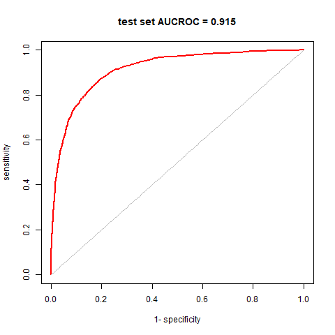
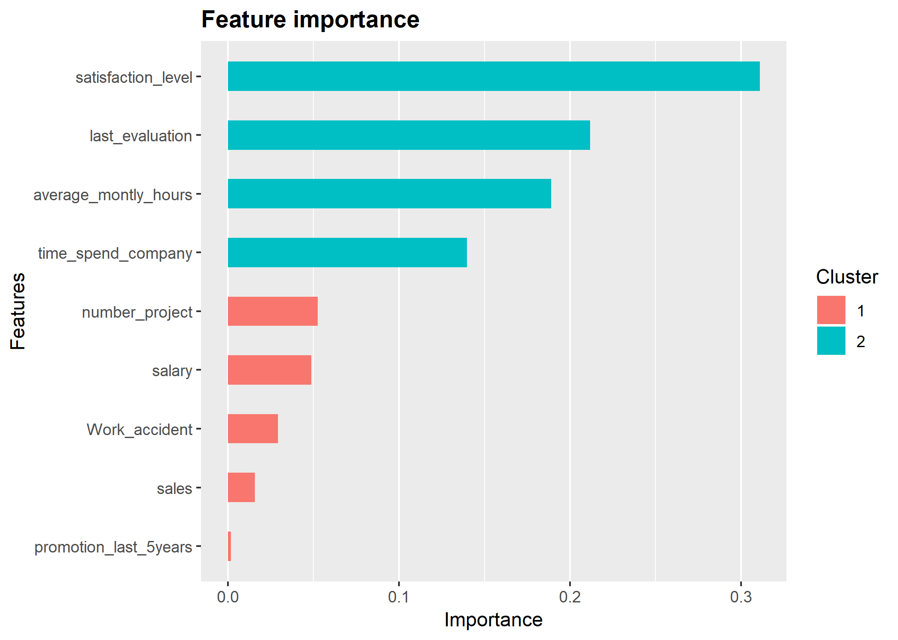
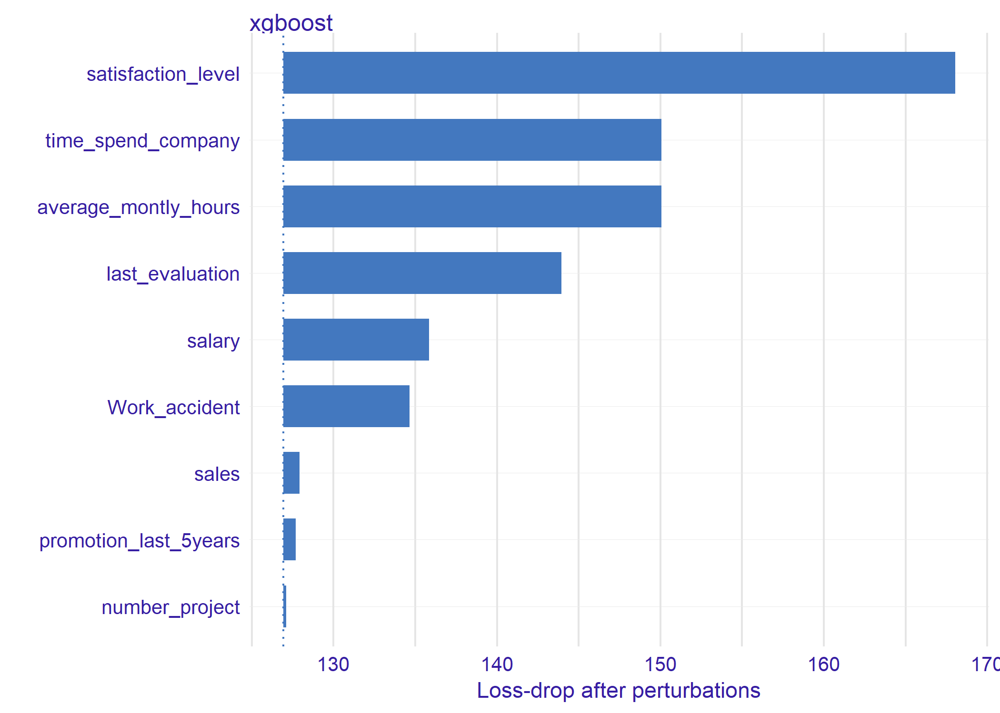

```{r setup, include=FALSE}
knitr::opts_knit$set(progress = TRUE, 
                     verbose  = TRUE, 
                     root.dir = ".")

knitr::opts_chunk$set(collapse = FALSE, 
                      comment = "", 
                      message = TRUE, 
                      warning = FALSE, 
                      include = TRUE,
                      echo    = TRUE)

```

```{r install.requirements, eval = FALSE}
install.packages("table1",      dependencies = TRUE)
install.packages("breakDown",   dependencies = TRUE)
install.packages("fastDummies", dependencies = TRUE)
install.packages("xgboost",     dependencies = TRUE)
install.packages("tidyverse",   dependencies = TRUE)
install.packages("AUC",         dependencies = TRUE)

install.packages("caret", dependencies = FALSE)

```

```{r require.packages, message=FALSE}
require(table1)
require(fastDummies)
require(xgboost)
require(tidyverse)
require(AUC)
require(caret)
require(DALEX)

```

# Data 

```{r}
HR_data <- read.csv("./input/HR_shuffle_and_noise.csv", header = TRUE)
HR_data %>% str

```

```{r}
table1(~ left +
         satisfaction_level + last_evaluation + number_project + 
         average_montly_hours + time_spend_company + 
         Work_accident + promotion_last_5years 
       | left, data = HR_data)

```

```{r}
table1(~ factor(sales) + factor(salary)
       | left, data = HR_data)

```
# Preparation

## create dummy cols

```{r data.prep}
set.seed(1234567)
trainset.size = 4000

# HR.dummy <- HR_data %>% 
#   dummy_cols(select_columns = c("sales", "salary"), remove_first_dummy = FALSE) %>% 
#   select(-sales, -salary, -sales_management, -salary_high)

HR.dummy <- HR_data %>%
  mutate(sales = factor(sales) %>% as.integer(),
         salary= factor(salary, levels = c("low","medium","high")) %>% as.integer())

pos.i <- which(HR.dummy$left == 1)
neg.i <- which(HR.dummy$left == 0)

train.pi <- sample(pos.i, trainset.size / 2)
train.ni <- sample(neg.i, trainset.size / 2)
train.i  <- c(train.pi, train.ni)
train.df     <- HR.dummy[train.i, ] 
train.label  <- HR.dummy[train.i, ]$left
train.matrix <- train.df %>% select(-left) %>% as.matrix()
train.xgb.DMatrix <- xgb.DMatrix(train.matrix, label = train.label, missing = NA)
table(train.label)

test.pi <- setdiff(pos.i, train.pi)
test.ni <- setdiff(neg.i, train.ni)
test.i  <- c(test.pi, test.ni)
test.df     <- HR.dummy[c(test.pi, test.ni), ] 
test.matrix <- test.df %>% select(-left) %>% as.matrix()
test.label  <- HR.dummy[test.i, ]$left
test.xgb.DMatrix <- xgb.DMatrix(test.matrix, missing = NA)
table(test.label)

```
# build XGBoost model

## parameter settings

see. https://xgboost.readthedocs.io/en/latest/parameter.html

```{r parameter.settings}
params <- list(
  booster      = "gbtree", # MUST be set booster = "gbtree" to build xgbExplainer
  objective    = "binary:logistic",
  eval_metric  = "auc",    # instead of "logloss", "error" and "aucpr"
  max_depth = 5,
  colsample_bytree= 0.8,
  subsample = 0.8,
  min_child_weight = 3,
  eta   = 0.05,
  alpha = 0.25,
  gamma = 0
) 

```

## search optimal number of booster with cross-validation

```{r xgb.cv}
cv <- xgb.cv(params  = params,
             verbose = 0, print_every_n = 20,
             data    = train.xgb.DMatrix,
             nrounds = 2000,
             nfold   = 5,
             early_stopping_rounds = 10)

print(cv, verbose=TRUE)

cv$evaluation_log %>% 
  select(-ends_with("_std")) %>% 
  tidyr::gather(key = data, value = auc, train_auc_mean, test_auc_mean) %>%
  ggplot(aes(x = iter, y = auc, color = as.factor(data))) +
  geom_line() +
  geom_vline(xintercept = cv$niter)

```

```{r}
model.xgb <- xgb.train(params  = params, 
                       verbose = 1,
                       data    = train.xgb.DMatrix,
                       nrounds = cv$best_iteration)

```


# Predictive performances with test set.

## Confusion Matrix and Statistics

```{r}
test.pred <- predict(model.xgb, test.xgb.DMatrix)
table(prediction = ifelse(test.pred > 0.5, 1, 0), 
      truth      = test.label) %>% 
  caret::confusionMatrix()

```

## predictive performance (AUCROC)

```{r fig.height=5, fig.width=5}
test.roc  <- roc(predictions = test.pred, 
                 labels      = as.factor(test.label))
png("./output/image.files/010_AUCROC_fullmodel.png", width = 480, height = 480)
plot(test.roc, col = "red", lwd = 2,
     main = sprintf("test set AUCROC = %.03f", auc(test.roc)))
dev.off()

```



## 

```{r}
test.pred <- predict(model.xgb, test.xgb.DMatrix)

prediction.counts <- table(test.pred, test.label) %>% 
  data.frame %>%
  mutate(
    predict = substr(test.pred, start = 1, stop = 3),
    count   = ifelse(test.label == "0", Freq, -Freq)) 

n.obs      <- test.pred %>% NROW()
n.rules    <- test.pred %>% unique() %>% NROW()
n.patterns <- prediction.counts %>% NROW()

prediction.counts %>% 
  ggplot(aes(x = reorder(predict, -as.numeric(predict)),
             y = count, 
             fill = test.label)) +
  geom_bar(stat="identity") +
  coord_flip() +
  labs(x = "prediction range") +
  ggtitle(sprintf("%i rules of %i obs. (%i patterns)", 
                  n.rules, n.obs, n.patterns))

```

# feature importance

## based on xgboost structure

The ggplot-backend method also performs 1-D custering of the importance values, with bar colors coresponding to different clusters that have somewhat similar importance values.

```{r xgb.importance}
var.imp <- xgb.importance(model = model.xgb,
                          feature_names = dimnames(train.xgb.DMatrix)[[2]])

var.imp %>% mutate_if(is.numeric, round, digits = 4)
ggp.var.imp <- xgb.ggplot.importance(var.imp)
ggsave(ggp.var.imp, filename = "./output/image.files/010_importance_xgb.png")
```




## based on permutation 

```{r explainer.DALEX}
explainer.xgb <- DALEX::explain(model.xgb, 
                                data  = test.matrix, 
                                y     = test.label, 
                                label = "xgboost")

vd.xgb <- variable_importance(explainer.xgb, type = "raw")
ggp.vd.xgb <- plot(vd.xgb)
ggsave(ggp.vd.xgb, filename = "./output/image.files/010_importance_perm.png")
```




# Save data and model

```{r save.object, message=FALSE, results="hide"}
res <- list(
  data = list(
    original = HR.dummy,
    train = list(
      dummy.data.frame = train.df,
      matrix = train.matrix,
      label  = train.label
    ),
    test = list(
      dummy.data.frame = test.df,
      matrix = test.matrix,
      label  = test.label
    )
  ),
  model = list(
    param.set = params,
    cv = cv,
    xgb = model.xgb
  )
)
 
saveRDS(res, file = "./middle/data_and_model.Rds")
xgb.DMatrix.save(train.xgb.DMatrix, fname = "./middle/train.xgbDMatrix")
xgb.DMatrix.save(test.xgb.DMatrix,  fname = "./middle/test.xgbDMatrix")

```


