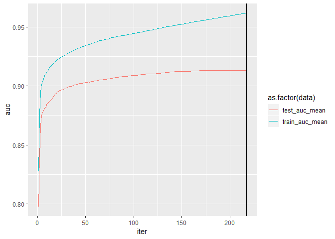
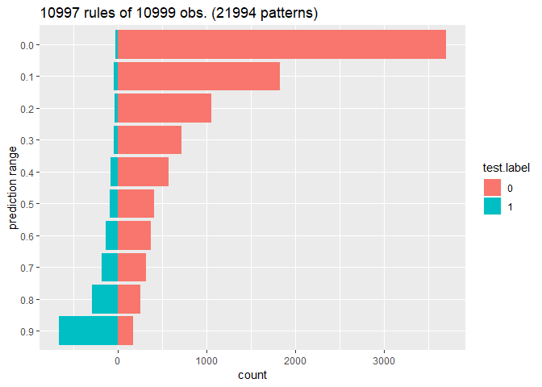

```r
install.packages("table1",      dependencies = TRUE)
install.packages("breakDown",   dependencies = TRUE)
install.packages("fastDummies", dependencies = TRUE)
install.packages("xgboost",     dependencies = TRUE)
install.packages("tidyverse",   dependencies = TRUE)
install.packages("AUC",         dependencies = TRUE)
install.packages("Ckmeans.1d.dp",dependencies = TRUE)

install.packages("caret", dependencies = FALSE)
```


```r
require(table1)
require(fastDummies)
require(xgboost)
require(tidyverse)
require(AUC)
require(caret)
require(DALEX)
```

# Data 


```r
HR_data <- read.csv("./input/HR_shuffle_and_noise.csv", header = TRUE)
HR_data %>% str
```

```
#> 'data.frame':	14999 obs. of  10 variables:
#>  $ left                 : int  1 0 1 0 0 1 0 0 0 1 ...
#>  $ satisfaction_level   : num  0.705 0.454 0.306 0.591 0.812 ...
#>  $ last_evaluation      : num  0.803 0.484 0.624 0.712 0.865 ...
#>  $ number_project       : int  9 9 9 11 8 8 8 13 7 5 ...
#>  $ average_montly_hours : int  275 275 293 323 301 154 235 192 259 160 ...
#>  $ time_spend_company   : int  6 4 6 4 5 4 7 4 9 4 ...
#>  $ Work_accident        : int  0 0 0 0 0 0 0 0 1 0 ...
#>  $ promotion_last_5years: int  0 0 0 0 0 0 0 0 1 0 ...
#>  $ sales                : Factor w/ 10 levels "accounting","hr",..: 8 3 3 10 10 6 2 10 2 8 ...
#>  $ salary               : Factor w/ 3 levels "high","low","medium": 2 2 2 2 1 2 2 2 3 3 ...
```


```r
table1(~ left +
         satisfaction_level + last_evaluation + number_project + 
         average_montly_hours + time_spend_company + 
         Work_accident + promotion_last_5years 
       | left, data = HR_data)
```

<!--html_preserve--><div class="Rtable1"><table class="Rtable1">
<thead>
<tr>
<th class='rowlabel firstrow lastrow'></th>
<th class='firstrow lastrow'><span class='stratlabel'>0<br><span class='stratn'>(n=11428)</span></span></th>
<th class='firstrow lastrow'><span class='stratlabel'>1<br><span class='stratn'>(n=3571)</span></span></th>
<th class='firstrow lastrow'><span class='stratlabel'>Overall<br><span class='stratn'>(n=14999)</span></span></th>
</tr>
</thead>
<tbody>
<tr>
<td class='rowlabel firstrow'><span class='varlabel'>left</span></td>
<td class='firstrow'></td>
<td class='firstrow'></td>
<td class='firstrow'></td>
</tr>
<tr>
<td class='rowlabel'>Mean (SD)</td>
<td>0.00 (0.00)</td>
<td>1.00 (0.00)</td>
<td>0.238 (0.426)</td>
</tr>
<tr>
<td class='rowlabel lastrow'>Median [Min, Max]</td>
<td class='lastrow'>0.00 [0.00, 0.00]</td>
<td class='lastrow'>1.00 [1.00, 1.00]</td>
<td class='lastrow'>0.00 [0.00, 1.00]</td>
</tr>
<tr>
<td class='rowlabel firstrow'><span class='varlabel'>satisfaction_level</span></td>
<td class='firstrow'></td>
<td class='firstrow'></td>
<td class='firstrow'></td>
</tr>
<tr>
<td class='rowlabel'>Mean (SD)</td>
<td>0.586 (0.186)</td>
<td>0.422 (0.216)</td>
<td>0.547 (0.205)</td>
</tr>
<tr>
<td class='rowlabel lastrow'>Median [Min, Max]</td>
<td class='lastrow'>0.599 [0.0242, 1.00]</td>
<td class='lastrow'>0.404 [0.00, 0.933]</td>
<td class='lastrow'>0.564 [0.00, 1.00]</td>
</tr>
<tr>
<td class='rowlabel firstrow'><span class='varlabel'>last_evaluation</span></td>
<td class='firstrow'></td>
<td class='firstrow'></td>
<td class='firstrow'></td>
</tr>
<tr>
<td class='rowlabel'>Mean (SD)</td>
<td>0.527 (0.198)</td>
<td>0.529 (0.227)</td>
<td>0.527 (0.205)</td>
</tr>
<tr>
<td class='rowlabel lastrow'>Median [Min, Max]</td>
<td class='lastrow'>0.525 [0.00, 0.999]</td>
<td class='lastrow'>0.533 [0.0771, 1.00]</td>
<td class='lastrow'>0.527 [0.00, 1.00]</td>
</tr>
<tr>
<td class='rowlabel firstrow'><span class='varlabel'>number_project</span></td>
<td class='firstrow'></td>
<td class='firstrow'></td>
<td class='firstrow'></td>
</tr>
<tr>
<td class='rowlabel'>Mean (SD)</td>
<td>7.78 (2.23)</td>
<td>7.88 (2.73)</td>
<td>7.80 (2.36)</td>
</tr>
<tr>
<td class='rowlabel lastrow'>Median [Min, Max]</td>
<td class='lastrow'>8.00 [2.00, 14.0]</td>
<td class='lastrow'>8.00 [2.00, 15.0]</td>
<td class='lastrow'>8.00 [2.00, 15.0]</td>
</tr>
<tr>
<td class='rowlabel firstrow'><span class='varlabel'>average_montly_hours</span></td>
<td class='firstrow'></td>
<td class='firstrow'></td>
<td class='firstrow'></td>
</tr>
<tr>
<td class='rowlabel'>Mean (SD)</td>
<td>246 (54.0)</td>
<td>254 (67.9)</td>
<td>248 (57.7)</td>
</tr>
<tr>
<td class='rowlabel lastrow'>Median [Min, Max]</td>
<td class='lastrow'>246 [96.0, 382]</td>
<td class='lastrow'>253 [124, 406]</td>
<td class='lastrow'>247 [96.0, 406]</td>
</tr>
<tr>
<td class='rowlabel firstrow'><span class='varlabel'>time_spend_company</span></td>
<td class='firstrow'></td>
<td class='firstrow'></td>
<td class='firstrow'></td>
</tr>
<tr>
<td class='rowlabel'>Mean (SD)</td>
<td>5.39 (2.11)</td>
<td>5.90 (1.74)</td>
<td>5.51 (2.04)</td>
</tr>
<tr>
<td class='rowlabel lastrow'>Median [Min, Max]</td>
<td class='lastrow'>5.00 [2.00, 14.0]</td>
<td class='lastrow'>6.00 [2.00, 10.0]</td>
<td class='lastrow'>5.00 [2.00, 14.0]</td>
</tr>
<tr>
<td class='rowlabel firstrow'><span class='varlabel'>Work_accident</span></td>
<td class='firstrow'></td>
<td class='firstrow'></td>
<td class='firstrow'></td>
</tr>
<tr>
<td class='rowlabel'>Mean (SD)</td>
<td>0.175 (0.380)</td>
<td>0.0473 (0.212)</td>
<td>0.145 (0.352)</td>
</tr>
<tr>
<td class='rowlabel lastrow'>Median [Min, Max]</td>
<td class='lastrow'>0.00 [0.00, 1.00]</td>
<td class='lastrow'>0.00 [0.00, 1.00]</td>
<td class='lastrow'>0.00 [0.00, 1.00]</td>
</tr>
<tr>
<td class='rowlabel firstrow'><span class='varlabel'>promotion_last_5years</span></td>
<td class='firstrow'></td>
<td class='firstrow'></td>
<td class='firstrow'></td>
</tr>
<tr>
<td class='rowlabel'>Mean (SD)</td>
<td>0.0263 (0.160)</td>
<td>0.00532 (0.0728)</td>
<td>0.0213 (0.144)</td>
</tr>
<tr>
<td class='rowlabel lastrow'>Median [Min, Max]</td>
<td class='lastrow'>0.00 [0.00, 1.00]</td>
<td class='lastrow'>0.00 [0.00, 1.00]</td>
<td class='lastrow'>0.00 [0.00, 1.00]</td>
</tr>
</tbody>
</table>
</div><!--/html_preserve-->


```r
table1(~ factor(sales) + factor(salary)
       | left, data = HR_data)
```

<!--html_preserve--><div class="Rtable1"><table class="Rtable1">
<thead>
<tr>
<th class='rowlabel firstrow lastrow'></th>
<th class='firstrow lastrow'><span class='stratlabel'>0<br><span class='stratn'>(n=11428)</span></span></th>
<th class='firstrow lastrow'><span class='stratlabel'>1<br><span class='stratn'>(n=3571)</span></span></th>
<th class='firstrow lastrow'><span class='stratlabel'>Overall<br><span class='stratn'>(n=14999)</span></span></th>
</tr>
</thead>
<tbody>
<tr>
<td class='rowlabel firstrow'><span class='varlabel'>factor(sales)</span></td>
<td class='firstrow'></td>
<td class='firstrow'></td>
<td class='firstrow'></td>
</tr>
<tr>
<td class='rowlabel'>accounting</td>
<td>563 (4.9%)</td>
<td>204 (5.7%)</td>
<td>767 (5.1%)</td>
</tr>
<tr>
<td class='rowlabel'>hr</td>
<td>524 (4.6%)</td>
<td>215 (6.0%)</td>
<td>739 (4.9%)</td>
</tr>
<tr>
<td class='rowlabel'>IT</td>
<td>954 (8.3%)</td>
<td>273 (7.6%)</td>
<td>1227 (8.2%)</td>
</tr>
<tr>
<td class='rowlabel'>management</td>
<td>539 (4.7%)</td>
<td>91 (2.5%)</td>
<td>630 (4.2%)</td>
</tr>
<tr>
<td class='rowlabel'>marketing</td>
<td>655 (5.7%)</td>
<td>203 (5.7%)</td>
<td>858 (5.7%)</td>
</tr>
<tr>
<td class='rowlabel'>product_mng</td>
<td>704 (6.2%)</td>
<td>198 (5.5%)</td>
<td>902 (6.0%)</td>
</tr>
<tr>
<td class='rowlabel'>RandD</td>
<td>666 (5.8%)</td>
<td>121 (3.4%)</td>
<td>787 (5.2%)</td>
</tr>
<tr>
<td class='rowlabel'>sales</td>
<td>3126 (27.4%)</td>
<td>1014 (28.4%)</td>
<td>4140 (27.6%)</td>
</tr>
<tr>
<td class='rowlabel'>support</td>
<td>1674 (14.6%)</td>
<td>555 (15.5%)</td>
<td>2229 (14.9%)</td>
</tr>
<tr>
<td class='rowlabel lastrow'>technical</td>
<td class='lastrow'>2023 (17.7%)</td>
<td class='lastrow'>697 (19.5%)</td>
<td class='lastrow'>2720 (18.1%)</td>
</tr>
<tr>
<td class='rowlabel firstrow'><span class='varlabel'>factor(salary)</span></td>
<td class='firstrow'></td>
<td class='firstrow'></td>
<td class='firstrow'></td>
</tr>
<tr>
<td class='rowlabel'>high</td>
<td>1155 (10.1%)</td>
<td>82 (2.3%)</td>
<td>1237 (8.2%)</td>
</tr>
<tr>
<td class='rowlabel'>low</td>
<td>5144 (45.0%)</td>
<td>2172 (60.8%)</td>
<td>7316 (48.8%)</td>
</tr>
<tr>
<td class='rowlabel lastrow'>medium</td>
<td class='lastrow'>5129 (44.9%)</td>
<td class='lastrow'>1317 (36.9%)</td>
<td class='lastrow'>6446 (43.0%)</td>
</tr>
</tbody>
</table>
</div><!--/html_preserve-->


# Preparation

## separate train / test


```r
set.seed(1234567)
trainset.size = 4000

HR.dummy <- HR_data %>%
  mutate(sales = factor(sales) %>% as.integer(),
         salary= factor(salary, levels = c("low","medium","high")) %>% as.integer())

pos.i <- which(HR.dummy$left == 1)
neg.i <- which(HR.dummy$left == 0)

train.pi <- sample(pos.i, trainset.size / 2)
train.ni <- sample(neg.i, trainset.size / 2)
train.i  <- c(train.pi, train.ni)
train.df     <- HR.dummy[train.i, ] 
train.label  <- HR.dummy[train.i, ]$left
train.matrix <- train.df %>% select(-left) %>% as.matrix()
train.xgb.DMatrix <- xgb.DMatrix(train.matrix, label = train.label, missing = NA)
table(train.label)
```

```
#> train.label
#>    0    1 
#> 2000 2000
```

```r
test.pi <- setdiff(pos.i, train.pi)
test.ni <- setdiff(neg.i, train.ni)
test.i  <- c(test.pi, test.ni)
test.df     <- HR.dummy[c(test.pi, test.ni), ] 
test.matrix <- test.df %>% select(-left) %>% as.matrix()
test.label  <- HR.dummy[test.i, ]$left
test.xgb.DMatrix <- xgb.DMatrix(test.matrix, missing = NA)
table(test.label)
```

```
#> test.label
#>    0    1 
#> 9428 1571
```
# build XGBoost model

## parameter settings

see. https://xgboost.readthedocs.io/en/latest/parameter.html


```r
params <- list(
  booster      = "gbtree", # MUST be set booster = "gbtree" to build xgbExplainer
  objective    = "binary:logistic",
  eval_metric  = "auc",    # instead of "logloss", "error" and "aucpr"
  max_depth = 5,
  colsample_bytree= 0.8,
  subsample = 0.8,
  min_child_weight = 3,
  eta   = 0.05,
  alpha = 0.25,
  gamma = 0
) 
```

## search optimal number of booster with cross-validation


```r
cv <- xgb.cv(params  = params,
             verbose = 0, print_every_n = 20,
             data    = train.xgb.DMatrix,
             nrounds = 2000,
             nfold   = 5,
             early_stopping_rounds = 10)

print(cv, verbose=TRUE)
```

```
#> ##### xgb.cv 5-folds
#> call:
#>   xgb.cv(params = params, data = train.xgb.DMatrix, nrounds = 2000, 
#>     nfold = 5, verbose = 0, print_every_n = 20, early_stopping_rounds = 10)
#> params (as set within xgb.cv):
#>   booster = "gbtree", objective = "binary:logistic", eval_metric = "auc", max_depth = "5", colsample_bytree = "0.8", subsample = "0.8", min_child_weight = "3", eta = "0.05", alpha = "0.25", gamma = "0", silent = "1"
#> callbacks:
#>   cb.evaluation.log()
#>   cb.early.stop(stopping_rounds = early_stopping_rounds, maximize = maximize, 
#>     verbose = verbose)
#> niter: 217
#> best_iteration: 207
#> best_ntreelimit: 207
#> evaluation_log:
#>     iter train_auc_mean train_auc_std test_auc_mean test_auc_std
#>        1      0.8273684   0.042921963     0.7975580   0.04395393
#>        2      0.8763388   0.017665793     0.8410626   0.02558067
#>        3      0.8948534   0.004209854     0.8665278   0.01504895
#>        4      0.9013862   0.003772338     0.8751420   0.01487342
#>        5      0.9040622   0.004404049     0.8779526   0.01697174
#> ---                                                             
#>      213      0.9614746   0.002697108     0.9133188   0.01289039
#>      214      0.9615336   0.002689193     0.9133128   0.01283188
#>      215      0.9616688   0.002661051     0.9132800   0.01281371
#>      216      0.9617984   0.002653891     0.9132976   0.01284036
#>      217      0.9618460   0.002661486     0.9133914   0.01290111
#> Best iteration:
#>  iter train_auc_mean train_auc_std test_auc_mean test_auc_std
#>   207      0.9606112   0.002692373     0.9134904   0.01283842
```

```r
cv$evaluation_log %>% 
  select(-ends_with("_std")) %>% 
  tidyr::gather(key = data, value = auc, train_auc_mean, test_auc_mean) %>%
  ggplot(aes(x = iter, y = auc, color = as.factor(data))) +
  geom_line() +
  geom_vline(xintercept = cv$niter)
```

<!-- -->


```r
model.xgb <- xgb.train(params  = params, 
                       verbose = 1,
                       data    = train.xgb.DMatrix,
                       nrounds = cv$best_iteration)
```


# Predictive performances with test set.

## Confusion Matrix and Statistics


```r
test.pred <- predict(model.xgb, test.xgb.DMatrix)
table(prediction = ifelse(test.pred > 0.5, 1, 0), 
      truth      = test.label) %>% 
  caret::confusionMatrix()
```

```
#> Confusion Matrix and Statistics
#> 
#>           truth
#> prediction    0    1
#>          0 7879  220
#>          1 1549 1351
#>                                          
#>                Accuracy : 0.8392         
#>                  95% CI : (0.8322, 0.846)
#>     No Information Rate : 0.8572         
#>     P-Value [Acc > NIR] : 1              
#>                                          
#>                   Kappa : 0.5144         
#>                                          
#>  Mcnemar's Test P-Value : <2e-16         
#>                                          
#>             Sensitivity : 0.8357         
#>             Specificity : 0.8600         
#>          Pos Pred Value : 0.9728         
#>          Neg Pred Value : 0.4659         
#>              Prevalence : 0.8572         
#>          Detection Rate : 0.7163         
#>    Detection Prevalence : 0.7363         
#>       Balanced Accuracy : 0.8478         
#>                                          
#>        'Positive' Class : 0              
#> 
```

## predictive performance (AUCROC)


```r
test.roc  <- roc(predictions = test.pred, 
                 labels      = as.factor(test.label))
png("./output/image.files/010_AUCROC_fullmodel.png", width = 480, height = 480)
plot(test.roc, col = "red", lwd = 2,
     main = sprintf("test set AUCROC = %.03f", auc(test.roc)))
dev.off()
```

```
#> png 
#>   2
```


## 


```r
test.pred <- predict(model.xgb, test.xgb.DMatrix)

prediction.counts <- table(test.pred, test.label) %>% 
  data.frame %>%
  mutate(
    predict = substr(test.pred, start = 1, stop = 3),
    count   = ifelse(test.label == "0", Freq, -Freq)) 

n.obs      <- test.pred %>% NROW()
n.rules    <- test.pred %>% unique() %>% NROW()
n.patterns <- prediction.counts %>% NROW()

prediction.counts %>% 
  ggplot(aes(x = reorder(predict, -as.numeric(predict)),
             y = count, 
             fill = test.label)) +
  geom_bar(stat="identity") +
  coord_flip() +
  labs(x = "prediction range") +
  ggtitle(sprintf("%i rules of %i obs. (%i patterns)", 
                  n.rules, n.obs, n.patterns))
```

<!-- -->

# feature importance

## based on xgboost structure

The ggplot-backend method also performs 1-D custering of the importance values, with bar colors coresponding to different clusters that have somewhat similar importance values.


```r
var.imp <- xgb.importance(model = model.xgb,
                          feature_names = dimnames(train.xgb.DMatrix)[[2]])

var.imp %>% mutate_if(is.numeric, round, digits = 4)
```

```
#>                 Feature   Gain  Cover Frequency
#> 1    satisfaction_level 0.3048 0.2536    0.2388
#> 2       last_evaluation 0.2185 0.1904    0.2289
#> 3  average_montly_hours 0.2058 0.1583    0.2050
#> 4    time_spend_company 0.1305 0.1670    0.1175
#> 5        number_project 0.0509 0.0696    0.0941
#> 6         Work_accident 0.0382 0.0531    0.0236
#> 7                salary 0.0353 0.0687    0.0374
#> 8                 sales 0.0138 0.0219    0.0481
#> 9 promotion_last_5years 0.0023 0.0175    0.0066
```

```r
ggp.var.imp <- xgb.ggplot.importance(var.imp)
ggsave(ggp.var.imp, filename = "./output/image.files/010_importance_xgb.png")
```

```
#> Saving 7 x 5 in image
```


## based on permutation 


```r
explainer.xgb <- DALEX::explain(model.xgb, 
                                data  = test.matrix, 
                                y     = test.label, 
                                label = "xgboost")

vd.xgb <- variable_importance(explainer.xgb, type = "raw")
ggp.vd.xgb <- plot(vd.xgb)
ggsave(ggp.vd.xgb, filename = "./output/image.files/010_importance_perm.png")
```

```
#> Saving 7 x 5 in image
```


# Save data and model


```r
res <- list(
  data = list(
    original = HR.dummy,
    train = list(
      dummy.data.frame = train.df,
      matrix = train.matrix,
      label  = train.label
    ),
    test = list(
      dummy.data.frame = test.df,
      matrix = test.matrix,
      label  = test.label
    )
  ),
  model = list(
    param.set = params,
    cv = cv,
    xgb = model.xgb
  )
)

if(! dir.exists("./middle/")) {
  dir.create("./middle/")
}
saveRDS(res, file = "./middle/data_and_model.Rds")
```


