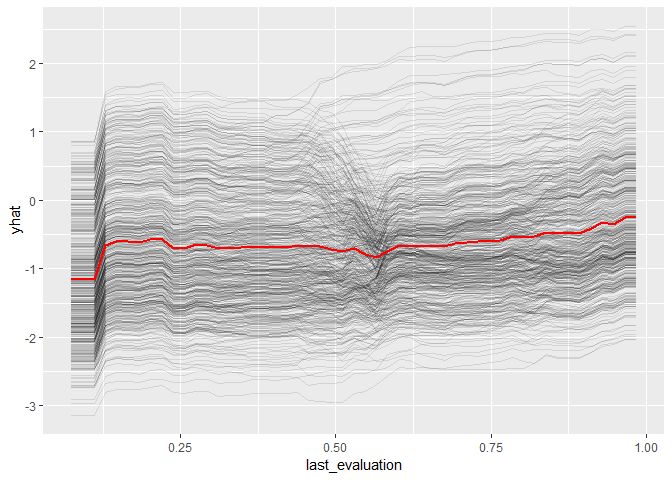

```r
install.packages("pdp", dependencies = TRUE)
```


```r
require(tidyverse)
require(xgboost)

require(pdp)
require(DALEX)
```

# Preparation (continued)


```r
loaded.obs  <- readRDS("./middle/data_and_model.Rds")
# loaded.obs %>% str
model.xgb   <- loaded.obs$model$xgb 

train.label <- loaded.obs$data$train$label
train.matrix <- loaded.obs$data$train$matrix
train.xgb.DMatrix <- xgb.DMatrix("./middle/train.xgbDMatrix")
```

```
[15:47:21] 4000x9 matrix with 36000 entries loaded from ./middle/train.xgbDMatrix
```

```r
test.label  <- loaded.obs$data$test$label
test.matrix <- loaded.obs$data$test$matrix
test.xgb.DMatrix  <- xgb.DMatrix("./middle/test.xgbDMatrix")
```

```
[15:47:21] 10999x9 matrix with 98991 entries loaded from ./middle/test.xgbDMatrix
```
# Target features

Target features to watch feature responces are filterd using `xgb.importance()`


```r
explainer.xgb <- DALEX::explain(model.xgb, 
                                data  = test.matrix, 
                                y     = test.label, 
                                label = "xgboost")

var.imp <- xgb.importance(model = model.xgb,
                          feature_names = dimnames(train.xgb.DMatrix)[[2]])

var.imp %>% mutate_if(is.numeric, round, digits = 4)
```

```
                Feature   Gain  Cover Frequency
1    satisfaction_level 0.3111 0.2191    0.2150
2       last_evaluation 0.2117 0.1746    0.2066
3  average_montly_hours 0.1890 0.1740    0.2112
4    time_spend_company 0.1399 0.1621    0.1186
5        number_project 0.0525 0.0754    0.1133
6                salary 0.0487 0.0884    0.0446
7         Work_accident 0.0293 0.0474    0.0212
8                 sales 0.0160 0.0464    0.0638
9 promotion_last_5years 0.0018 0.0126    0.0057
```

```r
target.feature <- var.imp$Feature %>% head(6)
```
In this example, target features are satisfaction_level, last_evaluation, average_montly_hours, time_spend_company, number_project, salary

# Marginal Response for a Single Variable

##  ICE + PDP

individual conditional expectation (ICE) & Partial Dependence Plots (PDP) was drawn by subsample instances (due to large size)


```r
sub.sample <- sample(NROW(test.matrix), 500)
sub.matrix <- test.matrix[sub.sample, ]
sub.label  <- test.label[sub.sample]

plot.pdps <- list()
for(feature.name in target.feature){
  plot.pdps[[feature.name]] <- pdp::partial(
    model.xgb, 
    pred.var = feature.name,
    train    = sub.matrix, 
    plot  = TRUE, 
    rug   = TRUE,
    ice   = TRUE, 
    alpha = 0.1,
    plot.engine = "ggplot2") #+ ggtitle(sprintf("ICE + PDP: %s", feature.name))
}
plot.pdps[[1]]
```

<!-- -->

## Accumulated Local Effects Plots (ALE Plot)


```r
plot.ales <- list()
for(feature.name in target.feature){
  ale <- variable_response(explainer.xgb,
                           variable =  feature.name,
                           type = "ale", labels = NULL)
  plot.ales[[feature.name]] <- plot(ale) + theme(legend.position = 'none')# + ggtitle(feature.name)
}
plot.ales[[1]] 
```

<!-- -->


```r
ggp.varRes <- gridExtra::grid.arrange(grobs = c(plot.pdps, plot.ales), nrow = 2)
ggsave(ggp.varRes, filename = "./output/image.files/200_pdp-ale.png", width = 12, height = 4)
```


# SHAP contribution dependency plots

**According to man(xgb.plot.shap)::Detail**

Visualizing the SHAP feature contribution to prediction dependencies on feature value.

These scatterplots represent how SHAP feature contributions depend of feature values. The similarity to partial dependency plots is that they also give an idea for how feature values affect predictions. However, in partial dependency plots, we usually see marginal dependencies of model prediction on feature value, while SHAP contribution dependency plots display the estimated contributions of a feature to model prediction for each individual case.

When plot_loess = TRUE is set, feature values are rounded to 3 significant digits and weighted LOESS is computed and plotted, where weights are the numbers of data points at each rounded value.

Note: SHAP contributions are shown on the scale of model margin. E.g., for a logistic binomial objective, the margin is prediction before a sigmoidal transform into probability-like values. Also, since SHAP stands for "SHapley Additive exPlanation" (model prediction = sum of SHAP contributions for all features + bias), depending on the objective used, transforming SHAP contributions for a feature from the marginal to the prediction space is not necessarily a meaningful thing to do.


```r
png(filename = "./output/image.files/200_SHAP.png", width = 1200, height = 400, pointsize = 24)
shap <- xgb.plot.shap(data  = train.matrix,
              model = model.xgb, 
              # sabsumple = 300,
              top_n = 6,
              n_col = 6, col = col, pch = 7, pch_NA = 17)
dev.off()
```

```
png 
  2 
```


