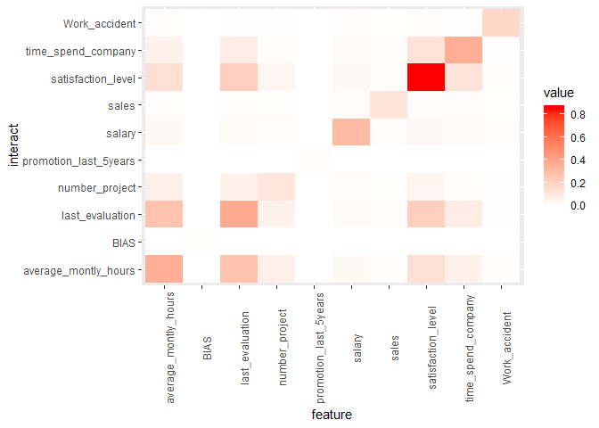

```r
install.packages("devtools", dependencies = TRUE)
devtools::install_github("AppliedDataSciencePartners/xgboostExplainer")

install.packages("ggridges", dependencies = TRUE)

```


```r
require(tidyverse)
require(magrittr)
require(data.table)
require(xgboost)
require(xgboostExplainer)
require(ggridges)

```

# Preparation 


```r
loaded.obs  <- readRDS("./middle/data_and_model.Rds")

model.xgb   <- loaded.obs$model$xgb 

train.label <- loaded.obs$data$train$label
train.matrix <- loaded.obs$data$train$matrix
train.xgb.DMatrix <- xgb.DMatrix(train.matrix, label = train.label, missing = NA)

test.label  <- loaded.obs$data$test$label
test.matrix <- loaded.obs$data$test$matrix
test.xgb.DMatrix  <- xgb.DMatrix(test.matrix, missing = NA)
```

# breakdown obsavation

## Using Shapley value

According to help(xgboost:::predict.xgb.Booster)@Details

Setting `predcontrib = TRUE` allows to calculate contributions of each feature to individual predictions. 

*  For "gblinear" booster, feature contributions are simply linear terms (feature_beta * feature_value). 
*  For "gbtree" booster, feature contributions are SHAP values (Lundberg 2017) that sum to the difference between the expected output of the model and the current prediction (where the hessian weights are used to compute the expectations). 


```r
prediction.xgb <- xgboost:::predict.xgb.Booster(
  model.xgb, newdata = train.matrix)

predShap.xgb <- xgboost:::predict.xgb.Booster(
  model.xgb, newdata = train.matrix, 
  predcontrib = TRUE, approxcontrib = FALSE)

prediction.xgb %>% head
[1] 0.7638327 0.5797617 0.6781101 0.9207772 0.4998003 0.9250071
weight.shap <- predShap.xgb %>% head %>% rowSums()
weight.shap
[1]  1.17380781  0.32179525  0.74510061  2.45295302 -0.00079815  2.51240769
1/(1 + exp(-weight.shap))
[1] 0.7638326 0.5797617 0.6781102 0.9207771 0.4998005 0.9250071
```


```r
source("./R/waterfallBreakdown.R")
breakdown <- list(
  type = "binary",
  weight = weight.shap[1],
  breakdown_summary = predShap.xgb[1, ],
  labels = colnames(predShap.xgb)
)
ggp.shap <- waterfallBreakdown(breakdown) + ggtitle("SHAP estimates")
ggsave(ggp.shap, filename = "./output/image.files/210_breakdownSHAP.png",
       width = 5, height = 3.5)
```


# SHAP contribution dependency plots

**According to man(xgb.plot.shap)::Detail**

Visualizing the SHAP feature contribution to prediction dependencies on feature value.

These scatterplots represent how SHAP feature contributions depend of feature values. The similarity to partial dependency plots is that they also give an idea for how feature values affect predictions. However, in partial dependency plots, we usually see marginal dependencies of model prediction on feature value, while SHAP contribution dependency plots display the estimated contributions of a feature to model prediction for each individual case.

When plot_loess = TRUE is set, feature values are rounded to 3 significant digits and weighted LOESS is computed and plotted, where weights are the numbers of data points at each rounded value.

Note: SHAP contributions are shown on the scale of model margin. E.g., for a logistic binomial objective, the margin is prediction before a sigmoidal transform into probability-like values. Also, since SHAP stands for "SHapley Additive exPlanation" (model prediction = sum of SHAP contributions for all features + bias), depending on the objective used, transforming SHAP contributions for a feature from the marginal to the prediction space is not necessarily a meaningful thing to do.


```r
png(filename = "./output/image.files/210_varresp_SHAP.png", width = 1200, height = 400, pointsize = 24)
shap <- xgb.plot.shap(data  = train.matrix,
              model = model.xgb, 
              # sabsumple = 300,
              top_n = 6,
              n_col = 6, col = col, pch = 7, pch_NA = 17)
dev.off()
png 
  2 
```


# SHAP values of contributions of interaction of each pair of features 

With `predinteraction = TRUE`, SHAP values of contributions of interaction of each pair of features are computed. Note that this operation might be rather expensive in terms of compute and memory. Since it quadratically depends on the number of features, it is recommended to perfom selection of the most important features first. See below about the format of the returned results.


```r
predinteraction.xgb <- xgboost:::predict.xgb.Booster(
  model.xgb, newdata = train.matrix, 
  predinteraction = TRUE)
```

```r
predinteraction.xgb %>% str
 num [1:4000, 1:10, 1:10] -1.055 -1.159 0.114 1.339 -1.195 ...
 - attr(*, "dimnames")=List of 3
  ..$ : NULL
  ..$ : chr [1:10] "satisfaction_level" "last_evaluation" "number_project" "average_montly_hours" ...
  ..$ : chr [1:10] "satisfaction_level" "last_evaluation" "number_project" "average_montly_hours" ...
mea.interaction <- apply(abs(predinteraction.xgb), 2:3, sum) / NROW(predinteraction.xgb)

mea.interaction %>% 
  data.frame %>% 
  rownames_to_column("feature") %>% 
  gather(key = interact, value = value, -feature) %>% 
  mutate_at(vars(feature, interact), as.factor) %>% 
  ggplot(aes(x = feature, y = interact, fill = value)) +
  geom_tile() +
  scale_fill_gradient(low="white",high="red") +
  theme(axis.text.x = element_text(angle = 90))
```

<!-- -->

