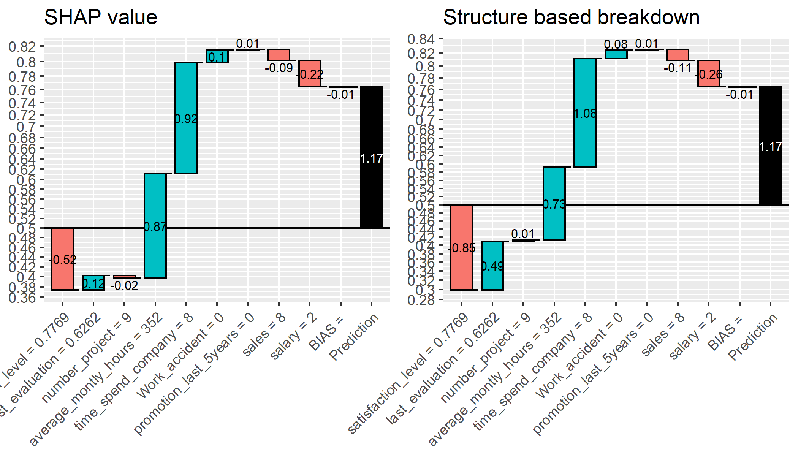

```{r setup, include=FALSE}
knitr::opts_knit$set(progress = TRUE, 
                     verbose  = TRUE, 
                     root.dir = ".")

knitr::opts_chunk$set(collapse = TRUE, 
                      comment = "", 
                      message = TRUE, 
                      warning = FALSE, 
                      include = TRUE,
                      echo    = TRUE)

set.seed(1)
```

```{r install.requirements, eval = FALSE}
install.packages("Rtsne", dependencies = TRUE)
install.packages("uwot", dependencies = TRUE)
install.packages("ggdendro", dependencies = TRUE)
install.packages("ggrepel", dependencies = TRUE)

```

```{r require.packages, message=FALSE}
require(tidyverse)
require(magrittr)
require(xgboost)

require(Rtsne)
require(uwot)
library(ggdendro)
require(ggrepel)

```

# Preparation 

If file = "./middle/data_and_model.Rds" doesn't exist, RUN `100_building_xgboost_model.Rmd`.

```{r load.model.and.data}
loaded.obs  <- readRDS("./middle/data_and_model.Rds")

model.xgb   <- loaded.obs$model$xgb 

train.label <- loaded.obs$data$train$label
train.matrix <- loaded.obs$data$train$matrix
train.xgb.DMatrix <- xgb.DMatrix(train.matrix, label = train.label, missing = NA)

test.label  <- loaded.obs$data$test$label
test.matrix <- loaded.obs$data$test$matrix
test.xgb.DMatrix  <- xgb.DMatrix(test.matrix, missing = NA)

```

# breakdown obsavation

## Using built-in predict() function.

```{r}
prediction.xgb <- xgboost:::predict.xgb.Booster(
  model.xgb, newdata = train.matrix)

```

### `predleaf = TRUE`	

predict leaf index.

```{r}
predleaf.xgb <- xgboost:::predict.xgb.Booster(
  model.xgb, newdata = train.matrix, 
  predleaf = TRUE)

predleaf.xgb[1:4, 1:8]

```

### `predcontrib = TRUE, approxcontrib = FALSE`	

allows to calculate contributions of each feature to individual predictions. 

*  For "gblinear" booster, feature contributions are simply linear terms (feature_beta * feature_value). 
*  For "gbtree" booster, feature contributions are SHAP values (Lundberg 2017) that sum to the difference between the expected output of the model and the current prediction (where the hessian weights are used to compute the expectations).


```{r}
shap.xgb <- xgboost:::predict.xgb.Booster(
  model.xgb, newdata = train.matrix, 
  predcontrib = TRUE, approxcontrib = FALSE)

shap.xgb %>% head(4) %>% t

```

```{r}
prediction.xgb %>% head()
weight.shap <- shap.xgb %>% rowSums()
weight.shap %>% head
1/(1 + exp(-weight.shap)) %>% head

```


### `predcontrib = TRUE, approxcontrib = TRUE`	

For "gbtree" booster, SHAP values are approximated by structureal based. The contribution of each feature is not a single predetermined value, but depends on the rest of the feature vector which determines the decision path that traverses the tree and thus the guards/contributions that are passed along the way.

see: http://blog.datadive.net/interpreting-random-forests/


```{r}
approxcontrib.xgb <- xgboost:::predict.xgb.Booster(
  model.xgb, newdata = train.matrix, 
  predcontrib = TRUE, approxcontrib = TRUE)

approxcontrib.xgb %>% head(4) %>% t

```

```{r}
prediction.xgb %>% head()
weight.app <- approxcontrib.xgb %>% rowSums()
weight.app %>% head
1/(1 + exp(-weight.app)) %>% head

```

### Comparison of SHAP vs Structure based explanation

Approximation by SHAP & by Tree Strucure were different ,sightly (in this case).

```{r, results="hide"}
source("./R/waterfallBreakdown.R")

ggp.shap <- waterfallBreakdown(
  breakdown = unlist(shap.xgb[1, ]), type = "binary",
  labels = paste(colnames(shap.xgb), 
                 c(train.matrix[1, ],""), sep =" = ")) +
  ggtitle("SHAP value")

ggp.approxcontrib.xgb <- waterfallBreakdown(
  breakdown = unlist(approxcontrib.xgb[1, ]), type = "binary",
  labels = paste(colnames(approxcontrib.xgb), 
                 c(train.matrix[1, ],""), sep =" = ")) +
  ggtitle("Structure based breakdown")

ggp.exp.comparison <- gridExtra::arrangeGrob(
  ggp.shap, 
  ggp.approxcontrib.xgb,
  ncol = 2
)

ggsave(ggp.exp.comparison, filename = "./output/image.files/400_explain_SHAP_vs_Structure.png",
       width = 7, height = 4)

```



