```r
install.packages("Rtsne", dependencies = TRUE)
install.packages("uwot", dependencies = TRUE)
install.packages("ggdendro", dependencies = TRUE)
install.packages("ggrepel", dependencies = TRUE)

```


```r
require(tidyverse)
require(magrittr)
require(xgboost)

require(Rtsne)
require(uwot)
library(ggdendro)
require(ggrepel)
```

# Preparation 

If file = "./middle/data_and_model.Rds" doesn't exist, RUN `100_building_xgboost_model.Rmd`.


```r
loaded.obs  <- readRDS("./middle/data_and_model.Rds")

model.xgb   <- loaded.obs$model$xgb 

train.label <- loaded.obs$data$train$label
train.matrix <- loaded.obs$data$train$matrix
train.xgb.DMatrix <- xgb.DMatrix(train.matrix, label = train.label, missing = NA)

test.label  <- loaded.obs$data$test$label
test.matrix <- loaded.obs$data$test$matrix
test.xgb.DMatrix  <- xgb.DMatrix(test.matrix, missing = NA)
```

# breakdown obsavation

## Using built-in predict() function.


```r
prediction.xgb <- xgboost:::predict.xgb.Booster(
  model.xgb, newdata = train.matrix)
```

### `predleaf = TRUE`	

predict leaf index.


```r
predleaf.xgb <- xgboost:::predict.xgb.Booster(
  model.xgb, newdata = train.matrix, 
  predleaf = TRUE)

predleaf.xgb[1:4, 1:8]
     [,1] [,2] [,3] [,4] [,5] [,6] [,7] [,8]
[1,]   48   47   49   26   44   34   40   49
[2,]   48   44   45   19   40   34   40   44
[3,]   35   42   42   19   35   27   27   40
[4,]   30   29   28   19   27   23   26   33
```

### `predcontrib = TRUE, approxcontrib = FALSE`	

allows to calculate contributions of each feature to individual predictions. 

*  For "gblinear" booster, feature contributions are simply linear terms (feature_beta * feature_value). 
*  For "gbtree" booster, feature contributions are SHAP values (Lundberg 2017) that sum to the difference between the expected output of the model and the current prediction (where the hessian weights are used to compute the expectations).


```r
shap.xgb <- xgboost:::predict.xgb.Booster(
  model.xgb, newdata = train.matrix, 
  predcontrib = TRUE, approxcontrib = FALSE)

shap.xgb %>% head(4) %>% t
                              [,1]         [,2]         [,3]         [,4]
satisfaction_level    -0.515436172 -0.586677372  0.525480807  2.053030491
last_evaluation        0.121358186  0.369296879  0.057982970 -0.399072826
number_project        -0.022691106  0.437221318 -0.095180556  0.096285738
average_montly_hours   0.872058332 -0.126130879 -0.131584838  0.393718511
time_spend_company     0.924191236  0.174715430  0.149822012 -0.294579685
Work_accident          0.100723140  0.089056358  0.109960638  0.114590660
promotion_last_5years  0.006513606  0.006683344  0.004951648  0.005639516
sales                 -0.089338966  0.129772797 -0.278872371  0.240690008
salary                -0.218401656 -0.166973829  0.407709092  0.247819394
BIAS                  -0.005168790 -0.005168790 -0.005168790 -0.005168790
```


```r
prediction.xgb %>% head()
[1] 0.7638327 0.5797617 0.6781101 0.9207772 0.4998003 0.9250071
weight.shap <- shap.xgb %>% rowSums()
weight.shap %>% head
[1]  1.17380781  0.32179525  0.74510061  2.45295302 -0.00079815  2.51240769
1/(1 + exp(-weight.shap)) %>% head
[1] 0.7638326 0.5797617 0.6781102 0.9207771 0.4998005 0.9250071
```


```r
source("./R/waterfallBreakdown.R")

ggp.shap <- waterfallBreakdown(
  breakdown = unlist(shap.xgb[1, ]), type = "binary",
  labels = paste(colnames(shap.xgb), 
                 c(train.matrix[1, ],""), sep =" = ")) +
  ggtitle("SHAP value")

ggsave(ggp.shap, filename = "./output/image.files/400_explain_single_obs_SHAP.png",
       width = 3.5, height = 4)
```


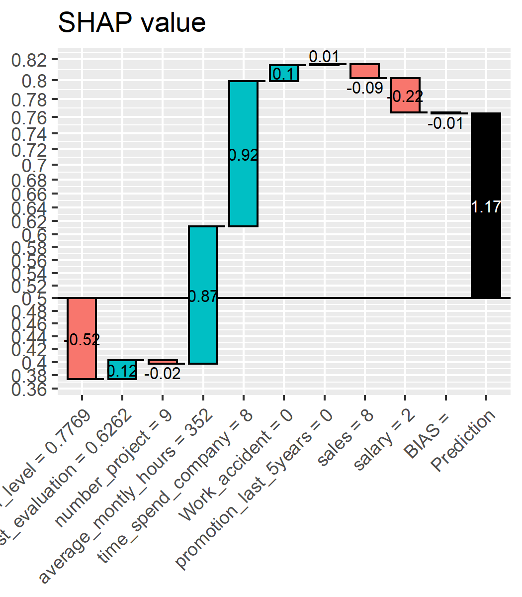

### `predcontrib = TRUE, approxcontrib = TRUE`	

For "gbtree" booster, SHAP values are approximated by structureal based. The contribution of each feature is not a single predetermined value, but depends on the rest of the feature vector which determines the decision path that traverses the tree and thus the guards/contributions that are passed along the way.

see: http://blog.datadive.net/interpreting-random-forests/


```r
approxcontrib.xgb <- xgboost:::predict.xgb.Booster(
  model.xgb, newdata = train.matrix, 
  predcontrib = TRUE, approxcontrib = TRUE)

approxcontrib.xgb %>% head(4) %>% t
                              [,1]        [,2]         [,3]         [,4]
satisfaction_level    -0.851062775 -1.03873408  0.242545545  1.469222069
last_evaluation        0.486733913  0.50859427  0.330951124 -0.174049839
number_project         0.013652145  0.46546915 -0.017210312  0.244320467
average_montly_hours   0.727571428  0.11346900 -0.152285829  0.345401347
time_spend_company     1.080609798  0.20075803  0.145100608 -0.015326169
Work_accident          0.083896913  0.08231058  0.104428932  0.106792673
promotion_last_5years  0.006930237  0.00605675  0.005063735  0.004602843
sales                 -0.108526632  0.13844064 -0.250824898  0.242727458
salary                -0.260827631 -0.14940006  0.342500240  0.234431952
BIAS                  -0.005168790 -0.00516879 -0.005168790 -0.005168790
```


```r
prediction.xgb %>% head()
[1] 0.7638327 0.5797617 0.6781101 0.9207772 0.4998003 0.9250071
weight.app <- approxcontrib.xgb %>% rowSums()
weight.app %>% head
[1]  1.1738086063  0.3217955003  0.7451003548  2.4529540115 -0.0007986953
[6]  2.5124074277
1/(1 + exp(-weight.app)) %>% head
[1] 0.7638327 0.5797618 0.6781102 0.9207772 0.4998003 0.9250071
```


```r
source("./R/waterfallBreakdown.R")

ggp.approxcontrib.xgb <- waterfallBreakdown(
  breakdown = unlist(approxcontrib.xgb[1, ]), type = "binary",
  labels = paste(colnames(approxcontrib.xgb), 
                 c(train.matrix[1, ],""), sep =" = ")) +
  ggtitle("Structure based breakdown")

ggsave(ggp.approxcontrib.xgb,
       filename = "./output/image.files/400_explain_single_obs_structure.png",
       width = 3.5, height = 4)
```


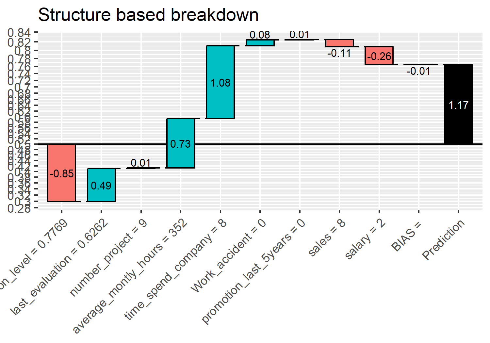


# clustering of observation based on breakdown

## dimension reduction using t-SNE

according to :
http://jmonlong.github.io/Hippocamplus/2017/12/02/tsne-and-clustering/


```r
# approxcontrib.xgb %>% str
# prediction.xgb %>% str

approxcontrib.xgb.tsne <- approxcontrib.xgb %>% 
  # data.frame() %>% 
  data.frame(pred = prediction.xgb) %>% 
  select(-BIAS) %>%
  Rtsne::Rtsne(perplexity = 50, check_duplicates = FALSE)

# approxcontrib.xgb.tsne %>% str

mapping.tsne <- data.frame(
  id     = 1:length(prediction.xgb),
  dim1  = approxcontrib.xgb.tsne$Y[, 1],
  dim2  = approxcontrib.xgb.tsne$Y[, 2],
  pred   = prediction.xgb,
  weight = weight.app)

ggp.tsne <- mapping.tsne %>% 
  ggplot(aes(x = dim1, y = dim2, colour = prediction.xgb)) + 
    geom_point(alpha = 0.3) + theme_bw() +
  scale_color_gradient2(midpoint=0.5, low="blue", mid="gray", high="red") + 
  guides(colour = FALSE) + 
  labs(title = "t-SNE")
ggp.tsne
```

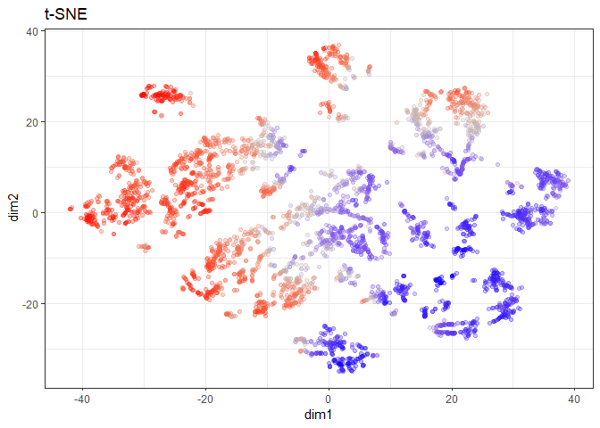<!-- -->

```r
ggsave(ggp.tsne, filename =  "./output/image.files/400_map_tSNE.png",
    height = 5, width = 7)
```

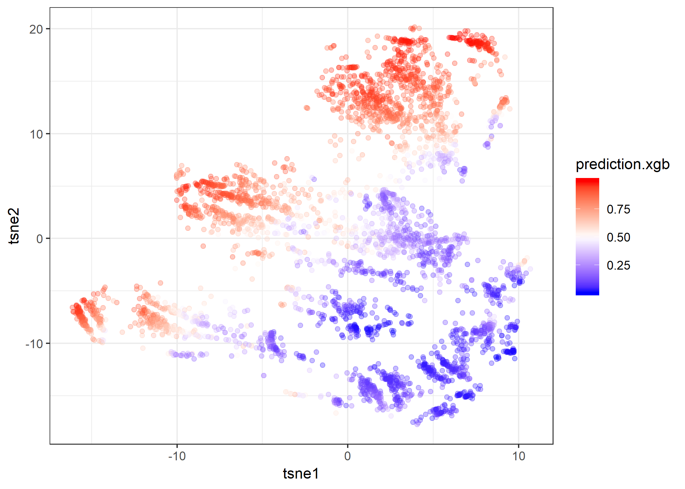


## Hierarchical clustering


```r
approxcontrib.xgb.tsne.hc <- mapping.tsne %>% 
  select(-id) %>% 
  as.matrix() %>% 
  dist() %>% 
  hclust()
approxcontrib.xgb.tsne.hc

Call:
hclust(d = .)

Cluster method   : complete 
Distance         : euclidean 
Number of objects: 4000 
```

### explore cut.off for cutree


```r
library(ggdendro)

cut.off = 12

ggd.breakdown <- ggdendrogram(approxcontrib.xgb.tsne.hc, rotate = TRUE, size = 2) +
  geom_hline(yintercept = cut.off, color = "red")

ggsave(ggd.breakdown, filename =  "./output/image.files/400_hclust_rules.png",
    height = 12, width = 7)
```

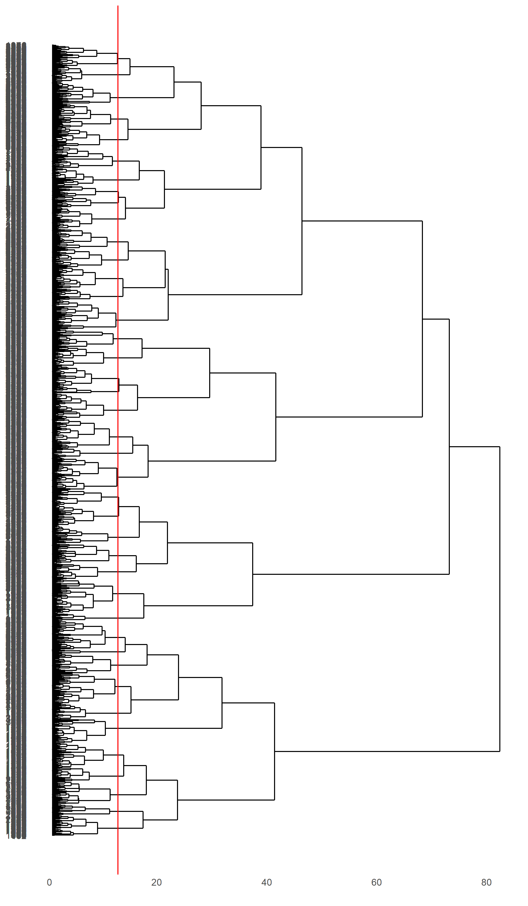


```r
require(ggrepel)

mapping.tsne$hclust <- approxcontrib.xgb.tsne.hc %>%
  cutree(h = cut.off) %>%
  factor()

hc.cent <- mapping.tsne %>% 
  group_by(hclust) %>%
  select(dim1, dim2) %>% 
  summarize_all(mean)
Adding missing grouping variables: `hclust`

map.tsne.labeled <- mapping.tsne %>% 
  ggplot(aes(x = dim1, y = dim2, colour = hclust)) + 
  geom_point(alpha = 0.3) + 
  theme_bw() +
  ggrepel::geom_label_repel(data = hc.cent, aes(label = hclust)) + 
  guides(colour = FALSE)

ggsave(map.tsne.labeled, filename =  "./output/image.files/400_map_tSNE_labeled.png",
    height = 7, width = 7)
```

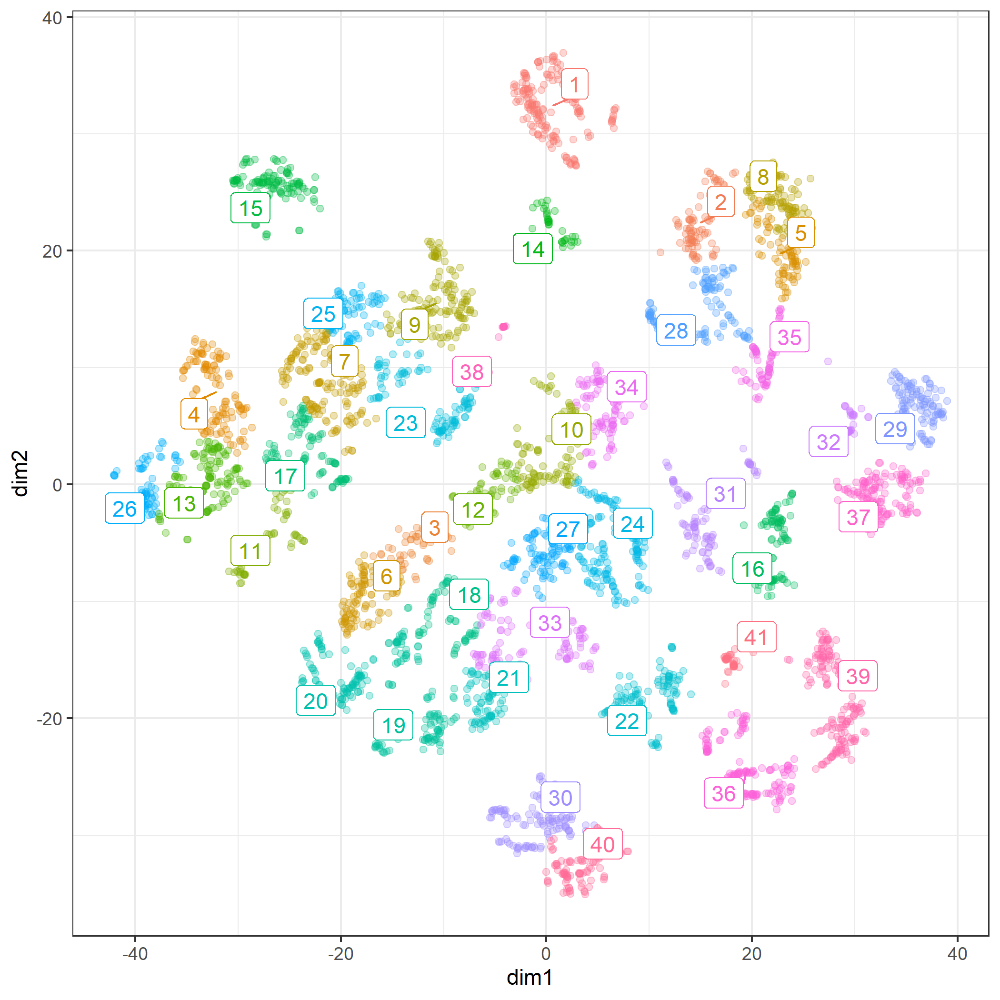


## dimension reduction using UMAP

according to :
https://rdrr.io/cran/uwot/man/umap.html


### non-optional


```r
approxcontrib.xgb.umap <- approxcontrib.xgb %>% 
  data.frame() %>% 
  select(-BIAS) %>%
  uwot::umap()

approxcontrib.xgb.umap %>% str
 num [1:4000, 1:2] 7.45 8.51 -2.14 -10.12 11.33 ...
 - attr(*, "scaled:center")= num [1:2] 0.553 -0.136

mapping.umap <- data.frame(
  id     = 1:length(prediction.xgb),
  dim1  = approxcontrib.xgb.umap[, 1],
  dim2  = approxcontrib.xgb.umap[, 2],
  pred   = prediction.xgb,
  weight = weight.app)
# mapping.umap %>% str

ggp.umap <- mapping.umap %>% 
  ggplot(aes(x = dim1, y = dim2, colour = prediction.xgb)) + 
    geom_point(alpha = 0.3) + theme_bw() +
  scale_color_gradient2(midpoint=0.5, low="blue", mid="gray", high="red") + 
  guides(colour = FALSE) + 
  labs(title = "UMAP (without label)") 

ggsave(ggp.umap, filename =  "./output/image.files/400_map_umap.png",
       height = 5, width = 7)
```

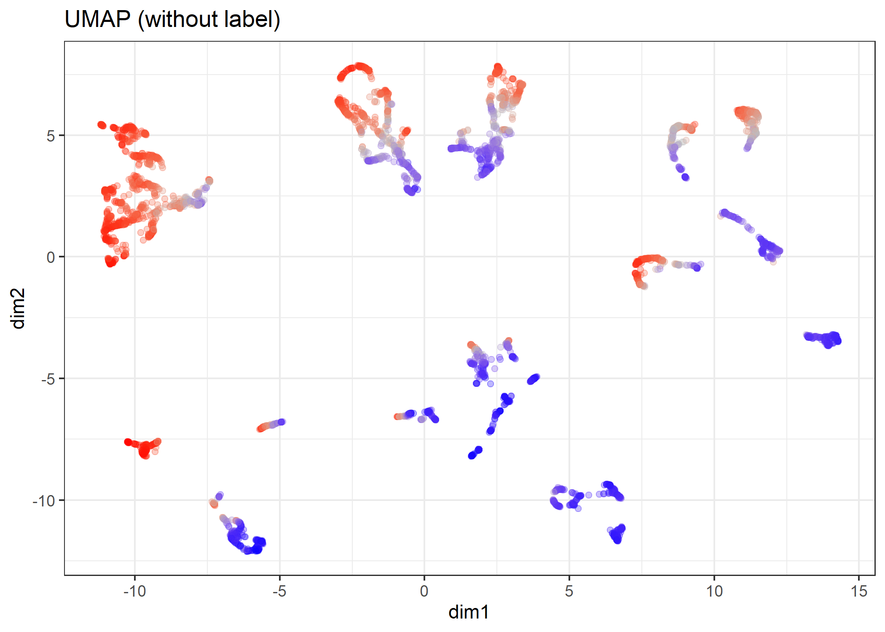

### supervised dimension reduction


```r
approxcontrib.xgb.sumap <- approxcontrib.xgb %>% 
  data.frame() %>% 
  select(-BIAS) %>%
  uwot::umap(n_neighbors = 12,
             learning_rate = 0.7,
             y = prediction.xgb)

# approxcontrib.xgb.sumap %>% str

mapping.sumap <- data.frame(
  id     = 1:length(prediction.xgb),
  dim1  = approxcontrib.xgb.sumap[, 1],
  dim2  = approxcontrib.xgb.sumap[, 2],
  pred   = prediction.xgb,
  weight = weight.app)
# mapping.sumap %>% str

ggp.sumap <- mapping.sumap %>% 
  ggplot(aes(x = dim1, y = dim2, colour = prediction.xgb)) + 
    geom_point(alpha = 0.3) + theme_bw() +
  scale_color_gradient2(midpoint=0.5, low="blue", mid="gray", high="red") + 
  guides(colour = FALSE) + 
  labs(title = "supervised UMAP") 

ggsave(ggp.sumap, filename = "./output/image.files/400_map_sumap.png",
       height = 5, width = 7)
```


## Hierarchical Density-based spatial clustering of applications with noise (HDBSCAN)

Reference:

https://hdbscan.readthedocs.io/en/latest/how_hdbscan_works.html

according to:

https://cran.r-project.org/web/packages/dbscan/vignettes/hdbscan.html


```r
# install.packages("dbscan", dependencies = TRUE)
require(dbscan)
Loading required package: dbscan
```

`minPts` not only acts as a minimum cluster size to detect, but also as a "smoothing" factor of the density estimates implicitly computed from HDBSCAN.


```r
# mapping.sumap %>% str
cl.hdbscan <- mapping.sumap %>% 
  select(dim1, dim2) %>% 
  hdbscan(minPts = 30)
cl.hdbscan
HDBSCAN clustering for 4000 objects.
Parameters: minPts = 30
The clustering contains 30 cluster(s) and 106 noise points.

  0   1   2   3   4   5   6   7   8   9  10  11  12  13  14  15  16  17 
106 126 159 676  46  60  81 123  71 187 116 144  73  90  93 107 209 153 
 18  19  20  21  22  23  24  25  26  27  28  29  30 
 42  86  79 302  37  68  69 277  45 207  38  90  40 

Available fields: cluster, minPts, cluster_scores,
                  membership_prob, outlier_scores, hc

# par(mfcol=c(1,2))
plot(cl.hdbscan, show_flat = TRUE)
```

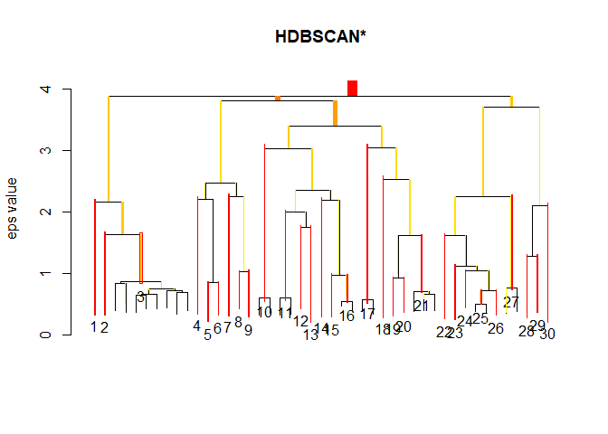<!-- -->

```r
# cl %>% str(1)

# plot(dim1 ~ dim2, data = mapping.sumap)
# plot(dim2 ~ dim1, data = mapping.sumap, col=cl.hdbscan$cluster+1, pch=20)
# par(mfcol=c(1,1))
# plot(approxcontrib.xgb.sumap.hdbscan, show_flat = TRUE)
```


```r
# install.packages("ggrepel", dependencies = TRUE)
require(ggrepel)

mapping.sumap$hdbscan <- factor(cl.hdbscan$cluster)

hdbscan.cent <- mapping.sumap %>% 
  filter(hdbscan != 0) %>% 
  dplyr::group_by(hdbscan) %>%
  select(dim1, dim2) %>% 
  summarize_all(mean)
Adding missing grouping variables: `hdbscan`

ggp.sumap.labeled <- mapping.sumap %>% 
  ggplot(aes(x = dim1, y = dim2, colour = hdbscan)) + 
  geom_point(alpha = 0.3) + 
  theme_bw() +
  ggrepel::geom_label_repel(data = hdbscan.cent, 
                            aes(label = hdbscan),
                            label.size = 0.1) + 
  guides(colour = FALSE) + 
  labs(title = "supervised UMAP + HDBSCAN") 


ggsave(ggp.sumap.labeled, filename =  "./output/image.files/400_map_sumap_labeled.png",
    height = 7, width = 7)
```

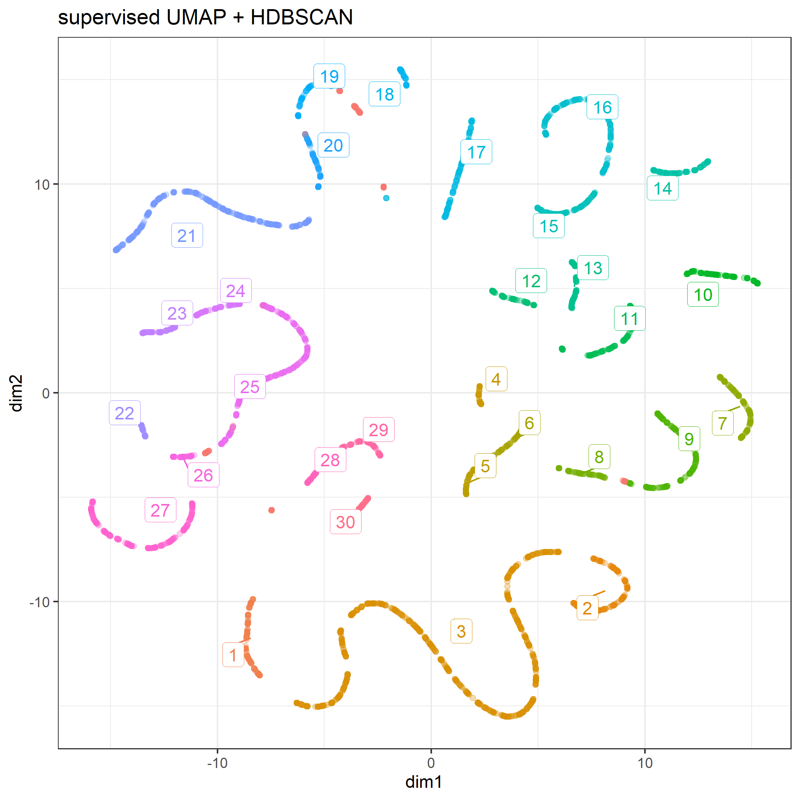


```r
ggp.tsne.sumap <- gridExtra::grid.arrange(
  ggp.tsne, 
  ggp.umap,
  ggp.sumap, 
  ggp.sumap.labeled,
  ncol = 2)
```

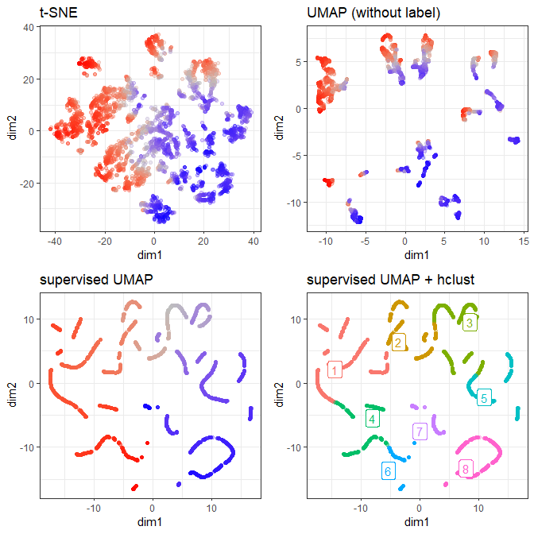<!-- -->

```r

ggsave(ggp.tsne.sumap, filename =  "./output/image.files/400_tSNE_sumap.png",
    height = 10, width = 10)
```

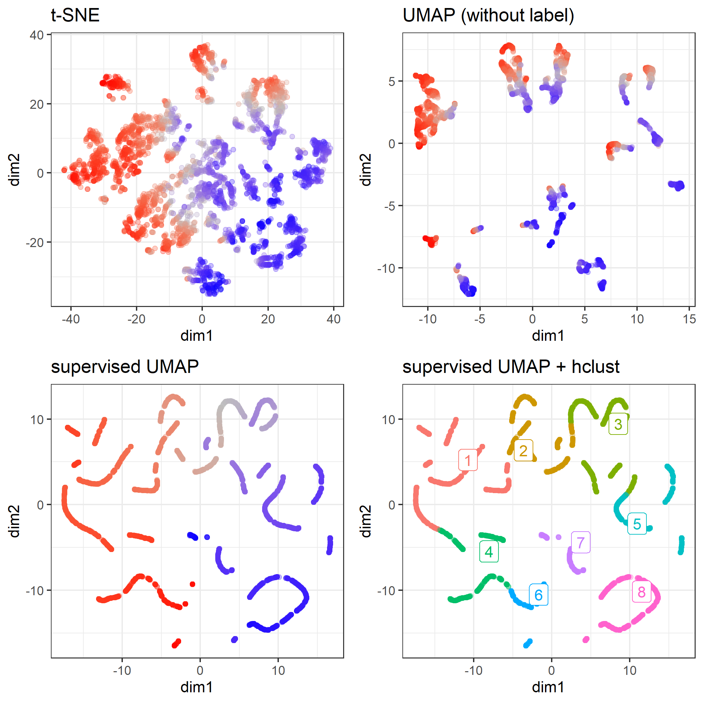

#### a failure case


```r
approxcontrib.xgb.sumap <- approxcontrib.xgb %>% 
  data.frame() %>% 
  select(-BIAS) %>%
  uwot::umap(n_neighbors = 20,
             learning_rate = 0.8,
             y = prediction.xgb)

# approxcontrib.xgb.sumap %>% str

mapping.sumap <- data.frame(
  id     = 1:length(prediction.xgb),
  dim1  = approxcontrib.xgb.sumap[, 1],
  dim2  = approxcontrib.xgb.sumap[, 2],
  pred   = prediction.xgb,
  weight = weight.app)
# mapping.sumap %>% str

cl.hdbscan <- mapping.sumap %>% 
  select(dim1, dim2) %>% 
  hdbscan(minPts = 10)

mapping.sumap$hdbscan <- factor(cl.hdbscan$cluster)

ggp.sumap.labeled <- mapping.sumap %>% 
  ggplot(aes(x = dim1, y = dim2, colour = hdbscan)) + 
  geom_point(alpha = 0.3) + 
  theme_bw() +
  guides(colour = FALSE) + 
  labs(title = "supervised UMAP + HDBSCAN") 

ggsave(ggp.sumap.labeled, filename =  "./output/image.files/400_map_sumap_labeled_fail.png",
    height = 7, width = 7)
```

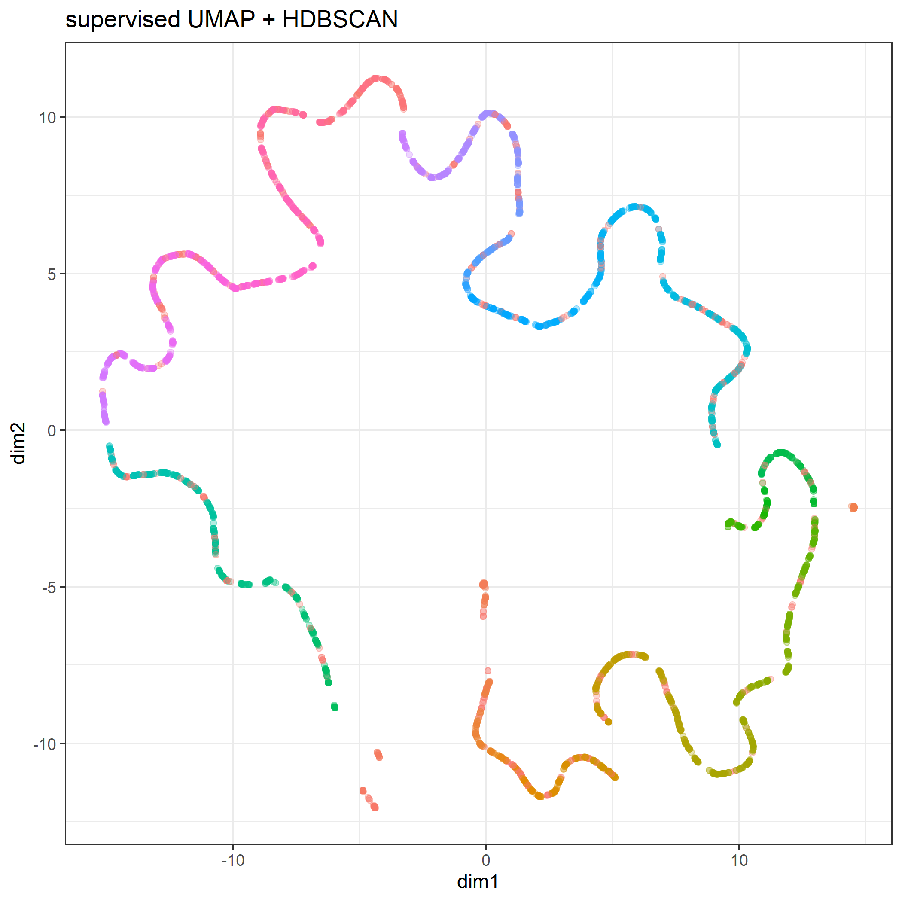

```r
cl.hdbscan <- mapping.sumap %>% 
  select(dim1, dim2) %>% 
  hdbscan(minPts = 30)
cl.hdbscan
HDBSCAN clustering for 4000 objects.
Parameters: minPts = 30
The clustering contains 5 cluster(s) and 28 noise points.

   0    1    2    3    4    5 
  28   46   49  357  940 2580 

Available fields: cluster, minPts, cluster_scores,
                  membership_prob, outlier_scores, hc
```


# View rules in several group


```r
hclust.id = 1
sample.n  = 6

target <- mapping.tsne %>% 
  filter(hclust == hclust.id) %>% 
  arrange(desc(pred))

sw <- list(NULL)
for(i in 1:sample.n){
  idx = target$id[i]
  
  sw[[i]]  <- waterfallBreakdown(
    breakdown = unlist(approxcontrib.xgb[idx, ]),
    type = "binary",
    labels = paste(colnames(approxcontrib.xgb), 
                   c(train.matrix[idx, ],""), sep =" = ")) +
    ggtitle(sprintf("predict = %.04f\nweight = %.04f",
                    target$predict[i], target$weight[i]))
}

ggp.sw <- gridExtra::grid.arrange(grobs = sw, ncol = 3)
fn = sprintf("./output/image.files/400_rules_cl%i.png", hclust.id)
ggsave(ggp.sw, filename = fn, height = 6)
```

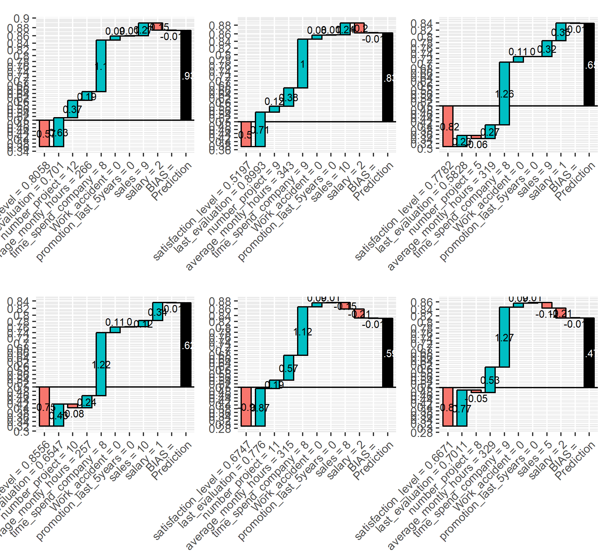


```r
hclust.id = 17
sample.n  = 6

target <- mapping.tsne %>% 
  filter(hclust == hclust.id) %>% 
  arrange(desc(pred))

sw <- list(NULL)
for(i in 1:sample.n){
  idx = target$id[i]
  
  sw[[i]]  <- waterfallBreakdown(
    breakdown = unlist(approxcontrib.xgb[idx, ]),
    type = "binary",
    labels = paste(colnames(approxcontrib.xgb), 
                   c(train.matrix[idx, ],""), sep =" = ")) +
    ggtitle(sprintf("predict = %.04f\nweight = %.04f",
                    target$predict[i], target$weight[i]))
}

ggp.sw <- gridExtra::grid.arrange(grobs = sw, ncol = 3)
fn = sprintf("./output/image.files/400_rules_cl%i.png", hclust.id)
ggsave(ggp.sw, filename = fn, height = 6)
```

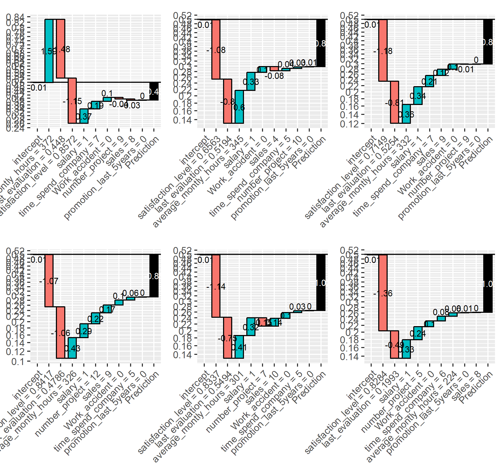
