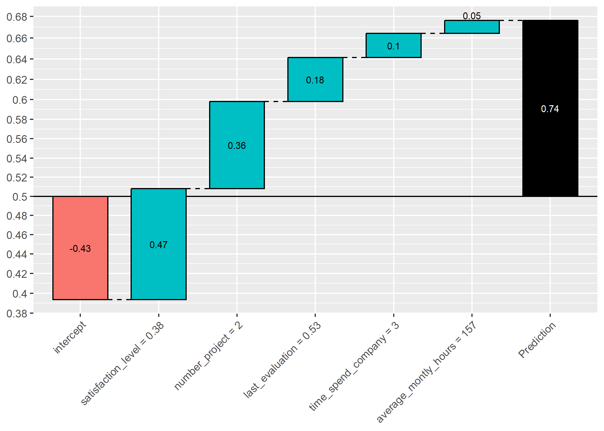
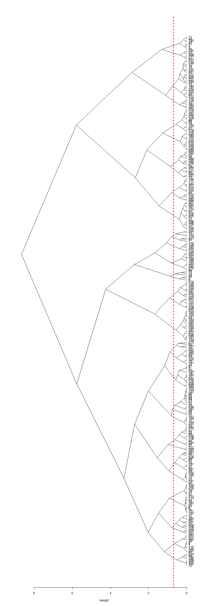
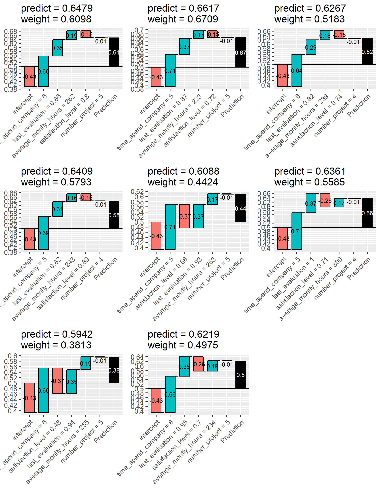
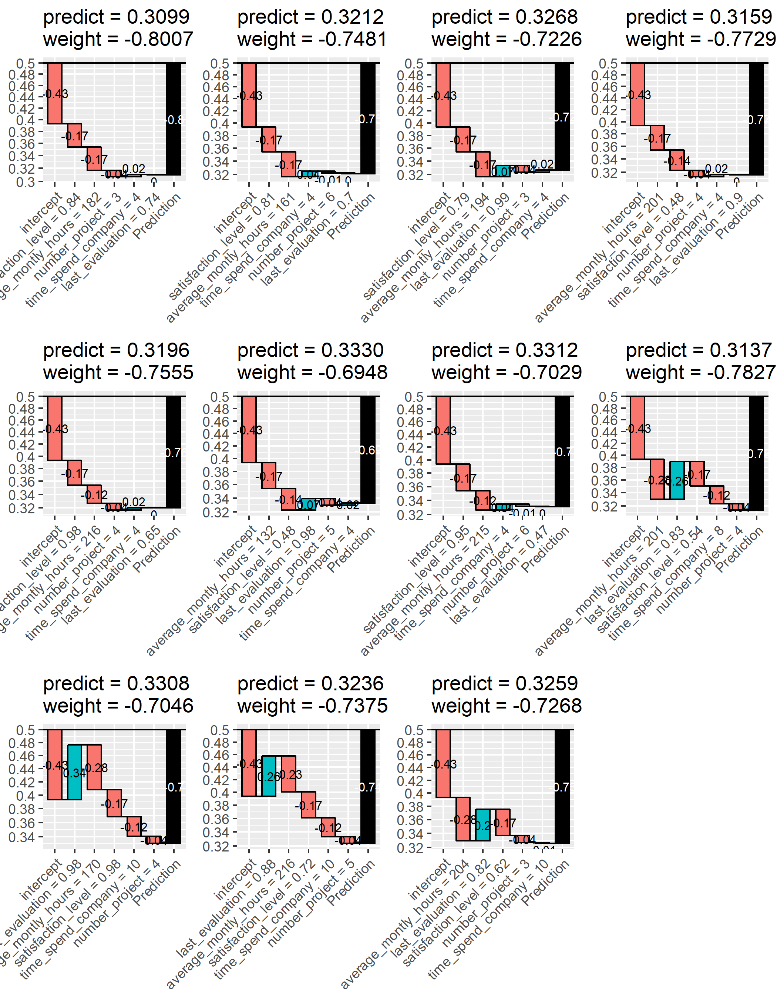

```{r setup, include=FALSE}
knitr::opts_knit$set(progress = TRUE, 
                     verbose  = TRUE, 
                     root.dir = ".")

knitr::opts_chunk$set(collapse = FALSE, 
                      comment = "", 
                      message = TRUE, 
                      warning = FALSE, 
                      include = TRUE,
                      echo    = TRUE)

set.seed(1)
```

```{r install.requirements, eval = FALSE}
install.packages("devtools", dependencies = TRUE)
devtools::install_github("AppliedDataSciencePartners/xgboostExplainer")

install.packages("ggridges", dependencies = TRUE)

```

```{r require.packages, message=FALSE}
require(tidyverse)
require(magrittr)
require(data.table)
require(xgboost)
require(xgboostExplainer)
require(ggridges)


```

# Preparation 

```{r load.model.and.data}
loaded.obs  <- readRDS("./middle/data_and_model.Rds")

model.xgb   <- loaded.obs$model$xgb 

train.label <- loaded.obs$data$train$label
train.matrix <- loaded.obs$data$train$matrix
train.xgb.DMatrix <- xgb.DMatrix("./middle/train.xgbDMatrix")

test.label  <- loaded.obs$data$test$label
test.matrix <- loaded.obs$data$test$matrix
test.xgb.DMatrix  <- xgb.DMatrix("./middle/test.xgbDMatrix")

```

# view rules

## Using xgboostExplainer

see https://medium.com/applied-data-science/new-r-package-the-xgboost-explainer-51dd7d1aa211


```{r, results="hide", eval=FALSE}
explainer.xgb <-  buildExplainer(xgb.model    = model.xgb, 
                                 trainingData = test.xgb.DMatrix, 
                                 type         = "binary",
                                 base_score   = 0.5,
                                 trees_idx    = NULL)

```

```{r}
xgb.model    = model.xgb
trainingData = test.xgb.DMatrix
type         = "binary"
base_score   = 0.5
trees_idx    = NULL

  col_names = attr(trainingData, ".Dimnames")[[2]]
  cat("\nCreating the trees of the xgboost model...")
  trees = xgb.model.dt.tree(col_names, model = xgb.model, trees = trees_idx)
  
  cat("\nGetting the leaf nodes for the training set observations...")
  nodes.train = predict(xgb.model, trainingData, predleaf = TRUE)
  
  cat("\nBuilding the Explainer...")
  cat("\nSTEP 1 of 2")
  tree_list = xgboostExplainer:::getStatsForTrees(trees, nodes.train, type = type, base_score = base_score)
  cat("\n\nSTEP 2 of 2")
  explainer = xgboostExplainer:::buildExplainerFromTreeList(tree_list, col_names)
  cat("\n\nDONE!\n\n")
  return(explainer)

```


## explain test set

```{r, results="hide", message=FALSE}
xgb.breakdown <- explainPredictions(xgb.model = model.selected.xgb,
                                    explainer = explainer.xgb,
                                    data      = test.selected.xgb.DMatrix)
unique.explanation <- xgb.breakdown %>% 
  rownames_to_column("id") %>%
  mutate(id = as.integer(id)) %>% 
  distinct(satisfaction_level, time_spend_company, number_project,
           last_evaluation, average_montly_hours, .keep_all = TRUE)
 
unique.explanation %>% str
```


## explain single observation

```{r, results="hide", message=FALSE}
sw <- showWaterfall(
  idx = 1,
  xgb.model   = model.selected.xgb, 
  explainer   = explainer.xgb, 
  DMatrix     = test.selected.xgb.DMatrix, 
  data.matrix = as.matrix(test.selected))

ggsave(sw, filename = "output/image.files/040_explain_single_obs.png")

```

## view all rules

```{r}
weight <- rowSums(unique.explanation[, -1])
prediction <- 1/(1 + exp(-weight))

unique.explanation %>%
  mutate(pred = prediction) %>% 
  select(pred, satisfaction_level:average_montly_hours) %>% 
  set_colnames(c("pred", "s.lev", "time.c", "n.pj", "l.eval", "monthly")) %>% 
  arrange(pred, s.lev, time.c) %>% 
  round(digits = 4)


```



```{r, eval=FALSE}
if(!dir.exists("./output/040_plot_all_rules/")){
  dir.create("./output/040_plot_all_rules/")
}
rules <- unique.explanation$id

for(i in 1:length(rules)){
  
  ggp.sw <- showWaterfall(
    idx = rules[i],
    xgb.model   = model.selected.xgb, 
    explainer   = explainer.xgb, 
    DMatrix     = test.selected.xgb.DMatrix, 
    data.matrix = as.matrix(test.selected)) +
    ggtitle(sprintf("prediction = %.04f (weight = %.04f)",
                    prediction[i], weight[i]))
  
  ggsave(ggp.sw, height = 4, width = 4,
         filename = sprintf("./output/040_plot_all_rules/%f.png", 
                                    prediction[i]))
}
```

## clustering of extracted rules

```{r clustering}
rules.hc <- unique.explanation %>% 
  select(-id, intercept) %>% 
  mutate(pred = prediction) %>% 
  dist %>%
  hclust(method = "ward.D2") 

cut.off = 0.7
png(filename = "./output/image.files/040_rules_hclust.png",
    width = 800, height = 2400)

rules.hc %>%
  as.dendrogram() %>% 
plot(type = "triangle", xlab = "Height", horiz = TRUE, lwd = 2)

abline(v = cut.off, col = "red", lty = 3, lwd = 3)

dev.off()

```


## clustering by cutree

```{r}
member.id <- data.frame(
  id      = unique.explanation$id,
  weight  = weight,
  predict = prediction,
  member  = cutree(rules.hc, h = cut.off)) %>% 
  arrange(member)

member.id %>% 
  group_by(member) %>%
  summarise(n = n(), mean = mean(predict), sd = sd(predict)) %>% 
  arrange(mean)

```

```{r, eval=FALSE}
target <- member.id %>% filter(member == 2) 
sw <- list(NULL)

i=1
for(i in 1:NROW(target)){
  
  sw[[i]] <- showWaterfall(
    idx = target$id[i],
    xgb.model   = model.selected.xgb, 
    explainer   = explainer.xgb, 
    DMatrix     = test.selected.xgb.DMatrix, 
    data.matrix = as.matrix(test.selected)) +
    ggtitle(sprintf("predict = %.04f\nweight = %.04f",
                    target$predict[i], target$weight[i]))
}

ggp.sw <- gridExtra::grid.arrange(grobs = sw, ncol = 3)
ggsave(ggp.sw, filename = "./output/image.files/040_rules_cl2.png",
       height = 9)
```



```{r, eval=FALSE}
target <- member.id %>% filter(member == 4) 
sw <- list(NULL)

i=1
for(i in 1:NROW(target)){
  
  sw[[i]] <- showWaterfall(
    idx = target$id[i],
    xgb.model   = model.selected.xgb, 
    explainer   = explainer.xgb, 
    DMatrix     = test.selected.xgb.DMatrix, 
    data.matrix = as.matrix(test.selected)) +
    ggtitle(sprintf("predict = %.04f\nweight = %.04f",
                    target$predict[i], target$weight[i]))
}

ggp.sw <- gridExtra::grid.arrange(grobs = sw, ncol = 4)
ggsave(ggp.sw, filename = "./output/image.files/040_rules_cl4.png", 
       height = 9, width = 7)
```




