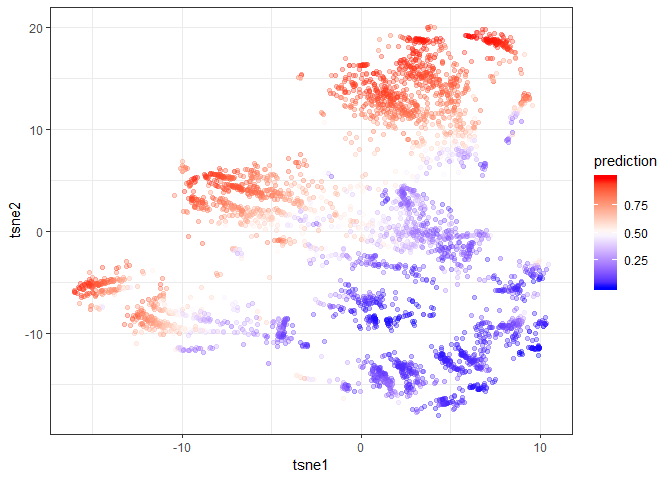

```r
install.packages("devtools", dependencies = TRUE)
devtools::install_github("AppliedDataSciencePartners/xgboostExplainer")

install.packages("ggridges", dependencies = TRUE)

```


```r
require(tidyverse)
require(magrittr)
require(data.table)
require(xgboost)
require(xgboostExplainer)
require(ggridges)

```

# Preparation 


```r
loaded.obs  <- readRDS("./middle/data_and_model.Rds")

model.xgb   <- loaded.obs$model$xgb 

train.label <- loaded.obs$data$train$label
train.matrix <- loaded.obs$data$train$matrix
train.xgb.DMatrix <- xgb.DMatrix(train.matrix, label = train.label, missing = NA)

test.label  <- loaded.obs$data$test$label
test.matrix <- loaded.obs$data$test$matrix
test.xgb.DMatrix  <- xgb.DMatrix(test.matrix, missing = NA)
```

# breakdown obsavation

## Using xgboostExplainer

see https://medium.com/applied-data-science/new-r-package-the-xgboost-explainer-51dd7d1aa211


```r
explainer.xgb <-  buildExplainer(xgb.model    = model.xgb, 
                                 trainingData = train.xgb.DMatrix, 
                                 type         = "binary",
                                 base_score   = 0.5,
                                 trees_idx    = NULL)
saveRDS(explainer.xgb,file = "./middle/400_explainer_xgb.Rds")
```


```r
explainer.xgb <- readRDS("./middle/400_explainer_xgb.Rds")
```


```r
explainer.xgb %>% head() %>% round(digits = 4)
   satisfaction_level last_evaluation number_project average_montly_hours
1:             0.0583          0.0000        -0.0323               0.0000
2:             0.0583          0.0000         0.0369               0.0000
3:            -0.0422          0.0346         0.0000               0.0000
4:             0.0583          0.0192         0.0000              -0.0130
5:             0.0583         -0.0530         0.0000              -0.0130
6:             0.0583          0.0000        -0.0808               0.0134
   time_spend_company Work_accident promotion_last_5years sales salary
1:            -0.1049        0.0000                     0     0      0
2:            -0.1049        0.0000                     0     0      0
3:            -0.0806        0.0000                     0     0      0
4:             0.0034        0.0042                     0     0      0
5:             0.0034        0.0042                     0     0      0
6:             0.0034        0.0042                     0     0      0
   intercept leaf tree
1:    0.0015    9    0
2:    0.0015   10    0
3:    0.0015   25    0
4:    0.0015   27    0
5:    0.0015   28    0
6:    0.0015   29    0
```

## extract explaination path


```r
predleaf.xgb <- xgboost:::predict.xgb.Booster(
  model.xgb, newdata = train.matrix, predleaf = TRUE)

predleaf.xgb[1:6, 1:12]
     [,1] [,2] [,3] [,4] [,5] [,6] [,7] [,8] [,9] [,10] [,11] [,12]
[1,]   48   47   49   26   44   34   40   49   22    45    40    45
[2,]   48   44   45   19   40   34   40   44   21    45    40    41
[3,]   35   42   42   19   35   27   27   40   19    35    35    38
[4,]   30   29   28   19   27   23   26   33   19    30    27    30
[5,]   48   43   45   19   40   34   40   44   19    38    36    41
[6,]   35   35   35   20   41   27   27   35   19    39    35    33
```


```r
xgb.breakdown <- explainPredictions(xgb.model = model.xgb,
                                    explainer = explainer.xgb,
                                    data      = train.xgb.DMatrix)
saveRDS(xgb.breakdown, file = "./middle/400_xgb_breakdown.Rds")

```


```r
xgb.breakdown <- readRDS("./middle/400_xgb_breakdown.Rds")
xgb.breakdown %>% head() %>% knitr::kable(digits = 4)
```


 satisfaction_level   last_evaluation   number_project   average_montly_hours   time_spend_company   Work_accident   promotion_last_5years     sales    salary   intercept
-------------------  ----------------  ---------------  ---------------------  -------------------  --------------  ----------------------  --------  --------  ----------
            -0.8511            0.4867           0.0137                 0.7276               1.0806          0.0839                  0.0069   -0.1085   -0.2608     -0.0052
            -1.0387            0.5086           0.4655                 0.1135               0.2008          0.0823                  0.0061    0.1384   -0.1494     -0.0052
             0.2425            0.3310          -0.0172                -0.1523               0.1451          0.1044                  0.0051   -0.2508    0.3425     -0.0052
             1.4692           -0.1740           0.2443                 0.3454              -0.0153          0.1068                  0.0046    0.2427    0.2344     -0.0052
            -1.0766            0.5801          -0.1779                -0.0578               0.1879          0.1020                  0.0046    0.1182    0.3238     -0.0052
             0.2372            0.6904           0.3340                 0.5119               0.2664          0.1044                  0.0051    0.0259    0.3422     -0.0052

```r

weight     <- rowSums(xgb.breakdown)
prediction <- 1/(1 + exp(-weight))
```

This is almost the same result as: `xgboost:::predict.xgb.Booster(...,   predcontrib = TRUE, approxcontrib = TRUE)`

According to help(xgboost:::predict.xgb.Booster)@Details

Setting `predcontrib = TRUE` + `approxcontrib = TRUE` approximates these values following the idea explained in http://blog.datadive.net/interpreting-random-forests/.


```r
prediction.xgb <- xgboost:::predict.xgb.Booster(
  model.xgb, newdata = train.matrix)

approxcontrib.xgb <- xgboost:::predict.xgb.Booster(
  model.xgb, newdata = train.matrix, 
  predcontrib = TRUE, approxcontrib = TRUE)

approxcontrib.xgb %>% head() %>% knitr::kable(digits = 4)
```


 satisfaction_level   last_evaluation   number_project   average_montly_hours   time_spend_company   Work_accident   promotion_last_5years     sales    salary      BIAS
-------------------  ----------------  ---------------  ---------------------  -------------------  --------------  ----------------------  --------  --------  --------
            -0.8511            0.4867           0.0137                 0.7276               1.0806          0.0839                  0.0069   -0.1085   -0.2608   -0.0052
            -1.0387            0.5086           0.4655                 0.1135               0.2008          0.0823                  0.0061    0.1384   -0.1494   -0.0052
             0.2425            0.3310          -0.0172                -0.1523               0.1451          0.1044                  0.0051   -0.2508    0.3425   -0.0052
             1.4692           -0.1740           0.2443                 0.3454              -0.0153          0.1068                  0.0046    0.2427    0.2344   -0.0052
            -1.0766            0.5801          -0.1779                -0.0578               0.1879          0.1020                  0.0046    0.1182    0.3238   -0.0052
             0.2372            0.6904           0.3340                 0.5119               0.2664          0.1044                  0.0051    0.0259    0.3422   -0.0052

```r

prediction.xgb %>% head()
[1] 0.7638327 0.5797617 0.6781101 0.9207772 0.4998003 0.9250071
weight.app <- approxcontrib.xgb %>% head %>% rowSums()
weight.app
[1]  1.1738086063  0.3217955003  0.7451003548  2.4529540115 -0.0007986953
[6]  2.5124074277
1/(1 + exp(-weight.app))
[1] 0.7638327 0.5797618 0.6781102 0.9207772 0.4998003 0.9250071
```

## explain single observation


```r
sw <- showWaterfall(
  idx = 1,
  xgb.model   = model.xgb, 
  explainer   = explainer.xgb, 
  DMatrix     = train.xgb.DMatrix, 
  data.matrix = train.matrix)

ggsave(sw, filename = "output/image.files/400_explain_single_obs.png",
       width = 5, height = 3.5)

```


# clustering of extracted rules

## dimension reduction using t-SNE

according to :
http://jmonlong.github.io/Hippocamplus/2017/12/02/tsne-and-clustering/


```r
require(Rtsne)
Loading required package: Rtsne
# xgb.breakdown %>% str

xgb.breakdown.tsne <- xgb.breakdown %>% 
  select(-intercept) %>%
  Rtsne(perplexity = 300, check_duplicates = FALSE)

xgb.breakdown.tsne %>% str
List of 14
 $ N                  : int 4000
 $ Y                  : num [1:4000, 1:2] -13.83 -9.11 -3.24 4.22 -9.36 ...
 $ costs              : num [1:4000] 4.70e-05 3.55e-05 1.81e-04 7.50e-05 5.09e-05 ...
 $ itercosts          : num [1:20] 59.4 56 55.9 55.5 55.6 ...
 $ origD              : int 9
 $ perplexity         : num 300
 $ theta              : num 0.5
 $ max_iter           : num 1000
 $ stop_lying_iter    : int 250
 $ mom_switch_iter    : int 250
 $ momentum           : num 0.5
 $ final_momentum     : num 0.8
 $ eta                : num 200
 $ exaggeration_factor: num 12

mapping.tsne <- data.frame(
  id     = 1:length(prediction),
  tsne1  = xgb.breakdown.tsne$Y[, 1],
  tsne2  = xgb.breakdown.tsne$Y[, 2],
  pred   = prediction,
  weight = weight)
```


```r
mapping.tsne %>% 
  ggplot(aes(x = tsne1, y = tsne2, colour = prediction)) + 
    geom_point(alpha = 0.3) + theme_bw() +
  scale_color_gradient2(midpoint=0.5, low="blue", mid="white", high="red")
```

<!-- -->

## Hierarchical clustering


```r
xgb.breakdown.tsne.hc <- mapping.tsne %>% 
  select(-id) %>% 
  as.matrix() %>% 
  dist() %>% 
  hclust()
xgb.breakdown.tsne.hc

Call:
hclust(d = .)

Cluster method   : complete 
Distance         : euclidean 
Number of objects: 4000 
```

### explore cut.off for cutree


```r
library(ggdendro)

cut.off = 5
# 
# png(filename = "./output/image.files/400_hclust_rules.png",
#     height = 1200, width = 800)
# xgb.breakdown.tsne.hc %>%
#   as.dendrogram() %>%
#   plot(horiz = TRUE)
# abline(v = cut.off, col = "red", lwd = 2, lty = 3)
# dev.off()

ggd.breakdown <- ggdendrogram(xgb.breakdown.tsne.hc, rotate = TRUE, size = 2) +
  geom_hline(yintercept = cut.off, color = "red")
ggsave(ggd.breakdown, filename =  "./output/image.files/400_hclust_rules.png",
    height = 12, width = 7)
```


```r
# install.packages("ggrepel", dependencies = TRUE)
require(ggrepel)
Loading required package: ggrepel

mapping.tsne$hclust <- xgb.breakdown.tsne.hc %>%
  cutree(h = cut.off) %>%
  factor()

hc.cent <- mapping.tsne %>% 
  group_by(hclust) %>%
  select(tsne1, tsne2) %>% 
  summarize_all(mean)
Adding missing grouping variables: `hclust`

mapping.tsne %>% 
  ggplot(aes(x = tsne1, y = tsne2, colour = hclust)) + 
  geom_point(alpha = 0.3) + 
  theme_bw() +
  ggrepel::geom_label_repel(data = hc.cent, aes(label = hclust)) + 
  guides(colour = FALSE)
```

<!-- -->


## View rules in several group


```r
hclust.id = 1
sample.n  = 6

target <- mapping.tsne %>% 
  filter(hclust == hclust.id) %>% 
  arrange(desc(pred))

sw <- list(NULL)
for(i in 1:sample.n){
  
  sw[[i]] <- showWaterfall(
    idx = target$id[i],
    xgb.model   = model.xgb, 
    explainer   = explainer.xgb, 
    DMatrix     = train.xgb.DMatrix, 
    data.matrix = train.matrix) +
    ggtitle(sprintf("predict = %.04f\nweight = %.04f",
                    target$predict[i], target$weight[i]))
}

ggp.sw <- gridExtra::grid.arrange(grobs = sw, ncol = 3)
fn = sprintf("./output/image.files/400_rules_cl%i.png", hclust.id)
ggsave(ggp.sw, filename = fn, height = 6)
```


```r
hclust.id = 17
sample.n  = 6

target <- mapping.tsne %>% 
  filter(hclust == hclust.id) %>% 
  arrange(desc(pred))

sw <- list(NULL)
for(i in 1:sample.n){
  
  sw[[i]] <- showWaterfall(
    idx = target$id[i],
    xgb.model   = model.xgb, 
    explainer   = explainer.xgb, 
    DMatrix     = train.xgb.DMatrix, 
    data.matrix = train.matrix) +
    ggtitle(sprintf("predict = %.04f\nweight = %.04f",
                    target$predict[i], target$weight[i]))
}

ggp.sw <- gridExtra::grid.arrange(grobs = sw, ncol = 3)
fn = sprintf("./output/image.files/400_rules_cl%i.png", hclust.id)
ggsave(ggp.sw, filename = fn, height = 6)
```


