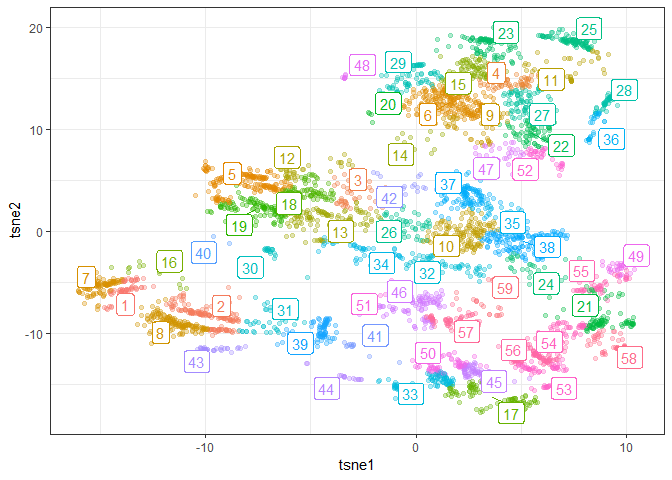

```r
install.packages("devtools", dependencies = TRUE)
devtools::install_github("AppliedDataSciencePartners/xgboostExplainer")

install.packages("ggridges", dependencies = TRUE)

```


```r
require(tidyverse)
require(magrittr)
require(data.table)
require(xgboost)
require(xgboostExplainer)
require(ggridges)

```

# Preparation 


```r
loaded.obs  <- readRDS("./middle/data_and_model.Rds")

model.xgb   <- loaded.obs$model$xgb 

train.label <- loaded.obs$data$train$label
train.matrix <- loaded.obs$data$train$matrix
train.xgb.DMatrix <- xgb.DMatrix(train.matrix, label = train.label, missing = NA)

test.label  <- loaded.obs$data$test$label
test.matrix <- loaded.obs$data$test$matrix
test.xgb.DMatrix  <- xgb.DMatrix(test.matrix, missing = NA)
```

# view rules

## Using xgboostExplainer

see https://medium.com/applied-data-science/new-r-package-the-xgboost-explainer-51dd7d1aa211


```r
explainer.xgb <-  buildExplainer(xgb.model    = model.xgb, 
                                 trainingData = train.xgb.DMatrix, 
                                 type         = "binary",
                                 base_score   = 0.5,
                                 trees_idx    = NULL)
saveRDS(explainer.xgb,file = "./middle/400_explainer_xgb.Rds")
```


```r
explainer.xgb <- readRDS("./middle/400_explainer_xgb.Rds")
```

## extract explaination path


```r
xgb.breakdown <- explainPredictions(xgb.model = model.xgb,
                                    explainer = explainer.xgb,
                                    data      = train.xgb.DMatrix)
saveRDS(xgb.breakdown, file = "./middle/400_xgb_breakdown.Rds")

```


```r
xgb.breakdown <- readRDS("./middle/400_xgb_breakdown.Rds")

weight     <- rowSums(xgb.breakdown)
prediction <- 1/(1 + exp(-weight))
```


## explain single observation


```r
sw <- showWaterfall(
  idx = 1,
  xgb.model   = model.xgb, 
  explainer   = explainer.xgb, 
  DMatrix     = train.xgb.DMatrix, 
  data.matrix = train.matrix)

ggsave(sw, filename = "output/image.files/400_explain_single_obs.png")

```


# clustering of extracted rules

## dimension reduction using t-SNE

according to :
http://jmonlong.github.io/Hippocamplus/2017/12/02/tsne-and-clustering/


```r
require(Rtsne)
Loading required package: Rtsne
# xgb.breakdown %>% str

xgb.breakdown.tsne <- xgb.breakdown %>% 
  select(-intercept) %>%
  Rtsne(perplexity = 300, check_duplicates = FALSE)

xgb.breakdown.tsne %>% str
List of 14
 $ N                  : int 4000
 $ Y                  : num [1:4000, 1:2] -13.83 -9.11 -3.24 4.22 -9.36 ...
 $ costs              : num [1:4000] 4.70e-05 3.55e-05 1.81e-04 7.50e-05 5.09e-05 ...
 $ itercosts          : num [1:20] 59.4 56 55.9 55.5 55.6 ...
 $ origD              : int 9
 $ perplexity         : num 300
 $ theta              : num 0.5
 $ max_iter           : num 1000
 $ stop_lying_iter    : int 250
 $ mom_switch_iter    : int 250
 $ momentum           : num 0.5
 $ final_momentum     : num 0.8
 $ eta                : num 200
 $ exaggeration_factor: num 12

mapping.tsne <- data.frame(
  id     = 1:length(prediction),
  tsne1  = xgb.breakdown.tsne$Y[, 1],
  tsne2  = xgb.breakdown.tsne$Y[, 2],
  pred   = prediction,
  weight = weight)
```


```r
mapping.tsne %>% 
  ggplot(aes(x = tsne1, y = tsne2, colour = prediction)) + 
    geom_point(alpha = 0.3) + theme_bw() +
  scale_color_gradient2(midpoint=0.5, low="blue", mid="white", high="red")
```

<!-- -->
## Hierarchical clustering


```r
xgb.breakdown.tsne.hc <- mapping.tsne %>% 
  select(-id) %>% 
  as.matrix() %>% 
  dist() %>% 
  hclust()
xgb.breakdown.tsne.hc

Call:
hclust(d = .)

Cluster method   : complete 
Distance         : euclidean 
Number of objects: 4000 
```

### explore cut.off for cutree


```r
cut.off = 5

png(filename = "./output/image.files/400_hclust_rules.png",
    height = 1200, width = 800)
xgb.breakdown.tsne.hc %>%
  as.dendrogram() %>%
  plot(horiz = TRUE)
abline(v = cut.off, col = "red", lwd = 2, lty = 3)
dev.off()
png 
  2 
```


```r
# install.packages("ggrepel", dependencies = TRUE)
require(ggrepel)
Loading required package: ggrepel

mapping.tsne$hclust <- xgb.breakdown.tsne.hc %>%
  cutree(h = cut.off) %>%
  factor()

hc.cent <- mapping.tsne %>% 
  group_by(hclust) %>%
  select(tsne1, tsne2) %>% 
  summarize_all(mean)
Adding missing grouping variables: `hclust`

mapping.tsne %>% 
  ggplot(aes(x = tsne1, y = tsne2, colour = hclust)) + 
  geom_point(alpha = 0.3) + 
  theme_bw() +
  ggrepel::geom_label_repel(data = hc.cent, aes(label = hclust)) + 
  guides(colour = FALSE)
```

<!-- -->


## View rules in several group


```r
hclust.id = 1
sample.n  = 6

target <- mapping.tsne %>% 
  filter(hclust == hclust.id) %>% 
  arrange(desc(pred))

sw <- list(NULL)
for(i in 1:sample.n){
  
  sw[[i]] <- showWaterfall(
    idx = target$id[i],
    xgb.model   = model.xgb, 
    explainer   = explainer.xgb, 
    DMatrix     = train.xgb.DMatrix, 
    data.matrix = train.matrix) +
    ggtitle(sprintf("predict = %.04f\nweight = %.04f",
                    target$predict[i], target$weight[i]))
}

ggp.sw <- gridExtra::grid.arrange(grobs = sw, ncol = 3)
fn = sprintf("./output/image.files/400_rules_cl%i.png", hclust.id)
ggsave(ggp.sw, filename = fn, height = 6)
```


```r
hclust.id = 17
sample.n  = 6

target <- mapping.tsne %>% 
  filter(hclust == hclust.id) %>% 
  arrange(desc(pred))

sw <- list(NULL)
for(i in 1:sample.n){
  
  sw[[i]] <- showWaterfall(
    idx = target$id[i],
    xgb.model   = model.xgb, 
    explainer   = explainer.xgb, 
    DMatrix     = train.xgb.DMatrix, 
    data.matrix = train.matrix) +
    ggtitle(sprintf("predict = %.04f\nweight = %.04f",
                    target$predict[i], target$weight[i]))
}

ggp.sw <- gridExtra::grid.arrange(grobs = sw, ncol = 3)
fn = sprintf("./output/image.files/400_rules_cl%i.png", hclust.id)
ggsave(ggp.sw, filename = fn, height = 6)
```


