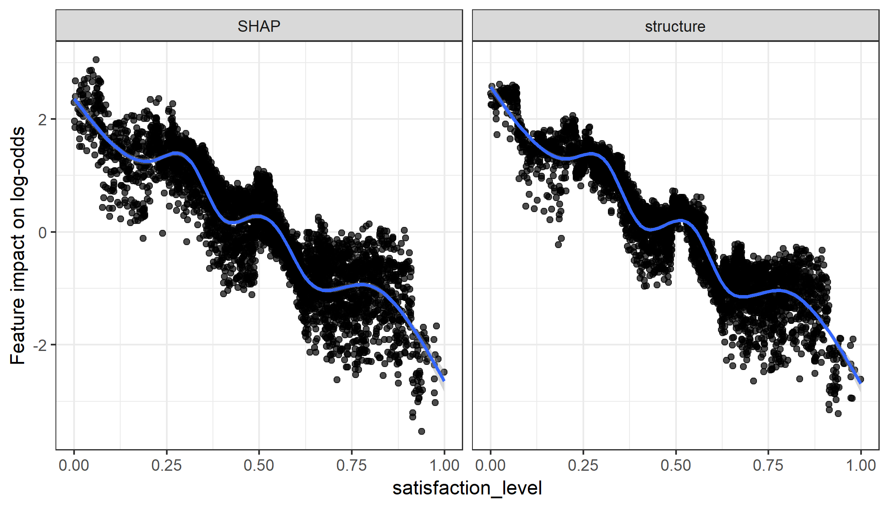
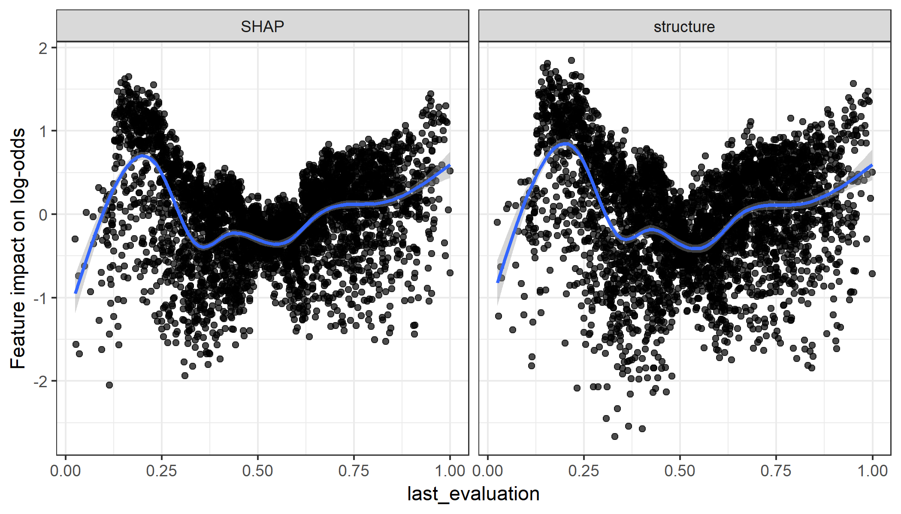
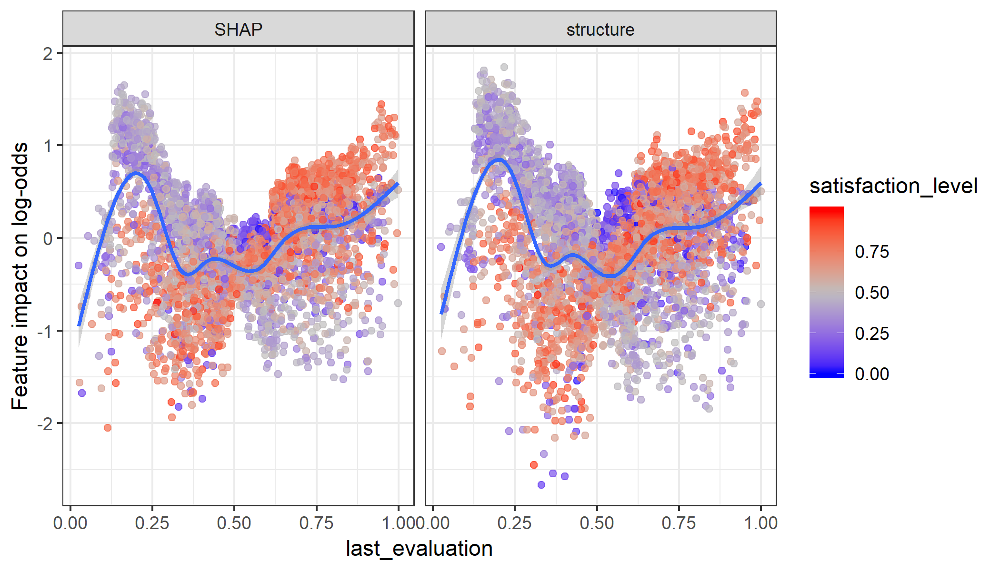
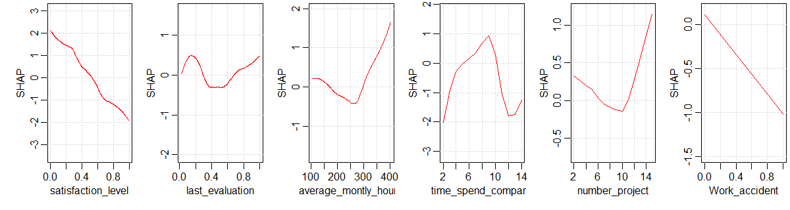

```{r setup, include=FALSE}
knitr::opts_knit$set(progress = TRUE, 
                     verbose  = TRUE, 
                     root.dir = ".")

knitr::opts_chunk$set(collapse = TRUE, 
                      comment = "", 
                      message = TRUE, 
                      warning = FALSE, 
                      include = TRUE,
                      echo    = TRUE)

set.seed(1)
```

```{r install.requirements, eval = FALSE}
install.packages("devtools", dependencies = TRUE)
devtools::install_github("AppliedDataSciencePartners/xgboostExplainer")

```

```{r require.packages, message=FALSE}
require(tidyverse)
require(magrittr)
require(data.table)
require(xgboost)
require(xgboostExplainer)
require(ggridges)


```

# Preparation 

```{r load.model.and.data}
loaded.obs  <- readRDS("./middle/data_and_model.Rds")

model.xgb   <- loaded.obs$model$xgb 

train.label  <- loaded.obs$data$train$label
train.df     <- loaded.obs$data$train$dummy.data.frame
train.matrix <- loaded.obs$data$train$matrix
train.xgb.DMatrix <- xgb.DMatrix(train.matrix, label = train.label, missing = NA)

test.label  <- loaded.obs$data$test$label
test.matrix <- loaded.obs$data$test$matrix
test.xgb.DMatrix  <- xgb.DMatrix(test.matrix, missing = NA)

```

```{r}
shap.xgb <- xgboost:::predict.xgb.Booster(
  model.xgb, newdata = train.matrix, 
  predcontrib = TRUE, approxcontrib = FALSE) %>% 
  data.frame()

shap.xgb %>% head(4) %>% knitr::kable(digits = 4)

```

```{r}
approxcontrib.xgb <- xgboost:::predict.xgb.Booster(
  model.xgb, newdata = train.matrix, 
  predcontrib = TRUE, approxcontrib = TRUE) %>% 
  data.frame()

approxcontrib.xgb %>% head(4) %>% knitr::kable(digits = 4)

```

# feature responce

## example1: satisfaction_level

```{r}
feature.impact <- data.frame(value  = train.df$satisfaction_level, 
                             SHAP = shap.xgb$satisfaction_level,
                             structure = approxcontrib.xgb$satisfaction_level) %>% 
  gather(key = type, value = impact, -value)

ggp.sens.fi <- feature.impact %>% 
  ggplot(aes(x = value, y = impact)) + 
  geom_point(alpha = 0.7) +
  geom_smooth() +
  facet_grid(. ~ type) +
  labs(x = "satisfaction_level", y = "Feature impact on log-odds") +
  theme_bw()

ggsave(ggp.sens.fi, filename =  "./output/image.files/410_feature_impact_1.png",
    height = 4, width = 7)

```



## example 2-1: last_evaluation

```{r}
feature.impact <- data.frame(value  = train.df$last_evaluation, 
                             SHAP = shap.xgb$last_evaluation,
                             structure = approxcontrib.xgb$last_evaluation,
                             satisfaction_level = train.df$satisfaction_level) %>% 
  gather(key = type, value = impact, -value, -satisfaction_level)

```

```{r}
ggp.sens.fi <- feature.impact %>% 
  ggplot(aes(x = value, y = impact)) + 
  geom_point(alpha = 0.7) +
  geom_smooth() +
  facet_grid(. ~ type) +
  labs(x = "last_evaluation", y = "Feature impact on log-odds") +
  theme_bw()

ggsave(ggp.sens.fi, filename =  "./output/image.files/410_feature_impact_2-1.png",
    height = 4, width = 7)
```




## example 2-2: last_evaluation x satisfaction_level

```{r}
ggp.sens.fi <- feature.impact %>% 
  ggplot(aes(x = value, y = impact, color = satisfaction_level)) + 
  geom_point(alpha = 0.7) +
  geom_smooth() +
  facet_grid(. ~ type) +
  labs(x = "last_evaluation", y = "Feature impact on log-odds") +
  theme_bw() + 
  scale_color_gradient2(midpoint = 0.5, low="blue", mid="grey", high="red")

ggsave(ggp.sens.fi, filename =  "./output/image.files/410_feature_impact_2-2.png",
    height = 4, width = 7)
```




## Average feature responce

**According to man(xgb.plot.shap)::Detail**

Visualizing the SHAP feature contribution to prediction dependencies on feature value.

These scatterplots represent how SHAP feature contributions depend of feature values. The similarity to partial dependency plots is that they also give an idea for how feature values affect predictions. However, in partial dependency plots, we usually see marginal dependencies of model prediction on feature value, while SHAP contribution dependency plots display the estimated contributions of a feature to model prediction for each individual case.

When plot_loess = TRUE is set, feature values are rounded to 3 significant digits and weighted LOESS is computed and plotted, where weights are the numbers of data points at each rounded value.

Note: SHAP contributions are shown on the scale of model margin. E.g., for a logistic binomial objective, the margin is prediction before a sigmoidal transform into probability-like values. Also, since SHAP stands for "SHapley Additive exPlanation" (model prediction = sum of SHAP contributions for all features + bias), depending on the objective used, transforming SHAP contributions for a feature from the marginal to the prediction space is not necessarily a meaningful thing to do.


```{r}
png(filename = "./output/image.files/410_varresp_SHAP.png", width = 1200, height = 320, pointsize = 24)
shap <- xgb.plot.shap(data  = train.matrix,
              model = model.xgb, 
              # sabsumple = 300,
              top_n = 6,
              n_col = 6, col = col, pch = 7, pch_NA = 17)
dev.off()
```




## summary

according to: 
https://liuyanguu.github.io/post/2018/10/14/shap-visualization-for-xgboost/

```{r}
feature.value.long <- train.df %>% 
  scale() %>%
  data.frame() %>% 
  mutate(id = as.character(1:n())) %>% 
  gather(key = feature, value = value, -id)

feature.impact.long <- shap.xgb %>% 
  mutate(id = as.character(1:n())) %>% 
  select(-BIAS) %>% 
  gather(key = feature, value = impact, -id) %>% 
  left_join(feature.value.long, by = c("id", "feature")) %>% 
  mutate(feature = factor(feature))
  
feature.impact.long %>% head
```
```{r}
# require(ggridge)
feature.impact.long %>% 
  ggplot(aes(x = impact, y = feature, point_color = value, fill = feature))+
  geom_density_ridges(
    scale = 2.0,
    rel_min_height = 0.01,
    alpha = 0.3, 
    jittered_points = TRUE, point_alpha = 0.05, point_size = 2, point_shape = "|",
    position = position_points_jitter(width = 0.05, height = 0)) + 
  scale_color_gradient(low="#FFCC33", high="#6600CC", labels=c("Low","High"))

```

```{r}
feature.impact.long %>% 
  ggplot()+
    coord_flip() + 
    # sina plot: 
    ggforce::geom_sina(aes(x = feature, y = impact, color = value),
              method = "counts", maxwidth = 0.7, alpha = 0.2) +
  scale_color_gradient(low="#FFCC33", high="#6600CC") +
  theme_bw()
```


# SHAP values of contributions of interaction of each pair of features 

For "gblinear" booster, feature contributions are simply linear terms (feature_beta * feature_value). 

### `predinteraction = TRUE, approxcontrib = FALSE`	

For "gbtree" booster, with `predinteraction = TRUE, approxcontrib = FALSE`, SHAP values of contributions of interaction of each pair of features are computed. Note that this operation might be rather expensive in terms of compute and memory. Since it quadratically depends on the number of features, it is recommended to perfom selection of the most important features first. 

```{r}
system.time(
  predinteraction.shap <- xgboost:::predict.xgb.Booster(
    model.xgb, newdata = train.matrix, 
    predinteraction = TRUE, approxcontrib = FALSE)
)

```

### `predinteraction = TRUE, approxcontrib = FALSE`	

For "gbtree" booster, with `predinteraction = TRUE, approxcontrib = FALSE`, SHAP values are approximated by structureal based. The contribution of each feature is not a single predetermined value, but depends on the rest of the feature vector which determines the decision path that traverses the tree and thus the guards/contributions that are passed along the way.

This operation is less expensive in terms of compute and memory.

```{r}
system.time(
  predinteraction.app <- xgboost:::predict.xgb.Booster(
    model.xgb, newdata = train.matrix, 
    predinteraction = TRUE, approxcontrib = TRUE)
)

```

## 2-way feature interaction of single observation

```{r fig.height=4, fig.width=5.2}
idx = 1
predinteraction.shap[idx, ,] %>% 
  data.frame %>%
  select(-BIAS) %>% 
  rownames_to_column("feature") %>% 
  gather(key = interact, value = value, -feature) %>%
  filter(feature != "BIAS") %>% 
  mutate_at(vars(feature, interact), as.factor) %>% 
  ggplot(aes(x = feature, y = interact, fill = value)) +
  geom_tile() +
  scale_fill_gradient2(midpoint = 0, 
                       low="blue", mid = "white", high="red") +
  theme(axis.text.x = element_text(angle = 30, hjust = 1))
```

## Mean feature interaction of all observation

```{r fig.height=4, fig.width=5.2}
mean.shap <- apply(predinteraction.shap, 2:3, sum) /
  NROW(predinteraction.shap)
mean.app <- apply(predinteraction.app, 2:3, sum) /
  NROW(predinteraction.app)

mean.shap %>% 
  data.frame %>%
  select(-BIAS) %>% 
  rownames_to_column("feature") %>% 
  gather(key = interact, value = value, -feature) %>%
  filter(feature != "BIAS") %>% 
  mutate_at(vars(feature, interact), as.factor) %>% 
  ggplot(aes(x = feature, y = interact, fill = value)) +
  geom_tile() +
  scale_fill_gradient2(midpoint = 0, 
                       low="blue", mid = "white", high="red") +  theme(axis.text.x = element_text(angle = 30, hjust = 1))
```

## Mean absolute feature interaction of all observation

```{r fig.height=4, fig.width=5.2}
mafi.shap <- apply(abs(predinteraction.shap), 2:3, sum) /
  NROW(predinteraction.shap)
mafi.app  <- apply(abs(predinteraction.app), 2:3, sum) /
  NROW(predinteraction.app)

mafi.shap %>% 
  data.frame %>%
  select(-BIAS) %>% 
  rownames_to_column("feature") %>% 
  gather(key = interact, value = value, -feature) %>%
  filter(feature != "BIAS") %>% 
  mutate_at(vars(feature, interact), as.factor) %>% 
  ggplot(aes(x = feature, y = interact, fill = value)) +
  geom_tile() +
  scale_fill_gradient(low="white",high="red") +
  theme(axis.text.x = element_text(angle = 30, hjust = 1))
```

