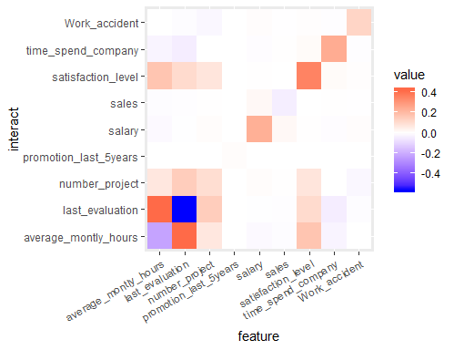

```r
install.packages("devtools", dependencies = TRUE)
devtools::install_github("AppliedDataSciencePartners/xgboostExplainer")

```


```r
require(tidyverse)
require(magrittr)
require(data.table)
require(xgboost)
require(xgboostExplainer)
require(ggridges)

```

# Preparation 


```r
loaded.obs  <- readRDS("./middle/data_and_model.Rds")

model.xgb   <- loaded.obs$model$xgb 

train.label  <- loaded.obs$data$train$label
train.df     <- loaded.obs$data$train$dummy.data.frame
train.matrix <- loaded.obs$data$train$matrix
train.xgb.DMatrix <- xgb.DMatrix(train.matrix, label = train.label, missing = NA)

test.label  <- loaded.obs$data$test$label
test.matrix <- loaded.obs$data$test$matrix
test.xgb.DMatrix  <- xgb.DMatrix(test.matrix, missing = NA)
```


```r
shap.xgb <- xgboost:::predict.xgb.Booster(
  model.xgb, newdata = train.matrix, 
  predcontrib = TRUE, approxcontrib = FALSE) %>% 
  data.frame()

shap.xgb %>% head(4) %>% knitr::kable(digits = 4)
```


 satisfaction_level   last_evaluation   number_project   average_montly_hours   time_spend_company   Work_accident   promotion_last_5years     sales    salary      BIAS
-------------------  ----------------  ---------------  ---------------------  -------------------  --------------  ----------------------  --------  --------  --------
            -0.5154            0.1214          -0.0227                 0.8721               0.9242          0.1007                  0.0065   -0.0893   -0.2184   -0.0052
            -0.5867            0.3693           0.4372                -0.1261               0.1747          0.0891                  0.0067    0.1298   -0.1670   -0.0052
             0.5255            0.0580          -0.0952                -0.1316               0.1498          0.1100                  0.0050   -0.2789    0.4077   -0.0052
             2.0530           -0.3991           0.0963                 0.3937              -0.2946          0.1146                  0.0056    0.2407    0.2478   -0.0052


```r
approxcontrib.xgb <- xgboost:::predict.xgb.Booster(
  model.xgb, newdata = train.matrix, 
  predcontrib = TRUE, approxcontrib = TRUE) %>% 
  data.frame()

approxcontrib.xgb %>% head(4) %>% knitr::kable(digits = 4)
```


 satisfaction_level   last_evaluation   number_project   average_montly_hours   time_spend_company   Work_accident   promotion_last_5years     sales    salary      BIAS
-------------------  ----------------  ---------------  ---------------------  -------------------  --------------  ----------------------  --------  --------  --------
            -0.8511            0.4867           0.0137                 0.7276               1.0806          0.0839                  0.0069   -0.1085   -0.2608   -0.0052
            -1.0387            0.5086           0.4655                 0.1135               0.2008          0.0823                  0.0061    0.1384   -0.1494   -0.0052
             0.2425            0.3310          -0.0172                -0.1523               0.1451          0.1044                  0.0051   -0.2508    0.3425   -0.0052
             1.4692           -0.1740           0.2443                 0.3454              -0.0153          0.1068                  0.0046    0.2427    0.2344   -0.0052

# feature responce

## example1: satisfaction_level


```r
feature.impact <- data.frame(value  = train.df$satisfaction_level, 
                             SHAP = shap.xgb$satisfaction_level,
                             structure = approxcontrib.xgb$satisfaction_level) %>% 
  gather(key = type, value = impact, -value)

ggp.sens.fi <- feature.impact %>% 
  ggplot(aes(x = value, y = impact)) + 
  geom_point(alpha = 0.7) +
  geom_smooth() +
  facet_grid(. ~ type) +
  labs(x = "satisfaction_level", y = "Feature impact on log-odds") +
  theme_bw()

ggsave(ggp.sens.fi, filename =  "./output/image.files/410_feature_impact_1.png",
    height = 4, width = 7)
`geom_smooth()` using method = 'gam' and formula 'y ~ s(x, bs = "cs")'
```


## example 2-1: last_evaluation


```r
feature.impact <- data.frame(value  = train.df$last_evaluation, 
                             SHAP = shap.xgb$last_evaluation,
                             structure = approxcontrib.xgb$last_evaluation,
                             satisfaction_level = train.df$satisfaction_level) %>% 
  gather(key = type, value = impact, -value, -satisfaction_level)
```


```r
ggp.sens.fi <- feature.impact %>% 
  ggplot(aes(x = value, y = impact)) + 
  geom_point(alpha = 0.7) +
  geom_smooth() +
  facet_grid(. ~ type) +
  labs(x = "last_evaluation", y = "Feature impact on log-odds") +
  theme_bw()

ggsave(ggp.sens.fi, filename =  "./output/image.files/410_feature_impact_2-1.png",
    height = 4, width = 7)
`geom_smooth()` using method = 'gam' and formula 'y ~ s(x, bs = "cs")'
```


## example 2-2: last_evaluation x satisfaction_level


```r
ggp.sens.fi <- feature.impact %>% 
  ggplot(aes(x = value, y = impact, color = satisfaction_level)) + 
  geom_point(alpha = 0.7) +
  geom_smooth() +
  facet_grid(. ~ type) +
  labs(x = "last_evaluation", y = "Feature impact on log-odds") +
  theme_bw() + 
  scale_color_gradient2(midpoint = 0.5, low="blue", mid="grey", high="red")

ggsave(ggp.sens.fi, filename =  "./output/image.files/410_feature_impact_2-2.png",
    height = 4, width = 7)
`geom_smooth()` using method = 'gam' and formula 'y ~ s(x, bs = "cs")'
```


## Average feature responce

**According to man(xgb.plot.shap)::Detail**

Visualizing the SHAP feature contribution to prediction dependencies on feature value.

These scatterplots represent how SHAP feature contributions depend of feature values. The similarity to partial dependency plots is that they also give an idea for how feature values affect predictions. However, in partial dependency plots, we usually see marginal dependencies of model prediction on feature value, while SHAP contribution dependency plots display the estimated contributions of a feature to model prediction for each individual case.

When plot_loess = TRUE is set, feature values are rounded to 3 significant digits and weighted LOESS is computed and plotted, where weights are the numbers of data points at each rounded value.

Note: SHAP contributions are shown on the scale of model margin. E.g., for a logistic binomial objective, the margin is prediction before a sigmoidal transform into probability-like values. Also, since SHAP stands for "SHapley Additive exPlanation" (model prediction = sum of SHAP contributions for all features + bias), depending on the objective used, transforming SHAP contributions for a feature from the marginal to the prediction space is not necessarily a meaningful thing to do.


```r
png(filename = "./output/image.files/410_varresp_SHAP.png", width = 1200, height = 320, pointsize = 24)
shap <- xgb.plot.shap(data  = train.matrix,
              model = model.xgb, 
              # sabsumple = 300,
              top_n = 6,
              n_col = 6, col = col, pch = 7, pch_NA = 17)
dev.off()
png 
  2 
```


## summary

according to: 
https://liuyanguu.github.io/post/2018/10/14/shap-visualization-for-xgboost/


```r
feature.value.long <- train.df %>% 
  scale() %>%
  data.frame() %>% 
  mutate(id = as.character(1:n())) %>% 
  gather(key = feature, value = value, -id)

feature.impact.long <- shap.xgb %>% 
  mutate(id = as.character(1:n())) %>% 
  select(-BIAS) %>% 
  gather(key = feature, value = impact, -id) %>% 
  left_join(feature.value.long, by = c("id", "feature")) %>% 
  mutate(feature = factor(feature))
  
feature.impact.long %>% head
  id            feature     impact      value
1  1 satisfaction_level -0.5154362  1.2569407
2  2 satisfaction_level -0.5866774  1.0321169
3  3 satisfaction_level  0.5254808  0.1776939
4  4 satisfaction_level  2.0530305 -1.2475779
5  5 satisfaction_level -0.6547130  1.0894793
6  6 satisfaction_level  0.5396414 -0.1364117
```

```r
# require(ggridge)
feature.impact.long %>% 
  ggplot(aes(x = impact, y = feature, point_color = value, fill = feature))+
  geom_density_ridges(
    scale = 2.0,
    rel_min_height = 0.01,
    alpha = 0.3, 
    jittered_points = TRUE, point_alpha = 0.05, point_size = 2, point_shape = "|",
    position = position_points_jitter(width = 0.05, height = 0)) + 
  scale_color_gradient(low="#FFCC33", high="#6600CC", labels=c("Low","High"))
Picking joint bandwidth of 0.06
```

<!-- -->


```r
feature.impact.long %>% 
  ggplot()+
    coord_flip() + 
    # sina plot: 
    ggforce::geom_sina(aes(x = feature, y = impact, color = value),
              method = "counts", maxwidth = 0.7, alpha = 0.2) +
  scale_color_gradient(low="#FFCC33", high="#6600CC") +
  theme_bw()
```

<!-- -->


# SHAP values of contributions of interaction of each pair of features 

For "gblinear" booster, feature contributions are simply linear terms (feature_beta * feature_value). 

### `predinteraction = TRUE, approxcontrib = FALSE`	

For "gbtree" booster, with `predinteraction = TRUE, approxcontrib = FALSE`, SHAP values of contributions of interaction of each pair of features are computed. Note that this operation might be rather expensive in terms of compute and memory. Since it quadratically depends on the number of features, it is recommended to perfom selection of the most important features first. 


```r
system.time(
  predinteraction.shap <- xgboost:::predict.xgb.Booster(
    model.xgb, newdata = train.matrix, 
    predinteraction = TRUE, approxcontrib = FALSE)
)
   user  system elapsed 
  43.12    0.01    5.60 
```

### `predinteraction = TRUE, approxcontrib = FALSE`	

For "gbtree" booster, with `predinteraction = TRUE, approxcontrib = FALSE`, SHAP values are approximated by structureal based. The contribution of each feature is not a single predetermined value, but depends on the rest of the feature vector which determines the decision path that traverses the tree and thus the guards/contributions that are passed along the way.

This operation is less expensive in terms of compute and memory.


```r
system.time(
  predinteraction.app <- xgboost:::predict.xgb.Booster(
    model.xgb, newdata = train.matrix, 
    predinteraction = TRUE, approxcontrib = TRUE)
)
   user  system elapsed 
   0.73    0.01    0.14 
```

## Interaction of single observation


```r
idx = 1
predinteraction.shap[idx, ,] %>% 
  data.frame %>%
  select(-BIAS) %>% 
  rownames_to_column("feature") %>% 
  gather(key = interact, value = value, -feature) %>%
  filter(feature != "BIAS") %>% 
  mutate_at(vars(feature, interact), as.factor) %>% 
  ggplot(aes(x = feature, y = interact, fill = value)) +
  geom_tile() +
  scale_fill_gradient2(midpoint = 0, 
                       low="blue", mid = "white", high="red") +
  theme(axis.text.x = element_text(angle = 30, hjust = 1))
```

<!-- -->

## Average interaction of all observation


```r
mean.shap <- apply(abs(predinteraction.shap), 2:3, sum) /
  NROW(predinteraction.shap)
mean.app <- apply(abs(predinteraction.app), 2:3, sum) /
  NROW(predinteraction.app)

mean.shap %>% 
  data.frame %>%
  select(-BIAS) %>% 
  rownames_to_column("feature") %>% 
  gather(key = interact, value = value, -feature) %>%
  filter(feature != "BIAS") %>% 
  mutate_at(vars(feature, interact), as.factor) %>% 
  ggplot(aes(x = feature, y = interact, fill = value)) +
  geom_tile() +
  scale_fill_gradient(low="white",high="red") +
  theme(axis.text.x = element_text(angle = 30, hjust = 1))
```

<!-- -->

