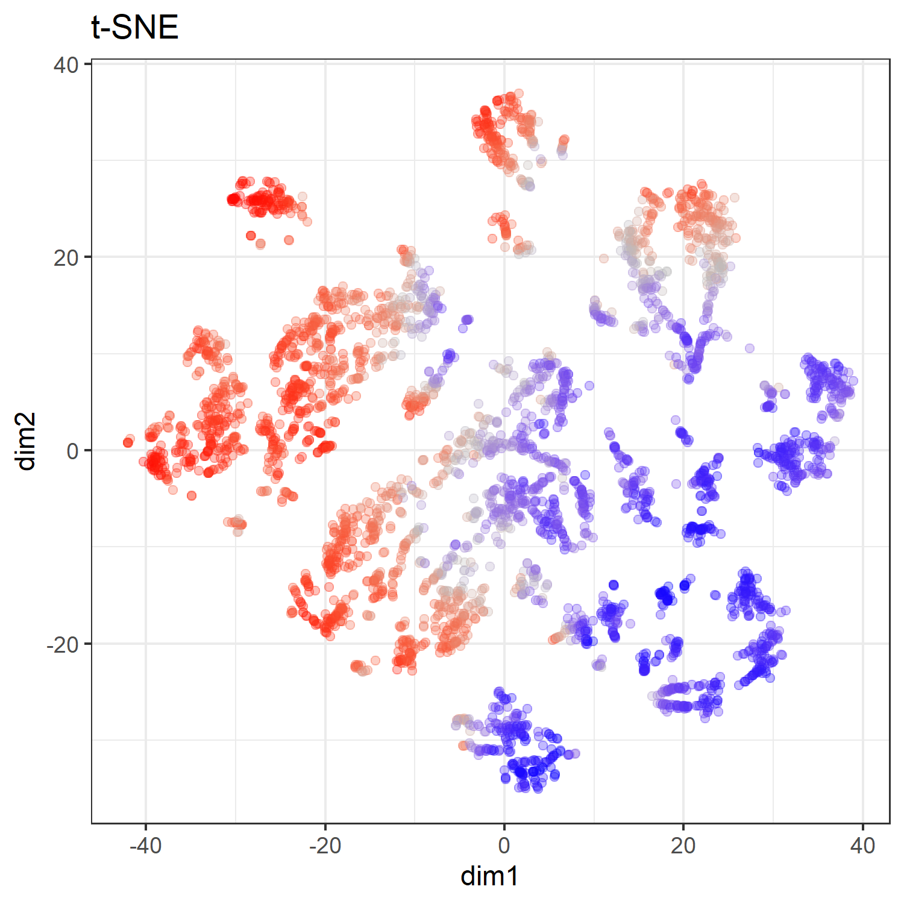
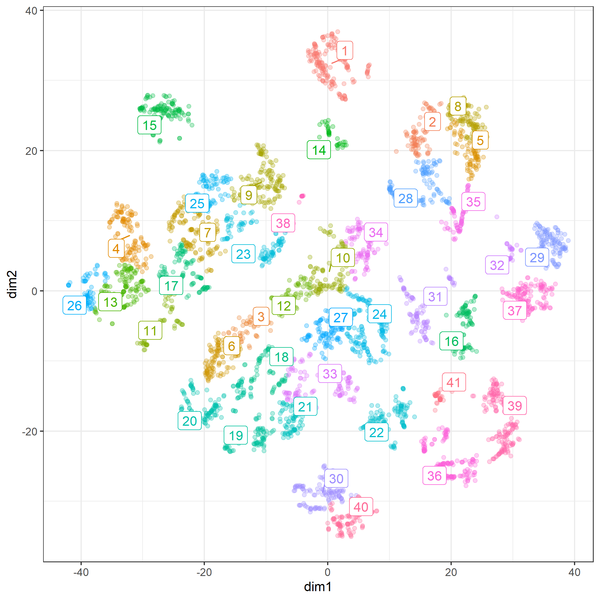
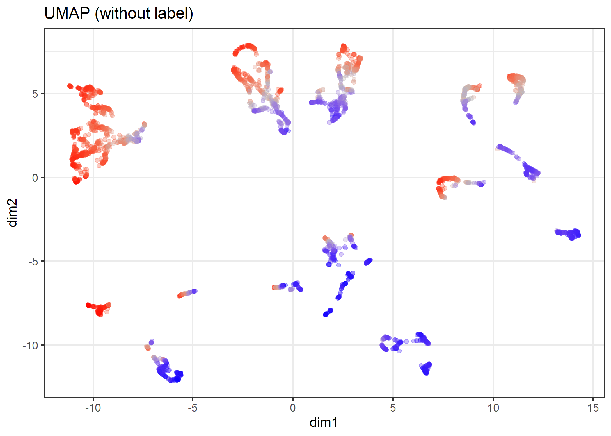

```{r setup, include=FALSE}
knitr::opts_knit$set(progress = TRUE, 
                     verbose  = TRUE, 
                     root.dir = ".")

knitr::opts_chunk$set(collapse = TRUE, 
                      comment = "", 
                      message = TRUE, 
                      warning = FALSE, 
                      include = TRUE,
                      echo    = TRUE)

set.seed(1)
```

```{r install.requirements, eval = FALSE}
install.packages("Rtsne", dependencies = TRUE)
install.packages("uwot", dependencies = TRUE)
install.packages("ggdendro", dependencies = TRUE)
install.packages("ggrepel", dependencies = TRUE)

```

```{r require.packages, message=FALSE}
require(tidyverse)
require(magrittr)
require(xgboost)

require(Rtsne)
require(uwot)
library(ggdendro)
require(ggrepel)

```

# Preparation 

If file = "./middle/data_and_model.Rds" doesn't exist, RUN `100_building_xgboost_model.Rmd`.

```{r load.model.and.data}
loaded.obs  <- readRDS("./middle/data_and_model.Rds")

model.xgb   <- loaded.obs$model$xgb 

train.label <- loaded.obs$data$train$label
train.matrix <- loaded.obs$data$train$matrix
train.xgb.DMatrix <- xgb.DMatrix(train.matrix, label = train.label, missing = NA)

test.label  <- loaded.obs$data$test$label
test.matrix <- loaded.obs$data$test$matrix
test.xgb.DMatrix  <- xgb.DMatrix(test.matrix, missing = NA)

```

## get breakdown explanations

Feature contributions (SHAP values using built-in function.) for "gbtree" booster.

```{r}
shap.xgb <- xgboost:::predict.xgb.Booster(
  model.xgb, newdata = train.matrix, 
  predcontrib = TRUE, approxcontrib = FALSE)

shap.xgb %>% head(4) %>% t

```

```{r}
prediction.xgb %>% head()
weight.shap <- shap.xgb %>% rowSums()
weight.shap %>% head
1/(1 + exp(-weight.shap)) %>% head

```


```{r}
source("./R/waterfallBreakdown.R")

ggp.shap <- waterfallBreakdown(
  breakdown = unlist(shap.xgb[1, ]), type = "binary",
  labels = paste(colnames(shap.xgb), 
                 c(train.matrix[1, ],""), sep =" = ")) +
  ggtitle("SHAP value")

ggsave(ggp.shap, filename = "./output/image.files/420_explain_single_obs_SHAP.png",
       width = 3.5, height = 4)
```


# clustering of observation based on breakdown

## dimension reduction using t-SNE

according to :
http://jmonlong.github.io/Hippocamplus/2017/12/02/tsne-and-clustering/

```{r}
# shap.xgb %>% str
# prediction.xgb %>% str

shap.xgb.tsne <- shap.xgb %>% 
  # data.frame() %>% 
  data.frame(pred = prediction.xgb) %>% 
  select(-BIAS) %>%
  Rtsne::Rtsne(perplexity = 50, check_duplicates = FALSE)

# shap.xgb.tsne %>% str

mapping.tsne <- data.frame(
  id     = 1:length(prediction.xgb),
  dim1  = shap.xgb.tsne$Y[, 1],
  dim2  = shap.xgb.tsne$Y[, 2],
  pred   = prediction.xgb,
  weight = weight.app)

ggp.tsne <- mapping.tsne %>% 
  ggplot(aes(x = dim1, y = dim2, colour = prediction.xgb)) + 
    geom_point(alpha = 0.3) + theme_bw() +
  scale_color_gradient2(midpoint=0.5, low="blue", mid="gray", high="red") + 
  guides(colour = FALSE) + 
  labs(title = "t-SNE")

ggsave(ggp.tsne, filename =  "./output/image.files/420_map_tSNE.png",
    height = 5, width = 5)

```




## Hierarchical clustering

```{r }
shap.xgb.tsne.hc <- mapping.tsne %>% 
  select(-id) %>% 
  as.matrix() %>% 
  dist() %>% 
  hclust()
shap.xgb.tsne.hc

```

### explore cut.off for cutree

```{r}
library(ggdendro)

cut.off = 12

ggd.breakdown <- ggdendrogram(shap.xgb.tsne.hc, rotate = TRUE, size = 2) +
  geom_hline(yintercept = cut.off, color = "red")

ggsave(ggd.breakdown, filename =  "./output/image.files/420_hclust_rules.png",
    height = 12, width = 7)

```


```{r}
require(ggrepel)

mapping.tsne$hclust <- shap.xgb.tsne.hc %>%
  cutree(h = cut.off) %>%
  factor()

hc.cent <- mapping.tsne %>% 
  group_by(hclust) %>%
  select(dim1, dim2) %>% 
  summarize_all(mean)

map.tsne.labeled <- mapping.tsne %>% 
  ggplot(aes(x = dim1, y = dim2, colour = hclust)) + 
  geom_point(alpha = 0.3) + 
  theme_bw() +
  ggrepel::geom_label_repel(data = hc.cent, aes(label = hclust)) + 
  guides(colour = FALSE)

ggsave(map.tsne.labeled, filename =  "./output/image.files/420_map_tSNE_labeled.png",
    height = 7, width = 7)

```




## dimension reduction using UMAP

according to :
https://rdrr.io/cran/uwot/man/umap.html


### non-optional

```{r}
shap.xgb.umap <- shap.xgb %>% 
  data.frame() %>% 
  select(-BIAS) %>%
  uwot::umap()

shap.xgb.umap %>% str

mapping.umap <- data.frame(
  id     = 1:length(prediction.xgb),
  dim1  = shap.xgb.umap[, 1],
  dim2  = shap.xgb.umap[, 2],
  pred   = prediction.xgb,
  weight = weight.app)
# mapping.umap %>% str

ggp.umap <- mapping.umap %>% 
  ggplot(aes(x = dim1, y = dim2, colour = prediction.xgb)) + 
    geom_point(alpha = 0.3) + theme_bw() +
  scale_color_gradient2(midpoint=0.5, low="blue", mid="gray", high="red") + 
  guides(colour = FALSE) + 
  labs(title = "UMAP (without label)") 

ggsave(ggp.umap, filename =  "./output/image.files/420_map_umap.png",
       height = 5, width = 7)

```



### supervised dimension reduction

```{r}
shap.xgb.sumap <- shap.xgb %>% 
  data.frame() %>% 
  select(-BIAS) %>%
  uwot::umap(n_neighbors = 12,
             learning_rate = 0.7,
             y = prediction.xgb)

# shap.xgb.sumap

mapping.sumap <- data.frame(
  id     = 1:length(prediction.xgb),
  dim1  = shap.xgb.sumap[, 1],
  dim2  = shap.xgb.sumap[, 2],
  pred   = prediction.xgb,
  weight = weight.app)
# mapping.sumap %>% str

ggp.sumap <- mapping.sumap %>% 
  ggplot(aes(x = dim1, y = dim2, colour = prediction.xgb)) + 
    geom_point(alpha = 0.3) + theme_bw() +
  scale_color_gradient2(midpoint=0.5, low="blue", mid="gray", high="red") + 
  guides(colour = FALSE) + 
  labs(title = "supervised UMAP") 

ggsave(ggp.sumap, filename = "./output/image.files/420_map_sumap.png",
       height = 5, width = 7)

```


## Hierarchical Density-based spatial clustering of applications with noise (HDBSCAN)

Reference:

https://hdbscan.readthedocs.io/en/latest/how_hdbscan_works.html

according to:

https://cran.r-project.org/web/packages/dbscan/vignettes/hdbscan.html

```{r}
# install.packages("dbscan", dependencies = TRUE)
require(dbscan)

```

`minPts` not only acts as a minimum cluster size to detect, but also as a "smoothing" factor of the density estimates implicitly computed from HDBSCAN.

```{r }
# mapping.sumap %>% str
cl.hdbscan <- mapping.sumap %>% 
  select(dim1, dim2) %>% 
  hdbscan(minPts = 30)
cl.hdbscan

plot(cl.hdbscan, show_flat = TRUE)

```

```{r}
# install.packages("ggrepel", dependencies = TRUE)
require(ggrepel)

mapping.sumap$hdbscan <- factor(cl.hdbscan$cluster)

hdbscan.cent <- mapping.sumap %>% 
  filter(hdbscan != 0) %>% 
  dplyr::group_by(hdbscan) %>%
  select(dim1, dim2) %>% 
  summarize_all(mean)

ggp.sumap.labeled <- mapping.sumap %>% 
  ggplot(aes(x = dim1, y = dim2, colour = hdbscan)) + 
  geom_point(alpha = 0.3) + 
  theme_bw() +
  ggrepel::geom_label_repel(data = hdbscan.cent, 
                            aes(label = hdbscan),
                            label.size = 0.1) + 
  guides(colour = FALSE) + 
  labs(title = "supervised UMAP + HDBSCAN") 


ggsave(ggp.sumap.labeled, filename =  "./output/image.files/420_map_sumap_labeled.png",
    height = 7, width = 7)

```


```{r, fig.height=7, fig.width=7, results="hide"}
ggp.tsne.sumap <- gridExtra::arrangeGrob(
  ggp.tsne, 
  ggp.umap,
  ggp.sumap, 
  ggp.sumap.labeled,
  ncol = 2)

ggsave(ggp.tsne.sumap, filename =  "./output/image.files/420_tSNE_sumap.png",
    height = 10, width = 10)

```


# View rules in several group

NOTE: observations with `hdbscan == 0` are as noise by hDBSCAN.

```{r, eval=FALSE}
clust.id = 1
sample.n = 6

target <- mapping.sumap %>% 
  filter(hdbscan == clust.id) %>% 
  arrange(desc(pred))

sw <- list(NULL)
for(i in 1:sample.n){
  idx = target$id[i]
  
  sw[[i]]  <- waterfallBreakdown(
    breakdown = unlist(shap.xgb[idx, ]),
    type = "binary",
    labels = paste(colnames(shap.xgb), 
                   c(train.matrix[idx, ],""), sep =" = ")) +
    ggtitle(sprintf("predict = %.04f\nweight = %.04f",
                    target$predict[i], target$weight[i]))
}

ggp.sw <- gridExtra::arrangeGrob(grobs = sw, ncol = 3)
ggsave(ggp.sw, , height = 6
       filename = "./output/image.files/420_rules_cl1.png")
```


