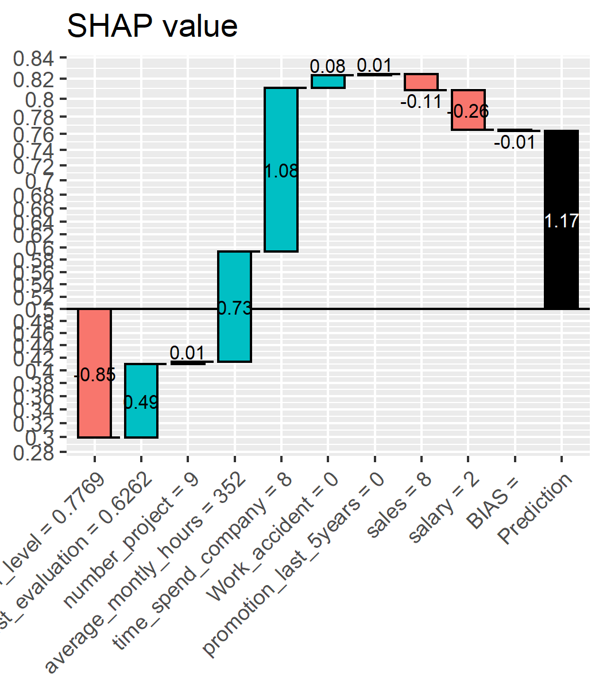
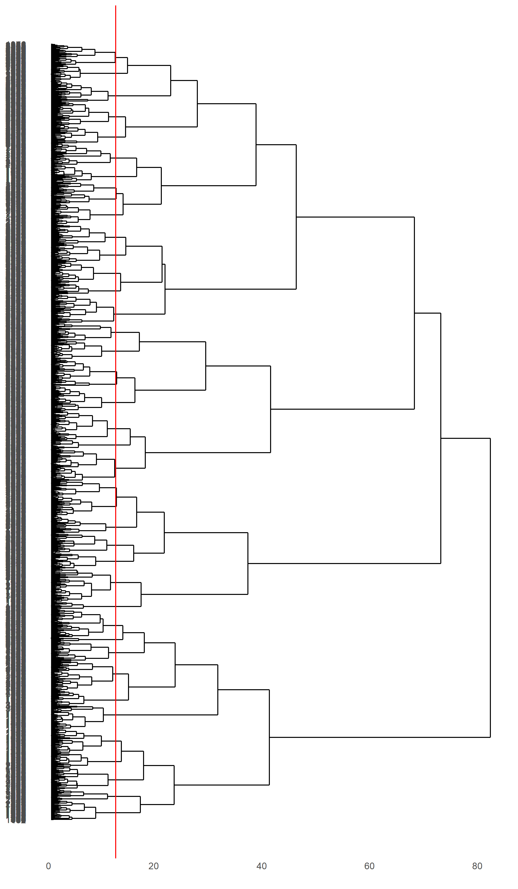
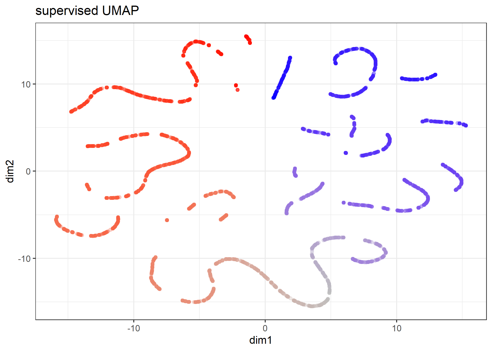
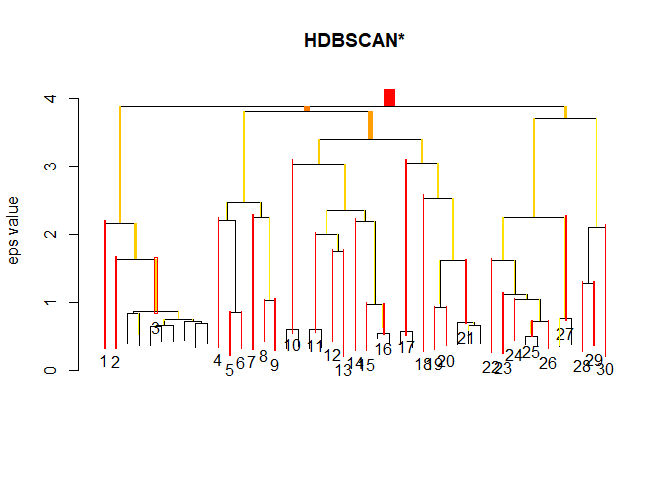
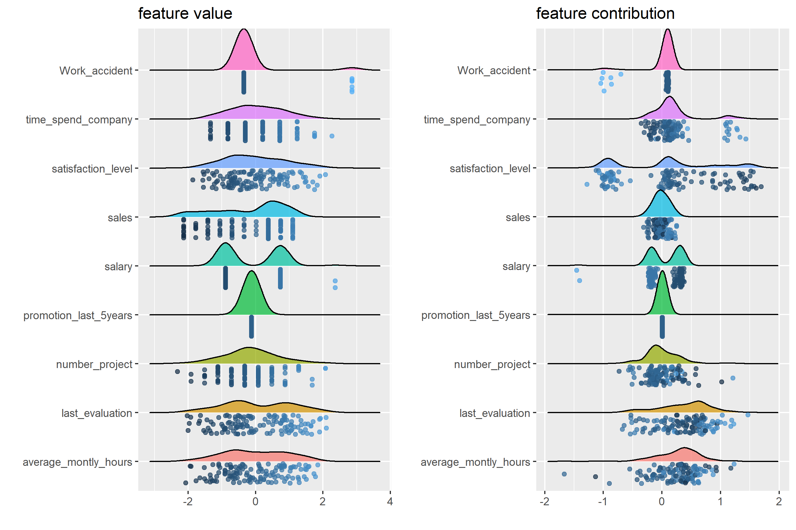

```r
install.packages("Rtsne", dependencies = TRUE)
install.packages("uwot", dependencies = TRUE)
install.packages("ggdendro", dependencies = TRUE)
install.packages("ggrepel", dependencies = TRUE)

```


```r
require(tidyverse)
require(magrittr)
require(xgboost)

require(Rtsne)
require(uwot)
library(ggdendro)
require(ggrepel)
```

# Preparation 

If file = "./middle/data_and_model.Rds" doesn't exist, RUN `100_building_xgboost_model.Rmd`.


```r
loaded.obs  <- readRDS("./middle/data_and_model.Rds")

model.xgb   <- loaded.obs$model$xgb 

train.label <- loaded.obs$data$train$label
train.matrix <- loaded.obs$data$train$matrix
train.xgb.DMatrix <- xgb.DMatrix(train.matrix, label = train.label, missing = NA)

test.label  <- loaded.obs$data$test$label
test.matrix <- loaded.obs$data$test$matrix
test.xgb.DMatrix  <- xgb.DMatrix(test.matrix, missing = NA)

prediction.xgb <- xgboost:::predict.xgb.Booster(model.xgb, newdata = train.matrix)
```

## get breakdown explanations

For "gbtree" booster, structureal based contribution of each feature is determined by the decision path that traverses the tree and thus the guards/contributions that are passed along the way.

see: http://blog.datadive.net/interpreting-random-forests/


```r
approxcontrib.xgb <- xgboost:::predict.xgb.Booster(
  model.xgb, newdata = train.matrix, 
  predcontrib = TRUE, approxcontrib = TRUE)

approxcontrib.xgb %>% head(4) %>% t
                              [,1]        [,2]         [,3]         [,4]
satisfaction_level    -0.851062775 -1.03873408  0.242545545  1.469222069
last_evaluation        0.486733913  0.50859427  0.330951124 -0.174049839
number_project         0.013652145  0.46546915 -0.017210312  0.244320467
average_montly_hours   0.727571428  0.11346900 -0.152285829  0.345401347
time_spend_company     1.080609798  0.20075803  0.145100608 -0.015326169
Work_accident          0.083896913  0.08231058  0.104428932  0.106792673
promotion_last_5years  0.006930237  0.00605675  0.005063735  0.004602843
sales                 -0.108526632  0.13844064 -0.250824898  0.242727458
salary                -0.260827631 -0.14940006  0.342500240  0.234431952
BIAS                  -0.005168790 -0.00516879 -0.005168790 -0.005168790
```


```r
prediction.xgb %>% head()
[1] 0.7638327 0.5797617 0.6781101 0.9207772 0.4998003 0.9250071
weight.app <- approxcontrib.xgb %>% rowSums()
weight.app %>% head
[1]  1.1738086063  0.3217955003  0.7451003548  2.4529540115 -0.0007986953
[6]  2.5124074277
1/(1 + exp(-weight.app)) %>% head
[1] 0.7638327 0.5797618 0.6781102 0.9207772 0.4998003 0.9250071
```


```r
source("./R/waterfallBreakdown.R")

ggp.shap <- waterfallBreakdown(
  breakdown = unlist(approxcontrib.xgb[1, ]), type = "binary",
  labels = paste(colnames(approxcontrib.xgb), 
                 c(train.matrix[1, ],""), sep =" = ")) +
  ggtitle("SHAP value")

ggsave(ggp.shap, filename = "./output/image.files/420_explain_single_obs.png",
       width = 3.5, height = 4)
```




# clustering of observation based on breakdown

## dimension reduction using t-SNE

according to :
http://jmonlong.github.io/Hippocamplus/2017/12/02/tsne-and-clustering/


```r
# approxcontrib.xgb %>% str
# prediction.xgb %>% str

approxcontrib.xgb.tsne <- approxcontrib.xgb %>% 
  # data.frame() %>% 
  data.frame(pred = prediction.xgb) %>% 
  select(-BIAS) %>%
  Rtsne::Rtsne(perplexity = 50, check_duplicates = FALSE)

# approxcontrib.xgb.tsne %>% str

mapping.tsne <- data.frame(
  id     = 1:length(prediction.xgb),
  dim1  = approxcontrib.xgb.tsne$Y[, 1],
  dim2  = approxcontrib.xgb.tsne$Y[, 2],
  pred   = prediction.xgb,
  weight = weight.app)

ggp.tsne <- mapping.tsne %>% 
  ggplot(aes(x = dim1, y = dim2, colour = prediction.xgb)) + 
    geom_point(alpha = 0.3) + theme_bw() +
  scale_color_gradient2(midpoint=0.5, low="blue", mid="gray", high="red") + 
  guides(colour = FALSE) + 
  labs(title = "t-SNE")

ggsave(ggp.tsne, filename =  "./output/image.files/420_map_tSNE.png",
    height = 5, width = 5)
```


## Hierarchical clustering


```r
approxcontrib.xgb.tsne.hc <- mapping.tsne %>% 
  select(-id) %>% 
  as.matrix() %>% 
  dist() %>% 
  hclust()
approxcontrib.xgb.tsne.hc

Call:
hclust(d = .)

Cluster method   : complete 
Distance         : euclidean 
Number of objects: 4000 
```

### explore cut.off for cutree


```r
library(ggdendro)

cut.off = 12

ggd.breakdown <- ggdendrogram(approxcontrib.xgb.tsne.hc, rotate = TRUE, size = 2) +
  geom_hline(yintercept = cut.off, color = "red")

ggsave(ggd.breakdown, filename =  "./output/image.files/420_hclust_rules.png",
    height = 12, width = 7)
```




```r
require(ggrepel)

mapping.tsne$hclust <- approxcontrib.xgb.tsne.hc %>%
  cutree(h = cut.off) %>%
  factor()

hc.cent <- mapping.tsne %>% 
  group_by(hclust) %>%
  select(dim1, dim2) %>% 
  summarize_all(mean)
Adding missing grouping variables: `hclust`

map.tsne.labeled <- mapping.tsne %>% 
  ggplot(aes(x = dim1, y = dim2, colour = hclust)) + 
  geom_point(alpha = 0.3) + 
  theme_bw() +
  ggrepel::geom_label_repel(data = hc.cent, aes(label = hclust)) + 
  guides(colour = FALSE)

ggsave(map.tsne.labeled, filename =  "./output/image.files/420_map_tSNE_labeled.png",
    height = 7, width = 7)
```


## dimension reduction using UMAP

according to :
https://rdrr.io/cran/uwot/man/umap.html


### non-optional


```r
approxcontrib.xgb.umap <- approxcontrib.xgb %>% 
  data.frame() %>% 
  select(-BIAS) %>%
  uwot::umap()

approxcontrib.xgb.umap %>% str
 num [1:4000, 1:2] 7.45 8.51 -2.14 -10.12 11.33 ...
 - attr(*, "scaled:center")= num [1:2] 0.553 -0.136

mapping.umap <- data.frame(
  id     = 1:length(prediction.xgb),
  dim1  = approxcontrib.xgb.umap[, 1],
  dim2  = approxcontrib.xgb.umap[, 2],
  pred   = prediction.xgb,
  weight = weight.app)
# mapping.umap %>% str

ggp.umap <- mapping.umap %>% 
  ggplot(aes(x = dim1, y = dim2, colour = prediction.xgb)) + 
    geom_point(alpha = 0.3) + theme_bw() +
  scale_color_gradient2(midpoint=0.5, low="blue", mid="gray", high="red") + 
  guides(colour = FALSE) + 
  labs(title = "UMAP (without label)") 

ggsave(ggp.umap, filename =  "./output/image.files/420_map_umap.png",
       height = 5, width = 7)
```


### supervised dimension reduction


```r
approxcontrib.xgb.sumap <- approxcontrib.xgb %>% 
  data.frame() %>% 
  select(-BIAS) %>%
  uwot::umap(n_neighbors = 12,
             learning_rate = 0.7,
             y = prediction.xgb)

# approxcontrib.xgb.sumap

mapping.sumap <- data.frame(
  id     = 1:length(prediction.xgb),
  dim1  = approxcontrib.xgb.sumap[, 1],
  dim2  = approxcontrib.xgb.sumap[, 2],
  pred   = prediction.xgb,
  weight = weight.app)
# mapping.sumap %>% str

ggp.sumap <- mapping.sumap %>% 
  ggplot(aes(x = dim1, y = dim2, colour = prediction.xgb)) + 
    geom_point(alpha = 0.3) + theme_bw() +
  scale_color_gradient2(midpoint=0.5, low="blue", mid="gray", high="red") + 
  guides(colour = FALSE) + 
  labs(title = "supervised UMAP") 

ggsave(ggp.sumap, filename = "./output/image.files/420_map_sumap.png",
       height = 5, width = 7)
```



## Hierarchical Density-based spatial clustering of applications with noise (HDBSCAN)

Reference:

https://hdbscan.readthedocs.io/en/latest/how_hdbscan_works.html

according to:

https://cran.r-project.org/web/packages/dbscan/vignettes/hdbscan.html


```r
# install.packages("dbscan", dependencies = TRUE)
require(dbscan)
Loading required package: dbscan
```

`minPts` not only acts as a minimum cluster size to detect, but also as a "smoothing" factor of the density estimates implicitly computed from HDBSCAN.


```r
# mapping.sumap %>% str
cl.hdbscan <- mapping.sumap %>% 
  select(dim1, dim2) %>% 
  hdbscan(minPts = 30)
cl.hdbscan
HDBSCAN clustering for 4000 objects.
Parameters: minPts = 30
The clustering contains 30 cluster(s) and 106 noise points.

  0   1   2   3   4   5   6   7   8   9  10  11  12  13  14  15  16  17 
106 126 159 676  46  60  81 123  71 187 116 144  73  90  93 107 209 153 
 18  19  20  21  22  23  24  25  26  27  28  29  30 
 42  86  79 302  37  68  69 277  45 207  38  90  40 

Available fields: cluster, minPts, cluster_scores,
                  membership_prob, outlier_scores, hc

plot(cl.hdbscan, show_flat = TRUE)
```

<!-- -->


```r
# install.packages("ggrepel", dependencies = TRUE)
require(ggrepel)

mapping.sumap$hdbscan <- factor(cl.hdbscan$cluster)

hdbscan.cent <- mapping.sumap %>% 
  filter(hdbscan != 0) %>% 
  dplyr::group_by(hdbscan) %>%
  select(dim1, dim2) %>% 
  summarize_all(mean)
Adding missing grouping variables: `hdbscan`

ggp.sumap.labeled <- mapping.sumap %>% 
  ggplot(aes(x = dim1, y = dim2, colour = hdbscan)) + 
  geom_point(alpha = 0.3) + 
  theme_bw() +
  ggrepel::geom_label_repel(data = hdbscan.cent, 
                            aes(label = hdbscan),
                            label.size = 0.1) + 
  guides(colour = FALSE) + 
  labs(title = "supervised UMAP + HDBSCAN") 


ggsave(ggp.sumap.labeled, filename =  "./output/image.files/420_map_sumap_labeled.png",
    height = 7, width = 7)
```


```r
ggp.tsne.sumap <- gridExtra::arrangeGrob(
  ggp.tsne, 
  ggp.umap,
  ggp.sumap, 
  ggp.sumap.labeled,
  ncol = 2)

ggsave(ggp.tsne.sumap, filename =  "./output/image.files/420_tSNE_sumap.png",
    height = 10, width = 10)
```


# View rules in a cluster

NOTE: observations with `hdbscan == 0` are as noise by hDBSCAN.


```r
clust.id = 1
sample.n = 12

target <- mapping.sumap %>% 
  filter(hdbscan == clust.id) %>% 
  arrange(desc(pred))

sw <- list(NULL)
for(i in 1:sample.n){
  idx = target$id[i]
  
  sw[[i]]  <- waterfallBreakdown(
    breakdown = unlist(approxcontrib.xgb[idx, ]),
    type = "binary",
    labels = paste(colnames(approxcontrib.xgb), 
                   c(train.matrix[idx, ],""), sep =" = ")) +
    ggtitle(sprintf("predict = %.04f\nweight = %.04f",
                    target$predict[i], target$weight[i]))
}

ggp.sw <- gridExtra::arrangeGrob(grobs = sw, ncol = 4)
ggsave(ggp.sw, height = 9,
       filename = "./output/image.files/420_rules_cl1.png")
Saving 7 x 9 in image
```


## summarise for each contribution


```r
# 
require(ggridges)
Loading required package: ggridges

Attaching package: 'ggridges'
The following object is masked from 'package:ggplot2':

    scale_discrete_manual

# approxcontrib.xgb %>% str
feature.value.long <- train.matrix %>% 
  scale() %>%
  data.frame() %>% 
  mutate(id = as.character(1:n())) %>% 
  gather(key = feature, value = value, -id)

feature.impact.long <- approxcontrib.xgb[target$id, ] %>% 
  data.frame(id = as.character(target$id)) %>% 
  select(-BIAS) %>% 
  gather(key = feature, value = impact, -id) %>% 
  left_join(feature.value.long, by = c("id", "feature")) %>% 
  mutate(feature = factor(feature))


ggp.impact <- feature.impact.long %>% 
  ggplot(aes(x = impact, y = feature, point_color = value, fill = feature))+
  geom_density_ridges(
    jittered_points = TRUE, 
    position = "raincloud",
    alpha = 0.7, 
    scale = 0.9
  ) +
  guides(label = FALSE,colour = FALSE) + 
  scale_color_gradient(low="#FFCC33", high="#6600CC", labels=c("Low","High")) +
  theme(legend.position = 'none') +
  labs(title = "feature contribution", x="", y="")

ggp.contribution <- feature.impact.long %>% 
  ggplot(aes(x = value, y = feature, point_color = value, fill = feature))+
  geom_density_ridges(
    jittered_points = TRUE, 
    position = "raincloud",
    alpha = 0.7, 
    scale = 0.9
  ) +
  guides(label = FALSE,colour = FALSE) + 
  scale_color_gradient(low="#FFCC33", high="#6600CC", labels=c("Low","High")) +
  theme(legend.position = 'none') +
  labs(title = "feature value", x="", y="")

ggp.fcl <- gridExtra::arrangeGrob(grobs = list(ggp.contribution, ggp.impact), ncol = 2)
Picking joint bandwidth of 0.274
Picking joint bandwidth of 0.093
ggsave(ggp.fcl, width = 9, height = 6,
       filename = "./output/image.files/420_stratified_clustering_cl1.png")
```



