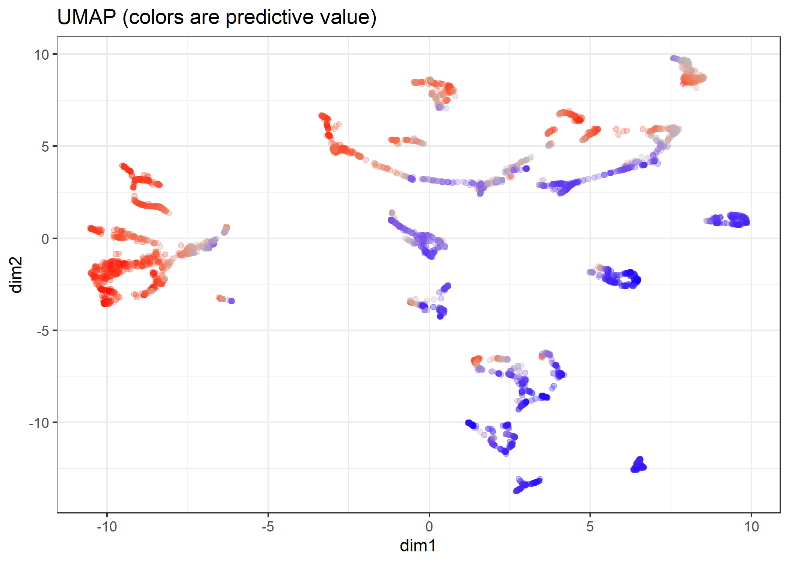
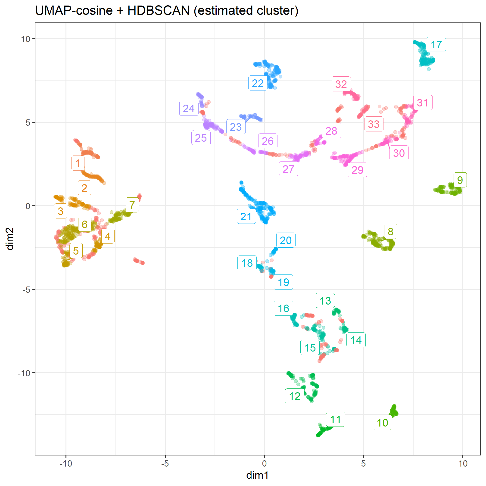
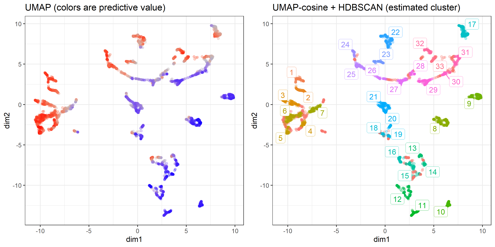
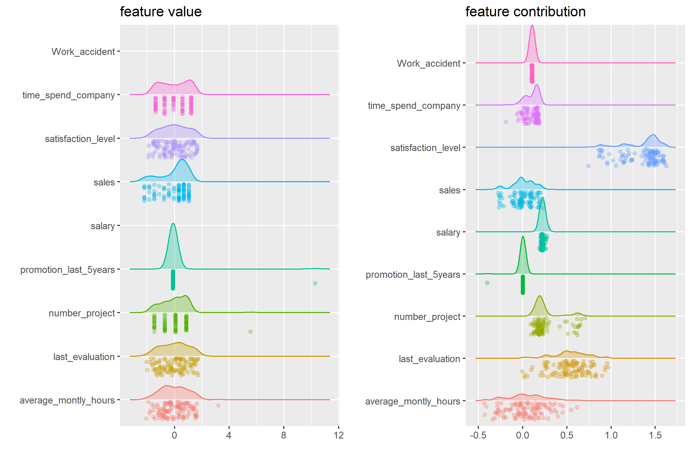
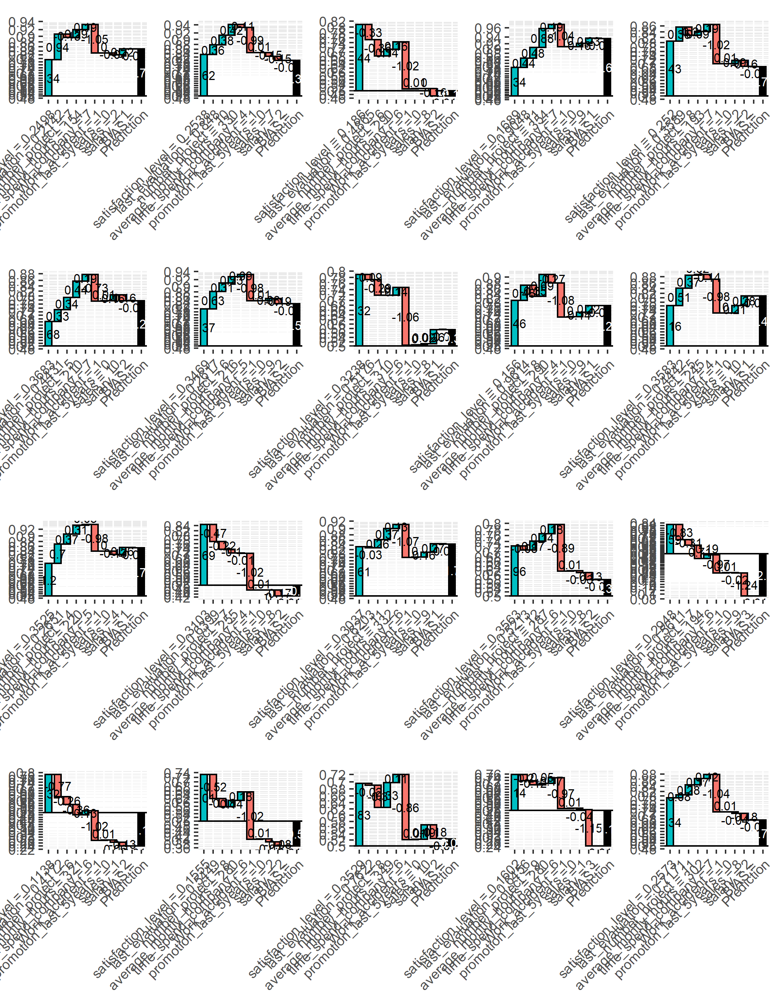
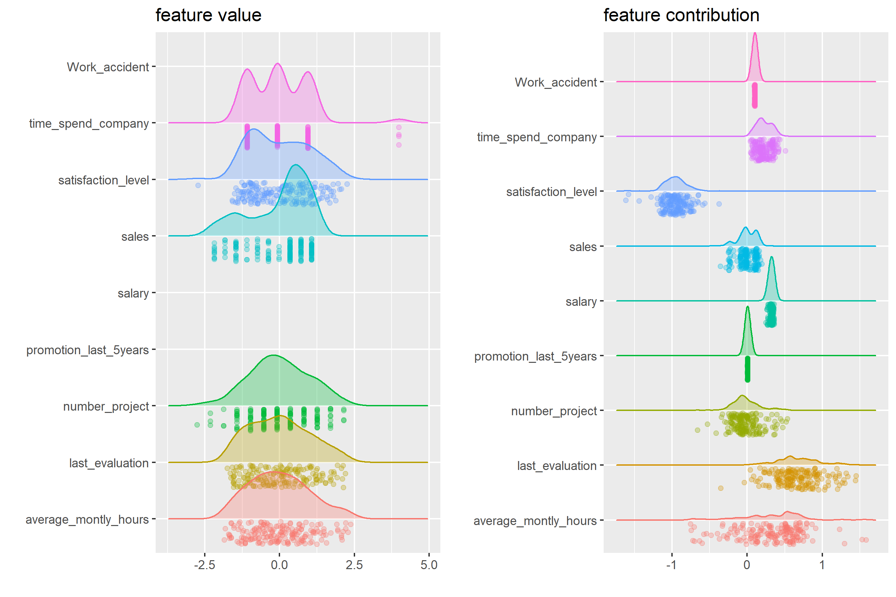

```{r setup, include=FALSE}
knitr::opts_knit$set(progress = TRUE, 
                     verbose  = TRUE, 
                     root.dir = ".")

knitr::opts_chunk$set(collapse = TRUE, 
                      comment = "", 
                      message = TRUE, 
                      warning = FALSE, 
                      include = TRUE,
                      echo    = TRUE)

set.seed(1)
```

```{r install.requirements, eval = FALSE}
install.packages("Rtsne", dependencies = TRUE)
install.packages("uwot", dependencies = TRUE)
install.packages("dbscan", dependencies = TRUE)
install.packages("ggrepel", dependencies = TRUE)

source("./R/waterfallBreakdown.R")
source("./R/ggRaincloud.R")

```

```{r require.packages, message=FALSE}
require(tidyverse)
require(magrittr)
require(xgboost)

require(Rtsne)
require(uwot)
library(ggdendro)
require(ggrepel)
# 
require(ggridges)

source("./R/ggRaincloud.R")
source("./R/waterfallBreakdown.R")

```

# Preparation 

If file = "./middle/data_and_model.Rds" doesn't exist, RUN `100_building_xgboost_model.Rmd`.

```{r load.model.and.data}
loaded.obs  <- readRDS("./middle/data_and_model.Rds")

model.xgb   <- loaded.obs$model$xgb 

train.label <- loaded.obs$data$train$label
train.matrix <- loaded.obs$data$train$matrix
train.xgb.DMatrix <- xgb.DMatrix(train.matrix, label = train.label, missing = NA)

test.label  <- loaded.obs$data$test$label
test.matrix <- loaded.obs$data$test$matrix
test.xgb.DMatrix  <- xgb.DMatrix(test.matrix, missing = NA)

prediction.xgb <- xgboost:::predict.xgb.Booster(model.xgb, newdata = train.matrix)

```

## get breakdown explanations

For "gbtree" booster, structureal based contribution of each feature is determined by the decision path that traverses the tree and thus the guards/contributions that are passed along the way.

see: http://blog.datadive.net/interpreting-random-forests/


```{r}
contrib.xgb <- xgboost:::predict.xgb.Booster(
  model.xgb, newdata = train.matrix, 
  predcontrib = TRUE, approxcontrib = TRUE)

contrib.xgb %>% head(4) %>% t

```

```{r}
prediction.xgb %>% head()
weight.app <- contrib.xgb %>% rowSums()
weight.app %>% head
1/(1 + exp(-weight.app)) %>% head

```

# clustering of observation based on breakdown

## dimension reduction using UMAP (unsupervised)

according to :

https://rdrr.io/cran/uwot/man/umap.html

```{r}
contrib.xgb.umap <- contrib.xgb %>% 
  data.frame() %>% 
  select(-BIAS) %>%
  uwot::umap(metric = "cosine")

contrib.xgb.umap %>% str

mapping.umap <- data.frame(
  id     = 1:length(prediction.xgb),
  dim1  = contrib.xgb.umap[, 1],
  dim2  = contrib.xgb.umap[, 2],
  pred   = prediction.xgb)
# mapping.umap %>% str

ggp.umap <- mapping.umap %>% 
  ggplot(aes(x = dim1, y = dim2, colour = prediction.xgb)) + 
    geom_point(alpha = 0.3) + theme_bw() +
  scale_color_gradient2(midpoint=0.5, low="blue", mid="gray", high="red") + 
  guides(colour = FALSE) + 
  labs(title = "UMAP (colors are predictive value)") 

ggsave(ggp.umap, filename =  "./output/image.files/430_map_umap.png",
       height = 5, width = 7)

```



## Hierarchical Density-based spatial clustering of applications with noise (HDBSCAN)

Reference:

https://hdbscan.readthedocs.io/en/latest/how_hdbscan_works.html

according to:

https://cran.r-project.org/web/packages/dbscan/vignettes/hdbscan.html

`minPts` not only acts as a minimum cluster size to detect, but also as a "smoothing" factor of the density estimates implicitly computed from HDBSCAN.

```{r }
# install.packages("dbscan", dependencies = TRUE)
require(dbscan)

# mapping.umap %>% str
cl.hdbscan <- mapping.umap %>% 
  select(dim1, dim2) %>% 
  hdbscan(minPts = 40)
cl.hdbscan %>% print

dbscan:::plot.hdbscan(cl.hdbscan, show_flat = TRUE)

```

```{r}
# install.packages("ggrepel", dependencies = TRUE)
require(ggrepel)

mapping.umap$hdbscan <- factor(cl.hdbscan$cluster)

hdbscan.cent <- mapping.umap %>% 
  filter(hdbscan != 0) %>% 
  dplyr::group_by(hdbscan) %>%
  select(dim1, dim2) %>% 
  summarize_all(mean)

ggp.umap.labeled <- mapping.umap %>% 
  ggplot(aes(x = dim1, y = dim2, colour = hdbscan)) + 
  geom_point(alpha = 0.3) + 
  theme_bw() +
  ggrepel::geom_label_repel(data = hdbscan.cent, 
                            aes(label = hdbscan),
                            label.size = 0.1) + 
  guides(colour = FALSE) + 
  labs(title = "UMAP-cosine + HDBSCAN (estimated cluster)") 

cl.hdbscan %>% print()
ggsave(ggp.umap.labeled, filename =  "./output/image.files/430_map_umap_labeled.png",
    height = 7, width = 7)

```



```{r, fig.height=7, fig.width=7, results="hide"}
ggp.compare <- gridExtra::arrangeGrob(
  ggp.umap, ggp.umap.labeled,
  ncol = 2)

ggsave(ggp.compare, filename =  "./output/image.files/430_umap.png",
    height = 5, width = 10)

```




# View rules in a cluster


```{r}
train.df <- loaded.obs$data$train$dummy.data.frame

ggp.rc <- train.df %>% ggRaincloud("All instance")
ggp.rc

```

## visualize in a cluster

NOTE: observations with `hdbscan == 0` are as noise by hDBSCAN.

```{r, eval=TRUE}
clust.id = 1

target <- mapping.umap %>% 
  filter(hdbscan == clust.id) %>% 
  arrange(desc(pred))

ggp.feature <- train.matrix[target$id, ] %>%
  ggRaincloud("feature value")
# train.matrix[target$id, "Work_accident"]

ggp.contrib <- contrib.xgb[target$id, ] %>%
  data.frame() %>% select(-BIAS) %>% 
  ggRaincloud("feature contribution",scaled = FALSE)

ggp.fcl <- gridExtra::arrangeGrob(grobs = list(ggp.feature, ggp.contrib), ncol = 2)
ggsave(ggp.fcl, width = 9, height = 6,
       filename = "./output/image.files/430_stratified_clustering_cl1.png")

sample.n = 20
IDs <- sample(target$id, sample.n) %>% sort()
sw <- list(NULL)
for(i in 1:sample.n){
  idx = IDs[i]
  
  sw[[i]]  <- waterfallBreakdown(
    breakdown = unlist(contrib.xgb[idx, ]),
    type = "binary",
    labels = paste(colnames(contrib.xgb), 
                   c(train.matrix[idx, ],""), sep =" = ")) +
    ggtitle(sprintf("predict = %.04f\nweight = %.04f",
                    target$predict[i], target$weight[i]))
}

ggp.sw <- gridExtra::arrangeGrob(grobs = sw, ncol = 5)
ggsave(ggp.sw, height = 9,
       filename = "./output/image.files/430_rules_cl1.png")

```



```{r, eval=TRUE}
clust.id = 16

target <- mapping.umap %>% 
  filter(hdbscan == clust.id) %>% 
  arrange(desc(pred))

ggp.feature <- train.matrix[target$id, ] %>%
  ggRaincloud("feature value")
# train.matrix[target$id, "Work_accident"]

ggp.contrib <- contrib.xgb[target$id, ] %>%
  data.frame() %>% select(-BIAS) %>% 
  ggRaincloud("feature contribution",scaled = FALSE)

ggp.fcl <- gridExtra::arrangeGrob(grobs = list(ggp.feature, ggp.contrib), ncol = 2)
ggsave(ggp.fcl, width = 9, height = 6,
       filename = "./output/image.files/430_stratified_clustering_cl16.png")

sample.n = 20
IDs <- sample(target$id, sample.n) %>% sort()
sw <- list(NULL)
for(i in 1:sample.n){
  idx = IDs[i]
  
  sw[[i]]  <- waterfallBreakdown(
    breakdown = unlist(contrib.xgb[idx, ]),
    type = "binary",
    labels = paste(colnames(contrib.xgb), 
                   c(train.matrix[idx, ],""), sep =" = ")) +
    ggtitle(sprintf("predict = %.04f\nweight = %.04f",
                    target$predict[i], target$weight[i]))
}

ggp.sw <- gridExtra::arrangeGrob(grobs = sw, ncol = 5)
ggsave(ggp.sw, height = 9,
       filename = "./output/image.files/430_rules_cl16.png")

```





```{r, eval=TRUE}
clust.id = 17

target <- mapping.umap %>% 
  filter(hdbscan == clust.id) %>% 
  arrange(desc(pred))

ggp.feature <- train.matrix[target$id, ] %>%
  ggRaincloud("feature value")
# train.matrix[target$id, "Work_accident"]

ggp.contrib <- contrib.xgb[target$id, ] %>%
  data.frame() %>% select(-BIAS) %>% 
  ggRaincloud("feature contribution",scaled = FALSE)

ggp.fcl <- gridExtra::arrangeGrob(grobs = list(ggp.feature, ggp.contrib), ncol = 2)
ggsave(ggp.fcl, width = 9, height = 6,
       filename = "./output/image.files/430_stratified_clustering_cl17.png")

sample.n = 20
IDs <- sample(target$id, sample.n) %>% sort()
sw <- list(NULL)
for(i in 1:sample.n){
  idx = IDs[i]
  
  sw[[i]]  <- waterfallBreakdown(
    breakdown = unlist(contrib.xgb[idx, ]),
    type = "binary",
    labels = paste(colnames(contrib.xgb), 
                   c(train.matrix[idx, ],""), sep =" = ")) +
    ggtitle(sprintf("predict = %.04f\nweight = %.04f",
                    target$predict[i], target$weight[i]))
}

ggp.sw <- gridExtra::arrangeGrob(grobs = sw, ncol = 5)
ggsave(ggp.sw, height = 9,
       filename = "./output/image.files/430_rules_cl17.png")

```



