```r
install.packages("Rtsne", dependencies = TRUE)
install.packages("uwot", dependencies = TRUE)
install.packages("dbscan", dependencies = TRUE)
install.packages("ggrepel", dependencies = TRUE)

source("./R/waterfallBreakdown.R")
source("./R/ggRaincloud.R")

```


```r
require(tidyverse)
require(magrittr)
require(xgboost)

require(Rtsne)
require(uwot)
library(ggdendro)
require(ggrepel)
# 
require(ggridges)

source("./R/ggRaincloud.R")
source("./R/waterfallBreakdown.R")
```

# Preparation 

If file = "./middle/data_and_model.Rds" doesn't exist, RUN `100_building_xgboost_model.Rmd`.


```r
loaded.obs  <- readRDS("./middle/data_and_model.Rds")

model.xgb   <- loaded.obs$model$xgb 

train.label <- loaded.obs$data$train$label
train.matrix <- loaded.obs$data$train$matrix
train.xgb.DMatrix <- xgb.DMatrix(train.matrix, label = train.label, missing = NA)

test.label  <- loaded.obs$data$test$label
test.matrix <- loaded.obs$data$test$matrix
test.xgb.DMatrix  <- xgb.DMatrix(test.matrix, missing = NA)

prediction.xgb <- xgboost:::predict.xgb.Booster(model.xgb, newdata = train.matrix)
```

## get breakdown explanations

For "gbtree" booster, structureal based contribution of each feature is determined by the decision path that traverses the tree and thus the guards/contributions that are passed along the way.

see: http://blog.datadive.net/interpreting-random-forests/


```r
contrib.xgb <- xgboost:::predict.xgb.Booster(
  model.xgb, newdata = train.matrix, 
  predcontrib = TRUE, approxcontrib = TRUE)

contrib.xgb %>% head(4) %>% t
                              [,1]        [,2]         [,3]         [,4]
satisfaction_level    -0.851062775 -1.03873408  0.242545545  1.469222069
last_evaluation        0.486733913  0.50859427  0.330951124 -0.174049839
number_project         0.013652145  0.46546915 -0.017210312  0.244320467
average_montly_hours   0.727571428  0.11346900 -0.152285829  0.345401347
time_spend_company     1.080609798  0.20075803  0.145100608 -0.015326169
Work_accident          0.083896913  0.08231058  0.104428932  0.106792673
promotion_last_5years  0.006930237  0.00605675  0.005063735  0.004602843
sales                 -0.108526632  0.13844064 -0.250824898  0.242727458
salary                -0.260827631 -0.14940006  0.342500240  0.234431952
BIAS                  -0.005168790 -0.00516879 -0.005168790 -0.005168790
```


```r
prediction.xgb %>% head()
[1] 0.7638327 0.5797617 0.6781101 0.9207772 0.4998003 0.9250071
weight.app <- contrib.xgb %>% rowSums()
weight.app %>% head
[1]  1.1738086063  0.3217955003  0.7451003548  2.4529540115 -0.0007986953
[6]  2.5124074277
1/(1 + exp(-weight.app)) %>% head
[1] 0.7638327 0.5797618 0.6781102 0.9207772 0.4998003 0.9250071
```

# clustering of observation based on breakdown

## dimension reduction using UMAP (unsupervised)

according to :

https://rdrr.io/cran/uwot/man/umap.html


```r
contrib.xgb.umap <- contrib.xgb %>% 
  data.frame() %>% 
  select(-BIAS) %>%
  uwot::umap(metric = "cosine")

contrib.xgb.umap %>% str
 num [1:4000, 1:2] 4.82 7.4 -1.67 -9.14 7.86 ...
 - attr(*, "scaled:center")= num [1:2] -0.237 0.164

mapping.umap <- data.frame(
  id     = 1:length(prediction.xgb),
  dim1  = contrib.xgb.umap[, 1],
  dim2  = contrib.xgb.umap[, 2],
  pred   = prediction.xgb)
# mapping.umap %>% str

ggp.umap <- mapping.umap %>% 
  ggplot(aes(x = dim1, y = dim2, colour = prediction.xgb)) + 
    geom_point(alpha = 0.3) + theme_bw() +
  scale_color_gradient2(midpoint=0.5, low="blue", mid="gray", high="red") + 
  guides(colour = FALSE) + 
  labs(title = "UMAP (colors are predictive value)") 

ggsave(ggp.umap, filename =  "./output/image.files/430_map_umap.png",
       height = 5, width = 7)
```

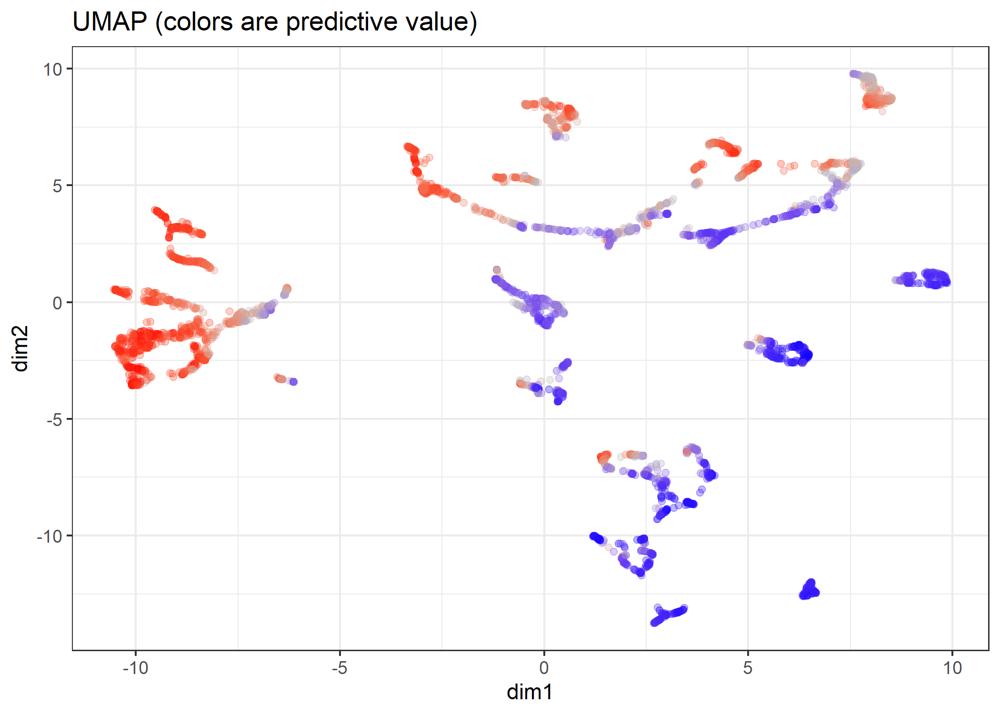

## Hierarchical Density-based spatial clustering of applications with noise (HDBSCAN)

Reference:

https://hdbscan.readthedocs.io/en/latest/how_hdbscan_works.html

according to:

https://cran.r-project.org/web/packages/dbscan/vignettes/hdbscan.html

`minPts` not only acts as a minimum cluster size to detect, but also as a "smoothing" factor of the density estimates implicitly computed from HDBSCAN.


```r
# install.packages("dbscan", dependencies = TRUE)
require(dbscan)
Loading required package: dbscan

# mapping.umap %>% str
cl.hdbscan <- mapping.umap %>% 
  select(dim1, dim2) %>% 
  hdbscan(minPts = 40)
cl.hdbscan %>% print
HDBSCAN clustering for 4000 objects.
Parameters: minPts = 40
The clustering contains 33 cluster(s) and 570 noise points.

  0   1   2   3   4   5   6   7   8   9  10  11  12  13  14  15  16  17 
570 108  96 112  63  84 211 126 219 143  79  88 172  42  59 102  70 187 
 18  19  20  21  22  23  24  25  26  27  28  29  30  31  32  33 
 50  42  46 231 205  71  65 119  48  97  41 126  48 116 102  62 

Available fields: cluster, minPts, cluster_scores,
                  membership_prob, outlier_scores, hc

dbscan:::plot.hdbscan(cl.hdbscan, show_flat = TRUE)
```

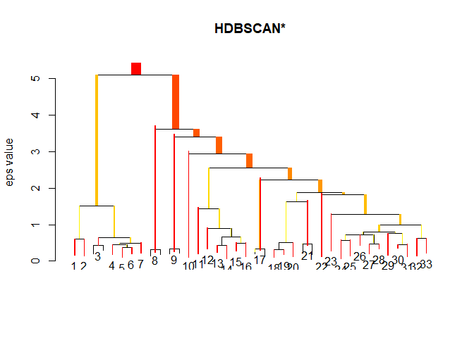<!-- -->


```r
# install.packages("ggrepel", dependencies = TRUE)
require(ggrepel)

mapping.umap$hdbscan <- factor(cl.hdbscan$cluster)

hdbscan.cent <- mapping.umap %>% 
  filter(hdbscan != 0) %>% 
  dplyr::group_by(hdbscan) %>%
  select(dim1, dim2) %>% 
  summarize_all(mean)
Adding missing grouping variables: `hdbscan`

ggp.umap.labeled <- mapping.umap %>% 
  ggplot(aes(x = dim1, y = dim2, colour = hdbscan)) + 
  geom_point(alpha = 0.3) + 
  theme_bw() +
  ggrepel::geom_label_repel(data = hdbscan.cent, 
                            aes(label = hdbscan),
                            label.size = 0.1) + 
  guides(colour = FALSE) + 
  labs(title = "UMAP-cosine + HDBSCAN (estimated cluster)") 

cl.hdbscan %>% print()
HDBSCAN clustering for 4000 objects.
Parameters: minPts = 40
The clustering contains 33 cluster(s) and 570 noise points.

  0   1   2   3   4   5   6   7   8   9  10  11  12  13  14  15  16  17 
570 108  96 112  63  84 211 126 219 143  79  88 172  42  59 102  70 187 
 18  19  20  21  22  23  24  25  26  27  28  29  30  31  32  33 
 50  42  46 231 205  71  65 119  48  97  41 126  48 116 102  62 

Available fields: cluster, minPts, cluster_scores,
                  membership_prob, outlier_scores, hc
ggsave(ggp.umap.labeled, filename =  "./output/image.files/430_map_umap_labeled.png",
    height = 7, width = 7)
```

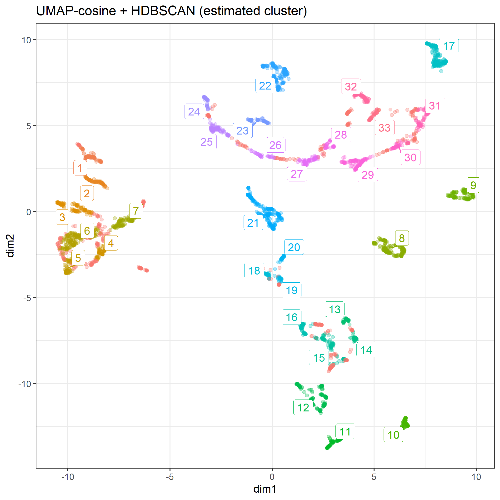


```r
ggp.compare <- gridExtra::arrangeGrob(
  ggp.umap, ggp.umap.labeled,
  ncol = 2)

ggsave(ggp.compare, filename =  "./output/image.files/430_umap.png",
    height = 5, width = 10)
```

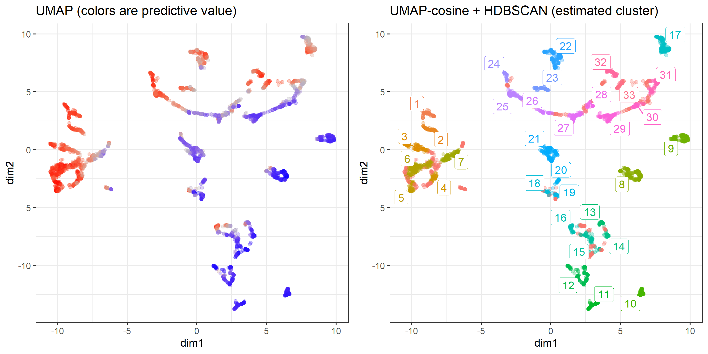


# View rules in a cluster


```r
train.df <- loaded.obs$data$train$dummy.data.frame

ggp.rc <- train.df %>% ggRaincloud("All instance")
ggp.rc
Picking joint bandwidth of 0.171
```

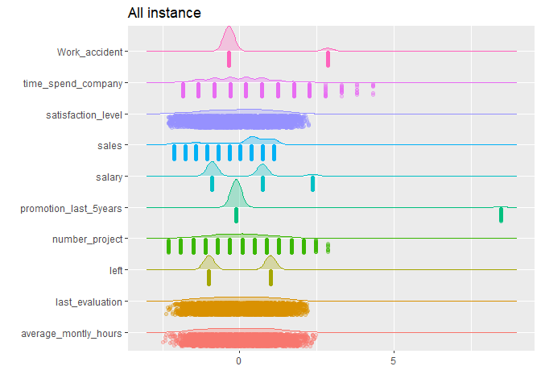<!-- -->

## visualize in a cluster

NOTE: observations with `hdbscan == 0` are as noise by hDBSCAN.


```r
clust.id = 1

target <- mapping.umap %>% 
  filter(hdbscan == clust.id) %>% 
  arrange(desc(pred))

ggp.feature <- train.matrix[target$id, ] %>%
  ggRaincloud("feature value")
# train.matrix[target$id, "Work_accident"]

ggp.contrib <- contrib.xgb[target$id, ] %>%
  data.frame() %>% select(-BIAS) %>% 
  ggRaincloud("feature contribution",scaled = FALSE)

ggp.fcl <- gridExtra::arrangeGrob(grobs = list(ggp.feature, ggp.contrib), ncol = 2)
Picking joint bandwidth of 0.347
Picking joint bandwidth of 0.0325
ggsave(ggp.fcl, width = 9, height = 6,
       filename = "./output/image.files/430_stratified_clustering_cl1.png")

sample.n = 20
IDs <- sample(target$id, sample.n) %>% sort()
sw <- list(NULL)
for(i in 1:sample.n){
  idx = IDs[i]
  
  sw[[i]]  <- waterfallBreakdown(
    breakdown = unlist(contrib.xgb[idx, ]),
    type = "binary",
    labels = paste(colnames(contrib.xgb), 
                   c(train.matrix[idx, ],""), sep =" = ")) +
    ggtitle(sprintf("predict = %.04f\nweight = %.04f",
                    target$predict[i], target$weight[i]))
}

ggp.sw <- gridExtra::arrangeGrob(grobs = sw, ncol = 5)
ggsave(ggp.sw, height = 9,
       filename = "./output/image.files/430_rules_cl1.png")
Saving 7 x 9 in image
```
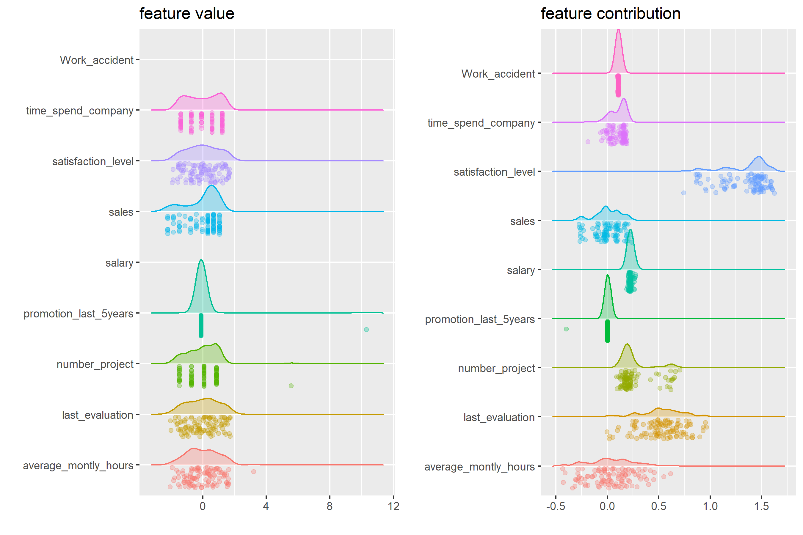

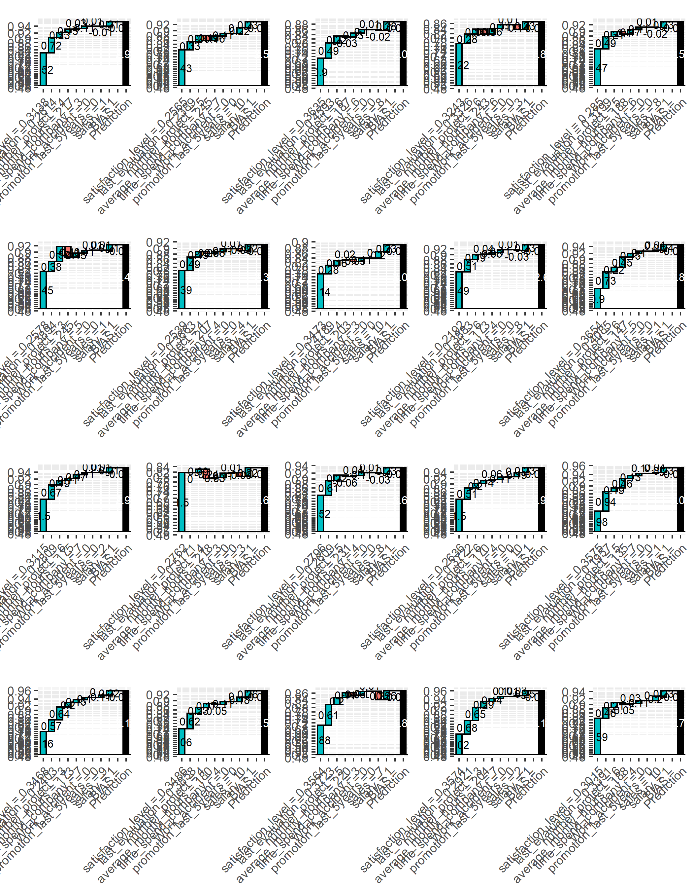


```r
clust.id = 16

target <- mapping.umap %>% 
  filter(hdbscan == clust.id) %>% 
  arrange(desc(pred))

ggp.feature <- train.matrix[target$id, ] %>%
  ggRaincloud("feature value")
# train.matrix[target$id, "Work_accident"]

ggp.contrib <- contrib.xgb[target$id, ] %>%
  data.frame() %>% select(-BIAS) %>% 
  ggRaincloud("feature contribution",scaled = FALSE)

ggp.fcl <- gridExtra::arrangeGrob(grobs = list(ggp.feature, ggp.contrib), ncol = 2)
Picking joint bandwidth of 0.378
Picking joint bandwidth of 0.0856
ggsave(ggp.fcl, width = 9, height = 6,
       filename = "./output/image.files/430_stratified_clustering_cl16.png")

sample.n = 20
IDs <- sample(target$id, sample.n) %>% sort()
sw <- list(NULL)
for(i in 1:sample.n){
  idx = IDs[i]
  
  sw[[i]]  <- waterfallBreakdown(
    breakdown = unlist(contrib.xgb[idx, ]),
    type = "binary",
    labels = paste(colnames(contrib.xgb), 
                   c(train.matrix[idx, ],""), sep =" = ")) +
    ggtitle(sprintf("predict = %.04f\nweight = %.04f",
                    target$predict[i], target$weight[i]))
}

ggp.sw <- gridExtra::arrangeGrob(grobs = sw, ncol = 5)
ggsave(ggp.sw, height = 9,
       filename = "./output/image.files/430_rules_cl16.png")
Saving 7 x 9 in image
```

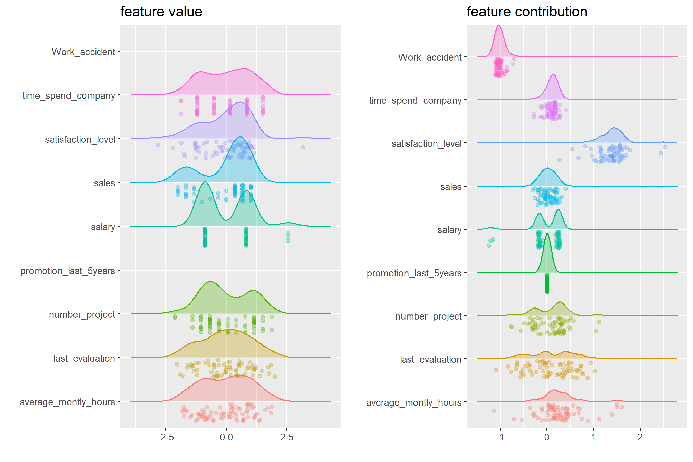
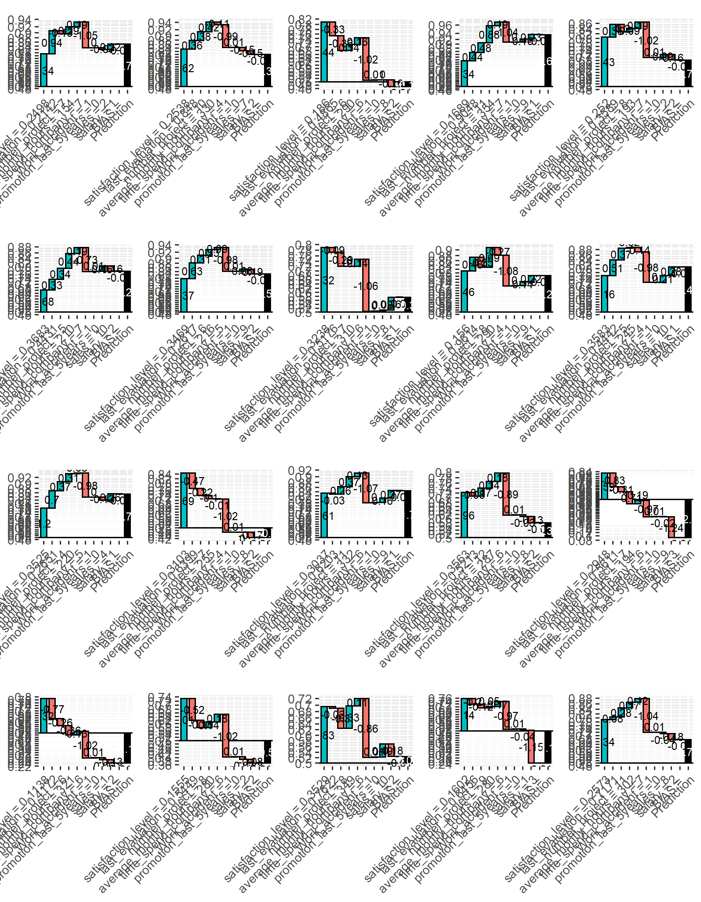


```r
clust.id = 17

target <- mapping.umap %>% 
  filter(hdbscan == clust.id) %>% 
  arrange(desc(pred))

ggp.feature <- train.matrix[target$id, ] %>%
  ggRaincloud("feature value")
# train.matrix[target$id, "Work_accident"]

ggp.contrib <- contrib.xgb[target$id, ] %>%
  data.frame() %>% select(-BIAS) %>% 
  ggRaincloud("feature contribution",scaled = FALSE)

ggp.fcl <- gridExtra::arrangeGrob(grobs = list(ggp.feature, ggp.contrib), ncol = 2)
Picking joint bandwidth of 0.316
Picking joint bandwidth of 0.0405
ggsave(ggp.fcl, width = 9, height = 6,
       filename = "./output/image.files/430_stratified_clustering_cl17.png")

sample.n = 20
IDs <- sample(target$id, sample.n) %>% sort()
sw <- list(NULL)
for(i in 1:sample.n){
  idx = IDs[i]
  
  sw[[i]]  <- waterfallBreakdown(
    breakdown = unlist(contrib.xgb[idx, ]),
    type = "binary",
    labels = paste(colnames(contrib.xgb), 
                   c(train.matrix[idx, ],""), sep =" = ")) +
    ggtitle(sprintf("predict = %.04f\nweight = %.04f",
                    target$predict[i], target$weight[i]))
}

ggp.sw <- gridExtra::arrangeGrob(grobs = sw, ncol = 5)
ggsave(ggp.sw, height = 9,
       filename = "./output/image.files/430_rules_cl17.png")
Saving 7 x 9 in image
```

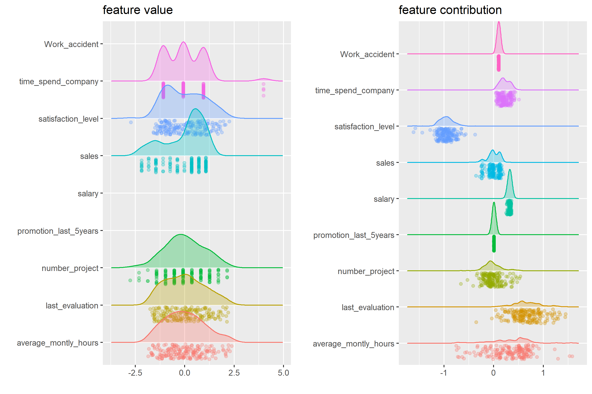
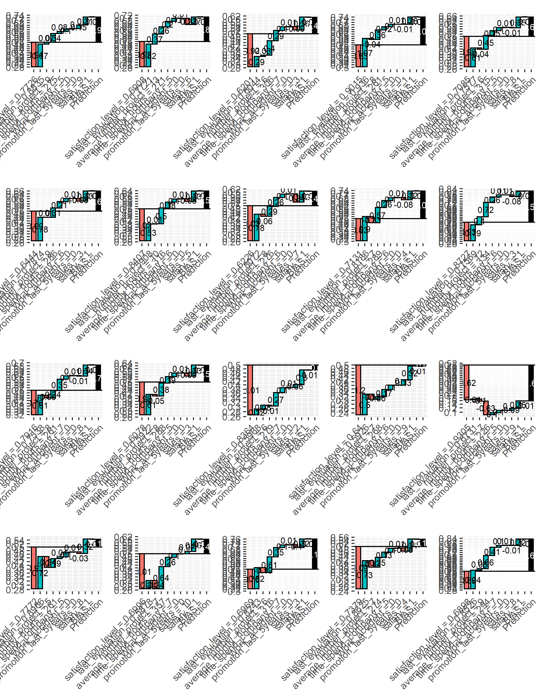
