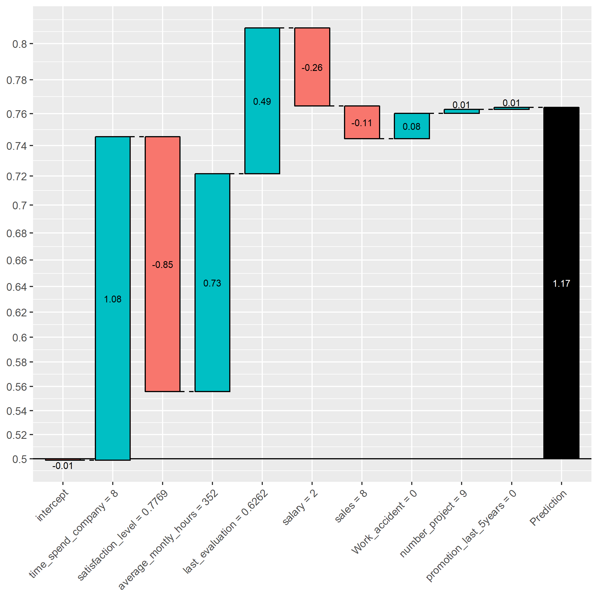

```{r setup, include=FALSE}
knitr::opts_knit$set(progress = TRUE, 
                     verbose  = TRUE, 
                     root.dir = ".")

knitr::opts_chunk$set(collapse = TRUE, 
                      comment = "", 
                      message = TRUE, 
                      warning = FALSE, 
                      include = TRUE,
                      echo    = TRUE)

set.seed(1)
```

```{r install.requirements, eval = FALSE}
install.packages("devtools", dependencies = TRUE)
devtools::install_github("AppliedDataSciencePartners/xgboostExplainer")

```

```{r require.packages, message=FALSE}
require(tidyverse)
require(magrittr)
require(data.table)
require(xgboost)
require(xgboostExplainer)
require(ggridges)


```

# Preparation 

```{r load.model.and.data}
loaded.obs  <- readRDS("./middle/data_and_model.Rds")

model.xgb   <- loaded.obs$model$xgb 

train.label  <- loaded.obs$data$train$label
train.df     <- loaded.obs$data$train$dummy.data.frame
train.matrix <- loaded.obs$data$train$matrix
train.xgb.DMatrix <- xgb.DMatrix(train.matrix, label = train.label, missing = NA)

test.label  <- loaded.obs$data$test$label
test.matrix <- loaded.obs$data$test$matrix
test.xgb.DMatrix  <- xgb.DMatrix(test.matrix, missing = NA)

```

# view rules

## Using xgboostExplainer

see https://medium.com/applied-data-science/new-r-package-the-xgboost-explainer-51dd7d1aa211


```{r, results="hide", eval=FALSE}
explainer.xgb <-  buildExplainer(xgb.model    = model.xgb, 
                                 trainingData = train.xgb.DMatrix, 
                                 type         = "binary",
                                 base_score   = 0.5,
                                 trees_idx    = NULL)
saveRDS(explainer.xgb,file = "./middle/400_explainer_xgb.Rds")
```

```{r}
explainer.xgb <- readRDS("./middle/400_explainer_xgb.Rds")

```

## extract explaination path

```{r, eval = FALSE}
xgb.breakdown <- explainPredictions(xgb.model = model.xgb,
                                    explainer = explainer.xgb,
                                    data      = train.xgb.DMatrix)
saveRDS(xgb.breakdown, file = "./middle/400_xgb_breakdown.Rds")

```

```{r, results="hide", message=FALSE}
xgb.breakdown <- readRDS("./middle/400_xgb_breakdown.Rds")

weight     <- rowSums(xgb.breakdown)
prediction <- 1/(1 + exp(-weight))

```


## explain single observation

```{r, results="hide", message=FALSE, eval = FALSE}
sw <- showWaterfall(
  idx = 1,
  xgb.model   = model.xgb, 
  explainer   = explainer.xgb, 
  DMatrix     = train.xgb.DMatrix, 
  data.matrix = train.matrix)

ggsave(sw, filename = "output/image.files/400_explain_single_obs.png")

```



# plot feature impact

## summary

according to: 
https://liuyanguu.github.io/post/2018/10/14/shap-visualization-for-xgboost/

```{r}
feature.value.long <- train.df %>% 
  scale() %>%
  data.frame() %>% 
  mutate(id = as.character(1:n())) %>% 
  gather(key = feature, value = value, -id)

feature.impact.long <- xgb.breakdown %>% 
  mutate(id = as.character(1:n())) %>% 
  select(-intercept) %>% 
  gather(key = feature, value = impact, -id) %>% 
  left_join(feature.value.long, by = c("id", "feature")) %>% 
  mutate(feature = factor(feature))
  
feature.impact.long %>% head
```
```{r}
# require(ggridge)
feature.impact.long %>% 
  ggplot(aes(x = impact, y = feature, point_color = value, fill = feature))+
  geom_density_ridges(
    scale = 2.0,
    rel_min_height = 0.01,
    alpha = 0.3, 
    jittered_points = TRUE, point_alpha = 0.05, point_size = 2, point_shape = "|",
    position = position_points_jitter(width = 0.05, height = 0)) + 
  scale_color_gradient(low="#FFCC33", high="#6600CC", labels=c("Low","High"))

```

```{r}
feature.impact.long %>% 
  ggplot()+
    coord_flip() + 
    # sina plot: 
    ggforce::geom_sina(aes(x = feature, y = impact, color = value),
              method = "counts", maxwidth = 0.7, alpha = 0.2) +
  scale_color_gradient(low="#FFCC33", high="#6600CC") +
  theme_bw()
```

## View individual feature responce

## example1: satisfaction_level

```{r}
feature.impact <- data.frame(value  = train.df$satisfaction_level, 
                             impact = xgb.breakdown$satisfaction_level)
feature.impact %>% 
  ggplot(aes(x = value, y = impact)) + 
  geom_point(alpha = 0.3) +
  labs(title = "satisfaction_level", x = "satisfaction_level", y = "Feature impact on log-odds") +
  theme_bw()

```


## example 2-1: last_evaluation

```{r}
feature.impact <- data.frame(value  = train.df$last_evaluation, 
                             impact = xgb.breakdown$last_evaluation)
feature.impact %>% 
  ggplot(aes(x = value, y = impact)) + 
  geom_point(alpha = 0.3) +
  labs(title = "last_evaluation", x = "last_evaluation", y = "Feature impact on log-odds") +
  theme_bw()

```


## example 2-2: last_evaluation x satisfaction_level

```{r}
feature.impact <- data.frame(value  = train.df$last_evaluation, 
                             impact = xgb.breakdown$last_evaluation,
                             satisfaction_level = train.df$satisfaction_level)
feature.impact %>% 
  ggplot(aes(x = value, y = impact, color = satisfaction_level)) + 
  geom_point(alpha = 0.7) +
  labs(title = "last_evaluation", x = "last_evaluation", y = "Feature impact on log-odds") +
  theme_bw() + 
  scale_color_gradient2(midpoint = 0.5, low="blue", mid="grey", high="red")


```
