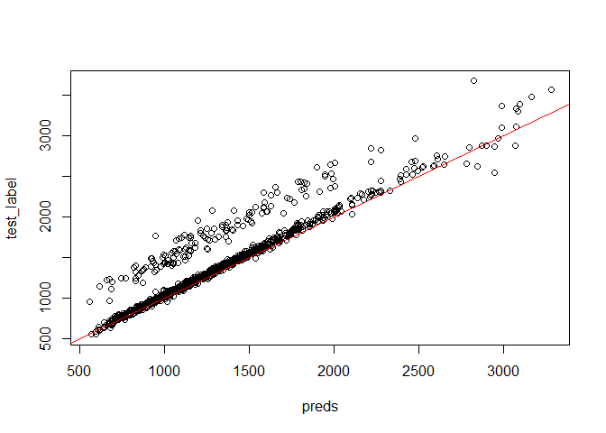
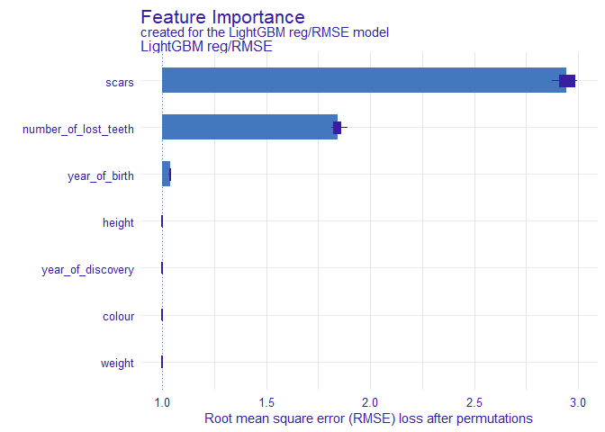
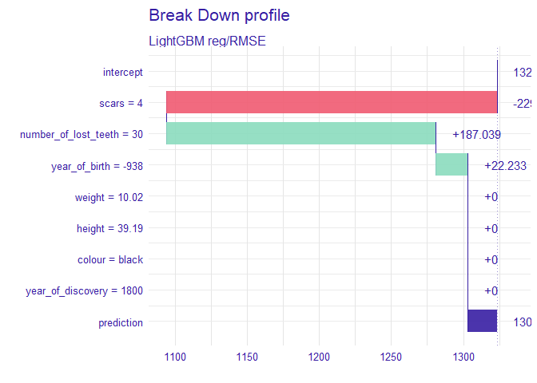
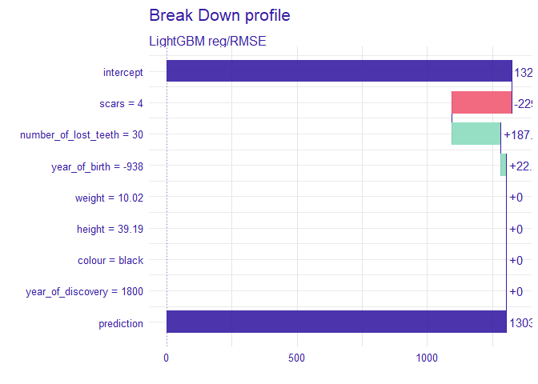
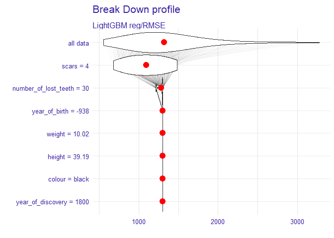
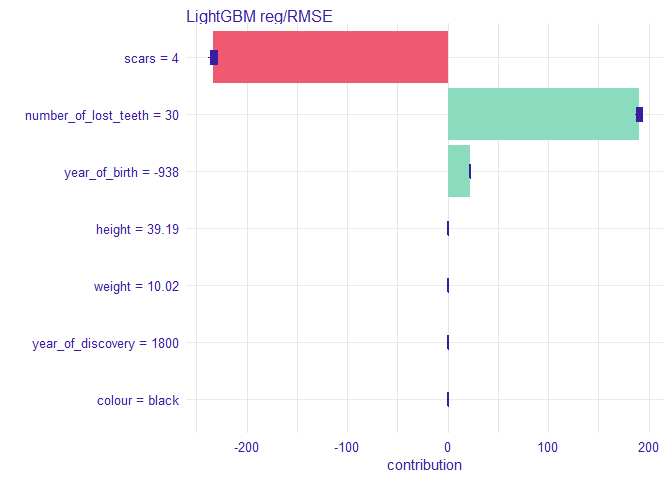

# Purpose 

Install-train-predict-explain **LightGBM** model with DALEX.


# install lightgbm package

## via CRAN:

To install from source using mingw64-compilation:


```r
install.packages("lightgbm", dependencies = TRUE)

```

## install a binary package via github repo

Official document warns: 

> Do not try using MinGW in Windows on many core systems.

Therefore second option is installing the binary package. To install a binary for the R package:

- Linux: lightgbm-{VERSION}-r40-linux.tgz
- Mac: lightgbm-{VERSION}-r40-macos.tgz
- Windows: lightgbm-{VERSION}-r40-windows.zip

for example (for Windows),


```r
PKG_URL <- "https://github.com/microsoft/LightGBM/releases/download/v3.0.0rc1/lightgbm-3.0.0-1-r40-windows.zip"

local_file <- paste0("lightgbm.", tools::file_ext(PKG_URL))

download.file(
  url = PKG_URL
  , destfile = local_file
)
install.packages(
  pkgs = local_file
  , type = "binary"
  , repos = NULL
)
```

## Build from source

To build from source, clone

https://github.com/microsoft/LightGBM.git

and run `build_r.R` according to:

https://github.com/microsoft/LightGBM/tree/master/R-package#preparation


# Sample Run: LightGBM


```r
require(tidyverse)
require(magrittr)
require(lightgbm)

require(DALEX)
require(iBreakDown)
```

## Create LGB Dataset


```r
str(dragons)
#>  'data.frame':	2000 obs. of  8 variables:
#>   $ year_of_birth       : num  -1291 1589 1528 1645 -8 ...
#>   $ height              : num  59.4 46.2 49.2 48.3 50 ...
#>   $ weight              : num  15.3 11.8 13.3 13.3 13.1 ...
#>   $ scars               : num  7 5 6 5 1 2 3 7 6 32 ...
#>   $ colour              : Factor w/ 4 levels "black","blue",..: 4 4 4 3 4 4 1 2 4 4 ...
#>   $ year_of_discovery   : num  1700 1700 1700 1700 1700 1700 1700 1700 1700 1700 ...
#>   $ number_of_lost_teeth: num  25 28 38 33 18 20 28 29 2 22 ...
#>   $ life_length         : num  1368 1377 1604 1434 985 ...

train_data  <- dragons %>% select(-life_length) %>% mutate_all(as.numeric)
train_label <- dragons %>% pull(life_length)
categorical_feature <- dragons %>% colnames() %>% is_in(c("colour")) %>% which()

train.lgb.Dataset <- lgb.Dataset(
  data = as.matrix(train_data), 
  label = train_label, 
  categorical_feature  = categorical_feature)
```


## parameter settings

see.

https://www.kaggle.com/andrewmvd/lightgbm-in-r

and

https://lightgbm.readthedocs.io/en/latest/Parameters.html


```r
lgb_params = list(
  boosting  = "dart",
  objective = "regression",
  metric = "root_mean_squared_error"#,
  # max_depth = 7
)

model_lgb.cv <- NULL
model_lgb.cv <- lgb.cv(
  params = lgb_params, 
  data = train.lgb.Dataset, 
  learning_rate = 0.02, 
  num_leaves = 30,
  num_threads = 1,
  nrounds = 2000, early_stopping_rounds = 50,
  eval_freq = 100, verbose = 1,
  categorical_feature = categorical_feature, 
  nfold = 5, stratified = TRUE)
#>  [LightGBM] [Warning] Auto-choosing row-wise multi-threading, the overhead of testing was 0.000042 seconds.
#>  You can set `force_row_wise=true` to remove the overhead.
#>  And if memory is not enough, you can set `force_col_wise=true`.
#>  [LightGBM] [Info] Total Bins 962
#>  [LightGBM] [Info] Number of data points in the train set: 1600, number of used features: 7
#>  [LightGBM] [Warning] Auto-choosing col-wise multi-threading, the overhead of testing was 0.000142 seconds.
#>  You can set `force_col_wise=true` to remove the overhead.
#>  [LightGBM] [Info] Total Bins 962
#>  [LightGBM] [Info] Number of data points in the train set: 1600, number of used features: 7
#>  [LightGBM] [Warning] Auto-choosing row-wise multi-threading, the overhead of testing was 0.000034 seconds.
#>  You can set `force_row_wise=true` to remove the overhead.
#>  And if memory is not enough, you can set `force_col_wise=true`.
#>  [LightGBM] [Info] Total Bins 962
#>  [LightGBM] [Info] Number of data points in the train set: 1600, number of used features: 7
#>  [LightGBM] [Warning] Auto-choosing row-wise multi-threading, the overhead of testing was 0.000033 seconds.
#>  You can set `force_row_wise=true` to remove the overhead.
#>  And if memory is not enough, you can set `force_col_wise=true`.
#>  [LightGBM] [Info] Total Bins 962
#>  [LightGBM] [Info] Number of data points in the train set: 1600, number of used features: 7
#>  [LightGBM] [Warning] Auto-choosing row-wise multi-threading, the overhead of testing was 0.000034 seconds.
#>  You can set `force_row_wise=true` to remove the overhead.
#>  And if memory is not enough, you can set `force_col_wise=true`.
#>  [LightGBM] [Info] Total Bins 962
#>  [LightGBM] [Info] Number of data points in the train set: 1600, number of used features: 7
#>  [LightGBM] [Info] Start training from score 1362.740054
#>  [LightGBM] [Info] Start training from score 1372.852926
#>  [LightGBM] [Info] Start training from score 1380.311190
#>  [LightGBM] [Info] Start training from score 1371.992169
#>  [LightGBM] [Info] Start training from score 1367.032108
#>  [1]:	valid's rmse:459.967+20.9548 
#>  [101]:	valid's rmse:541.366+16.6023 
#>  [201]:	valid's rmse:436.647+13.0832 
#>  [301]:	valid's rmse:304.758+11.599 
#>  [401]:	valid's rmse:206.022+11.2546 
#>  [501]:	valid's rmse:159.148+11.0448 
#>  [601]:	valid's rmse:164.479+11.3418 
#>  [701]:	valid's rmse:140.192+11.1169 
#>  [801]:	valid's rmse:136.431+11.1028 
#>  [901]:	valid's rmse:114.221+11.3033 
#>  [1001]:	valid's rmse:113.19+11.415 
#>  [1101]:	valid's rmse:110.078+11.0887 
#>  [1201]:	valid's rmse:111.016+11.0598 
#>  [1301]:	valid's rmse:99.6966+11.4824 
#>  [1401]:	valid's rmse:85.1411+11.7078 
#>  [1501]:	valid's rmse:92.8881+11.5982 
#>  [1601]:	valid's rmse:75.2445+12.1816 
#>  [1701]:	valid's rmse:74.1529+11.936 
#>  [1801]:	valid's rmse:77.6523+11.6692 
#>  [1901]:	valid's rmse:72.3924+12.1362 
#>  [2000]:	valid's rmse:72.8649+12.0218

best.iter <- model_lgb.cv$best_iter
best.iter
#>  [1] 1898
```


```r
model_lgb = lgb.train(
  params = lgb_params, 
  data = train.lgb.Dataset, 
  learning_rate = 0.02, 
  num_leaves = 20,
  num_threads = 1,
  nrounds = best.iter,
  eval_freq = 20, verbose = 1,
  categorical_feature = categorical_feature)
#>  [LightGBM] [Warning] Auto-choosing row-wise multi-threading, the overhead of testing was 0.000043 seconds.
#>  You can set `force_row_wise=true` to remove the overhead.
#>  And if memory is not enough, you can set `force_col_wise=true`.
#>  [LightGBM] [Info] Total Bins 962
#>  [LightGBM] [Info] Number of data points in the train set: 2000, number of used features: 7
#>  [LightGBM] [Info] Start training from score 1370.985689
```

## goodness of fit


```r
test_data  <- dragons_test %>% select(-life_length) %>% mutate_all(as.numeric)
test_label <- dragons_test %>% pull(life_length)

preds  <- predict(model_lgb, data = as.matrix(test_data))
plot(test_label ~ preds)
abline(0, 1, col = "red")
```

<!-- -->

## LightGBM-specific feature importance


```r
varimp_lgb <- lightgbm::lgb.importance(model_lgb)
varimp_lgb %>% 
  arrange(desc(Gain)) %>%
  mutate_at(vars(-Feature), function(x) round(x, digit = 3))
#>                  Feature  Gain Cover Frequency
#>  1:                scars 0.741 0.545     0.460
#>  2: number_of_lost_teeth 0.254 0.407     0.419
#>  3:        year_of_birth 0.005 0.046     0.113
#>  4:               weight 0.000 0.001     0.003
#>  5:    year_of_discovery 0.000 0.000     0.003
#>  6:               height 0.000 0.000     0.002
```


# Model agnostic explanation using DALEX

according to:

https://cran.r-project.org/web/packages/iBreakDown/vignettes/vignette_iBreakDown_classification.html

and:

https://cran.r-project.org/web/packages/iBreakDown/vignettes/vignette_iBreakDown_titanic.html


`predict_function` are needed to prepare `DALEX::explain()` for LightGBM model and prediction.


```r
p_fun_lgb <- function(object, newdata) {

  # test.matrix <- as.matrix(newdata)
  newdata <- dplyr::mutate_all(newdata, as.numeric)
  pred <- predict(object, as.matrix(newdata))
  pred
  
}
```


```r
test_data  <- dragons_test %>% select(-life_length)
test_label <- dragons_test %>% pull(life_length)
```


```r
explain_lgb <- DALEX::explain(
  model = model_lgb, 
  data = test_data,
  y = test_label,
  label = "LightGBM reg/RMSE",
  predict_function = p_fun_lgb,
  colorize = FALSE
)
#>  Preparation of a new explainer is initiated
#>    -> model label       :  LightGBM reg/RMSE 
#>    -> data              :  1000  rows  7  cols 
#>    -> target variable   :  1000  values 
#>    -> predict function  :  p_fun_lgb 
#>    -> predicted values  :  numerical, min =  555.1012 , mean =  1323.308 , max =  3278.516  
#>    -> model_info        :  package Model of class: lgb.Booster package unrecognized , ver. Unknown , task regression (  default  ) 
#>    -> residual function :  difference between y and yhat (  default  )
#>    -> residuals         :  numerical, min =  -390.1687 , mean =  112.8283 , max =  853.224  
#>    A new explainer has been created!
```


HEREAFTER, just Copy & Paste from official vignette:

## permutaion importance


```r
vi_lgb <- variable_importance(explain_lgb, loss_function = loss_root_mean_square, type = "ratio")
plot(vi_lgb)
```

<!-- -->

## local_attributions for individual prediction


```r
bd_lgb <- local_attributions(
  explain_lgb,
  new_observation =  test_data[1, ],
  keep_distributions = TRUE)
```


simply print the result.


```r
bd_lgb
#>                                               contribution
#>  LightGBM reg/RMSE: intercept                     1323.308
#>  LightGBM reg/RMSE: scars = 4                     -229.340
#>  LightGBM reg/RMSE: number_of_lost_teeth = 30      187.039
#>  LightGBM reg/RMSE: year_of_birth = -938            22.233
#>  LightGBM reg/RMSE: weight = 10.02                   0.000
#>  LightGBM reg/RMSE: height = 39.19                   0.000
#>  LightGBM reg/RMSE: colour = black                   0.000
#>  LightGBM reg/RMSE: year_of_discovery = 1800         0.000
#>  LightGBM reg/RMSE: prediction                    1303.240
```

Or plot it.


```r
plot(bd_lgb)
```

<!-- -->

Use the `baseline` argument to set the origin of plots.


```r
plot(bd_lgb, baseline = 0)
```

<!-- -->

## Conditional distribution for partial predictions

Use the `plot_distributions` argument to see distributions of partial predictions.


```r
plot(bd_lgb, plot_distributions = TRUE)
```

<!-- -->

## Calculate uncertainty for variable attributions


```r
bdun_lgb <- break_down_uncertainty(
  explain_lgb,
  new_observation =  test_data[1, ],
  path = "average"
)
```


```r
plot(bdun_lgb)
```

<!-- -->


