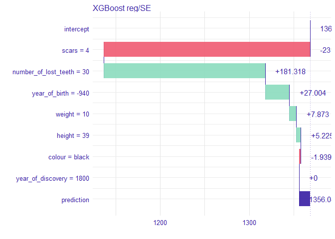
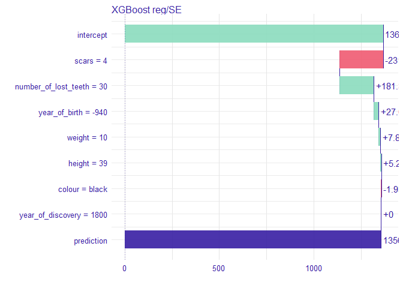
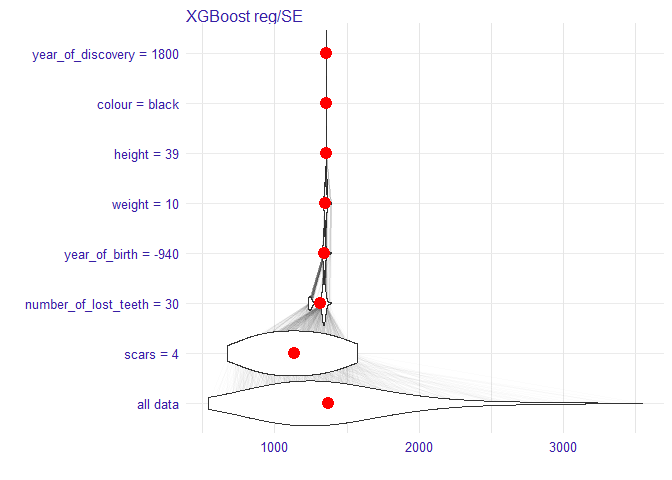
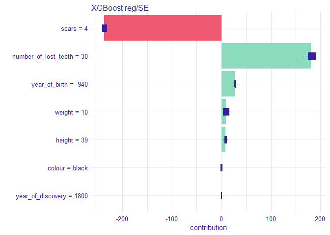

```r
install.packages("DALEX", dependencies = TRUE)
install.packages("r2d3",  dependencies = TRUE)

```


```r
require(tidyverse)
require(magrittr)
require(xgboost)

require(DALEX)
require(iBreakDown)
```

# Purpose 

Prediction Breakdown according to https://cran.r-project.org/web/packages/iBreakDown/vignettes/vignette_iBreakDown_regression.html


```r
library(DALEX)
library(iBreakDown)
```

# Build XGB model


```r
head(dragons)
  year_of_birth   height   weight scars colour year_of_discovery
1         -1291 59.40365 15.32391     7    red              1700
2          1589 46.21374 11.80819     5    red              1700
3          1528 49.17233 13.34482     6    red              1700
4          1645 48.29177 13.27427     5  green              1700
5            -8 49.99679 13.08757     1    red              1700
6           915 45.40876 11.48717     2    red              1700
  number_of_lost_teeth life_length
1                   25   1368.4331
2                   28   1377.0474
3                   38   1603.9632
4                   33   1434.4222
5                   18    985.4905
6                   20    969.5682

train_data  <- dragons %>% select(-life_length) %>% mutate_all(as.numeric)
train_label <- dragons %>% pull(life_length)
train_xgbDMatrix <- xgb.DMatrix(as.matrix(train_data), label = train_label)
```


For parameter settings, see. https://xgboost.readthedocs.io/en/latest/parameter.html 


```r
params <- list(
  booster      = "gbtree",
  objective    = "reg:squarederror",
  eval_metric  = "rmse",
  max_depth = 5,
  colsample_bytree= 0.8,
  subsample = 0.8,
  min_child_weight = 3,
  eta   = 0.05,
  alpha = 0.25,
  gamma = 0
) 
```


```r
model_xgb <- xgb.train(params  = params, 
                       verbose = 1,
                       data    = train_xgbDMatrix,
                       nrounds = 300)
```

# breakdown obsavation

according to:

https://cran.r-project.org/web/packages/iBreakDown/vignettes/vignette_iBreakDown_classification.html

and:

https://cran.r-project.org/web/packages/iBreakDown/vignettes/vignette_iBreakDown_titanic.html


Following example fail to build explainer.


```r
require(DALEX)
explain_xgb <- DALEX::explain(
  model = model_xgb, 
  data = dragons_test,
  y = dragons_test$life_length,
  label = "XGBoost reg:squarederror"
)
Preparation of a new explainer is initiated
  -> model label       :  XGBoost reg:squarederror 
  -> data              :  1000  rows  8  cols 
  -> target variable   :  1000  values 
  -> predict function  : yhat.default will be used (  default  )
  -> predicted values  :  the predict_function returns an error when executed (  WARNING  ) 
  -> residual function :  difference between y and yhat (  default  )
  -> residuals         :  the residual_function returns an error when executed (  WARNING  ) 
  -> model_info        :  package Model of class: xgb.Booster package unrecognized , ver. Unknown , task regression (  default  ) 
  A new explainer has been created!  
```

Thus, several tricks are needed to break down a prediction by XGB model


```r
p_fun_xgb <- function(object, newdata) {

  # test.matrix <- as.matrix(newdata)
  newdata <- dplyr::mutate_all(newdata, as.numeric)
  newdata <- xgb.DMatrix(as.matrix(newdata))
  pred <- predict(object, newdata)
  pred
  
}
```


```r
test_data  <- dragons_test %>% select(-life_length)
test_label <- dragons_test %>% pull(life_length)
```


```r
explain_xgb <- DALEX::explain(
  model = model_xgb, 
  data = test_data,
  y = test_label,
  label = "XGBoost reg/SE",
  predict_function = p_fun_xgb
)
Preparation of a new explainer is initiated
  -> model label       :  XGBoost reg/SE 
  -> data              :  1000  rows  7  cols 
  -> target variable   :  1000  values 
  -> predict function  :  p_fun_xgb 
  -> predicted values  :  numerical, min =  538.5117 , mean =  1368.255 , max =  3549.157  
  -> residual function :  difference between y and yhat (  default  )
  -> residuals         :  numerical, min =  -159.1516 , mean =  67.88134 , max =  796.67  
  -> model_info        :  package Model of class: xgb.Booster package unrecognized , ver. Unknown , task regression (  default  ) 
  A new explainer has been created!  
```


# Visualization

HEREAFTER, just Copy & Paste from official vignette:

## local_attributions


```r
bd_xgb <- local_attributions(
  explain_xgb,
  new_observation =  test_data[1, ],
  keep_distributions = TRUE)
```


simply print the result.


```r
bd_xgb
                                          contribution
XGBoost reg/SE: intercept                     1368.255
XGBoost reg/SE: scars = 4                     -231.692
XGBoost reg/SE: number_of_lost_teeth = 30      181.318
XGBoost reg/SE: year_of_birth = -940            27.004
XGBoost reg/SE: weight = 10                      7.873
XGBoost reg/SE: height = 39                      5.225
XGBoost reg/SE: colour = black                  -1.939
XGBoost reg/SE: year_of_discovery = 1800         0.000
XGBoost reg/SE: prediction                    1356.043
```

Or plot it.


```r
plot(bd_xgb)
```

<!-- -->

Use the `baseline` argument to set the origin of plots.


```r
plot(bd_xgb, baseline = 0)
```

<!-- -->


Use the `plot_distributions` argument to see distributions of partial predictions.


```r
plot(bd_xgb, plot_distributions = TRUE)
```

<!-- -->

# Calculate uncertainty for variable attributions


```r
bdun_xgb <- break_down_uncertainty(
  explain_xgb,
  new_observation =  test_data[1, ],
  path = "average"
)
```


```r
plot(bdun_xgb)
```

<!-- -->

## Show only top features


```r
# install.packages("r2d3")
require(r2d3)
Loading required package: r2d3
r2d3 should be run under RStudio v1.2 or higher. Please update at:
https://www.rstudio.com/rstudio/download/preview/
plotD3(bd_xgb, max_features = 3)
```

<!--html_preserve--><div id="htmlwidget-09422920dda62716eb99" style="width:384px;height:384px;" class="r2d3 html-widget"></div>
<script type="application/json" data-for="htmlwidget-09422920dda62716eb99">{"x":{"data":[{"XGBoost reg/SE":[{"variable":"intercept","contribution":0,"variable_name":"intercept","variable_value":"1","cummulative":1368.255,"sign":"X","position":9,"label":"XGBoost reg/SE","barStart":1368.2549,"barSupport":1368.2549,"tooltipText":"Average response: 1368.255<br>Prediction: 1356.043"},{"variable":"scars = 4","contribution":-231.692,"variable_name":"scars","variable_value":"4","cummulative":1136.562,"sign":"-1","position":8,"label":"XGBoost reg/SE","barStart":1136.5624,"barSupport":1368.2549,"tooltipText":"scars = 4<br>decreases average response <br>by 231.692"},{"variable":"number_of_lost_teeth = 30","contribution":181.318,"variable_name":"number_of_lost_teeth","variable_value":"30","cummulative":1317.88,"sign":"1","position":7,"label":"XGBoost reg/SE","barStart":1136.5624,"barSupport":1317.8804,"tooltipText":"number_of_lost_teeth = 30<br>increases average response <br>by 181.318"},{"variable":"year_of_birth = -940","contribution":27.004,"variable_name":"year_of_birth","variable_value":"-940","cummulative":1344.884,"sign":"1","position":6,"label":"XGBoost reg/SE","barStart":1317.8804,"barSupport":1344.8842,"tooltipText":"year_of_birth = -940<br>increases average response <br>by 27.004"},{"variable":"+ all other factors","contribution":11.159,"variable_name":"weight","variable_value":"10","cummulative":1356.043,"sign":"1","position":5,"label":"XGBoost reg/SE","barStart":1344.8842,"barSupport":1356.0435,"tooltipText":"+ all other factors<br>increases average response <br>by 11.159"},{"variable":"prediction","contribution":-12.211,"variable_name":"prediction","variable_value":"","cummulative":1356.043,"sign":"X","position":1,"label":"XGBoost reg/SE","barStart":1356.0435,"barSupport":1368.2549,"tooltipText":"Average response: 1368.255<br>Prediction: 1356.043"}]},["intercept","scars = 4","number_of_lost_teeth = 30","year_of_birth = -940","+ all other factors","prediction"]],"type":"json","container":"svg","options":{"xmin":1090.2234,"xmax":1414.5936,"n":1,"m":6,"barWidth":12,"scaleHeight":false,"time":0,"vcolors":"default","chartTitle":"Local attributions"},"script":"var d3Script = function(d3, r2d3, data, svg, width, height, options, theme, console) {\nthis.d3 = d3;\n/* R2D3 Source File:  C:/Users/SatoshiKato/Documents/R/win-library/3.6/iBreakDown/d3js/colorsDrWhy.js */\nfunction getColors(n, type){\n    var temp = [\"#8bdcbe\", \"#f05a71\", \"#371ea3\", \"#46bac2\", \"#ae2c87\", \"#ffa58c\", \"#4378bf\"];\n    var ret = [];\n\n    if (type == \"bar\") {\n      switch(n){\n        case 1:\n          return [\"#46bac2\"];\n        case 2:\n          return [\"#46bac2\", \"#4378bf\"];\n        case 3:\n          return [\"#8bdcbe\", \"#4378bf\", \"#46bac2\"];\n        case 4:\n          return [\"#46bac2\", \"#371ea3\", \"#8bdcbe\", \"#4378bf\"];\n        case 5:\n          return [\"#8bdcbe\", \"#f05a71\", \"#371ea3\", \"#46bac2\", \"#ffa58c\"];\n        case 6:\n          return [\"#8bdcbe\", \"#f05a71\", \"#371ea3\", \"#46bac2\", \"#ae2c87\", \"#ffa58c\"];\n        case 7:\n          return temp;\n        default:\n          for (var i = 0; i <= n%7; i++) {\n            ret = ret.concat(temp);\n          }\n          return ret;\n      }\n    } else if (type == \"line\") {\n      switch(n){\n        case 1:\n          return [\"#46bac2\"];\n        case 2:\n          return [\"#8bdcbe\", \"#4378bf\"];\n        case 3:\n          return [\"#8bdcbe\", \"#f05a71\", \"#4378bf\"];\n        case 4:\n          return [\"#8bdcbe\", \"#f05a71\", \"#4378bf\", \"#ffa58c\"];\n        case 5:\n          return [\"#8bdcbe\", \"#f05a71\", \"#4378bf\", \"#ae2c87\", \"#ffa58c\"];\n        case 6:\n          return [\"#8bdcbe\", \"#f05a71\", \"#46bac2\", \"#ae2c87\", \"#ffa58c\", \"#4378bf\"];\n        case 7:\n          return temp;\n        default:\n          for (var j = 0; j <= n%7; j++) {\n            ret = ret.concat(temp);\n          }\n          return ret;\n      }\n    } else if (type == \"point\") {\n      switch(n){\n        default:\n          return [\"#371ea3\", \"#46bac2\", \"#ceced9\"];\n      }\n    } else if (type == \"breakDown\") {\n      switch(n){\n        default:\n          return [\"#8bdcbe\", \"#f05a71\", \"#371ea3\"];\n      }\n    }\n}\n\nfunction calculateTextWidth(text) {\n  // calculate max width of 11px text array\n\n  var temp = svg.selectAll()\n                .data(text)\n                .enter();\n\n  var textWidth = [];\n\n  temp.append(\"text\")\n      .attr(\"class\", \"toRemove\")\n      .text(function(d) { return d;})\n      .style(\"font-size\", \"11px\")\n      .style('font-family', 'Fira Sans, sans-serif')\n      .each(function(d,i) {\n          var thisWidth = this.getComputedTextLength();\n          textWidth.push(thisWidth);\n      });\n\n  svg.selectAll('.toRemove').remove();\n  temp.remove();\n\n  var maxLength = d3.max(textWidth);\n\n  return maxLength;\n}\n\n/* R2D3 Source File:  C:/Users/SatoshiKato/Documents/R/win-library/3.6/iBreakDown/d3js/d3-tip.js */\n/* d3.tip Copyright (c) 2013 Justin Palmer Tooltips for d3.js SVG visualizations */\n/// MADE SOME CHANGES\n\nd3.functor = function functor(v) {\n  return typeof v === \"function\" ? v : function() {\n    return v;\n  };\n};\n\nd3.tip = function() {\n\n  var direction = d3_tip_direction,\n      offset    = d3_tip_offset,\n      html      = d3_tip_html,\n      node      = initNode(),\n      svg       = null,\n      point     = null,\n      target    = null;\n\n  function tip(vis) {\n    svg = getSVGNode(vis)\n    point = svg.createSVGPoint()\n    document.body.appendChild(node)\n  }\n\n  // Public - show the tooltip on the screen\n  //\n  // Returns a tip\n  tip.show = function() {\n    var args = Array.prototype.slice.call(arguments)\n    if(args[args.length - 1] instanceof SVGElement) target = args.pop()\n\n    var content = html.apply(this, args),\n        poffset = offset.apply(this, args),\n        dir     = direction.apply(this, args),\n        nodel   = getNodeEl(),\n        i       = directions.length,\n        coords,\n        scrollTop  = document.documentElement.scrollTop || document.body.scrollTop,\n        scrollLeft = document.documentElement.scrollLeft || document.body.scrollLeft\n\n    /// unclass all directions\n    while(i--) nodel.classed(directions[i], false)\n\n    ////////////////////////////////:::::::::////////////////////////////////\n    // make sure that tip is pointing right direction (not outside of svg) \\\\\n    // 'n' means that tooltip will go north from pointer\n\n    // do not move this code V\n    nodel.html(content)\n          .style('position', 'absolute')\n          .style('opacity', .8)\n          .style('pointer-events', 'all')\n    // do not move this code ^\n\n    var tdir = dir;\n\n    var divDim = node.getBoundingClientRect(),\n        svgDim = svg.getBBox();\n\n    // 20 is for 2x r2d3 margin and 7 was added empiricaly\n    var sh = 20 + svgDim.height;// + 7; // this is modelSTudio plotHeight\n    var sw = 20 + svgDim.width;\n    var dh = divDim.height;\n    var dw = divDim.width;\n    var py = d3.event.pageY;\n    var px = d3.event.pageX;\n\n    // by default put tooltip 'n'\n    var ttop = py - dh - 5;\n    var tleft = px - dw/2;\n    var tdir = \"n\";\n    var tpdd = '6px 6px 13px 6px';\n\n    if (px - dw/2 < 10) {\n      tleft = px + 5;\n      tdir = \"ne\";\n      tpdd = '6px 6px 11px 11px';\n      if (py - dh/2 < 10) {\n        ttop = py - dh/2;\n        tdir = \"e\";\n        tpdd = '6px 6px 6px 13px';\n      } else if (py - dh < 10) {\n        ttop = py + 5;\n        tdir = \"se\";\n        tpdd = '11px 6px 6px 11px';\n      }\n    } else if (px + dw/2 > sw - 10) {\n      tleft = px - dw - 5;\n      ttop = py - dh - 5;\n      tdir = \"nw\";\n      tpdd = '6px 11px 11px 6px';\n      if (py - dh/2 < 10) {\n        ttop = py - dh/2;\n        tdir = \"w\"\n        tpdd = '6px 13px 6px 6px';\n      } else if (py - dh < 10) {\n        ttop = py + 5;\n        tdir = \"sw\";\n        tpdd = '11px 11px 6px 6px';\n      }\n      // because description is to long FIXME/TODO: more cases\n      if (tleft < 5) {\n        ttop = py + 5;\n        tleft = px - dw/2;\n        tdir = \"s\";\n        tpdd = '13px 6px 6px 6px';\n      }\n    } else if (py - dh < 10) {\n      ttop = py + 5;\n      tleft = px - dw/2;\n      tdir = \"s\";\n      tpdd = '13px 6px 6px 6px';\n    }\n\n    nodel.classed(tdir, true)\n          .style('top', (ttop + poffset[0] + scrollTop) + 'px')\n          .style('left', (tleft + poffset[1] + scrollLeft) + 'px')\n          .style('padding', tpdd);\n\n    ////////////////////////////////::::::::://///////////////////////////////\n\n    //safeguard\n    if (dw == 0) {\n      return tip.hide()\n    } else {\n      return tip\n    }\n  }\n\n  // Public - hide the tooltip\n  //\n  // Returns a tip\n  tip.hide = function() {\n    var nodel = getNodeEl()\n    nodel\n      .style('opacity', 0)\n      .style('pointer-events', 'none')\n    return tip\n  }\n\n  // Public: Proxy attr calls to the d3 tip container.  Sets or gets attribute value.\n  //\n  // n - name of the attribute\n  // v - value of the attribute\n  //\n  // Returns tip or attribute value\n  tip.attr = function(n, v) {\n    if (arguments.length < 2 && typeof n === 'string') {\n      return getNodeEl().attr(n)\n    } else {\n      var args =  Array.prototype.slice.call(arguments)\n      d3.selection.prototype.attr.apply(getNodeEl(), args)\n    }\n\n    return tip\n  }\n\n  // Public: Proxy style calls to the d3 tip container.  Sets or gets a style value.\n  //\n  // n - name of the property\n  // v - value of the property\n  //\n  // Returns tip or style property value\n  tip.style = function(n, v) {\n    // debugger;\n    if (arguments.length < 2 && typeof n === 'string') {\n      return getNodeEl().style(n)\n    } else {\n      var args = Array.prototype.slice.call(arguments);\n      if (args.length === 1) {\n        var styles = args[0];\n        Object.keys(styles).forEach(function(key) {\n          return d3.selection.prototype.style.apply(getNodeEl(), [key, styles[key]]);\n        });\n      }\n    }\n\n    return tip\n  }\n\n  // Public: Set or get the direction of the tooltip\n  //\n  // v - One of n(north), s(south), e(east), or w(west), nw(northwest),\n  //     sw(southwest), ne(northeast) or se(southeast)\n  //\n  // Returns tip or direction\n  tip.direction = function(v) {\n    if (!arguments.length) return direction\n    direction = v == null ? v : d3.functor(v)\n\n    return tip\n  }\n\n  // Public: Sets or gets the offset of the tip\n  //\n  // v - Array of [x, y] offset\n  //\n  // Returns offset or\n  tip.offset = function(v) {\n    if (!arguments.length) return offset\n    offset = v == null ? v : d3.functor(v)\n\n    return tip\n  }\n\n  // Public: sets or gets the html value of the tooltip\n  //\n  // v - String value of the tip\n  //\n  // Returns html value or tip\n  tip.html = function(v) {\n    if (!arguments.length) return html\n    html = v == null ? v : d3.functor(v)\n\n    return tip\n  }\n\n  // Public: destroys the tooltip and removes it from the DOM\n  //\n  // Returns a tip\n  tip.destroy = function() {\n    if(node) {\n      getNodeEl().remove();\n      node = null;\n    }\n    return tip;\n  }\n\n  function d3_tip_direction() { return 'n' }\n  function d3_tip_offset() { return [0, 0] }\n  function d3_tip_html() { return ' ' }\n\n  var direction_callbacks = {\n    n:  direction_n,\n    s:  direction_s,\n    e:  direction_e,\n    w:  direction_w,\n    nw: direction_nw,\n    ne: direction_ne,\n    sw: direction_sw,\n    se: direction_se\n  };\n\n  var directions = Object.keys(direction_callbacks);\n\n  function direction_n() {\n    var bbox = getScreenBBox()\n    return {\n      top:  bbox.n.y - node.offsetHeight,\n      left: bbox.n.x - node.offsetWidth / 2\n    }\n  }\n\n  function direction_s() {\n    var bbox = getScreenBBox()\n    return {\n      top:  bbox.s.y,\n      left: bbox.s.x - node.offsetWidth / 2\n    }\n  }\n\n  function direction_e() {\n    var bbox = getScreenBBox()\n    return {\n      top:  bbox.e.y - node.offsetHeight / 2,\n      left: bbox.e.x\n    }\n  }\n\n  function direction_w() {\n    var bbox = getScreenBBox()\n    return {\n      top:  bbox.w.y - node.offsetHeight / 2,\n      left: bbox.w.x - node.offsetWidth\n    }\n  }\n\n  function direction_nw() {\n    var bbox = getScreenBBox()\n    return {\n      top:  bbox.nw.y - node.offsetHeight,\n      left: bbox.nw.x - node.offsetWidth\n    }\n  }\n\n  function direction_ne() {\n    var bbox = getScreenBBox()\n    return {\n      top:  bbox.ne.y - node.offsetHeight,\n      left: bbox.ne.x\n    }\n  }\n\n  function direction_sw() {\n    var bbox = getScreenBBox()\n    return {\n      top:  bbox.sw.y,\n      left: bbox.sw.x - node.offsetWidth\n    }\n  }\n\n  function direction_se() {\n    var bbox = getScreenBBox()\n    return {\n      top:  bbox.se.y,\n      left: bbox.e.x\n    }\n  }\n\n  function initNode() {\n    var node = d3.select(document.createElement('div'))\n    node\n      .style('position', 'absolute')\n      .style('top', 0)\n      .style('opacity', 0)\n      .style('pointer-events', 'none')\n      .style('box-sizing', 'border-box')\n      .style('line-heigh', 1.1)\n      .style('background', \"#000000\")\n      .style('color', '#fff')\n      .style('font-size', '14px')\n      .style('font-family', \"'Roboto Condensed', sans-serif\");\n\n    return node.node()\n  }\n\n\n  function getSVGNode(el) {\n    el = el.node()\n    if(el.tagName.toLowerCase() === 'svg')\n      return el\n\n    return el.ownerSVGElement\n  }\n\n  function getNodeEl() {\n    if(node === null) {\n      node = initNode();\n      // re-add node to DOM\n      document.body.appendChild(node);\n    };\n    return d3.select(node);\n  }\n\n  // Returns an Object {n, s, e, w, nw, sw, ne, se}\n  function getScreenBBox() {\n    var targetel   = target || d3.event.target;\n\n    while ('undefined' === typeof targetel.getScreenCTM && 'undefined' === targetel.parentNode) {\n        targetel = targetel.parentNode;\n    }\n\n    var bbox       = {},\n        matrix     = targetel.getScreenCTM(),\n        tbbox      = targetel.getBBox(),\n        width      = tbbox.width,\n        height     = tbbox.height,\n        x          = tbbox.x,\n        y          = tbbox.y\n\n    point.x = x\n    point.y = y\n    bbox.nw = point.matrixTransform(matrix)\n    point.x += width\n    bbox.ne = point.matrixTransform(matrix)\n    point.y += height\n    bbox.se = point.matrixTransform(matrix)\n    point.x -= width\n    bbox.sw = point.matrixTransform(matrix)\n    point.y -= height / 2\n    bbox.w  = point.matrixTransform(matrix)\n    point.x += width\n    bbox.e = point.matrixTransform(matrix)\n    point.x -= width / 2\n    point.y -= height / 2\n    bbox.n = point.matrixTransform(matrix)\n    point.y += height\n    bbox.s = point.matrixTransform(matrix)\n\n    return bbox\n  }\n\n  return tip\n};\n\n/* R2D3 Source File:  C:/Users/SatoshiKato/Documents/R/win-library/3.6/iBreakDown/d3js/hackHead.js */\n// SPECIAL CAUTION NEEDED WHEN EDITING THIS FILE; MAY CAUSE FATAL ERROR\n\nfunction addCssToDocument(css){\n  // this function adds custom css to document head\n  var style = document.createElement('style')\n  style.innerText = css\n  document.head.appendChild(style)\n}\n\n// load tip:after related css (for triangle)\naddCssToDocument(\"d3-tip:after{box-sizing:border-box;display:inline;font-size:10px;width:inherit;\"+\n\"height:inherit;line-height:1;color:rgba(0,0,0,0.8);content:'\\\\25BC';position:absolute;text-align: center;}\"+\n\".d3-tip.n:after{content:'\\\\25BC';position:absolute;margin:0 0 0 0;top:100%;left:50%;text-align:center;transform:translate(-7px,-15px)}\"+\n\".d3-tip.e:after{content:'\\\\25C0';position:absolute;margin:0 0 0 0;top:50%;left:0%;text-align:center;transform:translate(0px,-7px)}\"+\n\".d3-tip.s:after{content:'\\\\25B2';position:absolute;margin:0 0 0 0;top:0%;left:50%;text-align:center;transform:translate(-7px,0px)}\"+\n\".d3-tip.w:after{content:'\\\\25B6';position:absolute;margin:0 0 0 0;top:50%;left:100%;text-align:center;transform:translate(-15px,-7px)}\"+\n\".d3-tip.se:after{content:'\\\\25E4';position:absolute;margin:0 0 0 0;top:0%;left:0%;text-align:center;transform:translate(1px,1px)}\"+\n\".d3-tip.ne:after{content:'\\\\25E3';position:absolute;margin:0 0 0 0;top:100%;left:0%;text-align:center;transform:translate(1px,-15px)}\"+\n\".d3-tip.sw:after{content:'\\\\25E5';position:absolute;margin:0 0 0 0;top:0%;left:100%;text-align:center;transform:translate(-15px,1px)}\"+\n\".d3-tip.nw:after{content:'\\\\25E2';position:absolute;margin:0 0 0 0;top:100%;left:100%;text-align:center;transform:translate(-14px,-16px)};\")\n\n// load Fira Sans fonts from googleapis\naddCssToDocument(\"@font-face{font-family:'Fira Sans';font-style:normal;font-weight:400;font-display:swap;src:local('Fira Sans Regular'),local('FiraSans-Regular'),url(https://fonts.gstatic.com/s/firasans/v10/va9E4kDNxMZdWfMOD5VvmYjLeTY.woff2) format('woff2');unicode-range:U+0100-024F,U+0259,U+1E00-1EFF,U+2020,U+20A0-20AB,U+20AD-20CF,U+2113,U+2C60-2C7F,U+A720-A7FF}@font-face{font-family:'Fira Sans';font-style:normal;font-weight:400;font-display:swap;src:local('Fira Sans Regular'),local('FiraSans-Regular'),url(https://fonts.gstatic.com/s/firasans/v10/va9E4kDNxMZdWfMOD5Vvl4jL.woff2) format('woff2');unicode-range:U+0000-00FF,U+0131,U+0152-0153,U+02BB-02BC,U+02C6,U+02DA,U+02DC,U+2000-206F,U+2074,U+20AC,U+2122,U+2191,U+2193,U+2212,U+2215,U+FEFF,U+FFFD}@font-face{font-family:'Fira Sans';font-style:normal;font-weight:500;font-display:swap;src:local('Fira Sans Medium'),local('FiraSans-Medium'),url(https://fonts.gstatic.com/s/firasans/v10/va9B4kDNxMZdWfMOD5VnZKveSBf6TF0.woff2) format('woff2');unicode-range:U+0100-024F,U+0259,U+1E00-1EFF,U+2020,U+20A0-20AB,U+20AD-20CF,U+2113,U+2C60-2C7F,U+A720-A7FF}@font-face{font-family:'Fira Sans';font-style:normal;font-weight:500;font-display:swap;src:local('Fira Sans Medium'),local('FiraSans-Medium'),url(https://fonts.gstatic.com/s/firasans/v10/va9B4kDNxMZdWfMOD5VnZKveRhf6.woff2) format('woff2');unicode-range:U+0000-00FF,U+0131,U+0152-0153,U+02BB-02BC,U+02C6,U+02DA,U+02DC,U+2000-206F,U+2074,U+20AC,U+2122,U+2191,U+2193,U+2212,U+2215,U+FEFF,U+FFFD}@font-face{font-family:'Fira Sans';font-style:normal;font-weight:600;font-display:swap;src:local('Fira Sans SemiBold'),local('FiraSans-SemiBold'),url(https://fonts.gstatic.com/s/firasans/v10/va9B4kDNxMZdWfMOD5VnSKzeSBf6TF0.woff2) format('woff2');unicode-range:U+0100-024F,U+0259,U+1E00-1EFF,U+2020,U+20A0-20AB,U+20AD-20CF,U+2113,U+2C60-2C7F,U+A720-A7FF}@font-face{font-family:'Fira Sans';font-style:normal;font-weight:600;font-display:swap;src:local('Fira Sans SemiBold'),local('FiraSans-SemiBold'),url(https://fonts.gstatic.com/s/firasans/v10/va9B4kDNxMZdWfMOD5VnSKzeRhf6.woff2) format('woff2');unicode-range:U+0000-00FF,U+0131,U+0152-0153,U+02BB-02BC,U+02C6,U+02DA,U+02DC,U+2000-206F,U+2074,U+20AC,U+2122,U+2191,U+2193,U+2212,U+2215,U+FEFF,U+FFFD}@font-face{font-family:'Fira Sans';font-style:normal;font-weight:700;font-display:swap;src:local('Fira Sans Bold'),local('FiraSans-Bold'),url(https://fonts.gstatic.com/s/firasans/v10/va9B4kDNxMZdWfMOD5VnLK3eSBf6TF0.woff2) format('woff2');unicode-range:U+0100-024F,U+0259,U+1E00-1EFF,U+2020,U+20A0-20AB,U+20AD-20CF,U+2113,U+2C60-2C7F,U+A720-A7FF}@font-face{font-family:'Fira Sans';font-style:normal;font-weight:700;font-display:swap;src:local('Fira Sans Bold'),local('FiraSans-Bold'),url(https://fonts.gstatic.com/s/firasans/v10/va9B4kDNxMZdWfMOD5VnLK3eRhf6.woff2) format('woff2');unicode-range:U+0000-00FF,U+0131,U+0152-0153,U+02BB-02BC,U+02C6,U+02DA,U+02DC,U+2000-206F,U+2074,U+20AC,U+2122,U+2191,U+2193,U+2212,U+2215,U+FEFF,U+FFFD}\")\nsvg = d3.select(svg.node());\n/* R2D3 Source File:  C:/Users/SatoshiKato/Documents/R/win-library/3.6/iBreakDown/d3js/breakDownD3.js */\nvar xMin = options.xmin,\n    xMax = options.xmax,\n    n = options.n, m = options.m,\n    barWidth = options.barWidth,\n    scaleHeight = options.scaleHeight,\n    vColors = options.vcolors,\n    chartTitle = options.chartTitle;\n\nvar time = options.time;\n/// prevent plot from reloading onResize\nr2d3.onResize(function() {\n  return;\n});\n\nvar maxLength = calculateTextWidth(data[1])+15;\n\nvar margin = {top: 78, right: 30, bottom: 71, left: maxLength, inner: 42},\n    h = height - margin.top - margin.bottom,\n    plotTop = margin.top,\n    plotHeight = m*barWidth + (m+1)*barWidth/2,\n    plotWidth = 420*1.2;\n\nif (scaleHeight === true) {\n  if (h > n*plotHeight + (n-1)*margin.inner) {\n    var temp = h - n*plotHeight - (n-1)*margin.inner;\n    plotTop += temp/2;\n  }\n}\n\nif (vColors === \"default\") {\n  var colors = getColors(n, \"breakDown\"),\n    positiveColor = colors[0],\n    negativeColor = colors[1],\n    defaultColor = colors[2];\n} else {\n  var colors = options.vcolors,\n    positiveColor = colors[0],\n    negativeColor = colors[1],\n    defaultColor = colors[2];\n}\n\nbreakDown(data);\n\n// change font\nsvg.selectAll(\"text\")\n  .style('font-family', 'Fira Sans, sans-serif');\n\nfunction breakDown(data) {\n  var barData = data[0];\n  var modelNames = Object.keys(barData);\n\n  for (let i=0; i<n; i++) {\n      let modelName = modelNames[i];\n      singlePlot(modelName, barData[modelName], i+1);\n  }\n}\n\nfunction singlePlot(modelName, bData, i) {\n\n  var x = d3.scaleLinear()\n        .range([margin.left,  margin.left + plotWidth])\n        .domain([xMin, xMax]);\n\n  if (i == n) {\n\n    var xAxis = d3.axisBottom(x)\n                .ticks(5)\n                .tickSize(0);\n\n    xAxis = svg.append(\"g\")\n            .attr(\"class\", \"axisLabel\")\n            .attr(\"transform\", \"translate(0,\" + (plotTop + plotHeight) + \")\")\n            .call(xAxis)\n            .call(g => g.select(\".domain\").remove());\n  }\n\n  var y = d3.scaleBand()\n        .rangeRound([plotTop, plotTop + plotHeight])\n        .padding(0.33)\n        .domain(bData.map(d => d.variable));\n\n  var xGrid = svg.append(\"g\")\n         .attr(\"class\", \"grid\")\n         .attr(\"transform\", \"translate(0,\" + (plotTop + plotHeight) + \")\")\n         .call(d3.axisBottom(x)\n                .ticks(10)\n                .tickSize(-plotHeight)\n                .tickFormat(\"\")\n        ).call(g => g.select(\".domain\").remove());\n\n  // effort to make grid endings clean\n  let str = xGrid.select('.tick:first-child').attr('transform');\n  let yGridStart = str.substring(str.indexOf(\"(\")+1,str.indexOf(\",\"));\n  str = xGrid.select('.tick:last-child').attr('transform');\n  let yGridEnd = str.substring(str.indexOf(\"(\")+1,str.indexOf(\",\"));\n\n  var yGrid = svg.append(\"g\")\n         .attr(\"class\", \"grid\")\n         .attr(\"transform\", \"translate(\" + yGridStart + \",0)\")\n         .call(d3.axisLeft(y)\n                .tickSize(-(yGridEnd-yGridStart))\n                .tickFormat(\"\")\n        ).call(g => g.select(\".domain\").remove());\n\n  var yAxis = d3.axisLeft(y)\n        .tickSize(0);\n\n  yAxis = svg.append(\"g\")\n        .attr(\"class\", \"axisLabel\")\n        .attr(\"transform\",\"translate(\" + (yGridStart-10) + \",0)\")\n        .call(yAxis)\n        .call(g => g.select(\".domain\").remove());\n\n  yAxis.select(\".tick:last-child\").select(\"text\").attr('font-weight', 600);\n\n  svg.append(\"text\")\n        .attr(\"x\", yGridStart)\n        .attr(\"y\", plotTop - 15)\n        .attr(\"class\", \"smallTitle\")\n        .text(modelName);\n\n  if (i == 1) {\n    svg.append(\"text\")\n          .attr(\"x\", yGridStart)\n          .attr(\"y\", plotTop - 40)\n          .attr(\"class\", \"bigTitle\")\n          .text(chartTitle);\n  }\n\n  // add tooltip\n  var tool_tip = d3.tip()\n        .attr(\"class\", \"d3-tip\")\n        .html(d => staticTooltipHtml(d));\n\n  svg.call(tool_tip);\n\n  // find boundaries\n  let intercept = bData[0].contribution > 0 ? bData[0].barStart : bData[0].barSupport;\n\n  // make dotted line from intercept to prediction\n  var dotLineData = [{\"x\": x(intercept), \"y\": y(\"intercept\")},\n                     {\"x\": x(intercept), \"y\": y(\"prediction\") + barWidth}];\n\n  var lineFunction = d3.line()\n                         .x(d => d.x)\n                         .y(d => d.y);\n  svg.append(\"path\")\n        .data([dotLineData])\n        .attr(\"class\", \"dotLine\")\n        .attr(\"d\", lineFunction)\n        .style(\"stroke-dasharray\", (\"1, 2\"));\n\n  // add bars\n  var bars = svg.selectAll()\n        .data(bData)\n        .enter()\n        .append(\"g\");\n\n  bars.append(\"rect\")\n        .attr(\"class\", modelName.replace(/\\s/g,''))\n        .attr(\"fill\", function(d) {\n          switch (d.sign) {\n            case \"-1\":\n              return negativeColor;\n            case \"1\":\n              return positiveColor;\n            default:\n              return defaultColor;\n          }\n        })\n        .attr(\"y\", d => y(d.variable) )\n        .attr(\"height\", y.bandwidth() )\n        .attr(\"x\", d => d.contribution > 0 ? x(d.barStart) : x(d.barSupport))\n        .on('mouseover', tool_tip.show)\n        .on('mouseout', tool_tip.hide)\n        .transition()\n        .duration(time)\n        .delay((d,i) => i * time)\n        .attr(\"width\", d => x(d.barSupport) - x(d.barStart))\n        .attr(\"x\", d => x(d.barStart));\n\n  // add labels to bars\n  var contributionLabel = svg.selectAll()\n        .data(bData)\n        .enter()\n        .append(\"g\");\n\n  contributionLabel.append(\"text\")\n        .attr(\"x\", d => {\n          switch (d.sign) {\n            case \"X\":\n              return d.contribution < 0 ? x(d.barStart) - 5 : x(d.barSupport) + 5;\n            default:\n              return x(d.barSupport) + 5;\n          }\n        })\n        .attr(\"text-anchor\", d => d.sign == \"X\" && d.contribution < 0 ? \"end\" : null)\n        .attr(\"y\", d => y(d.variable) + barWidth/2)\n        .attr(\"class\", \"axisLabel\")\n        .attr(\"dy\", \"0.4em\")\n        .transition()\n        .duration(time)\n        .delay((d,i) => (i+1) * time)\n        .text(d => {\n          switch (d.variable) {\n            case \"intercept\":\n            case \"prediction\":\n              return d.cummulative;\n            default:\n              return d.sign === \"-1\" ? d.contribution : \"+\"+d.contribution;\n          }\n        });\n\n  // add lines to bars\n  var lines = svg.selectAll()\n        .data(bData)\n        .enter()\n        .append(\"g\");\n\n  lines.append(\"line\")\n        .attr(\"class\", \"interceptLine\")\n        .attr(\"x1\", d => d.contribution < 0 ? x(d.barStart) : x(d.barSupport))\n        .attr(\"y1\", d => y(d.variable))\n        .attr(\"x2\", d => d.contribution < 0 ? x(d.barStart) : x(d.barSupport))\n        .attr(\"y2\", d => y(d.variable))\n        .transition()\n        .duration(time)\n        .delay((d,i) => (i+1) * time)\n        .attr(\"y2\", d => d.variable == \"prediction\" ? y(d.variable) : y(d.variable) + barWidth*2.5);\n\n  // update plotTop\n  plotTop += (margin.inner + plotHeight);\n}\n\nfunction staticTooltipHtml(d) {\n  var temp = \"<center>\";\n  temp += d.tooltipText;\n  temp += \"<\/center>\";\n  return temp;\n}\n};","style":"/* R2D3 Source File:  C:/Users/SatoshiKato/Documents/R/win-library/3.6/iBreakDown/d3js/themeDrWhy.css */\ntext {\n  font-family:'Fira Sans';\n  font-style:normal;\n  fill: #371ea3;\n  -webkit-user-select: none;\n  -moz-user-select: none;\n  -ms-user-select: none;\n  -o-user-select: none;\n  user-select: none;\n}\n\n.bigTitle {\n    font-weight: 600;\n    font-size: 18px;\n    text-align: left;\n}\n\n.smallTitle{\n    font-weight: 600;\n    font-size: 13px;\n    text-align: left;\n}\n\n.axisTitle{\n    font-weight: 600;\n    font-size: 13px;\n    text-align: center;\n}\n\n.axisLabel{\n    font-weight:400;\n    font-size: 11px;\n}\n\n.axisLabel .domain{\n    stroke: #371ea3;\n}\n\n.legendTitle{\n    font-weight: 400;\n    font-size: 13px;\n    text-align: left;\n}\n\n.interceptLine{\n    stroke: #371ea3;\n\tstroke-width: 1px;\n\tstroke-opacity: 1;\n\tstroke-linecap: \"butt\";\n}\n\n.dotLine{\n  \t\tfill: none;\n  \t\tstroke: #371ea3;\n  \t\tstroke-width: 0.7px;\n}\n\n.grid .tick line{\n    stroke: #f0f0f4;\n    stroke-width: 1px\n}","version":4,"theme":{"default":{"background":"#FFFFFF","foreground":"#000000"},"runtime":null},"useShadow":true},"evals":[],"jsHooks":[]}</script><!--/html_preserve-->

