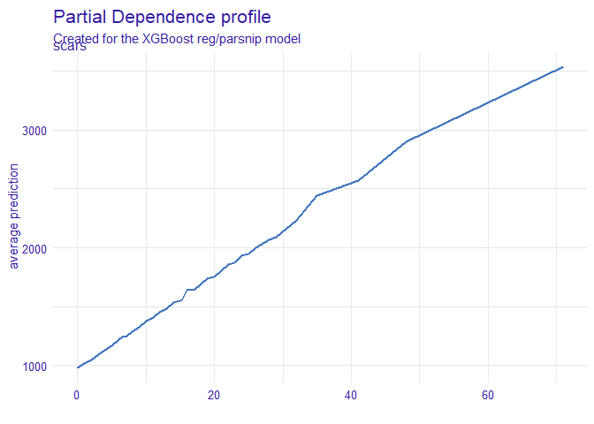

```r
require(tidyverse)
require(magrittr)
require(tidymodels)
require(DALEX)
require(iBreakDown)
```


```r
str(dragons)
>  'data.frame':	2000 obs. of  8 variables:
>   $ year_of_birth       : num  -1291 1589 1528 1645 -8 ...
>   $ height              : num  59.4 46.2 49.2 48.3 50 ...
>   $ weight              : num  15.3 11.8 13.3 13.3 13.1 ...
>   $ scars               : num  7 5 6 5 1 2 3 7 6 32 ...
>   $ colour              : Factor w/ 4 levels "black","blue",..: 4 4 4 3 4 4 1 2 4 4 ...
>   $ year_of_discovery   : num  1700 1700 1700 1700 1700 1700 1700 1700 1700 1700 ...
>   $ number_of_lost_teeth: num  25 28 38 33 18 20 28 29 2 22 ...
>   $ life_length         : num  1368 1377 1604 1434 985 ...

fit_xgb <- boost_tree("regression") %>%
  set_engine("xgboost") %>%
  fit(life_length ~ ., data = dragons)
```


```r
explain_xgb <- DALEX::explain(
  model = fit_xgb, 
  data = dragons_test,
  y = dragons_test$life_length,
  label = "XGBoost reg/parsnip"
)
>  Preparation of a new explainer is initiated
>    -> model label       :  XGBoost reg/parsnip 
>    -> data              :  1000  rows  8  cols 
>    -> target variable   :  1000  values 
>    -> predict function  :  yhat.model_fit  will be used (  default  )
>    -> predicted values  :  numerical, min =  543.024 , mean =  1360.134 , max =  3482.104  
>    -> residual function :  difference between y and yhat (  default  )
>    -> residuals         :  numerical, min =  -451.9162 , mean =  76.0022 , max =  781.7332  
>    -> model_info        :  package parsnip , ver. 0.0.4 , task regression (  default  ) 
>    A new explainer has been created! 
```

## variable_importance


```r
explain_xgb %>% variable_importance() %>% plot()
```

<!-- -->

## PDplot


```r
explain_xgb %>% single_variable(variable = "scars", type = "pdp") %>% plot()
```

<!-- -->

## ALE plot


```r
# install.packages("ALEPlot", dependencies = TRUE)
explain_xgb %>% single_variable(variable = "scars", type = "ale") %>% plot()
```

<!-- -->

## local_attributions


```r
explain_xgb %>% 
  local_attributions(new_observation = dragons_test[1, ]) %>% 
  plot()
```

<!-- -->

```

